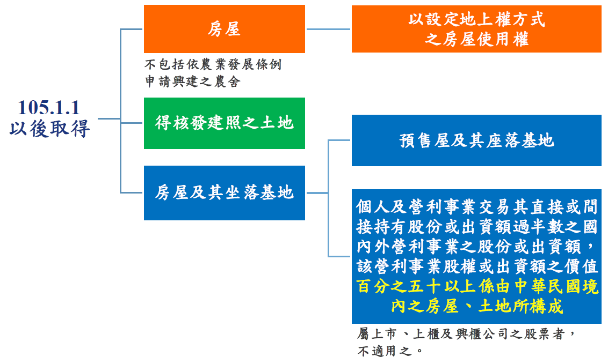

# 房地合一所得稅「免納(徵)」、「非課稅範圍」及「無所得」之釐清,曾榮耀老師
            

    ## 文章資訊
    - 文章編號：913820
    - 作者：蘇偉強
    - 發布日期：2025/05/13
    - 關鍵詞：所得稅、免納(徵)、非課稅範圍、無所得、房地合一
- 爬取時間：2025-05-d 16:35:26
    - 原文連結：[閱讀原文](https://real-estate.get.com.tw/Columns/detail.aspx?no=913820)

    ## 內文
    「免納(徵)」、「非課稅範圍」及「無所得」是不同情況，茲整理說明如下：

• 一、免納(徵)

考量特殊政策目的或公共利益，而直接規範特殊情形免納所得稅，但可能還是需要向國稅局申報(自住)。

根據所得稅法第4條之5，房屋、土地有下列情形之一者，免納所得稅： (一) 個人與其配偶及未成年子女符合下列規定之自住房屋、土地，其免稅所得額，以計算之餘額不超過四百萬元為限：

1. 個人或其配偶、未成年子女辦竣戶籍登記、持有並居住於該房屋連續滿六年。

2. 交易前六年內，無出租、供營業或執行業務使用。

3. 個人與其配偶及未成年子女於交易前六年內未曾適用本款規定。

• (二) 符合農業發展條例第37條及第38條之1規定得申請不課徵土地增值稅之土地。 (三)被徵收或被徵收前先行協議價購之土地及其土地改良物。 (四)尚未被徵收前移轉依都市計畫法指定之公共設施保留地。

• 二、非課稅範圍

非房地合一所得稅課徵範圍，亦即完全不需要申報，因為與房地合一稅無關。 房地合一稅課徵範圍如下：

[圖片1]

因此，如夫妻贈與、不動產信託等，只要不是於105年後取得並出售或交換，則與房地合一稅之課徵無關。

• 三、無所得

指根據所得稅法之計算公式算完後，所得為零或負（虧損），仍須申報，但繳納單為0，此與特殊情形之「免納(徵)」概念並不相同。

## 文章圖片

    ---
    *注：本文圖片存放於 ./images/ 目錄下*
    