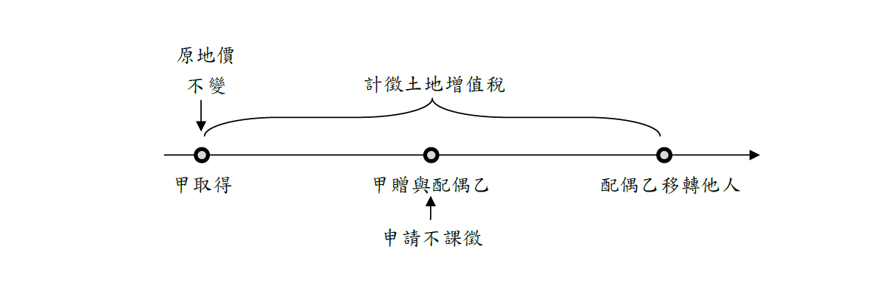

# 配偶相互贈與得申請不課徵之概念,曾榮耀老師
            

    ## 文章資訊
    - 文章編號：913968
    - 作者：蘇偉強
    - 發布日期：2025/06/03
    - 關鍵詞：配偶、贈與、土地增值稅
- 爬取時間：2025-06-d 19:47:24
    - 原文連結：[閱讀原文](https://real-estate.get.com.tw/Columns/detail.aspx?no=913968)

    ## 內文
    • (一) 情形

配偶相互贈與之土地，得申請不課徵土地增值稅(土稅§28-2 I前段)。主要是基於配偶為生活共同體，且於一般生活事務相互代理，故相互贈與土地可能是考量家庭財產安排，而非為獲取土地自然增值利益，因而得按其需求申請不課徵。

又應特別注意者，配偶相互贈與土地非當然不課徵土地增值稅，而是可由當事人自行選擇。但無論是否申請不課徵，均須申報移轉現值。

• (二) 原地價認定

於再移轉依法應課徵土地增值稅時，以該土地第一次不課徵土地增值稅前之原規定地價或最近一次課徵土地增值稅時核定之申報移轉現值為原地價，計算漲價總數額，課徵土地增值稅(土稅§28-2 I後段)。換言之，以第一次不課徵前原地價計算土地漲價總數額，原不課徵之土地增值稅，實質上已予補徵，政府稅收並未減少，僅發生延遲課徵效果。

概念如下圖所示，甲取得土地後，因特殊考量而將該筆土地贈與配偶乙，並申請不課徵土地增值稅，則該次移轉即不計算也不繳納土地增值稅，故原地價也不予調整，待配偶乙移轉他人需課徵土地增值稅時，則以甲取得至乙移轉他人此段期間之土地漲價計算，而非以乙取得為原地價。

[圖片1]

值得注意的是，雖然此次配偶間移轉得暫不課徵，惟將租稅時機往後遞延，多年後再將土地移轉給第三人時，反而可能會適用比原先選擇「課徵」時的稅率還高，因為公告土地現值一般多逐年調高，選擇不課徵未必有利。

• (三) 配偶合併認定

1. 於再移轉計課土地增值稅時，贈與人或受贈人於其具有土地所有權之期間內，有支付改良土地之改良費用或增繳之地價稅者，準用減除或抵繳規定(土稅§28-2 II前段)，避免原贈與人(夫)有支付土地改良費用及增繳地價稅，但於贈與給受贈人(妻)後，反而不能減除之不合理情形。

2. 其為經重劃之土地，準用其減徵規定(土稅§28-2 II中段)。舉例而言，某甲參與市地重劃後配回之土地贈與妻乙，嗣後妻乙再將該土地出售於丙。乙得否適用重劃後第一次移轉之土地增值稅減徵規定？其情形應分述如下： (1)甲乙贈與有申請不課徵土地增值稅 因有申請不課徵，該次租稅遞延，故非屬重劃後第一次移轉之情形。因此，當乙再將土地出售於丙，仍得適用土地增值稅減徵百分之四十。 (2)甲乙贈與未申請不課徵土地增值稅 因未申請不課徵，該次贈與移轉即屬重劃後第一次移轉之情形，乙的土地增值稅得予減徵百分之四十。惟當乙再將土地出售於丙，即無土地增值稅之減徵。

3. 該項再移轉土地，於申請適用自用住宅稅率課徵土地增值稅時，其出售前一年內未曾供營業使用或出租之期間，應合併計算(土稅§28-2 II後段)。例如夫持有5個月皆未營業或出租，後贈與給妻，則妻原則上只要再持有7個月無營業或出租，兩者合計滿一年即可符合規定。

## 文章圖片

    ---
    *注：本文圖片存放於 ./images/ 目錄下*
    