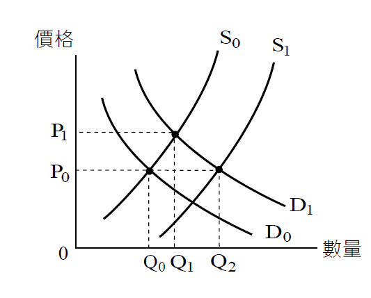
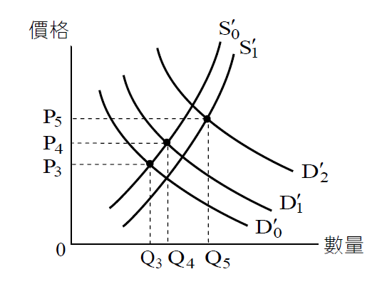

# 不動產市場(二),許文昌老師
            

    ## 文章資訊
    - 文章編號：914294
    - 作者：許文昌
    - 發布日期：2025/08/07
    - 關鍵詞：不動產市場、市場失靈、財貨市場、供需機制
- 爬取時間：2025-08-d 18:59:06
    - 原文連結：[閱讀原文](https://real-estate.get.com.tw/Columns/detail.aspx?no=914294)

    ## 內文
    • (三) 不動產市場易發生市場失靈現象：

所謂市場失靈，指市場無法藉由其供需機制解決價格高漲問題。茲就一般財貨市場與不動產市場加以比較：

1. 一般財貨市場：如圖①所示，D0表示消費者對龍鬚菜之需求曲線，S0表示生產者（即農民）對龍鬚菜之供給曲線。由D0與S0之交點決定龍鬚菜之市場價格P0及市場交易量Q0。今，有一篇頗具權威性之醫學報告，指出龍鬚菜富含抗氧化因子。因而，市場上出現搶購龍鬚菜之熱潮，龍鬚菜之需求曲線由D0右上移至D1，龍鬚菜之市場價格由P0上漲至P1，市場交易量由Q0增加至Q1。此時，生產者發現龍鬚菜價格上漲，種植龍鬚菜有利可圖，因此大量種植龍鬚菜，致使龍鬚菜供給曲線由S0右下移至S1，龍鬚菜之市場價格由P1回跌至P0，市場交易量由Q1再增加至Q2。由此可知，龍鬚菜市場可藉由其供需機制，解決其價格高漲問題。

[圖片1]

圖① 龍鬚菜之市場運作

2. 不動產市場：如圖②所示， D’0表示消費者對住宅之需求曲線，S’0表示生產者（即建設公司）對住宅之供給曲線。由D’0與S’0之交點決定住宅之市場價格P3及市場交易量Q3。今，政府鼓勵台商回流，衍生對住宅需求增加，住宅需求曲線由D’0右上移至D’1，住宅之市場價格由P3上漲至P4，市場交易量由Q3增加至Q4。此時，市場產生投機氛圍，不動產投機需求滋生，致使住宅需求曲線再由D’1大幅右上移至D’2。然而，生產者購買土地投資興建住宅，需要大量資本，因而住宅供給增加有限，住宅供給曲線小幅由S’0右下移至S’1。住宅市場價格再由P4上漲至P5，市場交易量再由Q4增加至Q5。由此可知，住宅市場無法藉由其供需機制，解決價格高漲問題。

[圖片2]

圖② 住宅市場之市場運作

總之，一般財貨市場可藉由其本身供需機制，解決價格高漲問題，但不動產市場無法藉由其本身供需機制，解決價格高漲問題。因此，不動產市場需靠政府干預，抑制投機需求，始克平息不動產價格高漲。如中央銀行於民國113年9月19日祭出第七波選擇性信用管制，房價立即冷卻下來，即是著例。

## 文章圖片

    ---
    *注：本文圖片存放於 ./images/ 目錄下*
    