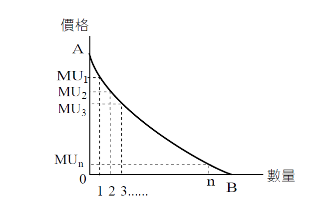

# 非市場價值之估價方法,許文昌老師
            

    ## 文章資訊
    - 文章編號：914295
    - 作者：許文昌
    - 發布日期：2025/08/14
    - 關鍵詞：非市場價值、旅遊成本法、特徵價格法、條件評價法
- 爬取時間：2025-08-d 18:59:06
    - 原文連結：[閱讀原文](https://real-estate.get.com.tw/Columns/detail.aspx?no=914295)

    ## 內文
    非市場價值（如自然資源、環境資源、遊憩資源、古遺文化資源等）之估價方法有旅遊成本法、特徵價格法及條件評價法等三種。

• (一) 旅遊成本法：利用旅遊者之願付價格（包括交通成本、門票費、住宿費、餐飲費、時間成本等），建立旅遊者對旅遊地點之旅遊需求曲線。此需求曲線所涵蓋之面積，即為該不動產之非市場價值。如圖所示，需求曲線AB是由邊際效用（MU）所導出，需求曲線即是邊際效用曲線。第1單位之邊際效用為MU1，第2單位之邊際效用為MU2，第3單位之邊際效用為MU3，……，第n單位之邊際效用為MUn。

• M. U1 + MU2 + MU3 … + MUn = TU 其中： TU：總效用。 TU即圖中△0AB之面積，亦即非市場價值。

1. 優點：結合旅遊地點之消費市場，可以具體衡量非市場價值。

2. 缺點：對未開放觀光旅遊之資源，難以適用。

[圖片1]

• (二) 特徵價格法：當市場上類似不動產成交時，以迴歸模型衡量不動產各種屬性（即特徵）對該不動產價格之貢獻。例如：

• P. = a + b1X1 + b2X2 + b3X3 + … + bnXn + e 其中： P：不動產價格（即因變數）。 a：縱軸截距（即常數項）。 bi , i = 1, 2, 3, …, n：迴歸係數。 Xi , i = 1, 2, 3, …, n：不動產各項特徵（即自變數），如交通條件、芬多精含量、負離子含量、物種多樣性、獨特性與不可替代性、相關服務設施（如住宿、停車等）。

1. 優點：以實際成交價格（即樣本），推求勘估標的價格，具有客觀性及市場性。

2. 缺點：實際成交價格取得不易，且樣本數太少。

• (三) 條件評價法：藉由問卷之設計及訪問，探求受訪者保留該不動產所願意支付之最高給付價格，或失去該不動產所願意接受之最低補償價格。以此最高給付價格或最低補償價格衡量該不動產之非市場價值。

1. 優點：可以廣泛應用於非市場價值之評估。

2. 缺點：屬於心理層面之主觀價值，而非市場層面之客觀價格。

## 文章圖片

    ---
    *注：本文圖片存放於 ./images/ 目錄下*
    