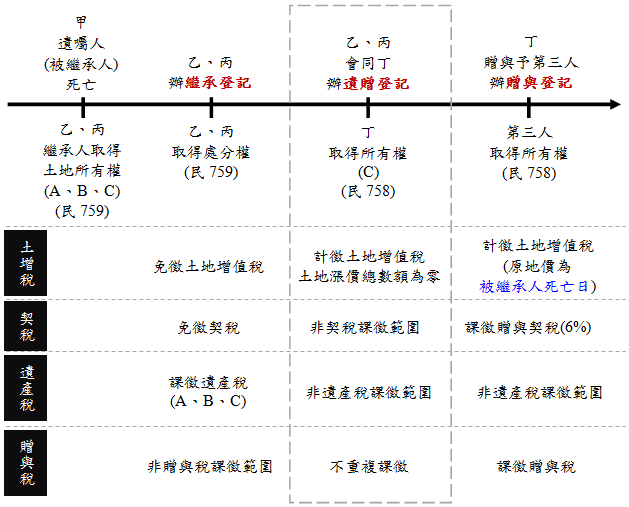

# 合併文章：遺贈之稅負

## 遺贈之稅負,許文昌老師
- 文章編號：419491
- 發布日期：2020/08/20

## 文章資訊
- 文章編號：419491
- 作者：許文昌
- 發布日期：2020/08/20
- 爬取時間：2025-02-02 20:58:44
- 原文連結：[閱讀原文](https://real-estate.get.com.tw/Columns/detail.aspx?no=419491)

## 內文
所稱遺贈，指遺贈人生前立遺囑，就不動產贈予受遺贈人；俟遺贈人死亡時，發生效力之法律行為。因此，遺贈人死亡後，就遺贈不動產移轉之稅負說明如下：

首先，以繼承人及受遺贈人為遺產稅之納稅義務人（遺§6Ⅰ②），繳稅後辦理繼承登記於繼承人名下。繼承移轉僅課徵遺產稅，免徵土地增值稅及契稅。

接著，以受遺贈人為土地增值稅之納稅義務人（土稅§5Ⅰ②），繳稅後辦理所有權移轉登記於受遺贈人名下。因繼承取得之土地再行移轉之原地價以繼承開始時該土地之公告現值（土稅§31Ⅱ），而遺贈土地申報移轉現值之審核標準以遺贈人死亡日當期之公告現值為準（土稅§30Ⅰ③）。辦理遺贈所有權移轉登記時，倘所申報之移轉現值為遺贈人死亡日當期之公告現值（即繼承開始時該土地之公告現值），則土地增值稅為零；倘所申報之移轉現值高於遺贈人死亡日當期之公告現值（即繼承開始時該土地之公告現值），則就其差額計算土地漲價總數額，課徵土地增值稅。

值得一提的是，遺贈所有權移轉僅課徵土地增值稅，不徵贈與稅及契稅。因為遺贈非屬贈與，故不徵贈與稅。又，遺贈非屬契稅之課徵時機（契稅之課徵時機僅買賣、贈與、占有、設典、交換、分割等六種），故不徵契稅。

---
*注：本文圖片存放於 ../articles/images/ 目錄下*

## 遺贈之稅負,曾榮耀老師
- 文章編號：409940
- 發布日期：2017/10/12

## 文章資訊
- 文章編號：409940
- 作者：曾榮耀
- 發布日期：2017/10/12
- 爬取時間：2025-02-02 20:26:29
- 原文連結：[閱讀原文](https://real-estate.get.com.tw/Columns/detail.aspx?no=409940)

## 內文
遺贈之稅負,曾榮耀老師

各位同學雙十連假愉快

剛好有同學問到遺贈相關稅負問題，本週專欄就幫各位予以釐清觀念：

試擬考題：甲死亡留有A、B、C三筆不動產，其遺囑當中寫明其中C不動產贈與給丁，且該遺贈不影響繼承人乙、丙之特留分。試問如何辦理遺贈登記？以及所涉及之相關稅負為何？

一、遺贈之意義（民法考試範圍）

首先，遺贈係遺囑人以遺囑方式，將其財產無償給予受遺贈人之法律行為，其性質為單獨行為、死後行為、要式行為，且最重要是不得侵害特留分。

依民法第1199條規定，遺囑自遺囑人死亡時發生效力，以及民法第759條，遺囑人同時為被繼承人，因繼承人於繼承時登記前已取得不動產物權，應經登記，始得處分其物權。因此，乙、丙繼承時取得A、B、C三筆不動產所有權，但應辦理繼承登記後，方能再作另一處分行為，即遺贈，並完成遺贈登記後，丁才取得所有權（民758登記生效）。

二、遺贈登記（土登考試範圍）

遺贈登記係於遺囑人死亡辦理繼承登記後檢附遺囑，以及其他相關文件，向該管登記機關申辦土地權利移轉所為之登記。

根據土地登記規則第123條之規定，受遺贈人申辦遺贈之土地所有權移轉登記，應由繼承人先辦繼承登記後，由繼承人會同受遺贈人申請之；如遺囑另指定有遺囑執行人時，應於辦畢遺囑執行人及繼承登記後，由遺囑執行人會同受遺贈人申請之。前項情形，於繼承人因故不能管理遺產亦無遺囑執行人時，應於辦畢遺產清理人及繼承登記後，由遺產清理人會同受遺贈人申請之。第一項情形，於無繼承人或繼承人有無不明時，仍應於辦畢遺產管理人登記後，由遺產管理人會同受遺贈人申請之。倘若繼承人（乙、丙）遲遲不辦繼承登記，將影響受遺贈人丁之權益，丁得以訴訟方式促使繼承人辦理之。

此外，遺贈登記應備文件：

1. 登記申請書

2. 登記原因證明文件：遺囑

3. 權利書狀

4. 申請人身份證明文件：遺贈人死亡時之戶籍謄本及受遺贈人現在之身分證明

5. 其他：如委託書、土地增值稅繳納或免稅或不課徵證明

三、遺贈登記之稅負（土稅考試範圍）

遺贈相關之土地所有權變動情形如下圖所示，至少有四個時機點要注意，其中稅負發生於辦理登記的三個時點。以下特別說明，繼承人乙、丙於辦完繼承登記後，會同丁去辦遺贈登記時之相關稅負。

[圖片1]

(一)土地增值稅：零

應以受遺贈人為納稅義務人申報土地增值稅。

1. 本次移轉現值：繼承人乙、丙與丁會同辦遺贈登記時，其所申報之移轉現值。其標準係按遺贈之土地，以遺贈人死亡日當期之公告土地現值為準（土稅§30）。

2. 前次移轉現值：繼承開始時該土地之公告土地現值。（土稅§31II）

由於兩者為同一日，故土地漲價總數額為0，土地增值稅應納稅額為0。

(二)契稅：非課稅範圍

依財政部60年財稅第36479號令釋，因遺贈而取得不動產所有權，已依遺產稅法之規定申報繳納遺產稅，為免就同一移轉財產行為重複課徵，故免徵契稅。此外，契稅條例第2條規定，不動產之買賣、承典、交換、贈與、分割或占有而取得所有權者，均應申報繳納契稅。而遺贈取得房屋所有權，並非上述六種之情形，自非屬契稅課稅對象。

(三)贈與稅：屬遺產稅課徵範圍，不重複課稅

遺贈之財產仍屬於遺產，故應就遺贈財產課徵遺產稅。根據遺產及贈與稅法第6條第一項第二款規定，遺產稅之納稅義務人，無遺囑執行人者，為繼承人及受遺贈人，顯示該遺贈不動產已為遺產稅課徵對象。因此，贈與稅既為遺產稅的補充稅，而C不動產已課徵過遺產稅，故遺贈登記時不再針對該不動產課徵贈與稅。

## 文章圖片

---
*注：本文圖片存放於 ../articles/images/ 目錄下*

