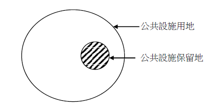

# 合併文章：公共設施保留地之意涵

## 公共設施保留地之意涵,許文昌老師
- 文章編號：912425
- 發布日期：2024/09/12

## 文章資訊
- 文章編號：912425
- 作者：許文昌
- 發布日期：2024/09/12
- 爬取時間：2025-02-02 19:30:11
- 原文連結：[閱讀原文](https://real-estate.get.com.tw/Columns/detail.aspx?no=912425)

## 內文
公共設施保留地之認定，關係租稅優惠，影響人民權益甚鉅。

(一)公共設施保留地之意義：公共設施保留地係指都市計畫事先指定之公共設施用地，保留供政府機關或各事業機構日後取得。所謂公共設施用地，指都市計畫法第42條第1項規定之公共設施（如道路、公園、學校、市場等），所使用之土地。公共設施用地涵括公共設施保留地，其關係如下圖所示。

[圖片1]

(二)公共設施保留地之認定：

1. 業經各級政府或鄉、鎮、縣轄市公所或各事業機構依法取得之公共設施用地，非屬公共設施保留地。

2. 經各級政府或鄉、鎮、縣轄市公所或各事業機構興闢使用，但尚未依法取得之公共設施用地，仍屬公共設施保留地。

3. 獎勵私人投資興闢之公共設施用地，在未核准私人或團體投資辦理前，仍屬公共設施保留地；經核准私人或團體投資辦理後，始非屬公共設施保留地。其須申領使用執照者，於取得使用執照前，仍屬公共設施保留地；於取得使用執照後，始非屬公共設施保留地。

4. 下列非屬公共設施保留地： (1)經都市計畫法第30條規定所訂辦法核准由私人或團體投資興辦之公共設施用地。 (2)依都市計畫法第61條第2項規定，已由私人或團體於舉辦新市區建設範圍內，自行負擔經費興建之公共設施用地。 (3)配合私人或團體舉辦公共設施、新市區建設、舊市區更新等實質建設事業劃設，並指明由私人或團體取得興闢之公共設施用地。（87.6.30台內營字第8772176號）

5. 都市計畫法第42條第1項第1款所稱之河道，係指依同法第3條就都市重要設施作有計畫之發展，而合理規劃所設置之河道而言。至於因地勢自然形成之河流，及因之而依水利法公告之原有「行水區」，雖在都市計畫使用區之範圍，仍不包括在內（司法院釋字第326號解釋）。

## 文章圖片

---
*注：本文圖片存放於 ../articles/images/ 目錄下*

## 公共設施保留地之減免,曾榮耀老師
- 文章編號：412002
- 發布日期：2018/04/26

## 文章資訊
- 文章編號：412002
- 作者：蘇偉強
- 發布日期：2018/04/26
- 爬取時間：2025-02-02 20:33:37
- 原文連結：[閱讀原文](https://real-estate.get.com.tw/Columns/detail.aspx?no=412002)

## 內文
今日專欄整理有關公共設施保留地之相關土地稅減免情形，請參考下表：

稅目

減免情形

依據

地價稅

1.作自用住宅＝2‰2.非作自用住宅＝6‰3.其未作任何使用並與使用中之土地隔離者，免徵地價稅

土地稅法第19條

土地增值稅

1.尚未被徵收前移轉，免徵 2. 被徵收，免徵

土地稅法第39條

房地合一稅(所得稅)

1.尚未被徵收前移轉，免納 2.被徵收，免納

所得稅法第4-5條第1項第3款、第4款

遺產稅

因繼承而移轉，免徵

都市計畫法第50條之1

贈與稅

因配偶、直系血親間之贈與而移轉，免徵

都市計畫法第50條之1

---
*注：本文圖片存放於 ../articles/images/ 目錄下*

