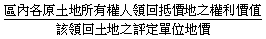

---
categories:
- Real Estate
- 市地重劃
- 區段徵收
date: 2017-11-23
tags:
- 市地重劃
- 區段徵收
title: 參加市地重劃分回土地面積與參加區段徵收分回土地面積之比較
---

## 內文
土地所有權人參加市地重劃分回土地面積之計算方法詳如市地重劃實施辦法第29條附件。土地所有權人參加區段徵收分回土地面積之計算方法詳如土地徵收條例施行細則第50條附件。二者之公式頗為複雜，常困擾學生，因此筆者將其公式簡化，以利學習。

• (一) 市地重劃：參加市地重劃，原所有權人應負擔之項目，包括臨街地特別負擔、一般負擔及費用負擔等三項。實施市地重劃時，原所有權人應分配面積之計算方法簡化如下：

1. 重劃前後宗地地價上漲率(A)=[圖片1]

2. 重劃區一般負擔係數(B)=[圖片2]

3. 重劃區費用負擔係數(C)=[圖片3]

4. 各宗土地重劃後應分配之面積(D)=[重劃前原有之宗地面積×[圖片4]－臨街地特別負擔]×[圖片5]

• (二) 區段徵收：土地徵收條例第44條第1項第1款規定，被徵收土地所有權人領回抵價地之面積，由該管直轄市或縣（市）主管機關按其應領地價補償費與區段徵收補償地價總額之比率計算其應領之權利價值，並以實際領回抵價地之單位地價折算之。準此，實施區段徵收時，假定區段徵收範圍內無農地重劃區，原所有權人領回抵價地面積之計算方法簡化如下：

1. 全區預計抵價地面積=全區之徵收土地總面積×抵價地比例（40%~50%）

2. 預計抵價地總地價=Σ規劃供抵價地分配之各分配街廓面積×各該分配街廓評定之單位地價

3. 區內各原土地所有權人領回抵價地之權利價值=[圖片6]

4. 各原土地所有權人領回抵價地之面積=[圖片7]

• (三) 比較：

1. 市地重劃分配土地之概念，係先就重劃全區面積扣除公共設施用地負擔與費用負擔後，再按地價比例分配給各原所有權人；因此，市地重劃屬於政府與地主共同開發土地，地主分擔公共設施用地及重劃費用，並分享開發利益。區段徵收分配土地之概念，係先就徵收全區土地乘以抵價地比例，再按徵收補償地價比例分配給各原所有權人；因此，區段徵收一方面地主失去土地，另一方面地主分享土地開發與地目變更之利益。

2. 市地重劃分回土地之計算公式較合理。區段徵收分回土地之計算公式中，有關抵價地比例(現行規定40%~50%)欠缺理論根據，失之武斷。

3. 市地重劃分回土地最少55%，區段徵收分回土地最少40%，最多50%。故市地重劃分回土地較多，區段徵收分回土地較少。

4. 實施市地重劃，地主分回土地只享有土地開發之漲價利益，未享有地目變更之漲價利益。實施區段徵收，地主分回土地享有土地開發與地目變更之雙重漲價利益。

5. 市地重劃分回土地較多，但開發後土地漲價較少，漲價主要來自於土地改良，故較無暴利存在。區段徵收分回土地較少，但開發後土地漲價較多，常有暴利存在；暴利主要來自於地目變更，因而滋生官商勾結、炒作土地。

## 文章圖片

## 文章圖片

## 文章圖片

---
*注：本文圖片存放於 ./images/ 目錄下*