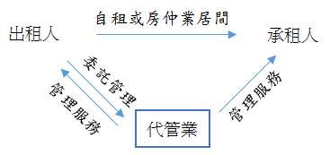
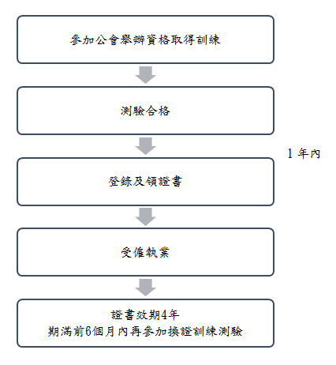

---
categories:
- Real Estate
- 租賃住宅服務業
- 租賃住宅
date: 2018-08-23
slug: '413072'
tags:
- 租賃住宅服務業
- 租賃住宅
title: 租賃住宅服務業
---

## 內文
各位同學好

今日專欄主要為各位說明「租賃住宅市場發展及管理條例」（107.6.27施行）中有關「租賃住宅服務業之相關規定」與經紀人證照考試科目中「不動產經紀相關法規」有關，記得準備！

• (一) 租賃住宅服務業

1. 意義指租賃住宅代管業及租賃住宅包租業。

1. 租賃住宅代管業（代管業）：指受出租人之委託，經營租賃住宅管理業務（代管業務）之公司。*即 房東委託業者管理。

[圖片1]

2. 租賃住宅包租業（包租業）：指承租租賃住宅並轉租，及經營該租賃住宅管理業務（以下簡稱包租業務）之公司。*即 房東出租給業者（業者擔任二房東）

[圖片2]

管理業務內容包含：屋況與設備點交、收租及押金管理、日常修繕維護、糾紛協調處理

2. 積極資格（申請程序）

[圖片3]

3. 負責人消極資格

1. 破產宣告未復權

2. 票據拒絕往來未期滿

3. 開始清算未復權

4. 無行為能力、限制行為能力，或受監護或輔助宣告未撤銷

5. 曾犯詐欺、背信、侵占、搶奪、強盜、恐嚇及擄人勒贖罪等經受有期徒刑一年以上刑之宣告確定，尚未執行、執行未畢、執行完畢或赦免後未滿三年

6. 曾經營租賃住宅服務業，經撤銷或廢止許可，未滿一年。

4. 業務與責任

1. 代管業

1. 營業處所揭示合法經營文件

2. 簽訂委託管理契約書始得執業

3. 重要文件專任人員簽章（委管契約、點交、收據、退租證明）

4. 損害賠償責任

5. 營業保證金代償

6. 報送受託管理租賃住宅資訊

2. 包租業

1. 營業處所揭示合法經營文件

2. 簽訂住宅租賃契約始得刊登廣告及執業

3. 廣告內容真實，註明業者名稱

4. 提供標的現況確認書，出租人同意轉租文件

5. 重要文件專任人員簽章(租賃契約、現況確認書、點交、收據、退租證明)

6. 出租人提前終止租約，協調返還住宅並協助次承租人租屋事宜

7. 損害賠償責任，營業保證金代償

8. 報送承租與轉租租賃住宅資訊

• (二) 租賃住宅管理人員

1. 意義指租賃住宅服務業依本條例規定所置從事代管業務或包租業務之人員。

2. 積極資格

[圖片4]

3. 消極資格

1. 無行為能力、限制行為能力，或受監護或輔助宣告未撤銷。

2. 曾犯詐欺、背信、侵占、搶奪、強盜、恐嚇及擄人勒贖罪等經受有期徒刑一年以上刑之宣告確定，尚未執行、執行未畢、執行完畢或赦免後未滿三年。

## 文章圖片

