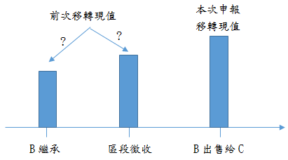

---
categories:
- Real Estate
- 土地增值稅
date: 2019-09-19
slug: '416498'
tags:
- 土地增值稅
title: 土地增值稅原地價認定問題
---

## 內文
各位同學好

今日專欄為各位同學說明一下有關土地增值稅計算之問題

假設情境：

1. 地主A死亡後，B繼承。適用法條：依土地稅法規定，因繼承而移轉之土地，免徵土地增值稅。

2. B持有兩年後該土地被劃入區段徵收範圍，並辦理區段徵收完成，B選擇領回抵價地。適用法條：依土地稅法規定，區段徵收之土地領回抵價地後第一次移轉時，應以原土地所有權人實際領回抵價地之地價為原地價，計算漲價總數額，課徵土地增值稅。

3. B領回抵價地後再經過2年，出售給C。適用法條：因繼承取得之土地再行移轉者，其原地價係指繼承開始時該土地之公告現值。

問題今B出售時，計算土地增值稅時，其原地價（前次移轉現值）究竟是B繼承時的公告土地現值或是區段徵收時的領回抵價地地價。

如下圖：

[圖片1]

答案繼承前依第三十條之一第三款規定領回區段徵收抵價地之地價，高於繼承開始時該土地之公告現值者，應從高認定。（土地稅法第31條）理由係繼承前領回之區段徵收抵價地，其發回價格係政府所定，且價格通常高於公告現值，然而繼承後再行移轉時，財政部相關函釋均認為已非屬區段徵收領回抵價地後之第一次移轉，除不適用減徵土地增值稅之規定外，其土地增值稅計算仍以繼承時公告現值為準，造成民眾雙重不利益，不符原立法精神。因此，但書規定，繼承前依規定領回區段徵收抵價地之地價高於繼承開始時該土地公告現值者，其計算基準應從高認定。

## 文章圖片

