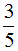
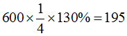

---
categories:
- Real Estate
date: 2020-05-14
slug: '418522'
tags: []
title: 土地分割及土地合併之土地增值稅
---

## 內文
土地分割及土地合併之土地增值稅課徵，規定於平均地權條例施行細則第65條及土地稅法施行細則第42條。

• (一) 土地分割：分別共有土地分割後，各人所取得之土地價值與其分割前應有部分價值相等者，免徵土地增值稅；其價值減少者，就其減少部分課徵土地增值稅（土地稅法施行細則§42Ⅱ）。

例如：甲、乙二人共有一宗土地，公告土地現值1,000萬元，土地持分各二分之一。該土地分割為A、B二宗土地，甲取得A地，公告土地現值500萬元；乙取得B地，公告土地現值500萬元。甲、乙二人各應繳納多少土地增值稅？（甲、乙二人均不課徵土地增值稅）

例如：甲、乙二人共有一宗土地，公告土地現值1,000萬元，土地持分各二分之一，甲之前次移轉現值250萬元，乙之前次移轉現值400萬元；甲之前次移轉至本次移轉之物價指數120%，乙之前次移轉至本次移轉之物價指數110%。該土地分割為A、B二宗土地，甲取得A地，公告土地現值200萬元；乙取得B地，公告土地現值800萬元。甲、乙二人各應繳納多少土地增值稅？（若受有補償，甲繳納A地土地增值稅24萬元；若未受補償，乙繳納A地土地增值稅24萬元）

計算過程如下：土地分割後，甲分得之土地價值減少300萬元。

1. 前次移轉現值：[圖片1]

2. 本次移轉現值：300

3. 土地漲價總數額：300-180=120

4. 土地增值稅：120x20%=24

倘受有補償，屬於有償移轉，應向原所有權人課徵土地增值稅，因此甲應繳納土地增值稅24萬元。倘未受補償，屬於無償移轉，應向取得所有權人課徵土地增值稅，因此乙應繳納土地增值稅24萬元。

附帶說明的是，分割屬於財產之移動，如以顯著不相當之代價，讓與財產，其差額部分，以贈與論（遺產及贈與稅法§5②）。準此，倘乙有給付300萬元之差額，則無贈與稅；倘乙未給付300萬元之差額，等同甲贈與300萬元予乙，因此贈與人甲應繳納贈與稅。

【註】分割後，甲應分得500萬元，但實際分得200萬元。換言之，甲將300萬元售出或贈與。售出或贈與之比例為[圖片2]，即[圖片3]

• (二) 土地合併：土地合併後，各共有人應有部分價值與其合併前之土地價值相等者，免徵土地增值稅。其價值減少者，就其減少部分課徵土地增值稅（土地稅法施行細則§42Ⅳ）。

例如：甲擁有A地，公告土地現值1,000萬元；乙擁有B地，公告土地現值500萬元。A、B二宗土地合併後，甲取得合併後土地之應有部分三分之二，乙取得合併後土地之應有部分三分之一。甲、乙二人各應繳納多少土地增值稅？（甲、乙二人均不課徵土地增值稅）

例如：甲擁有A地，公告土地現值1,000萬元，前次移轉現值600萬元，前次移轉至本次移轉之物價指數130%。乙擁有B地，公告土地現值500萬元，前次移轉現值400萬元，前次移轉至本次移轉之物價指數110%。A、B二宗土地合併後，甲、乙二人取得合併後土地之應有部分各二分之一。甲、乙二人各應繳納多少土地增值稅？（若受有補償，甲繳納A地土地增值稅11萬元；若未受補償，乙繳納A地土地增值稅11萬元）

計算過程如下：土地合併後，甲分得之持分價值減少250萬元。

1. 前次移轉現值：[圖片4]

2. 本次移轉現值：250

3. 土地漲價總數額：250-195=55

4. 土地增值稅：55x20%=11

倘受有補償，應向原所有權人課徵土地增值稅，因此甲應繳納土地增值稅11萬元。倘未受補償，屬於無償移轉，應向取得所有權人課徵土地增值稅，因此乙應繳納土地增值稅11萬元。

附帶說明的是，合併屬於財產之移轉，如以顯著不相當之代價，讓與財產，其差額部分，以贈與論（遺產及贈與稅法§5②）。準此，倘乙有給付250萬元之差額，則無贈與稅；倘乙未給付250萬元之差額，等同甲贈與250萬元予乙，因此贈與人甲應繳納贈與稅。

## 文章圖片

