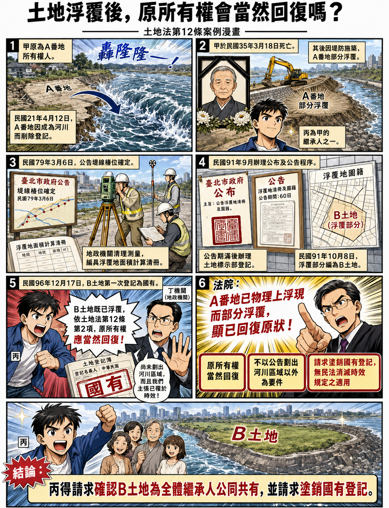

---
categories:
- Real Estate
- 土地浮覆
- 土地法第12條
- 請求國家塗銷登記
- 憲判20號
date: 2026-08-11
slug: '916086'
tags:
- 土地浮覆
- 土地法第12條
- 請求國家塗銷登記
- 憲判20號
title: 土地浮覆後，原所有權是否當然回復？—從臺灣高等法院114年度重上更一字第121號判決談土地法第12條
---

## 內文
[圖片1] 圖片來源：本專欄依據判決整理重點內容，並去識別化後，請ChatGPT生成圖片。

• 一、案例事實甲為日據時期A番地之所有權人。A番地於民國21年4月12日因成為河川而削除登記。甲嗣於民國35年3月18日死亡，丙為甲之繼承人之一。

其後，A番地因堤防施築後部分浮覆。臺北市政府於民國79年3月6日公告「防潮堤線加高工程堤線樁位」確定，地政機關並經清理測量，編具浮覆地面積計算清冊，記載A番地「流失前」與「浮覆後」之面積，並核對原圖簿資料。

嗣後，地政機關於民國91年9月間辦理公布及公告程序，並於公告期滿後辦理土地標示部登記；A番地浮覆部分於民國91年10月8日編為B土地。B土地後於民國96年12月17日第一次登記為國有。

丙主張，A番地因部分浮覆而編為B土地後，依土地法第12條第2項規定，原所有權人甲之所有權應當然回復；B土地應屬甲全體繼承人公同共有。B土地登記為國有，已妨害甲全體繼承人之所有權，故請求確認B土地為甲全體繼承人公同共有，並請求丁機關塗銷B土地之國有登記。

丁機關則抗辯：B土地雖經公告浮覆，但尚未劃出河川區域，仍屬水道，與土地法第12條第2項所稱回復原狀要件不合；又B土地自民國79年3月6日浮覆後，始終供作防汛堤防使用，丁機關已因時效取得所有權，且丙於民國111年9月30日提起本件訴訟時，其回復請求權亦已罹於時效。

試問：A番地因成為河川而削除登記，嗣後部分浮覆，經地政機關於民國91年編為B土地，並於民國96年第一次登記為國有，原所有權人甲之繼承人能否依土地法第12條第2項主張所有權當然回復，並請求確認B土地為甲全體繼承人公同共有及塗銷國有登記？

• 二、相關法條 (一)土地法第12條第1項規定，私有土地，因天然變遷成為湖澤或可通運之水道時，其所有權視為消滅。 (二)土地法第12條第2項規定，前項土地，回復原狀時，經原所有權人證明為其原有者，仍回復其所有權。 (三)民法第767條第1項中段規定，所有人對於妨害其所有權者，得請求除去之。 (四)民法第828條第2項準用第821條規定，各公同共有人對於第三人，得就公同共有物之全部為本於所有權之請求。

• 三、重要判決觀念(一)土地法第12條所稱所有權視為消滅，並非土地物理上滅失，所有權亦僅擬制消滅 土地法第12條第1項所謂私有土地因成為公共需要之湖澤或可通運之水道，其所有權視為消滅，並非土地物理上之滅失，所有權亦僅擬制消滅，當該土地回復原狀時，依同條第2項規定，原土地所有人之所有權當然回復，無待申請地政機關核准，亦不以其經公告劃出河川區域以外，及完成所有權第1次登記為要件。

• (二) 私人土地經劃入河川區域內，僅是私權行使得受限制，對所有權歸屬並無影響 又私人所有土地經劃入河川區域內，僅其私權行使得基於公共利益以法律為必要之限制，就其所有權之歸屬並無影響。

• (三) A番地已物理上浮現而部分浮覆，客觀上可具體計算面積、範圍，顯已回復原狀 B土地因堤防施築後浮覆，經臺北市政府依水利法第82條規定，於79年3月6日公告『防潮堤線加高工程堤線樁位』確定，並經清理測量編具『浮覆地面積計算清冊』記載『流失前』、『浮覆後』之面積，核對原圖簿資料無誤，於91年9月間辦理公布及公告程序，並於公告期滿辦理土地標示部之登記。 可見A番地已物理上浮現而部分浮覆，客觀上可具體計算面積、範圍與原地籍圖簿進行比對，並辦理土地標示部登記，顯已回復原狀，依上開說明，原所有權人甲之所有權當然回復，並無待地政機關核准，亦不以公告劃出河川區域以外為要件。

• (四) 日治時期為人民所有，嗣登記為國有之土地，人民請求國家塗銷登記，無民法消滅時效規定之適用 日治時期為人民所有，嗣因逾土地總登記期限，未登記為人民所有，致登記為國有且持續至今之土地，在人民基於該土地所有人地位，請求國家塗銷登記時，無民法消滅時效規定之適用。因此，甲就B土地之所有權因浮覆而當然回復，並不因逾總登記期限而受影響。 B土地登記為國有，已構成對甲全體繼承人所有權之妨害，則丙先位訴請確認其與甲之其他繼承人因繼承而公同共有B土地，及依民法第767條第1項中段、第828條第2項準用第821條規定，請求丁機關塗銷系爭登記，為有理由，並無民法消滅時效規定之適用。

• 四、本專欄說明 本件丙請求確認B土地為其與甲之其他繼承人公同共有，並請求丁機關塗銷B土地之國有登記，為有理由。

本判決認為，土地法第12條第1項所稱私有土地因成為公共需要之湖澤或可通運之水道，其所有權視為消滅，並非土地物理上滅失，所有權亦僅為擬制消滅。當土地回復原狀時，依土地法第12條第2項規定，原土地所有人之所有權當然回復，無待申請地政機關核准，亦不以經公告劃出河川區域以外為要件。

因此，B土地於民國96年12月17日第一次登記為國有，已構成對甲全體繼承人所有權之妨害。丙依民法第767條第1項中段、第828條第2項準用第821條規定，請求丁機關塗銷B土地之國有登記，為有理由，並無民法消滅時效規定之適用。

至於丁機關所為消滅時效抗辯，本判決引用憲法法庭112年憲判字第20號判決主文及最高法院113年度台上字第969號判決要旨，認為日治時期為人民所有，嗣因逾土地總登記期限未登記為人民所有，致登記為國有且持續至今之土地，在人民基於該土地所有人地位請求國家塗銷登記時，無民法消滅時效規定之適用。

值得注意的是，法務部法律字第11403512980號函，已就「浮覆地所有權回復請求權之消滅時效爭議」整理近期學說及司法實務發展：

該函先指出，最高法院110年度台上大字第1153號大法庭裁定曾認為，日據時期已登記之土地，因成為河道、水道經塗銷登記，臺灣光復後土地浮覆，原所有人如未依我國法令辦理土地總登記，該土地仍屬未登記之不動產，原所有人依民法第767條第1項規定行使物上請求權時，有民法消滅時效規定之適用。

惟憲法法庭112年憲判字第20號判決作成後，近期學說及司法實務見解就浮覆地所有權回復請求權之消滅時效爭議，多認為應依該憲法判決意旨處理。法務部函並整理學說見解指出，河川土地私有權之返還爭議，與憲判20號具有同質性，所不同者僅土地曾因自然變遷成為公共需用之湖澤或可通運之水道，然此項差異並不構成對浮覆地案件進行差別待遇之理由，而應與憲判20號作相同處理。

法務部函另整理司法實務見解指出，近年司法實務見解多援引憲判20號意旨，針對國家基於公權力主體地位行使統治高權，將人民私有未辦理登記之土地逕行登記為國有之情形，採取「國家不得為時效完成抗辯」之基礎，就人民基於浮覆之私有土地所有人地位，請求國家塗銷登記時，無民法消滅時效規定之適用。

因此，本件判決引用憲判20號處理消滅時效問題，是與近年浮覆地案件之實務趨勢相符。不過仍應注意，憲判20號原因案件與本案浮覆地之事實結構並非完全相同（可參憲判20號不同意見書及相關學者文章）；本判決係先依土地法第12條判斷B土地已回復原狀、原所有權人甲之所有權當然回復，再於丁機關抗辯消滅時效時，引用憲判20號及相關最高法院見解，認為人民基於土地所有人地位請求國家塗銷國有登記，無民法消滅時效規定之適用。

資料來源：

1. 臺灣高等法院114年度重上更一字第121號民事判決。

2. 法務部法律字第11403512980號函。

## 文章圖片

---
*注：本文圖片存放於 ./images/ 目錄下*