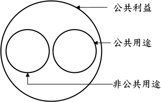

---
categories:
- Real Estate
- 土地徵收
date: 2026-08-27
slug: '916172'
tags:
- 土地徵收
title: 土地徵收之目的
---

## 內文
• (一) 現行土地徵收之用途：

1. 土地法之規定：

• (1)土地法第208條規定：「國家因左列公共事業之需要，得依本法之規定徵收私有土地。……。九、其他由政府興辦以公共利益為目的之事業。」由此可知，依土地法第208條規定，土地徵收之目的原則僅限於公共用途。

• (2)土地法第209條規定：「政府機關因實施國家經濟政策，得徵收私有土地，但應以法律規定者爲限。」由此可知，依土地法第209條規定，土地徵收之目的得為實施國家經濟政策，不限於公共用途，非公共用途亦得徵收私有土地。

綜上，土地法規定之土地徵收目的為公共利益，包括公共用途及非公共用途。

2. 土地徵收條例之規定： 土地徵收條例第3條規定：「國家因公益需要，興辦下列各款事業，得徵收私有土地；……。一○、其他依法得徵收土地之事業。」由此可知，依土地徵收條例第3條規定，土地徵收之目的為公共利益，包括公共用途及非公共用途。

總之，不論土地法或土地徵收條例，土地徵收之目的皆為公共利益，包括公共用途及非公共用途。

• (二) 公共用途與非公共用途之區別： 公共利益包括公共用途及非公共用途。如圖所示。所稱公共用途，指供公眾使用，不限定特定人使用（稅減§4）。所稱非公共用途，指供特定人使用。

[圖片1]

1. 公共用途：例如，政府徵收私人土地，開闢成公園；公園即為公共用途。又例如，政府徵收私人土地，興建高速公路；高速公路即為公共用途。 土地徵收之目的應以公共用途為主。亦即犧牲私人財產權，最後成就眾人之公共利益。

2. 非公共用途：例如，政府徵收私人土地，興建國民住宅，再將國民住宅出售給中低收入家庭；中低收入家庭（即私人）即為非公共用途。又例如，政府徵收私人土地，開發工業區，再將工業區土地出售給興辦工業人；興辦工業人（即私人）即為非公共用途。 土地徵收之目的如為非公共用途，並再出售給私人，恐造成犧牲某些私人之財產權，最後成就另一些私人之私人利益。換言之，政府以徵收手段，進行私人財富重分配。就民主國家而言，實不足取。

• (三) 結論：

1. 土地徵收是侵害私人財產權最激烈之手段。國家實施土地徵收應力求節制，避免浮濫，故應儘量以公共用途為限。至於非公共用途，政府機關為公用或公益之目的而以徵收方式剝奪人民財產權後，如續將原屬人民之財產移轉於第三人所有，易使徵收權力濫用及使人民產生圖利特定第三人之疑慮（司法院釋字第743號解釋理由書）。因此，政府徵收人民之土地，無論公共用途或非公共用途，均不宜再將其出售為私人所有。

2. 土地徵收之用途可分為下列三種：

• (1)公共用途，且未移轉於特定人。如高速公路。

• (2)非公共用途，且未移轉於特定人。如開發工業區，再將工業區土地出租給興辦工業人。

• (3)非公共用途，且移轉於特定人。如國民住宅。

土地徵收之用途，嚴格而論，應侷限於上開第(1)種情形；寬鬆而論，頂多放寬加入第(2)種情形，但應謹慎且節制為之。至於第(3)種情形，將造成土地徵收之浮濫，應避免之。

【註】 稅減：土地稅減免規則。

## 文章圖片

---
*注：本文圖片存放於 ./images/ 目錄下*