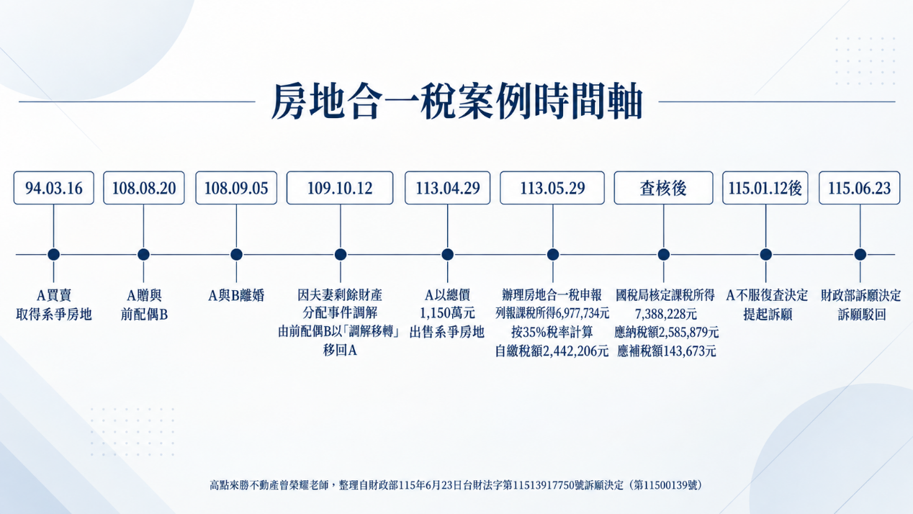
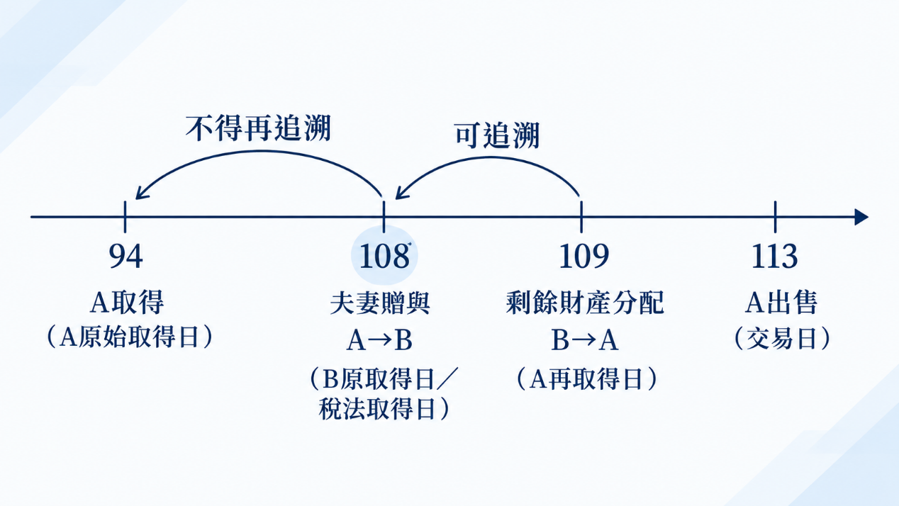

---
categories:
- Real Estate
- 房地合一稅
- 夫妻贈與
- 剩餘財產
date: 2026-10-06
slug: '916366'
tags:
- 房地合一稅
- 夫妻贈與
- 剩餘財產
title: 房子持有近20年，為何房地合一稅仍課35%？—夫妻贈與與剩餘財產分配的取得日認定
---

## 內文
各位同學好

本週專欄整理一個房地合一所得稅的訴願案，其涉及夫妻贈與+剩餘財產差額分配之取得日認定觀念，非常值得瞭解及釐清觀念，茲整理如下：

• (一) 主要爭點 A於94年買入→ A於108年贈與配偶B → A、B離婚 → B於109因剩餘財產分配將房地移轉回A → A於113年出售。

[圖片1]

就外觀而言，自A於94年取得，至A113年出售，持有近20年，故A主張：

1. 系爭房地原係A於94年買賣取得，雖經贈與B後再因剩餘財產差額分配移回A，仍應以A於94年原始取得日為取得日，適用舊制房屋交易損益規定。

2. 縱使無舊制適用，也應以夫妻持有系爭房地期間合併計算，而適用新制持有10年以上的15%稅率。

• (二) 重要規定 首先，要先注意兩個規定：

1. 財政部106年3月2日台財稅字第10504632520號令：「個人取得配偶贈與之房屋、土地，適用遺產及贈與稅法第20條第1項第6款配偶相互贈與之財產不計入贈與總額規定者，出售時應以配偶間第1次相互贈與前配偶原始取得該房屋、土地之日為取得日，據以計算持有期間及認定應適用所得稅法第14條第1項第7類規定計算房屋之財產交易損益(以下簡稱舊制房屋交易損益)或依同法第14條之4規定計算個人房屋、土地交易所得或損失(以下簡稱新制房屋土地交易損益)，並按該房屋、土地原始取得之原因，分別依所得稅法相關規定課徵所得稅。」

2. 房地合一稅申報作業要點（以下簡稱申報要點）第4點第13款有關房屋、土地取得日之認定：「配偶之一方依民法第1030條之1規定行使剩餘財產差額分配請求權取得之房屋、土地、房屋使用權、預售房地、股份或出資額，為配偶之他方原取得之日。」

• (三) 訴願決定理由 按民法第406條規定，贈與係基於當事人雙方合意，一方以自己之財產無償給與他方，他方允受之契約；同法第1030條之1規範之夫妻剩餘財產分配請求權，乃夫妻婚姻關係消滅時，由財產少的一方對多的一方請求分配差額，係為債權的行使。由此觀之，前者為契約行為，後者屬單獨行為。復按同法第1018條規定，夫或妻各自管理、使用、收益及處分其財產，且我國夫妻財產制係採分別財產制為基礎之「法定財產制」，並無將夫妻財產逕視為同一經濟實體之法律基礎(最高行政法院104年度判字第129號判決參照)。所訴夫妻為同一經濟實體，應以訴願人原始取得系爭房地之日為取得日，適用舊制房屋交易損益一節，容難採據。

• (四) 曾老師整理說明 首先，本案財政部區分「因配偶贈與取得」與「因剩餘財產差額分配取得」二種取得原因。 其次，倘若94年A買入房地，108年A贈與配偶B，而B嗣後直接出售，在符合遺產及贈與稅法第20條第1項第6款規定之前提下，依財政部106年令，其取得日得回溯至夫妻第一次相互贈與前A於94年的原始取得日，因此就新舊制判斷而言，原則上適用舊制房屋交易損益規定。 然而，此案是B並未出售，而是於109年又因剩餘財產分配移轉回給A，由A再次取得，並由A於113年出售，因而A出售時的取得日，係屬剩餘財產差額分配，故依據前述申報要點規定，係以配偶他方B的原取得日，也就是A於108年贈與給B時。 同時，本案A係因夫妻剩餘財產分配取得系爭房地，與106年令所規範之「因配偶贈與取得」要件不同，故不得再援引106年令，將取得日從108年第二次向前回溯至A於94年的原始取得日。

[圖片2]

• (五) 結果 依申報要點認定，A之稅法上取得日為108年8月20日，至113年4月29日出售時，稅法上持有期間超過2年、未逾5年，故適用35%稅率。

## 文章圖片

---
*注：本文圖片存放於 ./images/ 目錄下*