# 不動產全科大補帖

共收錄 929 篇文章。

## 1. 土地徵收之學理類型
*發布日期: 2026-04-07* 

## 內文
• 一、公共利益目的之徵收 此類徵收，係指國家或其他需用土地人基於公益需要，依法取得私有土地之制度。依其徵收目的之不同，尚可細分如下：

• (一) 為興辦公共事業 依土地徵收條例第3條規定，國家因公益需要，為興辦國防、交通、公用、水利、公共衛生及環境保護等事業，得徵收私有土地。此類徵收之核心，乃在於為特定公共事業之興辦而取得土地，具有典型公用徵收之性質。

• (二) 作為開發手段 此類徵收之特色，在於徵收之發動仍係基於公共利益及整體開發目的，但開發完成後，部分土地可能轉供私人使用或收益。其常見類型如下：

1. 產業用地之供給 產業創新條例第42條第1項，中央主管機關或直轄市、縣（市）主管機關為開發產業園區需用私有土地時，得徵收之。

2. 土地整體開發 土地徵收條例第4條，新設都市地區或舊都市地區等為實施開發建設者，得為區段徵收。學術及實務上常將其認定為開發型徵收。

3. 都市更新之推動 都市更新條例第43條規定，都市更新事業計畫範圍內重建區段之土地，除以權利變換方式實施外，如由主管機關或其他機關辦理者，另得以徵收、區段徵收或市地重劃方式實施之。

• 二、基於土地政策或經濟政策目的之徵收 土地法第209條規定：「政府機關因實施國家經濟政策，得徵收私有土地，但應以法律規定者為限。」此類型之徵收，其目的乃落實特定土地政策或經濟政策，故有學者稱之為「政策性徵收」，例如：

• (一) 土地法第29條規定，對於超過法定限額面積之私有土地，逾期不出賣所為之徵收，以調節地權分配。

• (二) 依土地法第14條第2項，前項依法不得私有而已成為私有之土地，得依法徵收；其目的在於排除違反公法秩序之私有狀態，使土地權屬回復合法狀態。

• 三、作為特別犧牲損失補償手段之徵收 對於因公益目的致使用受限制或禁止，而構成特別犧牲之私有土地，國家有時以徵收方式取得其所有權，並以徵收補償填補人民因此所受之特別損失。故徵收於此不僅具有取得土地之功能，亦兼具損失補償之意義。例如：

• (一) 水土保持法第20條規定經劃定為特定水土保持區之水庫集水區，所設置保護帶內之私有土地得辦理徵收。

• (二) 野生動物保育法第11條，經劃定為野生動物保護區之土地，必要時，得依法徵收或撥用，交由主管機關管理。

• 四、擴張性徵收請求 一般徵收後，考量被徵收所有權人之保障，避免其損失擴大，而對於原非屬徵收範圍之土地，於符合一定要件下，基於土地所有權人之申請，得予擴張徵收，例如：

• (一) 土地徵收條例第8條的「全部」徵收請求權：針對徵收後之不能為相當使用的殘餘部分申請一併徵收。

• (二) 土地徵收條例第57條的「完全」徵收請求權：就原僅徵收一定空間之區分地上權後，致土地不能為相當使用時，土地所有權人得進一步請求徵收其土地所有權。

• (三) 土地徵收條例第58條第2項：徵用期間逾3年，所有權人得請求需用土地人徵收土地或土地改良物所有權。

• T. ABLE_PLACEHOLDER_1

---
*注：本文圖片存放於 ./images/ 目錄下*

## 2. 債權物權化與物權債權化
*發布日期: 2026-04-02* 

## 內文
• (一) 債權物權化：

1. 意義：將原本屬於債權效力之法律行為，提升為物權效力。

2. 舉例： (1)買賣不破租賃：出租人於租賃物交付後，承租人占有中，縱將其所有權讓與第三人，其租賃契約，對於受讓人仍繼續存在。前項規定，於未經公證之不動產租賃契約，其期限逾五年或未定期限者，不適用之（民§425）。 (2)預告登記：不動產物權得喪變更之請求權，原屬債權效力。將此一請求權辦理預告登記後，提升為物權效力，而得以對抗第三人。

• (二) 物權債權化：

1. 意義：將原本對於不動產之物權關係，轉化成債權關係。

2. 舉例： 不動產證券化：投資人直接購買不動產，因而對不動產擁有所有權，屬於物權關係。發行不動產證券化，將其轉化為持有不動產之有價證券，因而對不動產僅擁有債權，屬於債權關係。

【註】 民：民法。

---
*注：本文圖片存放於 ./images/ 目錄下*

## 3. 內政部虛坪改革方向之優缺點
*發布日期: 2026-03-31* 

## 內文
有關內政部日前虛坪改革方向包括二大重點，首先為檢討「建築技術規則」的「免計容積」規定，希望藉由合理規範社區管理室等公設的設置面積標準，避免出現娛樂交誼廳等不實用的公共設施；其次為修正「公寓大廈管理條例」，將「停車空間」由公共設施改為專有部分，使沒有買車位的住戶可免再負擔車道公設面積。

目前各方討論之優缺點，簡要整理如下，供同學準備考試之參考：

• (一) 優點

1. 實坪制使產權結構更明確，產權面積等於實際使用面積。

2. 使用者付費，用不到公共設施(如停車空間)不用花錢，使公共設施更公平分攤，公設比下降。

3. 減少灌水、包裝，避免免計容積(如管委會空間)轉成非必要公共設施(如圖書室)，導致提高公設比及售價。

• (二) 缺點

1. 地下停車空間並無獨立性，如何獨立為專有而成為單獨所有權。

2. 地下停車空間如調整為專有部分後，將出現未購買者得否使用地下公共空間之爭議。

3. 公設比下降，所減少的面積與價格，可能轉至單價或停車位價格反應，以致於未必能降低房價，減少民眾購屋負擔。

---
*注：本文圖片存放於 ./images/ 目錄下*

## 4. 平均地權條例第76條之照價收買
*發布日期: 2026-03-26* 

## 內文
依平均地權條例第28條規定，照價收買之時機有六種情形（即平均地權條例第16條、第26條、第26條之1、第47條之1、第72條及第76條）。其中，第76條規定：「出租耕地經依法編為建築用地者，出租人為收回自行建築或出售作為建築使用時，得終止租約。依前項規定終止租約，實際收回耕地屆滿一年後，不依照使用計畫建築使用者，直轄市或縣（市）政府得照價收買之。」茲分析如下：

• (一) 立法意旨： 一般而言，公告土地現值逐年上漲。倘出租耕地經依法編為建築用地，出租人即刻收回耕地，承租人之地價補償（以公告土地現值減除預計土地增值稅後餘額之三分之一為準）偏低。因此，出租人須俟建築使用前一年內，始得收回耕地，以限制出租人提前收回耕地，而影響承租人之補償金額。

• (二) 實務應用： 平均地權條例第76條提前收回耕地有照價收買制裁之規定，而耕地三七五減租條例第17條第1項第5款提前收回耕地卻無照價收買制裁之規定，二則法條在適用上失其均衡。因此，現行實務依平均地權條例第76條規定提前收回耕地，不予以照價收買之制裁。

---
*注：本文圖片存放於 ./images/ 目錄下*

## 5. 廢止徵收之要件
*發布日期: 2026-03-24* 

## 內文
國防部因天線移植需要，於民國52年經核准徵收ABCD等四筆土地，且經證實確已依徵收計畫建造天線塔，惟兩座天線塔分別於82年間註銷及移至其他區位，改由市府環保局使用及作公共廁所，後經所有權人提出廢止徵收，試問有無理由？

參最高行政法院108年度判字第124號行政判決，說明如下：

• (一) 不論收回權或撤銷、廢止徵收有其各自要件 按私有土地經政府機關依法徵收後，長久期間不為使用或不依核准計畫使用，不但妨礙土地的有效利用，也損害原土地所有權人的權益，而且失去徵收的原意。所以，土地法第219條設有在合致一定要件時，原土地所有權人可以行使收回權的規定，89年2月2日制定的土地徵收條例，於該條例第9條也有關於原土地所有權人行使收回權的規定，並於第61條規定，在土地徵收條例施行前公告徵收的土地，其申請收回，仍依施行前的規定辦理。又土地法並沒有關於撤銷徵收或廢止徵收的規定，對此土地徵收條例則設有專章規範，針對違法或不當的徵收處分，或徵收處分因情事變更無繼續存在必要時，加以撤銷或廢止，使其溯及或向將來失效，來保障被徵收人的權益。惟不論是徵收土地的收回權行使，或者是徵收處分的撤銷或廢止，都各有其不同的要件。

• (二) 關於徵收處分的廢止，土地徵收條例第49條第2項第2、3款、第4項規定：「已公告徵收之土地，有下列情形之一者，應廢止徵收：......二依徵收計畫開始使用前，興辦之事業改變、興辦事業計畫經註銷、開發方式改變或取得方式改變。三已依徵收計畫開始使用，尚未依徵收計畫完成使用之土地，因情事變更，致原徵收土地之全部或一部已無徵收之必要。」、「前3項規定，於本條例施行前公告徵收之土地，適用之。」依此規定之徵收廢止，應依條文規範之要件逐一檢視是否合致，缺一不可，如需用土地人已依徵收計畫為被徵收土地之完成使用，即無得依前揭規定請求廢止徵收之可言。至於已依徵收計畫完成使用以後，徵收土地用途之變更，乃所有權之一般行使，與因情事變更致無徵收必要之情節無涉，此時，對於土地徵收條例施行後公告徵收之土地，縱或有同條例第9條第1項第3款「依原徵收計畫開始使用後未滿5年，不繼續依原徵收計畫使用」收回權行使之可能，因本件系爭土地之徵收，時間在土地徵收條例89年2月2日施行前之52年間，乃無此規定適用之餘地。

結論： 系爭被徵收土地已依徵收計畫開始並完成使用，與土地徵收條例第49條第2項第2、3款廢止徵收之要件不符，故不適用廢止徵收。 本件於徵收完成後，確依照徵收計畫建造天線鐵塔，實際進行使用徵收土地達近25年之久，即便事後用地機關就系爭土地放棄原核定之用途另行規劃新的用途，仍屬徵收完畢並已按徵收計畫完成徵收標的物的開發建設，於實際開始使用以後，用地機關才變更其用途者，即屬所有權之一般行使，不涉及「情事變更，致原徵收土地已無使用之必要」。

參考資料：最高行政法院108年度判字第124號行政判決、臺北高等行政法院 106年度訴字第184號行政判決

---
*注：本文圖片存放於 ./images/ 目錄下*

## 6. 租約標示變更登記與土地登記之標示變更登記之不同
*發布日期: 2026-03-19* 

## 內文
市地重劃實施辦法第48條規定：「重劃前訂有耕地三七五租約之土地，如無本條例施行細則第八十九條所定不能達到原租賃目的之情形者，主管機關應於重劃分配結果公告確定後二個月內邀集權利人協調。協調成立者，應於權利變更登記後函知有關機關逕為辦理終止租約登記。協調不成者，應於權利變更登記後函知有關機關逕為辦理租約標示變更登記。」所稱「有關機關」，指鄉（鎮、市、區）公所。所稱「租約標示變更登記」，指三七五租約由重劃前原所有權人之土地存續於重劃後分配與原所有權人之土地。因重劃前原所有權人土地之坐落、地號及面積與重劃後分配與原所有權人土地之坐落、地號及面積不同，故應辦理租約標示變更登記。

租約標示變更登記與土地登記之標示變更登記之不同如下：

• (一) 法律性質不同：租約標示變更登記屬於債權（即租約）內容變更登記，土地登記之標示變更登記屬於物權內容變更登記。

• (二) 登記機關不同：租約標示變更登記由鄉（鎮、市、區）公所辦理，土地登記之標示變更登記由地政事務所辦理。

• (三) 法律效果不同：租約標示變更登記，非屬登記生效，亦非屬登記對抗，其作用僅是為了行政管理。土地登記之標示變更登記，採登記生效；亦即，登記完畢發生物權變動之效果。

---
*注：本文圖片存放於 ./images/ 目錄下*

## 7. 土地徵收之當事人
*發布日期: 2026-03-17* 

## 內文
各位同學好

今日專欄主要說明土地徵收之當事人間之法律關係，而該當事人包含以下三者：

1. 被徵收人（土地與建物所有權人、他項權利人）

2. 徵收請求權人（需用土地人）

3. 徵收權人（代表國家核准徵收的中央主管機關；執行徵收的縣市主管機關）

按「土地徵收，依本條例之規定，本條例未規定者，適用其他法律之規定」、「本條例所稱主管機關：在中央為內政部；在直轄市為直轄市政府；在縣為縣市政府」、「申請徵收土地或土地改良物，應由需用土地人擬具詳細徵收計畫書，並附具徵收土地圖冊或土地改良物清冊及土地使用計畫圖，送由核准徵收機關核准，並副知該管直轄市或縣（市）主管機關。」、「徵收土地或土地改良物，由中央主管機關核准之」、「徵收土地或土地改良物應發給之補償費，由需用土地人負擔，並繳交該直轄市或縣（市）主管機關轉發之」土地徵收條例第1條第2項、第2條、第13條、第14條、第19條分別定有明文。

準此，土地徵收之核准機關為內政部，而補償機關為縣市政府，至於公用事業主體則為「需用土地人」之法律地位。次查土地徵收係國家因公共事業之需要，對人民受憲法保障之財產權，經由法定程序予以剝奪之謂。是土地徵收之法律關係，除法律另有規定（如：土地徵收條例第8條、第57條第2項)外，僅屬國家與需用土地人間之函請土地徵收，及國家與私有土地所有權人間之徵收關係等二面關係，需用土地人與所有權人間原則上不具有徵收法律關係。

參考資料：最高行政法院99年度判字第1146號行政判決

---
*注：本文圖片存放於 ./images/ 目錄下*

## 8. 三七五耕地因市地重劃及區段徵收而終止租約或註銷租約
*發布日期: 2026-03-12* 

## 內文
所謂終止租約，指業佃雙方合意而終止三七五租約。所謂註銷租約，指由政府介入而註銷三七五租約，屬於直轄市或縣（市）政府之行政處分。

• (一) 市地重劃：

1. 註銷租約： (1)註銷時機：出租之公、私有耕地因實施市地重劃致不能達到原租賃之目的者，由直轄市或縣（市）政府逕為註銷其租約並通知當事人（平§63Ⅰ）。所稱因實施市地重劃致不能達到原租賃之目的者，指下列情形而言：

• ①重劃後未受分配土地者。

• ②重劃後分配之土地，經直轄市或縣（市）政府認定不能達到原租賃目的者。（平施§89）

• (2) 補償額度：依前項規定註銷租約者，承租人得依下列規定請求或領取補償：

• ①重劃後分配土地者，承租人得向出租人請求按重劃計畫書公告當期該土地之公告土地現值三分之一之補償。

• ②重劃後未受分配土地者，其應領之補償地價，由出租人領取三分之二，承租人領取三分之一。（平§63Ⅱ）

2. 終止租約：重劃前訂有耕地三七五租約之土地，如無平均地權條例施行細則第89條所定不能達到原租賃目的之情形者，主管機關應於重劃分配結果公告確定後二個月內邀集權利人協調。協調成立者，應於權利變更登記後函知有關機關逕為辦理終止租約登記（市重§48）。

3. 租約存續：上開如協調不成者，應於權利變更登記後函知有關機關逕爲辦理租約標示變更登記（市重§48）。

• (二) 區段徵收：

1. 補償方式： (1)限期清理完成—發給抵價地補償： 土地所有權人申請發給抵價地之原有土地上訂有耕地租約者，直轄市或縣（市）主管機關應通知申請人限期自行清理，並依規定期限提出補償承租人之證明文件（徵§41 I）。此屬於終止租約。 (2)未限期清理完成—發給現金補償： 申請人未依前項規定辦理者，直轄市或縣（市）主管機關應核定不發給抵價地。直轄市或縣（市）主管機關經核定不發給抵價地者，應於核定之次日起十五日內發給現金補償（徵§41ⅡⅢ）。發給補償完竣，耕地三七五租約消滅。

• ①補償額度：依法徵收之土地為出租耕地時，除由政府補償承租人為改良土地所支付之費用，及尚未收穫之農作改良物外，並應由土地所有權人，以所得之補償地價，扣除土地增值稅後餘額之三分之一，補償耕地承租人（平§11Ⅰ）。

• ②代為扣交：上開補償承租人之地價，應由主管機關於發放補償或依法提存時，代為扣交（平§11Ⅱ）。

2. 註銷租約： 土地所有權人申請發給抵價地之原有土地上訂有耕地租約者，除終止租約外，並得於申請時，請求徵收機關邀集承租人協調；其經協調合於下列情形者，得由地政機關就其應領之補償地價辦理代為扣繳清償及註銷租約，並以剩餘應領補償地價申領抵價地： (1)補償金額或權利價值經雙方確定，並同意由地政機關代為扣繳清償。 (2)承租人同意註銷租約。（平施§74-1）

【註】

1. 平：平均地權條例。

2. 平施：平均地權條例施行細則。

3. 市重：市地重劃實施辦法。

4. 徵：土地徵收條例。

---
*注：本文圖片存放於 ./images/ 目錄下*

## 9. 共有物裁判分割方法之次序
*發布日期: 2026-03-10* 

## 內文
按民法第824條規定：「共有物之分割，依共有人協議之方法行之。 分割之方法不能協議決定，或於協議決定後因消滅時效完成經共有人拒絕履行者，法院得因任何共有人之請求，命為下列之分配： 一、以原物分配於各共有人。但各共有人均受原物之分配顯有困難者，得將原物分配於部分共有人。 二、原物分配顯有困難時，得變賣共有物，以價金分配於各共有人；或以原物之一部分分配於各共有人，他部分變賣，以價金分配於各共有人。 以原物為分配時，如共有人中有未受分配，或不能按其應有部分受分配者，得以金錢補償之。」

因此，共有物如需要終止共有關係，依前述民法第824條規定，除第1項協議分割外，第2項及第3項的裁判分割，會有三種分配結果：

1. 原物分配：全部原物。

2. 補償分配：部分原物、部分現金補償。

3. 變價分配：全部變賣，分配價金。

其中，共有物裁判分割，應採原物、補償或變價方式，其評估標準為何？ 可參最高法院113年度台上字第1022號民事判決：「按定共有物分割之方法，固可由法院自由裁量，惟仍應斟酌各共有人之意願、利害關係及其分得部分所得利用之價值等情形，酌定適當公平之方法以為分割。審諸民法第824條第2項至第4項規定，法院裁判分割共有物，固得為原物分割及變價分割，但仍以原物分割為優先考慮，令共有人得享有共有物財產權之存續價值，至共有人中有不能按其應有部分受分配，得以適當之金錢補償之，並非僅有變賣一途。」

---
*注：本文圖片存放於 ./images/ 目錄下*

## 10. 都市更新整合不易成功之原因
*發布日期: 2026-03-05* 

## 內文
都市更新為現行政府強化建物結構、改善居住環境及提升居住品質之重要手段。雖政府給予容積獎勵、稅捐減免等優惠措施，然最困難在於整合費時且不易成功。其原因如下：

• (一) 愛比較心理：原住戶參加都市更新，不僅計算自己的利益，還會比較別人的利益；不僅計算本案的利益，還會比較別案的利益。比來比去，總覺得自己所獲得利益較別人少。

• (二) 稟賦效果：原住戶對其所擁有之房地，失去的評價往往高於買入的評價。買入的評價有市場行情可供參考，但失去的評價涉及個人主觀感受，難以評估。

• (三) 囚犯困境：都市更新之參與者，彼此間缺乏信任。因此，在集體行動中，個人所做出理性決策，卻造成集體不理性的結果。

• (四) 資訊不對稱：實施者與原住戶間存在資訊不對稱。實施者對更新案之資訊較多，原住戶對更新案之資訊較少。換言之，實施者是資訊強勢者，原住戶是資訊弱勢者，造成雙方不信任。

• (五) 競合關係：實施者與原住戶及原住戶之間存在既競爭又合作之關係。所謂競爭，指如果實施者房地分配多，就是原住戶房地分配少；如果某一原住戶房地分配多，就是其他原住戶房地分配少。所稱合作，指如果更新案成功，所有參與者皆共享其利；如果更新案失敗，所有參與者皆共蒙其弊。

• (六) 釘子戶現象：部分原住戶認為越晚簽訂同意書，分配條件愈好，甚至可以向實施者拿到桌底下之利益。

• (七) 拿翹行為：都市更新大戶若整合成功，獲利豐碩，因此大戶積極促成都市更新的成功，要價較低。反之，都市更新小戶若整合失敗，損失輕微，因此小戶採以小博大，拿翹行為，要價較高。

---
*注：本文圖片存放於 ./images/ 目錄下*

## 11. 騎樓地價稅減免
*發布日期: 2026-03-03* 

## 內文
根據土地稅減免規則第10條，供公共通行之騎樓走廊地，無建築改良物者，應免徵地價稅，有建築改良物者，依下列規定減徵地價稅。 一、地上有建築改良物一層者，減徵二分之一。 二、地上有建築改良物二層者，減徵三分之一。 三、地上有建築改良物三層者，減徵四分之一。 四、地上有建築改良物四層以上者，減徵五分之一。

範例：一棟總樓層10層樓之公寓大廈，基地面積為1,500平方公尺，每戶土地持分各1/10，而1樓供公共通行的騎樓走廊地面積為50平方公尺。 當任何一位土地所有權人向稅捐處申請減免地價稅，因本棟共10層樓，屬騎樓走廊地的上方有4層以上，故各樓層有持分基地的所有權人，皆可減徵騎樓走廊地面積的1/5，即50平方公尺×1/5＝10平方公尺。 因此，每一土地所有權人各可減徵10平方公尺的1/10（每戶持分），也就是1平方公尺的地價稅。

---
*注：本文圖片存放於 ./images/ 目錄下*

## 12. 房價上漲拉動地價上漲，而非地價上漲推動房價上漲
*發布日期: 2026-02-26* 

## 內文
• (一) 建設公司購地之最高價格 建設公司就建築基地在最有效使用下，預估銷售總金額，扣除建築成本、管銷費用及正常利潤，所得到之餘額，就是建設公司購買土地之最高支付價格。不動產估價技術規則第81條「土地開發分析法」之公式正是此一構想。

• (二) 土地開發分析法之啟示 土地開發分析法之公式如下： V=S÷（1+R）÷（1+i）−（C+M）……①其中：

1. V代表個別基地之地價：地價為因變數，S、C、M、i及R等為自變數。亦即，個別基地之地價（V）受到總銷售金額（S）、建築成本（C）、管銷費用（M）、綜合利率（i）、適當利潤率（R）等之影響。以函數關係表示如下： V=f(S, C, M, i, R)……②

2. S代表總銷售金額：建設公司於建築基地之建蔽率、容積率等容積管制下，規劃建物之可銷售樓地板面積（即建坪）。再就各層可銷售單價（即房價），乘以各層可銷售樓地板面積，就得到總銷售金額（即建案之總收入）。亦即： S=Σ(P×Q)……③ 其中： S：預期總銷售金額。 P：各層之可銷售單價（即房價）。 Q：各層之可銷售樓地板面積（即建坪）。

3. C代表建築成本：建築成本就是造價成本。不動產估價技術規則稱為「直接成本」。

4. M代表管銷費用：管銷費用包括規劃設計費、廣告費及銷售費、管理費、稅捐等，但不包括資本利息。不動產估價技術規則稱為「間接成本」。

5. i代表綜合利率：綜合利率為個案利率，而非年利率。亦即，建案興建一段期間所負擔之平均利率。

6. R代表適當利潤率：適當利潤率就是經濟學之正常利潤率。適當利潤率為個案利潤率，而非年利潤率。亦即，建案興建一段期間所要求之正常利潤率。

由③式可知，構成總銷售金額之因素為可銷售之房價（P）及可銷售之樓地板面積（Q）。又，可銷售之樓地板面積主要取決於容積率（以A代表），容積率代表土地使用強度。因此，②式可以改寫為：V=f(P, A, C, M, i, R)……④

由①式可知，房價（P）與地價（V）成正比，容積率（A）與地價（V）成正比，造價（C）與地價（V）成反比，管銷費用（M）與地價（V）成反比，綜合利率（i）與地價（V）成反比，適當利潤率（R）與地價（V）成反比。

• (三) 地價與房價之關係：

1. 由④式可知，房價（P）為自變數，地價（V）為因變數。因此，房價影響地價，而非地價影響房價。

2. 房價（P）與地價（V）成正比。亦即，房價上漲拉動地價上漲，而非地價上漲推動房價上漲。

• (四) 預售屋價格為不動產價格之核心 建設公司所採用之房價（P）為預售屋價，而非新成屋價。因此，預售屋價上漲帶動新成屋價上漲，新成屋價上漲再帶動中古屋價上漲。

綜上，預售屋價上漲帶動地價上漲，預售屋價上張又帶動新成屋價上漲及中古屋價上漲。要言之，預售屋價格為不動產價格上漲之領頭羊。 政府於不動產價格高漲時，採取抑制不動產價格高漲之措施，焦點應放在預售屋價格。只要預售屋價格受到抑制，其餘之新成屋價、中古屋價及地價等隨之熄火。

---
*注：本文圖片存放於 ./images/ 目錄下*

## 13. 申報房屋稅籍有關事項及使用情形
*發布日期: 2026-02-24* 

## 內文
依據房屋稅條例第7條規定，「納稅義務人應於房屋建造完成之日起算三十日內檢附有關文件，向當地主管稽徵機關申報房屋稅籍有關事項及使用情形；其有增建、改建或移轉、承典時，亦同。」

因此，新、增、改建房屋應於建造完成之日起 30 日內送至所轄稅捐稽徵處申請設籍。應檢附附件： (一)建築物使用執照影本；未領使用執照者，請檢附建造執照影本。 (二)平面圖及立（側）面圖影本。 (三)地下室及共同使用部分協議書正本。 (四)未領建造執照或完工證明之房屋，請另附未辦保存登記 ( 所有權登記 ) 之房屋申請設立房屋稅籍承諾書正本及其他有關文件。 (五)若為鋼鐵造房屋，請檢附鋼鐵規格資料（如未檢附資料者，核實認定）。 (六)若裝設電梯，請附電梯工程合約書影本。 (七)若有三親等內親屬以外之他人設有戶籍，且無租賃關係，需填寫房屋所有人無租賃關係申明書或設籍人無租賃關係申明書。 (八)其他有關文件。

參考資料：財政部，稅務線上申辦－申請房屋設籍。

---
*注：本文圖片存放於 ./images/ 目錄下*

## 14. 撤銷徵收或廢止徵收之行政程序
*發布日期: 2026-02-12* 

## 內文
撤銷徵收或廢止徵收之行政程序如下：

• (一) 申請：若申請人為需用土地人，應向中央主管機關（即內政部）申請。若申請人為原土地所有權人，應向直轄市或縣（市）主管機關（即直轄市或縣（市）政府地政局或地政處）申請。

• (二) 核准：撤銷或廢止徵收之核准機關為中央主管機關（即內政部）。

• (三) 公告通知：中央主管機關於核准撤銷或廢止徵收後，應將原案通知該管直轄市或縣（市）主管機關（徵§51Ⅰ）。直轄市或縣（市）主管機關於收到中央主管機關通知核准撤銷或廢止徵收案時，應公告三十日，並通知原土地所有權人於一定期間繳清應繳納之價額（徵§51Ⅱ）。

• (四) 繳清價額：原土地所有權人應於一定期間繳清應繳納之價額；未於一定期間繳清者，不發還其土地，並不得依規定申請收回該土地（徵§51Ⅱ）。前項一定期間，不得少於六個月（徵§51Ⅲ）。所稱應繳納之價額，指徵收補償地價、地價加成補償及遷移費。人口或物件已遷移者，無須繳納遷移費（徵§51Ⅳ）。另，徵收補償地價，於徵收前設定有他項權利或耕地租約者，包括他項權利人或耕地承租人原應受領之價金（徵§51Ⅴ）。

• (五) 發還土地：原土地所有權人繳清價額後，直轄市或縣（市）主管機關發還土地。另，撤銷或廢止徵收後，徵收前原設定之他項權利及耕地租約不予回復。但依規定由原土地所有權人及他項權利人申請於發給之抵價地設定抵押權或典權者，其原抵押權或典權准予回復（徵§52）。

【註】 徵：土地徵收條例。

---
*注：本文圖片存放於 ./images/ 目錄下*

## 15. 重測發生界址爭議之處理
*發布日期: 2026-02-10* 

## 內文
• (一) 重測發生界址爭議之意義 相鄰土地所有權人因重測指界時，對於土地間之界址認知不一致。

• (二) 界址爭議之處理重點

1. 調處 (1)土地所有權人因設立界標或到場指界發生界址爭議時，準用第五十九條第二項規定處理之。（土法§46-2） (2)應由該管直轄市或縣（市）地政機關予以調處，不服調處者，應於接到調處通知後十五日內，向司法機關訴請處理，逾期不起訴者，依原調處結果辦理之。（土法§59 II）

2. 調處或起訴中之註記 重測結果公告時，部分土地之界址爭議，尚未依土地法第五十九條第二項程序處理完畢者，應於公告文載明重測地籍圖經公告期滿確定後，登記機關不得受理申請依重測前地籍圖辦理複丈。並附記下列土地因界址爭議，正依法處理中字樣。（土地法第四十六條之一至第四十六條之三執行要點§16 I）

3. 未解決前發生移轉 重測期間發生界址爭議尚未解決之土地，申請所有權移轉或他項權利設定登記者，應由權利關係人出具切結書敘明於界址確定後，其面積與原登記面積不符時，同意由地政機關逕為更正。（地測§201-1）

4. 判決確定後之處理 (1)界址爭議經法院判決確定後，應即據以施測，並將施測結果公告。（土地法第四十六條之一至第四十六條之三執行要點§16 II） (2)亦即實施地籍圖重測時，因界址爭議事件經法院判決確定後據以補辦重測（應由土地所在地地政事務所依據法院判決意旨及鑑定書圖補正地籍調查表，並由重測機關辦理後續重測事宜），係依土地法第46條之2第2項準用同法第59條第2項規定辦理，並將重測結果依同法第46條之3予以公告（內政部89年11月28日台(89)內地第8916268號函）

---
*注：本文圖片存放於 ./images/ 目錄下*

## 16. 公共設施保留地與公共設施用地之比較（二）
*發布日期: 2026-02-05* 

## 內文
1. 租稅優惠： (1)地價稅：

①公共設施保留地：

• 公共設施保留地未作任何使用並與使用中之土地隔離，免徵地價稅。

• 公共設施保留地作農業使用，課徵田賦。田賦自民國76年停徵迄今。

• 公共設施保留地作自用住宅用地，按千分之二計徵地價稅。

• 公共設施保留地作自用住宅用地以外之建築使用，統按千分之六計徵地價稅（不累進）。（土稅§19）

②公共設施用地：

• 道路：無償供公眾通行之道路土地，經查明屬實者，在使用期間內，地價稅全免。但其屬建造房屋應保留之法定空地部分，不予免徵（土稅減§9）。

• 學校用地：財團法人或財團法人所興辦業經立案之私立學校用地、為學生實習農、林、漁、牧、工、礦等所用之生產用地及員生宿舍用地，經登記為財團法人所有者，全免。但私立補習班或函授學校用地，均不予減免（土稅減§8I①）。

• 公園及體育場所用地：私立公園及體育場所用地，按千分之十計徵地價稅（不累進）（土稅§18I②）。又，經事業主管機關核准設立，對外絕對公開，並不以營利為目的之私立公園及體育館場，其用地減徵百分之五十；其為財團法人組織者減徵百分之七十（土稅減§8I③）。

• 停車場用地：依都市計畫法規定設置之供公眾使用之停車場用地，按千分之十計徵地價稅（不累進）（土稅§18I④）。

• 其餘公共設施用地：上述以外之私有公共設施用地，無減免規定，持有時均應課徵地價稅。

• (2) 土地增值稅：

①公共設施保留地：

• 被徵收之土地，免徵土地增值稅；依法得徵收之私有土地，土地所有權人自願售與需用土地人者，免徵土地增值稅（土稅§39I）。

• 依都市計畫法指定之公共設施保留地尚未被徵收前之移轉，免徵土地增值稅（土稅§39Ⅱ）。

②公共設施用地：

• 都市土地：私有公共設施用地（如道路用地、學校用地、公園用地、體育場所用地、停車場用地等）之移轉，無減免規定，移轉時均應課徵土地增值稅。

• 非都市土地：非都市土地經需用土地人開闢完成或依計畫核定供公共設施使用，並依法完成使用地編定，其尚未被徵收前之移轉，經需用土地人證明者，免徵土地增值稅（土稅§39Ⅲ）。

• (3) 房地合一所得稅：

①公共設施保留地：

• 被徵收或被徵收前先行協議價購之土地，免徵所得稅（所§4-5I③）。

• 尚未被徵收前移轉依都市計畫法指定之公共設施保留地，免徵所得稅（所 §4-5I④）。

②公共設施用地： 所有公共設施用地，無減免規定，交易時均應課徵所得稅。

• (4) 遺產稅：

①公共設施保留地： 公共設施保留地因繼承而移轉，免徵遺產稅（都§50-1）。

②公共設施用地：

• 道路用地：被繼承者遺產中經政府闢為公眾通行道路之土地或其他無償供公眾通行之道路土地，經主管機關證明者，不計入遺產總額（其租稅效果等同免徵遺產稅）。但其屬建造房屋應保留之法定空地部分，仍應計入遺產總額（遺贈§16⑫）。

• 其餘公共設施用地：道路用地以外之私有公共設施用地，無減免規定，繼承時均應課徵遺產稅。

• (5) 贈與稅：

①公共設施保留地： 公共設施保留地因配偶、直系血親之贈與而移轉者，免徵贈與稅（都§50-1）。

②公共設施用地： 所有公共設施用地，無減免規定，贈與時均應課徵贈與稅。

綜上，對公共設施保留地土地所有權人之權益保障較公共設施用地為多，違反租稅平等原則。

【註】 都：都市計畫法。 徵：土地徵收條例。 土稅：土地稅法。 土稅減：土地稅減免規則。 遺贈：遺產及贈與稅法。 所：所得稅法。

---
*注：本文圖片存放於 ./images/ 目錄下*

## 17. 登記不實之損害賠償案例-114年度台上字第1947號
*發布日期: 2026-02-03* 

## 內文
• (一) 案例事實 民國50年辦理A地號土地第一次登記並放領給某甲，面積為620平方公尺。嗣於55年分割出A-1地號，面積為175平方公尺，原A地號則為445平方公尺。其中A-1地已輾轉給丁。然而，乙地政事務所發現分割前A地號土地於辦理第一次登記時，將其中已登記為B地號土地範圍之重疊位置及面積部分登載為所屬土地範圍之面積，而發生溢登載土地面積122平方公尺，嗣再重複登記在55年11月7日分割增加之A-1地號。遂於108年8月20日將A-1地號溢登面積122平方公尺之錯誤，按地籍測量實施規則第232條規定，將A-1地號面積更正登記為53平方公尺。乃至於丁依土地法第68條第1項規定，以受有土地面積減少122平方公尺之損害，向乙地政事務所請求損害賠償。

• (二) 判決結果 原判決（114年度上國更二字第1號）丁敗訴。 最高法院114年度台上字第1947號則廢棄原判決。

• (三) 判決重點

1. 按我國土地法關於土地地籍之管理，採取強制登記原則，賦與登記事項有絕對效力，且地政機關負實質審查責任，此觀土地法第72條、第43條及土地登記規則第55條至第57條等規定即明。而土地法第68條第1項前段規定：「因登記錯誤遺漏或虛偽致受損害者，由該地政機關負損害賠償責任」，乃以貫徹土地登記之公示性及公信力，並保護權利人之權利與維持交易安全為規範目的。該規定文義既未明示以登記人員之故意或過失為要件，原則上自應由地政機關就登記不實之結果，負無過失之賠償責任，且不以該不實登記是否因受害人以外之第三人行為所致，而有不同。

2. 丁主張致其受損害之原因事實應包含因第一次登記及放領作業有誤而使土地登記面積不實。該登記內容不實，是否該當土地法第68條第1項前段所定情形？上訴人是否因此受有損害？此攸關上訴人得否依土地法第68條規定請求賠償，自有詳加調查研求之必要。因此，不得率以更正登記係使A-1地號土地之圖簿、實地面積相符，無錯誤、遺漏或虛偽情事，進而為不利丁之判斷。

參考來源：最高法院民事判決114年度台上字第1947號

---
*注：本文圖片存放於 ./images/ 目錄下*

## 18. 公共設施保留地與公共設施用地之比較（一）
*發布日期: 2026-01-29* 

## 內文
• (一) 公共設施保留地之意義 公共設施保留地係指都市計畫事先指定之公共設施用地，保留供政府機關或各事業機構日後取得。

• (二) 私有公共設施保留地與私有公共設施用地之比較 應先說明，本比較所稱公共設施用地，指除公共設施保留地以外，供公共設施使用之土地。

1. 存在地區： (1)公共設施保留地僅存在都市土地。亦即，非都市土地無公共設施保留地。 (2)公共設施用地存在於都市土地及非都市土地。

2. 容積移轉： (1)公共設施保留地之取得，得以容積移轉方式辦理（都§83-1）。 (2)私有公共設施用地之取得不適用容積移轉。

3. 私地與公地交換： (1)私有公共設施保留地得申請與公有非公用土地辦理交換（都§50-2）。 (2)私有公共設施用地不適用私地與公地交換。

4. 徵收補償： (1)公共設施保留地按毗鄰非公共設施保留地之平均市價補償其地價（徵§30）。 (2)公共設施用地按標的本身市價補償其地價（徵§30）。

（待續）

---
*注：本文圖片存放於 ./images/ 目錄下*

## 19. 分管契約遇到判決分割之效力
*發布日期: 2026-01-27* 

## 內文
• (一) 案例事實 甲為A地共有人之一，應有部分為250分之1，乙、丙、丁、戊4人則為A地原共有人之一，且前經全體共有人同意於A地建有B房並完成建物所有權第一次登記。然而，A地後經確定判決應予變價分割，並由甲1人單獨取得系爭土地所有權全部，試問該分管契約效力如何？甲得否訴請拆屋還地，並主張乙、丙、丁、戊應給付占有之不當得利損害金？

• (二) 判決結果

1. 分割共有物判決後A地共有人間所訂之原分管契約，即因而消滅，B房失其占有權源。乙、丙、丁、戊4人應將B建物拆除，並將該部分土地騰空返還甲。

2. 乙、丙、丁、戊4人應自分割判決確定日起至騰空返還之日止，按年給付甲不當得利損害金。

• (三) 判決理由重點摘述

1. 以按無權占有為原因，請求返還土地者，占有人對土地所有權存在之事實無爭執，而僅以非無權占有為抗辯者，土地所有權人對其土地被無權占有之事實無舉證責任，占有人自應就其取得占有係有正當權源之事實證明之（最高法院85年度台上字第1120號民事判決意旨參照）。

2. 共有物係屬全體共有人所共有，在分割前，各共有人固得約定範圍而使用之，但此項分管行為，不過定暫時使用之狀態，與消滅共有關係之分割有間。故共有物經法院判決分割確定時，先前共有人間之分管契約，即應認為終止（最高法院85年度台上字第1046號民事判決要旨參照）。

3. 按共有物之分割，經分割形成判決確定者，即生共有關係終止及各自取得分得部分所有權之效力。於原物分割之情形，共有人對於他共有人分得之部分，既喪失共有權利，則其占有，除另有約定外，即難謂有何法律上之原因（最高法院51年台上字第2641號民事判例參照）。……因此，共有人基於分管契約占有共有土地特定部分興建房屋，於共有土地裁判分割確定時，除該特定部分適分歸於其，抑共有人間或共有人與拍定人另有約定外，其占有之正當權源即歸於消滅。

4. 按分管契約，係共有人就共有物之使用、收益或管理方法所訂定之契約，共有人請求分割共有物，應解為有終止分管契約之意思。是經法院判決分割共有物確定者，無論所採行分割方法為何，均有使原分管契約發生終止之效力。僅分割方法採行變價分割時，因於該判決確定時，不當然發生共有物變賣之效果，共有物之所有權主體尚未發生變動，共有人間之共有關係應延至變賣完成時消滅而已。而分管契約既經判決分割共有物確定而消滅，共有物之用益及管理回復原來之關係，除非經共有人協議或依民法第820條第1項規定為決定，共有人不得任意占有使用共有物之特定部分。

5. 此與民法第425條之1及第838條之1乃在規範房屋及土地因同屬一人情形時，土地所有人無從與自己所有之房屋約定使用權限，倘因而異其所有人，基於房屋一般價值甚高及其既有之使用權保護之考量，為調和土地與建物之利用關係，承認在房屋得使用期限內，有租賃關係或擬制有地上權存在之情形尚難謂為相同。

資料來源： 最高法院107年度台上字第879號判決 臺灣高等法院104年度重上字第560號民事判決

---
*注：本文圖片存放於 ./images/ 目錄下*

## 20. 建物拆除之補償標準
*發布日期: 2026-01-22* 

## 內文
• (一) 合法建物拆除之補償： 建物現值=重建價格–建物折舊 合法建物拆除之補償有二項標準：

1. 以重建價格補償：建物拆除補償係以重建價格為補償標準。換言之，雖建物為中古屋，仍以重建之新成屋價格予以補償，不扣除建物折舊。其原因是如以建物現值（即重建價格扣除建物折舊之殘餘價格）補償，將使原建物所有權人無法以其補償金額再去興建同一區位、同一品質及同一面積之建物。如土地徵收對於建物，採重建價格補償即是（徵§31 I）。

2. 以建物現值補償：建物拆除補償標準係以重建價格扣除建物折舊，以其殘餘價格為補償標準。例如： (1)都市更新權利變換而拆除建物（都更§57 V）。 (2)市地重劃而拆除建物（平§62-1 II）。 (3)照價收買土地而一併收買建物（平§34）。 上開三種情形，原建物所有權人無須以其補償金額再去興建建物，故以建物現值補償。

綜上，合法建物拆除以建物現值補償為原則，以重建價格補償為例外。 (二)違章建築拆除之補償：

1. 原則：不予補償。如土地徵收對於違章建築，不予補償（徵§5 I③、III）。

2. 例外：專案處理。如都市更新權利變換對於舊違章建築，可採分配房地處理（都更§62）。

【註】

1. 平：平均地權條例。

2. 徵：土地徵收條例。

3. 都更：都市更新條例。

---
*注：本文圖片存放於 ./images/ 目錄下*

## 21. 後順位繼承人未及於3個月內抛棄繼承即死亡，其再轉繼承人之抛棄繼承爭議
*發布日期: 2026-01-20* 

## 內文
根據112年民事類法律座談，提及一個案例： 被繼承人甲於民國110年12月24日死亡，第一順位繼承人於111年1月10日拋棄繼承，未通知後順位繼承人，本院於111年2月11日公告，第二順位繼承人早於甲死亡，第三順位繼承人乙於111年4月29日死亡，乙之繼承人丙於111年5月18日向本院聲明拋棄對甲之繼承權，應否准予備查？

此有正反兩說， 其最終審查結果為否定說： 乙於111年4月29日死亡，惟依民法第1175條規定，繼承之拋棄，溯及於繼承開始時發生效力，而乙既於繼承開始時即110年12月24日時尚生存，自因被繼承人甲之配偶與第一順位繼承人聲明拋棄繼承而成為被繼承人甲之法定繼承人，取得繼承權。而丙應係自乙處再轉繼承被繼承人甲之遺產，依法乙於被繼承人甲死亡之時即已繼承被繼承人甲之遺產，縱丙現因再轉繼承取得原屬被繼承人甲之遺產，丙於被繼承人甲死亡時仍非被繼承人甲之法定順位繼承人，自無從聲明拋棄繼承，然丙得拋棄乙之繼承權，無由拋棄甲之繼承權（臺灣新北地方法院111年度司繼字第1865號、最高法院110年度台簡抗字第290號裁定意旨參照）。

換言之，因前面順位皆拋棄，故輪到第三順位乙時，已經溯及到甲110年死亡時取得繼承權，相對而言，丙尚未取得甲的繼承權。由於乙來不及拋棄，導致乙死亡時，其對甲的遺產繼承權發生再轉繼承給丙，並與乙自有財產，一併都歸由丙依照民法第1148條繼承，此時丙無法僅對甲的遺產主張部分拋棄繼承，因為現在的繼承權是來自於乙的，故僅能就乙的全部遺產聲明拋棄繼承。

---
*注：本文圖片存放於 ./images/ 目錄下*

## 22. 絕對估值與相對估值
*發布日期: 2026-01-15* 

## 內文
• (一) 絕對估值：指著重勘估標的本身之估值符合市場行情，而不著重勘估標的與其他土地之地價高低層次（即地價等級）是否合理。

• (二) 相對估值：指著重勘估標的與其他土地之地價高低層次（即地價等級）的合理性，而不著重勘估標的本身之估值是否符合市場行情。

• (三) 應用：

1. 公部門估價： (1)規定地價：強調相對估值。因為相對估值才可以確保土地所有權人地價稅負擔之公平性。如果公告地價較市場行情為低，則全體土地所有權人之地價稅皆減輕而已，不致引發土地所有權人質疑。

• (2) 土地現值查估：強調相對估值。因為相對估值才可以確保土地所有權人土地增值稅負擔之公平性。如果公告土地現值較市場行情為低，則全體土地所有權人之土地增值稅皆減輕而已，不致引發土地所有權人質疑。

• (3) 土地徵收補償地價查估： ①一般徵收：強調絕對估值。因為一般徵收採現金補償，絕對估值才可以確保土地徵收之合理補償。 ②區段徵收：強調相對估值。因為區段徵收大都採抵價地補償，即原土地所有權人按其應領地價補償費與區段徵收補償地價總額之比率計算領回抵價地。如果參加區段徵收之各所有權人之土地估值皆偏低，則前揭比率維持不變，因此領回抵價地不受影響。

2. 私部門估價： 民間估價強調絕對估值，以確保買賣、租賃、融資、擔保等經濟活動之公平性及安全性。

---
*注：本文圖片存放於 ./images/ 目錄下*

## 23. 農舍興建之借名登記案例：最高法院114年度台上字第1834號民事判決
*發布日期: 2026-01-13* 

## 內文
• (一) 案例 甲公司與乙地主簽立A農地租約後，因農舍興建須具農民身分，故委任乙之名義申請建造執照及使用執照，由甲公司出資建成B農舍，並將之作為展售中心使用，於租約屆滿後，試問B農舍之所有權人為何？

• (二) 重要概念及規定

1. 基於私法自治及契約自由原則，當事人得自行決定契約之種類及內容，以形成其所欲發生之權利義務關係。

2. 借名登記契約，係指當事人約定一方將自己之財產以他方名義登記，而仍由自己管理、使用、處分，他方允就該財產出名為登記之契約 (最高法院113年度台上字第2029號判決參照)。故借名登記契約之特性，在於借名人仍保留對財產之實際管理、使用及處分之權能。查，B農舍完成後，自始均由甲公司使用，未支付乙任何對價，且關於租期屆滿後，已明確約定B農舍得由乙以金錢向甲公司買回，足見B農舍固登記予乙名下，惟甲公司仍保有B農舍實際之管理、使用、處分之權能，核與借名登記契約之性質相符。

3. 當事人為規避強行法規之適用，以迂迴方法達成該強行法規所禁止之相同效果行為，其事實上之效果違反法律規定之意旨，屬脫法行為，應非法之所許，自屬無效 (最高法院105年度台上字第1852號民事判決參照)。

4. 農業發展條例第18條第4項規定，同條第1項、第3項農舍起造人應為該農舍坐落土地之所有權人；農舍應與其坐落用地併同移轉或併同設定抵押權；依同條第5項授權訂定之農業用地興建農舍辦法第2條、第3條規定，申請興建農舍之申請人應為農民，且其資格需符合各該條規定（包含該農舍坐落土地之所有權人）。上開相關規定，係基於農業發展、建全農地利用之目的而制定，自屬強行規定。

• (三) 結論 甲與乙就B農舍之所有權登記，成立借名登記契約。農業發展條例18條第1項、第3項、第4項及農業用地興建農舍辦法第2條、第3條規定，申請興建農舍之人應具備農民資格，係基於農業發展、建全農地利用之目的，屬強行規定。甲公司為規避上開規範以取得B農舍所有權，與乙成立之借名登記契約，屬脫法行為而無效，且甲公司不得以雙方有借名契約存在，自詡為實際出資人而取得B農舍之所有權，B農舍應由符合上開規範之登記所有人乙取得所有權。

參考資料： 臺灣高等法院臺中分院113年度重上字第146號民事判決 最高法院114年度台上字第1834號民事判決

---
*注：本文圖片存放於 ./images/ 目錄下*

## 24. 農業用地興建個別農舍之條件
*發布日期: 2026-01-08* 

## 內文
• (一) 人的管制：

1. 申請人已成年（即年滿18歲）（農建§2Ⅰ①）。

2. 申請人為農民。農民之認定，由農民於申請興建農舍時，檢附農業生產相關佐證資料，經直轄市、縣（市）主管機關會同專家、學者會勘後認定之。但屬農民健康保險被保險人或全民健康保險第三類被保險人者，不在此限（農建§3-1）。

3. 申請人無自用農舍。申請人已領有個別農舍或集村農舍建造執照者，視為已有自用農舍。但該建造執照屬尚未開工且已撤銷或原申請案件重新申請者，不在此限（農建§2Ⅰ④）。

4. 申請人之戶籍所在地及其農業用地，須在同一直轄市、縣（市）內，且其土地取得及戶籍登記均應滿二年（農建§2Ⅰ②）。

5. 申請人為該農業用地之所有權人（農建§2Ⅰ⑤）。亦即，興建農舍起造人應為該農舍坐落土地之所有權人（農建§9Ⅰ）。

• (二) 地的管制：

1. 申請興建農舍之該筆農業用地面積不得小於0.25公頃（農建§2Ⅰ③）。

2. 申請興建農舍之農業用地，有下列情形之一者，不得申請興建農舍： (1)非都市土地工業區或河川區。 (2)前款以外其他使用分區之水利用地、生態保護用地、國土保安用地或林業用地。 (3)非都市土地森林區養殖用地。 (4)其他違反土地使用管制規定。（農建§5Ⅰ）

3. 該農業用地確供農業使用及屬未經申請興建農舍（農建§2Ⅰ⑤）。

4. 該農舍之興建不得影響農業生產環境及農村發展（農建§2Ⅰ⑤）。

【註】 農建：農業用地興建農舍辦法

---
*注：本文圖片存放於 ./images/ 目錄下*

## 25. 時效取得地上權之主觀占有意思要件認定
*發布日期: 2025-12-30* 

## 內文
• (一) 時效取得之意義 占有人依民法第769條、第770條及第772條規定，主張時效完成，向該管登記機關申請時效取得不動產權利所為之登記。又可細分為以下幾種類型：

1. 時效取得所有權登記 占有人根據民法第769條規定，以所有之意思，二十年間和平、公然、繼續占有他人未登記之不動產；或按民法第770條規定，以所有之意思，十年間和平、公然、繼續占有他人未登記之不動產，而其占有之始為善意並無過失，經檢附相關文件，向該管登記機關申請時效取得不動產所有權之登記。

2. 時效取得地上權登記 民法第772條規定，時效取得所有權相關規定，於所有權以外財產權之取得，準用之。而適用之權利種類為地上權、農育權與不動產役權。 時效取得地上權登記係占有人根據民法第772條規定，以行使地上權之意思，二十年間或十年間而其占有之始為善意並無過失，和平、公然、繼續在他人土地之上下有建築物或其他工作物，經檢附相關文件，向該管登記機關申請時效取得地上權之登記。

3. 時效取得農育權登記 占有人根據民法第772條規定，以行使農育權之意思，二十年間或十年間而其占有之始為善意並無過失，和平、公然、繼續在他人土地為農作、森林、養殖、畜牧、種植竹木或保育，經檢附相關文件，向該管登記機關申請時效取得農育權之登記。

4. 時效取得不動產役權登記 占有人根據民法第772條規定，以行使不動產役權之意思，二十年間或十年間而其占有之始為善意並無過失，和平、公然、繼續以他人不動產供自己不動產通行、汲水、採光、眺望、電信或其他以特定便宜之用，經檢附相關文件，向該管登記機關申請時效取得不動產役權之登記。

• (二) 時效取得地上權登記 土地總登記後，因主張時效完成申請地上權登記時，應提出以行使地上權意思而占有之證明文件及占有土地四鄰證明或其他足資證明開始占有至申請登記時繼續占有事實之文件 (土登§118 I)。換言之，上述規定可分為兩大證明文件：

• (1) 主觀意思之證明文件 以行使地上權意思而占有之證明文件，如： A.當事人間已有設定地上權之約定，本於該約定先將土地交付占有而未完成登記 B.已為申請地上權設定登記而未完成登記 C.已為設定登記但該設定行為具有無效情形 D.占有人於占有他人土地之始，即將以行使地上權之意思表示於外部並取得第三人之證明等之相關證明文件

• (2) 客觀占有事實之證明文件（以下擇一） A.占有土地四鄰證明 占有土地四鄰之證明人，於占有人開始占有時及申請登記時，需繼續為該占有地附近土地之使用人、所有權人或房屋居住者，且於占有人占有之始應有行為能力(時地§6 I)。 B.其他足資證明開始占有至申請登記時繼續占有事實之文件，如： (A)曾於該建物設籍之戶籍證明文件。惟如戶籍有他遷記載時，占有人應另提占有土地四鄰之證明書或公證書等文件(時地§5)。 (B)門牌編釘證明。 (C)繳納房屋稅憑證或稅籍證明。 (D)繳納水費或電費憑證。

• (三) 主觀意思之證明文件爭議 確實上述主觀意思證明文件實不易提出，因為大多數占有人於占有之初，多無法證實其主觀意思，以致於實務上通常難以提出此要件。

而近來臺北高等行政法院高等庭112年度訴字第1216號判決卻做出不同看法，值得注意：

1. 一般民眾難以於占有土地之初，即明瞭地上權之義，俾能於占有土地期間備具日後主張時效取得地上權之證明；如僅因無法證明其行使地上權之主觀意思而否准其時效取得地上權之登記申請，勢必有礙時效取得制度目的之實現。

2. 從地上權之本質而論，其既係以使用他人之土地為目的，而原告所管領使用之系爭建物確實使用他人所有之土地，自應認其已就以行使地上權意思而占有之事實為證明，符合土地登記規則第118條第1項規定。

3. 土地登記機關並非司法機關，不宜在民眾提出時效取得地上權登記申請時，即逕行裁斷私權爭執，致民眾因無法滿足土地登記機關所要求之「證明」，而妨礙時效取得制度之目的實現，且在登記機關受理登記申請而為審查、辦理公告後，土地所有權人也能藉由後續調處、訴訟等程序主張其權利，是現行制度於平衡占有人及權利人間之利益已有所安排，則在解釋適用上開規定時，自應採較為寬鬆的標準；即除有充分證據證明占有人確非基於行使地上權之意思而為占有外，如依其占有狀態確有可能係基於行使地上權之主觀意思為占有者，即應認符合「提出以行使地上權意思而占有之證明文件」的要件，而非必須充分證明而後可。

惟陳立夫教授(2025：87-88)卻就此提出疑問：首先，由占有人對於具備「以行使地上權意思而占有」之要件，負舉證責任，係基於民法規定文義解釋當然結果，且多為實務見解所採認。其次，「占有人建物存在於他人土地上」及「以行使地上權意思而占有他人土地」，二者概念、意涵並不相同。是否僅以建物占有逾20年以上事實，即可逕予認定是已就行使地上權意思而占有他人土地為證明，殊有斟酌餘地。

曾老師小看法：從該判決第2點意見來看，以地上權本質，以外觀占有他人並有建築物來認定其具有地上權意思，似有點武斷，因為占用他人土地建築可能基於各種目的，如租賃、使用借貸、純粹佔高興的等。再從判決第3點意見來看，反而會變成要由土地所有權人舉證占有人確非基於行使地上權意思占有，如此一來，舉證之所在，敗訴之所在，以後時效取得地上權就變得容易的多，而有鼓勵占有之疑慮。

參考資料：陳立夫，2025，土地法裁判精選-時效取得地上權之登記──臺北高等行政法院高等庭112年度訴字第1216號判決解說，月旦實務選評，第5卷，第7期：79-95。

---
*注：本文圖片存放於 ./images/ 目錄下*

## 26. 區域計畫開發許可之審議條件
*發布日期: 2025-12-23* 

## 內文
本次專欄就地方特考四等土地利用概要的考題，考到區域計畫開發許可之審議條件概念，進一步整理與說明。

• Q. ：非都市計畫地區土地為開發利用，得依區域計畫法之規定申請開發許可。請針對區域計畫委員會審議此類申請案件時的審議條件原則加以說明：

• (一) 於國土利用係屬適當而合理 區域計畫法立法目的，在於促進土地及天然資源之保育利用，人口及產業活動之合理分布，以加速並健全經濟發展，改善生活環境，增進公共福利，足見其核心在於區位與公共利益之考量。因此，主管機關內政部之區域計畫委員會在審議非都市土地分區變更之區位適宜性時，關於有無符合「於國土利用係屬適當而合理者」之規定，應為利益衡量，必須就許可開發所帶來之公共利益是否遠大於不許可開發所維持區域土地完整之利益為衡量。此在私人在其私有土地為開發者亦然，亦即須就其開發之利益與不開發維持土地完整之利益為衡量。

• (二) 不違反中央、直轄市或縣(市)政府基於中央法規或地方自治法規所為之土地利用或環境保護計畫 非都市土地之開發事業計畫申請，不得違反任何法定計畫，例如某A機關之法定計畫規定該區得有條件開發，而某B機關之法定計畫則規定該區不得開發，則開發許可必須不違反所有相關之計畫內容，係採聯集概念，故該區仍不得開發。

• (三) 對環境保護、自然保育及災害防止為妥適規劃 考量者為基地內開發對於環境保護、自然保育及災害防止妥適規劃之課題，包括位於環境敏感地區之開發行為限制（如自來水水質水量保護區、平均坡度40%以上土地）、規劃保育區、隔離綠帶、設施、留設滯洪池、整地排水計畫、防災計畫、景觀分析等。

• (四) 與水源供應、鄰近之交通設施、排水系統、電力、電信及垃圾處理等公共設施及公用設備服務能相互配合 需與周邊重大公共設施及公用設備服務相互配合，以證明土地開發後能順利使用營運。

• (五) 取得開發地區土地及建築物權利證明文件 證明開發土地及建築之權源，例如土地所有權狀、他項權利證明書等。

參考資料：最高行政法院105年度判字第479號、103年度判字第59號。

---
*注：本文圖片存放於 ./images/ 目錄下*

## 27. 限建之意涵
*發布日期: 2025-12-18* 

## 內文
下列三項有關限建之意涵不同：

• (一) 空地限建： 所請限建，指限期建築、增建、改建或重建而言。亦即，土地所有權人應於規定期限內請領建造執照開工建築而言。前揭期限，在直轄市或省轄市為二年，在縣轄市或鄉鎮為三年（平施§41）。

• (二) 平均地權條例施行細則第40條之限建與禁建： 直轄市或縣（市）主管機關依規定劃定私有空地限期建築、增建、改建或重建之地區，應符合下列規定：

1. 依法得核發建造執照。

2. 無限建、禁建情事。（平施§40Ⅰ）。 上開所稱無限建、禁建情事，指無限制建築、無禁止建築之情事。

• (三) 平均地權條例第22條之依法限制建築及依法不能建築：

1. 依法限制建築：指依法令規定有明確期間禁止其作建築使用。如平均地權條例第53條規定，區段徵收地區選定後，徵收機關得禁止建築改良物之新建、增建、改建或重建，禁止期間以一年六個月爲期。平均地權條例第59條規定，重劃地區選定後，直轄市或縣（市）政府得禁止或限制建築改良物之新建、增建、改建或重建，禁止或限制之期間，不得超過一年六個月。

2. 依法不能建築：指依法令規定無明確期間禁止其作建築使用。如都市計畫法第17條規定，未公布細部計畫地區，應限制其建築使用。建築法第47條規定，易受海潮、海嘯侵襲、洪水泛濫及土地崩塌之地區，如無確保安全之防護設施者，直轄市、縣（市）（局）主管建築機關應商同有關機關劃定範圍予以發布，並豎立標誌，禁止在該地區範圍內建築。 （參見：平均地權條例第二十二條有關依法限制建築、依法不能建築之界定作業原則）

【註】 平施：平均地權條例施行細則。

---
*注：本文圖片存放於 ./images/ 目錄下*

## 28. 公地放領政策
*發布日期: 2025-12-16* 

## 內文
• 一、法源 中華民國憲法第143條：國家對於土地之分配與整理，應以扶植自耕農及自行使用土地人為原則。

• 二、意義 為扶持自耕農並倡導耕者有其田政策，政府乃率先辦理公地放領以為示範。所謂公地放領，就是政府將公有耕地開放，供合於資格之農民承領，農民在繳清地價取得土地所有權後，即成為自地自耕並自己享受全部耕作成果之自耕農。

• 三、目的 (一)落實憲法「扶植自耕農」政策 (二)消弭地主壟斷，提升社會公平 (三)持有土地所有權以鼓勵農地農用 (四)有助提高耕作、投資和土地利用效率，促進農業生產力 (五)基於過往政策背景，還地於民、保障權利

• 四、背景 為落實憲法扶植自耕農政策，政府自1948年起推動三階段放領，總計放領約15萬公頃土地。

[圖片1]

其中，第一階段公地放領之原因，係因在1947、1948年間，臺灣依舊發生了許多激烈的農民抗爭事件，而其對象大抵都是對準臺糖公司，例如，溪湖糖廠、埔里糖廠、虎尾糖廠、後壁林糖廠、及高雄縣各糖廠等，農民抗爭的原因是由於臺糖欲將其租用之土地收回自營，對原耕作佃農的任意撤佃起耕所致。

至於第二階段公地放領之原因，主要原因乃是因為來臺的國民政府並未依土地法的規定進行土地總登記，而是以土地權利憑證繳驗來取代土地總登記，遂使得許多臺人的土地權利遭致嚴重剝奪所致。

• 五、重啟公地放領之原則 (一)依法行政 (二)信賴保護 (三)國土保育

• 六、申請資格 (一)1976年9月24日前承租國有平地耕地（農牧用地或養殖用地） (二)符合「國有耕地放領實施辦法」、「國有邊際養殖用地放領實施辦法」規定 全國約近2,000公頃、4,445位農民

• 七、爭議與討論

• (一) 效率面

1. 資格認定及審查疑義 因政策設有承租期限等資格要件，實務上易生自耕農認定、耕作年限計算及租賃契約合法性之爭議；加以年代久遠資料查核不易，將造成資格認定疑義與審查效率低之問題。

2. 未農地農用之投機 公地放領後，投機者可能會出現農地轉用、閒置、轉賣等情形。

3. 農用效率降低 放領後將原本較大規模且完整的國有耕地，經過後續繼承、分割等過程，逐漸變成小規模、零碎化，而難以維持規模效益，影響農業競爭力。

• (二) 公平面

1. 未被納入者之不公平疑義 以租賃期限一刀切方式，將對承租期較晚、或契約關係不明者未被納入者，出現不公平疑義。

2. 世代剝奪感 對於目前積極投入農業的新農或青農，可能會有相對剝奪感。

• 八、相關建議 (一)建議建置國有土地承租契約及耕作證明資料庫，並與財政部、內政部及地方政府進行資料串聯。 (二)建立透明且可追溯之申請審議與申訴機制，以降低爭議並提升政府公信力。 (三)運用無人機、衛星影像資料等科技技術，監控土地違規使用情形，並依據規定執行查察控管，以確保農地農用。 (四)建立農地所有權轉讓限制，考慮訂定農地轉作、出售前優先回收條款。 (五)建立農地閒置懲罰機制，以確保農地農用。 (六)建議配合青年農民、精緻農業、有機農業輔助計畫，並與產業鏈、地方政府協作，推動農村經營升級。透過輔導、補助、創新農業模式，實現土地所有權提升後的生產力提升。

資料來源：

1. 行政院，2025.11.27，重啟公地放領政策說明。

2. 徐世榮教授，2025.11.25，為何要公地放領？

3. 公地放領政策有待商榷 - 日報 - 工商時報

4. 萃抬菁，重啟公地放領讓地於民，到底是實踐土地正義還是造成更大的不公平？ | 城市學，城市學網站。

5. 內政部：公地放領土地維持農地農用 兼顧農業永續 - 政治 - 自由時報電子報

## 文章圖片

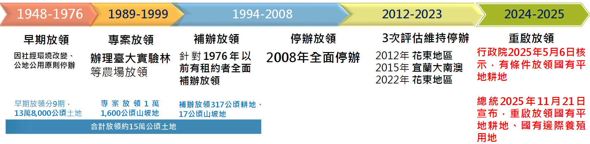

---
*注：本文圖片存放於 ./images/ 目錄下*

## 29. 一般徵收與區段徵收
*發布日期: 2025-12-11* 

## 內文
土地徵收大致分為一般徵收與區段徵收二種。簡言之，區段徵收以外之土地徵收，皆屬一般徵收。

• (一) 一般徵收：政府對個別或小範圍之土地予以徵收，稱為一般徵收。一般徵收僅得採現金補償，不得採抵價地補償。

• (二) 區段徵收：政府對全區或大範圍之土地予以徵收，稱為區段徵收。區段徵收採現金補償與抵價地補償並行，並以抵價地補償為其特色。

• (三) 兩者在適用上之比較：

• T. ABLE_PLACEHOLDER_1

---
*注：本文圖片存放於 ./images/ 目錄下*

## 30. 國土計畫法之回饋義務－國土保育費及影響費
*發布日期: 2025-12-09* 

## 內文
• (一) 法源

依照國土計畫法第28條第1項，經主管機關核發使用許可案件，中央主管機關應向申請人收取國土保育費作為辦理國土保育有關事項之用；直轄市、縣（市）主管機關應向申請人收取影響費，作為改善或增建相關公共設施之用，影響費得以使用許可範圍內可建築土地抵充之，始得依使用計畫進行後續開發。

• (二) 意涵

1. 國土保育費 未來配合國土計畫法施行，中央主管機關收取之國土保育費，係考量使用許可後對於整體環境有一定程度之衝擊影響，且本法對於國土保育地區、農業發展地區及海洋資源地區，均有不同程度禁止或限制使用之規定，為維護整體環境及公共利益原則下，遂收取國土保育費，屬於一種維護永續發展為目的之特別公課。

2. 影響費 影響費與現行區域計畫法之開發影響費相似，係基於使用許可獲准後，將帶來地區性之開發活動，產生服務人口成長與地方經濟所需之公共設施需求問題，以及伴隨開發活動所可能造成之地區環境衝擊問題，應由造成外部成本之開發者負擔，符合外部成本內部化之精神及成長付費之理念。

• (三) 用途

根據國土計畫法第44條之規定，國土保育費由中央主管機關收取後應作為國土永續發展基金的來源之一，供辦理國土保育有關事項使用。該費用經課徵後係用於：

1. 依本法規定辦理之補償所需支出；

2. 國土之規劃研究、調查及土地利用之監測；

3. 依第一項第五款來源補助直轄市、縣（市）主管機關辦理違規查處及支應民眾檢舉獎勵；

4. 其他國土保育事項。

---
*注：本文圖片存放於 ./images/ 目錄下*

## 31. 政府機關及國營事業以撥用或徵收方式取得公有土地或私有土地之比較
*發布日期: 2025-12-04* 

## 內文
• (一) 取得方式不同：

1. 政府機關及國營事業得以「撥用」方式取得公有土地，但不得以「徵收」方式取得公有土地。

2. 政府機關及國營事業得以「徵收」方式取得私有土地，但不得以「撥用」方式取得私有土地。

• (二) 國營事業不同：

1. 僅限於非公司組織之國營事業（亦即僅限於政府機關組織之國營事業），始得以撥用方式取得公有土地。

2. 僅限於政府資本超過50%之國營事業（亦即得為公司組織之國營事業，但政府股份須超過50%），始得以徵收方式取得私有土地

• (三) 取得權利不同：

1. 政府機關及國營事業以「有償撥用」取得公有土地之所有權，以「無償撥用」取得公有土地之使用權。

2. 政府機關及國營事業以「土地徵收」取得私有土地之所有權，以「土地徵用」取得私有土地之使用權。

• (四) 取償價格不同：

1. 政府機關及國營事業如以有償撥用取得公有土地，其取償價格以「公告土地現值」為準（撥劃§III）；如以無償撥用取得公有土地，則無取償價格。

2. 政府機關及國營事業如以土地徵收取得私有土地，其取償價格以「市價」為準（徵§30I II）；如以土地徵用取得私有土地，其每年取償價格以「公告土地現值百分之十」為準（徵§58V）。

---
*注：本文圖片存放於 ./images/ 目錄下*

## 32. 特別犧牲之意義、要件及判斷基準
*發布日期: 2025-12-02* 

## 內文
• (一) 特別犧牲之意涵 司法院釋字第400號解釋：「憲法第15條關於人民財產權應予保障之規定，旨在確保個人依財產之存續狀態行使其自由使用、收益及處分之權能，並免於遭受公權力或第三人之侵害，俾能實現個人自由、發展人格及維護尊嚴。惟個人行使財產權仍應依法受社會責任及環境生態責任之限制，其因此類責任使財產之利用有所限制，而形成個人利益之特別犧牲，社會公眾並因而受益者，應享有相當補償之權利。」其中，特別犧牲指人民對財產權的自由支配使用權，因公益之故而遭受到超過財產社會義務界限的特別限制或剝奪，而為顧及所有權人權益，基於公共利益限制土地利用時，難免涉及構成財產權人之特別犧牲，則生應予損失補償之問題。

• (二) 特別犧牲之要件 是否構成特別犧牲之要件：

1. 須屬於行使公權力之行為。

2. 須對財產或其他權利之侵害。

3. 侵害須達嚴重程度或已構成特別犧牲。

4. 須相對人或利害關係人有值得保護之利益。

5. 須基於公益之必要性。

6. 須為合法行為。

7. 補償義務須有法規之依據始得請求。

• (三) 特別犧牲之判斷基準 至於侵害是否達嚴重程度而構成特別犧牲之判斷基準，宜就限制之目的、手段型態、限制程度、損失程度、土地狀況及條件、社會需要（社會情況）、限制期間及有無既得權益等複數要素，綜合地對於財產權限制之個別情形判斷。

參考資料： 陳立夫，2007，土地法研究(一)，台北：新學林出版公司。 陳立夫，2011，土地法研究(二)，台北：新學林出版股份有限公司。 李惠宗，2007，行政法要義（3版），台北：元照出版有限公司。

---
*注：本文圖片存放於 ./images/ 目錄下*

## 33. 關於土地及其改良物方面之特別犧牲
*發布日期: 2025-11-27* 

## 內文
國家機關依法行使公權力致人民之財產遭受損失，若逾其社會責任所應忍受之範圍，形成個人之特別犧牲者，國家應給予合理補償（司法院釋字第440號解釋）。準此，凡屬個人之一般犧牲者，國家不給予補償；凡屬個人之特別犧牲者，國家始給予補償。

關於土地及其改良物方面之特別犧牲包括下列二種：

• (一) 私人土地或其改良物所有權被剝奪：此即「土地徵收」之意涵。特別犧牲以土地徵收為主，但不限於土地徵收。

• (二) 私人土地或其改良物所有權之使用、收益或處分遭受限制：憲法上財產權保障之範圍，不限於人民對財產之所有權遭國家剝奪之情形。國家雖未剝奪人民之土地所有權，但限制其使用、收益或處分，已逾其社會責任所應忍受之範圍，形成個人之特別犧牲者，國家亦應予土地所有人相當之補償，始符合憲法保障人民財產權之意旨（司法院釋字第813號解釋理由書）。茲舉四例說明；

1. 土地徵用：國家因興辦臨時性公共建設工程，得徵用私有土地或土地改良物（徵§58Ⅰ）。所稱徵用，指國家強制使用私人土地或其改良物，用畢即歸還所有權人。因此，土地徵用乃徵用「使用權」，而非徵收「所有權」。

2. 地上權徵收：需用土地人因興辦土地徵收條例第3條規定之事業，需穿越私有土地之上空或地下，得就需用之空間範圍協議取得地上權，協議不成時，準用徵收規定取得地上權（徵§57Ⅰ）。又，需用土地人不依徵收規定向主管機關申請徵收地上權者，土地所有權人得請求需用土地人向主管機關申請徵收地上權（司法院釋字第747號解釋）。因此，地上權徵收乃徵收「地上權」，而非徵收「所有權」。

3. 既成道路或都市計畫道路埋設地下設施物：主管機關對於既成道路或都市計畫道路用地，在依法徵收或價購以前埋設地下設施物妨礙土地權利人對其權利之行使，致生損失，形成其個人特別之犧牲，自應享有受相當補償之權利（司法院釋字第440號解釋）。

4. 歷史建築所定著之土地：土地所有人如因定著於其土地上之建造物及附屬設施，被登錄為歷史建築，致其就該土地原得行使之使用、收益、處分等權能受到限制，究其性質，屬國家依法行使公權力，致人民財產權遭受逾越其社會責任所應忍受範圍之損失，而形成個人之特別犧牲，國家應予相當補償（司法院釋字第813號解釋）。

總之，特別犧牲之範圍不限於土地或其改良物之所有權被剝奪（即土地徵收）。土地或其改良物所有權之使用、收益或處分遭受限制，逾其社會責任所應忍受之範圍，亦屬於特別犧牲之範圍，國家應給予合理補償。如圖所示。

[圖片1]

【註】 徵：土地徵收條例

## 文章圖片

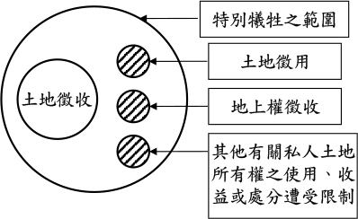

---
*注：本文圖片存放於 ./images/ 目錄下*

## 34. 111年度台上大字第1958號－理監事選任與重劃會合法性案
*發布日期: 2025-11-25* 

## 內文
114年5月23日做成裁定的台上大字第1958號，係有關自辦市地重劃於選任重劃會執行主體「理事會及監事會」有黑箱作業問題。以下將重要內容簡要摘錄，高普考與不動產估價師同學尤應特別注意：

主文

• 一、民國95年6月22日、101年2月4日發布施行之獎勵土地所有權人辦理市地重劃辦法第13條第3項，關於第2項第2款選任理事、監事決議所定之同意比例，係指各別理事及監事之選任獲得同意之比例，不得以會員大會決議之章程或另訂理監事選舉辦法而降低之。未達上開同意比例或無法判斷之選任決 議，除該當不成立外，應屬無效，重劃會未合法成立，不因主管機關已為核定且未撤銷而受影響。

• 二、以規避上開同意比例之目的而通謀虛偽移轉土地所有權者，受移轉登記人之人數及所有土地面積不列入選任決議計算。

理由摘要

㈠自辦市地重劃會係以重劃區內全體土地所有權人為會員，其中包括不同意參與重劃而被迫參與者，其性質有別於一般依自由意思成立或參與之私法自治團體，所從事市地重劃之本質復涉及人民私有土地之取得及重新分配。則會員大會對於選任理事、監事之決議，實係重劃會會員對於各別之理事、監事人選行使同意權，並授權其依市地重劃之程序代為處分財產之行為，其選定自須符合重劃會絕對多數之民意。故會員大會選任理事、監事之系爭同意比例，應本其法條文義及規範目的解釋為係各別理事、監事取得會員同意而得合法當選之比例，且屬強制規定，不能由會員大會以章程或另訂選舉辦法或決議予以調降，未達系爭同意比例或無法判斷之選任決議，除該當不成立外，依民法第71條規定，應屬無效。

㈡自辦市地重劃一旦發動，將使不同意參與重劃者被迫參與自辦市地重劃程序，面臨財產權與居住自由被限制之危險。為確保個人依財產存續狀態行使其自由使用、收益及處分之權能，應認系爭同意比例係自辦市地重劃符合憲法要求保障財產權之正當程序。理事、監事選任之決議倘不符合系爭同意比例，重劃會之成立即不符合憲法要求之實質正當性，縱主管機關已依95年及101年獎勵重劃辦法第11條第4項規定為核定，亦不能治癒其瑕疵，民事法院仍得對重劃會是否合法成立之私法行為審判，不受該核定之拘束。

㈢重劃區土地所有權人如係以虛灌人頭方式參與會員大會選任理事、監事之議決，藉以影響決議之結果，進而達到操控或阻擾重劃業務進行之目的，屬脫法行為，受移轉登記人參與議決之行為應屬無效，不得計入議決之人數及面積，以確保重劃區內真正土地權利人之自治決定及憲法要求之正當程序。

---
*注：本文圖片存放於 ./images/ 目錄下*

## 35. 都市更新權利變換之實例研習
*發布日期: 2025-11-20* 

## 內文
有一都市更新案，更新單元內可區分為三塊建築基地A、B及C。

1. A基地上有一幢二層區分所有建物。1F（以A1表示）為甲所有，房地總價800萬元。2F（以A2表示）為乙所有，房地總價700萬元。基地價值比率90%。

2. B基地上有一幢三層區分所有建物。1F（以B1表示）為丙所有，房地總價600萬元。2F（以B2表示）為丁所有，房地總價500萬元。3F（以B3表示）為戊所有，房地總價400萬元。基地價值比率80%。

3. C基地有一透天房屋，為庚所有，房地總價1,000萬元。基地價值比率為60%。

4. A地之素地總價值1,000萬元，B地之素地總價值1,500萬元，C地之素地總價值1,200萬元，（A+B+C）整體素地總價值4,500萬元。

【解答】

• (一) 各基地之素地總價值：

• T. ABLE_PLACEHOLDER_1

• (二) A基地各戶之基地權利價值：

• T. ABLE_PLACEHOLDER_2

綜上，基地總價值（1,350萬元）大於調整後素地總價值（1,217萬元），故以基地總價值為準。

• (三) B基地各戶之基地權利價值：

• T. ABLE_PLACEHOLDER_3

綜上，基地總價值（1,200萬元）小於調整後素地總價值（1,824萬元），故以調整後素地總價值為準。

• (四) C基地之基地權利價值：

1. 基地權利價值： 1,000×60%=600萬元

2. 調整後素地價值： 1,459萬元

綜上，基地權利價值（600萬元）小於調整後素地價值（1,459萬元），故以調整後素地價值為準。

• (五) 各所有權人之權利價值比率：

• T. ABLE_PLACEHOLDER_4

• (六) 更新後之房地總值（即更新後總銷售金額）： 更新後興建地上12層、地下3層之住宅大樓，一層一戶。 1F：100萬／坪×65坪=6,500萬元 2F：90萬／坪×65坪=5,850萬元 3F：85萬／坪×65坪=5,525萬元 4F：82萬／坪×65坪=5,330萬元 5F：84萬／坪×65坪=5,460萬元 6F：85萬／坪×65坪=5,525萬元 7F：86萬／坪×65坪=5,590萬元 8F：87萬／坪×65坪=5,655萬元 9F：88萬／坪×65坪=5,720萬元 10F：89萬／坪×65坪=5,785萬元 11F：90萬／坪×65坪=5,850萬元 12F：92萬／坪×65坪=5,980萬元 車位：200萬／個×30個=6,000萬元 合計：6,500+5,850+5,525+5,330+5,460+5,525+5,590+5,655+5,720+5,785+5,850+5,980+6,000=74,770萬元

• (七) 土地所有權人共同負擔比率（即實施者應分配之權利價值比率）： 土地所有權人共同負擔比率

[圖片1] =60%實施者應分配之權利價值：74,770×60%=44,862萬元

• (八) 更新後各所有權人應分配之權利價值： 74,770-44,862=29,908萬元

• T. ABLE_PLACEHOLDER_5

## 文章圖片

---
*注：本文圖片存放於 ./images/ 目錄下*

## 36. 國土計畫公告實施後之指導效力與變更情形
*發布日期: 2025-11-18* 

## 內文
國土計畫法強調計畫管制精神，由國土功能分區分類指導土地使用項目，以確保計畫穩定性。因此，國土計畫公告實施後所發生的指導效力為何？又何種情形才得以進行國土計畫之變更？

• (一) 公告實施

1. 全國國土計畫公告實施後，直轄市、縣（市）主管機關應依中央主管機關規定期限，辦理直轄市、縣（市）國土計畫之擬訂或變更。但其全部行政轄區均已發布實施都市計畫或國家公園計畫者，得免擬訂直轄市、縣（市）國土計畫。

2. 直轄市、縣（市）國土計畫公告實施後，應由直轄市、縣（市）主管機關通知當地都市計畫主管機關按國土計畫之指導，辦理都市計畫之擬訂或變更。前項都市計畫之擬訂或變更，中央主管機關或直轄市、縣（市）主管機關得指定各該擬定機關限期為之，必要時並得逕為擬定或變更。

3. 各目的事業主管機關興辦性質重要且在一定規模以上部門計畫時，除應遵循國土計畫之指導外，並應於先期規劃階段，徵詢同級主管機關之意見。中央目的事業主管機關興辦部門計畫與各級國土計畫所定部門空間發展策略或計畫產生競合時，應報由中央主管機關協調；協調不成時，得報請行政院決定之。

• (二) 變更

1. 定期通檢國土計畫公告實施後，擬訂計畫之機關應視實際發展情況，全國國土計畫每十年通盤檢討一次，直轄市、縣（市）國土計畫每五年通盤檢討一次，並作必要之變更。

2. 臨時變更有下列情事之一者，得適時檢討變更之：(1)因戰爭、地震、水災、風災、火災或其他重大事變遭受損壞。(2)為加強資源保育或避免重大災害之發生。(3)政府興辦國防、重大之公共設施或公用事業計畫。(4)其屬全國國土計畫者，為擬訂、變更都會區域或特定區域之計畫內容。(5)其屬直轄市、縣（市）國土計畫者，為配合全國國土計畫之指示事項。

3. 依循全國國土計畫變更全國國土計畫公告實施後，直轄市、縣（市）主管機關應依中央主管機關規定期限，辦理直轄市、縣（市）國土計畫之變更。

4. 中央主管機關逕為變更直轄市、縣（市）主管機關未依前項規定期限辦理直轄市、縣（市）國土計畫之變更者，中央主管機關得逕為變更。

---
*注：本文圖片存放於 ./images/ 目錄下*

## 37. 土地開發分析法
*發布日期: 2025-11-13* 

## 內文
• (一) 土地開發分析法之意義：指根據土地法定用途、使用強度進行開發與改良所導致土地效益之變化，估算開發或建築後總銷售金額，扣除開發期間之直接成本、間接成本、資本利息及利潤後，求得開發前或建築前土地開發分析價格。

• (二) 土地開發分析法之應用時機：

1. 評估建地價格：如住宅用地、商業用地、工業用地等之建地估價。

2. 評估需經開發改良土地之開發前地價：如山坡地、工業區土地、重劃區土地等之開發前地價評估。

• (三) 土地開發分析法之公式： V=S÷（1+R）÷（1+i）-（C+M） 其中： V：土地開發分析價格。 S：開發或建築後預期總銷售金額。 R：適當之利潤率。 C：開發或建築所需之直接成本。 M：開發或建築所需之間接成本。 i：開發或建築所需總成本之資本利息綜合利率。

• (四) 土地開發分析法之估價程序：

1. 確定土地開發內容及預期開發時間：先確定土地開發之面積、內容及開發時間。

2. 調查各項成本及相關費用並蒐集市場行情等資料：蒐集營造施工費、規劃設計費、廣告費與銷售費、管理費、稅捐、資本利率、建築利潤率等市場行情資料。

3. 現況勘察並進行環境發展程度之調查及分析：現況勘察勘估標的及其周遭環境之土地利用與開發程度。

4. 估算開發或建築後可銷售之土地或建物面積：按相關法令規定，在最有效使用下，估算勘估標的之可銷售面積。

5. 估算開發或建築後總銷售金額：按開發後或建築後可銷售面積，乘以可銷售單價，得到銷售金額。總計各部分之銷售金額，得到總銷售金額。

6. 估算各項成本及相關費用：估算營造施工費、規劃設計費、廣告費與銷售費、管理費、稅捐及其他負擔等成本及費用。

7. 選擇適當之利潤率及資本利息綜合利率：選擇適當利潤率，並計算資本利息綜合利率。

8. 計算土地開發分析價格：將上開計算結果，代入土地開發分析法之公式，即得出土地開發分析價格。

• (五) 舉例說明：

有一塊建築基地，土地面積800坪，開發期間3年，可銷售資料如下：

• T. ABLE_PLACEHOLDER_1

相關資料如下：

1. 營造施工費：18萬／坪。

2. 規劃設計費：依營造施工費之2%計。

3. 廣告費與銷售費：依總銷售金額之5%計。

4. 管理費：依總銷售金額之4%計。

5. 稅捐及其他負擔：依總銷售金額之1%計。

6. 資本利息資料如下：(1)一年期定存利率2%，銀行放款利率5%。(2)貸款資金：自有資金：預售收入=3:2:1(3)土地價值：建物價值=5:4

7. 適當之利潤率：20%。

試以土地開發分析法計算該建築基地之單價及總價？

【解答】

• (一) 總銷售金額（S）： 1F：160×240=38,400 2F以上：100×1,060=106,000 車位：250×75=18,750 合計：38,400+106,000+18,750=163,150

• (二) 直接成本（C）： 18×2,200=39,600

• (三) 間接成本（M）：

1. 規劃設計費：39,600×2%=792

2. 廣告費與銷售費：163,150×5%=8,158

3. 管理費：163,150×4%=6,526

4. 稅捐及其他負擔：163,150×1%=1,632

5. 合計：792+8,158+6,526+1,632=17,108

• (四) 資本利息綜合利率（i）：

1. 資本利息年利率：[圖片1]

2. 資本利息綜合利率：[圖片2]

• (五) 適當利潤率（R）： 適當利潤率為20%。

• (六) 土地開發分析價格（V）： V=S÷（1+R）÷（1+i）-（C+M） =163,150÷（1+20%）÷（1+7.4%）-（39,600+17,108） =69,883 69,883÷800=87.35

答：該建築基地之單價為87.35萬／坪，總價69,883萬元。

## 文章圖片

---
*注：本文圖片存放於 ./images/ 目錄下*

## 38. 公寓大廈約定專用對繼受人之效力
*發布日期: 2025-11-11* 

## 內文
本週專欄簡要彙整公寓大廈約定專用對繼受人之效力的實務判決一則。

甲與乙簽訂房屋及土地(系爭房地)預定買賣合約，約定總價4,600萬元。甲買受系爭房地時，乙明知無系爭房地門前法定空地10坪之專用權，卻騙稱除所有權狀所載29.49坪外，尚有法定空地可供專用，未違反誠信原則說未據實告知系爭房地所在之大樓管委會決議公告及總幹事明示，隨時可收回法定空地及調整使用空地償金，致甲陷於錯誤，而同意以包含法定空地使用權之對價購買系爭房地，並交付價金，乙係故意詐欺，不法侵害甲之金錢財產權，又未依債之本旨交付買賣標的，違反出賣人應負之告知、說明等附隨義務，且乙就法定空地之使用權應負權利瑕疵擔保及物之瑕疵擔保責任，進而請求損害賠償。試問出賣人乙主張依公寓大廈管理條例，繼受人甲有向公寓大廈管委會或相關人員查詢法定空地使用權源及狀態之義務，故不需賠償或應減輕賠償，有無理由？

按開放空間及退縮空地，在直轄市、縣（市）政府核准範圍內，得依規約或區分所有權人會議供營業使用；約定專用部分之範圍及使用主體，非經載明於規約者，不生效力；區分所有權之繼受人，應於繼受前向管理負責人或管理委員會請求閱覽或影印第35條所定文件（如規約、管理委員會會議紀錄等），並應於繼受後遵守原區分所有權人依本條例或規約所定之一切權利義務事項，公寓大廈管理條例第16條第2項但書、第23條第2項第1款、第24條第1項、第35條固有明文。

惟觀諸上開規定之立法理由，公寓大廈管理條例第16條旨在維護公共安全，第23條在規範住戶規約應由區分所有權人自訂，並不得違反法令，及非經載明於規約不生效力之事項，第24條則明定區分所有權之繼受人應繼受前區分所有人權利義務，以維護區分所有關係之一貫性，第35條係明定與規約及區分所有權人會議之會議紀錄權益關係之第三人得請求閱覽，管理負責人或管理委員會不得拒絕，俱非課有意購買所謂約定專用部分（即公寓大廈共用部分經約定供特定區分所有權人使用者）之買受人有事先查證使用權源之義務，況出賣人乙就所謂約定專用部分之使用現況及權源本難諉為不知，其既於系爭買賣契約擔保有法定空地之專用權，自應就不履行擔保所致甲之損害負全部責任，縱使甲可得依上開規定向大樓管委會或相關人員查詢法定空地之使用權源，卻未查詢，致未能於系爭買賣契約成立前發現乙並無所謂約定專用權，亦不能逕而認定甲未查證即與乙訂立系爭買賣契約，及之後因乙不履行權利瑕疵擔保責任而受有損害，為與有過失。

資料來源：臺灣高等法院 104 年度重上更（二）字第 109 號 判決

---
*注：本文圖片存放於 ./images/ 目錄下*

## 39. 折現現金流量分析法
*發布日期: 2025-11-06* 

## 內文
• (一) 折現現金流量分析法之意義： 指勘估標的未來折現現金流量分析期間之各期淨收益及期末價值，以適當折現率折現後加總推算勘估標的價格之方法。

• (二) 折現現金流量分析法之應用時機：

1. 營運性不動產之價格評估：如觀光飯店、百貨商場、出租辦公大樓等之估價。

2. 以投資為目的之不動產投資評估：委託者擬投資收益性不動產，採折現現金流量分析法評估不動產價格，供投資決策之參考。

• (三) 折現現金流量分析法之公式：

[圖片1] 其中： P：收益價格。 CFk：各期淨收益。 Y：折現率。 n’：折現現金流量分析期間。 k：各年期。 Pn’：期末價值。

• (四) 折現現金流量分析法之估價程序：

1. 蒐集資料：蒐集總收入、總費用及折現率等資料。

2. 推算有效總收入：推算分析期間（分析期間一般為5年或10年）勘估標的之各年總收入，再推算各年閒置及其他原因造成之收入損失，二者相減，就得到分析期間勘估標的之各年有效總收入。

3. 推算總費用：推算分析期間勘估標的之各年總費用。

4. 計算淨收益：由各年有效總收入扣除各年總費用，求得分析期間勘估標的之各年淨收益。

5. 推估期末價值：推估分析期間屆滿後，處分勘估標的所得到之價格。此稱為期末價值。期末價值應扣除處分勘估標的所需之相關費用。

6. 決定折現率：採加權平均資金成本法決定折現率。

7. 計算收益價格：將上開計算結果，代入折現現金流量分析法之公式，即得出收益價格。

• (五) 舉例說明： 有一棟收益性不動產，預計持有五年後出售，未來一年至第五年之淨收益分別為100萬元、200萬元、300萬元、400萬元及500萬元，期末價值為6,000萬元，折現率5%，則該不動產收益價格為何？ 【解答】

[圖片2] 答：該不動產之收益價格為5,958萬元。

## 文章圖片

---
*注：本文圖片存放於 ./images/ 目錄下*

## 40. 基地優先購買權之相關議題(二)：未受通知主張塗銷登記多年後，物權效力是否受誠信原則限制？
*發布日期: 2025-11-04* 

## 內文
延續前次基地優先購買權之相關議題(一)，探討優先購買權人在未受通知後，並且該基地已移轉第三人過了多年，甚至還轉了好幾手後，才發現其優先購買權受到侵害，進而訴請塗銷這些移轉的所有權，以行使優先購買權，試問是否妥適？

根據土地法第104條第一項規定：「基地出賣時，地上權人、典權人或承租人有依同樣條件優先購買之權。房屋出賣時，基地所有權人有依同樣條件優先購買之權。其順序以登記之先後定之。」此為地政考試非常重要的基地優先購買權觀念，至於同條第二項：「前項優先購買權人，於接到出賣通知後十日內不表示者，其優先權視為放棄。出賣人未通知優先購買權人而與第三人訂立買賣契約者，其契約不得對抗優先購買權人。」由於該優先購買權可據以對抗第三人，故學者將其歸屬為「物權效力」。

該物權效力，指在優先購買權人（地上權人、典權人或承租人）未受出賣通知時，若出賣人已移轉所有權登記予第三人，因出賣人與第三人以買賣為原因而成立之物權移轉行為不得對抗優先承買權人，從而，優先承買權人自得請求第三人即買受人塗銷所有權移轉登記，暨請求義務人即出賣人協同辦理所有權移轉登記。然而，究竟多久內可以主張優先購買而訴請塗銷所有權，法未明訂，參楊智守（2019）提及目前司法實務以是否違反誠信原則作為討論，並分為兩說：

1. 未違反誠信原則說 承租人必須知悉買賣條件後，始能為放棄優先承買權之表示，倘出租人未為與買賣契約同意條件之通知，縱承租人知悉出賣事實而未為購買之表示，仍不得視為其放棄優先承買權，既不得認其已拋棄優先承買權，亦難認其違反誠信或有權利濫用之情事（最高法院106年度台上字第1263號判決意旨）。

2. 違反誠信原則說 優先承買權之立法意旨非在使優先承買權人巧取利益，是土地優先承買權人如已知悉土地所有權人出賣基地及買受人並買賣條件（例如從買受人、法院判決書、對造答辯狀等來源而知悉買賣同樣條件時），即應於相當期限內行使其權利，若長期不行使，足以引起出賣人與買受人之正當信任，認為權利人已不欲行使其權利，或嗣後房地價格飆漲後，再主張行使優先承買權時，應認為有違誠信原則。

其中，楊智守法官（2019）於結論中指出，此種優先購買權人訴請塗銷所有權移轉登記，常已距基地初次買賣有段時日，基地所有權甚至更已轉手多次，優先承買權人的相對物權效力一次性翻轉歷次基地所有權轉移效果，造成法秩序不安定，訴訟爭點再次延伸到誠信原則的判斷，最後求之法院職權調整買賣價金亦不太可得，足見基地租賃優先承買權的相對物權效力應有立法調整之必要。

參考資料：楊智守，2019，基地租賃優先承買權之實務問題探討（二）－以法律效果與訴訟主張為中心，司法周刊，第1976期，第2-3版。

---
*注：本文圖片存放於 ./images/ 目錄下*

## 41. 土地增值稅之免徵、不課徵、記存及不計徵
*發布日期: 2025-10-30* 

## 內文
• (一) 意義：

1. 免徵：免除土地增值稅負擔。如繼承而移轉之土地，免徵土地增值稅（土稅§28）。

2. 不課徵：尚未結算已發生之土地增值稅，俟下次移轉時一併結算並徵收。如配偶相互贈與之土地，得申請不課徵土地增值稅（土稅§28-2）。

3. 記存：結算已發生之土地增值稅，記在帳上，俟下次移轉時一併徵收。如都市更新權利變換，土地所有權人應分配之土地範圍內，分配予各該合法建築物所有權人、地上權人、永佃權人、農育權人或耕地三七五租約承租人，視為土地所有權人獲配土地後無償移轉，其土地增值稅減徵40%，並准予記存，於權利變換後再移轉，一併繳納（都更§60）。

4. 不計徵：土地增值稅之課徵範圍（時機）為所有權移轉及設定典權。不計徵，指不在土地增值稅之課徵範圍內。如市地重劃後，重行分配予原土地所有權人之土地，不計徵土地增值稅。其理由是市地重劃後，重行分配與原土地所有權人之土地，自分配結果確定之日起，視為其原有之土地（平§62）。

• (二) 比較：

1. 免徵土地增值稅與不課徵土地增值稅之比較： (1)免徵土地增值稅屬於租稅免除，不課徵土地增值稅，屬於租稅遞延。 (2)免徵土地增值稅，其原地價必須重新核定。不課徵土地增值稅，其原地價未更動。 (3)免徵土地增值稅，其納稅義務人不必申請（無租稅申報協力義務）。不課徵土地增值稅，納稅義務人有必須申請者（有租稅申報協力義務），亦有不必申請者（無租稅申報協力義務）。

2. 不課徵土地增值稅與土地增值稅記存之比較： (1)不課徵土地增值稅，指尚未結算已發生之土地增值稅。土地增值稅記存，指結算已發生之土地增值稅。 (2)不課徵土地增值稅，其原地價未更動。土地增值稅記存，其原地價必須重新核定。 (3)不課徵土地增值稅，其土地漲價總數額繼續累計，累進倍數不斷提高。土地增值稅記存，其土地漲價總數額自記存時起重新計算。

3. 免徵土地增值稅與不計徵土地增值稅之比較： (1)免徵土地增值稅，指在土地增值稅之課徵範圍內，但給予租稅免除。不計徵土地增值稅，指不在土地增值稅之課徵範圍內，故政府無須稽徵作業。 (2)免徵土地增值稅，其原地價必須重新核定。不計徵土地增值稅，其原地價照舊。

4. 不課徵土地增值稅與不計徵土地增值稅之比較： (1)不課徵土地增值稅，指在土地增值稅之課徵範圍內，但給予租稅遞延。不計徵土地增值稅，指不在土地增值稅之課徵範圍內，故政府無須稽徵作業。 (2)不課徵土地增值稅，有必須納稅義務人申請者（有租稅申報協力義務），亦有不必納稅義務人申請者（無租稅申報協力義務）。不計徵土地增值稅，人民無納稅義務存在。 (3)不課徵土地增值稅與不計徵土地增值稅，對納稅義務人而言，其租稅效果相同。

【註】 土：土地法。 平：平均地權條例。 土稅：土地稅法。 都更：都市更新條例。

---
*注：本文圖片存放於 ./images/ 目錄下*

## 42. 製造商與提供服務者的無過失責任
*發布日期: 2025-10-28* 

## 內文
各位同學好

最近於總複習時，發現有些同學觀念需要修正一下，故今日專欄針對消費者保護法第7條有關「製造商與提供服務者的無過失責任」概念予以釐清。

首先，消費者保護法第7條規定：「從事設計、生產、製造商品或提供服務之企業經營者，於提供商品流通進入市場，或提供服務時，應確保該商品或服務，符合當時科技或專業水準可合理期待之安全性(第一項)。商品或服務具有危害消費者生命、身體、健康、財產之可能者，應於明顯處為警告標示及緊急處理危險之方法(第二項)。企業經營者違反前二項規定，致生損害於消費者或第三人時，應負連帶賠償責任。但企業經營者能證明其無過失者，法院得減輕其賠償責任(第三項)。」

從文義而言，已明確指出企業經營者是在違反前兩項（即未符合安全性、未有警告標示與緊急處理方法）時，才負損害賠償責任，且因為未符合前兩項規定而一定要予連帶賠償，至於如能證明無過失，方能減輕。這邊應特別注意的是，並非只要消費者使用商品或服務受有損害就需要負無過失賠償責任，這個責任是有「前提要件」的－未符合安全性、未有警告標示與緊急處理方法！

另依消費者保護法第7條之1：「企業經營者主張其商品於流通進入市場，或其服務於提供時，符合當時科技或專業水準可合理期待之安全性者，就其主張之事實負舉證責任。」因此，倘若企業經營者可以提出明確有說服力的證明，指出其商品或服務確實符合可合理期待的安全性，包含對危險者亦有警告標示與處理方法，那麼即可免責，不需賠償。但應注意，該舉證責任為企業經營者而非消費者。

以下提供幾個案例參考：

參考案例一（唱K受槍傷死亡）：

最高法院96年度台上字第656號判決，法院認為：KTV係提供消費者唱歌設備、飲食，及獨立不受影響之唱歌空間，屬消費者保護法所稱之服務，依該法第7條之立法意旨，固應對其提供消費者使用之空間及附屬設施負確保安全之責任。惟一般消費者至KTV消費，其預期經營者所提供之服務為符合品質、效用之唱歌與飲食，而隔間牆之設置僅係為提供不同之消費族群各自獨立不受影響之唱歌空間而已；KTV並非試槍場所，一般人至KTV消費，並不會預期包廂係供消費者談判、聚眾鬥毆之場所，是以，KTV包廂隔間牆不須具備防彈功能；亦無法律規定KTV應設置。金屬探測門。是被告所提供之隔間牆，應符合當時科技或專業水準可合理期待之安全性。從而被害人因受槍傷而死亡，不得請求被告賠償。（陳聰富，2023）

明確指出並非於營業場所享受服務時受傷或死亡即需負賠償責任，仍須先視企業經營者由無提供可合理期待安全性。

參考案例二（營業場所滑倒）：

最高法院 108 年度台上字第1710號民事判決：查上訴人在欣大中公司經營之環東店用餐時，於該店自助沙拉區未鋪設地毯且未設置「小心地滑」之安全警告標示之角落處跌倒受傷，為原審認定之事實。果爾，依前揭規定，欣大中公司應就其主張所提供之服務符合專業水準可合理期待之安全性之事實負舉證責任，以證明所提供之用餐環境已符合專業水準可提供消費者於用餐時安全行走之合理期待。否則，欣大中公司對其未能確保其所提供之服務無安全上之危險，無論有無過失，均應就上訴人所受損害負賠償責任。

同樣明確指出應由企業經營者舉證該服務符合專業水準可合理期待之安全性，如無法證實則不論有無過失，均應就消費者所受損害負賠償責任。

參考案例三（熱紅茶燙傷）：

臺灣高等法院民事判決101年度上字第419號：高等法院認為，被上訴人頂呱呱忠孝店就系爭紅茶之提供及服務均無安全上之危險，且符合當時科技或專業水準可合理期待之安全性，就其主張之事實應負舉證責任。乙雖於原審陳述，其於甲購買熱紅茶時，封紙袋前有再確認杯蓋有無蓋好，且頂呱呱忠孝店設定沖泡江茶溫度為八十度。但法院認為乙稱其於交付熱紅茶予上訴人甲時，有提醒上訴人熱飲小心飲用，惟上訴人於系爭燙傷事故發生當時為年僅十一歲之未成年人，就危險預防之思慮自較成年人不足，且依專家文獻記載，超過七十度 C 高溫的水，在皮膚上停留超過一秒鐘就會造成燒燙傷，而若遭八十度 C 熱水傾到，隔著褲子可能致十一歲兒童鼠蹊部受到三度燙傷之程度等情。是頂呱呱忠孝店所出售達八十度 C 之熱紅茶，其溫度即有燙傷消費者之安全上之危險。法院進一步認為，頂呱呱忠孝店既提供外帶熱紅茶之商品及服務，對於熱紅茶裝盛器具之安全，自有注意義務，應預先注意杯體傾倒時，杯蓋不會與杯體分離，致熱紅茶洩流而與人體皮膚接觸造成傷害。而食品衛生管理法雖未規範銷售產品溫度之限制，惟為維護消費者飲食安全，並參照消費者保護法第七條第三項、第十條第二項之規定，頂呱呱忠孝店於出售熱紅茶之商品時應在包裝上標示，提醒消費者小心並避免燙傷之相關警示語。但於本案頂呱呱忠孝店在裝盛熱紅茶之紙杯及放置飲料之包裝紙袋外，並無相關警語或標示，足見其並未依消費者保護法七條第二項規定，於明顯處為警告之注意標示，已難認其提供之「服務」符合專業水準之合理期待。

至於被上訴人雖另辯稱系爭紙杯耐熱水試驗，其測試結果可證明系爭熱飲杯正常情形下並無溢漏或不堪使用之情況，其材質應已符合當時科技或專業水準可合理期待之安全性。惟法院認為，依頂呱呱門市服務區工作手冊及標準作業流程資料，已詳載裝盛熱紅茶時，應於蓋上杯蓋並確實壓緊杯蓋後，並應使用膠帶固定杯蓋與杯子，需使其膠帶為十字狀，堪認頂呱呱忠孝店亦預見僅將熱飲杯蓋閉合仍可能發生與杯體脫離之安全上危險，則其未要求員工應確實執行此流程，復未於杯體容器加註提醒消費者注意之警示，即難認頂呱呱忠孝店已依消保法第七條之一規定，就商品之提供及服務符合當時科技或專業水準可合理期待之安全性盡其舉證責任，自應依同法第七條第三項規定，負損害賠償責任。至被上訴人雖另辯稱，上訴人甲遭熱飲燙傷之原因可能係其自購買後到上車前不當擠壓紙杯所致溢漏或其母駕駛行進間車輛顛簸，導致紙袋破裂或熱飲潑灑所造成，惟未舉證以實其說，應無可採，自難認系爭損害之發生，乃出於上訴人或其法定代理人之不當使用或過失，而非可歸責於頂呱呱忠孝店提供熱紅茶之商品及外帶之服務在包裝上符合專業水準可合理期待之安全性所致。

高等法院因此認定被上訴人出售足以使人燙傷之熱紅茶，未為符合專業水準之安全防護措施，致不具合理期待之安全性，造成上訴人受有深二度燙傷，已違反消保法第七條第一項規定，應依同法條第三項規定，負損害賠償責任，另消保法第五一條規定，審酌事故發生之原因及被上訴人之疏失情節，暨所造成上訴人之傷害，被上訴人應連帶賠償上訴人五十萬元之懲罰性賠償金。（吳淑莉，2016）

綜上，應釐清觀念：商品或服務無過失責任之基礎，在於企業經營者提供之商品或服務，未符合當時科技或專業水準可合理期待之安全性。換言之，要將「商品安全性」與「過失」分開看待，如同蔡晶瑩教授（2023）所述，只要企業經營者因為服務欠缺安全性，而使消費者或第三人受有生命、身體、健康或財產上之損害時，企業經營者對消費者或第三人即應負擔損害賠償責任。企業經營者所提供之服務是否欠缺安全性，須以服務是否具備「符合當時科技或專業水準可合理期待之安全性」為標準而判斷之，消保法所定之規則，為立法者對於服務提供者所要求之「服務品質」，此一規定與企業經營者是否具有過失無關，並非過失之判斷標準，不應將過失與安全性欠缺兩者混淆。安全性欠缺係針對商品或服務導致損害之事實，決定該損害之發生，是否源自於一種不正常或不合理之危險，此種危險之實現應由企業經營者承擔其因此所生之不利益。安全性是否欠缺，僅為一種現象或事實，我們只須做有或無的判斷，至於所提供之服務基於何種原因發生安全性欠缺，是基於服務提供者之故意行為、重大過失行為、輕過失行為、乃至於無過失行為，皆不影響消費者或第三人因其生命、身體、健康、財產所受之損害對於服務提供者（企業經營者）主張損害賠償責任。

參考文獻：

1. 吳淑莉，2016，餐飲業之消保法商品及服務責任－熱紅茶案判決評析，月旦法學雜誌，第252期，第210-222頁。

2. 陳聰富，2023，商品製造人責任，月旦法學教室，第251期，第46-54 頁。

3. 蔡晶瑩，2023，論商品製造人責任中服務欠缺安全性在概念上之研析－最高法院110年度台上字第1425號判決與最高法院105年度台上字第1905號判決，月旦法學雜誌，第336期，第36-46頁。

---
*注：本文圖片存放於 ./images/ 目錄下*

## 43. 空地、素地、袋地、裡地
*發布日期: 2025-10-23* 

## 內文
• (一) 空地：土地法及平均地權條例定義之專有名詞。土地法第87條第1項規定，凡編為建築用地，未依法使用者，為空地。準此，空地乃地主未善盡利用土地，故政府採空地稅或照價收買，以督促其使用。

• (二) 素地：不動產估價之專有名詞。素地係指地上無改良物或他項權利之土地。地上如有改良物或他項權利，將其視為不存在，評估素地狀況下之地價。如不動產估價技術規則第106條規定，建物已不具備使用價值，得將其基地視為素地估價。但應考量建物拆除成本予以調整之。

• (三) 袋地：描述不動產臨路狀況之專有名詞。袋地係指不直接臨路之土地。如袋地通行權即是一例。民法第787條第1項規定，土地因與公路無適宜之聯絡，致不能為通常使用時，除因土地所有人之任意行為所生者外，土地所有人得通行周圍地以至公路。

• (四) 裡地：我國政府部門估價所採用之專有名詞。繁榮街道路線價區段，以距離臨街線18公尺以內為臨街地，採路線價估價法查估；以距離臨街線18公尺以外為裡地，採區段價法查估。其實，裡地是臨路之一般宗地，但為了估價目的，在其深度18公尺處劃出裡地線，將該宗土地區分為臨街地與裡地二部分，而適用不同的估價方法（臨街地適用路線價估價法，裡地適用區段價法）。因此，裡地並非袋地。

---
*注：本文圖片存放於 ./images/ 目錄下*

## 44. 基地優先購買權之相關議題(一)：基地出賣後建物拆除之主張優先購買問題
*發布日期: 2025-10-21* 

## 內文
• (一) 案例說明

乙於民國76年3月1日與甲就系爭土地訂立租賃契約書，租期自76年3月1日起至80年 2月28日止，年租金5萬元。租期屆滿後乙仍續租，雙方約定以乙墊付之開發費用抵繳日後租金，乙並在系爭土地上興建1棟房屋（下稱系爭房屋）。然而，甲於95年9月11日未先通知乙，即以總價2,200萬元出售系爭土地並移轉登記予丙所有，嗣丙再將應有部分10分之 1移轉登記予丁所有，乙發現後爰於民國100年依民法第426條之 2、第767條及土地法第104條第1項規定，求為下列判決，惟民國102年1月16日乙之房屋已遭拆除：

1. 確認乙就系爭土地有優先購買權存在。

2. 命丁將系爭土地所有權應有部分10分之 1所為之移轉登記塗銷，回復登記為丙所有。

3. 命丙將系爭土地所有權全部所為之移轉登記塗銷，回復登記為甲所有。

4. 命甲以出售予丙之相同條件即總價 2,200萬元與乙訂立買賣契約，並移轉登記予乙所有。

• (二) 法條

按土地法第104條規定，基地出賣時，地上權人、典權人或承租人有依同樣條件優先購買之權。房屋出賣時，基地所有權人有依同樣條件優先購買之權。其順序以登記之先後定之。前項優先購買權人，於接到出賣通知後十日內不表示者，其優先權視為放棄。出賣人未通知優先購買權人而與第三人訂立買賣契約者，其契約不得對抗優先購買權人。

• (三) 判決重點

1. 房屋拆除後得否主張土104優先購買？ 所謂「依同樣條件優先購買」，係指在買賣條件如買賣標的、範圍、價金、付款方式、瑕疵擔保等均相同情形下，承租人得要求優先成為基地之買受人。上開規定之優先購買權，乃成立買賣契約之形成權，其權利之有無，應依行使權利時之狀態認定之。倘承租人行使優先購買權時，本於租地建屋契約而在土地上建有房屋者，其行使先買權即屬合法，縱然該房屋嗣後被拆除，仍不影響其原本已取得之先買權。

2. 知悉出賣事實而未為購買表示是否視為放棄？ 承租人必須知悉買賣條件後，始能為放棄優先購買權之表示，倘出賣基地之出租人，未為與買賣契約同樣條件之通知，縱承租人知悉出賣事實而未為購買之表示，仍不得視為其放棄優先購買權。

3. 移轉第三人之效力？ 此優先購買權具有相對物權的效力，不因買受人買受基地後，已輾轉移轉所有權於第三人而有異。

• (四) 結論

甲於95年 8月16日出賣其所有系爭土地時，乙基於不定期租賃契約而為系爭土地之承租人，並本於該租約約定，在系爭土地上建有系爭房屋，乃甲未將其買賣條件通知乙，即以總價 2,200萬元出售系爭土地並移轉登記為丙所有，丙嗣再將系爭土地所有權應有部分10分之 1出售並移轉登記予丁。

乙主張依土地法第104條第1項規定，以甲出賣系爭土地之同樣條件，優先購買系爭土地，自屬合法有據，既不得認其已拋棄優先購買權，亦難認其違反誠信或有權利濫用之情事。

又，土地法第104條第1項規定之優先購買權，具有相對物權的效力，乙行使該權利之結果，使甲移轉系爭土地所有權予丙、及丙移轉系爭土地所有權應有部分10分之 1予丁之物權行為，均因而成為無權處分，乙自得請求塗銷各該所有權移轉登記。

資料來源：最高法院106年度台上字第1263號判決

---
*注：本文圖片存放於 ./images/ 目錄下*

## 45. 民法物權編施行法第8條之5之優先購買權與土地法第104條之優先購買權的比較
*發布日期: 2025-10-16* 

## 內文
• (一) 民法物權編施行法第8條之5優先購買權之規定：

1. 區分所有建築物之基地，有分離出賣之情形時，其專有部分之所有人無基地應有部分或應有部分不足者，於按其專有部分面積比例計算其基地之應有部分範圍內，有依相同條件優先承買之權利，其權利並優先於其他共有人。前項情形，有數人表示優先承買時，應按專有部分比例買受之。但另有約定者，從其約定。

2. 區分所有建築物之專有部分，有分離出賣之情形時，其基地之所有人無專有部分者，有依相同條件優先承買之權利。前項情形，有數人表示優先承買時，以抽籤定之。但另有約定者，從其約定。

3. 區分所有建築物之基地或專有部分之所有人出賣基地或專有部分時，應在該建築物之公告處或其他相當處所公告五日。優先承買權人不於最後公告日起十五日內表示優先承買者，視為拋棄其優先承買權。

• (二) 土地法第104條優先購買權之規定：

1. 基地出賣時，地上權人、典權人或承租人有依同樣條件優先購買之權。房屋出賣時，基地所有權人有依同樣條件優先購買之權。其順序以登記之先後定之。

2. 前項優先購買權人，於接到出賣通知後十日內不表示者，其優先權視為放棄。出賣人未通知優先購買權人而與第三人訂立買賣契約者，其契約不得對抗優先購買權人。

• (三) 兩者比較：

民法物權編施行法第8條之5之優先購買權與土地法第104條之優先購買權同屬房與地間之優先購買權。兩者之比較如下表。

• T. ABLE_PLACEHOLDER_1

---
*注：本文圖片存放於 ./images/ 目錄下*

## 46. 美濃盜採砂石案違反區域計畫法之情形
*發布日期: 2025-10-14* 

## 內文
本週專欄針對進來時事－「美濃大峽谷」作法規說明，此與不動產經紀人、高普考及不動產估價師之計畫法規有關

可先看新聞：美濃盜採砂石案 內政部國土署：高雄市政府已法移送地檢署調查 地方政府聯合查緝平台 持續查處不法土地使用行為

主要是高雄市美濃區有23筆非都市土地農牧用地遭盜取砂石，甚至被挖成「大峽谷」顯見其嚴重程度，其違反法規包含土石採取法、廢棄物清理法、區域計畫法等。

就地政相關法規而言，主要違反區域計畫法之土地使用管制，根據區域計畫法第15條規定：「區域計畫公告實施後，不屬第十一條之非都市土地(擬定都市計畫者)，應由有關直轄市或縣（市）政府，按照非都市土地分區使用計畫，製定非都市土地使用分區圖，並編定各種使用地，報經上級主管機關核備後，實施管制。變更之程序亦同。其管制規則，由中央主管機關定之。」因此，非都市土地使用分為上、中、下層管制，分別為非都市土地分區使用計畫→11種分區→19種使用地，再根據非都市土地使用管制規則第6條：「非都市土地經劃定使用分區並編定使用地類別，應依其容許使用之項目及許可使用細目使用。」只要未按照其所定容許使用項目及許可使用細目使用，即屬違規使用（違反土地使用管制）。

違規使用之裁罰則依據區域計畫法第21條規定：「違反規定管制使用土地者，由該管直轄市、縣（市）政府處新臺幣六萬元以上三十萬元以下罰鍰，並得限期令其變更使用、停止使用或拆除其地上物恢復原狀。前項情形經限期變更使用、停止使用或拆除地上物恢復原狀而不遵從者，得按次處罰，並停止供水、供電、封閉、強制拆除或採取其他恢復原狀之措施，其費用由土地或地上物所有人、使用人或管理人負擔。前二項罰鍰，經限期繳納逾期不繳納者，移送法院強制執行。」

又因為本案屆期仍未改善，所以可依據區域計畫法第22條刑責規定：「違反前條規定不依限變更土地使用或拆除建築物恢復土地原狀者，除依行政執行法辦理外，並得處六個月以下有期徒刑或拘役。」已移送地檢署調查中。

---
*注：本文圖片存放於 ./images/ 目錄下*

## 47. 土地法第34條之1應用於公同共有之舉例
*發布日期: 2025-10-09* 

## 內文
土地法第34條之1第5項規定，公同共有準用土地法之第34條之1第1項（多數決）及第4項（優先購買權）。茲舉一例說明：

甲死亡，遺留一筆土地，由乙、丙、丁三人繼承，應繼分分別為四分之三、六分之一、十二分之一。乙急需現金，但不得單獨出售其應繼分，故擬運用土地法第34條之1第1項，將該筆土地全部出售於戊。其程序如下：

• (一) 乙依據土地登記規則第120條、遺產及贈與稅法第41條之1之規定，先繳清全部遺產稅，並辦理公同共有繼承登記。

• (二) 乙依據民法第759條及土地法第34條之1第1項之規定，出售該筆土地全部予戊。

• (三) 乙依據土地法第34條之1第4項規定，通知丙及丁是否主張優先購買。

• (四) 設丙、丁二人皆願意以同樣條件優先購買。

• (五) 依據民法第830條第1項規定，公同共有物之關係因公同共有物之讓與而消滅。準此，本例由公同共有轉變為分別共有。

• (六) 依據土地法第三十四條之一執行要點第13點第10款規定，公同共有人數人主張時，其優先購買權之範圍應按各主張優先購買權人之潛在應有部分（即應繼分）比例計算之。

• (七) 最後，該筆土地產權為丙、丁二人分別共有，應有部分丙為三分之二，丁為三分之一。

---
*注：本文圖片存放於 ./images/ 目錄下*

## 48. 不動產經紀業涉及聯合行為之情形
*發布日期: 2025-10-07* 

## 內文
• (一) 聯合行為之意義

指具競爭關係之同一產銷階段事業，以契約、協議或其他方式之合意，共同決定商品或服務之價格、數量、技術、產品、設備、交易對象、交易地區或其他相互約束事業活動之行為，而足以影響生產、商品交易或服務供需之市場功能者。(公交§14)

其中，聯合行為之合意，得依市場狀況、商品或服務特性、成本及利潤考量、事業行為之經濟合理性等相當依據之因素推定之。

• (二) 聯合行為之效力

事業不得為聯合行為。但有下列情形之一，而有益於整體經濟與公共利益，經申請主管機關許可者，不在此限：

1. 為降低成本、改良品質或增進效率，而統一商品或服務之規格或型式。

2. 為提高技術、改良品質、降低成本或增進效率，而共同研究開發商品、服務或市場。

3. 為促進事業合理經營，而分別作專業發展。

4. 為確保或促進輸出，而專就國外市場之競爭予以約定。

5. 為加強貿易效能，而就國外商品或服務之輸入採取共同行為。

6. 因經濟不景氣，致同一行業之事業難以繼續維持或生產過剩，為有計畫適應需求而限制產銷數量、設備或價格之共同行為。

7. 為增進中小企業之經營效率，或加強其競爭能力所為之共同行為。

8. 其他為促進產業發展、技術創新或經營效率所必要之共同行為。

• (三) 聯合行為之處罰

1. 主管機關對於違反規定之事業，得限期令停止、改正其行為或採取必要更正措施，並得處新臺幣十萬元以上五千萬元以下罰鍰；屆期仍不停止、改正其行為或未採取必要更正措施者，得繼續限期令停止、改正其行為或採取必要更正措施，並按次處新臺幣二十萬元以上一億元以下罰鍰，至停止、改正其行為或採取必要更正措施為止。

2. 經主管機關認定有情節重大者，得處該事業上一會計年度銷售金額百分之十以下罰鍰，不受前項罰鍰金額限制。

3. 違反規定，經主管機關依規定限期令停止、改正其行為或採取必要更正措施，而屆期未停止、改正其行為或未採取必要更正措施，或停止後再為相同違反行為者，處行為人三年以下有期徒刑、拘役或科或併科新臺幣一億元以下罰金。

• (四) 不動產經紀業涉及聯合行為之情形

《公平交易委員會對於不動產經紀業之規範說明》不動產經紀業者涉及違法聯合行為之態樣例示如下：

1. 共同決定服務報酬收費標準，或協議限制服務報酬之調整。

2. 共同劃分經營區域。

3. 共同劃分交易對象。

4. 共同阻礙或排除其他競爭者或潛在競爭者參與競爭，例如協議拒絕其他不動產經紀業者參與聯賣。

5. 共同約束開發物件必須與委託人簽訂專任委託契約，致使不動產經紀業者及委託人選擇委託契約型態之自由受到限制。

6. 共同約束專任委託契約之期間，致使不動產經紀業者縱未積極努力撮合，委託人卻因受限於契約而無法另行委託其他不動產經紀業者。

7. 共同約束收取斡旋金之票期，致使斡旋金票期趨於一致。

8. 共同約束實施聯賣之不動產物件開發方擁有一定的專賣期間，致使已尋得交易相對人之其他不動產經紀業者受限於專賣權之規定而無法成交。

---
*注：本文圖片存放於 ./images/ 目錄下*

## 49. 差別稅率
*發布日期: 2025-10-02* 

## 內文
土地稅採差別稅率之目的，在達成其政策目的（如平均社會財富、實現地利共享、打擊炒房投機等）。茲分述如下：

• (一) 地價稅之差別稅率：地價稅針對申報地價總額（即地價稅之稅基）與累進起點地價之倍數大小的不同，採差別稅率，以抑制兼併、壟斷土地。

• (二) 土地增值稅之差別稅率：土地增值稅針對土地漲價總數額（即土地增值稅之稅基）與原地價（即原規定地價或前次申報移轉現值）之倍數大小的不同，採差別稅率，以實現地利共享，並減少投機誘因。

• (三) 房地合一所得稅之差別稅率：房地合一所得稅針對持有房地年數長短的不同，採差別稅率，以懲罰短期持有及打擊炒房投機。

• (四) 房屋稅之差別稅率：房屋稅針對持有房屋戶數的不同，採差別稅率，以制止囤房投機。

值得一提的是，地價稅及土地增值稅屬於累進稅，房地合一所得稅及房屋稅屬於比例稅。不論累進稅或比例稅，皆可採差別稅率，發揮租稅之政策效果。

---
*注：本文圖片存放於 ./images/ 目錄下*

## 50. 不動產廣告未下架、隱瞞賺差價之經紀業規範
*發布日期: 2025-09-30* 

## 內文
本週專欄針對不動產經紀業兩項情形－不動產廣告未下架、回頭殺賺差價，進行說明：

• 一、今年5月仲介業出現檢舉潮，專門針對「委託標的已售出而廣告未下架」進行檢舉，其究竟違反什麼規定？

• (一) 規定

不動產經紀業管理條例第21條第2項：「廣告及銷售內容，應與事實相符，並註明經紀業名稱。」因此，已售出卻仍廣告待銷售中，即屬與事實不符，也就是「廣告不實」。

• (二) 處罰

不動產經紀業管理條例第29條第1項第1款：「違反第二十一條第二項，由直轄市、縣（市）主管機關處新臺幣六萬元以上三十萬元以下罰鍰。」

• 二、倘若仲介業有「回頭殺」手法，欺騙委託人以賺取差價，例如假設賣方委託價是1,000萬，而買方已同意購買，結果仲介卻回頭又以話術使賣方價格降為950萬，賺取差價50萬元收入自己囊中，可能違反哪些民事相關規範？

• (一) 不動產經紀業管理條例

1. 規定

1. 第4條第9款：「差價︰係指實際買賣交易價格與委託銷售價格之差額。」

2. 第19條第1項：「經紀業或經紀人員不得收取差價或其他報酬，其經營仲介業務者，並應依實際成交價金或租金按中央主管機關規定之報酬標準計收。」

2. 違反規定之處理與處罰

1. 第19條第2項：「違反前項規定者，其已收取之差價或其他報酬，應於加計利息後加倍返還支付人。」

2. 經紀業 第29條第1項第1款：「違反第十九條第一項規定，由直轄市、縣（市）主管機關處新臺幣六萬元以上三十萬元以下罰鍰。」

3. 經紀人員 第31條第1項第2款：「違反第十九條第一項規定者，應予六個月以上三年以下之停止執行業務處分。」

• (二) 民法

第184條第1項後段：「因故意或過失，不法侵害他人之權利者，負損害賠償責任。 故意以背於善良風俗之方法，加損害於他人者亦同。」

• (三) 公平交易法

1. 規定 第25條：「除本法另有規定者外，事業亦不得為其他足以影響交易秩序之欺罔或顯失公平之行為。」欺瞞委託人屬於欺罔行為。

2. 違反規定之處理與處罰

1. 第30條：「事業違反本法之規定，致侵害他人權益者，應負損害賠償責任。」

2. 第31條：「法院因前條被害人之請求，如為事業之故意行為，得依侵害情節，酌定損害額以上之賠償。但不得超過已證明損害額之三倍。侵害人如因侵害行為受有利益者，被害人得請求專依該項利益計算損害額。」

3. 第32條：「所定之請求權，自請求權人知有行為及賠償義務人時起，二年間不行使而消滅；自為行為時起，逾十年者亦同。」

4. 第42條：「主管機關對於違反第二十五條規定之事業，得限期令停止、改正其行為或採取必要更正措施，並得處新臺幣五萬元以上二千五百萬元以下罰鍰；屆期仍不停止、改正其行為或未採取必要更正措施者，得繼續限期令停止、改正其行為或採取必要更正措施，並按次處新臺幣十萬元以上五千萬元以下罰鍰，至停止、改正其行為或採取必要更正措施為止。」

---
*注：本文圖片存放於 ./images/ 目錄下*

## 51. 生態足跡與碳足跡
*發布日期: 2025-09-25* 

## 內文
• (一) 生態足跡：衡量每個人所需使用多少土地面積。吾人使用土地面積愈少，對環境保護愈好。

• (二) 碳足跡：指產品由原料取得、製造、配送銷售、使用及廢棄處理等生命週期各階段產生之碳排放量，經換算為二氧化碳當量之總和（氣候法§3）。產品之碳排放量愈少，對環境保護愈好。

【註】 氣候法：氣候變遷因應法。

---
*注：本文圖片存放於 ./images/ 目錄下*

## 52. 租賃專法修法方向
*發布日期: 2025-09-23* 

## 內文
為讓租客穩定安居，房東出租更放心，推動租屋市場朝長期穩定發展，內政部近來通過「租賃住宅市場發展及管理條例」部分條文修正草案，其中修法三大重點方向，茲整理說明如下，高普考同學應特別關注此修法動態：

• (一) 保障3年租期

1. 規範租客享有3年租期保障，除非房東有自用需求或遇有欠租、毀損等法定情形，否則不得拒絕續租。

2. 房東若因自用收回，須於租期屆滿6個月前通知，並規範收回後1年內不得再出租，違反規定將處罰則並須補償租客3個月租金。

• (二) 限制續約租金漲幅

規範房東續約雖可調漲租金，但須於租期屆滿6個月前通知，且漲幅不得超過當月行政院主計總處公布的房租指數年增率，確保租金調整合理。

此部分不動產估價師應結合不動產經濟學提過的限制房租之圖形分析，高普考則應著重限制租金之可能效果與影響。

• (三) 強化租賃雙方權益保障

1. 承租人保障 明定房東不得以任何形式禁止租客申請租金補貼、遷入戶籍或申報租金費用，違反者相關約定無效並處以罰則。

2. 出租人保障 (1)增訂「租霸下車條款」，若租客惡意欠租、妨礙安寧秩序或從事非法活動等，房東得提前終止租約。 (2)對於經公證的租賃契約，租賃期間若租客欠租已符合法定終止條件卻仍拒絕搬遷，房東可逕送強制執行。

資料來源：租賃條例修法三大方向 內政部：保障租賃雙方權益 租客安心住、房東放心租

---
*注：本文圖片存放於 ./images/ 目錄下*

## 53. WTP與WTA之應用
*發布日期: 2025-09-18* 

## 內文
• (一) 不動產成交之條件：

不動產交易中，買方購買不動產所願意支付之最高價格（Willingness to Pay, WTP）大於賣方出售不動產所願意接受之最低價格（Willingness to Accept, WTA），雙方才會成交。成交價格（Transaction Price, TP）落在WTP與WTA之間。析言之：

1. 買方願付最高價格小於賣方願受最低價格，雙方不會成交。如圖①所示，D代表買方在不同價格下購買意願之強弱。S代表賣方在不同價格下出售意願之強弱。D與S在第一象限無交點，表示買賣雙方不會成交。

[圖片1]

圖① 買賣雙方不會成交

2. 買方願付最高價格大於賣方願受最低價格，雙方才會成交。如圖②所示，D與S在第一象限有交點，表示買賣雙方才會成交。成交價格落在WTP0與WTA0之間。假設買方購買意願等於賣方出售意願情況下（即雙方意願皆在W0）成交，則成交價格TP0。總之，不動產成交條件如下： WTA0 ≤ TP0 ≤ WTP0

[圖片2]

圖② 買賣雙方會成交

• (二) 消費者剩餘與生產者剩餘：

買賣雙方成交後，買方擁有消費者剩餘，賣方擁有生產者剩餘。雙方在雙贏之情況下成交，皆大歡喜。消費者剩餘與生產者剩餘皆是一種心理感受。自願交易可以提高買方福利，亦可以提高賣方福利。總之，自願交易可以提高社會福利。

消費者剩餘 = WTP0 - TP0 生產者剩餘 = TP0 - WTA0

• (三) 稟賦效果：

就同一人而言，針對特定不動產，WTA會高於WTP。此稱為稟賦效果（Endowment Effect）。換言之，同一人就失去不動產之痛苦效用，會高於獲得該不動產之快樂效用。亦即「失去」比「獲得」更痛若。例如，現行土地徵收採市價補償，但土地所有權人還是不滿意，這是稟賦效果所造成。

稟賦效果是一種心理因素。土地所有權人持有不動產一段時間後會產生「依戀不捨情感」。時間愈長，依戀不捨情感愈濃厚。基此，就同一人針對特定不動產形成下列關係：

• W. TP + 依戀不捨情感價值 = WTAM 是以，WTA > WTP

上開依戀不捨情感價值，即是稟賦效果。總之，站在徵收者立場，希望採「市價」補償；但站在被徵收者立場，希望採「高於市價」之補償。

## 文章圖片

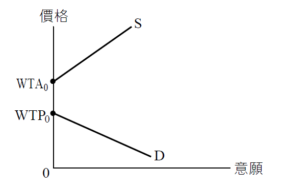

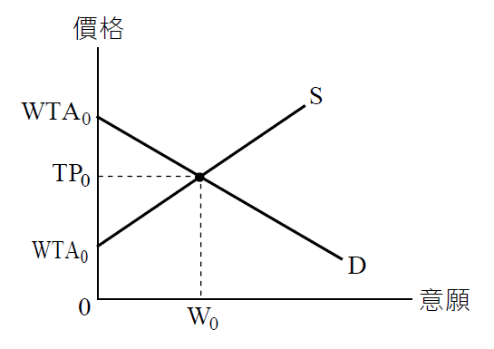

---
*注：本文圖片存放於 ./images/ 目錄下*

## 54. 消保法有關保證書之相關概念
*發布日期: 2025-09-16* 

## 內文
• (一) 消保法第25條有關書面保證書之規範

企業經營者對消費者保證商品或服務之品質時，應主動出具書面保證書。

前項保證書應載明下列事項：

1. 商品或服務之名稱、種類、數量，其有製造號碼或批號者，其製造號碼或批號。

2. 保證之內容。

3. 保證期間及其起算方法。

4. 製造商之名稱、地址。

5. 由經銷商售出者，經銷商之名稱、地址。

6. 交易日期。

其中，應注意商品或服務價格並不屬於保證事項，例如：「保證最便宜」、「保證買貴退差價」，皆非保證書應載明事項。

• (二) 規範主體(對象)

提供書面保證書之企業經營者是否限於商品製造商?抑或經銷商、零售商? 依上開法條文義，其規範之主體為「企業經營者」，又衡諸交易實務，經銷商或零售商為促銷商品而主動提供品質保證者，亦不乏其例，為保護消費者，似毋需為限縮解釋。因此，有關書面保證書之規範對象為「企業經營者」，不以商品製造商為限。(院臺消保字第1080016285號)

• (三) 書面保證書之效力

企業經營者對消費者就商品或服務之品質提供保證，為一獨立之擔保契約，業者應依其保證內容負擔保責任。(消保法字第0970007367號)

• (四) 未出具保證書之效力

依據消費者保護法施行細則第26條規定，企業經營者未依規定出具書面保證書者，仍應就其保證之品質負責。

例如：業者保證書上記載著「要加蓋經銷商印章」「須將保證回函寄回」、「須自行上網登錄」，「否則保證書無效」等除外條款者，已經違反消保法所記載的定型化契約，及違反公平互惠原則，且不論是否出具書面保證書，仍應就其保證品質負責。

• (五) 違反規定之處罰

企業經營者違反上述規定時，依消費者保護法第56條規定，經主管機關通知改正而逾期不改正者，處新臺幣二萬元以上二十萬元以下罰鍰，並得連續處罰。

• (六) 成屋履約保證是否屬書面保證書

仲介業者提供「成屋履約保證」之服務，其性質主要是付款（價金）保證，故是否完全符合消保法所稱書面保證書之擔保「品質」似有疑義，惟針對保證買方能順利完成不動產登記似也仍可算是仲介服務之品質，以及部分履約保證契約中，亦涉及保證不會漏水、海砂屋等瑕疵，以此而言，尚可符合書面保證書之意義與目的。

---
*注：本文圖片存放於 ./images/ 目錄下*

## 55. 房地之產權型態
*發布日期: 2025-09-11* 

## 內文
民法所稱「物」，於不動產上，指一宗土地或一棟建物。一個地號，稱為一宗土地。一個建號，稱為一棟建物。

• (一) 土地之產權型態：

1. 單獨所有：一宗土地由一個人所有。

2. 共有：一宗土地由數人共同擁有。共有方式又分為分別共有與公同共有。 (1)分別共有：亦稱持分共有；共有人以其應有部分（即持分）劃分權利範圍。 (2)公同共有：共有人基於公同關係共有一物，而無應有部分劃分權利範圍。公同關係之成立有三： 法律規定：如民法第1151條規定，繼承人有數人時，在分割遺產前，各繼承人對於遺產全部為公同共有。 法律行為：如民法第668條規定，各合夥人之出資及其他合夥財產，為合夥人全體之公同共有。 習慣：如祭祠公業之財產由派下現員全體公同共有。

• (二) 建物之產權型態：

1. 單獨所有：一棟建物由一個人所有。

2. 共有：一棟建物由數人共同擁有。共有方式又分為分別共有與公同共有。

3. 區分所有： (1)民法之定義：稱區分所有建築物者，謂數人區分一建築物而各專有其一部，就專有部分有單獨所有權，並就該建築物及其附屬物之共同部分共有之建築物（民§799Ⅰ）。 (2)公寓大廈管理條例之定義：區分所有，指數人區分一建築物而各有其專有部分，並就其共用部分按其應有部分有所有權（寓§3）。 (3)區分所有建物之構成：區分所有建物由專有部分與共有部分構成。 專有部分：

1. 民法之定義：專有部分，指區分所有建築物在構造上及使用上可獨立，且得單獨為所有權之標的者（民§799Ⅱ）。

2. 公寓大廈管理條例之定義：專有部分，指公寓大廈之一部分，具有使用上之獨立性，且為區分所有之標的者（寓§3）。

3. 專有部分之登記面積：專有部分，即為建築改良物登記簿謄本之主建物面積（即室內面積）及附屬建物面積（如陽台面積）。

共有部分：

1. 民法之定義：共有部分，指區分所有建築物專有部分以外之其他部分及不屬於專有部分之附屬物（民§799Ⅱ）。

2. 公寓大廈管理條例之定義：共用部分，指公寓大廈專有部分以外之其他部分及不屬專有之附屬建築物，而供共同使用者（寓§3）。

3. 共有部分之登記面積：共有部分面積，俗稱公共設施面積，即為建物改良物登記簿謄本之共有部分面積。另，公共設施在民法稱為共有部分，在公寓大廈管理條例稱為共用部分。共有部分之性質如下： (A)屬於從物：區分所有建物所屬共有部分，除法規另有規定外，依區分所有權人按其設置目的及使用性質之約定情形，分別合併，另編建號，單獨登記為各相關區分所有權人共有。區分所有建物共有部分之登記僅建立標示部及加附區分所有建物共有部分附表，其建號、總面積及權利範圍，應於各專有部分之建物所有權狀中記明之，不另發給所有權狀（登§81）。 基上，共有部分單獨編列一個或數個建號，因此代表一個或數個物。共有部分為專有部分之從物。亦即，專有部分為主物，共有部分為從物。主物之處分，及於從物（民§68II）。共有部分隨同專有部分讓與而讓與，亦隨同專有部分提供擔保而擔保。 (B)分為大公與小公：共有部分面積俗稱公共設施面積。公共設施面積又分為「大公」與「小公」。前者指全體區分所有權人皆需共同使用之公共設施（如機電設備空間、水箱水塔等），而登記為全體區分所有權人持分共有。後者指僅部分區分所有權人實際使用之公共設施（如當層樓梯、電梯空間），而登記為各相關區分所有權人持分共有。 (C)不得分割：區分所有建築物之共同使用部分，為各區分所有人利用該建築物不可或缺，其性質屬於民法第823條第1項但書規定因物之使用目的不能分割者，故不得辦理分割（司法院釋字第358號解釋）。須注意者，此不得分割，指標示分割，不包括權利分割。

• (三) 房地之產權型態：

房地產品以透天房屋及公寓大廈最為普遍。

1. 透天房屋：透天房屋又分為「真透天」與「假透天」二種。 (1)真透天：透天房屋持有人對建物產權為單獨所有，對基地產權亦為單獨所有。 (2)假透天：亦稱為持分透天；透天房屋持有人對建物產權為單獨所有，對基地產權為持分共有。

2. 公寓大廈：指構造上或使用上或在建築執照設計圖樣標有明確界線，得區分為數部分之建築物及其基地（寓§3）。亦即公寓大廈各戶持有人對建物產權為區分所有，對基地產權為持分共有。

[圖片1]

【註】 民：民法。 登：土地登記規則。 寓：公寓大廈管理條例。

## 文章圖片

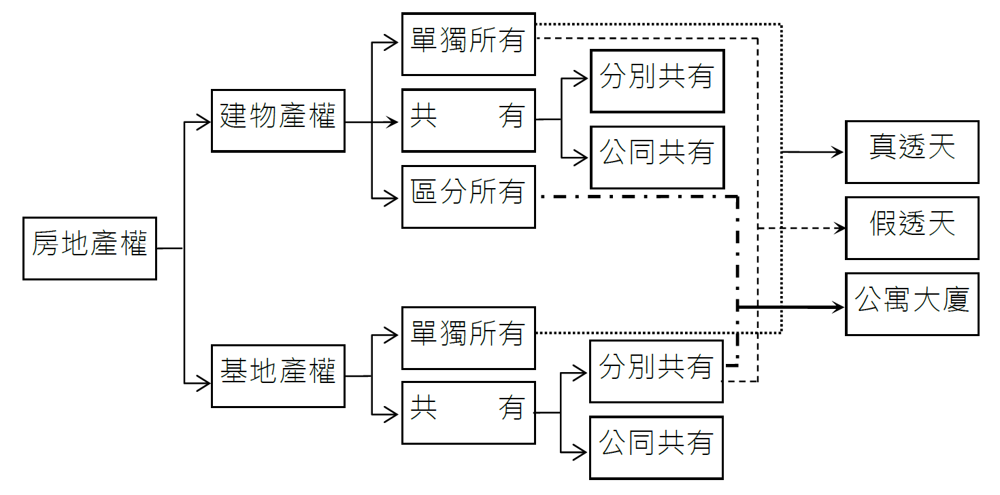

---
*注：本文圖片存放於 ./images/ 目錄下*

## 56. 聯合行為之規範
*發布日期: 2025-09-09* 

## 內文
• (一) 定義指具競爭關係之同一產銷階段事業，以契約、協議或其他方式之合意，共同決定商品或服務之價格、數量、技術、產品、設備、交易對象、交易地區或其他相互約束事業活動之行為，而足以影響生產、商品交易或服務供需之市場功能者。

• (二) 原則禁止事業採取聯合行為。

• (三) 例外事業不得為聯合行為。但有下列情形之一，而有益於整體經濟與公共利益，經申請主管機關許可者，不在此限：

1. 為降低成本、改良品質或增進效率，而統一商品或服務之規格或型式。

2. 為提高技術、改良品質、降低成本或增進效率，而共同研究開發商品、服務或市場。

3. 為促進事業合理經營，而分別作專業發展。

4. 為確保或促進輸出，而專就國外市場之競爭予以約定。

5. 輸入為加強貿易效能，而就國外商品或服務之輸入採取共同行為。

6. 因經濟不景氣，致同一行業之事業難以繼續維持或生產過剩，為有計畫適應需求而限制產銷數量、設備或價格之共同行為。

7. 為增進中小企業之經營效率，或加強其競爭能力所為之共同行為。

8. 其他為促進產業發展、技術創新或經營效率所必要之共同行為。

主管機關收受前項之申請，應於三個月內為決定；必要時得延長一次。 主管機關為前條之許可時，得附加條件或負擔。 許可應附期限，其期限不得逾五年；事業如有正當理由，得於期限屆滿前三個月至六個月期間內，以書面向主管機關申請延展；其延展期限，每次不得逾五年。 主管機關對於許可及其有關之條件、負擔、期限，應主動公開。

• (四) 不動產經紀業者涉及違法聯合行為之態樣例示

1. 共同決定服務報酬收費標準，或協議限制服務報酬之調整。

2. 共同劃分經營區域。

3. 共同劃分交易對象。

4. 共同阻礙或排除其他競爭者或潛在競爭者參與競爭，例如協議拒絕其他不動產經紀業者參與聯賣。

5. 共同約束開發物件必須與委託人簽訂專任委託契約，致使不動產經紀業者及委託人選擇委託契約型態之自由受到限制。

6. 共同約束專任委託契約之期間，致使不動產經紀業者縱未積極努力撮合，委託人卻因受限於契約而無法另行委託其他不動產經紀業者。

7. 共同約束收取斡旋金之票期，致使斡旋金票期趨於一致。

8. 共同約束實施聯賣之不動產物件開發方擁有一定的專賣期間，致使已尋得交易相對人之其他不動產經紀業者受限於專賣權之規定而無法成交。

---
*注：本文圖片存放於 ./images/ 目錄下*

## 57. 離差計算方法之差異
*發布日期: 2025-09-04* 

## 內文
茲舉一個例子說明：

[圖片1]

• (一) 總調整率不得大於30%之離差計算方法的差異：

1. 政府單位之計算方法： (1×1.03×1.01×0.98)−1=2%

2. 民間不動產估價師事務所之計算方法： 0%+3%+1%+│−2%│=6%

3. 結論： 民間不動產估價師事務所之計算結果高於政府單位。因為前者之調整率不會發生正負相抵銷，後者之調整率會發生正負相抵銷。

• (二) 總調整率不得大於30%與三件以上比較標的分別賦予權重之離差計算方法的差異：

1. 總調整率不得大於30%之離差計算方法： 0%+3%+1%+│−2%│=6%

2. 三件以上比較標的分別賦予權重之離差計算方法： (1)細項之離差計算： 2%+│−1%│+3%+0%+｜−5%｜+3%=14% (2)小項之離差計算： │−4%│+1%+14%+2%+｜−3%｜=24% (3)大項之離差計算： 0%+3%+0%+1%+24%=28% (4)最後計算出此一比較標的之離差為28%。

3. 結論： 總調整率不得大於30%之離差僅就大項調整率計算。然，三件以上比較標的分別賦予權重之離差計算是從細項離差計算得到小項離差，再由小項離差計算得到大項離差。

## 文章圖片

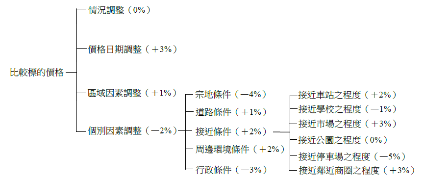

---
*注：本文圖片存放於 ./images/ 目錄下*

## 58. 公寓大廈管理條例-起造人相關義務
*發布日期: 2025-09-02* 

## 內文
依照公寓大廈管理條例，起造人相關義務，依照其辦理順序，茲整理如下：

• (一) 申請建造執照檢附相關文件

公寓大廈之起造人於申請建造執照時，應檢附專有部分、共用部分、約定專用部分、約定共用部分標示之詳細圖說及規約草約。於設計變更時亦同。前項規約草約經承受人簽署同意後，於區分所有權人會議訂定規約前，視為規約。(公寓§56)

• (二) 領得建造執照始得銷售

公寓大廈起造人或建築業者，非經領得建造執照，不得辦理銷售。(公寓§58)

• (三) 依規定測繪辦理建物登記

公寓大廈之起造人或區分所有權人應依使用執照所記載之用途及下列測繪規定，辦理建物所有權第一次登記(公寓§56)：

1. 獨立建築物所有權之牆壁，以牆之外緣為界。

2. 建築物共用之牆壁，以牆壁之中心為界。

3. 附屬建物以其外緣為界辦理登記。

4. 有隔牆之共用牆壁，依第二款之規定，無隔牆設置者，以使用執照竣工平面圖區分範圍為界，其面積應包括四周牆壁之厚度。

• (四) 移交共用設施設備

起造人應將公寓大廈共用部分、約定共用部分與其附屬設施設備；設施設備使用維護手冊及廠商資料、使用執照謄本、竣工圖說、水電、機械設施、消防及管線圖說，於管理委員會成立或管理負責人推選或指定後七日內會同政府主管機關、公寓大廈管理委員會或管理負責人現場針對水電、機械設施、消防設施及各類管線進行檢測，確認其功能正常無誤後，移交之。

公寓大廈之水電、機械設施、消防設施及各類管線不能通過檢測，或其功能有明顯缺陷者，管理委員會或管理負責人得報請主管機關處理，其歸責起造人者，主管機關命起造人負責修復改善，並於一個月內，起造人再會同管理委員會或管理負責人辦理移交手續。(公寓§57)

• (五) 不得將共用部分讓售於特定人

公寓大廈之起造人或建築業者，不得將共用部分，包含法定空地、法定停車空間及法定防空避難設備，讓售於特定人或為區分所有權人以外之特定人設定專用使用權或為其他有損害區分所有權人權益之行為。(公寓§58)

• (六) 提列公共基金

起造人就公寓大廈領得使用執照一年內之管理維護事項，應按工程造價一定比例或金額提列公共基金。依規定提列之公共基金，起造人於該公寓大廈使用執照申請時，應提出繳交各直轄市、縣 (市) 主管機關公庫代收之證明。(公寓§18)

• (七) 召開會議

1. 公寓大廈建築物所有權登記之區分所有權人達半數以上及其區分所有權比例合計半數以上時，起造人應於三個月內召集區分所有權人召開區分所有權人會議，成立管理委員會或推選管理負責人，並向直轄市、縣(市)主管機關報備。

2. 起造人於召集區分所有權人召開區分所有權人會議成立管理委員會或推選管理負責人前，為公寓大廈之管理負責人。(公寓§28)

---
*注：本文圖片存放於 ./images/ 目錄下*

## 59. 離差於不動產估價上之應用
*發布日期: 2025-08-28* 

## 內文
• (一) 離差之意義：

離差，指比較標的之價格形成因素，離勘估標的之價格形成因素的遠近。倘比較標的之價格形成因素，離勘估標的之價格形成因素較近，表示離差小，則選用此一比較標的較佳。相反地，倘比較標的之價格形成因素，離勘估標的之價格形成因素較遠，表示離差大，則選用此一比較標的較差。

• (二) 離差於不動產估價上之應用：

1. 不動產估價技術規則第25條規定，試算價格之調整運算過程中，區域因素調整、個別因素調整或區域因素及個別因素內之任一單獨項目之價格調整率大於百分之十五，或情況、價格日期、區域因素及個別因素調整總調整率大於百分之三十時，判定該比較標的與勘估標的差異過大，應排除該比較標的之適用。但勘估標的性質特殊或區位特殊缺乏市場交易資料，並於估價報告書中敘明者，不在此限。

2. 不動產估價技術規則第26條規定，經比較調整後求得之勘估標的試算價格，應就價格偏高或偏低者重新檢討，經檢討確認適當合理者，始得作為決定比較價格之基礎。檢討後試算價格之間差距仍達百分之二十以上者，應排除該試算價格之適用。

3. 不動產估價技術規則第27條規定，不動產估價師應採用三件以上比較標的，就其經推估檢討後之勘估標的試算價格，考量各比較標的蒐集資料可信度、「各比較標的與勘估標的價格形成因素之相近程度」，決定勘估標的之比較價格，並將比較修正內容敘明之。

4. 不動產估價技術規則第15條第1項規定，不動產估價師應就不同估價方法估價所獲得之價格進行綜合比較，就其中金額顯著差異者重新檢討。並視不同價格所蒐集資料可信度及估價種類目的條件差異，「考量價格形成因素之相近程度」，決定勘估標的價格，並將決定理由詳予敘明。

---
*注：本文圖片存放於 ./images/ 目錄下*

## 60. 市地重劃前後地價查估
*發布日期: 2025-08-26* 

## 內文
政府依法實施市地重劃時，應估計重劃前後地價，請說明該地價之用途為何？在查估重劃前各宗土地地價時，應先調查之土地資料為何？又在查估重劃後各街廓之路線價或區段價時，應參酌那些影響因素估計之？

• (一) 估計重劃前後地價之用途

1. 計算公共設施用地負擔之標準 實施市地重劃時，重劃區內供公共使用之道路、溝渠、兒童遊樂場、鄰里公園、廣場、綠地、國民小學、國民中學、停車場、零售市場等十項用地，除以原公有道路、溝渠、河川及未登記地等四項土地抵充外，其不足土地由參加重劃土地所有權人按其土地受益比例共同負擔。

2. 計算費用負擔之標準 實施市地重劃時，工程費用、重劃費用與貸款利息由參加重劃土地所有權人按其土地受益比例共同負擔。

3. 土地交換分配之標準 重劃區內之土地扣除折價抵付共同負擔之土地後，其餘土地仍依各宗土地地價數額比例分配與原土地所有權人。

4. 變通補償之標準 重劃分配結果，實際分配之土地面積多於應分配之面積者，應繳納差額地價；實際分配面積少於應分配之面積者，應發給差額地價。另，應分配土地之一部或全部因未達最小分配面積標準，不能分配土地者，得以現金補償之。

• (二) 查估重劃前各宗土地地價應先調查之土地資料

重劃前之地價應先調查土地位置、地勢、交通、使用狀況、買賣實例及當期公告現值等資料，分別估計重劃前各宗土地地價。

• (三) 查估重劃後各街廓之路線價或區段價應參酌之影響因素

重劃後之地價應參酌各街廓土地之位置、地勢、交通、道路寬度、公共設施、土地使用分區及重劃後預期發展情形，估計重劃後各路街之路線價或區段價。

---
*注：本文圖片存放於 ./images/ 目錄下*

## 61. 土地分割、土地合併、建物分割、建物合併之總整理
*發布日期: 2025-08-21* 

## 內文
• T. ABLE_PLACEHOLDER_1

【註】

1. 民：民法。

2. 登：土地登記規則。

3. 地測：地籍測量實施規則。

4. 土稅施：土地稅施行規則。

5. 契：契稅條例。

---
*注：本文圖片存放於 ./images/ 目錄下*

## 62. 公平交易法-違反結合之附加條件或負擔
*發布日期: 2025-08-19* 

## 內文
今年公平交易法中有關「結合」比較重要案例，應該就是全聯與大潤發之結合案件，今年考試應特別注意。相關考試重點茲整理如下：

• (一) 結合之意義

本法所稱結合，指事業有下列情形之一者（公交10 I）：

1. 與他事業合併。

2. 持有或取得他事業之股份或出資額，達到他事業有表決權股份總數或資本總額三分之一以上。

3. 受讓或承租他事業全部或主要部分之營業或財產。

4. 與他事業經常共同經營或受他事業委託經營。

5. 直接或間接控制他事業之業務經營或人事任免。

• (二) 結合應事先申報之條件

事業結合時，有下列情形之一者，應先向主管機關提出申報（公交11 I）：

1. 事業因結合而使其市場占有率達三分之一。

2. 參與結合之一事業，其市場占有率達四分之一。

3. 參與結合之事業，其上一會計年度銷售金額，超過主管機關所公告之金額。

• (三) 附加條件或負擔

主管機關對於結合申報案件所為之決定，得附加條件或負擔，以確保整體經濟利益大於限制競爭之不利益。（公交13 II）

• (四) 違反規定之處罰

事業違反規定而為結合，或申報後經主管機關禁止其結合而為結合，或未履行對於結合所附加之負擔者，主管機關得禁止其結合、限期令其分設事業、處分全部或部分股份、轉讓部分營業、免除擔任職務或為其他必要之處分，並得處新臺幣二十萬元以上五千萬元以下罰鍰。（公交39 I）

• (五) 大全聯案件

1. 全聯公司併購大潤發之結合負擔 「參與結合事業於結合實施之次日起，不得採最惠客戶政策」，也就是全聯公司不得以其他通路之商品定價，作為與供貨廠商雙方議價之基礎，要求更為有利或同等之條件。因為如此將以其市場力迫使供貨廠商吸收成本並產生「其他通路售價不低於全聯公司」之壓力，進而影響其他通路降價競爭幅度，反而不利於通路市場競爭，消費者也難在眾多通路享受更優惠的價格。

2. 違反規定行為 經查全聯公司於供貨廠商申請新品上架及申請調漲價格時，要求售價須為其他通路的一定折數，若有不符應同比例降價；以及於促銷檔期以其他競爭通路之商品定價作為雙方議價之基礎，而向供貨廠商協商調整促銷售價及進貨價格。

3. 處罰 今年4月公平會認定全聯公司未履行併購大潤發之結合承諾，故依照公平交易法第39條第1項處罰2,000萬元。

參考來源：全聯公司未履行併購大潤發之結合承諾，違反公平法之結合負擔，公平會重罰2,000萬元

---
*注：本文圖片存放於 ./images/ 目錄下*

## 63. 非市場價值之估價方法
*發布日期: 2025-08-14* 

## 內文
非市場價值（如自然資源、環境資源、遊憩資源、古遺文化資源等）之估價方法有旅遊成本法、特徵價格法及條件評價法等三種。

• (一) 旅遊成本法：利用旅遊者之願付價格（包括交通成本、門票費、住宿費、餐飲費、時間成本等），建立旅遊者對旅遊地點之旅遊需求曲線。此需求曲線所涵蓋之面積，即為該不動產之非市場價值。如圖所示，需求曲線AB是由邊際效用（MU）所導出，需求曲線即是邊際效用曲線。第1單位之邊際效用為MU1，第2單位之邊際效用為MU2，第3單位之邊際效用為MU3，……，第n單位之邊際效用為MUn。

• M. U1 + MU2 + MU3 … + MUn = TU 其中： TU：總效用。 TU即圖中△0AB之面積，亦即非市場價值。

1. 優點：結合旅遊地點之消費市場，可以具體衡量非市場價值。

2. 缺點：對未開放觀光旅遊之資源，難以適用。

[圖片1]

• (二) 特徵價格法：當市場上類似不動產成交時，以迴歸模型衡量不動產各種屬性（即特徵）對該不動產價格之貢獻。例如：

• P. = a + b1X1 + b2X2 + b3X3 + … + bnXn + e 其中： P：不動產價格（即因變數）。 a：縱軸截距（即常數項）。 bi , i = 1, 2, 3, …, n：迴歸係數。 Xi , i = 1, 2, 3, …, n：不動產各項特徵（即自變數），如交通條件、芬多精含量、負離子含量、物種多樣性、獨特性與不可替代性、相關服務設施（如住宿、停車等）。

1. 優點：以實際成交價格（即樣本），推求勘估標的價格，具有客觀性及市場性。

2. 缺點：實際成交價格取得不易，且樣本數太少。

• (三) 條件評價法：藉由問卷之設計及訪問，探求受訪者保留該不動產所願意支付之最高給付價格，或失去該不動產所願意接受之最低補償價格。以此最高給付價格或最低補償價格衡量該不動產之非市場價值。

1. 優點：可以廣泛應用於非市場價值之評估。

2. 缺點：屬於心理層面之主觀價值，而非市場層面之客觀價格。

## 文章圖片

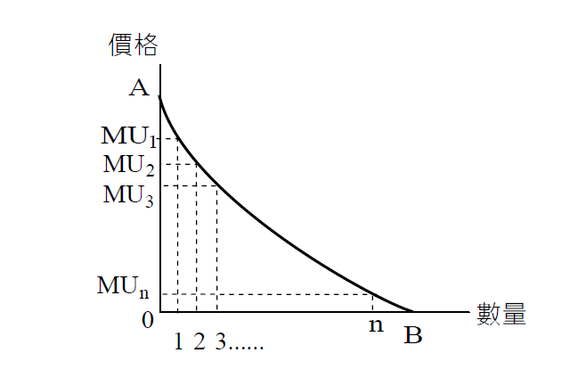

---
*注：本文圖片存放於 ./images/ 目錄下*

## 64. 房屋同時作營業與自住使用之房屋稅計算案例
*發布日期: 2025-08-12* 

## 內文
王大於114年1月新建一間樓地板面積為300平方公尺之房屋，並於當月開始起課房屋稅，其中15平方公尺供作飲料店營業使用，其餘面積則供自住使用。假設該房屋核定單價為每平方公尺8,000元，折舊率1%，地段等級調整率為200%，則王大當年應納房屋稅稅額為何？（該縣市營業用稅率為3%）

擬答

房屋同時作住家及非住家用者，應以實際使用面積，分別按住家用或非住家用稅率，課徵房屋稅。但非住家用者，課稅面積最低不得少於全部面積六分之一。 300×1/6＝50＞15，因此，以50平方公尺作為非住家用課稅面積。

• (一) 非住家營業用

1. 稅基 房屋現值＝核定單價×面積×(1-折舊率×經歷年數)×街路等級調整率 ＝8,000×50×(1-1%×0)×200% ＝800,000(元)

2. 稅率 供營業、私人醫院、診所或自由職業事務所使用者，最低不得少於其房屋現值3%，最高不得超過5%。而該縣市訂定營業用稅率為3%

3. 應納房屋稅 800,000×3%＝24,000(元)

• (二) 住家自住用

1. 稅基 房屋現值＝核定單價×面積×(1-折舊率×經歷年數)×街路等級調整率 ＝8,000×(300-50)×(1-1%×0)×200% ＝4,000,000(元)

2. 稅率 供自住、公益出租人出租使用或以土地設定地上權之使用權房屋並供該使用權人自住使用者，為其房屋現值1.2%。

3. 應納房屋稅 4,000,000×1.2%＝48,000(元)

• (三) 王大當年應納房屋稅稅額

新建係按月比例計課(1至6月) (24,000+48,000) ×6/12＝36,000(元)

---
*注：本文圖片存放於 ./images/ 目錄下*

## 65. 不動產市場(二)
*發布日期: 2025-08-07* 

## 內文
• (三) 不動產市場易發生市場失靈現象：

所謂市場失靈，指市場無法藉由其供需機制解決價格高漲問題。茲就一般財貨市場與不動產市場加以比較：

1. 一般財貨市場：如圖①所示，D0表示消費者對龍鬚菜之需求曲線，S0表示生產者（即農民）對龍鬚菜之供給曲線。由D0與S0之交點決定龍鬚菜之市場價格P0及市場交易量Q0。今，有一篇頗具權威性之醫學報告，指出龍鬚菜富含抗氧化因子。因而，市場上出現搶購龍鬚菜之熱潮，龍鬚菜之需求曲線由D0右上移至D1，龍鬚菜之市場價格由P0上漲至P1，市場交易量由Q0增加至Q1。此時，生產者發現龍鬚菜價格上漲，種植龍鬚菜有利可圖，因此大量種植龍鬚菜，致使龍鬚菜供給曲線由S0右下移至S1，龍鬚菜之市場價格由P1回跌至P0，市場交易量由Q1再增加至Q2。由此可知，龍鬚菜市場可藉由其供需機制，解決其價格高漲問題。

[圖片1]

圖① 龍鬚菜之市場運作

2. 不動產市場：如圖②所示， D’0表示消費者對住宅之需求曲線，S’0表示生產者（即建設公司）對住宅之供給曲線。由D’0與S’0之交點決定住宅之市場價格P3及市場交易量Q3。今，政府鼓勵台商回流，衍生對住宅需求增加，住宅需求曲線由D’0右上移至D’1，住宅之市場價格由P3上漲至P4，市場交易量由Q3增加至Q4。此時，市場產生投機氛圍，不動產投機需求滋生，致使住宅需求曲線再由D’1大幅右上移至D’2。然而，生產者購買土地投資興建住宅，需要大量資本，因而住宅供給增加有限，住宅供給曲線小幅由S’0右下移至S’1。住宅市場價格再由P4上漲至P5，市場交易量再由Q4增加至Q5。由此可知，住宅市場無法藉由其供需機制，解決價格高漲問題。

[圖片2]

圖② 住宅市場之市場運作

總之，一般財貨市場可藉由其本身供需機制，解決價格高漲問題，但不動產市場無法藉由其本身供需機制，解決價格高漲問題。因此，不動產市場需靠政府干預，抑制投機需求，始克平息不動產價格高漲。如中央銀行於民國113年9月19日祭出第七波選擇性信用管制，房價立即冷卻下來，即是著例。

## 文章圖片

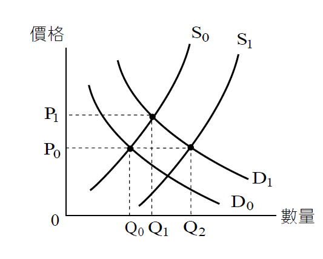

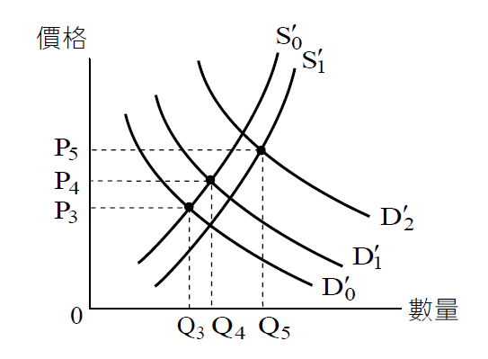

---
*注：本文圖片存放於 ./images/ 目錄下*

## 66. 鄉村地區整體規劃及鄉村地區計畫
*發布日期: 2025-08-05* 

## 內文
根據國土計畫法第8條第3項：「直轄市、縣（市）主管機關擬訂直轄市、縣（市）國土計畫時，得辦理鄉村地區整體規劃，並視實際需要研擬鄉村地區計畫，納入直轄市、縣（市）國土計畫，並得另以附冊方式定之。」其中，鄉村地區整體規劃與鄉村地區計畫，依照目前國土管理署對其定義與關連性，整理如下：

• (一) 鄉村地區整體規劃

基於直轄市、縣（市）國土計畫之指導，以鄉（鎮、市、區）或該鄉（鎮、市、區）內聚落及其周邊地區為範圍，就居住、產業、運輸、公共設施、景觀等面向研提更細緻之規劃內容，進而視需要提出土地使用配置，指認居住、產業及公共設施等區位。

鄉村地區整體規劃為辦理縣市國土計畫法定程序前之先期作業，並透過議題導向方式辦理，辦理程序包含盤點現況、彙整多面向課題、研擬策略所需資源及蒐整相關計畫等。其中可能包含居住生活、當地產業、公共設施、交通環境等各面向課題與對應之目的事業主管機關，故得透過部門協調之國土計畫法定工具，於辦理規劃作業時以機關研商、府內協調等方式，整合相關目的事業主管機關行政資源，發揮鄉村地區整體規劃作為「協商平臺」之功能。

• (二) 鄉村地區計畫

辦理聚落規劃或產業群聚空間規劃之法定計畫，可視為直轄市、縣（市）國土計畫內就鄉（鎮、市、區）範圍作更細緻之規劃與補充，並作為直轄市、縣（市）國土計畫之附冊。其主要功能即是將鄉村地區整體規劃轉換為可納入縣市國土計畫之內容，以落實引導相關部門資源投入、取得必要公共設施。

參考資料來源： 內政部國土管理署，2024.05，鄉村地區整體規劃政策及機制，國土計畫專業教育訓練。 2024.11.28，直轄市、縣（市）鄉村地區整體規劃作業第15次研商會議議程。 2025.04.01，直轄市、縣（市）鄉村地區整體規劃作業第16次研商會議議程。

---
*注：本文圖片存放於 ./images/ 目錄下*

## 67. 不動產市場(一)
*發布日期: 2025-07-31* 

## 內文
• (一) 不動產市場之意義

不動產市場，指由供給與需求，而形成價格之最適範圍。其特性如下：

1. 無具體市場：不動產不具移動性，因此不動產市場不像魚、肉、青菜、水果等有具體之交易市場。不動產市場是一個抽象的市場。

2. 無集中市場：不動產不具同質性，因此不動產市場不像股票有集中市場。不動產市場須透過不動產經紀人居間而為交易。

3. 無效率市場：完全競爭市場是一個有效率的市場，不動產市場離完全競爭市場之條件甚遠。因此，不動產市場是一個非常沒有效率的市場。

• (二) 不動產市場之種類

不動產屬於耐久財，因此不動市場除買賣市場外，另有租賃市場。不動產市場之種類如下表所示。

[圖片1]

## 文章圖片

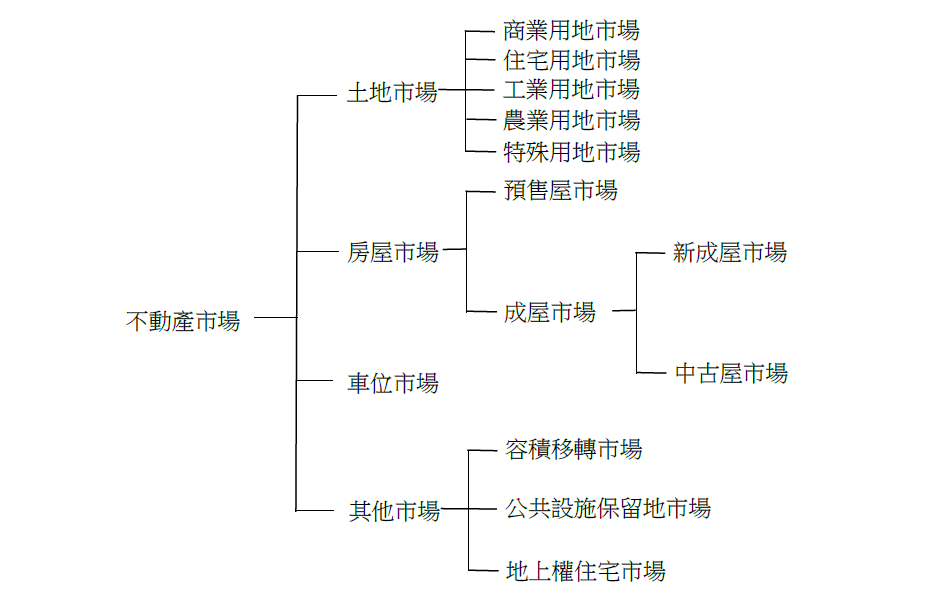

---
*注：本文圖片存放於 ./images/ 目錄下*

## 68. 農地(業)權
*發布日期: 2025-07-29* 

## 內文
針對今年高考土地政策第一題，提及國土計畫法相關爭議－農地（業）權本週專欄針對該觀念進行說明

114土地政策題目：

先前各方對於直轄市、縣（市）主管機關是否應於今(114)年如期公告國土功能分區圖發生爭執，其中優良農地是否仍繼續劃設為國土計畫法（下稱國土法）下農業發展地區第一類用地（下稱農一用地），應是爭執之焦點。茲於兼顧生態保育之正常農業經營前提下，農地利用具有外部效益性（例如涵養水源與淨化空氧等），故而從公平正義觀點，政府理當予以適度補貼（例如實施對地補貼等措施）。事實上，農業主管機關亦制定相應補貼政策，以提高農地之私權保障密度，並避免讓農民對其保有農地產生相對剝奪感。茲對前揭優良農地被劃入農一用地之爭議，有學者從農地（財產）權保障等視角，主張不應劃設之；但亦有學者認為農一用地劃設主要是因其本具高生產力（先前因政府投入巨施行農地重劃所致），而具有優先供作農用之義務（具有高度社會義務或強烈公共利益），故而主張應劃設之。試問何謂農地權？依國土法之規定，主管機關劃設農一用地時應考量原則為何？並請從農地所有權保障觀點，分析優良農地被劃入農一用地所需之相應措施。

擬答參考：

• (一) 農地權 農地除生產糧食以外，尚有其他多功能性，包含涵養水源、國土保育、維護景觀、文化傳承等外部效益。因此，從公平正義觀點，農地權係不僅限於保障農地之土地所有權，亦強調應保障農地農用之生活及生產經營權利，以確保達到農業永續、糧食安全之目標。

• (二) 劃設農一之原則 具優良農業生產環境、維持糧食安全功能或曾經投資建設重大農業改良設施之地區。

• (三) 優良農地被劃入農一用地所需之相應措施

1. 堆疊式給付 針對「農地農用」給予下列堆疊式經費獎勵及協助： (1)農地對地給付：由土地所有權人領取。農地依法從事農糧、養殖、畜牧、林業使用得給付條件；針對農作所需基本環境維護管理措施之雇工費用，政府適度提供給付支持。 (2)確保糧食安全給付：實耕者領取。引導種植產銷穩定作物，朝向契作集團生產，並規範交叉承諾事項(如揭露繳售數量、安全用藥等)，將依農民所選種植作物及各類農事操作模式，規劃堆疊式給付。 (3)生態環境給付：實耕者領取。配合有機友善耕作、生態及棲地維護或採行強化水土韌性措施，如種植節水作物、草生栽培、配合禽畜糞尿水資源化利用等，將依農民所選擇各類友善環境操作模式及區位，規劃堆疊式給付。 (4)農業設施設備補助：因地制宜擴大提供所需農業生產設施設備。 (5)農業金融支持：給予從農準備所需之農業金融支持 (6)農業公共基礎建設：完善重要農業生產環境，確保用水等基礎建設需求

2. 農地碳權 由於農地屬於碳匯空間，有助於碳平衡，故為保障優良農地被劃設為農一限制農用，可建立農地碳交易機制，向農地農用者購買碳權，使其獲得補貼。

3. 農地發展(建築)權移轉 將優良農地劃設為農一限制農用，似等於喪失農地發展(建築/變更)權，因而部分學者主張可參考國外農地發展權移轉制度，使農地可將其發展權移轉至其他建地使用，並藉此獲得補償，且確保農地後續維持農用。

4. 財政補助 針對農業縣市對於農地既要負擔糧食安全，卻無法從中收到地方充足的相關賦稅（農地免地價稅，且土地增值稅得申請不課徵或偏低），建議可就財政收支劃分法按農業貢獻度納入財政劃分的權重，給予農業縣市較多財政補助，以使其維持農地農用貢獻能被平衡、補償。

---
*注：本文圖片存放於 ./images/ 目錄下*

## 69. 土地增值稅之免徵、不課徵、記存及不計徵
*發布日期: 2025-07-24* 

## 內文
• (一) 意義：

1. 免徵：在土地增值稅之課徵範圍，但免除其租稅負擔，故屬於租稅免除。原地價須更動。如繼承而移轉土地，免徵土地增值稅（土稅§28）。

2. 不課徵：在土地增值稅之課徵範圍，但本次不予課徵，延至下次移轉時一併課徵，故屬於租稅遞延。原地價無須更動。如配偶相互贈與土地，得申請不課徵土地增值稅（土稅§28-1）。

3. 記存：在土地增值稅之課徵範圍，但結算已發生之土地增值稅，記在帳上，延至下次移轉時一併課徵，故屬於租稅遞延。原地價須更動。如金融機構因合併而隨同移轉土地予存續之金融機構，其應繳納之土地增值稅准予記存（金§13）。

4. 不計徵：不在土地增值稅之課徵範圍，故無須課徵土地增值稅。原地價無須更動。如土地重劃交換土地，不計徵土地增值稅。

• (二) 比較：

• T. ABLE_PLACEHOLDER_1

• (三) 法條誤用舉例：

早期並未嚴格區分免徵、不課徵及不計徵之差異，因此現行部分法條有誤用情形，造成適用混淆。茲舉例如下：

1. 平均地權條例第36條第1項規定：「土地增值稅之徵收，應依照土地漲價總數額計算，於土地所有權移轉或設定典權時行之。但因繼承而移轉者，不徵土地增值稅。」前揭法條之不徵，應為免徵。

2. 平均地權條例施行細則第65條第1項規定：「分別共有土地分割後，各人所取得之土地價值與其分割前應有部分價值相等者，免徵土地增值稅；其價值減少者，就其減少部分課徵土地增值稅。」及同條第3項規定：「土地合併後，各共有人應有部分價值與其合併前之土地價值相等者，免徵土地增值稅。其價值減少者，就其減少部分課徵土地增值稅。」前揭法條所稱免徵，應為不課徵。

3. 土地稅法施行細則第42條第2項規定：「分別共有土地分割後，各人所取得之土地價值與其分割前應有部分價值相等者，免徵土地增值稅；其價值減少者，就其減少部分課徵土地增值稅。」及同條第4項規定：「土地合併後，各共有人應有部分價值與其合併前之土地價值相等者，免徵土地增值稅。其價值減少者，就其減少部分課徵土地增值稅。」前揭法條所稱免徵，應為不課徵。

【註】

1. 土稅：土地稅法。

2. 金：金融機構合併法。

---
*注：本文圖片存放於 ./images/ 目錄下*

## 70. 容積獎勵之意涵與對都市發展之優缺點
*發布日期: 2025-07-22* 

## 內文
• (一) 容積獎勵之意涵

於建築基地之法定基準容積外，增加額外容積（樓地板面積）作為誘因，以獎勵民間配合設置必要公共設施、改善都市環境或配合特定政策。其類型例如：

1. 開放空間獎勵：留設開放空間之建築物，經直轄市、縣（市）主管建築機關審查符合建築技術規則規定者，得增加樓地板面積。

2. 停車空間獎勵：建築計畫為鼓勵建築物增設營業使用之停車空間，並依停車場法或相關法令規定開放供公眾停車使用，直轄市、縣（市）建築機關得另定鼓勵要點，報經中央主管建築機關核定實施。

3. 都市更新獎勵：都市更新事業計畫範圍內之建築基地，得視都市更新事業需要，給予適度之建築容積獎勵。

4. 都市計畫獎勵：設置公益性設施，或符合基地規模、綠建築、防災、停車等規定之獎勵。

• (二) 容積獎勵對都市發展之優點

1. 鼓勵民間提供相關必要公共設施，藉此解決部分公共服務機能不足問題。

2. 鼓勵民間配合與參與都市發展政策，例如都市更新、危險及老舊建築物重建、捷運土地開發等。

3. 促成都市集約發展型態，提高土地使用效率。

• (三) 容積獎勵對都市發展之缺點

1. 效率面

1. 各種政策都想利用一致性的容積獎勵來推動，與現行都市計畫脫勾，甚至可說是凌駕其上，跳脫都市計畫整體性空間規劃秩序，違反土地使用分區原本所欲達到之維持良好環境品質目的。

2. 都市內之公園、綠地、防災空間、道路系統等公共設施，皆已依都市計畫所容許之發展總量及其活動量加以配置及建設，惟容積獎勵增加建築基地的樓地板面積，吸引更多人口移入，卻未要求對等增加公共設施容量，使得都市公共設施不足，土地使用效率低落。

3. 常出現投機情形而未達到原本預期之目的與效益，例如停車位僅提供給基地內區分所有權人使用，或開放空間未明確開放給公眾使用等。

2. 公平面

1. 容積獎勵鼓勵基地所有權人，使其增加樓地板面積及效益，但帶來的人口擁擠效果、外部效果與公共設施服務水準降低效果，卻需由周邊居民承受，而無須相對應付費。

2. 建築容積為土地發展權，是經由人口成長、經濟社會發展及公共建設所創造，故本質上屬於一種公共財，以致於無明確對價關係之容積獎勵等同於利益輸送。

---
*注：本文圖片存放於 ./images/ 目錄下*

## 71. ESG之意涵
*發布日期: 2025-07-17* 

## 內文
• E. SG是三個英文單字的縮寫。E代表環境保護（Environmental），S代表社會責任（Social），G代表公司治理（Governance）。ESG為衡量一家企業經營績效之指標。

• (一) 環境保護：涵蓋碳排減量、水及污水管理、生物多樣性、能源管理、環境污染防制等。

• (二) 社會責任：涵蓋工作環境、勞動福利、客戶關係、社區關懷、人權議題等。

• (三) 公司治理：涵蓋內部控管、董事組成、股東權益、商業倫理、風險管理、資訊透明等。

總之，企業除追求商業利潤外，更應注重環境保護、社會責任及公司治理等公共利益。因此，評估一家企業之價值不能僅從財務報表之盈餘或淨值衡量，尚應加入ESG面向衡量。

---
*注：本文圖片存放於 ./images/ 目錄下*

## 72. 房地合一所得稅申請重購退稅之要件
*發布日期: 2025-07-15* 

## 內文
• 一、法條規定

• (一) 先賣後買（申請退稅） 個人出售自住房屋、土地依第十四條之五規定繳納之稅額，自完成移轉登記之日或房屋使用權交易之日起算二年內，重購自住房屋、土地者，得於重購自住房屋、土地完成移轉登記或房屋使用權交易之次日起算五年內，申請按重購價額占出售價額之比率，自前開繳納稅額計算退還(所§14-8 I)。亦即與土地增值稅的差額退稅方式不同，而是配合高齡化社會來臨及節稅規劃需求，採比例退稅方式，只要重購都有得退：

1. 重購價額≧出售價額（換大換貴）：全額退稅。

2. 重購價額＜出售價額（換小換便宜）：比例退稅。

• (二) 先買後賣（申報扣抵） 個人於先購買自住房屋、土地後，自完成移轉登記之日或房屋使用權交易之日起算二年內，出售其他自住房屋、土地者，於依第十四條之五規定申報時，得按前項規定之比率計算扣抵稅額，在不超過應納稅額之限額內減除之(所§14-8 II)。

• 二、要件

• (一) 設籍 本人或配偶、未成年子女辦竣戶籍登記並居住。應注意實務上國稅局會查核實際居住情形，透過用水用電之度數予以確認。

• (二) 用途 該房屋出售前1年內及新購後皆無出租、供營業或執行業務使用。

• (三) 產權 房、地產權須為本人或其配偶所有。以配偶之一方出售自住房屋、土地，而以配偶之他方名義重購者，亦得適用(要點§17)。

• (四) 期間 不論先賣後買或先買後賣，其移轉登記(權利)日相距2年內。

• (五) 申請 登記(交易)日次日起5年內申請退稅；先買後賣可於申報時直接扣抵。

• (六) 限制 重購於登記(交易日)後5年內改作其他用途或再行移轉時，應追繳原扣抵或退還稅額。

---
*注：本文圖片存放於 ./images/ 目錄下*

## 73. 機會成本（Opportunity Cost）
*發布日期: 2025-07-10* 

## 內文
機會成本，指某一項生產要素用於特定用途，就不能用於其他用途之成本。在所有犠牲之各種用途中，犠牲最大者，即為其機會成本。如使用自有資金投入建築，仍須以機會成本設算資金成本。因為如果該自有資金不投入建築，就可以存放在銀行滋生利息，因此機會成本以一定期定存利率計算之利息為準。

---
*注：本文圖片存放於 ./images/ 目錄下*

## 74. 房地合一稅計算範例
*發布日期: 2025-07-08* 

## 內文
黃母77年購買一處房地後，103年1月15日死亡後，由黃先生及哥哥2人繼承登記各二分之一，而後哥哥考量整筆出售較為有利，故於107年11月1日將二分之一持分贈與給黃先生，受贈時房屋評定現值17.6萬元、土地公告現值66萬元，並繳納契稅、土地增值稅、規費等合計2萬元，接著由黃先生於113年6月1日以550萬元出售該房地，未提示費用收據，無土地漲價總數額（公告土地現值無調漲），試問黃先生應繳納多少的房地合一所得稅？（以107年11月為基期，113年6月消費者物價指數105.1%）

• (一) 繼承而來的二分之一 係於103年1月15日繼承取得，屬舊制財產交易所得課稅範圍，土地交易所得免稅，房屋交易所得應併計113年度綜合所得稅申報課稅。

• (二) 受贈而來的二分之一 係於107年11月1日受贈取得，因取得日期為105年1月1日以後，故屬房地合一稅制課稅範圍。其計算如下：

1. 稅基 (1)成交價額：550×1/2＝275(萬元) (2)原始取得成本：受贈無取得成本，故以受贈時之房屋評定現值及公告土地現值按政府發布之消費者物價指數調整後之價值＝(17.6+66)×1/2×105.1%＝43.9318(萬元) (3)必要成本＝2(萬元) (4)費用：因未提示費用收據，故以成交價3%計＝275×3%＝8.25(萬元)。 (5)土地漲價總數額：0。 (6)所得餘額＝成交價額－(受贈時公告土地現值+房屋評定現值)×物價調整－費用－依土地稅法計算之土地漲價總數額 ＝275－43.9318－2－8.25－0＝220.8182(萬元)

2. 稅率 持有期間應為取得日107年11月1日至交易日113年6月1日，共計5年7個月，故稅率為20%。

3. 甲房地交易所得稅額 220.8182×20%＝44.1636(萬元)

---
*注：本文圖片存放於 ./images/ 目錄下*

## 75. 先行區段徵收
*發布日期: 2025-07-03* 

## 內文
• (一) 先行區段徵收之意義：區段徵收為都市計畫整體開發方式之一。因此，原則上應先發布都市計畫，再辦理區段徵收。但亦有例外，先辦理區段徵收，再發布都市計畫。此例外情形稱為「先行區段徵收」。

• (二) 先行區段徵收之目的：

1. 都市計畫內容未必與區段徵收密切配合。因此，先辦理區段徵收，再發布都市計畫，以確保都市計畫具體可行。

2. 倘先發布都市計畫，再辦理區段徵收，後續仍須對都市計畫未周延完善部分，再辦理都市計畫變更。倘先辦理區段徵收，再發布都市計畫，則都市計畫內容一次完成，無須再辦理都市計畫變更。

3. 都市計畫一旦發布實施，造成區內地價漲跌不一，導致地主權益不公平現象，而阻礙後續區段徵收之推行。因此，先推行區段徵收，以防止地主權益不公平現象之發生。

4. 先辦理區段徵收，再於區段徵收進行中，配合發布都市計畫，以縮短區段徵收開發時程。

• (三) 先行區段徵收之規定：

1. 土地徵收條例第4條第1項第1款至第3款之開發範圍經中央主管機關核定者，得先行區段徵收，並於區段徵收公告期滿後一年內發布實施都市計畫，不受都市計畫法第52條規定之限制（徵§4II）。

2. 土地徵收條例第4條第1項第4款或第6款之開發，涉及都市計畫之新訂、擴大或變更者，得依上開之規定辦理（徵§4IV）。

3. 先行區段徵收地區，應配合辦理迅行變更都市計畫者，需用土地人應於報請中央主管機關核定開發範圍前，先徵得中央都市計畫主管機關同意依都市計畫法第27條規定辦理；應辦理新訂或擴大都市計畫者，依規定層報核可（區徵§9）。

4. 先行區段微收地區，應於區段徵收公告期滿一年内發布實施都市計畫（區徵§11III）。

【註】 徵：土地徵收條例。 區徵：區段徵收實施辦法。

---
*注：本文圖片存放於 ./images/ 目錄下*

## 76. 申報土地移轉現值之認定
*發布日期: 2025-07-01* 

## 內文
• (一) 時間認定

土地所有權移轉或設定典權，其申報移轉現值之審核標準，依下列規定(土稅§30 I；平權47-1 I)：

1. 申報人於訂定契約之日起三十日內申報者，以訂約日當期之公告土地現值為準。

2. 申報人逾訂定契約之日起三十日始申報者，以受理申報機關收件日當期之公告土地現值為準。

3. 遺贈之土地，以遺贈人死亡日當期之公告土地現值為準。

4. 依法院判決移轉登記者，以申報人向法院起訴日當期之公告土地現值為準。

5. 經法院或法務部行政執行署所屬行政執行分署（簡稱行政執行分署）拍賣之土地，以拍定日當期之公告土地現值為準。但拍定價額低於公告土地現值者，以拍定價額為準；拍定價額如已先將設定抵押金額及其他債務予以扣除者，應以併同計算之金額為準。

6. 經政府核定照價收買或協議購買之土地，以政府收買日或購買日當期之公告土地現值為準。但政府給付之地價低於收買日或購買日當期之公告土地現值者，以政府給付之地價為準。

• (二) 價值認定

1. 前第1款至第4款申報人申報之移轉現值，經審核低於公告土地現值者，得由主管機關照其自行申報之移轉現值收買或照公告土地現值徵收土地增值稅。

2. 前第1款至第3款之申報移轉現值，經審核超過公告土地現值者，應以其自行申報之移轉現值為準，徵收土地增值稅。

申報移轉現值認定之整理

• T. ABLE_PLACEHOLDER_1

---
*注：本文圖片存放於 ./images/ 目錄下*

## 77. 公同共有人可否單獨行使優先購買權？
*發布日期: 2025-06-26* 

## 內文
公同共有人為數人時，如未經全體公同共有人同意，得否由其中一人單獨行使優先購買權？

• (一) 否定說：民法第828條第3項規定：「公同共有物之處分及其他之權利行使，除法律另有規定外，應得公同共有人全體之同意。」所謂「其他之權利行使」，包括行使優先購買權在內。因此，公同共有人行使優先購買權應經全體公同共有人之同意，不得由其中一人單獨行使。

• (二) 肯定說：法條規定之優先購買權人，係立法賦予其有取得優先購買權之資格，得行使之權利係優先購買權。該權利行使既係一種資格，非行使全體公同共有人之公同共有之權利，自無需由公同共有人共同為之，與公同共有人權利行使無涉（最高法院109年度台上字第1546號判決）。

綜上，早期多採否定說，最近傾向採肯定說。

---
*注：本文圖片存放於 ./images/ 目錄下*

## 78. 國土計畫法延期之原因
*發布日期: 2025-06-24* 

## 內文
參考國土計畫法修法之立委提案理由，茲整理如下：

1. 有更多時間充分調查及合理規劃期程。

2. 有更多時間持續充分溝通。

3. 子法、配套尚未完善。

4. 大部份目的事業主管機關所掌握的圖資年度已久亦未更新，成圖時間不一，精度也不一致。

5. 財產權益影響疑慮。

6. 農業權之質疑，構成特別犧牲。

7. 有鑑於「農業發展區」及「國土保育區」縣市的地方稅收不足，又加上全國國土計畫劃設農業發展地區影響限制地方發展，所以普通統籌分配款應優先分配給土地發展受影響的縣市，使地方發展是可帶動的，以免造成強者恆強弱者恆弱的現象。國土計畫法上路前，需先完善財政收支分配之公平性，以利穩定發展。

---
*注：本文圖片存放於 ./images/ 目錄下*

## 79. 不計徵土地增值稅之意涵
*發布日期: 2025-06-19* 

## 內文
• (一) 不計徵土地增值稅之意義： 亦稱不徵土地增值稅；指不在土地增值稅之課徵範圍，因此不必徵收土地增值稅。

• (二) 不計徵土地增值稅與免徵土地增值稅之比較：

1. 不計徵土地增值稅，指不在土地增值稅之課徵範圍，故不必課徵土地增值稅。免徵土地增值稅，指在土地增值稅之課徵範圍，故應課徵土地增值稅，但給予租稅免除。

2. 不計徵土地增值稅，其原地價未更動，租稅效果等同「不課徵土地增值稅」（即租稅遞延）。免徵土地增值稅，其原地價必須更動，租稅效果為租稅免除。

• (三) 舉例說明：

1. 土地增值稅之課徵時機為移轉（指土地所有權移轉）及設定典權。準此，設定地上權及地上權移轉不在土地增值稅之課徵範圍。因此,設定地上權及地上權移轉不計徵土地增值稅。但不宜敍述為「設定地上權及地上權移轉免徵土地增值稅或不課徵土地增值稅」。

2. 平均地權條例施行細則第87條第1項規定：「土地所有權人依本條例第六十條負擔之公共用地及抵費地，不計徵土地增值稅，逕行登記為直轄市、縣（市）有。但由中央主管機關辦理者，抵費地登記為國有。」市地重劃之原土地所有權人交換分合土地，原本屬於土地移轉，應課徵土地增值稅。但平均地權條例第62條本文規定：「市地重劃後，重行分配與原土地所有權人之土地，自分配結果確定之日起，視為其原有之土地。」亦即，市地重劃之原土地所有權人交換分合後所取得之土地，視為其原有土地，等同未移轉土地。因此，市地重劃交換分合之土地，不計徵土地增值稅。同理，原土地所有權人所負擔之公共用地及抵費地，亦為交換分合之一部分，因此不計徵土地增值稅。

[圖片1]

## 文章圖片

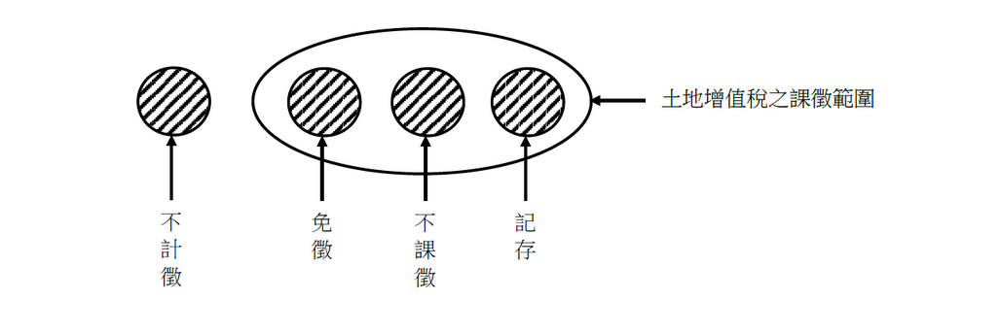

---
*注：本文圖片存放於 ./images/ 目錄下*

## 80. 農業用地變更條件
*發布日期: 2025-06-17* 

## 內文
• (一) 不影響農業生產環境之完整性根據農業發展條例第10條：「農業用地於劃定或變更為非農業使用時，應以不影響農業生產環境之完整，並先徵得主管機關之同意。」

• (二) 徵得農業主管機關之同意依據農業主管機關同意農業用地變更使用審查作業要點第5點：「農業用地變更使用，應避免影響農業生產環境之完整。有下列情形之一者，不同意變更使用：

1. 未依規定規劃設置隔離綠帶或設施。

2. 使用具有農業灌溉功能之系統作為廢污水排放使用或有妨礙上、下游農業灌排水系統輸水能力之虞。

3. 申請變更範圍內夾雜未申請變更之農業用地且妨礙其農業經營。

4. 妨礙原有區域性農路通行。

5. 申請變更農業用地辦理部分土地分割，致造成坵塊零碎不利農業經營。但線狀之公共建設，不在此限。

6. 目的事業主管機關就事業設置之必要性與計畫使用農業用地所提區位、面積之必要性、合理性及無可替代性，未提出評估意見或未表示支持意見。

7. 其他依本要點規定不得同意變更使用之情形。

• (三) 繳交回饋金按農業發展條例第12條：「農業用地之變更，應視其事業性質，繳交回饋金，撥交中央主管機關所設置之農業發展基金，專供農業發展及農民福利之用。」

---
*注：本文圖片存放於 ./images/ 目錄下*

## 81. 購屋預約單與預售屋買賣契約之轉售異同比較
*發布日期: 2025-06-12* 

## 內文
購屋預約單與預售屋買賣契約之轉售異同比較如下：

• (一) 購屋預約單與預售屋買賣契約皆禁止買受人之轉售行為。

• (二) 銷售預售屋者，皆不得同意或協助買受人將購屋預約單及預售屋買賣契約轉售與第三人。

• (三) 購屋預約單與預售屋買賣契約之轉售行為，依據民法第71條但書規定，仍然有效。

• (四) 購屋預約單與預售屋買賣契約之轉售，皆須課徵房地合一所得稅。

• (五) 購屋預約單之轉售行為，處新台幣15萬元以上100萬元以下罰鍰。預售屋買賣契約之轉售行為，處新台幣50萬元以上300萬元以下罰鍰。

---
*注：本文圖片存放於 ./images/ 目錄下*

## 82. 地籍清理代為標售有關優先購買權之法律性質
*發布日期: 2025-06-10* 

## 內文
依據地籍清理條例規定，當部分有問題之地籍無法釐清時，將由直轄市或縣（市）主管機關代為標售，並依同法第12條規定，下列之人，依序享有優先購買權：

1. 地上權人、典權人、永佃權人、農育權人。（以登記之先後定之）

2. 基地或耕地承租人。

3. 共有土地之他共有人。

4. 本條例施行前已占有達十年以上，至標售時仍繼續為該土地之占有人。

其中，關於優先購買權之法律性質，在學說上，係以「形成權」為通說，亦即當優先購買權人一經主張，則買賣關係旋即成立，無庸出賣人承諾。然而，有學者認為針對地籍清理條例所定優先購買權之法律性質，應屬「訂約請求權」，而非形成權，其理由如下(陳立夫，2025)：

1. 所定之優先購買權人，擬行使優先購買權，應主動地於決標後，10日內檢附相關證明文件，向執行標售之直轄市、縣（市）主管機關提出申請，並由該主管機關予以審查決定申請人是否得優先購買。

2. 本條各款規定之不同優先順位優先購買權人，如均有申請優先承購時，則直轄市、縣（市）主管機關尚須就其優先順序者決定購買者。

簡言之，該優先購買權係透過申請，且須經過審查，而不同於土地法之共有、基地等法定優先購買權，一經表示即成立。

資料來源：陳立夫，2025，地籍清理條例規定之優先購買權──臺北高等行政法院高等庭112年度訴字第99號判決解說，月旦實務選評，第5卷，第4期。

---
*注：本文圖片存放於 ./images/ 目錄下*

## 83. 實價登錄之車位拆分問題
*發布日期: 2025-06-05* 

## 內文
一般而言，預售屋買賣時，車位單獨銷售，因此無車位拆分問題。然，成屋買賣時，車位未單獨銷售，車位價格包含在房屋交易總價之內，因此必須拆分出車位面積及車位價格，始可計算出真正的房價。亦即（內政部不動產交易實價登錄服務網之公式）：

[圖片1]

實務上，常發生下列三種情形：

1. 車位總面積不詳，但車位總價明確。

2. 車位總價不詳，但車位總面積明確。

3. 車位總面積及車位總價皆不詳。

• (一) 車位總面積在不詳情況下，倘拆分車位總面積過多，則房屋單價偏高；倘拆分車位總面積過少，則房屋單價偏低。

• (二) 車位總價不詳情況下，倘拆分車位總價過多，則房屋單價偏低；倘拆分車位總價過少，則房屋單價偏高。

由此可知，車位之拆分干擾房價高低，對實價登錄資訊之正確性影響甚大。

## 文章圖片

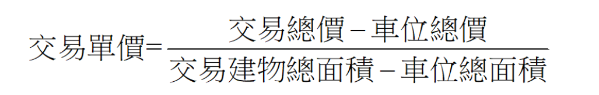

---
*注：本文圖片存放於 ./images/ 目錄下*

## 84. 配偶相互贈與得申請不課徵之概念
*發布日期: 2025-06-03* 

## 內文
• (一) 情形

配偶相互贈與之土地，得申請不課徵土地增值稅(土稅§28-2 I前段)。主要是基於配偶為生活共同體，且於一般生活事務相互代理，故相互贈與土地可能是考量家庭財產安排，而非為獲取土地自然增值利益，因而得按其需求申請不課徵。

又應特別注意者，配偶相互贈與土地非當然不課徵土地增值稅，而是可由當事人自行選擇。但無論是否申請不課徵，均須申報移轉現值。

• (二) 原地價認定

於再移轉依法應課徵土地增值稅時，以該土地第一次不課徵土地增值稅前之原規定地價或最近一次課徵土地增值稅時核定之申報移轉現值為原地價，計算漲價總數額，課徵土地增值稅(土稅§28-2 I後段)。換言之，以第一次不課徵前原地價計算土地漲價總數額，原不課徵之土地增值稅，實質上已予補徵，政府稅收並未減少，僅發生延遲課徵效果。

概念如下圖所示，甲取得土地後，因特殊考量而將該筆土地贈與配偶乙，並申請不課徵土地增值稅，則該次移轉即不計算也不繳納土地增值稅，故原地價也不予調整，待配偶乙移轉他人需課徵土地增值稅時，則以甲取得至乙移轉他人此段期間之土地漲價計算，而非以乙取得為原地價。

[圖片1]

值得注意的是，雖然此次配偶間移轉得暫不課徵，惟將租稅時機往後遞延，多年後再將土地移轉給第三人時，反而可能會適用比原先選擇「課徵」時的稅率還高，因為公告土地現值一般多逐年調高，選擇不課徵未必有利。

• (三) 配偶合併認定

1. 於再移轉計課土地增值稅時，贈與人或受贈人於其具有土地所有權之期間內，有支付改良土地之改良費用或增繳之地價稅者，準用減除或抵繳規定(土稅§28-2 II前段)，避免原贈與人(夫)有支付土地改良費用及增繳地價稅，但於贈與給受贈人(妻)後，反而不能減除之不合理情形。

2. 其為經重劃之土地，準用其減徵規定(土稅§28-2 II中段)。舉例而言，某甲參與市地重劃後配回之土地贈與妻乙，嗣後妻乙再將該土地出售於丙。乙得否適用重劃後第一次移轉之土地增值稅減徵規定？其情形應分述如下： (1)甲乙贈與有申請不課徵土地增值稅 因有申請不課徵，該次租稅遞延，故非屬重劃後第一次移轉之情形。因此，當乙再將土地出售於丙，仍得適用土地增值稅減徵百分之四十。 (2)甲乙贈與未申請不課徵土地增值稅 因未申請不課徵，該次贈與移轉即屬重劃後第一次移轉之情形，乙的土地增值稅得予減徵百分之四十。惟當乙再將土地出售於丙，即無土地增值稅之減徵。

3. 該項再移轉土地，於申請適用自用住宅稅率課徵土地增值稅時，其出售前一年內未曾供營業使用或出租之期間，應合併計算(土稅§28-2 II後段)。例如夫持有5個月皆未營業或出租，後贈與給妻，則妻原則上只要再持有7個月無營業或出租，兩者合計滿一年即可符合規定。

## 文章圖片

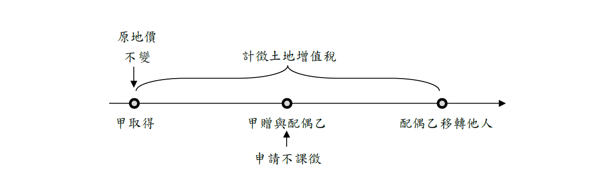

---
*注：本文圖片存放於 ./images/ 目錄下*

## 85. 地號之分號與建號之分號的比較
*發布日期: 2025-05-29* 

## 內文
試述地號之分號與建號之分號所代表之涵義，有何不同？

【解】

• (一) 地號之分號：地號之分號係土地分割所造成。詳言之，土地分割之地號，應依下列規定編定，並將編定情形登載於分號管理簿或電腦建檔管理之：

1. 原地號分割時，除將其中一宗維持原地號外，其他各宗以分號順序編列之。

2. 分號土地或經分割後之原地號土地，再行分割時，除其中一宗保留原分號或原地號外，其餘各宗繼續原地號之最後分號之次一分號順序編列之。

• (二) 建號之分號：建號之分號：建號之分號係特別建物所造成。所稱特別建物，指下列建物，在同一建築基地範圍內屬於同一所有權人，供同一目的使用者：

1. 公有公用之建物。

2. 地方自治團體建物。

3. 學校。

4. 工廠倉庫。

5. 祠、廟、寺院或教堂。

6. 名勝史蹟之建物。

特別建物數棟併編一建號為母號，亦為五位數，其各棟建物之棟次以分號編列，為三位數。

應特別說明，建物之分號並非建物分割所造成。因為分割後之建物，除將其中一棟維持原建號外，其他各棟以該地段最後建號之次一號順序編列。

---
*注：本文圖片存放於 ./images/ 目錄下*

## 86. 地政士禁止行為
*發布日期: 2025-05-27* 

## 內文
某甲地政士，知情且協助假買方騙取賣方權狀、印鑑，並申辦高額抵押貸款取得資金後，即拒不見面，導致賣方收不到尾款又被設定高額抵押，權益嚴重受損，試問某甲違反地政士法哪些規定？

1. 地政士不得有下列行為： (1)違反法令執行業務。 (2)允諾他人假藉其名義執行業務。 (3)以不正當方法招攬業務。 (4)為開業、遷移或業務範圍以外之宣傳性廣告。 (5)要求、期約或收受規定外之任何酬金。 (6)明知為不實之權利書狀、印鑑證明或其他證明文件而向登記機關申辦登記。 甲之聯合詐騙行為屬於前述違法法令執行業務，應予停止執行業務或除名。

2. 地政士受託辦理各項業務，不得有不正當行為或違反業務上應盡之義務。甲之聯合詐騙行為違反規定，致委託人或其他利害關係人受有損害時，應負賠償責任。此外，應予停止執行業務或除名。

---
*注：本文圖片存放於 ./images/ 目錄下*

## 87. 預售屋銷售管理
*發布日期: 2025-05-22* 

## 內文
平均地權條例對於預售屋銷售管理之規定如下：

• (一) 銷售資料報請主管機關備查：

1. 銷售預售屋者，應於銷售前將預售屋坐落基地、建案名稱、銷售地點、期間、戶（棟）數及預售屋買賣定型化契約，以書面報請預售屋坐落基地所在之直轄市、縣（市）主管機關備查（平§47-3I）。

2. 經營代銷業務，受起造人或建築業委託代銷預售屋者，應於簽訂、變更或終止委託代銷契約之日起三十日內，將委託代銷契約相關書件報請所在地直轄市、縣（市）主管機關備查（經§24-1II）。

• (二) 購屋預約單不得轉售：

1. 銷售預售屋或新建成屋者，向買受人收受定金或類似名目之金額，應以書面契據確立買賣標的物及價金等事項，並不得約定保留出售、保留簽訂買賣契約之權利或其他不利於買受人之事項。委託不動產經紀業代銷者，亦同（平§47-3）。

2. 前項書面契據，買受人不得轉售與第三人。銷售預售屋或新建成屋者，不得同意或協助買受人將該書面契據轉售與第三人（平§47-3VI）。

• (三) 預售屋買賣契約不得轉售：

1. 預售屋或新建成屋買賣契約之買受人，於簽訂買賣契約後，不得讓與或轉售買賣契約與第三人，並不得自行或委託刊登讓與或轉售廣告。但配偶、直系血親或二親等內旁系血親間之讓與或轉售；或其他中央主管機關公告得讓與或轉售之情形並經直轄市、縣（市）主管機關核准者，不在此限（平§47-4I）。

2. 銷售預售屋或新建成屋者，不得同意或協助買受人將買賣契約讓與或轉售第三人，並不得接受委託刊登讓與或轉售廣告（平§47-4III）。

• (四) 限制炒作行為： 任何人不得有下列各款之行為：

1. 以電子通訊、網際網路、說明會或其他傳播方式散布不實資訊，影響不動產交易價格。

2. 與他人通謀或為虛偽交易，營造不動產交易活絡之表象。

3. 自行、以他人名義或集結多數人違規銷售、連續買入或加價轉售不動產，且明顯影響市場秩序或壟斷轉售牟利。（平§47-5）

• (五) 實價登錄申報：

1. 銷售預售屋者，應於簽訂或解除買賣契約書之日起三十日內，向直轄市、縣（市）主管機關申報登錄資訊。但委託不動產經紀業代銷者，由不動產經紀業辦理簽訂買賣契約書之申報登錄資訊（平§47-3II）。

2. 經營代銷業務，受起造人或建築業委託代銷預售屋者，應於簽訂買賣契約書之日起三十日內，向直轄市、縣（市）主管機關申報登錄資訊（經§24-1II）。

【註】 平：平均地權條例 經：不動產經紀業管理條例

---
*注：本文圖片存放於 ./images/ 目錄下*

## 88. 房地合一所得稅之稅基計算
*發布日期: 2025-05-20* 

## 內文
根據所得稅法及房地合一稅申報作業要點，茲整理房地合一所得稅之稅基，詳細公式如下：

所得餘額＝成交價額－原始取得成本（另可加其他必要成本、房貸額外負擔）－移轉必要費用（另可加高報現值之多繳土地增值稅）－三年內虧損－以公告現值計之土地漲價總數額

• (一) 成交價額 本次交易時之成交價額

• (二) 原始取得成本（或經物價調整之現值）

1. 出價取得（原始取得成本） 個人房屋、土地交易所得或損失之計算，其為出價取得者，以交易時之成交價額減除原始取得成本，與因取得、改良及移轉而支付之費用後之餘額為所得額。亦即當初購入金額

2. 繼承或受贈取得（現值） 其為繼承或受贈取得者，以交易時之成交價額減除繼承或受贈時之房屋評定現值及公告土地現值按政府發布之消費者物價指數調整後之價值，與因取得、改良及移轉而支付之費用後之餘額為所得額。亦即當初無購入金額，故以房屋評定現值+公告土地現值並經物價調整後為基礎

• (三) 其他必要成本（不含在成交價3%內） 其提示下列證明文件者，亦得包含於成本中減除：

1. 購入房屋、土地達可供使用狀態前支付之必要費用（如契稅、印花稅、代書費、規費、公證費、仲介費等），以及於房屋、土地所有權移轉登記完成前，向金融機構借款之利息

2. 取得房屋後，於使用期間支付能增加房屋價值或效能且非二年內所能耗竭之增置、改良或修繕費

3. 個人除得按前2點規定減除成本外，得再減除依土地稅法施行細則第51條規定經主管稽徵機關核准減除之改良土地已支付之下列費用： (1)改良土地費用 (2)已繳納之工程受益費 (3)土地重劃負擔總費用 (4)因土地使用變更而無償捐贈作為公共設施用地其捐贈土地之公告現值總額

• (四) 房貸額外負擔 個人繼承房地時，併同繼承被繼承人所遺以該房地為擔保向金融機構抵押貸款之未償債務餘額(貸款餘額)者，嗣交易該房地，依所得稅法規定計算房地交易所得時，該貸款餘額超過繼承時房屋評定現值及公告土地現值合計數(房地現值)，且確由該個人實際負擔償還部分，得自房地交易所得中減除。係因該貸款餘額屬繼承該房地所產生之額外負擔，未來出售該房地時，該額外負擔得自交易所得中減除

• (五) 移轉必要費用 個人交易房屋、土地所支付之必要費用（如仲介費、廣告費、清潔費、搬運費、換約費等）。但依土地稅法規定繳納之土地增值稅(即以公告現值計算的土地增值稅額)，不得列為費用減除

• (六) 高報現值之多繳土地增值稅 個人除得按規定減除費用外，得再減除當次交易未自該房屋、土地交易所得減除之土地漲價總數額部分之已納土地增值稅稅額，其計算方式如下：[(交易時申報移轉現值—交易時公告土地現值）/以申報移轉現值計算之土地漲價總數額] × 已納土地增值稅

• (七) 三年內房地交易損失（盈虧互抵） 個人房屋、土地交易損失，得自交易日以後三年內之房屋、土地交易所得減除之

• (八) 依公告土地現值計算之土地漲價總數額 依土地稅法第30條第1項規定公告土地現值計算之土地漲價總數額

---
*注：本文圖片存放於 ./images/ 目錄下*

## 89. 租稅平等原則
*發布日期: 2025-05-15* 

## 內文
• (一) 意涵：

1. 憲法第7條規定平等原則，旨在防止立法者恣意對人民為不合理之差別待遇。如對相同事物，為無正當理由之差別待遇，即與憲法第7條之平等原則有違。法規範是否符合平等權保障之要求，其判斷應取決於該法規範所以為差別待遇之目的是否合憲，其所採取之分類與規範目的之達成間，是否存有一定程度之關聯性而定（司法院釋字第779號解釋理由書）。

2. 憲法第7條保障人民之平等權，法規範是否符合平等原則之要求，其判斷應取決於該法規範所以為差別待遇之目的是否合憲，其所採取之分類與規範目的之達成間，是否存有一定程度之關聯性而定。租稅法律關係中，立法者為了實現憲法所賦予之任務，而就各種稅捐之稽徵及減輕或免除分別訂定不同之規範，其分類及差別待遇，涉及國家財稅政策之整體規劃，適合由代表民意之立法機關及擁有專業能力之相關行政機關，以法律或法律明確授權之法規命令定之，其規定如有正當目的，且分類與目的之達成間具有合理關聯，即符合憲法第7條平等權保障之意旨（憲法法庭112年憲判字第19號判決理由）。

• (二) 舉例：

1. 司法院釋字第779號解釋文：「土地稅法第39條第2項關於免徵土地增值稅之規定，僅就依都市計畫法指定之公共設施保留地，免徵其土地增值稅；至非都市土地經編定為交通用地，且依法核定為公共設施用地者，則不予免徵土地增值稅，於此範圍內，與憲法第7條保障平等權之意旨不符。相關機關應自本解釋公布之日起2年內，依本解釋意旨，檢討修正土地稅法相關規定。」（筆者註：現行增訂土地稅法第39條第3項，以為因應）

2. 憲法法庭112年憲判字第19號判決主文：「土地稅減免規則第9條規定：『無償供公眾通行之道路土地，經查明屬實者，在使用期間內，地價稅或田賦全免。但其屬建造房屋應保留之法定空地部分，不予免徵。』其但書規定與憲法第7條平等原則尚無違背。」

---
*注：本文圖片存放於 ./images/ 目錄下*

## 90. 房地合一所得稅「免納(徵)」、「非課稅範圍」及「無所得」之釐清
*發布日期: 2025-05-13* 

## 內文
「免納(徵)」、「非課稅範圍」及「無所得」是不同情況，茲整理說明如下：

• 一、免納(徵)

考量特殊政策目的或公共利益，而直接規範特殊情形免納所得稅，但可能還是需要向國稅局申報(自住)。

根據所得稅法第4條之5，房屋、土地有下列情形之一者，免納所得稅： (一) 個人與其配偶及未成年子女符合下列規定之自住房屋、土地，其免稅所得額，以計算之餘額不超過四百萬元為限：

1. 個人或其配偶、未成年子女辦竣戶籍登記、持有並居住於該房屋連續滿六年。

2. 交易前六年內，無出租、供營業或執行業務使用。

3. 個人與其配偶及未成年子女於交易前六年內未曾適用本款規定。

• (二) 符合農業發展條例第37條及第38條之1規定得申請不課徵土地增值稅之土地。 (三)被徵收或被徵收前先行協議價購之土地及其土地改良物。 (四)尚未被徵收前移轉依都市計畫法指定之公共設施保留地。

• 二、非課稅範圍

非房地合一所得稅課徵範圍，亦即完全不需要申報，因為與房地合一稅無關。 房地合一稅課徵範圍如下：

[圖片1]

因此，如夫妻贈與、不動產信託等，只要不是於105年後取得並出售或交換，則與房地合一稅之課徵無關。

• 三、無所得

指根據所得稅法之計算公式算完後，所得為零或負（虧損），仍須申報，但繳納單為0，此與特殊情形之「免納(徵)」概念並不相同。

## 文章圖片

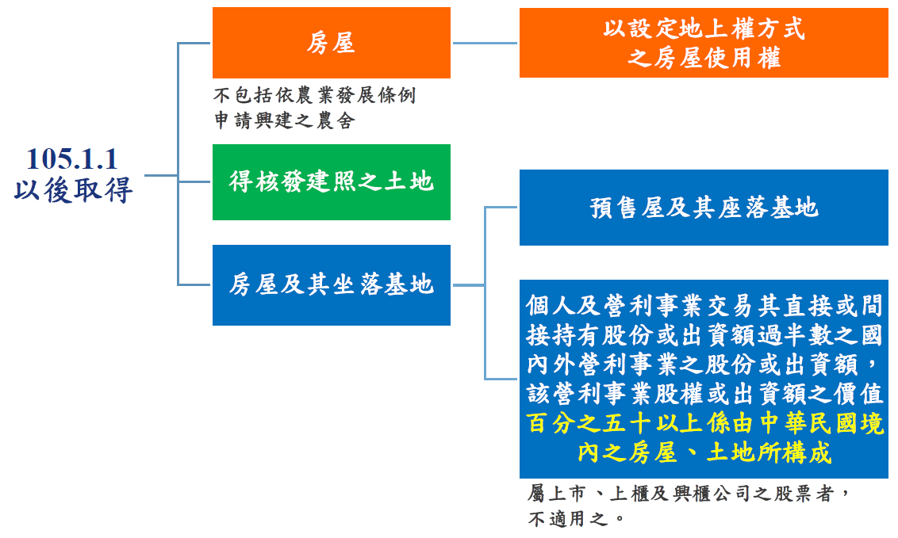

---
*注：本文圖片存放於 ./images/ 目錄下*

## 91. 四則免徵土地增值稅之理由
*發布日期: 2025-05-08* 

## 內文
• (一) 土地徵收免徵土地增值稅之理由：

1. 若土地徵收課徵土地增值稅，土地所有人就無法以其補償餘額，再去購買同一地段、同一品質及同一面積之土地。

2. 土地徵收與買賣不同。前者乃強制取得，後者乃合意取得。亦即，土地徵收是土地所有人在不得已、不情願情況下，被迫喪失土地，故給予免徵土地增值稅之租稅優惠。

3. 現行土地徵收以市價補償，僅填補被徵收人之財產損失，未填補其非財產損失。基於土地徵收稟賦效果，應給予免徵土地增值稅之租稅優惠。

• (二) 公共設施保留地被徵收免徵土地增值稅之理由（司法院釋字第779號解釋理由書）：

1. 土地倘經指定為公共設施保留地，其財產價值即大減，嚴重影響土地所有人之權益。

2. 公共設施保留地之土地流動性、市場交易機會及價值，因政府政策及法令而受不利影響。

3. 因政府財政困難，土地經指定為公共設施保留地後，至被徵收之期間常延宕多年，其土地流動性受限。

• (三) 公共設施保留地尚未被徵收前之移轉免徵土地增值稅之理由（司法院釋字第779號解釋理由書）：

1. 於政府徵收前土地並無市場增值，以致影響市場交易機會及價值，若交易時仍規定須繳納土地增值稅，有違最後於徵收土地時免繳之原意。

2. 公共設施保留地交易時，通常依公告現值徵收土地增值稅，而公告現值繫諸政府政策，未必反映市場價值，如據以徵收土地增值稅，既不合理，且不符社會公平正義原則。

3. 就同一公共設施保留地，徵收時之土地所有人無須繳納土地增值稅，而徵收前交易之土地所有人卻須繳納土地增值稅，亦有失公平。

• (四) 供公共設施使用之非都市土地尚未被徵收前之移轉免徵土地增值稅之理由（司法院釋字第779號解釋理由書）：

1. 非都市土地如經編定為交通用地，且依法核定為公共設施用地者，其使用受限制，流動性、市場交易機會及價值，因政府之政策及法令而受不利影響之情形，與依都市計畫法指定之公共設施保留地受不利影響者相當。

2. 非都市土地若實際已成為公路，亦即供作公共設施使用，其流動性、市場交易機會及價值所受不利影響更加嚴重。

3. 此類非都市土地，性質與依都市計畫法指定之公共設施保留地相似，在土地增值稅之徵免上，理應等同處理，俾符合租稅公平原則及憲法第7條保障平等權之意旨。

---
*注：本文圖片存放於 ./images/ 目錄下*

## 92. 違反信託約定之處分
*發布日期: 2025-05-06* 

## 內文
小耀將名下A地信託移轉登記給高高，並約定高高僅有管理權限，即於信託存續期間20年內，每年將A地租金收益交付給昌大，並有將相關約定內容納入信託專簿。然而，高高後續竟將A地出賣給第三人，而登記機關未察且辦理A地移轉登記完畢，請問小耀或昌大該如何處理？

• (一) 昌大得聲請法院撤銷高高之處分

根據信託法第18條第1項：「受託人違反信託本旨處分信託財產時，受益人得聲請法院撤銷其處分。受益人有數人者，得由其中一人為之。」

第2項：「前項撤銷權之行使，以有左列情形之一者為限，始得為之： 一、信託財產為已辦理信託登記之應登記或註冊之財產權者。 二、信託財產為已依目的事業主管機關規定於證券上或其他表彰權利之文件上載明其為信託財產之有價證券者。 三、信託財產為前二款以外之財產權而相對人及轉得人明知或因重大過失不知受託人之處分違反信託本旨者。」

第19條：「前條撤銷權，自受益人知有撤銷原因時起，一年間不行使而消滅。自處分時起逾十年者，亦同。」

因此，A地屬於已辦理信託登記之應登記財產權，受託人高高違反信託本旨處分信託財產時，受益人昌大得聲請法院撤銷其處分。但昌大應於知有撤銷原因時起1年間，或自處分時起10年內聲請。

• (二) 阿耀與昌大得對高高請求將其所得之利益歸於信託財產

信託法第9條第2項：「受託人因信託財產之管理、處分、滅失、毀損或其他事由取得之財產權，仍屬信託財產。」

信託法第35條第3項：「受託人違反第一項之規定，使用或處分信託財產者，委託人、受益人或其他受託人，除準用第二十三條規定外，並得請求將其所得之利益歸於信託財產；於受託人有惡意者，應附加利息一併歸入。」

因此，委託人阿耀與受益人昌大得對高高請求將其所得之利益歸於信託財產，倘若高高屬惡意，則應附加利息一併歸入。

• (三) 阿耀與昌大得對高高請求損害賠償、回復原狀或減免報酬

根據信託法第35條第1項：「受託人除有下列各款情形之一外，不得將信託財產轉為自有財產，或於該信託財產上設定或取得權利： 一、經受益人書面同意，並依市價取得者。 二、由集中市場競價取得者。 三、有不得已事由經法院許可者。」

第3項：「受託人違反第一項之規定，使用或處分信託財產者，委託人、受益人或其他受託人，除準用第二十三條規定外，並得請求將其所得之利益歸於信託財產；於受託人有惡意者，應附加利息一併歸入。」

第4項：「前項請求權，自委託人或受益人知悉之日起，二年間不行使而消滅。自事實發生時起逾五年者，亦同。」

第23條：「受託人因管理不當致信託財產發生損害或違反信託本旨處分信託財產時，委託人、受益人或其他受託人得請求以金錢賠償信託財產所受損害或回復原狀，並得請求減免報酬。」

因此，委託人阿耀與受益人昌大得請求高高以金錢賠償信託財產所受損害或回復原狀，並得請求減免報酬。

• (四) 阿耀與昌大得向法院聲請解任高高之受託人職務

信託法第36條規定：「受託人違背其職務或有其他重大事由時，法院得因委託人或受益人之聲請將其解任。」

因此，委託人阿耀與受益人昌大得主張受託人高高違背所約定之職務，向法院聲請將其解任。

---
*注：本文圖片存放於 ./images/ 目錄下*

## 93. 房屋土地交換之房地合一稅
*發布日期: 2025-04-29* 

## 內文
曾大於110年4月以2,000萬元購買A房地，並於114年4月與熊大訂定房地交換契約，將A房地以相當市場行情之2,300萬元，交換熊大所有之B房地，且雙方未進行差價找補，即無收付價金。試問曾大是否需申報繳納房地合一所得稅？要的話，應納稅額為多少？（以公告土地現值計算之土地漲價總數額為50萬元）

首先，按照「房地合一課徵所得稅申報作業要點」第2點，房屋、土地交易日之認定，以所出售或交換之房屋、土地完成所有權移轉登記日為準。

因此，個人換出105年1月1日以後取得之房屋、土地，無論有無收付價金，應以換出房地之成交價額減除原始取得成本、因取得、改良及移轉而支付之費用及土地漲價總數額後之餘額為課稅所得，並檢附交換契約書、成本及必要費用相關證明文件與其他有關文件，辦理個人房屋土地交易所得稅申報。

其中，換出房地之成交價額，原則上國稅局會調查A、B房地交換當時金融機構貸款評定價格及同棟或鄰近同類大樓相近樓層之實價登錄資訊，約定交換價格是否與交換當時A、B房地之市場行情相當，如否，即會參酌時價資料認定。

因此，曾大換出A房地之課稅所得為220萬元（成交價額2,300萬元－原始取得成本2,000萬元－移轉必要費用30萬元－土地漲價總數額50萬元），應納稅額77萬元（220萬元×適用稅率35%）

參考來源：個人換出適用房地合一稅制之房屋、土地，應於規定期限內辦理房屋土地交易所得稅申報-財政部全球資訊網

---
*注：本文圖片存放於 ./images/ 目錄下*

## 94. 房屋預售制度是房價飆漲之溫床
*發布日期: 2025-04-24* 

## 內文
• (一) 預售屋及房屋預售制度之緣起：早期，我國法律並無預售屋及房屋預售制度之明文規定，然業界已普遍實施。及至「公寓大廈管理條例」（民國84年6月28日總統公布）及「不動產經紀業管理條例」（民國88年2月3日總統公布）始正式入法。諸如：

1. 公寓大廈管理條例第58條第1項規定：「公寓大廈起造人或建築業者，非經領得建造執照，不得辦理銷售。」從反面解釋，公寓大廈起造人或建築業者，經領得建造執照，得辦理銷售。亦即，銷售預售屋為合法行為。如果該法條規定：「公寓大廈起造人或建築業者，非經領得使用執照，不得辦理銷售。」則銷售預售屋為違法行為。應特別強調，世界各國，有的國家允許銷售預售屋，有的國家禁止銷售預售屋。

2. 不動產經紀業管理條例第4條第3款規定：「預售屋：指領有建造執照尚未建造完成而以將來完成之建築物為交易標的之物。」

• (二) 房屋預售制度與房價飆漲之關係： 房屋預售制度是房價飆漲之溫床。其理由如下：

1. 房屋預售制度，購屋者運用財務槓桿及選擇權操作進行房地投機，導致不動產景氣時，大量湧入投機客購買預售屋，房屋假性需求增加。

2. 建設公司之預售個案委由代銷公司銷售（俗稱包銷）。代銷公司為了爭取銷售個案，競相創造區域新行情。因此不動產景氣時，預售價帶動新成屋價，新成屋價再帶動中古屋價，導致不動產價格全面上漲。

3. 代銷公司採包銷承攬預售個案，承擔銷售成敗之風險。因此，代銷公司不擇手段採取違規銷售（如利用網路傳播不實資訊、營造不動產交易活絡假象等），製造「今天不買，明天房價更高」之恐慌心理。

4. 預售個案創新價完銷，經媒體大肆渲染，造成民眾對房價之預期心理，進而吸引更多投機客進場。預期終於實現，實現後再預期，形成房價惡性循環上揚。

綜上，房屋預售制度於不動產多頭市場，誘使房價飆漲，對不動產價格之穩定造成不利影響。因此，房屋預售制度不是好的制度。

---
*注：本文圖片存放於 ./images/ 目錄下*

## 95. 死亡前2年贈與之相關概念比較
*發布日期: 2025-04-22* 

## 內文
甲死亡前二年內贈與給繼承人之一乙300萬，而後甲死亡時留下遺產3,300萬，並由乙、丙、丁三人繼承，應繼分均等，試問其乙、丙、丁之各應繼遺產為何？遺產稅之遺產總額多少？另甲生前對K有一債務，乙、丙、丁應負清償責任之所得遺產總額為多少？

• (一) 各應繼遺產分為兩種情形：

1. 甲「非」因結婚、分居或營業而贈與給乙 僅就甲死亡時留下遺產3,300萬進行分配。 乙、丙、丁＝3,300/3＝各1,100萬元 *注意：繼承人彼此間並沒有民法第1148條之1的適用，亦即丙、丁不得就乙已受贈之300萬主張納入應繼遺產。

2. 甲因結婚、分居或營業而贈與給乙 依據民法第1173條I、II：「繼承人中有在繼承開始前因結婚、分居或營業，已從被繼承人受有財產之贈與者，應將該贈與價額加入繼承開始時被繼承人所有之財產中，為應繼遺產。但被繼承人於贈與時有反對之意思表示者，不在此限。前項贈與價額，應於遺產分割時，由該繼承人之應繼分中扣除。」 因此，應繼遺產＝3,300+300＝3,600萬元，各人應繼遺產： 乙＝3,600/3＝1,200，再扣除300萬元（歸扣）＝900萬元 丙＝3,600/3＝1,200萬元 丁＝3,600/3＝1,200萬元 *注意：歸扣並不限於死亡前二年內。

• (二) 之遺產總額

依據遺產及贈與稅法第15條I：「被繼承人死亡前二年內贈與下列個人之財產，應於被繼承人死亡時，視為被繼承人之遺產，併入其遺產總額，依本法規定徵稅：一、被繼承人之配偶。二、被繼承人依民法第一千一百三十八條及第一千一百四十條規定之各順序繼承人。三、前款各順序繼承人之配偶。」

遺產稅之課稅遺產總額＝3,300+300＝3,600萬元

*注意：倘若非死亡前二年內之贈與（含結婚、分居、營業之特種贈與），則不需納入遺產稅額計算

• (三) 應負清償責任之所得遺產總額

為避免被繼承人生前贈與，影響被繼承人之債權人求償權益，依據民法第1148條之1：「繼承人在繼承開始前二年內，從被繼承人受有財產之贈與者，該財產視為其所得遺產。」，以規範對外清償範圍。

因此，乙、丙、丁應負清償責任之所得遺產總額為3,300+300＝3,600萬元。換言之，K得請求乙、丙、丁於遺產3,600萬元之範圍內加以清償。

---
*注：本文圖片存放於 ./images/ 目錄下*

## 96. 民眾購買預售屋與成屋之投機模式比較
*發布日期: 2025-04-17* 

## 內文
民眾購買預售屋或成屋，皆具有財務槓桿及選擇權操作。茲說明如下：

• (一) 財務槓桿：

1. 預售屋：民眾購買預售屋，必須分期繳納定金、簽約金、開工款、工程期款及交屋款。定金、簽約金、開工款、工程期款及交屋款之合計等於自備款（如預售屋之購屋貸款70%，就是自備款30%）。準此，自備款於房屋興建期間，分期繳納。如房屋興建三年，則在這三年內分期繳納。

2. 成屋：民眾購買成屋，有一部分的錢向銀行融資，稱為購屋貸款；其餘的錢由自己出資，稱為自備款。如購屋貸款70%，則自備款30%。準此，自備款於房屋簽訂契約至過戶完成，分期繳納。如房屋簽訂契約至過戶完成為二個月，則在這二個月分期繳納。

3. 比較：預售屋之自備款分期繳納，這期間相當長，購屋者之財務壓力較輕。成屋之自備款分期繳納，這期間相當短，短到如同一次繳清，購屋者之財務壓力較重。

• (二) 選擇權操作：

1. 預售屋： (1)房價上漲：民眾購買預售屋，當未來房價上漲時，依據平均地權條例第47條之4禁止預售屋轉售之規定，因此須俟完工交屋時，始得轉售。 (2)房價下跌：民眾購買預售屋，當未來房價下跌時，可以隨時斷頭。依據預售屋買賣定型化契約應記載事項第24點第4款規定，賣方最多没收房地總價15%。亦即，購屋者最多損失房地總價之15%。

2. 成屋： (1)房價上漲：民眾購買成屋，當未來房價上漲時，可以隨時還清銀行貸款，轉售他人。 (2)房價下跌：民眾購買成屋，當未來房價下跌時，可以隨時斷頭，任由銀行拍賣房屋。但銀行拍賣房屋，未能獲得完全清償時，得再向借款人追索（如追索借款人之其他財產、薪資等）。

3. 比較： (1)建設公司與購屋者為預售屋選擇權模式之當事人，建設公司為選擇權買權（Call Option）之賣方，購屋者為選擇權買權之買方。 銀行與購屋者為成屋選擇權模式之當事人，銀行為選擇權買權之賣方，購屋者為選擇權買權之買方。 (2)房價上漲時，預售屋須俟完工交屋，始得轉售；惟成屋可以隨時轉售。房價下跌時，預售屋可以隨時斷頭，最多損失房地總價15%；成屋亦可以隨時斷頭，惟損失無上限。

總之，預售制度較成屋制度更有利於購屋者投機。

---
*注：本文圖片存放於 ./images/ 目錄下*

## 97. 共有土地協議信託給共有人之一
*發布日期: 2025-04-15* 

## 內文
甲乙丙三人共有一筆A地，每人應有部分為1/3，由於丙具有地政士專業，因而三人協議將該A地共同信託給丙，並簽訂信託契約書，約定由丙管理及處分，請問該信託契約是否有效？

解題關鍵

• (一) 各共有人，得自由處分其應有部分。 (二)按民法規定，契約交易雙方為對立之當事人，因而兩者原則不得為同一人。 (三)僅法人為增進公共利益，得經決議對外宣言自為委託人及受託人，並邀公眾加入為委託人。

結論

• (一) 甲乙應有部分為自由處分，故該2/3與丙之信託契約有效。 (二)丙自己的應有部分1/3，委託給自己，違反契約對立性，該部分無效。

參考來源：曾榮耀編撰，信託法概要，附錄四精選案例，高點

---
*注：本文圖片存放於 ./images/ 目錄下*

## 98. 民眾購買預售屋之投機方法
*發布日期: 2025-04-10* 

## 內文
民眾購買預售屋從事投機之方法有二：

• (一) 財務槓桿：民眾購買預售屋在交屋前分期繳納定金、簽約款、開工款、工程期款及交屋款。這些款項之合計等於自備款（如預售屋之購屋貸款70%，則自備款30%）。準此，在交屋時，如果房價上漲，將擴大購屋者之投資報酬率。如房價1,000萬元，自備款30%，交屋時房價上漲為1,200萬元，則民眾之投資報酬率為66.67%（即200 ÷ 300 = 66.67%），而非20%（即200 ÷ 1,000 = 20%）。

• (二) 選擇權操作：預售屋之購屋者相當於站在選擇權買權（Call Option）之買方。亦即，購屋者付出定金及簽約金之後，取得要求建設公司於完工時移轉該預售屋之權利。析言之：

1. 當未來房價上漲時，購屋者選擇履約，則建設公司須將完工後之預售屋移轉於購屋者。

2. 當未來房價下跌時，購屋者可以在房屋興建中途隨時選擇不履約（俗稱斷頭），則購屋者已繳納之定金、簽約金及工程期款等會被建設公司没收。依據預售屋買賣定型化契約應記載事項第24點第4款規定，建設公司頂多没收房地總價之15%（如房地總價1,000萬元，自備款30%，則建設公司頂多沒收150萬元，不得没收300萬元）。亦即，購屋者頂多損失房地總價之15%。

綜上，購屋者購買預售屋擁有上述二項投機利器。因此，不動產景氣時，會出現很多投機購屋者，而使不動產市場更加繁榮，最後造成房價飆漲。

---
*注：本文圖片存放於 ./images/ 目錄下*

## 99. 113年憲判字第11號有關遺贈稅法尚未修法前之因應方式
*發布日期: 2025-04-08* 

## 內文
首先，憲判字11號簡要來說有兩個違憲法條：

• 一、遺產及贈與稅法第15條第1項第1款規定：「被繼承人死亡前2年內贈與下列個人之財產，應於被繼承人死亡時，視為被繼承人之遺產，併入其遺產總額，依本法規定徵稅：一、被繼承人之配偶。……」

• (一) 違反憲法第7條平等權之意旨

死亡前2年內贈與配偶之財產，立法目的係為避免生前分散財產減少遺產稅課徵，而將其「視為遺產」，但其他繼承人未享有該財產增益，卻要代被繼承人之配偶負擔該部分遺產稅，有違量能課稅原則。亦即，遺產總額擴及繼承人實際繼承遺產以外的財產，而無法對應繼承人稅捐負擔能力。

舉例而言，我只拿到遺產2千萬，卻要負擔2千萬以外，不歸於己而是由被繼承人配偶拿走的財產，所計算的遺產稅。

• (二) 違反憲法第15條財產權保障之意旨

1. 其他繼承人須以自己繼承之財產，為非自身財產增益部分，負擔稅捐債務。（以自己應得財產，負擔別人稅捐，因而侵蝕到自身財產權）

2. 未對應設定上限，可能使其他繼承人因課徵遺產稅，而經濟價值嚴重減損，乃至完全失去其本得繼承之遺產，屬「絞殺性租稅」，而與比例原則有違，侵害人民財產權。。（甚至可能遺產全部被遺產稅侵蝕殆盡）

舉例而言，我只拿到遺產2千萬，卻要負擔5千萬的遺產稅。

• 二、遺產及贈與稅法第17條之1規定：「被繼承人之配偶依民法第一千零三十條之一規定主張配偶剩餘財產差額分配請求權者，納稅義務人得向稽徵機關申報自遺產總額中扣除。」同時，

違反憲法第7條平等權之意旨：

剩餘財產差額分配請求權之立法目的，係針對婚姻關係中經濟弱勢一方，其對於婚姻之家務、教養子女及共同生活等貢獻給予公平之評價，但死亡前2年內贈與配偶之財產被定性為遺產，但卻無法如同遺產稅中扣除額予以統一處理，以致於擬制財產部分無法一致且充分地反映生存配偶的潛在經濟貢獻。

簡言之，就是一般遺產有剩餘財產差額分配的扣除額，亦即有考慮生存配偶因共同家計所生經濟貢獻；但擬制遺產卻沒有，等同於沒考慮配偶經濟貢獻，兩者並未統一處理。

舉例如下，死亡前2年內贈與配偶的話，反而因未於遺產總額進行剩財扣除考量，導致反而繳的遺產稅比較多。

• (1) 甲（原4000萬）死前2年「後」贈與（2000萬）給配偶（原有財產1000萬） 剩財請求＝(2000-1000)/2＝500 遺產稅＝(2000-553-138-500-1333)*10%＝0

• (2) 甲（原4000萬）死前2年「內」贈與（2000萬）給配偶（原有財產1000萬） 剩財請求＝(2000-1000)/2＝500 遺產稅＝(2000+2000-553-138-500-1333)*10%＝147.6

按113年憲判11號，立法機關應於本判決公告之日起2年內，依本判決意旨檢討修正相關規定，於修法完成前，相關機關應依本判決意旨辦理。惟於修法完成前：

• (一) 對於「繼承人不公平負擔問題」之因應方式

1. 受贈配偶同屬遺產稅納稅義務人 相關機關應計算擬制為遺產之財產占遺產總額比例，依該比例計算因該受贈財產所增加之稅額，就該部分稅額，僅得向配偶發單課徵。

2. 受贈配偶因拋棄繼承或喪失繼承權等而非遺產稅納稅義務人 就視為遺產之贈與，所增加之遺產稅負，不得以繼承人為該部分遺產稅負之納稅義務人，亦不得以被繼承人死亡時遺留之財產為執行標的。

• (二) 對於「遺產總額未一致考量配偶剩財扣除問題」之因應方式 相關機關於計算配偶剩餘財產差額分配請求權之扣除數額時，就視為遺產之贈與，應將該財產視為被繼承人現存財產，並依據民法第1030條之1規範意旨，例如該財產是否為婚後財產，有無但書各款情事等，計算在遺贈稅法上得扣除之剩餘財產差額分配數額，不受被繼承人配偶實際上得依民法第1030條之1規定請求之範圍限制。

亦即如同前例，應將擬制遺產視為被繼承人現存財產，故其剩財請求＝(2000+2000-1000)/2＝1500，其遺產稅＝(2000+2000-553-138-1500-1333)*10%＝47.6

---
*注：本文圖片存放於 ./images/ 目錄下*

## 100. 信託受益人死亡之處理方式
*發布日期: 2025-04-01* 

## 內文
案例

老張信託其所有之不動產給小美，約定受託人小美基於老張之女小張的利益，進行該信託不動產之使用管理與處分。小美即依約定進行適法之信託財產運用，惟受益人小張不幸車禍死亡，留有2子女，試問受託人小美該如何處理？

觀念說明

• (一) 信託受益權屬於一種財產權利，原則上允許受益人自由轉讓或繼承。因此，受益人死亡時，倘其信託關係依信託目的，不因其死亡而消滅，於終止信託關係前，信託利益依民法第1148條規定，由受益人之繼承人概括繼承。

• (二) 信託關係存續中受益人死亡時，應就其享有信託利益之權利未領受部分，依本法規定課徵遺產稅。

結論

• (一) 信託關係並不因受益人小張死亡而當然消滅，需視是否屬所定事由發生（照顧到小張死亡為止）或信託目的不能完成（該受益權專屬小張）予以認定。

• (二) 倘若老張信託契約並未限定該受益權僅屬小張，亦未有明確的解決條件，則由受託人小美繼續按信託契約目的，支付信託利益給小張之2子女。

• (三) 2子女於申報遺產稅時，應就其享有信託利益之權利未領受部分，依本法規定課徵遺產稅。

---
*注：本文圖片存放於 ./images/ 目錄下*

## 101. 建設公司售屋何以偏愛採預售方式？
*發布日期: 2025-03-27* 

## 內文
建設公司售屋可以採「先售後建」（即出售預售屋），亦可以採「先建後售」（即出售新成屋）。坊間，建設公司售屋大都採「先售後建」方式（即預售方式）。其主要原因就是為了避險。茲說明如下：

• (一) 建設公司於預售時，如賣得好，則動工興建，然後完工交屋。如賣得不好，因產品定位錯誤，修改產品規劃再出售；或乾脆不動工興建，將土地轉售。

• (二) 建設公司於預售之當時房價已足以擁有合理利潤。因此，預售後如房價上漲，則歸屬購屋者投資不動產之利得；如房價下跌，則歸屬購屋者投資不動產之損失。因此，建設公司將預售後房價下跌之風險轉嫁給購屋者負擔。此種模式類似選擇權之買權，購屋者為買權之買方，建設公司為買權之賣方。選擇權原本就是一種避險工具。

• (三) 建設公司採預售方式，可以拉長銷售期至二年或三年。相對地，如採先建後售方式，建物完工後，始開始銷售，則銷售期非常短促。萬一房屋未立即賣出，則無法以購屋貸款轉還建築貸款，建設公司將持續負擔沉重利息。另，房屋未立即賣出，建設公司將開始負擔房屋稅。

• (四) 建設公司完銷後，恐因鋼筋、水泥、砂石或工資等大幅上漲而造成虧損。因此，建設公司於預售時，就與營造公司簽訂發包契約，將建築原料上漲因素轉嫁給營造公司。

• (五) 建設公司採預售方式，購屋者必須先繳納定金、簽約款、開工款及按工程進度繳納期款。換言之，建設公司可用預售收入，充當建案資金來源之一。購屋者繳納之定金、簽約款、開工款及工程期款等為購屋款之一部分（亦即購屋者之自備款），因此建設公司使用預售收入的錢，不必付利息，亦不必償還。

總之，建設公司售屋採預售方式有上述優點，因此建設公司售屋偏愛先售後建之預售方式。

---
*注：本文圖片存放於 ./images/ 目錄下*

## 102. 共有人占用共有土地之默示分管關係
*發布日期: 2025-03-25* 

## 內文
今日專欄舉一篇有關共有人占用共有土地之默示分管關係案例供參

甲有一筆位於某市的A地，其死亡後由13位繼承人共同繼承該地，且未辦理繼承登記。民國74年時，其中一位繼承人乙於該地上興建一B建物並居住，其他繼承人皆有到場祝賀遷居，後續亦由甲繳納該地之地價稅。民國100年時，其他共有之繼承人訴請拆屋還地，試問甲得否主張其他共有人長期不反對而成立「默示分管」，故具有合法權源？

• 一、默示分管之定義

所謂默示分管，係指依共有人之舉動或其他情事，足以間接推知其效果意思者而言，必共有人間實際上劃定使用範圍，對各自占有管領之部分，互相容忍，對於他共有人使用、收益，各自占有之土地，未予干涉，已歷有年所，始得認有默示分管契約之存在（最高法院29年上字第762號判例、80年度臺上字第1470號判決、83年度臺上字第237號判決意旨參照）

• 二、不得主張成立默示分管之理由

1. 縱B屋於74年落成時，共有人均前往祝賀，惟僅是單純沈默而未為制止，不生任何法律效果，亦非默許同意繼續使用。

2. 繳交地價稅，僅能說明其處理此部分事務，亦難作為其他共有人默許甲有單獨使用A地之權利。

3. 甲雖請求傳喚A地其他共有人全部到庭，以證共有人有默示合意分管事實，然A地之共有人間並無默示分管協議存在等情，已如前述，無庸再為傳訊證人必要，況部分甫因繼承登記才成為共有人，非B屋興建時之共有人，房屋興建時年紀尚輕，實難認為其知悉A地當時是否經全體共有人為默示分管協議。

綜上，甲並不能舉證證明A地有分管契約存在，自難徒憑A地共有人長期以來未向甲行使權利或經過時間之長短，遽以推論共有人間有明示或默示分管契約存在。

提醒： 雖共有人可就長時間占用土地提出已有默示分管之適用，惟仍需有一定之事實證據得以佐證較為妥適。

資料來源：臺灣高等法院102年度重上字第543號民事判決

---
*注：本文圖片存放於 ./images/ 目錄下*

## 103. 選擇權簡介
*發布日期: 2025-03-20* 

## 內文
選擇權（Option）分為買權選擇權（Call Option）與賣權選擇權（Put Option）二種商品。

• (一) 買權選擇權：選擇權的買方在付出權利金之後，取得在未來特定時間內要求賣方依約賣出標的物之權利。換言之，選擇權是一種權利，選擇權之買方可以選擇履約或不履約。倘買方選擇履約，賣方應依約賣出標的物。倘買方選擇不履約，賣方可以沒收權利金。如圖所示。

• (二) 賣權選擇權：選擇權的買方付出權利金之後，取得在未來特定時間內要求賣方依約買入標的物之權利。換言之，選擇權是一種權利，選擇權之買方可以選擇履約或不履約。倘買方選擇履約，賣方應依約買入標的物。倘買方選擇不履約，賣方可以沒收權利金。如圖所示。

[圖片1]

## 文章圖片

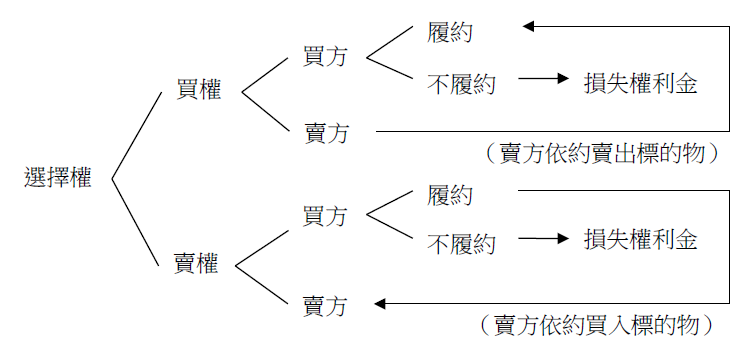

---
*注：本文圖片存放於 ./images/ 目錄下*

## 104. 個人墓地出售是否得主張優先購買之疑義
*發布日期: 2025-03-18* 

## 內文
本週專欄為土地法第34條之1第4項有關共有人出賣應有部分之特殊概念－個人墓地出售是否得主張優先購買。可參臺灣高等法院暨所屬法院110年法律座談會民事類提案第7號內容：

甲以經營殯葬事務為業，將其所有之A土地（土地謄本所載使用地類別為殯葬用地）規劃為編號1至26,000位之個人墓園用地擬以出售。嗣乙向甲購買編號50之個人墓園用地，甲則移轉登記A土地之應有部分兩萬六千分之一予乙，又丙為乙之債權人，於清償期屆至後，乙無力還款，丙遂持執行名義向法院聲請強制執行上開乙於A土地之應有部分，經拍定後A土地之其他個人墓園用地所有人（高達千人）得否以共有人之身分行使優先承買權？

討論意見：甲說：肯定說。 按土地法第34條之1第4項規定：「共有人出賣其應有部分時，他共有人得以同一價格共同或單獨優先承購。」其立法意旨無非為第三人買受共有人之應有部分時，承認其他共有人享有優先承購權，簡化共有關係（最高法院 72 年台抗字第94號判例意旨參照）。又共有物分管之約定，不以訂立書面為要件，倘共有人間實際上劃定使用範圍，對各自占有管領之部分，長年互相容忍，對於他共有人使用、收益，各自占有之土地，未予干涉，即非不得認有默示分管契約之存在（最高法院83年度台上字第1377號判決意旨參照）。復共有之土地縱已達成分管之約定，於該分管之共有人出售該土地應有部分，亦無排斥賦予共有人優先承買土地之權利，若認土地共有人間業已成立分管契約，而於他共有人出賣其應有部分時，其他共有人即不得主張共有人之優先承買權，顯失簡化共有關係之目的，無助於促進土地之利用（臺灣高等法院100年度上字第 1189 號判決意旨參照）。查題示A土地之共有人得於其使用個人墓園之範圍內排除他人干涉，並對各自占用管領之部分，長年互相容忍，堪認共有人間係成立默示分管契約。準此，揆諸前開實務見解，縱認A土地已達成分管之約定，仍不得限制共有人優先承買之權利，執行法院拍賣A土地之應有部分，仍應通知其他 A土地共有人行使優先承買權。

乙說：否定說（最終採此說）。 按土地法第34條之1第4項優先承購權之立法目的，固在減少共有人人數，簡化土地之利用關係，並可解決共有不動產之糾紛，促進土地利用，便利地籍管理及稅捐課徵等，惟本件殯葬經營業者係將殯葬用地劃分成特定占用位置的個人墓園，再以應有部分的方式出賣，其目的無非係欲使多數買受人得以利用，故非有賦予其他共有人優先承買權以簡化土地關係之必要，且若維持共有關係，亦符合當初規劃及實際利用狀態，對於共有物之管理、收益並無妨礙。再事實上於此類情形，共有人之人數動輒數千人，不但送達不易，耗費郵資過鉅，況該殯葬用地之個人墓園倘已使用，其餘共有人往往缺乏應買意願，徒為增加國家財政負擔並延長執行時程，對於債權人及債務人均有所不利。

初步研討結果：採乙說。 審查意見：採乙說。 研討結果： （一）乙說理由倒數第6行末「況該殯葬用地之個人墓園倘已使用，其餘共有人往往缺乏應買意願，」等字刪除。 （二）照修正後之乙說通過。

提醒： 雖法律座談會並不具約束法院判決效力，但可供作參考。其結論即這種個人墓地出售土地應有部分無優先購買權適用，理由有三：

1. 目的面：無簡化消滅共有關係之必要。

2. 權益面：維持共有關係，並不妨礙共有物之使用管理。

3. 執行面：此情形如需優先購買權通知，徒增時間與金錢，反而影響相關權益。

資料來源：臺灣高等法院暨所屬法院110年法律座談會民事類提案第7號

---
*注：本文圖片存放於 ./images/ 目錄下*

## 105. 新青安貸款是否為房價飆漲的元凶？
*發布日期: 2025-03-13* 

## 內文
政府為使年輕人買得起房子，推出青年安心成家購屋優惠貸款方案。其特色為，貸款對象限於借款人與其配偶及未成年子女均無自有住宅者，貸款成數最高8成，貸款額度最高1,000萬元，貸款年限最長40年，貸款利率採政府補貼之優惠利率。

去年（民國113年）年初，部分人士將房價飆漲歸罪於新青安政策。但筆者不認同，其理由如下：

• (一) 房價高漲主要是預售屋投機炒作所致，而非新青安政策所致。因為新青安之放款標的只限於成屋，而非預售屋。

• (二) 新青安政策是針對名下無房子的購屋者，屬於住的基本需求，而非投機需求。況，新青安貸款條件，並非毫無限制。政府只補助購屋貸款利息，並非補助購屋資金。

• (三) 中央銀行於民國113年9月19日第七波不動產選擇性信用管制（即貸款成數下修、取消寬限期等），重拳打擊到投機者的要害，房市立即冷卻。但第七波不動產選擇性信用管制之前及之後，新青安貸款維持不變。此一事實說明，新青安政策非房價飆漲之元凶。

總之，新青安貸款是政府照顧青年人購屋的不動產政策，值得肯定。當然，新青安貸款亦存在一些漏洞（如不肖人士藉新青安貸款購屋，轉售圖利或出租牟利），政府應加強查核，並予以遏止。

---
*注：本文圖片存放於 ./images/ 目錄下*

## 106. 房地合一稅計算範例-受贈後出售
*發布日期: 2025-03-11* 

## 內文
首先，可先參考財政部高雄國稅局新聞稿2025-02-24（個人出售屬房地合一所得稅新制之土地，非持有期間之土地漲價總數額不得減除-財政部全球資訊網）所提重點：個人出售適用房地合一所得稅新制之房屋、土地，其交易所得之計算，係以成交價額減除原始取得成本（受贈取得者，指受贈時之房屋評定現值及公告土地現值，按政府發布之消費者物價指數調整後之價值）、相關必要費用及土地漲價總數額後之餘額為課稅所得額。所稱土地漲價總數額，僅限於個人持有本次交易土地期間所產生的漲價總數額，尚不含贈與人（前所有權人）持有期間的土地漲價總數額，至其受贈時因取得該土地所繳納的土地增值稅，則屬個人因取得該土地而支付的費用，得自房地交易所得中減除。

本專欄擬計算案例如下：甲於107年9月受贈一筆市價1,000萬元之房地時，其當年公告土地現值總額為300萬元、房屋評定現值為200萬元，有支付契稅與印花稅5萬元，以及繳納土地增值稅20萬元，於118年11月出售之交易金額1,500萬元，並提出市地重劃負擔證明10萬元，且本次交易未提示取得、改良與移轉費用，依當期公告土地現值申報之土地漲價總數額為100萬元。試問甲如以自住房地提出申請，應繳納多少之房地合一所得稅？（消費者物價指數為150%）

計算：

• (一) 適用新舊制之判斷本題甲於107.9取得至118.11出售，依所得稅法規定交易之房屋、土地係於105年1月1日以後取得，應採用新制。

• (二) 所得餘額＝成交價額－受贈時之房屋評定現值及公告土地現值按政府發布之消費者物價指數調整後之價值－取得、改良及移轉而支付之費用－依土地稅法計算之土地漲價總數額＝(1,500－((300+200)×150%)－5－20－10－30－100) ＝585 (萬元) （因1,500×3%=45萬＞費用上限30萬，故以30萬計）

• (三) 稅率本題甲以自住房地提出申請，如符合所得稅法規定之自住條件，則其所得計算之餘額超過四百萬元部分，稅率為百分之十。

• (四) 應納所得稅額 (585-400)*10%＝18.5 (萬元)

---
*注：本文圖片存放於 ./images/ 目錄下*

## 107. 友善農地
*發布日期: 2025-03-06* 

## 內文
• (一) 友善農地之意義：以自然農法從事耕作之農地。換言之，以生態農法從事耕作之農地，而非以慣行農法從事耕作之農地。

• (二) 友善農地之特色：

1. 不使用化學肥料及農藥：傳統慣行農業投入大量化學肥料，以增加產量；噴灑農藥，以消滅病蟲害。友善農業投入有機肥料（如枯葉堆肥），增加產量；以生態食物鏈，消滅病蟲害。

2. 維護自然生態：友善農業將使農地生態變豐富，吸引鳥類、青蛙、蜻蜓、蚯蚓等野生動物回來棲息。藉此，可利用野生動物驅除病蟲害（如黑翅鳶可以補捉田間老鼠、青蛙可以吃掉飛蟲等）

3. 面積愈大效果愈佳：認同友善農業的農民及加入的農地愈多，效果更加彰顯。起先為10甲、20甲，最後達到100甲、200甲，甚至更大，形成友善農業生產專區。

• (三) 友善農地推行成功之條件：

1. 實施保證收益：推行友善農業之初期，農地收益常不到慣性農業的四分之一，因此推行友善農業之初期，政府或農會必須實施保證收益，始克有成。

2. 品牌行銷：友善農地所生產之農產品，經政府認證，建立自己品牌，品牌行銷，則其售價可以高於慣行農業，以價格優勢彌補產量減少的損失。

3. 開發業外收益：友善農地除農產品收益外，尚可開發其他附帶收益（如休閒農場、體驗農業等）。另，友善農地亦為碳匯所在，經過認證後，可以出售碳權，增加收入。

4. 積極介入輔導：政府及農會積極介入推行友善農業，輔導農民有關友善農業的Know How，免費技術指導，並整合成立友善農業生產專區。

• (四) 慣行農業與友善農業之產出比較：農地生產具有聯合產出。一塊農地在生產「農產品」的同時，亦能生產「生態財」。如圖所示，AB代表一塊農地之生產可能曲線，CD代表慣行農業之無異曲線，EF代表友善農業之無異曲線。CD之邊際替換率小於EF。由AB與CD之切點R，決定慣行農業產出農產品X0及產出生態財Y0。由AB與EF之切點S，決定友善農業產出農產品X1及產出生態財Y1。由此可知，友善農業較慣行農業產出較少農產品，但產出較多生態財。

[圖片1]

## 文章圖片

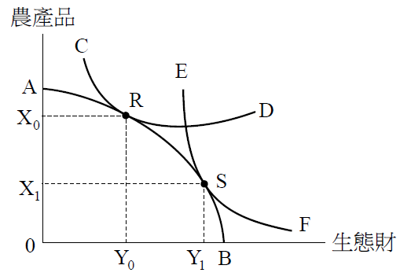

---
*注：本文圖片存放於 ./images/ 目錄下*

## 108. 共有人占用共有土地之爭議
*發布日期: 2025-03-04* 

## 內文
甲主張其於所有之A地上建造B屋（未登記建物）使用，迄今逾70年，A地共有人乙、丙、丁從未異議，顯存默示分管契約。況於A地上興建B屋，亦已時效取得地上權，是甲並非無權占有，其他共有人自不得請求拆屋還地、給付損害賠償。是否有理由？

1. 請求權基礎（訴之標的） 各共有人得按其應有部分，對於共有物之全部，有使用收益之權，民法第818 條定有明文，係指各共有人得就共有物全部，於無害他共有人之權利限度內，可按其應有部分行使用益而言。是共有人對共有物之特定部分占有使用收益，仍須徵得他共有人全體之同意，非謂共有人得對共有物之任何一部或全部有自由使用、收益之權利。如共有人不顧他共有人之利益，而就共有物之一部或全部任意占有收益，即屬侵害共有人之權利，共有人除得依同法第767條第1項前段、第821條規定，請求除去其妨害及向全體共有人返還共有物外，並得依侵權行為法律關係，請求該無權占有之人按共有人就共有物之應有部分比例，賠償共有人所受損害。

2. 默示分管及時效取得地上權之爭議 (1)證人審理時，並未證述共有人甲建造B屋時，業經A地其他共有人同意等情。 (2)A地共有人乙、丙、丁對甲占有A地未為爭執反對，其原因多端，不得僅憑甲長期公然繼續占有A地，逕謂其他共有人已同意或默示同意其占有。 (3)甲既謂其基於分管契約或默示分管契約之意思而占有A地，顯然欠缺行使地上權之主觀意思，況甲縱經地上權取得時效完成，亦僅得請求登記為地上權人而已，在未登記為地上權人前，不得本於地上權關係否認非無權占有。

3. 判決結果 甲為B屋之事實上處分權人，其並無基於時效取得地上權而占有A地之主觀意思，無請求登記為地上權人之權利，且未能證明A地他共有人全體同意將B屋所在之A地特定部分交甲占有使用。是乙、丙、丁依上開規定，請求甲拆屋還地，並按乙、丙、丁各就A地所持應有部分比例，賠償乙、丙、丁所受損害，核屬權利之正當行使……。

資料來源：最高法院109年度台上字第2037號民事判決（本案已確定）

---
*注：本文圖片存放於 ./images/ 目錄下*

## 109. 共有土地分管下之優先購買權
*發布日期: 2025-02-27* 

## 內文
甲、乙、丙三人共有一筆土地，應有部分相等，甲、乙、丙三人訂立分管契約，分管之特定位置分別為該筆土地之A、B、C部分。今，甲將其分管之特定位置A設定地上權予丁，丁並於其上興建房屋一棟；乙將其分管之特定位置B出租予戊，戊並於其上興建房屋一棟；丙自行使用其分管特定位置C。

• (一) 甲出售其應有部分三分之一，何人有優先購買權？

1. 丁依據土地法第104條規定，得主張優先購買權。

2. 乙、丙二人依據土地法第34條之1第4項規定，得主張優先購買權。

3. 土地法第104條之優先購買權具有物權效力，土地法第34條之1第4項之優先購買權僅具債權效力，因此丁之優先購買權先於乙、丙二人之優先購買權而行使。

4. 戊無優先購買權。因為戊與甲之間無地上權、典權或租賃權關係存在。

• (二) 戊出售其房屋時，何人有優先購買權？

1. 乙依據土地法第104條規定，得主張優先購買權。

2. 甲、丙二人無優先購買權。因為甲、丙二人與戊之間無地上權、典權或租賃權關係存在。

• (三) 甲、乙二人運用土地法第34條之1第1項規定，將該筆土地全部出售時，何人有優先購買權？

1. 丁基於土地法第104條規定之「同樣條件」，得就該筆土地全部主張優先購買權。

2. 戊基於土地法第104條規定之「同樣條件」，得就該筆土地全部主張優先購買權。

3. 丙依據土地法第34條之1第4項規定，得就該筆土地全部主張優先購買權。

4. 土地法第104條之優先購買權具有物權效力，土地法第34條之1第4項之優先購買權僅具債權效力，因此，丁、戊二人之優先購買權先於丙而行使。

5. 丁、戊二人之優先購買權皆具有物權效力，依登記（指地上權）或成立（指租賃權）先後定其行使之優先順序。

---
*注：本文圖片存放於 ./images/ 目錄下*

## 110. 時效取得地上權之主觀意思要件探討
*發布日期: 2025-02-25* 

## 內文
• A. 地占有人甲主張：甲父乙自民國43年起，即在A地上建築房舍，甲自幼亦在該房地居住，從未遷居，乙於四十餘年間在A地上建造房屋時，即已知房屋主體結構之一部分坐落在A地上，足見甲與其父乙在主觀上均以行使地上權之意思，客觀上並以在他人土地上建築房屋使用他人土地，繼續占有已逾四十年，自因時效完成，而得請求登記為地上權人。試問有否理由？亦即是否於他人土地上興建房屋即認主觀上有以行使地上權之意思？

首先，根據土地登記行政實務，土地登記規則第118條規定：「土地總登記後，因主張時效完成申請地上權登記時，應提出以行使地上權意思而占有之證明文件及占有土地四鄰證明或其他足資證明開始占有至申請登記時繼續占有事實之文件。」顯示行政實務來看，如無法提出主觀上曾以行使地上權意思而占有之證明文件是無法直接辦理時效取得地上權之登記的。

其次，從司法實務而言，則有不同見解。 以下列案例而言，特別的是，最高法院認定應由占有人舉證其行使地上權之意思，並發回更審。但高等法院台南分院仍認為其於該土地上建造建築物與單純占有有別，難謂占有人於占有之始無行使地上權之意思。

• T. ABLE_PLACEHOLDER_1

---
*注：本文圖片存放於 ./images/ 目錄下*

## 111. 地上權房屋與使用權房屋
*發布日期: 2025-02-20* 

## 內文
現行對於大塊完整之公有土地，如無公共用途，政府儘量不標售所有權，而是招標設定地上權給民間使用，以增加國庫收入及促進公地利用。

建設公司標得地上權後，興建房屋出售於一般民眾。因此，一般民眾買到的房屋，可區分為二種，一種為地上權房屋，另一種為使用權房屋。

• (一) 地上權房屋：政府之招標文件未限制地上權分割移轉，則建設公司出售建物所有權及其地上權應有部分予購屋者。此即「地上權房屋」。因此，購屋者對該房屋擁有物權（即建物所有權及其地上權應有部分）。坊間，台北市「台北花園案」、台北市「基泰大安案」等是。

• (二) 使用權房屋：政府之招標文件限制地上權分割移轉，致建設公司無法出售建物所有權及其地上權應有部分予購屋者（公寓大廈管理條例第4條第2項規定，專有部分不得與其所屬建築物共用部分之應有部分及其基地所有權或地上權之應有部分分離而為移轉或設定負擔），則建設公司只能出售建物及其土地之使用權予購屋者。建物所有權及其地上權仍保留在建設公司手中。此即「使用權房屋」。因此，購屋者對該房屋只擁有債權（即建物使用權及土地使用權）。坊間，台北市「京站案」、台北市「華固新天地案」等是。

綜上，地上權房屋才是正統，使用權房屋是地上權無法分割移轉下之變通產物。

房屋稅條例第5條第1項第1款第1目所稱「以土地設定地上權之使用權房屋」，包括地上權房屋及使用權房屋二種。

---
*注：本文圖片存放於 ./images/ 目錄下*

## 112. 受託人得否將信託財產設定抵押權
*發布日期: 2025-02-18* 

## 內文
阿耀將其不動產信託給阿昌，請其依專業協助投資，並指定受益人為阿耀自己，請問阿昌得否將該筆不動產設定抵押給銀行，並將該筆借款作為投資基金？又假如後續投資失敗，無法償還借款，銀行得否就該筆信託不動產進行查封拍賣？

• 一、相關規定

• (一) 稱信託者，謂委託人將財產權移轉或為其他處分，使受託人依信託本旨，為受益人之利益或為特定之目的，管理或處分信託財產之關係。

• (二) 受託人應依信託本旨，以善良管理人之注意，處理信託事務。

• (三) 所謂「信託本旨」，指委託人意欲實現之信託目的及信託制度本來之意旨而言。是以，信託係以當事人間之信託關係為基礎，受託人既係基於信賴關係管理他人之財產，自須依信託行為所定意旨，積極實現信託之目的。又所謂「依信託本旨處分信託財產等」至少應本下列二個條件予以判斷，其一是信託契約之所定，其二是信託契約若未有明定，或所定不明確或不完全時，自應依信託目的，亦即委託人成立信託的本來意圖。（參法務部法律決字第0999042336號）

• (四) 對信託財產不得強制執行，但基於「因處理信託事務所生之權利」者，不在此限。因此，受託人在信託契約授權範圍內，所為符合信託本旨，為達成信託目的而對外之適法借款，貸與人因其借款所取得之借款債權，屬因處理信託事務所生之權利（法務部法律決字第1000022066號函參照）。

• (五) 受託人違反信託本旨處分信託財產時，受益人得聲請法院撤銷其處分。

• 二、解題

• (一) 首先，應視該抵押借款行為是否符合信託本旨，以及信託契約是否有所授權。就本題而言，阿耀之信託目的為投資，若有明確授權阿昌得進行抵押借款，則該行為有效；至於未明確授權的話，則就其信託本來意圖是協助投資來看，應可認尚符合信託本旨。至於後續無法償還時，銀行自得基於「因處理信託事務所生之權利」進行強制執行，予以查封拍賣。

• (二) 相對而言，如阿昌將信託財產設定抵押，係屬權限外之行為，即違反信託本旨之行為，原則上地政機關應不准許其登記。惟倘若地政機關不察而登記完畢，則阿耀得以違反信託本旨處分之理由，聲請法院撤銷。然而，在阿耀聲請法院撤銷前，對於因信託事務所生之抵押權，銀行仍得進行查封。

資料來源：曾榮耀編著，2023，信託法概要，高點出版。

---
*注：本文圖片存放於 ./images/ 目錄下*

## 113. 農業權
*發布日期: 2025-02-13* 

## 內文
因應國土計畫法，最近有「農業權」之報導。農業權，指農地之發展權移轉，亦即農地之容積移轉。詳言之，農地只能作農業使用，無法興建房屋，為平衡農地與建地之利益，農地之發展權（即容積）得移出至建地使用。藉著容積市場買賣移轉，而使農地獲得補償。

• (一) 農地容積移轉之優點

1. 保護優良農地，避免農地流失。

2. 平衡農地與建地之利益，使農民獲得補償。

3. 藉由市場機制，保護農地，減輕政府之財政負擔。

• (二) 農地容積移轉之缺點

1. 農地數量龐大，所釋出之容積，市場恐無法吸納。

2. 建地之既有容積，再加上農地釋出之容積，將造成都市公共設施無法負荷。

3. 農地所釋出之容積過多，供強需弱，容積價格偏低，農民無法獲得充分補償。

基上，農地容積移轉之可行性仍待商榷。然，農地具有外部利益，除生產糧食外，尚可涵養水源、調節氣候、保護生態、減緩暖化等效益。為使外部利益內部化，政府應對農地予以補貼，以符公平原則。

---
*注：本文圖片存放於 ./images/ 目錄下*

## 114. 基地優先購買權之要件探討－合法建物
*發布日期: 2025-02-11* 

## 內文
假設某區已實施建築管理，其中一筆基地之所有權人甲，將其所有之A地租給乙興建建物，惟乙卻未依法申請建照，今甲出售基地所有權人時，試問該違章建築之所有權人乙得否按土地法第104條主張優先購買？

根據土地法第104條規定，「基地出賣時，地上權人、典權人或承租人有依同樣條件優先購買之權。房屋出賣時，基地所有權人有依同樣條件優先購買之權。其順序以登記之先後定之(第一項)。」「前項優先購買權人，於接到出賣通知後10日內不表示者，其優先權視為放棄。出賣人未通知優先購買權人而與第三人訂立買賣契約者，其契約不得對抗優先購買權人(第二項)」。

爭議：該基地上之建物是否需以合法為必要？

• (一) 肯定說 需以合法為必要。 本條優先購買權具物權效力，其解釋適用上除維護權利人之利益外，並應兼顧交易安全與公共利益。由於違章建築有礙於公共安全，隨時有被拆除可能，與土地法第104條之立法意旨有間。 又如未辦竣保存登記，則登記審查時甚難注意，有辦竣登記則可防範糾紛。但亦有學者認為興建房屋屬於法律事實，依民法第759條不以登記為生效要件，故保存登記似非必要。

• (二) 否定說 不需以合法為必要。 違章建築並非不得為交易、讓與之標的，且具一定之經濟價值。然而，該受讓人權利僅為事實上處分權是否符合土地法第104條房地之「所有權」合而為一之立法意旨，尚有爭議。

學說通說原則以合法建築為必要（肯定說）。

---
*注：本文圖片存放於 ./images/ 目錄下*

## 115. 環境永續
*發布日期: 2025-02-06* 

## 內文
• (一) 環境永續之意義 環境永續，指能保持這一代優良之生活、生產、生存之環境，也能留給下一代優良之生活、生產、生存之環境。代代相傳，生生不息。

• (二) 追求環境永續之方法

1. 碳排減量 (1)淨零排放：指溫室氣體排放量與碳匯量達成平衡（氣§3⑩）。所稱排放量，指自排放源排出之各種溫室氣體量乘以各該物質溫暖化潛勢所得之合計量，以二氣化碳當量表示（氣§3⑦）。所稱碳匯，指將二氣化碳或其他溫室氣體自排放源或大氣中持續移除後，吸收或儲存之樹木、森林、土壤、海洋、地層、設施或場所（氣§3⑨）。 (2)碳中和：指人為溫室氣體排放與移除達到平衡狀態。企業應努力追求碳中和組織、碳中和產品及碳中和服務。

2. 循環經濟 (1)土地循環利用：從土地資源之成長量與開採量維持平衡，永保土地資源永續利用。 (2)建材循環利用：建物拆除時，建材回歸再使用，達到零廢棄物之目標。建物應增加使用再生資源之建材，應減少使用非再生資源之建材。

3. 生態平衡 (1)物種多元：物種（包括動物及植物）愈多元，生態愈健康。任何一種物種之滅絕，將導致生態失衡。因此，對於瀕臨滅絕之物種，應盡力保護。 (2)友善農耕：儘量利用有機肥料從事耕作，減少化學肥料及農藥的投施。另，森林地之多功能性大於農地，農地之多功能性大於建地。因此，保護森林地應優於保護農地；保護農地應優於保護建地。

【附註】 氣：氣候變遷因應法。

---
*注：本文圖片存放於 ./images/ 目錄下*

## 116. 都市計畫訴訟(2)-臺北高等行政法院111年度都訴字第2號判決
*發布日期: 2025-02-04* 

## 內文
各位同學新年好，本週專欄延續前次主題「都市計畫訴訟」提供相關案例彙整供參。

• 一、主要法源

行政訴訟法第五章都市計畫審查程序 第237-18條：「人民、地方自治團體或其他公法人認為行政機關依都市計畫法發布之都市計畫違法，而直接損害、因適用而損害或在可預見之時間內將損害其權利或法律上利益者，得依本章規定，以核定都市計畫之行政機關為被告，逕向管轄之高等行政法院提起訴訟，請求宣告該都市計畫無效。」

• 二、案例簡要概述

• (一) 甲之A地位處市政府計畫道路範圍，系爭計畫道路於該處工業區之都市計畫邊陲地帶規劃囊底路提供迴車之功能。考量現況道路調整計畫道路線型，依原計畫道路範圍向東拓寬，將原計畫中0.1875公頃之工業區變更為道路用地，使變更後之計畫道路由15公尺漸變成36.5公尺，得以順接高速公路涵洞口。原告不服認其所有A地，經系爭都市計畫納入系爭計畫道路範圍內，損害其財產權，遂提起本件行政訴訟。

• (二) 審理結果判決原告勝訴，都市計畫核定機關有利益衡量的瑕疵，故宣告該通盤檢討都市計畫案應為違法：

1. 明知迴轉道之留設涉及系爭計畫道路寬度之規劃，卻未就與此道路規劃相關之重要事項，例如：進出工業區有迴轉需求之車流量、車輛類型及所需最小迴轉半徑等進行適當之調查或評估，於系爭都市計畫變更理由內無隻字片語提及有劃設迴轉道之需求，未善盡計畫變更之說理義務，即遽將與系爭計畫道路相鄰原計畫中0.1875公頃之工業區變更為道路用地（含原告所有756地號土地），甚至依市政府委外設計規劃之道路改善平面圖所示，劃設迴轉道中央分隔島之寬度長達12公尺，已相當於計畫地區範圍內次要道路之寬度，顯有衡量不足之情，而有明顯利益衡量程序瑕疵。

2. 系爭都市計畫依原計畫道路範圍向東拓寬，使變更後之計畫道路由15公尺漸變成36.5公尺，且此道路寬度已遠超越系爭都市計畫範圍內所有主要道路及次要道路之路寬，是否有其必要性，顯非無疑。

3. 計畫變更後依交通局之建議，實作道路寬度倘僅仍維持15公尺寬順接高速公路涵洞口，未實質增加供車輛通行之道路寬度及面積，至其餘道路寬度是否均為提供車輛迴轉功能所必要，或僅作植栽景觀綠化方式辦理而與迴車功能無關，並未見系爭都市計畫於變更理由中清楚敘明，顯難認此計畫之變更係為達成前述系爭計畫道路順接承天路等目的所不得不採之必要手段，且非侵害最小之方式，不符憲法比例原則之要求。

參考文獻：

1. 司法院，2023，臺北高等行政法院111年度都訴字第2號原告鴻運瀝青化學股份有限公司與被告內政部間都市計畫事件新聞稿。

2. 李建良，2023，行政法裁判精選-都市計畫審查與計畫裁量瑕疵（之一），月旦實務選評，第3卷，第10期：27-67。

---
*注：本文圖片存放於 ./images/ 目錄下*

## 117. 國土計畫法延後至民國120年4月30日上路
*發布日期: 2025-01-23* 

## 內文
國土計畫法第45條原本規定，直轄市、縣（市）國土計畫法公告實施後四年內，公告國土功能分區圖。公告國土功能分區圖之日起，區域計畫法不再適用。準此，國土計畫法原訂民國114年4月30日上路。然，因民眾擔心農地未來使用受限，迫使朝野立法委員感受地方壓力，於民國113年12月31日將上開四年修正為十年。換言之，國土計畫法延後至民國120年4月30日上路。

基上，政府應儘速提出延後六年上路之配套措施（如修正區域計畫法及非都市土地使用管制規則等），以遏止下列現象發生：

• (一) 農地任意變更，農地持續流失。 (二)農地配合太陽能光電發展，因而假光電之名，行戕害農地之實。 (三)農地違規堆積廢土及殘渣，農地千瘡百孔，破壞肥沃土壤。 (四)農地浮濫開發，農地開發亂象層出不窮。

---
*注：本文圖片存放於 ./images/ 目錄下*

## 118. 都市計畫訴訟(1)-臺北高等行政法院111年度都訴字第1號判決
*發布日期: 2025-01-21* 

## 內文
• 一、主要法源

行政訴訟法第五章都市計畫審查程序 第237-18條：「人民、地方自治團體或其他公法人認為行政機關依都市計畫法發布之都市計畫違法，而直接損害、因適用而損害或在可預見之時間內將損害其權利或法律上利益者，得依本章規定，以核定都市計畫之行政機關為被告，逕向管轄之高等行政法院提起訴訟，請求宣告該都市計畫無效。」

• 二、案例簡要概述

• (一) 市政府為配合捷運計畫，辦理都市計畫變更。所有權人甲原出租供加油站使用的A、B土地原本全部693平方公尺要配合設置緊急出口、通風口、轉乘設施等相關設施及辦理土地開發。後因土地徵收問題，縮小面積至260平方公尺，並將其由「住宅區」變更為「捷運系統用地」。甲不服爰提起行政訴訟。

• (二) 審理結果判決原告勝訴，宣告主要計畫案及細部計畫案均無效。理由為系爭都市計畫有利益衡量瑕疵：

1. 計畫有形成的自由（又稱計畫裁量），但計畫形成自由並非毫無限制，仍須受司法審查，包括計畫的形成有無利益衡量瑕疵，例如行政機關在調查、彙整的階段，沒有將與計畫有關的利益納入衡量之衡量不足。

2. 所需土地面積，已由原先693平方公尺縮減至260平方公尺，徵收的必要範圍變小，選地的彈性相對增加，基於此一情事變更，系爭工程使用系爭土地的必要性，應將周邊其他土地的利用可能性一併列入，重新考量。惟該市政府並沒有對相關方案是否可行及利弊得失等，為有關的調查與評估，有衡量不足的瑕疵。

3. 其他替代地點涉及其他土地的利用情況，市政府應為必要的調查，方能正確評估其他土地與系爭土地的使用程度、涉及的利益與規模，而後為適當方案的選擇。市政府僅以土地筆數、面積及地主人數等簡略因素，直接在原主要計畫的基礎上，維持在A、B土地上施作捷運設施的方案，也有衡量不足的瑕疵。

• 三、考試重點參考

• (一) 都市計畫的法律性質 本案主要計畫及細部計畫均為依都市計畫法第27條第1項第4款規定辦理的個案變更，依當時法制狀態，是定性為行政處分，依行政程序法第110條第3項規定，於經撤銷、廢止或因其他事由而失效前，其效力繼續存在。又，因是於行政訴訟法都市計畫審查程序專章109年7月1日施行後所發布，已透過立法的方式定性為法規性質，其救濟即應循都市計畫審查程序進行，而不再適用訴願法及行政訴訟法有關違法行政處分的救濟。 因此，行政法院審查的對象是具一般性、抽象性之都市計畫（法規），而非規制具體事件之行政處分。

• (二) 違法審查標準 都市計畫審查程序之違法審查標準，包含有下列幾種類型：

1. 違反作成都市計畫之程序規定。

2. 都市計畫違反較高位階之法規範（含不成文法）。

3. 違反都市計畫之利益衡量原則。

• (三) 利益衡量瑕疵

1. 所謂利益衡量瑕疵，係指行政機關於擬定或核定都市計畫時，沒有權衡可能受到計畫影響的各種不同公益與私益，並使各種利益在計畫中處於均衡的協調狀態（即似經濟學上最適境界的狀態）。

2. 利益衡量瑕疵有四大類型，包含①衡量怠惰、②衡量不足、③衡量錯估、④衡量不符比例。都市計畫核定機關若有上述四種情形之一時，其計畫形成自由即應受到限制，而應受司法審查。

3. 都市計畫本質上係屬行政計畫中，具有強制拘束力之行政行為，惟我國都市計畫法對於各種土地分區管制及公共設施之設置或衡量規定，十分抽象簡陋，甚至於完全缺乏。國內學者對於都市計畫中利益衡量瑕疵，認其明顯違法之指責，包含有： (1)都市計畫審議紀錄過分簡陋而未能載明應考量之重要事項（如：合理性與必要性說明）； (2)定期通盤檢討未於計畫書中說明； (3)逾數十年尚未取得及開闢之公共設施保留地，其仍規劃繼續保留之理由； (4)未說明公園、綠地、體育場所、廣場及兒童遊樂場所計畫面積不足都市計畫面積10%以上之理由（都市計畫法第45 條）； (5)鐵路、公路穿越市中心之具體理由（都市計畫法第44 條後段）； (6)屠宰場、殯儀館、公墓等嫌惡性設施，為何仍未能於都市邊緣適當地點設置之理由（都市計畫法第47 條）

參考文獻：

1. 林明鏘，2024，都市計畫審查訴訟之基本問題－兼評臺北高等行政法院111 年度都訴字第1 號判決，新學林法學第2期：1-31。

2. 李建良，2023，行政法裁判精選-都市計畫審查與計畫裁量瑕疵（之一），月旦實務選評，第3卷，第10期：27-67。

3. 司法院，2023，臺北高等行政法院111年度都訴字第1號原告英屬維京群島商勝方投資有限公司台灣分公司與被告內政部、臺北市政府間都市計畫事件新聞稿

---
*注：本文圖片存放於 ./images/ 目錄下*

## 119. 借名契約
*發布日期: 2025-01-16* 

## 內文
借名登記源自於借名契約。因此，借名契約之效力關係借名登記之效力。換言之，若借名契約無效，借名登記失其依附，則借名登記失其效力。據此，辦理塗銷借名登記及其附隨登記（如地上權登記、抵押權登記等）。

• (一) 借名契約之意義 借名契約乃當事人一方將自己之財產以他方名義登記，而仍由自己管理、使用、處分，他方允就該財產為出名登記之契約（最高法院98年度台上字第76號判決）。

• (二) 借名契約之法律性質 借名契約類推適用民法委任之規定。所稱委任者，謂當事人之約定，一方委託他人處理事務，他方允為處理之契約（民§528）。

• (三) 借名契約之法律效力

1. 借名契約僅規範借名人與出名人之內部關係。出名人對外所為之處分，仍屬有權處分，無民法第118條無權處分之適用。換言之，出名人所為之處分有效。

2. 借名契約之內容如不違反法律強制禁止規定或公序良俗者，則借名契約有效。 例如：Ａ公司因農業發展條例第33條規定而無法將耕地登記於其名下，乃與自然人Ｂ成立借名契約，並將該耕地登記於Ｂ名下。現行實務，此借名契約有效。

3. 借名契約之內容如違反法律強制禁止規定或公序良俗者，則借名契約無效。 例如：非原住民甲欲購買乙所有之原住民保留地經營民宿，為規避山坡地保育利用條例第37條第2項規定（即原住民取得原住民保留地所有權，如有移轉，以原住民為限）及原住民保留地開發管理辦法第18條第1項規定（即原住民取得原住民保留地所有權後，除政府指定之特定用途外，其移轉之承受人以原住民為限），乃與原住民丙成立借名契約，並將乙之土地所有權移轉登記於丙名下，無異實現非原住民取得原住民保留地之效果，則借名契約無效（108年度台上大字第1636號裁定）。

[圖片1]

【附註】 民：民法

## 文章圖片

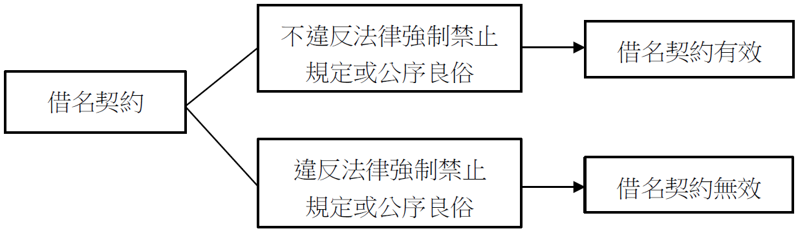

---
*注：本文圖片存放於 ./images/ 目錄下*

## 120. 承攬人抵押權登記之性質
*發布日期: 2025-01-14* 

## 內文
• 一、法源依據

• (一) 民法第513條

承攬之工作為建築物或其他土地上之工作物，或為此等工作物之重大修繕者，承攬人得就承攬關係報酬額，對於其工作所附之定作人之不動產，請求定作人為抵押權之登記；或對於將來完成之定作人之不動產，請求預為抵押權之登記。

前項請求，承攬人於開始工作前亦得為之。

前二項之抵押權登記，如承攬契約已經公證者，承攬人得單獨申請之。

第一項及第二項就修繕報酬所登記之抵押權，於工作物因修繕所增加之價值限度內，優先於成立在先之抵押權。

• (二) 土地登記規則第117條

承攬人依民法第五百十三條規定申請為抵押權登記或預為抵押權登記，除應提出第三十四條及第四十條規定之文件外，並應提出建築執照或其他建築許可文件，會同定作人申請之。但承攬契約經公證者，承攬人得單獨申請登記，登記機關於登記完畢後，應將登記結果通知定作人。

承攬人就尚未完成之建物，申請預為抵押權登記時，登記機關應即暫編建號，編造建物登記簿，於標示部其他登記事項欄辦理登記。

• 二、登記類型

• (一) 抵押權登記：針對定作人辦竣所有權第一次登記之建物。

• (二) 預為抵押權登記：針對將來完成所屬定作人之建物。

• 三、性質

• (一) 抵押權登記：屬民法第860條普通抵押權範疇，惟應注意其登記內容應受民法第513條限制，即擔保權利價值及範圍應以承攬約定報酬額為準。

• (二) 預為抵押權登記：係預先、暫時性登記，與已登記不動產之抵押權設定登記有別，主要是保全未來建物完成建物所有權第一次登記後之抵押權登記請求權，故須俟未來建物完成建物所有權第一次登記，並將原本標示部之抵押權內容轉至該他項權利部後，始生預為抵押權轉換為正式抵押權登記之效力，該抵押權始成立。

參考來源： 陳立夫，2024.11，土地法裁判精選-承攬人抵押權之登記，月旦法學雜誌，第354期：151-162。

---
*注：本文圖片存放於 ./images/ 目錄下*

## 121. 公路法之私有公路之土地增值稅問題
*發布日期: 2025-01-09* 

## 內文
• (一) 公路法之私有公路，移轉於自然人，不得適用不課徵土地增值稅。其理由如下：

1. 非都市土地供農路使用之道地目土地，雖依法編定為交通用地，仍屬農業用地之範圍（依土地稅法第10條第1項規定，農路屬於農業用地之範圍），如移轉於自然人，得適用土地稅法第39條之2第1項規定（即作農業使用之農業用地，移轉與自然人時，得申請不課徵土地增值稅）。

2. 惟依公路法所定義之公路，包括國道、省道、縣道、鄉道及專用公路，非屬於農路，如移轉於自然人，不得適用土地稅法第39條之2第1項規定。

上開乃司法院釋字第779號解釋文第三段之解釋意旨。

• (二) 公路法之私有公路，尚未被徵收前之移轉，得適用免徵土地增值稅。其理由如下：

1. 都市土地之公共設施保留地，得適用土地稅法第39條第2項規定（即依都市計畫法指定之公共設施保留地尚未被徵收前之移轉，免徵土地增值稅）。

2. 非都市土地供公共設施使用，得適用土地稅法第39條第3項規定（即非都市土地經需用土地人開闢完成或依計畫核定供公共設施使用，並依法完成使用地編定，其尚未被徵收前之移轉，經需用土地人證明者，免徵土地增值稅）。準此，公路法之私有公路，尚未被徵收前之移轉，如符合下列三項條件，免徵土地增值稅： (1)經需用土地人開闢完成或依計畫核定供公共設施使用。 (2)依法完成使用地編定。 (3)經需用土地人證明。

上開乃司法院釋字第779號解釋文第一段之解釋意旨。

• (三) 結論：

依法編定為交通用地之公路法之私有公路，尚未被徵收前而移轉於自然人，雖不得適用土地稅法第39條之2第1項規定（不課徵土地增值稅），但得適用土地稅法第39條第3項規定（免徵土地增值稅）。

---
*注：本文圖片存放於 ./images/ 目錄下*

## 122. 市地重劃之辦理方式（舉辦主體）
*發布日期: 2025-01-07* 

## 內文
• 一、公辦市地重劃

• (一) 政府主動選定地區辦理辦理市地重劃時，主管機關應擬具市地重劃計畫書，送經上級主管機關核定公告滿30日後實施之。在前項公告期間內，重劃地區私有土地所有權人半數以上，而其所有土地面積超過重劃地區土地總面積半數者，表示反對時，主管機關應予調處，並參酌反對理由，修訂市地重劃計畫書，重行報請核定，並依其核定結果公告實施。(平§56)

• (二) 地主申請優先辦理適當地區內之私有土地所有權人半數以上，而其所有土地面積超過區內私有土地總面積半數者之同意，得申請該管直轄市或縣（市）政府核准後優先實施市地重劃。(平§57)

• 二、獎勵地主自辦市地重劃

為促進土地利用，擴大辦理市地重劃，得獎勵土地所有權人自行組織重劃會辦理之。重劃會辦理市地重劃時，應由重劃區內私有土地所有權人半數以上，而其所有土地面積超過重劃區私有土地總面積半數以上者之同意，並經主管機關核准後實施之。(平§58)

---
*注：本文圖片存放於 ./images/ 目錄下*

## 123. 農業用地變更使用之主管機關同意條件
*發布日期: 2025-01-06* 

## 內文
簡要整理農地變更之條件，茲說明如下：

• (一) 不影響農業生產環境完整性+農業主管機關同意

1. 農業用地於劃定或變更為非農業使用時，應以不影響農業生產環境之完整，並先徵得主管機關之同意。(農業發展條例§10)

2. 農業用地變更使用，應避免影響農業生產環境之完整。有下列情形之一者，不同意變更使用(農業主管機關同意農業用地變更使用審查作業要點§5)： (1)未依規定規劃設置隔離綠帶或設施。 (2)使用具有農業灌溉功能之系統作為廢污水排放使用或有妨礙上、下游農業灌排水系統輸水能力之虞。 (3)申請變更範圍內夾雜未申請變更之農業用地且妨礙其農業經營。 (4)妨礙原有區域性農路通行。 (5)申請變更農業用地辦理部分土地分割，致造成坵塊零碎不利農業經營。但線狀之公共建設，不在此限。 (6)目的事業主管機關就事業設置之必要性與計畫使用農業用地所提區位、面積之必要性、合理性及無可替代性，未提出評估意見或未表示支持意見。 (7)其他依本要點規定不得同意變更使用之情形。目的事業主管機關對於興辦事業人申請農業用地變更，應就事業設置之必要性與計畫使用農業用地所提區位、面積之必要性、合理性及無可替代性，提出評估意見，或具體表示是否支持該興辦事業及土地使用。(農業主管機關同意農業用地變更使用審查作業要點§4)

• (二) 繳交回饋金

農業用地之變更，應視其事業性質，繳交回饋金，撥交第54條中央主管機關所設置之農業發展基金，專供農業發展及農民福利之用。(農業發展條例§12 I)

各目的事業相關法令已明定土地變更使用應捐贈或繳交相當回饋性質之金錢或代金者，其繳交及使用，依其法令規定辦理。但其土地如係農業用地，除民國89年1月4日修正施行前已收繳者，得免予撥交外，各相關機關應將收繳之金錢或代金之二分之一依前項規定辦理。(農業發展條例§12 II)

---
*注：本文圖片存放於 ./images/ 目錄下*

## 124. 112年憲判字第20號判決之影響
*發布日期: 2025-01-02* 

## 內文
112年憲判字第20號判決除否定土地法第57條登記為國有之效力外，亦補充司法院釋字第107號及第164號之解釋。

112年憲判字第20號判決理由提及，本件所示土地所有權爭議中，國家不得主張適用民法消滅時效之規定。其理由如下：

• (一) 國家就其與人民間之私權爭議，原則上固得主張相關規定所賦予之權利。然而，國家係為人民而存在，本質上既不可能擁有如人民般得自由發展之人格及維繫生存之需求，亦不可能如人民般享有得自由追求之私益，只能追求公益，以執行公共任務為職志。從而，國家自無受憲法第15條所保障財產權之基本權利。

• (二) 國家基於公權力主體地位行使統治高權，致與人民發生財產權爭執時，國家本非憲法第15條財產權保障之主體，從而不生基本權衝突之情事。

• (三) 一般而言，權利人長久未行使其權利者，消滅時效制度固具有早日確定私法上權利義務狀態、維持法律秩序之公益性。惟國家與人民間關於土地之爭議，若非來源於兩者之合意，而係國家於政權更替之際，居於公權力主體地位，行使統治權，制定相關法規範，並依該規範將原屬人民私有而僅未及時申辦總登記之土地，逕行登記為國有之情形，倘又容許國家嗣後再以時間經過為由，依民法消滅時效規定為時效完成之抗辯，不啻變相承認國家得透過土地總登記之程序，及消滅時效之抗辯，而無須踐行任何徵收或類似徵收之程序，即可剝奪人民之財產。

（參見：112年憲判字第20號判決理由）

司法院釋字第107號解釋文：「已登記不動產所有人之回復請求權，無民法第一百二十五條消滅時效規定之適用。」司法院釋字第164號解釋文：「已登記不動產所有人之除去妨害請求權，不在本院釋字第一０七號解釋範圍之內，但依其性質，亦無民法第一百二十五條消滅時效規定之適用。」上開二則解釋文，再補充加入112年憲判字第20號判決理由，其結果（如圖所示）如下：

• (一) 不動產真正所有權人，尚未依我國法律登記為所有權人，如登記名義人為私人，不動產真正所有權人行使民法第767條之物上請求權，請求返還不動產或除去妨害，有消滅時效規定之適用。

• (二) 不動產真正所有權人，尚未依我國法律登記為所有權人，如登記名義人為國家，不動產真正所有權人行使民法第767條之物上請求權，請求返還不動產或除去妨害，無消滅時效規定之適用。

• (三) 不動產真正所有權人，已依我國法律登記為所有權人，不論登記名義人為私人或國家，不動產真正所有權人行使民法第767條之物上請求權，請求返還不動產或除去妨害，無消滅時效規定之適用。

[圖片1]

## 文章圖片

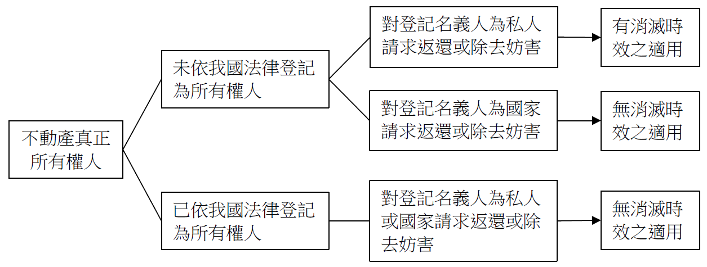

---
*注：本文圖片存放於 ./images/ 目錄下*

## 125. 114年贈與稅計算範例
*發布日期: 2024-12-31* 

## 內文
某甲為經常居住於中華民國境內之中華民國國民，於民國114年4月贈與其兒一筆公告土地現值加房屋評定標準價格共計7,350萬元之不動產，受贈人所納契稅及土地增值稅合計500萬元，試問其應納贈與稅為多少？

解答：

• 一、公告114年發生繼承或贈與案件適用遺產稅、贈與稅之免稅額、課稅級距金額、不計入遺產總額及各項扣除額之金額

[圖片1]

資料來源：財政部，2024.11.28

• 二、計算

• (一) 贈與總額：贈與稅按贈與人每年贈與總額，減除規定之扣除額及免稅額後之課稅贈與淨額。其中，贈與財產價值之計算，以贈與人贈與時之時價為準；被繼承人如係受死亡之宣告者，以法院宣告死亡判決內所確定死亡日之時價為準。所稱時價，土地以公告土地現值或評定標準價格為準；房屋以評定標準價格為準；其他財產時價之估定，本法未規定者，由財政部定之。

因此，本題贈與總額為7,350(萬元)

• (二) 扣除額：契稅及土地增值稅扣除額500(萬元)

• (三) 免稅額：244(萬元)

• (四) 課稅贈與淨額＝贈與總額－扣除額－免稅額 ＝（7,350－500－244）＝6,606(萬元)

• (五) 適用稅率：贈與稅按贈與人每年贈與總額，減除規定之扣除額及免稅額後之課稅贈與淨額，依下列稅率課徵之：

1. 2,500萬元以下者，課徵10%。

2. 超過2,500萬元至5,000萬元者，課徵250萬元，加超過2,500萬元部分之15%。

3. 超過5,000萬元者，課徵625萬元，加超過5,000萬元部分之20%。

惟114年課稅級距須依最新物價調整後金額計算，即：

1. 贈與淨額2,811萬元以下者，課徵10%。

2. 超過2,811萬元至5,621萬元者，課徵281萬1,000元，加超過5,621萬元部分之15%。

3. 超過5,621萬元者，課徵702萬6,000元，加超過5,621萬元部分之20%。

• (六) 贈與稅應納稅額

贈與稅應納稅額＝2,811*10%+2,810×15%+(6,606-5,621)×20% ＝899.6(萬元)

## 文章圖片

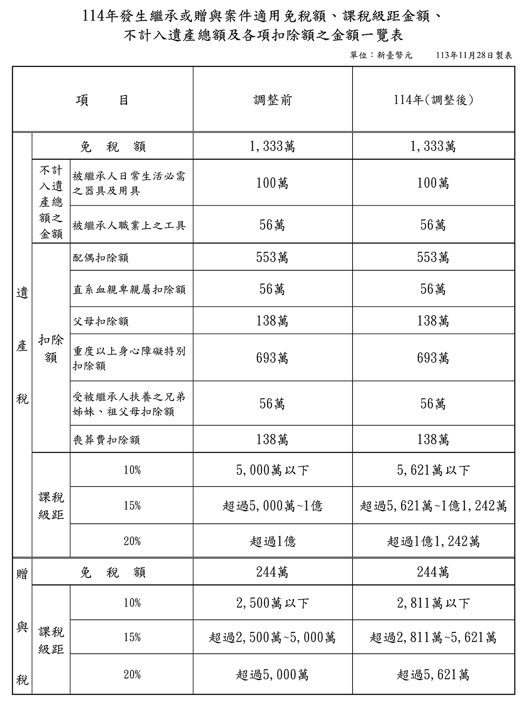

---
*注：本文圖片存放於 ./images/ 目錄下*

## 126. 內部估價與外部估價
*發布日期: 2024-12-26* 

## 內文
• (一) 內部估價之意義：金融機構辦理放款時，擔保品價格由金融機構內部人員查估，稱為內部估價。

• (二) 外部估價之意義：金融機構辦理放款時，擔保品價格委由金融機構外部之專業人員（即不動產估價師）查估，稱為外部估價。

• (三) 優缺點比較：

1. 內部估價：

• (1) 優點： ①不必向借款人收取估價服務費，提高爭取業務之機會。 ②可以掌控貸款金額，達到客戶要求。

• (2) 缺點： ①銀行人員充當估價人員，知識及經驗不足，恐造成估價錯誤。 ②銀行經理為了業績，指示承辦員高估，日後產生不良債權。

2. 外部估價之優缺點：

• (1) 優點： ①不動產估價師具有估價執照，且由公正第三人估價，其估價結果較易獲得借款人信賴。 ②不動產估價師不受銀行經理指揮監督，可以發揮客觀、公正、獨立估價。

• (2) 缺點： ①委託估價師查估，須收取估價服務費，造成借款人或銀行之負擔。 ②估值較無彈性，難以溝通協調。

綜上，目前國內銀行採內部估價者較多（如土地銀行、華南銀行、第一銀行等）；採外部估價者較少（如星展銀行、匯豐銀行、上海商銀等）。然，筆者認為宜採外部估價，短期可以降低銀行之呆帳率，長期可以避免銀行之系統風險。

---
*注：本文圖片存放於 ./images/ 目錄下*

## 127. 114年遺產稅計算範例
*發布日期: 2024-12-24* 

## 內文
某甲為經常居住於中華民國境內之中華民國國民，於民國114年4月死亡，享年63歲，其遺有雙親、受其撫養哥哥、重度殘障之配偶，以及15歲、18歲與23歲之子女。經清查後，其留有遺產包含如下，請問遺產稅應納稅額為多少？

• (一) 素地：面積3,000平方公尺，公告土地現值每平方公尺2萬元。 (二)成屋：土地面積1,500平方公尺，公告土地現值每平方公尺3萬元，房屋評定標準價格1千萬。 (三)地上權：年租額500萬元，賸餘期間40年。

解答：

• 一、公告114年發生繼承或贈與案件適用遺產稅、贈與稅之免稅額、課稅級距金額、不計入遺產總額及各項扣除額之金額

[圖片1]

資料來源：財政部，2024.11.28

• 二、計算

• (一) 遺產總額：遺產稅按被繼承人死亡時，依本法規定計算之遺產總額，減除規定之各項扣除額及免稅額後之課稅遺產淨額。遺產總額應包括被繼承人死亡時依規定之全部財產，及依規定計算之價值。但規定不計入遺產總額之財產，不包括在內。其中，遺產價值之計算，以被繼承人死亡時之時價為準；被繼承人如係受死亡之宣告者，以法院宣告死亡判決內所確定死亡日之時價為準。

1. 土地：所稱時價，土地以公告土地現值或評定標準價格為準。

2. 房屋：以評定標準價格為準。

3. 地上權之設定有期限及年租者，其賸餘期間超過三十年至五十年以下者，以一年地租額之五倍為其價額。本題賸餘期間為40年。

因此，甲遺產總額＝(3,000×2)+(1,500×3+1,000)+(500×5)＝14,000(萬元)

• (二) 扣除額

1. 雙親扣除額：138×2=276(萬元)

2. 重度殘障配偶扣除額：553+693=1,246(萬元)

3. 15歲未成年子女扣除額：56+56×3=224(萬元)

4. 18歲成年子女扣除額：56(萬元)

5. 23歲成年子女扣除額：56(萬元)

6. 受其撫養哥哥扣除額：56(萬元)

7. 喪葬費扣除額：138(萬元)

8. 合計：276+1,246+224+56+56+56+138=2,052(萬元)

• (三) 免稅額：1,333(萬元)

• (四) 課稅遺產淨額＝遺產總額－扣除額－免稅額＝（14,000－2,052－1,333）＝10,615(萬元)

• (四) 適用稅率：遺產稅按被繼承人死亡時，依本法規定計算之遺產總額，減除規定之各項扣除額及免稅額後之課稅遺產淨額，依下列稅率課徵之：

1. 五千萬元以下者，課徵百分之十。

2. 超過五千萬元至一億元者，課徵五百萬元，加超過五千萬元部分之百分之十五。

3. 超過一億元者，課徵一千二百五十萬元，加超過一億元部分之百分之二十。

惟114年課稅級距須依最新物價調整後金額計算，即：

1. 遺產淨額5,621萬元以下者，課徵10%。

2. 超過5,621萬元至1億1,242萬元者，課徵562萬1,000元，加超過5,621萬元部分之15%。

3. 超過1億1,242萬元者，課徵1,405萬2,500元，加超過1億1,242萬元部分之20%。

• (五) 遺產稅應納稅額＝5,621×10%+[(10,615-5,621)×15%]＝1,311.2(萬元)

## 文章圖片

---
*注：本文圖片存放於 ./images/ 目錄下*

## 128. 終止住宅租約之限制
*發布日期: 2024-12-19* 

## 內文
關於終止住宅租約之限制，土地法第100條針對不定期租約，住宅法第38條針對社會住宅，租賃住宅市場發展及管理條例第10條及第11條針對定期租約提前終止，三者之適用時機不同。茲分述如下：

• (一) 土地法之規定：出租人非因下列情形之一，不得收回房屋：

1. 出租人收回自住或重新建築時。

2. 承租人違反民法第443條第1項之規定轉租於他人時。

3. 承租人積欠租金額，除擔保金抵償外，達二個月以上時。

4. 承租人以房屋供違反法令之使用時。

5. 承租人違反租賃契約時。

6. 承租人損壞出租人之房屋或附著財物，而不為相當之賠償時。（土§100）

• (二) 住宅法之規定：社會住宅之承租人有下列情形之一者，經營管理者得隨時終止租約收回住宅：

1. 已不符承租社會住宅之資格。

2. 將住宅部分或全部轉租或借予他人居住。

3. 改建、增建、搭蓋違建、改變住宅原狀或變更為居住以外之使用。

4. 其他違反租約中得終止租約收回住宅之規定。（住§38I）

• (三) 租賃住宅市場發展及管理條例之規定：

1.

出租人提前終止租約之情形：租賃期間發生下列情形之一者，出租人得提前終止租賃契約，且承租人不得要求任何賠償： (1)承租人毀損租賃住宅或附屬設備，不為修繕或相當之賠償。 (2)承租人遲付租金或費用，達二個月之租額，經定相當期限催告仍拒繳。 (3)承租人未經出租人書面同意，將租賃住宅轉租於他人。 (4)出租人為重新建築而必要收回。 (5)其他依法律規定得提前終止租賃契約。

出租人依前項規定提前終止租賃契約者，應依下列規定期限，檢附相關事證，以書面通知承租人： (1)依前項第一款至第三款及第五款規定終止者，於終止前三十日。 (2)依前項第四款規定終止者，於終止前三個月。（租§10）

2.

承租人提前終止租約之情形：租賃期間發生下列情形之一者，承租人得提前終止租賃契約，且出租人不得要求任何賠償： (1)因疾病、意外產生有長期療養之需要。 (2)租賃住宅未合於居住使用，並有修繕之必要，經承租人定相當期限催告，而不於期限內修繕。 (3)因不可歸責於承租人之事由，致租賃住宅之一部滅失，且其存餘部分難以繼續居住。 (4)因第三人就租賃住宅主張其權利，致承租人不能為約定之居住使用。

承租人死亡，繼承人得主張終止租賃契約。

承租人依上開提前終止租賃契約者，應於終止前三十日，檢附相關事證，以書面通知出租人。（租§11）

【附註】 土：土地法 住：住宅法 租：租賃住宅市場發展及管理條例

---
*注：本文圖片存放於 ./images/ 目錄下*

## 129. 判決共有物分割之法定抵押權登記
*發布日期: 2024-12-17* 

## 內文
• 一、意義

根據民法第824條，共有物之分割，依共有人協議之方法行之。分割之方法不能協議決定，或於協議決定後因消滅時效完成經共有人拒絕履行者，法院得因任何共有人之請求，命以原物分配於各共有人。但各共有人均受原物之分配顯有困難者，得將原物分配於部分共有人。倘若以原物為分配時，如共有人中有未受分配，或不能按其應有部分受分配者，得以金錢補償之。此為「補償分割」之方式。

惟同法第824條之1第4項則為免補償義務人不給錢，爰規定如為不動產分割者，應受補償之共有人，就其補償金額，對於補償義務人所分得之不動產，有抵押權。繼按土地登記規則第100條之1亦規定，依民法第824條第3項規定申請共有物分割登記時，共有人中有應受金錢補償者，申請人應就其補償金額，對於補償義務人所分得之土地，同時為應受補償之共有人申請抵押權登記。但申請人提出應受補償之共有人已受領或為其提存之證明文件者，不在此限。

• 二、申請方式

• (一) 根據土地登記規則第27條第16款，依民法第824條之1第4項規定抵押權之登記為「單獨申請」，其登記原因為「法定」。

• (二) 此法定抵押權登記需與判決共有物分割登記連件申請。

• (三) 應受補償人(即法定抵押權人)為未會同申請登記之共有人，其未繳之登記規費，得於其抵押權之其他登記事項欄註記「未會同申請，欠繳登記費○○○及書狀費，繳清後發狀」。

• (四) 申請文件：

1. 土地登記申請書

2. 法院判決共有物分割法定抵押權登記清冊

3. 法院判決共有物分割確定證明（如法院對共有物分割裁判確定之判決書）

4. 申請人身分證明

5. 土地增值稅繳（免）稅證明

6. 契稅繳（免）稅證明

7. 其他依法律規定應提出之證明文件

• 三、登簿範例

[圖片1]

## 文章圖片

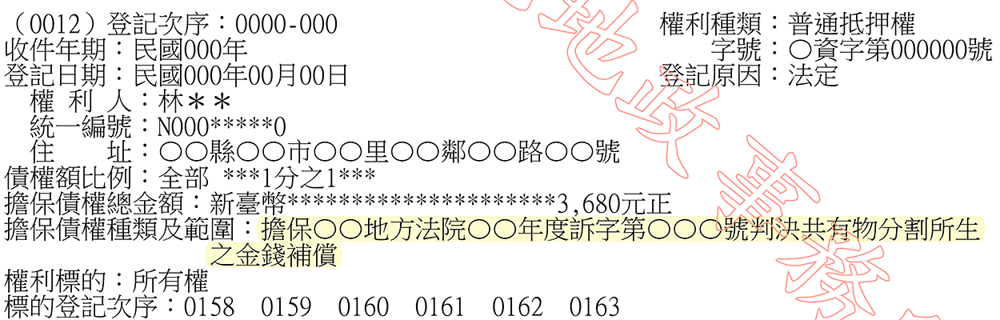

---
*注：本文圖片存放於 ./images/ 目錄下*

## 130. 真透天與假透天
*發布日期: 2024-12-12* 

## 內文
透天房屋依產權型態分為真透天與假透天二種。

• (一) 真透天：透天房屋持有人對建物產權為單獨所有，對基地產權亦為單獨所有。

• (二) 假透天：亦稱持分透天；透天房屋持有人對建物產權為單獨所有，對基地產權則與該社區其他房屋持有人共有（分別共有）。

• (三) 兩者比較：

1. 真透天得僅就土地或僅就建物為讓與，亦得就土地與建物讓與不同一人。假透天不得僅就土地或僅就建物為讓與，亦不得就土地與建物讓與不同一人。

2. 假透天持有人就建物連同其基地應有部分之所有權一併移轉與同一人者，基地之他共有人無優先購買權。真透天無此一情形。

3. 真透天之更新重建得由房地持有人單獨為之。假透天之更新重建應經社區之全體房地持有人同意。

4. 相同情況下，真透天之房價較假透天為高。

---
*注：本文圖片存放於 ./images/ 目錄下*

## 131. 區分所有建物記明基地權利種類
*發布日期: 2024-12-10* 

## 內文
• 一、規定

按土地登記規則規定第83條：「區分所有權人申請建物所有權第一次登記時，除依第79條規定，提出相關文件外，並應於申請書適當欄記明基地權利種類及範圍(第1項)。登記機關受理前項登記時，應於建物登記簿標示部適當欄記明基地權利種類及範圍(第2項)。」

倘若部分區分所有權人單獨申請建物所有權登記時，仍應依規定提出相關文件並於申請書記明基地權利種類及其範圍，如申請人查註基地權利種類及其範圍有困難時，應請其逕洽貴府建築主管機關調卷或影印其提供興建房屋時所附之土地權利證明文件後據以辦理。(內政部91年2月6日台內中地字第0910001589號函)

• 二、意義

配合公寓大廈管理條例第4條：「專有部分不得與其所屬建築物共用部分之應有部分及其基地所有權或地上權之應有部分分離而為移轉或設定負擔。」避免於辦理所有權移轉時滋生疑義

• 三、範例

• (一) 登記申請書之記明

[圖片1]

資料來源：台北市政府

• (二) 建物登記簿之註記

[圖片2]

## 文章圖片

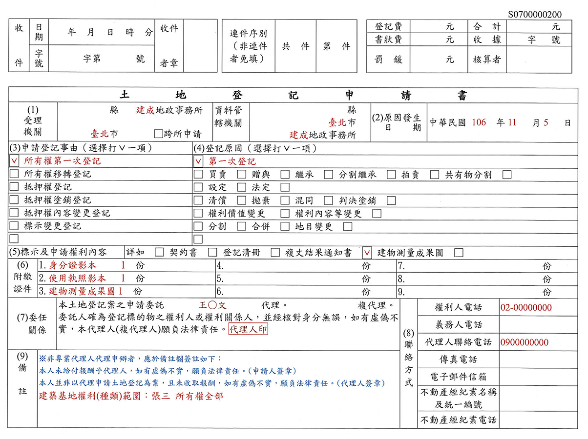

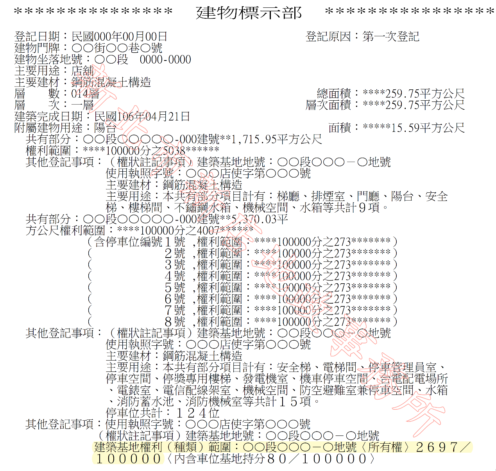

---
*注：本文圖片存放於 ./images/ 目錄下*

## 132. 地價稅與房屋稅之信託歸戶對照
*發布日期: 2024-12-05* 

## 內文
• (一) 地價稅之信託歸戶：信託土地應與委託人在同一直轄市或縣（市）轄區內所有之土地合併計算地價總額，依規定稅率課徵地價稅，分別就各該土地地價占地價總額之比例，計算其應納之地價稅。但信託利益之受益人為非委託人且符合下列各款規定者，前項土地應與受益人在同一直轄市或縣（市）轄區內所有之土地合併計算地價總額：

1. 受益人已確定並享有全部信託利益者。

2. 委託人未保留變更受益人之權利者。（土稅§3-1 II）

• (二) 房屋稅之信託歸戶：依規定計算房屋戶數時，房屋為信託財產者，於信託關係存續中，應改歸戶委託人，與其持有房屋，分別合併計算戶數。但信託利益之受益人為非委託人，且符合下列各款規定者，應改歸戶受益人：

1. 受益人已確定並享有全部信託利益。

2. 委託人未保留變更受益人之權利。（房§5 III）

• (三) 比較：

1. 地價稅就土地價格歸戶，房屋稅就房屋戶數歸戶。

2. 地價稅以直轄市、縣（市）為歸戶範圍，房屋稅以全國為歸戶範圍。

3. 地價稅歸戶之目的在累計申報地價（稅基），以適用累進稅率。房屋稅歸戶之目的在累計戶數，以適用囤房稅率。

【附註】

1. 土稅：土地稅法

2. 房：房屋稅條例

---
*注：本文圖片存放於 ./images/ 目錄下*

## 133. 公私有土地最小面積單位限制與禁止再分割─林業用地
*發布日期: 2024-12-03* 

## 內文
按土地法第31條規定，直轄市或縣（市）地政機關於其管轄區域之土地，得斟酌地方經濟情形，依其性質及使用之種類，為最小面積單位之規定，並禁止其再分割。其立法意旨在防止土地細分，以免影響土地經濟有效使用。

此相關規定除上課所提到的農業發展條例對耕地之0.25公頃限制，以及建築法對畸零地限制外。目前另有南投縣政府、臺南市政府、花蓮縣政府、屏東縣政府、彰化縣政府、臺東縣政府、新北市政府、嘉義縣政府、高雄市政府等縣市政府對於該轄區內林業用地為最小面積單位（0.1公頃/1分地）之限制，並禁止其再分割（內政部地政司，2021），如下圖所示，以維護林業資源，防止用地不當使用。

[圖片1]

惟如政府機關因公共事業之需要，就上開已限制分割之土地，因部分依法變更為其他用地使用須辦理分割者，其目的係在增進公共利益，促進土地有效利用，與最小面積單位並限制再分割之情形不同，應不受上開規定之限制。（內政部87年12月24日台內地字第8713136號函）

## 文章圖片

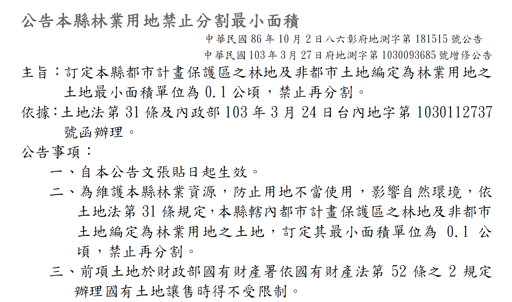

---
*注：本文圖片存放於 ./images/ 目錄下*

## 134. 先行區段徵收
*發布日期: 2024-11-28* 

## 內文
• (一) 先行區段徵收之意義：區段徵收之公共設施配置依據都市計畫（細部計畫）內容。因此，先實施都市計畫（細部計畫），始辦理區段徵收。然，先行區段徵收剛好相反，先辦理區段徵收，再擬定或變更都市計畫。同理，先行區段徵收亦得應用於非都市土地。

• (二) 先行區段徵收之目的：

1. 根據區段徵收之需要配置公共設施，再據以變更細部計畫，符合區段徵收之規劃意旨。

2. 避免都市計畫變更時程冗長，而遷延推行區段徵收之進度。

3. 辦理區段徵收與變更都市計畫同時進行，以縮短區段徵收之時程。

• (三) 先行區段徵收之情形：

1. 都市土地：下列三種情形之開發範圍經中央主管機關核定者，得先行區段徵收，並於區段徵收公告期滿後一年內發布實施都市計畫，不受都市計畫法第52條規定之限制（亦即，不受徵收私有土地不得妨礙都市計畫之限制）。 (1)新設都市地區之全部或一部，實施開發建設者。 (2)舊都市地區為公共安全、衛生、交通之需要或促進土地之合理使用實施更新者。 (3)都市土地之農業區、保護區變更為建築用地或工業區變更為住宅區、商業區者。（徵§4 II）

2. 非都市土地：農村社區為加強公共設施、改善公共衛生之需要或配合農業發展之規劃實施更新，需用土地人得會同有關機關研擬開發範圍，並檢具經上級目的事業主管機關核准之興辦事業計畫書，報經中央主管機關核定後，先行區段徵收，於區段徵收公告期滿後，依土地使用計畫完成非都市土地分區或用地編定之變更。（徵§4 III）

【附註】 徵：土地徵收條例

---
*注：本文圖片存放於 ./images/ 目錄下*

## 135. 私有土地面積最高額之限制
*發布日期: 2024-11-26* 

## 內文
為避免私人壟斷土地，並同時促進土地利用，直轄市或縣(市)政府對於尚未建築之私有建築用地應予限制所有面積最高額。

• (一) 原則

1. 土地法規定(土§28)： (1)直轄市或縣（市）政府對於私有土地，得斟酌地方情形，按土地種類及性質，分別限制個人或團體所有土地面積之最高額。 (2)限制私有土地面積之最高額，應經中央地政機關之核定。

2. 平均地權條例規定(平§71I)： 直轄市或縣（市）政府對於尚未建築之私有建築用地，應限制土地所有權人所有面積之最高額。

• (二) 標準

1. 土地法規定(土施§7)： (1)宅地以十畝(10市畝=66.67公畝=2016.67坪)為限； (2)農地以其純收益足供一家十口之生活為限； (3)興辦事業用地視其事業規模之大小定其限制。

2. 平均地權條例規定(平§71II)： (1)以十公畝 (302.5坪)為限。 (2)但工業用地、學校用地及經政府核准之大規模建築用地，應視其實際需要分別訂定之。 計算尚未建築土地面積最高額時，對於因法令限制不能建築之土地，應予扣除。(平§71III)

• (三) 處理

1. 土地法規定(土§29)： (1)私有土地受土地面積最高額限制時，由該管直轄市或縣（市）政府規定辦法，限令於一定期間內，將額外土地分劃出賣。 (2)不依前項規定分劃出賣者，該管直轄市或縣（市）政府得依本法徵收之。 (3)前項徵收之補償地價，得斟酌情形搭給土地債券。 *依土地法第二十九條以土地債券照價收買私有土地，其土地債券之清付期限，最長不得逾五年。(土施§8)

2. 平均地權條例規定(平§72)： (1)超額土地，直轄市或縣（市）政府應通知土地所有權人於二年內出售或建築使用。 (2)逾期未出售或未建築使用者，得予照價收買，整理後出售與需用土地人建築使用。 (3)但在建設發展較緩之地段，不在此限。 *所稱建設發展較緩之地段，指公共設施尚未完竣地區或依法不得核發建造執照之地區。其範圍由直轄市或縣(市)主管機關劃定，作為限制最高額土地之依據。(平施§96)

---
*注：本文圖片存放於 ./images/ 目錄下*

## 136. 都市計畫之變更途徑
*發布日期: 2024-11-21* 

## 內文
• (一) 都市計畫之變更途徑：

1. 通盤檢討：都市計畫經發布實施後，不得隨時任意變更。但擬定計畫之機關每三年內或五年內至少應通盤檢討一次，依據發展情況，並參考人民建議作必要之變更。對於非必要之公共設施用地，應變更其使用。（都§26 I）

2. 個案變更：都市計畫經發布實施後，遇有下列情事之一時，當地直轄市、縣（市）政府或鄉、鎮、縣轄市公所，應視實際情況迅行變更： (1)因戰爭、地震、水災、風災、火災或其他重大事變遭受損壞時。 (2)為避免重大災害之發生時。 (3)為適應國防或經濟發展之需要時。 (4)為配合中央、直轄市或縣（市）興建之重大設施時。（都§27 I）

3. 自行擬定或變更細部計畫：土地權利關係人為促進其土地利用，得配合當地分區發展計畫，自行擬定或變更細部計畫，並應附具事業及財務計畫，申請當地直轄市、縣（市）政府或鄉、鎮、縣轄市公所依規定辦理。（都§24）

4. 自行舉辦新市區建設：私人或團體申請當地直轄市、縣（市）政府核准後，得舉辦新市區之建設事業。但其申請建設範圍之土地面積至少應在十公頃以上，並應附具下列計畫書件： (1)土地面積及其權利證明文件。 (2)細部計畫及其圖說。 (3)公共設施計畫。 (4)建築物配置圖。 (5)工程進度及竣工期限。 (6)財務計畫。 (7)建設完成後土地及建築物之處理計畫。（都§61 I）

• (二) 地主回饋義務：

都市計畫變更，土地使用性質及土地使用強度隨之改變，地主獲得租利，因此地主有回饋義務。

1. 依上開第1種、第2種及第3種途徑變更都市計畫，主管機關得要求土地權利關係人提供或捐贈都市計畫變更範圍內之公共設施用地、可建築土地、樓地板面積或一定金額予當地直轄市、縣（市）政府或鄉、鎮、縣轄市公所。（都§27-1 I）

2. 依上開第4種途徑變更都市計畫，私人或團體舉辦之新市區建設範圍內之道路、兒童遊樂場、公園以及其他必要之公共設施等，應由舉辦事業人自行負擔經費。（都§61 II）

【附註】 都：都市計畫法

---
*注：本文圖片存放於 ./images/ 目錄下*

## 137. 遺贈與死因贈與之比較
*發布日期: 2024-11-19* 

## 內文
本週專欄茲整理相關文獻，將遺贈與死因贈與進行比較如下：

• T. ABLE_PLACEHOLDER_1

參考資料：臺灣新北地方法院家事紀錄科，2020；曾品傑、陳瀅伃，2013，死因贈與侵害特留分時，繼承人得否行使扣減權？─最高法院一一一年度台上字第九一六號判決；林秀雄，2024，遺贈和死因贈與之異同─評最高法院106年度台上字第2731號判決與臺灣高等法院107年度重上更一字第6號民事判決；曾品傑，2024，死因贈與—最高法院112年度台上字第1871號；黃詩淳，2016，死因贈與在臺灣社會之實態與功能。

---
*注：本文圖片存放於 ./images/ 目錄下*

## 138. 土地法第34條之1於公同共有準用之
*發布日期: 2024-11-14* 

## 內文
公同共有不動產得準用土地法第34條之1第1項（多數決）及第4項（優先購買權）。茲說明如下：

• (一) 各公同共有人不得單獨出賣其潛在應有部分。惟部分公同共有人得依土地法第34條之1第1項規定出賣公同共有土地或建物全部。

• (二) 共有人數及應有部分之計算，於公同共有土地或建物者，指共有人數及其潛在應有部分合計均過半數。但潛在應有部分合計逾三分之二者，其共有人數不予計算（執§7 II）。

• (三) 他公同共有人得就該公同共有土地或建物主張優先購買權。如有數人主張時，其優先購買權之範圍應按各主張優先購買權人之潛在應有部分比例計算之（執§13⑩）。

• (四) 民法第830條第1項規定，公同共有之關係，因公同共有物之讓與而消滅。準此，數人主張優先購買後，該土地或建物之產權由公同共有關係轉變為分別共有關係。

例如：甲、乙、丙、丁、戊五人因繼承而公同共有一筆土地，應繼分各五分之一。甲、乙、丙三人依土地法第34條之1第1項將該筆土地出賣於庚，不同意共有人丁、戊二人主張優先購買權。優先購買後，該筆土地產權為丁、戊二人共有，應有部分各二分之一。

【附註】 執：土地法第三十四條之一執行要點

---
*注：本文圖片存放於 ./images/ 目錄下*

## 139. 不動產經紀業違反公平交易法之情形
*發布日期: 2024-11-12* 

## 內文
• 一、違反第15條「聯合行為」

不動產經紀業者涉及違法聯合行為之態樣例示如下：

• (一) 共同決定服務報酬收費標準，或協議限制服務報酬之調整。 (二)共同劃分經營區域。 (三)共同劃分交易對象。 (四)共同阻礙或排除其他競爭者或潛在競爭者參與競爭，例如協議拒絕其他不動產經紀業者參與聯賣。（考過） (五)共同約束開發物件必須與委託人簽訂專任委託契約，致使不動產經紀業者及委託人選擇委託契約型態之自由受到限制。 (六)共同約束專任委託契約之期間，致使不動產經紀業者縱未積極努力撮合，委託人卻因受限於契約而無法另行委託其他不動產經紀業者。 (七)共同約束收取斡旋金之票期，致使斡旋金票期趨於一致。 (八)共同約束實施聯賣之不動產物件開發方擁有一定的專賣期間，致使已尋得交易相對人之其他不動產經紀業者受限於專賣權之規定而無法成交。

• 二、違反第20條「其他型限制競爭」（第5款以不正當限制交易相對人之事業活動為條件，而與其交易之行為）

採加盟經營方式之不動產經紀業者應容許其加盟店自由決定服務報酬，如以不正當限制加盟店服務報酬標準，作為成立或持續加盟經營關係之條件，而有限制競爭之虞者（考過）

• 三、違反第21條「不實廣告」

• (一) 不動產經紀業者對於涉及事業服務品質、企業形象、行銷策略等內容之廣告，有虛偽不實或引人錯誤者。例如廣告宣稱「仲介服務第一品牌」，惟無銷售數字或意見調查等客觀數據為基礎，或宣稱「連續十年○○雜誌調查，獲經紀業第一名」，惟與事實不符。（考過） (二)不動產經紀業者受不動產開發業者委託從事銷售行為，依個案具體情形，倘得認不動產經紀業者與不動產開發業者俱為廣告主時，其廣告內容，有虛偽不實或引人錯誤者。例如不動產經紀業者與不動產開發業者共同具名製作不實房屋銷售廣告，且收取建案底價或總銷售金額一定成數之銷售服務費用，與不動產開發業者共同獲有利益。

• 四、違反第23條「不當贈品或贈獎」

不動產經紀業者為爭取交易之機會，辦理提供贈品或贈獎活動，違反公平交易委員會所定事業提供贈品贈獎額度辦法者。

註：事業提供贈品贈獎額度辦法

第4條 事業銷售商品或服務附送贈品，其贈品價值上限如下： 一、商品或服務價值在新臺幣一百元以上者，為商品或服務價值之二分之一。 二、商品或服務價值在新臺幣一百元以下者，為新臺幣五十元。

第5條 事業辦理贈獎，其全年贈獎總額之上限如下： 一、上一會計年度之銷售金額在新臺幣三十億元以上者，為新臺幣六億元。 二、上一會計年度之銷售金額超過新臺幣七億五千萬元，未滿新臺幣三十億元者，為銷售金額的五分之一。 三、上一會計年度之銷售金額在新臺幣七億五千萬元以下者，為新臺幣一億五千萬元。

第6條 事業辦理贈獎，其最大獎項之金額，不得超過新臺幣五百萬元。

• 五、違反第25條「其他足以影響交易秩序之欺罔行為」

• (一) 未涉及廣告之不實促銷手段。 (二)隱匿重要交易資訊，如：

1. 不動產經紀業者從事不動產買賣之仲介業務時，在向買方收取斡旋金前，未以書面告知買方下列資訊，構成欺罔行為，且足以影響交易秩序者： (1)斡旋金契約與內政部版「要約書」之區別及其替代關係。 (2)買方得選擇支付斡旋金或採用內政部版「要約書」。

2. 預售屋之銷售，就未列入買賣契約共有部分之項目，要求購屋人找補價款。

• 六、違反第25條「其他足以影響交易秩序之顯失公平行為」

• (一) 不當招攬顧客：以脅迫或煩擾等不正當方式干擾交易相對人之交易決定，如以一對一緊迫釘人、長時間疲勞轟炸或趁消費者窘迫之際從事銷售。 (二)不當利用相對市場優勢地位。 (三)利用資訊不對稱之行為，如：

1. 加盟業主於招募加盟過程中，未以書面提供交易相對人加盟重要資訊，或未給予合理契約審閱期間。

2. 不動產開發業者或不動產經紀業者銷售預售屋時，未以書面提供購屋人重要交易資訊，或不當限制購屋人之契約審閱。其中，重要交易資訊如： (1)建造執照影本。 (2)核准之基地位置圖、地盤圖(坐落基地之地籍圖)、各層平面圖及停車空間平面圖。 (3)銷售時最近一次建管機關核准之各戶持分總表（應足以顯示全區各戶之主建物、附屬建物與共有部分之面積及共有部分之分攤比例）。 (4)預售屋買賣契約書（應含共有部分之項目、面積或比例分攤之計算方式）。 (5)配合建案貸款之金融機構名稱。 (6)土地位於重劃用地限制資訊與所須負擔之重劃費用。

• (四) 妨礙消費者行使合法權益：如不動產開發業者與購屋人締結預售屋買賣契約後，未交付契約書或要求繳回。

注意上述係例示若干常見之欺罔及顯失公平行為類型，惟違反公平交易法規定之情形不以此為限，仍須就特定行為處理原則（或規範說明）及個案具體事實加以認定。

來源：參考「公平交易委員會對於不動產經紀業之規範說明」、「公平交易委員會對於公平交易法第二十五條案件之處理原則」等

---
*注：本文圖片存放於 ./images/ 目錄下*

## 140. 地價區段與區段地價之比較
*發布日期: 2024-11-07* 

## 內文
• (一) 地價區段之意義：將地價相近、地段相連、情況相同或相近之土地劃為同一地價區段（查§18 I）。

• (二) 區段地價之意義：以地價區段內實例土地正常單價，求其中位數為各該區段之區段地價（查§21 I①）。

• (三) 兩者不同如下：

1. 地價區段，所稱「地價」為形容詞，「區段」為名詞，最後結果為「範圍」。 區段地價，所稱「區段」為形容詞，「地價」為名詞，最後結果為「價格」。

2. 地價區段係指地價同質空間之範圍。 區段地價係指各地價區段之平均地價。

3. 地價查估時，先劃分「地價區段」，再求取「區段地價」。換言之,「地價區段」在先，「區段地價」在後。

【附註】 查：地價調查估計規則

---
*注：本文圖片存放於 ./images/ 目錄下*

## 141. 製造、設計與生產之企業經營者商品、服務責任
*發布日期: 2024-11-05* 

## 內文
• (一) 規定

根據消費者保護法第7條規定如下：

1. 從事設計、生產、製造商品或提供服務之企業經營者，於提供商品流通進入市場，或提供服務時，應確保該商品或服務，符合當時科技或專業水準可合理期待之安全性(第一項)。

2. 商品或服務具有危害消費者生命、身體、健康、財產之可能者，應於明顯處為警告標示及緊急處理危險之方法(第二項)。

3. 企業經營者違反前二項規定，致生損害於消費者或第三人時，應負連帶賠償責任。但企業經營者能證明其無過失者，法院得減輕其賠償責任(第三項)。

• (二) 意義

對於企業經營者係採「無過失責任」。

• (三) 要件

依此規定企業經營者商品或服務責任之成立，須具備要件：

1. 企業經營者於其所提供的商品或服務流通進入市場時，未符合當時科技或專業水準可合理期待之安全性 (1)所謂商品缺乏安全性，即商品或服務本身具有缺陷。 (2)反面來說，倘若商品或服務若符合當時科技或專業水準可合理期待之安全性者，該企業經營者即無須負責。舉例而言，公寓大廈遇到地震倒塌，如建商能舉證其興建時所用之建材、工法、設計等已符合當時安全水準及相關建築法規，原則上不需負責賠償。 (3)應由企業經營者舉證。企業經營者主張其商品於流通進入市場，或其服務於提供時，符合當時科技或專業水準可合理期待之安全性者，就其主張之事實負舉證責任。此外，商品或服務不得僅因其後有較佳之商品或服務，而被視為不符合前條第一項之安全性(消保§7-1)。 (4)所定商品或服務符合當時科技或專業水準可合理期待之安全性，應就下列情事認定之(消保細則§5)：

1. 商品或服務之標示說明。

2. 商品或服務可期待之合理使用或接受。

3. 商品或服務流通進入市場或提供之時期。

2. 未於明顯處為警告標示及緊急處理危險之方法

3. 消費者或第三人受有損害 (1)此一商品或服務責任之性質，依通說屬於一種侵權責任，故以損害發生為其成立要件。 (2) 應由主張損害賠償請求權之消費者或第三人負舉證責任。

4. 商品或服務欠缺安全性與損害發生間具有因果關係 應由主張損害賠償請求權之消費者或第三人負舉證責任。

---
*注：本文圖片存放於 ./images/ 目錄下*

## 142. 數宗土地或建物併同出售之優先購買權
*發布日期: 2024-10-31* 

## 內文
• (一) 土地法第34條之1第1項出賣之優先購買權：

1. 部分共有人依土地法第34條之1第1項規定出賣共有土地或建物時，他共有人得以出賣之同一條件共同或單獨優先購買。前項情形，於數宗土地或建物併同出賣，他共有人得僅就其共有之土地或建物行使優先購買權。但有下列情形之一者，不在此限： (1)部分共有人表示使用上具不可分性並經法院判決確定或提出依法與法院確定判決有同一效力之證明文件。 (2)依法令規定應併同移轉。（執§12 I II）

2. 數宗土地或建物併同出賣，部分共有人應記明各宗土地或建物價金。

3. 優先購買權人得僅就共有土地或建物行使優先購買權，亦得就共有土地或建物及其併同出賣之土地或建物一併行使優先購買權。

• (二) 土地法第104條出賣之優先購買權：

1. 基地出賣時，地上權人、典權人或承租人有依同樣條件優先購買之權。房屋出賣時，基地所有權人有依同樣條件優先購買之權。其順序以登記之先後定之。（土§104 I）

2. 土地法第104條第1項所稱「同樣條件」，包括同樣標的。因此，數宗土地或建物併同出賣時，優先購買權人應就原有基地或房屋及其併同出賣之土地或建物一併行使優先購買權，不得僅就原有基地或房屋行使優先購買權。

【附註】 土：土地法 執：土地法第三十四條之一執行要點

---
*注：本文圖片存放於 ./images/ 目錄下*

## 143. 規約、視為規約及其效力
*發布日期: 2024-10-29* 

## 內文
• (一) 規約之意義

公寓大廈區分所有權人為增進共同利益，確保良好生活環境，經區分所有權人會議決議之共同遵守事項。

• (二) 視為規約之意義

1. 規約草案：公寓大廈之起造人於申請建造執照時，應檢附專有部分、共用部分、約定專用部分、約定共用部分標示之詳細圖說及規約草約。前項規約草約經承受人簽署同意後，於區分所有權人會議訂定規約前，視為規約。

2. 中央主管機關之規約範本：公寓大廈管理條例施行前已取得建造執照之公寓大廈，其區分所有權人應依規定，互推一人為召集人，並召開第一次區分所有權人會議，成立管理委員會或推選管理負責人，並向直轄市、縣(市)主管機關報備。前項公寓大廈於區分所有權人會議訂定規約前，以中央主管機關所定規約範本，視為規約。

• (三) 規約成立的程序

擬定規約（可參考中央制訂的規約範本），經區分所有權人決議通過。

• (四) 非經載明規約不生效力情形

規約除應載明專有部分及共用部分範圍外，下列各款事項，非經載明於規約者，不生效力：

1. 約定專用部分、約定共用部分之範圍及使用主體。

2. 各區分所有權人對建築物共用部分及其基地之使用收益權及住戶對共用部分使用之特別約定。

3. 禁止住戶飼養動物之特別約定。

4. 違反義務之處理方式。

5. 財務運作之監督規定。

6. 區分所有權人會議決議有出席及同意之區分所有權人人數及其區分所有權比例之特別約定。

7. 糾紛之協調程序。

• (五) 載明規約仍不生效力事項

1. 公寓大廈共用部分不得獨立使用供做專有部分。其為下列各款者，並不得為約定專用部分： (1)公寓大廈本身所占之地面。 (2)連通數個專有部分之走廊或樓梯，及其通往室外之通路或門廳；社區內各巷道、防火巷弄。 (3)公寓大廈基礎、主要樑柱、承重牆壁、樓地板及屋頂之構造。 (4)約定專用有違法令使用限制之規定者。 (5)其他有固定使用方法，並屬區分所有權人生活利用上不可或缺之共用部分。

2. 約定事項有違反法令之規定者。

• (六) 得請求撤銷情形

民法第799條之1規定，規約之內容依區分所有建築物之專有部分、共有部分及其基地之位置、面積、使用目的、利用狀況、區分所有人已否支付對價及其他情事，按其情形顯失公平者，不同意之區分所有人得於規約成立後三個月內，請求法院撤銷之。

---
*注：本文圖片存放於 ./images/ 目錄下*

## 144. 未實施限制私有土地面積最高額之理由
*發布日期: 2024-10-24* 

## 內文
實施私有土地面積最高額之目的在避免私人壟斷或兼併土地。

• (一) 現行地價稅採累進稅。累進稅對私人土地面積過大，以高稅率加以懲罰。換言之，現行已採地價稅累進稅作用，抑制私人壟斷或兼併土地。但，地價稅之歸戶範圍僅限於直轄市或縣（市），未及於全國，乃缺憾所在。

• (二) 倘實施私有土地面積最高額，財團以人頭借名登記逃避限制，最後實施效果有限，且造成地籍紊亂。

• (三) 現行，農地有鼓勵「擴大農場經營規模」政策，市地有鼓勵「新市區大規模開發」政策。因此，實施限制私有土地面積最高額恐背道而馳。

---
*注：本文圖片存放於 ./images/ 目錄下*

## 145. 定型化契約條款顯失公平與違反平等互惠原則
*發布日期: 2024-10-22* 

## 內文
根據消費者保護法第12條規定，定型化契約中之條款違反誠信原則，對消費者顯失公平者，無效。定型化契約中之條款有下列情形之一者，推定其顯失公平：

• (一) 違反平等互惠原則者。 企業經營者在定型化契約中所用之條款，應本平等互惠之原則(消保§11)。而定型化契約條款，有下列情事之一者，為違反平等互惠原則(消保施§14)：

1. 當事人間之給付與對待給付顯不相當者。例如：企業經營者未有任何優惠卻要消費者自負貨物瑕疵責任。

2. 消費者應負擔非其所能控制之危險者。例如：負擔天氣因素不出旅遊團之風險。

3. 消費者違約時，應負擔顯不相當之賠償責任者。例如：違約賠1,000倍。

4. 其他顯有不利於消費者之情形者。例如貨物售出一概不退還。

• (二) 條款與其所排除不予適用之任意規定之立法意旨顯相矛盾者。例如：貨物售出一概不退還。

• (三) 契約之主要權利或義務，因受條款之限制，致契約之目的難以達成者。例如：免除企業經營者違約責任。

定型化契約條款是否違反誠信原則，對消費者顯失公平，應斟酌契約之性質、締約目的、全部條款內容、交易習慣及其他情事判斷之 (消保施§13)，亦即仍需個案作綜合判斷。

---
*注：本文圖片存放於 ./images/ 目錄下*

## 146. 空地限建之問題
*發布日期: 2024-10-17* 

## 內文
• (一) 當地價高漲時，政府應立即採取打擊投機措施。然，空地限建制裁措施（即空地稅及照價收買）之實施，遷延時日，緩不濟急。

• (二) 地價高漲時，地價倍數上漲。然，空地稅僅按地價稅基本稅額之二倍至五倍課徵。投機者之獲利遠大於制裁金額。換言之，空地稅過輕，不足以嚇阻土地投機。

• (三) 照價收買可以有效打擊土地投機。因為以低於市場地價之「公告土地現值」收買，造成土地所有權人之財產損失。然，照價收買未設置基金，如採照價收買措施，政府須先編列預算，始有財源。政府編列預算常受到地方民意代表阻撓，甚至刪除而無法實施。

---
*注：本文圖片存放於 ./images/ 目錄下*

## 147. 多數決創設地上權人、典權人後他共有人仍有優先購買權之意涵
*發布日期: 2024-10-15* 

## 內文
• (一) 土地法第34條之1與第104條規定

1. 根據土地法第三十四條之一執行要點第12點第1項：「部分共有人依本法條第一項規定出賣共有土地或建物時，他共有人得以出賣之同一條件共同或單獨優先購買。」亦即多數共有人利用多數決出賣整筆共有不動產時，為保障少數人權益，仍給予其機會進行優先購買。

2. 另外，按土地法第104條規定：「基地出賣時，地上權人、典權人或承租人有依同樣條件優先購買之權。房屋出賣時，基地所有權人有依同樣條件優先購買之權。其順序以登記之先後定之 (第一項)。前項優先購買權人，於接到出賣通知後十日內不表示者，其優先權視為放棄。出賣人未通知優先購買權人而與第三人訂立買賣契約者，其契約不得對抗優先購買權人 (第二項)。」

• (二) 優先購買權競合之處理原則

1. 依照學說看法：物權性質優先購買權優先於債權性質優先購買權。

2. 依照執行要點第13點第6款，土地法第34條之1之優先購買權與土地法第104條之優先購買權競合時，應優先適用土地法第104條。

• (三) 多數決創設地上權人、典權人後他共有人仍有優先購買權之意涵

1. 執行要點第12點第4項：「部分共有人依本法條第一項規定設定地上權或典權後出賣土地，他共有人仍有第一項優先購買權之適用。」

2. 修法理由：「本法條之立法意旨並非以損害少數共有人權益為目的，如先依本法條規定辦理土地之地上權或典權設定，部分共有人再依本法條第一項規定出售該共有土地時，考量該地上權人或典權人已取得之權利仍存在於該土地上，尚不因土地所有權人之不同而受影響，參照內政部八十七年九月九日台內地字第八七七八二六六號函意旨，仍應通知他共有人是否願意優先購買，爰增訂第四項規定。」

3. 87年台內地字第8778266號函：「查土地法第三十四條之一執行要點第10點第1款規定：共有土地之共有人依土地法第34條之1出售共有土地時，應先就其應有部分通知他共有人是否願意優先購買，此係為平衡共有土地共有人間之權益所為之規定。本案共有土地之地上權係由部分共有人依土地法第34條之1所為之設定，現部分共有人擬依土地法第34條之1再出售共有土地予地上權人。鑒於前依土地法第34條之1為地上權設定時，少數他共有人並未有優先設定之權利，對他共有人權益之均衡，顯有立法上之缺失，且探究土地法第34條之1之立法意旨係為促進共有土地之合理利用，並非以損害少數共有人權益為目的，其為兼顧共有人間權益之均衡，乃設優先購買權之規定，又本案如由共有人優先購買取得全部所有權，該地上權人已取得之地上權仍存在於該土地上，尚不因土地所有權人之不同而受影響。復基於本案土地前後辦理地上權設定及出售均係依土地法第三十四條之一規定所為之設定及處分，自應依土地法第34條之1之立法意旨優先探究其共有人間權益之均衡，故本案共有土地雖已設定地上權，於部分共有人依上開規定再行出售其共有土地時，應先就其應有部分通知他共有人是否願意優先購買，如有爭執，再循司法途徑解決。」

4. 綜上，本條主要意思應只有提到用多數決設定地上權、典權後，因為「有可能」是故意創造出土地法第104條的優先購買權人出來，然後用物權大於債權方式，讓共有人完全無主張機會，因為競合時原則上土地法第104條應優先適用，因而過去很多人利用此方式先多數決虛假創設地上權、典權人出來，然後就直接以他們欲優先購買而就不需詢問其他共有人，等同於透過物權優先於債權的原則，架空共有人的優先購買權。換言之，此規定是說共有人仍有權利主張，但「並沒有」說就是違反競合原則，直接明確提到土地法第34條之1會優先於土地法第104條，而回到上述立法說明來看，只是強調多數共有人除地上權人外，也必須詢問他共有人是否願意優先購買（不可只問土地法第104條的地上權、典權人），當雙方都願意優先購買而產生爭議時（例如共有人認定多數人與少數共有人有通謀虛偽問題），就去訴訟決定。因此，物權大於債權之原則應並未突破。

5. 此外，應注意的是，如果地上權人、典權人當初是全體同意設定的，那多數決出賣共有土地時，倘若地上權人、典權人已主張優先購買，就不需依執行要點第12點第4項再通知少數共有人。其原因係該地上權、典權即無通謀問題。

---
*注：本文圖片存放於 ./images/ 目錄下*

## 148. 房屋稅計算範例（囤房稅修法後）
*發布日期: 2024-10-08* 

## 內文
兄妹甲、乙、丙三人在相同行政區相同地段各擁有一棟鋼筋混凝土造2樓透天不動產，完工時間與房屋稅起課日期皆為民國87年7月1日，每層樓皆為3公尺高，每人的房屋面積皆為300m2，房屋標準單價為2,700元/m2。甲的房屋純供開業地政士事務所使用；乙的房屋非自住但借予其小叔供住宅使用；丙的房屋原供自住，但108年1月1日改為營業用。假設每年折舊率1%，地段調整率110%，則甲、乙、丙三人今年度（107年7月1日至108年6月30日）各應繳納房屋稅額為何？（自用住宅稅率為1.2%，非自住宅稅率為1.5%，非住非營稅率為2%，營業用稅率為3%）（108年地政士考題）

甲乙丙房屋稅計算如下：

1. 甲房屋供開業地政士事務所使用，適用營業用稅率3%： [2,700 × (1－1%×20) × 110% × 300] × 3% = 21,384元

2. 乙房屋借予其小叔供住宅使用，適用非自住之其他住家用稅率2%至4.8%，以下假設適用2%計算： [2,700 × (1－1%×20) × 110% × 300] × 2% = 14,256元

3. 丙房屋原供自住，後改為營業用致稅額增加，依規定自變更之次期（109年）開始適用，故108年度房屋稅仍適用自住用稅率1.2%： [2,700 × (1－1%×20) × 110% × 300] × 1.2% = 8,553元

因此，甲應繳納房屋稅21,384元；乙應繳納房屋稅14,256元；丙應繳納房屋稅8,553元。

---
*注：本文圖片存放於 ./images/ 目錄下*

## 149. 違規土地使用之處罰對象
*發布日期: 2024-10-01* 

## 內文
甲出租都市住宅區不動產予乙住宅使用，惟乙卻違反管制規定，對外作營業使用，經鄰居檢舉後，試問該縣市政府應以甲或乙作為裁罰對象，抑或兩人皆應處罰？

1. 有關處罰對象部分，都市計畫法第79條明定得處土地或建築物所有權人、使用人或管理人。

2. 參照最高行政法院95年1月份庭長聯席會議決議意旨：「應就其查獲建築物違規使用之實際情況，於符合建築法之立法目的為必要裁量，並非容許建築主管機關恣意選擇處罰之對象，擇一處罰或兩者皆予處罰。又行政罰係處罰行為人為原則，處罰行為人以外之人則屬例外。建築主管機關如對行為人處罰，已足達成行政目的時，即不得對建築物所有權人處罰。」因此，原則應以行為人乙為裁處對象。

3. 至於所有權人甲，處分機關應依論理及經驗法則判斷土地或建築物所有權人是否有故意或過失等責任條件。

---
*注：本文圖片存放於 ./images/ 目錄下*

## 150. 優先購買權之放棄及視為放棄
*發布日期: 2024-09-26* 

## 內文
• (一) 放棄與視為放棄之意義：

1. 放棄：指出賣人通知優先購買權人時，優先購買權人於法定回覆期限內表示不願意購買。

2. 視為放棄：指出賣人通知優先購買權人時，優先購買權人於法定回覆期限內不表示優先購買與否。

• (二) 放棄與視為放棄於土地登記應檢附之文件：

1. 債權效力之優先購買權： (1)申請土地權利移轉登記時，申請人應附具出賣人之切結書，或於登記申請書適當欄記明優先購買權人確已放棄其優先購買權，如有不實，出賣人願負法律責任字樣（登§97I）。 (2)土地法第34條之1第4項之優先購買權，優先購買權人已放棄或視為放棄優先購買權者，出賣人應依土地登記規則第97條第1項規定附具切結書之規定辦理，切結書內容應包括通知方式、優先購買權人主張情形並由出賣人記明「如有不實願負法律責任」，不適用同條項於登記申請書適當欄記明之方式（執§13　）。

2. 物權效力之優先購買權： (1)放棄：申請土地權利移轉登記時，申請人應檢附優先購買權人放棄優先購買權之證明文件（登§97II）。 (2)視為放棄：申請土地權利移轉登記時，申請人應檢附出賣人已通知優先購買權人之證件並切結優先購買權人接到出賣通知後逾期不表示優先購買，如有不實，願負法律責任字樣（登§97II）。

[圖片1]

【附註】 ①登：土地登記規則 ②執：土地法第三十四條之一執行要點

## 文章圖片

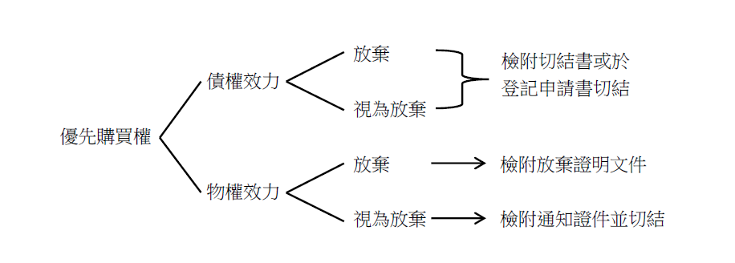

---
*注：本文圖片存放於 ./images/ 目錄下*

## 151. 未辦繼承土地標售之優先購買權資格
*發布日期: 2024-09-24* 

## 內文
案例：

甲乙丙三人分別共有一筆土地，應有部分各1/3，甲先死亡，由ABC繼承並登記為公同共有，應繼分均等。後乙死亡且未辦繼承登記被列冊管理15年，今公開標售，且由丁得標，公同共有人A於30日內主張按決標金額優先購買，試問：

1. 該公同共有人A得否主張優先購買權？

2. 該公同共有人A是否依民法第828條第3項規定應經全體公同共有人同意？

解析：

• (一) 按土地法第73條之1第3項規定，因同條第1項及第2項原因而公開標售之土地或建築改良物，繼承人、合法使用人或其他共有人就其使用範圍，依序有優先購買權。查本條項規範目的，係為使土地之使用與所有權能合一，以利經濟效益。因此，本條項所指之其他共有人，自不以分別共有人為限，包括公同共有人，以公同共有人就該土地或建築改良物之所有權與使用權，逐漸趨於合一之故。

• (二) 本條規定之優先購買權人，係立法賦予其有取得優先購買權之資格，得行使之權利係優先購買權，該權利行使既係一種資格，非行使全體公同共有人之公同共有權利，自無需由公同共有人共同為之，與公同共有人權利行使無涉。

參考來源：最高法院109年度台上字第1546號民事判決

---
*注：本文圖片存放於 ./images/ 目錄下*

## 152. 土地徵收補償市價之查估標準
*發布日期: 2024-09-19* 

## 內文
土地徵收條例第30條第1項規定：「被徵收之土地，應按照徵收當期之市價補償其地價。在都市計畫區內之公共設施保留地，應按毗鄰非公共設施保留地之平均市價補償其地價。」析言之：

• (一) 非公共設施保留地：以被徵收土地本身之市價，補償其地價。所稱市價，指由直轄市、縣（市）主管機關查估或委由不動產估價師查估，並提交地價評議委員會評定之市場正常交易價格（徵查§2①）。

• (二) 公共設施保留地：以被徵收土地之毗鄰非公共設施保留地之平均市價，補償其地價。其中，「毗鄰」之界定影響公共設施保留地土地所有權人之權益甚鉅。茲分下列二說：

1. 地理接觸說：毗鄰，僅限於被徵收土地之接連土地，亦即毗連土地。然，當接連之非公共設施保留地市價偏低時，恐影響土地所有權人之權益。現行一般徵收採地理接觸說，即公共設施保留地市價，以毗鄰非公共設施保留地之市價平均計算。所稱平均計算，指按毗鄰各非公共設施保留地之區段線比例加權平均計算（徵查§22III）。

2. 受益範圍說：毗鄰，指公共設施設置所影響之受益範圍。現行區段徵收採受益範圍說，即區段徵收範圍內之公共設施保留地市價，以同屬區段徵收範圍內之非公共設施保留地市價平均計算（徵查§22VI）。

以上二說，以受益範圍說較合理。

【附註】 徵查：土地徵收補償市價查估辧法

---
*注：本文圖片存放於 ./images/ 目錄下*

## 153. 公共設施保留地之意涵
*發布日期: 2024-09-12* 

## 內文
公共設施保留地之認定，關係租稅優惠，影響人民權益甚鉅。

• (一) 公共設施保留地之意義：公共設施保留地係指都市計畫事先指定之公共設施用地，保留供政府機關或各事業機構日後取得。所謂公共設施用地，指都市計畫法第42條第1項規定之公共設施（如道路、公園、學校、市場等），所使用之土地。公共設施用地涵括公共設施保留地，其關係如下圖所示。

[圖片1]

• (二) 公共設施保留地之認定：

1. 業經各級政府或鄉、鎮、縣轄市公所或各事業機構依法取得之公共設施用地，非屬公共設施保留地。

2. 經各級政府或鄉、鎮、縣轄市公所或各事業機構興闢使用，但尚未依法取得之公共設施用地，仍屬公共設施保留地。

3. 獎勵私人投資興闢之公共設施用地，在未核准私人或團體投資辦理前，仍屬公共設施保留地；經核准私人或團體投資辦理後，始非屬公共設施保留地。其須申領使用執照者，於取得使用執照前，仍屬公共設施保留地；於取得使用執照後，始非屬公共設施保留地。

4. 下列非屬公共設施保留地： (1)經都市計畫法第30條規定所訂辦法核准由私人或團體投資興辦之公共設施用地。 (2)依都市計畫法第61條第2項規定，已由私人或團體於舉辦新市區建設範圍內，自行負擔經費興建之公共設施用地。 (3)配合私人或團體舉辦公共設施、新市區建設、舊市區更新等實質建設事業劃設，並指明由私人或團體取得興闢之公共設施用地。（87.6.30台內營字第8772176號）

5. 都市計畫法第42條第1項第1款所稱之河道，係指依同法第3條就都市重要設施作有計畫之發展，而合理規劃所設置之河道而言。至於因地勢自然形成之河流，及因之而依水利法公告之原有「行水區」，雖在都市計畫使用區之範圍，仍不包括在內（司法院釋字第326號解釋）。

## 文章圖片

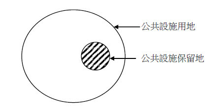

---
*注：本文圖片存放於 ./images/ 目錄下*

## 154. 「台版地面師」未辦繼承不動產偽造詐騙案
*發布日期: 2024-09-10* 

## 內文
今日專欄主要研習一新的詐騙案例

律師、警察、里長勾結「台版地面師」偽造老人遺囑騙1.4億房產：https://www.mirrormedia.mg/story/20240906soc006

其詐騙手法涉及土法、民法與土地登記等觀念，同學可配合對照複習：

首先，詐騙集團鎖定對象為「未辦繼承登記不動產」且最好是繼承人有無不明者。此可參見土地法第73條之1相關規定。

其次，利用職權(警察、公務員)或人脈關係(里長)調查其身分資料。

第三，偽造租賃契約，假裝是租戶，以欺騙鎖匠開門，進而得以進入搜尋權狀、印章等相關資料。

第四，偽造遺囑，將該未辦繼承不動產遺贈給詐騙集團。此涉及民法繼承編第三章遺囑相關規定。

第五，持偽造遺囑等文件，申辦繼承及遺贈登記。此涉及土地登記規則第119條繼承登記應備文件及第123條遺贈登記申請方式等。

---
*注：本文圖片存放於 ./images/ 目錄下*

## 155. 發給補償完竣
*發布日期: 2024-09-05* 

## 內文
• (一) 發給補償完竣之態樣：

1. 現金補償： (1)應受補償人受領：需用土地人將補償費繳交該管直轄市或縣（市）主管機關發給應受補償人完竣，是為發給補償完竣。 (2) 應受補償人受領遲延、拒絕受領或不能受領：直轄市或縣（市）主管機關應發給補償費之期限屆滿次日起三個月內存入土地徵收補償費保管專戶保管。依規定繳存專戶保管時，視同發給補償完竣（徵§26III）。

2. 抵價地補償：實施區段徵收，原土地所有權人申請發給抵價地者，於直轄市或縣（市）主管機關核定發給抵價地通知時，視同發給補償完竣。

綜上，所謂「發給補償完竣」，包括應受補償人受領現金完竣、補償費存入專戶保管完畢及核定發給抵價地通知完成等三種態樣。

• (二) 發給補償完竣之效力：

1. 發生物權變動效果：土地徵收採登記處分要件主義（民§759），於發給補償完竣即發生物權變動效果。換言之，自發給補償完竣之日起，需用土地人取得被徵收土地之所有權，原地主喪失被徵收土地之所有權。

2. 所有負擔消滅：土地徵收屬於原始取得，因此發給補償完竣，原所有權絕對消滅。存在於原所有權上之一切負擔（如他項權利、限制登記、三七五租佃、租賃權等）隨之消滅。

3. 地上物限期遷移完成：被徵收土地或土地改良物應受之補償費發給完竣或核定發給抵價地後，直轄市或縣（市）主管機關應通知土地權利人或使用人限期遷移完竣（徵§28I）。

4. 進入被徵收土地內工作：需用土地人應俟補償費發給完竣或核定發給抵價地後，始得進入被徵收土地內工作。但國防、交通及水利事業，因公共安全急需先行使用者，不在此限（徵§27）。

【附註】 ①民：民法。 ②徵：土地徵收條例。

---
*注：本文圖片存放於 ./images/ 目錄下*

## 156. 名勝古蹟土地不得私有之例外
*發布日期: 2024-09-03* 

## 內文
113年8月7日總統修正公布土地法第14條條文的第3項部分：

下列土地不得為私有：

• 一、海岸一定限度內之土地。 二、天然形成之湖澤而為公共需用者，及其沿岸一定限度內之土地。 三、可通運之水道及其沿岸一定限度內之土地。 四、城鎮區域內水道湖澤及其沿岸一定限度內之土地。 五、公共交通道路。 六、礦泉地。 七、瀑布地。 八、公共需用之水源地。 九、名勝古蹟。 十、其他法律禁止私有之土地。

前項土地已成為私有者，得依法徵收之。

符合下列情形之一者，不受第一項第九款規定之限制：

• 一、日據時期原屬私有，臺灣光復後登記為公有，依法得贈與移轉為私有之名勝古蹟。 二、公營事業機構及行政法人，有經營或使用古蹟土地需要，並經中央文化主管機關認定古蹟土地移轉為其所有可助於古蹟保存及維護。

立法理由

考量行政法人及公營事業機構有推動維護古蹟資產之政策任務，若其無法取得業務上有經營或使用需要之古蹟所座落土地，恐影響其業務推動，且可能因古蹟移轉為私有，而所座落之土地仍屬公有情形，衍生產權及古蹟管理維護複雜化等問題，不易古蹟保存及維護。爰修法規範行政法人及公營事業機構，有經營或使用第一項第九款名勝古蹟土地之需要，並經中央文化主管機關認定古蹟土地移轉為其所有可助於古蹟保存及維護者，得移轉為其所有。

---
*注：本文圖片存放於 ./images/ 目錄下*

## 157. 參加市地重劃或區段徵收之地主於開發完成後分回或領回開發範圍內土地之條件(二)
*發布日期: 2024-08-29* 

## 內文
• (二) 區段徵收：

1. 實施區段徵收時，原土地所有權人不願領取現金補償者，應於徵收公告期間內，檢具有關證明文件，以書面向該管直轄市或縣（市）主管機關申請發給抵價地。該管直轄市或縣（市）主管機關收受申請後，應即審查，並將審查結果，以書面通知申請人。土地所有權人依規定申請發給抵價地時，得就其全部或部分被徵收土地應領之補償地價提出申請（徵§40I II）。

2. 依規定領回面積不足最小建築單位面積者，應於規定期間內提出申請合併，未於規定期間內申請者，該管直轄市或縣（市）主管機關應於規定期間屆滿之日起三十日內，按原徵收地價補償費發給現金補償（徵§44II）。抵價地最小建築單位面積，由主管機關會商需用土地人依開發目的及實際作業需要劃定之。但最小建築單位面積不得小於畸零地使用規則及都市計畫所規定最小建築基地之寬度、深度及面積（徵施§54）。

3. 土地所有權人應領抵價地之權利價值未達直轄市或縣（市）主管機關通知辦理抵價地分配當次最小分配面積所需之權利價值者，應於主管機關規定期限內自行洽商其他土地所有權人申請合併分配或申請主管機關協調合併分配。未於規定期間內申請者，由主管機關按原徵收補償地價發給現金補償（區徵§29I）。

4. 土地所有權人合併後應領抵價地權利價值已達當次最小分配面積所需之權利價值，依抽籤順序選擇街廓時已無適合之最小分配面積可供分配者，或合併後應領抵價地權利價值未達當次最小分配面積所需之權利價值者，得於下次配地時依前項規定申請重新合併分配或由主管機關按原徵收補償地價發給現金補償（區徵§29II）。

5. 土地所有權人申請發給抵價地之原有土地上訂有耕地租約或設定他項權利或限制登記者，直轄市或縣（市）主管機關應通知申請人限期自行清理，並依規定期限提出證明文件。申請人未依前項規定辦理者，直轄市或縣（市）主管機關應核定不發給抵價地。直轄市或縣（市）主管機關經核定不發給抵價地者，應於核定之次日起十五日內發給現金補償（徵§41）。

綜上，參加區段徵收之地主於開發完成後領回開發範圍內土地之條件有三：

1. 地主應於徵收公告期間內以書面申請發給抵價地。

2. 地主應領抵價地之權利價值已達或合併後已達抵價地最小分配面積所需之權利價值。

3. 地主之原有土地上如訂有耕地租約、設定他項權利或限制登記，應於限期內自行清理完畢。

• (三) 兩者比較：

1. 參加市地重劃之地主所領回之土地無專有名稱，而非稱為「抵費地」。參加區段徵收之地主所領回之土地，稱為「抵價地」。

2. 參加市地重劃之地主無須主動申請分配土地，就可分回土地。參加區段徵收之地主必須主動申請發給抵價地，始可領回土地。

3. 參加市地重劃之地主應分配土地面積已達或合併後已達最小分配面積標準二分之一，就可以分配土地。參加區段徵收之地主應領回抵價地權利價值已達或合併後已達抵價地最小分配面積所需之權利價值，就可以領回抵價地。前者有二分之一，後者無二分之一。

4. 參加市地重劃地主之原有土地上訂有耕地租約、設定他項權利或限制登記，轉載於重劃後地主所分配之土地上，原地主無須清理，就可以分配土地。參加區段徵收地主原有土地訂有耕地租約、設定他項權利或限制登記，原地主應限期自行清理，並提出證明文件，否則不發給抵價地。

【附註】 ①平：平地地權條例。 ②市重：市地重劃實施辦法。 ③徵：土地徵收條例。 ④徵施：土地徵收條例施行細則。 ⑤區徵：區段徵收實施辦法。

---
*注：本文圖片存放於 ./images/ 目錄下*

## 158. 不構成定型化契約條款之情形
*發布日期: 2024-08-27* 

## 內文
定型化契約條款指企業經營者為與多數消費者訂立同類契約之用，所提出預先擬定之契約條款。定型化契約條款不限於書面，其以放映字幕、張貼、牌示、網際網路、或其他方法表示者，亦屬之。(消保§2)

下列情形屬於「不構成」定型化契約條款，亦即消費者可選擇是否願意遵守，倘若願意即得主張該條款仍構成契約之內容而受到限制：

• (一) 企業經營者應向消費者明示定型化契約條款之內容；明示其內容顯有困難者，應以顯著之方式，公告其內容，並經消費者同意者，該條款即為契約之內容(消保§13 I)。亦即未明示者，不構成契約內容。

• (二) 定型化契約條款未經記載於定型化契約中而依正常情形顯非消費者所得預見者，該條款不構成契約之內容。(消保§14)

• (三) 定型化契約條款因字體、印刷或其他情事，致難以注意其存在或辨識者，該條款不構成契約之內容。(消保施§12)

• (四) 企業經營者與消費者訂立定型化契約前，應有三十日以內之合理期間，供消費者審閱全部條款內容(消保§11-1 I)。違反規定者（亦即給予不合理、太倉促之審閱期間），其條款不構成契約之內容(消保§11-1 III)。

---
*注：本文圖片存放於 ./images/ 目錄下*

## 159. 參加市地重劃或區段徵收之地主於開發完成後分回或領回開發範圍內土地之條件(一)
*發布日期: 2024-08-22* 

## 內文
• (一) 市地重劃：

1. 重劃區內之土地扣除折價抵付共同負擔之土地後，其餘土地仍依各宗土地地價數額比例分配與原土地所有權人。但應分配土地之一部或全部因未達最小分配面積標準，不能分配土地者，得以現金補償之（平§60-1I）。重劃後土地之最小分配面積標準，由主管機關視各街廓土地使用情況及分配需要於規劃設計時定之。但不得小於畸零地使用規則及都市計畫所規定之寬度、深度及面積（市重§30）。

2. 土地所有權人重劃後應分配土地面積已達重劃區最小分配面積標準二分之一，經主管機關按最小分配面積標準分配後，如申請放棄分配土地而改領現金補償時，應以其應分配權利面積，按重劃後分配位置之評定重劃後地價予以計算補償（市重§53II）。

3. 同一土地所有權人在重劃區內所有土地應分配之面積，未達或合併後仍未達重劃區內最小分配面積標準二分之一者，除通知土地所有權人申請與其他土地所有權人合併分配者外，應以現金補償之；其已達重劃區內最小分配面積標準二分之一者，得於深度較淺、重劃後地價較低之街廓按最小分配面積標準分配或協調合併分配之（市重§31I②）。

4. 土地所有權人重劃後應分配土地面積未達重劃區最小分配面積標準二分之一而不能分配土地時，主管機關應於重劃分配結果公告確定之次日起六十日內，以其重劃前原有面積按原位置評定重劃後地價發給現金補償（市重§53I）。

綜上，參加市地重劃之地主於開發完成後分回開發範圍內土地之條件只有一個，即「重劃後地主應分配土地面積已達或合併後已達重劃區最小分配面積標準二分之一」。

【附註】

①平：平地地權條例。 ②市重：市地重劃實施辦法。 ③徵：土地徵收條例。 ④徵施：土地徵收條例施行細則。 ⑤區徵：區段徵收實施辦法。

---
*注：本文圖片存放於 ./images/ 目錄下*

## 160. 更正登記應不妨害原登記同一性之相關案例
*發布日期: 2024-08-20* 

## 內文
案例：

甲主張其曾祖父乙於日據時期與A市公所簽訂「以地易地」之承諾書，由乙將所有之K地與A市所有同地段之L地約300坪土地互易移轉；嗣L地迭經分割，乙因互易取得並入住之土地經測量即在L土地範圍內，是依上述土地互易承諾書，此部分土地應屬乙所有，惟辦理總登記時，卻登記土地所有權人為A市，爰依土地法第69條及土地登記規則第144條規定，請求地政事務所辦理更正登記或塗銷登記，將該部分土地移轉予甲等人。試問是否有理由？

[圖片1]

判決重點：

1. 按土地登記之目的，在於確立地籍，保護產權，藉以維持不動產交易安全，並為推行或制定土地政策之依據。故已登記完畢之土地權利，若登記錯誤、遺漏或虛偽，應予以更正，以杜絕弊端，並有助公示原則之確立。

2. 土地法第69條所稱「登記錯誤之更正」，以不涉及私權爭執，且不妨害原登記之同一性者為限，亦即僅限「登記原因證明文件所載之內容不符」或「應登記事項漏未登記」之情形而言，並未涉及權利主體之變動，否則根據土地登記規則第7條規定，必須經由司法審判程序，始得塗銷或變更。殊非可依規定申請地政機關更正登記，以變更原登記所示之法律關係。

3. 基此法理，內政部訂頒之更正登記法令補充規定第6點規定：「申請更正登記，如更正登記後之權利主體、種類、範圍或標的與原登記原因證明文件所載不符者，有違登記之同一性，應不予受理。」第7點規定：「更正登記以不妨害原登記之同一性為限，若登記以外之人對於登記所示之法律關係有所爭執，則應訴由司法機關審判，以資解決。」亦明揭上述意旨。

4. 是更正登記，無論依職權或依聲請，均以不妨害原登記之同一性為限。亦即更正前後之標的物、權利主體及法律關係，均須相同。若更正登記之結果，使原登記關係人之土地權利發生變動或損害，則已妨害原登記之同一性，不在更正登記之範圍內。

5. 因此，甲主張其曾祖父乙於日據時期與A市公所就L地簽訂承諾書互易移轉一節，因系爭土地現所有權人為A市，管理人為A市公所，甲請求將系爭土地所有權人更正登記為甲等人，顯已違反登記同一性之要件，於法不合。

資料來源： 臺中高等行政法院109年度訴字第195號判決 最高行政法院110年度上字第128號裁定

## 文章圖片

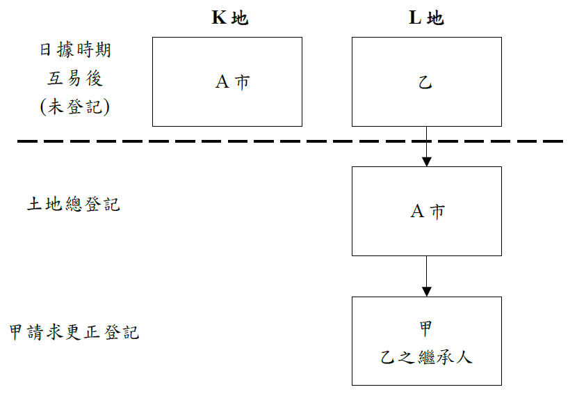

---
*注：本文圖片存放於 ./images/ 目錄下*

## 161. 遺贈及遺囑信託之登記與稅負
*發布日期: 2024-08-15* 

## 內文
遺贈登記規定於土地登記規則第123條，遺囑信託登記規定於同規則第126條，二者規定之內容大同小異。

• (一) 遺贈之登記與稅負：

1. 遺贈，指立遺囑而為贈與。遺贈於立遺囑人（即遺贈人）死亡時，發生效力。

2.

遺贈發生效力後，分下列三種情形辦理登記：

• (1) 無遺囑執行人：①登記：先由繼承人辦理繼承登記，再由繼承人會同受遺贈人辦理所有權移轉登記。②稅負：辦理繼承登記時，應課徵遺產稅（納稅義務人為繼承人及受遺贈人），免徵土地增值稅及契稅。辦理所有權移轉登記時，應課徵土地增值稅（納稅義務人為受遺贈人），不徵贈與稅及契稅。值得一提的是，繼承土地以繼承時（即被繼承人死亡日）之公告現值核定其移轉現值（即原地價更動為繼承時之公告現值），而遺贈時申報移轉現值審核標準，以遺贈人（即被繼承人）死亡日當期公告現值為準，二者相同，因此受遺贈人只要以被繼承人死亡日當期之公告現值而為申報（亦即不高報），就無土地增值稅。

• (2) 有遺囑執行人：①登記：先由遺囑執行人辦理遺囑執行人登記及繼承登記，再由遺囑執行人會同受遺贈人辦理所有權移轉登記。②稅負：辦理繼承登記時，應課徵遺產稅（納稅義務人為遺囑執行人），免徵土地增值稅及契稅。辦理所有權移轉登記時，應課徵土地增值稅（納稅義務人為受遺贈人），不徵贈與稅及契稅。

• (3) 繼承人有無不明：①登記：先由遺產管理人辦理遺產管理人登記，再由遺產管理人會同受遺贈人辦理所有權移轉登記。須特別強調的是，繼承人有無不明之情形，無須辦理繼承登記，另，繼承開始時，繼承人之有無不明者，由親屬會議選定遺產管理人；未能選定者，得聲請法院選任遺產管理人。②稅負：辦理遺產管理人登記時，應課徵遺產稅（納稅義務人為遺產管理人），免徵土地增值稅及契稅。辦理所有權移轉登記時，應課徵土地增值稅（納稅義務人為受遺贈人），不徵贈與稅及契稅。應注意者，繼承人有無不明之情形，雖未辦理繼承登記，但於辦理遺產管理人登記時，應課徵遺產稅。

• (二) 遺囑信託之登記與稅負：

1. 遺囑信託，指立遺囑而為信託。遺囑信託於立遺囑人（即委託人）死亡時，發生效力。

2.

遺囑信託發生效力後，分下列三種情形辦理登記：

• (1) 無遺囑執行人：①登記：先由繼承人辦理繼承登記，再由繼承人會同受託人辦理信託登記。②稅負：辦理繼承登記時，應課徵遺產稅（納稅義務人為繼承人），免徵土地增值稅及契稅。辦理信託登記時，不課徵土地增值稅及契稅。日後辦理信託歸屬登記時，不課徵贈與稅、土地增值稅及契稅。

• (2) 有遺囑執行人：①登記：先由遺囑執行人辦理遺囑執行人登記及繼承登記，再由遺囑執行人會同受託人辦理信託登記。②稅負：辦理繼承登記時，應課徵遺產稅（納稅義務人為遺囑執行人），免徵土地增值稅及契稅。辦理信託登記時，不課徵土地增值稅及契稅。日後辦理信託歸屬登記時，不課徵贈與稅、土地增值稅及契稅。

• (3) 繼承人有無不明：①登記：先由遺產管理人辦理遺產管理人登記，再由遺產管理人會同受託人辦理信託登記。須特別強調的是，繼承人有無不明之情形，無須辦理繼承登記。②稅負：辦理遺產管理人登記時，應課徵遺產稅（納稅義務人為遺產管理人），免徵土地增值稅及契稅。辦理信託登記時，不課徵土地增值稅及契稅。日後辦理信託歸屬登記時，不課徵贈與稅、土地增值稅及契稅。應注意者，繼承人有無不明之情形，雖未辦理繼承登記，但於辦理遺產管理人登記時，應課徵遺產稅。

---
*注：本文圖片存放於 ./images/ 目錄下*

## 162. 消費者保護法有關定型化契約條款無效之情形
*發布日期: 2024-08-13* 

## 內文
依據消費者保護法規定，有下列情形，定型化契約「條款」無效：

• (一) 定型化契約中之條款違反誠信原則，對消費者顯失公平者，無效。(消保§12)

• (二) 定型化契約中之定型化契約條款牴觸個別磋商條款之約定者，其牴觸部分無效。(消保§15)

• (三) 違反中央公告之定型化契約，其定型化契約條款無效。(消保§17 IV)

• (四) 企業經營者以定型化契約條款使消費者拋棄審閱權利者，無效。(消保§11-1)

至於定型化契約中之定型化契約條款，全部或一部無效或不構成契約內容之一部者，除去該部分，契約亦可成立者，該契約之其他部分，仍為有效。但對當事人之一方顯失公平者，該契約全部無效。(消保§16)

---
*注：本文圖片存放於 ./images/ 目錄下*

## 163. 抵費地與配餘地
*發布日期: 2024-08-08* 

## 內文
政府辦理土地重劃及區段徵收後，公開標售之土地，於土地重劃為抵費地，於區段徵收為配餘地。

• (一) 抵費地：土地重劃區內土地所有權人應行負擔之工程費用、重劃費用及貸款利息，由該區土地所有權人按其土地受益比例共同負擔，並以其未建築土地折價抵付，此種土地稱為抵費地（亦稱劃餘地）。因此，政府辦理土地重劃後所取得之抵費地，公開標售，以回收投入資金。

• (二) 配餘地：區段徵收應給予之補償地價，改以規劃整理後可供建築之土地，按土地所有權人應領補償地價比例折算抵付，此種土地稱為抵價地。因此，抵價地由原土地所有權人領回，而非屬政府所有，無從公開標售。另，政府辦理區段徵收後之土地，除規劃為抵價地及公共設施用地外，其餘可供建築土地，得予標售、標租或設定地上權（徵 §44I⑤），此種土地稱為配餘地。因此，區段徵收後公開標售之土地為配餘地，而非抵價地。

總之，政府辦理土地重劃後標售｢抵費地｣，政府辦理區段徵收後標售｢配餘地｣，以回收投入資金。

---
*注：本文圖片存放於 ./images/ 目錄下*

## 164. 共有多數決處分之申請登記方式
*發布日期: 2024-08-06* 

## 內文
甲、乙2人共有A地一筆，其應有部分依序為四分之三及四分之一。甲將A地全部設定登記地上權予丙，丙並於該地上建築B房屋（非區分所有建物），且辦竣房屋之所有權第一次登記；之後，甲將A地出賣予丁時，其申辦買賣所有權移轉登記應注意什麼？

依土地法第34條之1規定，共有土地或建築改良物，其處分、變更及設定地上權、農育權、不動產役權或典權，應以共有人過半數及其應有部分合計過半數之同意行之。但其應有部分合計逾三分之二者，其人數不予計算。共有人依前項規定為處分、變更或設定負擔時，應事先以書面通知他共有人；其不能以書面通知者，應公告之。第一項共有人，對於他共有人應得之對價或補償，負連帶清償責任。於為權利變更登記時，並應提出他共有人已為受領或為其提存之證明。其因而取得不動產物權者，應代他共有人申請登記。

爰此，甲以其應有部分超過三分之二方式出賣A地給丁，符合多數決規定，惟同時涉及乙、丙之優先購買權，故其買賣所有權移轉登記應注意下列事項：

• (一) 多數決出賣之移轉登記應注意事項

1. 登記申請書及契約書內，應列明全體共有人。即甲、乙二人。

2. 登記申請書備註欄記明依土地法第34條之1第1項至第3項規定辦理，如有不實，義務人願負法律責任。

3. 提出已為書面通知或公告之證明文件。

4. 提出他共有人應得對價或補償已受領或已提存之證明文件。並於登記申請書適當欄記明受領之對價或補償數額如有錯誤，由義務人自行負責。

5. 申請登記時，契約書及登記申請書上無須他共有人乙簽名或蓋章。

• (二) 涉及優先購買權之移轉登記應注意事項

1. 他共有人乙之優先購買權 (1)依土地法第34條之1執行要點規定，部分共有人甲依本法條第一項規定出賣共有土地或建物時，他共有人乙得以出賣之同一條件共同或單獨優先購買。 (2)部分共有人甲依土地法第34條之1第1項規定設定地上權或典權後出賣土地，他共有人乙仍有第1項優先購買權之適用。 (3)申請土地權利移轉登記時，依民法物權編施行法第8條之5第3項、第5項、土地法第34條之1第4項、農地重劃條例第5條第2款、第3款或文化資產保存法第32條規定之優先購買權人乙已放棄優先購買權者，應附具出賣人甲之切結書，或於登記申請書適當欄記明優先購買權人乙確已放棄其優先購買權，如有不實，出賣人願負法律責任字樣。 (4)然而，根據新修訂的土地法第34條之1執行要點規定，優先購買權人乙已放棄或視為放棄優先購買權者，出賣人甲應依土地登記規則第97條第1項規定附具切結書之規定辦理，切結書內容應包括通知方式、優先購買權人主張情形並由出賣人記明「如有不實願負法律責任」，不適用同條項於登記申請書適當欄記明之方式。

2. 地上權人丙之優先購買權 (1)基地出賣時，地上權人、典權人或承租人有依同樣條件優先購買之權。房屋出賣時，基地所有權人有依同樣條件優先購買之權。其順序以登記之先後定之。 (2)民法第426條之2、第919條、土地法第104條、第107條、耕地三七五減租條例第15條或農地重劃條例第5條第1款規定，優先購買權人放棄或視為放棄其優先購買權者，申請人應檢附優先購買權人放棄優先購買權之證明文件；或出賣人已通知優先購買權人之證件並切結優先購買權人接到出賣通知後逾期不表示優先購買，如有不實，願負法律責任字樣。

綜上，甲、丁所有權移轉登記之申請文件，應附上乙放棄優先購買權之切結書，以及附上丙放棄優先購買權之證明或已通知或公告的證明並切結其逾期不表示優先購買等字樣。又倘若乙、丙皆主張優先購買如有爭執，再循司法途徑解決。

---
*注：本文圖片存放於 ./images/ 目錄下*

## 165. 設籍（辦竣戶籍登記）之綜合整理
*發布日期: 2024-08-01* 

## 內文
政府給予不動產租稅優惠，常規定須設有戶籍。一般而言，設籍分為下列二種不同規定：

• (一) 須有本人、配偶或直系親屬設籍（設籍條件較寬鬆）： 諸如：

1. 地價稅之自用住宅用地優惠稅率（2‰）。

2. 房屋稅之自住房屋（1%或1.2%）。

3. 土地增值稅之一生一次優惠稅率（10%）。

4. 土地增值稅之重購退稅。

• (二) 須有本人、配偶或未成年子女設籍（設籍條件較嚴格）： 諸如：

1. 土地增值稅之一生一屋優惠稅率（10%）。

2. 房地合一所得稅之自住房地免稅（400萬元以下部分，免稅）及優惠稅率（超過400萬元之部分，稅率10%）。

3. 房地合一所得稅之重購退稅。

例如：甲擁有一棟自己居住使用之房屋，並由其已成年子女乙設籍。如單單考慮設籍因素，則持有時，得適用自用住宅用地之地價稅優惠及自住房屋之房屋稅優惠；移轉時，得適用自用住宅用地之土地增值稅一生一次優惠稅率及重購退稅；移轉時，不得適用自住房地之房地合一所得稅免稅、優惠稅率及重購退稅。

---
*注：本文圖片存放於 ./images/ 目錄下*

## 166. 欠稅應移送法務部行政執行署強制執行
*發布日期: 2024-07-30* 

## 內文
根據契稅條例第25條規定，納稅義務人不依規定期限繳納稅款者，每逾二日，加徵應納稅額百分之一之滯納金；逾期三十日仍不繳納稅款及滯納金或前條之怠報金者，移送法院強制執行。

按欠稅及罰鍰等公法上金錢給付義務之強制執行，係屬行政權之性質，原屬行政執行的範疇，因此以往移送法院執行的規定，並不符合行政法的法理，且移送法院執行的徵起率偏低，絕大部分為無財產可供執行，另因須移送法院辦理，法院執行緩慢，機關間協調配合困難，影響強制執行之效果與時效。因此，移送法院強制執行之規定，自90年1月1日施行修正行政執行法之日起，不再適用，而改移送法務部行政執行署所屬行政執行處執行之 (參行政執行法第4條)。

此外，逾期繳納之滯納金規範，亦應以稅捐稽徵法為特別法優先適用，即依稅法規定逾期繳納稅捐應加徵滯納金者，每逾三日按滯納數額加徵百分之一滯納金；逾三十日仍未繳納者，移送強制執行(參稅捐稽徵法第20條)。

---
*注：本文圖片存放於 ./images/ 目錄下*

## 167. 非都市土地使用管制架構
*發布日期: 2024-07-23* 

## 內文
依據「區域計畫法」第15條第1項規定：「區域計畫公告實施後，不屬第11條之非都市土地（即變更為都市計畫者），應由有關直轄市或縣（市）政府，按照非都市土地分區使用計畫，製定非都市土地使用分區圖，並編定各種使用地，報經上級主管機關核備後，實施管制。變更之程序亦同。其管制規則，由中央主管機關定之。」因此，內政部依據該條文授權，訂定「非都市土地使用管制規則」，作為實施非都市土地使用管制之依據。依該規則第4條，非都市土地之使用，除國家公園區內土地，由國家公園主管機關依法管制外，按其編定使用地之類別，依本規則規定管制之。

按「區域計畫法」第7條第9款、第15條及同法施行細則第5條規定，區域土地使用管制之結構，可分為三個層次：

上層：土地分區使用計畫。 中層：非都市土地使用分區圖。 下層：編定各種使用地。

上述三層次，分別具有上下位之指導關係，即製定非都市土地使用分區圖，須受土地分區使用計畫之指導；編定各種使用地，則須受非都市土地使用分區圖所定之使用區容許使用種類之限制。

非都市土地使用管制架構如下圖所示：

[圖片1]

## 文章圖片

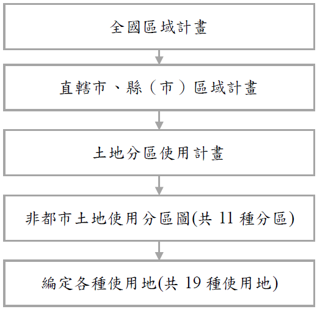

---
*注：本文圖片存放於 ./images/ 目錄下*

## 168. 房地合一所得稅之稅基疑義
*發布日期: 2024-07-18* 

## 內文
計算房地合一所得稅之稅基時，扣除改良土地費用、工程受益費、土地重劃負擔總費用及土地使用變更而無償捐贈作為公共設施用地其捐贈土地之公告現值總額等四項，是否發生重複扣除？

【解答】

房地合一所得稅之稅基為「房地交易所得」。其公式如下： 房地交易所得＝成交價額－原始取得成本－支付費用－土地漲價總數額………①

依房地合一課徵所得稅申報作業要點第14點規定：「個人除得按前二點規定減除成本外，得再減除依土地稅法施行細則第五十一條規定經主管稽徵機關核准減除之改良土地已支付之下列費用：

• (一) 改良土地費用。 (二)工程受益費。 (三)土地重劃負擔總費用。 (四)因土地使用變更而無償捐贈作為公共設施用地其捐贈土地之公告現值總額。」準此，①式中之支付費用包括改良土地費用、工程受益費、土地重劃負擔總費用及因土地使用變更而無償捐贈作為公共設施用地其捐贈土地之公告現值總額等四項。

上開四項費用於計算「土地漲價總數額」時，已扣除一次；又於計算「房地交易所得」時，再扣除一次，是否發生重複扣除。茲分析如下： 土地漲價總數額＝申報土地移轉現值－原規定地價或前次移轉時所申報之土地移轉現值×（臺灣地區消費者物價總指數÷100）－（改良土地費用＋工程受益費＋土地重劃負擔總費用＋因土地使用變更而無償捐贈作為公共設施用地其捐贈土地之公告現值總額）………②

②式代入①式，得出： 房地交易所得＝成交價格－原始取得成本－支付費用 －〔申報土地移轉現值－原規定地價或前次移轉時所申報之土地移轉現值×（臺灣地區消費者物價總指數÷100）－（改良土地費用＋工程受益費＋土地重劃負擔總費用＋因土地使用變更而無償捐贈作為公共設施用地其捐贈土地之公告現值總額）〕………③

③式框起來之虛線，負負得正，等同這四種費用尚未扣除。因此，於計算「房地交易所得」時，再扣除一次，並未重複扣除。

---
*注：本文圖片存放於 ./images/ 目錄下*

## 169. 土地建物參考資訊檔
*發布日期: 2024-07-16* 

## 內文
• 一、意義

所稱與土地或建物有關之資訊，指各級政府機關所提供非屬土地法規定應登記事項之資訊(土地參考資訊檔作業要點第2點)。係為「地政事務所將有關機關要求註記於土地登記簿之事項（例如海沙屋、受污染農地、容積移轉等），以電腦轉檔方式附屬記載於土地登記資料庫內，並且提供相關機關及社會大眾參考使用之資料而言」。

• 二、目的

為建立土地參考資訊檔，以利各級政府機關建置與土地或建物有關之資訊，提供相關機關及社會大眾參考使用，並達到土地、建物資訊單一窗口服務之功能。亦即進一步提供其他與民眾權益息息相關但與登記效力無涉之土地或建物參考資訊該項作業主要係為滿足民眾對於土地資訊知的權利，期能減少交易糾紛並促進土地利用。

• 三、查詢方式

自96年7月11日起，提供土地參考資訊查詢列印服務，獲得更多與申請標的相關之資訊。日前內政部已建置免費查詢網站可供直接輸入地、建號查詢： 土地建物參考資訊檔查詢網站 (moi.gov.tw)

---
*注：本文圖片存放於 ./images/ 目錄下*

## 170. 預售屋履約擔保機制
*發布日期: 2024-07-11* 

## 內文
預售屋自民國100年5月1日起應辦理履約擔保。依據預售屋買賣定型化契約應記載事項第7點之1規定，履約擔保依下列方式擇一處理：

• (一) 不動產開發信託：由建商或起造人將建案土地及興建資金信託予某金融機構或經政府許可之信託業者執行履約管理。興建資金應依工程進度專款專用（預§7-1①）。不動產開發信託之功能有二：

1. 信託機制：對信託財產不得強制執行（信§12I）。準此，建商或起造人將建案土地、興建資金及在建工程信託予金融機構，以防止建商發生問題時，這些財產被強制執行之風險，具有風險隔離之功能。

2. 專戶管理：興建資金由受託機構（即金融機構）控管，按工程進度撥款，專款專用，避免興建資金流用他處。如圖(一)所示。所稱興建資金包括建商自有資金、銀行融資款項及買方所繳價金。買方所繳價金，包括訂金、簽約金、開工款及各期工程款等自備款。

[圖片1]

圖(一) 不動產開發信託之專戶管理

• (二) 價金信託：將價金交付信託，由金融機構負責承作，設立專款專用帳戶，並由受託機構於信託存續期間，按信託契約約定辦理工程款交付、繳納各項稅費等資金控管事宜。前項信託之受益人為賣方（即建方或合建雙方）而非買方，受託人係受託為賣方而非買方管理信託財產。但賣方未依約定完工或交屋者，受益權歸屬於買方（預§7-1③）。價金信託之功能有二：

1. 信託機制：信託機制之目的在隔離風險。建商或起造人將買方所繳價金信託予金融機構。本項信託屬於自益信託，但當賣方未依約定完工或交屋者，則屬於他益信託。

2. 專戶管理：買方所繳價金由受託機構（即金融機構）控管，按工程進度撥款，專款專用。如圖(二)所示。

[圖片2]

圖(二) 價金信託之專戶管理

綜上，不動產開發信託與價金信託，二者相似。茲比較如下：

1. 信託財產： (1)不動產開發信託：信託財產包括建案土地、興建資金及在建工程等三項。 (2)價金信託：信託財產僅買方所繳價金一項。

2. 專戶管理之資金流入： (1)不動產開發信託：資金流入包括建商自有資金、銀行融資款項及買方所繳價金等三項。 (2)價金信託：資金流入僅買方所繳價金一項。

3. 專戶管理之資金流出： (1)不動產開發信託：資金流出限於購地款、工程款、貸款本息、管銷費用及信託事務所需一切支出等。 (2)價金信託：資金流出限於工程款及各項稅費支出等。

總之，不動產開發信託對於信託財產、專戶管理之資金流入及資金流出的管制均較價金信託為廣泛。簡單的說，不動產開發信託為全套，價金信託為半套。

• (三) 價金返還之保證：由金融機構負責承作價金返還保證。價金返還之保證費用由賣方負擔（預§7-1②）。價金返還保證對購屋者而言，最有保障。當建商出問題時，購屋者雖無法取得房屋，但最起碼可以拿回所繳交之自備款。然，辦理價金返還保證，建商須繳交保證費用予金融機構，對建商而言，成本費用最高。況，金融機構須評估預售個案情形，未必願意承保。

• (四) 同業連帶擔保：與依公司章程規定得對外保證之同業同級公司等相互連帶擔保，賣方未依約定完工或交屋者，買方可持契約向上列公司請求完成建案後交屋。上列公司不得為任何異議，亦不得要求任何費用或補償（預§7-1④）。同業連帶擔保之性質屬於續建保證或續建承諾。然，當房地產不景氣時，負責保證之建商，本身就自身難保，如何保證他人。況，所稱同業，實務上常為關係企業。關係企業之間相互擔保，等同無擔保。一般而言，關係企業間之資金往來密切，互通有無，因此其中一家建商倒閉，全部關係企業皆倒閉。採用此種方式，對建商而言，成本費用最節省，又不必受到資金控管，因此為建商所偏愛。

• (五) 公會辦理連帶保證協定：加入由全國或各縣市不動產開發商業同業公會辦理之連帶保證協定。賣方未依約定完工或交屋者，買方可持契約向加入協定之公司請求共同完成建案後交屋。加入協定之公司不得為任何異議，亦不得要求任何費用或補償（預§7-1⑤）。此種方式是一種理想，不切實際，故實務上採用者為零。

## 文章圖片

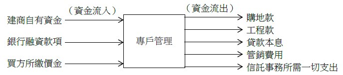

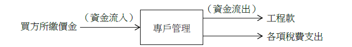

---
*注：本文圖片存放於 ./images/ 目錄下*

## 171. 預告登記之意義與要件
*發布日期: 2024-07-09* 

## 內文
預告登記係預為保全對於他人土地權利之請求權，而由請求權人檢附登記名義人之同意書及印鑑證明，向該管登記機關所為之限制登記名義人處分其土地權利之登記。亦即保全權利之得喪變更請求權之暫時性登記。

• (1) 須以他人已登記之不動產為對象(標的物辦竣登記)

• (2) 須為保全對不動產物權變動之債權請求權 預告登記係聲請保全下列請求權(土§79-1I)： A.關於土地權利移轉或使其消滅之請求權。 B.土地權利內容或次序變更之請求權。 C.附條件或期限之請求權。

• (3) 須經登記名義人之同意 聲請保全下列請求權之預告登記，應由請求權人檢附登記名義人之同意書為之(土§79-1I、土登§137I)。

• (4) 須申請並登記完畢

---
*注：本文圖片存放於 ./images/ 目錄下*

## 172. 登記駁回之情形
*發布日期: 2024-07-04* 

## 內文
土地登記規則第57條第1項第3款規定，登記之權利人、義務人或其與申請登記之法律關係有關之權利關係人間有爭執，登記機關應以書面敍明理由及法令依據，駁回登記之申請。所稱「登記之權利人、義務人或其與申請登記之法律關係有關之權利關係人間有爭執」之意涵如下：

• (一) 爭執之情形有三：

1. 登記權利人與登記義務人之間有爭執。如甲將一筆土地出售於乙，甲與乙之間對買賣有爭執。

2. 登記權利人與申請登記之法律關係有關之權利關係人之間有爭執。如甲以其土地設定典權於丙，嗣甲將其土地出售於乙，乙與丙之間對優先購買權有爭執。

3. 登記義務人與申請登記之法律關係有關之權利關係人之間有爭執。如甲以其土地設定典權於丙，嗣甲將其土地出售於乙，甲與丙之間對優先購買權有爭執。

• (二) 對於該法律關係有爭執，即已符合駁回之要件，不以對其爭執已提起訴訟為必要。

• (三) 就申請登記之法律關係有爭執，登記機關始得駁回登記之申請。如非屬申請登記之法律關係有爭執，登記機關不得駁回登記之申請。換言之，僅限於申請登記之法律關係有爭執，而非泛指申請登記不動產之所有法律關係有爭執。如時效取得地上權登記審查要點第15點規定，即是一例。

---
*注：本文圖片存放於 ./images/ 目錄下*

## 173. 不課徵地價稅之土地
*發布日期: 2024-07-02* 

## 內文
按土地稅法第14條，已規定地價之土地，除依規定課徵田賦者外，應課徵地價稅。亦即不課徵地價稅者，包含「未規定地價土地」及「課徵田賦之土地」。其中，後者依土地稅法第22條規定，有以下之土地：

• (一) 非都市土地依法編定之農業用地或未規定地價者。

• (二) 都市土地合於下列規定者：

1. 依都市計畫編為農業區及保護區，限作農業用地使用者。

2. 公共設施尚未完竣前，仍作農業用地使用者。

3. 依法限制建築，仍作農業用地使用者。

4. 依法不能建築，仍作農業用地使用者。

5. 依都市計畫編為公共設施保留地，仍作農業用地使用者。

前項第二款及第三款，以自耕農地及依耕地三七五減租條例出租之耕地為限。

• (三) 其他土地：

農民團體與合作農場所有直接供農業使用之倉庫、冷凍(藏)庫、農機中心、蠶種製造(繁殖)場、集貨場、檢驗場、水稻育苗用地、儲水池、農用溫室、農產品批發市場等用地。

---
*注：本文圖片存放於 ./images/ 目錄下*

## 174. 共有耕地分割
*發布日期: 2024-06-27* 

## 內文
農業發展條例第16條第1項本文規定：「每宗耕地分割後每人所有面積未達○．二五公頃者，不得分割。」設若「共有耕地分割後，部分為單獨所有，部分維持共有，但各筆面積均達0.25公頃。」是否為法所許？有二種不同見解：

• (一) 行政機關見解：依據耕地分割執行要點第5點規定：「耕地之分割，除有本條例第十六條第一項各款情形外，其分割後每人所有每宗耕地面積應在○．二五公頃以上。」

所謂「每人所有面積」意指耕地分割為單獨所有者，其分割後每筆之耕地面積應達0.25公頃以上，始得同意辦理分割，故不得有數筆面積合併計算達0.25公頃或數人共有單筆面積達0.25公頃之情事（94.4.20農企字第0940119312號函）。

• (二) 司法實務見解：

1. 農委會94年4月20日函釋所稱「不得有數人共有單筆面積達0.25公頃之情事」乙節，逾越農業發展條例第16條第1項本文之文義範圍，增加農業發展條例第16條所無之限制，與法律保留原則有違。

2. 分割後每宗耕地面積均已達0.25公頃，並未形成多宗面積未達0.25公頃土地之耕地細分情形，符合農業發展條例第16條第1項本文規定分割後最小面積之限制，未違背該條防止耕地細分，便利農場經營管理，簡化耕地權屬複雜之立法目的。 （最高行政法院109年度上字第717號判決）

• (三) 綜上，由於行政機關與司法實務之見解歧異，造成共有耕地雖經法院判決准於分割，但登記機關否准辦理測量登記之情形。

---
*注：本文圖片存放於 ./images/ 目錄下*

## 175. 優先購買權的「發生」與「行使」時點
*發布日期: 2024-06-25* 

## 內文
1. 以土地法及耕地三七五減租條例而言，法定優先承買權，應於耕地租賃契約成立時，隨即「發生」，而於出租人出賣或出典時得為「行使」。權利發生與行使，係屬不同層次概念，似有嚴格區別之必要（王澤鑑，1998）。

2. 將其概念套用至共有不動產而言，當共有人成立共有關係時，即具有土地法第34條之1第4項所規定的優先購買權，此為「優先購買權之發生」；惟必須等到共有人出賣其應有部分時，此時方得為「優先購買權之行使」。

3. 因此，連結到優先購買權得否在共有人正式訂約前就「預先」告知拋棄，以此概念是可以的。因為於共有時早就擁有優先購買權，只是尚不能行使而已，故得提前將已擁有的權利放棄掉。又從權益保障或目的來看，優先購買權會影響交易時程，且主要是為了保障他共有人，假設他共有人提前告知放棄優先購買權（不管什麼契約條件他都不會買），並無損於其權益，也會使交易更為順利，那解釋上就應該可以預先拋棄的。

參考來源：王澤鑑，1998，耕地承租人事先拋棄優先承受權之效力，民法學說與判例研究第1冊。

---
*注：本文圖片存放於 ./images/ 目錄下*

## 176. 仕紳化現象
*發布日期: 2024-06-20* 

## 內文
• 一、仕紳化之意義

所謂仕紳化（Gentrification），指舊市區從原本聚集低收入者，到更新重建後，房租及房價上漲，而吸引高收入者的遷入。

• 二、仕紳化之原因

1. 租隙效應：租隙（rent gap），指一塊土地之潛在地租與實際地租之差額。所稱潛在地租，指最有效使用狀況下之地租。所稱實際地租，指實際使用狀況下之地租。一塊土地之租隙，隨著時間增加而逐漸擴大。當租隙夠大時，該土地就值得更新重建。

2. 少子女化效應：家庭人口愈來愈少，居住坪數愈來愈小，因此經濟基礎稍佳者之居住地點由郊區遷往市中心，以接近工作地點，減少交通通勤時間，增加休閒娛樂時間。另，不婚人口增加，亦會產生此一現象。

3. 舊市區建設效應：政府加強舊市區公共建設，增加舊市區公共設施，翻轉舊市區發展（如台北市西門町即是），造成舊市區地價及房價上漲。

• 三、仕紳化對土地利用之影響

1. 更新重建發生：舊市區房價、地價不斷上漲，租隙不斷擴大，老舊房屋之更新重建積極進行。

2. 土地集約度提高：舊市區房屋原以透天、公寓為主，經過更新重建後，高樓大廈林立。土地集約度由小轉大、由弱轉強。

3. 土地用途轉變：舊市區原本經濟活動凋零，經過仕紳化之後，精品店、大賣場、百貨公司等逐漸回流，土地用途發生變化。

---
*注：本文圖片存放於 ./images/ 目錄下*

## 177. 受託人死亡後之信託關係處理
*發布日期: 2024-06-18* 

## 內文
小張將其名下A不動產辦理信託登記給阿寧，惟經過五年後，阿寧因病去世，阿寧之女小寧以A不動產屬遺產，以及繼承其母之受託人地位而拒絕將不動產移轉給小張，試問有無理由？

• 一、適用法條

信託法第8條（信託關係之存續）、第10條（信託財產非屬遺產）、第45條（受託人任務終了）、第47條（受託人變更之受託財產移轉）、第48條（受託人變更之債務負擔）。

• 二、解題關鍵

• (一) 受託人死亡時，信託財產不屬於其遺產。

• (二) 受託人之任務，因受託人死亡、受破產、監護或輔助宣告而終了。由於信託是基於委託人對於受託人之信任，故受託人死亡後，其職責也將終止，而非由繼承人承繼，因委託人對其未必具有信賴。

• (三) 受託人變更時，信託財產視為於原受託人任務終了時，移轉於新受託人。又受託人變更時，由新受託人承受原受託人因信託行為對受益人所負擔之債務。因此，受託人地位應不得繼承，且該信託財產及後續權利義務應由另行選定之新受託人承受。

• 三、結論

受託人阿寧死亡後，其地位、權利義務及信託財產都非得由其繼承人小寧繼承之標的，故小寧主張並無理由。

參考來源： 曾榮耀編著，信託法概要，附錄四精選案例第20題。

---
*注：本文圖片存放於 ./images/ 目錄下*

## 178. 公地標售之兩難
*發布日期: 2024-06-13* 

## 內文
公地標售，一般以市價作為其底價，再由投標者加價競標，因此標脫價一定高於周遭市價，因而帶動周遭之地價及房價上漲。

公地標售（如市地重劃之抵費地標售、區段徵收之配餘地標售等），如果高價標出，雖增加國庫收入，但卻帶動地價及房價上漲。如果底價訂得太低而低價標出，恐被批評為賤售公產。因此，公地標售陷入兩難。

總之，大塊完整之公有土地儘量不要標售，應採取招標設定地上權或供興建社會住宅之用。

---
*注：本文圖片存放於 ./images/ 目錄下*

## 179. 居住正義之意涵
*發布日期: 2024-06-11* 

## 內文
• 一、意義

「居住」為基本人權，任何人皆應享有公平之居住權利，不得有歧視待遇，「正義」可謂是合於人心義理之行為，而不應出現恃強凌弱之現象。因此，居住正義指基於憲法保障國民基本人權的精神，結合政府與民間資源，在健全的住宅市場、合宜的居住品質、公平效率的住宅補貼與社會住宅的規劃下，使不同所得水準、身心機能、性別、年齡、家戶組成、族群文化之國民，擁有適居且有尊嚴的居住環境。

• 二、內涵

• (一) 分配正義

不同所得、年齡、族群者，都應獲得平等對待，皆能擁有適居且有尊嚴的居住環境，故不應出現「富人住豪宅，窮人住陋室，甚或無家可歸」之現象，而應是「居者適其居」。

• (二) 應報正義

對於投機炒作等惡行者，給予相對應之限制、稅負或處罰，以健全住宅市場，增加住宅選擇機會。

---
*注：本文圖片存放於 ./images/ 目錄下*

## 180. 綠能智慧建築
*發布日期: 2024-06-06* 

## 內文
根據聯合國環境規劃署2022年報告，營造建築業之碳排約占全球37%，耗能約占全球34%。因此，「節能減碳」是營造建築業之迫切課題。

• 一、綠能智慧建築之特色

建物生命週期，從建材生產、建物設計、營造施工、使用管理、至拆除重建之一系列過程，每一階段皆應導入節能減碳措施。其特色如下：

• (一) 低碳材料：興建建物所採用之建材符合綠色設計、使用壽命長、維修容易、可以回收再利用等特色。從建物源頭開始實施減碳，效果最佳。

• (二) 節能儲能：建物規劃設計，符合節能減耗（如綠屋頂、綠建築、節能設施等），裝設回收及儲能設備（如太陽能板、雨水回收系統等），以發揮最高能源效率。

• (三) 智慧管理：建物運用數位化智慧管理（如大樓之空調、電梯、照明等），自動監測、自動調控、自動整合，以達到耗能最低要求。

• (四) 循環經濟：將建物拆除之廢棄物轉換成資源，回收再利用，以達成零廢棄物之目標。

• 二、綠能智慧建築之推展

推展綠能智慧建築，政府居主導地位。政府得採取下列措施：

• (一) 強制揭示：政府應對每一棟建物，認證其「碳足跡」。所謂碳足跡，指產品由原料取得、製造、配送銷售、使用及廢棄處理等生命週期各階段產生之碳排放量，經換算為二氧化碳當量之總和（氣候變遷因應法第3條第18款）。

• (二) 教育宣導：政府應教育並鼓勵消費者選購碳足跡較低之建築物。

• (三) 容積獎勵：對擬興建碳足跡較低之建物，給予容積奬勵。

• (四) 差別稅負：對碳足跡較低之建物，課以較輕房屋稅。對碳足跡較高之建物，課以較重房屋稅。

• (五) 綠色金融：對碳足跡較低之建物，給予較低貸款利率、較高貸款成數。對碳足跡較高之建物，給予較高貸款利率、較低貸款成數。

---
*注：本文圖片存放於 ./images/ 目錄下*

## 181. 受託人得否同意處分共有不動產給自己
*發布日期: 2024-06-04* 

## 內文
甲乙丙三人分別共有一筆A不動產，應有部分均等，其中甲應有部分辦理信託登記給丁，並約定受益人即為委託人甲，試問受託人丁今得否將1/3出售給自己？

擬答

• (一) 丁得自由將1/3出售給自己而不需乙、丙

根據民法第819條規定，各共有人，得自由處分其應有部分。故丁得自由將1/3出售給自己而不需其他共有人乙、丙之同意。

• (二) 丁將1/3出售給自己需經甲同意

1.

根據信託法第35條第1項規定，受託人除有下列各款情形之一外，不得將信託財產轉為自有財產，或於該信託財產上設定或取得權利：

• (1) 經受益人書面同意，並依市價取得者。 (2)由集中市場競價取得者。 (3)有不得已事由經法院許可者。

2. 倘若受託人丁係基於受益人之利益，確實經受益人甲書面同意，並依市價取得，或確有不得已事由經法院許可，則得將1/3出售給自己。

3. 如受託人丁違反規定處分信託財產，委託人、受益人甲，可請求損害賠償、回復原狀或減免報酬，並得請求將其所得之利益歸於信託財產；於受託人丁有惡意者，應附加利息一併歸入。該請求權，自委託人、受益人甲知悉之日起，二年間不行使而消滅。自事實發生時起逾五年者，亦同。

---
*注：本文圖片存放於 ./images/ 目錄下*

## 182. 登記漏誤之救濟方法
*發布日期: 2024-05-30* 

## 內文
土地登記規則第7條規定：「依本規則登記之土地權利，……非經法院判 決塗銷確定，登記機關不得為塗銷登記。」又，土地法第69條規定，辦理更正登記之程序。另於土地登記規則第144條規定，登記機關辦理塗銷登記之前提要件。請比較此三者規定適用情境與關係，及其重要之異同。

【112地方政府】

【解答】

• (一) 適用情境：

1.

土地法第69條更正登記之適用情境：

• (1) 登記錯誤：指登記事項與登記原因證明文件所載之內容不符者 (2)登記遺漏：指應登記事項而漏未登記者。

此外，本項更正登記不得違反原登記之同一性（即不得變更原登記之法律關係）。

2.

土地登記規則第144條塗銷登記之適用情境：

• (1) 偽造證明文件：登記證明文件經該主管機關認定係屬偽造。 (2)錯誤登記：純屬登記機關之疏失而錯誤之登記。

此外，本項塗銷登記應於第三人取得該土地權利之新登記前，始得為之。

3. 土地登記規則第7條法院判決塗銷登記之適用情境：依土地登記規則登記之土地權利，除土地登記規則另有規定外，非經法院判決塗銷確定，登記機關不得為塗銷登記。換言之，除土地登記規則另有規定由登記機關逕行塗銷登記（如土地登記規則第144條即是）外，餘皆應由法院判決塗銷，始得辦理塗銷登記。

• (二) 三者關係：

1.

土地法第69條更正登記與土地登記規則第144條塗銷登記，兩者之原因均有「登記錯誤」一項，其不同如下：

• (1) 如經查明原准予登記之處分純係登記機關疏失而為之違法行政處分，應以「塗銷登記」處理。 (2)如准予登記之行政處分並未違誤，僅登記機關辦理登記時未依登記原因證明文件所載之內容登記而造成登記事項與登記原因證明文件所載之內容不符，則應以「更正登記」處理。

2. 土地登記之漏誤應先適用土地法第69條更正登記及土地登記規則第144條塗銷登記。在不能經由前揭辦理更正登記或塗銷登記，則訴請法院判決塗銷。

• (三) 三者之異同：

1. 相同點：三者皆在解決土地登記之漏誤。

2.

相異點：

• (1) 程序不同：土地法第69條更正登記及土地登記規則第144條塗銷登記由地政機關辦理，無須訴請法院判決。土地登記規則第7條塗銷登記，須由法院判決塗銷。 (2)原因不同：土地法第69條更正登記之原因為登記錯誤及登記遺漏。土地登記規則第144條塗銷登記之原因為偽造證明文件及錯誤登記。土地登記規則第7條法院判決塗銷，未限定原因。

3. 條件不同：土地法第69條更正登記之條件係不得違反原登記之同一性。土地登記規則第144條塗銷登記之條件應於第三人取得該土地權利之新登記。土地登記規則第7條法院判決塗銷，無上開二項條件。

---
*注：本文圖片存放於 ./images/ 目錄下*

## 183. 先行區段徵收
*發布日期: 2024-05-28* 

## 內文
• 一、區段徵收之意義

區段徵收係於一定區域內之土地，應重新分宗整理，而為全區土地之徵收。其得辦理之情形如下：

• (一) 新設都市地區之全部或一部，實施開發建設者。

• (二) 舊都市地區為公共安全、衛生、交通之需要或促進土地之合理使用實施更新者。

• (三) 都市土地之農業區、保護區變更為建築用地或工業區變更為住宅區、商業區者。

• (四) 非都市土地實施開發建設者。

• (五) 農村社區為加強公共設施、改善公共衛生之需要或配合農業發展之規劃實施更新者。

• (六) 其他依法得為區段徵收者。

• 二、先行區段徵收之意義

都市計畫範圍內，各級政府徵收私有土地或撥用公有土地，不得妨礙當地都市計畫。而區段徵收為一定地區之土地整體開發，即須依據都市計畫空間指導進行空間配置，故原則應先有細部計畫，始有區段徵收。然「先行區段徵收」制度為例外，係都市計畫尚未發布實施時，可以先進行區段徵收的機制。

• 三、先行區段徵收之程序

• (一) 走都市計畫程序

1. 就前區段徵收之原因當中，屬第一款至第三款(新、舊、都)之開發範圍經中央主管機關核定者，得先行區段徵收，並於區段徵收公告期滿後一年內發布實施都市計畫，不受都市計畫法規定之限制。

2. 其中，先行區段徵收地區，應配合辦理迅行變更都市計畫者，需用土地人應於報請中央主管機關核定開發範圍前，先徵得中央都市計畫主管機關同意依都市計畫法第27條規定辦理；應辦理新訂或擴大都市計畫者，則依規定層報核可（即先經區域計畫委員會審議，取得內政部同意函）。

• (二) 走非都市變更程序

第五款(農村)之開發，需用土地人得會同有關機關研擬開發範圍，並檢具經上級目的事業主管機關核准之興辦事業計畫書，報經中央主管機關核定後，先行區段徵收，於區段徵收公告期滿後，依土地使用計畫完成非都市土地分區或用地編定之變更。

• (三) 第四款(非都)或第六款(其他)之開發，涉及都市計畫之新訂、擴大或變更者，得依(一)規定辦理；未涉及者，得依(二)之規定辦理。

---
*注：本文圖片存放於 ./images/ 目錄下*

## 184. 土地登記損害賠償請求救濟之程序
*發布日期: 2024-05-23* 

## 內文
土地法第43條規定，土地登記具有「絕對效力」。請說明其保護對象為何？當發生登記錯誤、遺漏或虛偽，真正權利人應如何維護其權益？如產生損害賠償，則請依國家賠償法相關規定，說明請求救濟之程序。

【112身心障礙】

【解答】

• (一) 登記絶對效力之保護對象：土地法第43條：「依本法所為之登記，有絕對效力。」意謂善意第三人因信賴登記所取得之權利，具有不可推翻之效力。準此，登記絶對效力之保護對象為善意第三人。

• (二) 真正權利人維護權益之方法：

1. 更正登記：真正權利人於登記完畢後，發現登記錯誤或遺漏時，得向地政機關申請更正登記。惟更正登記不得違反原登記之同一性（即不得變更原登記之法律關係）。

2.

塗銷登記：

• (1) 在未有第三人取得權利之新登記前，真正權利人得訴請法院塗銷登記名義人。

• (2) 登記之土地權利，有下列情形之一者，於第三人取得該土地權利之新登記前，登記機關得於報經直轄市或縣（市）地政機關查明核准後塗銷之： ①登記證明文件經該主管機關認定係屬偽造。 ②純屬登記機關之疏失而錯誤之登記。

3. 損害賠償：因登記錯誤遺漏或虛偽致受損害者，由該地政機關負損害賠償責任。但該地政機關證明其原因應歸責於受害人時，不在此限。

• (三) 請求救濟之程序：

1. 請求：依國家賠償法請求損害賠償時，應先以書面向賠償義務機關請求之。

2. 協議：賠償義務機關對於前項請求，應即與請求權人協議。協議成立時，應作成協議書，該項協議書得為執行名義。應注意者，協議為提起訴訟之先行必要程序。

3. 訴訟：賠償義務機關拒絕賠償，或自提出請求之日起逾三十日不開始協議，或自開始協議之日起逾六十日協議不成立時，請求權人得提起損害賠償之訴。但已依行政訴訟法規定，附帶請求損害賠償者，就同一原因事實，不得更行起訴。

---
*注：本文圖片存放於 ./images/ 目錄下*

## 185. 私權爭執之意義
*發布日期: 2024-05-21* 

## 內文
應係指登記權利人與登記義務人或關係人間，就「申請登記之法律關係」之爭執，在未經有權認定機關確認前，登記權利人所申請登記事項之權利是否確屬存在，尚不明確者而言。因此，所謂「涉及私權爭執」範圍甚廣，舉凡與登記事項有關而涉及私法上權利存否之爭議者，均包括在內。亦即對於該法律關係之存否有所爭議之情形而言。

其要件歸納如下：

1. 須申請登記案件已為登記機關受理並收件。

2. 須主張異議之時點為登記機關行使審查權限至准予登記前。

3. 須主張異議之人為登記權利人、登記義務人或權利關係。

4. 須異議之人係就申請登記之法律關係為爭執。即「直接法律上關聯性說」：並非泛指以登記不動產為標的之所有法律關係之爭執而言，而應以申請登記之法律關係有「直接關聯」之爭執為限。例如甲與乙僅金錢債權爭執，應與甲辦理不動產所有權移轉登記給丙無涉。

5. 須自始未被現行法規排除於登記案件涉及私權爭執規範之適用範圍。

參考資料來源：

陳立夫，2020，土地登記涉及私權爭執事項及土地法第34條之1規定，中華不動產仲裁協會第五期仲裁人講習。

陳明燦，2020，土地登記異議處理方式法律問題之分析-兼論土地登記規則第57條第1項第3款規定。

---
*注：本文圖片存放於 ./images/ 目錄下*

## 186. 法定空地
*發布日期: 2024-05-16* 

## 內文
何謂法定空地？土地所有權人拋棄法定空地之效果如何？對無償供公眾通行之法定空地，不予免徵地價稅，是否合理？請依憲法法庭112年憲判字第19號判決說明其理由。

【解答】

• (一) 法定空地之意義：

建築基地除供建築物本身所占之地面外，應留設一定土地面積，不得興建建築物。此不得興建建築物之土地，稱為法定空地。建築基地留設法定空地之目的在使建築物有充足之日照、通風、採光及視野，並可防止火災蔓延。例如，建築基地1,000平方公尺，若建蔽率40%，則法定空地600平方公尺；若建蔽率20%，則法定空地800平方公尺。

• (二) 拋棄法定空地之效果：

建築法第11條第1項前段規定：「本法所稱建築基地，為供建築物本身所占之地面及其所應留設之法定空地。」同條第3項前段復規定：「應留設之法定空地，非依規定不得分割、移轉，並不得重複使用。」準此，法定空地係屬建築基地之一部分，所有權人將其單獨拋棄，乃屬違反建築法應保留空地以維護公同利益之規定及意旨，亦即民法第148條第1項（即權利之行使，不得違反公共利益）所禁止之行為，牴觸權利濫用禁止原則，且有迂迴為脫法行為之嫌，顯與上開法條項之立法精神有悖。據此，土地所有權人拋棄法定空地者，無效。

• (三) 法定空地不予免徵地價稅之理由：

土地稅減免規則第9條規定：「無償供公眾通行之道路土地，經查明屬實者，在使用期間內，地價稅或田賦全免。但其屬建造房屋應保留之法定空地部分，不予免徵。」其但書規定未違反憲法第7條平等原則，其理由如下：

1. 憲法第7條保障人民之平等權，法規範是否符合平等原則之要求，其判斷應取決於該法規範所以為差別待遇之目的是否合憲，其所採取之分類與規範目的之達成間，是否存有一定程度之關聯性而定。租稅法律關係中，立法者為了實現憲法所賦予之任務，而就各種稅捐之稽徵及減輕或免除分別訂定不同之規範，其分類及差別待遇，涉及國家財稅政策之整體規劃，適合由代表民意之立法機關及擁有專業能力之相關行政機關，以法律或法律明確授權之法規命令定之，其規定如有正當目的，且分類與目的之達成間具有合理關聯，即符合憲法第7條平等權保障之意旨。

2. 法定空地屬建築基地之一部分，提供該建築物日照、採光、通風、景觀、防火、安全等特定之功能，與人民私有並非建築基地之一部分而單純無償供公眾使用之道路土地，性質與功能均有所不同。

3. 按法定空地屬建築基地之一部分，依法應併同主建築物一併移轉，建築物所有人就法定空地之留設，除享有較優良之居住品質及環境空間外，未來如有改建或實施都市更新，該法定空地之所有權人尚得參與分配更新後之房地，其權益不因其是否專供或兼供公眾通行使用而受影響。是對土地所有人而言，建築基地所保留之法定空地雖可供公眾通行，但仍維持並享有該法定空地屬於建築基地之利益，與單純無償供公眾使用而完全無法使用收益之道路土地，在建築法上之性質與功能不同。

4. 法定空地供公眾通行，縱為無償，因其已計入依建築法應留設之法定空地，即無須再就建築基地中之其他土地予以留設，對提供者仍具有建築上之利益；而提供私有非法定空地無償供公眾通行，該土地所有人並未獲取任何利益，二者本質尚有所不同。

5. 綜上，系爭規定因此區隔，於地價稅核課上有所區別，對提供法定空地無償供公眾通行者，仍然課徵地價稅，其分類與公平課稅目的之達成間，具有合理關聯，尚無違反憲法第7條規定之平等原則，其規定亦未逾土地稅法第6條及平均地權條例第25條之授權範圍。

---
*注：本文圖片存放於 ./images/ 目錄下*

## 187. 無償供公眾通行道路土地之減免申報義務
*發布日期: 2024-05-14* 

## 內文
根據土地稅法第9條規定：「無償供公眾通行之道路土地，經查明屬實者，在使用期間內，地價稅或田賦全免。但其屬建造房屋應保留之法定空地部分，不予免徵。」

至於其減免程序，根據土地稅減免規則第22條：依規定申請減免地價稅或田賦者，公有土地應由管理機關，私有土地應由所有權人或典權人，造具清冊檢同有關證明文件，向直轄市、縣（市）主管稽徵機關為之。但合於下列規定者，應由稽徵機關依通報資料逕行辦理或由用地機關函請稽徵機關辦理，免由土地所有權人或典權人申請，其中第五款為：「私有無償提供公共巷道用地」，應由工務、建設主管機關或各鄉（鎮、市、區）公所建設單位，列冊送稽徵機關辦理。

然而，根據臺北高等行政法院100年度訴字第1951號判決要旨：「按土地稅減免規則第22條第5款有關私有無償提供公共巷道，免由土地所有權人申請規定之適用，係以稽徵機關經地方建設主管機關通報者為前提；倘係私設巷道或一般既成道路，因無資料可稽，則非由土地所有權人申請，尚乏憑據得以減免。故減徵或免徵地價稅之事由發生，自從土地所有權人提出免徵土地地價稅申請，依土地稅減免規則第24條之規定，應自該申請年度起始有免徵地價稅之適用，並無溯及之效力。」

另臺中高等行政法院100年度訴更一字第42號判決要旨：「未完成都市計畫法定程序區域之私有土地，須土地所有權人已表示願意無償提供使用，稽徵機關始應依工務、建設主管機關或各鄉（鎮、市、區）公所建設單位之列冊通報資料逕行辦理免徵地價稅：如未經土地所有權人表示願意無償提供使用，縱有無償供公共通行之巷道或廣場使用，並不當然生免徵地價稅之優惠效果，稽徵機關仍應經納稅義務人即所有權人或典權人，造具清冊檢同有關證明文件申請。」

另外，按112年憲法法庭第12號判決：建築基地內之私設通路固屬建造房屋應保留之法定空地，惟該等私設通路如已超過依法應保留之法定空地面積，且已無償供公眾通行使用，此等私設通路之功能，與非供不特定公眾使用之法定空地究有不同。有關機關對於此等情形之私設通路之地價稅核課，允宜考量予以一定程度之減免，以兼顧人民權益與租稅公平。

綜上，私有無償供公眾通行之道路土地，倘若為都市計畫劃設或已屬明確經主管機關管理之公共巷道，則應由地方建設主管機關通報稅捐機關予以減免。至於非屬前列者，如私設道路、既成道路等，因無資料可稽，故無從列冊送稽徵機關，仍應由土地所有權人申請核定再憑減免。

---
*注：本文圖片存放於 ./images/ 目錄下*

## 188. 都市計畫行為之法律性質
*發布日期: 2024-05-09* 

## 內文
都市計畫行為之法律性質是否為行政處分？試依行政處分之定義與司法院解釋之意旨申述說明之。

【112身心障礙】

【解答】

• (一) 行政處分之意義：政府就具體事件所為之決定或措施，而對外直接發生公法上法律效果之單方行政行為。

• (二) 都市計畫行為之法律性質：

1. 都市計畫新訂：屬於法規性質，非屬行政處分。

2. 都市計畫通盤檢訂：屬於法規性質，非屬行政處分。司法院釋字第742號解釋指出，都市計畫擬定計畫機關依規定所為定期通盤檢討，對原都市計畫作必要之變更，屬法規性質，並非行政處分。惟如其中具體項目有直接限制一定區域內特定人或可得確定多數人之權益或增加其負擔者，基於有權利即有救濟之憲法原則，應許其就該部分提起訴願或行政訴訟以資救濟。

3. 都市計畫個案變更：屬於行政處分，非屬法規性質。司法院釋字第156號解釋指出，主管機關變更都市計畫，係公法上之單方行政行為，如直接限制一定區域內人民之權利、利益或增加其負擔，即具有行政處分之性質，其因而致特定人或可得確定之多數人之權益遭受不當或違法之損害者，自應許其提起訴願或行政訴訟以資救濟。

---
*注：本文圖片存放於 ./images/ 目錄下*

## 189. 約定由受贈人負擔贈與稅不得作為扣除額
*發布日期: 2024-05-07* 

## 內文
文昌大師贈與一筆臺北市不動產給耀哥，並約定該次贈與應繳納之贈與稅10萬元由耀哥負擔，試問文昌大師辦理贈與稅申報時，得否將10萬元列為贈與扣除額？

贈與稅的稅基為贈與淨額，其等於贈與總額－扣除額－免稅額。而扣除額包含「贈與附有負擔」、「公共設施保留地」、「土地增值稅與契稅」，其中，針對贈與附有負擔者，係依據遺產及贈與稅法第21條規定：「贈與附有負擔者，由受贈人負擔部分應自贈與額中扣除。」

然而，約定由受贈人負擔該次贈與稅，並無此條規定以贈與附有負擔自贈與額中扣除之適用。其理由如下：

1. 依遺產及贈與稅法第7條規定，贈與稅之納稅義務人為贈與人，其公法上負擔並不因當事人約定而變更，縱以贈與契約約定由受贈人負擔繳納贈與稅，亦僅屬私人間債權債務契約，僅生私法上效果，並無拘束稽徵機關之效力，如受贈人將來未履行繳納義務，稽徵機關也僅能對贈與人強制執行，所以，贈與契約訂定時，贈與人實難確保受贈人履行該繳納贈與稅之負擔，因此，與同法施行細則第18條第1項規定，贈與附有負擔而得主張扣除者，以該負擔業經履行或能確保其履行者為限之之要件不合，自不得扣除。

2. 從遺產及贈與稅法體系來看，該法第21條所稱負擔，應不包含由受贈人負擔繳納贈與稅之情形。

3. 同法施行細則第19條明文規定，得減除之稅賦限契稅或土地增值稅，並無准予扣除贈與稅之規定，故非現行法律所規範得扣除之項目。

因此，文昌大師不得將該約定由耀哥負擔之10萬元贈與稅額，列為該次贈與之扣除額。

參考來源：財政部中區國稅局，2016

---
*注：本文圖片存放於 ./images/ 目錄下*

## 190. 房屋稅自住優惠稅率之條件
*發布日期: 2024-05-02* 

## 內文
供自住者，房屋稅率為1.2%。全國僅持有一戶房屋供自住者，房屋稅率為1%。

• (一) 自住稅率1.2%之條件：

1. 戶籍條件：本人、配偶或直系親屬辦竣戶籍登記，並供其實際居住使用。

2. 使用條件：房屋無出租或營業使用。

3. 戶數條件：本人、配偶及未成年子女持有住家用房屋全國合計三戶內。

• (二) 自住稅率1%之條件：

1. 戶籍條件：本人、配偶或直系親屬辦竣戶籍登記，並供其實際居住使用。

2. 使用條件：房屋無出租或營業使用。

3. 戶數條件：本人、配偶及未成年子女於全國僅持有一戶房屋。

4. 現值條件：房屋現值在一定金額以下。一定金額由直轄市及縣（市）政府訂定，報財政部備查。

---
*注：本文圖片存放於 ./images/ 目錄下*

## 191. 公共設施保留地抵繳遺產稅之規定
*發布日期: 2024-04-30* 

## 內文
• 一、一般抵繳規定

• (一) 抵繳情形

遺產稅或贈與稅應納稅額在三十萬元以上，納稅義務人確有困難，不能一次繳納現金時，得於納稅期限內，就現金不足繳納部分申請以在中華民國境內之課徵標的物或納稅義務人所有易於變價及保管之實物一次抵繳。

中華民國境內之課徵標的物屬不易變價或保管，或申請抵繳日之時價較死亡或贈與日之時價為低者，其得抵繳之稅額，以該項財產價值占全部課徵標的物價值比例計算之應納稅額為限。（遺贈稅法第30條第4項）

• (二) 抵繳價值

1.

課徵標的物

納稅義務人申請以繼承或受贈中華民國境內之課徵標的物抵繳遺產稅或贈與稅者，其抵繳價值之計算，以該項財產核課遺產稅或贈與稅之價值為準。（遺贈稅法細則第46條第1項）

2.

非課徵標的

納稅義務人申請以課徵標的物以外之財產抵繳遺產稅或贈與稅者，其抵繳價值之計算，以申請日為準，並準用有關遺產或贈與財產之估價規定辦理。（遺贈稅法細則第46條第4項）

• 二、公共設施保留地抵繳規定

• (一) 根據遺產及贈與稅法第44條第一項規定：「被繼承人遺產中依都市計畫法第五十條之一免徵遺產稅之公共設施保留地，納稅義務人得以該項財產申請抵繳遺產稅款。」

• (二) 同法第三項則規定：「公共設施保留地，除於劃設前已為被繼承人或贈與人所有，或於劃設後因繼承移轉予被繼承人或贈與人所有，且於劃設後至該次移轉前未曾以繼承以外原因移轉者外，得抵繳之遺產稅或贈與稅款，以依下列公式計算之金額為限：

公共設施保留地得抵繳遺產稅或贈與稅之限額＝依本法計算之應納遺產稅額或贈與稅額 ×（申請抵繳之公共設施保留地財產價值÷全部遺產總額或受贈財產總額）」

• (三) 亦即公共設施保留地申請抵繳遺產稅有以下兩種情形：

1. 全額抵繳：公共設施保留地於劃設前已為被繼承人所有，或於劃設後歷次因繼承移轉給被繼承人，該土地得以全額抵繳。

2. 部分抵繳：上述情況以外，申請抵繳的公設地須按公式計算的金額為抵繳上限，進行部分抵繳。

其中，公共設施保留地依都市計畫法第50條之1後段規定，因繼承而移轉之公共設施保留地，免徵遺產稅。因此，其價值計算依據前述非遺產稅課徵標的，應以申請抵繳日之公告土地現值為準。（參財政部99年8月31日台財稅字第09900232770號函）

舉例說明：

甲於113年4月死亡，核定遺產總額共5,000萬元，該遺產皆為不動產並含有一筆於90年劃設的公共設施保留地A地，經其繼承人乙申報遺產稅後，應納稅額為40萬元。乙申請以甲所有之A地（申請日之公告土地現值1,000萬元）進行抵繳，請問A地之抵繳方式為何？

1.

甲於90年劃設後才取得A地

申請抵繳稅款的上限金額＝遺產稅額40萬元 × （A地1,000萬元 ÷ 遺產總額5,000萬元）＝ 8萬元。

2.

甲於90年劃設前即取得A地

可以A地全額抵繳該遺產稅40萬元。

---
*注：本文圖片存放於 ./images/ 目錄下*

## 192. 農業用地移轉應課徵土地增值稅之情形
*發布日期: 2024-04-25* 

## 內文
農業用地移轉，依法應課徵土地增值稅之情形有那些？又，農業用地移轉應課徵土地增值稅時，其計徵土地增值稅之原地價如何認定？試彙整土地稅法相關規定，詳細析述之。

【112不動產估價師】

【解答】

• (一) 應課徵土地增值稅之情形：

1. 農業用地移轉於法人，應課徵土地增值稅。但作農業使用之耕地依規定移轉與農民團體、農業企業機構及農業試驗研究機構時，其符合產業發展需要、一定規模或其他條件，經直轄市、縣（市）主管機關同意者，得申請不課徵土地增值稅。

2. 農業用地移轉於自然人，未申請不課徵土地增值稅，或雖申請但未符合作農業使用之情事，應課徵土地增值稅。

3. 不課徵土地增值稅之土地承受人於其具有土地所有權之期間內，曾經有關機關查獲該土地未作農業使用且未在有關機關所令期限內恢復作農業使用之情事，於再移轉時，應課徵土地增值稅。

4. 不課徵土地增值稅之土地承受人於其具有土地所有權之期間內，曾經有關機關查獲該土地未作農業使用，雖在有關機關所令期限內已恢復作農業使用而再有未作農業使用之情事，於再移轉時，應課徵土地增值稅。

• (二) 課徵土地增值稅時之原地價認定：

1. 以民國89年1月26日修正施行日當期之公告土地現值為原地價：作農業使用之農業用地，於土地稅法中華民國89年1月26日修正施行後第一次移轉，或依規定取得不課徵土地增值稅之土地後再移轉，依法應課徵土地增值稅時，以該修正施行日當期之公告土地現值為原地價，計算漲價總數額，課徵土地增值稅。

2. 以該土地最近一次課徵土地增值稅時核定之申報移轉現值為原地價：土地稅法中華民國89年1月26日修正施行後，曾經課徵土地增值稅之農業用地再移轉，依法應課徵土地增值稅時，以該土地最近一次課徵土地增值稅時核定之申報移轉現值為原地價，計算漲價總數額，課徵土地增值稅。

---
*注：本文圖片存放於 ./images/ 目錄下*

## 193. 土地增值稅與契稅繳納人不同之贈與稅差異
*發布日期: 2024-04-23* 

## 內文
耀哥於101年4月取得台中市西屯區一處都市計畫住宅區房地，土地面積為200平方公尺（取得當時土地申報移轉現值為每平方公尺1萬元）、房屋標準價格為250萬元，113年3月贈與其成年已有財力之子（贈與當時耀哥依公告土地現值每平方公尺2萬元申報移轉現值、房屋標準價格為220萬元，消費者物價總指數則為115.7%，且增繳地價稅已超過5%），試問贈與時所應繳納之土地增值稅、契稅由其子支付或由耀哥代為支付，贈與稅額是否有所差異？各為多少？

答：

贈與時所應繳納之土地增值稅、契稅由耀哥支付或由其子支付，贈與稅有所差異，說明與計算如下：

• 一、土地增值稅、契稅由其子（受贈人）支付

• (一) 土地增值稅＝[((200×2)－(200×1×115.7%))×20%]×(1-5%)＝32.03(萬元)

• (二) 契稅＝220×6%＝13.2(萬元)

• (三) 根據遺產及贈與稅法施行細則第19條規定：「不動產贈與移轉所繳納之契稅或土地增值稅得自贈與總額中扣除。」因此，此次贈與所繳納的土地增值稅與契稅共45.23萬元得作為此次贈與稅之扣除額。

• (四) 贈與稅＝（每年贈與總額－扣除額－免稅額）×累進稅率 [(200×2+220)－(32.03+13.2)－244]×10%＝33.08(萬元)

• 二、土地增值稅、契稅由耀哥（贈與人）支付

• (一) 土地增值稅＝32.03(萬元)

• (二) 契稅＝13.2(萬元)

• (三) 根據遺產及贈與稅法施行細則第19條規定：「不動產贈與移轉所繳納之契稅或土地增值稅得自贈與總額中扣除。」因此，此次贈與所繳納的土地增值稅與契稅共45.23萬元得作為此次贈與稅之扣除額。

• (四) 惟土地增值稅、契稅如由耀哥（贈與人）代為繳納，依遺產及贈與稅法第5條第1款規定（在請求權時效內無償承擔債務者，其承擔之債務），應以贈與論，故應加入贈與總額中，再依遺產及贈與稅法施行細則第19條規定自贈與總額中扣除。

• (五) 贈與稅＝（每年贈與總額－扣除額－免稅額）×累進稅率 [(200×2+220+45.23)－45.23－244]×10%＝37.06(萬元)

綜此，土地增值稅與契稅由其子支付，其贈與稅負擔相對較輕。

---
*注：本文圖片存放於 ./images/ 目錄下*

## 194. 既成道路與公共設施保留地之意涵
*發布日期: 2024-04-18* 

## 內文
請分別說明「既成道路」與「公共設施保留地」之意義。「既成道路」與「公共設施保留地」是否應課徵其地價稅？試申述說明之。

【112身心障礙】

【解答】

• (一) 既成道路：

1. 意義：亦稱現有巷道，指成立公用地役關係之私有土地。既成道路雖屬私有，但應開放供公眾通行使用。其構成要件如下： (1)須不特定之公眾通行所必要，而非僅為通行之便利或省時。 (2)於公眾通行之初，土地所有權人並無阻止之情事。 (3)須經歷之年代久遠而未曾中斷。所謂年代久遠雖不必限定其期間，但仍應以時日長久，一般人無復記憶其確實之起始，僅能知其梗概（例如始於日治時期、八七水災等）為必要。

2. 地價稅之課徵：土地稅減免規則第9條規定，無償供公眾通行之道路土地，經查明屬實者，在使用期間內，地價稅全免。但其屬建造房屋應保留之法定空地部分，不予免徵。準此，既成道路免徵地價稅。

• (二) 公共設施保留地：

1. 意義：指都市計畫範圍內，尚未徵收且尚未闢建之公共設施用地。所稱公共設施用地，指供公共設施使用之土地。所謂公共設施，以都市計畫法第42條所規定之項目為準。如道路、公園、學校、市場等。析言之： (1)公共設施用地涵括公共設施保留地。前者範圍較廣，後者範圍較狹。如下圖所示。

[圖片1]

• (2) 公共設施保留地僅存在於都市土地。非都市土地無公共設施保留地。 (3)公共設施保留地一旦經政府徵收完竣，就非屬公共設施保留地。 (4)公共設施保留地雖未經政府徵收，但經私人投資興建完成（如奬勵私人投資興建公共設施），就非屬公共設施保留地。

2. 地價稅優惠： (1)未作任何使用：免徵。 (2)作農業使用：課徵田賦，田賦自民國76年停徵迄今。 (3)作自用住宅用地：按千分之二稅率計徵。 (4)作自用住宅以外之其他建築使用：按千分之六稅率計徵，不累進。

## 文章圖片

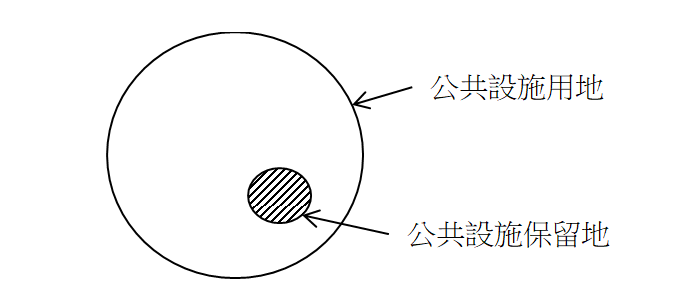

---
*注：本文圖片存放於 ./images/ 目錄下*

## 195. 土地增值稅公式之問題
*發布日期: 2024-04-16* 

## 內文
土地增值稅計算公式之問題，茲彙整如下：

1. 公告土地現值偏離市價，部分漲價歸私。

2. 當期(同年度)移轉無土地增值。

3. 僅有原地價有物價調整，費用卻無調整。

4. 稅率僅20～40%，至少有一半以上土地增值歸私。

5. 費用必須舉證方能扣除。

另可參司法院釋字第286號解釋之不同意見書：

• (1) 土地增值稅之徵收，以土地之自然漲價為標的，應依照土地自然漲價總數額計算，不包括土地所有權人為改良土地已支出之全部費用及因而增加之價值在內。

• (2) 土地所有權人改良土地已支出之全部費用，不問土地價值有無增加，均許減去，乃以鼓勵土地所有權人改良土地為理由。

• (3) 土地可因其所有權人施以勞力資本改良而增加價值，則為常態。此項價額，主管機關既認於計算土地自然漲價總數額時，理應扣除，自應修正估價法規，改進估計技術，予以推計分離。同條例施行細則為求課徵簡便，未規定土地所有權人於報請驗證登記改良費時，同時將土地因改良而增加之價額，報請驗證登記，以便於計算土地自然漲價總額數時憑以減去，致土地有無因土地所有權人改良而增加之價值或其價額若干？事後查核困難，但仍非不能查核，自應克服困難，予以核計而為合理之劃分。

• (4) 明定該項費用之範圍，致扣除項目，不包括土地所有權改良土地所增加之價值，而將其算入自然增值。此種計算之方法，雖可減少困難，節省稽徵成本，然造成課稅基礎之混淆，已足以損及公益，且因土地增值稅之課稅標的中含有「可能存在」之非自然增值，在利益團體影響下，導致降低課徵土地增值稅稅率之立法。

---
*注：本文圖片存放於 ./images/ 目錄下*

## 196. 配偶相互贈與之土地增值稅
*發布日期: 2024-04-11* 

## 內文
甲將名下A地贈與其妻乙，是否需課徵土地增值稅？乙持有A地數年後出售予丙，依規定如何認定其原地價，計算漲價總數額，課徵土地增值稅？試依土地稅法相關規定說明之。

【112高考】

【解答】

• (一) 經申請不課徵土地增值稅：

1. 不課徵土地增值稅：配偶相互贈與之土地，得申請不課徵土地增值稅。準此，甲將名下A地贈與其妻乙，倘經申請不課徵，則不課徵土地增值稅。

2. 再出售之原地價認定：乙持有A地數年後出售予丙，依法應課徵土地增值稅時，以採該土地第一次不課徵土地增值稅前之原規定地價或最近一次課徵土地增值稅時核定之申報移轉現值為原地價，計算漲價總數額，課徵土地增值稅。

• (二) 未申請不課徵土地增值稅：

1. 應課徵土地增值稅：配偶相互贈與之土地，如未申請不課徵，則應課徵土地增值稅。準此，甲將名下A地贈與其妻乙，倘未申請不課徵，則應課徵土地增值稅。

2. 再出售之原地價認定：乙持有A地數年後出售予丙，依法應課徵土地增值稅時，以採該土地甲贈與乙當時課徵土地增值稅核定之申報移轉現值為原地價，計算漲價總數額，課徵土地增值稅。

---
*注：本文圖片存放於 ./images/ 目錄下*

## 197. 地震等重大災害之不動產稅捐減免規定
*發布日期: 2024-04-09* 

## 內文
倘若發生地震等重大災害時，不動產受到災損影響，其相關稅捐減免規定茲簡要整理如下：

• 一、房屋稅

• (一) 情形

1. 尚可使用 私有房屋有受重大災害，毀損面積占整棟面積三成以上不及五成之房屋情形，其房屋稅減半徵收(房§15II)。

2. 無法使用 私有房屋有受重大災害，毀損面積占整棟面積五成以上，必須修復始能使用之房屋情形，免徵房屋稅(房§15I⑦)

3. 滅失或拆除 房屋遇有焚燬、坍塌、拆除至不堪居住程度者，應由納稅義務人申報當地主管稽徵機關查實後，在未重建完成期內，停止課稅 (房§8)。

• (二) 程序

應由納稅義務人於每期房屋稅開徵四十日以前向當地主管稽徵機關申報；逾期申報者，自申報之次期開始適用。經核定後減免原因未變更者，以後免再申報(房§15III)。

• 二、地價稅

• (一) 情形

因山崩、地陷、流失、沙壓等環境限制及技術上無法使用之土地，地價稅全免 (土稅減§12)。

• (二) 程序

申請減免地價稅者，應於每年開徵四十日前（9月22日）提出申請；逾期申請者，自申請之次年起減免。減免原因消滅，自次年恢復徵收(土稅減§24)。

• 三、申請延期或分期

1. 納稅義務人因天災、事變、不可抗力之事由或為經濟弱勢者，不能於法定期間內繳清稅捐者，得於規定納稅期間內，向稅捐稽徵機關申請延期或分期繳納，其延期或分期繳納之期間，不得逾三年(稅稽§26)。

2. 所稱延期繳納，指延長繳納期限，一次繳清應納稅捐；所稱分期繳納，指每期以一個月計算，分次繳納應納稅捐。

3. 僅得就延期或分期繳納擇一適用。

4. 延期最長12個月，分期最長得分36期。 （納稅義務人申請延期或分期繳納稅捐辦法）

---
*注：本文圖片存放於 ./images/ 目錄下*

## 198. 登記錯誤、登記遺漏及登記虛偽之闡述
*發布日期: 2024-04-04* 

## 內文
土地法第68條第1項規定：「因登記錯誤遺漏或虛偽致受損害者，由該地政機關負損害賠償責任。但該地政機關證明其原因應歸責於受害人時，不在此限。」又，土地法第69條規定：「登記人員或利害關係人，於登記完畢後，發見登記錯誤或遺漏時，非以書面聲請該管上級機關查明核准後，不得更正。但登記錯誤或遺漏，純屬登記人員記載時之疏忽，並有原始登記原因證明文件可稽者，由登記機關逕行更正之。」準此，土地登記損害賠償之原因有三：①登記錯誤；②登記遺漏；③登記虛偽。另，更正登記之原因有二：①登記錯誤；②登記遺漏。換言之，土地登記損害賠償之原因有「登記虛偽」，更正登記之原因無「登記虛偽」

• (一) 登記錯誤之意涵：登記錯誤可分為最廣義之登記錯誤、廣義之登記錯誤及狹義之登記錯誤。

1. 最廣義之登記錯誤：凡登記事項與真實情形不符者，均屬之。

2. 廣義之登記錯誤：指未違反登記同一性之登記錯誤。所稱登記同一性，指土地登記之同一權利主體、同一權利種類、同一權利範圍及同一權利標的而言。

3. 狹義之登記錯誤：指未違反登記同一性之登記錯誤，且登記事項與登記原因證明文件不符。

• (二) 登記虛偽之意涵：指違反登記同一性之登記錯誤。最廣義登記錯誤包括廣義之登記錯誤及登記虛偽二項。

[圖片1]

• (三) 結論：

1. 土地法第68條（土地登記損害賠償）之登記錯誤，指廣義之登記錯誤。土地法第69條（更正登記）之登記錯誤，指狹義之登記錯誤。

2. 土地法第68條所定登記錯誤（指廣義之登記錯誤）與登記虛偽，二者結合而為最廣義之登記錯誤。準此，土地登記損害賠償之原因有二： (1)最廣義之登記錯誤：指登記事項與真實情形不符者。 (2)登記遺漏：指應登記事項而漏未登記者。

3. 土地法第69條所定登記錯誤，指狹義之登記錯誤。準此，更正登記之原因有二： (1)狹義之登記錯誤：指未違反登記同一性之登記錯誤，且登記事項與登記原因證明文件所載之內容不符者。 (2)登記遺漏：指應登記事項而漏未登記者。

[圖片2]

4. 土地登記規則第13條所定義之登記錯誤（即登記事項與登記原因證明文件所載之內容不符），實際上僅適用於土地法第69條之更正登記。土地法第68條之土地登記損害賠償，不以此定義為限。

## 文章圖片

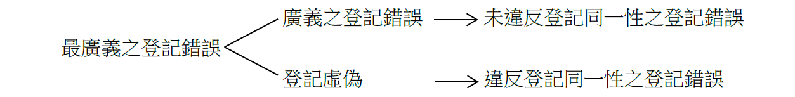

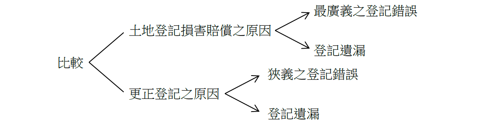

---
*注：本文圖片存放於 ./images/ 目錄下*

## 199. 淨零排放之意義與土地利用規劃作為
*發布日期: 2024-04-02* 

## 內文
• (一) 意義

1. 淨零排放：指溫室氣體排放量與碳匯量達成平衡。

2. 國家溫室氣體長期減量目標為中華民國一百三十九年（2050）溫室氣體淨零排放。為達成前項目標，各級政府應與國民、事業、團體共同推動溫室氣體減量、發展負排放技術及促進國際合作。(氣候變遷因應法第4條)

• (二) 路徑

我國於2022年3月正式公布「臺灣2050淨零排放路徑及策略總說明」，提供至2050年淨零之軌跡與行動路徑，以促進關鍵領域之技術、研究與創新，引導產業綠色轉型，帶動新一波經濟成長，並期盼在不同關鍵里程碑下，促進綠色融資與增加投資，確保公平與銜接過渡時期。

我國2050淨零排放路徑將會以「能源轉型」、「產業轉型」、「生活轉型」、「社會轉型」等四大轉型，及「科技研發」、「氣候法制」兩大治理基礎，輔以「十二項關鍵戰略」，就能源、產業、生活轉型政策預期增長的重要領域制定行動計畫，落實淨零轉型目標。

[圖片1]

[圖片2]

• (三) 碳匯

1. 意義 碳匯指將二氧化碳或其他溫室氣體自排放源或大氣中持續移除後，吸收或儲存之樹木、森林、土壤、海洋、地層、設施或場所。

2. 類型 (1)綠碳（森林碳匯） (2)藍碳（海洋碳匯） (3)黃碳（土壤碳匯）

• (四) 土地利用規劃之作為

• I. 土地使用面向

1. 降低不必要土地開發：在人口總量減少的變遷下，透過國土計畫減少不必要之土地開發，降低碳排放與節約能源。

2. 增加碳匯空間：就國土計畫所劃設的國土保育地區加強保育，於國土復育促進地區進行生態復育，配合森林保育與造林，增加碳匯空間，藉此達到碳中和。

3. 緊密都市（Compact city）規劃：藉由土地混合使用，將食衣住行育樂等日常生活所需之活動空間，盡可能配置在同一區域，可有效降低都市活動移動距離，以步行或自行車取代私人汽機車運具使用，減少不必要的交通旅次，進而縮減使用運具所產生的溫室氣體排放。

• I. I.交通運輸面向

1. 大眾運輸導向發展（Transit-oriented development, TOD）：係藉由大眾運輸系統之構建，引導居住、工作、購物、休閒等活動空間於大眾運輸路線廊帶上有秩序地分布，以形塑高可居性、可及性及有效率的永續都市型態與土地利用模式。藉此，提高大眾運輸使用率，降低碳排高的汽機車使用。

2. 適當縮減停車位與道路用地劃設：適當縮減停車位與道路用地，以誘導搭乘大眾運輸，減少私人運具使用，進而減少碳排放。

3. 打造友善綠色運輸環境：以人為本的交通規劃，確保自行車道、步行環境的友善性、可及性、安全性、連貫性等，藉此鼓勵多以步行、自行車等綠色運輸取代私人運具之通勤使用，減少碳排。

• I. II.公共設施面向

1. 公共設施區位規劃：就鄰里人口分布狀況，有效配置公共設施服務，減少通勤旅次。

2. 既有公共設施再利用：由於少子化、高齡化之社會結構變遷，就閒置的學校等公共設施，規劃、清理轉型為社會住宅、安養中心等，避免重新開發增加碳排。

• I. V.都市設計面向

1. 鼓勵綠建築：綠建築係在建築生命週期中，消耗最少地球資源，使用最少能源及製造最少廢棄物的建築物。因此，可於建築或開發審議時，除給予容積獎勵外，多鼓勵建商採用綠建築。

2. 配置都市藍、綠帶系統與風廊：人口與建成環境集中下，都市熱島效應越趨嚴重。可透過水環境之藍帶系統，以及綠地、濕地之綠帶系統規劃設計，並配合風廊營造，紓緩熱島效應下冷氣空調大幅使用所造成之溫室氣體排放與高耗能。

## 文章圖片

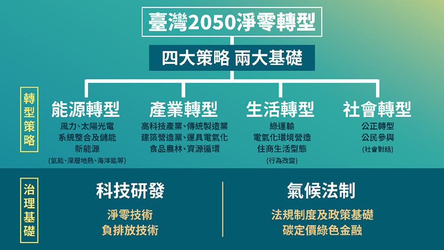

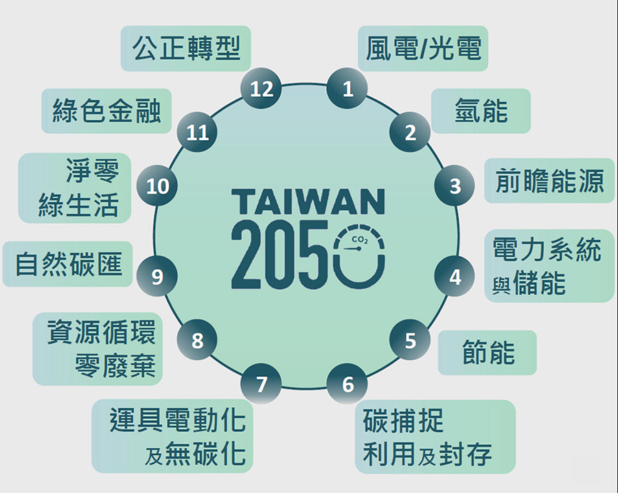

---
*注：本文圖片存放於 ./images/ 目錄下*

## 200. 徵收免稅及重購退稅之用意
*發布日期: 2024-03-28* 

## 內文
• (一) 立法目的：

土地（房屋）徵收或土地（房屋）出售時，如扣除稅費，將無法以其餘額購買同一地段、同一品質及同一面積之土地（房屋），因此給予免除或退還稅費。

• (二) 相關規定：

1. 土地徵收，免徵土地增值税（土地稅法第39條第1項）。

2. 房地徵收，免徵房地合一所得稅（所得稅法第4條之5第1項第3款）。

3. 自用住宅用地、自營工廠用地或自耕農業用地出售後，重購退還土地增值稅（土地稅法第35條）。

4. 自住房地出售後，重購退還房地合一所稅（所得稅法第14條之8）。

5. 建築改良物之徵收，其補償費按重建價格估定，不扣除折舊費用（土地徵收例第31條第1項）。

---
*注：本文圖片存放於 ./images/ 目錄下*

## 201. 被繼承人死亡前二年內贈與都市計畫公共設施保留地 是否應計入遺產總額
*發布日期: 2024-03-26* 

## 內文
甲112年3月3日將其所有的A縣都市計畫之公共設施保留地贈與給其子乙，後於113年6月6日死亡，其子乙依規定申報遺產稅時，是否應將該筆土地併入遺產總額申報，再將其列為扣除額中扣除？

• 一、相關規定

• (一) 遺產及贈與稅法第15條：「被繼承人死亡前二年內贈與下列個人之財產，應於被繼承人死亡時，視為被繼承人之遺產，併入其遺產總額，依本法規定徵稅：

1. 被繼承人之配偶。

2. 被繼承人依民法第1138條及第1140條規定之各順序繼承人。

3. 前款各順序繼承人之配偶。」

• (二) 都市計畫法第50條之1後段：「…公共設施保留地因繼承或因配偶、直系血親間之贈與而移轉者，免徵遺產稅或贈與稅。」

• 二、結論

原本按照上述規定，照理應將該贈與之公共設施保留地併入被繼承人甲的遺產總額申報，並檢具註記公共設施保留地的土地使用分區證明書，列報公共設施保留地扣除額。

惟因都市計畫法第50條之1已明定，因繼承而移轉予配偶、直系血親的公共設施保留地，免徵遺產稅，故甲生前贈與行為，顯無規避遺產稅的動機，乙無須再將甲死亡前2年內贈與公共設施保留地，併入被繼承人甲的遺產總額，以及將該公共設施保留地的遺產價額，同額列報公共設施保留地扣除額，以茲簡政便民。

參考來源：被繼承人死亡前2年內贈與法定免徵遺產稅的土地，免併計遺產總額-財政部北區國稅局 (ntbna.gov.tw)

---
*注：本文圖片存放於 ./images/ 目錄下*

## 202. 自住之意涵
*發布日期: 2024-03-21* 

## 內文
地價稅及土地增值稅所採用之「自用住宅用地」，法有明文定義（詳見土地稅法§9），適用上較明確。然，房屋稅及房地合一所得稅所採用之「自住」，法無明文定義，其意涵因適用情形而異。茲就其適用情形分析其自住意涵如下：

• (一) 自住之房屋稅優惠稅率：

1. 條件：(1)戶籍條件：房屋所有權人、配偶或直系親屬辦竣戶籍登記，並供房屋所有權人、配偶或直系親屬實際居住使用。(2)使用條件：房屋無出租或營業使用。(3)戶數條件：房屋所有權人、配偶及未成年子女持有住家用房屋全國合計三戶內。

2. 優惠稅率：自住房屋，按房屋現值之1.2%課徵。全國僅持有一戶，按房屋現值之1%課徵。

• (二) 自住之房地合一所得稅免稅及優惠稅率：

1. 條件：(1)戶籍條件：房地所有權人或其配偶、未成年子女辦竣戶籍登記，且連續滿六年。(2)持有條件：房地所有權人或其配偶、未成年子女持有並居住於該房屋連續滿六年。(3)使用條件：交易前六年內，無出租、供營業或執行業務使用。(4)次數條件：房地所有權人或其配偶、未成年子女於交易前六年內未曾適用本項免稅規定。換言之，每六年享用一次。

2. 優惠規定：自住房地，房地交易所得在400萬元以下，免徵；超過400萬元部分，稅率10%。

• (三) 自住之房地合一所得稅重購退稅：

1. 條件：(1) 戶籍條件：房地所有權人或其配偶、未成年子女應於該出售及購買之房屋辦竣戶籍登記並居住。(2) 使用條件：出售前一年內，房屋無出租、供營業或執行業務使用。(3) 時間條件：自完成移轉登記之日起二年內重購。先購後售亦適用之。(4)名義條件：出售或重購房地限以納稅義務人本人或其配偶名義登記。(5)時效條件：自完成移轉登記之日起五年內申請退還。(6)移轉條件：重購後五年內再行移轉或改作其他用途，追繳原退還稅款。

2. 退稅金額：(1)重購房地價格大於出售房地價格：退還全部納稅金額。(2)重購房地價格不及出售房地價格：就納稅金額按重購價格占出售價額之比率申請退稅。

---
*注：本文圖片存放於 ./images/ 目錄下*

## 203. 信託與委託(任)之差異
*發布日期: 2024-03-19* 

## 內文
信託與委託雖名稱相似，但有所差異，本周專欄茲整理如下：

• T. ABLE_PLACEHOLDER_1

---
*注：本文圖片存放於 ./images/ 目錄下*

## 204. 韌性城市
*發布日期: 2024-03-14* 

## 內文
• 一、韌性城市之意義

韌性城市（Resilient City），指城市面對天然災害（如颱風、地震、海嘯、土石流等）、能源危機、恐怖攻擊等事件發生時，能將其衝擊所造成之影響降至最低，並在最短時間內回復原來狀態。

• 二、韌性城市之目的

• (一) 減災：城市面對衝擊時，將災害減輕，以確保人民生命財產之安全。

• (二) 調適：城市適應極端氣候變化，透過城市設施改善，以對抗地震、水災及風災等之侵襲。

• (三) 永續：城市發揮韌性能力，以應付未來不確定性事件發生，追求城市永續發展。

• 三、韌性城市之具體作法

• (一) 過往「與水爭地」，改變為「還地於水」。如增加河川行水面積、氾濫平原（如關渡平原）不得開發等。

• (二) 增加公園、綠地、廣場等開放空間，以增加透水面積。

• (三) 設置滯洪池、建物地下水庫等，以儲存雨水，並減少暴雨逕流量。

• (四) 鼓勵綠建築之興建，促進建物能源效率，減少溫室氣體排放。

• (五) 以生態工法整治河川工程，增加地下水及生態復育。

• (六) 劃定高災害潛勢地區（如斷層、土石流、地層下陷、土壤液化等地區），禁止建築使用，以避免災害損失。

• (七) 監控災害徵兆，建立預警系統。

• (八) 其他相關措施。

---
*注：本文圖片存放於 ./images/ 目錄下*

## 205. 共有物分割與分管之差異
*發布日期: 2024-03-12* 

## 內文
• T. ABLE_PLACEHOLDER_1

---
*注：本文圖片存放於 ./images/ 目錄下*

## 206. 空地稅、空屋稅及囤房稅
*發布日期: 2024-03-07* 

## 內文
• 一、空地稅

• (一) 空地之意義：所稱空地，指已完成道路、排水及電力設施，於有自來水地區並已完成自來水系統，而仍未依法建築使用；或雖建築使用，而其建築改良物價值不及所占基地申報地價百分之十，且經直轄市或縣（市）政府認定應予增建、改建或重建之私有及公有非公用建築用地（平§3⑦）。

• (二) 對空地之制裁手段：直轄市或縣（市）政府對於私有空地，得視建設發展情形，分別劃定區域，限期建築、增建、改建或重建；逾期未建築、增建、改建或重建者，按該宗土地應納地價稅基本稅額加徵二倍至五倍之空地稅或照價收買（平§26I）。準此，對空地之制裁手段有二，一為空地稅（照地價稅基本稅額之二倍至五倍加徵），另一為照價收買（照公告土地現值收買）。

• (三) 空地稅之目的：

1. 採寓禁於徵之手段，禁止土地閒置。

2. 加重土地持有成本，促進土地利用。

3. 打擊土地投機，穩定地價發展。

• (四) 實施空地稅之問題：

1. 空地稅過輕，難以發揮其政策效果。

2. 空地須經限期建築使用而不使用，始得課徵空地稅。然，限期建築之期限過長，難以發揮立即打擊之效果。

3. 空地限期使用，應考慮當地之住宅需求狀況，否則所興建房屋如淪為空屋，造成資源之更大浪費。

• 二、空屋稅

法無明文規定。實施空屋稅之最大問題在難以認定「空屋」。如以用水、用電或用瓦斯之度數為認定依據，則屋主恐以浪費水電或浪費瓦斯方式因應，反而造成資源浪費，得不償失。

• 三、囤房稅

• (一) 囤房稅之規定：本人、配偶及未成年子女全國持有超過三戶住家用房屋，按其全國總持有戶數，依房屋所在地直轄市、縣（市）政府訂定之相應差別稅率，課徵房屋稅。其稅率最低不得少於其房屋現值2%，最高不得超過4.8%。

• (二) 囤房稅之目的：

1. 採寓禁於徵之手段，禁止囤積房屋。

2. 加重房屋持有成本，促其釋出房屋。

3. 打擊炒作房屋，抑制房價高漲。

• (三) 實施囤房稅之問題：

1. 囤房稅過輕，難以發揮其政策效果。

2. 課徵囤房稅，如發生轉嫁現象，政策效果恐落空。

3. 各直轄市、縣（市）所訂定之差別稅率不同，造成稅負不公平。

---
*注：本文圖片存放於 ./images/ 目錄下*

## 207. 農地之定義
*發布日期: 2024-03-05* 

## 內文
凡供農業生產用的土地，即可稱為農地。

由於農業生產的意義有廣狹之分，所以農地一詞也有廣狹之別：

1. 廣義：農業用地

• (1) 平均地權條例第3條、農業發展條例第3條及土地稅法第10條指非都市土地或都市土地農業區、保護區範圍內土地，依法供下列使用者︰

1. 供農作、森林、養殖、畜牧及保育使用者。

2. 供與農業經營不可分離之農舍、畜禽舍、倉儲設備、曬場、集貨場、農路、灌溉、排水及其他農用之土地。

3. 農民團體與合作農場所有直接供農業使用之倉庫、冷凍（藏）庫、農機中心、蠶種製造（繁殖）場、集貨場、檢驗場等用地。

• (2) 又依農業發展條例施行細則第2條，所稱依法供前述第一目至第三目使用之農業用地，其法律依據及範圍如下：

1. 本條例第三條第十一款所稱之耕地。

2. 依區域計畫法劃定為各種使用分區內所編定之林業用地、養殖用地、水利用地、生態保護用地、國土保安用地及供農路使用之土地，或上開分區內暫未依法編定用地別之土地。

3. 依區域計畫法劃定為特定農業區、一般農業區、山坡地保育區、森林區以外之分區內所編定之農牧用地。

4. 依都市計畫法劃定為農業區、保護區內之土地。

5. 依國家公園法劃定為國家公園區內按各分區別及使用性質，經國家公園管理處會同有關機關認定合於前三款規定之土地。

2. 狹義：耕地

為農業生產力高的土地。依照農業發展條例第3條，耕地認定指依區域計畫法劃定為特定農業區、一般農業區、山坡地保育區及森林區之農牧用地。

---
*注：本文圖片存放於 ./images/ 目錄下*

## 208. 房屋稅條例之住家稅率
*發布日期: 2024-02-29* 

## 內文
◎依據民國113年1月3日修正公布之「房屋稅條例」規定，住家用房屋之房屋稅率為何？

【解答】

• (一) 供自住、公益出租人出租使用或以土地設定地上權之使用權房屋並供該使用權人自住使用者，為其房屋現值1.2%。但本人、配偶及未成年子女於全國僅持有一戶房屋，供自住且房屋現值在一定金額以下者，為其房屋現值1%。

• (二) 前款以外，出租申報租賃所得達所得稅法規定之當地一般租金標準者或繼承取得之共有房屋，最低不得少於其房屋現值1.5%，最高不得超過2.4%。

• (三) 起造人持有使用執照所載用途為住家用之待銷售房屋，於起課房屋稅二年內，最低不得少於其房屋現值2%，最高不得超過3.6%。

• (四) 其他住家用房屋，最低不得少於其房屋現值2%，最高不得超過4.8%。

直轄市及縣（市）政府應依上開第2款至第4款規定，按各該納稅義務人全國總持有應稅房屋戶數或其他合理需要，分別訂定差別稅率；納稅義務人持有坐落於直轄市及縣（市）之各該應稅房屋，應分別按其全國總持有戶數，依房屋所在地直轄市、縣（市）政府訂定之相應稅率課徵房屋稅。

---
*注：本文圖片存放於 ./images/ 目錄下*

## 209. 財產權侵害之損失補償
*發布日期: 2024-02-27* 

## 內文
損失補償之主要特徵在於「因公益而形成個人利益之特別犧牲」，亦即，公權力對個人財產權之干預程度，相較於他人所受之干預，如顯失公平且無期待可能者，即屬逾越社會責任所應忍受之範圍，而構成特別犧牲，國家應予合理之補償1。因此，針對財產權侵害之損失補償，應可粗分為：

1. 應予補償之徵收（剝奪財產權）

2. 應予補償之財產權限制（非至為輕微）

3. 不予補償之財產權限制（至為輕微）

申言之，若國家為公益而對人民財產權之限制，已至完全剝奪，或致該財產權之本來效用已無從發揮，即已形骸化而實質上形同剝奪者（如本院釋字第400 號解釋所稱已形成公用地役關係之既成道路土地），即屬應予補償之徵收；然若對財產權之限制並未至此程度依上開本院釋字第564號解釋，即限制係至為輕微，則屬財產權之社會義務，係不予補償之財產權限制；反之，若對財產權之限制已「非至為輕微」，則應認係已逾越財產權之社會義務範圍，而形成個人之特別犧牲，屬應予補償之財產權限制。2

然究至何種程度始逾人民財產權所應忍受之範圍，應就行為之目的與限制手段及造成之結果予以衡量（司法院釋字第564號解釋理由書）。可就下列複數要素，綜合地對於財產權限制之個別情形，判斷其是否形成土地所有權人之特別犧牲3：1.限制之目的、2.手段形態、3.限制程度、4.損失程度、5.土地狀況及條件、6.社會需要（社會情狀）、7.限制期間、8.有無既得權益。

1 李建良，1998，特別犧牲與損失補償，月旦法學雜誌第36期，第24-25頁。 2 楊惠欽大法官釋字第813號解釋協同意見書。 3 陳立夫，2017，土地利用限制形成特別犧牲之損失補償請求權－司法院釋字第747號解釋之意義，月旦裁判時報，第64期，第17-30頁；陳立夫，2011，台灣農地權利之管制與權利保障－以耕地三七五減租條例對耕地所有權之限制為中心，土地法研究（二），新學林，第130-171頁。
---
*注：本文圖片存放於 ./images/ 目錄下*

## 210. 112年憲判字第19號判決之模擬試題
*發布日期: 2024-02-22* 

## 內文
◎土地稅減免規則第9條規定：「無償供公眾通行之道路土地，經查明屬實者，在使用期間內，地價稅或田賦全免。但其屬建造房屋應保留之法定空地部分，不予免徵。」其但書規定是否違反憲法第7條平等原則？試依112年憲判字第19號判決論述之。

【解答】

• (一) 憲法第7條保障人民之平等權，法規範是否符合平等原則之要求，其判斷應取決於該法規範所以為差別待遇之目的是否合憲，其所採取之分類與規範目的之達成間，是否存有一定程度之關聯性而定。租稅法律關係中，立法者為了實現憲法所賦予之任務，而就各種稅捐之稽徵及減輕或免除分別訂定不同之規範，其分類及差別待遇，涉及國家財稅政策之整體規劃，適合由代表民意之立法機關及擁有專業能力之相關行政機關，以法律或法律明確授權之法規命令定之，其規定如有正當目的，且分類與目的之達成間具有合理關聯，即符合憲法第7條平等權保障之意旨。

• (二) 法定空地屬建築基地之一部分，提供該建築物日照、採光、通風、景觀、防火、安全等特定之功能，與人民私有並非建築基地之一部分而單純無償供公眾使用之道路土地，性質與功能均有所不同。

• (三) 按法定空地屬建築基地之一部分，依法應併同主建築物一併移轉，建築物所有人就法定空地之留設，除享有較優良之居住品質及環境空間外，未來如有改建或實施都市更新，該法定空地之所有權人尚得參與分配更新後之房地，其權益不因其是否專供或兼供公眾通行使用而受影響。是對土地所有人而言，建築基地所保留之法定空地雖可供公眾通行，但仍維持並享有該法定空地屬於建築基地之利益，與單純無償供公眾使用而完全無法使用收益之道路土地，在建築法上之性質與功能不同。

• (四) 法定空地供公眾通行，縱為無償，因其已計入依建築法應留設之法定空地，即無須再就建築基地中之其他土地予以留設，對提供者仍具有建築上之利益；而提供私有非法定空地無償供公眾通行，該土地所有人並未獲取任何利益，二者本質尚有所不同。

• (五) 綜上，系爭規定因此區隔，於地價稅核課上有所區別，對提供法定空地無償供公眾通行者，仍然課徵地價稅，其分類與公平課稅目的之達成間，具有合理關聯，尚無違反憲法第7條規定之平等原則，其規定亦未逾土地稅法第6條及平均地權條例第25條之授權範圍。

---
*注：本文圖片存放於 ./images/ 目錄下*

## 211. 地價稅計算範例：特別稅率與一般稅率之綜合題型
*發布日期: 2024-02-20* 

## 內文
假設曾某於C市有以下5筆都市土地，試問其應繳納多少地價稅額？（C市今年度累進起點地價為500萬元）

• T. ABLE_PLACEHOLDER_1

【解】（以下申報地價皆以萬元計算）

• (一) 適用特別稅率者

1.

10地號

• (1) 稅基 申報地價總額＝300×0.3＝90(萬元)。

• (2) 稅率 都市計畫公共設施保留地，在保留期間仍為建築使用者，屬自用住宅用地，其稅率為2‰

• (3) 稅額 地價稅＝90×2‰＝0.18(萬元)。

2.

21地號

都市計畫公共設施保留地未作任何使用並與使用中之土地隔離者，免徵地價稅。

3.

22地號

• (1) 稅基 申報地價總額＝800×1＝800(萬元)。

• (2) 稅率 都市計畫公共設施保留地，在保留期間仍為建築使用者，統按6‰計徵地價稅。

• (3) 稅額 地價稅＝800×6‰＝4.8(萬元)。

4.

33地號

無償供公眾通行之道路土地，經查明屬實者，在使用期間內，地價稅或田賦全免。但其屬建造房屋應保留之法定空地部分，不予免徵。

• (二) 適用一般稅率者：55地號

1.

稅基 申報地價總額＝1,000×2＝2,000(萬元)。

2.

稅率 (2,000-500)÷500＝3(倍)。 (1)未超過累進起點地價，地價稅按基本稅率10‰徵收。 (2)超過累進起點地價未達五倍者，就其超過部分課徵15‰。

3.

稅額 地價稅＝500×10‰+1,500×15‰＝27.50(萬元)。 （速算：2,000×15‰－500×0.005＝27.50(萬元)）

• (三) 合計地價稅額

0. 18+4.8+27.50＝32.48。

綜上，曾某今年度C市地價稅合計應繳納32.48萬元。
---
*注：本文圖片存放於 ./images/ 目錄下*

## 212. 地籍圖重測之土地所有權人指界
*發布日期: 2024-02-15* 

## 內文
地籍圖重測時，土地所有權人未到場指界、到場而不能指界及到場不指界等三種情形，地政機關應如何處理？

【解答】

• (一) 土地所有權人未到場指界：地政機關應依下列順序逕行施測：①鄰地界址；②現使用人之指界；③參照舊地籍圖；④地方習慣。

• (二) 土地所有權人到場不能指界：地政機關得參照舊地籍圖及其他可靠資料，協助指界，並依下列方式辦理：

1. 土地所有權人同意該協助指界之結果者，視同其自行指界。

2. 土地所有權人不同意該協助指界之結果且未能自行指界者，地政機關應依下列順序逕行施測：①鄰地界址；②現使用人之指界；③參照舊地籍圖；④地方習慣。

3. 土地所有權人不同意該協助指界之結果而產生界址爭議者，地政機關應予以調處，不服調處，應於接到調處通知後十五日內，向司法機關訴請處理，逾期不起訴者，依原調處結果辦理。

• (三) 土地所有權人到場而不指界：地政機關應依下列順序逕行施測：①鄰地界址；②現使用人之指界；③參照舊地籍圖；④地方習慣。

---
*注：本文圖片存放於 ./images/ 目錄下*

## 213. 調解登記及詐騙案
*發布日期: 2024-02-06* 

## 內文
各位同學好

今日專欄針對持調解筆錄申請土地權利變更登記之辦理方式及詐騙案例進行討論。

首先，可先參考這幾篇新聞

破獲「假調解真騙房」詐欺案 藉調解取身分證偽造本票借據 ｜ 公視新聞網 PNN (pts.org.tw)

房子差點沒了！屋主收「地籍異動」簡訊才知 (yahoo.com)

調解登記，係指已辦竣地籍測量及土地總登記、建物第一次登記之土地、建物，因發生產權糾紛，於土地或建物因調解成立後，經檢附相關文件向登記機關申請權利變更之登記。

其申辦方式，茲彙整說明如下：

• (一) 申請期限

1. 申請土地權利變更登記，應於權利變更之日起一個月內為之。

2. 而權利變更之日，係指依鄉鎮市調解條例規定成立之調解，經法院核定之日。

• (二) 申請方式

調解經法院核定，等同於法院判決確定，故由權利人（或其代理人）單獨申請之。亦可網路申辦（非全程式）。

• (三) 申請規費

1. 登記費 (1)土地申報地價千分之一。 (2)建物契價千分之一。

2. 權狀費：每張80元。

• (四) 申請文件

1. 土地登記申請書。

2. 登記清冊。

3. 調解筆錄（鄉鎮市區調解需經法院核定）。

4. 申請人身分證明文件。

5. 土地增值稅繳納或免稅不課徵證明文件。

6. 契稅繳納收據、免稅證明書或同意移轉證明書。

7. 其他由中央地政機關規定應提出之證明文件。

其中，針對為何無須依土地登記規則由義務人親自到場以進行身份與真意的驗證：

1. 根據鄉鎮市調解條例第27條第2項前段：「經法院核定之民事調解，與民事確定判決有同一之效力」。

2. 又土地登記規則第41條規定，申請登記時，當事人得免親自到場情形，其中第1款為「依第27條第4款規定，得由權利人單獨申請登記。」亦即「因法院、行政執行分署或公正第三人拍定、法院判決確定之登記」。

3. 因此，鄉鎮市調解經法院核定後，等同於法院判決，而適用得免親自到場，當然也不需提供印鑑證明。

因此，就變得身份與產權變動真意的驗證，實際上責任是落在登記前的調解程序上。惟當調解過程中未審慎確認雙方身分時，就容易發生此篇新聞的詐騙事件。
---
*注：本文圖片存放於 ./images/ 目錄下*

## 214. 112年憲判字第20號判決之模擬試題(二)
*發布日期: 2024-02-01* 

## 內文
• 一、日治時期人民私有之土地，經依土地總登記程序登記為國有，其登記是否發生物權變動之效力？

【解答】

日治時期人民私有之土地，經依土地總登記程序登記為國有，其登記不發生物權變動之效力。其理由如下：

• (一) 土地登記本身僅具有推定權利歸屬之效力，不能作為認定權利取得或消滅之絕對依據。是當土地所有權之登記與真實權利狀態不一致時，真正所有人為回復其權利之圓滿狀態，原則上仍得對登記名義人行使物上請求權，而請求塗銷登記及返還土地。此權利具財產上價值，自應受憲法第15條財產權之保障。

• (二) 戰後初期所實施之土地總登記，雖為政府在政權移轉後管理國土、推行不動產物權登記制度所需，然該措施僅係確認、整理及清查當時土地之地籍狀態與產權歸屬，以利後續政令之推行，並無使不動產物權發生變動之意，非屬民法第758條第1項、第759條之情形。又，土地法第43條所定依該法所為之登記有絕對效力，僅為保護善意第三人因信賴既有登記而更為登記者，賦與登記之公信力，並非否認日治時期土地台帳或土地登記簿上所記載權利之效力。是日治時期屬人民私有之土地，雖經辦理土地總登記之程序而登記為國有，然該登記與物權之歸屬無關，並未影響人民自日治時期已取得之土地所有權，人民仍為該土地之真正所有人，此亦為審判實務上一貫見解。

• (三) 上開日治時期人民私有之土地，經依土地總登記程序登記為國有，其登記雖不生物權變動之效力，卻造成真正權利人（即人民）與登記名義人（即國家）不一致，致人民須依民法第767條第1項規定對國家行使物上請求權，方得再度基於所有人地位，自由使用、收益及處分其所有物。

• 二、日治時期為人民所有，嗣因逾土地總登記期限，未登記為人民所有，致登記為國有且持續至今之土地，在人民基於該土地所有人地位，請求國家塗銷登記時，有無民法消滅時效規定之適用？

【解答】

日治時期為人民所有，嗣因逾土地總登記期限，未登記為人民所有，致登記為國有且持續至今之土地，在人民基於該土地所有人地位，請求國家塗銷登記時，無民法消滅時效規定之適用。其理由如下：

• (一) 國家就其與人民間之私權爭議，原則上固得主張相關規定所賦予之權利。然而，國家係為人民而存在，本質上既不可能擁有如人民般得自由發展之人格及維繫生存之需求，亦不可能如人民般享有得自由追求之私益，只能追求公益，以執行公共任務為職志。從而，國家自無受憲法第15條所保障財產權之基本權利。

• (二) 國家與人民間關於土地之爭議，若非來源於兩者之合意，而係國家於政權更替之際，居於公權力主體地位，行使統治權，制定相關法規範，並依該規範將原屬人民私有而僅未及時申辦總登記之土地，逕行登記為國有之情形，倘又容許國家嗣後再以時間經過為由，依民法消滅時效規定為時效完成之抗辯，不啻變相承認國家得透過土地總登記之程序，及消滅時效之抗辯，而無須踐行任何徵收或類似徵收之程序，即可剝奪人民之財產。

• (三) 國家基於公權力主體地位行使統治高權，致與人民發生財產權爭執時，國家本非憲法第15條財產權保障之主體，從而不生基本權衝突之情事。且考量臺灣因政權更迭而辦理土地權利憑證繳驗及換發土地權利書狀，當時之時空環境，絕大多數人民未通曉中文、因戰事流離他所、遺失土地權利憑證，或因社會資訊、教育尚非發達，不諳法令，甚至因36年間之228事件引發社會動盪等特殊原因，致未於限期內申報權利憑證繳驗，或於申報後未依限補繳證件，終致其所有之土地被登記為國有。於此情形，若使國家仍得主張民法消滅時效，從而透過時效制度維持私有土地登記為國有之狀態，不僅與誠實信用原則有違，且形成國家對人民財產權之侵害。故在憲法上，人民財產權之保障，相較於逕行承認土地登記為國有之狀態，更具值得保護之價值。是容許國家在此主張消滅時效，並無正當性可言。

---
*注：本文圖片存放於 ./images/ 目錄下*

## 215. 鄉村地區整體規劃之意義、範圍、定位、策略與流程
*發布日期: 2024-01-30* 

## 內文
• 一、意義

考量過去區域計畫法制度下劃定之鄉村區，因按現況編定及管制，缺乏計畫指導，產生環境窳陋，缺乏公共設施及環境品質低落等問題，為改善鄉村地區公共設施、居住、產業等發展問題，將「鄉村地區整體規劃」作為國土空間發展之重要策略，從生活、生產、生態等面向，協助環境改善、協調產業需求並維護生態景觀，以建立鄉村地區永續發展的制度系統。

• 二、範圍

鄉村地區指國土空間中人口高密度集聚以外的地區。考量鄉村地區整體規劃主要為彌補非都市土地鄉村聚落長期無計畫指導之情形，而都市計畫或國家公園計畫已屬計畫管制地區，該二類計畫地區自有規劃系統，故不納入未來鄉村地區實質空間規劃範圍內，僅作為鄉村地區整體規劃的空間調查分析範圍，爰將「鄉村地區」界定為「都市土地及國家公園土地以外」之傳統「非都市土地」。

• 三、定位

根據國土法施行細則，鄉村地區整體規劃係屬直轄市、縣（市）國土計畫應表明事項，且後續係透過國土計畫法第15 條第3 項規定，啟動變更各該直轄市、縣(市)國土計畫，故鄉村地區整體規劃之法定地位，係定位為「直轄市、縣(市)國土計畫」的一部分。

• 四、策略

鄉村地區應以生活、生產、生態之再生規劃理念出發，充實生活機能設施、維護地方文化特色、營造鄉村生產經營環境、培育鄉村人力資源及建立生態網路，以協助鄉村地區永續發展，各面向發展策略如下：

1. 生活面：建立數位環境、活化閒置空間、促進城鄉交流、保存鄉村文化與社區意識等，並維護及改善在地商業、旅遊、集會場所、文化設施及信仰中心等基本服務設施。

2. 生產面：維護農地環境、促進農業六級化、推廣鄉村旅遊、建構旅遊服務設施等，以支持對鄉村地區商業、社區及遊客有益的旅遊及休閒活動。

3. 生態面：避免破壞重要動植物棲息環境、提高基地透水性、營造生物多樣性生態環境等。

• 五、內容

依據全國國土計畫與國土法施行細則規定，直轄市、縣(市)國土計畫應研訂鄉村地區整體規劃，包含下列項目：

1. 辦理鄉村地區基本調查：分析人口、產業、土地使用、運輸、公共設施服務等基本背景現況。

2. 鄉村區屬性分類：依鄉村區屬性區分為農村發展型、工商發展型。

3. 課題分析及規劃策略研擬：考量居住、產業、運輸、公共設施服務等需求，盤點課題及規劃因應策略。

4. 鄉村地區空間發展配置：依鄉村地區屬性及規劃策略，研擬空間發展配置構想，指定供未來居住、產業、公共設施服務所需空間範圍。

5. 執行機制：依空間配置構想，研擬可行策略執機制及期程。

參考資料：鄉村地區整體規劃作業手冊(111年1月版)；全國國土計畫
---
*注：本文圖片存放於 ./images/ 目錄下*

## 216. 112年憲判字第20號判決之模擬試題(一)
*發布日期: 2024-01-25* 

## 內文
◎最高法院70年台上字第311號民事判例：「司法院大法官會議釋字第107號解釋所謂已登記之不動產，無消滅時效之適用，其登記應係指依吾國法令所為之登記而言。系爭土地如尚未依吾國法令登記為被上訴人所有，而登記為國有後，迄今已經過15年，被上訴人請求塗銷此項國有登記，上訴人既有時效完成拒絕給付之抗辯，被上訴人之請求，自屬無從准許。」憲法法庭於112年憲判字第20號判決，就該判例之後段部分，即「系爭土地如尚未依吾國法令登記為被上訴人所有，而登記為國有後，迄今已經過15年，被上訴人請求塗銷此項國有登記，上訴人既有時效完成拒絕給付之抗辯，被上訴人之請求，自屬無從准許。」宣告違憲，理由為何？

【解答】

• (一) 國家就其與人民間之私權爭議，原則上固得主張相關規定所賦予之權利。然而，國家係為人民而存在，本質上既不可能擁有如人民般得自由發展之人格及維繫生存之需求，亦不可能如人民般享有得自由追求之私益，只能追求公益，以執行公共任務為職志。從而，國家自無受憲法第15條所保障財產權之基本權利。

• (二) 國家與人民間關於土地之爭議，若非來源於兩者之合意，而係國家於政權更替之際，居於公權力主體地位，行使統治權，制定相關法規範，並依該規範將原屬人民私有而僅未及時申辦總登記之土地，逕行登記為國有之情形，倘又容許國家嗣後再以時間經過為由，依民法消滅時效規定為時效完成之抗辯，不啻變相承認國家得透過土地總登記之程序，及消滅時效之抗辯，而無須踐行任何徵收或類似徵收之程序，即可剝奪人民之財產。

• (三) 國家基於公權力主體地位行使統治高權，致與人民發生財產權爭執時，國家本非憲法第15條財產權保障之主體，從而不生基本權衝突之情事。且考量臺灣因政權更迭而辦理土地權利憑證繳驗及換發土地權利書狀，當時之時空環境，絕大多數人民未通曉中文、因戰事流離他所、遺失土地權利憑證，或因社會資訊、教育尚非發達，不諳法令，甚至因36年間之228事件引發社會動盪等特殊原因，致未於限期內申報權利憑證繳驗，或於申報後未依限補繳證件，終致其所有之土地被登記為國有。於此情形，若使國家仍得主張民法消滅時效，從而透過時效制度維持私有土地登記為國有之狀態，不僅與誠實信用原則有違，且形成國家對人民財產權之侵害。故在憲法上，人民財產權之保障，相較於逕行承認土地登記為國有之狀態，更具值得保護之價值。是容許國家在此主張消滅時效，並無正當性可言。

---
*注：本文圖片存放於 ./images/ 目錄下*

## 217. 地面型太陽光電設置專區之方式
*發布日期: 2024-01-23* 

## 內文
政府規劃2025年太陽能光電設置目標20GW，其中屋頂型目標3GW，需要屋頂面積3,000公頃；地面型目標為17GW，需要規劃光電設備及併連線路土地約2.5萬公頃。另，107年告之全國國土計畫，其「部門空間發展策略」亦提及將太陽能光電等再生能源設施納入空間發展策略之一，並規定需以地面型專區方式推動。請問依現行之規定，太陽能光電是否可能以地面型之「專區」方式劃設？（112地特三等題目）

根據現行土地使用管制，可分為都市土地與非都市土地說明：

1. 都市土地

• (1) 依「都市計畫法臺灣省施行細則」或其他自治規定，以及各都市計畫所訂定的土地使用分區管制要點進行允許使用

• (2) 保護區及農業區則須依「申請農業用地作農業設施容許使用審查辦法」相關規定申請。

2. 非都市土地

• (1) 小面積（2公頃以下）

• A. 容許使用 依據「非都市土地使用管制規則」第6條及附件一規範，以容許使用設置太陽光電設施，包含： (A)再生能源設施：甲、乙、丙、丁種建築用地及交通、水利用地(以上不限點狀使用)，或農牧、林業、養殖、國土保安、鹽業、礦業、窯業及遊憩用地面積660平方公尺以下之點狀設置。前者得以地面型專區方式劃設。 (B)綠能設施（結合農業經營或與農業設施結合）：農牧、林業、養殖、國土保安等用地可容許作為綠能設施使用(不限點狀使用)。並須依據「申請農業用地作農業設施容許使用審查辦法」相關規定進行申請。

• B. 變更編定 不符合上述情形，則依據「非都市土地使用管制規則」及「非都市土地申請變更為太陽光電發電設施使用興辦事業計畫審查作業要點」規定辦理使用地變更編定，變更為「特定目的事業用地」。

• (2) 大面積（2公頃以上）

依據「非都市土地使用管制規則」及「非都市土地開發審議作業規範」太陽光電設施專編，進行土地使用分區及使用地變更，以設置大面積的地面型光電專區。
---
*注：本文圖片存放於 ./images/ 目錄下*

## 218. 地主之意涵
*發布日期: 2024-01-18* 

## 內文
早期，農地租賃關係中，出租者稱為地主，承租者稱為佃農。民國38年至42年第一階段農地改革（即民國38年實施耕地三七五減租，民國40年實施公地放領，民國42年實施耕者有其田），因地主剥削佃農，「地主」一詞為專有名詞，存在負面評價，並為制裁對象。時至今日，出租者與承租者於法律上立於平等地位，「地主」一詞非專有名詞，而是普通名詞，顧名思義即土地所有權人，無負面評價，且不再為制裁對象。

---
*注：本文圖片存放於 ./images/ 目錄下*

## 219. 囤房稅2.0之影響
*發布日期: 2024-01-16* 

## 內文
各位同學好

有關今年7月即將施行的囤房稅2.0，茲就目前實務討論所談及之可能影響，整理如下：

• 一、主要衝擊對象

• (一) 多戶持有者

• (二) 有長期餘屋庫存的建商

• (三) 未申報租賃所得之屋主（租屋黑數）

• 二、可能影響

• (一) 囤房者無法再透過各縣市分散置產節稅

• (二) 試圖找稅率較低之標的

1. 因各縣市可自訂差別稅率，故買房會從「高稅率縣市→低稅率縣市」

2. 因出租且申報達標準的租賃所得之稅率，低於空置住宅，故「空屋→出租」

• (三) 試圖找稅基較低之標的

1. 新屋→中古屋

2. 大坪→小宅

3. 市區→郊區

• (四) 建商傾向預售完銷

• (五) 因出租稅率較低，故將空屋改作出租，且將比以往多繳的囤房稅，轉嫁給消費者而漲租

• (六) 至於是否會使房價下跌則有不同看法：

1. 主張會下跌者：因囤房稅導致囤房者持有成本增加，故會出租或出售，增加房屋供給的狀況下，量多價跌。

2. 主張沒影響甚至繼續漲者：因空屋轉出租有利，且可轉嫁給租屋者，出租投資報酬率提高，進而會買更多房來出租獲利，於需求增加下，導致房價上漲。
---
*注：本文圖片存放於 ./images/ 目錄下*

## 220. 擴大農場經營規模
*發布日期: 2024-01-11* 

## 內文
• 一、擴大農場規模之目的

台灣農業以家庭農場為主，每一農戶之農地面積不到一公頃。農場規模過小，造成生產成本偏高。如圖所示，AC代表平均生產成本。當農場規模為L0時，平均生產成本為C0。當農場規模由L0擴大為L1時，平均生產成本由C0降低為C1。當農場規模為L*時，平均生產成本為C*。此時，平均生產成本最低，稱為最適農場規模。

[圖片1]

由上述分析可知，擴大農場規模之目的如下：

• (一) 擴大農場規模，才得以推行機械化生產及企業化經營。

• (二) 擴大農場規模，才得以促使單位生產成本降低。

• (三) 擴大農場規模，才得以提高農業競爭力。

• (四) 擴大農場規模，才得以增加農民所得。

• 二、擴大農場規模之途徑

擴大農場規模之途徑，不外買賣與租賃。

• (一) 買賣：買賣方式為擴大農場規模之根本途逕。然，土地所有權人因祖產因素而不願出售農地，有意願務農之年輕人以資金有限而無法購買農地。況且，購買農地將使資金凍結於農地上，而不能投入於生產設備之增添與更新。

• (二) 租賃：租賃方式為擴大農場規模之務實途徑。早期，因受耕地三七五減租條例之影響，土地所有權人不願將其閒置之農地出租。及至民國89年1月26日修正農業發展條例，明定修正施行後所訂立之農業用地租賃契約，採出租人與承租人自由協議約定，不適用耕地三七五減租條例之規定。因此，政府推行「小地主大佃農」政策，以擴大農場規模。

• 三、擴大農場所有規模與擴大農場經營規模

• (一) 如以買賣方式，始有可能擴大農場「所有」規模。但擴大農場所有規模，緩不濟急，不切實際。

• (二) 如以租賃方式，雖不能擴大農場「所有」規模，但可以擴大農場「經營」規模。因此，現行農地政策為擴大農場經營規模。

• 四、小農經營之生存之道

台灣農戶以家庭農場從事小農經營為主，無法像美國以機械化生產從事大農經營。準此，台灣農業應致力於精緻農業生產，從事農業改良與創新，增加農產品附加價值，提高農民所得，增強農業競爭力。

## 文章圖片

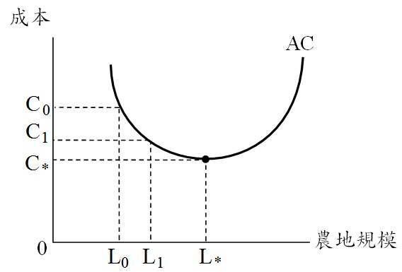

## 221. 信託成立之要件
*發布日期: 2024-01-09* 

## 內文
茲假設一案例：大地主甲為避免地價稅累進，爰與乙、丙、丁簽訂不動產信託契約，將名下部分土地信託給他們，以達到分散財產目的，並約定乙、丙、丁僅有掛名，至於該土地之使用收益、管理、處分之運用決定權仍屬於甲，試問此信託是否有效？

• (一) 稱信託者，謂委託人將財產權移轉或為其他處分，使受託人依信託本旨，為受益人之利益或為特定之目的，管理或處分信託財產之關係。

• (二) 關於信託關係之成立，除須有信託財產之移轉或其他處分外，尚須受託人因此取得信託財產之管理或處分權限；倘若，受託人對於信託財產並無管理或處分之權限而屬於消極信託者，因消極信託之受託人僅為信託財產之形式所有人，則不符合信託法第1條所規定之要件，即非屬我國信託法上所稱之信託。（法務部法律字第0980054764號）

• (三) 本題甲與乙、丙、丁之不動產信託契約，非屬委託人甲就信託財產之管理方式對於受託人乙、丙、丁之指示，而係實質上保留委託人甲對於信託財產之運用決定權，因此，該契約不符信託法所定「信託」之本質與信託財產之成立要件，而不生信託之效力。

資料來源：信託法概要，2023，曾榮耀編撰
---
*注：本文圖片存放於 ./images/ 目錄下*

## 222. 各種地價之釐清
*發布日期: 2024-01-02* 

## 內文
各位同學2024年新年愉快，本週專欄就各種「地價」觀念予以釐清：

1. 區段地價：為該範圍內買賣交易實例的平均價格，作為評定公告地價與公告土地現值之依據。

2. 公告地價：政府參考區段地價，每2年於1月1日公布的個別土地地價（大約市價1～3成），其目的是供所有權人申報地價用。

3. 公告土地現值：政府參考區段地價，每年1月1日公布的個別土地地價（接近市價，約7～9成），其目的是供所有權人於移轉時，申報移轉現值用。

4. 申報地價：土地所有權人參考政府的公告地價，於80%至120%的範圍內以自己土地條件申報，並於申報後會被納入地價稅及總歸戶冊，送給稅捐稽徵機關課地價稅用。

5. 申報移轉現值：土地所有權人進行土地移轉時，參考公告土地現值，以該現值為基準進行申報，做為稅捐機關課徵土地增值稅的依據。

6. 徵收補償市價：被徵收之土地，應按照徵收當期之市價補償其地價。在都市計畫區內之公共設施保留地，應按毗鄰非公共設施保留地之平均市價補償其地價。該市價是由直轄市、縣（市）主管機關提交地價評議委員會評定之價格，作為徵收補償用。

7. 市場正常交易價格：指市場實際成交價格，亦即由買賣雙方基於自由意思，合意決定之價格，為實價登錄申報及房地合一稅之依據。
---
*注：本文圖片存放於 ./images/ 目錄下*

## 223. 農工爭地
*發布日期: 2023-12-28* 

## 內文
• 一、農工爭地之意義

發展工業需要工業用地，生產糧食需要農業用地。但台灣之土地資源畢竟有限，如何妥善規劃用地需求，以維持工業發展與農業生產之均衡。

• 二、考慮外部性之用地需求

如圖(一)所示，台灣土地如果全部用於農業生產，農業產量X0；如果全部用於工業生產，工業產量Y0。設農業平均價格P0，工業平均價格[圖片1]，則等收益線[圖片2]。生產可能曲線X0Y0弧線與等收益線[圖片3]之相切，切點R，決定農業產量X1，工業產量Y1。

[圖片4]

圖(一) 農業產量與工業產量之最適組合

• (一) 考慮農業生產外部利益：農業之多功能性，農業生產具有外部利益，因此對農業之評價由P0上升為P1。如圖(二)所示，等收益線由[圖片5]移至[圖片6]。將[圖片7]平行外移至[圖片8]，且與生產可能曲線相切，切點S。此時，農業產量由X1增加至X2，工業產量由Y1減少至Y2。總之，考慮農業之外部利益，增加農業用地，以增加農業產量；減少工業用地，以減少工業產量。

[圖片9]

圖(二) 考慮農業外部利益之產量變化

• (二) 考慮工業生產之外部成本：工業造成環境污染，工業生產具有外部成本，因此對工業之評價由[圖片10]下降為[圖片11]。如圖(三)所示，等收益線由[圖片12]移至[圖片13]。將[圖片14]平行內移至[圖片15]，且與生產可能曲線相切，切點T。此時，農業產量由X1增加至X3，工業產量由Y1減少至Y3。總之，考慮工業之外部成本，增加農業用地，以增加農業產量；減少工業用地，以減少工業產量。

[圖片16]

圖(三) 考慮工業外部成本之產量變化

## 文章圖片

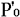

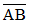

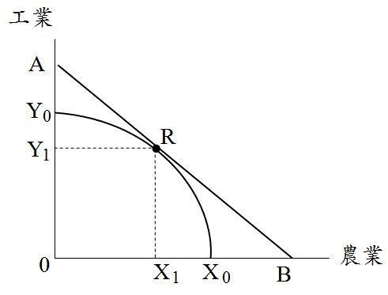

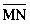

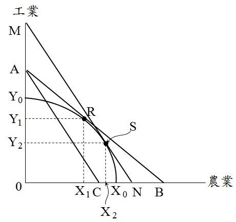

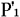

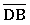

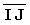

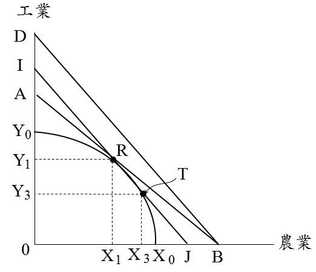

## 224. 違章建築之信託
*發布日期: 2023-12-26* 

## 內文
各位同學好

最近很夯的議題：違章建築可否信託（包含公益信託）？

新聞：違建物可否信託？ 法務部官員：信託不以登記不動產為限 可辦理信託 - 社會 - 自由時報電子報 (ltn.com.tw)

答案(通說)

可以，信託財產不以經登記的不動產為限，未經保存登記的不動產或違章建築物既均得為交易之標的並取得其處分權，自亦得為信託財產，由原取得人或取得處分權的人與受託人成立信託關係。

理由

1. 可以作為私有財產權標的之物，即可作為信託財產，未經保存登記的不動產成違章建築物，仍可以作為私有財產權標的之物，因此即可作為信託財產。

2. 但由於違章建築無法辦理建物所有權第一次登記而無法對外公示，不能對抗非明知或可得而知的善意第三人。換言之，未公示的信託財產（違章建築、未辦保存登記之建物）仍可主張信託財產獨立性，只是不能排除善意取得的適用。

參考資料：謝哲勝，2012，信託財產的獨立性－最高法院 92 年度台上字第 1594 號民事判決評釋，法令月刊，第63卷，第7期，第35-41 頁。
---
*注：本文圖片存放於 ./images/ 目錄下*

## 225. 地價與土地集約度之關係
*發布日期: 2023-12-21* 

## 內文
土地集約度分為經濟集約度與法定集約度二種。前者指土地在無容積管制下，獲致最大利潤之集約度；後者指土地在容積管制下之集約度。

• (一) 地價影響經濟集約度：地價愈高，吾人將以勞資代替土地，因而土地集約度（指經濟集約度）提高。如圖(一)所示，有一塊土地，M代表等產量曲線（即使用土地及勞資二種生產要素可以興建一定樓地板面積）。

1. 當地價為P0時，等成本線為[圖片1] 。M與[圖片2]之切點R，決定土地投入量a0，勞資投入量b0，土地集約度為（b0/a0） ，此時興建透天厝產品。

2. 當地價上漲為P1時，等成本線由[圖片3]移至[圖片4] 。將[圖片5]平行外移至[圖片6]，且切在等產量曲線上，切點S，決定土地投入量a1，勞資投入量b1，土地集約度提高為（b1/a1），此時興建公寓產品。

[圖片7]

圖(一) 地價影響經濟集約度

3. 當地價再上漲為P2時，等成本線由[圖片8]移至[圖片9]。將[圖片10]平行外移至[圖片11]，且切在等產量曲線上，切點T，決定土地投入量a2，勞資投入量b2，土地集約度再提高為 ，此時興建高樓大廈產品。

綜上，地價不斷上漲，土地集約度（指經濟集約度）隨之提高。因此，地價會影響經濟集約度，但經濟集約度不會影響地價。此外，從一個都市發展歷程而言，起先興建透天厝，接著興建公寓，最後興建高樓大廈。

• (二) 法定集約度影響地價：政府以建蔽率、容積率等手段，限制土地集約度，以確保良好生活環境。如圖(二)所示，[圖片12]代表建築投資之邊際產值曲線，[圖片13]代表建築投資之邊際要素成本曲線（不包含土地成本）。由[圖片14]與[圖片15]之交點E，決定勞資投入量a0，此即經濟集約度，此時地價為△AEC（地價之決定同不動產估價技術規則第70條規定）。

1. 當法定集約度為a1（即勞資投入量限制在a1以下）時，經濟集約度a0大於法定集約度a1，土地利用以法定集約度a1為準。此時地價下跌至□AFGC。

2. 當法定集約度為a2（即勞資投入量限制在a2以下）時，經濟集約度a0小於法定集約度a2，土地利用以經濟集約度a0為準。此時地價仍為△AEC，不受影響。

[圖片16]

圖(二) 法定集約度影響地價

綜上，當經濟集約度大於法定集約度時，法定集約度會影響地價，但地價不會影響法定集約度。當經濟集約度小於法定集約度時，法定集約度不會影響地價。

一般而言，都市繁榮地區經濟集約度大於法定集約度，土地利用以法定集約度為準，此時容積率用完；鄉村偏遠地區，經濟集約度小於法定集約度，土地利用以經濟集約度為準，此時容積率未用完。

## 文章圖片

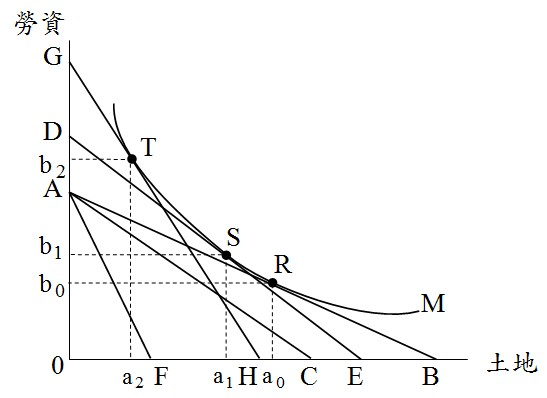

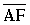

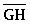

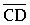

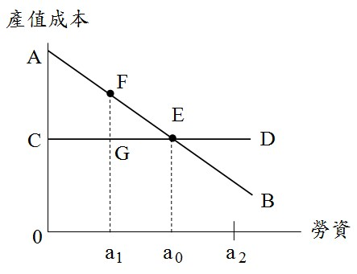

## 226. 地價稅計算範例_房地持分
*發布日期: 2023-12-19* 

## 內文
曾大於A縣有2筆土地，皆符合自用住宅用地條件並提出申請，如下表所示，請問其今年度地價稅應納金額為多少？(A縣累進起點地價為500萬元)

• T. ABLE_PLACEHOLDER_1

【解】（以下申報地價皆以萬元計算）

合於都市土地面積未超過三公畝、非都市土地面積未超過七公畝部分之自用住宅用地，其地價稅按千分之二計徵。

• (一) 適用自用住宅優惠稅率部分

1. 稅基 (1)土地持分與房屋持分之適用 A.土地持分＜房屋持分→土地持分面積皆可核准自用住宅優惠。 B.土地持分＝房屋持分→土地持分面積皆可核准自用住宅優惠。 C.土地持分＞房屋持分→僅能以房屋持分比例核准自用住宅優惠。 (2)33地號土地持有之1/3皆可適用優惠稅率 申報地價總額＝300×1/3×3＝300(萬元)。 (3)55地號土地僅1/2得適用適用優惠稅率 申報地價總額＝700×1/2×5＝1,750(萬元)。

2. 稅率 合於規定之自用住宅用地，其地價稅按千分之二計徵。

3. 稅額 地價稅＝(300+1,750)×2‰＝4.1(萬元)。

• (二) 適用一般稅率部分（55地號土地剩餘1/2）

1. 稅基 申報地價總額＝700×1/2×5＝1,750(萬元)。

2. 稅率 (1,750-500)÷500＝2.5(倍)。 (1)未超過累進起點地價，地價稅按基本稅率10‰徵收。 (2)超過累進起點地價未達五倍者，就其超過部分課徵15‰。

3. 稅額 地價稅＝500×10‰+1,250×15‰＝23.75(萬元)。 （速算：1,750×15‰－500×0.005＝23.75(萬元)）

• (三) 合計地價稅額

4. 1+23.75＝27.85。曾大今年度A縣地價稅應納金額為27.85萬元。
---
*注：本文圖片存放於 ./images/ 目錄下*

## 227. 土地利用三階段與地盡其利
*發布日期: 2023-12-14* 

## 內文
地盡其利為土地利用之目標。地盡其利之涵義，相當於不動產估價技術規則第2條第17款規定之「最有效使用」定義，指客觀上具有良好意識及通常之使用能力者，在合法、實質可能、正當合理、財務可行前提下，所作得以獲致最高利益之使用（估技§2）。

茲分析地盡其利之構成條件：

• (一) 符合法規使用：土地利用須符合法規規定，包括地政法規、都市計畫法規、建築法規、環保法規等。另，國土計畫、區域計畫、都市計畫等土地使用計畫及管制，亦屬於法規內涵。

• (二) 正當合理使用：土地利用不得低度使用、過度使用及錯誤使用。又，勞資與土地須配合適當，勞資投入量應落在土地利用三階段之第二階段。

• (三) 財務可行使用：土地開發利用之財務規劃須健全，如土地投資之淨現值為正、預期報酬率大於必要報酬率、財務槓桿為正槓桿等。

• (四) 獲利最高使用：在符合法規、正當合理及財務可行之使用前提下，獲得最高利益之使用。亦即，生產用地在追求最大利潤之使用、消費用地在追求最大效用之使用。

如圖所示，在一塊土地上，不斷投入勞力資本，VAP代表平均產值曲線（Value of Average Product Curve），VMP代表邊際產值曲線（Value of Marginal Product Curve），MFC代表邊際要素成本曲線（Marginal Factor Cost Curve）。當勞資投入量從0至b為土地利用第一階段，此階段之勞資投入量過少，表示土地低度使用。當勞資投入量從b至c為土地利用第二階段，此階段之勞資與土地配合適當，表示土地正當合理使用或土地有效使用。當勞資投入量從c以後為土地利用第三階段，此階段之勞資投入量過多，表示土地過度使用。由此可知，土地使用應落在第二階段。

土地於有效使用中，進而追求最有效使用。亦即，就第二階段的勞資投入量b與c之間，找尋最有效使用的一點。如圖所示，依邊際產值等於邊際要素成本原則，決定勞資投入量為d，此點為最有效使用。

[圖片1]

## 文章圖片

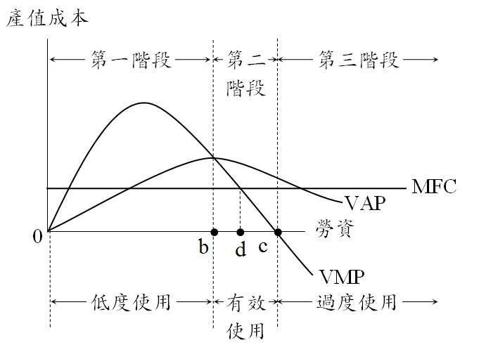

## 228. 於自己土地搬磚擋鄰地出入口之糾紛案：權利濫用禁止之適用
*發布日期: 2023-12-12* 

## 內文
這幾天有個新聞，請先看下列影片

地主搬磚佔地無法可管?! 挨轟「土地蟑螂」

茲整理部份重點如下：

案例事實

莊某於民國103年10月2日因拍賣而移轉登記取得系爭土地所有權。詎伍某於所有同小段之建號建物前方設置系爭鐵門（且無證據證明該鐵門係合法設置），無權占用系爭土地面積2.93平方公尺。莊某爰依民法第767條第1項前段、中段規定，求為命伍某應拆除系爭鐵門並返還所占用土地之判決。並且可從實地照片看到，莊某已搬了磚頭擋在該進出鐵門前。

就其中伍某一理由，係認為故意將系爭土地圍起有礙於進出居住安全，且惡意買受系爭土地再訴請拆屋還地，顯屬違反民法第148條之權利濫用禁止規定。請問有無理由？

判決理由

按權利之行使，不得以違反公共利益，或以損害他人為主要目的，民法第一百四十八條第一項固有明文，惟此所謂權利之行使不得以損害他人為目的者，係指行使權利專以損害他人為主要目的之情形而言。若為自己利益而行使，縱於他人利益不無損害，然既非損害他人為主要目的，而該他人對之又或有容忍或作為義務時，即不得謂有本條之適用。至權利之行使是否以損害他人為主要目的，則應以權利人因權利行使所能取得之利益，與他人及國家社會因其權利行使所受之損失比較衡量以定之。

因此，伍某無權占有系爭Ａ部分土地設置鐵門，自屬妨害莊某對於該部分土地之正常使用，則莊某基於系爭土地所有權人地位，行使民法第767條第1項之權利，顯非以損害伍某為主要目的，自與權利濫用無涉；縱於承買系爭土地前，已知悉系爭土地遭占用，亦不能據此限制其行使法所賦予之正當權利，是伍某之主張為無理由。
---
*注：本文圖片存放於 ./images/ 目錄下*

## 229. 土地利用問題
*發布日期: 2023-12-07* 

## 內文
土地利用問題有三，一為土地低度利用，二為土地過度利用，三為土地不當利用。

• (一) 土地低度利用：指土地閒置不利用，或雖從事利用但未充分利用。如平均地權條例第3條第7款所稱空地及同法第26條之1所稱荒地，即是。

• (二) 土地過度利用：指土地利用超過土地之容受力，亦即土地利用超過土地之承載力。如宜林地作農牧使用、地價低廉地區興建高樓大廈等是。

• (三) 土地不當利用：即土地錯誤使用，指土地未按土地使用計畫所編定之用途使用。如農業區違規興建廠房、環境敏感地區從事土地開發等是。

如圖所示，AP代表平均產量曲線（Average Product Curve），MP代表邊際產量曲線（Marginal Product Curve）。在一塊土地上，不斷投入勞力資本，其邊際產量起初呈遞增現象，增加至某一點（即a點）以後，反呈遞減現象。此即報酬遞減法則、邊際報酬遞減法則、土地收穫遞減法則或土地法則。另，土地利用三階段，第一階段（勞資投入量從0至b）表示勞資投入量過少，產生土地低度利用問題，第二階段（勞資投入量從b至c）表示勞資與土地配合適當，屬於土地正當合理利用。第三階段（勞資投入量從c以後）表示勞資投入量過多，產生土地過度利用問題。總之，土地利用應落在第二階段。

[圖片1]

## 文章圖片

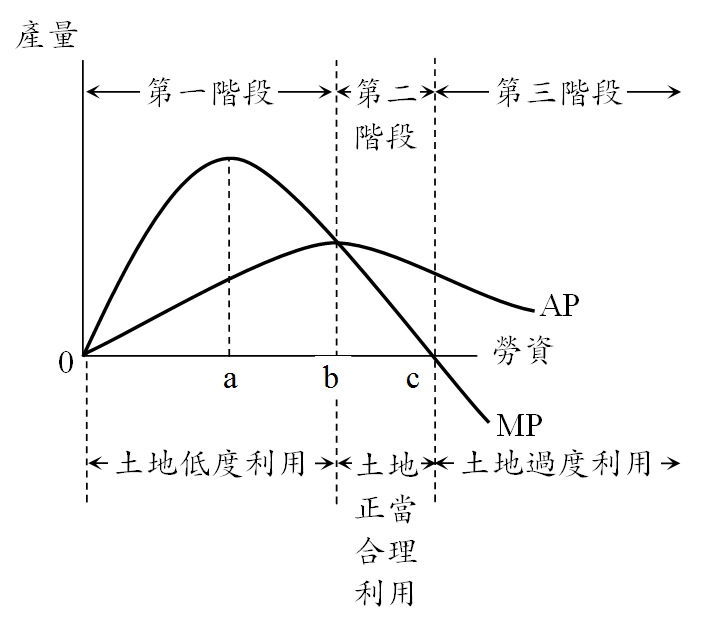

## 230. 信託受益權之拋棄與讓與
*發布日期: 2023-12-05* 

## 內文
各位同學好

今日專欄討論有關信託受益權之拋棄與讓與

模擬案例

阿強與銀行簽訂信託契約，指定其暗戀對象小美為受益人，並給予其信託利益10年，請問是否需先徵得小美同意？又小美知情後，因對阿強毫無感覺，不想受有利益形成心理負擔，試問其得否將該受益權拋棄？又或者將該受益權轉讓給好友阿珠？

• 一、適用法條

信託法第17條（信託利益之請求權與拋棄權）、第20條（受益權之讓與）。

• 二、解題關鍵

• (一) 受益人因信託之成立而享有信託利益。但信託行為另有訂定者，從其所定。其中，該信託利益為請求權性質，並自信託成立後自然發生，當然享有信託利益，而不需另為享受利益之意思表示。換言之，信託行為之成立無庸受益人之同意。

• (二) 受益人得拋棄其享有信託利益之權利。

• (三) 信託受益權屬於一種財產權利，原則上允許受益人自由轉讓或繼承。例外則不得轉讓，包含信託契約明文禁止轉讓、受益權屬法律禁止轉讓之權利（如養老年金信託）、信託利益不可分等。此外，讓與應符合民法第294條至第299條有關債之移轉相關規定。

• (四) 受益權讓與等同於變更了受益人，而受讓人即取得其他受益人依法所具有之權利（如享受信託利益、同意變更信託財產管理方法、聲請撤銷受託人處分等），但同時也承擔受益人應盡之義務（如給付報酬、補償受託人處理信託所為支出或損害等）。

• 三、結論

• (一) 阿強與銀行成立信託關係，不需要所指定受益人小美之同意。

• (二) 小美如不願受有信託利益，得自由拋棄其享有信託利益之權利。

• (三) 倘若阿強與銀行之信託契約並無特約禁止或限制小美將受益權轉讓，則小美得將該受益權轉讓給好友阿珠，但應依民法規定通知受託人，否則對於受託人不生效力。亦即在未通知下，銀行仍會將原受益人小美視為信託受益人，向其分配信託利益。

資料來源：曾榮耀，2023，信託法概要。
---
*注：本文圖片存放於 ./images/ 目錄下*

## 231. 何以發生通貨膨脹，不動產價格反而下跌
*發布日期: 2023-11-30* 

## 內文
一般咸認通貨膨脹造成貨幣貶值，民眾遂將手中貨幣換成實體財產，以對抗通貨膨脹，因而不動產需求增加，不動產價格上漲，然，我國最近發生通貨膨脹，何以不動產價格未上漲，反而有下跌跡象。

不動產價格上漲或下跌，是由很多因素交互衝擊的結果，而非僅「通貨膨脹」單一因素。造成我國最近不動產價格疲軟之因素如下：

• (一) 全球經濟不景氣：疫情、戰爭、天災等造成全球經濟不景氣，尤其中國斷崖式經濟崩盤，影響我國甚鉅。

• (二) 利率上漲：中央銀行因應通貨膨脹，不斷升息。利率上漲，購屋貸款成本增加，不動產需求減少。

• (三) 政府打房：最近，政府採取打擊炒房措施，如禁止紅單轉售、禁止預售屋轉售、限制私法人購買住宅、重罰炒房行為等，致不動產投機性需求縮手。

總之，通貨膨脹造成不動產價格上漲，應明確敘述為「其他因素不變下，通貨膨脹造成不動產價格上漲」，始為真。
---
*注：本文圖片存放於 ./images/ 目錄下*

## 232. 地價稅計算範例_自住與非自住混合
*發布日期: 2023-11-28* 

## 內文
甲於A縣有一筆自用住宅用地，土地面積200平方公尺，申報地價每平方公尺5萬元，而其上為2層樓之房屋，一樓面積100平方公尺並作營業使用，二樓則為50平方公尺作自住使用，試問甲於申請自用住宅用地優惠後，其地價稅應為多少？（A縣累進起點地價為300萬元）

擬答

（以下申報地價皆以萬元計算）

根據「適用自用住宅用地稅率課徵地價稅認定原則」，房屋為樓房(含地下室)，不論是否分層編訂門牌或分層登記，准按各層房屋實際使用情形所占土地面積比例認定之。

• (一) 可適用自用住宅用地優惠稅率部分

1. 稅基 (1)自住面積＝土地面積×自住部分所占面積比例 ＝土地面積×[2樓房屋面積÷(1樓+2樓房屋面積)] ＝200×[50÷(100+50)] ＝66.67(平方公尺) (2)申報地價總額＝66.67×5＝333.33(萬元)。

2. 稅率 自用住宅用地優惠稅率為千分之二。

3. 稅額 地價稅＝333.33×2‰＝0.67(萬元)。

• (二) 適用一般稅率部分

1. 稅基 (1)一般用地面積＝土地面積－自住面積 ＝200－66.67 ＝133.33(平方公尺) (2)申報地價總額＝133.33×5＝666.67(萬元)。

2. 稅率 (666.67－300)÷300＝1.22(倍)。 (1)未超過累進起點地價，地價稅按基本稅率10‰徵收。 (2)超過累進起點地價未達五倍者，就其超過部分課徵15‰。

3. 稅額 地價稅＝300×10‰+366.67×15‰＝8.50(萬元)。 （速算：666.67×15‰－300×0.005＝8.50(萬元)）

• (三) 甲應繳地價稅額

0. 67+8.50＝9.17(萬元)
---
*注：本文圖片存放於 ./images/ 目錄下*

## 233. 生態足跡與碳足跡
*發布日期: 2023-11-23* 

## 內文
• (一) 生態足跡：指生產吾人所需之資源及消化吾人所產生之廢物，所需要的土地數量。簡言之，生態足跡在衡量每一個人所需使用土地面積。如果吾人生活愈簡約，所需土地面積愈少，生態足跡愈豐富，則對環境及生態之傷害愈小。

• (二) 碳足跡：指產品由原料取得、製造、配送銷售、使用及廢棄處理等生命週期各階段產生之碳排放量，經換算為二氧化碳當量之總和（氣候變遷因應法第3條第18款）。未來，世界各國因應氣候變遷，對於碳足跡過高的產品將限制其販賣、輸入或輸出。

• (三) 綜上，雖然生態足跡與碳足跡之意涵不同，惟二者追求目標一致，即節能減碳，保護地球環境，確保國家永續發展。
---
*注：本文圖片存放於 ./images/ 目錄下*

## 234. 登記錯誤之損害賠償：高爾夫球場土地重複登錄賠償案（112國字第8號判決）
*發布日期: 2023-11-21* 

## 內文
今天專欄主要彙整有關登記錯誤及土地法第68條損害賠償之實務案例

首先，請先參考以下新聞：

高球場土地 搞烏龍登錯 竹北地政重複登錄 判賠134萬 - 社會 - 自由時報電子報 (ltn.com.tw)（2023/11/17）

此新聞案例係引自民國112年11月10日臺灣新竹地方法院112年度國字第8號判決，茲整理重點如下：

• 一、案例事實

甲公司為經營高爾夫球場，於91年1月以每平方公尺1,100元，向財政部國有財產署購買共13筆土地，並於91年3月完成所有權移轉登記。嗣教育部體育署為調查國內各高爾夫球場相關資訊，發現甲使用面積與原核定面積不符。惟經縣府審查發現陳稱829地號土地於80年辦理第一次登記，因釘圖錯誤於84年重複登錄834地號土地；836地號土地亦於80年辦理第一次登記，因釘圖錯誤於84年重複登錄844地號土地等情，亦即834地號土地位置與829地號土地部分重疊而重複登錄；844地號土地位置與836地號土地部分重疊而重複登錄（即同一塊土地被登簿兩次＝新聞所說的「一地兩簿」），故地政事務所決定截止登載834及844地號土地，並於111年7月撤銷之。而後甲公司遂向該地所提起損害賠償訴訟。

• 二、判決理由

按因登記錯誤遺漏或虛偽致受損害者，由該地政機關負損害賠償責任，但該地政機關證明其原因應歸責於受害人時，不在此限，土地法第68條第1項定有明文。其立法意旨，在貫徹土地登記之公示性及公信力，兼顧交易安全及權利人之權利保障，該條所稱之受害人，自不以得終局保有登記權利之人為限；如土地權利人或登記名義人因地政機關就土地登記之錯誤、遺漏或虛偽致受損害時，除非該地政機關能證明其原因應歸責於受害人，否則即應負損害賠償責任，僅賠償之範圍以同條第2項規定為限而已（最高法院102年度台上字第1108號、106年度台上字第199號、108年度台上字第2494號判決意旨參照）。又土地登記規則第13條規定：「土地法第68條第1項及第69條所稱登記錯誤，係指登記事項與登記原因證明文件所載之內容不符者；所稱遺漏，係指應登記事項而漏未登記者」，乃屬例示規定，非以此為限，凡登記之事項與真實不符者俱屬之。即應解為如登記錯誤、遺漏或虛偽係因不可歸責於受害人之事由所致者，地政機關均須負損害賠償責任。苟解為僅具該條所定情事者，地政機關始負損害賠償責任，將限縮土地法第68條第1項之適用範圍，而有危害交易安全及損害權利人權利之虞，難謂與該條之立法精神無違（最高法院91年度台上字第1172號判決意旨參照）。次按因登記錯誤遺漏或虛偽致受損害者，除非該地政機關能證明其原因應歸責於受害人，否則即應負損害賠償責任，不以登記人員有故意或過失為要件，此亦經最高法院110年度台上大字第3017號裁定明揭斯旨。

此外，按土地法第68條第1、2項之規定，係就職司土地登記事務之公務員不法侵害人民權利，由該機關負損害賠償責任之規定，屬國家賠償之特別規定，故人民因不動產登記錯誤遺漏或虛偽致受損害，而請求地政機關賠償時，該地政機關應為負賠償責任及其賠償範圍，即應依該條規定，不適用國家賠償法第2條規定（最高法院98年度台上字第1977號、100年度台上字第1727號、1769號判決意旨參照）。換言之，土地法第68條之規定，係國家賠償法之特別法，依國家賠償法第6條之規定，自應優先適用之。查本件既已該當土地法第68條第1項所稱「登記錯誤」之情事，就甲公司所受損害，自應由地政機關負賠償責任。

經查，834、844地號土地辦理第一次登記後，地政事務所實際上未再就829地號、836地號土地，核算因分割後而減少之面積，並就剩餘面積再行辦理更正登記。834、844地號與829、836地號土地之部分地籍重疊，而看似分割自829地號、836地號土地之情形，此乃係因829地號、836地號土地為第一次登記後，未在地籍圖上釘正，致84年間誤將829地號、836地號之部分土地另劃設出來並進行重複登錄，堪認地政事務所就834、844地號土地所辦理之第一次登記，自始即為錯誤登記，而該當於土地法第68條第1項所規定「登記錯誤」之情事。

基此，地政事務所既執掌其轄區內土地地籍登記之業務，就土地辦理第一次登記時，本應審慎查核所登記土地在地籍圖上之位置、範圍、是否已為有地籍登記等事項，竟疏未注意及此，於829地號、836地號土地分別於80年、84年間辦理第一次登記後，就上開早已經辦理登記之土地部分範圍重複再為834、844地號土地之第一次登記，致出現登記錯誤之情形，使甲公司因信賴上開土地登記之結果，誤以為本不應存在之834、844地號土地係確實存在，而向國有財產署買受，嗣後卻遭地政事務所以釘圖錯誤為由撤銷登記，至受有土地登記權利喪失之損害，並無可歸責事由，地政事務所自應依土地法第68條之規定對甲公司所受損害負賠償之責。

按土地法第68條第1項之損害賠償，不得超過受損害時之價值，亦為土地法第68條第2項所明定。依上開規定，甲公司得請求地政事務所之損害賠償範圍，應以834、844地號土地辦理撤銷登記時之價值為限，是審酌該兩筆土地於111年間之公告地價均為每平方公尺1,500元，而甲公司主張以其購買834、844地號土地時之價格即每平方公尺1,100元計算其因登記權利喪失所受之損害，並未逾越該等土地辦理撤銷時之價值，應屬合理。從而，甲公司依上開規定，請求地政事務所賠償1,344,200元【計算式：1,100元×（834地號土地面積1,056平方公尺＋844地號土地面積166平方公尺）＝1,344,200元】，自屬有據，應予准許。

• 三、本案例重點

• (一) 登記錯誤之類型與定義。

• (二) 因登記不實受有損害之類型。

• (三) 土地法登記不實之損害賠償為無過失責任，且優先於國賠法適用。

• (四) 錯誤登記予以撤銷。

• (五) 賠償以損害時之價值為限。
---
*注：本文圖片存放於 ./images/ 目錄下*

## 235. 依土地法第34條之1第1項設定地上權或典權後再出賣土地之優先購買權
*發布日期: 2023-11-16* 

## 內文
部分共有人依土地法第34條之1第1項規定設定地上權或典權後，再依土地法第34條之1第1項規定出賣土地，他共有人有土地法第34條之1之優先購買權（土地法第三十四條之一執行要點第12點第4項）。析言之：

• (一) 部分共有人依土地法第34條之1第1項規定設定地上權或典權，他共有人無優先承受權。但，部分共有人依土地法第34條之1第1項規定出賣土地，他共有人有優先承受權。

• (二) 上開優先購買權之行使，如與土地法第104條或民法第919條之優先購買權競合時，因土地法第104條及民法第919條之優先購買權具有物權效力，土地法第34條之1之優先購買權僅具債權效力，因此土地法第104條及民法第919條之優先購買權優先行使。

茲舉二例說明：

• (一) 甲、乙、丙三人共有一筆土地，應有部分均等。甲、乙二人同意設定地上權於丁，丙表示反對，於是甲、乙二人依土地法第34條之1第1項多數決設定地上權於丁。嗣，甲、乙二人同意出賣該土地於戊，丙表示反對，於是甲、乙二人又依土地法第34條之1第1項多數決出賣於戊。

1. 如丁在該土地上無房屋建築存在，則丁無土地法第104條之優先購買權。另，丙有土地法第34條之1之優先購買權。因此，優先購買權由丙行使。

2. 如丁在該土地上有房屋建築存在，則丁有土地法第104條之優先購買權。另，丙有土地法第34條之1之優先購買權。二者競合時，前者優先於後者而行使。因此，優先購買權由丁先行使。

• (二) 甲、乙、丙三人共有一筆土地，應有部分均等。甲、乙二人同意設定典權於丁，丙表示反對，於是甲、乙二人依土地法第34條之1第1項多數決設定典權於丁。嗣，甲、乙二人同意出賣該土地於戊，丙表示反對，於是甲、乙二人又依土地法第34條之1第1項多數決出賣於戊。

1. 如丁在該土地上無房屋建築存在，則丁雖無土地法第104條之優先購買權，但有民法第919條之優先購買權。另，丙有土地法第34條之1之優先購買權。二者競合時，前者優先於後者而行使。因此，優先購買權由丁先行使。

2. 如丁在該土地上有房屋建築存在，則丁有土地法第104條之優先購買權及民法第919條之優先購買權。另，丙有土地法第34條之1之優先購買權。二者競合時，前者優先於後者而行使。因此，優先購買權由丁先行使。
---
*注：本文圖片存放於 ./images/ 目錄下*

## 236. 重測錯誤之損害賠償：台北中山醫院賠償案（111年度重國字第17號）
*發布日期: 2023-11-14* 

## 內文
同學，我們台中才剛上到的測量錯誤是否得依土地法第68條要求賠償最新案例～

首先，可以參考以下兩則新聞

北市「貴族醫院」土地面積少算8.47坪 大安地政事務所要國賠1558萬元 | 法律前線 | 社會 | 聯合新聞網 (udn.com)

幫「貴族醫院」登記土地少算8.47坪 大安地政事務所一審國賠1558萬 (yahoo.com)

案例事實

1. 臺北市某A地為原中山醫院合夥人所有，渠等同意將A地之應有部分移轉予中山醫療社團法人（以下簡稱中山醫院）續為醫療使用。中山醫院資本額為529,634,602元，所有A地之應有部分為274/285，登記面積則為1,371平方公尺。

2. 詎大安地政事務所（以下簡稱大安地政）於110年10月18日逕行辦理面積更正，更正後A地登記面積為1,343平方公尺，較原登記面積短少28平方公尺，降低中山醫院之實定資本額及必要財產之市場公允評價（即資本額將低於529,634,602元），因而受有損害。

3. 其中，更正登記原因係大安地政辦理逾期未辦繼承登記土地圖、簿面積不符清理計畫時，察覺A地登記面積與計算面積相較，超出法定容許誤差，經查明後，主要因於66年間辦理地籍圖重測時面積計算錯誤所致，屬於因原測量錯誤純係技術引起者，依地籍測量實施規則第232條規定，辦理更正登記。

4. 綜上，因A地登記面積減少28平方公尺，以當期公告土地現值計算損害賠償數額，大安地政應賠償15,586,274元，中山醫療社團法人爰依土地法第68條第1項提起訴訟。

判決理由整理

• (一) A地登記面積由1,371平方公尺更正為1,343平方公尺，係大安地政所屬公務員登記錯誤所致，中山醫院因而受有損害：

1. 登記機關對於登記不實負無過失賠償責任 因登記錯誤遺漏或虛偽致受損害者，由該地政機關負損害賠償責任。但該地政機關證明其原因應歸責於受害人時，不在此限，土地法第68條第1項定有明文。次按因登記錯誤遺漏或虛偽致受損害者，除非該地政機關能證明其原因應歸責於受害人，否則即應負損害賠償責任，不以登記人員有故意或過失為要件。土地法第68條第1項前段規定，乃以貫徹土地登記之公示性及公信力，並保護權利人之權利與維持交易安全為規範目的。該規定文義既未明示以登記人員之故意或過失為要件，原則上自應由地政機關就登記不實之結果，負無過失之賠償責任（最高法院110年度台上字第3017號判決意旨參照）。（這就是我們上課特別提到的無過失賠償責任！）

2. 除非可歸責於受害人方可免賠 A地登記面積錯誤，係因大安地政於66年間辦理地籍圖重測時面積計算結果有誤所致，大安地政復未舉證證明上開登記面積短少之原因係可歸責於中山醫院，揆諸上開法條及裁判說明，自應負賠償之責。

3. 依法辦理面積更正登記並未免其賠償責任 大安地政於比對建物測量成果圖之平面圖發現面積有誤時，固得依地籍測量實施規則第232條之規定逕行辦理更正，亦不因此解免其因土地法第68條第1項前段規定所應負之賠償責任。

4. 登記簿所載面積涉及不動產價值攸關民眾權益 按土地登記有絕對效力，影響人民財產權甚鉅，登記簿所載之面積，常為人民賴以確定土地價值之重要依據，且因人民通常欠缺精確估測不動產實際面積之能力，悉以登記簿之記載為估算價值之依據，不動產登記簿所載面積如有錯誤，即有導致土地價值之錯估，致權益受損害情形，由此足見土地所有權人於其土地登記面積縮減時，即會蒙受土地財產權減損（即交易價值減損）之不利影響

• (二) 中山醫院得請求大安地政賠償之金額為15,586,274元：

按土地法第68條第2項規定因登記錯誤所生之損害賠償，不得超過受損害時之價值，所謂受損害時之價值，指受損害時之市價而言（最高法院85年台上字第406號判決意旨參照）。因此，中山醫院受有損害，且損害係發生於登記面積更正時，依土地法第68條第2項規定，應以A地於該日之價值計算減少28平方公尺土地面積之損害。

最後，回到我們上課討論到有關測量錯誤是否係屬土地法第68條登記錯誤之範圍，可從「文義」、「目的」、「體系」等作為補充，認為測量錯誤得依土地法請求賠償。
---
*注：本文圖片存放於 ./images/ 目錄下*

## 237. 依土地法第34條之1為讓與，共有人不得為受讓人
*發布日期: 2023-11-09* 

## 內文
依土地法第三十四條之一執行要點第3點第2項規定：「前項有償讓與之處分行為，共有人除依本法條規定優先購買外，不得為受讓人。」詳言之，依土地法第34條之1第1項有償讓與之處分行為，除依土地法第34條之1第4項優先購買外，無論同意共有人或不同意共有人，皆不得為受讓人。茲以買賣為例，說明如下：

• (一) 同意共有人不得為受讓人：土地法第34條之1第1項規定，乃同意共有人代理不同意共有人將共有不動産出售，如受讓人為同意共有人之一人或數人，違反民法第106條禁止自己代理之規定，因此同意共有人不得為受讓人。如甲、乙、丙、丁、戊五人共有一筆土地，應有部分均等，甲、乙、丙三人同意將該土地出售於甲，則甲、乙、丙三人不得依土地法第34條之1第1項多數決出售該土地於甲。

• (二) 不同意共有人不得為受讓人：土地法第34條之1第1項規定，乃同意共有人代理不同意共有人將共有不動產出售，如受讓人為不同意共有人之一人或數人，雖未違反民法第106條禁止自己代理之規定，然受讓人以外之其他不同意共有人無優先購買權，缺乏制衡機制，恐侵害受讓人以外之其他不同意共有人之權益。因此，土地法第三十四條之一執行要點第3點第2項明文規定，共有人（包括不同意共有人）不得為受讓人。如甲、乙、丙、丁、戊五人共有一筆土地，應有部分均等，甲、乙、丙三人同意將該土地出售於丁，則甲、乙、丙三人不得依土地法第34條之1第1項多數決出售該土地於丁。

上開規定僅限於有償讓與之處分行為，至於設定用益物權行為（包括地上權、農育權、不動產役權及典權）之規範如下：

• (一) 不得設定用益物權於同意共有人：土地法第34條之1第1項規定，乃同意共有人代理不同意共有人將共有不動産設定用益物權，如承受人為同意共有人之一人或數人，違反民法第106條禁止自己代理之規定，因此不得設定用益物權於同意共有人。如甲、乙、丙、丁、戊五人共有一筆土地，應有部分均等，甲、乙、丙三人同意將該土地設定地上權於甲，則甲、乙、丙三人不得依土地法第34條之1第1項多數決設定地上權於甲。

• (二) 得設定用益物權於不同意共有人：土地法第34條之1第1項規定，乃同意共有人代理不同意共有人將共有不動產設定用益物權，如承受人為不同意共有人之一人或數人，未違反民法第106條禁止自己代理之規定。然，承受人以外之其他不同意共有人無優先承受權，缺乏制衡機制，恐侵害承受人以外之其他不同意共有人之權益。但，土地法第三十四條之一執行要點第3點第2項僅適用於有償讓與之處分行為，不包括設定用益物權行為。因此，設定用益物權於不同意共有人，法無明文禁止。如甲、乙、丙、丁、戊五人共有一筆土地，應有部分均等，甲、乙、丙三人同意將該土地設定地上權於丁，則甲、乙、丙三人得依土地法34條之1第1項多數決設定地上權於丁。
---
*注：本文圖片存放於 ./images/ 目錄下*

## 238. 房地合一稅有關放寬連續繼承之持有期間認定：台財稅字第11204619060號
*發布日期: 2023-11-07* 

## 內文
各位同學好

有關房地合一稅有最新的財政部函釋，針對以往連續繼承之持有期間認定爭議部分，有所放寬，屬於重要觀念，茲說明如下：

請先對照我們之前講過的一期專欄，就有提到這個爭議，後來經法院判決認定只能加計前一次不可以累計：

連續多次繼承之房地合一稅課徵認定：臺中高等行政法院110訴字第161號判決,曾榮耀老師,許文昌/曾榮耀不動產全制霸專欄,高點來勝不動產 (get.com.tw)

然而，此次函釋等同放寬可不斷加計到第一次繼承前之被繼承人持有期間。

函釋內容：

• 一、個人交易105年1月1日以後繼承或受遺贈取得之房屋、土地（以下簡稱房地），依所得稅法第14條之4第4項規定，計算同條第3項各款持有期間及同法第4條之5第1項第1款第1目及第2目期間時，如屬連續繼承或受遺贈取得之房地，得將連續各次繼承或受遺贈之被繼承人或遺贈人持有期間合併計算。但經稽徵機關查明有藉法律形式規避或減少納稅義務之安排或情事者，不適用之。

• 二、前點所稱連續繼承或受遺贈取得之房地，指該房地連續發生2次以上（含當次）繼承或受遺贈而移轉所有權之情形。

• 三、第1點個人計算所得稅法第4條之5第1項第1款第1目及第2目期間時，得併計之期間，以同點規定各次被繼承人、遺贈人或其配偶、未成年子女已於該房屋辦竣戶籍登記並居住，且無出租、供營業或執行業務使用之期間為限。

舉例：

[圖片1]

由於甲繼承後未出售，而後直接再次由乙繼承（連續繼承） 乙繼承取得至出售之持有期間＝111～113年＝2年 得合併計算乙之被繼承人甲之持有期間＝107～111年＝4年 得再合併計算甲之被繼承人父之持有期間＝105～107年＝2年

以上合併計算共計8年，適用稅率為20%。

另外，要適用自住房、地優惠的話，則這幾段需都符合規定之設戶籍、無出租營業等條件，可合併計算時間。

參考資料：財政部，112年11月2日，台財稅字第11204619060號，https://gazette2.nat.gov.tw/EG_FileManager/eguploadpub/eg029207/ch04/type2/gov30/num7/Eg.htm

## 文章圖片

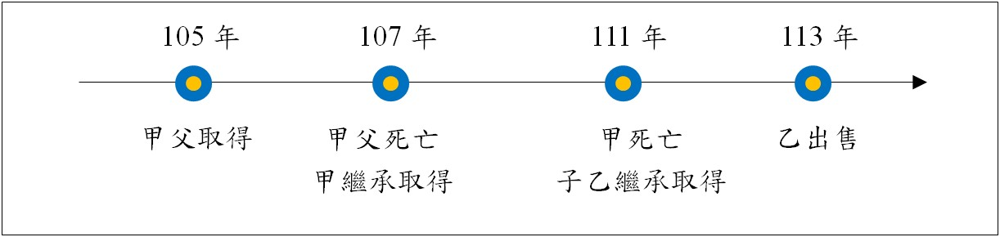

## 239. 因應氣候變遷之溫室氣體減量
*發布日期: 2023-11-02* 

## 內文
• (一) 減量目標：

1. 國家溫室氣體長期減量目標為中華民國139年（西元2050年）溫氣氣體淨零排放（氣§4I，「氣」代表氣候變遷因應法，以下同）。所稱溫室氣體，指二氧化碳（CO2）、甲烷（CH4）、氧化亞氮（N2O）、氫氟碳化物（HFCS）、全氟碳化物（PFCS）、六氟化硫（SF6）、三氟化氮（NF3）及其他經中央主管機關公告者（氣§3①）。

2. 淨零排放，指溫室氣體排放量與碳匯量達成平衡（氣§3⑩）。所稱排放量，指自排放源排出之各種溫室氣體量乘以各該物質溫暖化潛勢所得之合計量，以二氣化碳當量表示（氣§3⑦）。所稱碳匯，指將二氣化碳或其他溫室氣體自排放源或大氣中持續移除後，吸收或儲存之樹木、森林、土壤、海洋、地層、設施或場所（氣§3⑨）。

• (二) 減量方法：

我國促進減碳方法有二，一為徵收碳費，另一為碳權交易。

1. 徵收碳費：中央主管機關為達成國家溫室氣體長期減量目標及各期階段管制目標，得分階段對下列排放溫室氣體之排放源徵收碳費： (1)直接排放源：依其排放量，向排放源之所有人徵收；其所有人非使用人或管理人者，向實際使用人或管理人徵收。 (2)間接排放源：依其使用電力間接排放之排放量，向排放源之所有人徵收；其所有人非使用人或管理人者，向實際使用人或管理人徵收（氣§28I）。

此外，碳費徵收對象因轉換低碳燃料、採行負排放技術（指將二氧化碳或其他溫室氣體自排放源或大氣中以自然碳循環或人為方式移除、吸收或儲存之機制（氣§3⑧））、提升能源效率、使用再生能源或製程改善等溫室氣體減量措施，能有效減少溫室氣體排放量並達中央主管機關指定目標者，得提出自主減量計畫向中央主管機關申請核定優惠費率（氣§29I）。

2. 碳權交易：碳權，指二氧化碳排放之權利。由碳權需求與碳權供給，決定碳權價格（此即碳定價）。如圖所示，碳權需求曲線D與碳權供給曲線S，決定碳權價格P0，碳權交易量Q0。 (1)碳權需求：事業因排碳量超過配額，則須在碳權交易市場購買碳權。如年碳排放量達2.5萬噸的工廠，其碳排增量須於碳權交易市場購買碳權，以進行抵換。 (2)碳權供給：事業如有多餘碳權配額，可以在碳權交易市場出售碳權。又，事業執行植樹造林、使用再生能源、移除溫室氣體等而取得碳權，亦得在碳權交易市場出售碳權，以獲取利益。

台灣碳權交易所於民國112年8月7日於高雄成立，「碳排有價」時代終於來臨。

[圖片1]

## 文章圖片

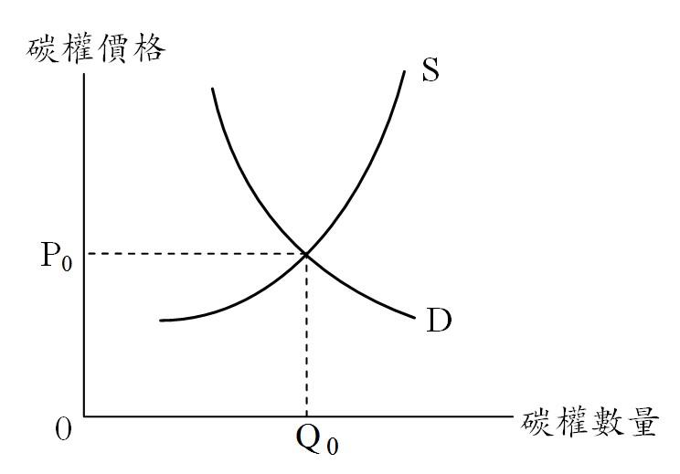

## 240. 土地登記公信力之要件(一)：合法有效之法律行為
*發布日期: 2023-10-31* 

## 內文
• 一、相關條文

土地法第43條：「依本法所為之登記，有絕對效力。」

民法第759條之1第2項：「因信賴不動產登記之善意第三人，已依法律行為為物權變動之登記者，其變動之效力，不因原登記物權之不實而受影響。」

• 二、案例說明

甲所有之A地經公告徵收作為B市公共交通道路用地，並已完成徵收補償程序，惟B市因故未辦理所有權移轉登記。後續甲卻將A地移轉給善意第三人乙，並辦竣所有權移轉登記。後經B市發現，故訴請塗銷乙之所有權，請問有無理由？

• 三、判決要旨

民法第759條之1第2項及土地法第43條所規定不動產物權登記之公信力及信賴保護之適用，除須係信賴登記之善意第三人，並有移轉不動產所有權之合致意思，及發生物權變動登記之物權行為外，必以依合法有效之法律行為而取得者，始得當之。

若法律行為之標的係不融通物，因違反民法第 71 條禁止規定，致整個法律行為成為絕對無效者，即不生善意取得而受信賴保護之問題。於此情形，因信賴不動產登記之善意第三人，縱已依法律行為為物權變動之登記，亦無該規定之適用。

因此，A地經B市徵收，其補償費已依法發給完竣，B市於登記前即原始取得系爭土地之所有權（依民法第759條），並已開闢為公共交通道路，屬不融通物，甲與乙間就A地買賣之債權行為及移轉登記之物權行為，違反土地法第14條第1項第5款不得為私有之禁止規定，均屬無效，乙未依合法有效之法律行為取得系爭土地所有權，不受土地法第43條及民法第759條之1規定之保護。

參考判決：最高法院109年度台上字第2061號民事判決、臺灣高等法院111年度重上更一字第52號民事判決
---
*注：本文圖片存放於 ./images/ 目錄下*

## 241. 房價上漲，應歸因於土地，抑或建物
*發布日期: 2023-10-26* 

## 內文
房價上漲之歸因有二說，一說為土地貢獻說，另一說為聯合貢獻說。茲分析如下：

• (一) 土地貢獻說：此說認為土地不會折舊，反而會增值；建物不會增值，反而會折舊。因此，房價上漲是土地因素造成，而非建物因素造成。換言之，房價上漲應歸屬於土地貢獻，而非建物貢獻。

• (二) 聯合貢獻說：此說認為土地與建物皆為原料，兩者結合而為房屋（產品）。因此，房價上漲即產品價格上漲，是土地與建物二者聯合造成。換言之，房價上漲應按土地價值比率及建物價值比率分別歸屬於土地與建物二者之聯合貢獻。

綜上，筆者贊成聯合貢獻說。但建物已不具備使用價值，應採土地貢獻說。
---
*注：本文圖片存放於 ./images/ 目錄下*

## 242. 預售屋履約擔保機制
*發布日期: 2023-10-24* 

## 內文
各位同學好

在前一陣子爛尾樓風波下，不動產經紀人考試要特別注意，有關預售屋的履約擔保機制。

首先，依照消費者保護法第17條規定，中央主管機關為預防消費糾紛，保護消費者權益，促進定型化契約之公平化，得選擇特定行業，擬訂其定型化契約應記載或不得記載事項，報請行政院核定後公告之。其中，應記載事項，依契約之性質及目的，其內容得包括「預付型交易之履約擔保」。

而根據「預售屋買賣定型化契約應記載及不得記載事項」，履約擔保機制如下：

• (一) 不動產開發信託

由建商或起造人將建案土地及興建資金信託予某金融機構或經政府許可之信託業者執行履約管理。興建資金應依工程進度專款專用。

換言之，指建商將自有資金、貸款資金與預售收入信託，並由信託業者按進度撥款。然而，實務上有將款項花太多在同建案之廣告銷售上，以致於未掌控好時，會造成後期工程款不足而形成爛尾情形。此外，由於建商是將建案土地向銀行設定抵押貸款放入專戶，因而其受償順位會優先於預售屋的消費者，當後續爛尾時，亦有債權人順位問題，消費者可能拿不回所付款項。

• (二) 價金返還之保證

本預售屋由某金融機構負責承作價金返還保證。價金返還之保證費用由賣方負擔。

換言之，此方式是將消費者的預售款項都存進專戶，必須等到確定交屋才會撥款給建商，因而建商如爛尾倒閉，則款項將由金融機構全部返還給消費者，屬於對消費者最有保障之機制。惟實務較少採用。

• (三) 價金信託

本預售屋將價金交付信託，由某金融機構負責承作，設立專款專用帳戶，並由受託機構於信託存續期間，按信託契約約定辦理工程款交付、繳納各項稅費等資金控管事宜。

其中，信託之受益人為賣方(即建方或合建雙方)而非買方，受託人係受託為賣方而非爲買方管理信託財產。但賣方未依約定完工或交屋者，受益權歸屬於買方。

換言之，此機制是將預售款項信託，並於工程實際開始後方按工程進度動撥，亦即動用範圍較不動產開發信託限縮，有關工程款交付、繳納各項稅費及工程所需費用外，不得供作其他用途，故不包括管銷費用，而較不會有不動產開發信託花費過多於廣告銷售上之問題。然而，仍然會發生消費者所繳價金，於工程初期即動用支出所剩不多，後續如建商倒閉，消費者能拿回來的錢相對有限。

• (四) 同業連帶擔保

本公司與依公司章程規定得對外保證之某公司(同業同級公司)等相互連帶擔保，賣方未依約定完工或交屋者，買方可持本契約向上列公司請求完成本建案後交屋。上列公司不得為任何異議，亦不得要求任何費用或補償。

• (五) 公會辦理連帶保證協定

本預售屋已加入由全國或各縣市不動產開發商業同業公會辦理之連帶保證協定，賣方未依約定完工或交屋者，買方可持本契約向加入本協定之某公司請求共同完成本建案後交屋。加入本協定之某公司不得為任何異議，亦不得要求任何費用或補償。
---
*注：本文圖片存放於 ./images/ 目錄下*

## 243. 建物是否會增值
*發布日期: 2023-10-19* 

## 內文
傳統觀念認為，土地只會增值，不會折舊；建物只會折舊，不會增值。因此，建物是否會增值，值得探討。筆者認為，建物會發生增值現象。其理由如下：

• (一) 建物如從物理觀點，確實只會折舊。但如從經濟觀點，就有可能會增值。如果建物之使用效益（使用價值）提高，建物價格因而上漲，建物就發生增值現象。

• (二) 建物無法單獨增值，建物必須結合土地而為房屋（指建物及其基地），始有增值的可能。房屋在市場供需運作下，如果房價上漲，將房價上漲部分分別歸屬於土地及建物，而造成建物增值。

總之，建物增值係從經濟觀點考量，並且在房與地結合下，始有發生建物增值之可能。
---
*注：本文圖片存放於 ./images/ 目錄下*

## 244. 耕地租佃(用)v.s.農業用地租賃
*發布日期: 2023-10-17* 

## 內文
各位同學好

因近日有同學問到有關耕地之法規適用問題，茲說明如下

有關「耕地出租」，於89年1月28日「農業發展條例」施行生效後，已排除過往耕地三七五減租條例之適用，也排除部分土地法、民法、平均地權條例之規定，回歸耕地出租一般租賃關係（稱為「農業用地租賃」），強調私法自治、契約自由，以促進農業經營發展。

89年後農業發展條例之農業用地租賃規定：

1. 租期、租金及支付方式自由訂定

2. 租期逾一年未訂立書面，不會變成不定期

3. 定期租賃於期限屆滿時當然消滅，不會轉換成不定期

4. 得約定期限屆滿前提前終止，但應提前通知

5. 不定期限租約可，並得隨時終止，但應提前通知

6. 收回耕地，出租人不需依法補償承租人

因此，看到有關農地出租的題目，要優先判斷其簽約日期是在89年1月28日前或後，所適用法規將有所不同！

相關規定：

• (一) 租賃契約適用

1. 本條例中華民國89年1月4日修正施行後所訂立之農業用地租賃契約，應依本條例之規定，不適用耕地三七五減租條例之規定。本條例未規定者，適用土地法、民法及其他有關法律之規定。

2. 本條例中華民國89年1月4日修正施行前已依耕地三七五減租條例，或已依土地法及其他法律之規定訂定租約者，除出租人及承租人另有約定者外，其權利義務關係、租約之續約、修正及終止，悉依該法律之規定。

3. 本條例中華民國89年1月4日修正施行前所訂立之委託經營書面契約，不適用耕地三七五減租條例之規定；在契約存續期間，其權利義務關係，依其約定；未約定之部分，適用本條例之規定。(農發§20)

• (二) 租賃之租期、租金及支付方式

1. 本條例中華民國89年1月4日修正施行後所訂立之農業用地租賃契約之租期、租金及支付方式，由出租人與承租人約定之，不受土§110、112之限制。租期逾一年未訂立書面契約者，不適用民§422之規定。

• T. ABLE_PLACEHOLDER_1

2. 前項農業用地租賃約定有期限者，其租賃關係於期限屆滿時消滅，不適用民法§451及土§109、§114之規定；當事人另有約定於期限屆滿前得終止租約者，租賃關係於終止時消滅，其終止應於六個月前通知他方當事人；約定期限未達六個月者，應於十五日前通知。

• T. ABLE_PLACEHOLDER_2

3. 農業用地租賃未定期限者，雙方得隨時終止租約。但應於六個月前通知對方。(農發§21)

• (三) 租賃關係終止之處理

本條例中華民國89年1月4日修正施行後所訂立之農業用地租賃契約，其租賃關係終止，由出租人收回其農業用地時，不適用平§11、§63、§77、農重§29有關由出租人給付承租人補償金之規定。(農發§22)

• T. ABLE_PLACEHOLDER_3
---
*注：本文圖片存放於 ./images/ 目錄下*

## 245. 漲價完全歸公之影響
*發布日期: 2023-10-12* 

## 內文
孫中山先生之平均地權理想，主張漲價完全歸公（即漲價全部歸公）。然，漲價完全歸公對於不動產市場造成下列不利影響：

• (一) 市場完全閉鎖：漲價完全歸公，賣方出售土地無利可圖，因此土地供給大幅減少。漲價完全歸公，買方購買土地無利可圖，因此土地需求大幅減少。如圖所示，土地需求曲線D與土地供給曲線S之交點，決定市場地價P0及土地交易量Q0。今，實施漲價完全歸公，一方面土地需求減少，土地需求曲線由D左下移至D’；另一方面，土地供給減少，土地供給曲線由S左上移至S’。新的土地需求曲線D’與新的土地供給曲線S’在第一象限無交點，土地交易量為零，土地市場完全閉鎖。

[圖片1]

• (二) 租稅完全閉鎖：市場完全閉鎖，導致租稅完全閉鎖，土地增值稅之稅收為零。

• (三) 市場有行無市：如圖所示，D’與S’在第一象限無交點，土地市場有行無市。有行無市，指市場上有開價，但因開價過高，而無成交數量。

• (四) 價格機能失效：市場地價是指導土地利用之指標。當市場地價隱晦不明，恐造成土地過度利用或低度利用，而無法地盡其利。

綜上，漲價應大部歸公，而非完全歸公。

## 文章圖片

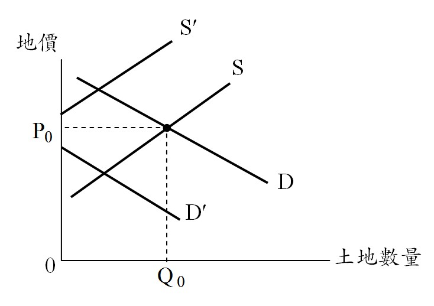

## 246. 土地法第34條之1執行要點修正重點(七)：共有土地多數決之登記駁回情形
*發布日期: 2023-10-10* 

## 內文
此次土地法第34-1執行要點新增第14點：「部分共有人依本法條規定處分、變更或設定他項權利，除土地登記規則第97條第3項所定情形外，於收件後至登記完畢前，他共有人以書面提出異議，主張下列情形者，登記機關應依同規則第57條第1項第3款（私權爭執）規定予以駁回：(一)數宗土地或建物併同出賣，部分共有人未記明各宗土地或建物價金，致他共有人無從就其共有之土地或建物行使優先購買權。但有第十二點第二項但書情形者，不在此限。(二)就其應得對價、補償及買賣條件等私權事項有爭執，並附具已向法院起訴文件。(三)就書面通知不符第八點第二款至第四款規定有爭執。(四)其他損害其權益之情形，並附具已向法院起訴文件。」

茲整理共有土地多數決涉及私權爭執而駁回之原因如下：

1.

於登記完畢前，優先購買權人以書面提出異議並能證明確於期限內表示願以同樣條件優先購買或出賣人未依通知或公告之條件出賣者，登記機關應駁回其登記之申請。(土登97第3項)

藉此保障優先購買權之主張。

2.

數宗土地或建物併同出賣，部分共有人未記明各宗土地或建物價金，致他共有人無從就其共有之土地或建物行使優先購買權。但有第十二點第二項但書情形者，不在此限。(執行要點14第1款)

按照新修訂的執行要點規定，部分共有人將數宗土地或建物併同出賣，應分別記明各宗土地或建物價金，以供他共有人考量是否就其共有之土地或建物優先購買。倘其未於通知或公告內記明各宗土地或建物價金致他共有人無從就其共有之土地或建物行使優先購買權時，經他共有人提出異議，因是否記明價金非登記機關審查範疇，故除部分共有人能提出下列規定之文件外，登記機關應予駁回。

• (1) 部分共有人表示使用上具不可分性並經法院判決確定或提出依法與法院確定判決有同一效力之證明文件。

• (2) 依法令規定應併同移轉。

3.

就其應得對價、補償及買賣條件等私權事項有爭執，並附具已向法院起訴文件。(執行要點14第2款)

共有人間對於對價補償、買賣條件、抵押權處理、價金償付方法及期限等情形之爭執 ，如已向法院起訴者，屬民事法院審查範疇，登記機關不應再予處理，故予駁回。

4.

就書面通知不符第八點第二款至第四款規定有爭執。(執行要點14第3款)

因他共有人依修正規定以書面通知之處所，係由部分共有人自行查明，當事人間如有爭執，尚非登記機關可審認事項，故予駁回。

5.

其他損害其權益之情形，並附具已向法院起訴文件。(執行要點14第4款)

由他共有人自行主張並檢附已向法院起訴文件。
---
*注：本文圖片存放於 ./images/ 目錄下*

## 247. 土地稅之政策功能
*發布日期: 2023-10-05* 

## 內文
土地稅，指地價稅及土地增值稅。課徵土地稅之功能（或目的、作用）如下：

• (一) 財政功能－豐盈國庫：地價稅與土地增值稅皆屬地方稅，因此課徵土地稅可以增加地方財政收入，使地方政府有餘力從事地方公共建設。 地方公共建設增加，不動產價格上漲，土地稅收因而增加，再以土地稅收投入地方公共建設，形成善的循環，並達成「取之於地方，用之於地方」之地方自治。

• (二) 經濟功能－地盡其利：地價稅具有持有成本效果及固定成本效果，可以促進土地利用。土地增值稅可以去除不勞而獲之投機誘因，使土地回歸正當合理利用。

• (三) 社會功能－地利共享：地價稅課取土地之天然利益歸公，土地增值稅課取土地之社會利益歸公。天然利益與社會利益皆屬土地所有人之不勞利得，因此收歸公有，供全體國民共享。
---
*注：本文圖片存放於 ./images/ 目錄下*

## 248. 土地法第34條之1執行要點修正重點(六)：多數決設定地上權並出賣，他共有人仍得優先購買
*發布日期: 2023-10-03* 

## 內文
根據新修正的執行要點第12點：「部分共有人依本法條第一項規定設定地上權或典權後出賣土地，他共有人仍有第一項優先購買權之適用。」

主要考量多數決之立法意旨並非以損害少數共有人權益為目的，如先依本法條規定辦理土地之地上權或典權設定，部分共有人(多數人)再依本法條第一項規定出售該共有土地時，考量該地上權人或典權人已取得之權利仍存在於該土地上，尚不因土地所有權人之不同而受影響，仍應通知他共有人(少數人)是否願意優先購買。

換言之，雖然地上權人、典權人有土地法第104條之基地優先購買權，但並不妨礙少數共有人主張執行要點第12點的共有不動產優先購買權，只是如兩者都主張，仍以土地法第104條為物權效力而優先。甚至如果多數決出賣對象為該地上權人、典權人，則因其自為買受人而無法主張優先購買，此時反而會被少數共有人行使優先購買而取得。

另執行要點第4點新增其註記規定：「依本法條第一項設定之地上權或典權，應於土地登記簿其他登記事項欄註記『本地上權或典權係依土地法第三十四條之一規定設定』。 前項註記，於辦理地上權讓與或典權轉典時，應予轉載。」以避免辦理相關登記時忽略該少數人之優先購買權。
---
*注：本文圖片存放於 ./images/ 目錄下*

## 249. 土地法第34條之1執行要點修正重點(五)：共有不動產不得多數決交換所有權
*發布日期: 2023-09-26* 

## 內文
土地法第34條之1執行要點第3點第1項：「本法條第一項所定處分，以有償讓與為限，不包括信託行為、交換所有權及共有物分割；所定變更，以有償或不影響他共有人之利益為限；所定設定地上權、農育權、不動產役權或典權，以有償為限。」

此次修正重點，即是將多數決處分的範圍，除必須為有償處分，並明確排除信託、共有物分割外，增列交換所有權亦不得採多數決方式進行。

此次修正前其實內政部109年已有相關函釋，指出共有不動產不得透過多數決與其他不動產進行交換所有權，這次只是將其條文化。其理由為：

1. 多數共有人代理少數共有人約定以土地或建物所有權相互交換，其交換位置及條件等決定難謂合理。

2. 本法條於交換未設有優先購買權之衡平機制，未能符合財產權保障之要求。

3. 於交換所有權移轉登記後，該共有關係仍維持於相互移轉後所取得之共有不動產標的上，亦與本法條係為解決共有不動產糾紛之目的未合。
---
*注：本文圖片存放於 ./images/ 目錄下*

## 250. 不動產移轉稅之課徵效果
*發布日期: 2023-09-21* 

## 內文
不動產移轉稅主要是土地增值稅及房地合一所得稅。土地增值稅課徵之標的為土地，房地合一所得稅課徵之標的為土地及房屋。二者皆是不動產資本利得稅。

課徵不動產移轉稅之效果如下：

• (一) 租稅轉嫁效果：不動產移轉稅係針對出售不動產而獲利之一方（即賣方）課徵。然，當不動產景氣時，常呈現賣方市場。因此，賣方提高售價而將部分稅負轉嫁予買方。

• (二) 市場閉鎖效果：課徵土地增值稅及房地合一所得稅，使賣方獲利減少，而減少供給；又，使買方獲利減少，而減少需求，最後造成土地交易量減少（即市場閉鎖現象）。另，市場閉鎖會導致租稅閉鎖（即稅收減少）。

• (三) 抑制投機效果：土地增值稅及房地合一所得稅皆在課取房地所有人手中之不勞而獲，去除投機者之投機誘因，減少房地投機。
---
*注：本文圖片存放於 ./images/ 目錄下*

## 251. 土地法第34條之1執行要點修正重點(四)：應有部分出賣之切結
*發布日期: 2023-09-19* 

## 內文
根據土地法第34條之1第4項規定：「共有人出賣其應有部分時，他共有人得以同一價格共同或單獨優先承購。」另按土地登記規則第97條第1項規定：「申請土地權利移轉登記時，依民法物權編施行法第八條之五第三項、第五項、土地法第三十四條之一第四項、農地重劃條例第五條第二款、第三款或文化資產保存法第三十二條規定之優先購買權人已放棄優先購買權者，應附具出賣人之切結書，或於登記申請書適當欄記明優先購買權人確已放棄其優先購買權，如有不實，出賣人願負法律責任字樣。」

亦即應有部分出賣涉及他共有人優先購買權時，於辦理所有權移轉登記時，原須由出賣之共有人以下列兩種方式確認其優先購買權之放棄情形：

1. 另附一份切結書

2. 直接於土地登記申請書之備註欄切結

然而，為使出賣人確實知悉其應通知他共有人主張優先購買權之義務，並避免其未盡通知義務作出不實切結，致優先購買權人權益受損等情，爰於土地法第34條之1執行要點第13點增訂第11款：「優先購買權人已放棄或視為放棄優先購買權者，出賣人應依土地登記規則第九十七條第一項規定附具切結書之規定辦理，切結書內容應包括通知方式、優先購買權人主張情形並由出賣人記明「如有不實願負法律責任」，不適用同條項於登記申請書適當欄記明之方式。」

因此，此次修正係將原本土地登記規則第二種直接於申請書切結方式予以排除，以後僅能以另附切結書方式，並明確其切結內容。嗣後如有爭執，可作為優先購買權人事後救濟舉證用。至於其通知內容、送達情形雖屬當事人間內部關係，惟申請登記如有委託專業代理人時，該專業代理人應本於相關規定及業務上應盡之義務，告知當事人相關權益義務。
---
*注：本文圖片存放於 ./images/ 目錄下*

## 252. 不動產持有稅之課徵效果
*發布日期: 2023-09-14* 

## 內文
不動產持有稅主要是地價稅及房屋稅。我國現行採土地與建物分開課徵持有稅。地價稅之課徵標的為土地，房屋稅之課徵標的為建物。

課徵不動產持有稅之效果如下：

• (一) 稅的資本化效果：課徵地價稅及房屋稅，經過稅的資本化效果，促使不動產價格下跌。

• (二) 持有成本效果：持有稅將加重不動產所有人之持有成本，促使閒置不動產釋出，加入土地市場。

• (三) 固定成本或變動成本效果：

1. 地價稅有固定成本效果：對土地課稅會發生固定成本效果。土地開發業者增加建物樓地板面積之興建，可以稀釋每建坪之地價稅負擔，因而提高土地集約度。

2. 房屋稅有變動成本效果：對資本課稅會發生變動成本效果。土地開發業者增加建物樓地板面積之興建，其每建坪之房屋稅反而愈高。因此，房屋稅會阻礙資本累積及妨礙土地利用。

基上，就促進土地利用而言，地價稅應從重，房屋稅應從輕。
---
*注：本文圖片存放於 ./images/ 目錄下*

## 253. 土地法第34條之1執行要點修正重點(三)：多數決書面通知、公告之新規定
*發布日期: 2023-09-12* 

## 內文
此次土地法第34條之1執行要點修正內容最多部分，即是第八點的多數決通知、公告之相關規定，茲就此次修法重要內容說明如下：

• (一) 通知方式

原已規定方式為雙掛號之通知書或郵局存證信函，但此次針對送達地址或處所應有更詳細規範，爰增定對於他共有人應就戶籍地址為送達，而法人或非法人團體則就其事務所或營業所為送達。

• (二) 通知處所

1. 原則（以實際住居所為通知並記明） 為避免部分共有人明知他共有人實際住所，卻僅向戶籍地址通知，進而以公告方式代替通知，致損害他共有人權益，故部分共有人有下列情形，仍應查明其實際住居所、事務所實際住居所、事務所或營業所： (1)他共有人之戶籍地址無法送達 (2)有戶籍法第五十條戶籍暫遷至戶政事務所情形 (3)部分共有人已確知他共有人未居住於戶籍地而能依實際住居所送達者 並由部分共有人於登記申請書適當欄記明「他共有人受通知之處所確係實際住居所，如有不實願負法律責任。」。（可用切結書替代）

2. 例外（無法知悉並記明） 無法知悉他共有人實際住居所者，部分共有人應於登記申請書適當欄記明「義務人確不知悉他共有人實際住居所，如有不實願負法律責任。」。（可用切結書替代）

• (三) 公告代替通知之情形

以下列情形為限：

1. 他共有人住所不明或依前述規定通知無法送達。

2. 他共有人戶籍資料載有遷出國外或喪失國籍之記事，部分共有人就除戶地址通知無法送達且已依前款規定辦理（即查明實際住居所未果並記明）。

3. 他共有人於臺灣地區無戶籍，部分共有人就土地或建物登記簿地址通知無法送達且已依前款規定辦理（即查明實際住居所未果並記明）。

• (四) 公告代替通知生效時點

自布告之日（村、里辦公處）或登報最後登載日起，經二十日發生通知效力。

• (五) 通知、公告內容

1. 土地或建物標示

2. 處分、變更或設定方式

3. 價金分配

4. 償付方法及期限

5. 受通知人與通知人之姓名、名稱、住所、事務所或營業所（修法新增）

6. 其他事項

7. 數宗土地或建物併同出賣時，應另分別記明各宗土地或建物之價金分配（修法新增）

• (六) 通知對象

原則為他共有人(少數共有人)，惟他共有人已死亡者，應以其繼承人或遺產管理人為通知或公告之對象。由於遺產管理人為保存遺產必要之處置得主張優先購買權，爰增訂遺產管理人為通知或公告對象。
---
*注：本文圖片存放於 ./images/ 目錄下*

## 254. 公共設施效益資本化與稅的資本化
*發布日期: 2023-09-07* 

## 內文
政府在某特定地區興建公共設施（如道路、公園、運動場等），將使該地區地價上漲。因此，政府透過重新規定地價，提高土地所有權人地價稅負擔，增加財稅收入。政府再以此收入進行另一波公共設施建設，形成正向循環。

公共設施建設會提高土地價格，此即「公共設施效益資本化」之效果。課徵地價稅會降低土地價格，此即「稅的資本化」之效果。如果提高土地價格幅度等於降低土地價格幅度，將造成地價平穩。因此，公共設施效益資本化等於稅的資本化，將促使地價穩定發展。

公共設施效益資本化造成土地所有權人受益，稅的資本化造成土地所有權人受損。如果受益程度等於受損程度，符合受益者負擔精神。

關於「地價永以定」與「重新規定地價」之爭，筆者主張重新規定地價。其理由如下：

• (一) 重新規定地價可增加國庫收入，使政府有財力進行公共建設。

• (二) 重新規定地價可達成公共設施效益資本化等於稅的資本化，符合「使用者付費、受益者負擔」。

• (三) 重新規定地價可穩定地價發展，避免地價暴漲。

• (四) 重新規定地價可實現地方自治；取之地方，用之於地方。
---
*注：本文圖片存放於 ./images/ 目錄下*

## 255. 土地法第34條之1執行要點修正重點(二)： 多數決併同其他不動產出售，他共有人得僅就其共有部分優先購買
*發布日期: 2023-09-05* 

## 內文
此次修法，首先有關土地法第34條之1執行要點第12點第1項規範，「部分共有人依本法條第一項規定出賣共有土地或建物時，他共有人得以出賣之同一條件共同或單獨優先購買。」亦即多數共有人依據土地法第34條之1第1項多數決出賣整筆共有不動產時，少數不同意共有人得以「同樣條件」主張優先購買整筆共有不動產。

該優先購買需以「同樣條件」主張之要件，過去多有爭議，其中一種情況就是部分共有人依土地法第34條之1第1項規定出賣共有土地或建築改良物時，並以同一買賣契約合併出賣非屬他共有人共有之土地或建築改良物，則他共有人行使優先購買權時，究竟應依買賣契約之同樣條件就出賣標的全部承購？抑或得僅就其共有之標的承購？

為明確此情形之規範，此次土地法第34條之1執行要點第12點第2項修法規範：「於數宗土地或建物併同出賣，他共有人得僅就其共有之土地或建物行使優先購買權。但有下列情形之一者，不在此限：

• (一) 部分共有人表示使用上具不可分性並經法院判決確定或提出依法與法院確定判決有同一效力之證明文件。

• (二) 依法令規定應併同移轉。」

舉例而言，甲乙丙共有A地，甲乙以多數決方式將A地與另外3筆甲乙自己所有之土地，共4筆土地一併出賣給K。丙於多數決出售時有優先購買權已無爭議，但原則應以「同樣條件」主張而不得變更，因而以往常有爭議是否需一次購買除自己共有的A地以外之其他土地，也就是必須將4筆土地全部買下。然而，原本A地可能只要500萬，但加上其他4筆土地可能金額高達上億，產生侵害少數共有人優先購買權之疑慮，因而避免變相以比本法條更嚴苛的條件阻止他共有人行使優先購買權而增訂上述相關條文文字。確認以後丙得僅就其共有部分之不動產（A地）進行優先購買即可，除非有使用不可分+法院判決依據或依法應併同移轉有不宜拆分購買之情形。

因此，也於執行要點第八點針對多數決之書面通知內容加入此相關規定：「(六) 通知或公告之內容應記明土地或建物標示、處分、變更或設定 方式、價金分配、償付方法及期限、受通知人與通知人之姓名、名稱、住所、事務所或營業所及其他事項。數宗土地或建物併同出賣時，應另分別記明各宗土地或建物之價金分配。」

假設未記明各宗價金，則依據執行要點第十四點，於收件後至登記完畢前，他共有人以書面提出異議，主張數宗土地或建物併同出賣，部分共有人未記明各宗土地或建物價金，致他共有人無從就其共有之土地或建物行使優先購買權。登記機關應依土地登記規則第57條第1項第3款規定予以駁回。
---
*注：本文圖片存放於 ./images/ 目錄下*

## 256. 平均地權之實施現況
*發布日期: 2023-08-31* 

## 內文
我國土地政策依循孫中山先生平均地權思想。然，現行實施現況與其思想有何差異？ 茲以平均地權之四大辦法說明：

• (一) 規定地價：

1. 平均地權思想：由土地所有權人自行申報地價。倘報得太高，以照價徵稅予以制衡；倘報得太低，以照價收買予以制衡。 現行實施現況：採兩價（即公告地價與公告土地現值）並存制。公告地價之用途在課徵地價稅；由政府查估公告地價，再由土地所有權人於百分之二十範圍內申報地價。公告土地現值之用途在課徵土地增值稅；由政府查估公告土地現值，再由土地所有權人在不低於公告土地現值下申報移轉現值。

2. 平均地權思想：規定地價永以定（即地價永以為定）。規定地價部分，屬於私有財產，予以照價徵稅；規定地價以後之漲價部分，屬於公有財產，予以漲價歸公。 現行實施現況：規定地價後每二年重新規定地價一次（即地價不永以為定）。地方公共建設，造成地價上漲，透過重新規定地價，提高土地所有權人之地價稅負擔，以達成稅的資本化符合公共設施效益資本化。

• (二) 照價徵稅：

1. 平均地權思想：照價徵稅採重稅，以促進土地利用。 現行實施現況：照價徵稅以地價稅行之。地價稅採累進稅，以平均社會財富及抑制壟斷兼併。惟因公告地價偏低，導致申報地價（即稅基）偏低，呈現輕稅現象。

2. 平均地權思想：土地改良物採輕稅，甚至免稅，以促進資本累積。 現行實施現況：房屋稅除自住房屋予以優惠外，採重稅，以打擊囤房、炒房。

• (三) 照價收買：

1. 平均地權思想：照價收買為土地所有權人低報地價之制衡手段。另，照價收買為政府開發建設取得土地之方法。 現行實施現況：採土地徵收與照價收買並行。土地徵收為公共建設取得土地之手段，照價收買為制裁土地所有權人未善盡利用土地之手段。簡言之，土地徵收為積極性措施，照價收買為制裁性措施。

2. 平均地權思想：照價收買依土地所有權人申報地價收買。 現行實施現況：照價收買依申報地價、申報土地移轉現值或公告土地現值收買，視情形而定。另，土地徵收按市價徵收。

• (四) 漲價歸公：

1. 平均地權思想：漲價完全歸公，採實價計徵，稅率百分之百。 現行實施現況：漲價歸公以土地增值稅行之。漲價部分歸公，採申報移轉現值計徵，稅率20%、30%及40%之累進稅。

2. 平均地權思想：漲價歸公單一措施，僅對土地課徵資本利得稅，未對房屋課徵資本利得稅。 現行實施現況：採土地增值稅與房地合一所得稅並行。土地增值稅於移轉登記前課徵，房地合一所得稅於移轉登記後課徵。現制，對土地課徵資本利得稅，亦對房屋課徵資本利得稅。

綜上，孫中山先生平均地權思想，推展上仍有一些窒礙難行之處。因此須予以修正，並視情況隨時變通。總之，土地政策須與時俱進，切勿執著於一人思想。
---
*注：本文圖片存放於 ./images/ 目錄下*

## 257. 土地法第34條之1執行要點修正重點(一)：多數決有償讓與對象不得為共有人之一
*發布日期: 2023-08-29* 

## 內文
首先，土地法第34條之1第1項規定：「共有土地或建築改良物，其處分、變更及設定地上權、農育權、不動產役權或典權，應以共有人過半數及其應有部分合計過半數之同意行之。但其應有部分合計逾三分之二者，其人數不予計算。」此為共有不動產多數決之法源，而由於法條文字並未明確限制處分對象，故除處分給共有人以外的第三人，過去學說與實務有所爭論：究竟共有人是否得為多數決之受讓人？

按過往通說為多數決得處分給不同意共有人(少數人)，但不得處分給同意共有人(多數人) ，主要理由為可藉此保障少數人之利益。

惟，此次修法已將其明確化，按土地法第34條之1執行要點第三點第二項：「有償讓與之處分行為，共有人除依本法條規定優先購買外，不得為受讓人。」亦即多數決處分只能賣給第三人，至於共有人只能依同樣條件主張優先購買，而不能直接作為買受人。其理由整理如下：

1. 承買之共有人可能與同意出賣共有人密謀合議，並參與價格決定，聯合以較低價金出售給自己，有利害衝突顯失公平情形，進而侵害他共有人權益。

2. 該共有人之應有部分實際未為處分，乃竟得就未同意處分共有人之應有部分強制予以處分。

3. 按共有人互為買賣無優先購買權之意旨，如多數共有人將全部不動產多數決處分給共有人之一，亦屬互為買賣，將因而造成其他少數共有人無法行使優先承購權。
---
*注：本文圖片存放於 ./images/ 目錄下*

## 258. 市地重劃之公共設施用地負擔
*發布日期: 2023-08-24* 

## 內文
平均地權條例第60條第1項規定：「依本條例規定實施市地重劃時，重劃區內供公共使用之道路、溝渠、兒童遊樂場、鄰里公園、廣場、綠地、國民小學、國民中學、停車場、零售市場等十項用地，除以原公有道路、溝渠、河川及未登記地等四項土地抵充外，其不足土地及工程費用、重劃費用與貸款利息，由參加重劃土地所有權人按其土地受益比例共同負擔，並以重劃區內未建築土地折價抵付。如無未建築土地者，改以現金繳納。其經限期繳納而逾期不繳納者，得移送法院強制執行。」又，同法條第3項規定：「依第一項規定折價抵付共同負擔之土地，其合計面積以不超過各該重劃區總面積百分之四十五為限。但經重劃區內私有土地所有權人半數以上且其所有土地面積超過區內私有土地總面積半數之同意者，不在此限。」準此，重劃區土地所有權人負擔之公共設施用地，限於道路、溝渠、兒童遊樂場、鄰里公園、廣場、綠地、國民小學、國民中學、停車場、零售市場等十項，且折價抵付共同負擔之土地（包括公共設施用地及抵費地）其合計面積不得超過重劃區總面積之45%。

除上開要求之外，十項公共設施用地尚須符合重劃區土地所有權人所享用者，始為適法。換言之，此十種用地須為鄰里性或社區性，供重劃區土地所有權人享用者為限，以符合「使用者付費、受益者負擔」之立法意旨。倘此十種用地為區域性或全市性，主要是供重劃區以外之不特定公眾所享用，則不得由重劃區土地所有權人負擔。茲以廣場為例：

• (一) 廣場如屬於鄰里性或社區性廣場，由重劃區土地所有權人付費，符合受益者負擔精神。

• (二) 廣場如屬於區域性或全市性廣場，不得由重劃區土地所有權人付費。

總之，並非平均地權條例第60條第1項規定之十種公共設施用地，即可責由重劃區土地所有權人負擔。實務上，應詳查都市計畫（包括主要計畫書及細部計畫書）分辨其為鄰里性或社區性公共設施，抑或區域性或全市性公共設施，以判斷是否由重劃區土地所有權人負擔。

至於市地重劃實施辦法第24條規定：「重劃區內之區域性道路、下水道等公共設施，除其用地應由重劃區內土地所有權人按其土地受益比例共同負擔外，其工程費用得由政府視實際情況編列預算補助，或由政府視實際情況配合施工。」此一規定，逾越平均地權條例第60條第1項規定之意旨，依法律優越原則，應屬無效。

須特別強調的是，十項公共設施用地之提供及建設，如由跨重劃區之不特定公眾受益，亦連帶促使重劃區土地所有權人受益，則對重劃區土地所有權人而言，應採課徵工程受益費及土地增值稅處理，而非採平均地權條例第60條處理。
---
*注：本文圖片存放於 ./images/ 目錄下*

## 259. 土地所有權第一次登記之申請
*發布日期: 2023-08-22* 

## 內文
• (一) 申請期限

原則應於權利變更之日（法律事實發生之日）起一個月內為之(土登§33 I)。

• (二) 申請方式

1. 單獨申請 下列登記由權利人或登記名義人單獨申請之：一、土地總登記(土登§27①)。而土地所有權第一次登記準用土地總登記，故亦為權利人單獨申請。

2. 囑託登記 土地所有權第一次登記，由公有土地管理機關囑託登記(土登§29④、⑤)。

3. 網路申請 經中央地政機關公告之登記項目，得網路申請(土登§70-1 I)。

• (三) 申請規費

1. 登記費：於規定地價後，按申報地價千分之二繳納登記費(土法§65)。

2. 書狀費：每張80元。公有土地申請免繕發權利書狀者免繳納(土登§65 II③)。

• (四) 申請文件

1. 登記申請書（登記清冊）。

2. 登記原因證明文件： (1)權利證明文件 A.原所有權之證明文件：道路溝渠廢置地原屬私有者，檢附證明申請之土地為申請人之原有文件，如日據時期登記簿謄本。 B.原保管或使用之證明文件：原保管或使用機關囑託登記為公有時，檢附其保管或使用之證明文件。 C.徵收或價購之證明文件：原屬私有之水道浮覆地及道路溝渠廢置地，經政府徵收或價購者，檢附徵收補償或給價收購之證明文件。 (2)新登記土地清冊或土地複丈結果通知書。

3. 申請人身分證明。

4. 其他：如委託書。
---
*注：本文圖片存放於 ./images/ 目錄下*

## 260. 不動產移轉之閉鎖期
*發布日期: 2023-08-17* 

## 內文
不動產在閉鎖期內不得移轉之情形：

• (一) 私法人經中央主管機關許可而買受供住宅使用之房屋，於登記完畢後五年內不得辦理移轉、讓與或預告登記。但因強制執行、徵收、法院判決或其他法律規定而移轉或讓與者，不在此限（平§79-1III）。

• (二) 大陸地區人民取得供住宅用不動產所有權或地上權，於登記完畢後三年內不得移轉或辦理不動產所有權或地上權移轉之預告登記。但因繼承、強制執行、徵收、法院判決或經內政部撤銷或廢止許可而限期移轉者，不在此限（陸許§7II）。

• (三) 自有農業用地興建農舍滿五年始得移轉。但因繼承或法院拍賣而移轉者，不在此限（農§18II）。

• (四) 國軍老舊眷村改建，由主管機關配售之住宅，除依法繼承者外，承購人自產權登記之日起未滿五年，不得自行將住宅及其基地出售、出典、贈與或交換（眷§24I）。
---
*注：本文圖片存放於 ./images/ 目錄下*

## 261. 土地所有權第一次登記之意義與類型
*發布日期: 2023-08-15* 

## 內文
土地總登記後，未登記土地依照總登記之程序，經權利人申請或管理機關囑託該管登記機關所為之登記。其中，未登記土地如下：

• (一) 無主土地

土地總登記時，逾登記期限無人聲請登記之土地或經聲請而逾限未補繳證明文件者，其土地視為無主土地，由該管直轄市或縣（市）地政機關公告之，公告期滿，無人提出異議，即為國有土地之登記(土法§57)，屬辦理土地所有權第一次登記。

• (二) 未編號登記土地

1. 土地法第2條規定之第三類（交通水利用地）及第四類土地（其他土地），應免予編號登記，但因地籍管理必須編號登記者，不在此限(土法§41)。因此，土地總登記後，未編號登記之土地，因地籍管理，必須編號登記者，其登記程序準用土地總登記之程序辦理(土登§77)，亦即由管理機關囑託辦理土地所有權第一次登記。

2. 所稱「因地籍管理必須編號登記」，係指地政機關於辦理地籍管理工作時，例如地籍圖重測、土地重劃、土地開發、地籍整理工作或配合公產管理機關對公有土地管理上之需要等，認為對土地法第2條第三類及第四類土地有編號登記之必要1。

3. 未登記之道路溝渠地於廢置 未登記之道路溝渠地於廢置後，當地地政機關應即依土地法規定程序，辦理土地所有權第一次登記。係因道路、溝渠地係屬土地法第2條規定之第三類交通水利用地，為免予編號登記，惟當該道路、溝渠地於廢置後，變更為非屬依法免編號土地，即應辦理所有權歸屬登記2： (1)如係原由地方政府徵收或價購者，准由地方政府於辦理土地所有權第一次登記時，囑託登記為地方所有。 (2)如原屬私有者，除已由政府徵收補償或給價收購（包括日據時期給價）者外，准由原所有權人於土地所有權第一次登記期間，申請為所有權登記。 (3)未經人民或地方政府取得所有權者，除法令另有規定外，由財政部國有財產局或其所屬分支機構囑託該管直轄市、縣（市）地政機關辦理土地所有權第一次登記，並以財政部國有財產局為管理機關。

• (三) 未登記地或新生地

1. 地籍圖重測時發現未經登記之土地，應另設地籍調查表，記明其四至、鄰地地號、使用現況及其他有關事項(地測§188 I)。該未登記土地測量編號後，應辦理土地第一次登記(地測§188 II)。

2. 政府投資開發或興建公共工程所產生未登記地或河川新生地，計畫書圖經報中央主管機關核准後，由管理機關囑託辦理土地所有權第一次登記3。

• (四) 水道浮覆地

1. 未登記之水道地浮覆後，當地之地政機關應即依土地法規定程序，辦理土地所有權第一次登記。

2. 指原為江、河、川、溪、運河、減河等水流經過之地域浮覆後，經公告劃出水道區域線之土地，原屬公有或原屬私有經政府徵收補償或給價收購（包括日據時期給價），得由管理機關囑託辦理土地所有權第一次登記4。

1. 內政部85年7月27日台內地字第8587268號函。 2.關於水道浮覆地及道路溝渠廢置地所有權歸屬處理原則第1、2、4、6點。 3.內政部101年5月22日內授中辦地字第1016034714號函。 4.內政部92年4月14日內授中辦地字第0920004988號函。
---
*注：本文圖片存放於 ./images/ 目錄下*

## 262. 地租國有與地利共享
*發布日期: 2023-08-10* 

## 內文
• (一) 地租國有之意涵：

土地私有，地租國有。亦即，私人可以擁有土地所有權，但由私人土地所產生之地租，應歸國家所有。因此，國家以課稅手段（如地價稅、土地增值稅等），將地租收歸國有。此即「稅去地主」之概念。

土地會產生二種地租，其一為天然地租，係因土地之天然力（如地力、載力、土地位置固定、土地數量不能增加等）所造成。其二為社會地租，係因土地之社會力（如人口增加、經濟繁榮、社會進步、公共建設等）所造成。不論天然地租或社會地租，均屬地主之不勞而獲，故應收歸國有，歸全體人民共享，以實現「地租國有」之目標。

總之，所稱地租國有之「地租」，指天然地租與社會地租。

• (二) 地利共享之意涵：

土地私有，地利共享。亦即，私人可以擁有土地所有權，但由私人土地所產生之地利，應歸國家所有。因此，國家以課稅手段（如地價稅、土地增值稅等），將地利收歸國有。此即「稅去地主」之概念。

土地會產生二種地利，其一為天然利益，係因土地之天然力（如地力、載力、土地位置固定、土地數量不能增加等）所造成。其二為社會利益，係因土地之社會力（如人口增加、經濟繁榮、社會進步、公共建設等）所造成。不論天然利益或社會利益，均屬地主之不勞而獲，故應收歸國有，歸全體人民共享，以實現「地利共享」之目標。

總之，所稱地利共享之「地利」，指天然利益與社會利益。

• (三) 兩者比較：

天然地租即天然利益，社會地租即社會利益。因此，地租國有即地利共享，二者意涵相同。
---
*注：本文圖片存放於 ./images/ 目錄下*

## 263. 碳權交易之概念
*發布日期: 2023-08-08* 

## 內文
碳權即二氧化碳排放之權利，通常以相當於一公噸CO₂的排放量為計算單位。

1. 因「總量管制&排放交易」所產生的碳權 按照政府所訂定二氧化碳排放總量管制下的排放額度，低於該額度者，可將實際排放量與排放額度的差額轉換為碳權，由超過該額度者向其購買碳權，以抵換其超額排放量。

2. 因「減量計畫」所產生的碳權 針對氣候變遷因應法規範對象或因應國際供應鏈要求或自主加入碳中和倡議之產業，藉由投資聯合國/獨立機構認可的減量計畫，經執行減量計畫（如植樹、再生能源等）並查證後，核發減量額度，該額度亦為碳權。

碳權交易即是將碳權商品化並透過市場機制進行交易，讓政府或民間單位可以買賣碳權，作為碳抵換。換言之，產業可透過取得碳權，以符合我國政府的碳管制規範或因應國際供應鏈與倡議的碳中和要求。最終，以將大氣中的溫室氣體含量穩定在一個適當的水準，以保證生態系統的平滑適應、食物的安全生產和經濟的可持續發展之目標。

其中，碳權交易可分為以下兩種市場：

1. 強制性市場 要求排放量較高的對象針對超額部分購買碳權以進行抵換，目的即是希望透過以量制價方式，使其為降低成本而努力並確實減少自身二氧化碳排放量。

2. 自願性市場 因排碳量超過配額，則需要在交易市場上購買碳權，如果有多餘的配額，也可以在交易市場上出售。自願性市場即讓沒有被管制者也可以透過減碳專案來獲得碳權，鼓勵自願者執行碳減量。因此，企業可以透過各種減碳的專案，向國內或國外的機構申請認證，就可以獲得碳權，這些經過認證的碳權可以在市場上進行交易。換言之，企業能做到減碳，有可能會額外獲得來自碳權交易的營收。此屬於正向的誘因，以鼓勵達到減碳之目的。
---
*注：本文圖片存放於 ./images/ 目錄下*

## 264. 用腳投票
*發布日期: 2023-08-03* 

## 內文
提伯特（Tiebout）提出「用腳投票（voting with feet）」理論。亦即，居民選擇他的居住地時，會去選擇該地區所提供公共設施與所課徵財產稅（指地價稅及房屋稅）之最佳組合的社區。

財產稅屬於地方稅，具有「取之於地方，用之於地方」之性質。因此，該地區財產稅愈重，公共建設愈多，不動產價格增漲愈大，財產稅收入愈豐；再以此稅收，投入公共建設，形成善的循環。總之，該地區所提供公共設施愈多，亦即具備完善公共設施，居住環境較佳，其財產稅負擔亦愈重。相反地，該地區所提供公共設施愈少，亦即公共設施較不完備，居住環境較差，其財產稅負擔亦愈輕。

一般而言，富有的人會選擇居住環境較佳的社區，其所負擔的財產稅亦較重。較窮的人會選擇居住環境較差的社區，其所負擔的財產稅亦較輕。
---
*注：本文圖片存放於 ./images/ 目錄下*

## 265. 訴訟外紛爭解決機制（ADR）
*發布日期: 2023-08-01* 

## 內文
在地政相關法規如：土地登記規則第57條第3項（登記申請被駁回）、地籍測量實施規則第201-3條（地籍圖重測更正之異議）、第221條（再鑑界仍有異議）等，都有提到所謂「訴訟外紛爭解決機制」，其概念為何呢？今日專欄為各位簡要整理與說明。

• 一、意義

訴訟外紛爭解決機制（Alternative Dispute Resolution, 簡稱ADR）是對於民眾私權爭執之處理，除法院訴訟以外，如「調處」、「調解」、「仲裁」等解決糾紛之方式。

• 二、分類

• (一) 調處：依土地法，直轄市或縣（市）地政機關設不動產糾紛調處委員，聘請地政、營建、法律及地方公正人士為調處委員，以處理本法不動產之糾紛。

• (二) 調解：由公正第三方之調解委員進行糾紛協調，使雙方當事人相互讓步，尋求當事人都可接受的解決方案，可分為法院的調解，以及非法院的調解（依鄉鎮市調解條例由鄉鎮市調解委員會進行）。

• (三) 仲裁：基於私法自治原則，依仲裁法規定，由中立的第三方為仲裁人，對紛爭進行裁決並拘束雙方當事人。

• 三、比較

• T. ABLE_PLACEHOLDER_1
---
*注：本文圖片存放於 ./images/ 目錄下*

## 266. 屠能（Thünen）模與辛克萊（Sinclair）模式
*發布日期: 2023-07-27* 

## 內文
• (一) 屠能模式：如圖(一)所示，0代表都市， [圖片1]代表經濟作物之競租線， [圖片2]代表穀類作物之競租線， [圖片3]代表根莖作物之競租線。經過競標地租之結果，0～t0種植經濟作物，t0～t1種植穀類作物，t1～t2種植根莖作物。屠能理論認為，農地利用離都市愈近，愈集約利用；離都市愈遠，愈粗放利用。

[圖片4]

圖(一) 屠能模式

• (二) 辛克萊模式：都市規模不斷擴張，都市邊緣之農地，農民期待轉用及隨時準備拋售土地之心理下，多不願投入大量勞力資本進行農業經營，因此土地利用趨於粗放。亦即，距離都市愈近土地，愈有可能轉用，因而農地利用愈粗放。是以，離都市愈近，愈粗放利用；離都市愈遠，愈集約利用。此種反常現象，直到都市發展潛力終止點，農地在短期之內不可能轉變為都市土地，才又向外回到屠能模式。如圖(二)所示，[圖片5] 及[圖片下載失敗] 代表經濟作物之競租線，[圖片7] 及[圖片下載失敗] 代表穀類作物之競租線，[圖片9] 及[圖片下載失敗] 代表根莖作物之競租線。0為都市，0～[圖片11] 為農業土地。[圖片12] 為都市發展潛力之終止點。因此，0～[圖片13] 為受都市發展影響之都市周邊農地，[圖片14] ～[圖片15] 為未受都市發展影響之一般農地。

1. 受都市發展影響之都市周邊農地：經過競標地租之結果，0～[圖片16] 種植根莖作物，[圖片17] ～[圖片18] 種植穀類作物，[圖片19] ～[圖片20] 種植經濟作物。因此，離都市愈近，愈粗放利用；離都市愈遠，愈集約利用。此即辛克萊模式。

[圖片21]

圖(二)　辛克萊模式

2. 未受都市發展影響之一般農地：經過競標地租之結果，[圖片22] ～[圖片23] 種植經濟作物，[圖片24] ～[圖片25] 種植穀類作物，[圖片26] ～[圖片27] 種植根莖作物。因此，離都市愈近，愈集約利用；離都市愈遠，愈粗放利用。此即屠能模式。

• (三) 結論：

1. 屠能模式係描述一般農地在無投機因素下之正常農地使用配置。辛克萊模式係描述都市周邊農地在有投機因素下之反常農地使用配置。

2. 屠能模式在說明離都市愈近，愈集約利用；離都市愈遠，愈粗放利用。辛克萊模式在說明離都市愈近，愈粗放利用；離都市愈遠，愈集約利用。

## 文章圖片

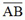

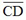

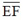

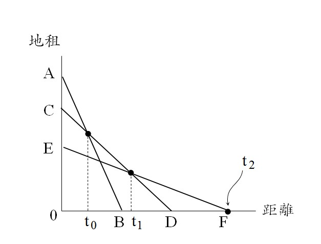

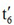

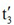

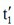

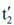

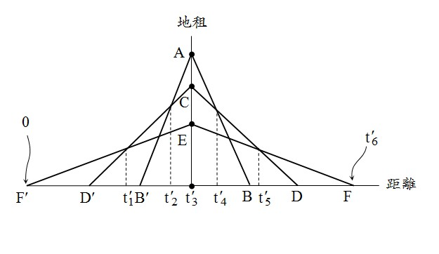

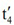

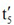

## 267. 測量錯誤之損害賠償：參最高法院106年度台上字第2938號民事判決
*發布日期: 2023-07-25* 

## 內文
參考案例：

某A地號土地於86年由國土測繪中心辦理地籍圖重測時，因測量人員未依地籍調查表所載，以水溝為界址施測，而是以舊圖進行套繪作為重測成果，致地籍線登載與該界址不符。而後甲購買該地後欲興建補習班大樓，向B地政事務所先申請鑑界及合併分割，該測量人員亦未調取地籍調查表發見該錯誤。接著甲即於99年間取得建造執照後，並發包施工，惟於100年間進行地質鑽探放樣時，發現A地號土地與毗鄰土地界址有疑義，即請B地政事務所查明，後經查重新依系爭水溝為界址，逕辦理更正，致登記面積由 556平方公尺更正為539平方公尺，共減少 17平方公尺。試問甲得否依土地法第68條登記錯誤請求賠償？

茲整理判決重點如下：

1. 按因登記錯誤遺漏或虛偽致受損害者，除能證明其原因應歸責於受害人者外，由該地政機關負損害賠償責任，土地法第 68條第1項定有明文。該規定旨在貫徹土地登記之公信力，以保護土地權利人並兼顧交易安全。

2. 所稱「登記錯誤」，不應以土地登記規則第13條所指「登記事項與登記原因證明文件所載之內容不符者」為限，茍地政機關於地籍測量時有錯誤，致依據該測量成果而辦理之土地登記亦產生錯誤，縱嗣後之登記階段完全依測量結果辦理而無錯誤，但作為前提之測量結果，及最後登記之結果均有錯誤，對於信賴土地登記而受損害之人民，仍應認係登記錯誤。

3. 惟地政機關之損害賠償責任，依同條第2 項規定「不得超過受損害時之價值」，係按受損害時土地之市價為限，俾免地政機關因此承擔過重之風險。

4. 又上開規定，無非係就職司土地登記事務之公務員因故意或過失不法侵害人民權利，而由該公務員所屬地政機關負損害賠償責任之規定，核係國家賠償法之特別規定，依該法第6條規定，自應優先適用。

5. 因此，查國土測繪中心所屬公務員於86年間，就原A地號土地執行重測職務，疏未核對地籍調查表即為界址施測，汐止地政所所屬公務員於98年間，就A地號土地執行鑑界等複丈職務時，發現上開重測界址有誤，卻未依規定查明施測，均有過失，致A地號土地登載之地籍線及面積發生錯誤，使更正後之登記面積減少，而不法侵害被上訴人之權利。本件依原地籍線及登記面積規劃在系爭土地上建造補習班大樓，並委請建築師設計及申請取得建照，嗣因原地籍線及登記面積有誤，而自行撤銷建照及不繼續興建，因此賠償C營造公司自開工日至100年7月間無法施工之費用131萬8000元，所支出之建築師設計費63萬元、建築線申請費用及鑽探費用3萬1000元、建築執照證照費1萬0247元、鑽探費6萬4050元、新光銀行貸款費用11萬4313元，金額合計216萬7610元（皆有證據），均堪認係甲因土地面積登記錯誤所受之損害。得依土地法第68條第1項請求該二機關賠償。

6. 然而，惟按損害之發生或擴大，被害人與有過失者，法院得減輕賠償金額或免除之，民法第217條第1項定有明文。查，系爭土地固發生面積登記錯誤之情事，然該減少之面積僅17平方公尺（約5坪），但土地面積減少，並不甚妨礙被上訴人原訂之興建計畫，僅需就面積部分申請變更設計即可。雖變更設計確實會增加被上訴人之支出（如變更設計費、申請規費、停工期間對承包商之賠償等），工期之延長亦會增加其貸款之資金壓力，然相較於撤銷全案建築執照，完全停工，先前所為整地、鑽探、鋼材等施工費用，全化為虛無而言，仍為損害最小之選擇，甲捨此不為，在防免損害金額擴大部分，難謂已盡善良管理人之注意義務。茲審酌被上訴人選擇變更設計或撤銷建築執照，二方案可能增加之費用、可能減少之損害，及兩造就損害發生之原因、損害之範圍等過失輕重為綜合考量，認甲自負50％之過失責任，應為公允。是依此計算，被上訴人得請求賠償之金額為108萬3805元。

因此，此案可瞭解以下幾個重點：

1. 測量錯誤亦屬登記錯誤致受損害之賠償範圍。

2. 土地法第68條為國家賠償法之特別規定而優先適用。

3. 損害賠償應注意民法第217條第1項的損害賠償責任過失相抵。
---
*注：本文圖片存放於 ./images/ 目錄下*

## 268. 地籍圖重測時，土地所有權人「指界」之法律性質
*發布日期: 2023-07-20* 

## 內文
「指界」是土地所有權人之權利，也是義務。茲分析如下：

• (一) 土地所有權人之權利：「指界」屬於土地所有權人之權利。權利可以行使，亦可以不行使。因此，土地所有權人可以行使指界，亦可以不行使指界。

1. 土地所有權人行使指界：地政機關依土地所有權人之指界結果，進行施測。但因指界而與鄰地所有權人發生界址爭議時，應由該管直轄市或縣（市）地政機關予以調處，不服調處者，應於接到調處通知後十五日內，向司法機關訴請處理，逾期不起訴者，依原調處結果辦理之（土§46-2II、§59II）。

2. 土地所有權人不行使指界： 地政機關得依下列順序逕行施測： (1)鄰近界址。 (2)現使用人之指界。 (3)參照舊地籍圖。 (4)地方習慣。（土§46-2I）

• (二) 土地所有權人之義務：「指界」屬於土地所有權人之義務。因此，土地所有權人未行使指界，將受到不利之影響。土地法第46條之3第1項及第2項規定：「重新實施地籍測量之結果，應予公告，其期間為三十日。土地所有權人認為前項測量結果有錯誤，除未依前條之規定設立界標或到場指界者外，得於公告期間內，向該管地政機關繳納複丈費，聲請複丈。經複丈者，不得再聲請複丈。」準此，土地所有權人未行使指界，不得申請異議複丈。
---
*注：本文圖片存放於 ./images/ 目錄下*

## 269. 視為以不定期限繼續契約之意涵
*發布日期: 2023-07-18* 

## 內文
甲因經營餐廳而於101年底向乙承租A不動產，租約自102年1月1日至102年12月31日止，一年一租，惟租期屆滿後，甲繼續使用，且直接交付2年租金，乙並未表示反對，惟於104年底乙卻寄存證信函通知應另訂新約，否則將終止租約，收回A不動產，請問是否有理？

依據最高法院109年度台上字第109號判決，是無理由的，因為其已成為不定期限租約，並須依原租用條件繼續，且無土地法規定情形，即不得任意終止租約收回。

其判決要旨如下：

1. 租賃期限屆滿後，承租人仍為租賃物之使用收益，而出租人不即表示反對之意思者，視為以不定期限繼續契約。

2. 所謂以不定期限繼續租賃，乃租賃雙方依原來租賃條件不定期限繼續租賃。故出租人於訂約之際，如未訂明期滿後絕不續租或續租應另訂契約或其他相類之情形者，於不即表示反對之意思條件成就時，租賃契約當然更新為不定期限租賃關係，無待於契約當事人重為要約或承諾。

3. 此外，租賃契約依上開規定更新為不定期限租賃關係後，未經合法終止契約，租賃關係自仍存續。而不定期限之房屋租賃，非有土地法第100條所定情形之一者，出租人不得終止租賃契約，收回房屋。
---
*注：本文圖片存放於 ./images/ 目錄下*

## 270. 財產權
*發布日期: 2023-07-13* 

## 內文
• (一) 財產權之意義：

凡具有財產價值之權利，稱為財產權。所有權是財產權之重心。所有權人對標的物可以行使規劃、使用、收益、處分及排他等權能。

財產權之功能：

1. 財產權可以減少使用土地之衝突：財產屬誰界定清楚，就可以減少土地之紛爭。

2. 財產權可以有效分派土地：擁有財產權之人將其土地出租或出售時，將會選擇出價最高之人，而出價最高之人代表最有能力使用該土地之人。

3. 財產權可以誘使土地投資改良：在財產權保障下，土地所有權人會對土地加以投資改良，以提高土地生產力。

4. 財產權可以達成永續利用土地：在財產權保障下，土地所有權人會規劃現在與未來土地利用之最佳組合，保育土地，達成永續利用。

5. 財產權可以避免共用地悲劇與反共用地悲劇：財產權界定清楚，可以避免土地之過度利用（即共用地悲劇）。財產權完整，可以避免土地之低度利用（即反共用悲劇）。

• (二) 財產權保障之目的：

憲法第15條關於人民財產權應予保障之規定，旨在確保個人依財產之存續狀態行使其自由使用、收益及處分之權能，並免於遭受公權力或第三人之侵害，俾能實現個人自由、發展人格及維護尊嚴（司法院釋字第400號解釋）。

• (三) 財產權保障之型態：

財產權保障型態分為下列三種：

1. 財產法則：財產權之移轉必須在所有權人同意下為之。非經所有權人同意之價格，他人不得取得其財產權。

2. 義務法則：財產權並非神聖不可侵犯，在客觀合理價格下，政府可以取得其財產權。

3. 禁制法則：亦稱不能奪取法則；縱經所有權人同意，財產權亦禁止移轉給他人。

總之，政府對財產權之干預程度，以禁制法則最大，義務法則次之，財產法則最小。若外部性不涉及第三人，或涉及第三人但人數不多時，宜採用財產法則。若外部性涉及第三人且人數很多時，宜採用義務法則。對不可復原之環境敏感地區、古蹟保存地區等，宜採用禁制法則。

• (四) 結論：

財產權界定清楚及財產權完整，始能促進土地利用效率。
---
*注：本文圖片存放於 ./images/ 目錄下*

## 271. 房地合一稅課徵對象：個人、營利事業
*發布日期: 2023-07-11* 

## 內文
適用應徵房地合一稅之稅捐主體，依據所得稅法第4條之4第1項規定為個人及營利事業。所謂「個人」，依據同法第7條第1項第2句規定，指「自然人」；所謂「營利事業」，依據同法第11條第2項規定，指「公營、私營或公私合營，以營利為目的，具備營業牌號或場所之獨資、合夥、公司及其他組織方式之工、商、農、林、漁、牧、礦冶等營利事業」。1

其中，房地合一所得稅之稅率尚會依照境內與境外居住區分不同稅率結構，其分辨方式如下：

• (一) 個人

1. 境內居住之個人 (1)指在中華民國境內有住所，並經常居住在中華民國境內，或者雖在境內並無住所，但於一課稅年度內在境內居留合計滿183天要件者。 (2)惟稅捐稽徵實務上另依據財政部公布之「中華民國境內居住之個人認定原則」的標準，以「個人於一課稅年度內在中華民國境內設有戶籍，且有下列情形之一」，包括：

1. 於一課稅年度內在中華民國境內居住合計滿31天。

2. 於一課稅年度內在中華民國境內居住合計在1天以上未滿31天，其生活及經濟重心在中華民國境內。 所稱生活及經濟重心在中華民國境內，應衡酌個人之家庭與社會關係、政治文化及其他活動參與情形、職業、營業所在地、管理財產所在地等因素，參考下列原則綜合認定： (A)享有全民健康保險、勞工保險、國民年金保險或農民健康保險等社會福利。 (B)配偶或未成年子女居住在中華民國境內。 (C)在中華民國境內經營事業、執行業務、管理財產、受僱提供勞務或擔任董事、監察人或經理人。 (D)其他生活情況及經濟利益足資認定生活及經濟重心在中華民國境內

2. 非境內居住之個人：上述以外者。

• (二) 營利事業

1. 總機構在中華民國境內 係以營利事業之設立準據法，也就是倘若依照我國法律而設立之事業，包括依公司法而設立之各種類型的公司、依合作社法而設立之各種型態的合作社，或依照有限合夥法設立之「有限合夥」商業組織，即屬「總機構在中華民國境內」之營利事業。

2. 總機構在中華民國境外：上述以外者。

1. 柯格鐘，2021，房地合一稅之規避防杜條款─談所得稅法第4條之4的修正，月旦財稅實務釋評，第21期。
---
*注：本文圖片存放於 ./images/ 目錄下*

## 272. 土地回復原狀之「核准回復說」與「自動回復說」
*發布日期: 2023-07-06* 

## 內文
• (一) 核准回復說：土地法第12條第2項規定：「前項土地，回復原狀時，經原所有權人證明為其原有者，仍回復其所有權。」準此，土地流失後，私有土地所有權消滅，即為國有土地。日後土地回復原狀，土地所有權人或其繼承人應提出申請，經政府核准，始回復其所有權。復權請求權因十五年間不行使而消滅。

• (二) 自動回復說：土地流失或浮覆時，私有土地所有權依法律規定（即依土地法第12條規定）而喪失或回復。依民法第759條規定，於事實發生、不待登記即發生物權變動之效果。準此，土地回復原狀時，土地所有權人或其繼承人不待申請核准，即取得土地所有權。是以，土地所有權人或其繼承人得訴請法院主張民法第767條除去妨害請求權，塗銷國有登記，回復登記為原所有權人或其繼承人。依司法院釋字第164號解釋，已登記不動產所有人之除去妨害請求權，無消滅時效之適用。

綜上，司法實務採自動回復說。
---
*注：本文圖片存放於 ./images/ 目錄下*

## 273. 預售屋及新建成屋買賣契約得讓與或轉售情形
*發布日期: 2023-07-04* 

## 內文
根據平均地權條例第47-4條，第一項規定：「預售屋或新建成屋買賣契約之買受人，於簽訂買賣契約後，不得讓與或轉售買賣契約與第三人，並不得自行或委託刊登讓與或轉售廣告。但配偶、直系血親或二親等內旁系血親間之讓與或轉售；或其他中央主管機關公告得讓與或轉售之情形並經直轄市、縣（市）主管機關核准者，不在此限。」第二項規定：「買受人依前項但書後段規定得讓與或轉售之戶（棟）數，全國每二年以一戶（棟）為限；其申請核准方式、應檢附文件、審核程序及其他相關事項之辦法，由中央主管機關定之。」亦即除特定情形外，預售屋（含尚未辦建物所有權第一次登記之新成屋）禁止換約，否則依平均地權條例第81-3條，由直轄市、縣（市）主管機關處新臺幣50萬元以上300萬元以下罰鍰；其刊登廣告者，並應令其限期改正或為必要處置；屆期未改正或處置者，按次處罰；其有不動產交易者，按交易戶（棟）處罰。

爰此，訂定下列兩項子法，茲整理相關重點如下：

「預售屋及新建成屋買賣契約得讓與或轉售情形」 「預售屋及新建成屋買賣契約讓與或轉售審核辦法」

• 一、禁止讓與、轉售買賣契約之例外情形

以下情形得讓與或轉售之戶（棟）數，全國每二年以一戶（棟）為限，自直轄市或縣（市）主管機關核准日之次日起算：

• (一) 配偶、直系血親或二親等內旁系血親間（兄弟姊妹）之讓與或轉售 讓與或轉售，得由買受人持憑身分證明文件逕洽出賣人辦理，無須申請核准。

• (二) 中央主管機關公告得讓與或轉售之情形並經直轄市、縣（市）主管機關核准

預售屋或新建成屋買賣契約之買受人符合中央主管機關公告得讓與或轉售之情形者，於買賣契約讓與或轉售前，應以書面向該預售屋或新建成屋基地坐落所在地之直轄市或縣（市）主管機關申請核准。其得讓與或轉售情形目前有6種：

1. 買受人因非自願離職且逾6個月未就業 買受人於簽約繳款後，因就業保險法第11條第3項規定之非自願離職情事，或勞工職業災害保險及保護法第85條第1項第2款、第3款或第4款規定而終止其與雇主勞動契約，逾六個月以上迄未就業，且簽約前已受僱該雇主達一年以上者。因非自願離職原因致使其收入減少，可能致無力繳款。

2. 本人或其家庭成員重大傷病或特定病症經診斷認定需6個月以上全日照顧 買受人於簽約繳款後，本人或其家庭成員（買受人之1.配偶、2.直系血親、3.配偶之直系親屬，或4.買受人父母均已死亡，其戶籍內需要照顧之未成年或身心障礙已成年且無配偶之兄弟姊妹）罹患重大疾病或因意外事故遭受傷害，符合全民健康保險法第48條第1項第1款所稱之重大傷病 ，或社會救助法第5條之3第1項第4款之特定病症，經衛生福利部公告之醫療機構專科醫師診斷，認定有六個月以上全日照顧需要者。因醫療及長期照顧等支出，可能致無力繳款。

3. 買受人或其家庭成員之房屋因災害毀損而須另行租屋 買受人於簽約繳款後，因災害毀損原設籍居住之房屋，致不堪居住使用，須另行租屋，且被毀損房屋為買受人或其家庭成員所有者。因房屋租金等支出，可能致無力繳款。

4. 買受人或其家庭成員因重大意外事故致他人死亡或重大傷害經認定須6個月以上全日照顧 買受人於簽約繳款後，本人或其家庭成員因重大意外事故，致第三人 死亡或遭受重大傷害，符合社會救助法第5條之3第1項第4款之特定病症，經衛生福利部公告之醫療機構專科醫師診斷，認定有六個月以上全日照顧需要者。因賠償金等支出，可能致無力繳款。

5. 原買受人死亡其繼承人無意保留 買受人於簽約繳款後死亡，其繼承人讓與或轉售該預售屋或新建成屋買賣契約，或經協議變價分配，或持憑法院確定判決或依法與確定判決同一效力之證明文件辦理變價分配者。原買受人死亡，如繼承人無力繳款或不願承受貸款而擬讓與或轉售，應允許其辦理。

6. 共同買受人間之讓與或轉售 買受人為自然人，其於簽約繳款後，將契約權利讓與或轉售與該契約所列其他共同買受之自然人或法人。係因減少將來不動產共有人數，有利於契約關係單純化。

• 二、非屬讓與、轉售買賣契約之情形

• (一) 買受人於簽約後死亡，其繼承人因繼承辦理契約名義人變更

• (二) 法人合併或改制後，由合併或改制後存續或新設立之法人，依法承受或概括承受

• (三) 法人依法解散、撤銷或廢止登記清算後，其賸餘財產之歸屬

這些情形非屬契約讓與或轉售行為，性質與買受人契約讓與或轉售行為有別，得持憑相關證明文件逕洽出賣人辦理，無須申請核准。
---
*注：本文圖片存放於 ./images/ 目錄下*

## 274. 土地法第43條及第68條所規定「登記」之內涵
*發布日期: 2023-06-29* 

## 內文
土地法第43條規定：「依本法所為之登記，有絶對效力。」又，土地法第68條第1項規定：「因登記錯誤遺漏或虛偽致受損害者，由該地政機關負損害賠償責任。但該地政機關證明其原因應歸責於受害人時，不在此限。」試分析此二則法條所規定「登記」之內涵有何異同？

【解答】

• (一) 相同點：

1. 登記，指登記完畢。所稱登記完畢，指土地權利經登記機關依土地登記規則登記於登記簿，並校對完竣，加蓋登簿及校對人員名章後，為登記完畢。土地登記以電腦處理者，經依系統規範登錄、校對，並異動地籍主檔完竣後，為登記完畢。

2. 登記，指經登記機關依法審查無誤後，登記於登記簿。物權登記與債權登記、皆包括在內。

3. 登記，包括測量。測量與登記為一體之兩面。因此，登記除指登記簿外，亦包括地籍圖。

4. 登記，不包括政府機關為警示或管控目的，囑託登記機關所為之註記登記。

• (二) 相異點：

1. 土地法第43條所規定之「登記」，僅指權利（包括所有權及他項權利）登記，不包括標示登記。換言之，土地面積、土地形狀、編定種類等客觀事實狀態之登記不實，不受登記絶對效力之保護。

2. 土地法第68條第1項所規定之「登記」，包括標示登記與權利登記。換言之，土地面積、土地形狀、編定種類等客觀事實狀態之登記錯誤遺漏或虛偽，地政機關仍應負損害賠償責任。
---
*注：本文圖片存放於 ./images/ 目錄下*

## 275. 氣候變遷調適
*發布日期: 2023-06-27* 

## 內文
為因應全球氣候變遷，制定氣候變遷調適策略，降低與管理溫室氣體排放，落實世代正義、環境正義及公正轉型，善盡共同保護地球環境之責任，並確保國家永續發展，我國於今(112)年2月制定「氣候變遷因應法」，有關氣候變遷調適之重要考點如下：

• (一) 氣候變遷調適之意義

指人類與自然系統為回應實際、預期氣候變遷風險或其影響之調整適應過程，透過建構氣候變遷調適能力並提升韌性，緩和因氣候變遷所造成之衝擊或損害，或利用其可能有利之情勢。(氣變§3)

• (二) 政府如何建構調適能力

為因應氣候變遷，政府應推動調適能力建構之事項如下(氣變§17)：

1. 以科學為基礎，檢視現有資料、推估未來可能之氣候變遷，並評估氣候變遷風險，藉以強化風險治理及氣候變遷調適能力。

2. 強化因應氣候變遷相關環境、災害、設施、能資源調適能力，提升氣候韌性。

3. 確保氣候變遷調適之推動得以回應國家永續發展目標。

4. 建立各級政府間氣候變遷調適治理及協商機制，提升區域調適量能，整合跨領域及跨層級工作。

5. 因應氣候變遷調適需求，建構綠色金融機制及推動措施。

6. 推動氣候變遷新興產業，輔導、鼓勵氣候變遷調適技術開發，研發、推動氣候變遷調適衍生產品及商機。

7. 強化氣候變遷調適之教育、人才培育及公民意識提升，並推展相關活動。

8. 強化脆弱群體因應氣候變遷衝擊之能力。

9. 融入綜合性與以社區及原住民族為本之氣候變遷調適政策及措施。

10. 其他氣候變遷調適能力建構事項。
---
*注：本文圖片存放於 ./images/ 目錄下*

## 276. 私法人購置住宅許可制
*發布日期: 2023-06-20* 

## 內文
• 一、法源

平均地權條例第79條之1規定：

• (一) 私法人買受供住宅使用之房屋，應檢具使用計畫，經中央主管機關許可。但私法人經中央主管機關公告免經許可之情形者，不在此限。

• (二) 前項許可之文件有效期限為一年。

• (三) 私法人取得第一項房屋，於登記完畢後五年內不得辦理移轉、讓與或預告登記。但因強制執行、徵收、法院判決或其他法律規定而移轉或讓與者，不在此限。

• (四) 中央主管機關為審核第一項許可案件，得遴聘（派）專家學者、民間團體及相關機關代表，以合議制方式辦理之。

• (五) 第一項規定適用範圍、許可條件、用途、使用計畫內容、應備文件、審核程序、免經許可情形及其他應遵行事項之辦法，由中央主管機關定之。

因此，授權訂定子法「私法人買受供住宅使用之房屋許可辦法」（112.6.13訂定；112.7.1施行），茲彙整相關內容如下。

• 二、立法意旨

私法人原則上無居住需求，現行對私法人購置住宅無相關限制規範，易使住宅成為私法人投資炒作標的，導致住宅市場發生投機壟斷，不利不動產市場之健全發展，因而透過增訂申請許可制度，管制私法人買受住宅房屋。

• 三、適用主體

所稱私法人係指依據私法設立之組織，含括所有社團法人(如本國公司、外國公司、農會、工會等)及財團法人。

• 四、適用範圍（客體）

• (一) 適用

成屋之建物登記謄本、新建成屋之使用執照或預售屋之建造執照記載建物用途為「住」或「住宅」字樣(私許§2II)。

• (二) 不適用

成屋有下列情形之一者，不適用本辦法之規定(私許§2III)：

1. 記載建物用途為住商用、住工用或住宅混合使用。

2. 無記載建物用途或用途為空白。

3. 為實施建築管理前之建物，且辦竣建物所有權第一次登記，該建物用途為住或住宅，私法人提供當年度該建物房屋稅屬非住家用文件。

4. 為實施建築管理後之建物，私法人提供房屋用途非作住或住宅使用之證明文件。

• 五、許可用途及審查標準

• (一) 許可

私法人買受供住宅使用之房屋，其申請用途應以下列各款之一為限(私許§3)：

• (一) 宿舍。

其申請戶數及已買受戶數合計不得超過經常僱用員工數(私許§4I)。

• (二) 供居住使用之出租經營。

營業項目應包含不動產租賃業(私許§5I)，以成屋為限，且私法人申請買受戶數及已取得戶數在同一使用執照內應達五戶以上。同一使用執照內未達五戶者，申請買受戶數及已取得戶數為該使用執照全部戶數(私許§5II)。

• (三) 合建、實施或參與都市更新、都市危險及老舊建築物重建。 以成屋為限，並應符合下列各款情形之一(私許§6I)：

1. 屋齡三十年以上。

2. 經建築主管機關依建築法規、災害防救法規通知限期拆除、逕予強制拆除，或評估有危險之虞應限期補強或拆除。

3. 經結構安全性能評估結果未達最低等級或建築物耐震能力未達一定標準。

4. 依都市更新條例經公開展覽之都市更新事業計畫範圍內。

5. 依都市危險及老舊建築物加速重建條例經核准之重建計畫範圍內。私法人申請買受之房屋符合前第1款至第3款情形之一者，得以單一街廓為範圍提出申請(私許§6II)。

• (四) 建築物使用類組及變更使用辦法第2條附表二H-1及H-2類組之衛生福利機構場所。 包含老人福利機構、護理機構、精神復健機構、身心障礙福利機構及長期照顧服務機構等場所。

• (五) 合作社為設置住宅公用設備。

• (六) 其他經中央主管機關公告者。

• 六、辦理流程

[圖片1]

• (一) 許可

其中，中央主管機關許可文件之有效期限，規定如下(私許§11)：

1. 成屋為許可日之次日起算一年。

2. 預售屋、新建成屋為辦竣建物所有權第一次登記之日起算一年。

• (二) 登記

1. 私法人買受供住宅使用之房屋經許可者，應檢附許可文件並於許可有效期限內，向不動產所在地之登記機關辦理房屋所有權移轉登記(私許§14 I)。

2. 登記機關辦理登記時，應於登記簿所有權部其他登記事項欄註明本條例第七十九條之一第三項本文之限制事項(私許§14 II)。

3. 未取得許可者，不得辦理登記；逾許可之有效期限者，亦同(私許§14 III)。

• 七、應備文件

私法人申請買受供住宅使用之房屋，應檢具下列文件，向中央主管機關申請許可(私許§7)：

• (一) 申請書及使用計畫書。

使用計畫(私許§8)內容：

1. 申請買受用途、買受標的、房屋類型、預計買受戶數等項目。

2. 依第3條第1項第1款用途（宿舍）申請許可者，另載明買受房屋作宿舍使用戶數及經常僱用員工數。

3. 依第3條第1項第2款用途（供居住使用之出租經營）申請許可者，另載明同一使用執照內已取得戶數。

4. 依第3條第1項第3款用途（合建、實施或參與都市更新、都市危險及老舊建築物重建），並以單一街廓為範圍申請許可者，應檢具彩色圖說，並敘明街廓四周道路名稱及範圍內地號。

• (二) 法人資格證明文件及其代表人身分證明文件。

• (三) 符合規定用途之文件。

• (四) 其他經中央主管機關指定應提出之文件。 申請人檢附之文件，有不符規定或不全而得補正者，中央主管機關應通知申請人於二個月內補正；屆期不補正或補正不完全者，駁回其申請(私許§9)。

• 八、審核方式

中央主管機關為審核申請許可案件，必要時得遴聘（派）專家學者、民間團體及相關機關代表，以合議制方式辦理之。組成審議小組，小組置委員七人至十一人，其中專家學者及民間團體代表，合計不得少於委員總數二分之一(私許§10)。

• 九、不予許可情形

私法人有下列情事之一者，應不予許可(私許§12)：

1. 以不實文件申請或申請文件有偽造或變造情事。

2. 冒用或借用他人名義或證件申請。

3. 所提出之使用計畫違反相關法令規定。

• 十、免經許可情形

根據「內政部依平均地權條例第七十九條之一第一項公告私法人免經許可之情形」（草案）有以下9種：

• (一) 私法人屬受政府捐助之財團法人或公（國）營事業，買受供住宅使用之房屋，免經許可。

• (二) 私法人因實施或參與都市更新計畫，買受供住宅使用之房屋，符合下列各款情形之一者，免經許可：

1. 房屋坐落都市更新條例第七條規定之迅行劃定地區範圍內。

2. 買受經公開展覽都市更新事業計畫範圍內之房屋，且私法人為該計畫之土地所有權人、合法建築物所有權人、他項權利人、實施者或與實施者協議出資者。

都市更新計畫完成後，私法人買受供住宅使用之房屋，符合下列各款情形之一者，免經許可：

1. 都市更新計畫之實施者或出資者以協議合建方式實施或參與，並於辦竣建物所有權第一次登記前，與得分配建築物者簽訂契約，買受供住宅使用之房屋；以權利變換方式實施或參與者亦同。

2. 本條例施行前，私法人於辦竣建物所有權第一次登記前，與得分配建築物者簽訂契約，買受供住宅使用之房屋，該契約業依公證法公證或認證。

• (三) 私法人實施或參與都市危險及老舊建築物加速重建條例之重建計畫，買受重建計畫核准範圍內供住宅使用之房屋，且私法人為重建計畫之土地所有權人、合法建物所有權人或新建建築物之起造人，免經許可。 重建計畫以合建方式實施者，新建建築物之起造人於辦竣建物所有權第一次登記前，與得分配建築物者簽訂契約，買受供住宅使用之房屋，免經許可。

• (四) 私法人與土地所有權人簽訂合建契約，而買受土地所有權人供住宅使用之房屋，免經許可。

• (五) 私法人為金融控股公司或銀行轉投資之資產管理公司，買受供住宅使用之房屋，該房屋符合下列各款情形之一者，免經許可：

1. 為不良債權擔保品。 2.為各級政府機關公開標售之標的。

私法人為銀行合資且全資轉投資設立之資產管理公司，亦適用之。

• (六) 私法人買受供住宅使用之房屋，係依文化資產保護法指定或登錄之私有古蹟、歷史建築及紀念建築，免經許可。 前項情形，私法人應出具文化資產保護法主管機關放棄優先購買權之相關文件。

• (七) 私法人為不動產經紀業，其與房屋所有權人簽訂之仲介或代銷契約，訂有不動產經紀業得買受該契約標的之約款，免經許可。

前項契約標的，須為供住宅使用之房屋，並符合下列各款情形之一：

1. 高氯離子混凝土。

2. 高放射性汙染。

3. 具非自然身故之情事。

• (八) 私法人依法律規定行使下列優先購買權，買受供住宅使用之房屋，免經許可：

1. 民法第426條之2第1項。

2. 民法第919條第1項。

3. 民法物權編施行法第8條之5第5項。

4. 土地法第34條之1第4項。

5. 土地法第104條第1項。

• (九) 私法人因參與法院拍賣，買受供住宅使用之房屋，免經許可。

私法人買受供住宅使用之房屋，符合經中央主管機關公告免經許可之情形者，向不動產所在地之登記機關辦理登記時，應檢附其符合公告免經許可項目情形之相關證明文件。

• 十、五年移轉限制之例外

私法人取得經中央主管機關許可供住宅使用之房屋，且房屋坐落都市更新事業計畫或都市危險及老舊建築物重建計畫範圍內，於都市更新事業計畫經公開展覽或都市危險及老舊建築物重建計畫經核准時，不受五年內不得辦理移轉、讓與或預告登記之限制(私許§15 I)。登記機關應將登記簿所有權部其他登記事項欄原登記本條例第七十九條之一第三項之限制事項之註記塗銷(私許§15 II)。

## 文章圖片

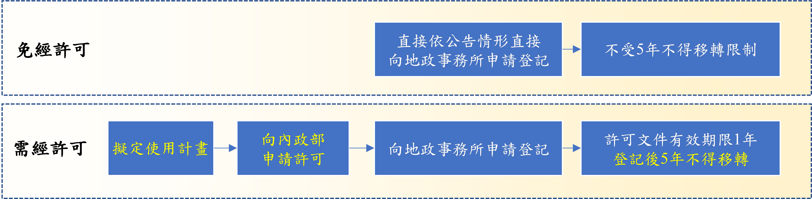

## 277. 浮覆地之回復所有權－最高法院民事大法庭110年度台上大字第1153號裁定之申論
*發布日期: 2023-06-15* 

## 內文
土地所有權人原有之土地，已依我國法令辦理土地總登記。嗣因成為河川、水道經塗銷登記，土地登記為國有。土地法第12條第1項所稱「視為消滅」，意指所有權並未真正消滅，只是暫時停止其權利之行使。

土地浮覆時，原土地所有權人得依民法第767條第1項規定行使物上請求權（即除去妨害請求權），塗銷國有登記，回復登記為原所有權人。此除去妨害請求權，依司法院釋字第164號解釋，已登記之不動產無民法第125條消滅時效規定之適用。
---
*注：本文圖片存放於 ./images/ 目錄下*

## 278. 平均地權意義與方法之評論
*發布日期: 2023-06-13* 

## 內文
平均地權就是透過規定地價、照價徵稅、照價收買與漲價歸公四大方法之施行，進而達成地權分散、地盡其利、地利共享之目標。然而，雖然政府透過相關法令限制私有地權，避免壟斷及分享地利，但其主要核心精神為賦予有土地使用需求且有使用能力者，皆有使用機會，符合市場機制下自由競爭之環境。

至於平均地權的四大方法，目前執行上有下列問題：

• (一) 規定地價

政府參考區段地價所訂定的公告地價與公告土地現值，係採大量估價方法，其客觀性、精確性仍有待精進。

• (二) 照價徵稅

農地以課徵田賦為原則，且自76停起停徵。惟許多農地並未農用，甚至閒置或違規使用，在其未被稽查改課地價稅前，有違背照價徵稅以盡其地用之問題。

• (三) 照價收買

目前實務上並未落實執行，缺乏嚇阻效果。

• (四) 漲價歸公

1. 以公告土地現值為審核標準計徵土地增值稅，而公告土地現值為市價的7至9成左右，仍有部分漲價歸私。

2. 土地增值稅之稅率為20%、30%及40%，顯示土地增值大部分歸私。

3. 同一年內多次移轉土地，因公告現值未調整而無漲價得以歸公。
---
*注：本文圖片存放於 ./images/ 目錄下*

## 279. 耕地租佃爭議免收裁判費
*發布日期: 2023-06-08* 

## 內文
耕地三七五減租條例第26條第1項所稱因耕地租佃發生爭議，係指出租人與承租人間因耕地租佃關係所發生之一切爭議而言。租佃雙方於租約存續期間或消滅後所生權利義務之行使、負擔之爭議，例如承租人請求交付耕地或於耕地出賣、出典時主張優先承受，出租人請求繳付地租；租期屆滿前租約是否無效或得終止，租期屆滿後出租人得否收回自耕；租約消滅後出租人請求返還耕地等，均包括在內（108年度台上大字第2470號裁定理由）。

耕地租約消滅後，出租人本於民法第767條規定請求拆除地上物或返還耕地，其訴訟標的雖係本於所有權，而非耕地租約，然耕地三七五減租條例第26條第1項既明定租佃雙方因耕地租佃發生之爭議，免收裁判費用，所著重者，顯非訴訟標的本身，亦無意將所稱爭議限制在本於耕地租佃關係所生之請求權。爭議當事人間原有耕地租佃關係，嗣發生承租人有無不自任耕作之爭執，為基於耕地租佃契約所生之權利、義務事項，與出租人起訴主張自始無租賃關係存在之情形不同，自屬耕地租佃爭議。該爭議依耕地三七五減租條例第26條第2項規定，非經耕地租佃委員會調解、調處，不得起訴，復因不自任耕作之法律效果為租約溯及失效，出租人無從本於租賃之法律關係請求返還耕地，倘謂其以所有物返還請求權為請求時，無同條第1項免收裁判費用規定之適用，尚非事理之平。故租佃雙方對耕地租約之存否及效力發生爭議，出租人除請求確認耕地租佃關係不存在外，另依民法第767條規定，請求承租人騰空遷讓返還耕地者，其依民法第767條規定請求部分，亦屬租佃爭議，應依耕地三七五減租條例第26條第1項規定，免收裁判費用，始符憲法第143條第4項扶植自耕農本旨及耕地三七五減租條例建立良好耕地租佃關係之立法原意（108年度台上大字第2470號裁定理由）。

總之，耕地三七五減租條例第26條第1項所稱因耕地租佃發生爭議，係指出租人與承租人間因耕地租佃關係所發生之一切爭議而言。當事人間原訂有耕地租約，嗣發生租約是否無效或經終止，出租人得否請求承租人除去地上物返還耕地之爭議者，亦包括在內。出租人主張原訂耕地租約無效，依民法第767條規定請求承租人除去地上物返還耕地，屬耕地租佃爭議，應免收裁判費用（108年度台上大字第2470號裁定主文）。
---
*注：本文圖片存放於 ./images/ 目錄下*

## 280. 土地登記不實之損害賠償責任
*發布日期: 2023-06-06* 

## 內文
※案例

甲冒名其弟乙，拿其身分證、印章與申請補發之權狀，向第三人丙借款250萬，並設定最高限額抵押權375萬元登記完畢。然而，嗣後經真正權利人乙向A地政事務所表示遭冒名，後A地報請地政局核准塗銷登記完畢，進而導致丙無法強制執行，而遭受250萬元無法清償之損害。試問丙得否依據土地法第68條向A地政事務所請求損害賠償？

（參最高法院110年度台上大字第3017號民事裁定、最高法院110年度台上字第3017號民事判決）

※主要重點觀念

土地法第68條為國家賠償法的特別法，不以登記人員就不實登記有故意、過失為要件，亦即地政機關仍須為他人施以詐術之行為進行賠償。其理由為：

1. 制度：土地登記為強制登記、實質審查，有絕對效力。

2. 目的：地政機關負無過失責任，方可保護權利人及維護交易安全，有社會保險之概念。

3. 責任衡平：雖地政機關負無過失責任，但土地法有設計相關責任減輕衡平機制 (1)可歸責受害人可不賠，且可個案適用民法第217條，與有過失之責任減免。 (2)不包含所失利益，已調和所負責任及限縮賠償範圍。 (3)登記儲金設置，可避免財政負擔，分散風險。 (4)登記人員僅重大過失，才需後續撥歸儲金，可避免登記人員責任過重。

※本題解析

• A. 地政事務所負無過失責任，除非可歸責於受害人丙，否則應予賠償。因此，本題仍應討論丙是否有過失，而依據民法第217條，丙可能對於損害之發生及擴大有「與有過失」問題，進而可減免A地政事務所之賠償責任：

1. 丙於借款時並未先確認債務人人別、系爭抵押權標的物之所有權人

2. 丙在知悉冒名後，未為任何保全處分，致甲將其名下不動產出賣而無財產可供清償
---
*注：本文圖片存放於 ./images/ 目錄下*

## 281. 司法院釋字第107號及第164號解釋之補充
*發布日期: 2023-06-01* 

## 內文
日據時期已登記之土地，因日據後期改採契據登記制度，使登記僅生對抗效力，致該土地登記無法完全體現真正權利之歸屬者，與臺灣光復後所採取之土地登記生效制度有異。故在此種對土地登記效力採行不同之法律制度下，對於未經依我國相關土地法令辦理土地登記之原所有權人，縱其土地於日據時期曾經登記，因成為河川、水道經塗銷登記，嗣於臺灣光復後浮覆，但在未依我國法令辦理土地總登記前，該土地仍屬「未登記」之不動產，其原所有權人依民法第767條第1項規定行使物上請求權時，有消滅時效規定之適用（110年度台上大字第1153號裁定理由）。

總之，司法院釋字第107號及第164號解釋，所稱「已登記不動產」，係指依我國法律所為之登記而言，以維護我國土地登記制度採實質審查之公示及公信功能。
---
*注：本文圖片存放於 ./images/ 目錄下*

## 282. 得申請不課徵土地增值稅之農業用地定義
*發布日期: 2023-05-30* 

## 內文
根據土地稅法第39條之2第1項（同農業發展條例第37條第1項）：「作農業使用之農業用地，移轉與自然人時，得申請不課徵土地增值稅。」

有關該得申請不課徵土地增值稅之農業用地定義，需符合下面兩個條件：

• 一、農業使用

土地稅法第10條（同農業發展條例第3條第10款）

指非都市土地或都市土地農業區、保護區範圍內，依法供下列使用之土地： （一）供農作、森林、養殖、畜牧及保育使用者。 （二）供與農業經營不可分離之農舍、畜禽舍、倉儲設備、曬場、集貨場、農路、灌溉、排水及其他農用之土地。 （三）農民團體與合作農場所有直接供農業使用之倉庫、冷凍（藏）庫、農機中心、蠶種製造（繁殖）場、集貨場、檢驗場等用地。

此部分應檢附直轄市、縣 (市) 農業主管機關（或區、鄉 (鎮、市、區) 公所）核發之農業用地作農業使用證明文件，送主管稽徵機關辦理。

然而，上述並非指所有的非都市土地作農用都可以申請不課徵，而是必須位於特定分區、使用地上，故要符合以下第二個條件。

• 二、特定分區、使用地

土地稅法施行細則第57條（同農業發展條例施行細則第2條）

所稱農業用地，其法律依據及範圍如下： （一）本條例第三條第十一款所稱之耕地。 （二）依區域計畫法劃定為各種使用分區內所編定之林業用地、養殖用地、水利用地、生態保護用地、國土保安用地及供農路使用之土地，或上開分區內暫未依法編定用地別之土地。 （三）依區域計畫法劃定為特定農業區、一般農業區、山坡地保育區、森林區以外之分區內所編定之農牧用地。 （四）依都市計畫法劃定為農業區、保護區內之土地。 （五）依國家公園法劃定為國家公園區內按各分區別及使用性質，經國家公園管理處會同有關機關認定合於前三款規定之土地。

換言之，農業用地可分為位於非都市土地、都市土地及國家公園土地之特定分區、使用地上。其中，前三款屬於非都市土地之特定用地別，整理一下，其實會發現第一款與第三款可以合起來看，所謂耕地指依區域計畫法劃定為特定農業區、一般農業區、山坡地保育區及森林區之農牧用地，而第三款又說上面這四個分區以外的農牧用地，兩者合起來等同於不管什麼分區下的農牧用地都是農業用地。因此，就上述規定再予簡化如下：

• (一) 非都市土地

實際就是下列這八種使用地（不論在哪個分區）：

1. 農牧用地

2. 林業用地

3. 養殖用地

4. 水利用地

5. 生態保護用地

6. 國土保安用地

7. 供農路使用之土地

8. 暫未依法編定用地別之土地

• (二) 都市土地

1. 農業區

2. 保護區

• (三) 國家公園土地

認定符合前述非都性質之土地
---
*注：本文圖片存放於 ./images/ 目錄下*

## 283. 土地登記損害賠償－最高法院民事大法庭裁定110年度台上大字第3017號
*發布日期: 2023-05-25* 

## 內文
• (一) 無過失賠償責任：

1. 土地法第68條第1項前段規定：「因登記錯誤遺漏或虛偽致受損害者，由該地政機關負損害賠償責任」，乃以貫徹土地登記之公示性及公信力，並保護權利人之權利與維持交易安全為規範目的。該規定文義既未明示以登記人員之故意或過失為要件，原則上自應由地政機關就登記不實之結果，負無過失之賠償責任，且不以該不實登記是否因受害人以外之第三人行為所致，而有不同（110年度台上大字第3017號裁定理由）。

2. 因登記錯誤遺漏或虛偽致受損害者，除非該地政機關能證明其原因應歸責於受害人，否則即應負損害賠償責任，不以登記人員有故意或過失為要件（110年度台上大字第3017號裁定主文）。

3. 凡因登記錯誤遺漏或虛偽致受損害者，除地政機關能證明其原因應歸責於受害人外，受害人皆得依土地法第68條規定，請求地政機關損害賠償，不以登記人員就不實登記有故意或過失為要件（110年度台上大字第3017號裁定理由）。

4. 基於責任衡平化之原則，土地法第68條第1項但書規定：「但該地政機關證明其原因應歸責於受害人時，不在此限」，即地政機關可就應歸責於受害人之登記不實，免除損害賠償責任（110年度台上大字第3017號裁定理由）。

• (二) 限縮賠償範圍：土地法第68條第2項規定：「前項損害賠償，不得超過受損害時之價值」，即以受害人實際所受之積極損害為地政機關賠償範圍，不包括消極損害（所失之利益）在內，以適度調和其所負之責任及限縮賠償責任範圍（110年度台上大字第3017號裁定理由）。

• (三) 分散風險：土地法第70條規定：「地政機關所收登記費，應提存百分之十作為登記儲金，專備第六十八條所定賠償之用（第 1項）。地政機關所負之損害賠償，如因登記人員之重大過失所致者，由該人員償還，撥歸登記儲金（第 2項）」，即採取登記儲金制度，以登記費之一部作為賠償之用，並限制登記人員僅就重大過失負償還責任，俾分散風險，避免造成國家財政負擔及登記人員責任過重。（110年度台上大字第3017號裁定理由）。

• (四) 受害人與有過失：民法第217條關於被害人與有過失之規定，於債務人應負無過失責任者，亦有其適用。受害人就損害之發生或擴大，是否與有過失，係屬具體個案之事實認定問題（110年度台上大字第3017號裁定理由）。換言之，受害人與有過失，法院得減輕地政機關之賠償責任。
---
*注：本文圖片存放於 ./images/ 目錄下*

## 284. 房地合一稅重購退稅之條件
*發布日期: 2023-05-23* 

## 內文
首先，根據所得稅法第14條之8規定：

1. 先賣後買（申請退稅）：出售自住房屋、土地依第十四條之五規定繳納之稅額，自完成移轉登記之日或房屋使用權交易之日起算二年內，重購自住房屋、土地者，得於重購自住房屋、土地完成移轉登記或房屋使用權交易之次日起算五年內，申請按重購價額占出售價額之比率，自前開繳納稅額計算退還。

2. 先買後賣（申報扣抵）：個人於先購買自住房屋、土地後，自完成移轉登記之日或房屋使用權交易之日起算二年內，出售其他自住房屋、土地者，於依第十四條之五規定申報時，得按前項規定之比率計算扣抵稅額，在不超過應納稅額之限額內減除之。

3. 前二項重購之自住房屋、土地，於重購後五年內改作其他用途或再行移轉時，應追繳原扣抵或退還稅額。

其申請退稅條件茲整理如下：

1. 設籍：本人或配偶、未成年子女辦竣戶籍登記並居住。

2. 用途：該房屋出售前1年內無出租、供營業或執行業務使用。

3. 產權：建物產權須為本人或其配偶所有。

4. 期間：不論先賣後買或先買後賣，其移轉登記(權利)日相距2年內。

5. 申請：登記(交易)日次日起5年內申請退稅；先買後賣可於申報時直接扣抵。

6. 限制：重購於登記(交易日)後5年內改作其他用途或再行移轉時，應追繳原扣抵或退還稅額。
---
*注：本文圖片存放於 ./images/ 目錄下*

## 285. 依侵權行為請求賠償，抑或依給付不能請求賠償
*發布日期: 2023-05-18* 

## 內文
共有人依土地法第34條之1第1項出賣共有土地，並辦畢所有權移轉登記。未受通知之他共有人應依侵權行為（民§184、§185）規定向出賣土地共有人請求連帶賠償，不得依給付不能之法律關係（民§226I）請求賠償（109年度台上大字第2169號裁定主文）。其理由（109年度台上大字第2169號裁定理由）如下：

• (一) 部分共有人依土地法第34條之1第1項規定出賣共有土地全部，並已辦畢所有權移轉登記，原共有關係於標的土地所有權移轉登記後消滅，原共有人亦均喪失共有人身分。縱為出售、處分者違反通知義務，然未受通知者於土地所有權移轉登記後，已無從再行使共有人優先承購權，且為出售、處分者亦無與之訂立買賣契約之意願，雙方自未成立買賣契約，該未受通知者即不得依給付不能之法律關係請求出賣之共有人賠償損害。

• (二) 土地共有人依土地法第34條之1第1項規定出賣共有之土地，未依同條第2項規定通知他共有人，並辦畢所有權移轉登記時，出賣之共有人就其應有部分已無從與他共有人成立買賣契約。他共有人於移轉登記後知悉上情，自不得依給付不能之法律關係，請求出賣之共有人賠償損害。

• (三) 是以，出賣之共有人違反通知義務，致未受通知之他共有人無從行使優先承購權，倘構成侵權行為致該共有人因此受有損害，自得依侵權行為之法則請求出賣之共有人負損害賠償責任。
---
*注：本文圖片存放於 ./images/ 目錄下*

## 286. 逾期未辦繼承登記不動產標售時之優先購買權重點整理
*發布日期: 2023-05-16* 

## 內文
各位同學好

針對陳立夫教授於今年1月的月旦法學雜誌第332期（p.227-236）：「逾期未辦繼承登記不動產標售時之優先購買權」文章，因屬我們土地法重要考試範圍，本期專欄針對幾個重要部分進行整理。詳細文章內容則請另行參考該期雜誌。

• 一、土地法第73條之1第3項規定優先購買權之規定

「依第二項規定標售土地或建築改良物前應公告三個月，繼承人、合法使用人或其他共有人就其使用範圍依序有優先購買權。但優先購買權人未於決標後三十日內表示優先購買者，其優先購買權視為放棄。」

• 二、優先購買權之立法目的

係為兼顧確保繼承人等有居住事實之現使用人得以繼續居住之權益；準此，則法解釋上，所定優先購買權人自須限於有居住事實之現使用人，且其得優先購買之範圍，僅限於其「使用範圍」。如無居住事實者，即不得主張行使優先購買權。

• 三、優先購買權人之意涵

依序為：

1. 繼承人

逾期未辦繼承登記不動產，於登記機關之登記簿所登載所有權人之法定繼承人。若有部分繼承人使用逾期未辦繼承登記不動產之全部或特定一部之情形，該繼承人之使用是否具合法權源並非所問，均得就其實際使用範圍行使優先購買權。

按實務上，依法標售之逾期未辦繼承登記不動產，並非僅限於是項不動產之全部，亦有僅標售未辦繼承登記不動產之應有部分者。於此情形，則土地法第73 條之1 第3 項規定得優先購買之「使用範圍」，係依標售應有部分之比例計算。亦即，得優先購買之使用範圍＝優先購買權人之使用範圍面積÷不動產全面積×標售不動產之應有部分。

2. 合法使用人

• (1) 前述繼承人以外具使用權源之其他共有人 (2)地上權等用益物權人 (3)租賃之承租人 (4)使用借貸關係之使用人

3. 其他共有人

當分別共有之不動產，其各應有部分有逾期未辦繼承登記情形時，與該逾期未辦繼承登記應有部分具共有關係之共有人（但不包含前開繼承人及合法使用權源之其他共有人），其不以分別共有人為限，亦包括公同共有人。

其他共有人只要有實際使用之情事即屬適格，其有無使用之合法權源，亦非所問。
---
*注：本文圖片存放於 ./images/ 目錄下*

## 287. 地籍測量錯誤之實例研習
*發布日期: 2023-05-11* 

## 內文
甲所擁有A地與乙所擁有B地毗鄰，於實施地籍圖重測時雙方皆到場指界，並對界址、界線無爭議。但地政事務所在依重測結果修訂地籍圖時，因操作失誤，導致地籍圖上界址、界線偏位，比照現地界線實際偏入A地範圍內1公尺。後來，甲在A地建築房子自住，該屋外牆緊貼甲所認知現地A、B兩地交界之界線。而乙將B地賣給不知情且信賴地籍圖與登記之丙，並完成移轉登記。嗣後丙卻發現依照地籍圖所示，甲的房屋部分越界1公尺建築在B地上，於是主張甲應該拆屋還地。

• (一) 該管地政事務所清查後，發現當年重測作業確實存在疏失，於此情形下可否辦理地籍圖與登記之更正？試論述之。

• (二) 丙所擁有B地之權利範圍應以現地還是地籍圖所標示者為準？試論述之。（111年原住民族）

【解答】

• (一) 辦理地籍圖與登記之更正：

1. 地籍圖重測結果辦理土地標示變更登記完竣後，發現原重測成果錯誤，應辦理重測成果更正，並於辦竣土地標示更正登記後，以書面通知土地所有權人及他項權利人更正結果者，免依土地法第46條之3規定辦理（即地政機關無須辦理公告）。前項土地所有權人或他項權利人如對更正結果有異議，除依地籍測量實施規則申請複丈外，得訴請法院裁判或以訴訟外紛爭解決機制處理（測§201-3）。

2. 已辦地籍測量之地區，發現錯誤，除有下列情形之一者，得由登記機關逕行辦理更正外，應報經直轄市或縣（市）主管機關核准後始得辦理： (1)原測量錯誤純係技術引起。 (2)抄錄錯誤。（測§232I） 前項第一款所稱原測量錯誤純係技術引起，指原測量錯誤純係觀測、量距、整理原圖、訂正地籍圖或計算面積等錯誤所致，並有原始資料可稽；第二款所稱抄錄錯誤，指錯誤因複丈人員記載之疏忽所引起，並有資料可資核對（測§232II）。

• (二) 丙所擁有B地應以更正後地籍圖所標示者為準，而非以現地為準。

• (三) 丙不得主張拆屋還地：

1. 依民法第796條第1項規定，土地所有人建築房屋非因故意或重大過失逾越地界者，鄰地所有人不得請求移去或變更其房屋。準此，本題係因地政事務所測量錯誤所致，故丙不得向甲主張拆屋還地。

2. 依民法第796條第2項規定，丙雖不能請求拆屋還地，但得請求甲以相當之價額購買越界之土地。

• (四) 甲、丙二人如因登記（包括測量）錯誤致受損害，得依土地法第69條規定請求地政機關賠償。
---
*注：本文圖片存放於 ./images/ 目錄下*

## 288. 死亡前二年贈與給配偶及剩餘財產差額分配之差異
*發布日期: 2023-05-09* 

## 內文
假設甲夫原本財產4,000萬，僅有唯一繼承人妻乙（原有財產1,000萬），試問如果於死亡前先贈與2,000萬給妻乙，降低遺產額度，會否比較節稅？

首先，先複習相關法條：

• (1) 被繼承人死亡前二年內贈與下列個人之財產，應於被繼承人死亡時，視為被繼承人之遺產，併入其遺產總額，依本法規定徵稅：一、被繼承人之配偶。二、被繼承人依民法第一千一百三十八條及第一千一百四十條規定之各順序繼承人。三、前款各順序繼承人之配偶。（遺贈15）

• (2) 被繼承人之配偶依民法第一千零三十條之一規定主張配偶剩餘財產差額分配請求權者，納稅義務人得向稽徵機關申報自遺產總額中扣除。（遺贈17-1）

• (3) 法定財產制關係消滅時，夫或妻現存之婚後財產，扣除婚姻關係存續所負債務後，如有剩餘，其雙方剩餘財產之差額，應平均分配。但下列財產不在此限：一、因繼承或其他無償取得之財產。二、慰撫金。（民1030-1）

• (一) 於死亡前二年先贈與2,000萬給妻乙

1. 土地增值稅：配偶相互贈與之土地，得申請不課徵土地增值稅。（土稅28-2）

2. 贈與稅：配偶相互贈與之財產，不計入贈與總額（遺贈20）

3. 遺產稅：

1. 遺產總額 死亡前二年贈與的2,000萬仍應計入遺產總額，加上甲死亡時遺留的2,000萬，故遺產總額為4,000萬。

2. 夫妻剩餘財產差額分配請求扣除額 乙於甲死亡時，財產共1,000萬＋2,000萬＝3,000萬，但依規定2,000萬屬無償取得財產，故不得列入剩餘財產中計算請求權金額。故乙剩餘財產差額分配請求金額＝（甲剩餘財產2,000萬－乙剩餘財產1,000萬）÷2＝500萬

3. 遺產稅額 遺產稅＝遺產總額4,000萬－扣除額（妻493萬、喪葬費123萬、夫妻剩餘財產差額請求扣除額500萬）－免除額（1333萬）後，乘上10％稅率＝155.1萬元

• (二) 於死亡前二年以上先贈與2,000萬給妻乙

1. 土地增值稅：配偶相互贈與之土地，得申請不課徵土地增值稅。（土稅28-2）

2. 贈與稅：配偶相互贈與之財產，不計入贈與總額（遺贈20）

3. 遺產稅：

1. 遺產總額 前二年以上之贈與不需計入遺產總額，故甲死亡時遺產總額為2,000萬。

2. 夫妻剩餘財產差額分配請求扣除額 乙於甲死亡時，財產共1,000萬＋2,000萬＝3,000萬，但依規定2,000萬屬無償取得財產，故不得列入剩餘財產中計算請求權金額。故乙剩餘財產差額分配請求金額＝（甲剩餘財產2,000萬－乙剩餘財產1,000萬）÷2＝500萬

3. 遺產稅額 遺產稅＝遺產總額2,000萬－扣除額（妻493萬、喪葬費123萬、夫妻剩餘財產差額請求扣除額500萬）－免除額（1333萬）後，乘上10％稅率＝0元

• (三) 死亡前無贈與，全部留為遺產

1. 土地增值稅：因繼承而移轉之土地，免徵土地增值稅。（土稅28）

2. 贈與稅：非屬贈與稅課徵範圍。

3. 遺產稅：

1. 遺產總額 甲死亡時遺產總額為4,000萬。

2. 夫妻剩餘財產差額分配請求扣除額 乙剩餘財產差額分配請求金額＝（甲剩餘財產4,000萬－乙剩餘財產1,000萬）÷2＝1,500萬

3. 遺產稅額 遺產稅＝遺產總額4,000萬元－扣除額（妻493萬、喪葬費123萬、夫妻剩餘財產差額請求扣除額1,500萬）－免除額（1333萬）後，乘上10％稅率＝55.1萬元
---
*注：本文圖片存放於 ./images/ 目錄下*

## 289. 成長極
*發布日期: 2023-05-04* 

## 內文
成長極（growth pole）政策屬於不平衡發展理論。一個國家發展經濟，起初由於資源匱乏，應使資源集中投入在少數核心地區，作最有效運用，此少數地區稱為成長極。俟成長極發展起來後，藉著波及效果，影響至外圍地區。

成長極政策認為一個國家經濟一開始，如採平衡發展理論，將使資源分散，零零落落，發展力道不足，最後全軍覆没。如採不平衡發展理論，集中資源挹注在成長極地區，終必成功。

我國經濟發展，最初選定成長極在新竹科學工業園區。俟新竹科學工業園區發展成功後，再擴及中部科學工業園區及南部科學工業園區，即是著例。
---
*注：本文圖片存放於 ./images/ 目錄下*

## 290. 夫妻剩餘財產差額分配之相關稅負
*發布日期: 2023-05-02* 

## 內文
依據民法第1030條之1，法定財產制關係消滅時，夫或妻現存之婚後財產，扣除婚姻關係存續所負債務後，如有剩餘，其雙方剩餘財產之差額，應平均分配。但下列財產不在此限：

• 一、因繼承或其他無償取得之財產。

• 二、慰撫金。

此為夫妻剩餘財產差額分配請求之規定，至於其涉及不動產移轉之相關稅負，茲說明如下：

• (一) 土地增值稅

1. 一方死亡時

夫妻一方死亡，生存配偶依民法第1030條之1規定行使剩餘財產差額分配請求權，於申報土地移轉現值時，應檢附其與全體繼承人協議給付文件或法院確定判決書，並准依土地稅法第28條之2規定，申請不課徵土地增值稅（參台財稅字第09604560470號）。

• (1) 申報移轉現值 A.其於生存配偶與全體繼承人訂立協議給付文件之日起30日內申報者，以訂立協議給付文件日當期之公告土地現值為準。 B.逾訂立協議給付文件之日30日後始申報者，以受理機關收件日當期之公告土地現值為準。 C.依法院判決移轉登記者，以申報人向法院起訴日當期之公告土地現值為準。

• (2) 原地價 以應給付差額之配偶取得該土地時核計土地增值稅之現值為原地價。

2. 其他原因（離婚或婚姻關係存續中將法定財產制變更為其他財產制）

申請不課徵土地增值稅，相關說明同上（參台財稅字第10700509500號令）。

• (二) 契稅

1. 一方死亡時

依契稅條例第2條規定：「不動產之買賣、承典、交換、贈與、分割或因占有而取得所有權者，均應申報繳納契稅。」有關配偶一方依法行使剩餘財產差額分配請求權而取得不動產所有權，非上開條文所定應申報繳納契稅之範圍，應免予報繳契稅。

2. 其他原因

同上

• (三) 房地合一稅

1. 一方死亡時

非所得稅課徵範圍，惟應注意，涉及房地合一所得稅之「非出價取得」。依據房地合一稅申報作業要點第四點：「配偶之一方依民法第一千零三十條之一規定行使剩餘財產差額分配請求權取得之房屋、土地，為配偶之他方原取得該房屋、土地之日。」

2. 其他原因

同上。

• (四) 贈與稅

1. 一方死亡時

非屬贈與稅課徵範圍。

2. 其他原因

同上。

• (五) 遺產稅

1. 一方死亡時

被繼承人之配偶依民法第一千零三十條之一規定主張配偶剩餘財產差額分配請求權者，納稅義務人得向稽徵機關申報自遺產總額中扣除。納稅義務人未於稽徵機關核發稅款繳清證明書或免稅證明書之日起一年內，給付該請求權金額之財產予被繼承人之配偶者，稽徵機關應於前述期間屆滿之翌日起五年內，就未給付部分追繳應納稅賦。(遺贈17-1) 換言之，屬遺產稅之扣除額。

2. 其他原因

離婚或財產制變更，無涉遺產稅。
---
*注：本文圖片存放於 ./images/ 目錄下*

## 291. 共有人優先購買權之檢討
*發布日期: 2023-04-27* 

## 內文
• (一) 共有人出售其應有部分於其中之共有人，則買受人以外之其他共有人無優先購買權。此時，買受人以外之其他共有人之應有部分不會喪失。換言之，買受人以外之其他共有人之權益不受影響。

• (二) 共有人依土地法第34條之1第1項多數決出售共有土地全部於其中之不同意共有人，則買受人以外其他不同意共有人無優先購買權。此時，買受人以外之其他不同意共有人之應有部分因而喪失。換言之，買受人以外之其他不同意共有人之權益受到影響。

• (三) 綜上，上開第一種情形，買受人以外之其他共有人無優先購買權，尚屬合理；第二種情形，買受人以外之其他不同意共有人無優先購買權，則不合理。惟現行實務，上開二種情形，買受人以外之其他共有人皆無優先購買權。
---
*注：本文圖片存放於 ./images/ 目錄下*

## 292. 遺產稅繳納有困難之處理方式
*發布日期: 2023-04-25* 

## 內文
假設曾大哥與曾小弟一同繼承數筆不動產，應繼分一人二分之一，經國稅局核定應納遺產稅額為200萬元，依規定2個月內要繳納完成，惟曾小弟恰好缺現金繳納不出來，曾大哥擔心逾期繳稅受罰，也擔心無法順利辦完繼承登記而被罰登記費，請問有何處理方法？

• 一、申請延期

遺產稅納稅義務人，應於稽徵機關送達核定納稅通知書之日起二個月內，繳清應納稅款；必要時，得於限期內申請稽徵機關核准延期二個月。(遺贈§30I)

• 二、申請分期繳納

遺產稅應納稅額在三十萬元以上，納稅義務人確有困難，不能一次繳納現金時，得於納稅期限內，向該管稽徵機關申請，分十八期以內繳納，每期間隔以不超過二個月為限(遺贈§30II)。經申請分期繳納者，應自繳納期限屆滿之次日起，至納稅義務人繳納之日止，依郵政儲金一年期定期儲金固定利率，分別加計利息；利率有變動時，依變動後利率計算。(遺贈§30III)

• 三、申請實物抵繳

遺產稅應納稅額在三十萬元以上，納稅義務人確有困難，不能一次繳納現金時，得於納稅期限內，就現金不足繳納部分申請以在中華民國境內之課徵標的物或納稅義務人所有易於變價及保管之實物一次抵繳。中華民國境內之課徵標的物屬不易變價或保管（如畸零地），或申請抵繳日之時價較死亡日之時價為低者，其得抵繳之稅額，以該項財產價值占全部課徵標的物價值比例計算之應納稅額為限。(遺贈§30IV)

因此，曾大哥與小弟可將繼承到的不動產或自己所有之不動產抵繳該稅金。

• 四、提出納稅保證，先行移轉出售

遺產稅未繳清前，不得分割遺產、交付遺贈或辦理移轉登記。但依規定，於事前申請該管稽徵機關核准發給同意移轉證明書，或經稽徵機關核發免稅證明書、不計入遺產總額證明書，不在此限。(遺贈§8)

遺產稅納稅義務人繳清應納稅款、罰鍰及加徵之滯納金、利息後，主管稽徵機關應發給稅款繳清證明書；其經核定無應納稅款者，應發給核定免稅證明書；其有特殊原因必須於繳清稅款前辦理產權移轉者，得提出確切納稅保證，申請該管主管稽徵機關核發同意移轉證明書。(遺贈§41)

因此，曾大哥與小弟可提供其中一筆土地作為擔保，先行取得國稅局核發之同意移轉證明書，而後將其他土地辦理出售移轉登記，待取得價金後，於繳稅期限內繳清遺產稅後，辦理繼承登記。

• 五、先行辦理公同共有繼承登記

繼承人為二人以上時，經部分繼承人按其法定應繼分繳納部分遺產稅款、罰鍰及加徵之滯納金、利息後，為辦理不動產之公同共有繼承登記，得申請主管稽徵機關核發同意移轉證明書；該登記為公同共有之不動產，在全部應納款項未繳清前，不得辦理遺產分割登記或就公同共有之不動產權利為處分、變更及設定負擔登記。(遺贈§41-1)

因此，曾大哥可先就自己部分繳納，辦理公同共有繼承登記，得避免逾期辦理繼承登記而受罰。
---
*注：本文圖片存放於 ./images/ 目錄下*

## 293. 地價評議委員會
*發布日期: 2023-04-20* 

## 內文
地價評議委員會由直轄市或縣、（市）政府組織之，主要工作在評議公告地價、公告土地現值及土地徵收補償市價。其組成由相關機關代表、專家學者（包括地政、不動產估價、法律、工程與都市計畫之領域）及民間相關團體代表。其中專家學者與民間相關團體代表，不得少於委員總數二分之一；任一性別委員，不得少於委員總數三分之一（平§4Ⅱ）。

過往，地價評議委員會委員尚包括地方民意代表及公正人士，本次修法（平均地權條例於民國112年2月8日修正公布）予以排除。如此，將使評議地價回歸專業。

土地法稱為「標準地價評議委員會」（土§155），平均地權條例稱為「地價評議委員會」（平§4），兩者合併為「地價及標準地價評議委員會」。其任務包括：

• (一) 地價區段之劃分及各區段之地價。

• (二) 土地改良物價額。

• (三) 市地重劃前後及區段徵收後之地價。

• (四) 依法異議之標準地價。

• (五) 土地徵收補償市價及市價變動幅度。

• (六) 依法復議之徵收補償價額。

• (七) 其他有關地價及標準地價評議事項。（地價及標準地價評議委員會組織規程第3條）
---
*注：本文圖片存放於 ./images/ 目錄下*

## 294. 容積移轉折繳代金之意義與優缺點
*發布日期: 2023-04-18* 

## 內文
• (一) 折繳代金之方式取得容積之意義

容積移轉折繳代金指開發者向政府申請容積移轉，透過繳付代金方式，代替以往直接捐贈公保地方式，取得移入容積。換言之，容積移轉不由開發者（接受基地）與公共設施保留地所有權人（送出基地）直接由市場機制交易，而是由政府居間，開發者直接向政府繳代金申請核發容積，而政府收繳開發者所繳的代金後，再用以取得公共設施保留地。

[圖片1]

• (二) 折繳代金之法源依據

1. 都市計畫法§83-1：容積移轉之送出基地種類、可移出容積訂定方式、可移入容積地區範圍、接受基地可移入容積上限、換算公式、移轉方式、折繳代金、作業方法、辦理程序及應備書件等事項之辦法，由內政部定之。

2. 都市計畫容積移轉實施辦法§9-1 (1)接受基地得以折繳代金方式移入容積，其折繳代金之金額，由直轄市、縣（市）主管機關委託三家以上專業估價者查估後評定之；必要時，查估工作得由直轄市、縣（市）主管機關辦理。其所需費用，由接受基地所有權人或公有土地地上權人負擔。 (2) 前項代金之用途，應專款專用於取得與接受基地同一主要計畫區之私有都市計畫公共設施保留地為限。

• (二) 利（目的、功能）

1. 效率面 (1) 解決地主與建商、容積仲介間的資訊不對稱，降低交易成本，提升機制運作效率。 (2) 可將代金有效運用於應優先取得的公共設施保留地。

2. 公平面 (1) 解決移出地主與容積仲介之不公平問題。市場有所謂「容積蟑螂」，以其雄厚資金，大量收購公共設施保留地，壟斷容積，操縱價格，使得地主權益與容積價值受到壓縮。 (2) 降低移出地主與建商之不公平問題：建商壓低收購容積成本，使地主無法獲得合理補償，並於高地價地區興建高樓層建築物，享有容積移轉所帶來之利益與其出價購買容積成本落差甚大。即容積「放大效果」。 (3) 容積為公共財，且為有限資源，應由政府統籌運用。政府向地主買入容積，再出售容積予建商，避免現行容積移轉之亂象。

• (三) 弊（缺點、問題）

1. 效率面 (1)需等待政府審議及估價時間，效率未必比建商直接與地主合意高。 (2)市場運作效率有時高於政府干預。

2. 公平面 (1)代金取得公共設施保留地之優先順序如何公平決定。會否受到利益集團或尋租行為之影響，不無疑義。 (2)如全面以容積折繳代金運作，將減少公共設施保留地之地主獲補償機會，可能需要等待更久的時間。 (3)建商花錢即可購買容積，有犧牲都市環境品質來成全建商之疑慮。

## 文章圖片

## 295. 制度
*發布日期: 2023-04-13* 

## 內文
• (一) 新古典經濟學派與新制度經濟學派

1. 新古典經濟學派：假設人乃在充分資訊與完全理性下做決策。所做的決策為最佳決策，所形成的均衡為資源配置最有效率的均衡。

2. 新制度經濟學派：假設人乃在資訊不完全（imperfect information）與有限理性（bounded rationality）下做決策。所做的決策未必為最佳決策，所形成的均衡未必為資源配置最有效率的均衡。 (1)資訊不完全：指吾人手中並不一定擁有完整無誤的資訊，且資訊並非唾手可得，獲得資訊必須付出時間及成本。換言之，人在做決策時，所蒐集的資訊是有限的。 (2)有限理性：指吾人腦中並不一定擁有完整無缺的知識，且知識並非與生俱來，獲得知識必須經過學習過程。換言之，人在做決策時，所具備的知識是有限的。

基上，政府在人民資訊不全與有限理性下，應精心設計「制度」。制度具有可預測性，避免不確定性，有效降低交易成本，使得資源配置往最有效率的方向接近。

[圖片1]

• (二) 制度

1. 制度之意義：整套的運行規則，引導個人與廠商往特定方向進行。析言之：(1)制度是規則：制度是遊戲規則，任何人的經濟活動依據規則運行，減少摸索。(2)制度是軌道：制度是前進軌道，任何人的經濟活動依循軌道進行，減少摩擦。 (3)制度是秩序：制度是社會秩序，任何人的經濟活動按照秩序互動，減少紛爭。

2. 制度之組成：制度由正式規則與非正式規則所組成。 (1)正式規則：正式規則係由政府精心設計之成文規則。如法令、規章、契約等。 (2)非正式規則：非正式規則係由人們長期互動中逐漸形成之非成文規則。如倫理道德、文化傳統、風俗習慣等。

正式規則具有強制力，依賴公權力約束；非正式規則無強制力，依賴道德及宗教約束。因此制度之建立以正式規則為主，以非正式規則為輔。

3. 舉例： (1)分區管制：分區管制透過土地使用種類（如住宅區、商業區、工業區等）及土地使用強度（如建蔽率、容積率、建物高度等）賦予私人財產權範圍。私人僅能在分區管制下進行使用、收益及處分。超過分區管制部分，屬於公共領域。因此，分區管制就是一種制度，透過分區管制，土地私有價值得以確定，土地買賣得以在低交易成本下順利進行。 (2)公告現值：政府於每年1月1日公告土地現值。私人移轉土地時，參考當年公告現值而申報移轉現值，據以計算土地漲價總數額，課徵土地增值稅。因此，公告現值是一種制度，透過公告現值，土地增值稅之徵納得以在低交易成本下順利進行。 (3)實價登錄：買方與賣方申請所有權移轉登記時，檢附申報書共同向政府申報登錄交易資訊。政府將申報登錄資訊，提供大眾查詢，促使不動產交易資訊透明化。因此，實價登錄是一種制度，透過實價登錄，不動產交易資訊公開透明，任何人得以在低交易成本下蒐集資訊。

• (三) 結論

1. 新古典經濟學派在描述一個理想狀態下的最佳均衡。新制度經濟學派在描述一個現實狀態下的較佳均衡。

2. 政府在資訊不全與有限理性中，扮演非常重要的角色。亦即，政府應精心設計「制度」，以降低交易成本。

3. 雖然現實社會交易成本無所不在，但可藉由「制度」降低交易成本，促使資源更有效率之配置。

## 文章圖片

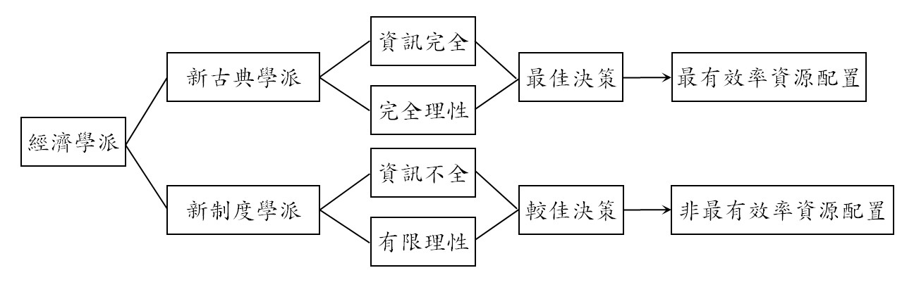

## 296. 有關未辦繼承登記之優先購買人資格（共有人）：參109年度台上字第1546號判決
*發布日期: 2023-04-11* 

## 內文
• 一、案例事實

甲、乙、丙為A地之所有權人，其應有部分各1/3，惟甲死亡後，其應有部分（下稱系爭土地持分）因無人辦理繼承登記，由臺中市政府列冊管理期滿，函請財政部國有財產署依土地法第73條之1規定，委託臺灣金融資產服務股份有限公司公開標售該系爭土地持分，由K得標。

依同條第3項及逾期未辦繼承登記土地及建築改良物標售作業要點規定，繼承人、合法使用人或其他共有人就其實際使用範圍依序有優先購買權。乙為系爭土地之共有人，惟未證明其使用範圍。丙為系爭土地之共有人，與其他共有人有默示分管協議存在，並為該土地上建物之公同共有人，試問乙、丙得否主張優先購買權？

• 二、判決要旨

首先，土地法第73條之1立法目的，係在未辦繼承登記土地或建物標售後，使具有使用事實之繼承人、合法使用人或其他共有人，就其實際使用範圍有優先購買權，俾使土地之使用與所有權能合一，以利經濟效益。

（補充：惟有學者認為此處應是兼顧確保繼承人、合法使用人等有居住事實之現使用人得以繼續居住之權益。亦即應限縮於居住之使用（陳立夫，2023，逾期未辦繼承登記不動產標售時之優先購買權，月旦法學雜誌，第332期））

（一）乙無優先購買權

乙為系爭土地之共有人，惟未證明其使用範圍，依土地法規定，僅得就實際使用範圍主張，未使用範圍即無適用餘地，而無優先購買權。

（二）丙應有優先購買權

依標售要點第11點第1項前段、第12點第1項規定，可知共有人行使土地法本條項之優先購買權，須為逾期未辦繼承登記土地或建物之共有人，及有實際使用之事實，且僅得就其實際使用之範圍主張優先購買權。至於該共有人有無使用之合法權源，則非所問。

本條項所指之其他共有人，自不以分別共有人為限，包括公同共有人，以公同共有人就該土地或建築改良物之所有權與使用權，逐漸趨於合一之故。又本條規定之優先購買權人，係立法賦予其有取得優先購買權之資格，得行使之權利係優先購買權，該權利行使既係一種資格，非行使全體公同共有人之公同共有權利，自無需由公同共有人共同為之，與公同共有人權利行使無涉。

因此，丙應有優先購買權。
---
*注：本文圖片存放於 ./images/ 目錄下*

## 297. 交易成本
*發布日期: 2023-04-06* 

## 內文
• (一) 交易成本之意義

交易成本（ Transaction Cost ），指交易過程中所必須負擔之成本。以買賣為例，買方必須負擔交易成本，賣方亦須負擔交易成本。

交易成本有別於生產成本。前者係因交易而產生，後者係因生產而產生。

• (二) 交易成本之內容

1. 搜尋資訊之成本：買方擬購買不動產，必須蒐集資訊，以避免買貴。同理，賣方擬出售不動產，必須蒐集資訊，以避免賤售。因此，買賣雙方均有蒐集資訊之成本。

2. 雙方議價尋求真實價格之成本：買賣雙方討價還價，最後達成一致價格。因此，買賣雙方均有協商議價之成本。

3. 訂定契約之成本：買賣雙方簽訂契約，必須對契約內容逐條審視，以避免契約內容不利於己，而造成交易風險。因此，買賣雙方均有簽訂契約之成本。

4. 監視與執行契約之成本：買賣雙方依契約規定行使權利及履行義務。買方監視對方，是否如期辦理過戶登記；賣方監視對方，是否如期交付款項。因此，買賣雙方均有監視對方履行之成本。

5. 保護財產權排除他人侵權之成本：契約履行結果，買方取得不動產，賣方取得價金。如有一方違約，另一方行使請求權，訴請法院強制執行。因此，雙方均有保護財產權排除他人侵權之成本。

• (三) 不動產交易成本偏高

不動產交易與其他財貨交易一樣，均存在交易成本。然，不動產交易成本偏高，其理由如下：

1. 不動產具有異質性：每一件不動產都不一樣，因此買方購買不動產必須精挑細選，並赴現場看屋。

2. 不動產無集中市場：股票有集中市場，故其交易成本低。不動產無集中市場，故其交易成本高。

3. 不動產資訊不流通：不動產交易資訊較其他財貨封閉。不動產交易資訊不流通、不正確及不對稱，造成不動產交易成本高。

4. 不動產交易金額大：不動產屬於高價財貨，買賣交易須特別謹慎，稍有不慎，將損失慘重。因此，不動產交易之議價時間長，預防措施多，故不動產交易成本高。

5. 不動產過戶手續繁瑣：不動產交易必須辦理移轉登記。過戶手續繁複、時間拉長、風險增高，造成不動產交易成本高。

• (四) 交易成本對不動產市場之影響

如圖所示，D0代表無交易成本之不動產需求曲線，S0代表無交易成本之不動產供給曲線。由D0與S0之交點b，決定不動產交易數量Q0。當不動產買賣存在交易成本，因買方有交易成本而使D0左下移至D1，因賣方有交易成本而使S0左上移至S1。由D1與S1之交點e，決定不動產交易數量Q1。不動產買賣因存在交易成本，不動產交易量由Q0減少至Q1，社會福利由△abc縮小為△def。

[圖片1]

• (五) 實價登錄與新科技應用對交易成本之影響

1. 實價登錄：政府推行實價登錄，不動產交易資訊更充分、更透明、更正確，減少買賣雙方搜尋資訊之成本，因而降低交易成本。如圖所示，D1代表實價登錄實施前之不動產需求曲線，S1代表實價登錄實施前之不動產供給曲線。由D1與S1之交點e，決定不動產交易量Q1。嗣實價登錄推行，買方之交易成本降低，而使D1右上移至D2，賣方之交易成本降低而使S1右下移至S2。由D2與S2之交點j，決定不動產交易量Q2。實價登錄推行，不動產交易量由Q1增加至Q2，社會福利由△def擴大為△ijk。最有效率資源配置之交易量在Q0。因不動產買賣存在交易成本，而使資源配置之交易量Q1遠離最有效率資源配置之交易量Q0。實價登錄實施，降低交易成本，而使資源配置之交易量由Q1增加至Q2，更趨近最有效率資源配置交易量Q0。

2. 新科技應用：新科技應用可以降低交易成本。如買方可以先透過網路3D看屋，初步滿意後，才赴現場實地勘查，以減少不必要看屋之交易成本。展望未來，3D看屋進化至虛擬實境看屋，更可大幅度降低交易成本。

• (六) 結論

1. 交易成本等於零，資源配置最有效率。沒有交易成本的世界，稱為「寇斯（Coase）的世界」。寇斯定理是建立在交易成本為零之理想境界。但現實社會，交易成本無所不在，因此，無法達成資源最有效率之配置。

2. 交易成本愈大，資源配置效率愈低。因此，如何降低交易成本，而且交易成本愈低愈好，俾往最有效率資源配置邁進。

3. 政府建立制度（如實價登錄、履約保證、定型化契約等），可以有效降低交易成本，增進市場效率。

## 文章圖片

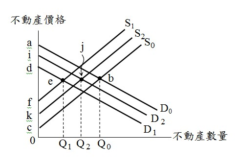

## 298. 巴瑞圖經濟效率與馬歇爾經濟效率
*發布日期: 2023-03-30* 

## 內文
• (一) 巴瑞圖經濟效率

一項政策之實施，某些人福利增加，另一些人福利不變，稱為巴瑞圖經濟效率（Pareto Efficiency）。

• (二) 馬歇爾經濟效率

一項政策之實施，某些人福利增加，另一些人福利減少，但總受益大於總受損，淨效益大於零，稱為馬歇爾經濟效率（Marshall Efficiency）。

• (三) 兩者關係

1. 一項政策之實施，如果符合巴瑞圖經濟效率之要求，必定符合馬歇爾經濟效率之要求。相反地，一項政策之實施，如果符合馬歇爾經濟效率之要求，不一定符合巴瑞圖經濟效率之要求。換言之，巴瑞圖經濟效率涵蓋馬歇爾經濟效率。

2. 政府推行一項政策，當以符合巴瑞圖經濟效率為最佳。無法符合巴瑞圖經濟效率，始退而求其次，至少須符合馬歇爾經濟效率。如果連馬歇爾經濟效率都無法符合，則該項政策不值得採行。

• (四) 舉例

1. 市地重劃與土地徵收之比較：政府取得公共設施用地（如道路、公園、學校等）可採用市地重劃或土地徵收。市地重劃基於使用者付費及受益者負擔精神，符合馬歇爾經濟效率，亦符合巴瑞圖經濟效率。土地徵收以市價補償，雖造成社會大多數人福利增加，但造成被徵收地主福利減少，不符合巴瑞圖經濟效率，但符合馬歇爾經濟效率。

2. 協議價購與土地徵收之比較：政府取得建設用地可採協議價購或土地徵收。協議價購採雙方合意，符合馬歇爾經濟效率，亦符合巴瑞圖經濟效率。土地徵收以市價補償，雖造成社會大多數人福利增加，但造成被徵收地主福利減少，不符合巴瑞圖經濟效率，但符合馬歇爾經濟效率。

3. 土地徵收市價補償與高於市價補償之比較：政府取得公共事業用地可採市價補償或高於市價補償。如採市價補償，基於土地徵收稟賦效果（endowment effect）（指損失土地的痛苦遠大於獲得土地的快樂），造成被徵收地主福利減少，不符合巴瑞圖經濟效率，但符合馬歇爾經濟效率。但如採高於市價補償，使原地主於徵收前與徵收後之福利水準不變，則符合馬歇爾經濟效率，亦符合巴瑞圖經濟效率。

• (五) 結論

1. 巴瑞圖經濟效率優於馬歇爾經濟效率。因此，政府施政應追求巴瑞圖經濟效率；無法達成巴瑞圖經濟效率時，始追求馬歇爾經濟效率。

2. 政府採市地重劃取得公共設施用地，可以符合巴瑞圖經濟效率。但如採市價徵收取得公共設施用地，僅能符合馬歇爾經濟效率，無法符合巴瑞圖經濟效率。

3. 政府如採協議價購取得建設土地，可以符合巴瑞圖經濟效率。但如採市價徵收取得建設土地，僅能符合馬歇爾經濟效率，無法符合巴瑞圖經濟效率。

4. 政府採市價補償取得公共事業用地，僅能符合馬歇爾經濟效率，無法符合巴瑞圖經濟效率。但如採高於市價取得公共設施用地（設原地主於徵收前與徵收後之福利水準無差異），可以符合巴瑞圖經濟效率。

[圖片1]

## 文章圖片

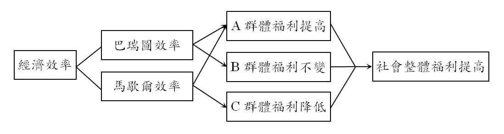

## 299. 公同共有人行使優先購買權是否需經全體同意：臺灣高等法院暨所屬法院111年法律座談會民執類提案第15號
*發布日期: 2023-03-28* 

## 內文
案例：法院拍賣甲之土地應有部分三分之一，拍定後依法對他共有人為優先承買權利行使之通知。其中有共有人乙行使優先承買權，然乙與丙、丁為公同共有關係。法院通知乙補正得丙、丁同意或代全體公同共有人行使優先承買權之委任書。然乙表示其欲單獨行使優先承買權。試問：法院應否准許？

• (一) 過往通說

民法第828條第3項：「公同共有物之處分及其他之權利行使，除法律另有規定外，應得公同共有人全體之同意。」其中，所謂「其他之權利行使」包含甚廣，除處分行為（例如拋棄時效利益）以外，舉凡公同共有物之使用、收益、變更、保存、改良與管理行為、本於所有權對第三人之請求、清算帳目、行使優先承買權、代為意思表示、代受意思表示或通知、或係審判上、審判外之行使均包括在內。

依實務見解大多認為，公同共有物之其他權利（優先承買權）行使，除法律或契約另有規定外，須經全體公同共有人之同意，始得為之 (參照最高法院69年度臺上字第1252號、87年度臺上字第174號等判決及謝在全著，民法物權論中冊，修訂二版，第19至20頁)。

• (二) 臺灣高等法院暨所屬法院111年法律座談會民執類提案第15號

然而，在111年法律座談會的最後投票結果，卻改變了以往的看法。針對上述案例採肯定說。（即肯定公同共有人一得單獨行使優先購買權）

1. 土地法第34條之1第4項規定共有人出賣其應有部分時，他共有人得以同一價格共同或單獨優先承購，此項優先承買權依同條第5項規定於公同共有準用之，公同共有人之一仍具共有人身分自得單獨以其名義行使優先承買權。

2. 土地法第34條之1規定共有人有優先承買權，其目的在消滅、簡化共有關係，如肯認公同共有人得單獨以其名義行使優先承買權符合法規範之目的。且各公同共有人不一定全體意志一致，也非每人均有優先承買之經濟能力，若採乙說可能肇致公同共有人之優先承買權之立法目的無法實現。

3. 依司法院76年2月20日（76）廳民二字第1884號函研究意見認公同共有人之優先承買權，係基於其為乙之分別共有人而當然發生，應可排除民法第828條規定之適用。亦即公同共有人之一得單獨行使優先承買權，不必經其他公同共有人同意，逕自為優先承購權之主張。

審查意見：採肯定說，理由如下：

1. 土地法第34條之1立法意旨係在於兼顧共有人之權益範圍內，排除民法第819條第2項、第828條第3項規定之適用，以便利不動產所有權之交易，解決共有不動產之糾紛，促進共有物之有效利用，增進公共利益。不動產應有部分如屬公同共有者，其讓與得依土地法第34條之1第5項準用第1項規定（司法院釋字第562號解釋）。又依土地法第34條之1第5項準用第4項規定，他公同共有人於公同共有人出賣公同共有土地潛在之應有部分時，對於該公同共有人亦有請求以同樣條件訂立買賣契約之權（最高法院100年度台上字第 1673號裁定意旨參照）。公同共有人依土地法第34條之1第5項準用第1項至第4項規定處分公同共有物或其潛在應有部分，為民法第828條第3項之除外規定，應排除「應得公同共有人全體之同意」之適用。至於他公同共有人行使優先承買權，乃為達簡化共有關係之目的，賦予個別公同共有人優先承買權，其權利行使與公同關係之人法結合關係維持無關，行使權利之結果歸於行使之人，無使其利弊歸於公同共有人全體公同共有之限制及必要。倘該權利之行使須經公同共有人全體同意，有致令優先承買權難以行使之虞，不符土地法第34條之1第4項規定之立法本旨。是應認此項權利之行使，非屬民法第828條第3項所定公同共有物之處分及其他之權利行使，無該條項「應得公同共有人全體之同意」之適用。此在分別共有人出賣應有部分，他共有人因公同共有他應有部分而得依土地法第34條之1第5項準用第4項規定行使優先承買權時，亦應為相同之解釋。

2. 本題甲所有土地應有部分三分之一經強制執行拍定，由執行法院通知他共有人行使優先承買權，其中乙、丙、丁因公同共有該土地他應有部分而受通知，其優先承買權利之行使因非屬民法第828條第3項所定公同共有物之處分及其他之權利行使，不受該條項「應得公同共有人全體之同意」規定拘束。乙表示欲單獨行使優先承買權，執行法院不得因其未得丙、丁之同意而予以否准。

研討結果：照修正後之審查意見通過（即同意肯定說）。

因此，目前按照最新的高等法院座談會研討結果，其認為公同共有人行使優先購買權不需其他公同共有人全體同意，而得單獨行之。然而，法律研討會並無拘束力，僅供後續各法官判決參考，後續仍須觀察判決走向。

參考資料:

1. 持分地主竟無優先購買權？專家點出關鍵在此-地產天下-自由電子報

2. 內政部93年11月30日內授中辦地字第0930016195號函，案經函准法務部93年11月16日法律決字第0930044292號函。

3. 臺灣高等法院暨所屬法院111年法律座談會民執類提案第15號
---
*注：本文圖片存放於 ./images/ 目錄下*

## 300. 容積獎勵、容積移轉與容積代金
*發布日期: 2023-03-23* 

## 內文
• (一) 發展權國有與發展權移轉

發展權，指在土地上從事興建發展之權利。英國首先實施「發展權國有」，即自實施日以後，任何在土地從事興建發展之權利均屬於國家所有。因此，地主擬在其土地上興建房屋，應先申請政府許可，並繳納發展捐，以取得發展權。然由於發展捐過重，造成市場發生閉鎖現象，再加上政黨輪替，英國之發展權國有最後以失敗收場。

英國之發展權國有觀念傳到美國。美國將發展權國有改為發展權私有，而實施「發展權移轉」。即地主可以將其發展權出售於其他可建築土地，其他可建築土地因移入發展權，而提高土地使用強度。

[圖片1]

• (二) 容積獎勵

發展權為物權，依物權法定主義，法律須先增訂發展權。然修法不易，因此我國將發展權改為容積。所稱容積，指土地可建築之樓地板面積（都市計畫容積移轉實施辦法第5條第1款）。

土地使用分區管制透過土地使用類別（如住宅區、商業區、工業區等）及土地使用強度（如建蔽率、容積率、建物高度等），賦予私人財產權範圍。私人僅能在分區管制下進行使用、收益及處分。超過分區管制部分，屬於國有。準此，政府針對符合公共利益或產生外部利益之土地利用，以提高容積率方式予以獎勵。如都市更新、危老重建、綠建築等是。要言之，政府將屬於公有之容積授與私人土地。

容積獎勵可以誘導私有土地往政府之政策方向使用，但也帶來下列負面影響：

1. 公共設施擁擠：一般都市普通存在公共設施不足現象，如道路塞車、公園綠地太少、運動場地缺乏等。政府如再授與容積，進住更多人口，更加深公共設施不足之嚴重性。

2. 以鄰為壑：容積獎勵基地興建出更高、更大的建物，導致鄰近住戶承擔不利後果，如日照受限、通風不良、視野受阻等。

3. 容積獎勵浮濫：政府視容積為免費公共財，訂定各式各樣獎勵事由，不斷加碼，容積獎勵過度浮濫。

4. 喪失都市計畫精神：地方政府運用容積獎勵方式，引導私人土地使用。然，過度容積獎勵，將破壞原先都市計畫規劃構想，喪失都市計畫精神。

• (三) 容積移轉

我國之容積移轉源自於美國之發展權移轉。所稱容積移轉，指一宗土地容積移轉至其他可建築土地供建築使用（都市計畫容積移轉實施辦法第5條第2款）。都市計畫法第83條之1第1項規定，公共設施保留地之取得、具有紀念性或藝術價值之建築與歷史建築之保存維護及公共開放空間之提供，得以容積移轉方式辦理。

都市計畫容積移轉以主要計畫地區為移轉範圍。因此，主要計畫地區範圍，如果容積供不應求，則容積價格提高；主要計畫地區範圍，如果容積供過於求，則容積價格降低。如圖所示，A地區容積需求曲線D0，容積供給曲線S0，則A地區容積價格為P0；B地區容積需求曲線D1，容積供給曲線S1，則B地區容積價格為P1。要言之，每一主要計畫地區均有一個容積移轉市場，其所決定之容積價格皆不相同。

[圖片2]

1. 容積移轉之功能： (1)保護古蹟、歷史建築、環境敏感地區等土地，不致遭受破壞。 (2)限制發展地區之地主藉著出售容積而獲得補償，平衡地主間權益不均問題。 (3)政府可以無償取得公共設施保留地，減輕政府取得公共設施保留地之財政負擔。

2. 容積移轉之流弊： (1)每一主要計畫之容積價格不同，造成公共設施保留地地主之補償不公平。 (2)部分地區容積需求大，容積奇貨可居，公共設施保留地之行情被炒高，形成暴利。另，市場有所謂「容積蟑螂」，以其雄厚資金，大量收購公共設施保留地，壟斷容積供給，操縱容積價格。 (3)容積傾向移入高房價、高容積率地區，造成高密度、高強度發展地區之公共設施更加不足，環境品質更加惡化。

• (四) 容積代金

容積接受基地得以折繳代金方式移入容積。容積代金，應由接受基地所有權人繳交給政府。政府所收取之代金專款專用，以取得與接受基地同一主要計畫地區之公共設施保留地。政府可藉容積代金調節市場上容積之供需，管控容積價格，避免私人操縱、炒作及壟斷容積。然，容積代金仍有下列問題待克服：

1. 折繳代金之金額如何決定。過低，申請者享受不勞利得；過高，申請者無利可圖。

2. 政府未控制容積代金總量，容積代金恐過度浮濫，破壞都市計畫精神。

3. 未考慮公共設施容受力，以決定允許申請容積代金地區，將造成移入容積地區公共設施失衡現象。

• (五) 結論

1. 容積獎勵及容積代金屬於發展權國有之概念，容積移轉屬於發展權私有之概念。

2. 容積獎勵恐發生政府失靈現象，容積移轉恐發生市場失靈現象。

3. 因容積移轉發生市場失靈現象，而導入容積代金。然，容積代金亦會發生政府失靈現象。

[圖片3]

## 文章圖片

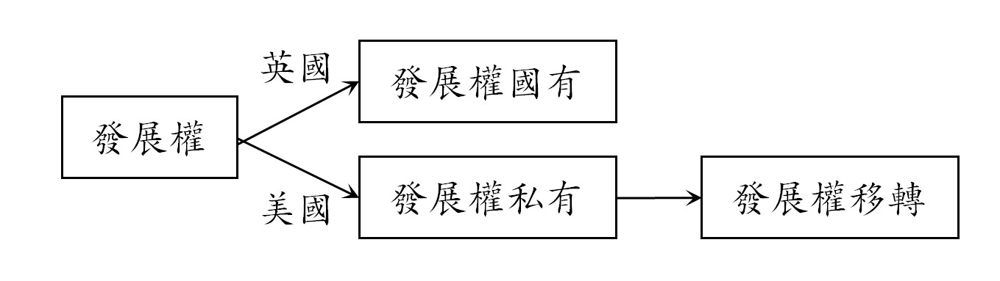

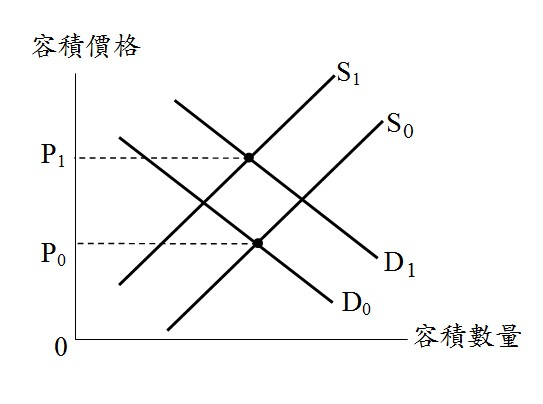

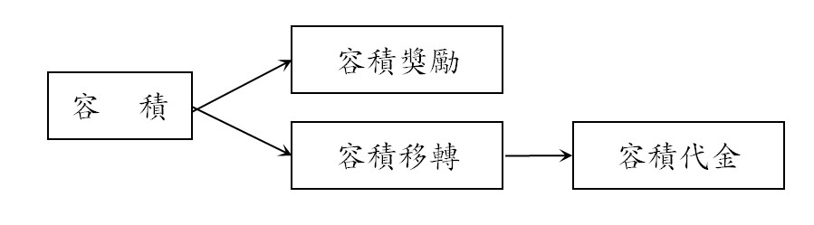

## 301. 公同共有之遺產得否訴請拍賣
*發布日期: 2023-03-21* 

## 內文
甲到處欠錢，身無分文，已無任何財產可供執行。惟後來甲的父親死亡後，遺留一筆不動產，由其子甲及乙各繼承1/2，甲為免被拍賣，故意不辦繼承登記在自己名下，試問債權人得否對該遺產進行查封登記與拍賣程序？

依民法第1151條規定：「繼承人有數人時，在分割遺產前，各繼承人對於遺產全部為公同共有。」因此，遺產在未分割前屬公同共有，故甲、乙僅有潛在應有部分，而無明確的應有部分可供執行。

然而，公同共有之不動產未分割前，公同共有人中部分共有人之債權人雖不得對該不動產聲請強制執行，但可就該「公同共有人之權利」（即應繼分），依對於其他財產權執行之規定執行之。債務人公同共有權利之標的為不動產，其拍賣程序，應類推適用不動產之執行程序。惟債務人公同共有之權利，如係基於繼承關係而來，則因繼承人於遺產分割析算完畢前，對特定物之公同共有權利，尚無法自一切權利義務公同共有之遺產中單獨抽離而為執行標的，故應俟辦妥遺產分割後，始得進行拍賣。

因此，債權人得先就甲的應繼分申請查封登記，後等甲乙遺產分割完畢後，就甲所得部分執行拍賣程序，如甲怠於行使遺產分割權利，則可依民法第242條因保全債權，得以自己(債權人)之名義，行使其權利(即代位提起遺產分割訴訟)。

參考來源：司法院院字第1054號、司法院秘書長100年11月24日秘台廳民二字第1000025754號函釋、法院辦理民事執行實務參考手冊」
---
*注：本文圖片存放於 ./images/ 目錄下*

## 302. 外部效果
*發布日期: 2023-03-16* 

## 內文
外部效果分為外部成本（亦稱外部不經濟）與外部利益（亦稱外部經濟）二種。

• (一) 外部成本

1. 意義：土地開發或土地利用時，有一部分成本由開發者自己負擔，稱為私人成本或內部成本；另有一部分成本不由開發者自己負擔，而由社會整體負擔，稱為外部成本。

2. 私人決策與社會決策不一致：外部成本造成私人決策與社會決策不一致，導致市場失靈之結果。如圖(一)所示，D表示土地開發利益曲線，S表示土地開發之私人成本曲線。由D與S之交點，決定私人土地開發之開發成本P0與開發數量Q0。如果私人土地開發存在外部成本[圖片1]，S’表示土地開發之社會成本（私人成本 + 外部成本 = 社會成本），則由D與S’之交點，決定社會土地開發之開發成本P1與開發數量Q1。由此可知，如果未加入外部成本，開發者將以偏低之開發成本開發過多之土地數量。

[圖片2]

圖(一) 外部成本

3. 外部成本內部化：政府對外部成本予以課稅，使外部成本由開發者負擔，則開發者開發土地之數量將由Q0減少至Q1。

4. 舉例：私人開發山坡地，除開發者自己負擔之開發成本（私人成本）外，亦造成土石流潛在風險增加（外部成本）。如果政府將外部成本予以內部化（如課徵開發影響費），將使山坡地開發數量減少。

• (二) 外部利益

1. 意義：土地開發或土地利用時，有一部分利益由開發者自己享受，稱為私人利益或內部利益；另有一部分利益不由開發者自己享受，而由社會整體享受，稱為外部利益。

2. 私人決策與社會決策不一致：外部利益造成私人決策與社會決策不一致，導致市場失靈之結果。如圖(二)所示，S表示土地開發成本曲線，D表示土地開發私人利益曲線。由D與S之交點，決定私人土地開發之開發利益P0與開發數量Q0。如果私人土地開發存在外部利益[圖片3]，D’表示土地開發之社會利益（私人利益 + 外部利益 = 社會利益），則由D’與S之交點，決定社會土地開發之開發利益P2與開發數量Q2。由此可知，如果未加入外部利益，開發者將以偏低之開發利益開發過少之土地數量。

[圖片4]

圖(二) 外部利益

3. 外部利益內部化：政府對外部利益予以補貼，使外部利益由開發者享受，則開發者開發土地之數量將由Q0增加至Q2。

4. 舉例：私人辦理都市更新，除開發者自己享受之開發利益（私人利益）外，亦造成都市機能復甦（外部利益）。如果政府將外部利益予以內部化（如租稅減免、容積獎勵等），將使都市更新數量增加。

• (三) 結論

1. 外部成本造成私人成本與社會成本之分離，外部利益造成私人利益與社會利益之分離。

2. 庇古（Pigou）主張，政府應對外部成本課徵租稅（此種租稅，稱為庇古租稅），對外部利益給予補貼（此種補貼，稱為庇古補貼）。其目的在使外部效果內部化，促使私人成本與社會成本一致、私人利益與社會利益一致，以解決市場失靈問題。

[圖片5]

## 文章圖片

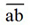

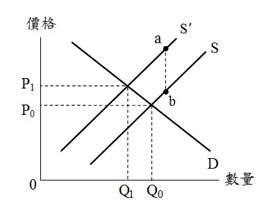

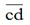

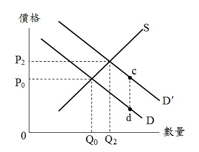

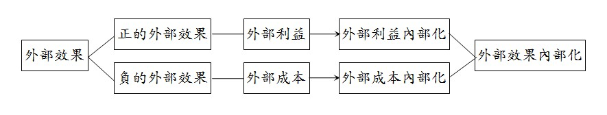

## 303. 公同共有繼承之分割方法：103年度重簡字第544號民事判決
*發布日期: 2023-03-14* 

## 內文
• 一、案例

甲於民國66年過世，其名下不動產由其繼承人辦理繼承登記，並分割遺產完畢，其中甲之配偶乙繼承登記為分別共有5分之1，該分別共有之5分之1即為本件系爭分割之標的，嗣乙於69年死亡，其繼承人有A、B、C、D、E共5人，依繼承關係為公同共有，每人潛在部分之比例應為5分之1，而A復於79年過世，A就被繼承人乙之公同共有部分即由其繼承人F、G、H、I、J等5人與B、C、D、E公同共有。而後遲至102年始辦妥公同共有之繼承登記。B是否得訴請裁判分割？如何分割？

[圖片1]

• 二、說明

• (一) 即使完成公同共有繼承登記仍屬得隨時請求分割之遺產

雖已完成公同共有登記，但該原屬乙的1/5之應有部分仍為遺產，故按繼承人有數人時，在分割遺產前，各繼承人對於遺產全部為公同共有（民1151）；繼承人得隨時請求分割遺產。但法律另有規定或契約另有訂定者，不在此限（民1164）。因此，在遺產並無不能分割之情形，亦無不分割之約定，B得以請求遺產分割。

• (二) 公同共有繼承關係因遺產分割而終止

由於公同關係存續中，各公同共有人，不得請求分割其公同共有物（民829），故請求遺產分割實際同時就公同關係予以終止，即民830規定公同共有之關係，自公同關係終止，或因公同共有物之讓與而消滅。

• (三) 公同共有物分割方法

公同共有物分割之方法，除法律另有規定外，準用關於共有物分割之規定（民830 II）。亦即共有人就共有物之分割方法不能協議決定者，法院得因任何共有人之請求，命為下列之分配：1.以原物分配於各共有人，但各共有人均受原物之分配顯有困難者，得將原物分配於部分共有人；2.原物分配顯有困難時，得變賣共有物，以價金分配於各共有人，或以原物之一部分分配於各共有人，他部分變賣，以價金分配於各共有人。以原物為分配時，如共有人中，有未受分配，或不能按其應有部分受分配者，得以金錢補償之。

至於選擇哪一種分割分配方法，分割共有物究以原物分割或變價分割為適當，法院應斟酌當事人意願、共有物之使用情形、經濟效用及全體共有人之利益等情形而為適當之分割，不受共有人所主張分割方法之拘束（最高法院88年台上字第600號裁判要旨參照）。

綜上所述，在分割遺產前，對於遺產全部為公同共有，因上開遺產並無不能分割之情形，亦無不分割之約定，故如上開遺產不能協議分割，則B以遺產分割為由終止公同共有關係，請求分割乙之遺產，自屬有據。

至於分割分配方法，由於系爭房地之共有人眾多，部分共有人應有部分極少，若採原物分割之方式，勢必造成細分而導致經濟價值大幅減損，造成經濟上之不利益，因此若以變賣系爭遺產，以價金分配於兩造之分割方法，係為妥適公允之分割方法，並能徹底解決公同共有關係及杜絕兩造爭議，是本件就系爭遺產宜採變價方式，再按各公同共有人之應繼分比例分配，對於全體公同共有人最為有利。

參考來源：臺灣新北地方法院103年度重簡字第544號民事判決、88年度台上字第600號

## 文章圖片

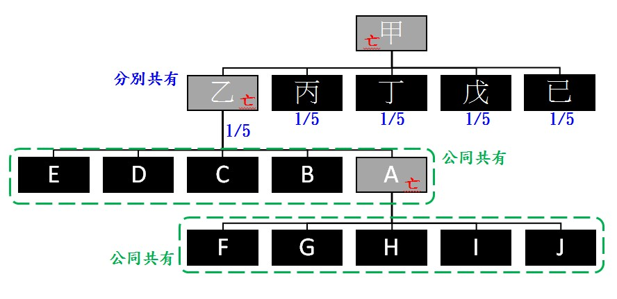

## 304. 共用地悲劇與反共用地悲劇
*發布日期: 2023-03-09* 

## 內文
• (一) 共用地悲劇

1. 意義：財產權未界定清楚，眾人均可免費使用，每個人都盡可能採伐，最後導致土地資源被過度使用，終至枯竭。

2. 原因： (1)共有共用：財產權屬誰，未清楚界定，每個人為了本身利益盡可能使用，將導致土地資源過度使用。如果財產權屬誰，界定清楚，財產所有人為了本身利益經濟、合理、適當、有效使用，將導致土地資源永續利用。 (2)免費使用：當每個人使用土地資源時，不必付出成本，則每個人為了本身利益盡可能使用，將導致土地資源過度使用。當每個人使用土地資源時，必須付出成本，則每個人為了本身利益經濟、合理、適當、有效使用，將導致土地資源永續利用。

3. 舉例： (1)環境污染：環境財產權未界定清楚，工廠任意排放廢氣及廢水，超過環境負荷能力，造成環境污染。 (2)海洋魚獲枯竭：海洋財產權未界定清楚，漁民任意濫捕，造成漁獲量減少，終至枯竭。如果海洋合理捕撈，魚類生生不息，魚獲量源源不絕。 (3)超抽地下水：地下水屬於國有，但政府一直未管制，養殖業超抽地下水，造成地層下陷。以前，台北市政府未管制地下水抽取，造成台北盆地下沉；現今，台北市政府管制地下水抽取，台北盆地就不再下沉。

• (二) 反共用地悲劇

1. 意義：財產權不完整，每一財產權所有人均有權阻止他人使用，最後導致土地資源被低度使用，甚至荒廢。

2. 原因： (1)產權細分：財產權由許多人擁有，如果想使用該財產，須經眾多財產所有人同意，由於人多口雜，難以整合成功，最後只能任其荒廢。 (2)權利割裂：完整財產權包括管理權、用益權、處分權及排他權等。財產所有人無完整財產權，將造成土地資源配置無效率。

3. 舉例： (1)共有土地：共有土地之產權細分，共有人數愈多，土地資源愈難有效整合利用。公同共有比分別共有，易發生反共用地悲劇；分別共有人數較多者比分別共有人數較少者，易發生反共用地悲劇。土地法第34條之1之立法意旨在促進共有土地利用（土地法第34條之1第1項）及減少共有人數（土地法第34條之1第4項），道理在此。 (2)土地與建物所有權分離：土地與建物所有權分屬不同所有權人，權利割裂，土地難以有效利用。土地法第104條之立法意旨在使建物與其基地所有權合一，道理在此。 (3)區分所有建物：區分所有建物，指一幢建築物內存在很多棟建物。任一區分所有權人，就一幢建築物而言，財產權不完整；就一棟建物而言，財產權完整。當一幢建築物老舊時，須經全體區分所有權人同意，始得拆除重建，將造成都市更新的困難。因此，都市更新條例採多數決，以突破區分所有建物整合不易問題。

• (三) 結論

1. 共用地悲劇與反共用地悲劇皆是財產權問題。

2. 財產權界定不清楚，造成共用地悲劇。財產權不完整，造成反共用地悲劇。

3. 共用地悲劇，導致土地資源之過度利用。反共用地悲劇，導致土地資源之低度利用。

[圖片1]

## 文章圖片

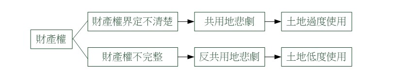

## 305. 主張逾期未辦繼承登記之優先購買權要件
*發布日期: 2023-03-07* 

## 內文
首先，根據土地法第73條之1規定：

• (一) 土地或建築改良物，自繼承開始之日起逾一年未辦理繼承登記者，經該管直轄市或縣市地政機關查明後，應即公告繼承人於三個月內聲請登記，並以書面通知繼承人；逾期仍未聲請者，得由地政機關予以列冊管理。但有不可歸責於聲請人之事由，其期間應予扣除。

• (二) 列冊管理期間為十五年，逾期仍未聲請登記者，由地政機關書面通知繼承人及將該土地或建築改良物清冊移請財政部國有財產署公開標售。繼承人占有或第三人占有無合法使用權者，於標售後喪失其占有之權利；土地或建築改良物租賃期間超過五年者，於標售後以五年為限。

• (三) 依規定標售土地或建築改良物前應公告三個月，繼承人、合法使用人或其他共有人就其使用範圍依序有優先購買權。但優先購買權人未於決標後三十日內表示優先購買者，其優先購買權視為放棄。

因此，其主張優先購買權要件如下：

1. 主體：繼承人、合法使用人或其他共有人

2. 使用：必須於該未辦繼承土地上使用（學者就其立法意旨，主張應以有居住事實之現使用人為限）

3. 範圍：使用範圍（如標售應有部分，則得優先購買權範圍為該使用範圍占整筆土地之比例）

4. 順序：繼承人→合法使用人→其他共有人

5. 期限：決標後三十日內表示

6. 競合：本條之優先購買權與其他法律規定之優先購買權競合時，優先適用本條。不符本條優先購買權者，另依其他法律規定處理優先購買權。（未辦繼承登記土地及建築改良物標售作業要點）

參考來源：陳立夫，2023，土地法裁判精選－逾期未辦繼承登記不動產標售時之優先購買權，月旦法學雜誌，第332期，第223-235頁
---
*注：本文圖片存放於 ./images/ 目錄下*

## 306. 市場失靈與政府失靈
*發布日期: 2023-03-02* 

## 內文
• (一) 市場失靈

1. 意義：土地市場運行中，無法藉由市場機制與價格機能，解決問題的地方。茲說明市場運行與市場失靈之關係： (1)無市場失靈現象：一般財貨（如蘋果、電視機等）市場，如圖(一)所示，一般財貨之需求曲線D0與一般財貨之供給曲線S0，二者交點決定一般財貨價格P0。今，因所得提高，對一般財貨之需求增加，需求曲線由D0右上移至 ，價格由P0上漲至 。供給者發現價格上漲，有利可圖，因而增加一般財貨生產及進口，致供給曲線由S0右下移至 ，價格再由 下跌至P0水準。由此可知，市場機制與價格機能有效運作，價格回復至原來水準，無市場失靈現象。

[圖片1]

圖(一) 一般財貨之市場運行

• (2) 有市場失靈現象：土地市場，如圖(二)所示，土地需求曲線D1與土地供給曲線S1，二者交點決定土地價格P1。今，因所得提高，對土地之需求增加，需求曲線由D1右上移至 ，價格由P1上漲至 。供給者發現價格上漲，有利可圖，惟土地不能生產，亦不能進口，因而供給增加有限，致供給曲線由S0右下移至 ，價格再由 下跌至 。由此可知，市場機制與價格機能無法有效運作，價格無法回復至原來水準，發生市場失靈現象。

[圖片2]

圖(二) 土地之市場運行

2. 原因： (1)外部性：土地利用或土地開發時，如果存在外部成本或外部利益，將使私人決策之均衡點與社會決策之均衡點不一致，而導致市場失靈。 (2)公共財：公共財在需求上具有「非敵對性」，在供給上具有「無排他性」。如由市場自由運作，將發生搭便車現象，造成供給不足，而導致市場失靈。 (3)獨占性：土地具有異質性，彰顯其獨占地位。如由市場自由運作，將發生釘子地或釘子戶問題，而導致市場失靈。 (4)稀少性：土地無法製造，供給量有限，供給彈性甚小。如由市場自由運作，將發生需強供弱現象，而導致市場失靈。 (5)資訊不全：土地無集中市場，資訊不充分與不流通。基於囚犯困境原理，私人之最佳決策，並非總體之最佳決策。

3. 舉例：房價及地價高漲，即是市場失靈之現象。房價及地價高漲，炒作土地及房屋有暴利可圖，投機需求猖獗，房價及地價更上漲。此時，唯賴政府及時干預（如實施打擊房地投機措施），始克平息。

• (二) 政府失靈

1. 意義：市場失靈提供政府干預的理由，然而政府並非萬能，其干預效果仍然有限，甚至適得其反。

2. 原因： (1)欠缺利潤誘因：政府之公務員領取固定薪酬，而無獎金與盈餘分配制度，因循苟且心態，造成政府施政效率不彰。 (2)缺乏競爭：政府機關為獨占事業，所辦理業務（如地政業務、戶政業務等）皆無其他競爭者。有競爭，才會不斷檢討改進，才會不斷進步成長。 (3)博採眾議：政府決策，受到議會監督。因此民意代表、利益團體等運用其影響力左右決策，造成最後決策並非最佳決策，而是相互妥協之結果。 (4)官僚體系：政府機關運作，涉及縱的指揮系統及橫的協調系統。不論指揮與協調均存在單位與單位之間的節點，以致執行成效七折八扣。 (5)貪污舞弊：不肖公務員假借公權力，貪污舞弊，追求個人財富最大化，而造成決策錯誤。

3. 舉例：房價及地價高漲，政府擬採取打擊房地投機措施。然一般政策之實施，可能產生時間落後之現象。此現象依序為：認知落後、行政落後、決策落後、執行落後與效驗落後等五種。認知落後乃是問題存在直至被發覺這段時間。行政落後乃是政府當局發覺問題存在，從事蒐集有關資訊、分析原因及擬訂對策這段時間。決策落後乃是政府機關將擬訂對策提出立法或議會機關通過這段時間。執行落後乃是決策通過後至交付有關單位執行這段時間。效驗落後乃是決策執行至預期效果產生這段時間。在房地產過熱時應立即採取打擊房地投機措施加以抑制，然由於政策的時間落後，實施時房地產已走入蕭條，蕭條期之打擊房地投機措施將使房地產更加蕭條。

• (三) 結論

1. 因市場失靈，而需要政府干預。因政府干預，而產生政府失靈。

2. 庇古（Pigou）理論主張政府干預；寇斯（Coase）理論主張尊重市場。

[圖片3]

## 文章圖片

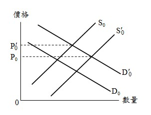

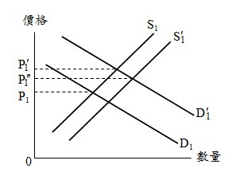

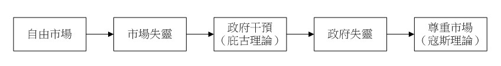

## 307. 農地交易屬房地合一稅課徵範圍：臺中高等行政109簡上字第31號
*發布日期: 2023-02-28* 

## 內文
實務上仍有許多人誤解農地免徵房地合一稅，同學應予釐清。 農地本就屬於依法得核發建築執照之土地，例如可以蓋農舍、相關農業設施（資材室）等，故屬房地合一稅課徵範圍，惟為鼓勵農業政策，所得稅法也規定如有取得「土地增值稅不課徵證明書」者，則可免納房地合一稅。 因此判斷原則如下： ◎有課徵土地增值稅的農地→要繳房地合一稅 ◎不課徵土地增值稅的農地→免繳房地合一稅

以下透過一行政判決為例，予以補充觀念：

■事實 甲於民國106年3月2日以拍賣原因登記取得花蓮縣A地（持分4分之1，所屬面積1,106.25平方公尺），旋於同年月出售，106年3月17日完成所有權移轉登記，經國稅局查得甲持有A地期間在1年以內，且未於該土地完成所有權移轉登記之次日起30日內，辦理個人房屋土地交易所得稅（下稱房地合一稅）申報，乃依查得資料核定應納稅額25,875元，並裁處罰鍰20,000元。甲不服，申請復查後猶表不服，提起訴願，遭決定駁回，遂提起行政訴訟。

■甲主張依所得稅法第4條之4第1項規定核課房地合一稅的標的，包含個人及營利事業自中華民國105年1月1日起交易房屋、房屋及其坐落基地或依法「得核發」建造執照之土地；該條第3項規定，第1項所定房屋之範圍，不包括依農業發展條例申請興建之農舍。本件上訴人出售的是共有持分的農地，面積不足0.25公頃，根本無法申請農舍建照，不是所得稅法第4條之4條第1項規定核課房地合一稅的課稅範圍。因該條第3項規定，依農業發展條例申請興建之農舍並非第1項房地合一稅核課範圍，其坐落之土地自然不是依法得核發建造執照之土地。 （此同為許多人誤解之處）

■判決理由

1. 於105年1月1日以前，個人及營利事業出售土地享有免納所得稅之租稅優惠，容易衍生納稅義務人運用操控房地價格，規避所得稅等缺失。為解決現制房屋及土地分開課稅之缺失，建立合理透明稅制，抑制短期投機炒作，健全不動產市場發展，乃對自105年1月1日起交易房屋、房屋及其坐落基地或依法得核發建造執照之土地，其交易所得納入課徵所得稅範圍，其中排除課稅範圍者，為依農業發展條例申請興建之農舍。惟農舍坐落之土地，法律並未將其排除在外，僅於符合農業發展條例第37條及第38條之1規定而申請不課徵土地增值稅時，始有免納所得稅之適用。又「依法得核發建造執照之土地」，依最高行政法院102年度判字第296號判決意旨，係以土地本質來認定，而非以土地移轉當下之外觀狀態判斷之，否則易生以人為操作俾得規避稅賦。

2. 經查，A地之總面積為4,425平方公尺，甲持分1/4面積為1,106.25平方公尺，使用分區：山坡地保育區；使用地類別：農牧用地。又A地屬非都市土地範圍，如符合「農業用地興建農舍辦法」或「申請農業用地做農業設施容許使用審查辦法」許可要件，非不得申請建築農舍或農業生產設施；查無A地相關坡度專業技師簽證文件據以認定該土地位屬坡度30%以上之山坡地而有限制建築及開發。原判決略以：「系爭持分土地面積雖未達興建農舍規定之2,500平方公尺，惟非不能藉由擴大持分、合併土地或參加興建集村農舍等方式克服而使之能供建築，如僅因面積不足供建築即不課稅，豈非變相鼓勵土地以化整為零方式為交易而避稅，故系爭土地核非客觀上無法申請核發建造執照，本質仍屬依法得供建築之土地，為所得稅法第4條之4規定之課徵範圍。」等語，認定A地符合所得稅法第4條之4規定應課徵房地合一稅之標的，經核並無違誤。

3. 亦即，依土地性質，在客觀上絕對不能核發建照，始得謂『依法不能建築之土地』。由於一般可供建築之土地，如欲獲核發建照，往往尚須符合相關土地使用、建築法令之要件，如因此等法規要件不備未能獲核發建照，尚非土地本身不能建築之故，因此所謂『依法不能建築』，應區別『土地性質在客觀上絕對不能核發建照』，抑或『原可能供建築，只是其他法令要件不備』情形，否則浮濫擴大解釋依法不能建築土地而得免徵所得稅，將增加人為操縱、逃避稅捐並形成不公。

4. 惟農業發展條例第37條及第38條之1規定，係規範作農業使用之農業用地移轉予自然人時，須取得農業主管機關核發該土地作農業使用證明書，得申請不課徵土地增值稅。而所得稅法第4條之5第1項第2款既以『符合農業發展條例第37條及第38條之1規定』為要件，立法係配合農業政策鼓勵農地作農業使用之減免為規定，該條解釋上自應以實際供作農業使用，始得受鼓勵而予減免。關於是否『實際供作農業使用』，事涉農業使用之定義與實際狀況之專業判斷，依行政專業分工、機關間相互協力以提升效能之法理，自宜由主管農業事務之專責單位出具農用證明書以資證明，始能免納土地交易所得稅。準此，個人出售土地，仍應以該土地出售時符合『作農業使用』規定，並檢具農用證明書，始能免納土地交易所得稅。（注意實務上國稅局會要求提出的是「土地增值稅不課徵證明書」，有農業用地作農業使用證明沒有申請不課徵土地增值稅一樣不行）
---
*注：本文圖片存放於 ./images/ 目錄下*

## 308. 土地法之優先購買權
*發布日期: 2023-02-23* 

## 內文
土地法規定之優先購買權有下列三種：

• (一) 土地法第34條之1第4項之優先購買權：共有人出賣其應有部分時，他共有人得以同一價格共同或單獨優先承購（土§34-1Ⅳ）。

1. 立法意旨：減少共有人數。

2. 行使要件： (1) 須為共有不動產：僅限於共有不動產，不包括共有動產。又，共有包括分別共有與公同共有二種。前者，各共有人得出賣其應有部分，共有人亦得以多數決出賣共有不動產全部。後者，各共有人不得出賣其潛在應有部分，但共有人得以多數決出賣共有不動產全部。 (2) 須共有人出賣其應有部分：僅限於買賣（包括標售、拍賣等），不包括交換、贈與、設定他項權利等。另，出賣其應有部分，擴大適用於共有人依土地法第34條之1第1項多數決（即人數過半，且應有部分過半；或應有部分逾三分之二，人數不計）出賣共有不動產全部。 (3) 須出賣予共有人以外之人：共有人出賣其應有部分予其中之共有人，因已符合立法意旨，其他共有人無優先購買權。 (4) 須依同樣條件主張承購：雖法條規定為同一價格，然應擴大解釋為同一條件。亦即，除買賣價格外，其他如付款方式、付款期限、稅費負擔等皆須相同。 (5) 須於接到出賣通知後15日內表示：優先購買權屬於形成權。為避免買賣之法律關係懸而未決，本項優先購買權之除斥期間為15日；逾期不表示，優先購買權視為放棄。

3. 法律性質（法律效力）：土地法第34條之1第4項之優先購買權，具有債權性質。申言之，出賣人未通知優先購買權人而為所有權之移轉登記，其移轉行為仍然有效，此時優先購買權人僅得向出賣人請求損害賠償。

• (二) 土地法第104條之優先購買權：基地出賣時，地上權人、典權人或承租人有依同樣條件優先購買之權。房屋出賣時，基地所有權人有依同樣條件優先購買之權。其順序以登記之先後定之（土§104Ⅰ）。

1. 立法意旨：房屋與其基地所有權合一。

2. 行使要件： (1)須地上有房屋存在：僅限於房屋，不包括工事或工作物。如地上為涼亭、游泳池、牆垣等，皆不得適用。 (2)須房屋與基地之所有權人不同：房屋與其基地分屬不同所有權人，始得適用本項優先購買權。 (3)須房屋所有人對基地有地上權、典權或租賃權：房屋所有人占有其基地之權源限於地上權、典權或租賃權，不包括無權占有及使用借貸。換言之，房屋所有人為該基地之地上權人、典權人或承租人。 (4)須基地出賣或房屋出賣：僅限於出賣（包括標售、拍賣等），不包括交換、贈與等。另，基地出賣時，地上權人、典權人或承租人有優先購買之權；相反地，房屋出賣時，基地所有權人有優先購買之權。 (5)須依同樣條件主張承購：所稱同樣條件指出賣人與第三人簽訂買賣契約書記載之條件，包括買賣價格、付款方式、付款期限、稅費負擔等。 (6)須於接到出賣通知後10日內表示：優先購買權屬於形成權。為避免買賣之法律關係懸而未決，本項優先購買權之除斥期間為10日；逾期不表示，優先購買權視為放棄。

3. 法律性質（法律效力）：土地法第104條之優先購買權，具有物權性質。申言之，出賣人未通知優先購買權人而為所有權之移轉登記，優先購買權人得主張移轉行為無效。

• (三) 土地法第107條之優先購買權：出租人出賣或出典耕地時，承租人有依同樣條件優先承買或承典之權（土§107Ⅰ）。

1. 立法意旨：扶植自耕農。

2. 行使要件： (1)須為出租耕地：限於土地法第106條所規定之耕地租用，始得適用。土地法第106條規定，以自任耕作為目的，約定支付地租，使用他人之農地者，為耕地租用。前項所稱耕作，包括漁牧。 (2)須耕地出賣或出典：包括出賣與出典二種情形。換言之，出租人出賣耕地時，承租人得主張優先承買；出租人出典耕地時，承租人得主張優先承典。 (3)須依同樣條件主張承受：承租人應以出賣或出典之同樣條件主張。承租人如更改條件而主張承受，視同放棄優先購買。 (4)須於接到出賣通知後10日內表示：優先購買權屬於形成權。為避免買賣或設定典權之法律關係懸而未決，本項優先購買權之除斥期間為10日；逾期不表示，優先購買權視為放棄。

3. 法律性質（法律效力）：土地法第107條之優先購買權，具有物權性質。申言之，出賣人或出典人未通知優先承受人而為所有權移轉登記或設定典權登記，優先承受人得主張移轉行為或設定典權行為無效。
---
*注：本文圖片存放於 ./images/ 目錄下*

## 309. 連續多次繼承之房地合一稅課徵認定：臺中高等行政法院110訴字第161號判決
*發布日期: 2023-02-21* 

## 內文
■案例事實：

甲的父親於94年2月22日購買A房地，後於106年7月25日死亡，為考量喪偶心情，甲與其母協議將系爭房地全數辦理分割繼承登記予其母，嗣後母於民國108年7月5日死亡，原告繼承取得該A房地，並於同年8月12日辦妥分割繼承登記，以及於109年1月21日以買賣為原因，將系爭房地移轉登記與丙，並依限於同年2月18日辦理房地合一稅申報。國稅局核定課稅所得3,144,018元，按適用稅率20%，核定應納稅額628,803元。原告不服，申請復查，未獲變更，訴願決定亦予維持，遂提起本件行政訴訟。

[圖片1]

爭議點：依所得稅法，甲房地持有期間計算，是算到母親取得，還是可算到其父親取得時，將影響其適用新、舊制，以及稅率之問題。

■先來看看原告理由，這是目前許多人也有碰到的誤解：

原告主張出售之系爭房地自94年起即105年所得稅法新法施行前為原告家庭所持續持有，持有期間已超過15年，顯非短期炒作投資，自原始持有94年起算，更應適用財政部104年8月19日台財稅字第10404620870號令(下稱財政部104年8月19日令)之例外適用舊法課徵所得稅之情形。

其中，按財政部104年8月19日令對於「被繼承人」之定義，並未限縮於「一世代」，亦未有僅限於直接繼承之情形，被告擴張解釋遽認原告繼承自父親之系爭房地，有違租稅法定主義之虞。又所得稅法第4條之4第1項及第14條之4第4項觀之，僅規定「第4條之4第1項第1款、第4條之5第1項第1款及前項有關期間之規定，於繼承或受遺贈取得者，得將被繼承人或遺贈人持有期間合併計算。」並無限定「被繼承人」為單純繼承或再轉（多次）繼承之情形，且所得稅法第14條之4第4項規定，繼承取得者，得將被繼承人持有期間合併計算，亦即被繼承人之取得原因如為繼承取得者，則應追溯至最前手被繼承人之取得日期，始符立法目的。（此案件關鍵爭議在此！）

■國稅局理由：

原告之被繼承人為甲母，依行為時所得稅法第14條之4第4項規定，僅得併計甲母持有系爭房地期間，與甲父取得時點無涉。又有關個人105年1月1日以後交易因連續多次繼承取得之房屋、土地，究應如何認定「被繼承人」取得時點、計算持有期間及其適用稅率疑義，經財政部於109年5月25日以台財稅字第10904508590號函復：「有關納稅義務人交易因繼承取得房屋、土地(下稱房地)，倘該房地係被繼承人於105年1月1日以後取得者，尚無本部104年8月19日台財稅字第10404620870號令規定之適用。」（也就是被繼承人在105年後取得者，就會適用新制房地合一稅）甲母係於106年7月25日取得系爭房地，並非於104年12月31日以前取得，核與財政部104年8月19日令規定不符，自無該令釋規定得適用舊制之餘地。另被告機關已依行為時所得稅法第14條之4第4項規定，計算持有期間為甲母取得日106年7月25日起至甲交易之日109年1月21日（移轉登記與買受人）止，超過2年，未逾10年（注意這個案件適用房地合一1.0，如果是現在的房地合一2.0版本，稅率會是35%「超過2年未逾5年」），適用稅率為20%。是甲主張持有期間應自其父親購買取得日94年起算，應適用舊制課稅，核無足採。

■行政法院判決：

1. 依本件應適用行為時所得稅法第14條之4第4項規定「得將被繼承人持有期間合併計算」之文義，並未明定包括納稅義務人之再轉繼承之被繼承人，且該項關於繼承取得者，得將被繼承人持有期間合併計算之例外規定，旨在合理必要範圍內適度減輕新制實施之影響，故適用上不宜擴張解釋，應認該項規定之被繼承人係指納稅義務人之被繼承人，不包括再轉繼承之被繼承人，故僅合併計算納稅義務人與被繼承人之持有期間。

2. 關於行為時所得稅法第14條之4第4項及房地合一課徵所得稅申報作業要點第5點第1項第1款前段規定「得將被繼承人持有期間合併計算」，應僅指納稅義務人之被繼承人持有期間可合併計算；本件雖有「連續多次繼承取得房地」之情形，惟僅得合併計算甲及其被繼承人甲母持有系爭房地之期間，無從將甲父親持有期間依行為時所得稅法第14條之4第4項規定合併計算。

3. 本件「連續二次繼承取得」系爭房地之事實，除甲之母死亡時即108年7月5日繼承取得外，其前一次係甲之父於106年7月25日死亡由其母親繼承之時，依前開說明，僅合併計算原告及其被繼承人即母親持有系爭房地之期間，不再合併甲父親持有之期間。故本件無從將甲父持有期間依行為時所得稅法第14條之4第4項規定合併計算，或主張合併計算連續多次繼承取得房地持有期間，認定甲之被繼承人母親的被繼承人即甲的父親取得系爭房地在104年12月31日前，而適用財政部104年8月19日令釋之內容主張依舊制計算財產交易所得稅。

因此，被告以原告於108年7月5日繼承且其被繼承人係於106年7月25日取得系爭房地，並於109年1月21日出售系爭房地為由，核定系爭房地交易課稅所得額3,144,018元，按適用稅率20%（現制應為35%），核定應納稅額628,803元，並無違誤。

■結論

繼承僅算至前一手，即該次被繼承人的持有期間而已，並不會一直往回合併加計連續多次繼承取得持有期間！

## 文章圖片

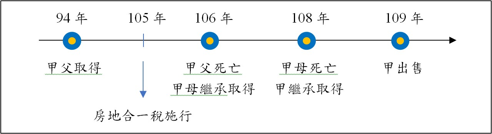

## 310. 都市計畫通盤檢討之法律性質
*發布日期: 2023-02-16* 

## 內文
甲擁有位於T市都市計畫範圍內土地A，並於A地上建有獨棟透天建築物一幢供自己家庭居住之用。T市府辦理都市計畫通盤檢討時，為改善當地交通長期壅塞問題，決定將道路B由鄰里級12公尺寬度拓寬為30公尺做為區域級道路，因此必須徵收A地。甲對於道路B之拓寬不服，認為都市計畫侵害其權益，在都市計畫公告後即以T市府為被告機關提起都市計畫行政訴訟。請依都市計畫之法律性質與主管機關權限分配，分析甲之起訴是否有誤。（111年原住民三等特考）

【解答】

• (一) 都市計畫通盤檢討之法律性質：司法院釋字第742號解釋指出：

1. 都市計畫擬定計畫機關依規定所為定期通盤檢討，對原都市計畫作必要之變更，屬法規性質，並非行政處分。惟如其中具體項目有直接限制一定區域內特定人或可得確定多數人之權益或增加其負擔者，基於有權利即有救濟之憲法原則，應許其就該部分提起訴願或行政訴訟以資救濟，始符憲法第16條保障人民訴願權與訴訟權之意旨。

2. 都市計畫之訂定（含定期通盤檢討之變更），影響人民權益甚鉅。立法機關應於本解釋公布之日起二年內增訂相關規定，使人民得就違法之都市計畫，認為損害其權利或法律上利益者，提起訴訟以資救濟。如逾期未增訂，自本解釋公布之日起二年後發布之都市計畫（含定期通盤檢討之變更），其救濟應準用訴願法及行政訴訟法有關違法行政處分之救濟規定。

基上，行政訴訟法增訂第二編第五章都市計畫審查程序（即行政訴訟法第237條之18至第237條之31）。

• (二) 甲之起訴有誤：依行政訴訟法第237條之18第1項規定，人民、地方自治團體或其他公法人認為行政機關依都市計畫法發布之都市計畫違法，而直接損害、因適用而損害或在可預見之時間內將損害其權利或法律上利益者，得依規定，以核定都市計畫之行政機關為被告，逕向管轄之高等行政法院提起訴訟，請求宣告該都市計畫無效。 基上，甲應以T市都市計畫之核定機關為被告機關，而不得以T市府為被告機關。
---
*注：本文圖片存放於 ./images/ 目錄下*

## 311. 地政士辦理假買賣真贈與之刑事責任：臺灣高等法院高雄分院104上易字第138號判決、臺灣士林地方法院105訴字第128號判決
*發布日期: 2023-02-14* 

## 內文
實務上地政士為協助委託人「節稅」，或許會有一些「建議」。 然而，其中有關假買賣真贈與之作法，已有許多刑事判決，地政士收受報酬並不高（還會被沒入），卻受刑責處罰，實得不償失，宜多所注意。 這部分亦可能在一些實例題出現，同學可準備一些相關論述。

• 一、使公務員登載不實罪（臺灣高等法院高雄分院104上易字第138號）

甲委由地政士丙將其土地出售給其孫乙，但實際上並無出售本件土地之真意，渠3人共同基於使公務員登載不實之犯意聯絡，由甲及乙檢附上蓋有2人印文之本件土地所有權買賣移轉契約書為附件，連同土地登記申請書委由丙以「買賣」為原因，向K地政事務所遞件申請土地所有權移轉登記。

本件土地實際上甲欲以贈與方式，移轉土地所有權予乙，而當時被告乙之經濟生活狀況及主觀意願，其確無買受本件土地之能力及真意。被告丙雖辯稱以買賣作為登記原因係甲等人之決定，並有檢附相關支付價金證明云云，然審諸渠既擔任執業代書，對於稅捐相關法規及土地交易流程本即知之甚詳…被告丙既清楚知悉甲實欲將本件土地贈與被告乙，業如前述，最終卻以「買賣」為登記原因送件，其主觀上對於上開「買賣」原因關係乃不實事項之情即有所認知，而對於此部分犯行亦同有犯意聯絡及行為分擔。丙巳證稱有向甲、乙介紹買賣與贈與交易異同，嗣經甲、乙共同決定以買賣為登記名義乙節。…被告丙辯稱：我是確認甲與乙要用買賣做原因，才以此事由辦理土地登記，不知道他們實際上是否為贈與云云，均核與事證未合，難認為可採。

刑法第214條使公務員登載不實罪之成立，須一經他人之聲明或申報，公務員即有登載之義務，並依其所為之聲明或申報予以登載，而屬不實之事項者，始足構成。地政機關辦理土地所有權移轉登記時，僅須審核形式上之要件是否具備即足，對於土地所有權移轉之實質上是否真正，並無審認之責，倘行為人明知所申辦之土地所有權移轉登記，實質上並非真正，仍以該不實之事項向地政機關申辦登記，使地政機關承辦之公務員登載於職務上所掌之相關公文書內，自與上開犯罪構成要件相當。

因此，三人犯刑法第214條使公務員登載不實罪。渠乙及丙就上開犯行與甲彼此間有犯意聯絡及行為分擔，均為共同正犯。法官認定他們行為足生損害於地政機關對於不動產登記管理及稅務機關核課稅捐之正確性，所為實屬不該；尤以被告丙身為執業代書，熟知不動產交易實務上此種為求避稅以買賣為名掩藏贈與之實之交易類型有觸法之虞且層出不窮，猶仍實施前開犯行，其可非難性更甚於甲乙。

• 二、幫助逃漏稅捐罪（臺灣士林地方法院105訴字第128號判決）

• A. 為B之子，A欲將其所有K地贈與B，委請受顧某地政士事務所擔任登記助理員之C，代為辦理系爭土地、建物之所有權移轉登記及有關之稅務事項。B及C均明知A與B間就系爭土地及建物，實際上並無買賣關係存在，惟若以「贈與」為所有權移轉登記原因，納稅義務人B須依一般稅率經核課較高額之土地增值稅，無法適用土地稅法第34條第1項出售自用住宅用地之土地增值稅優惠稅率，為使B得以適用優惠稅率逃漏土地增值稅，B與C共同基於使公務員登載不實之犯意聯絡，決定佯以「買賣」作為系爭土地及建物之所有權移轉登記原因。不知情之地政事務所承辦公務員經形式審查後，將B因「買賣」取得系爭土地及建物所有權之不實事項，登載於職務所掌之土地、建物登記簿等公文書，足以生損害於地政機關對於不動產登記管理及稅捐稽徵機關對於土地增值稅核課之正確性，C幫助B以上述詐術，逃漏按一般稅率與優惠稅率核課之土地增值稅差額337萬9,120元；嗣C辦妥系爭土地、建物所有權移轉登記及有關之稅務事項後，收受B給付之現金報酬6,400元。

按刑法第214 條使公務員登載不實事項於公文書罪，須一經他人之聲明或申報，公務員即有登載之義務，並依其所為之聲明或申報予以登載，而屬不實事項者，始足構成。若其所為之聲明或申報，公務員尚須為實質之審查，以判斷其真實與否，始得為一定之記載者，即非本罪所稱之使公務員登載不實。又土地登記事項中，移轉原因為其中重要事項之一，具有公信性，各種不同移轉登記原因，所憑課稅標準，各有不同，如買賣與贈與或遺產繼承等課稅標準不同，行為人明知該項買 賣為移轉登記原因係不實之事項，竟以之申請移轉登記，自足損害於地籍之管理，即土地登記之公信性，及政府稅課之正確性，應依刑法第214條使公務員登載不實罪論處。地政事務所僅須依遺產及贈與稅法第42條規定，審核有無檢附稅款繳清證明書等，至該案件是否屬遺產及贈與稅法第5條規定以贈與論之情事，非屬地政機關審查事項等情。換言之，地政事務所承辦公務員僅就申請人有無檢附稅款繳清證明書、證件是否齊備、證件權利內容有無瑕疵等事項，進行形式審查，至於申請書所載移轉登記原因是否屬實（即A與B間就系爭土地及建物實際上有無買賣關係存在），非屬地政機關審查事項。因此，此部分行為，B、C均係犯刑法第214條使公務員登載不實罪，且具有犯意聯絡及行為分擔，為共同正犯。

為適用土地稅法第34條第1項出售自用住宅用地之土地增值稅優惠稅率，使被告B僅須繳納較低額之土地增值稅，即佯以「買賣」之不實移轉原因，向稅捐稽徵處申報系爭土地之移轉而施詐術，使其誤按優惠稅率核課土地增值稅，使被告B逃漏按一般稅率與優惠稅率核課之土地增值稅差額337萬9,120元，是核被告B所為，係犯稅捐稽徵法第41條之逃漏稅捐罪。

爰審酌被告C身為地政士登記助理員，不思依循法規，據實辦理系爭土地、建物之所有權移轉登記及有關稅務事項，竟為圖賺取報酬，使納稅義務人之被告B獲取逃漏土地增值稅之不當利益，與被告B共同以不實所有權移轉原因辦理相關程序，所為顯非有當，且C幫助B逃漏之土地增值稅數額高達337萬9,120元，對於國家稅收之不良影響非微。

登記助理員C為稅捐稽徵法所規定執行業務之合法代理人。被告C明知被告B非因買賣取得系爭土地所有權，竟為使被告B得以適用優惠稅率，少繳土地增值稅，佯以「買賣」之不實移轉原因，向稅捐稽徵處申報系爭土地之移轉，幫助被告B逃漏前開土地增值稅，是核被告C此部分所為，係犯稅捐稽徵法第43條第2項、第1項執行業務之合法代理人幫助逃漏稅捐罪，應加重其刑。處有期徒刑4個月。屬C犯罪所得之新臺幣6,400元，沒收之，如全部或一部不能沒收或不宜執行沒收時，追徵其價額。
---
*注：本文圖片存放於 ./images/ 目錄下*

## 312. 借名登記
*發布日期: 2023-02-09* 

## 內文
• 一、最高法院民事大法庭裁定－－108年度台上大字第1636號裁定

非原住民乙欲購買原住民甲所有原住民保留地經營民宿，為規避山坡地保育利用條例第37條第2項、原住民保留地開發管理辦法第18條第1項規定，乃與原住民丙成立借名登記契約，以丙名義與甲簽訂買賣契約，甲以該地為乙設定地上權後，將所有權移轉登記予丙。乙丙間之借名登記契約、甲丙間之買賣契約、甲為乙設定地上權及將所有權移轉登記予丙之行為，無異實現非原住民乙取得原住民保留地所有權之效果，自違反上開禁止規定，依民法第71條本文規定，應屬無效。

• 二、考題分析

甲為原住民，擁有原住民保留地A，今非原住民乙打算於A地經營休閒農場與餐廳，乃與甲商議以新臺幣五百萬元購買A地，甲同意。乙隨即先在A地設定期限二十年之地上權，並在給付價金後，乙商得另一位原住民丙之同意，由甲將A地辦理所有權移轉登記於原住民丙名下，但擬由乙做為真正的A地所有權人。本案在所有登記作業完成後因當事人間發生爭執，致進入司法程序。

• (一) 請詳細分析當事人間法律關係，敘明理由判斷本案中A地所有權歸屬於何人？ (二)法院認定A地登記名義應回到甲身上，問承辦地政事務所應採何種登記方式辦理？（111年原住民三等特考）

【解答】

• (一) A地所有權之歸屬：

1. 依山坡地保育利用條例第37條第2項規定，原住民取得原住民保留地所有權，如有移轉，以原住民為限。又，依原住民保留地開發管理辦法第18條第1項規定，原住民取得原住民保留地所有權後，除政府指定之特定用途外，其移轉之承受人以原住民為限。

2. 當事人為規避上開規定，以迂迴方法達成該規定所禁止之相同效果之行為，違反「原住民保留地之移轉，其承受人以原住民為限」之立法意旨，依民法第71條前段規定：「法律行為，違反強制或禁止之規定者，無效。」因此相關法律行為之效力如下：(1)乙與丙簽訂之借名登記契約，無效。 (2)甲與丙簽訂之買賣契約，無效。 (3)甲為乙設定地上權之行為，無效。 (4)甲將所有權移轉登記予丙之行為，無效。

綜上，本案中A地所有權歸屬於甲。

• (二) 地政事務所辦理登記之方式：法院認定A地登記名義應回到甲身上，承辦地政事務所依據法院判決辦理「塗銷登記」。亦即，塗銷丙之所有權及乙之地上權。
---
*注：本文圖片存放於 ./images/ 目錄下*

## 313. 登記錯誤遺漏或虛偽之損害賠償責任：最高法院大法庭110年度台上大字第3017號裁定
*發布日期: 2023-02-07* 

## 內文
根據土地法第68條規定，「因登記錯誤遺漏或虛偽致受損害者，由該地政機關負損害賠償責任。但該地政機關證明其原因應歸責於受害人時，不在此限。前項損害賠償，不得超過受損害時之價值。」究竟地政事務所是負無過失責任，抑或是故意或過失為賠償要件，過去司法判決上見解有所歧異，因而送大法庭來做統一見解之裁定。

此大法庭裁定會是土地登記的重要考點，同學應多加注意！

本周專欄將相關重點，摘要與整理如下：

• 一、案例事實 甲主張第三人丙持其弟即訴外人丁之身分證、印章及丁名義之房屋、土地（下稱系爭不動產）所有權狀，向乙地政事務所申請辦理以系爭不動產設定丁為抵押人、伊為抵押權人，擔保債權總金額新臺幣（下同）375萬元之最高限額抵押權（下稱系爭抵押權）登記，並以丁之名義向伊借款250萬元。嗣系爭抵押權登記遭乙以係虛偽登記為由塗銷，伊向丙聲請強制執行而無效果，受有系爭借款250萬元無法取回之損害，爰依土地法第68條第1項規定，請求乙如數賠償。

• 二、法律問題 基礎事實甲所主張因「虛偽登記」致受損害之情形，乙地政事務所是否應依上開規定負損害賠償責任？倘屬肯定，乙地政事務所所屬登記人員之歸責原則為何？

• 三、裁定主文 因登記錯誤遺漏或虛偽致受損害者，除非該地政機關能證明其原因應歸責於受害人，否則即應負損害賠償責任，不以登記人員有故意或過失為要件。

• 四、主文(無過失責任)與鄭法官不同意見書(過失責任)之理由彙整

• T. ABLE_PLACEHOLDER_1
---
*注：本文圖片存放於 ./images/ 目錄下*

## 314. 土地國有與土地私有
*發布日期: 2023-02-02* 

## 內文
• (一) 土地國有

1. 優點： (1)絕對地租消失：土地私有制度，由於所有權獨占，為使邊際土地加入生產行列，地主必須索取絕對地租。因地主索取絕對地租，造成產品價格上漲，對消費者不利。倘土地私有改為土地國有，絕對地租就會消失。 (2)漲價自動歸公：所稱漲價，指土地自然增值，即因人口增加、經濟繁榮、社會安定、公共建設等，而造成地價上漲部分。土地自然增值為地主不勞而獲，故應課徵土地增值稅予以收歸公有。倘土地私有改為土地國有，土地自然增值自動歸公。 (3)公共建設用地順利取得：土地私有制度，國家推行公共建設，必須徵收私有土地。然，徵收私地，常造成人民抗爭，推展不易。倘土地私有改為土地國有，用地取得順利，公共建設如期進行。

2. 缺點： (1)發生政府失靈：土地國有，政府統籌規劃土地利用。但政府並非萬能，如有人謀不臧、貪污舞弊、請託賄賂等，導致土地規劃及分派不當，影響土地利用。 (2)土地難以地盡其利：公部門土地開發，由於涉及政治層面（如民意代表、利益團體等），往往以社會最大公約數作為政治妥協，土地難以達成最有效率之使用。 (3)土地無法永續利用：土地私有制度，人民基於永久之所有權，保護地力，並促進投資改良，最後使荒漠變成良田。土地國有制度，人民恐因短期之使用權而掠奪經營，最後使良田變成荒漠。

• (二) 土地私有

1. 優點： (1)發揮財產權功能：土地私有制度，人民擁有財產權。藉著財產權之作用，誘使地主投資改良土地。當地主無需該土地時，地主會將其移轉於出價最高的人，而出價最高的人就是最能有效利用該土地之人。 (2)市場機制與價格機能：土地私有制度，藉著市場機制與價格機能，指導土地使用，而決定土地使用性質及土地使用強度。 (3)土地使用合理配置：土地私有制度，靠著競租理論配置土地使用。所謂競租理論，指每一塊土地均有很多潛在競爭者參與競標，最後以競標地租最高者取得土地使用權。競標地租最高者，代表最有能力使用該土地之人。

2. 缺點： (1)發生市場失靈：土地私有制度，雖依賴市場機制與價格機能運行，然市場仍有盲點。當市場發生土地投機、土地獨占或土地兼併，價格機能無法藉由本身力量自行復原，發生市場失靈現象。 (2)房市泡沫化：不動產景氣過熱時，炒房投機嚴重，房價與地價高漲，房市泡沫化。房市泡沫將影響正常經濟活動，且泡沫一旦破滅，衝擊整體經濟，帶來長期衰退。 (3)貧富不均惡化：富有的人，不斷購置房地；田連阡陌，而更加富有。貧窮的人，買不起房地；貧無立錐之地，而更加貧窮。此一現象，違反居住之公平正義。

• (三) 結論

1. 土地國有制度，將發生政府失靈；土地私有制度，將發生市場失靈。

2. 共產國家，一般採行土地國有制度，酙酌加入市場機制；民主國家，一般採行土地私有制度，酙酌加入計畫管制。換言之，現今世界，無土地完全國有制度的國家，亦無土地完全私有制度的國家。

3. 我國平均地權制度，主張土地私有，並以上級所有權與下級所有權劃分公私產權界線，以謀求地盡其利及地利共享。

[圖片1]

## 文章圖片

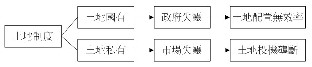

## 315. 未經領得建造執照而銷售公寓大廈：最高法院109年度台上字第1433號判決
*發布日期: 2023-01-31* 

## 內文
最近平均地權條例修法禁止換約，在同學問題中，要先釐清「換約」與「轉讓紅單」的不同：

• 紅單：簽約前的購屋預約單。也就是還沒簽約，只是一個優先簽約的權力。

• 換約：簽約後土地登記前轉讓他人。也就是在預售屋還未登記前，更換契約買受人。但不論哪一種，都必須建商已經拿到建造執照才得以銷售。

以下彙整一個最高法院判決對於未經領得建造執照而銷售公寓大廈之損害賠償責任。

某公寓大廈建造執照經核准變更設計時，該棟僅14層樓，後又再進行變更設計，改為17樓，惟主管機關要求應依規定將原不計入容積之防空避難室部分，納入容積計算，地上樓層面積隨之減少，故原規劃7戶變更為5戶，惟該未被核准的17樓某戶（係爭房地）已由A購買紅單，後轉讓給B與建商簽訂買賣契約，再與C簽訂讓與承諾書及讓與同意書（換約）。因此，辦理系爭房地轉售予C時，系爭房屋僅掛件申請主管機關審查變更設計，尚未經核准建造，當不得作為預售屋之買賣標的，其竟將其他樓層之平面圖，充當系爭房屋之平面圖，辦理轉售，致C誤以為買受之標的物屬於依法令得預售之建物，因而交付價金 890萬元，惟該建商卻不能給付系爭房屋。

按違反保護他人之法律，致生損害於他人者，負賠償責任，民法第184條第2 項前段定有明文。所謂違反保護他人之法律者，係指以保護他人為目的之法律，亦即一般防止妨害他人權益或禁止侵害他人權益之法律而言；或雖非直接以保護他人為目的，而係藉由行政措施以保障他人之權利或利益不受侵害者，亦屬之。查公寓大廈管理條例第58條第1項規定：「公寓大廈起造人或建築業者，非經領得建造執照，不得辦理銷售。」乃課公寓大廈起造人或建築業者為銷售前，應就所銷售房屋先領得建造執照之義務，目的在於保障公寓大廈預售屋之買受人，避免因所購房屋未能取得建造執照，致權益受侵害。是不論以何種方式銷售，均在上開規定禁止之列，縱以預約、預售、含有優先議價權或優先購買權之紅單為名，及就其所衍生權利為同意轉讓者，亦同。此項規定自屬保護他人之法律。

因此，本案依據違反公寓大廈管理條例管理條例第58條第1項規定，出售不存之系爭房屋，並根據侵權行為之法律關係請求該建商、銷售經紀人連帶賠償損害。
---
*注：本文圖片存放於 ./images/ 目錄下*

## 316. 違章建築可否主張時效取得？
*發布日期: 2023-01-19* 

## 內文
茲分二種情形說明：

• (一) 占有他人土地：占有人無權占有他人土地，所興建之房屋必屬違章建築。爰要求占有人應提出該建築係合法建物之證明文件，將使時效取得地上權形同具文。是以，司法院釋字第291號解釋指明，因無從提出該項合法建物之證明文件，致無法完成其地上權之登記，與憲法保障人民財產權之意旨不符。

• (二) 占有他人建物：占有人無權占有他人建物，該建物為違章建築。因違章建築無從辦理登記，占有人縱具備時效取得之要件，仍不得時效取得其所有權。

綜上，上開二種情形係屬兩事。第(一)種情形，時效取得地上權登記；占有他人土地，

占有人所興建之建物得為違章建築。第(二)種情形，時效取得建物所有權登記；占有他人建物，建物本身不得為違章建築。

須強調的是，占有人占有未辦理建物所有權第一次登記之合法建物，始得主張時效取得建物所有權。然，占有人之時效利益僅及於建物，未及於土地。換言之，占有人對於土地不得主張時效取得所有權（指對未登記土地）及地上權（指已登記土地），因此占有人時效取得之建物對於土地仍屬無權占有，土地所有人仍得對地上建物行使物上請求權，訴請拆屋還地。
---
*注：本文圖片存放於 ./images/ 目錄下*

## 317. 地籍測量實施規則修正重點
*發布日期: 2023-01-17* 

## 內文
最近修法不少，包含平均地權條例、地籍清理條例、租賃住宅市場及發展管理條例、地籍測量實施規則等

地籍測量實施規則此次修正有約40條，大多是與地政考試有關的條文，此次專欄針對幾個比較重要的考點修正，予以簡要彙整如下（劃底線為修正文字），其餘部分於過完年後，我們地測課程都會更新及說明喔。

⚫ 申請土地複丈原因

土地有下列情形之一者，得申請土地複丈（以下簡稱複丈）： 一、因自然增加、浮覆、坍沒、分割、合併或變更。 二、因界址曲折需調整。 三、依建築法第四十四條或第四十五條第一項規定調整地形。 四、宗地之部分設定地上權、農育權、不動產役權或典權。 五、因主張時效完成，申請時效取得所有權、地上權、農育權或不動產役權。 六、鑑界或位置勘查。

土地所有權人除申請鑑界複丈，經登記機關派員使用儀器於實地測量後埋設制式界標之外，尚可依內政部相關函釋意旨，申請土地位置勘查。上開複丈作業皆係針對申請標的，協助明瞭其位置所在，不涉及土地標示變動，爰刪除第一款鑑界文字，整併新增為第六款申請項目。（參修正對照表之修正理由）

⚫ 申請土地複丈文件

第二百零七條 申請複丈，除本規則另有規定外，應提出下列文件： 一、土地複丈申請書。 二、權利證明文件。 三、申請人身分證明。 四、其他經中央主管機關規定之文件。 前項第二款至第四款檢附之文件，能以電腦處理達成查詢者，得免提出。 複丈涉及原有標示變更者，應於申請複丈時，填具土地登記申請書，一併申請土地標示變更登記。

此次修法調整為跟我們上課一樣的條列方式。

⚫ 退還土地複丈費

第二百十四條 申請人申請複丈案件，有下列情形之一者，得於十年內請求退還其已繳土地複丈費： 一、依第二百十一條之一規定申請撤回。 二、申請再鑑界，經查明前次複丈確有錯誤。 三、經通知補正屆期未補正或未依補正事項完全補正而駁回。 四、其他依法令應予退還。 前項第一款、第三款之情形，其已支出之費用應予扣除。 申請人於十年內重新申請複丈者，得予援用其得請求退還之土地複丈費。

之前上課就有提到土登已配合行政程序法改為10年，但測量沒改。此次修法真的配合改為10年了。

⚫ 囑託複丈案件

第二百二十二條 各級法院、檢察機關或行政執行分署囑託之複丈案件，受囑託機關應依受囑託事項辦理，其土地複丈成果僅提供囑託機關。

囑託辦理之複丈案件，登記機關應本於鑑定人之特別學識，依司法機關囑託提供鑑定成果，並按囑託函內容逕送鑑定成果書圖供其裁判參考。又爭訟事件涉及訴訟當事人或第三人，非僅與土地所有權人相關，現行第一項後段對土地所有權人不得發給土地複丈成果圖部分似未妥適，爰修正為正面規範是類案件應僅提供囑託機關，以資周延。（參修正對照表之修正理由）

⚫ 界址調整複丈

第二百二十五條 土地界址曲折調整者，應檢附界址曲折調整協議書，並以同一地段、地界相連、使用性質相同之土地可達成減少地界線段為限。如為實施建築管理地區，並應符合建築基地法定空地分割辦法規定。 前項土地設有他項權利者，應先徵得他項權利人之同意。

界址曲折調整係就相鄰土地間，其界址分布符合曲折之情形時，方得適用。是以，如界址調整後反形成地界曲折或不利使用等情形，自非法所許，為免界址曲折調整案件實務執行認定爭議，爰定明是類案件之標的除以同一地段、地界相連、使用性質相同之土地為限外，應以截彎取直為之，並參考相關法令增列土地界址曲折調整（調整地形）協議書。（參修正對照表之修正理由）

⚫ 建物複丈原因

建物有下列情形之一者，得申請建物複丈： 一、因增建或改建。 二、因部分滅失、分割、合併或其他標示變更。 三、因全部滅失或基地號、門牌號等變動需勘查。

建物因基地號、門牌號等標示變更所申請複丈，或建物全部滅失之消滅登記前須先經勘查等，登記機關僅辦理現場勘查認定作業，尚與前述複丈作業有別，惟仍屬民眾得申請之項目。（參修正對照表之修正理由）

⚫ 申請建物測量文件

第二百六十一條之一 申請建物測量，除本規則另有規定外，應提出下列文件： 一、建物測量申請書。 二、權利證明文件。 三、申請人身分證明。 四、其他經中央主管機關規定之文件。 前項第二款至第四款檢附之文件，能以電腦處理達成查詢者，得免提出。

⚫ 退還建物測量費

申請人申請建物測量案件，有下列情形之一者，得於十年內請求退還其已繳建物測量費： 一、依第二百六十四條之一規定申請撤回。 二、經通知補正屆期未補正或未依補正事項完全補正而駁回。 三、其他依法令應予退還。 前項第一款、第二款之情形，其已支出之費用應予扣除。 申請人於十年內重新申請建物測量者，得予援用其得請求退還之建物測量費。

配合行政程序法改為10年退還時效。

⚫ 退還建物測量費

建物平面圖測繪邊界依下列規定辦理： 一、建物以其外牆之外緣為界。 二、兩建物之間有牆壁區隔者，以共用牆壁之中心為界；無牆壁區隔者，以建物使用執照竣工圖說區分範圍為界。 三、使用執照竣工圖說載有依建築技術規則檢討設置之陽臺者，其突出部分以外緣為界，並以附屬建物辦理測量。 四、地下層依建物使用執照竣工圖說所載樓層面積之範圍為界。 中華民國一百零七年一月一日前已申請建造執照者，或都市更新事業計畫已報核，並依都市更新條例一百零八年一月三十日修正施行前第六十一條第一項及第二項規定期限申請建造執照之建物，其屋簷、雨遮及地下層之測繪，依本條一百零六年一月九日修正前規定辦理。

1. 辦理轉繪建物平面圖作業，除依據竣工圖之各樓層平面圖外，亦需注意專共圖說配置情形，必要時尚需參考立面圖、結構圖等圖說，以確認測繪登記範圍。

2. 我國土地登記制度係為實現國家土地政策及維護社會交易安全制度，不動產登記與測量內容及程序係依據土地法授權，由中央地政機關統一訂之，第一項第三款所稱陽臺應有明確界定。爰參考建築技術規則建築設計施工編第一條第二十款規定，直上方有遮蓋物之平臺為陽臺；且其設置依同條第三款及第一百六十二條第一項第一款規定檢討該建物之建築面積與容積總樓地板面積之定義予以修正，以避免實務執行認定疑義。（參修正對照表之修正理由）
---
*注：本文圖片存放於 ./images/ 目錄下*

## 318. 司法院解釋及憲法法庭判決所揭示之特別犧牲，人民是否有徵收補償請求權？
*發布日期: 2023-01-12* 

## 內文
司法院解釋及憲法法庭判決若揭示人民蒙受特別犧牲，則人民得否直接依據該解釋或判決，請求國家辦理徵收補償。茲分下列二種情形說明：

• (一) 不得直接援引憲法請求徵收補償：

憲法係國家立法及施政之方針，亦即憲法指導國家立法及施政。準此，人民向國家請求給付必須依據法律，不得依據憲法。進而，人民不得援引司法院解釋及憲法法庭判決，向國家請求給付。

司法院解釋或憲法法庭判決，雖揭示特別犧牲，但人民不得直接援引該解釋或判決，請求國家辦理徵收，給予補償；而須由國家制定法律，依據法律辦理徵收，給予補償。此即「無法律，無補償」。然，也衍生政府怠於制定法律，造成此等解釋或判決之宣示意義大於實質意義。茲列舉較著名者如下：

1. 公共設施保留地：公共設施保留地若不為取得，則土地所有權人既無法及時獲得對價，另謀其他發展，又限於都市計畫之整體性而不能撤銷使用之管制，致減損土地之利用價值。其所加於土地所有權人之不利益將隨時間之延長而遞增。雖都市計畫法第49條至第51條之1等條文設有加成補償、許為臨時建築使用及免稅等補救規定，然非分就保留期間之久暫等情況，對權利受有個別損害，而形成特別犧牲者，予以不同桯度之補償。為兼顧土地所有權人之權益，如何檢討修正有關法律，係立法問題，合併指明（司法院釋字第336號解釋理由書）。

2. 既成道路：既成道路符合一定要件而成立公用地役關係者，其所有權人對土地既已無從自由使用收益，形成因公益而特別犧牲其財產上之利益，國家自應依法律之規定辦理徵收給予補償，各級政府如因經費困難，不能對上述道路全面徵收補償，有關機關亦應訂定期限籌措財源逐年辦理或以他法補償（司法院釋字第400號解釋）。

3. 既成道路或都市計畫道路埋設地下設施物：主管機關對於既成道路或都市計畫道路用地，在依法徵收或價購以前埋設地下設施物妨礙土地權利人對其權利之行使，致生損失，形成其個人特別之犧牲，自應享有受相當補償之權利（司法院釋字第440號解釋）。

4. 農田水利會水利使用之土地：原提供農田水利會水利使用之土地，應照舊使用。如屬人民所有，而未以租用、價購或其他方式取得權源，因其已形成個人之特別犧牲，即應依法徵收，給予相當之補償，並於三年內擬定徵收補償相關計畫，籌措財源，俾於合理期限內逐步完成徵收補償，始符憲法第15條保障人民財產權之意旨（憲判字第155號判決）。

• (二) 得直接援引憲法請求徵收補償：

雖無法律，即無補償。然亦有例外：

需用土地人因興辦土地徵收條例第3條規定之事業，穿越私有土地之上空或地下，致逾越所有權人社會責任所應忍受範圍，形成個人之特別犧牲，而不依徵收規定向主管機關申請徵收地上權者，土地所有權人得請求需用土地人向主管機關申請徵收地上權。未就土地所有權人得請求需用土地人向主管機關申請徵收地上權有所規定，與上開意旨不符。有關機關應自本解釋公布之日起一年內，基於本解釋意旨，修正土地徵收條例妥為規定。逾期未完成修法，土地所有權人得依本解釋意旨，請求需用土地人向主管機關申請徵收地上權（司法院釋字第747號解釋）。

綜上，實務以否定說為準；如採肯定說，須解釋文或判決文有明定者為限。
---
*注：本文圖片存放於 ./images/ 目錄下*

## 319. 房屋稅減半徵收之適用：平民住宅、國民住宅、社會住宅、臨時工廠、特定工廠？
*發布日期: 2023-01-10* 

## 內文
首先，房屋稅減半徵收之相關規定情形如下：

房屋稅條例第 15 條第2項 私有房屋有下列情形之一者，其房屋稅減半徵收： 一、政府平價配售之平民住宅。 二、合法登記之工廠供直接生產使用之自有房屋。 三、農會所有之自用倉庫及檢驗場，經主管機關證明者。 四、受重大災害，毀損面積佔整棟面積三成以上不及五成之房屋。

農產品市場交易法第 17 條農產品批發市場之土地及房屋，減半徵收房屋稅、地價稅或田賦。

以下就相關名詞說明之：

• 一、平民住宅 其中，何謂平價配售之平民住宅，根據釋字第267號及臺財稅字第37639號、台財稅第31337號函示：

1. 配售住宅每戶建坪不得超過12坪。

2. 合乎政府訂定配住人身分標準配售予平民而非標售者。

3. 平價住宅之售價不大於興建成本，其貸款興建之利息部分，由政府負擔者。

4. 政府配售予違建拆除戶之整建住宅。

• 二、國民住宅 國民住宅，係指由政府計劃，依下列方式，用以出售、出租、貸款自建或提供貸款利息補貼，供收入較低家庭居住之住宅（國民住宅條例第2條(已廢止)）：

• 一、政府直接興建。 二、貸款人民自建。 三、獎勵投資興建。 四、輔助人民自購。

政府配售予違建拆除戶、攤販、災害戶、退役軍人、國軍遺族等之國民住宅，不得減半課徵房屋稅（台財稅第31337號函）。因此，國民住宅原則與一般房屋相同，而無減半徵收適用。

• 三、社會住宅

社會住宅指由政府興辦或獎勵民間興辦，專供出租之用之住宅及其必要附屬設施（住宅法第3條）。社會住宅於興辦期間，直轄市、縣（市）政府應課徵之地價稅及房屋稅，得予適當減免。減免之期限、範圍、基準及程序之自治條例，由直轄市、縣（市）主管機關定之，並報財政部備查。租稅優惠，實施年限為五年，其年限屆期前半年，行政院得視情況延長之（住宅法第22條）。因此，社會住宅房屋稅是否減半徵收則由地方政府決定。

• 四、合法登記之工廠供直接生產使用之自有房屋

• (一) 合法登記工廠 根據工廠管理輔導法第10條，工廠設廠完成後，應依本法規定申請登記，經主管機關核准登記後，始得從事物品製造、加工。因此，合法登記工廠，是指依工廠管理輔導法完成工廠登記者。

• (二) 供直接生產使用 係指從事生產必須之建物、倉庫冷凍廠及研究化驗室等房屋，並不包括辦公室、守衛室、餐廳等房屋在內。（高雄市稅捐稽徵處，2016）

• (三) 自有房屋 上述所稱「自有房屋」，應指符合下列規定者而言（財政部62/01/05台財稅第30076號令）：

1. 工廠為公司或法人組織者，其房屋應為公司或法人本身所有。

2. 工廠為合夥組織者，其房屋應為合夥事業所有或依工廠設立登記規則（現行法為工廠管理輔導法）登記工廠營業負責人本身所有。

3. 工廠如為獨資經營者，其房屋應為依工廠登記設立規則登記工廠營業負責人本身所有。

故以個人名義登記之建物，如係符合前述供該個人自己負責經營之獨資或合夥事業設立工廠登記供直接生產使用者，房屋稅得適用減半徵收。如係出租供他人設立工廠登記，即使直接供生產使用，仍無房屋稅減半徵收規定之適用。（高雄縣政府地方稅務局，2009）

• 五、補辦臨時工廠

中華民國97年3月14日前既有低污染之未登記工廠，其符合環境保護、消防、水利、水土保持等法律規定者，於中華民國104年6月2日前，得向地方主管機關繳交登記回饋金，申請補辦臨時工廠登記（工廠管理輔導法第34條）。按工輔法第34條規定，經補辦臨時登記之工廠於臨時工廠登記失效前，雖免依區域計畫法、都市計畫法及建築法等規定處罰，惟仍有違反各該規定使用之事實，且「未登記工廠補辦臨時工廠登記辦法」第15條亦規範該等工廠取得土地及建築物合法使用證明文件前，事業主體及工廠登記事項變更等限制，故臨時登記工廠於臨時工廠登記證明文件有效期間內，與合法登記之工廠有別，尚難謂其屬房屋稅條例第15條第2項第2款所稱「合法登記之工廠」。（台財稅字第10200013360號）

• 六、特定工廠

依核定之工廠改善計畫完成改善者，得向直轄市、縣（市）主管機關申請特定工廠登記，有效期限至本法中華民國108年6月27日修正之條文施行之日起20年止。依「特定工廠登記辦法」取得特定工廠登記者，於有效期間內，雖得不受土地使用及建築法規之相關處罰，並得准予接水、接電及使用，但仍須取得土地及建物合法使用之證明文件，才可依相關規定申請登記為合法工廠，如僅取得特定工廠登記，係處於未登記工廠受政府納管輔導成為合法工廠階段，與房屋稅條例所稱合法登記之工廠有別，仍應依實際使用情形(工廠)按營業用稅率（3%）課徵房屋稅。（臺中市政府地方稅務局，2022）（參台財稅字第11104592360號函）
---
*注：本文圖片存放於 ./images/ 目錄下*

## 320. 土地徵收補償方式
*發布日期: 2023-01-05* 

## 內文
土地徵收之補償方式有下列三種：

• (一) 現金補償：土地徵收以現金補償為主，並應符合下列原則：

1. 相當補償原則：補償額須與損失額相當，以保障被徵收人之財產權。

2. 迅速補償原則：補償應儘速發給，不得遷延時日。

• (二) 抵價地補償：區段徵收時，除以現金補償外，亦得以徵收後可供建築之土地折算抵付（此種土地稱為抵價地）。須注意者，抵價地補償僅限於區段徵收，一般徵收無抵價地補償。

• (三) 債券補償：區段徵收土地所需之資金，得由中央或直轄市主管機關發行土地債券（平§5Ⅰ）。依法徵收之土地，得以現金搭發土地債券補償地價（平施§10）。須注意者，債券補償須與現金補償搭發，不得全部發給債券；且限於區段徵收，一般徵收無債券補償。
---
*注：本文圖片存放於 ./images/ 目錄下*

## 321. 土地法第73條之1第3項優先購買權之性質
*發布日期: 2023-01-04* 

## 內文
一般學者主張具有債權效力，然亦有部分學者主張具有物權效力。

• (一) 主張債權效力之理由：土地法第73條之1第3項未明定「出賣人違反規定而將所有權移轉者，其移轉不得對抗優先購買權人。」準此，土地法第73條之1第3項之優先購買權具有債權效力。

• (二) 主張物權效力之理由：逾期未辦理繼承登記土地及建築改良物標售作業要點第13點規定：「土地法第73條之1第3項之優先購買權與其他法律規定之優先購買權競合時，優先適用土地法第73條之1之優先購買權。」準此，土地法第73條之1第3項之優先購買權先於物權效力之土地法第104條及第107條而行使。因此，土地法第73條之1第3項之優先購買權具有物權效力。

• (三) 主張兼具物權效力與債權效力之理由：土地法第73條之1第3項優先購買權之次序為繼承人、合法使用人、其他共有人。第二次序為合法使用人，其優先購買權類似土地法第104條，因此具有物權效力。第一次序為繼承人，其次序優先於合法使用人，因此應具有物權效力。第三次序為其他共有人，其優先購買權類似土地法第34條之1第4項，因此具有債權效力。

綜上，筆者主張第(三)說。亦即土地法第73條之1第3項之優先購買權，第一次序繼承人及第二次序合法使用人皆具有物權效力，第三次序其他共有人則具有債權效力。
---
*注：本文圖片存放於 ./images/ 目錄下*

## 322. 國土計畫法與區域計畫法中在土地利用管制上之異同
*發布日期: 2023-01-03* 

## 內文
• (一) 相同處

1. 兩者管制主要適用於都市計畫與國家公園範圍以外之地區。

2. 兩者皆屬分區管制（容積率、建蔽率、高度管制）結合許可制。

3. 兩者皆有分區劃設與使用地編定。

4. 兩者皆有針對管制前得予從來使用，必要時強制拆遷之規範。

• (二) 相異處

1. 分區劃設：前者為4大功能分區，分別為國土保育地區、海洋資源地區、城鄉發展地區與農業發展地區；後者則有一般農業區、特定農業區、鄉村區等11種分區。

2. 分類劃設：前者在各功能分區下有再進一步分類，如第1類、第2類及其他必要分類；後者則無分類。

3. 使用地編定： (1) 前者應依國土計畫國土功能分區分類編定適當的使用地，即計畫編定；而後者則囿於當時作業時間人力之限制，多採現況編定。 (2) 前者使用地仍待主管機關訂定；後者則編定有19種使用地。原則上兩者應有所不同。

4. 使用項目訂定：前者應就各該功能分區及分類之土地使用原則訂定適當的使用項目，並配合編定使用地，故不同功能分區下之同一種使用地，其使用項目會有所差異；然而，區域計畫下非都市土地所編定之使用地，其容許使用項目及許可使用細目並未配合分區差異而有所不同，無法凸顯各該分區下使用地之特性及條件差異。

5. 許可制： (1)目的不同：前者於符合國土功能分區及其分類之使用原則下，從事一定規模以上或性質特殊之土地使用，應由申請人檢具規定之書圖文件申請使用許可，惟使用許可不得變更國土功能分區、分類；後者則為開發利用，依各該區域計畫之規定，由申請人擬具開發計畫，檢同有關文件，向直轄市、縣（市）政府申請，報經各該區域計畫擬定機關許可後，辦理分區變更。 (2)負擔不同：使用許可應繳納國土保育費及影響費；開發許可則應繳納開發影響費。 (3)審議條件不同：前者除土地使用適宜性、交通與公共設施服務水準、自然環境及人為設施容受力之一致性審議條件外，尚有針對各功能分區特性之特定條件；後者則僅有一致性之審議條件。 (4)審議機關不同：前者針對功能分區劃分中央與縣市主管機關之權限；後者則主要由中央主管機關審議，並依規模得委辦縣市政府審議。
---
*注：本文圖片存放於 ./images/ 目錄下*

## 323. 比較法何以無一般因素調整？
*發布日期: 2022-12-29* 

## 內文
• (一) 一般因素、區域因素及個別因素：

影響勘估標的或比較標的價格之因素，可分為一般因素、區域因素及個別因素等三個層次。如圖1所示。

1. 一般因素：指對於不動產市場及其價格水準發生全面影響之自然、政治、社會、經濟等共同因素（估技§2，估技代表不動產估價技術規則）。

2. 區域因素：指影響近鄰地區不動產價格水準之因素（估技§2）。

3. 個別因素：指不動產因受本身條件之影響，而產生價格差異之因素（估技§2）。

[圖片1]

圖1 影響不動產價格之因素

• (二) 區域因素調整及個別因素調整：

比較法係以比較標的價格為基準，經過情況、價格日期、區域因素及個別因素等四項調整，以推算勘估標的價格之方法。其中，區域因素調整及個別因素調整之意涵如下：

1. 區域因素調整：所選用之比較標的與勘估標的不在同一近鄰地區內時，為將比較標的之價格轉化為與勘估標的同一近鄰地區內之價格水準，而以比較標的之區域價格水準為基礎，就區域因素不同所產生之價格差異，逐項進行之分析及調整（估技§19）。

2. 個別因素調整：以比較標的之價格為基礎，就比較標的與勘估標的因個別因素不同所產生之價格差異，逐項進行之分析及調整（估技§19）。

• (三) 兩者連結（如圖2所示）：

1. 一般因素與一般因素調整之連結：勘估標的與比較標的同位於國內，一般因素相同，則無須進行一般因素調整。實務上，所蒐集比較標的大都為國內交易案例，鮮少國外交易案例，故比較法無一般因素調整。但如勘估標的為台灣之國際連鎖飯店或百貨公司，若國外地區（如香港、上海、東京、曼谷等）屬於同一供需圈，所蒐集比較標的為國外交易案例，因二國之政經情況不同，則必須進行一般因素調整。

2. 區域因素與區域因素調整之連結：勘估標的與比較標的位於同一近鄰地區，區域因素相同，則無須進行區域因素調整。相反地，勘估標的與比較標的不在同一近鄰地區，區域因素不相同，則必須進行區域因素調整。

3. 個別因素與個別因素調整之連結：不動產具有異質性。勘估標的與比較標的之個別因素不同，則必須進行個別因素調整。

[圖片2]

圖2 影響不動產價格之因素與比較法之調整的連結

## 文章圖片

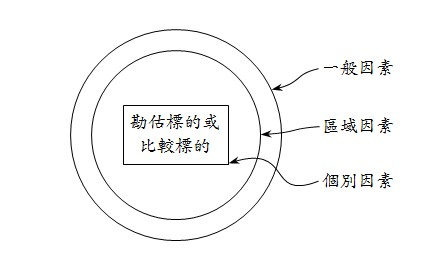

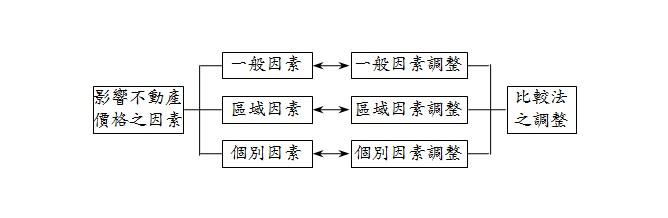

## 324. 法定優先購買權得否預先拋棄
*發布日期: 2022-12-27* 

## 內文
所謂預先拋棄應係指買賣契約成立前，即終局放棄先買權之行使(黃健彰)。 原則如法律並無禁止者，即得以預先拋棄；例外倘若基於公共利益或國家政策等保護特定對象之目的，則可透過解釋為不准預先拋棄。

茲整理一些學者之論述如下：

• 權利是法律賦予個人享受特定利益的力量，原則上得為拋棄，但例外情形，為保護權利者個人利益或社會公益，法律設有權利不得事先拋棄的規定，例如民法規定權利能力、自由時效利益等不得預先拋棄。(王澤鑑)

• 如法定優先承買權賦予之目的在於保護法律關係中弱勢之一方當事人者，囿於他方當事人可能以較強之經濟或知識能力以特約排除此類規定，故應有解釋為不准預先拋棄之必要，以免保護規範目的落空。例如大法官釋字第124號，其概念上主要基於耕地三七五減租條例寓有保護耕地承租人、貫徹憲法保護自耕農之政策性目的，認為耕地承租人於耕地出賣或出典前所為之拋棄仍屬無效。(林誠二，2014)

• 於其他情形者，優先承買權之存在雖有促進財產之利用或減少紛爭之助益，但同時亦可能有不利交易之疑慮，故除有以定型化契約條款約定預先拋棄優先承買權時應受定型化契約理論之規範者外，自應容許當事人間預先約定拋棄或同意不行使優先承買權，至於當事人間有無此類約定者，除有明示約定者外，依民法第98條解釋意思表示之方式，亦應可由締約目的、財產約定之使用方式綜合判斷或探求之。(林誠二，2014)

• 土地法第104條規定乃係為保護地、典、租人之利益，尚不具公益色彩，地、典、租人與所人間訂立優購權拋棄特約，自具拘束力。基於公益或政策目的，若某項權利不得拋棄，通常均有法律明文；優購權雖尚未發生，亦屬期待權，既無不得拋棄之明文規定，基於契約自由原則，應屬有效。(臺灣高等84法律座談會民事類第17號提案；陳立夫，2022)

林誠二，2014，優先承買權之適用限制，臺灣法學雜誌，第248期。

陳立夫，2022，不動產優先購買權爭執諸議題，中華不動產仲裁協會講義。
---
*注：本文圖片存放於 ./images/ 目錄下*

## 325. 同時免徵土地增值稅及房地合一所得稅之情形
*發布日期: 2022-12-22* 

## 內文
• (一) 農業用地：

作農業使用之農業用地移轉與自然人時，得申請不課徵土地增值稅（雖名為不課徵，如無違規使用，等同免徵）（農業發展條例第37條第1項）。此等土地交易時，亦免徵房地合一所得稅（所得稅法第4條之5第1項第2款）。

• (二) 特殊建地：

農業用地變更為非農業用地，若已有主要計畫尚無細部計畫或雖有細部計畫但須整體開發使用（指市地重劃或區段徵收）而尚未辦理整體開發，無法作建築使用，仍作農業使用，得申請不課徵土地增值稅（農業發展條例第38條之1）。此等土地交易時，亦免徵房地合一所得稅（所得稅法第4條之5第1項第2款）。

• (三) 土地徵收：

被徵收之土地，免徵土地增值稅（土地稅法第39條第1項前段）。此等土地被徵收時，亦免徵房地合一所得稅（所得稅法第4條之5第1項第3款）。

• (四) 徵收前之協議價購：

依法得徵收之私有土地，土地所有權人自願售與需用土地人，免徵土地增值稅（土地稅法第39條第1項後段）。此等土地交易時，亦免徵房地合一所得稅（所得稅法第4條之5第1項第3款）。

• (五) 公共設施保留地：

依都市計畫法指定之公共設施保留地尚未被徵收前之移轉，免徵土地增值稅（土地稅法第39條第2項）。此等土地交易時，亦免徵房地合一所得稅（所得稅法第4條之5第1項第4款）。
---
*注：本文圖片存放於 ./images/ 目錄下*

## 326. 非都市用地作農用、道路之土地增值稅
*發布日期: 2022-12-20* 

## 內文
假設有A、B兩地，A地為非都市一般農業區農牧用地，B地則為一般農業區交通用地，如A、B上皆各1/2耕作使用、另1/2開闢為道路（農用或公路），試問其土地增值稅如何課徵？

• 一、法令依據

（一）土地稅法第39-2條：「作農業使用之農業用地，移轉與自然人時，得申請不課徵土地增值稅。」

（二）土地稅法第39條第3項：「非都市土地經需用土地人開闢完成或依計畫核定供公共設施使用，並依法完成使用地編定，其尚未被徵收前之移轉，經需用土地人證明者，準用免徵土地增值稅。但經變更為非公共設施使用後再移轉時，以該土地第一次免徵土地增值稅前之原規定地價或最近一次課徵土地增值稅時核定之申報移轉現值為原地價，計算漲價總數額，課徵土地增值稅。」

• 二、適用情形

（一）A地（一般農業區農牧用地）

1. 耕作使用：得申請不課徵。

2. 農路（與農業經營不可分離）：得申請不課徵。

3. 公路：應課徵。

（二）B地（一般農業區交通用地）

1. 耕作使用；應課徵。

2. 農路(1)政府開闢供公眾通行：免徵。(2)與農業經營不可分離：得申請不課徵。

3. 公路：免徵。
---
*注：本文圖片存放於 ./images/ 目錄下*

## 327. 土地增值稅與房地合一所得稅之連結
*發布日期: 2022-12-15* 

## 內文
• (一) 課徵對象 土地增值稅之課徵對象為土地的資本利得，房地合一所得稅之課徵對象為房地的資本利得。兩者課徵對象皆有土地，房地合一所得稅再擴及房屋。

• (二) 課徵時機 土地增值稅於移轉時課徵，房地合一所得稅於交易時課徵。兩者課徵主要時機皆為買賣。

• (三) 課稅基礎 土地增值稅之課稅基礎為土地漲價總數額，房地合一所得稅之課稅基礎為房地交易所得。兩者皆以本次賣價與前次買價之差額作為稅基。差在房地合一所得稅以實價認定，土地增值稅以申報移轉現值（參考公告土地現值申報）認定。

• (四) 稅率結構 土地增值稅之基本稅率為20%，累進稅率（即懲罰性稅率）為30%及40%，長期持有另有稅率減徵之優惠。以中華民國境內居住之個人為例，房地合一所得稅之基本稅率為20%，短期持有之懲罰性稅率為35%及45%，長期持有之優惠稅率為15%。總之，兩者之基本稅率皆為20%。

• (五) 自用住宅 土地增值稅對自用住宅用地（包括一生一次及一生一屋）之優惠稅率為10%。房地合一所得稅對自住房地，課稅所得於400萬元以下，免徵；課稅所得超過400萬元部分，稅率為10%。總之，兩者對自用住宅之優惠稅率皆為10%。

• (六) 重購退稅 土地增值稅對自用住宅用地、自營工廠用地及自耕農業用地適用重購退稅，並採差額退稅。房地合一所得稅對自住房地適用重購退稅，並採比例退稅。總之，兩者對自用住宅皆有重購退稅之優惠。
---
*注：本文圖片存放於 ./images/ 目錄下*

## 328. 自用住宅用地應設籍之直系親屬
*發布日期: 2022-12-13* 

## 內文
自用住宅用地指土地所有權人或其配偶、直系親屬於該地辦竣戶籍登記，且無出租或供營業用之住宅用地。其地價稅、土地增值稅如符合相關條件，則可適用優惠稅率。

其中，直系親屬於該地設戶籍實際可包含哪些人？養子女、非婚生子女之母、媳婦、繼父等等設籍是否符合？

本期專欄茲將適用自用住宅設籍之直系親屬整理如下：

• 一、直系血親：（曾）（祖）父母、（曾）（孫）子女

• 二、直系姻親：

• (一) 直系血親之配偶

1. （曾）（孫）媳婦

2. （曾）（孫）女婿

3. 繼（曾）（祖）父

4. 繼（曾）（祖）母

• (二) 配偶之直系血親

1. 配偶之（曾）（祖）父【又稱岳父、公公、外（曾）祖父】

2. 配偶之（曾）（祖）母【又稱岳母、婆婆、外（曾）祖母】

3. 配偶死亡後再婚之前夫或前妻之子、女【離婚或撤銷者不算】

4. 配偶死亡後再婚之前夫或前妻之父、母【離婚或撤銷者不算】

• (三) 配偶直系血親之配偶：

1. 配偶之繼（曾）（祖）父

2. 配偶之繼（曾）（祖）母

3. 繼（曾）（孫）子女之配偶

• 三、擬制血親：養（曾）（祖）父母、養（曾）（孫）子女

※非自用住宅者：

1. 非婚生子女之父【小王】、母【小三】設籍

2. 養子女的不動產，生父母設籍【養父母設籍才符合】
---
*注：本文圖片存放於 ./images/ 目錄下*

## 329. 原地價偏高或偏低對土地所有權人之影響
*發布日期: 2022-12-08* 

## 內文
原地價偏高，將會減少土地所有權人日後出售土地時之土地增值稅。原地價偏低，將會增加土地所有權人日後出售土地時之土地增值稅。所稱原地價偏高，指原地價高於移轉當期公告土地現值；所稱原地價偏低，指原地價低於移轉當期公告土地現值。茲分析如下：

• (一) 原地價偏高之情形：

1. 購買公有土地：政府出售公有土地，免徵土地增值稅，並以實際出售價格為買方之原地價（土地稅法第30條之1第1款）。因此，買方已省下實際出售價格與移轉當期公告土地現值之差額所產生之土地增值稅。

2. 區段徵收領回抵價地：原土地所有權人參加區段徵收，領回抵價地並以實際領回抵價地之地價為原地價（土地稅法第30條之1第3款）。因此，原土地所有權人已省下實際領回抵價地之地價與領回當期公告土地現值之差額所產生之土地增值稅。

3. 故意高報移轉現值：自用住宅買賣，賣方尚未適用一人一生一次之土地增值稅率10%之優惠，惟買方已適用過。此時，買賣雙方合意高報移轉現值，使更多漲價適用10%（高報移轉現值所多出之土地增值稅由買方負擔），則買方日後出售時，原地價偏高，不必再課徵20%、30%、40%之累進稅。

• (二) 原地價偏低之情形：

1. 法院判決移轉：依法院判決移轉登記者，以申報人向法院起訴日當期之公告土地現值為準（土地稅法第30條第1項第4款）。從起訴日（即送狀日）至判決確定日經歷數年之久，判決確定辦理土地移轉係以起訴日當期公告土地現值，而非以判決確定日當期公告土地現值。取得土地所有權人取得土地之原地價為數年前起訴日之公告土地現值（假定以公告土地現值為申報移轉現值）。如此，對原土地所有權人而言，減輕其土地增值稅負擔；但對取得土地所有權人而言，判決確定日當期公告土地現值與起訴日當期公告土地現值之差額所產生之土地增值稅業已發生，並由取得土地所有權人負擔。

2. 典期屆滿不回贖：設定典權時，出典人應預繳土地增值稅。然，典期屆滿後，經過二年，出典人不以原典價回贖，典權人即取得典物所有權。此時，典權人取得典物辦理土地移轉，出典人不必再繳納土地增值稅。典權人取得土地之原地價為數年前設定典權時之公告土地現值（假定以公告土地現值為申報移轉現值）。因此，典物取得日當期公告土地現值與設定典權日當期公告土地現值之差額所產生之土地增值稅業已發生，並由典權人（即取得土地所有權人）負擔。

3. 法院拍賣之拍定價額低於公告土地現值：經法院或行政執行分署拍賣之土地，拍定價額低於公告土地現值者，以拍定價額為準（土地稅法第30條第1項第5款）。如此，對原土地所有權人而言，減輕其土地增值稅負擔；但對拍定人（即取得土地所有權人）而言，拍定價額與當期公告土地現值之差額所產生之土地增值稅業已發生，並由拍定人負擔。
---
*注：本文圖片存放於 ./images/ 目錄下*

## 330. 騎樓用地之地價稅課徵
*發布日期: 2022-12-06* 

## 內文
所謂騎樓，有法定騎樓與自設騎樓之分；依建築技術規則建築設計施工編第57條規定「經指定在道路兩旁留設之騎樓……」依相關訂定之標準設置者稱為法定騎樓；反之，建築法規並未強制設置，由起造人自行視需要而設置者，稱為私設騎樓。惟現行法規對於騎樓並無明確定義。依大辭典之定義，騎樓，「係指建築物地面層外牆至道路境界線之空間，且上方有樓層覆蓋者。」（註1）

根據土地稅減免規則第10條規定，供公共通行之騎樓走廊地，無建築改良物者，應免徵地價稅，有建築改良物者，依左列規定減徵地價稅。

• 一、地上有建築改良物一層者，減徵二分之一。 二、地上有建築改良物二層者，減徵三分之一。 三、地上有建築改良物三層者，減徵四分之一。 四、地上有建築改良物四層以上者，減徵五分之一。

假設甲為一公寓大廈的8樓所有權人，總樓層為10層，甲的土地持分為1/10，而該公寓大廈設有騎樓（面積為50平方公尺）並供公共通行，並登記為各區分所有權人共有，試問甲就該騎樓用地之地價稅減徵為何？

答：

1. 只要這棟樓房的任何一位土地所有權人向稅捐處申請減免，整棟基地皆可減徵該騎樓用地之地價稅。

2. 整棟公寓大廈之騎樓用地減徵＝50平方公尺*1/5（減徵比例）＝10平方公尺

3. 甲所持有騎樓用地減徵＝10平方公尺*1/10（持分比例）＝1平方公尺

因此，甲可減徵1平方公尺的地價稅。

註1：資料來源：林旺根／談騎樓之登記問題，2022，政大不動產研究中心
---
*注：本文圖片存放於 ./images/ 目錄下*

## 331. 土地增值稅與契稅之比較
*發布日期: 2022-12-01* 

## 內文
• (一) 租稅性質不同：

土地增值稅屬於所得稅性質，契稅屬於交易稅性質。前者針對獲利金額課稅，後者針對交易價格課稅。

• (二) 課徵時機不同：

1. 土地增值稅之課徵時機為一切移轉行為，契稅之課徵時機僅限於買賣、贈與、占有、交換及分割等六種移轉行為。前者範圍較廣，後者範圍較狹。

2. 土地設定典權，課徵土地增值稅；建物設定典權，課徵契稅。前者為預繳性質，即出典人回贖時，原繳之土地增值稅無息退還；後者為實質繳納，並非預繳性質，即出典人回贖時，原繳之契稅不退還。

• (三) 課徵對象不同：

土地增值稅之課徵對象為土地，契稅之課徵對象為建物。但尚未開徵土地增值稅之土地，仍應課徵契稅。

• (四) 納稅義務人不同：

以買賣為例，土地增值稅之納稅義務人為賣方，契稅之納稅義務人為買方。

• (五) 課稅基礎不同：

土地增值稅之課稅基礎為土地漲價總數額，即以本次移轉現值與原地價（即原規定地價或前次移轉現值）之差額作為獲利金額（即土地資本利得）。契稅之課稅基礎為房屋現值，以房屋現值作為交易價格。

• (六) 稅率結構不同：

土地增值稅為累進稅，稅率結構20%、30%、40%三個級距。契稅為比例稅，分別就課稅時機課徵不同稅率，稅率有2%、4%、6%三種。
---
*注：本文圖片存放於 ./images/ 目錄下*

## 332. 定期土地增值稅
*發布日期: 2022-11-29* 

## 內文
目前實務上課徵土地增值稅之時機為移轉時，可稱「移轉土地增值稅」，主要依據為土地稅法及平均地權條例。至於土地法中有規定「定期土地增值稅」，其相關規定與評述如下：

• (一) 時機

1. 無移轉而屆滿十年時 (1)土地增值稅照土地增值之實數額計算，於土地所有權移轉時，或雖無移轉而屆滿十年時，征收之。 (2)前項十年期間，自第一次依法規定地價之日起計算。

2. 無移轉於實施工程地區屆滿五年時 依規定實施工程地區，其土地增值稅於工程完成後屆滿五年時征收之。

• (二) 納稅義務人

1. 土地所有權人 規定地價後十年屆滿，或實施工程地區五年屆滿，而無移轉之土地，其增值稅向土地所有權人征收之。

2. 典權人 前項土地(指無移轉)設有典權者，其增值稅得向典權人征收之，但於土地回贖時，出典人應無息償還。

• (三) 現今未實施的原因

1. 土地雖有增值，但未出售移轉，故無實際所得，反而形成額外負擔。

2. 長期持有土地，並非土地投機，反構成懲罰效果。

3. 有迫使土地所有權人出售之疑慮，影響生活秩序。
---
*注：本文圖片存放於 ./images/ 目錄下*

## 333. 非都市土地編定為交通用地可否不課徵土地增值稅
*發布日期: 2022-11-24* 

## 內文
非都市土地編定為交通用地不在土地稅法施行細則第57條所定「農業用地」之範圍。惟如供農路使用之土地仍為農業用地之範圍。準此，非都市土地編定為交通用地是否為農業用地，端視其是否供農路使用。

• (一) 非都市土地編定為交通用地確供農路使用，則此等土地屬於農業用地之範圍。此等土地移轉於自然人時，不課徵土地增值稅（土地稅法第39條之2第1項）。

• (二) 非都市土地編定為交通用地如為公路法之公路（包括國道、省道、縣道、鄉道及專用道路），非供農路使用，則此等土地非屬農業用地之範圍。此等土地移轉於自然人時，應課徵土地增值稅（司法院釋字第779號解釋）。
---
*注：本文圖片存放於 ./images/ 目錄下*

## 334. 國土計畫使用許可之審議機關與條件
*發布日期: 2022-11-22* 

## 內文
國土計畫強調計畫指導功能，例如，國土計畫審議機關即依照國土功能分區劃分審議權責；審議條件除所有案件皆須考量之條件外，亦針對各功能分區給予特定條件：

1. 審議機關(國土§24)

• (1) 申請使用許可範圍屬國土保育地區或海洋資源地區者，由直轄市、縣（市）主管機關核轉中央主管機關審議。

• (2) 其餘申請使用許可範圍由直轄市、縣（市）主管機關審議。

• (3) 但申請使用範圍跨二個直轄市、縣（市）行政區以上、興辦前條第五項國防、重大之公共設施或公用事業計畫跨二個國土功能分區以上致審議之主管機關不同或填海造地案件者，由中央主管機關審議。

• T. ABLE_PLACEHOLDER_1

2. 許可使用之條件

主管機關審議申請使用許可案件，應考量土地使用適宜性、交通與公共設施服務水準、自然環境及人為設施容受力。依各國土功能分區之特性，經審議符合下列條件者，得許可使用：

• (1) 國土保育地區及海洋資源地區：就環境保護、自然保育及災害防止，為妥適之規劃，並針對該使用所造成生態環境損失，採取彌補或復育之有效措施。

• (2) 農業發展地區：維護農業生產環境及水資源供應之完整性，避免零星使用或影響其他農業生產環境之使用；其有興建必要之農業相關設施，應以與當地農業生產經營有關者為限。

• (3) 城鄉發展地區：都市成長管理、發展趨勢之關聯影響、公共建設計畫時程、水資源供應及電力、瓦斯、電信等維生系統完備性。
---
*注：本文圖片存放於 ./images/ 目錄下*

## 335. 不課徵土地增值稅與不課徵契稅之租稅效果比較
*發布日期: 2022-11-17* 

## 內文
• (一) 不課徵土地增值稅：

以土地信託為例。土地為信託財產者，於下列各款信託關係人間移轉所有權，不課徵土地增值稅：

1. 因信託行為成立，委託人與受託人間。

2. 信託關係存續中受託人變更時，原受託人與新受託人間。

3. 信託契約明定信託財產之受益人為委託人者，信託關係消滅時，受託人與受益人間。

4. 因遺囑成立之信託，於信託關係消滅時，受託人與受益人間。

5. 因信託行為不成立、無效、解除或撤銷，委託人與受託人間。（土地稅法第28條之3）

• (二) 不課徵契稅：

以建物信託為例。不動產為信託財產者，於下列各款信託關係人間移轉所有權，不課徵契稅：

1. 因信託行為成立，委託人與受託人間。

2. 信託關係存續中受託人變更時，原受託人與新受託人間。

3. 信託契約明定信託財產之受益人為委託人者，信託關係消滅時，受託人與受益人間。

4. 因遺囑成立之信託，於信託關係消滅時，受託人與受益人間。

5. 因信託行為不成立、無效、解除或撤銷，委託人與受託人間。（契稅條例第14條之1）

• (三) 兩者比較：

土地信託不課徵土地增值稅之五種情形與建物信託不課徵契稅之五種情形完全相同。雖然兩者皆為「不課徵」，但租稅效果不同。茲分述如下：

1. 不課徵土地增值稅之租稅效果為租稅遞延。因為土地增值稅有「原地價機制」。原地價未更動，就發生租稅遞延效果。

2. 不課徵契稅之租稅效果為租稅免除（即免稅）。因為契稅無「原地價機制」。
---
*注：本文圖片存放於 ./images/ 目錄下*

## 336. 房地合一稅之重購退稅
*發布日期: 2022-11-15* 

## 內文
小曾於111年11月1日以2,000萬元購買臺北市A房地，後於同年11月30日以1,500萬出售臺北市B房地，房地合一稅應納稅額為94萬元，請問小曾在符合哪些條件下，得辦理重購退稅？又退稅額為多少？

• (一) 重購退稅條件

1. 戶籍：個人或其配偶、未成年子女於A、B房地皆辦竣戶籍登記並居住。

2. 用途：A、B房地無出租、供營業或執行業務。

3. 時間：個人於先購買自住房屋、土地（A房地）後，自完成移轉登記之日或房屋使用權交易之日起算二年內，出售其他自住房屋、土地者（B房地）。小曾於111年11月1日先購，於同年11月30日後售，符合兩年內之要件。

4. 申請：於重購自住房屋、土地完成移轉登記或房屋使用權交易之次日起算五年內申請。

5. 產權：本人或其配偶。

• (二) 退稅額度

1. 依規定申報時，得按重購價額占出售價額之比率計算扣抵稅額，在不超過應納稅額之限額內減除之。

2. 〔94萬元×（重購價額2,000萬元÷出售價額1,500萬元）〕，在不超過出售房地的應納稅額額度94萬元內，全數應納稅款94萬元扣除「重購自住房地扣抵稅額」後，無須再自行繳納稅額。

3. 但應注意重購之自住房屋、土地，於重購後五年內改作其他用途或再行移轉時，應追繳原扣抵或退還稅額。
---
*注：本文圖片存放於 ./images/ 目錄下*

## 337. 農業用地如何課徵房地合一所得稅
*發布日期: 2022-11-10* 

## 內文
• (一) 房地合一所得稅之課徵對象是否包括農業用地

房地合一所得稅之課徵對象為房屋、房屋及其坐落基地、依法得核發建造執照之土地等三種。據此，農業用地興建農舍，須申請建造執照，屬於依法得核發建造執照之土地，故為房地合一所得稅之課徵對象。但下列土地不得申請興建農舍，非屬房地合一所得稅之課徵對象。

1. 非都市土地工業區或河川區。

2. 前款以外其他使用分區之水利用地、生態保護用地、國土保安用地或林業用地

3. 非都市土地森林區養殖用地。

4. 其他違反土地使用管制規定者。（農業用地興建農舍辦法第5條第1項）

綜上，得興建農舍之農業用地為房地合一所得稅之課徵對象，不得興建農舍之農業用地非為房地合一所得稅之課徵對象。

• (二) 農業用地是否免徵房地合一所得稅

依所得稅法第4條之5第1項第2款規定，得申請不課徵土地增值稅之土地，免徵房地合一所得稅。析言之：

1. 不課徵土地增值稅之農業用地免徵房地合一所得稅：作農業使用之農業用地移轉與自然人時，得申請不課徵土地增值稅（土地稅法第39條之2第1項）。因此，前揭農業用地買賣時，不課徵土地增值稅，亦免徵房地合一所得稅。惟應注意者，作農業使用之農業用地移轉與自然人時，因未申請而課徵土地增值稅，仍得免徵房地合一所得稅。

2. 應課徵土地增值稅之農業用地須課徵房地合一所得稅：農業用地應課徵土地增值稅之情形如下：(1)作農業使用之農業用地移轉於法人，應課徵土地增值稅。但作農業使用之耕地依規定移轉與農民團體、農業企業機構及農業試驗研究機構時，其符合產業發展需要、一定規模或其他條件，經直轄市、縣（市）主管機關同意者，得申請不課徵土地增值稅（農業發展條例第37條第2項），是為例外。 (2)不課徵土地增值稅之土地承受人於其具有土地所有權之期間內，曾經有關機關查獲該土地未作農業使用且未在有關機關所令期限內恢復作農業使用，或雖在有關機關所令期限內已恢復作農業使用而再有未作農業使用情事時，於再移轉時應課徵土地增值稅（土地稅法第39條之2第1項）。

上開農業用地買賣時，應課徵土地增值稅，亦應課徵房地合一所得稅。
---
*注：本文圖片存放於 ./images/ 目錄下*

## 338. 父母贈與子女財產之稅負
*發布日期: 2022-11-08* 

## 內文
假設媽媽有一處房產（相關價格資料如下圖），媽媽打算先賣掉房產後，贈與現金給小孩，試問其相關稅負如何？

單位：新台幣元

媽媽取得106.9.1 媽媽出售房產108.9.3 媽媽贈與現金給小孩108.9.10

◉

◉

◉

土地面積：100/m2公告土地現值：2萬/m2房屋現值：300萬市價：1,000萬消費者物價指數：107 土地面積：100/m2公告土地現值：2.5萬/m2房屋現值：350萬市價：1,300萬消費者物價指數：104 現金：1,000萬

• T. ABLE_PLACEHOLDER_1

*另含交屋日前房屋稅、地價稅

基本財稅規劃建議（凡事急不得）：

如要降低稅負，在長期規劃下（等得起的前提），建議媽媽拉長持有期間至5年以上，甚至6年以房地合一所得稅自住房地優惠，在搭配土地增值稅自用住宅一次或一屋優惠更省。 至於現金贈與也能分年度以每年244萬免稅額贈與，則5年以上即可不用繳到贈與稅。約可共省下百萬之稅負。
---
*注：本文圖片存放於 ./images/ 目錄下*

## 339. 依土地法第34條之1交易之房地合一所得稅
*發布日期: 2022-11-03* 

## 內文
就中華民國境內居住之個人而言，持有房地之期間在2年以內者，房地合一所得稅之稅率為45%；逾2年，未逾5年，稅率為35%；逾5年，未逾10年，稅率為20%；逾10年，稅率為15%。惟個人與他人共有房地，因他共有人依土地法第34條之1規定未經其同意而交易該共有房地，致須交易其應有部分，屬於非自願因素交易，若持有期間在5年以下之房地者，稅率為20%（106.11.17台財稅字第10604686990號）。如甲、乙、丙三人共有一筆建地，應有部分各為三分之一，甲持有期間3年，乙持有期間1年，丙持有期間半年。今，甲、乙二人未經丙之同意，依土地法第34條之1規定出售於丁，則甲之房地合一所得稅率為35%，乙為45%，丙為20%。
---
*注：本文圖片存放於 ./images/ 目錄下*

## 340. 錯誤登記與登記錯誤之差異
*發布日期: 2022-11-01* 

## 內文
• 一、登記錯誤採更正登記

土地登記規則第13條規定之登記錯誤，係指准予登記之行政處分並無違誤，僅登記機關辦理登記時未依登記原因證明文件所載內容登記而生登記事項與之不符情事，登記機關依職權或經利害關係人申請而辦理更正該不符部分之登記內容者

處理原則：登記人員或利害關係人，於登記完畢後，發見登記錯誤或遺漏時，非以書面聲請該管上級機關查明核准後，不得更正。須不妨害原登記之同一性，亦即更正登記後，登記事項所示法律關係應與原登記者相同，不得變更。但登記錯誤或遺漏，純屬登記人員記載時之疏忽，並有原始登記原因證明文件可稽者，由登記機關逕行更正之(土§69)

• 二、錯誤登記採塗銷登記

如經查明原准予登記之處分純係登記機關疏失而為之違法行政處分，於該登記之土地權利未經第三人取得前，自得本職權依土地登記規則第144條第1項規定辦理塗銷登記。

處理原則：有下列情形之一者，於第三人取得該土地權利之新登記前，登記機關得於報經直轄市或縣(市)地政機關查明核准後塗銷之(土登§144I)：

1. 登記證明文件經該主管機關認定係屬偽造。

2. 純屬登記機關之疏失而錯誤之登記。

前項事實於塗銷登記前，應於土地登記簿其他登記事項欄註記。

參考資料：內政部98年7月24日內授中辦地字第0980047281號函
---
*注：本文圖片存放於 ./images/ 目錄下*

## 341. 國土計畫法第32條第2項之檢討
*發布日期: 2022-10-27* 

## 內文
國土計畫法第32條第2項規定：「直轄市、縣（市）主管機關對於既有合法可建築用地經依直轄市、縣（市）國土計畫變更為非可建築用地時，其所受之損失，應予適當補償。」此為進步立法，惟缺憾的是對於既有較高土地使用密度建築用地經依直轄市、縣（市）國土計畫變更為較低土地使用密度建築用地（如較高建蔽率與容積率變更為較低建蔽率與容積率），其所受之損失，未明定應給予適當補償。筆者認為應給予補償之理由是，土地使用分區及編定管制，透過土地使用類別與土地使用強度，確定私有土地價值。私人並以此土地價值進行交易。今，因直轄市、縣（市）國土計畫降低土地使用強度，私人財產權價值因而減少。究其性質，屬國家依法行使公權力，致人民財產權遭受逾其社會責任所應忍受範圍之損失，而形成個人之特別犠牲，國家應給予適當補償。
---
*注：本文圖片存放於 ./images/ 目錄下*

## 342. 公寓大廈裝設鐵窗規定
*發布日期: 2022-10-25* 

## 內文
各位同學好

今日專欄討論有關公寓大廈裝設鐵鋁窗之規定。

首先，依「公寓大廈管理條例」第8條規定：「公寓大廈周圍上下、外牆面、樓頂平臺及不屬專有部分之防空避難設備，其變更構造、顏色、設置廣告物、鐵鋁窗或其他類似之行為，除應依法令規定辦理外，該公寓大廈規約另有規定或區分所有權人會議已有決議，經向直轄市、縣（市）主管機關完成報備有案者，應受該規約或區分所有權人會議決議之限制。

公寓大廈有十二歲以下兒童或六十五歲以上老人之住戶，外牆開口部或陽臺得設置不妨礙逃生且不突出外牆面之防墜設施。防墜設施設置後，設置理由消失且不符前項限制者，區分所有權人應予改善或回復原狀。

住戶違反第1項規定，管理負責人或管理委員會應予制止，經制止而不遵從者，應報請主管機關依第49條第1項規定處理，該住戶並應於一個月內回復原狀。屆期未回復原狀者，得由管理負責人或管理委員會回復原狀，其費用由該住戶負擔。」

因此，公寓大廈設置鐵鋁窗行為：

• (一) 合法情形下原則可以（裝設須注意有關違章建築之相關規定，例如陽台外推裝設鐵鋁窗情形；應符合「公寓大廈防墜設施設置原則」）

• (二) 例外可進行限制（如材質、顏色、形式）、禁止（不得裝設），其要件如下：

1. 規約另有規定或區分所有權人會議已有決議

2. 向直轄市、縣（市）主管機關完成報備有案

• (三) 禁止之例外 然而，縱使已依規約或決議予以禁止裝設鐵窗，仍有例外得裝設之要件：

1. 公寓大廈有十二歲以下兒童或六十五歲以上老人之住戶

2. 不妨礙逃生（縣市規定應留設供消防人員救災使用之有效開口）

3. 不突出外牆面

4. 設置理由消失且不符限制者，應予改善或回復原狀

亦即符合上述要件者，管委員不得阻擾設置，但得協調設置材質、顏色、形式
---
*注：本文圖片存放於 ./images/ 目錄下*

## 343. 優先購買權之物權效力與債權效力
*發布日期: 2022-10-20* 

## 內文
立法者賦予優先購買權物權效力或債權效力之考量，在於若優先購買權對增進公共利益或社會福利較大者，賦予物權效力；若優先購買權對增進公共利益或社會福利較小者，賦予債權效力。前者法條規定「出賣人未通知優先購買權人而將所有權移轉者，其移轉不得對抗優先購買權人」，後者則無此項規定。
---
*注：本文圖片存放於 ./images/ 目錄下*

## 344. 定型化契約條款無效與不構成
*發布日期: 2022-10-18* 

## 內文
依消費者保護法規定，有關定型化契約條款「無效」、「不構成」之相關規定，茲整理如下：

• 一、定型化契約條款無效

• (一) 意義

指該條款自始無效，即使消費者認同。

• (二) 情形

1. 定型化契約中之條款違反誠信原則，對消費者顯失公平者，無效。(消保§12)

2. 定型化契約中之定型化契約條款牴觸個別磋商條款之約定者，其牴觸部分無效。(消保§15)

3. 違反中央主管機關公告之定型化契約，其定型化契約條款無效。(消保§17)

4. 企業經營者以定型化契約條款使消費者拋棄三十日以內之合理期間，供消費者審閱全部條款內容權利者，無效。(消保§11-1)

• 二、不構成定型化契約條款

• (一) 意義

消費者得主張不構成契約內容，即該條款視為不存在，消費者可不受其拘束。惟該條款如經消費者同意，仍屬有效，需受限制。

• (二) 情形

1. 形式上異常條款：定型化契約條款未經記載於定型化契約中而依正常情形顯非消費者所得預見者，該條款不構成契約之內容。(消保§14)

2. 實質上異常條款：定型化契約條款因字體、印刷或其他情事，致難以注意其存在或辨識者，該條款不構成契約之內容。但消費者得主張該條款仍構成契約之內容。(消保施§12)

3. 企業經營者與消費者訂立定型化契約前，應有三十日以內之合理期間，供消費者審閱全部條款內容，倘企業經營者於訂約前，未予消費者合理之審閱期間，僅生由企業經營者單方所預先擬定之定型化契約條款，不構成契約之內容(消保§11-1)，非當事人間契約關係不成立或無效。

• 三、整份定型化契約效力

定型化契約中之定型化契約條款，全部或一部無效或不構成契約內容之一部者，除去該部分，契約亦可成立者，該契約之其他部分，仍為有效。但對當事人之一方顯失公平者，該契約全部無效。(消保§16)
---
*注：本文圖片存放於 ./images/ 目錄下*

## 345. 土地法第73條之1之優先購買權
*發布日期: 2022-10-13* 

## 內文
土地法第73條之1第3項規定，標售土地或建築改良物前應公告三個月，繼承人、合法使用人或其他共有人就其使用範圍依序有優先購買權。但優先購買權人未於決標後三十日內表示優先購買者，其優先購買權視為放棄。析言之：

• (一) 繼承人、合法使用人或其他共有人就其使用範圍有優先購買權。倘繼承人、合法使用人或其他共有人無使用範圍，則無優先購買權。

• (二) 繼承人、合法使用人或其他共有人就其使用範圍主張優先購買。如使用範圍為土地或建物之一部分，則應進行土地或建物分割。總之，土地法第73條之1之優先購買權，非如一般優先購買權以「同樣條件」優先購買（如土地法第104條、第107條等）。

• (三) 優先購買權之順序為繼承人、合法使用人或其他共有人。合法使用人之使用範圍有重複時，以物權登記先後順序及物權優於債權之原則認定之。

• (四) 土地法第73條之1之優先購買權與其他法律規定之優先購買權競合時，優先適用土地法第73條之1之優先購買權。
---
*注：本文圖片存放於 ./images/ 目錄下*

## 346. 土地增值稅與房地合一稅之重購退稅比較
*發布日期: 2022-10-11* 

## 內文
各位同學好

今日專欄整理有關自用住宅（房、地）重購退稅之優惠比較，茲整理如下：

自用住宅重購退稅優惠比較表

• T. ABLE_PLACEHOLDER_1
---
*注：本文圖片存放於 ./images/ 目錄下*

## 347. 已興建農舍之農業用地之分割限制
*發布日期: 2022-10-06* 

## 內文
民法第823條第1項前段規定：「各共有人，除法令另有規定外，得隨時請求分割共有物。」又，農業用地興建農舍辦法第12條第2項規定：「已申請興建農舍之農業用地，直轄市、縣（市）主管建築機關應於地籍套繪圖上，將已興建及未興建農舍之農業用地分別著色標示，未經解除套繪管制不得辦理分割。」準此，已興建農舍之農業用地未經解除套繪管制不得辦理分割是否屬於民法所定之「法令另有規定」，有否定與肯定二說，茲分述如下：

• (一) 否定說：

1. 農業用地興建農舍辦法係依據農業發展條例第18條第5項規定授權所訂定之法規命令。而此授權不及於已興建農舍之農業用地所為分割之限制，顯然已逾越母法授權範圍，應不生效力。

2. 已興建農舍之農業用地之套繪管制，其目的在避免重複使用，而非限制分割。因此，經套繪管制之農業用地於分割後，仍繼續維持套繪管制，持續列管，即可防止重複使用。

• (二) 肯定說：

1. 已興建農舍之農業用地未經解除套繪管制不得分割之立法目的，除避免重複使用外，亦在避免農地細分，並在確保農地農用及農地坵塊完整性。因此，綜合研判結果，並未逾越母法授權範圍。

2. 建築法第11條第3項前段規定：「應留設之法定空地，非依規定不得分割、移轉，並不得重複使用。」農業用地興建農舍應申請建築執照，建蔽率10%，百分之九十之農業用地相當於法定空地，仍應受建築法第11條第3項前段規定之管制。農業用地興建農舍辦法第12條第2項規定係繼受建築法之精神，再為詳細規定。

綜上，裁判見解肯定說與否定說互見，惟登記機關採肯定說，筆者贊同肯定說。
---
*注：本文圖片存放於 ./images/ 目錄下*

## 348. 預售屋轉讓之房地合一稅課徵方式
*發布日期: 2022-10-04* 

## 內文
首先，自110年7月1日起個人交易預售屋及其坐落基地，依所得稅法第4條之4第2項規定視同房屋、土地交易，須辦理個人房屋土地交易所得稅申報。

[案例]

阿耀110年8月8日購買A建商所推的預售屋，簽約總價為2,000萬元，並按工程進度已支付工程款500萬元。阿耀於111年9月30日與將該預售屋轉讓給阿昌，約定買賣總價2,100萬元，阿昌支付購買權利價金600萬元予阿耀，之後還需付給A建商1500萬。試問阿耀此次預售屋交易（換約）應支付多少的房地合一所得稅？

[擬答]

• (一) 稅基＝成交價額600萬元－取得成本500萬元－可減除費用18萬元（未提示證明文件故按成交價額600萬×3%） ＝82萬元

• (二) 稅率 因持有期間1年多，未滿2年，適用稅率為45%

• (三) 稅額 ＝82萬元×45% ＝36.9萬元

因此，阿耀應於交易日之次日起30日內申報個人房屋土地交易所得稅，並繳納36.9萬元之所得稅。

參考資料來源：110年7月1日起個人轉讓預售屋,如何計算房地合一稅-財政部全球資訊網 (mof.gov.tw)
---
*注：本文圖片存放於 ./images/ 目錄下*

## 349. 土地法第34條之1與土地法第104條之優先購買權競合
*發布日期: 2022-09-29* 

## 內文
甲、乙、丙三人共有一筆土地，應有部分各三分之一。嗣經甲、乙、丙三人訂立分管協議，丙並以其分管土地出租於丁，丁於其上興建房屋一棟。今，甲、乙二人未經丙之同意，將該筆土地出售於戊，則何人有優先購買權？優先購買權競合時，如何處理？

【解答】

• (一) 丙依土地法第34條之1第4項及土地法第三十四條之一執行要點第10點之規定，擁有優先購買權。

• (二) 丁依土地法第104條之規定，擁有優先購買權。

• (三) 丙、丁二人均有優先購買權，惟丁之優先購買權具有物權效力，丙之優先購買權僅具債權效力。因此，丁之優先購買權先行使；如丁不行使，始輪到丙行使。
---
*注：本文圖片存放於 ./images/ 目錄下*

## 350. 與不動產廣告有關之規範
*發布日期: 2022-09-27* 

## 內文
不動產廣告之相關規範，茲整理如下：

• 一、不動產經紀業管理條例

• (一) 廣告之時點 經紀業與委託人簽訂委託契約書後，方得刊登廣告及銷售。

• (二) 廣告內容之真實及註明 廣告及銷售內容，應與事實相符，並註明經紀業名稱。

• (三) 與事實不符之損害賠償責任 廣告及銷售內容與事實不符者，應負損害賠償責任。（經21）

• 二、公平交易法

• (一) 廣告內容之真實與明確 事業不得在商品或廣告上，或以其他使公眾得知之方法，對於與商品相關而足以影響交易決定之事項，為虛偽不實或引人錯誤之表示或表徵。所定與商品相關而足以影響交易決定之事項，包括商品之價格、數量、品質、內容、製造方法、製造日期、有效期限、使用方法、用途、原產地、製造者、加工者、加工地，及其他具有招徠效果之相關事項。（公21）

• (二) 與事實不符或引人錯誤之損害賠償責任 事業違反本法之規定，致侵害他人權益者，應負損害賠償責任。（公30） 廣告代理業在明知或可得而知情形下，仍製作或設計有引人錯誤之廣告，與廣告主負連帶損害賠償責任。廣告媒體業在明知或可得而知其所傳播或刊載之廣告有引人錯誤之虞，仍予傳播或刊載，亦與廣告主負連帶損害賠償責任。廣告薦證者明知或可得而知其所從事之薦證有引人錯誤之虞，而仍為薦證者，與廣告主負連帶損害賠償責任。但廣告薦證者非屬知名公眾人物、專業人士或機構，僅於受廣告主報酬十倍之範圍內，與廣告主負連帶損害賠償責任。（公21）

• 三、消費者保護法

• (一) 廣告內容之真實與履行義務

1. 企業經營者應確保廣告內容之真實，其對消費者所負之義務不得低於廣告之內容。

2. 企業經營者之商品或服務廣告內容，於契約成立後，應確實履行。 （消22）

• (二) 有關信用交易之廣告規範

企業經營者對消費者從事與信用有關之交易時，應於廣告上明示應付所有總費用之年百分率。（消22-1）

• (三) 與事實不符之損害賠償責任

1. 刊登或報導廣告之媒體經營者明知或可得而知廣告內容與事實不符者，就消費者因信賴該廣告所受之損害與企業經營者負連帶責任。

2. 前項損害賠償責任，不得預先約定限制或拋棄。（消23）
---
*注：本文圖片存放於 ./images/ 目錄下*

## 351. 土地法第12條第2項所定復權請求權之消滅時效
*發布日期: 2022-09-22* 

## 內文
土地法第12條規定：「私有土地，因天然變遷成為湖澤或可通運之水道時，其所有權視為消滅。前項土地，回復原狀時，經原所有權人證明為其原有者，仍回復其所有權。」復權請求權之消滅時效期限為何？有二說：

• (一) 因10年間不行使而消滅：私有土地因天然變遷成為湖澤或可通運之水道時，其所有權視為消滅（土§12I）。又，私有土地之所有權消滅者，為國有土地（土§10II）。因此，復權請求權應向國有土地之管理機關提出申請，屬於公法上請求權。依行政程序法第131條之規定，公法上請求權，於請求權人為人民時，因10年間不行使而消滅。

• (二) 因15年間不行使而消滅：私有土地因天然變遷成為湖澤或可通運之水道時，其所有權視為消滅（土§12I）。所稱視為消滅，並非真正消滅，而是暫時停止其權利之行使。因此，復權請求權係回復私人原有權利之請求權，屬於私法上請求權。依民法第125條之規定，請求權因15年間不行使而消滅。

綜上，實務上採15年間不行使而消滅。筆者贊同採15年，理由是為確保原所有權人之權益，消滅時效期限宜長，不宜短。此外，消滅時效之起算日，應自請求權可行使之日起算。
---
*注：本文圖片存放於 ./images/ 目錄下*

## 352. 借名人對於出名人之權利性質
*發布日期: 2022-09-20* 

## 內文
參考時事：土地借名登記釀大禍 差點要不回還要繳稅 | 房貸萬萬稅 | 房市新訊 | 房地產 (udn.com) 2022-09-08 21:07:47經濟日報

首先，此案例涉及究竟借名登記後，借名人對於出名人有何權利？其性質為何？

• 一、權利性質

借名人向出名人有請求返還之權利，也就是返還的「請求權」，屬於「債權」性質。

• 二、請求方式

其方式包含「合意返還」（另有鄉鎮市調解、仲裁等訴訟外解決機制）或「判決返還」。

• 三、請求權基礎

• (一) 本於借名契約終止之返還請求權

返還系爭標的財產之請求，如契約有明訂，即以該約定為請求權基礎。

• (二) 依民法第179條不當得利請求返還

民法第179條：「無法律上之原因而受利益，致他人受損害者，應返還其利益。雖有法律上之原因，而其後已不存在者，亦同。借名登記得依民法不當得利請求返還1。

1. 借名契約因違反強制禁止規定無效，依前半段返還

2. 借名契約終止，依後半段返還。

• (三) 類推適用民法第541條

因借名登記屬於勞務契約類型，又非民法定有明文之典型勞務契約，故得依民法第529條規定，而以民法第541條第1項規定：「受任人因處理委任事務所收取之金錢、物品及孳息，應交付於委任人」，及第2項規定：「受任人以自己名義，為委任人取得之權利，應移轉於委任人」，為請求權基礎。2

另應注意不得依民法第767條物上請求權請求返還。借名人係自願將自己之財產登記於出名人名下，該登記自非無效或錯誤，故於借名登記財產依法回復登記為借名人所有之前，得就該財產行使民法第767條所定所有權妨害除去請求權之人，更應為出名人，而非借名人3。不動產所有權如以法律行為取得者，非經登記不生效力，為民法第758條第1項所明定，是於借名人出資購買不動產，而逕將該不動產借用出名人之名義登記為所有權人者，該借名人即無從取得該不動產之所有權，則借名人於借名登記契約終止後，欲向出名人請求移轉登記及取回借名登記之不動產時，即不得以民法第767條規定之所有物返還請求權、妨害除去請求權為其依據，蓋借名登記財產之登記所有人既為出名人，則借名人於取回該不動產之所有權之前，自無本於所有權而行使物上請求權餘地4。

• 四、消滅時效

借名登記契約終止後，借名人並非當然取得財產之所有權，而係取得債權性質之請求權（本於該契約消滅後之返還請求權、不當得利等請求權），故適用民法第125條之一般消滅時效15年之規定5。是以，若借名人於借名登記契約終止後15年內未向出名人主張其權利，出名人得行使抗辯權。

從上面觀念來看，如同此篇新聞案例中國稅局所述，被繼承人（借名人）生前將土地借名登記在他人（出名人）名下，若死亡後經由法院判決應返還財產，借名人的繼承人必須將該筆土地以「土地登記返還請求權」財產併入遺產，自判決確定日起六個月內補報遺產稅。

又如該筆土地為公共設施保留地，依都市計畫法第50條規定，公共設施保留地因繼承而移轉者，免徵遺產稅。亦即屬遺產稅扣除額。然而，借名登記土地於繼承當下仍屬出名人，則繼承人繼承標的僅為該借名公保地的「請求返還之債權請求權」，而非公共設施保留地本身，因而被國稅局認定無法適用扣除，反而於判決返還後，必須補報該公共設施保留地之公告土地現值（請求權價值）的遺產稅。

1. 麵律師，2015，民事實務見解回顧（十五）－借名登記契約，法觀人月刊，第204期。

2. 最高法院103年度台上字第2142號民事判決。

3. 詹森林，2003，借名登記契約之法律關係，臺灣本土法學雜誌，第43期，第130頁。麵律師，2015，民事實務見解回顧（十五）-借名登記契約，法觀人月刊，第204期。

4. 臺灣高等法院 105年度重上字第361號判決。

5. 賴元禧，2020，借名登記契約實務案例解析(一)，巨群法律事務所，取用日期：2022年6月22日。邱玟惠，2016，借名登記契約當事人死亡之實務爭議─最高法院104年度台上字第1787號民事判決評析，裁判時報，第51期，第35頁。最高法院100年度台上字第600號判決。
---
*注：本文圖片存放於 ./images/ 目錄下*

## 353. 土地法第34條之1之優先購買權
*發布日期: 2022-09-15* 

## 內文
部分共有人依土地法第34條之1第1項規定出售共有不動產全部於其中之不同意共有人時，其他不同意共有人有否優先購買權。有二說：

• (一) 否定說：共有人出售其應有部分於其中共有人，其他共有人無優先購買權。推而廣之，部分共有人出售共有不動產全部於其中之不同意共有人時，其他不同意共有人亦無優先購買權。

• (二) 肯定說：部分共有人故意出售共有不動產全部於預埋伏兵之不同意共有人時，其他不同意共有人如無優先購買權，將喪失衡平機制。因此，部分共有人出售共有不動產全部於其中之不同意共有人時，其他不同意共有人應有優先購買權。 綜上，實務採否定說，筆者認為應採肯定說。
---
*注：本文圖片存放於 ./images/ 目錄下*

## 354. 共有土地多數決之書面通知義務
*發布日期: 2022-09-13* 

## 內文
各位同學好

今日專欄說明有關共有土地多數決（土地法第34條之1第2項）之書面通知義務。依土地法第34條之1第1項與第2項，以及土地法第三十四條之一執行要點第7點規定整理如下：

• 一、規定

「共有土地或建築改良物，其處分、變更及設定地上權、農育權、不動產役權或典權，應以共有人過半數及其應有部分合計過半數之同意行之。但其應有部分合計逾三分之二者，其人數不予計算。」（第一項）共有人依前項規定為處分、變更或設定負擔時，應事先以書面通知他共有人；其不能以書面通知者，應公告之。（第二項）

• 二、時機

部分共有人依本法條規定為處分、變更或設定負擔行為之前，應先行通知他共有人。因此，「事先」，即在買賣契約成立前須先將計劃出賣共有土地之情事，以書面通知他共有人（陳立夫，2022）

• 三、方式

（一）書面通知應視實際情形，以雙掛號之通知書或郵局存證信函為之。

（二）公告代替通知他共有人者，應以他共有人住址不明或經通知而無法送達者為限。

（三）公告可直接以布告方式，由村里長簽證後，公告於土地或建物所在地之村、里辦公處，或以登報方式公告之。

（四）他共有人不能以書面「通知」者，即應「公告」之，殊無另以公示送達之方法為「通知」之餘地，洵無疑義。本件抗告人以其依土地法第三十四條之一第一項規定出售共有土地，非因自已之過失不知相對人之住居所，致無法以書面通知相對人，如果屬實，亦係依上開規定予以公告之問題，尚無聲請以公示送達為其出售共有土地意思表示之通知的必要及利益。（臺灣高等法院87年度抗字第46號民事裁定）

• 四、內容

通知或公告之內容應記明土地或建物標示、處分方式、價金分配、償付方法及期限、受通知人與通知人之姓名住址及其他事項。不須附買賣契約（臺灣高等法院103年度上字第251號判決）。

• 五、對象

• (一) 原則：通知登記簿上之他共有人（少數不同意者）。

此外，法律並無共有人事先知悉即不須書面通知之例外規定。（最高法院81年度台上字第690號民事判決）

• (二) 例外

1. 死亡：他共有人已死亡者，應以其繼承人為通知或公告之對象。

2. 委託：委託他人代為事先通知，其委託行為無須特別授權。

• 六、效力

• (一) 處分有效說

依土地法第三十四條第二項，雖有應事先以書面通知未同意之共有人，其不能以書面通知者，應公告之規定，但同意處分之共有人縱未踐行此項通知義務，僅生應負賠償責任之問題，對於處分共有土地之效力，尚無影響（最高法院68年度台上字第2857號判例、最高法院86年度台上字第420號民事判決）

• (二) 處分無效說

共有人應依土地法第34條之1第2項規定對他共有人事先為通知或公告，乃出售共有土地程序上之法定義務。於是，登記機關基於實質審查原則之遵循，並為落實該條項規定之立法目的，則對於共有人如有未依同條第2項規定踐行事先對他共有人為書面通知或公告之程序者，自應認共有人就他共有人土地應有部分之出賣移轉登記申請，屬違反該條項規定（強制規定），而得依土地登記規則第57條第1項第2款「依法不應登記」規定，予以駁回。

另，共有人如違反事先通知之法定義務，而將共有土地出賣予第三人時，他共有人得主張共有人將其土地應有部分為出賣之部分因違法而自始無效；甚且，如登記機關不查，而為土地移轉登記時，亦因移轉登記之原因無效，他共有人得就其應有部分登記部分，依登記規則第144條第1項第2款規定請求登記機關為塗銷登記，或訴請法院撤銷屬其應有部分之移轉登記。（陳立夫，2022：189）

• 七、土地法第34-1第2項與第4項有關通知義務之不同

共有人依土地法第34條之1第1項規定出售共有土地時，在程序上，應踐行兩次對他共有人為通知或公告之義務。亦即，共有人依本條第1項規定出賣共有土地，其必須依本條第2項規定事先（即買賣契約成立前）將計劃出賣共有土地之情事，以書面通知他共有人（依前開執行要點規定，通知內容應記明「土地或建物標示、處分方式、價金分配、償付方法及期限等」事項）。

之後，他共有人因有按同樣條件優先購買該共有土地之權利，從而共有人於與第三人訂立買賣契約後，須另行將契約內容條件通知他共有人，使其決定是否按同樣條件行使優先購買權。而本條第2項之事先通知或公告，其目的在使他共有人知悉其所有權將被依法出賣；至徵詢他共有人是否優先購買之通知，乃在使他共有人知悉得行使優先購買權之同樣條件。是二者之作用、目的有別，且兩次通知之主旨、內容亦應不同。

再者，本條第2項規定者為「應事先」以書面通知或公告他共有人；且如前所述，此為共有人出賣他人財產權之處分要件。而他共有人得行使優先購買權，係以共有人出賣共有土地之買賣契約已有效成立為前提，且其應按契約之同樣條件行使優先購買權。職是之故，有關共有人兩次通知之時點，應不相同；從而，本條第2項所定之通知或公告，不得與徵詢他共有人按同樣條件行使優先購買權之通知合一為之，甚至以後者之通知（即買賣契約已成立後所為之通知）替代前者。（陳立夫，2022：188）

• T. ABLE_PLACEHOLDER_1

參考文獻：陳立夫，2022，土地法裁判精選─依土地法第34條之1第1項規定出賣共有土地之通知，月旦法學雜誌，第326期，第185-194頁。
---
*注：本文圖片存放於 ./images/ 目錄下*

## 355. 土地法第34條之1之通知
*發布日期: 2022-09-08* 

## 內文
共有人依土地法第34條之1規定出售共有不動產時，應於訂定買賣契約之前，以書面通知他共有人；其目的在使他共有人知悉出售事宜，俾他共有人心理有所準備。嗣於訂定買賣契約之後，應再次以書面通知不同意共有人；其目的在使不同意共有人知悉買賣契約之內容，以決定是否行使優先購買權。

土地法第34條之1第2項規定：「共有人依前項規定為處分、變更或設定負擔時，應事先以書面通知他共有人；其不能以書面通知者，應公告之。」所稱事先，應指訂定契約之前，故屬於上開第一次通知。

總之，第一次通知應於訂定契約之前，第二次通知應於訂定契約之後。況第一次通知與第二次通知之目的不同，因此不可合併為一次通知，然，現行實務卻合併為一次通知，違反土地法第34條之1第2項規定。
---
*注：本文圖片存放於 ./images/ 目錄下*

## 356. 公同共有土地經拍賣無優先購買權適用
*發布日期: 2022-09-06* 

## 內文
各位同學好

今日針對共有土地全部被拍賣時，是否有優先購買權適用予以說明，可參考最高法院109年度台上字第3247號判決、臺灣高等法院 臺南分院 108年度重上字第52號判決。

案例

• A. 地號土地（系爭土地）登記於曾大大祭祀公業所有，屬全體派下公同共有，經派下員大會通過同意設定抵押權登記給甲，後因債務未清償，故甲對抵押土地申請強制執行，系爭土地由相對人丙拍定。然而，該祭祀公業派下員之一某乙主張其為系爭土地之公同共有人，依土地法第34條之1第5項準用第4項規定，對系爭土地有優先承買權。請問是否有理由？

理由

土地法第34條之1第4項（對照土地法第34條之1執行要點第10點、第11點）係在規範「部分」共有人依同條第1項規定出賣共有土地或建物時，他共有人得以出賣之同一條件共同或單獨優先購買而言，與本件係拍賣系爭土地所有權全部，非僅部分公同共有人決定出賣系爭土地之情，有所不同，尚非得逕予準用之。

土地法第34條之1執行要點第11點：「（十）土地或建物之全部或應有部分為公同共有，部分公同共有人依本法條規定出賣該共有物全部或應有部分時，他公同共有人得就該公同共有物主張優先購買權，如有數人主張時，其優先購買權之範圍應按各主張優先購買權人之潛在應有部分比例計算之。」 即本件並無上開法條所定僅部分公同共有人決定處分，而其他未同意處分之共有人可主張優先承買權之情事存在，尚非得逕予準用之。

簡言之，部分共有人要主張優先購買整筆土地，必須是該筆土地被多數決出賣時方才適用。
---
*注：本文圖片存放於 ./images/ 目錄下*

## 357. 耕地之實例研習
*發布日期: 2022-09-01* 

## 內文
甲有一筆一般農業區養殖用地，於民國110年6月20日出租於乙，今甲擬出售於台灣電力股份有限公司，是否可行？乙是否有優先購買權？

【解】

• (一) 農業發展條例第33條前段規定：「私法人不得承受耕地。」又，按同法第3條第11款規定「耕地：指依區域計畫法劃定為特定農業區、一般農業區、山坡地保育區及森林區之農牧用地。」準此，甲所有一般農業區養殖用地非屬農業發展條例第33條之耕地，故不受「私法人不得承受耕地」之限制。總之，甲出售該地給台灣電力股份有限公司，為可行。

• (二) 土地法第107條第1項規定：「出租人出賣或出典耕地時，承租人有依同樣條件優先承買或承典之權。」又，按同法第106條規定：「以自任耕作為目的，約定支付地租使用他人之農地者，為耕地租用。前項所稱耕作，包括漁牧。」準此，甲所有一般農業區養殖用地屬於土地法第107條之耕地，故乙有優先購買權。
---
*注：本文圖片存放於 ./images/ 目錄下*

## 358. 未辦繼承登記之合法使用認定案例
*發布日期: 2022-08-30* 

## 內文
未辦繼承登記之合法使用認定案例，參考臺灣高等法院臺中分院104年上易字第413號民事判決。

案例

系爭土地原為A所有，A死亡後因其繼承人逾期未辦理繼承登記，致系爭土地遭財政部國有財產署拍賣，經甲以新臺幣500萬元得標。於決標後10日內（注意現修法改為30日優先購買權行使期間），乙以繼承人身分出面稱系爭土地上未辦理保存登記房屋(系爭房屋)為其占有使用，主張就其實際使用範圍有土地法第73條之1之優先承買權，然而乙並未居住於此，而是將房間出租及保留作為經營零售食品之倉庫存貨使用，而乙目前為該水電。試問未居住於該處的繼承人乙主張優先購買，應否准許？

爭點

未辦繼承土地決標後的優先購買權行使，是否以優先購買權人有無居住該地或實際在該地親自使用為斷？或應以何標準作為判斷？

判決重點摘要

1. 就逾期未辦理繼承登記之土地，由地政機關列冊管理15年，逾期仍未聲請登記者，經地政機關將該土地清冊移請國有財產局依土地法第73條之1第2項規定公開標售，繼承人、合法使用人或其他共有人就其使用範圍依序有優先購買權，土地法第73條之1第3項前段定有明文；

2. 上開法條所稱優先購買權人之使用範圍，依標售作業要點第11點第1項規定，則應以實際使用範圍為準。

3. 土地法第73條之1第3項之所以規定繼承人等就使用範圍有優先購買權，其目的無非在使辦理標售土地之所有人與使用人合歸一人，以盡經濟上之效用；並避免土地所有權與使用權分離，以杜紛爭。故在辦理標售土地上建有房屋之情形，房屋所有人或事實上處分權人如具有繼承人等身分時，不論其本身有無居住在該房屋內，以及有無將房屋出租或出借他人使用，就房屋占用位置應可認係土地之實際（占有）使用人，並得就其實際使用範圍主張優先購買權，此要為上開法條之文義解釋及目的解釋上所當然；又該房屋之借用人或承租人，既無土地所有權與使用權分離之問題，自無主張優先購買權之餘地。

4. 因此，是否有優先購買權，自應以優先購買權人是否為坐落其上之系爭房屋所有人或事實上處分權人以為斷，不以其有實際居住使用系爭房屋為限。
---
*注：本文圖片存放於 ./images/ 目錄下*

## 359. 特別犧牲之意涵
*發布日期: 2022-08-25* 

## 內文
國家機關依法行使公權力致人民之財產權遭受損失，若未逾其社會責任所應忍受之範圍，形成個人之一般犧牲者，國家無須給予補償。反之，如逾其社會責任所應忍受之範圍，形成個人之特別犧牲者，國家應予合理補償（司法院釋字第440號）。

所謂特別犧牲，指逾其社會責任所應忍受之範圍。然究至何種程度始逾人民財產權所應忍受之範圍，應就行為之目的與限制手段及造成之結果予以衡量（司法院釋字第564號解釋理由書）。

茲就一般犧牲與特別犧牲比較如下：

• (一) 一般犧牲：如手段（指限制手段）對於目的（指公共利益）而言尚屬適當，且限制對土地之利用至為輕微，則屬人民享受財產權同時所應負擔之社會義務，國家以法律所為之合理限制即與憲法保障人民財產權之本旨不相牴觸（司法院釋字第564號解釋理由書），國家無須給予補償。

• (二) 特別犧牲：如手段（指限制手段）與目的（指公共利益）無適當關聯或限制對土地之利用非屬至為輕微，逾其人民享受財產權所應負擔之社會義務，國家應給予補償。

• (三) 兩者比較：

• T. ABLE_PLACEHOLDER_1
---
*注：本文圖片存放於 ./images/ 目錄下*

## 360. 假贈與真購地，蠶食鯨吞共有土地之判刑案例
*發布日期: 2022-08-23* 

## 內文
本次專欄說明有關假贈與真購地，蠶食鯨吞共有土地之判刑案例，參考臺灣高等法院106年度上易字第754號判決，可注意一下，刻意先以「贈與」一點點持分給買受人，使其成為共有人後，再將剩餘絕大部分持分出售，藉此規避其他共有人之優先購買權（共有人互為買賣無優先購買權適用），有偽造文書（使公務人員登載不實）之責：

案例事實

某不動產開發K公司業務乙經介紹而知悉丙有意出售不動產應有部分A，遂於民國101年間，向董事長甲報告A不動產應有部分收購事宜，甲評估後指示收購，嗣雙方成交，丙同意出售其名下之A不動產應有部分。

• (一) 假贈與

甲、乙、丙均知悉依土地法第34條之1第4項規定，共有人出賣其應有部分時，他共有人得以同一價格共同或單獨優先承買，如應有部分係因贈與或出賣移轉之對象為共有人之一，他共有人則不得主張優先承買權，然甲、乙、丙為架空訟爭不動產其他共有人之優先承買權，明知丙與該K公司、甲間並無贈與A不動產應有部分之真意，仍基於使公務員登載不實之犯意聯絡，與林國豐訂立不動產贈與契約書，約定：先偽以「贈與」為原因，辦理丙所有A不動產應有部分各1/3,000之所有權移轉登記，使甲、K公司成為該系爭不動產之共有人，再就丙所有之殘餘土地建物應有部分各99/3,000，以共有人間相互買賣之方式，續行辦理所有權移轉登記，透過此二階段之過程，即不屬於土地法第34條之1第4項所定共有土地出售予共有人以外第三人之情形，致其他共有人無從主張優先承買權。雙方議定後，即委託知情之地政士丁辦理訟爭不動產應有部分過戶登記事宜。致使不知情之承辦公務員將此虛偽贈與之不實事項，於101年8月6日登載在職務上所掌土地登記簿公文書上，侵害共有人之優先承買權及損害地政事務所登記之公信力及正確性。

• (二) 真收購

前揭贈與登記完竣之翌日，即101年8月10日，乙代理K公司及甲，分別與丙及部分共有人簽訂訟爭地段土地及建物應有部分之不動產買賣契約，續由地政士丁於101年8月20日，以買賣為原因、原因發生日期為101年8月10日，向地政事務所申辦移轉登記，將各應有部分移轉至外觀上已具有共有人身分之甲、K公司名下，承辦公務人員於101年8月22日在登載土地登記簿公文書上。嗣其餘共有人戊發現該應有部分移轉登記予共有人以外之人，卻未獲通知行使優先承買，乃地政事務所申請閱覽及複印登記案資料，被地政事務所駁回後，再提起訴願經駁回，遂向高等行政法院提起行政訴訟。

法院判決重點摘要

• (一) 通謀虛偽侵害優先購買權

分別共有物其中1共有人得單獨行使優先承買權，倘共有人與第三人通謀虛偽買賣或贈與，或未告知他共有人，使他共有人因而喪失土地法第34條之1第4項之優先承買權，除影響地政機關對於土地管理、登記之正確性外，亦使他優先承買人喪失對共有土地優先承購之機會，損害該優先承買人之私人利益。

本件被告甲、乙、丙3人，罔顧其他共有人之利益，未循正常管道購買或尋求合作，以「假贈與」之方式移轉產權登記，以規避其他共有人優先承買權之行使，侵及其他共有人之財產權益，又被告甲與乙屢屢以虛偽贈與之不正方式，蠶食鯨吞取得多處不動產，損及地政機關對不動產交易資料管理之正確性，更破壞居住正義 ，雖應予嚴懲，…

• (二) 使公務員登載不實

刑法第214條使公務員登載不實罪，係以不實之事項使公務員登載於其所掌之公文書，並足以生損害於他人或公眾為構成要件；凡一經他人之聲明或申報，公務員即有登載之義務，並依其所為之不實聲明或申報予以登載，即足構成。而地政機關辦理土地所有權移轉登記，僅須審核形式上之要件是否具備即足，對於土地所有權移轉之實質是否真正，並無審認之責 ，倘行為人明知所申辦之土地所有權移轉登記，實質上並非真正，仍以該不實之事項向地政機關申辦登記，使地政機關承辦公務人員登載於職務上所掌之相關公文書，自與刑法第214條罪之構成要件相當。

• (三) 地政士被列為共同正犯

該地政士丁，其在本案訟爭地段土地建物登記過程，不僅提供土地登記之意見，更負責不動產買賣契約撰擬、處理土地建物登記申辦等重要事項，於被告甲所涉其他土地案亦受委任辦理以假贈與方式增加共有人數之土地登記案，則其以地政士之專業、與被告甲、K公司之合作關係，主觀上應認有使公務員登載不實之明知而參與本案，被告甲、乙、丙3人與地政士丁就本件犯行，有犯意聯絡及行為分擔，應論以4人為共同正犯。
---
*注：本文圖片存放於 ./images/ 目錄下*

## 361. 土地徵收之效率
*發布日期: 2022-08-18* 

## 內文
土地徵收除須顧及公平性外，並應考量效率性。膨脹計畫規模，浮濫徵收；相反地，緊縮計畫規模，縮減徵收。二者均非土地徵收之正途。唯有最適徵收規模，既不浮濫，也不拮据，始能發揮土地徵收之效率。

如圖所示，D代表政府徵收之土地需求曲線，S代表被徵收土地所有人之土地供給曲線。

[圖片1]

當徵收補償地價偏高而為P1時，一方面政府視徵收為畏途（避免浪費公帑），縮小計畫規模，因而徵收需求量減少至Q’1；另一方面，土地所有人意外獲得橫財，因而鼓吹政府作無謂之徵收，徵收供給量增加至Q"1。此時，徵收市場發生供過於求，市場未能達成均衡。

當徵收補償地價偏低而為P2時，一方面政府視土地為廉價資源，膨脹計畫規模，因而徵收需求量增加至Q’2；另一方面，土地所有人財產受損，引發地主抗爭，因而徵收供給量減少至Q"2。此時，徵收市場發生供不應求，市場未能達成均衡。

當徵收補償地價合理且適當而為P0時，徵收需求量為Q0，徵收供給量亦為Q0，徵收市場發生供需平衡，市場達成均衡。此時，土地徵收最有效率。

## 文章圖片

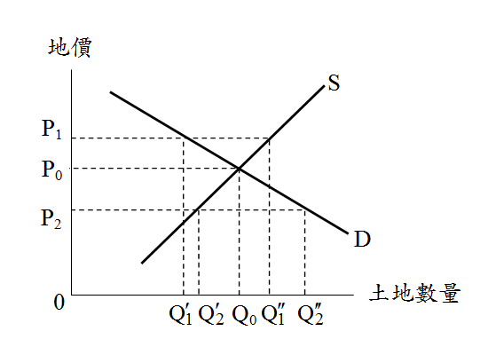

## 362. 憲法法庭 憲判字第15號判決有關農田水利使用土地照舊使用案
*發布日期: 2022-08-16* 

## 內文
各位同學好

今日專欄說明8月12日剛公布的憲法法庭（取代以前的大法官解釋）111年憲判字第15號判決，有關以前為農田水利使用之土地，依法應照舊繼續給農田水利設施用，但對該私有地主卻仍未予徵收補償案。

判決主文重點

農田水利會組織通則第11條第2項前段規定：「原提供為水利使用之土地，應照舊使用」（109年7月22日制定公布之農田水利法第11條第1項規定：「本法施行前提供農田水利會水利使用之土地，應照舊使用。」意旨相同）其應照舊使用之土地，如屬人民所有，而未以租用、價購或其他方式取得權源，因其已形成個人之特別犧牲，即應依法徵收，給予相當之補償，並於3年內擬定徵收補償相關計畫，籌措財源，俾於合理期限內逐步完成徵收補償，始符憲法第15條保障人民財產權之意旨。

補充說明(農田水利法第11條第1項立法說明)：

原提供為水利使用之土地，應照舊使用。考量現有農田水利會在辦理更新改善時如涉及私有土地者，多以取得土地同意書方式辦理，因農田水利事業係屬維繫農業發展所需具高度公益性，且設施受限於經費或土地取得等短期間難以變更或具不可替代性，其土地應屬具高度公共用物性質之法律關係，爰規定農田水利會改制後，相關土地如原作水利使用者，均以維持原使用狀況辦理。至於該土地於使用期間稅捐之徵免，於本法施行後依土地稅法規定辦理。又依規定，農田水利事業作業基金，每年應提撥部分財產處分所得價款，作為價購或承租照舊使用土地之財源，以規範國家對於照舊使用土地取得之義務。

判決理由要旨

1. 國家將人民所有之特定財產設定為公物，致人民就該財產無從自由使用收益，基於法治國家之要求，自須具備設定公物關係之權源，如欠缺權源，因其已形成個人之特別犧牲，即應依法徵收，給予相當之補償，始符憲法保障人民財產權之意旨。

2. 按公物係為達成行政目的、實現公共利益而設，於公物關係消滅前，自應維持其運作。農田水利用地既為公物，係推行農田水利事業所不可或缺者，而與國家經濟及民生息息相關，攸關特別重要公益，且歷經久遠年代未曾中斷作為農田水利之用，除非情事變更，已無繼續作為農田水利之必要而廢止其公物關係，否則即應維持其公物之使用，以確保特別重要公益之實現，是系爭規定明定原提供水利使用之土地應照舊使用。

3. 依系爭規定照舊使用土地之權源取得緩慢、成效有限，且照舊使用土地之用地，專戶餘額不足，顯然無法因應照舊使用土地之承租或用地取得所需。有鑑於此，主管機關應訂定期限，積極籌措財源，或思考以全部徵收所有權以外之其他方式取得權源之可行性，盡速完成照舊使用土地之權源取得，俾符合憲法第15條保障人民財產權之意旨。

4. 照舊使用，為落實人民財產權之保障，主管機關應就具體情況通盤檢討： (1)僅能作農田水利目的之使用（比如不能佔用挪作養殖等用途使用或收益）。 (2)應遵守最小侵害原則（比如設定區分地上權已足供農田水利之用者，不能要求為越該必要範圍之使用）（不得妨礙土地所有權人無礙於農田水利使用之權利行使）。 (3)其現況是否仍供農田水利使用或有無其他替代方案。 (4)如已無繼續作為農田灌溉排水使用之必要，應即辦理公物之廢止事宜，並還地予民。

黃大法官協同意見書重點摘要

1. 農田水利雖然是特別重要公益，但長期照舊使用、強制佔用人民土地，未依徵收規定予人民適當補償，也未付使用對價，實在有違公道。

2. 本件判決雖然礙於農田水利特別重要公益之維護，而未即宣告農田水利會組織通則第11條第2項前段照舊使用之規定違憲。故人民未能逕因本件判決請求還地或取得徵收補償請求權。

3. 但是確有不得已之其他特別重要公益考量，至少已對主管機關作具體明確之要求：「於3年內擬定徵收補償相闢計畫，籌措財源，俾於合理期限內逐步完成徵收補償」。因此，主管機關不能再無止盡推拖，不予徵收補償。

4. 為公法人之農田水利會所有之農田水利設施為公物，可以接受。但其所在之私人土地，在法律上為不同之物，私人土地不可能因而成為公物。然而，農田水利設施涉及特別重要公益是事實，加上課政府應依法徵收，給予人民適當補償義務，是可認為照舊使用規定對私地所有權人財產權之限制，於此範圍內，尚合於比例原則，難謂照舊使用規定違憲。

5. 時代已然不同，捷運、高速路……都已經有很多通過他人建築物下方、土地上方、場站聯合開發之例！人車走的路可以用區分地上權等方式以較低對價取得需要之用地使用權源，水走的路為何必須全面使用、徵收所有權全部？又既然農田水利設施已屬國有，則非不可立法使其所在部分土地，准作為建築基地之法定空地，照舊使用同時，融入景觀設計，其容積率也可原地使用，對地主言未受使用、收益不利益，政府因之可能不必另為金錢補償；另因容積原地使用，與容積移至他區使用相較，對當地交通、環境相對友善。
---
*注：本文圖片存放於 ./images/ 目錄下*

## 363. 不同意共有人如何因應土地法第34條之1
*發布日期: 2022-08-11* 

## 內文
共有人以土地法第34條之1多數決出售共有不動產時，雖不同意共有人有優先購買權，然不動產價格昂貴，恐非財力所及。此時，不同意共有人尚可訴請法院裁判分割，以為保護。其方法為，不同意共有人接到出售不動產之書面通知後，立馬向法院訴請裁判分割，再持法院受理裁判分割之文件向登記機關提出異議。登記機關發現異議後，得以土地登記規則第57條第1項第3款規定，駁回共有不動產買賣所有權移轉登記之申請。

裁判分割，法院應斟酌各有人之權益，依民法第824條第2項規定而決定分割方式。分割方式有下列六種：

1. 以原物分配於各共有人。

2. 以原物分配於各共有人，其中有不能按其應有部分受分配者，以金錢補償之。

3. 以原物分配於部分共有人，受原物分配者，金錢補償未受分配之共有人。

4. 以部分原物分配於各共有人，他部分仍維持共有。

5. 以部分原物分配於各共有人，他部分變賣，以價金分配於各共有人。

6. 變賣共有物，以價金分配於各共有人。

此外，變賣共有物時，除買受人為共有人外，共有人有依相同條件優先承買之權，有二人以上願優先承買者，以抽籤定之（民§824VII）。
---
*注：本文圖片存放於 ./images/ 目錄下*

## 364. 土地增值稅免徵、不課徵與記存之差異
*發布日期: 2022-08-09* 

## 內文
• 一、免徵：指免除租稅負擔，土地漲價總數額從新計算。如：繼承、土地徵收、公地出售等。

• 二、不課徵：指目前暫不課徵，將應課徵部分暫時保留，俟以後需課徵時再一併計算土地漲價總數額。如：配偶相互贈與、作農業使用之農業用地，移轉與自然人、信託土地（五種情形）

• 三、記存：指結算已發生之增值稅並記在帳上，於下次移轉時一併繳納，故已結算之增值稅部分不再發生累進稅作用。如：都市更新權利變換關係人取得。

差異如下表所示：

• T. ABLE_PLACEHOLDER_1
---
*注：本文圖片存放於 ./images/ 目錄下*

## 365. 土地徵收補償標準
*發布日期: 2022-08-04* 

## 內文
稟賦效果（endowment effect），指損失的痛苦遠超過獲利的快樂。因此，當吾人放棄其所擁有之土地時，所要求的價格，會高於買進同一土地，所支付之價格。

現行土地徵收按市價補償，係站在「取得土地」立場衡量。如站在「失去土地」立場衡量，應補償土地所有人，除市價外，另給予稟賦價值之補償。

土地徵收補償額度＝市價＋稟賦價值

所稱市價，指市場正常交易價格。所稱稟賦價值，指失去土地與買入土地之評價差額。

稟賦價值乃土地所有人對其土地之情感，此情感源自於對居住環境之熟悉度、與鄰居互動之歸屬感、在地生活之故事與記憶等。稟賦價值與持有土地時間有關。持有時間愈長，對土地情感愈濃厚，稟賦價值愈高。

稟賦價值屬於主觀價值，難以客觀量化，因此土地徵收可以採取「市價加成」補償，加成部分即為稟賦價值。例如，持有土地距屆滿10年之年數，每年加成補償1%，未滿1年或餘數未滿1年者，以1年計算。持有土地期間10年以上，一律加成10%。
---
*注：本文圖片存放於 ./images/ 目錄下*

## 366. 宗教團體以自然人名義登記不動產處理暫行條例之解析
*發布日期: 2022-08-02* 

## 內文
• 一、立法緣由（目的）

根據立法說明，本條例係鑑於宗教團體財產主要來源為社會大眾捐資，具有公眾財產性質，惟有宗教團體於購置或受贈不動產時，因尚未登記立案、法律規定該類不動產不得由宗教團體承受或無力負擔相關移轉稅賦等因素，僅得將購置或受贈之不動產以自然人名義登記（借名登記問題）。

此情形，常見登記名義人死亡後，其繼承人與宗教團體間就不動產所有權歸屬發生私權糾紛。為處理該類紛爭，常須耗費大量司法及社會成本，甚至使具公眾財產性質之不動產淪為私人所有，違反社會大眾捐資本意。

為處理既存之宗教團體（含未辦理寺廟登記之寺廟）不動產借名登記問題，避免因年代久遠，無相關資料可稽，致宗教團體與登記名義人之繼承人間之糾紛日增或惡化，使符合一定條件之宗教團體得申請權利歸屬審認。

• 二、主體與客體界定

• (一) 宗教團體 (宗暫§3)

1. 宗教財團法人、宗教社團法人或已完成寺廟登記之寺廟。所稱寺廟登記，指依辦理寺廟登記須知向主管機關申辦之寺廟設立登記。

2. 未辦理寺廟登記之寺廟。以籌備人三人以上組成寺廟籌備處，並於本條例施行前，符合下列情形之一者為限： (1)已興建有供宗教活動使用之整幢建築物。 (2)寺廟興辦事業計畫業經主管機關核准。 (3)籌備處名稱經不動產登記機關依土地登記規則第一百零四條第二項規定註記。

• (二) 不動產(宗暫§4)

1. 符合（適用） 本條例施行前有下列情形之一，而以自然人名義登記者： (1)宗教團體以自有資金購買。（自己買） (2)宗教團體受贈。（別人送） (3)依契約或其他證明文件，足認為宗教團體所有。（契約認定）

2. 不符合（排除適用） 不動產有下列情形之一者，不適用本條例之規定： (1)依法禁止或不得登記為宗教團體所有。但耕地不在此限。 註解1：如原住民保留地、農舍或符合土地法第14條第1項規定之不得私有之土地等，不適用本條例規定。 註解2：惟考量目前有部分宗教團體之教義有農耕需求，或因不諳法令等因素而購買或受贈耕地，並登記在自然人名下。為保障該類土地不被登記名義人任意處分，爰將耕地納入本條例之適用範圍。 (2)已依土地登記規則第104條第2項規定辦理所有權註記。 註解：未辦理寺廟登記之寺廟所購買或受贈之土地，倘業依土地登記規則規定，註記土地所有權歸屬之寺廟籌備處名稱，因該類土地之實質所有者明確，且將來完成寺廟設立登記後，即可依土地登記規則規定辦理更名登記，毋庸列入本條例權利歸屬審認之範圍。

• 三、申請期限

宗教團體得就不動產，於本條例施行之日起二年內，向主管機關申請權利歸屬審認，逾期不予受理。(宗暫§5)

• 四、申請人

應由宗教團體負責人或代表人為之。(宗暫§6)

• 五、申請文件 (宗暫§6)

• (一) 申請書。

• (二) 寺廟登記證或法人登記證書；未辦理寺廟登記之寺廟，附寺廟籌備處全體籌備人協議書。

應載明下列事項：

1. 寺廟籌備處名稱。

2. 全體籌備人姓名及其簽章。

3. 全體籌備人公推之代表人。

4. 籌備人及代表人死亡或變更時，繼任者之產生方式及程序。

5. 耕地經限制登記者，其於籌備期間處分耕地之決議方式。

6. 籌備處解散之條件、程序及其解散後不動產之處理方式。

• (三) 負責人或代表人之資格證明文件。

• (四) 契約書、公（認）證書或其他足資認定不動產為宗教團體實質所有之文件或資料。

• (五) 不動產清冊及地籍謄本。但地籍謄本能以電腦查詢者，得免提出。

• (六) 不動產登記名義人或其全體繼承人同意書；其有數人者，應以共有人逾二分之一及其應有部分合計逾二分之一之同意行之，但其應有部分合計逾三分之二者，其人數不予計算。

此外，應另檢附載有被繼承人死亡記事之戶籍謄本、全體繼承人現戶戶籍謄本及繼承系統表。

• (七) 其他經主管機關指定之文件或資料。

• 六、處理方式

• (一) 受理

• (二) 審查

1. 補正主管機關受理申請後，認申請文件或資料有欠缺而得予補正者，應通知申請人於三個月內補正。(宗暫§7)

2. 駁回 有下列情形之一者，主管機關應敘明理由駁回申請(宗暫§11)： (1)申請文件或資料未能補正；經依第七條規定通知限期補正，屆期未補正或補正仍不符規定。 (2)有事實足認第六條規定之文件、資料或前條第一項第一款規定之證據資料，係偽造、變造或虛偽不實。 (3)申請人未依前條第一項第一款規定提出回應意見。 (4)申請人、異議人均未依前條第一項第三款規定提起訴訟，或申請人提起訴訟後撤回。 (5)經法院確定判決或與確定判決有同一效力之文書，認定申請人未具取得不動產所有權之法律上原因。

• (三) 公告

申請文件、資料經審查符合規定者，主管機關應予公告，並通知不動產登記名義人或其全體繼承人。公告期間至少為一個月。(宗暫§8)

• (四) 異議處理

1. 不動產登記名義人、其繼承人或利害關係人於公告期間內，得檢具資格證明文件、異議書及相關證據資料，向主管機關提出異議。(宗暫§9)

2. 受理異議後，應依下列規定辦理： (1)於公告期滿之日起二十日內，將異議書送達申請人，並令申請人於送達之日起三個月內，以書面檢附證據資料提出回應意見。 (2)於收受申請人回應意見之日起二十日內，將回應意見送達異議人，並令異議人於送達之日起一個月內表明是否仍有異議。 (3)異議人於前款規定期間內表明仍有異議者，主管機關應通知申請人及異議人，於三個月內向法院提起訴訟。 申請人或異議人依規定提起訴訟，或不動產所有權歸屬爭議於法院審理中者，主管機關應停止辦理不動產權利歸屬審認。而停止辦理事由消滅後，主管機關應續行辦理。

• (五) 囑託登記

• I. 囑託

有下列情形之一者，主管機關列冊囑託不動產登記機關辦理更名登記或限制登記：

1. 申請案件於第八條第一項公告期滿，無人提出異議。

2. 異議人未依第十條第一項第二款規定表明仍有異議。

3. 異議人依第十條第一項第三款規定提起訴訟後撤回。

4. 經法院確定判決或與確定判決有同一效力之文書，認定申請人具取得不動產所有權之法律上原因。

主管機關依規定囑託時，應通知申請人及不動產登記名義人或其全體繼承人。(宗暫§12)

• I. I.登記

1. 更名登記（權利歸屬） 申請人為宗教財團法人、宗教社團法人或已完成寺廟登記之寺廟，並已以其他自然人名義登記為所有權人且無依法不得承受該不動產之情形，更名登記為申請人所有。(宗暫§13)

2. 限制登記（凍結現狀） (1)申請人為未辦理寺廟登記之寺廟或有不動產為耕地、購買或受贈之不動產未辦理移轉登記之情形，為限制登記並註明權利歸屬審認之宗教團體。(宗暫§13) (2)限制登記事項，自本條例施行期間屆滿失效。主管機關應於屆滿時列冊囑託該不動產登記機關塗銷限制登記。(宗暫§13) 註解：其不動產為耕地，或不動產在購買、受贈後尚未辦理移轉登記，或為未辦理寺廟登記之寺廟，得辦理限制登記，使登記名義人不得任意處分該不動產，俾利宗教團體於該條例施行期間（10年）內，適法處理借名登記不動產，以符法制，給予宗教團體不動產相對性保障。 (3)依規定辦理限制登記之不動產，符合下列情形之一者，宗教團體得向不動產登記機關辦理下列登記(宗暫§13)： A.寺廟籌備處購買或受贈不動產時以其他自然人名義登記為所有權人，且無依法不得承受該不動產之情形，於完成寺廟登記後，檢具寺廟登記證辦理更名登記為寺廟所有。 B.依法移轉登記為限制登記所註明權利歸屬審認之宗教團體所有。 宗教團體依規定向不動產登記機關辦理移轉登記前，應報請主管機關囑託塗銷限制登記。(宗暫§14 II) (4)經依規定辦理限制登記之不動產，其所有權禁止移轉，並不得設定地上權、農育權、不動產役權、抵押權及典權。但下列情形不受所有權禁止移轉之限制(宗暫§14 I)： A.耕地經登記名義人與限制登記所註明權利歸屬審認之宗教團體同意，出售或與他人互易為依法得登記為宗教團體所有之土地。 B.依法辦理徵收、區段徵收或協議價購。 C.繼承。

• (六) 登記完畢後之塗銷

不動產經更名登記或限制登記後，主管機關發現有下列情形之一者，應囑託不動產登記機關塗銷更名登記或限制登記(宗暫§15)：

1. 有事實足認申請文件或資料係偽造、變造或虛偽不實。

2. 經法院確定判決或與確定判決有同一效力之文書，認定申請人未具取得不動產所有權之法律上原因。

• 七、施行期間

本條例自公布日施行，施行期間十年(宗暫§16)

註解：暫行條例並未免除宗教團體納稅義務或放寬宗教團體能夠持有的土地類型，例如原住民保留地，依法不能讓不具原住民身分者持有，就不適用暫行條例之規定。宗教團體若為寺廟籌備處、不動產尚未繳納移轉稅賦或為耕地的情形時，也僅是在暫行條例施行的10年期間內，以凍結登記名義人處分該不動產權利的方式，讓宗教團體在期間內，適法處理借自然人名義登記不動產，並不會衝擊政府稅收，或者違反農地農用的政策。

參考資料：

立院三讀 宗教團體以自然人名義登記不動產處理暫行條例
---
*注：本文圖片存放於 ./images/ 目錄下*

## 367. 土地登記損害賠償之時效
*發布日期: 2022-07-28* 

## 內文
◎地政機關將甲所有之土地誤登於乙名下，經過十年後，乙出售於丙。出售後經過一年，甲始向地政機關提起土地登記錯誤之損害賠償。地政機關以請求權已逾時效為由拒絶賠償，是否有理？

【解答】

• (一) 消滅時效之規定：土地登記賠償請求權，自請求權人知有損害時起，因二年間不行使而消滅；自損害發生時起，逾五年者亦同。

• (二) 時效計算：

1. 地政機關主張自登記錯誤之日起算，已逾二年或五年，請求權已逾時效。

2. 甲主張自乙出售於丙之日起算，未逾二年或五年，請求權未逾時效。

3. 綜上，請求權時效應自損害發生時起算，然損害何時發生？茲分述如下： (1)乙出售於丙之前：甲僅得主張塗銷登記（即塗銷乙之所有權登記，回復為甲所有），不得提起損害賠償。換言之，損害尚未發生。 (2)乙出售於丙之後：丙得主張土地法第43條，以保護其取得之所有權。因此，甲不得主張塗銷登記（即塗銷丙之所有權登記，回復為甲所有），但甲得向地政機關請求損害賠償。換言之，損害自此發生。 (3)結論：請求權時效為自被害人知悉損害起算二年或損害發生起算五年。因此，本例應自乙出售於丙之日為損害發生之日，故均未逾二年或五年時效。
---
*注：本文圖片存放於 ./images/ 目錄下*

## 368. 平均地權條例修正草案有關打炒房措施之目的與效果
*發布日期: 2022-07-26* 

## 內文
各位同學好

此次111年高考土地政策考了最新的平均地權條例修正草案有關打炒房之措施，題目與相關擬答提供同學參考：

### 一、題目：

臺灣於1960年代，在當時不完善的金融制度下，需房者與興建業者自行發展出住宅市場的預售方式，以減輕雙方的資金壓力；再為讓地域性外的需房者得知此興建住宅之訊息，促成代銷業者企劃宣傳與銷售的興起。然而，長期以來不論是部分代銷或仲介人員，乃至於投資客揪團炒房，企圖影響住宅市場之價格水準以牟私利之行為，已逼使政府修法擬管理此獨特之預售屋市場。請評析2022年4月行政院提出之「平均地權條例」修正草案之限制預售屋、新建成屋契約讓與或轉售，重罰不動產炒作行為，建立檢舉獎金制度，私法人取得住宅用房屋許可制，預售屋解約要申報登錄等五項措施，是否能匡正預售屋市場之價格水準亂象？

### 二、擬答

• (一) 為遏止近期投資客揪團炒房、利用換約轉售哄抬獲利、利用不實實價登錄墊高交易價格等新型態炒作行為，行政院通過「平均地權條例」修正草案，其重點說明如下：

1. 限制換約轉售 預售屋或新建成屋買賣契約，買受人除配偶、直系或二親等內旁系血親，或經內政部公告的特殊情形外，不得讓與或轉售第三人；建商也不得同意或協助契約讓與或轉售，違規者均可按戶棟處罰50萬至300萬元。

2. 重罰炒作行為 明確規範若有散播不實資訊影響交易價格、透過通謀虛偽交易營造熱銷假象、利用違規銷售影響市場交易秩序或壟斷轉售牟利，或是以其他影響不動產交易價格或秩序的操縱行為進行炒作，都可按交易戶(棟、筆)數處罰100萬至5,000萬元，經限期改正但未改正者，並可連續處罰。

3. 管制私法人購屋 增訂私法人購買住宅用房屋許可制規定，並限制取得後於5年內不得辦理移轉、讓與或預告登記。

4. 解約申報登錄 預售屋買賣契約若有解約情形，建商應於30日內申報登錄；違規者將按戶棟處罰3萬至15萬元。

5. 建立檢舉獎金制度 民眾對於不動產銷售買賣或申報實價登錄違規行為，可檢具證據向縣市政府檢舉，如經查證屬實，將由實收罰鍰中提充一定比率金額作為獎金。

• (二) 認為應能匡正預售屋市場之價格水準亂象，其理由如下

1. 限制換約轉售，主要係遏止買空賣空行為，以往藉由預售屋期間的短期轉售，不斷墊高價格，以致於最後取得的實際居住者，價格已被墊高許多。因此，限制特殊情形外不得換約應可有效匡正預售屋市場不當的投機轉售行為。

2. 重罰炒作行為之目的，係為避免不當行銷與炒作手法，影響民眾合理決策，扭曲市場正常交易情形，故藉由處罰不實廣告及不當銷售應可匡正預售屋市場回歸正常交易行為。

3. 私法人購置住宅許可制，可杜絕以法人名義規避稅負，避免個人投機以創設私法人名義（如人頭公司）囤房、囤地及炒作，進而影響不動產價格。

4. 以往預售屋交易價格相對不透明，在實價登錄後有所改善，惟起造人或代銷公司可透過虛假交易，創設虛假交易價，並產生定錨效果，製作假行情，誤導消費者決策，讓市場交易價格有所偏誤。因此，預售屋解約應申報登錄可避免虛假交易哄抬房價。

5. 由於不動產交易屬買賣雙方私下交易行為，政府要有效率的介入干預，則需藉由建立由下而上檢舉機制，較能遏止不當行為，藉此導正預售屋市場價格水準亂象。
---
*注：本文圖片存放於 ./images/ 目錄下*

## 369. 實價登錄
*發布日期: 2022-07-21* 

## 內文
◎實價登錄制度可否抑制不動產價格高漲？

實價登錄制度之目的在使不動產交易資訊透明化，而無法抑制不動產價格高漲。因為在房地產景氣時，不動產成交實價不斷公布，價格屢屢創新當地行情，造成民眾恐慌心理。如果現在不買，未來就吃虧或買不起，形成「越買越貴，越貴越買」之現象。最後，不動產價格節節上升。因此，實價登錄制度無法抑制不動產價格高漲。
---
*注：本文圖片存放於 ./images/ 目錄下*

## 370. 原住民保留地借名登記案
*發布日期: 2022-07-19* 

## 內文
各位同學好

今日專欄說明有關原住民保留地借名登記案，有關借名登記之法律行為效力-以最高法院108年度台上大字第1636號裁定（110年09月17日）為例

### 一、借名登記契約之意義

當事人約定，一方（借名人）經他方（出名人）同意，而就屬於一方現在或將來之財產，以他方之名義，登記為所有人或其他權利人，但實際管理、使用、收益與處分均由一方自行為之1 。（如出名者有相關權能，則非所指借名登記）

### 二、借名登記契約之性質

不動產借名登記契約為借名人與出名人間之「債權契約」，出名人依其與借名人間借名登記契約之約定，通常固無管理、使用、收益、處分借名財產之權利，然此僅為出名人與借名人間之內部約定，其效力不及於第三人2 。當事人之一方如主張與他方有借名登記關係存在，自應就借名登記契約確己成立之事實，負舉證責任3 。

### 三、借名登記之內部法律關係（效力）

• (一) 無效說 早期最高法院見解認為，借名登記屬於消極信託，並助長脫法行為，進而構成通謀虛偽意思表示，故其法律效果多屬無效4 。

• (二) 有效說 現行法並無直接明文禁止借名登記契約，故依私法自治原則，當事人基於特定目的而訂立借名登記契約，自無不可5 。因此，借名契約之目的或內容無違反強制、禁止規定或悖於公序良俗，且原因正當者，依契約自由原則，即屬有效。

按110年09月17日最高法院108年度台上大字第1636號裁定意旨，非原住民乙欲購買原住民甲所有原住民保留地經營民宿，為規避山坡地保育利用條例第37條第2項、原住民保留地開發管理辦法第18條第1項規定，乃與原住民丙成立借名登記契約，以丙名義與甲簽訂買賣契約，甲以該地為乙設定地上權後，將所有權移轉登記予丙。乙丙間之借名登記契約、甲丙間之買賣契約、甲為乙設定地上權及將所有權移轉登記予丙之行為，無異實現非原住民乙取得原住民保留地所有權之效果，自違反上開禁止規定，依民法第71條本文規定，應屬無效。

綜合言之，借名登記契約是否有效，應注意其是否違反強制禁止規定及悖於公序良俗。倘若當事人為規避強行法規之適用，以迂迴方法達成該強行法規所禁止之相同效果行為，其事實上之效果違反法律規定之意旨，屬脫法行為，應非法之所許，自屬無效6 。

1. 卓心雅，2020，不動產借名登記契約近十年之發展，全國律師，第24卷，第10期，第5頁。詹森林，2003，借名登記契約之法律關係，臺灣本土法學雜誌，第43期，第129頁。最高法院102年度台上字第2215號、104年度台上字第64號、104年度台上字第1570號民事判決。林誠二，2013，由借名登記契約論不動產物權變動登記之效力，法學的實踐與創新(上)，第402頁。

2. 最高法院106年度第3次民事庭會議。

3. 最高法院100年度台上字第1972號民事判決。臺灣臺北地方法院110年度重訴字第236號民事判決。最高法院111年度台上字第1087號民事判決。舉證事證例如：載明借名意旨之聲明書（借名登記契約書）、證人證詞、不動產買賣契約書、出資證明（匯款單、收據）、不動產買賣價金履約保證專戶收支明細表暨點交確認書、房地產登記費用明細表、地價稅或房屋稅繳費證明正本、水電費繳納收據、管理費收據、收取租金證明、土地或建物所有權狀正本等。借名登記關係爭執之當事人間，借名人如無書面契約等直接證據以供證明，非不得由何人出資、何人管理使用收益等已證明之客觀情形推論之，惟此僅係證明方法之一，非謂有該客觀事實存在，即謂當然存有借名登記關係（借名登記 最高法院111年度台上字第383號民事判決）。

4. 麵律師，2015，民事實務見解回顧（十五）-借名登記契約，法觀人月刊，第204期。

5. 詹森林，2003，借名登記契約之法律關係，臺灣本土法學雜誌，第43期，第129頁。

6. 最高法院104年度台上字第65號判決
---
*注：本文圖片存放於 ./images/ 目錄下*

## 371. 土地法第34條之1之修法方向
*發布日期: 2022-07-14* 

## 內文
◎試擬土地法第34條之1之修法方向，以保障不同意共有人之權益？

【解答】

土地法第34條之1共有土地或建築改良物之處分、變更及設定地上權、農育權、不動產役權或典權，採多數決行之，然對於少數不同意共有人之保障仍嫌不足。因此，如何保障不同意共有人之權益，乃土地法第34條之1之未來修法重點。茲擬訂修法方向如下：

• (一) 處分僅限於買賣：土地法第34條之1所稱處分，限縮在買賣（包括標售、拍賣等）。因為買賣，不同意共有人尚有優先購買權，以為制衡。如果不是買賣，不同意共有人將無優先購買權，喪失制衡手段。

• (二) 提高多數決同意門檻：現行同意門檻為以共有人過半數及其應有部分合計過半數，或應有部分合計逾三分之二，人數不予計算。修法之同意門檻宜提高為共有人逾三分之二及其應有部分合計逾三分之二，或應有部分合計逾四分之三，人數不予計算。

• (三) 設定用益物權適用優先權機制：現行僅買賣，不同意共有人有優先購買權；至於設定地上權、農育權、不動產役權或典權，不同意共有人並無優先承受權。為避免共有人以多數決低價設定地上權、農育權、不動產役權或典權予自己人，應賦予不同意共有人優先承受權，以為制衡。

• (四) 增訂共有人之損害賠償責任：同意之共有人以多數決為處分、變更及設定地上權、農育權、不動產役權或典權，如有故意或重大過失，致共有人受損害者，對不同意之共有人連帶負賠償責任。
---
*注：本文圖片存放於 ./images/ 目錄下*

## 372. 盜賣東區名人巷之地政事務所損害賠償案
*發布日期: 2022-07-12* 

## 內文
今日說明有關登記錯誤之地政機關損害賠償，以「盜賣東區名人巷」案為例 首先，請先參考以下新聞，可看出判決有重大轉變，從2019年不賠至2022年又改為要賠。本案從95年提起訴訟至今已16年…

※2022年最新：賠4千多萬（時效未消滅）

東區名人巷土地遭盜賣！前大法官伯父後代獲國賠近5千萬

東區名人巷4.5億土地被盜賣 驚人手法曝光！前大法官家族獲國賠4970萬

※2019年：不用賠（時效消滅）

東區名人巷遭盜賣！地主子女逾時求償 6.5億國賠飛了

### 一、案情介紹

• (一) 繼承事實發生 甲於民國80年2月22日歿，共有乙、丙、丁、戊、己、庚六位繼承人，甲所遺A地（系爭土地）已於81年3月15日申報遺產稅並繳清，惟尚未辦理繼承登記。

• (二) 偽造資料 直到92年10月3日某自稱乙之不知名第三人K持偽造之乙身分證，向某市戶政事務所請領乙戶口名簿、甲之全戶及除戶戶籍謄本後，將領得之戶籍謄本予以變造，並辦理印鑑登記及申領印鑑證明。

• (三) 登記不實（虛偽） 92年10月14日，該第三人K再冒乙之名義，持上述偽造之乙身分證、變造之戶籍謄本、乙新戶籍謄本、印鑑證明、系爭同意移轉證明書、（乙為唯一繼承人）不實繼承系統表、（謊稱所有權狀遺失）切結書等件，向疏於審查之地政事務所申請辦妥由乙單獨繼承系爭土地之繼承登記。

• (四) 移轉給第三人（損害發生） 獲發給A系爭土地之新所有權狀後，該第三人K即於92年10月間，將該地移轉登記與第三人，後再輾轉移轉登記給其他人，致難以回復原狀。

• (五) 取得該繼承資料 乙、丙於92年11月、93年3月曾取得系爭繼承登記相關資料，知悉系爭土地遭盜賣而受有損害。（但並不全然瞭解錯誤登記之過程及相關權益）

• (六) 知悉錯誤之繼承登記及賠償請求權 94年9月間乙、丙等六人始全部知悉被上訴人錯誤為系爭繼承登記，並被告知可以向地政事務所等機關請求賠償。

• (七) 向地政事務所提起損害賠償之訴 乙、丙等人於95年4月25日共同向地政事務所提起損害賠償之訴。

### 二、爭點

• (一) 系爭繼承登記錯誤，是否可歸責於地政事務所之事由所致？

• (二) 乙、丙等六人之損害賠償請求權是否已罹於2年時效？

• (三) 倘地政事務所應負賠償責任，乙、丙、丁得請求之金額？

### 三、地政事務所主張

乙、丙等繼承人於92年11月至93年3月9日均已知悉系爭土地遭移轉，即已知悉損害。乙、丙等人以土地法第68條第1項規定為請求權基礎，於知悉受有損害同時即知悉賠償機關，其等損害賠償請求權消滅時效應自93年3月9日起算，乙、丙等人於95年4月25日起訴時，其請求權均已罹於時效。

縱認請求權未罹於時效，地政事務所受理系爭土地之繼承登記時，正值戶政資料電子化之際，戶籍謄本上總頁數空白乃正常現象，地政事務所准予辦理系爭繼承登記，無故意或過失。乙於92年11月知悉系爭繼承登記有冒名情形，即可向當時登記名義人或轉得人請求回復原狀，就損害之發生，與有過失，應免除全部賠償金額。

### 四、判決重點摘錄

臺灣高等法院109年度 重上國更五字第2號判決

日期：民國111年06月07日

1. 法源依據

按土地法第68條第1項規定「因登記錯誤遺漏或虛偽致受損害者，由該地政機關負損害賠償責任。但該地政機關證明其原因應歸責於受害人時，不在此限」，係就職司不動產登記事務之公務員不法侵害人民權利，由該機關負損害賠償責任之規定，屬國家賠償法之特別規定，故人民因不動產登記錯誤、遺漏或虛偽致受損害，而請求地政機關賠償時，該地政機關應否負賠償責任及其賠償範圍，即應依該條規定定之，不適用國家賠償法第2條之規定。

2. 無過失責任（應舉證可歸責於受害人）

按地政主管機關為加強防範偽造變造權利書狀、身分證明、印鑑證明及其他有關文件不法申請土地登記，以確保土地登記之安全，特訂定加強防範偽造土地登記證明文件注意事項（下稱注意事項）及臺灣省各地政機關加強地籍資料及權狀管理防範措施（下稱防範措施）規定「登記機關應注意審查其原因證明文件，必要時應調閱原案或登記簿或向權利利害關係人、原文件核發機關查證。於公告原權利書狀作廢時，應以登記名義人之申請案載住所、登記簿登記住所併同通知」、「登記機關辦理公告時應同時以雙掛號通知登記名義人，如同時辦理住址變更登記者，應按新舊地址寄送，所寄之通知不克送達時，應進一步加以研判」。是地政機關於辦理登記案件時，對於未能繳付原權利書狀申請繼承登記或同時辦理住址變更之案件，不得僅因申請人提出土地登記規則第67條第1款之切結書，即認地政機關無須依上開注意事項或防範措施為審查。查第三人K偽以乙名義辦理系爭繼承登記時，同時申請住址逕為變更及切結所有權狀遺失，核屬未能繳付原權利書狀且同時辦理住址變更之登記案件，依上說明，地政事務所應按新舊地址寄送通知，以為調查確認，卻疏未為之，即為錯誤之系爭繼承登記，執行職務自有過失。況土地法第68條乃國家賠償法之特別規定，不以國家賠償法第2條所定公務員有故意或過失為必要。

其中，第三人K以偽造之乙相關資料辦理繼承登記，自難認上訴人就上開錯誤之系爭繼承登記，有何過失行為可言，以及難認就損害之發生有可歸責於乙。此外，地政事務所亦未就有何可歸責受害人之事由，致為錯誤之系爭繼承登記，舉證以實其說。

3. 消滅時效之認定

• (1) 適用時效期間規定 按土地法第68條第1項前段之損害賠償責任，核係國家賠償法之特別規定，惟土地法就該損害賠償請求權，既未規定其消滅時效期間，應適用國家賠償法第8條第1項規定，即其損害賠償請求權，自請求權人知有損害時起，因2年間不行使而消滅。

• (2) 起算日認定 上開規定之2年時效，所謂知有損害時起，參酌同法施行細則第3條之1之規定，係指知有損害之事實及國家賠償責任之原因事實，乃以主觀判斷為基準，故因土地登記錯誤、遺漏或虛偽而請求國家賠償時，人民不僅必須知悉其受有損害，更須知悉其所受損害係肇因於公務員違法行使公權力，方得開始起算其損害賠償請求權之2年消滅時效（最高法院106年度台上字第1740號判決意旨參照）。

又公同共有之債權之行使須全體公同共有人共同為之，必公同共有人全體均知悉受有損害之事實及損害肇因於地政機關所為土地登記錯誤遺漏或虛偽，始得起算消滅時效期間。

乙、丙於92年11月、93年3月曾取得系爭繼承登記相關資料，僅足認其等知悉系爭土地遭盜賣而受有損害乙節，難謂其等同時知悉地政事務所有前揭過失執行職務致為錯誤之系爭繼承登記，遑論丁、戊、己、庚均未直接取得系爭繼承登記相關資料。

此處就是原本說消滅時效不賠，而這次判決說要賠的關鍵，也就是法官認為時效起算除了知悉錯誤以外，還須知悉受有損害且由公務員違法造成的，因為這樣才能算真正知悉有損害賠償請求權，以起算時效。

4. 損害賠償之範圍

因登記錯誤、遺漏或虛偽致受損害，由該地政機關負損害賠償之範圍，以不得超過受損害時之價值為限，不包括受害人依通常情形，或依已定之計畫、設備或其他特別情事，原可得預期之利益之喪失（消極損害）在內。

系爭土地於92年10月間遭到盜賣時，有土地買賣契約在卷可稽，堪認系爭土地於上訴人受損害時之價值為4,970萬3,548元。以及自起訴狀繕本送達翌日即95年5月4日起至清償日止，按年息5%計算之利息。
---
*注：本文圖片存放於 ./images/ 目錄下*

## 373. 停滯性通貨膨脹
*發布日期: 2022-07-07* 

## 內文
• (一) 停滯性通貨膨脹之意義：

停滯性通膨，指高失業率與高物價上漲率同時發生。一般而言，經濟繁榮會發生高物價上漲率（即通貨膨脹），經濟蕭條會發生高失業率（即成長停滯），二者不會同時發生。實際卻不然，日本近十年來深陷停滯性通膨之困境，即是著例。

• (二) 停滯性通貨膨脹之成因：

最近，世界經濟可能發生停滯性通膨。其成因如下：

1. 疫情：新冠疫情肆虐，一方面染疫而居家隔離，生產力下降，產品供給減少，物價上漲。另一方面，眾多店家生意大受影響，大量裁員及資遣員工，失業率上升。

2. 斷鏈：美中貿易戰，全球生產鏈斷鏈，保護主義抬頭，生產成本增加，物價上漲。

3. 戰爭：烏俄戰爭爆發，烏國糧食輸出減少，物價上漲。更甚者，俄國以能源、糧食為手段，迫使能源及糧食價格大漲，造成通貨膨脹。

4. 清零：最近，中國對疫情實施「動態清零」政策，上海、北京等受封城影響，生意如跳水式衰退，造成全球經濟衰退。

5. 升息：各國為了抑制通貨膨脹，紛紛採取升息措施。在通貨膨脹無法壓抑下，升息又過猛，將使經濟硬著陸，而呈現通貨膨脹與經濟衰退共存現象。

我國以貿易立國，世界經濟必將衝擊我國經濟，因此我國應慎防輸入性通膨及經濟衰退。
---
*注：本文圖片存放於 ./images/ 目錄下*

## 374. 成長管理之意義、原則與內容
*發布日期: 2022-07-05* 

## 內文
各位同學好

今日專欄為各位整理有關成長管理之意義、原則、內容：

• 一、意義

為確保國家永續發展、提升環境品質、促進經濟發展及維護社會公義之目標，考量自然環境容受力，公共設施服務水準與財務成本、使用權利義務及損益公平性之均衡，規範城鄉發展之總量及型態，並訂定未來發展地區之適當區位及時程，以促進國土有效利用之使用管理政策及作法。（國土計畫法第3條）

因此，成長管理不是反對成長，而是在適當的時機引導土地開發至適當的區位，進行適量的開發，以便最後能提昇生活品質，促進經濟發展，並保護重要環境資源。

• 二、規劃原則

• (一) 規劃執行一致性：為使成長管理之執行在各級政府相關單位及各層級計畫間能協調配合，以追求更高的執行成效，並減少衝突及避免規劃與管制間之脫節，故有一致性之要求。

• (二) 公共設施同時性：為確保新開發地區能於開發完成後，提供必需充足之公共設施，以應居民日常生活之需，並避免不當之土地開發影響生活品質與地方財政，故有同時性之要求。

• (三) 都市發展緊密性：為避免都市之蛙躍式發展，破壞都市景觀，以確保土地使用與開發行為之連續性、緊密性，提昇土地使用之效率，並減少公共設施投資之浪費，故有緊密性之要求。

• (四) 環境資源永續性：為尊重自然，關懷生態，避免開發行為破壞環境資源，以確保重要農業、林地、溼地、海岸、開放空間、人文、歷史資源之永續利用，進而提昇生活環境品質，故有永續性之要求。

• (五) 區域發展均衡性：為確定各行政地區成長機會之均衡與合理分布，考量各地區之特性與資源條件，提供適當公共設施，規劃充足之工商發展區位，以創造工作機會與經濟前景，故有均衡性之要求。

• (六) 經濟環保平衡性：為避免強調環境保護而減損經濟發展機會，在考量環境生態系統之特性與區位下，確定經濟發展所需之土地面積與區位，以滿足經濟活動之需求，故有平衡性之要求。

• (七) 住宅價格穩定性：為避免成長管理之實施影響土地供給，造成房價上漲，產生排他效果，以增加平價住宅之數量，提供開發誘因與租金補貼方式，增加低收入戶購屋機會，故有穩定性之要求。

• (八) 民眾參與公開性：為增進民眾對政策的認同感，免除政策執行之抗拒，提高執行成效，透過民眾對政策內容的瞭解與意見表達，使得計畫內容更具正當性與客觀性，故有公開性之要求。

• 三、成長管理策略或計畫之內容

• (一) 全國國土計畫成長管理策略

1. 城鄉發展總量及型態。

2. 未來發展地區。

3. 發展優先順序。

• (二) 直轄市、縣（市）成長管理計畫內容，應視其需要包含下列事項：

1. 直轄市、縣（市）城鄉發展總量及型態。

2. 未來發展地區。

3. 發展優先順序。

4. 其他相關事項。

參考資料：賴宗裕，都市土地使用計畫課程講義。
---
*注：本文圖片存放於 ./images/ 目錄下*

## 375. 袋地與裡地
*發布日期: 2022-06-30* 

## 內文
• (一) 袋地之意義：

袋地，指不直接臨路之土地。如圖1所示，A地為袋地。民法第787條至789條有關袋地通行權之規定，是為著例。

[圖片1]

圖1 袋地

• (二) 裡地之意義：

裡地，指我國繁榮街道路線價區段，以裡袋（距離臨街線18公尺）劃分為臨街地與裡地，如圖2所示。臨街地採路線價估價法，裡地採區段價法。

[圖片2]

圖2 裡地

• (三) 兩者比較：

1. 袋地，係地界實際狀況。裡地，係因估價而設。

2. 袋地，乃實際地界不直接臨路。裡地，乃實際地界直接臨路，但為了估價，人為劃出裡地線，在裡地線以外之土地皆為裡地。

3. 袋地，凡不直接臨路皆屬之，而不問距離道路多遠。裡地，須距離道路18公尺以上之土地始屬之；但18公尺以下之土地，非屬裡地。

4. 袋地，適用民法有關袋地通行權之規定。裡地，不適用民法有關袋地通行權之規定。

## 文章圖片

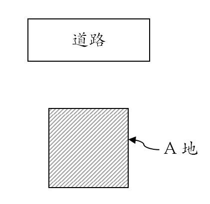

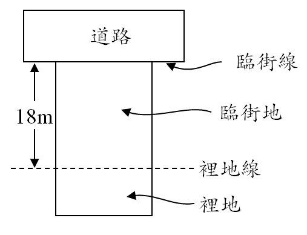

## 376. 土地登記線上聲明之作業
*發布日期: 2022-06-28* 

## 內文
• 一、意義

聲明人藉由線上聲明登錄以表明不動產處分真意，可作為免當事人親自到場措施。因此，採用線上聲明措施，當事人只要透過自然人憑證上網登錄資訊，由地政士或律師核對身分後驗證聲明，即可不必再親自到地政事務所核對身分或至戶政事務所申請印鑑證明，節省民眾時間與金錢。

• 二、作業步驟

• (一) 聲明登錄

所有權人若為自然人，可使用「自然人憑證」登入系統辦理；若為公司法人，可使用「工商憑證」登入系統辦理。

聲明事項：

1. 不動產標的

2. 辦理事項（登記原因）

3. 取得權利人

4. 委託代理人

5. 聲明期限

• (二) 聲明驗證

提供專業代理人(地政士或律師)輸入聲明人提供的聲明序號，以電子簽章方式完成聲明驗證，系統並可產製經代理人驗證完成之線上聲明登錄表，以利登記案件附案或留存。

• (三) 申請登記

完成線上聲明登錄及驗證後，登記案件送件請於申請書載明聲明序號或將登錄表附案，併同其他應附文件由代理人向登記機關送件申請登記。

搭配全程網路申請方式，甚至可不用至地政事務所送件。

[圖片1]

圖1：聲明人與登記義務人資料參考圖示（自然人）

[圖片2]

圖2：聲明事項參考圖示

[圖片3]

## 文章圖片

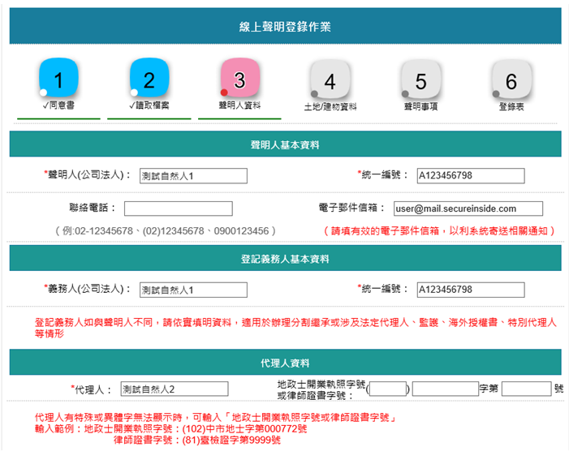

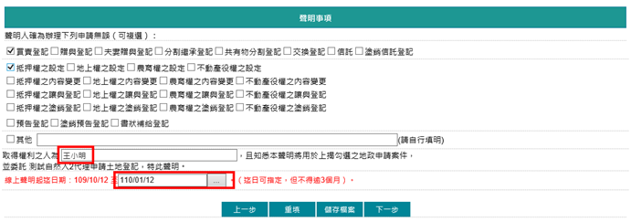

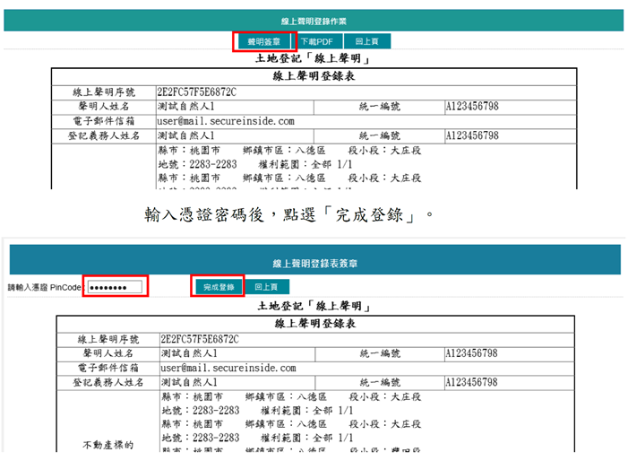

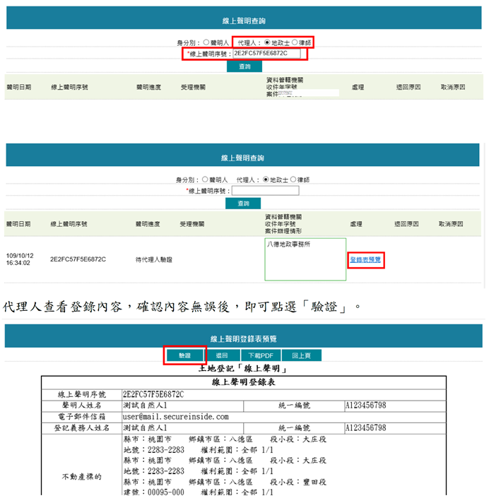

## 377. 土地法第73條之1修正前後對照
*發布日期: 2022-06-23* 

## 內文
土地法第73條之1修正案於民國111年5月31日立法院三讀通過，等待總統公布。

• (一) 修正前條文：

1. 土地或建築改良物，自繼承開始之日起逾一年未辦理繼承登記者，經該管直轄市或縣市地政機關查明後，應即公告繼承人於三個月內聲請登記；逾期仍未聲請者，得由地政機關予以列冊管理。但有不可歸責於聲請人之事由，其期間應予扣除。

2. 前項列冊管理期間為十五年，逾期仍未聲請登記者，由地政機關將該土地或建築改良物清冊移請國有財產局公開標售。繼承人占有或第三人占有無合法使用權者，於標售後喪失其占有之權利；土地或建築改良物租賃期間超過五年者，於標售後以五年為限。

3. 依第二項規定標售土地或建築改良物前應公告三十日，繼承人、合法使用人或其他共有人就其使用範圍依序有優先購買權。但優先購買權人未於決標後十日內表示優先購買者，其優先購買權視為放棄。

4. 標售所得之價款應於國庫設立專戶儲存，繼承人得依其法定應繼分領取。逾十年無繼承人申請提領該價款者，歸屬國庫。

5. 第二項標售之土地或建築改良物無人應買或應買人所出最高價未達標售之最低價額者，由國有財產局定期再標售，於再行標售時，國有財產局應酌減拍賣最低價額，酌減數額不得逾百分之二十。經五次標售而未標出者，登記為國有並準用第二項後段喪失占有權及租賃期限之規定。自登記完畢之日起十年內，原權利人得檢附證明文件按其法定應繼分，向國有財產局申請就第四項專戶提撥發給價金；經審查無誤，公告九十日期滿無人異議時，按該土地或建築改良物第五次標售底價分算發給之。

• (二) 修正後條文：

1. 土地或建築改良物，自繼承開始之日起逾一年未辦理繼承登記者，經該管直轄市或縣市地政機關查明後，應即公告繼承人於三個月內聲請登記，並以書面通知繼承人；逾期仍未聲請者，得由地政機關予以列冊管理。但有不可歸責於聲請人之事由，其期間應予扣除。

2. 前項列冊管理期間為十五年，逾期仍未聲請登記者，由地政機關書面通知繼承人及將該土地或建築改良物清冊移請財政部國有財產署公開標售。繼承人占有或第三人占有無合法使用權者，於標售後喪失其占有之權利；土地或建築改良物租賃期間超過五年者，於標售後以五年為限。

3. 依第二項規定標售土地或建築改良物前應公告三個月，繼承人、合法使用人或其他共有人就其使用範圍依序有優先購買權。但優先購買權人未於決標後三十日內表示優先購買者，其優先購買權視為放棄。

4. 標售所得之價款應於國庫設立專戶儲存，繼承人得依其法定應繼分領取。逾十年無繼承人申請提領該價款者，歸屬國庫。

5. 第二項標售之土地或建築改良物無人應買或應買人所出最高價未達標售之最低價額者，由財政部國有財產署定期再標售，於再行標售時，財政部國有財產署應酌減拍賣最低價額，酌減數額不得逾百分之二十。經五次標售而未標出者，登記為國有並準用第二項後段喪失占有權及租賃期限之規定。自登記完畢之日起十年內，原權利人得檢附證明文件按其法定應繼分，向財政部國有財產署申請就第四項專戶提撥發給價金；經審查無誤，公告九十日期滿無人異議時，按該土地或建築改良物第五次標售底價分算發給之。

• (三) 比較：

• T. ABLE_PLACEHOLDER_1
---
*注：本文圖片存放於 ./images/ 目錄下*

## 378. 重測面積短少之損害賠償
*發布日期: 2022-06-21* 

## 內文
各位同學好

今日專欄針對重測結果發現面積短少，是否得請求損害賠償之議題進行討論。以下參考地政研究所之相關考題來進行說明。

某地區發生洪災，因泛濫嚴重，災後重新辦理地籍測量。A地在實施測量時，其界點經土地所有權人甲及鄰地所有權人指界，確定界址無誤，測量人員乙即據此界址實施測量。該管地政事務所依照乙之測量成果重製地籍原圖並辦理A地之標示變更登記，惟甲發現重測後A地面積比起重測前短少5平方公尺。問： (一)經甲主張異議並中請複丈，其結果與重測相符。請先說明何謂登記之公信力及公信力保護之標的，並分析甲得否主張登記之公信力，故地政事務所不得訂正該面積值？ (二)因A地面積變小，導致其市價降低，甲得否向地政事務所請求損害賠償還是損失補償？又其所依法理依據為何？

（110年政大地政研究所考題）

擬答：

• (一) 甲不得就面積主張受登記公信力保護，地政事務所得訂正該面積值

1. 登記公信力之意義按土地法第43條規定，依本法所為之登記，有絕對效力。因此，為確保交易安全，依民法第759條之1第2項，因信賴不動產登記之善意第三人，已依法律行為為物權變動之登記者，其變動之效力，不因原登記物權之不實而受影響。

2. 公信力保護之標的 首先，土地登記具公信力之要件如下： (1)須原登記有不真實之情事。 (2)需登記名義人與第三人間具有效之法律行為。（直接當事人間無公信力適用）（繼承無適用、贈與有爭議） (3)第三人取得權利須為善意。 (4)限於權利相關之登記事項：如所有權、限制物權、擔保物權。而純粹事實相關之登記事項則非公信力保護對象。如土地面積、地價、使用編定等。 (5)效力發生時期，已完成法定登記程序，計入登記簿為準，即善意第三人登記完畢時。 因此，土地登記公信力保護之標的為權利相關之登記事項，本題有關標示部之土地面積，並非公信力保護標的。

3. 綜合上述，土地登記公信力係為保護善意第三人取得登記不實之不動產權利，以維護交易安全，但針對非權利相關事項，則與權利變動之交易安全無關而不受保護，故甲不得就面積主張受登記公信力保護，地政事務所得訂正該面積。

• (二) 甲得否向地政事務所請求損害賠償需視是否有測量錯誤、遺漏或虛偽

1. 損失補償與損害賠償之界定 (1)行政法上的「損失補償」：指行政機關基於公益目的，合法實施公權力，致人民之生命、身體或財產遭受損失，而由國家予以適當補償之制度。 (2) 國家責任之「損害賠償」：則係公務員於執行職務行使公權力時，因故意或過失不法侵害人民自由或權利者，國家應負損害賠償責任。 根據上述概念，損失補償之給予通常為國家合法行為，至於違法行為（故意或過失所致）則以國家損害賠償處理。爰此，測量因故意或過失導致結果有誤，造成民眾之侵害，應屬請求「損害賠償」之範疇。

2. 請求損害賠償之法理依據 根據土地法第68條第1項，「因登記錯誤遺漏或虛偽致受損害者，由該地政機關負損害賠償責任。但該地政機關證明其原因應歸責於受害人時，不在此限。」其中，所謂「登記錯誤」雖依土地登記規則第13條定義為登記事項與登記原因證明文件所載之內容不符，但該規定應屬例示規定，尚包括其他原因而發生登記錯誤者，亦即包含測量錯誤。 再者，地籍測量與土地登記具連結關係，須先辦理地籍測量方得辦理土地登記，故地籍測量屬土地登記之必要前置行為，以致不論哪個環節出錯，對於最後所造成損害結果並無不同。尤其，土地登記損害賠償之目的，在於保障民眾權益，確保土地登記之公信力，進而維護交易安全，故土地法第68條及土地登記規則第13條應作廣義解釋，亦即包含測量錯誤所延伸導致的登記面積錯誤。

3. 甲向地政事務所請求損害賠償仍需視是否有測量錯誤、遺漏或虛偽 根據上述土地法第68條請求地政事務所損害賠償之規定，A地面積短少，需視測量是否有錯誤遺漏或虛偽，或測量人員是否有故意、過失之不法行為所致，以及確認是否有損害發生。 根據土地法第46條之1、地籍測量實施規則第184條，「已辦地籍測量之地區，因地籍原圖破損、滅失、比例尺變更或其他重大原因，得重新實施地籍測量」。本題所述土地重測係依據甲及鄰地所有權人指界施測，並經異議複丈後，其結果與重測相符，如該程序皆合於土地法、及地籍測量實施規則等規定，即難謂乙及地政事務所就A地執行重測及登記，於執行職務行使公權力有何故意或過失之不法行為，或因故意或過失致登記錯誤、遺漏、虛偽之情事。 倘若經證實測量人員乙於重測時有故意或過失致地政事務所之登記錯誤、遺漏、虛偽之情事，例如原圖整理疏失、面積計算錯誤等導致土地面積短少，則甲得依據前述說明主張土地法第68條請求地政事務所損害賠償。惟尚需證實因重測錯誤而「受有損害」，例如當時取得所溢付之價款等，據此請求損害賠償。

參考文獻

1. 李建良，1999，「行政法上損失補償制度之基本體系」，『東吳法律學報』，第11卷，第2期，第33-101頁。

2. 陳立夫，2009年，「土地登記之損害賠償」，『月旦法學教室』，第75期，第26-27頁。

3. 范文清，2016，「地籍重測後土地面積縮減之國家賠償責任」，『月旦法學雜誌』，第255期，第118-132頁。

4. 臺灣高等法院，臺中分院，109年度，上國字第6號判決。
---
*注：本文圖片存放於 ./images/ 目錄下*

## 379. 農地保護
*發布日期: 2022-06-16* 

## 內文
試述最近全球性糧荒形成之原因？據此，保護農地之理由為何？

【解答】

• (一) 最近全球性糧荒之形成原因：

1. 疫情：新冠疫情肆虐，封城、封港不斷發生，勞動力短缺，糧食生產減少。

2. 戰爭：烏俄戰爭開打，造成烏克蘭糧食供給減少（烏克蘭為歐洲之穀倉）；加上全球供應鏈中斷及航運成本上升，糧食價格漲幅驚人。

3. 氣候：全球溫室效應，極端氣候頻仍，旱災水災交替發生，造成農業產量減少。

4. 恐慌：烏俄戰爭開打以來，部分國家為確保國內糧食供應，陸續採取限制糧食出口，糧食保護主義盛行。

• (二) 保護農地之理由：

1. 糧食安全之重要性：一般咸認石油為戰略性物質，然糧食比石油更重要。一個國家可以沒有石油，但不能沒有糧食。尤其發生戰爭、疫情，糧食更顯重要性。為確保糧食，故必須保護農地。

2. 農地之多功能性：農地不但可以生產糧食，也可以涵養水源、調節氣候、保護生態等功能。由此可知，農地可以產生有形與無形之利益。

3. 農地之外部利益性：農地生產，除農民本身之內部利益外，亦對社會產生外部利益。基於外部利益內部化，應補貼農民，並保護農地。

4. 農地變更之不可逆性：農地變更為建地，非常容易，變更成本低。然，農地一旦變更為建地，就不容易再變回農地，農地變更具有不可逆性。
---
*注：本文圖片存放於 ./images/ 目錄下*

## 380. 釋字813 歷史建築登錄應給予補償
*發布日期: 2022-06-14* 

## 內文
最後1號釋憲案：釋字813有關歷史建築定著土地之特別犧牲補償

此釋憲案與我們地政考科有關部分為特別犧牲概念，同學應予注意，記得配合釋字400、440、709、732號等特別犧牲概念！

至於「歷史建築」在一些土地相關法規都有出現，例如都市計畫法之容積移轉、土地徵收條例、都市更新條例、都市更新建築容積獎勵辦法等，故有相關考點。

• (一) 解釋文：

文化資產保存法第9條第1項及第18條第1項關於歷史建築登錄部分規定，於歷史建築所定著之土地為第三人所有之情形，未以取得土地所有人同意為要件，尚難即認與憲法第15條保障人民財產權之意旨有違。

惟上開情形之土地所有人，如因定著於其土地上之建造物及附屬設施，被登錄為歷史建築，致其就該土地原得行使之使用、收益、處分等權能受到限制，究其性質，屬國家依法行使公權力，致人民財產權遭受逾越其社會責任所應忍受範圍之損失，而形成個人之特別犧牲，國家應予相當補償。文化資產保存法第9條第1項及第18條第1項規定，構成對上開情形之土地所有人之特別犧牲者，同法第99條第2項及第100條第1項規定，未以金錢或其他適當方式給予上開土地所有人相當之補償，於此範圍內，不符憲法第15條保障人民財產權之意旨。有關機關應自本解釋公布之日起2年內，依本解釋意旨，修正文化資產保存法妥為規定。

• (二) 理由書摘錄重點：

1. 保障財產權意旨：憲法第15條規定人民財產權應予保障，旨在確保個人依財產之存續狀態，行使其自由使用、收益及處分之權能，並免於遭受公權力或第三人之侵害，俾能實現個人自由、發展人格及維護尊嚴（本院釋字第400號、第709號及第732號解釋參照）。

2. 財產權保障範圍及特別犧牲應予補償概念：憲法上財產權保障之範圍，不限於人民對財產之所有權遭國家剝奪之情形。國家雖未剝奪人民之土地所有權，但限制其使用、收益或處分已逾其社會責任所應忍受之範圍，形成個人之特別犧牲者，國家亦應予土地所有人相當之補償，始符合憲法保障人民財產權之意旨。

3. 減稅並不當然屬於補償：文資法第99條第2項規定，僅就歷史建築所定著之土地得在百分之五十範圍內減徵地價稅；另同法第100條第1項則規定就因繼承而移轉者有免徵遺產稅之優惠。然此等規定，或屬量能課稅原則之具體呈現，或縱具稅捐優惠之性質，均難謂係相當之補償。
---
*注：本文圖片存放於 ./images/ 目錄下*

## 381. 平民住宅之意涵
*發布日期: 2022-06-09* 

## 內文
房屋稅條例第15條第2項第1款規定，政府平價配售之平民住宅房屋稅減半徵收，旨在對於低收入人民（貧民）之住宅，給予租稅優惠，以減輕其負擔，此觀立法院審查報告之有關說明即可瞭然。此所謂平民住宅，既以政府平價配售予低收入人民（貧民）者為限，自不包括雖由政府出售而非平價配售之住宅在內。財政部為免適用此項減稅法律，發生疑義，乃依據上述立法原意，參酌當時社會經濟狀況，於中華民國64年10月27日，以台財稅字第37639號函示：「平價配售之平民住宅必須符合下列要件：一、配售住宅每戶建坪不得超過十二坪。二、合乎政府訂定配住人身分標準配售予平民而非標售者。三、平價住宅之售價不大於興建成本，其貸款興建之利息部分，由政府負擔者。」以說明此種平民住宅之涵義，作為認定事實之準則，既未逾越上開法律規定，與憲法尚無牴觸。至此種平民住宅之認定標準，因社會經濟狀況之演變，自應隨時為合理之調整。事實上財政部其後對於特定情形之住宅（如為配合拆除違章建築，而配售與拆除戶之整建住宅等），亦已先後另訂認定標準，併予敍明（司法院釋字第267號解釋理由書）。

附帶說明，平民住宅有別於國民住宅、合宜住宅及社會住宅等。換言之，國民住宅、合宜住宅及社會住宅之房屋稅不得減半徵收。
---
*注：本文圖片存放於 ./images/ 目錄下*

## 382. 稅捐稽徵法修法後滯納金的適用依據
*發布日期: 2022-06-07* 

## 內文
各位同學好

因最近有幾位同學問到，稅捐稽徵法修法後把滯納金改成3天1%，但土地稅法等相關法都還是寫2天1%，應以何者為主？

茲說明如下：

稅捐稽徵法之立法目的，係因各項稅捐之稽徵，屬個別立法，稽徵程序互有出入，關係人民權益之規定，亦不盡劃一，為便於徵繳，以利遵行，爰於本法內擇其重要者，分別為統一規定。亦即稅捐稽徵法主要針對稅捐稽徵的程序、救濟與罰則進行統一規範，於此範圍對於其他個別租稅法規，係屬特別法性質。

換言之，雖各稅目的稅基、稅率等相關課徵規定土地稅法、房屋稅條例等為特別法，但針對「罰緩」部分的話，稅捐稽徵法卻為各稅法的特別法，應予優先適用。

因此，在滯納金計算上，雖目前地價稅、房屋稅等相關規定，仍為逾期未繳應課2天1％滯納金，但實際適用上應以稅捐稽徵法新修法的規定優先，亦即「依稅法規定逾期繳納稅捐應加徵滯納金者，每逾三日按滯納數額加徵百分之一滯納金；逾三十日仍未繳納者，移送強制執行。」

而此次修法的理由：主要酌司法院釋字第七四六號解釋意旨，每逾二日按滯納數額加徵百分之一滯納金，是否間隔日數過短、比率過高，致個案適用結果過苛應予調整，並為兼顧滯納金係為督促人民如期繳納稅捐，確保國家財政稅收如期實現，爰參考其他公法上金錢給付義務加徵滯納金規定，例如工程受益費徵收條例第十五條規定，將本文規定滯納金加徵方式，由「每逾二日」加徵百分之一，修正為「每逾三日」加徵百分之一，總加徵率由百分之十五降為百分之十，以確保國家財政稅收如期實現並兼顧納稅義務人權益。

考試時，記得滯納金依照稅捐稽徵法規定寫才是正確的哦！
---
*注：本文圖片存放於 ./images/ 目錄下*

## 383. 重複課稅之處理
*發布日期: 2022-06-02* 

## 內文
公共工程建設造成地價增漲，地價增漲造成所得提高。因此，工程受益費、土地增值稅、房地合一所得稅三者之課稅基礎密切相關。

工程受益費於工程開工後徵收，土地增值稅於辦理土地移轉登記前徵收，房地合一所得稅於辦竣房地移轉登記後徵收。換言之，先課徵工程受益費，再課徵土地增值稅，最後課徵房地合一所得稅。

現行採取下列處理方法，以避免重複課稅：

• (一) 工程受益費於土地漲價總數額減除。亦即：

土地漲價總數額＝申報土地移轉現值－原規定地價或前次移轉時所申報之土地移轉現值×（臺灣地區消費者物價總指數÷100）－（改良土地費用＋工程受益費＋土地重劃負擔總費用＋因土地使用變更而無償捐贈作為公共設施用地其捐贈土地之公告現值總額）

值得探討的是，工程受益費相當於準土地增值稅，卻在土地增值稅之稅基減除。換言之，工程受益費宜改為在土地增值稅之稅額減除才是。

• (二) 土地漲價總數額於房地交易所得減除。詳言之：

1. 依公告土地現值計算之土地漲價總數額於房地交易所得減除。

2. 超過公告土地現值部分所計算之土地增值稅於房地交易所得減除。

總之，土地增值稅之稅基（即土地漲價總數額）於房地合一所得稅之稅基（即房地交易所得）減除。惟為避免納稅義務人高報移轉現值，以適用較低土地增值稅率，逃避適用較高所得稅率。因此，就超過公告土地現值之申報移轉現值部分，不採土地增值稅之稅基，而採土地增值稅之稅額，於房地合一所得稅之稅基減除。如下圖所示。

[圖片1]

## 文章圖片

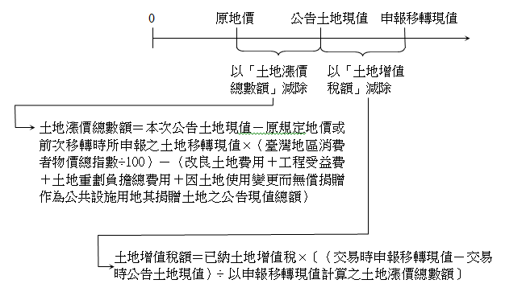

## 384. 稅捐核課期間
*發布日期: 2022-05-31* 

## 內文
各位同學好

今日專欄說明有關稅捐核課期間之意義，今年考試感覺很有機會出題

案例

小曾有一筆A地，原有申請地價稅自用住宅優惠稅率，惟於104年時遷出戶籍卻未主動申報回復一般用地課稅，今（111）年收到稅捐稽徵機關的補稅通知，要求補繳106年至110年的地價稅差額，試問繳稅期限都過這麼久了，稅捐機關憑什麼？

此為稅捐稽徵法之「核課期間」概念：

1. 意義 指課稅事實發生後，政府應予發單徵收之一定期間，逾此期間將喪失核課權。即稅捐稽徵機關行使核課權之期間。

2. 期間 稅捐之核課期間，依下列規定(稅稽§21)： (1)申報稅（如土地增值稅、契稅、遺產稅、贈與稅及房地合一稅） 依法應由納稅義務人申報繳納之稅捐，已在規定期間內申報，且無故意以詐欺或其他不正當方法逃漏稅捐者，其核課期間為五年。 (2) 印花稅、底冊稅（地價稅、房屋稅） 依法應由納稅義務人實貼之印花稅，及應由稅捐稽徵機關依稅籍底冊或查得資料核定課徵之稅捐，其核課期間為五年。 (3) 申報稅（如土地增值稅、契稅、遺產稅、贈與稅及房地合一稅） 未於規定期間內申報，或故意以詐欺或其他不正當方法逃漏稅捐者，其核課期間為七年。

在前項核課期間內，經另發現應徵之稅捐者，仍應依法補徵或並予處罰；在核課期間內未經發現者，以後不得再補稅處罰。

因此，地價稅屬於前述(2)的底冊稅（按地價稅、總歸戶冊課徵），核課期間為5年。105已超過核課期間，故稅捐機關依法不能再補徵，但106至110年還在核課期間當中，稅捐稽徵機關得向小曾再發單補徵。

3. 起算日 核課期間之起算(稅稽§22)： (1)依法應由納稅義務人申報繳納之稅捐，已在規定期間內申報者，自申報日起算。 (2)依法應由納稅義務人申報繳納之稅捐，未在規定期間內申報繳納者，自規定申報期間屆滿之翌日起算。 (3)印花稅自依法應貼用印花稅票日起算。 (4)由稅捐稽徵機關按稅籍底冊或查得資料核定徵收之稅捐，自該稅捐所屬徵期屆滿之翌日起算。 (5)土地增值稅自稅捐稽徵機關收件日起算。但經法院、行政執行分署執行拍賣或交債權人承受之土地、房屋及貨物，自稅捐稽徵機關受法院或行政執行分署通知之日起算。 (6)稅捐減免所依據處分、事實事後發生變更、不存在或所負擔義務事後未履行，致應補徵或追繳稅款，或其他無法依前五款規定起算核課期間者，自核課權可行使之日起算。

4. 期間不完成稅捐之核課期間屆滿時，有下列情形之一者，其時效不完成： (1)納稅義務人對核定稅捐處分提起行政救濟尚未終結者，自核定稅捐處分經訴願或行政訴訟撤銷須另為處分確定之日起算一年內。 (2)因天災、事變或不可抗力之事由致未能作成核定稅捐處分者，自妨礙事由消滅之日起算六個月內。
---
*注：本文圖片存放於 ./images/ 目錄下*

## 385. 退稅之請求權時效
*發布日期: 2022-05-26* 

## 內文
• (一) 稅捐稽徵法之退稅：

因適用法令、認定事實、計算或其他原因之錯誤，致溢繳稅款者，納稅義務人得自繳納之日起十年內提出具體證明，申請退還；屆期未申請者，不得再行申請。但因可歸責於政府機關之錯誤，致溢繳稅款者，其退稅請求權自繳納之日起十五年間不行使而消滅（稽§28Ⅰ）。析言之：

1. 可歸責於納稅義務人之錯誤：自繳納之日起十年間不行使而消滅。

2. 可歸責於政府機關之錯誤：自繳納之日起十五年間不行使而消滅。

• (二) 土地增值稅之重購退稅：

土地所有權人出售其自用住宅用地、自營工廠用地或自耕之農業用地，另行購買使用性質相同之土地者，依法退還其出售土地所繳之土地增值稅（平§44Ⅰ）。

土地增值稅之重購退稅非屬適用法令、認定事實、計算或其他原因之錯誤，因此不適用稅捐稽徵法第28條有關退稅之規定。

土地增值稅之重購退稅，法無明定退稅請求權之時效，因此適用行政程序法第131條規定，即公法上請求權因十年間不行使而消滅。

• (三) 房地合一所得稅之重購退稅：

個人出售自住房屋、土地依規定繳納之稅額，自完成移轉登記之日或房屋使用權交易之日起算二年內，重購自住房屋、土地者，得於重購自住房屋、土地完成移轉登記或房屋使用權交易之次日起算五年內，申請按重購價額占出售價額之比率，自前開繳納稅額計算退還（所§14-8Ⅰ）。

房地合一所得稅之重購退稅非屬適用法令、認定事實、計算或其他原因之錯誤，因此不適用稅捐稽徵法第28條有關退稅之規定。

房地合一所得稅，法有明文規定退稅請求權之時效，即自重購房地完成移轉登記之次日起五年間不行而消滅。
---
*注：本文圖片存放於 ./images/ 目錄下*

## 386. 國土計畫特定區域之性質與內容
*發布日期: 2022-05-24* 

## 內文
國土計畫法第八條規定，針對原住民族土地、河川流域或是都會等特定地區，得另擬定特定區域之計畫內容。請詳述理由分析此處所謂特定區域之計畫內容係指全國國土計畫、直轄市、縣市國土計畫還是獨立之國土計畫類型？此外，此種特定區域之計畫內容得否針對計畫空間範圍內土地為國土4大分區、分類與使用地類別之編定？（110年政大研究所土地法與土地政策第一題）

擬答

首先，特定區域指具有特殊自然、經濟、文化或其他性質，經中央主管機關指定之範圍（國土法§3⑤）。特定區域應考量重要自然地形、地貌、地物、文化特色及其他法令所定之條件，實施整體規劃（國土法§6⑧），以整合相關目的事業計畫及其資源，於生態永續、資源共享、尊重多元文化活動需求、提升公共設施服務水準等原則，研擬治理及經營管理規劃，確保城鄉發展機會公平（全國國土計畫p.19）。

• (一) 特定區域計畫為全國國土計畫之一部分，非獨立之國土計畫類型

按國土計畫法第8條規定，國土計畫之種類僅全國國土計畫與直轄市、縣（市）國土計畫兩類，以及依據下列規定，從而特定區域計畫屬全國國土計畫之一部分，並非獨立之國土計畫類型：

1. 中央主管機關擬訂全國國土計畫時，得會商有關機關就都會區域或特定區域範圍研擬相關計畫內容；直轄市、縣（市）政府亦得就都會區域或特定區域範圍，共同研擬相關計畫內容，報中央主管機關審議後，納入全國國土計畫。（國土法§8 II）

2. 全國國土計畫中涉有依規定擬訂之都會區域或特定區域範圍相關計畫內容，得另以附冊方式定之。（國土法§9 II）

3. 全國國土計畫中特定區域之內容，如涉及原住民族土地及海域者，應依原住民族基本法第二十一條規定辦理，並由中央主管機關會同中央原住民族主管機關擬訂。（國土法§11 II）

• (二) 特定區域計畫不得針對計畫空間範圍內土地為國土4大分區、分類與使用地類別之編定

1. 依據國土計畫法第9條，全國國土計畫之內容，應載明事項包含：「國土功能分區及其分類之劃設條件、劃設順序」。而「國土功能分區及其分類之劃設、調整」則屬直轄市、縣（市）國土計畫之內容（國土法§10）。因此，特定區域計畫屬全國國土計畫之一部，得就特定區域範圍，研擬國土功能分區與分類劃設條件、劃設順序，指導縣（市）政府辦理劃設國土功能分區及分類、使用地編定作業，而非直接予以劃設或編定。

2. 特定區域計畫內容，應載明下列事項（國土施§5）： (1)特定區域範圍。 (2)現況分析及課題。 (3)發展目標及規劃構想。 (4)治理及經營管理規劃。 (5)土地利用管理原則。 (6)執行計畫。 (7)其他相關事項。

按其應載明事項中並未有分區及分類劃設內容，惟可針對特殊需求訂定「土地利用管理原則」，再配合研訂土地使用管制規定，納入國土計畫土地使用管制規則當中。
---
*注：本文圖片存放於 ./images/ 目錄下*

## 387. 地價評議委員會與不動產評價委員會之比較
*發布日期: 2022-05-19* 

## 內文
• (一) 地價評議委員會：平均地權條例所定地價評議委員會，由直轄市或縣（市）政府組織之，並應由地方民意代表及其他公正人士參加；其組織規程，由內政部定之（平§4）。

• (二) 不動產評價委員會：各直轄市、縣（市）（局）應選派有關主管人員及建築技術專門人員組織不動產評價委員會。不動產評價委員會應由當地民意機關及有關人民團體推派代表參加，人數不得少於總額五分之二。其組織規程由財政部定之（房§9）。

• (三) 地價評議委員會與不動產評價委員會之比較：

• T. ABLE_PLACEHOLDER_1
---
*注：本文圖片存放於 ./images/ 目錄下*

## 388. 測量錯誤是否適用土地登記錯誤之損害賠償－參臺灣高等法院108年度上國易字第17號民事判決
*發布日期: 2022-05-17* 

## 內文
各位同學好

今日專欄主要整理地籍測量有誤，是否得依土地法第68條有關土地登記錯誤之規定請求地政機關損害賠償之概念，引臺灣高等法院108年度上國易字第17號民事判決之相關案情與要旨說明如下：

案例摘要

甲以870萬元，向乙購買系爭房地，嗣後將系爭房地出售予丙時，發現系爭房地之房屋坪數有短少之情形，經申請重新測量後，A地政事務所即將系爭房屋主建物、陽台登記面積，由107平方公尺、20平方公尺更正為92平方公尺、18平方公尺，總面積更正為110平方公尺，系爭房屋面積合計短少約17平方公尺；而系爭房屋面積更正係因「原案建物測量成果圖上標示之尺寸及面積計算結果有誤，因有原始資料可稽，故依地籍測量實施規則規定更正」。

重點說明

因登記錯誤、遺漏或虛偽致受損害者，由該地政機關負損害賠償責任，土地法第68條第1項定有明文。次按土地法第68條第1項規定之立法意旨，係在貫徹土地登記之公示性及公信力，使土地權利人不因地政機關就土地登記之錯誤、遺漏或虛偽而受損害，以兼顧交易安全及權利人之權利保障。至土地登記規則第 13 條雖謂土地法第68條第1項所稱登記錯誤，係指登記事項與登記原因證明文件所載內容不符者，所稱遺漏，係指應登記事項而漏未登記者，惟上開規則所定應屬例示性之規定，除此之外，包括測量有誤或面積計算錯誤等情形，仍屬上開規定之保護範圍。

爰此，有關登記之損害賠償要件，土地法第68條第1項前段規定包括因登記錯誤、遺漏或虛偽，且有損害之發生，該損害之發生不可歸責於受害人，並有因果關係，即得依該規定請求賠償。而房屋主建物及陽台登記面積更正，係因建物測量成果圖與竣工圖之尺寸不符，致測繪產生錯誤，核屬登記錯誤之情形，若當事人因登記錯誤受有損害，地政機關自應負賠償責任。
---
*注：本文圖片存放於 ./images/ 目錄下*

## 389. 不課徵土地增值稅之效果分析
*發布日期: 2022-05-12* 

## 內文
配偶相互贈與之土地，得申請不課徵土地增值稅。因此，納稅義務人得選擇「課徵土地增值稅」或「不課徵土地增值稅」。換言之，納稅義務人得選擇「早繳土地增值稅」或「晚繳土地增值稅」。

• (一) 選擇課徵土地增值稅之利與弊：

1. 利：相當於輾轉買賣，原地價不斷提高。日後移轉時，將適用較低累進稅率。

2. 弊：如向銀行借錢繳納土地增值稅，將損失利息。如以自己的錢繳納土地增值稅，仍應以機會成本設算利息。

• (二) 選擇不課徵土地增值稅之利與弊：

1. 利：節省利息支出。

2. 弊：長期持有，原地價固定不變。日後移轉時，恐適用較高累進稅率。
---
*注：本文圖片存放於 ./images/ 目錄下*

## 390. 申請地上權、不動產役權、農育權之設定登記
*發布日期: 2022-05-10* 

## 內文
• 一、申請期限

• (一) 土地權利變更登記聲請，應於土地權利變更後一個月內為之。(土§73II)

• (二) 申請土地權利變更登記，應於權利變更之日起一個月內為之。前項權利變更之日，係指下列各款之一者(土登§33)：

1. 契約成立之日。

2. 法院判決確定之日。

3. 訴訟上和解或調解成立之日。

4. 依鄉鎮市調解條例規定成立之調解，經法院核定之日。

5. 依仲裁法作成之判斷，判斷書交付或送達之日。

6. 產權移轉證明文件核發之日。

7. 法律事實發生之日。

• 二、申請方式

土地權利變更登記，應由權利人(地上權、不動產役權、農育權人)及義務人(土地或建物所有權人) 會同聲請之。(土§73I)

• 三、申請規費

• (一) 費率

聲請為土地權利變更登記，應由權利人按申報地價或權利價值千分之一繳納登記費(土§76I)。

• (二) 權利價值計算標準

1. 申請他項權利登記，其權利價值為實物或非現行通用貨幣者，應由申請人按照申請時之價值折算為新臺幣，填入申請書適當欄內，再依法計收登記費。

2. 申請地上權、永佃權、不動產役權、耕作權或農育權之設定或移轉登記，其權利價值不明者，應由申請人於申請書適當欄內自行加註，再依法計收登記費。

3. 前二項權利價值低於各該權利標的物之土地申報地價或當地稅捐稽徵機關核定之房屋現值百分之四時，以各該權利標的物之土地申報地價或當地稅捐稽徵機關核定之房屋現值百分之四為其一年之權利價值，按存續之年期計算；未定期限者，以七年計算之價值標準計收登記費。

• 四、申請文件

• (一) 登記申請書（土登§34）：依公定格式填寫。

• (二) 登記原因證明文件（土登§34）：如地上權、不動產役權、農育權設定契約書

• (三) 土地或建物所有權狀（土登§34）

• (四) 申請人身分證明（土登§34）

1. 自然人身分證影本、戶口名簿影本或戶籍謄本。

2. 法人(1) 法人登記機關核發之設立、變更登記表或其抄錄本、影本申請人為公司法人者。（土登§42 II） (2) 法人登記證明文件及其代表人之資格證明 申請人為公司法人以外之法人（如公法人；財團法人；非公司之社團法人；工會、農會等明定為法人之人民團體；經辦理法人登記之政黨）者。（土登§42 I）

另申請人身分證明能以電腦處理達成查詢者，得免提出。（土登§34）

• (五) 其他由中央地政機關規定應提出之證明文件（土登§34）

1. 委託書（土§37-1、土登§37）

2. 義務人(土地或建物所有權人)印鑑證明土地所有權人未能親自到場核對身分時，且所檢附之印鑑證明以登記原因發生日期前一年以後核發者為限（土登§41）

3. 第三人同意書及其印鑑證明（土登§44、41） (1) 申請登記須第三人同意者，應檢附第三人之同意書或由第三人在登記申請書內註明同意事由。 (2) 前項第三人除符合土地登記規則第41條第2款、第5款至第8款及第10款規定之情形者外，應親自到場。

4. 位置圖（土登§108） (1)於一宗土地內就其特定部分申請設定地上權、不動產役權、典權或農育權登記時，應提出位置圖。(2)位置圖應先向該管登記機關申請土地複丈。
---
*注：本文圖片存放於 ./images/ 目錄下*

## 391. 土地增值稅之免徵及不課徵
*發布日期: 2022-05-05* 

## 內文
［土地稅法第39條第2項及第3項具有免徵土地增值稅與不課徵土地增值稅之雙重性質］

• (一) 公共設施保留地：

1. 免徵性質：公共設施保留地尚未被徵收前之移轉，且日後未變更為非公共設施保留地，屬於免徵性質。依都市計畫法指定之公共設施保留地尚未被徵收前之移轉，免徵土地增值稅（土稅§39Ⅱ前段）。

2. 不課徵性質：尚未被徵收前之移轉，且日後變更為非公共設施保留地，屬於不課徵性質。依都市計畫法指定之公共設施保留地尚未被徵收前之移轉，免徵土地增值稅。但經變更為非公共設施保留地後再移轉時，以該土地第一次免徵土地增值稅前之原規定地價或最近一次課徵土地增值稅時核定之申報移轉現值為原地價，計算漲價總數額，課徵土地增值稅（土稅§39Ⅱ）。

• (二) 非都市土地供公共設施使用：

1. 免徵性質：非都市土地供公共設施使用，尚未被徵收前之移轉，且日後未變更為非公共設施使用，屬於免徵性質。非都市土地經需用土地人開闢完成或依計畫核定供公共設施使用，並依法完成使用地編定，其尚未被徵收前之移轉，經需用土地人證明者，免徵土地增值稅（土稅§39Ⅲ前段）。

2. 不課徵性質：非都市土地供公共設施使用，尚未被徵收前之移轉，且日後變更為非公共設施使用，屬於不課徵性質。非都市土地經需用土地人開闢完成或依計畫核定供公共設施使用，並依法完成使用地編定，其尚未被徵收前之移轉，經需用土地人證明者，免徵土地增值稅。但經變更為非公共設施使用後再移轉時，以該土地第一次免徵土地增值稅前之原規定地價或最近一次課徵土地增值稅時核定之申報移轉現值為原地價，計算漲價總數額，課徵土地增值稅（土稅§39Ⅲ）。
---
*注：本文圖片存放於 ./images/ 目錄下*

## 392. 耕地租用(佃)到農業用地租賃
*發布日期: 2022-05-03* 

## 內文
各位同學好

今日專欄說明有關耕地租用（耕地租佃）到農業用地租賃之概念：

（一）耕地租用：依據土地法第106條規定，為「以自任耕作為目的，約定支付地租，使用他人之農地者，為耕地租用。所稱耕作，包括漁牧」。

（二）耕地租佃：按44最高法院台上字第611號判例，耕地三七五減租條例所謂耕地之租佃即土地法所稱耕地租用。 依耕地三七五減租條例第1條，耕地之租佃，依本條例之規定；本條例未規定者，依土地法及其他法律之規定。因此，原則上耕地租佃部分優先適用耕地三七五減租條例之規定。 包含租、押金限制、耕地租約應登記、租約至少6年、期滿收回規定等。

（三）農業用地租賃：於社會變遷、產業結構的改變下，原地主與佃農關係已不如往前，農業生產與經營方式也有所不同，以往嚴格保護佃農之耕地三七五減租條例已較不符時代所需，故於民國89年1月28日當日農業發展條例修正施行生效後，改變為「農業用地租賃」，指土地所有權人將其自有農業用地之部分或全部出租與他人經營農業使用者。並且規定「本條例中華民國89年1月4日修正施行後所訂立之農業用地租賃契約，應依本條例之規定，不適用耕地三七五減租條例之規定。本條例未規定者，適用土地法、民法及其他有關法律之規定。」

此外，包含農業用地租賃契約之租期、租金及支付方式；租賃關係之消滅；收回農業用地之補償，全都排除以往三七五減租、土地法或平均地權條例等規定，回歸到一般私法自治、契約自由的情境，以促使地主願意多出租，而有助於推動小地主大專業農、吸引青農企業化經營等政策，增加農業生產力與競爭力。
---
*注：本文圖片存放於 ./images/ 目錄下*

## 393. 信託行為
*發布日期: 2022-04-28* 

## 內文
債權行為屬於負擔行為，即發生債的關係請求給付之行為。物權行為屬於處分行為，即發生標的物得喪變更之行為。如買賣或買賣契約屬於債權行為，買賣所有權移轉登記屬於物權行為。同理，信託或信託契約屬於債權行為，信託登記屬於物權行為。

債權行為與物權行為之效力分開。亦即，縱債權行為有效，物權行為未必有效。茲舉一例說明：

甲、乙具有原住民身分，丙、丁不具有原住民身分。甲將一筆原住民保留地A地信託予丙，並以乙為受益人，則甲、丙間就A地所為之信託契約效力如何？又，甲將一筆原住民保留地B地信託予乙，並以丁為受益人，則甲、乙間就B地所為之信託契約效力如何？

【解答】

• (一) 甲、丙間之信託契約效力：山坡地保育利用條例第37條第2項規定：「原住民取得原住民保留地所有權，如有移轉，以原住民為限。」所稱移轉，指物權行為，不包括債權行為。因此，甲、丙間就A地所為之債權行為有效，物權行為無效。本題甲、丙間就A地所為之信託契約屬於債權行為，故信託契約仍然有效，只不過無法辦理信託登記於丙名下。

• (二) 甲、乙間之信託契約效力：信託法第5條規定：「信託行為，有左列各款情形之一者，無效：……四、以依法不得受讓特定財產權之人為該財產權之受益人者。」所稱信託行為，包括債權行為及物權行為。本題甲、乙間就B地所為之信託契約屬於債權行為，故信託契約無效。
---
*注：本文圖片存放於 ./images/ 目錄下*

## 394. 土地權利契約信託登記之應備文件
*發布日期: 2022-04-26* 

## 內文
各位同學好

土地權利契約信託登記之應備文件，茲整理如下：

• (一) 登記申請書（土登§34）

• (二) 登記原因證明文件（土登§34）

公定之信託契約書正、副本。

信託財產歸屬權利人非委託人時應貼印花稅票。

• (三) 已登記者，其所有權狀或他項權利證明書（土登§34）

• (四) 申請人身分證明（土登§34）

1. 自然人 身分證影本、戶口名簿影本或戶籍謄本。

2. 法人 (1)法人登記機關核發之設立、變更登記表或其抄錄本、影本 申請人為公司法人者。（土登§42 II） (2) 法人登記證明文件及其代表人之資格證明 申請人為公司法人以外之法人（如公法人；財團法人；非公司之社團法人；工會、農會等明定為法人之人民團體；經辦理法人登記之政黨）者。（土登§42 I）

另申請人身分證明能以電腦處理達成查詢者，得免提出。（土登§34）

• (五) 其他文件

1. 委託書（土§37-1、土登§37）

2. 委託人印鑑證明（委託人未能親自到場核對身分時，且所檢附之印鑑證明以登記原因發生日期前一年以後核發者為限）（土登§41）

3. 贈與稅繳清或免稅證明書或不計入贈與總額證明書或同意移轉證明書（他益信託時） 信託契約明定信託利益之全部或一部之受益人為非委託人者，視為委託人將享有信託利益之權利贈與該受益人，依本法規定，課徵贈與稅。（遺產及贈與稅法§5-1 I、42）

4. 主管機關許可之證明文件 公益信託之設立及其受託人，應經目的事業主管機關之許可。許可之申請，由受託人為之。（信託法§70）

5. 主管機關核准或同意備查之證明文件（委託人為財團法人、祭祀公業法人時）（土登§42 III）
---
*注：本文圖片存放於 ./images/ 目錄下*

## 395. 遺產分割
*發布日期: 2022-04-21* 

## 內文
民法第1151條規定：「繼承人有數人時，在分割遺產前，各繼承人對於遺產全部為公同共有。」又，民法第829條規定：「公同關係存續中，各公同共有人，不得請求分割其公同共有物。」另，民法第1164條規定：「繼承人得隨時請求分割遺產。但法律另有規定或契約另有訂定者，不在此限。」準此，這三則法條有無矛盾之處？

【解答】

• (一) 民法第829條係指公同關係存續中，不得請求分割「公同共有物」。民法第1164條係指繼承人得隨時請求分割「遺產」。二者所分割之標的未盡相同。

• (二) 公同關係存續中，不可請求分割公同共有物，但可以請求分割遺產。

• (三) 遺產經分割後，公同關係消滅，進而可以分割公同共有物。因此，這三則法條並無矛盾。
---
*注：本文圖片存放於 ./images/ 目錄下*

## 396. 典權不回贖是原始取得或繼受取得？
*發布日期: 2022-04-19* 

## 內文
• (一) 原始取得(又稱固有取得、最初取得)

指非基於他人既有權利之讓與，而是創設取得所有權（權利的絕對發生），且不繼受前手權利瑕疵。

• (二) 繼受取得(又稱傳來取得、轉手取得)

指依據他人既有權利之讓與而取得所有權（權利的相對發生），而繼受前手權利瑕疵。

典權謂支付典價在他人之不動產為使用、收益，於他人不回贖時，取得該不動產所有權之權。該取得所有權係上述原始取得或繼受取得？

學說上有所爭議：

• (一) 認為屬原始取得者，理由：

1. 依法律規定而取得所有權

2. 典權變為所有權，本質已有所不同

• (二) 認為屬繼受取得者，理由：

1. 典權人取得所有權是來自典權之設定

2. 依法律規定而取得物權之情形未必屬於原始取得。例如：繼承人自繼承開始時，除本法另有規定外，承受被繼承人財產上之一切權利、義務。但權利、義務專屬於被繼承人本身者，不在此限。(民§1148)

3. 原典物上既有之其他權利人，原則上不因典權人取得所有權而受影響
---
*注：本文圖片存放於 ./images/ 目錄下*

## 397. 地價動態穩定
*發布日期: 2022-04-14* 

## 內文
自2020年迄今，地價不斷上漲，政府亦採取各種金融、租稅及行政等手段予以抑制。換言之，地價高漲是土地市場失靈之現象，因此政府介入並干預市場，矯正市場失靈，以免積重難返。

抑制地價高漲之目標是達成「地價動態穩定」。地價動態穩定，係指就短期而言，避免地價暴漲與暴跌；就長期而言，地價隨經濟表現、所得提高、社會進步等而緩漲。
---
*注：本文圖片存放於 ./images/ 目錄下*

## 398. 時效取得地上權登記之應備文件
*發布日期: 2022-04-12* 

## 內文
各位同學好

今日專欄說明有關時效取得地上權登記之應備文件

土地總登記後，占有人依民法第772條規定之相關規定，主張時效完成，經檢附相關申請文件，向該管登記機關申辦時效取得地上權之登記。其應備文件如下：

• (一) 土地登記申請書依公定格式填寫。

• (二) 登記清冊申請書之附件，填寫占有土地之標示資料。

• (三) 登記原因證明文件： 土地總登記後，因主張時效完成申請地上權登記時，應提出以行使地上權意思而占有之證明文件及占有土地四鄰證明或其他足資證明開始占有至申請登記時繼續占有事實之文件。(土登§118 I)

1. 主觀意思之證明文件 以行使地上權意思而占有之證明文件，如： (1)當事人間已有設定地上權之約定，本於該約定先將土地交付占有而未完成登記 (2)已為申請地上權設定登記而未完成登記 (3)已為設定登記但該設定行為具有無效情形 (4)占有人於占有他人土地之始，即將以行使地上權之意思表示於外部並取得第三人之證明等之相關證明文件

2. 客觀占有事實之證明文件（擇一） (1) 占有土地四鄰證明 占有土地四鄰之證明人，於占有人開始占有時及申請登記時，需繼續為該占有地附近土地之使用人、所有權人或房屋居住者，且於占有人占有之始應有行為能力。(時地§6 I) (2) 其他足資證明開始占有至申請登記時繼續占有事實之文件，如： A.曾於該建物設籍之戶籍證明文件。 以戶籍證明文件為占有事實證明申請登記者，如戶籍有他遷記載時，占有人應另提占有土地四鄰之證明書或公證書等文件。(時地§5) B.門牌編釘證明。 C.繳納房屋稅憑證或稅籍證明。 D.繳納水費或電費憑證。

• (四) 占有人身分證明文件 身分證影本或戶口名簿影本或戶籍謄本(土登§34)

• (五) 其他文件

1. 占有範圍位置圖 因主張時效完成，申請地上權、不動產役權或農育權登記時，應提出占有範圍位置圖。(土登§108、時地§2)

2. 四鄰之印鑑證明(土登§41) 該證明人除符合土地登記規則第41條第2款、第6款及第10款規定之情形者外，應親自到場，並依同規則第40條規定程序辦理。(時地§6 III)

3. 委託書(土§37-1、土登§37) 代理申請者檢附。
---
*注：本文圖片存放於 ./images/ 目錄下*

## 399. 區段徵收與都市計畫之關係
*發布日期: 2022-04-07* 

## 內文
都市計畫分為主要計畫與細部計畫二種。前者就大項公共設施（如主要道路、大型公園、批發市場等）予以規劃配置，以作為都市發展之架構。後者就小項公共設施（如次要道路、里鄰公園、零售市場等）予以規劃配置，以作為實施都市計畫之依據。

區段徵收為一定地區之土地整體開發。土地開發過程須依據細部計畫配置公共設施。因此，先有細部計畫，始有區段徵收。然亦有例外，先有區段徵收，再配合擬定都市計畫（以下簡稱先行區段徵收）。

• (一) 原則：

1. 區段徵收範圍勘定後，應配合辦理變更都市計畫者，直轄市或縣（市）政府應依都市計畫法第26條規定辦理通盤檢討變更。但符合同法第27條規定者，得辦理迅行變更（區徵§7）。

2. 區段徵收範圍勘定後，應配合辦理新訂或擴大都市計畫者，直轄市或縣（市）政府應先依規定層報核可後，再依都市計畫法定程序辦理之（區徵§8）。

3. 區段徵收範圍勘定後，應配合辦理變更、新訂或擴大都市計畫者，主要計畫得與細部計畫併同規劃。但計畫書圖仍應依主要計畫及細部計畫內容分別製作，並分循都市計畫法定程序辦理（區徵§10）。

4. 區段徵收範圍勘定後，應配合辦理迅行變更、新訂或擴大都市計畫者，應於一年六個月內發布實施主要計畫，並於主要計畫發布實施後六個月內發布實施細部計畫。前項迅行變更、新訂或擴大都市計畫地區，屬鄉街計畫或特定區計畫者，其主要計畫得與細部計畫合併辦理，並於一年六個月內發布實施（區徵§11ⅠⅡ）。

5. 區段徵收區內都市計畫規劃之街廓或道路無法符合抵價地分配需要者，得在不妨礙原都市計畫或土地使用計畫規劃及道路系統之原則下，增設或加寬為十公尺以下道路。前項增設或加寬之道路，直轄市或縣（市）主管機關應於抵價地分配結果公告確定後，依法辦理都市計畫細部計畫變更（區徵§15）。

• (二) 例外（先行區段徵收）：

1. 土地徵收條例第4條第1項第1款至第3款之開發範圍經中央主管機關核定者，得先行區段徵收，並於區段徵收公告期滿後一年內發布實施都市計畫，不受都市計畫法第52條規定之限制（徵§4Ⅱ）。

2. 土地徵收條例第4條第1項第4款或第6款之開發，涉及都市計畫之新訂、擴大或變更者，得依上開之規定辦理（徵§4Ⅳ）。

3. 先行區段徵收地區，應配合辦理迅行變更都市計畫者，需用土地人應於報請中央主管機關核定開發範圍前，先徵得中央都市計畫主管機關同意依都市計畫法第27條規定辦理；應辦理新訂或擴大都市計畫者，依規定層報核可（區徵§9）。

4. 先行區段徵收地區，應於區段徵收公告期滿一年內發布實施都市計畫（區徵§11Ⅲ）。

〈註〉

1. 土地徵收條例，簡稱「徵」。

2. 區段徵收實施辦法，簡稱「區徵」。
---
*注：本文圖片存放於 ./images/ 目錄下*

## 400. 市地重劃與都市計畫之關係
*發布日期: 2022-03-31* 

## 內文
都市計畫分為主要計畫與細部計畫二種。前者就大項公共設施（如主要道路、大型公園、批發市場等）予以規劃配置，以作為都市發展之架構。後者就小項公共設施（如次要道路、里鄰公園、零售市場等）予以規劃配置，以作為實施都市計畫之依據。

市地重劃為一定地區之土地整體開發。土地開發過程須依據細部計畫配置公共設施。因此，先有細部計畫，始有市地重劃。

市地重劃與都市計畫之關係，現行規定如下：

• (一) 選定之重劃地區尚未發布細部計畫或其細部計畫需變更者，應於完成細部計畫之擬定或變更程序後，再行辦理重劃。但選定重劃之地區，其主要計畫具有細部計畫之內容者，得先依主要計畫辦理重劃，以配合擬定細部計畫（市重§9）。

• (二) 重劃區內都市計畫規劃之街廓無法符合重劃分配需要者，得於不妨礙原都市計畫整體規劃及道路系統之前提下，增設或加寬為八公尺以下巷道。前項增設或加寬之巷道，主管機關應於重劃分配結果公告確定後，通知有關機關依法辦理都市計畫細部計畫變更（市重§28ⅠⅡ）。

• (三) 重劃前供公共通行之既成巷道或私設巷道應予保留者，視為增設巷道，並依上開規定辦理。但該巷道如兼具法定空地性質者，應按重劃前原位置﹑面積分配予原土地所有權人，不計算其重劃負擔，並得配合重劃工程同時施工（市重§28Ⅲ）。

〈註〉市地重劃實施辦法，簡稱「市重」。
---
*注：本文圖片存放於 ./images/ 目錄下*

## 401. 質權人代位申請登記之應備文件
*發布日期: 2022-03-29* 

## 內文
民906-1規定：

1. 為質權標的物之債權，以不動產物權之設定或移轉為給付內容者，於其清償期屆至時，質權人得請求債務人將該不動產物權設定或移轉於出質人，並對該不動產物權有抵押權。

2. 前項抵押權應於不動產物權設定或移轉於出質人時，一併登記。

其概念為權利質權轉換為抵押權設定登記。因此，根據上述民法規定，土地登記規則配合於第117條之2規定相關申請應注意事項：

1. 質權人依民法第九百零六條之一第一項規定代位申請土地權利設定或移轉登記於出質人時，應提出第三十四條、第四十條規定之文件及質權契約書，會同債務人申請之。

2. 前項登記申請時，質權人應於登記申請書適當欄記明確已通知出質人並簽名，同時對出質人取得之該土地權利一併申請抵押權登記。

3. 前二項登記，登記機關於登記完畢後，應將登記結果通知出質人。

茲整理應備文件如下

• (一) 土地登記申請書

1. 依公定格式填寫。

2. 登記原因（不動產物權移轉或設定登記、連件辦理抵押權設定登記）：(1)案件一：不動產物權移轉或設定（視出質人與其債務人之契約為何，如所有權移轉登記買賣或贈與或地上權設定等）。(2)案件二：抵押權登記法定。

3. 另登記申請書適當欄記明「確已通知出質人」並簽名(土登§117-2 II)。

• (二) 登記原因證明文件：

1. 不動產物權移轉或設定契約書：依公定格式填寫。

2. 質權契約書 (土登§117-2 I)

• (三) 質權人、債務人身分證明文件

1. 自然人身分證影本、戶口名簿影本或戶籍謄本

2. 法人(1) 法人登記機關核發之設立、變更登記表或其抄錄本、影本 申請人為公司法人者。（土登§42 II） (2) 法人登記證明文件及其代表人之資格證明 申請人為公司法人以外之法人（如公法人；財團法人；非公司之社團法人；工會、農會等明定為法人之人民團體；經辦理法人登記之政黨）者。（土登§42 I）

• (四) 債務人之所有權狀或他項權利證明書

• (五) 其他文件

1. 委託書 (土§37-1、土登§37)

2. 土地增值稅繳（免）稅證明

3. 契稅繳（免）稅證明

4. 債務人印鑑證明 (土登§41)
---
*注：本文圖片存放於 ./images/ 目錄下*

## 402. 民法第824條第7項之優先購買權與土地法第34條之1第4項之優先購買權之競合
*發布日期: 2022-03-24* 

## 內文
• (一) 民法第824條第7項規定：「變賣共有物時，除買受人為共有人外，共有人有依相同條件優先承買之權，有二人以上願優先承買者，以抽籤定之。」準此，法院裁判共有物分割採變賣共有物時，共有人有優先購買權。

• (二) 土地法第34條之1第4項規定：「共有人出賣其應有部分時，他共有人得以同一價格共同或單獨優先承購。」須注意者，共有人出賣共有不動產全部時，不同意出售之共有人仍有優先購買權。

• (三) 兩者差異：

1. 民法第824條第7項適用於共有物，共有物包括共有動產及共有不動產。土地法第34條之1第4項僅適用於共有不動產。

2. 民法第824條第7項僅限於法院變賣共有物。土地法第34條之1第4項適用於一般買賣及法院拍賣。

3. 民法第824條第7項，法院變賣共有物時，無論同意分割或不同意分割之共有人，均有優先購買權。土地法第34條之1第4項，共有人依土地法第34條之1第1項多數決出賣共有不動產，僅不同意出售之共有人有優先購買權，同意出售之共有人無優先購買權。

4. 民法第824條第7項，共有人如有二人以上願優先承買者，依抽籤定之。土地法第34條之1第4項，共有人如有二人以上願優先購買者，應按各主張優先購買人之應有部分比例定之（土執§11）。

• (四) 兩者競合：

1. 民法第824條第7項之優先購買權具有債權效力，土地法第34條之1第4項之優先購買權亦具有債權效力。兩者競合時，前者優於後者。因此，優先適用民法第824條第7項。

2. 兩者均規定共有人有優先購買權。惟共有物裁判分割，法院變賣共有物時，共有人多人主張優先購買，兩者規定不同。此時，應優先適用民法第824條第7項規定，以抽籤定之。
---
*注：本文圖片存放於 ./images/ 目錄下*

## 403. 區分所有建物所有權第一次登記應備文件
*發布日期: 2022-03-22* 

## 內文
各位同學好

有關區分所有建物所有權第一次登記之申請應備文件，茲詳細整理如下：

• (一) 登記申請書依公定格式填寫。應於申請書適當欄記明基地權利種類及範圍（土地登記規則第83條第1項），且以所有權、地上權或典權為限（建物所有權第一次登記法令補充規定第20點）。依建物標示圖申請建物所有權第一次登記，申請人與委託繪製人不同時，應於登記申請書適當欄記明同意依該圖繪製成果辦理登記，並簽名或蓋章（土地登記規則第78條之1第3項）。

備註：查公寓大廈管理條例第4條第1項、第2項規定「區分所有權人除法律另有限制外，對其專有部分，得自由使用、收益、處分，並排除他人干涉。」、「專有部分不得與其所屬建築物共用部分之應有部分及其基地所有權或地上權之應有部分分離而為移轉或設定負擔。」揆其條文意旨，係維持建築物區分所有權與基地共有權之一體化，避免法律關係趨於複雜，爰規定專有部分權利內容及其不得與所屬建築物共用部分之應有部分及其基地所有權或地上權之應有部分分離而為移轉或設定負擔。次查土地登記規則第83條規定區分建物所有權人，於申請建物所有權第一次登記時，應於申請書適當欄記明基地權利種類及其範圍之意旨，係配合上開條例規定及避免辦理所有權移轉登記時滋生疑義所增訂，是有關當事人於申請建物所有權第一次登記時記明「基地權利種類及其範圍」，依前開條例規定，僅限於基地所有權或地上權，不宜擴張解釋適用於「使用借貸」、「典權」及「租賃權」。 (內政部92年5月13日內授中辦地字第0920082839號函)

• (二) 登記原因證明文件I.實施建築管理前建造之建物，無使用執照者，應提出主管建築機關或鄉(鎮、市、區)公所之證明文件或實施建築管理前有關該建物之下列文件之一（土地登記規則第79條第3項）：

1. 曾於該建物設籍之戶籍證明文件。

2. 門牌編釘證明。

3. 繳納房屋稅憑證或稅籍證明。

4. 繳納水費憑證。

5. 繳納電費憑證。

6. 未實施建築管理地區建物完工證明書。

7. 地形圖、都市計畫現況圖、都市計畫禁建圖、航照圖或政府機關測繪地圖。

8. 其他足資證明之文件。

前項文件內已記載面積者，依其所載認定。未記載面積者，由登記機關會同直轄市、縣(市)政府主管建築、農業、稅務及鄉(鎮、市、區)公所等單位，組成專案小組並參考航照圖等有關資料實地會勘作成紀錄以為合法建物面積之認定證明。（土地登記規則第79條第4項）

• I. I.實施建築管理後（土地登記規則第79條第1項）

1. 使用執照或依法得免發使用執照之證件於實施建築管理後且在中華民國57年6月6日以前建築完成之建物，得憑建築執照申請建物所有權第一次登記。（建物所有權第一次登記法令補充規定第4點）

2. 建物測量成果圖或建物標示圖申請建物所有權第一次登記前，應先向登記機關申請建物第一次測量。但在中華民國一百零二年十月一日以後領有使用執照之建物，檢附依使用執照竣工平面圖繪製及簽證之建物標示圖辦理登記者，不在此限。(1)建物測量成果圖建物第一次測量，應測繪建物位置圖及其平面圖。登記機關於測量完竣後，應發給建物測量成果圖。(2)建物標示圖A.應由開業之建築師、測量技師或其他依法規得為測量相關簽證之專門職業及技術人員辦理繪製及簽證。（土地登記規則第78條之1第1項）B.應記明本建物平面圖、位置圖及建物面積確依使用執照竣工平面圖繪製，如有遺漏或錯誤致他人受損害者，建物起造人及繪製人願負法律責任等字樣及開業證照字號，並簽名或蓋章。（土地登記規則第78條之1第2項）

3. 全體起造人就專有部分所屬各共有部分及基地權利應有部分之分配文件

4. 全體起造人之分配文件區分所有建物之專有部分，依使用執照無法認定申請人之權利範圍及位置者。

5. 戶政機關核發之所在地址證明區分所有建物之地下層或屋頂突出物，依主管建築機關備查之圖說標示為專有部分且未編釘門牌者。

6. 區分所有權人依法約定為專有部分之文件主管建築機關備查之圖說未標示專有部分者。（土地登記規則第79條第2項）

• (三) 身分證明文件：

1. 自然人身分證影本、戶口名簿影本或戶籍謄本區分所有建物，區分所有權人得就其專有部分及所屬共有部分之權利，單獨申請登記。（土地登記規則第80條）

2. 法人(1) 法人登記機關核發之設立、變更登記表或其抄錄本、影本申請人為公司法人者。（土地登記規則第42條第2項）(2) 法人登記證明文件及其代表人之資格證明申請人為公司法人以外之法人（如公法人；財團法人；非公司之社團法人；工會、農會等明定為法人之人民團體；經辦理法人登記之政黨）者。（土地登記規則第42條第1項）

• (四) 其他相關文件：

1. 移轉契約書或其他證明文件申請人非起造人時。（土地登記規則第79條第1項）

2. 使用基地之證明文件建物與基地非屬同一人所有者。（土地登記規則第79條第5項）申請實施建築管理前建築完成之建物所有權第一次登記，申請人與基地所有權人非同一人時，有下列情形之一者，免附基地所有權人同意使用之證明文件（建物所有權第一次登記法令補充規定第13點）：（一）申請人為地上權人或典權人。（二）因法院拍賣移轉取得建物者。（三）日據時期已登記之建物。（四）占用基地經法院判決確定有使用權利者。（五）租用他人土地建築房屋且提出土地使用證明者。

3. 委託書（土地法第37條之1、土地登記規則第37條）
---
*注：本文圖片存放於 ./images/ 目錄下*

## 404. 土地之分割合併與合併分割
*發布日期: 2022-03-17* 

## 內文
土地之分割合併與合併分割不同。前者先分割，再合併；後者先合併，再分割。

• (一) 土地之分割合併

1. 意義：一宗土地先分割，分割為數宗後，其中一宗土地再與鄰地合併。例如：A與B為相鄰二宗土地，A地先分割出A-1，A-1再與B地合併。[圖片1]

2. 登記：一宗土地之部分合併於他土地時，應先行申請辦理分割（登§86）。換言之，先辦理分割登記，再辦理合併登記。

3. 耕地分割：每宗耕地分割後每人所有面積未達0.25公頃者，不得分割。但因購置毗鄰耕地而與其耕地合併者，得為分割合併；同一所有權人之二宗以上毗鄰耕地，土地宗數未增加者，得為分割合併（農§16Ⅰ）。

• (二) 土地之合併分割

1. 意義：數宗土地先合併，合併後之宗地再作分割。例如：A與B為相鄰二宗土地，A地與B地先合併為C地，C地再分割為D地、E地及F地。[圖片2]

2. 登記：先辦理合併登記，再辦理分割登記。

3. 法院裁判： (1)共有人相同：共有人相同之數不動產，除法令另有規定外，共有人得請求合併分割（民§824Ⅴ）。詳言之，共有人全部相同（須注意者，應有部分不必相同）之數不動產，任何共有人得訴請法院作合併分割。 (2)共有人部分相同：共有人部分相同之相鄰數不動產，各該不動產均具應有部分之共有人，經各不動產應有部分過半數共有人之同意，得請求合併分割。但法院認合併分割為不適當者，仍分別分割之（民§824Ⅵ）。詳言之，共有人部分相同之數相鄰不動產，符合下列條件，任何共有人得訴請法院裁判作合併分割：起訴人於各該不動產均具應有部分。經各不動產應有部分過半數之同意。須注意者，僅計算「應有部分」，無須計算「共有人數」。法院認為合併分割無不適當。

## 文章圖片

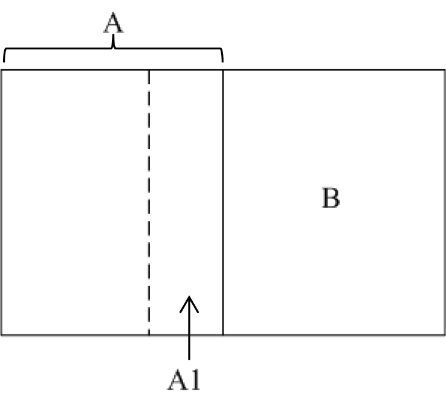

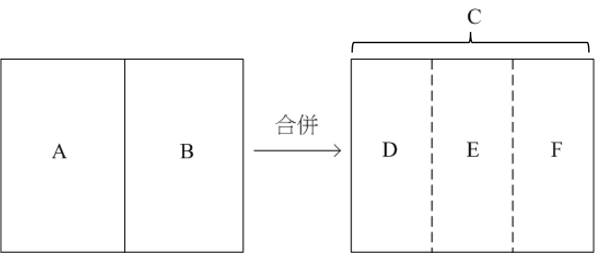

## 405. 土地合併登記之應備文件
*發布日期: 2022-03-15* 

## 內文
各位同學好

今日專欄說明有關土地合併登記之應備文件：

案例：甲所有之A地與乙所有之B地相鄰，A地部分甲與丙設定有抵押權、與丁設定有典權。今甲乙兩人欲進行土地合併以共同興建大樓，試問辦理土地合併登記應檢附哪些文件？

1. 申請書（兩種方式）： I.先複丈完再辦登記 土地複丈申請書→土地複丈結果通知書→土地登記申請書。 II.複丈與登記一併辦 土地複丈及標示變更登記申請書。

2. 甲與乙之土地合併協議書。 土登§88 I：二宗以上所有權人不同之土地辦理合併時，各所有權人之權利範圍依其協議定之

3. 甲、乙之土地所有權狀。

4. 甲、乙之身分證明文件。 如身分證影本、戶口名簿影本或戶籍謄本。

5. 其他文件： (1) 甲與丙之抵押權利範圍協議書。 土登§88 IV：設定有抵押權之土地合併時，該抵押權之權利範圍依土地所有權人與抵押權人之協議定之。 (2) 丁之同意書。 地測§224 II：設定有典權或耕作權時，應檢附該他項權利人之同意書。 土登§88 II：設定有地上權、永佃權、不動產役權、典權、耕作權或農育權之土地合併時，應先由土地所有權人會同他項權利人申請他項權利位置圖勘測。但設定時已有勘測位置圖且不涉及權利位置變更者，不在此限。 土登88 III：前項他項權利於土地合併後仍存在於合併前原位置之上，不因合併而受影響。 (3) 都市計畫土地使用分區證明。（無法以電腦處理達成查詢時檢附） 土施§19-1：兩宗以上之土地如已設定不同種類之他項權利，或經法院查封、假扣押、假處分或破產之登記者，不得合併。 地測§224 I：土地因合併申請複丈者，應以同一地段、地界相連、使用性質相同之土地為限。 (4) 合併前後取得價值差額計算表。 (5) 土地移轉現值申報。 合併後應有持分部分之價值差額在1平方公尺之當期公告土地現值以上者。 (6) 甲、乙印鑑證明。 合併後應有持分部分之價值差額在1平方公尺之當期公告土地現值以上者。 (7) 丙、丁印鑑證明。 (8) 委託書。
---
*注：本文圖片存放於 ./images/ 目錄下*

## 406. 土地法第34條之1之處分
*發布日期: 2022-03-10* 

## 內文
土地法第34條之1所稱處分是否及於負擔行為？

• (一) 處分之涵義 處分之意涵有廣狹之分。

1. 最廣義之處分：指法律上之處分與事實上之處分。法律上之處分包括債權行為性質之負擔行為及物質性質之處分行為。

2. 廣義之處分：指法律上之處分，不包括事實上之處分。法律上之處分包括債權行為性質之負擔行為及物權行為性質之處分行為。

3. 狹義之處分：僅指物權行為性質之處分行為，不包括事實上之處分及債權行為性質之負擔行為。

• (二) 土地法第34條之1所稱處分之見解

1. 採廣義解釋：土地法第34條之1所稱處分，包括債權行為性質之負擔行為及物權行為性質之處分行為。例如，買賣屬於債權性質之負擔行為。部分共有人就共有不動產所訂立之買賣契約如未達土地法第34條之1第1項之同意門檻（即共有人過半數及其應有部分合計過半數之同意，但其應有部分合計逾三分之二者，其人數不計），則買賣契約無效。

2. 採狹義解釋：土地法第34條之1所稱之處分，僅指物權行為性質之處分行為，不包括債權行為性質之負擔行為。例如，買賣屬於債權性質之負擔行為。部分共有人就共有不動產所訂立之買賣契約，如未達土地法第34條之1第1項之同意門檻，則買賣契約仍然有效。

3. 私見認為應採狹義解釋，其理由如下： (1)負擔行為之有效成立不以有處分權為必要。縱係無處分權之人所訂立之買賣契約，不因之無效。此為負擔行為之固有法理。因此，土地法第34條之1第1項不應違背上開法理。換言之，土地法第34條之1第1項多數決應僅及於物權行為性質之處分行為，不及於債權行為性質之負擔行為。 (2)一般咸認民法第819條第2項之處分，僅指物權行為性質之處分行為，不包括債權行為性質之負擔行為。土地法第34條之1第1項為民法第819條第2項之特別法，兩者之處分意涵理應相同。
---
*注：本文圖片存放於 ./images/ 目錄下*

## 407. 共有不動產使用管理登記
*發布日期: 2022-03-08* 

## 內文
各位同學好

今日專欄說明有關共有不動產使用管理登記之應備文件：

使用管理登記指已辦理土地總登記或建物所有權第一次登記之不動產，共有人間就該共有物之使用、管理、分割或禁止分割等約定、決定或法院裁定事項，或區分地上權人與設定之土地上下有使用、收益權利之人就相互間使用收益限制之約定事項，檢附相關文件，向該管登記機關申請之登記。藉此達成對外公示之效果。

案例：甲乙丙三人共有一A地，應有部分均等，今甲乙依據民法第820條規定，以其人數過半及其應有部分合計過半同意就A地進行位置分別使用管理，按民法第826-1條第1項規定，為使將來某人出售給第三人時，仍對其同樣具有拘束力，故甲乙欲將該分管決定辦理土地登記，請問應準備哪些文件？

其應備文件如下： （一）登記申請書：依公定格式填寫，且應於登記申請書適當欄記明確已通知他共有人並簽名。 （二）登記清冊。 （三）登記原因證明文件：甲乙分管決定書。 （四）甲乙的土地所有權狀。 （五）甲乙的身分證明文件。 甲乙的中華民國國民身分證影本、戶口名簿影本、戶籍謄本。 （六）其他由中央地政機關規定應提出之證明文件。 1.甲乙如未能親自到場驗證身分，則應檢附登記原因發生日期前一年以後核發之印鑑證明或採線上聲明等方式。 2.委託書。（如登記申請書已載明委任關係者，得免檢附）
---
*注：本文圖片存放於 ./images/ 目錄下*

## 408. 處分之涵義
*發布日期: 2022-03-03* 

## 內文
法律條文常出現「處分」二字，其涵義有廣狹之分。

• (一) 最廣義之處分：包括法律上之處分與事實上之處分。法律上之處分包括債權行為性質之負擔行為（即發生債權債務關係請求給付之行為）及物權行為（即發生使標的物權利得喪變更之行為）。事實上之處分指就標的物為變形、改造或毀損之行為。如民法第765條規定：「所有人，於法令限制之範圍內，得自由使用、收益、處分其所有物，並排除他人之干涉。」所稱處分，指最廣義之處分。

• (二) 廣義之處分：指法律上之處分，不包括事實上之處分。法律上之處分包括債權行為性質之負擔行為及物權行為性質之處分行為。如民法第84條規定：「法定代理人允許限制行為能力人處分之財產，限制行為能力人，就該財產有處分之能力。」所稱處分，指廣義之處分。

• (三) 狹義之處分：僅指物權行為性質之處分行為。不包括事實上之處分及債權行為性質之負擔行為。如民法第759條規定：「因繼承、強制執行、徵收、法院之判決或其他非因法律行為，於登記前已取得不動產物權者，應經登記，始得處分其物權。」所稱處分，指狹義之處分。

綜上，土地法規相關條文之處分意涵，舉例如下：

1. 土地法第25條規定：「直轄市或縣（市）政府對於其所管公有土地，非經該管區內民意機關同意，並經行政院核准，不得處分或設定負擔或為超過十年期間之租賃。」所稱處分，應指最廣義之處分。

2. 土地法第34條之1第1項規定：「共有土地或建築改良物，其處分、變更及設定地上權、農育權、不動產役權或典權，應以共有人過半數及其應有部分合計過半數之同意行之。但其應有部分合計逾三分之二者，其人數不予計算。」所稱處分，有二說，一說認為應指廣義之處分，另一說認為應指狹義之處分。容於下一篇說明。

3. 土地登記規則第136條第1項規定：「土地法第七十八條第八款所稱限制登記，謂限制登記名義人處分其土地權利所為之登記。」所稱處分，應指狹義之處分。
---
*注：本文圖片存放於 ./images/ 目錄下*

## 409. 公有土地撥用程序
*發布日期: 2022-03-01* 

## 內文
各位同學好

今日專欄說明有關撥用地方公有不動產之作業程序：

1. 調查撥用公有不動產資料。

2. 洽辦用地分割或協議空間撥用。

3. 徵詢管理機關同意。此種洽商原管機關同意撥用為「應經程序」，而非「必要條件」，如協議不成立時，並應將協商經過情形，於撥用不動產計畫書內載明，並報經其上級機關核明屬實，層報行政院核定之。

4. 填製撥用不動產計畫書件。

5. 審核層報核准撥用。申請撥用之不動產如為直轄市有、縣（市）有或鄉（鎮、市）有者，應依照土地法第26條規定辦理，由申請撥用機關，先商請該不動產所有權機關、管理機關同意，報經其上級機關核明屬實後，報由內政部代擬代判院稿逕行核定。

6. 辦理管理機關變更或所有權移轉登記。(1) 無償撥用：直轄市、縣（市）地政機關接獲核准撥用函件後，囑託轄區地政事務所辦理管理機關變更登記。(2) 有償撥用：公地奉准有償撥用後，申請撥用機關於繳清價款，由該地政機關囑託轄區地政事務所辦理土地所有權移轉及管理機關變更登記。

7. 土地及改良物之清除及補償。(1) 他項權利及一般租賃權：政府機關因公務或公共事業需用土地時，依照土地法第 26 條之規定申撥土地奉核准後，因係以公權力之運用，使需地機關取得使用土地之權利，該奉准撥用之公有土地上之原有他項權利或租賃權自應歸於消滅。該土地上之私有土地改良物並應予以清除。公有土地上如有租賃權，於奉准撥用時，縱其租期尚未屆滿，依最高法院52年台上字第4031號判例，其租賃權因與政府機關奉准撥用不能併存而應歸於消滅。(2) 公有出租耕地：訂有公有耕地租約之公有出租耕地，應於奉准撥用後，依平均地權條例第11條第3項及同條例施行細則第9條第2項規定，除補償承租人為改良土地所支付之費用及尚未收穫之農作改良物外，並應按撥用當期該土地公告土地現值之3分之1補償予承租人。注意：惟有老師認為此種直接消滅的處理方式並不妥適。

8. 依撥用計畫使用土地。應在1年內依照核定撥用計畫使用，否則應廢止撥用。

資料來源：參公地撥用作業手冊，2016。
---
*注：本文圖片存放於 ./images/ 目錄下*

## 410. 更正登記之實例研習
*發布日期: 2022-02-24* 

## 內文
甲、乙二人購買一筆土地，甲出資2,000萬元，乙出資1,000萬元。該地擬登記為甲、乙二人共有，甲之應有部分三分之二，乙之應有部分三分之一。倘發生下列二種情形，各應如何救濟？(一) 私契記載：甲之應有部分三分之二，乙之應有部分三分之一。惟公契記載：甲之應有部分三分之一，乙之應有部分三分之二。最後登記簿記載：甲之應有部分三分之一，乙之應有部分三分之二。(二) 私契記載：甲之應有部分三分之二，乙之應有部分三分之一。公契亦記載：甲之應有部分三分之二，乙之應有部分三分之一。惟最後登記簿卻記載：甲之應有部分三分之一，乙之應有部分三分之二。

【解答】

• (一) 第1小題：

1. 申請買賣所有權登記僅檢附公契，未檢附私契。換言之，登記原因證明文件為公契，而非私契。

2. 登記事項與登記原因證明文件所載之內容並無不符，因此，未發生登記錯誤（登§13），不得申請更正登記（登§69）。此時，應再申請交換所有權移轉登記，以為救濟。

• (二) 第2小題：

1. 公契為登記原因證明文件。登記事項與登記原因證明文件所載之內容不符。

2. 土地登記規則第13條規定，所稱登記錯誤，係指登記事項與登記原因證明文件所載之內容不符。因此，依據土地法第69條規定，登記錯誤應申請更正登記，以為救濟。
---
*注：本文圖片存放於 ./images/ 目錄下*

## 411. 出售不動產給外國人之土地登記應備文件
*發布日期: 2022-02-22* 

## 內文
各位同學好

今日專欄討論有關出售給外國人之土地登記應備文件。

舉例：本國人甲欲將某都市計畫住宅區之不動產一筆出售給日本人乙，請問辦理土地登記之申請文件為何？

（一）登記申請書，依公定格式填寫，且申請書備註欄記明「本案土地用途為土地法第19條第1項第○款；使用目的為□□。」

（二）登記原因證明文件：土地、建物買賣移轉契約書，依公定格式填寫。

（三）甲的土地、建物所有權狀。

（四）申請人身分證明

1. 甲的中華民國國民身分證影本、戶口名簿影本、戶籍謄本。

2. 乙的護照或中華民國居留證影本。

（五）其他由中央地政機關規定應提出之證明文件

1. 甲如未能親自到場驗證身分，則應檢附登記原因發生日期前一年以後核發之甲印鑑證明或採線上聲明等方式。

2. 土地增值稅或契稅繳稅或免稅證明文件。

3. 土地使用分區證明（如屬非都市土地者免檢附）（主要是確認非土地法第17條規定之用地）。

4. 委託書。（如登記申請書已載明委任關係者，得免檢附。）

5. 登記規費收據。

6. 授權書（本人不能親自申請時檢附）。
---
*注：本文圖片存放於 ./images/ 目錄下*

## 412. 耕地分割之實例研習
*發布日期: 2022-02-17* 

## 內文
甲、乙二人共有一筆非都市土地，應有部分相等，編定為山坡地保育區農牧用地，土地面積3,000平方公尺。下列二種情形，登記機關得否准許其分割？(一) 甲、乙二人於民國89年1月20日買賣取得該地，擬於民國111年2月16日分割為二筆，一筆由甲單獨所有，另一筆由乙單獨所有。(二) 該地原為單獨所有，甲、乙二人於民國100年5月15日繼承取得該地而為共有，擬於民國111年2月16日分割為三筆，其中二筆分別由甲單獨所有，另一筆由乙單獨所有。

【解答】

• (一) 農業發展條例第16條規定：「每宗耕地分割後每人所有面積未達○‧二五公頃者，不得分割。但有下列情形之一者，不在此限：

1. 因購置毗鄰耕地而與其耕地合併者，得為分割合併；同一所有權人之二宗以上毗鄰耕地，土地宗數未增加者，得為分割合併。

2. 部分依法變更為非耕地使用者，其依法變更部分及共有分管之未變更部分，得為分割。

3. 本條例中華民國八十九年一月四日修正施行後所繼承之耕地，得分割為單獨所有。

4. 本條例中華民國八十九年一月四日修正施行前之共有耕地，得分割為單獨所有。

5. 耕地三七五租約，租佃雙方協議以分割方式終止租約者，得分割為租佃雙方單獨所有。

6. 非農地重劃地區，變更為農水路使用者。

7. 其他因執行土地政策、農業政策或配合國家重大建設之需要，經中央目的事業主管機關專案核准者，得為分割。

前項第三款及第四款所定共有耕地，辦理分割為單獨所有者，應先取得共有人之協議或法院確定判決，其分割後之宗數，不得超過共有人人數。」應注意者：

1. 耕地，指依區域計畫法劃定為特定農業區、一般農業區、山坡地保育區及森林區之農牧用地（農§3）。

2. 0.25公頃 = 25公畝 = 2,500平方公尺。

3. 民國89年1月4日，係立法院三讀通過之日。總統於民國89年1月26日修正公布。因此，本修正條文自民國89年1月28日施行（生效）。

• (二) 本題山坡地保育區農牧用地，屬於耕地，應受農業發展條例第16條之拘束。又，土地面積3,000平方公尺，如經分割，分割後面積必定有一筆未達0.25公頃。(三) 本題第(一)小題，符合農業發展條例第16條第1項第4款規定，因此登記機關應准其分割。(四) 本題第(二)小題，雖符合農業發展條例第16條第1項第3款規定，但不符合同法第2項規定，故登記機關應不准其分割。
---
*注：本文圖片存放於 ./images/ 目錄下*

## 413. 對土地徵收補償價額異議查處不符之訴訟類型
*發布日期: 2022-02-15* 

## 內文
各位同學好

本周專欄整理有關「對土地徵收補償價額異議查處不符，應提何種訴訟類型？」

依據最高行政法院109年度大字第1號大法庭裁定，其重點摘要如下：

被徵收土地所有權人對徵收補償價額不服，依土地徵收條例第22條第2項規定以書面提出異議，經主管機關為維持原補償價額之查處，如有不服，循序提起行政訴訟，其訴訟種類應為行政訴訟法第5條第2項規定之「課予義務訴訟」。

課予義務訴訟與撤銷訴訟，雖均以行政處分為訴訟之程序標的，惟前者係在於請求作成授益處分，以貫徹人民對行政機關之請求權，並使人民取得強制執行之名義，後者則在於除去已作成之行政處分，以排除行政機關強制執行之可能性。於被徵收土地所有權人認補償價額不足而提起行政訴訟之情形，其自當提起課予義務訴訟請求主管機關另作成給付補償差額之授益處分，或變更原補償處分另為補償價額較高之授益處分，方可取得對主管機關強制執行之名義，以達成其提起訴訟之目的，而非提起撤銷訴訟，請求撤銷對其授益之補償處分。

此外，土地經公告徵收後，所有權人即不得自由使用、收益及處分該土地，致受有損失，因此被徵收土地所有權人應自公告時起即有補償請求權。徵收土地之同時，依法即應主動作成處分發給補償，不待被徵收土地所有權人提出申請。然國家既有補償義務，且被徵收土地所有權人有補償請求權，自不因主管機關主動作成補償處分，即謂被徵收土地所有權人就補償價額不服之情形，因欠缺「依法申請」之程序，而不得提起課予義務訴訟。

註：行政訴訟法第5條第2項：「人民因中央或地方機關對其依法申請之案件，予以駁回，認為其權利或法律上利益受違法損害者，經依訴願程序後，得向行政法院提起請求該機關應為行政處分或應為特定內容之行政處分之訴訟。」
---
*注：本文圖片存放於 ./images/ 目錄下*

## 414. 區分所有建物之共有部分得否分割
*發布日期: 2022-02-10* 

## 內文
建物分割分為建物標示分割與建物權利分割二種。前者辦理標示變更登記，後者辦理所有權移轉登記。

• (一) 區分所有建物之共有部分不得為標示分割民法第823條第1項規定：「各共有人，除法令另有規定外，得隨時請求分割共有物。但因物之使用目的不能分割或契約訂有不分割之期限者，不在此限。」準此，各共有人得隨時請求分割共有物，固為民法第823條第1項前段所規定。惟同條項但書又規定，因物之使用目的不能分割者，不在此限。其立法意旨在於增進共有物之經濟效用，並避免不必要之紛爭。區分所有建築物之共同使用部分，為各區分所有人利用該建築物所不可或缺，其性質屬於因物之使用目的不能分割者（司法院釋字第358號）。由此可知，區分所有建物之共有部分不得分割；但此不得分割，僅指標示分割，不包括權利分割。

• (二) 區分所有建物之共有部分得為權利分割民法第799條第5項規定：「專有部分與其所屬之共有部分及其基地之權利，不得分離而為移轉或設定負擔。」又，公寓大廈管理條例第4條第2項規定：「專有部分不得與其所屬建築物共用部分之應有部分及其基地所有權或地上權之應有部分分離而為移轉或設定負擔。」準此，區分所有建物之共有部分，除法令另有規定外，應隨同各相關專有部分及其基地權利為移轉、設定或限制登記（登§94）。由此可知，以區分所有建物為標的辦理共有物分割，其所屬建物共有部分之應有部分及其基地所有權或地上權之應有部分，應併同為共有物之分割標的。但此區分所有建物共有部分之分割，僅指權利分割，不包括標示分割。

• (三) 綜上，區分所有建物之共有部分（俗稱公寓大廈之公共設施部分），不得為標示分割，但得為權利分割。
---
*注：本文圖片存放於 ./images/ 目錄下*

## 415. 徵收收回權時效問題
*發布日期: 2022-02-08* 

## 內文
各位同學新年快樂

今天來談談有關土地徵收收回權之時效問題，主要以土地法、釋字763號為範疇進行討論。

參考最高行政法院109 年度判字第652 號判決，假設一案例如下：

• A. 縣政府於77年7月22日公告徵收某甲之土地（系爭土地），以開闢國中校地，其都市計畫預定78年9月開工，99年9月完工。惟直至105年仍未開闢使用，甲遂依土地法219條規定，向A縣政府申請按徵收補償價額收回系爭土地。試問：（一）A縣政府認為已逾法定得聲請收回期限，不准甲收回，請問是否有理由？（二）甲主張以釋字763號其時效已停止進行，是否有理由？

擬答：

（一）A縣政府認為已逾法定得聲請收回期限，不准甲收回，具有理由依據土地法第219條第1項規定，私有土地經徵收後，有下列情形之一者，原土地所有權人得於徵收補償發給完竣屆滿一年之次日起五年內，向該管直轄市或縣（市）地政機關聲請照徵收價額收回其土地︰(1)徵收補償發給完竣屆滿一年，未依徵收計畫開始使用者。(2)未依核准徵收原定興辦事業使用者。其立法目的係徵收後如不使用或不依計畫使用，似已失卻徵收土地時之本意，與徵收之目的相背，易生濫予徵收之弊，違反地盡其利，損害原土地所有權人權益，故收回權得以作為需用土地人違反徵收目的之制裁手段，藉此防止徵收機關為不必要之徵收，或遷延興辦公共事業。另都市計畫法第83條規定，依本法規定徵收之土地，其使用期限，應依照其呈經核准之計畫期限辦理，不受土地法第二百十九條之限制。不依照核准計畫期限使用者，原土地所有權人得照原徵收價額收回其土地。換言之，依都市計晝法規定徵收之土地（主要為都市計畫公共設施保留地之徴收），有關其收回期限係不受土地法第219條第1項第1款所定「徵收補償發給完竣屆滿一年」起算之限制；須俟其呈經核准之計畫期限屆滿，需用土地人仍不依照核准計畫期限開始使用土地時，原土地所有權人始得行使其收回被徵收土地之權利。亦即，依都市計畫法規定徴收之土地，其原土地所有權人有權得申請收回被徵收土地之期限，係其經核准之計畫使用期限屆滿之次日起5年內；逾此收回權之行使期間，則權利將罹於時效而消滅。此徴收案之使用期限為99年9月，故原土地所有權人甲得收回被徵收土地之期限至104年9月止。而甲是在105年申請收回被徵收土地，其權利已罹於時效。

（二）本件不得按釋字763號適用時效停止進行司法院釋字第763號解釋指出：該條項規定逕以「徵收補償發給完竣屆滿1年之次日」為收回權之時效起算點，並未規定該管直轄市或縣（市）主管機關就被徴收土地之後續使用情形，應定期通知原土地所有權人或依法公告，致其無從及時獲知充分資訊，俾判斷是否行使收回權，不符憲法要求之正當行政程，應自本解釋公布之日起2年內檢討修正。於本解釋公布之日，原土地所有權人之收回權時效尚未完成者，時效停止進行；於該管直轄市或縣（市）主管機關主動依本解釋意旨通知或公告後，未完成之時效繼續進行；修法完成公布後，依新法規定。因此，需釋字763號公布之日（107年5月4日），原土地所有權人之收回權時效尚未完成者，時效方停止進行。而本件甲收回權時效既已完成（104年9月止），則認並無上開解釋效力之適用。因此，甲主張並無理由。
---
*注：本文圖片存放於 ./images/ 目錄下*

## 416. 重購退稅之計算實例
*發布日期: 2022-01-27* 

## 內文
甲出售一棟自住房地，出售價格1,500萬元，公告土地現值1,000萬元，土地增值稅200萬元，房地合一所得稅100萬元。半年後，甲再購入一棟自住房地，購入價格1,200萬元，公告土地現值900萬元。申報土地移轉現值以公告土地現值為準。試計算甲重購退稅之額度？

【解答】

• (一) 重購退還土地增值稅：1,000－200＝800900－800＝100重購退還土地增值稅100萬元。

• (二) 重購退還房地合一所得稅：[圖片1]重購退還房地合一所得稅80萬元。

## 文章圖片

## 417. 合併分割
*發布日期: 2022-01-25* 

## 內文
各位同學好

今日專欄說明有關合併分割之情形。

案例：A、B為兩筆相鄰之土地，A地為甲、乙與丙三人分別共有，B地為甲、乙、丙與丁分別共有，今甲想要把A、B兩筆地進行分割，讓自己能夠單獨所有一筆面積較大之土地，請問有何方式？

依照下列方式採合併分割：一、協議合併分割最高行政法院八十八年度判字第四一二三號判決要旨略以：「共有人共有數共有物，不論各共有物共有人是否全部相同，如經全體共有人同意協議合併分割，依協議分割之法意觀之，亦非法所不許。」因此，可經甲、乙、丙與丁全體同意進行分割協議合併分割。

• 二、多數決訴請裁判合併分割如無法全體協議，則按民法§824第5項：「共有人相同之數不動產，除法令另有規定外，共有人得請求合併分割」。同條第6項：「共有人部分相同之相鄰數不動產，各該不動產均具應有部分之共有人，經各不動產應有部分過半數共有人之同意，得適用前項規定，請求合併分割。但法院認合併分割為不適當者，仍分別分割之。」因此，可經甲取得乙、丙同意，以應有部分過半，訴請法院進行合併分割。

又土地登記規則§106：數宗共有土地併同辦理共有物分割者，不以同一地段、同一登記機關為限。
---
*注：本文圖片存放於 ./images/ 目錄下*

## 418. 土地悲劇（下）
*發布日期: 2022-01-20* 

## 內文
• (二) 反共用地悲劇有一塊祭祠公業土地，年代久遠，因不斷繼承，造成派下員眾多。如果想要使用或處分該土地，須全體派下員之同意。因此，任何一個派下員皆可以行使否決權。最後，該土地因人多口雜、意見分岐，難以使用或處分，終至荒廢。另外，共有土地，土地產權為分別共有，由於產權不完整，如果想要使用或處分該土地，須全體共有人或多數共有人同意（詳土地法第34條之1），造成共有地難以使用或處分，最後只能任其荒廢。一幢老舊公寓大厦，建物產權為區分所有，由於產權不完整（指一幢公寓大厦內存在很多棟區分所有建物），如果想要更新重建，須全體區分所有權人或多數區分所有權人同意（詳都市更新條例第37條），造成該公寓大厦難以更新重建，最後只能任其荒廢。以上皆是反共用地悲劇的實例。土地產權零碎複雜（即財產權不完整），想要使用或處分該土地，須經全體或多數持分所有權人同意，層層監管之結果，造成土地荒廢。因此，個人之自利行為，造成集體不理性之悲劇。對土地利用之不利影響，公同共有大於分別共有，分別共有大於單獨所有。另，共有人數愈多，對土地利用愈不利。

• (三) 結論

1. 財產權未界定清楚，造成共用地悲劇；財產權不完整，造成反共用地悲劇。因此，財產權界定清楚及財產權完整，始能避免土地悲劇之發生，俾土地適當合理使用。

2. 共用地悲劇導致土地過度利用，反共用地悲劇導致土地低度利用。兩者皆屬集體不理性所發生之悲劇。

3. 共用地悲劇與反共用地悲劇皆屬財產權問題，財產權與土地利用息息相關。舉其大項者，世界各國之地權制度有土地私有制與土地國有制之分。土地私有制容易發生市場失靈，造成土地投機壟斷之流弊。土地國有制容易發生政府失靈，造成土地無效率使用之流弊。
---
*注：本文圖片存放於 ./images/ 目錄下*

## 419. 「大法官解釋」走入歷史，憲法法庭正式上路
*發布日期: 2022-01-18* 

## 內文
各位同學好，今日專欄說明有關以往我們高普考需要準備的大法官釋字，以後將改採「憲法法庭」審理案件，釋憲結果將變成「判決」（即「OOO年度憲O字第OOO號判決（裁定）」）而非以往的「解釋案」。

• 一、意義「憲法訴訟法」於2018年12月18日立法通過，於今年(111年)1月4日施行。新制由15位大法官組成「憲法法庭」，取代原有的「大法官會議」，審理程序將全面司法化、裁判化及法庭化，以嚴謹的訴訟程序與法院性質的運作模式，審理憲法訴訟案件，亦即現行司法院大法官以會議方式解釋憲法的制度，將走入歷史。憲法訴訟新制的目的，是要完善我國的憲法審查制度，大法官憲法審查客體從原本的法律、命令，藉由新制，擴及於法院確定終局裁判，期盼帶給人民更完整優質、無缺漏的基本權保障。

• 二、特色(一)大法官審理案件全面司法化、裁判化及法庭化(二)憲法審查案件表決門檻降低(三)建立裁判憲法審查制度(四)憲法法庭言詞辯論採強制代理(五)新舊法過渡時期妥適兼顧當事人權益之保護(六)憲法法庭書狀規格化(七)E化服務使聲請憲法法庭裁判更便捷(八)憲法法庭依法主動公開受理案件之聲請書及答辯書(九)建立閱卷制度(十)引進法庭之友制度促進案件之多元思辨(十一)主筆大法官顯名並公開大法官同意與不同意主文之立場

針對第三點裁判審查制度，依其立法說明如下：按憲法是國家的根本大法，具有保障人民基本權利功能的最高效力，所有國家權力的行使，皆不應違背憲法的規定，更應致力於保障人民在憲法上的基本權利。當國家權力的行使（例如法律、命令）有違反憲法的疑慮時，憲法審查相關制度就應該裁決這些國家權力行使是否合憲，守護人民的基本權利，免於國家權力的恣意侵害。而這些可能侵害人民憲法上權利的國家權力，不僅包括立法權與行政權，也包括司法權。

在原本的確定終局裁判適用之法規範審查制度下，大法官只進行抽象法規範審查，不具體裁判憲法爭議，僅能抽象闡述法律的內涵為何、是不是符合憲法的意旨，而不能將這些闡述直接應用在個案中的具體事實。亦即，以往大法官職司的憲法審查並無法處理各法院裁判在解釋法律及適用法律時，誤認或忽略了基本權利重要意義，或是違反了通常情況下所理解的憲法價值等等司法權行使有違憲疑慮的情形。因此，配合憲法訴訟法引進裁判憲法審查制度，將法規範及該確定終局裁判二者，納入人民得聲請憲法審查之客體，俱屬憲法法庭所得審理之案件類型。

其重要規定為憲法訴訟法第59條：「人民就其依法定程序用盡審級救濟之案件，對於受不利確定終局裁判所適用之法規範或該裁判，認有牴觸憲法者，得聲請憲法法庭為宣告違憲之判決。」亦即人民可個案聲請釋憲，而其效果依第62條，「憲法法庭認人民之聲請有理由者，應於判決主文宣告該確定終局裁判違憲，並廢棄之，發回管轄法院；如認該確定終局裁判所適用之法規範違憲，並為法規範違憲之宣告。」

參考資料：司法院新聞稿，110-12-21，憲法訴訟法111年1月4日正式施行 完善我國憲法審查制度新聞稿，https://www.judicial.gov.tw/tw/cp-1887-557673-64ed6-1.html。
---
*注：本文圖片存放於 ./images/ 目錄下*

## 420. 土地悲劇（上）
*發布日期: 2022-01-13* 

## 內文
土地悲劇有二種，一為共用地悲劇（The Tragedy of the Commons）。另一為反共用地悲劇（The Tragedy of the Anticommons）。前者造成土地資源過度利用，甚至枯竭；後者造成土地資源低度利用，甚至荒廢。

• (一) 共用地悲劇有一片草原，附近居住一群牧羊人，牧羊人都會將自己的羊群趕到草原吃草。因為大家都可以免費使用草原，因此每一牧羊人基於本身利益，儘可能讓自己的羊隻愈多愈好，且吃得愈飽愈好。人同此心，心同此理。最後，草原因過度使用，終至枯竭。此即草原的悲劇（共用地悲劇，亦稱為草原的悲劇）。 另外，天空的產權未界定清楚，工廠任意排放廢氣，造成空氣污染。海洋的產權未界定清楚，漁民過度捕撈，造成漁場枯竭。地下水的產權未界定清楚，養殖業超抽地下水，造成地層下陷。以上皆是共用地悲劇的實例。 免費之共用土地（即財產權未界定清楚），如果自己不儘量使用，別人卻儘量使用，則自己反而吃虧。最後，大家都儘量使用。因此，個人之自利行為，造成集體不理性之悲劇。
---
*注：本文圖片存放於 ./images/ 目錄下*

## 421. 五大打炒房之措施
*發布日期: 2022-01-11* 

## 內文
各位同學好

今日專欄彙整有關內政部110年12月9日針對房市多頭，決議再修《平均地權條例》及《不動產經紀業管理條例》，祭出五大打炒房之措施：

屬今年土地法規、土地政策之重要考題，一定要準備起來～

• T. ABLE_PLACEHOLDER_1

資料來源：內政部，https://www.moi.gov.tw/News_Content.aspx?n=4&s=255143
---
*注：本文圖片存放於 ./images/ 目錄下*

## 422. 回饋與補償（下）
*發布日期: 2022-01-06* 

## 內文
• (二) 補償：由高密度土地使用變更為低密度土地使用，政府有補償之義務。其理由如下：

1. 財產權保障：土地使用分區管制透過土地使用種類及土地使用強度，授予私人財產權。因此，地主擁有土地既有發展權，至於未來發展權置於公共領域，屬於國家所有。土地使用由高密度變更為低密度，等同國家剝奪私人既有發展權，故政府應給予補償。

2. 信賴保護：行政程序法第8條規定：「行政行為，應以誠實信用之方法為之，並應保護人民正當合理之信賴。」準此，政府施政應保障人民正當合理之信賴。今，透過分區管制，土地價值因而確定，買賣雙方據以交易土地。此皆由於人民信賴分區管制制度所形成，故政府變更分區管制內容，造成地主權益受損，應給予補償。

3. 特別犠牲：國家機關依法行使公權力致人民之財產遭受損失，若逾其社會責任所應忍受之範圍，形成個人之特別犧牲者，國家應予合理補償（司法院釋字第440號解釋）。都市計畫變更，如由高密度土地使用變更為低密度土地使用，就土地遭受變更之地主而言，屬於特別犠牲，故國家應給予補償。

例如，國土計畫法第32條第2項規定：「直轄市、縣（市）主管機關對於既有合法可建築用地經依直轄市、縣（市）國土計畫變更為非可建築用地時，其所受之損失，應予適當補償。」即是一例。

• (三) 結論：

1. 回饋與補償，於都市計畫土地（即都市土地）與都市計畫以外土地（即非都市土地）皆適用。換言之，回饋與補償，全國土地皆應比照辦理。

2. 我國雖有計畫變更之回饋與補償規定，但其規定散布於各法律，未一致或未周延之處頗多，故宜整合在同一法典。

3. 回饋額度與補償額度應確實、適當、合理，故宜委由不動產估價師評估。

4. 回饋收入用於補償支出，專款專用，以力求財務收支平衡。
---
*注：本文圖片存放於 ./images/ 目錄下*

## 423. 大陸地區人民繼承臺灣地區人民之遺產規定
*發布日期: 2022-01-04* 

## 內文
有關大陸地區人民繼承臺灣地區人民之遺產，依據臺灣地區與大陸地區人民關係條例第66條與第67條規定如下：

• 一、限期表示繼承大陸地區人民繼承臺灣地區人民之遺產，應於繼承開始起三年內以書面向被繼承人住所地之法院為繼承之表示；逾期視為拋棄其繼承權。

立法目的：大陸地區人民固享有民法上之繼承權，惟如繼承狀態久懸不決，必將影響臺灣地區經濟秩序之穩定及共同繼承人權益，爰為本條之規定，俾使繼承之法律關係早日確定。

• 二、繼承額度與標的之限制(一)被繼承人在臺灣地區之遺產，由大陸地區人民依法繼承者，其所得財產總額，每人不得逾新臺幣二百萬元。超過部分，歸屬臺灣地區同為繼承之人；臺灣地區無同為繼承之人者，歸屬臺灣地區後順序之繼承人；臺灣地區無繼承人者，歸屬國庫。(二)遺產中，有以不動產為標的者，應將大陸地區繼承人之繼承權利折算為價額。但其為臺灣地區繼承人賴以居住之不動產者，大陸地區繼承人不得繼承之，於定大陸地區繼承人應得部分時，其價額不計入遺產總額。

立法目的：

1. 為避免臺灣地區資金大量流入大陸地區，爰予限制繼承額度。

2. 為保障臺灣地區繼承人居住權利，爰規定如遺產中為臺灣地區繼承人賴以居住之不動產者，大陸地區繼承人不得繼承之。

• 三、臺灣地區人民配偶之例外規定大陸地區人民為臺灣地區人民配偶，其繼承在臺灣地區之遺產或受遺贈者，依下列規定辦理：(一) 不適用第一項及第三項總額不得逾新臺幣二百萬元之限制規定。(二)其經許可長期居留者，得繼承以不動產為標的之遺產，不適用前項有關繼承權利應折算為價額之規定。但不動產為臺灣地區繼承人賴以居住者，不得繼承之，於定大陸地區繼承人應得部分時，其價額不計入遺產總額。(三)前款繼承之不動產，如為土地法第十七條第一項各款所列土地，準用同條第二項但書規定辦理。

立法目的：大陸配偶基於婚姻關係與臺灣配偶共營生活，與臺灣社會及家庭建立緊密連帶關係，有別於一般大陸地區人民。為維護大陸配偶本於婚姻關係之生活及財產權益，其繼承權應進一步予以保障。
---
*注：本文圖片存放於 ./images/ 目錄下*

## 424. 回饋與補償（上）
*發布日期: 2021-12-30* 

## 內文
都市計畫變更影響地主權益甚鉅。倘由低密度土地使用變更為高密度土地使用，地主享受規劃利得（planning gain），地主必須履行回饋，以求土地之公平正義。倘由高密度土地使用變更為低密度土地使用，地主承擔規劃損失（planning loss），政府必須給予補償，以求土地之公平正義。

• (一) 回饋：由低密度土地使用變更為高密度土地使用，地主有回饋之義務。其理由如下：

1. 發展權國有：分區管制制度下，既有發展權屬於私有，既有發展權以外增加之發展權屬於國有。因此，低密度土地使用變更為高密度土地使用，所增加之發展權，屬於國家所有。將國家所有之發展權授予私人，地主應履行回饋。

2. 租利歸公：規劃管制所產生之租利，如不收歸公有，將造成私人尋租活動（rent-seeking activity）。私人運用各種手段（如請託、關說、賄賂等）競相爭逐租利，導致租利消散，最後形成零和遊戲。故將規劃管制所帶來的租利收歸公有，轉為社會福利，減少尋租活動。

3. 外部成本內部化：土地由低密度使用變更為高密度使用，政府必須增加公共設施（如道路、公園、學校等）建設。這些公共設施建設費用，對地主而言，屬於外部成本。因此，外部成本應責由地主負擔，達成外部成本內部化。

4. 保護弱勢產業或團體：將農地變更為建地，所作之回饋，提供農業發展基金，以保護農業。將住宅區變更為商業區，所作之回饋，提供公共住宅與社會住宅基金，以保護低收入者。

例如，都市計畫法第27條之1第1項規定，「……辦理都市計畫變更時，主管機關得要求土地權利關係人提供或捐贈都市計畫變更範圍內之公共設施用地、可建築土地、樓地板面積或一定金額予當地直轄市、縣（市）（局）政府或鄉、鎮、縣轄市公所。」即是一例。另，農業發展條例第12條第1項規定：「第十條第一項用地之變更，應視其事業性質，繳交回饋金，撥交第五十四條中央主管機關所設置之農業發展基金，專供農業發展及農民福利之用。」亦是一例。
---
*注：本文圖片存放於 ./images/ 目錄下*

## 425. 分管契約與共有物分割
*發布日期: 2021-12-28* 

## 內文
各位同學好

今日專欄討論有關分管契約與共有物分割之關連性

案例：甲、乙、丙分別共有一筆A地，並訂有分管契約，各自使用特定位置，而後經乙提起裁判分割確定，乙即要求甲離開原分管的使用位置，並拆除其上之房屋，試問甲能否以分管契約拒絕？

根據110年度台上字第409號最高法院民事判決：共有人於共有物分割以前，固得約定範圍而使用之，但此項分管行為，不過暫定使用之狀態，與消滅共有而成立嶄新關係之分割有間，共有人請求分割共有物，應解為有終止分管契約之意思，故共有物經法院判決分割確定時，先前共有人間之分管契約，即生終止之效力。共有人在分管之特定部分土地上所興建之房屋，於共有關係因分割而消滅時，該房屋無繼續占用土地之權源。

爰此，甲乙丙三人之分管契約已終止，甲不得以其對抗乙，故其拒絕無理由。
---
*注：本文圖片存放於 ./images/ 目錄下*

## 426. 房價高漲是市場失靈的現象
*發布日期: 2021-12-23* 

## 內文
• (一) 一般財貨之市場運作：以高麗菜為例，颱風過後，高麗菜價格高漲。此時，一方面原種植高麗菜之農民會擴大生產，另一方面種植其他農作物之農民會改種高麗菜，因而高麗菜產量大幅增加。不久之後，高麗菜價格回復至原先價格水準。因此，高麗菜價格靠著市場機制，自動穩定下來。

• (二) 房屋之市場運作：房屋有別於一般財貨。當房屋需求突然增加時（如美中貿易戰，台商回流設廠與置產），房屋需求曲線由D右上移至D’，房價由P0上漲為P1。如圖所示。此時，一方面房屋生產費時（即房屋供給之時間落後）、費錢（即房屋生產須投入大量資本），致房屋供給有限；另一方面眾多建設公司增加生產造成業界缺料、缺工而帶動營建成本提高，房屋供給曲線由S左上移至S’，房價再由P1上漲為P2。因此，房價無法靠著市場機制，自動穩定下來。如果再加上炒房投機因素，房價上漲更加劇烈，演變為房價高漲。此即市場失靈（market failure）現象。

總之，房價高漲是市場失靈的現象。因此，唯有政府積極介入干預，才能有效解決。

[圖片1]

## 文章圖片

## 427. 辦理不動產役權登記之應記明事項
*發布日期: 2021-12-21* 

## 內文
各位同學好

有關登記機關辦理不動產役權設定登記，應記明哪些事項，茲整理如下：

1. 登記機關應於登記簿記明下列事項：(1)法定應登記（記明）事項：設定之目的及範圍(2)約定登記（記明）事項：並依約定記明下列事項：

1. 存續期間。

2. 地租及其預付情形。

3. 權利價值。

4. 使用方法。

2. 不動產役權設定登記時，應於供役不動產登記簿之他項權利部辦理登記，並於其他登記事項欄記明需役不動產之地、建號及使用需役不動產之權利關係；同時於需役不動產登記簿之標示部其他登記事項欄記明供役不動產之地、建號。前項登記，需役不動產屬於他登記機關管轄者，供役不動產所在地之登記機關應於登記完畢後，通知他登記機關辦理登記。
---
*注：本文圖片存放於 ./images/ 目錄下*

## 428. 通貨膨脹對房價之影響
*發布日期: 2021-12-16* 

## 內文
所稱通貨膨脹，指短期間，一般物價普遍且持續上漲。最近，各國皆有通貨膨脹之跡象，基本原因有三：

新冠病毒疫情下，各國皆採寬鬆貨幣政策，以振興經濟。市場上，貨幣供給量增加，過多的貨幣追逐過少的財貨，造成物價上漲。

新冠病毒疫情下，隔離、封城、塞港等現象，造成勞動力銳減，生產大受影響。財貨需求不變下，財貨供給減少，供不應求，造成物價上漲。

美中貿易戰及新冠病毒疫情，生產供應鏈斷鏈，保護主義抬頭，生產成本提高，造成物價上漲。

我國原物料大都由國外進口，因而發生輸入型通貨膨脹。通貨膨脹發生，因貨幣不斷貶值，民眾將寧願保有實體財產（如房地產、黃金等），而不願握有貨幣，因而對房屋保值性需求由D提高至D’。如圖所示。另一方面，建設公司為因應通貨膨脹將採取先建後售或將通貨膨脹因素所造成預期營建成本上升提前反映於房屋售價上，因而供給減少或成本增加，房屋供給曲線由S左上移至S’。最後，房價由P0大幅上漲至P1。

[圖片1]

## 文章圖片

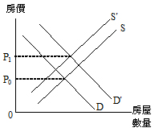

## 429. 都市危險及老舊建築物加速重建條例之適用範圍
*發布日期: 2021-12-14* 

## 內文
各位同學好

今日專欄整理都市危險及老舊建築物加速重建條例之適用範圍：

• (一) 危險與老舊之合法建築物

1. 條文內容本條例適用範圍，為都市計畫範圍內非經目的事業主管機關指定具有歷史、文化、藝術及紀念價值，且符合下列各款之一之合法建築物：(1)經建築主管機關依建築法規、災害防救法規通知限期拆除、逕予強制拆除，或評估有危險之虞應限期補強或拆除者。(2)經結構安全性能評估結果未達最低等級者。(3)屋齡三十年以上，經結構安全性能評估結果之建築物耐震能力未達一定標準，且改善不具效益或未設置昇降設備者。

2. 要件(1)都市計畫範圍內(2)非經目的事業主管機關指定具有歷史、文化、藝術及紀念價值(3)危險或老舊建築物

1. 類型1：經建築主管機關依建築法規、災害防救法規通知限期拆除、逕予強制拆除，或評估有危險之虞應限期補強或拆除者

2. 類型2：經結構安全性能評估結果未達最低等級者

3. 類型3：屋齡三十年以上，經結構安全性能評估結果之建築物耐震能力未達一定標準，且改善不具效益

4. 類型4：屋齡三十年以上，經結構安全性能評估結果之建築物耐震能力未達一定標準，且未設置昇降設備者

• (4) 合法建物

• (二) 鄰接之建築物基地或土地合法建築物重建時，得合併鄰接之建築物基地或土地辦理。

• (三) 施行前已拆除而尚未完成重建之危險建築物本條例施行前已依建築法第八十一條、第八十二條拆除之危險建築物，其基地未完成重建者，得於本條例施行日起三年內，依本條例規定申請重建。其中，「基地未完成重建」指尚未依建築法規定領得使用執照。
---
*注：本文圖片存放於 ./images/ 目錄下*

## 430. 增訂土地法219條之1之目的
*發布日期: 2021-12-09* 

## 內文
• (一) 土地法第219條第1項規定：私有土地經徵收後，有下列情形之一者，原土地所有權人得於徵收補償發給完竣屆滿一年之次日起五年內，向該管直轄市或縣（市）地政機關聲請照徵收價額收回其土地︰

1. 徵收補償發給完竣屆滿一年，未依徵收計畫開始使用者。

2. 未依核准徵收原定興辦事業使用者。

• (二) 司法院釋字第763號解釋（民國 107 年 5 月 4 日公布）：土地法第219條第1項規定逕以「徵收補償發給完竣屆滿1年之次日」為收回權之時效起算點，並未規定該管直轄市或縣（市）主管機關就被徵收土地之後續使用情形，應定期通知原土地所有權人或依法公告，致其無從及時獲知充分資訊，俾判斷是否行使收回權，不符憲法要求之正當行政程序，於此範圍內，有違憲法第15條保障人民財產權之意旨，應自本解釋公布之日起2年內檢討修正。於本解釋公布之日，原土地所有權人之收回權時效尚未完成者，時效停止進行；於該管直轄市或縣（市）主管機關主動依本解釋意旨通知或公告後，未完成之時效繼續進行；修法完成公布後，依新法規定。

• (三) 土地法第219條之1規定：私有土地經徵收並於補償費發給完竣之次日起，直轄市或縣（市）地政機關應每年通知及公告原土地所有權人或其繼承人土地使用情形，至其申請收回土地之請求權時效完成或依徵收計畫完成使用止。未依前項規定通知及公告而有前條第一項各款情形之一者，原土地所有權人或其繼承人得於徵收計畫使用期限屆滿之次日起十年內，申請照原徵收價額收回土地。本法中華民國110年11月23日修正之條文施行時，原土地所有權人或其繼承人申請收回土地之請求權時效尚未完成者，適用前二項規定。

• (四) 結論：

1. 因應司法院釋字第763號解釋，土地法增訂第219條之1。

2. 土地徵收條例第61條規定：「本條例施行前公告徵收之土地，其申請收回，仍依施行前之規定辦理。」準此，土地徵收條例施行（民國89年2月4日施行）前，公告徵收之案件，其申請收回，依據土地法第219條規定辦理；土地徵收條例施行（民國89年2月4日施行）後，公告徵收之案件，其申請收回，依據土地徵收條例第9條規定辦理。

3. 土地徵收條例第9條收回權規定，仍有土地法第219條之1規定之適用。亦即，政府依土地徵收條例第9條規定辦理收回土地，仍須比照土地法第219條之1規定程序辦理。

4. 請求權時效分為短期時效與長期時效：(1)短期時效：直轄市或縣（市）地政機關主動辦理定期通知及公告義務後，其請求權時效為「徵收補償發給完竣屆滿一年之次日起五年內」（即土地法第219條第1項規定）。(2)長期時效：直轄市或縣（市）地政機關未依規定每年辦理土地使用情形通知及公告者，其請求權時效為「徵收計畫使用期限屆滿之次日起十年內」（即土地法第219條之1第2項規定）。
---
*注：本文圖片存放於 ./images/ 目錄下*

## 431. 土地法第34條之1第1項多數決處分之適用範圍
*發布日期: 2021-12-07* 

## 內文
各位同學好

今日專欄說明有關土地法第34條之1第1項多數決處分之適用範圍

依據土地法第34條之1第1項規定：「共有土地或建築改良物，其處分、變更及設定地上權、農育權、不動產役權或典權，應以共有人過半數及其應有部分合計過半數之同意行之。但其應有部分合計逾三分之二者，其人數不予計算。」

其中，「處分」依據土地法第三十四條之一執行要點第3點：「本法條第一項所定處分，以有償讓與為限，不包括信託行為及共有物分割。」

其相關排除適用範圍茲說明如下：

• T. ABLE_PLACEHOLDER_1
---
*注：本文圖片存放於 ./images/ 目錄下*

## 432. 停滯性通貨膨脹
*發布日期: 2021-12-02* 

## 內文
菲力浦曲線 (Philips Curve) 在說明通膨與失業有抵換之關係。換言之，物價上漲率與失業率成反比關係。如果物價上漲率高，失業率一定低，反之，如果失業率高，物價上漲率一定低。然而石油危機年代 (1974~1982)，高通膨帶來高失業，此種現象稱為停滯性通貨膨脹 (stagflation)。停滯性通膨推翻菲力蒲曲線之抵換關係。

經濟景氣時，將會發生高通膨率；經濟蕭條時，將會發生高失業率 (此種情形亦稱通貨緊縮)。停滯性通貨膨脹代表高通膨率加上高失業率。前揭兩種比率相加，稱為痛苦指數。

痛苦指數 = 通貨膨脹率 + 失業率

最近，石油及農工原料大漲，通貨膨脹悄悄到來；又，中國經濟如果出現斷崖式跳水崩跌，而造成全球通貨緊縮，則停滯性通貨膨脹就有可能捲土而來。

當停滯性通貨膨脹時，政府為提高就業，如果採取擴張性財政政策與貨幣政策，將使通貨膨脹更惡化；政府為抑制通膨，如果採取緊縮性財政政策與貨幣政策，將使失業率更惡化。因此，政府左右為難，束手無策。

停滯性通貨膨脹發生時，物價會上漲，但不動產價格不會上漲，甚至會下跌。
---
*注：本文圖片存放於 ./images/ 目錄下*

## 433. 囤房稅相關規定
*發布日期: 2021-11-30* 

## 內文
各位同學好

可先參考下列時事新聞：財政部促地方採行囤房稅，6縣市表明跟進 - MoneyDJ理財網財政部賡續積極督促地方政府落實房屋稅稅基之評定及徵收率之訂定，使房屋稅負合理化-財政部全球資訊網 (mof.gov.tw)

今日專欄茲整理有關囤房稅相關規定：依據房屋稅條例第5條規定，供自住或公益出租人出租使用者，為其房屋現值百分之一點二；其他供住家用者，最低不得少於其房屋現值百分之一點五，最高不得超過百分之三點六。各地方政府得視所有權人持有房屋戶數訂定差別稅率。目前有實施差別稅率者如下：

• T. ABLE_PLACEHOLDER_1

另外，地方稅法通則第4條規定：「直轄市政府、縣（市）政府為辦理自治事項，充裕財源，除印花稅、土地增值稅外，得就其地方稅原規定稅率（額）上限，於百分之三十範圍內，予以調高，訂定徵收率（額）。但原規定稅率為累進稅率者，各級距稅率應同時調高，級距數目不得變更。前項稅率（額）調整實施後，除因中央原規定稅率（額）上限調整而隨之調整外，二年內不得調高。」因此，該規定授權囤房稅率上限還可加徵30％的空間，等於最高可以達到4.68％。
---
*注：本文圖片存放於 ./images/ 目錄下*

## 434. 通貨膨脹對不動產市場之影響
*發布日期: 2021-11-25* 

## 內文
◎試述通貨膨脹對不動產市場之影響？

【解答】

• (一) 通貨膨脹之意義：短期間，一般物價普遍上漲，稱為通貨膨脹。一般以消費者物價指數年增率，代表通貨膨脹率。通貨膨脹，簡單的說就是貨幣貶值，源自於過多的貨幣追逐有限的財貨。

• (二) 通貨膨脹原因：我國最近的通貨膨脹率在2%以上，通貨膨脹蠢蠢欲動，其成因如下：

1. 量化寬鬆貨幣：新冠疫情爆發，造成我國經濟受到衝擊。政府為振興經濟，採取寬鬆貨幣政策，造成市場上資金過多。

2. 巨額財政補貼：新冠疫情爆發，各行各業收入大幅減少。政府為照顧受疫情影響之產業，給予財政上補貼。

3. 供應鏈斷鏈：新冠疫情發生，封城、封港等措施，造成供應鏈堵塞，提高生產成本與運輸成本。

4. 去全球化趨勢：美中貿易戰，採行懲罰性關稅，拉高進口成本；加上新冠疫情爆發，關鍵零組件(如晶片)的缺貨，影響工業生產，去全球化趨勢加速進行。

5. 國際原油及原物料價格上漲：我國原油及原物料悉數仰賴進口，受到國外原油及原物料價格上漲之影響，生產成本提高，我國物價自然水漲船高。

• (三) 通貨膨脹對不動產市場之影響：我國現在通貨膨脹尚在醞釀中，但最怕民眾非理性預期，甚至恐慌，造成通貨膨脹自我實現。通貨膨脹一旦到來，對不動產市場之影響如下：

1. 不動產保值性需求增加：通貨膨脹就是貨幣貶值，因此民眾將寧願保有實體財產(如房地產、黃金等)，而不願保有貨幣，造成不動產保值性需求增加。

2. 不動產價格飆漲：不動產保值性需求大幅增加，加上不動產投機炒作，火上加油，一發不可收拾，房價及地價飆漲。

3. 房市泡沫化形成：薪資增幅趕不上物價增幅，物價增幅趕不上房價增幅。如果將通貨膨脹形容為巨獸，則房市泡沫化應形容為恐龍。各國壓抑房價，雖採取各式各樣手段，然皆難有效解決。以韓國文在寅政府為例，已祭出二十幾道打房措施，仍無法撲滅房價高漲烈火。

總之，隨著石油危機再起，國內可能發生輸入性通貨膨脹，而導致房地產泡沫化。星星之火足以燎原，趁現今房地產泡沫化初始之際，政府應及早採取有效措施，加以抑制。
---
*注：本文圖片存放於 ./images/ 目錄下*

## 435. 鄉村地區整體規劃之發展策略為何？何謂鄉村地區？土地使用規劃原則？
*發布日期: 2021-11-23* 

## 內文
各位同學好

今日專欄說明有關國土計畫中所推動之鄉村地區整體規劃之發展策略為何？何謂鄉村地區？土地使用規劃原則又為何？

考量過去區域計畫法制度下劃定之鄉村區，因按現況編定及管制，缺乏計畫指導，產生環境窳陋，缺乏公共設施及環境品質低落等問題，為改善鄉村地區公共設施、居住、產業等發展問題，將「鄉村地區整體規劃」作為國土空間發展之重要策略，從生活、生產、生態等面向，協助環境改善、協調產業需求並維護生態景觀，以建立鄉村地區永續發展的制度系統。

• (一) 鄉村地區應以生活、生產、生態之再生規劃理念出發，充實生活機能設施、維護地方文化特色、營造鄉村生產經營環境、培育鄉村人力資源及建立生態網路，以協助鄉村地區永續發展，各面向發展策略如下：

1. 生活面：建立數位環境、活化閒置空間、促進城鄉交流、保存鄉村文化與社區意識等，並維護及改善在地商業、旅遊、集會場所、文化設施及信仰中心等基本服務設施。

2. 生產面：維護農地環境、促進農業六級化、推廣鄉村旅遊、建構旅遊服務設施等，以支持對鄉村地區商業、社區及遊客有益的旅遊及休閒活動。

3. 生態面：避免破壞重要動植物棲息環境、提高基地透水性、營造生物多樣性生態環境等。

• (二) 鄉村地區指國土空間中人口高密度集聚以外的地區。考量鄉村地區整體規劃主要為彌補非都市土地鄉村聚落長期無計畫指導之情形，而都市計畫或國家公園計畫已屬計畫管制地區，該二類計畫地區自有規劃系統，故不納入未來鄉村地區實質空間規劃範圍內，僅作為鄉村地區整體規劃的空間調查分析範圍，爰將「鄉村地區」界定為「都市土地及國家公園土地以外」之傳統「非都市土地」。

• (三) 為改善鄉村地區之公共設施缺乏、建築土地不足、農村環境破壞及蔓延無序發展等課題，鄉村地區整體規劃應考量人口結構及發展趨勢，分別就居住、產業、運輸及基本公共設施等需求，研擬發展或轉型策略，其土地使用規劃原則如下：

1. 居住：規劃及提供可負擔住宅，滿足當地居住需求，維持地方特色建築風貌。因農業經營需要衍生之居住需求，得於既有農村聚落周邊提供住宅空間，避免個別、零星申請而影響農業生產環境；就人口成長地區，得預留適當可建築土地，以引導集約發展；就人口減少地區，除應避免增加住商建築用地外，並應針對既有閒置空間進行評估轉型及再利用，以提高環境品質。

2. 產業：配合在地農業、特色產業及商業服務業需求，於不影響鄉村環境品質前提下，於適當地點規劃在地產業發展區位，並訂定彈性土地使用管制規定，以促進鄉村在地產業永續發展。

3. 運輸：以需求反應式公共運輸服務為主，改善接駁轉乘系統及服務品質，提高鄉村可及性，並規劃自行車及電動車輛等綠色運具環境，以民眾基本運輸需求為導向，打造兼具效率及友善運輸環境。

4. 基本公共設施：應依據鄉村地區發展趨勢，規劃與設置老人及幼兒照顧服務設施、污水處理、自來水、電力、電信等基本公共設施，並注重環境保護及社區環境改善。

資料來源：全國國土計畫，107年4月30日公告實施版
---
*注：本文圖片存放於 ./images/ 目錄下*

## 436. 農電共生政策
*發布日期: 2021-11-18* 

## 內文
◎試述農電共生政策之效益及其對農地利用之影響？

【解答】

• (一) 農電共生政策之效益：近年來，政府積極推動綠能政策，開放部分農地設置太陽能板，其效益如下：

1. 增加綠電供給：為建立非核家園，終止核能發電，因此須增加其他替代能源供給。台灣日照充足，風力強勁，非常適合太陽能發電及風力發電。太陽能與風力屬於長流性資源，資源源源不絕，若不利用，即流失，故應及時充分利用。

2. 提高農地產值：農業用地產值較工業用地產值低，倘採取農業與發電共生之複合式土地利用，將可大幅提高農地產值，增加農地競爭力。

3. 增加農民所得：農民將農地出租設置太陽能板，農民除原本之農業收入外，另增加租金收入，增加農民所得。

4. 促進土地利用：對於遭受土壤汙染、地層下陷等無法耕作之農地，設置太陽能板，提供綠電，將不能利用之土地重新回歸土地利用行列。

• (二) 農電共生政策對農地利用之影響：

1. 多年來，我國之農地面積不斷流失，糧食自足率嚴重不足，面對全球糧荒，對農地使用管制又不斷鬆綁。

2. 農業用地應作農作使用才是，竟容許作太陽能板的設置，除影響糧食生產外，亦犧牲調節氣候、減緩暖化等生態功能。

3. 農地是一片綠地，具有寧適效益，兼具觀光休閒效果。太陽能板之土地利用現象，破壞農地寧適功能，並產生光害。

4. 太陽能板的設置對周圍農地產生負面外部性，影響該地區之灌溉系統、排水系統、生態體系、整體景觀等。

5. 農地種電，遭綠電滅頂者遍及溼地、埤塘、水庫等生態資源土地，破壞自然資源與生態環境。
---
*注：本文圖片存放於 ./images/ 目錄下*

## 437. 危險建築物之重建規定
*發布日期: 2021-11-16* 

## 內文
各位同學好

針對前陣子城中城災後重建，茲整理相關法令如下，以瞭解老舊危險建物重建之規定：

1. 建築法第81條直轄市、縣（市）（局）主管建築機關對傾頹或朽壞而有危害公共安全之建築物，應通知所有人或占有人停止使用，並限期命所有人拆除；逾期未拆者，得強制拆除之。

2. 公寓大廈管理條例第13條公寓大廈之重建，應經全體區分所有權人及基地所有權人、地上權人或典權人之同意。但有下列情形之一者，不在此限：一、配合都市更新計畫而實施重建者。二、嚴重毀損、傾頹或朽壞，有危害公共安全之虞者。三、因地震、水災、風災、火災或其他重大事變，肇致危害公共安全者。

3. 都市危險及老舊建築物加速重建條例第3條本條例適用範圍，為都市計畫範圍內非經目的事業主管機關指定具有歷史、文化、藝術及紀念價值，且符合下列各款之一之合法建築物：一、經建築主管機關依建築法規、災害防救法規通知限期拆除、逕予強制拆除，或評估有危險之虞應限期補強或拆除者。二、經結構安全性能評估結果未達最低等級者。三、屋齡三十年以上，經結構安全性能評估結果之建築物耐震能力未達一定標準，且改善不具效益或未設置昇降設備者。第5條依本條例規定申請重建時，新建建築物之起造人應擬具重建計畫，取得重建計畫範圍內全體土地及合法建築物所有權人之同意，向直轄市、縣（市）主管機關申請核准後，依建築法令規定申請建築執照。

4. 都市更新條例第4條都市更新處理方式，分為下列三種：一、重建：指拆除更新單元內原有建築物，重新建築，住戶安置，改進公共設施，並得變更土地使用性質或使用密度。二、整建：指改建、修建更新單元內建築物或充實其設備，並改進公共設施。三、維護：指加強更新單元內土地使用及建築管理，改進公共設施，以保持其良好狀況。第37條實施者擬訂或變更都市更新事業計畫報核時，應經一定比率之私有土地與私有合法建築物所有權人數及所有權面積之同意；其同意比率依下列規定計算：

• (一) 依第12條規定經公開評選委託都市更新事業機構辦理者

1. 原則：應經更新單元內私有土地及私有合法建築物所有權人均超過二分之一，且其所有土地總面積及合法建築物總樓地板面積均超過二分之一之同意。

2. 例外：但公有土地面積超過更新單元面積二分之一者，免取得私有土地及私有合法建築物之同意。

• (二) 依第22條規定辦理者（更新地區內）

1. 迅行劃定：依第七條規定劃定或變更之更新地區，應經更新單元內私有土地及私有合法建築物所有權人均超過二分之一，且其所有土地總面積及合法建築物總樓地板面積均超過二分之一之同意。

2. 一般、優先劃定：其餘更新地區，應經更新單元內私有土地及私有合法建築物所有權人均超過四分之三，且其所有土地總面積及合法建築物總樓地板面積均超過四分之三之同意。

• (三) 依第二十三條規定辦理者（更新地區外-自行劃定）應經更新單元內私有土地及私有合法建築物所有權人均超過五分之四，且其所有土地總面積及合法建築物總樓地板面積均超過五分之四之同意。但私有土地及私有合法建築物所有權面積均超過十分之九同意者，其所有權人數不予計算。

目前城中城重建，高雄市政府預計是採跨區區段徵收方式辦理，有關跨區區段徵收之概念，後續在其他期專欄再另予介紹。

最後，老舊危險大樓之所以難以推動更新重建，其原因大多為(林旺根，2021)：

1. 人數眾多產權複雜。

2. 原居住單元面積較小，且因當初未實施容積率管制，建築量體較大，不足以分配，加上受容積率的限制，重建後之總量僧多粥少。

3. 部分屋主無法負擔巨額重建費用。

4. 在非都會地區，通常房價較低，無法引起建商投資之興趣。

5. 在更新單元內多數經濟弱勢的租客，必須面臨迫遷問題，也會引發抗爭。

延伸閱讀：林旺根，2021.10.21，從城中城火災，談如何健全老舊大樓的重建及整建法。
---
*注：本文圖片存放於 ./images/ 目錄下*

## 438. 測量錯誤得否請求依登記錯誤之損害賠償
*發布日期: 2021-11-11* 

## 內文
各位同學好

今日專欄談有關「如地籍測量錯誤導致登記錯誤而發生損害，得否向地政機關請求依土地法第68條之損害賠償？」

根據土地法第68條規定，因登記錯誤、遺漏或虛偽致受損害，由該地政機關負損害賠償責任。但該地政機關證明其原因應歸責於受害人時，不在此限。顯示登記有問題得以依法向地政機關請求損害賠償，惟倘若登記錯誤是來自於面積測量錯誤造成，是否仍得以依法請求賠償呢？

可分為肯定說與否定說：

1. 肯定說

1. 土地法第68條所謂登記錯誤雖依土地登記規則第13條定義為登記事項與登記原因證明文件所載之內容不符，但該規定應屬例示規定，尚包括其他原因而發生登記錯誤者，亦即包含測量錯誤。

2. 地籍測量與土地登記具連結關係，依土地法第38條第一項，可知須先辦理地籍測量方得辦理土地登記，故地籍測量屬土地登記之必要前置行為，以致不論哪個環節出錯，對於最後所造成損害結果並無不同。

3. 由土地法第68條所規範土地登記之損害賠償之目的而言，旨在保護土地權利人，確保土地登記之絕對效力，故土地登記精準與否，將影響人民權益甚鉅，不應做狹義解釋。

4. 地籍測量與土地登記皆為國家公權力壟斷，人民並無參與空間。在誤差範圍外之損害，當然應由國家賠償。尤其面積減少是事實，人民信賴登記而受有損害亦是事實，該不利益不應由民眾承擔。

5. 如地籍測量錯誤不屬土地法第68條之損害賠償範圍，則將導致民眾不信任測量結果，以致每次交易都須辦理重測，將導致交易成本上升，對於土地登記目的係為確保交易安全之目的有違。

2. 否定說

1. 就文義而言，依土地土地登記規則第13條對於登記錯誤之定義，登記事項與登記原因證明文件所載之內容並無不符，故無法適用土地法第68條，向地政機關請求損害賠償，頂多僅能依國家賠償法申請損害賠償。(但地籍測量並無不法，亦無過失，人民可能無從依國賠法第2條請求)

2. 地籍測量與土地登記分別依土地登記規則及地籍測量實施規則辦理，係屬先後程序，為各自獨立之行政行為，且依據法規各有不同。

3. 地籍重測重在查明土地四至界址，只要無誤，即是正確測量，面積(即標示)變更，不涉及權利變動。

4. 根據土地法第68條，地政機關負無過失責任，對地政機關負擔大，且要求地政人員對測量人員所提供資料錯誤負責，似有過苛之嫌。

5. 大法官釋字第374號，地籍圖重測，純為地政機關基於職權提供土地測量技術上之服務，將人民原有土地所有權範圍，利用地籍調查及測量等方法，將其完整正確反映於地籍圖，初無增減人民私權之效力。因此，民眾並無因地籍測量錯誤而受有損害。(然而，土地價值如區分為使用價值及交換價值，則面積錯誤將直接影響交換價值，即直接導致售價降低而受有損害)

3. 綜合兩說，以土地法第68條之立法意旨而言，地籍測量與土地登記係屬連續的行政行為，為確保交易安全及保障民眾權益，加上確實因測量錯誤而受有損害，認為宜採肯定說，可向地政機關申請損害賠償。
---
*注：本文圖片存放於 ./images/ 目錄下*

## 439. 規劃利得與規劃損失
*發布日期: 2021-11-04* 

## 內文
• (一) 規劃利得：都市計畫之規劃實施，將低密度土地使用變更為高密度土地使用，致土地價格上漲，地主因而受益。受益部分，稱為規劃利得(planning gain)。規劃利得屬於地主之不勞而獲，應收歸公有。如都市計畫法第27條之1第1項規定：「……辦理都市計畫變更時，主管機關得要求土地權利關係人提供或捐贈都市計畫變更範圍內之公共設施用地、可建築土地、樓地板面積或一定金額予當地直轄市、縣（市）政府或鄉、鎮、縣轄市公所。」

• (二) 規劃損失：都市計畫之規劃實施，將高密度土地使用變更為低密度土地使用，致土地價格下跌，地主因而受損。受損部分，稱為規劃損失(planning loss)。規劃損失屬於地主之犧牲，應予補償。如國土計畫法第32條第2項規定：「直轄市、縣（市）主管機關對於既有合法可建築用地經依直轄市、縣（市）國土計畫變更為非可建築用地時，其所受之損失，應予適當補償。」

• (三) 總之，規劃利得應完全歸公，規劃損失應完全補償，以落實財產權保障與公平正義精神。
---
*注：本文圖片存放於 ./images/ 目錄下*

## 440. 自用住宅用地超過面積與處數之認定
*發布日期: 2021-11-04* 

## 內文
各位同學好

今日專欄討論有關剛修法的自用住宅用地優惠稅率超過規定面積及處數標準之認定。

今年（110）9月土地稅法施行細則修正，其原自用住宅用地優惠稅率超過規定面積及處數標準之認定，修正為：擇定→「稅額」→戶籍。

修正條文如下：

1. 處數土地所有權人申請超過一處之自用住宅用地時，認定一處適用自用住宅用地稅率，以土地所有權人擇定之戶籍所在地為準；土地所有權人未擇定者，以申請當年之自用住宅用地地價稅額最高者為準；其稅額相同者，依土地所有權人、配偶、未成年受扶養親屬戶籍所在地之順序適用。未成年受扶養親屬戶籍所在地之適用順序，依長幼次序定之。

2. 面積土地所有權人在本法施行區域內申請之自用住宅用地面積超過規定時，應依土地所有權人擇定之適用順序計算至該規定之面積限制為止；土地所有權人未擇定者，以申請當年之自用住宅用地地價稅額由高至低之適用順序計算之；其稅額相同者，適用順序如下：

1. 土地所有權人與其配偶及未成年之受扶養親屬之戶籍所在地。

2. 直系血親尊親屬之戶籍所在地。

3. 直系血親卑親屬之戶籍所在地。

4. 直系姻親之戶籍所在地。

第二款至第四款之適用順序，依長幼次序定之。
---
*注：本文圖片存放於 ./images/ 目錄下*

## 441. 回復原狀請求權
*發布日期: 2021-10-28* 

## 內文
回復原狀請求權之態樣有下列二種：

• (一) 民法第767條第1項規定：「所有人對於無權占有或侵奪其所有物者，得請求返還之。對於妨害其所有權者，得請求除去之。有妨害其所有權之虞者，得請求防止之。」準此，物上請求權有返還請求權、除去妨害請求權及防止妨害請求權三種。其中，拆屋還地之返還請求權，即回復請求權或回復原狀請求權。

• (二) 土地法第12條規定：「私有土地，因天然變遷成為湖澤或可通運之水道時，其所有權視為消滅。前項土地，回復原狀時，經原所有權人證明為其原有者，仍回復其所有權。」準此，浮覆地之復權請求權，即回復請求權或回復原狀請求權。

• (三) 兩者比較：

• T. ABLE_PLACEHOLDER_1
---
*注：本文圖片存放於 ./images/ 目錄下*

## 442. 土地分割之限制與登記類型
*發布日期: 2021-10-28* 

## 內文
甲與乙共有一筆土地，如甲與乙欲將土地分割為兩筆單獨所有權之土地，試問有那些分割限制？要辦理那些登記？

• (一) 辦理土地分割登記之限制

1. 法令禁止分割，例如：

1. 直轄市或縣（市）地政機關於其管轄區內之土地，得斟酌地方經濟情形，依其性質及使用之種類，為最小面積單位之規定，並禁止其再分割。

2. 遺產稅未繳清前，不得分割遺產。

3. 重劃地區選定後，直轄市或縣（市）政府，得視實際需要報經上級主管機關核定後，分別或同時公告禁止或限制土地移轉、分割或設定負擔。

4. 如每宗耕地分割後每人所有面積未達0.25公頃者，不得分割。

2. 因物之使用目的不能分割：如道路。

3. 契約訂有不分割之期限：約定不分割之期限，不得逾五年；逾五年者，縮短為五年。但共有之不動產，其契約訂有管理之約定時，約定不分割之期限，不得逾三十年；逾三十年者，縮短為三十年。惟如有重大事由，共有人仍得隨時請求分割。

• (二) 應辦理之登記

土地登記規則第105條規定，共有物分割應先申請標示變更登記，再申辦所有權分割登記。但無須辦理標示變更登記者，不在此限。因此，應辦理下列登記：

1. 土地複丈及標示變更登記：僅地號分割，權利仍維持原共有狀態並未變動。

2. 土地所有權分割登記：將原本共有之權利狀態，變動為各自單獨所有
---
*注：本文圖片存放於 ./images/ 目錄下*

## 443. 不動產估價師事務所以一處為限之規定未違憲
*發布日期: 2021-10-21* 

## 內文
不動產估價師法第9條第22項規定：「前項事務所，以一處為限，不得設立分事務所。」司法院釋字第809號解釋文指出：「尚未牴觸憲法第23條比例原則與憲法第15條保障人民工作權之意旨並無違背」。

• (一) 理由：不動產估價師法第9條第22項規定：「前項事務所，以一處為限，不得設立分事務所。」司法院釋字第809號解釋文指出：「尚未牴觸憲法第23條比例原則與憲法第15條保障人民工作權之意旨並無違背」。其理由如下：

1. 憲法第15條規定人民之工作權應予保障，人民有從事工作、選擇及執行職業之自由。按對職業自由之限制，因其限制內容之差異，在憲法上有寬嚴不同之容許標準。關於從事工作之方法、時間、地點、內容等執行職業自由之限制，立法者如係為追求公共利益，所採取限制手段與目的之達成間有合理關聯，即符合比例原則之要求，而與憲法第15條保障人民執行職業自由之意旨無違。

2. 不動產估價師所從事之業務與公共利益及人民之財產有密切關係，與一般營利事業追求商業利潤有所不同，國家非不得對其為相當之管制。是如管制之目的係為追求公共利益且手段與目的之達成間具有合理關聯，即與憲法第23條比例原則無違。

3. 鑑估標的價格之決定係不動產估價師之執行業務之核心，估定價格所形成過程則具體呈現於估價報告書，則基於專門職業人員執行業務所具之專屬不可替代性，應親自執行並對其服務親負其責之特質，不動產估價作業中，與鑑估標的價格之決定及估價報告書之製作有密切相關部分，均應由不動產估價師親自執行，以確保不動產估價品質。

4. 考量不動產估價師之執行業務並無地區之限制，為使不動產估價師之管理事權統一，並使估價師從事估價業務之權責與名實相符，乃禁止不動產估價師設立分事務所，限制其等僅於一處設立事務所，以利管理並避免借照執業，從而維護不動產估價品質，以保障委託人財產權益及不動產交易安全，並穩定金融市場秩序，其目的係追求公共利益，洵屬正當。

5. 不動產估價師僅能於一處開業設立事務所，使主管機關檢查不動產估價師業務之管理事權統一，得更有效進行不動產估價師是否依法執行業務之檢查。

6. 不動產估價作業須勘估標的狀態，其估價所需專業知識通常與估價標的所在之人文民情有密切關係，不動產估價師設立分事務所，雖可能更便利其業務之執行，惟難免增加其為執行估價業務之便宜，而將受託之業務違法交由他人執行之誘因，系爭規定禁止不動產估價師設立分事務所有助於減少上開誘因。是就避免不動產估價師親自執行估價業務等違規行為而言，亦難無預防之效。

（上開參見：司法院釋字第809號解釋理由書）

• (二) 檢討：

1. 限制不動產估價師分事務所之設立，雖攸關行政管理之效能，然不動產估價師一處開業全國執業既為立法之意旨，則立法者即應注意衡酌不動產估價師行業之發展及社會大眾對不動產估價師專業信任度之提升，並參酌其他專門職業人員關於事務所與分事務所設立規定之沿革等因素，就系爭規定適時檢討（司法院解釋第809號解釋理由書）。

2. 不動產估價師事務所以一處為限，將難以形成大型事務所，使不動產估價技術發展受限。另，市場上小型事務所林立，惡性競爭，對不動產估價之長遠發展有不利影響。

3. 國際趨勢邁向大型事務所，如會計師事務所、律師事務所皆然。大型事務所才具有競爭力，且為維護品牌信譽，必堅持其估價報告書品質，較不會配合委託者要求而作不實估價。
---
*注：本文圖片存放於 ./images/ 目錄下*

## 444. 共有不動產多數決之目的
*發布日期: 2021-10-21* 

## 內文
各位同學好

今日專欄談土地法第34條之1第1項有關共有不動產多數決之目的，茲說明如下：

• 一、條文規範首先，依據土地法第34條之1第1項，「共有土地或建築改良物，其處分、變更及設定地上權、農育權、不動產役權或典權，應以共有人過半數及其應有部分合計過半數之同意行之。但其應有部分合計逾三分之二者，其人數不予計算。」，主要在規範多數決之行使，與同條第4項共有人應有部分出售，他共有人之優先購買權之規範目的有所不同。

• 二、目的多數決之目的係便利不動產所有權之交易，解決共有不動產之糾紛，促進共有物之有效利用，增進公共利益(釋字第562號)。避免土地這樣的稀有資源在不利的產權結構下，無法透過交易而發揮最大的資源效益(蘇永欽)。

• 三、土地法第34條之1第1項，有無簡化或消滅共有關係的規範意旨?按該條係去除「目前多數共有人認為其無法妥適利用共有不動產」的弊端，而共有人依多數決出賣共有不動產全部時，並不論買受人為一人或數人，因此，該條項似無簡化或消滅共有關係的立法意旨。如認為該條項的目的在於簡化或消滅共有關係，反而可能會減少共有不動產出賣的可能性。(黃健彰、陳立夫)
---
*注：本文圖片存放於 ./images/ 目錄下*

## 445. 註記登記之效力
*發布日期: 2021-10-14* 

## 內文
• (一) 註記登記之效力註記登記之效力有二種，一種為行政處分，如土地登記規則第155條之1及第155條之2之註記登記；另一種為事實行為（觀念通知），如土地徵收條例施行細則第24條及土地登記規則第144條第2項之註記登記。茲比較如下：

• T. ABLE_PLACEHOLDER_1

• (二) 註記登記之除去政府囑託登記機關所為之註記登記，如違法侵害土地所有權人之所有權，影響土地所有權之圓滿狀態（如依據土壤及地下水污染整治法第21條「污染整治場址」之註記登記、依據土地徵收條例施行細則第53條「未繳清差額地價」之註記登記等是），受害人民得請求除去其註記登記。

1. 註記登記屬於負擔行政處分：受害人民得主張該行政處分違法，依行政訴訟法第4條規定提起「撤銷訴訟」，以排除其侵害。

2. 註記登記屬於事實行為：受害人民得主張該事實行為違法，依行政訴訟法第8條第1項規定提起「給付訴訟」，請求行政機關作成行政處分以外之其他非財產上給付，以排除其侵害行為。

（參見：最高行政法院99年3月第一次庭長法官聯席會議決議）
---
*注：本文圖片存放於 ./images/ 目錄下*

## 446. 不動產有關於不實廣告之規範
*發布日期: 2021-10-14* 

## 內文
各位同學好

不動產有關於不實廣告之規範，分別於不動產經紀業管理條例、公平交易法、消費者保護法等皆有，茲分列如下，是不動產經紀人申論題型的重要準備方向：

所稱廣告，指經紀業利用電視、廣播、影片、幻燈片、報紙、雜誌、傳單、海報、招牌、牌坊、廣告圖冊、模型、樣品屋、布條、電腦、電話傳真、電子視訊、電子語音、網際網路或其他方法，使不特定多數人知悉其宣傳內容之傳播。

• 一、不動產經紀業管理條例

1. 經紀業與委託人簽訂委託契約書後，方得刊登廣告及銷售。

2. 廣告及銷售內容，應與事實相符，並註明經紀業名稱。廣告及銷售內容與事實不符者，應負損害賠償責任。

• 二、公平交易法

1. 事業不得在商品或廣告上，或以其他使公眾得知之方法，對於與商品相關而足以影響交易決定之事項，為虛偽不實或引人錯誤之表示或表徵。

2. 廣告代理業在明知或可得而知情形下，仍製作或設計有引人錯誤之廣告，與廣告主負連帶損害賠償責任。廣告媒體業在明知或可得而知其所傳播或刊載之廣告有引人錯誤之虞，仍予傳播或刊載，亦與廣告主負連帶損害賠償責任。廣告薦證者明知或可得而知其所從事之薦證有引人錯誤之虞，而仍為薦證者，與廣告主負連帶損害賠償責任。但廣告薦證者非屬知名公眾人物、專業人士或機構，僅於受廣告主報酬十倍之範圍內，與廣告主負連帶損害賠償責任。所稱廣告薦證者，指廣告主以外，於廣告中反映其對商品或服務之意見、信賴、發現或親身體驗結果之人或機構。

3. 事業違反本法之規定，致侵害他人權益者，應負損害賠償責任。法院因前條被害人之請求，如為事業之故意行為，得依侵害情節，酌定損害額以上之賠償。但不得超過已證明損害額之三倍。侵害人如因侵害行為受有利益者，被害人得請求專依該項利益計算損害額。

4. 違反規定之事業，得限期令停止、改正其行為或採取必要更正措施，並得處新臺幣五萬元以上二千五百萬元以下罰鍰；屆期仍不停止、改正其行為或未採取必要更正措施者，得繼續限期令停止、改正其行為或採取必要更正措施，並按次處新臺幣十萬元以上五千萬元以下罰鍰，至停止、改正其行為或採取必要更正措施為止。

• 三、消費者保護法

1. 企業經營者應確保廣告內容之真實，其對消費者所負之義務不得低於廣告之內容。

2. 企業經營者之商品或服務廣告內容，於契約成立後，應確實履行。

3. 刊登或報導廣告之媒體經營者明知或可得而知廣告內容與事實不符者，就消費者因信賴該廣告所受之損害與企業經營者負連帶責任。

4. 損害賠償責任，不得預先約定限制或拋棄。

5. 企業經營者對消費者從事與信用有關之交易時，應於廣告上明示應付所有總費用之年百分率。
---
*注：本文圖片存放於 ./images/ 目錄下*

## 447. 土地法規定之物權性質優先購買權
*發布日期: 2021-10-07* 

## 內文
• (一) 土地法第104條：基地出賣時，地上權人、典權人或承租人有依同樣條件優先購買之權。房屋出賣時，基地所有權人有依同樣條件優先購買之權。其順序以登記之先後定之。前項優先購買權人，於接到出賣通知後十日內不表示者，其優先權視為放棄。出賣人未通知優先購買權人而與第三人訂立買賣契約者，其契約不得對抗優先購買權人。

• (二) 土地法第107條：出租人出賣或出典耕地時，承租人有依同樣條件優先承買或承典之權。第104條第2項之規定，於前項承買承典準用之。

• (三) 土地法第73條之1第3項：未辦理繼承登記之土地，經國有財產署依規定標售土地或建築改良物，於標售前應公告三十日，繼承人、合法使用人或其他共有人就其使用範圍依序有優先購買權。但優先購買權人未於決標後十日內表示優先購買者，其優先購買權視為放棄。其中，繼承人及合法使用人之優先購買權屬於物權性質。

• (四) 耕地三七五減租條例第15條：耕地出賣或出典時，承租人有優先承受之權，出租人應將賣典條件以書面通知承租人，承租人在十五日內未以書面表示承受者，視為放棄。出租人因無人承買或受典而再行貶價出賣或出典時，仍應照前項規定辦理。出租人違反規定而與第三人訂立契約者，其契約不得對抗承租人。

• (五) 農地重劃條例第5條：農地重劃區內耕地出售時，其優先購買權之次序如下：

1. 出租耕地之承租人。

2. 共有土地現耕之他共有人。

3. 毗連耕地之現耕所有權人。

上開，第1款之優先購買權屬於物權性質。

• (六) 地籍清理條例第12條第1項：地籍清理時，由直轄市或縣(市)主管機關依規定代為標售之土地，其優先購買權人及優先順序如下：

1. 地上權人、典權人、永佃權人。

2. 基地或耕地承租人。

3. 共有土地之他共有人。

4. 地籍清理條例施行前已占有達十年以上，至標售時仍繼續為該土地之占有人。

上開，第1款及第2款之優先購買權屬於物權性質。
---
*注：本文圖片存放於 ./images/ 目錄下*

## 448. 註記登記之意義與法律性質
*發布日期: 2021-10-07* 

## 內文
今日專欄說明「註記登記」之意義與法律性質

• 一、意義

土地登記機關往往將法定登記事項以外之特定事項登載於不動產登記簿其他登記事項欄（即所謂「註記」），使其內容得以公開於外部。亦即在標示部、所有權部或他項權利部其他登記事項欄內註記資料之登記。

• 二、法律性質

註記登記之性質與主登記及附記登記之性質不同，主登記及附記登記因發生登記之法律效力，其性質屬行政處分。但有關註記登記之性質，是否屬於行政處分，在學說與實務上則有爭議：

1. 事實行為（非行政處分）

1. 耕地三七五租約應由出租人會同承租人向鄉（鎮、市、區）公所申請登記；另鄉（鎮、市、區）公所辦畢租約登記後，通知地政事務所於登記簿予以註記。但此項租約登記係為保護佃農及謀舉證上之便利而設，並非須經登記，始能生效。此項租約性質係為債權關係，就本質上其租約登記，非屬土地登記之範疇。準此，耕地三七五租約註記，其性質為事實行為，並未發生法律效果。

2. 有關土地徵收之註記登記，係基於該土地被納入土地徵收計畫而為之登記，且整個土地徵收計畫須先經主管機關核准，亦即該註記登記係依附於土地徵收此一行政處分，僅屬其後之行政行為，應不屬行政處分，從而其相對人依法不得對之提起行政救濟。因此，登記機關所為之註記，僅是對於已發生法律效果之行政行為為資訊揭露，促使第三人於交易上或登記人員於登記審查上之注意，並未新創法律效果，從而屬事實行為。

按註記登記應屬於行政上之事實行為，因其係在土地登記簿之標示部、所有權部或他項權利部其他登記事項欄註記資料之登記，僅係客觀事實之記載，對內在促使嗣後登記人員注意，對外，則為提供資訊，使第三人知悉其事實，避免遭受不利益。由於註記登記與不動產物權得喪變更之主登記，以及限制登記或他項權利內容變更登記之附記登記不同，並不發生任何登記之效力，即不生不動產取得、設定、喪失及變更之效力，亦未對外直接發生法律效果，故其性質以解為係事實行為較妥。

因其是事實行為，故對之不得提起訴願或撤銷訴訟。惟依行政機關囑託方式而為之註記登記，得以囑託前之行政措施為標的，提其訴願或撤銷訴訟。至若登記機關逕為之註記登記，雖亦不得對之提起訴願或撤銷訴訟，但土地所有權人如認該註記登記違法，影響土地所有權之圓滿狀態，損害其權利，得向行政法院提起一般給付訴訟，請求除去該註記，以資救濟。

2. 行政處分

以下係在不動產登記簿之其他登記事項欄以註記方式予以登記，並於登記完畢時，對外直接發生法律效力：

1. 依土地法第79條之1第1項規定對土地權利辦理預告登記，一經登記完畢，登記名義人對於不動產權利所為之處分即受限制。

2. 依民法第826條之1第1項與土地登記規則第155條之1第1項規定辦理之共有不動產使用管理登記，以及依民法第841條之2與土地登記規則第155條之2規定辦理之土地使用收益限制登記。而此等登記之辦理，係於不動產登記簿上為註記登記，並附以共有物使用管理專簿或土地使用收益限制約定專簿方式公示；其一經登記完畢，不僅使發生對抗第三人之效力；且實質上其為附隨於不動產物權，已構成對於不動產行使權利（使用收益或限制）之內容，亦即發生物權內容變更之效果。

此種註記登記之法律性質屬行政處分，故得以提起訴願或撤銷訴訟。

3. 視個案而定

對於不動產登記簿上之註記，應個別判定其法律性質，尚不得一概論之。若註記仍足以對外發生一定之法律效果，即難謂非行政處分，至登記機關於土地登記簿上所為之註記究為行政處分或為事實行為，端視作成註記之原因事實是否足以使註記發生法律效果而定。

此外應注意，註記之發動方式，應有土地登記規則關於申請登記、囑託登記或逕為登記規定之適用；於是，登記機關對於不動產登記簿上之註記，仍須有法律或法規命令之依據始得為之。

參考文獻：最高行政法院103年度判字第692號；陳立夫，2018，闡釋不動產登記簿上之註記－兼論相關行政裁判之見解，台灣公法學的墊基與前瞻：城仲模教授八秩華誕祝壽論文集（下冊）：頁208-234。溫豐文，2018，註記登記之性質與救濟，現代地政第366期，頁23-27。
---
*注：本文圖片存放於 ./images/ 目錄下*

## 449. 土地法規定之債權性質優先購買權
*發布日期: 2021-09-30* 

## 內文
• (一) 土地法第34條之1第4項：共有人出賣其應有部分時，他共有人得以同一價格共同或單獨優先承購。他共有人於接到通知後十五日內不表示者，其優先購買權視為放棄。

• (二) 土地法第73條之1第3項：未辦理繼承登記之土地，經國有財產署依規定標售土地或建築改良物，於標售前應公告三十日，繼承人、合法使用人或其他共有人就其使用範圍依序有優先購買權。但優先購買權人未於決標後十日內表示優先購買者，其優先購買權視為放棄。其中，其他共有人之優先購買權屬於債權性質。

• (三) 土地徵收條例第59條第1項：私有土地經依徵收計畫使用後，依法變更原使用目的，土地管理機關標售該土地時，應公告一個月，被徵收之原土地所有權人或其繼承人有依同樣條件優先購買權。但優先購買權人未於決標後十日內表示優先購買者，其優先購買權視為放棄。

• (四) 農地重劃條例第5條：農地重劃區內耕地出售時，其優先購買權之次序如下：

1. 出租耕地之承租人。

2. 共有土地現耕之他共有人。

3. 毗連耕地之現耕所有權人。

上開，第2款及第3款之優先購買權屬於債權性質。

• (五) 地籍清理條例第12條第1項：地籍清理時，由直轄市或縣(市)主管機關依規定代為標售之土地，其優先購買權人及優先順序如下：

1. 地上權人、典權人、永佃權人。

2. 基地或耕地承租人。

3. 共有土地之他共有人。

4. 地籍清理條例施行前已占有達十年以上，至標售時仍繼續為該土地之占有人。

上開，第3款及第4款之優先購買權屬於債權性質。
---
*注：本文圖片存放於 ./images/ 目錄下*

## 450. 先行區段徵收
*發布日期: 2021-09-30* 

## 內文
今日專欄說明有關區段徵收與都市計畫之關連性。

區段徵收屬開發方式，原則應符合都市計畫指導，兩者關係如下：

• (一) 原則

1. 都計變更：區段徵收範圍勘定後，應配合辦理變更都市計畫者，直轄市或縣(市)政府應依都市計畫法規定辦理通盤檢討變更。但符合規定得辦理迅行變更。(區徵實§7)

2. 新訂擴大：區段徵收範圍勘定後，應配合辦理新訂或擴大都市計畫者，直轄市或縣(市)政府應先依規定層報核可後，再依都市計畫法定程序辦理之。(區徵實§8)

區段徵收範圍勘定後，應配合辦理迅行變更、新訂或擴大都市計畫者，應於一年六個月內發布實施主要計畫，並於主要計畫發布實施後六個月內發布實施細部計畫。(區徵實§11)

• (二) 例外：先行區段徵收

1. 下列土地之開發範圍經中央主管機關核定者，得先行區段徵收，並於區段徵收公告期滿後一年內發布實施都市計畫，不受都市計畫法規定之限制。(土徵§4II)

1. 新設都市地區之全部或一部，實施開發建設者。

2. 舊都市地區為公共安全、衛生、交通之需要或促進土地之合理使用實施更新者。

3. 都市土地之農業區、保護區變更為建築用地或工業區變更為住宅區、商業區者。

4. 非都市土地實施開發建設，涉及都市計畫之新訂、擴大或變更者。

5. 其他依法得為區段徵收，涉及都市計畫之新訂、擴大或變更者。

2. 下列土地之開發，需用土地人得會同有關機關研擬開發範圍，並檢具經上級目的事業主管機關核准之興辦事業計畫書，報經中央主管機關核定後，先行區段徵收，於區段徵收公告期滿後，依土地使用計畫完成非都市土地分區或用地編定之變更。(土徵§4III)

1. 農村社區為加強公共設施、改善公共衛生之需要或配合農業發展之規劃實施更新者。

2. 非都市土地實施開發建設，未涉及都市計畫之新訂、擴大或變更者。

3. 其他依法得為區段徵收，未涉及都市計畫之新訂、擴大或變更者。
---
*注：本文圖片存放於 ./images/ 目錄下*

## 451. 住宅階梯
*發布日期: 2021-09-23* 

## 內文
一般人對居住需求，隨個人財富的累積，逐步向上攀登，有如攀爬階梯般，因此稱為「住宅階梯」，如圖所示。

起初，剛入社會就業的年輕人，承租房屋。經過十年左右，累積一些自備款，配合銀行貸款，由「租」轉變為「買」，因而購置郊區中古屋。嗣經過十年左右，累積一些資金足以進行換屋，因而購置郊區新成屋（包括預售屋）或市區中古屋。再經過十年左右，累積更多財富足以追求自己的理想，提升居住品質，因而購置市區新成屋（包括預售屋）。

總之，住宅階梯之攀登是居住產權由租改為買，居住地點由郊區遷至市區，居住屋齡由舊換成新，居住面積由小變成大。

[圖片1]

值得一提的是，住宅階梯攀登的同時，就產生住宅下濾現象。

政府在住宅市場之努力目標有二：

• (一) 維持住宅階梯之順暢及縮短攀登時間。(二)照顧經濟或社會弱勢者之居住需求。

## 文章圖片

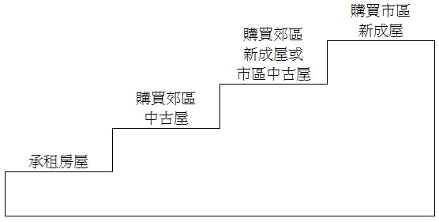

## 452. 更正登記之意義、樣態、要件與應備文件
*發布日期: 2021-09-16* 

## 內文
各位同學好，今日專欄說明有關「更正登記」之意義、樣態、要件、應備文件，茲整理如下：

• (一) 更正登記之意義登記人員或利害關係人於登記完畢後，發現登記錯誤或遺漏，向該管登記機關申辦更正所為之登記。

• (二) 更正登記之樣態

1. 核准更正：登記人員或利害關係人，於登記完畢後，發見登記錯誤或遺漏時，非以書面聲請該管上級機關查明核准後，不得更正。

2. 逕行更正：但登記錯誤或遺漏，純屬登記人員記載時之疏忽，並有原始登記原因證明文件可稽者，由登記機關逕行更正之。

• (三) 更正登記之要件

1. 形式要件

1. 登記人員、利害關係人申請。

2. 須登記錯誤、遺漏已登記完畢。

3. 須書面向上級機關申請核准。

4. 須經有利害關係之第三人同意。

2. 實質要件

1. 須登記有錯誤、遺漏。

2. 須不妨礙原登記之同一性：更正登記後之權利主體、種類、範圍或標的與原登記原因證明文件所載不符者，有違登記之同一性，應不予受理。換言之，係指登記錯誤之更正，僅能更正為「記入登記資料之事項」與「登記原因證明文件所載內容」相符為止，不能超出「登記原因證明文件所載之內容」範圍。

• (四) 更正登記之應備文件

• I. 由利害關係人申請：

1. 登記申請書及登記清冊。

2. 登記原因證明文件：錯誤或遺漏之證明文件。

3. 所有權狀或他項權利證明書。

4. 申請人身分證明（其能以電腦處理達成查詢者，得免申請人提出）。

5. 其他由中央地政機關規定應提出之證明文件：

1. 第三人同意書（例如抵押權人同意書：因抵押權登記錯誤或遺漏所為之更正，如影響次順位抵押權人權益者，應經該次順位抵押權人之同意）。

2. 保證書或切結書（有錯誤或遺漏原因證明文件及地政機關作業疏忽所致者免附）。

• I. I.由登記機關逕為辦理：

1. 土地建物逕為更正測量登記案件簽辦單。

2. 原登記申請案件影本。

3. 土地（或建物）登記資料。

4. 更正前後土地複丈圖、面積計算表或建物測量成果圖（原測量或抄錄錯誤時檢附）。
---
*注：本文圖片存放於 ./images/ 目錄下*

## 453. 不融通物不受土地法第43條之保護
*發布日期: 2021-09-16* 

## 內文
甲有一筆道路用地，經台北市政府徵收，發給補償費完竣，惟未辦理登記。不久，甲將該道路用地出售於乙，並移轉登記完畢。嗣台北市政府發現後，主張其移轉登記無效，應辦理塗銷登記，回復為台北市所有。試問台北市政府主張是否有理？乙得否主張土地法第43條加以保護？

【解答】

• (一) 甲之道路用地，經台北市政府徵收，發給補償費完竣，雖未辦理登記，依民法第759條規定，台北市已取得該道路用地之所有權。

• (二) 道路用地屬於土地法第14條不得私有之土地。如已成為公有，則不得再移轉為私有。因此，甲將該道路用地出售並移轉於乙，違反法律禁止規定，移轉登記無效。故台北市政府主張移轉登記無效，應辦理塗銷登記，回復為台北市所有，其主張有理。

• (三) 乙主張土地法第43條，善意第三人因信賴登記而取得之權利，具有不可推翻之效力。查土地法第43條之成立要件，除須為善意第三人及原登記物權有不實情事外，尚須依有效之法律行為，始足當之。然，道路用地為土地法第14條規定之其中土地，屬於不融通物。因此，以不融通物為交易標的所為之法律行為，無效。據此，乙不受土地法第43條之保護。
---
*注：本文圖片存放於 ./images/ 目錄下*

## 454. 成屋與預售屋之實價登錄相關規定
*發布日期: 2021-09-09* 

## 內文
今日專欄彙整有關成屋與預售屋買賣之實價登錄相關規定如下：

• 一、成屋申報規定

權利人及義務人應於買賣案件申請所有權移轉登記時，檢附申報書共同向直轄市、縣（市）主管機關申報登錄土地及建物成交案件實際資訊。(平§47II)

• 二、預售屋申報規定

銷售預售屋者，應於銷售前將預售屋坐落基地、建案名稱、銷售地點、期間、戶（棟）數及預售屋買賣定型化契約，以書面報請預售屋坐落基地所在之直轄市、縣（市）主管機關備查(平§47-3I)。

銷售預售屋或委託不動產經紀業代銷者，向買受人收受定金或類似名目之金額，應以書面契據確立買賣標的物及價金等事項，並不得約定保留出售、保留簽訂買賣契約之權利或其他不利於買受人之事項(平§47-3V)。又該書面契據，不得轉售予第三人(平§47-3VI)。

1. 自建自銷銷售預售屋者，應於簽訂買賣契約書之日起三十日內，向直轄市、縣（市）主管機關申報登錄資訊。但委託不動產經紀業代銷者，不在此限。(平§47-3II)

2. 代銷經營代銷業務，受起造人或建築業委託代銷預售屋者，應於簽訂、變更或終止委託代銷契約之日起三十日內，將委託代銷契約相關書件報請所在地直轄市、縣（市）主管機關備查；並應於簽訂買賣契約書之日起三十日內，向直轄市、縣（市）主管機關申報登錄資訊。(不動產經紀業管理條例§24-1II)

• 三、實價登錄制度之查詢、課稅與查核之規定

1. 申報登錄資訊，除涉及個人資料外，得提供查詢。(平§47III)

2. 已登錄之不動產交易價格資訊，在相關配套措施完全建立並完成立法後，始得為課稅依據。(平§47IV)

3. 直轄市、縣（市）主管機關為查核申報登錄資訊，得向權利人、義務人（交易相對人）、地政士或不動產經紀業要求查詢、取閱有關文件或提出說明；中央主管機關為查核疑有不實之申報登錄價格資訊，得向相關機關或金融機構查詢、取閱價格資訊有關文件。受查核者不得規避、妨礙或拒絕(平§47VI)。惟查核，不得逾確保申報登錄資訊正確性目的之必要範圍。(平§47VII)

• 四、違反實價登錄規定之處罰

• I. 成屋申報規定

1. 未共同申報登錄未共同申報登錄資訊者，直轄市、縣（市）主管機關應令其限期申報登錄資訊；屆期未申報登錄資訊，買賣案件已辦竣所有權移轉登記者，處新臺幣三萬元以上十五萬元以下罰鍰，並令其限期改正；屆期未改正者，按次處罰。經處罰二次仍未改正者，按次處新臺幣三十萬元以上一百萬元以下罰鍰。其含建物者，按戶（棟）處罰。

2. 未依限申報登錄資訊、申報登錄價格或交易面積資訊不實由直轄市、縣（市）主管機關處新臺幣三萬元以上十五萬元以下罰鍰，並令其限期改正；屆期未改正者，按次處罰。經處罰二次仍未改正者，按次處新臺幣三十萬元以上一百萬元以下罰鍰。其含建物者，按戶（棟）處罰。

3. 申報登錄價格及交易面積以外資訊不實申報登錄價格及交易面積以外資訊不實，直轄市、縣（市）主管機關應令其限期改正；屆期未改正者，處新臺幣六千元以上三萬元以下罰鍰，並令其限期改正；屆期未改正者，按次處罰。

4. 規避、妨礙或拒絕查核金融機構、權利人、義務人、地政士或不動產經紀業違反規定，規避、妨礙或拒絕查核。由主管機關處新臺幣三萬元以上十五萬元以下罰鍰，並令其限期改正；屆期未改正者，按次處罰。

• I. I.預售屋申報規定

1. 未依限申報登錄或價格、交易面積資訊不實違反規定，未依限申報登錄資訊或申報登錄價格、交易面積資訊不實，由直轄市、縣（市）主管機關按戶（棟）處新臺幣三萬元以上十五萬元以下罰鍰，並令其限期改正；屆期未改正者，按次處罰。經處罰二次仍未改正者，按次處新臺幣三十萬元以上一百萬元以下罰鍰。

2. 價格及面積以外資訊不實違反規定，申報登錄價格及面積以外資訊不實，直轄市、縣（市）主管機關應令其限期改正；屆期未改正，處新臺幣六千元以上三萬元以下罰鍰。

3. 規避、妨礙或拒絕查核金融機構、交易當事人違反規定，規避、妨礙或拒絕查核者，由主管機關處新臺幣三萬元以上十五萬元以下罰鍰，並令其限期改正；屆期未改正者，按次處罰。

4. 預售前未以書面備查由主管機關處新臺幣三萬元以上十五萬元以下罰鍰，並令其限期改正；屆期未改正者，按次處罰。

5. 違反預售屋買賣定型化契約範本銷售預售屋者，使用之契約不符合中央主管機關公告之預售屋買賣定型化契約應記載及不得記載事項，由直轄市、縣（市）主管機關按戶（棟）處新臺幣六萬元以上三十萬元以下罰鍰。

6. 違反定金收據相關規定、不得轉售第三人由直轄市、縣（市）主管機關按戶（棟）處新臺幣十五萬元以上一百萬元以下罰鍰。
---
*注：本文圖片存放於 ./images/ 目錄下*

## 455. 融通物與不融通物
*發布日期: 2021-09-09* 

## 內文
融通物，指得為交易標的之物。不融通物，指不得為交易標的之物。如以不融通物為交易標的物，法律行為無效。

土地法第14條第1項規定：「左列土地不得為私有：一、海岸一定限度內之土地。二、天然形成之湖澤而為公共需用者，及其沿岸一定限度內之土地。三、可通運之水道及其沿岸一定限度內之土地。四、城鎮區域內水道湖澤及其沿岸一定限度內之土地。五、公共交通道路。六、礦泉地。七、瀑布地。八、公共需用之水源地。九、名勝古蹟。十、其他法律禁止私有之土地。」準此，土地法第14條之十種土地如已成為公有，就不得再移轉為私有，故屬於「不融通物」。

土地法第14條第2項規定：「前項土地已成為私有者，得依法徵收之。」準此，土地法第14條之十種土地，如已成為私有，政府得依法徵收。政府尚未依法徵收前，仍為私有，並得移轉於本國人及外國人（但水源地不得移轉於外國人），故屬於「融通物」。

總之，土地法第14條之十種土地，如尚為私有，則為「融通物」；如已為公有，則為「不融通物」。
---
*注：本文圖片存放於 ./images/ 目錄下*

## 456. 市地重劃與區段徵收之公告禁止
*發布日期: 2021-09-02* 

## 內文
• (一) 市地重劃公告禁止土地、建物變動

根據平均地權條例第59條：

1. 重劃地區選定後，直轄市或縣(市)政府，得視實際需要報經上級主管機關核定後，分別或同時公告禁止或限制左列事項：

1. 土地移轉、分割或設定負擔。

2. 建築改良物之新建、增建、改建或重建及採取土石或變更地形。

2. 前項禁止或限制之期間，不得超過一年六個月。

• (二) 區段徵收僅公告禁止建物變動

根據土地徵收條例第37條：

1. 區段徵收範圍勘定後，該管直轄市或縣 (市) 主管機關得視實際需要，報經上級主管機關核定後，分別或同時公告禁止建築改良物之新建、增建、改建或重建及採取土石或變更地形。

2. 前項禁止期間，不得超過一年六個月。

當初土地徵收條例第37條立法說明：「按平均地權條例第53條第3項規定，有關區段徵收範圍選定後之禁止事項，尚包括土地移轉、分割、設定負擔等事項，基於保障被徵收土地所有權人之權益，減少其土地參加區段徵收時所受到之限制，土地徵收條例本條未將該等事項列為禁止事項。」

因此，顯示區段徵收係刻意排除土地變動之公告禁止事項。
---
*注：本文圖片存放於 ./images/ 目錄下*

## 457. 與登記有關之第三人
*發布日期: 2021-09-02* 

## 內文
申請土地登記，除登記權利人與登記義務人外，與土地登記有權利義務關係之第三人，稱為與登記有關之第三人。

申請土地登記，倘影響第三人權益，則應經第三人同意；倘未影響第三人權益，則僅須通知第三人，無須經第三人同意。

• (一) 需經第三人同意：諸如

1. 以數宗土地權利為共同擔保，申請設定抵押權登記時，已限定各宗土地權利應負擔之債權金額者，登記機關應於登記簿記明之；於設定登記後，另為約定或變更限定債權金額申請權利內容變更登記者，亦同。前項經變更之土地權利應負擔債權金額增加者，應經後次序他項權利人及後次序抵押權之共同抵押人同意（登§114-1）。

2. 抵押權因增加擔保債權金額申請登記時，除經後次序他項權利人及後次序抵押權之共同抵押人同意辦理抵押權內容變更登記外，應就其增加金額部分另行辦理設定登記（登§115Ⅱ）。

3. 同一標的之抵押權因次序變更申請權利變更登記，應符合下列各款規定

1. 因次序變更致先次序抵押權擔保債權金額增加時，其有中間次序之他項權利存在者，應經中間次序之他項權利人同意。

2. 次序變更之先次序抵押權已有民法第870條之1規定之次序讓與或拋棄登記者，應經該次序受讓或受次序拋棄利益之抵押權人同意（登§116Ⅰ）。

4. 因拋棄申請登記時，有以該土地權利為標的物之他項權利者，應檢附該他項權利人之同意書，同時申請他項權利塗銷登記（登§143Ⅱ）。

• (二) 須通知第三人，但無須經第三人同意：諸如

1. 同一標的之抵押權因次序變更申請權利變更登記，應由次序變更之抵押權人會同申請；申請登記時，申請人並應於登記申請書適當欄記明確已通知債務人、抵押人及共同抵押人，並簽名（登§116Ⅱ）。

2. 同一標的之普通抵押權，因次序讓與申請權利內容變更登記者，應由受讓人會同讓與人申請；因次序拋棄申請權利內容變更登記者，得由拋棄人單獨申請之。前項申請登記，申請人應提出第34條及第40條規定之文件，並提出已通知債務人、抵押人及共同抵押人之證明文件（登§116-1）。
---
*注：本文圖片存放於 ./images/ 目錄下*

## 458. 房地合一稅取得日之認定
*發布日期: 2021-08-26* 

## 內文
各位同學好

根據房地合一課徵所得稅申報作業要點（110.06.30）第4點，房屋、土地取得日之認定，以所取得之房屋、土地完成所有權移轉登記日為準。但有特殊情形，幫各位同學抓出幾個考試比較有可能考的情形如下：

• (一) 出價取得：

1. 因強制執行於辦理所有權登記前已取得所有權，為拍定人領得權利移轉證書之日。

2. 無法辦理建物所有權登記（建物總登記）之房屋，為訂定買賣契約之日。

3. 本法第四條之四第二項規定之房屋使用權，為權利移轉之日。

4. 本法第四條之四第二項規定之預售屋及其坐落基地，為訂定買賣契約之日。

5. 本法第四條之四第三項規定之符合一定條件股份或出資額，其屬證券交易稅條例所稱有價證券者，為買賣交割日；屬上開有價證券以外者，為訂定買賣契約之日。

• (二) 非出價取得：

1. 興建房屋完成後第一次移轉，為核發使用執照日。但無法取得使用執照之房屋，為實際興建完成日。

2. 因區段徵收或徵收前先行協議價購領回抵價地，為所有權人原取得被徵收或協議價購土地之日。

3. 經土地重劃後重行分配與原土地所有權人之土地，為所有權人原取得重劃前土地之日。

4. 實施者依都市更新條例規定實施都市更新事業所取得之房屋、土地，為都市更新事業計畫核定之日。

5. 新建建築物起造人依都市危險及老舊建築物加速重建條例規定完成重建所取得之房屋、土地，為重建計畫核准之日。

6. 原土地所有權人以自有土地與營利事業合建分屋、依都市更新條例規定參與都市更新或依都市危險及老舊建築物加速重建條例規定參與重建，分配取得之土地，為所有權人原取得合建、參與都市更新或重建前土地之日。

7. 配偶之一方依民法第一千零三十條之一規定行使剩餘財產差額分配請求權取得之房屋、土地，為配偶之他方原取得該房屋、土地之日。

8. 繼承取得之房屋、土地，為繼承開始日。

9. 因分割共有物取得與原權利範圍相當之房屋、土地，為原取得共有物之日。

10. 以房屋、土地為信託財產，受託人於信託關係存續中，交易該信託財產，以下列日期認定。信託關係存續中或信託關係消滅，受託人依信託本旨交付信託財產與受益人後，受益人交易該房屋、土地者，亦同：

1. 受益人如為委託人，為委託人取得該房屋、土地之日。

2. 受益人如為非委託人，或受益人不特定或尚未存在，為訂定信託契約之日；信託關係存續中，追加房屋、土地為信託財產者，該追加之房屋、土地，為追加之日。

3. 信託關係存續中，如有變更受益人之情事，為變更受益人之日；受益人由不特定或尚未存在而為確定，為確定受益人之日。
---
*注：本文圖片存放於 ./images/ 目錄下*

## 459. 依土地法第34條之1多數決於自己土地設定不動產役權
*發布日期: 2021-08-26* 

## 內文
民法第859條之4規定：「不動產役權，亦得就自己之不動產設定之。」準此，倘共有人依土地法第34條之1第1項規定，採多數決於自己土地設定不動產役權，是否可行？答案為不可行，理由如下：

• (一) 依土地法第三十四條之一執行要點第3點規定，設定不動產役權以有償為限。因此，倘共有人依土地法第34條之1採多數決於自己土地設定不動產役權，係以無償為之，故非法所許。

• (二) 倘需役地與供役地之共有人相同，同意之共有人代理不同意之共有人，將供役地設定不動產役權予需役地之同意共有人。此違反民法第106條禁止自己代理之規定。
---
*注：本文圖片存放於 ./images/ 目錄下*

## 460. 房地合一稅減除多報繳之土地增值稅計算
*發布日期: 2021-08-19* 

## 內文
各位同學好

之前房地合一2.0前一陣子剛修正，我總複習及線上修法講座有提到，如果土地增值稅有多報時，該如何計算之概念。而後6月30日財政部訂定發布的「房地合一課徵所得稅申報作業要點」其計算公式跟我說的算法是相同概念，茲說明如下：

假設甲此次出售房地，市價為1400萬，該筆土地當期公告土地現值為150萬，惟考量幫後手（買方）墊高公告土地現值，本次甲實際繳納的土地增值稅，是以高於公告土地現值的契約價200萬進行申報。倘若物價指數150%，原始取得成本為800萬，本次並未提示費用，請問甲應納所得稅額為多少？(原地價為80萬)

首先，依土地稅法第30條訂定契約，經審核超過公告土地現值者，應以其自行申報之移轉現值為準，徵收土地增值稅：(一)申報移轉現值1.土地漲價總數額：200－(80×150%)＝80萬2.土地增值稅：80×20%＝16萬因此，已繳納的土地增值稅為16萬元。

惟房地合一稅規定，稅基（所得額）僅能依據所得稅法第14條之4第三項規定，扣除依土地稅法規定以公告土地現值計算之土地漲價總數額：(二)當次公告現值1.土地漲價總數額：150－(80×150%)＝30萬2.土地增值稅：30×20%＝6萬因此，如以公告土地現值計算的話，本次土地增值稅應該只需繳6萬即可。而房地合一稅計算所得額只能扣30萬，而不能扣此次實際報繳的80萬。

換言之，16萬－6萬＝10萬，該差額10萬元等於是我此次出售多繳的一筆費用，故所得稅法第14條之4第一項規定「屬當次交易未自該房屋、土地交易所得額減除之土地漲價總數額部分之稅額」，也就是超過公告土地現值的漲價所計算的土地增值稅，可列為成本費用。

房地合一稅＝成交價－原始取得成本－費用－土地漲價總數額－多繳土地增值稅＝1400－800－30－30－10＝530萬元

又依據目前最新修正發布(110.6.30)的「房地合一課徵所得稅申報作業要點」第16點規定：「個人除得按前點規定減除費用外，得再減除當次交易未自該房屋、土地交易所得減除之土地漲價總數額部分之已納土地增值稅稅額，其計算方式如下：[ (交易時申報移轉現值－交易時公告土地現值）/ 以申報移轉現值計算之土地漲價總數額) ] × 已納土地增值稅

以本題案例計算＝[(200－150)/80]×16＝10萬元與前述說明是相同的。
---
*注：本文圖片存放於 ./images/ 目錄下*

## 461. 高報土地移轉現值之房地合一所得稅計算實例
*發布日期: 2021-08-19* 

## 內文
甲為中華民國境內居住之個人，民國109年3月買入一間店面，土地面積10平方公尺，建物面積50平方公尺，買入總價1,000萬元，買入時之申報土地移轉現值每平方公尺3萬元。不久，甲於民國110年7月賣出，賣出總價1,200萬元，賣出時之公告土地現值每平方公尺3.2萬元，申報土地移轉現值每平方公尺5萬元。民國109年3月至民國110年7月之物價指數102。試問甲出售該店面應繳納多少土地增值稅及房地合一所得稅？

【解答】

• (一) 土地增值稅：(5-3×102%)×10=19.4（土地漲價總數額）19.4×20%=3.88（土地增值稅）

• (二) 房地合一所得稅：

1. 依公告現值計算之土地漲價總數額：(3.2－3×102%)×10=1.4

2. 列入成本費用扣除之土地增值稅：[（交易時申報移轉現值－交易時公告土地現值）/ 以申報移轉現值計算之土地漲價總數額] × 已納土地增值稅=[(5×10－3.2×10)÷19.4]×3.88=3.6

3. 因交易而支付之必要費用：未提示費用證明文件以成交價3%計，並以30萬元為限。1,200×3%=36

4. 房地合一所得（稅基）：(1,200－1,000)－1.4－3.6－30=165

5. 房地合一所得稅：民國109年3月至民國110年7月，持有期間1年4個月，稅率45%。165×45%=74.25

答：甲應繳納土地增值稅3.88萬元及房地合一所得稅74.25萬元。
---
*注：本文圖片存放於 ./images/ 目錄下*

## 462. 永續發展目標SDGs
*發布日期: 2021-08-12* 

## 內文
各位同學好

最近永續發展目標SDGs受到很多討論，研究所也有考到，跟高普考之土地政策、土地利用概要有關，請各位也準備起來：

2015年9月25日，聯合國193個會員國通過了2030年永續發展議程的17項永續發展目標(Sustainable Development Goals, SDGs)，其中又涵蓋了169項細項目標、230項指標，指引全球共同努力、邁向永續。這17項目標包含（與我們考試較為相關者以紅色標記）：

目標1：消除各地一切形式的貧窮目標2：消除飢餓，達成糧食安全，改善營養狀況及促進永續農業目標3：確保健康及促進各年齡層的福祉目標4：確保包容、公平之優質教育，以及提倡終身學習目標5：實現性別平等，並賦予婦女權力目標6：確保所有人都能享有水及衛生及其永續管理目標7：確保所有人都能負擔得起、可靠的、永續的及現代化的能源目標8：促進包容且永續的經濟成長，達到全面且有生產力的就業，使每一個人都能獲得適當工作目標9：建立具有韌性的基礎建設，促進具包容性且永續的工業，並推動創新目標10：減少國內及國家間的不平等目標11：促使城市與人類居住具包容、安全、韌性及永續性目標12：確保永續消費及生產模式目標13：採取緊急措施應對氣候變遷及其影響目標14：保育及永續利用海洋與海洋資源，以確保永續發展目標15：保護、維護及促進陸域生態系統的永續使用，永續管理森林，對抗沙漠化，終止及逆轉土地劣化，並遏止生物多樣性的喪失目標16：促進和平且包容的社會，以落實永續發展；提供司法管道給所有人；在所有階層建立有效的、負責的且包容的制度目標17：強化永續發展執行方法及活化永續發展全球夥伴關係

精簡記法：目標1：終結貧窮目標2：消除飢餓目標3：健康與福祉目標4：優質教育目標5：性別平權目標6：淨水及衛生目標7：可負擔的潔淨能源目標8：合適的工作及經濟成長目標9：工業化、創新及基礎建設目標10：減少不平等目標11：永續城鄉目標12：責任消費及生產目標13：氣候行動目標14：保育海洋生態目標15：保育陸域生態目標16：和平、正義及健全制度目標17：多元夥伴關係

橫向聯結永續發展的三個面向─社會、經濟和環境

• T. ABLE_PLACEHOLDER_1

參考資料：

1. 國立臺東大學 綠色國際大學-聯合國17項永續發展目標(SDGs)

2. 財團法人農業科技研究院農業政策研究中心編譯-聯合國2030永續發展目標(SDGs)簡介

3. AIT-聯合國永續發展目標(SDGs)說明

4. SDGs 懶人包》什麼是永續發展目標SDGs？17項目標一次掌握
---
*注：本文圖片存放於 ./images/ 目錄下*

## 463. 父母移轉不動產給子女之租稅分析
*發布日期: 2021-08-12* 

## 內文
父母將不動產移轉給子女，實務上最常見者為買賣、贈與及繼承等三種方式。茲就課稅內容說明如下：

• (一) 買賣：父母將不動產出售予子女，應課徵土地增值稅、契稅及所得稅。

1. 土地增值稅：按累進稅率20%、30%、40%課徵。如為自用住宅用地，可適用「一生一次」或「一生一屋」稅率10%之優惠；另，自用住宅用地尚可適用「重購退稅」之優惠。

2. 契稅：買賣契稅之稅率6%。

3. 所得稅：

1. 交易民國104年12月31日以前取得之房地，僅限建物課徵所得稅，土地免稅，表價課稅，且併入個人綜合所得，採合併課稅。綜合所得稅為稅率5%～40%之累進稅。

2. 交易民國105年1月1日以後取得之房地，建物及其土地皆須課稅，實價課稅，且不併入個人綜合所得，採分離課稅。房地合一所得稅按持有期間長短，分別適用稅率15%、20%、35%、45%之比例稅。如為自住，可適用400萬元以內免稅，超過400萬元按稅率10%課稅。

應注意者，父母出售不動產予子女，可能會被視為贈與，加課贈與稅。

• (二) 贈與：父母將不動產贈與子女，應課徵土地增值稅、契稅及贈與稅。

1. 土地增值稅：按累進稅率20%、30%、40%課徵。無「一生一次」、「一生一屋」之適用，亦無「重購退稅」之適用。

2. 契稅：贈與契稅之稅率6%。

3. 贈與稅：贈與人每人每年220萬元免稅額，按累進稅率10%、15%、20%課徵。

應注意者，父母死亡前二年內之不動產贈與子女，應計入遺產，課徵遺產稅。

• (三) 繼承：父母將不動產移轉給子女，若採繼承方式，僅課徵遺產稅，免徵土地增值稅及契稅。遺產稅：遺產稅免稅額1,200萬元，按累進稅率10%、15%、20%課徵。

應注意者，若採贈與或繼承方式將不動產移轉於子女，日後子女出售房地時，其原始取得成本採贈與或繼承時之公告土地現值及房屋評定現值，致房地合一所得稅偏高。

綜上，父母移轉不動產給子女，以何種方式較節稅，不能一概而論，應視個案而定。
---
*注：本文圖片存放於 ./images/ 目錄下*

## 464. 債權效力優先購買權請求損害賠償之依據
*發布日期: 2021-08-05* 

## 內文
各位同學好

今日專欄說明有關債權效力優先購買權請求損害賠償之依據。

首先，依據土地法第34條之1第4項規定，共有人出賣其應有部分時，他共有人得以同一價格共同或單獨優先承購。而學說與實務上大多認為該優先購買權具有「債權效力(或性質)」，其概念為：僅屬賣方與優先購買權人間之權利義務關係，如未通知而逕將應有部分出售予他人，並已辦竣土地權利變更登記時，他共有人不得主張該買賣契約對其無效而塗銷其依法所為之登記；如受有損害，僅得依法請求損害賠償。

而此處有一爭點在於，是依哪一法條及學理來請求損害賠償？茲整理說明如下：

• (一) 依侵權行為請求損害賠償

*民§184：因故意或過失，不法侵害他人之權利者，負損害賠償責任。故意以背於善良風俗之方法，加損害於他人者亦同。

出賣之共有人違反通知義務，致未受通知之他共有人無從行使優先承購權，倘構成侵權行為致該共有人因此受有損害，自得依侵權行為之法則請求出賣之共有人負損害賠償責任。土地共有人…未依…規定通知他共有人，並辦畢所有權移轉登記時，出賣之共有人就其應有部分已無從與他共有人成立買賣契約。他共有人於移轉登記後知悉上情，自不得依給付不能之法律關係，請求出賣之共有人賠償損害。（最高法院民事大法庭109年度台上大字第2169號裁定）

• (二) 依債務不履行請求損害賠償

*民§226：因可歸責於債務人之事由，致給付不能者，債權人得請求賠償損害。

他共有人之優先承購權，於出賣人與第三人「訂立買賣契約時」，即因法律規定而存在，該已存在之權利不因出賣人故意不通知或怠為通知，並將共有土地移轉登記與第三人所有，而趨於消滅或不得行使。他共有人「行使」優先承購權後，因出賣人之移轉行為而無法履行債務，不論該權利性質係屬請求權或形成權，均應使出賣人負損害賠償責任。…他共有人行使優先承購權後，仍與出賣人成立買賣關係，土地應有部分雖已移轉為第三人所有，如無法履行，乃為主觀不能，而非客觀不能。出賣人應為其先行之不當行為，負給付不能之損害賠償責任，始符合誠信原則。除債務不履行責任外，侵權行為規定是否能使他共有人獲得損害賠償？亦為應思考之問題。…惟查，有權利而無法行使，始有受害可能；倘他共有人因其「共有人」身分之喪失而不符取得優先承購權之要件，又何能認其權利受有侵害？（不同意見書1）

權利人行使優先購買權，與義務人就標的物成立買賣契約，對義務人前與第三人成立買賣契約之效力並無影響，而形成二重買賣之結果。於優先購買權僅具債權效力之情形，該二買賣契約效力等同，並無優劣之分，無論義務人對何者履行出賣人之給付義務，該受履行者之債權均獲清償，而未獲清償者，即得依債務不履行規定請求賠償。…惟權利人於原共有關係存在時，即取得優先承購權，於義務人與第三人訂立買賣契約時，其行使條件已成就，不以受通知為必要，且買賣契約不因義務人主觀自始不能致無法締結或影響其效力，是標的土地所有權縱已移轉，亦無礙優先承購權之存在及行使。…權利人之所以無法取得標的土地，實係因義務人逕自移轉土地所有權予第三人所造成，核其性質，乃義務人無法履行出賣人之給付義務，自屬給付不能。（不同意見書2）

綜上，兩者似都有理，但目前大法庭建立統一見解為依「侵權行為」請求損害賠償。
---
*注：本文圖片存放於 ./images/ 目錄下*

## 465. 非都市土地編定為鹽業用地之土地稅課徵
*發布日期: 2021-08-05* 

## 內文
• (一) 土地稅法第22條第1項規定：「非都市土地依法編定之農業用地或未規定地價者，徵收田賦。……」準此，非都市土地依法編定農業用地，課徵田賦，不徵地價稅。又，田賦自民國76年停徵迄今，因此上開農業用地等同免徵持有稅。所稱非都市土地依法編定之農業用地，指依區域計畫法編定之農牧用地、林業用地、養殖用地、鹽業用地、水利用地、生態保護用地、國土保安用地及國家公園區內由國家公園管理機關會同有關機關認定合於上述規定之土地（土稅施§21）。

• (二) 土地稅法第39條之2第1項規定：「作農業使用之農業用地，移轉與自然人時，得申請不課徵土地增值稅。」所定農業用地，其法律依據及範圍如下：

1. 農業發展條例第3條第11款所稱之耕地。

2. 依區域計畫法劃定為各種使用分區內所編定之林業用地、養殖用地、水利用地、生態保護用地、國土保安用地及供農路使用之土地，或上開分區內暫未依法編定用地別之土地。

3. 依區域計畫法劃定為特定農業區、一般農業區、山坡地保育區、森林區以外之分區內所編定之農牧用地。

4. 依都市計畫法劃定為農業區、保護區內之土地。

5. 依國家公園法劃定為國家公園區內按各分區別及使用性質，經國家公園管理機關會同有關機關認定合於前三款規定之土地。（土稅施§57）

• (三) 綜上，課徵田賦所適用之農業用地，於非都市土地編定為農牧用地、林業用地、養殖用地、鹽業用地、水利用地、生態保護用地及國土保安用地。另，不課徵土地增值稅所適用之農業用地，於非都市土地編定為農牧用地、林業用地、養殖用地、水利用地、生態保護用地及國土保安用地。二者相差在，前者有鹽業用地，後者無鹽業用地。換言之，鹽業用地持有時，屬於農業用地，因此課徵田賦（田賦於民國76年停徵迄今），不徵地價稅。但鹽業用地出售時，非屬於農業用地，因此應課徵土地增值稅。
---
*注：本文圖片存放於 ./images/ 目錄下*

## 466. 地方創生政策
*發布日期: 2021-07-29* 

## 內文
各位同學好

今日專欄整理有關地方創生政策之內容：

• (一) 地方創生之背景

面對我國總人口減少、高齡少子化、人口過度集中大都會（尤其人口減少縣市遠大於增加縣市），以及城鄉發展失衡等問題。因此，在未來施政方向有關「均衡臺灣」方面，行政院將根據地方特色，發展地方產業，讓人口回流，青年返鄉，解決人口變化，積極推動「地方創生」政策。

• (二) 地方創生之目標

因過度都市化的結果，已造成鄉村因人口的減少、老化，出現城鄉發展失衡的問題。為解決上述問題，政府參考日本「地方創生」推動經驗，自105年起推動「設計翻轉 地方創生」計畫，期透過盤點地方既有「地、產、人」的資源優勢、確立地方特有的獨特性與核心價值，及導入「創意（設計力）、創新（生產力）、創業（行銷力）」的輔導機制，為地方注入產業發展動能。簡單而言，就是希望地方能結合地理特色及人文風情，讓各地能發展出最適合自身的產業。地方創生推動目的，主要係依地方特色發展地方經濟，緩和人口過度集中六都之趨勢，因此，計畫將以未來維持總人口數不低於2,000萬人為願景，逐步促進島內移民，並配合首都圈減壓，期望2022年地方移入人口等於移出人口，2030年地方人口能夠回流，達成「均衡臺灣」的目標。

• (三) 地方創生之策略

1. 企業投資故鄉

2. 科技導入

3. 整合部會創生資源

4. 社會參與創生

5. 品牌建立

6. 法規調適
---
*注：本文圖片存放於 ./images/ 目錄下*

## 467. 維護土地登記公信力之左右手－登記絕對效力與登記損害賠償
*發布日期: 2021-07-29* 

## 內文
土地法第43條登記絕對效力，僅限於所有權、他項權利等權利狀態之不實，不及於面積、地價、編定種類等客觀事實狀態之不實。因此，唯有賴土地法第68條登記損害賠償彌補此一缺漏。析言之：

• (一) 當登記錯誤、遺漏或虛偽屬於所有權或他項權利之不實，則善意第三人受土地法第43條絕對效力之保護，而真正權利人受土地法第68條損害賠償之保障。

• (二) 當登記錯誤、遺漏或虛偽屬於面積、地價、編定種類等客觀事實狀態之不實，則善意第三人不受土地法第43條絕對效力之保護，但受土地法第68條損害賠償之保障。

總之，登記損害賠償可說是土地登記公信力之最後一道防線。其賠償對象，不是善意第三人，就是真正權利人。換言之，登記損害賠償在保護善意第三人與真正權利人。
---
*注：本文圖片存放於 ./images/ 目錄下*

## 468. 登記絕對效力對真正權利人之保障
*發布日期: 2021-07-22* 

## 內文
土地法第43條登記絕對效力，在確保登記公信力，意謂善意第三人因信賴登記所取得之權利，具有不可推翻之效力。然，在保護善意第三人之同時，並非犠牲真正權利人之權益。司法院院字第1919號解釋：「……惟此項規定，並非於保護交易安全之必要限度以外剝奪真正之權利，……」道理在此。

對真正權利人之保障方法如下：

• (一) 塗銷登記：在未有第三人取得權利之新登記時，對於登記名義人，仍有塗銷登記請求權（司法院院字第1956號解釋）。塗銷登記之方法有二：

1. 登記機關逕為塗銷：依土地登記規則登記之土地權利，有下列情形之一者，於第三人取得該土地權利之新登記前，登記機關得於報經直轄市或縣（市）地政機關查明核准後塗銷之

1. 登記證明文件經該主管機關認定係屬偽造。

2. 純屬登記機關之疏失而錯誤之登記。（登§144Ⅰ）

2. 法院判決塗銷：依土地登記規則登記之土地權利，除土地登記規則另有規定外，非經法院判決塗銷確定，登記機關不得為塗銷登記（登§7）。

• (二) 損害賠償：在已有第三人取得權利之新登記後，雖得依土地法請求損害賠償，不得為塗銷登記之請求（司法院院字第1956號解釋）。又，土地法第68條第1項規定：「因登記錯誤遺漏或虛偽致受損害者，由該地政機關負損害賠償責任。但該地政機關證明其原因應歸責於受害人時，不在此限。」準此，地政機關單獨負起無過失賠償責任，以保障真正權利人。
---
*注：本文圖片存放於 ./images/ 目錄下*

## 469. 開發許可之變更
*發布日期: 2021-07-22* 

## 內文
今日專欄來談談土地利用法規（區域計畫法及其施行細則、非都市土地使用管制規則）－開發許可之變更。

開發許可制係允許民間開發單位主動提出土地使用變更申請，但其開發行為須獲得政府規劃單位的審查同意，且須自行開發基地內之公共設施，並繳交開發影響費，才能取得開發許可。

就開發許可之目的而言，非都市土地開發許可係為興辦位於非都市土地之開發事業，而需申請變更原編定非都市土地分區（附隨地其使用地類別亦將變更），並經審議後許可其開發計畫內容及分區變更。

當開發許可核准後，並需依照核准的開發計畫使用，如有變動應申請開發計畫變更，可分為以下三種：

• (一) 應申請變更開發計畫者

區域計畫擬定機關核發開發許可或開發同意後，申請人有下列各款情形之一，經目的事業主管機關認定未變更原核准興辦事業計畫之性質者，應依第13條至第20條規定之程序，即申請、審議、核准之程序，申請變更開發計畫(非§22I)：

1. 增、減原經核准之開發計畫土地涵蓋範圍。

2. 增加全區土地使用強度或建築高度。

3. 變更原開發計畫核准之主要公共設施、公用設備或必要性服務設施。

4. 原核准開發計畫土地使用配置變更之面積已達原核准開發面積二分之一或大於二公頃。

5. 增加使用項目與原核准開發計畫之主要使用項目顯有差異，影響開發範圍內其他使用之相容性或品質。

6. 變更原開發許可或開發同意函之附款。

7. 變更開發計畫內容，依相關審議作業規範規定，屬情況特殊或規定之例外情形應由區域計畫委員會審議。（如非都市土地開發審議作業規範總編第二十六點基地聯絡道路寬度、第二十七點第二款交通改善計畫，或專編第一編住宅社區第五點第二項山坡地住宅社區街廓形狀等）

• (二) 應製作變更內容對照表者

前項以外之變更事項，申請人應製作變更內容對照表送請直轄市或縣（市）政府，經目的事業主管機關認定未變更原核准興辦事業計畫之性質，由直轄市或縣（市）政府予以備查後通知申請人，並副知目的事業主管機關及區域計畫擬定機關（非都市土地使用管制規則第22條第2項）。其屬於變更內容性質單純之簡化程序。

• (三) 應重新申請使用分區變更者

經區域計畫擬定機關核發開發許可、開發同意或依原獎勵投資條例編定之案件，變更原經目的事業主管機關核准之興辦事業計畫性質且面積達第11條規模者，申請人應依同規則第三章規定程序重新申請使用分區變更（非§22-2），亦即包含申請、審議、核准、完成開發義務及辦理分區與使用地變更編定異動登記。
---
*注：本文圖片存放於 ./images/ 目錄下*

## 470. 民法919條與土地法第104條之優先購買權之平衡
*發布日期: 2021-07-15* 

## 內文
甲有一筆土地，甲出典於乙，乙轉典於丙，丙於土地上興建房屋。今，甲將該地出賣於丁，則何人有優先購買權？

【解答】

• (一) 依民法919條規定，出典人將典物出賣於他人時，典權人有以相同條件留買之權。準此，甲將該地出賣於丁時，典權人乙有優先購買權，轉典權人丙無優先購買權。

• (二) 依土地法第104條規定，基地出賣時，地上權人、典權人或承租人有依同樣條件優先購買之權。準此，甲將該地出賣於丁時，典權人乙結合為其占有該地之使用人（即轉典權人）丙，始符合具有典權關係，且在該地上有房屋，因而二人均有優先購買權。又，土地法第104條規定，其順序以登記之先後定之。典權登記在先，轉典權登記在後，因此乙優先於丙而行使。

• (三) 私見認為，僅乙有優先購買權，丙無優先購買權。其理由如下：

1. 甲與乙之間有典權關係存在，因此甲出賣土地於丁時，乙有優先購買權。然，甲與丙之間無法律關係（即無地上權、典權或租賃權）存在，因此甲出賣土地於丁時，丙無優先購買權。

2. 同一案例，若適用民法第919條之結果，乙有優先購買權，丙無優先購買權。若適用土地法第104條之結果，乙、丙二人均有優先購買權。此不符合法律之衡平原則。故宜回歸民法第919條之本質，而不宜擴張解釋土地法第104條之意涵。
---
*注：本文圖片存放於 ./images/ 目錄下*

## 471. 協議價購之土地增值稅
*發布日期: 2021-07-15* 

## 內文
此次專欄提醒最近土地稅法修正的第39條條文，有關協議價購土地增值稅免徵之規定。

• (一) 原土地稅法第39條第3項規定，依法得徵收之私有土地，土地所有權人自願按公告土地現值之價格售與需地機關者，準用免徵之規定。

• (二) 平均地權條例第42條規定，依法得徵收之私有土地，土地所有權人自願按徵收補償地價售與需地機關者，免徵土地增值稅；

在此次110年修法前，兩者是有衝突的，因為兩個協議價購的價格並不相同，原土地稅法是規定公告土地現值，而平均地權則是按徵收補償地價。

依現行土地徵收條例第三十條規定，被徵收之土地，應按照徵收當期之市價補償其地價，而非以往的公告土地現值；同條例第十一條第一項及第四項規定，需用土地人申請徵收土地前，應先與所有權人協議價購取得，由需用土地人依市價與所有權人協議。因此，平均地權條例係用補償地價（市價為準）予以補償，而原土地稅法之規範會與土地徵收條例之市價補償有所衝突。

• (三) 此次110年修法終於配合修正為：「被徵收之土地，免徵其土地增值稅；依法得徵收之私有土地，土地所有權人自願售與需用土地人者，準用之。」

此次修法文字實際上與平均地權條例文字還是有所出入，因為土地徵收補償「市價」係地價評議委員會所評定的，其與協議價購之雙方合意的「市價」，屬於不同概念，故最終總統公布的文字，並沒有按補償地價售與需用土地人之文字，因為如此會受限於土地所有權人必須按照地評會的市價賣給需用土地人才能免徵，如果高於反而不行免徵之問題。

同學此次考試應特別注意！
---
*注：本文圖片存放於 ./images/ 目錄下*

## 472. 公共設施保留地之規定地價
*發布日期: 2021-07-08* 

## 內文
甲有一筆被指定為「公園」之公共設施保留地。今甲將該地臨時建築作攤販集中場，惟政府卻以其毗鄰商業用地查估其公告地價，課以地價稅。甲不服地價查估方式，主張應以較低價格為之，試問甲之主張有無道理？

【解答】

• (一) 公共設施保留地之地價查估方式：依平均地權條例施行細則第63條規定，公共設施保留地以毗鄰非公共設施保留地之區段地價平均計算。因此，甲所有之公共設施保留地係按毗鄰商業用地地價查估其公告地價，因而公告地價偏高，致地價稅加重。

• (二) 甲之主張不無道理：

1. 就「情」而言：甲所有之公共設施保留地，於土地持有期間，限制其高度使用，政府並未給予補償。今，反而加重其地價稅，於情不通。

2. 就「理」而言：甲所有之公共設施保留地，於土地持有期間，僅能作臨時建築使用，未能作高度使用。今，以毗鄰最有效使用之商業用地地價查估僅能低度使用之公共設施保留地，於理未合。

3. 就「法」而言：平均地權條例施行細則第63條規定：「直轄市或縣（市）主管機關依本條例第四十六條規定查估土地現值時，對都市計畫公共設施保留地之地價，應依下列規定辦理：……」準此，本法條係查估土地現值（即公告土地現值）之依據，而非規定地價或重新規定地價（即公告地價）之依據。故以毗鄰非公共設施保留地之區段地價查估公共設施保留地之公告地價，於法無據。
---
*注：本文圖片存放於 ./images/ 目錄下*

## 473. 更生登記
*發布日期: 2021-07-08* 

## 內文
今日專欄為各位同學說明有關比較特別的「更生登記」。

• 一、更生之概念

依「消費者債務清理條例」第3條規定，債務人不能清償債務或有不能清償之虞者，得依本條例所定更生或清算程序，清理其債務。其立法意旨，主要是使陷於經濟上困境之消費者，得分別選擇依該條例所定「重建型債務清理程序（更生）」或「清算型債務清理程序（清算）」清理債務，藉以妥適調整其與債權人及其他利害關係人之權利義務關係，保障債權人獲得公平受償，並謀求消費者經濟生活之更生機會，從而健全社會經濟發展。

其中，「更生」是指負債但無力按時足額清償給付者，聲請經法院裁定認可後，於六年期間內（最多可延長至8年）扣除必要生活支出後，盡力償還並依更生條件全部履行完畢，已申報之債權未受清償部分及未申報之債權，原則上均視為消滅（消清§53）。而所謂「盡力清償」係更生方案履行期間可處分所得總額，扣除自己及依法應受其扶養者所必要生活費用後之餘額，逾十分之九（或五分之四）已用於清償（消清§64-1）。

• 二、更生登記

依據同法第48條：「法院裁定開始更生程序後，就債務人之財產依法應登記者，應通知該管登記機關為登記。法院裁定開始更生程序後，對於債務人不得開始或繼續訴訟及強制執行程序。但有擔保或有優先權之債權，不在此限。」同法施行細則第25條規定：「法院裁定開始更生程序後，應即通知債務人之財產登記機關為更生登記。監督人亦得持開始更生程序之裁定，向前項登記機關聲請為更生登記。法院於必要時或更生程序終結時，應即通知第一項之登記機關塗銷更生登記。更生登記無禁止債務人移轉或處分其財產之效力。」

更生登記係法院裁定開始更生程序後，對於債務人不得開始或繼續訴訟及強制執行程序，為保護交易安全，避免造成債權人或第三人遭受不利益，如債務人之財產依法應登記者，應由法院通知該管登記機關為登記。

消費者債務清理條例第48條第1項及其施行細則第25條規定，應將更生資訊公開化，俾利更生程序之進行，故登記機關於接獲法院囑託，或監督人持更生程序裁定辦理更生登記時，因本項登記係屬註記性質，請以「註記」為登記原因將更生登記之事實註記於其他登記事項欄（所有權或他項權利），登記完畢後，該標的如已有他項權利設定或經另案辦理查封登記時，應將權利人姓名、住址、設定日期、金額等登記情形及查封案號函復裁定法院；至法院囑託辦理塗銷該更生登記時，請以「塗銷註記」為登記原因辦理該更生登記註記之塗銷登記。前項註記之訴訟標的並無限制移轉之效力，故該標的辦理移轉時，應將該註記內容予以轉載。
---
*注：本文圖片存放於 ./images/ 目錄下*

## 474. 收回權
*發布日期: 2021-07-01* 

## 內文
土地徵收條例第9條規定：「被徵收之土地，除區段徵收及本條例或其他法律另有規定外，有下列情形之一者，原土地所有權人得於徵收公告之日起二十年內，向該管直轄巿或縣（巿）主管機關申請照原徵收補償價額收回其土地，……」所稱本條例另有規定，所指情形為何？所稱其他法律另有規定，所指情形為何？

【解答】

• (一) 土地徵收條例另有規定：

1. 土地徵收條例第51條第2項規定，直轄市或縣（市）主管機關於收到中央主管機關通知核准撤銷或廢止徵收案時，應公告三十日，並通知原土地所有權人於一定期間繳清應繳納之價額，發還其原有土地。未於一定期間繳清者，不發還其土地，並不得依第9條規定申請收回該土地。

2. 土地徵收條例第58條第2項及第3項規定，徵用期間逾三年，或二次以上徵用，期間合計逾三年者，需用土地人應於申請徵用前，以書面通知；土地或土地改良物所有權人於收到通知書之日起三十日內，得請求需用土地人徵收所有權，需用土地人不得拒絕。依前項規定請求徵收土地或土地改良物所有權者，不得再依第9條規定申請收回其土地或土地改良物。

• (二) 其他法律另有規定：

都市計畫法第83條規定，依本法規定徵收之土地，其使用期限，應依照其呈經核准之計畫期限辦理，不受土地法第219條之限制。不依照核准計畫期限使用者，原土地所有權人得照原徵收價額收回其土地。
---
*注：本文圖片存放於 ./images/ 目錄下*

## 475. 因疫情人於國外欲出售國內不動產如何辦理土地登記
*發布日期: 2021-07-01* 

## 內文
本週專欄為時事題，應為今年重要考題，請同學注意！

模擬案例： 甲因新冠肺炎（COVID-19）疫情暫時滯留於國外無法返國，但因急需用錢，而需盡快請親友乙協助其出售台灣之不動產給丙，請問甲、乙、丙該如何申辦土地登記？

擬答：

• (一) 申請方式

以代理申請方式處理。而根據申請土地登記應附文件法令補充規定第39點：「旅居海外國人授權他人代為處分其所有國內之不動產，如未檢附國內核發之印鑑證明或其授權書，應檢附我國駐外館處驗證之授權書，以配合登記機關之查驗。」因此，有以下兩種方式申辦土地登記方式：

1. 持出國前已申請好的印鑑證明+印鑑章、權狀等申辦資料：倘若甲出國前已先將印鑑證明、印鑑章、權狀等資料交給信賴的親友乙代為保管，並委託其代辦土地登記等事宜，則較簡便以一般代理申請方式處理，不需要特別從國外寄授權書。惟風險較高，乙會有不依照甲意思處理之風險。

2. 郵寄海外授權書：倘若出售不動產是臨時於海外決定，且相關資料並未先交付給乙。此時則需由所有權人本人（甲）持有效之身分證明文件親自向旅居當地我國駐外單位申請授權書簽證，授權國內親友乙辦理買賣所有權移轉登記，並將授權書與相關資料郵寄回國。惟此方式較耗費時間且不便。

• (二) 申請文件

1. 申請書，依公定格式填寫，代理人應於其上簽章。至於委託人簽章，根據土地登記規則第38條規定，代理申請登記檢附之委託書具備特別授權之要件者，委託人得免於登記申請書內簽名或蓋章。該委託書應載明委託事項及委託辦理登記之土地或建物權利之坐落、地號或建號與權利範圍。

2. 買賣契約書（權利人：丙；義務人：甲；代理人：乙）（授權乙簽訂）。

3. 甲的土地、建物所有權狀。（如找不到，則先授權乙申辦權狀補給登記）

4. 被授權人乙身分證明及印鑑證明；授權人甲身分證明（國民身分證影本、戶籍謄本、戶口名簿影本、護照影本等）。（參內政部84台內地字第8486638號函）

5. 其他：

1. 授權書，注意事項如下

1. 授權事項為授權國內親友代為辦理有關不動產處分事宜者，務須於房地標示及權利範圍欄內逐一列明所處分之房地標示（即特別授權）。

2. 授權事項填寫代理本人就前開（土地、建物）辦理出售、征收稅款等手續及其他有關權利變更處分等行為。

3. 授權人應持有效之身分證明文件親至我駐外館處辦理。授權人無法親至駐外館處申辦者，可先親自將授權書送請當地公證人或其他公證機關於授權書內之「當地公證程序欄」認證後，連同足資證明其中外文姓名為同一人之有效身分證件，委託他人或以郵寄方式申辦。惟我駐外館處倘無該公證人或公證機關之簽字或鈐印樣本可供比對，得要求授權人先送經該公證人或公證機關之上級或主管機關驗證，直至授權書上之驗證官員簽字或鈐印，我駐外館處有樣本可供比對。至授權人親自至我駐外館處申辦者，其授權書無須先送經當地公證人或其他公證機關認證，但須繳驗有效之身分證明文件。

2. 土地增值稅、契稅繳納收據。

3. 登記規費收據。
---
*注：本文圖片存放於 ./images/ 目錄下*

## 476. 房價高漲與房市泡沫(下)
*發布日期: 2021-06-24* 

## 內文
• 六、抑制房價高漲之原則

• (一) 提前部署：抑制房價高漲應防患於未然。當房價高漲開始滋生時，立即採取措施加以撲滅，切勿等到積重難返，再採取抑制措施，則為時已晚，事倍功半。

• (二) 政府介入：房價高漲是市場失靈現象，無法靠市場機制自我調節。此時，唯有靠政府力量，始有平息的可能。

• (三) 多管齊下：採取抑制房價高漲之措施應多管齊下，如從金融面採取選擇性信用管制、從租稅面採取囤房稅、從行政面採取追查購屋資金來源等。唯有政府下猛藥，始有抑制房價高漲之效果。

• (四) 打擊需求：抑制房價高漲，如果從供給面，增加房地供給，緩不濟急，徒勞無功。因此，最有效的方法就是從需求面，打擊投機需求。

• (五) 及時實施：政府採取抑制房價高漲措施常發生五種落後現象，即認知落後、行政落後、決策落後、執行落後及效驗落後。經過五種落後，房價已高不可攀，此時採取抑制措施，雖可止住房價上漲，但房價已回不去了。

• 七、抑制房價高漲之方法

抑制房價高漲之方法，短期措施為抑制投機需求，中期措施為增加房地供給，長期措施為健全不動產制度。

• (一) 短期－抑制投機需求採取抑制投機需求（如選擇性信用管制、提高房地投機者之持有稅及移轉稅、追查購地及購屋資金來源、禁止不實廣告等），以降低房價。

• (二) 中期－增加房地供給採取以量制價（如推動市地重劃、加速都市更新、開發新市區等），以降低房價。

• (三) 長期－健全不動產制度抑制房價高漲最根本方法就是健全不動產制度（如落實國土計畫、均衡區域發展、健全不動產稅制、管控不動產金融、精進實價登錄等）。
---
*注：本文圖片存放於 ./images/ 目錄下*

## 477. 登記錯誤時申請更正登記之限制
*發布日期: 2021-06-24* 

## 內文
各位同學好

今日專欄討論有關於「登記錯誤時申請更正登記之限制」－應以不妨害原登記之同一性暨不涉及私權之爭執者為限

參考判決： 最高法院95年度台上字第83號民事判決(95.01.19) 臺灣高等法院95年度重上更(一)字第23號判決(97.07.08) 最高法院97年度台上字第1986號裁定(97.09.19)

模擬案例： 甲有相鄰兩筆土地，分別為70地號（面積75平方公尺）與70-1地號（面積103平方公尺），於民國40年將70-1地號土地租予乙建屋，並約定設定地上權，惟同年辦理地上權設定登記時，該地上權契約與登簿卻誤載該地上權座落於70地號，並登記完畢。 經過50年後，乙積欠地租已數年，經甲催告後，仍拒絕給付，故甲通知終止租約並撤銷地上權，進而訴請拆屋還地。乙則主張：系爭房屋係基於地上權法律關係占有使用系爭土地，因該地上權設定誤載於70號土地上，與事實不符，爰反訴請求命甲同意向地政事務所聲請更正，將地上權登記於70-1號土地上，其登記事項除面積應依實際使用之103平方公尺登載外，其餘悉如原70號土地上之地上權登載。試問乙得否主張其地上權登記錯誤(座落於70地號)，請求甲同意辦理更正登記(70-1地號)？

判決重點： 系爭房屋坐落之70-1號土地，並無兩造主張之地上權設定登記，縱如兩造所稱是登記錯誤所致，然於變更登記前，難認乙於系爭土地(70-1地號)上有地上權存在，或該誤登於70號土地之地上權為真正。

登記錯誤之更正，應以不妨害原登記之同一性暨不涉及私權之爭執者為限。如利害關係人就登記所示之私法上法律關係有所爭執，即應循民事訴訟程序以資解決，不得依上開規定為更正之聲請。查兩造就系爭土地上有原判決附圖所示之面積103平方公尺之地上權存在，雖不爭執，然該地上權面積與登載於70號土地上之75平方公尺不同，已失其同一性。

甚至姑不論乙是否得就本件地上權為更正登記之請求，縱認得為請求，然因其所有之系爭房屋既因未給付地租，遭甲終止契約，已為無權占有70-1號土地，即原地上權設定之原因關係已不存在，乙已無地上權登記請求權，則其請求甲應同意更正地上權登記，即失所據。

最終判決結果，甲本於所有權作用、侵權行為暨不當得利之法律關係，乙應拆屋還地、給付積欠租金及占有之不當得利並辦理地上權塗銷登記。
---
*注：本文圖片存放於 ./images/ 目錄下*

## 478. 房價高漲與房市泡沫(中)
*發布日期: 2021-06-17* 

## 內文
• 四、房價高漲難以抑制之原因

• (一) 房屋供給量難以大幅增加：房屋生產受限於土地，亦受限於資本，難以大幅增加。況房屋供給須經一段興建期間，故其供給存在時間落後，故以增加房屋供給量來抑制房價高漲，不但緩不濟急，而且微不足道。

• (二) 房價漲上去就難以跌下來：蒜頭、米酒、衛生紙等價格，漲上去後，經過市場調節，最終還是會跌下來。但房價不同，漲上去後，就難以跌下來。換言之，房價易漲難跌，漲多跌少。

• (三) 房市在景氣時很容易發生轉嫁現象：

1. 政府加重課徵持有稅（如地價稅、房屋稅等），目的在使房地投機者因重稅而釋出房地。然，房地持有稅增加，易帶動房租上漲，而使弱勢家庭之承租者更加不利。

2. 政府加重課徵移轉稅（如契稅、土地增值稅、房地合一所得稅等），目的在使房地投機者出售房地無利可圖。然，房地移轉稅增加，易帶動房價上漲，而使房價高漲問題更加嚴重。

• 五、房價高漲之影響

• (一) 居住正義：「住」是民生之基本需求。政府有義務使全體國民居住於適宜的住宅。然，房價過高，造成經濟弱勢者買不起房子，甚至租不起房子。

• (二) 貧富差距：房價高漲，使有房子的人（即有產階級）愈有錢，無房子的人（即無產階級）愈沒有錢，貧富差距擴大。

• (三) 動搖國本：房價高漲，年輕人望屋興嘆，因而不敢結婚生子。「少子化」已成為我國最嚴重的國安問題。綜觀世界各國，政府如果無法有效抑制房價高漲，在下次選舉時，就可能發生政黨輪替。

• (四) 衝擊經濟：房市泡沫，相當於通貨膨脹；房市破滅，相當於通貨緊縮。房市泡沫愈吹愈大，終有一天破滅。此時家庭將減少消費、增加儲蓄，企業將減少投資、增加現金，銀行將減少放款、增加催收。這些調整，將導致需求萎縮，經濟衰退。
---
*注：本文圖片存放於 ./images/ 目錄下*

## 479. 更正登記要件：不妨礙原登記之同一性
*發布日期: 2021-06-17* 

## 內文
各位同學好

今日專欄說明有關更正登記的要件之一「不妨礙原登記之同一性」概念，參最高行政法院48年判字第72號判例，後續專欄也會再補充幾個案例，讓同學對更正登記的類型與處理方式更為清楚：

該判例提及重點：

土地法第四十三條所規定之絕對效力，係就對於第三人之關係而言。故第三人信賴登記而取得土地權利時，不因登記之無效或撤銷而被追奪。並非謂一經為總登記後，即不能復為權利變更之登記。

土地登記完畢後，利害關係人發見登記錯誤時，固得依土地法第六十九條之規定，以書面聲請該管上級機關，查明核准更正。但此種登記錯誤之更正，應以不妨害原登記之同一性者為限。若登記人以外之人，對登記所示之法律關係有所爭執，則應訴由司法機關審判，以資解決，殊非可依上述規定，聲請更正登記，以變更原登記所示之法律關係。

原告主張本件土地應由本件各原告繼承而公同共有，其登記為黃某等二人自臺灣省日據時期即共同繼承，係屬錯誤，顯係就登記所示之私法關係，有所爭執。自應依民事訴訟程序，訴請法院審判，不得依土地法第六十九條之規定而為更正登記之聲請，以改變原登記所示之法律關係，而妨害原登記之同一性。況原告聲請更正登記，係請求回復未為繼承登記前之原狀，是其名為聲請更正登記，實係要求塗銷黃某等之繼承登記，尤不屬上開土地法規定更正登記之範圍。

曾老師補充說明：根據「更正登記法令補充規定」申請更正登記，如更正登記後之權利主體、種類、範圍或標的與原登記原因證明文件所載不符者，有違登記之同一性，應不予受理。因此，本案例係認為繼承人錯誤，而欲申請更正登記，惟更正後，其權利主體將與原本申辦繼承登記之相關文件不符，包含繼承系統表、戶籍謄本等，故有違登記同一性，而不能以更正登記方式辦理。
---
*注：本文圖片存放於 ./images/ 目錄下*

## 480. 土地徵收未辦理所有權移轉之公信力問題
*發布日期: 2021-06-10* 

## 內文
各位同學好

今日專欄談「土地徵收未辦理所有權移轉登記之公信力問題」－參臺灣高等法院109年度上字第1011號民事判決、最高法院101年度台上字第1412號民事判決（相關考題：109年高考土地法規第二題）

案例：甲之A地號土地（系爭土地）已先行依都市計畫變更為道路用地，並於民國70年12月1日由市政府公告徵收，而徵收補償費已由甲於71年1月8日領訖（即已符合補償完竣），但市政府卻未囑託辦理所有權移轉登記為其所有。而後甲之繼承人乙、丙於87年5月5日辦理分別共有繼承登記，並在同年10月15日一併出售給善意第三人K。而後，市政府於110年12月2日發現並主張該系爭土地應辦理塗銷登記（K之所有權），回復為市政府所有。試問市政府主張是否有理？丙得否主張受土地法第43條規定之保護？

該兩判決看法之彙整：

1. 土地登記有絕對效力（公信力）之規定與意涵按土地法第四十三條所稱依本法所為之登記，有絕對效力，係為保護人第三人交易之安全，將登記賦予絕對真實之效力，此項不動產物權登記公信力之規定，與民法第七百五十九條之一第二項規定「不動產物權登記之公信力，與因信賴不動產登記之善意第三人，已依法律行為為物權變動之登記者，其變動之效力，不因原登記物權之不實而受影響」之規範趣旨並無不同。

2. 絕對效力（公信力）之要件各該信賴登記而受保護之規定，除須為信賴登記之善意第三人，並有移轉不動產所有權之合致意思，及發生物權變動登記之物權行為外，必以依合法有效之法律行為而取得者，始得稱之。若法律行為之標的係不融通物，因違反禁止之規定（民法第七十一條），致整個法律行為成為絕對無效者，即不生「善意取得」而受信賴保護之問題。於此情形，因信賴不動產登記之善意第三人，縱已依法律行為為物權變動之登記，亦無土地法第四十三條及民法第七百五十九條之一第二項規定之適用。

3. 公共交通道路（不融通物）之私有交易違反強制禁止規定按公共交通道路用地不得為私有，觀諸土地法第14條第1第5款至明。又土地法第14條第1項第5款明文公共交通道路之土地，不得為私有，此之不得為私有，係指公共交通道路之土地如已為公有，則不得變為私有而言。其立法意旨乃係因公共交通道路土地屬於公共需用地，為顧及社會公共利益，依循土地政策之要求，宜歸國家所有，由政府機關管理經營之，故特明定為不得私有，其性質上即屬於不融通物。系爭土地既經市政府合法徵收，並已給付原所有權人補償費，而由市政府原始取得系爭土地，成為公有之道路交通用地，則自斯時起系爭土地已屬土地法第14條第1項第5款所限制之不融通物，不因其是否辦理徵收登記而有不同。

綜此，土地法第43條對善意第三人之保護，固不因原始取得人係私人基於私法關係，或國家基於公法關係取得而有所不同，然上訴人於本件無土地法第43條之適用，並非因被上訴人因徵收而原始取得系爭土地之故，而係系爭土地為不融通物所致。因此，本件系爭土地已徵收補償完竣成為公有公用財產，且性質上屬不融通物（不具融通性），而不適用善意取得之情形，故市政府塗銷其所有權有理由，丙不得主張受土地法第43條規定之保護。
---
*注：本文圖片存放於 ./images/ 目錄下*

## 481. 房價高漲與房市泡沫(上)
*發布日期: 2021-06-10* 

## 內文
• 一、房市泡沫之意涵

過多貨幣造成民生物價的上漲，稱為通貨膨脹。過多資金造成股票與房地產等資產價格上漲，稱為股市泡沫與房市泡沫。因此，股市泡沫與房市泡沫，亦屬於通貨膨脹概念。其計入通貨膨脹範圍，稱為廣義通貨膨脹。

• 二、房價高漲之類型

房價高漲依其形成原因可分為需求拉動型與成本推動型二種。 現今房價高漲起先是由於台商回流及資金氾濫所帶來之需求拉動型。如圖所示，由房屋需求曲線D與房屋供給曲線S之交點，決定房價P0。嗣由於資金寬鬆，房屋需求曲線由D右上移至D′。由房屋需求曲線D′與房屋供給曲線S之交點，決定房價P1。房價由P0上漲至P1。

[圖片1]

接著，由於建材及人工價格上漲，所帶來之供給推動型。如圖所示，房屋供給曲線由S上移至S′，由房屋需求曲線D′與房屋供給曲線S′之交點，決定房價P2。房價再由P1上漲至P2。

一旦需求拉動與成本推動交織而來，民眾將產生「非理性預期」，最終釀成房價飆漲風暴。

• 三、現今房價高漲之成因

• (一) 資金氾濫：新冠病毒疫情肆虐，造成全球經濟衰退。各國為挽救經濟，紛紛採行貨幣寬鬆量化政策。過剩的資金，造成房價高漲。

• (二) 利率偏低：貨幣寬鬆，導致利率始終處於低檔。購買房地產之資金成本低廉，民眾舉債投資，擴大財務槓桿，造成房市過熱。

• (三) 台商回流：美中貿易戰，全球生產鏈重組。台商積極回台設廠，對工業用地及廠辦大樓之需求增加，波及整體房市。

• (四) 經濟好轉：我國最近出口旺盛，經濟成長率創新高，股價不斷上漲。股市與房市連動，在股市所賺到的錢，部分投入房市，因而房市也出現榮景。

## 文章圖片

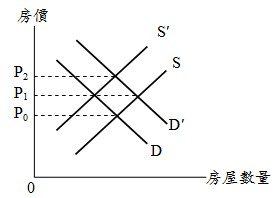

## 482. 土地合併之限制
*發布日期: 2021-06-03* 

## 內文
各位同學好

今日專欄說明有關土地合併之限制，茲說明如下：

• (一) 位置與使用之限制土地因合併申請複丈者，應以同一地段、地界相連、使用性質相同之土地為限(地測§224I)。所稱之使用性質，於都市土地指使用分區，於非都市土地指使用分區及編定之使用地類別(地測§225-1)。

• (二) 他項權利與限制登記之限制兩宗以上之土地如已設定不同種類之他項權利，或經法院查封、假扣押、假處分或破產之登記者，不得合併(土施§19-1)。其立法理由係為免權利狀態混淆，並利地籍管理。因此，3筆土地中有2筆設定有地上權及抵押權，另1筆則僅設定有抵押權，依上開規定意旨應不得辦理合併。

• (三) 申請之限制

1. 所有權人不同、設定有抵押權者，應檢附全體所有權人、抵押權人之協議書 (地測§224) (登§88)。又設定抵押權內容完全一致之多筆土地合併，免經抵押權人同意（內政部87台內地字第8706280號函）。因此，設定抵押權之土地合併時，倘未涉抵押權權利範圍變更，既未影響抵押權人之權益，得免經抵押權人同意及附具協議書（內政部92年內授中辦地字第0920085121號函）。

2. 設定有典權或耕作權時，應檢附該他項權利人之同意書。(地測§224)

3. 設定有地上權、永佃權、不動產役權、典權、耕作權或農育權之土地合併時，應先由土地所有權人會同他項權利人申請他項權利位置圖勘測。但設定時已有勘測位置圖且不涉及權利位置變更者，不在此限。(登§88)

• (四) 申報移轉現值之限制土地合併後，其價值減少者，就其減少部分課徵土地增值稅。(平施§65、土稅施§42)
---
*注：本文圖片存放於 ./images/ 目錄下*

## 483. 原住民保留地
*發布日期: 2021-06-03* 

## 內文
原住民申請無償取得原住民保留地所有權，土地面積最高限額為多少？另，原住民取得原住民保留地所有權後，除政府指定之特定用途外，其移轉之承受人以原住民為限。所稱政府指定之特定用途，包括那些情形？

【解答】

• (一) 原住民申請無償取得原住民保留地所有權，土地面積最高限額如下：

1. 依區域計畫法編定為農牧用地、養殖用地或依都市計畫法劃定為農業區、保護區，並供農作、養殖或畜牧使用之土地，每人1公頃。

2. 依區域計畫法編定為林業用地或依都市計畫法劃定為保護區並供作造林使用之土地，每人1.5公頃。

3. 依法得為建築使用之土地，每戶0.1公頃。

4. 其他用地，其面積由中央主管機關視實際情形定之。

• (二) 原住民取得原住民保留地所有權後，除政府指定之特定用途外，其移轉之承受人以原住民為限。所稱政府指定之特定用途，指下列得由政府承受情形之一：

1. 興辦土地徵收條例第3條、第4條第1項規定之各款事業及所有權人依該條例第8條規定申請一併徵收。

2. 經中央主管機關審認符合災害之預防、災害發生時之應變及災後之復原重建用地需求。

3. 稅捐稽徵機關受理以原住民保留地抵繳遺產稅或贈與稅。

4. 因公法上金錢給付義務之執行事件未能拍定原住民保留地。

政府依前項第3款及第4款規定承受之原住民保留地，除政府機關依法撥用外，其移轉之承受人以原住民為限。（參見：原住民保留地開發管理辦法第10條及第18條）
---
*注：本文圖片存放於 ./images/ 目錄下*

## 484. 實價登錄2.0之問題
*發布日期: 2021-05-27* 

## 內文
各位同學好

今日專欄談談實價登錄之目的與目前新制之問題

• (一) 實價登錄之目的

價格機能係市場運作的核心本質，在自由經濟體系中，價格機能扮演資源配置的重要角色。因此，惟有掌握充分的價格資訊，才能讓資源做有效的配置，整體市場才能健全發展。不動產市場為整體經濟市場的一環，但是，不動產價格卻是長期處於不公開、不透明的狀況，價格資訊不對稱的結果是讓壟斷資訊的建商或投機者取得投機套利空間，扭曲市場的正常運作。而如果價格資訊普遍缺乏，則不動產買賣雙方均可能陷入憑直覺或不理性的生產、消費活動，使不動產市場處於經常性大賺或大賠的隨機結構裡，而有礙市場經濟之效率與公平。

實價登錄地政三法，係指不動產經紀業管理條例、地政士法及平均地權條例。其目的是為促進不動產交易資訊透明化，降低目前不動產資訊不對稱情形，避免不當哄抬房價。換言之，實價登錄地政三法，係政府為推動居住正義、促進不動產交易價格透明化，健全不動產交易市場。

• (二) 實價登錄之問題

實價登錄2.0之修正重點

[圖片1]

1. 申報錯誤自實價登錄新制2020年7月1日上路，常見5大錯誤態樣，分別為「交易日期未填寫私契簽訂日期」、「未由全部買賣方簽章」、「車位單獨計價未申報車位總價」、「交易總價誤報」及「備註欄漏報」。其中「備註欄漏報」常見錯誤如關係人間交易、建物含有增建、有特殊交易情況而漏報。至於申報有誤將遭裁罰，要注意「交易總價」、「車位個數」、「車位總價」及「車位價格」等4項申報錯誤無改正機會，罰鍰為3萬至15萬元。

2. 價格參考有待商榷、退戶難控管以往預售屋價格就只有靠建商的片面之詞，民眾簽約時對於建案已賣多少戶，各戶賣多少錢根本無法掌握，現行法規是代銷結束委售30日內登錄，未來改為「逐戶」簽約後30日登錄，因此民眾簽約前就可以了解自己「可能」的未來鄰居買價，不用再等兩、三年以後才恍然大悟自己買貴還是買便宜。但也有人質疑是否建商會故意放出幾戶「特殊」交易做高價格，之後銷況已走到後期再退戶，假紀錄創造假行情，混淆民眾。因此，若遇到有心人故意操作房價，在首賣的前幾案都登錄高價，成為「定錨價」，這樣一來之後賣的房價也能被墊高，政府應提出配套措施。預售屋登錄後退戶問題，以及更新每戶動態成交狀況，內政部還沒有確定方案出來。另外，揭露頻率，現行成屋資訊是每月3次的頻率，是否會比照辦理還是可以縮短時間，將端看系統穩定度。

3. 含車位包裝潢、價格灌好灌滿以往成屋交易時，登錄時會僅在備註欄上簡單的寫包含裝潢或是車位，但裝潢價值跟車位定價沒有統一標準，讓民眾難以拆算，這種「虛價申報」問題，這次修法並未提及，而且預售屋車位價格也是隨著建商自己分層定價，裡面能操作的模糊灰色地帶只能說太多太多了。一般而言，若房市不景氣，銷售情況不佳，而建商又因擔心破壞市場行情而不願降價求售，於是會以送裝潢、家電、傢俱等方式，藉以達到不降價卻可完成促銷的目的。如消費者購買新北市板橋區的某一新建案的成交價訂為2300萬元，但市價可能只有2000萬元，若建商與購屋者達成協議，以二千萬元成交，但合約價仍為二千三百萬元，其間的三百萬元差價則以送裝潢或家電來補足，除可讓房價保持不下降之外，同時亦可拉高房屋的每坪單價。在房地產市場中，停車位價格並沒有一定的標準，而是由建商自行決定，即使是同區域、同規格的車位售價也不同，且豪宅與一般住宅的車位價可能相差三倍以上，而一般影響車位價格的因素主要有樓層、車位構造、位置等三項因素，因此，業者可利用「停車位」作價，提高每坪單價，如建商在實價登錄上將車位單價從原本250萬調整至150萬，房子本身價位在扣除停車位後價格就減少了100萬，以此計算可拉抬每坪單價，亦即高總價中含有許多不實的虛價部分，也是造成虛價登錄的原因之一。

4. 紅單與轉讓仍有操作空間若是有心培養投資客的建商，若用偷吃步，跟下一手買方約好，投資客退戶後馬上承接，理論上並無不法。建商經營投資客的關係像是食物鏈，建商培養投資客，投資客可以賺取傭金，建商可以快速衝銷況，可說是雙贏，但這次修法並沒有對於限制轉讓下一手買來源、資格，這部分因倉促立法，確實有再討論的空間。政府應該加強查核力道。

5. 賦予買賣雙方過重責任實價登錄目前申報主體為買賣案件之權利人與義務人，惟許多案件多委託經紀人與地政士代為處理，其價格資訊責任及處理對象如落於買賣雙方，甚而有2次未改正加重處罰，似有違反比例原則之疑慮。

資料來源： 2021-01-10 實登2.0通過然後呢? 這些BUG還是無解，591編輯部報評論 2021-02-22 防範實價登錄報錯 地所創新來輔助，新北市汐止地政事務所 2020-12-10 實價登錄2.0修法 張金鶚：落實查核是關鍵，中央通訊社 2020-11-10 實價登錄2.0納入預售屋 業界憂淪為炒房工具，591編輯部報評論 2020-05-22 實價登錄問題之探討，國家政策研究基金會

## 文章圖片

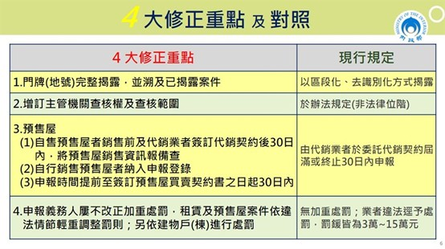

## 485. 瑕疵不動產估價(二)
*發布日期: 2021-05-27* 

## 內文
不動產估價技術規則第89條規定：「受有土壤或地下水污染之土地，應先估算其未受污染之正常價格，再依據委託人提供之土壤污染檢測資料，考量該土壤或地下水污染之影響，並計算其地價減損額後，從正常價格中扣除之，以其餘額為該宗地之價格。」又，不動產估價技術規則第113條規定：「受有土壤及地下水污染之建物，應先估算其未受污染之正常價格，再依據委託人提供之土壤污染檢測資料，考量該土壤及地下水污染之影響，並計算其減損額後，從正常價格中扣除之，以其餘額為該建物之價格。」準此，土壤及地下水污染之污染對象為土地，何以建物會發生價值減損現象？另，受土壤及地下水污染之不動產價格如何估計？

【解答】

• (一) 建物價值減損之理由：

1. 建物價值實難與其土地價值完全割裂而獨立認定。因此，土壤及地下水污染之影響不僅及於土地，亦及於建物。

2. 瑕疵品深植人心之不良印象，因而污名化造成不動產整體（包括建物及其基地）之跌價損失。

3. 土壤及地下水污染，除回復土地原狀所造成建物損壞之修復成本外，亦會造成建物交易性貶值之損失。

• (二) 受土壤及地下水污染之不動產價格估計方法：

1. 成本法：估算勘估標的回復原狀所需之費用（即整治成本），再估計污名化所造成之跌價損失。污名損失，指支付整治成本後，不動產仍存在之跌價損失。污名價損與潛在風險有關，其成因來自於對問題復發之恐懼、未來賠償責任之可能性、未來增加整治之隱藏成本、瑕疵品深植人心之不良印象等。因此，由勘估標的正常價格扣除整治成本，再扣除污名化損失，即得之。

2. 比較法：在同一供需圈內之近鄰地區或類似地區，蒐集受污染之交易價格，再估算其未受污染之正常價格。二者相減，就得出不動產價值減損額。再以此減損額，除以該不動產之正常價格，即得出價值減損比率。以此價值減損比率與勘估標的之個別條件加以比較，而決定勘估標的之價值減損比率。爰將勘估標的之正常價格，乘以勘估標的之價值減損比率，即得出勘估標的之價值減損額；再由勘估標的正常價格扣除勘估標的價值減損額，即得之。

3. 收益法：受污染之不動產，將導致租金下跌、生產費用增加及空置率上升；另外，受污染之不動產存在污染所產生之風險，投資人要求較高報酬率，導致收益資本化率提高。因此，受污染不動產之淨收益減少及收益資本化率提高，所估得之收益價格下降。
---
*注：本文圖片存放於 ./images/ 目錄下*

## 486. 地籍圖重測與土地複丈之差異
*發布日期: 2021-05-20* 

## 內文
複丈與地籍圖重測意義不同，地籍圖重測，係將人民原有土地範圍，利用地籍調查及測量等方法，將其完整反映於地籍圖上（司法院釋字第374號解釋參照）。而土地複丈，乃係指基於分割、合併、坍沒、界址調整或經界不明等原因，由土地所有權人或承租人等（地籍測量實施規則第205條）向地政機關申請對已確定登記之地籍資料（即已依法辦竣地籍測量及土地登記之土地）實施再測量。（參最高行政法院109年度判字第164號判決）

其差異茲整理如下表所示：

• T. ABLE_PLACEHOLDER_1
---
*注：本文圖片存放於 ./images/ 目錄下*

## 487. 瑕疵不動產估價(一)
*發布日期: 2021-05-20* 

## 內文
海砂屋（即高氯離子建物）之實體損壞對象僅限於建物，不及於土地。何以海砂屋之價值減損，除建物本身外，亦包括其所坐落之土地？

【解答】

土地價值減損之理由如下：

• (一) 土地價值實難與其建物價值完全割裂而獨立認定。因此，海砂屋之影響不僅及於建物，亦及於土地。

• (二) 瑕疵品深植人心之不良印象，因而污名化造成不動產整體（包括建物及其基地）之跌價損失。

• (三) 海砂屋除建物拆除所造成土地清理成本外，亦會造成土地交易性貶值之損失。

例如：有一間住宅之正常價格300萬元，其中土地價格200萬元，建物價格100萬元。如該住宅為海砂屋，設以正常價格六折估計，則海砂屋價格為180萬元。因而有人質疑，海砂屋之損壞對象只在建物，不在土地，因此如將建物價值認定為零，海砂屋價格至少有200萬元，何以不動產估價結果只有180萬元？此乃因海砂屋之價值減損不僅及於建物，並及於土地。
---
*注：本文圖片存放於 ./images/ 目錄下*

## 488. 多數決處分之代理權說與處分權說
*發布日期: 2021-05-13* 

## 內文
各位同學好

105年經紀人考試有考到一題目如下：甲、乙、丙等三人公同共有A屋，甲與乙擅自於105年8月8日將A屋出賣於丁。下列敘述何者錯誤？(A)如採處分權說，且甲與乙債務不履行，則丙亦應負損害賠償責任(B)如採代理權說，則丙應負擔法律關係上出賣人的義務與責任

究竟何謂處分權說及代理權說？茲整理如下：

• 一、代理權說(34-1執行要點、最高法院83台上1761判決)

1. 法定代理權：源於法律所賦予之代理權，代理他共有人處分行為。即取得未同意共有人之法定代理權而為締約。

2. 其法律效果歸屬本人，亦即被迫加入債權契約，應負法律關係上出賣人義務與責任。

3. 交易相對人亦得以未同意之共有人為被告，請求履行買賣契約之內容。

• 二、處分權說(最高法院87台上866判決、88台上1703判決)

1. 處分權乃基於實體法規定而生，並非代理未同意出賣共有人與買受人訂立買賣契約。

2. 買賣契約屬債權契約，不以有處分權為必要，故未得他共有人同意，買賣契約當然有效，但契約對未同意之他共有人無拘束力。

3. 未同意出售之共有人並未與買受人訂立買賣契約，自不能因其應有部分一併出售並移轉與買受人，且得領取買賣價金，而謂與買受人間有買賣關係存在。即不存在買賣關係。

因此，該題答案應選A。
---
*注：本文圖片存放於 ./images/ 目錄下*

## 489. 債權行為與物權行為之實例研習(二)
*發布日期: 2021-05-13* 

## 內文
甲有一筆耕地，與受託人簽訂信託契約，在下列二種情形，信託契約之效力為何？(一)受託人為自然人乙，受益人為華南商業銀行股份有限公司。(二)受託人為華南商業銀行股份有限公司，受益人為自然人乙。

【解答】

• (一) 信託法第5條規定，以依法不得受讓特定財產權之人為該財產權之受益人者，信託行為無效。準此，本題第一種情形，華南商業銀行股份有限公司為依法不得受讓耕地之人，故以華南商業銀行股份有限公司為受益人，所簽訂之信託契約無效。

• (二) 信託法第21條規定：「未成年人、受監護或輔助宣告之人及破產人，不得為受託人。」準此，本題第二種情形，如該自然人非屬未成年人、受監護或輔助宣告之人及破產人，所簽訂之信託契約有效。至於農業發展條例第33條規定：「私法人不得承受耕地。但符合第三十四條規定之農民團體、農業企業機構或農業試驗研究機構經取得許可者，不在此限。」承受人之資格限制，係針對處分行為（即物權行為）。因此，簽訂信託契約屬於負擔行為（即債權行為）不受其拘束。換言之，所簽訂之信託契約仍然有效，至於信託移轉登記（即物權行為）則無效。
---
*注：本文圖片存放於 ./images/ 目錄下*

## 490. 房地合一稅申報期限及預售屋適用之稅率持有期間
*發布日期: 2021-05-06* 

## 內文
各位同學好

今日專欄說明有關新修正的所得稅法，即「房地合一稅2.0」針對各種課稅情形之申報期限，以及爭議較多的預售屋適用之持有期間：

根據所得稅法第14條之5規定，個人有前條之交易所得或損失，不論有無應納稅額，應於下列各款規定日期起算三十日內自行填具申報書，檢附契約書影本及其他有關文件，向該管稽徵機關辦理申報；其有應納稅額者，應一併檢附繳納收據：一、第四條之四第一項所定房屋、土地完成所有權移轉登記日之次日。二、第四條之四第二項所定房屋使用權交易日之次日、預售屋及其坐落基地交易日之次日。三、第四條之四第三項所定股份或出資額交易日之次日。

簡單整理如下表所示：

• T. ABLE_PLACEHOLDER_1

其中應特別注意的是，預售屋係於簽訂預售屋買賣契約開始，至後來出售，其稅率是依照持有期間予以課徵（2年內45%、2至5年35%、5至10年20%、10年以上15%），惟目前多認為需將預售屋，以及交屋後的成屋分開計算，如下圖所示（但後續仍須看房地合一稅申報要點如何訂定為準）：

[圖片1]

舉例而言（假設興建期2年整）：

1. 預售簽約後1年，尚未興建完成即出售：稅率＝45%

2. 預售簽約後3年，房屋興建完成滿1年出售：稅率＝45%（以成屋登記後重計）

3. 預售簽約後滿6年，房屋興建完成滿4年出售：稅率＝35%（以成屋登記後重計）

因此，目前有認為可能會造成預售閉鎖期7年左右（2年預售興建期+5年成屋持有重稅期間）

## 文章圖片

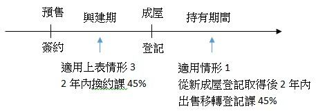

## 491. 債權行為與物權行為之實例研習(一)
*發布日期: 2021-05-06* 

## 內文
甲、乙、丙三人共有A地，應有部分各為三分之一，甲未經乙、丙同意，擅自將A地與丁簽訂買賣契約，則買賣契約之效力如何？乙、丙二人得否依該契約請求丁給付價金？丁得否依該契約請求乙、丙移轉其對A地之應有部分？

【解答】

• (一) 土地法第34條之1第1項規定：「共有土地或建築改良物，其處分、變更及設定地上權、農育權、不動產役權或典權，應以共有人過半數及其應有部分合計過半數之同意行之。但其應有部分合計逾三分之二者，其人數不予計算。」所稱處分，係指物權行為而言。本題甲與丁簽訂買賣契約屬於債權行為，故無土地法第34條之1之適用。因債權行為與物權行為分離，且各自獨立；又，債權行為不以有處分權為必要。換言之，該買賣契約仍屬有效，只不過其效力不及於未訂約之其他共有人。

• (二) 甲與丁簽訂買賣契約固然有效，然買賣契約之出賣人僅甲一人。故乙、丙二人不得依該契約向丁請求給付價金。

• (三) 甲與丁簽訂買賣契約固然有效，然買賣契約之出賣人僅甲一人，故丁不得依該契約請求乙、丙移轉其對A地之應有部分。
---
*注：本文圖片存放於 ./images/ 目錄下*

## 492. 負擔行為與處分行為
*發布日期: 2021-04-29* 

## 內文
• (一) 負擔行為與處分行為之意涵：

1. 負擔行為：當事人約定由一方為給付之法律行為。如債權行為即是。

2. 處分行為：直接發生權利變動之法律行為。如物權行為即是。

甲將一筆土地出售於乙，其過程為：首先甲與乙簽訂買賣契約（即債權行為），嗣將甲名下之土地過戶登記於乙名下（即物權行為）。前者為負擔行為，後者為處分行為。債權行為與物權行為分別獨立。債權行為與物權行為各自生效或失效。

• (二) 土地法規定之處分與移轉：土地法之法條用詞如為處分或移轉，一般指物權行為。舉例如下：

1. 民法第759條規定：「因繼承、強制執行、徵收、法院之判決或其他非因法律行為，於登記前已取得不動產物權者，應經登記，始得處分其物權。」意指繼承等五種情形，未辦竣登記，不得處分其物權，但仍得處分其債權。如甲有一筆土地，甲死亡由乙繼承，但未辦理繼承登記。今，乙與丙就該地簽訂買賣契約，則買賣契約（即債權行為）仍然有效，只是無從辦理過戶登記（即物權行為）而已。

2. 土地法第34條之1第1項規定：「共有土地或建築改良物，其處分、變更及設定地上權、農育權、不動產役權或典權，應以共有人過半數及其應有部分合計過半數之同意行之。但其應有部分合計逾三分之二者，其人數不予計算。」所稱處分，指物權行為而言。如甲、乙二人共有一筆土地，應有部分各二分之一。今，乙未經甲同意，擅自與丙就該地簽訂買賣契約，則買賣契約（即債權行為）仍然有效。又，簽訂買賣契約屬於債權行為，不以有處分權為必要。日後，乙無法履行契約，丙不得向甲請求給付甲之應有部分。此時，丙僅得向乙主張債務不履行請求損害賠償。

3. 山坡地保育利用條例第37條第2項：「原住民取得原住民保留地所有權，如有移轉，以原住民為限。」所稱移轉，指物權行為而言。如甲為原住民，乙為非原住民，甲擁有一筆原住民保留地。今，甲與乙就該地簽訂買賣契約，則買賣契約（即債權行為）仍然有效，只是無從辦理過戶登記（即物權行為）而已。

• (三) 試題探討：◎甲具有原住民身分，為丙之利益，以丙為受益人將其所有之原住民保留地A地信託予不具原住民身分的自然人乙，依原住民保留地開發管理辦法第18條規定，原住民保留地所有權移轉對象為具原住民身分者。試問甲、乙間就A地所為之信託契約效力為何？（108年地政士「民法概要與信託法概要」試題）

【解答】

• (一) 信託法第5條第4款規定，以依法不得受讓特定財產權之人為該財產權之受益人者，信託行為無效。準此，具有原住民身分者，始得為受益人；亦即丙須具有原住民身分。本題所問為受託人，故受益人與本題無關，合先敍明。

• (二) 原住民保留地開發管理辦法第18條第1項，原住民取得原住民保留地所有權後，除政府指定之特定用途外，其移轉之承受人以原住民為限。準此，甲信託移轉於乙，乙為受託人。原住民保留地移轉之承受人，須具有原住民身分。信託登記屬於所有權移轉，故受託人須具有原住民身分。本題，乙不具原住民身分，故甲不得將A地信託移轉於乙。

• (三) 上開原住民保留地開發管理辦法第18條第1項所稱「移轉」，指處分行為（即物權行為）。本題所問「信託契約之效力為何？」係指「負擔行為（即債權行為）之效力為何？」前揭原住民保留地開發管理辦法僅規範處分行為（即物權行為），未規範負擔行為（即債權行為）。換言之，僅拘束處分行為（即物權行為），未拘束負擔行為（即債權行為）。準此，甲、乙間就A地所為之信託契約屬於負擔行為（即債權行為），故仍然有效。
---
*注：本文圖片存放於 ./images/ 目錄下*

## 493. 遺產稅與贈與稅之信託權利價值計算
*發布日期: 2021-04-29* 

## 內文
各位同學好

遺產及贈與稅法第10條之1規定有信託利益之價值計算，本期專欄茲就「遺產稅」部分說明如下：

• 一、享有全部信託利益之權利者，該信託利益為金錢時，以信託金額為準，信託利益為金錢以外之財產時，以受益人死亡時信託財產之時價為準。

例如：

1. 甲信託給乙1000萬元，約定信託期間5年，全部信託利益交付給丙，則信託關係存續中當受益人丙死亡時，應就其享有信託利益之權利未領受部分，課徵遺產稅，其財產價值為1000萬元。

2. 甲信託給乙一筆土地，約定信託期間5年，並指定全部信託利益給丙，則當信託後第二年丙死亡，則應就該筆土地當年公告土地現值(假設500萬)課徵遺產稅。

• 二、享有孳息以外信託利益之權利者，該信託利益為金錢時，以信託金額按受益人死亡時起至受益時止之期間，依受益人死亡時郵政儲金匯業局一年期定期儲金固定利率複利折算現值計算之；信託利益為金錢以外之財產時，以受益人死亡時信託財產之時價，按受益人死亡時起至受益時止之期間，依受益人死亡時郵政儲金匯業局一年期定期儲金固定利率複利折算現值計算之。

例如：

甲信託給乙一棟房屋，約定信託期間5年，期間租金給甲，最後房屋移轉給丙（即丙享有孳息以外信託利益），假設信託後第三年丙死亡，亦即尚有兩年信託才到期，則丙死亡時的尚未領受的信託利益權利如下（假設當年房屋現值1000萬元、1年定期儲金利率為2%）：1000/（1+2%）2＝961萬元

• 三、享有孳息部分信託利益之權利者，以信託金額或受益人死亡時信託財產之時價，減除依前款規定所計算之價值後之餘額為準。但該孳息係給付公債、公司債、金融債券或其他約載之固定利息者，其價值之計算，以每年享有之利息，依受益人死亡時郵政儲金匯業局一年期定期儲金固定利率，按年複利折算現值之總和計算之。

例如：

甲信託給乙一棟房屋，約定信託期間5年，期間租金部分給丙，最後房屋移轉給甲，假設信託後第三年丙死亡，亦即尚有兩年信託才到期，則丙死亡時的尚未領受的信託利益權利如下（假設當年房屋現值1000萬元、1年定期儲金利率為2%：1000－（1000/（1+2%）2）＝1000－961＝39萬元

• 四、享有信託利益之權利為按期定額給付者，其價值之計算，以每年享有信託利益之數額，依受益人死亡時郵政儲金匯業局一年期定期儲金固定利率，按年複利折算現值之總和計算之；享有信託利益之權利為全部信託利益扣除按期定額給付後之餘額者，其價值之計算，以受益人死亡時信託財產之時價減除依前段規定計算之價值後之餘額計算之。

例如：

甲信託給乙1000萬元，約定信託期間5年，期間約定每年定額給丙100萬元，假設信託後第三年丙死亡（已領300萬元），則丙死亡時尚有2年未領受的信託利益權利，計算如下（假設1年定期儲金利率為2%）：（100/（1+2%））+（100/（1+2%）2）＝98 + 96＝194萬元
---
*注：本文圖片存放於 ./images/ 目錄下*

## 494. 稅捐稽徵法之租稅保全措施
*發布日期: 2021-04-22* 

## 內文
各憲法第19條規定人民有依法律納稅之義務，惟現行實務上 納稅義務人移轉財產以規避納稅義務之情事時有所聞，為保全稅 捐債權之實現，稅捐稽徵法設有稅捐保全制度。稅捐保全之相關 措施主要規範於稅捐稽徵法第6條(稅捐優先權)、同法第24條(禁止財產處分、假扣押及限制出境)及同法第25條(提前徵收)等

• (一) 稅捐優先權

1. 稅捐之徵收，優先於普通債權。

2. 土地增值稅、地價稅、房屋稅之徵收及法院、行政執行處執行拍賣或變賣貨物應課徵之營業稅，優先於一切債權及抵押權。

經法院、行政執行處執行拍賣或交債權人承受之土地、房屋及貨物，執行法院或行政執行處應於拍定或承受五日內，將拍定或承受價額通知當地主管稅捐稽徵機關，依法核課土地增值稅、地價稅、房屋稅及營業稅，並由執行法院或行政執行處代為扣繳。

• (二) 禁止財產處分、假扣押及限制出境

1. 不得為移轉或設定他項權利：納稅義務人欠繳應納稅捐者，稅捐稽徵機關得就納稅義務人相當於應繳稅捐數額之財產，通知有關機關，不得為移轉或設定他項權利。

2. 限制其減資或註銷登記：其為營利事業者，並得通知主管機關，限制其減資或註銷之登記。

3. 假扣押：欠繳應納稅捐之納稅義務人，有隱匿或移轉財產、逃避稅捐執行之跡象者，稅捐稽徵機關得聲請法院就其財產實施假扣押，並免提供擔保。但納稅義務人已提供相當財產擔保者，不在此限。

4. 限制出境：在中華民國境內居住之個人或在中華民國境內之營利事業，其已確定之應納稅捐逾法定繳納期限尚未繳納完畢，所欠繳稅款及已確定之罰鍰單計或合計，個人在新臺幣一百萬元以上，營利事業在新臺幣二百萬元以上者；其在行政救濟程序終結前，個人在新臺幣一百五十萬元以上，營利事業在新臺幣三百萬元以上，得由財政部函請內政部移民署限制其出境；其為營利事業者，得限制其負責人出境。但已提供相當擔保者，應解除其限制。

• (三) 提前徵收

有下列情形之一者，稅捐稽徵機關，對於依法應徵收之稅捐，得於法定開徵日期前稽徵之。但納稅義務人能提供相當擔保者，不在此限：

1. 納稅義務人顯有隱匿或移轉財產，逃避稅捐執行之跡象者。

2. 納稅義務人於稅捐法定徵收日期前，申請離境者。

3. 因其他特殊原因，經納稅義務人申請者。

納稅義務人受破產宣告或經裁定為公司重整前，應徵收之稅捐而未開徵者，於破產宣告或公司重整裁定時，視為已到期之破產債權或重整債權。

參考資料：何弘光，健全稅捐保全制度之修法建議，當代財政，第27期，2013年3月。黃瑛足，2020，談稅捐稽徵法第24條之稅捐保全制度。
---
*注：本文圖片存放於 ./images/ 目錄下*

## 495. 興建農舍套繪管制
*發布日期: 2021-04-22* 

## 內文
甲有農業用地一筆，多年前出具「農舍興建（土地使用）同意書」予其毗鄰農業用地所有權人乙，乙並建畢農舍一棟，主管機關亦於甲之土地登記簿上為「興建農舍套繪管制」之註記登記。今甲擬辦理其農地之分割，但依法須先解除套繪管制後始得辦理。主管機關為農業用地「興建農舍套繪管制」之立法目的為何？又，甲之農地若欲解除「興建農舍套繪管制」，其須符合那些要件？試依據農業發展條例等法規之規定分述之。（109年原住民族考試「土地法規概要」）

【解答】

• (一) 興建農舍套繪管制之立法目的：申請興建農舍之農業用地，其農舍用地面積不得超過該農業用地面積百分之十（即建蔽率10%）。因此，農舍套繪管制之目的，在避免農舍坐落之農業用地（即10%土地）及非屬農舍坐落之農業用地（即90%土地）重複使用，供興建農舍。

• (二) 解除「興建農舍套繪管制」之條件：

1. 直轄市、縣（市）主管建築機關於核發建造執照後，應造冊列管，同時將農舍坐落之地號及提供興建農舍之所有地號之清冊，送地政機關於土地登記簿上註記，並副知該府農業單位建檔列管。

2. 已申請興建農舍之農業用地，直轄市、縣（市）主管建築機關應於地籍套繪圖上，將已興建及未興建農舍之農業用地分別著色標示，未經解除套繪管制不得辦理分割。

3. 已申請興建農舍領有使用執照之農業用地經套繪管制，除符合下列情形之一者外，不得解除：

1. 農舍坐落之農業用地已變更為非農業用地。

2. 非屬農舍坐落之農業用地已變更為非農業用地。

3. 農舍用地面積與農業用地面積比例符合法令規定，經依變更使用執照程序申請解除套繪管制後，該農業用地面積仍達零點二五公頃以上。

4. 前項第三款農舍坐落該筆農業用地面積大於零點二五公頃，且二者面積比例符合法令規定，其餘超出規定比例部分之農業用地得免經其他土地所有權人之同意，逕依變更使用執照程序解除套繪管制。

5. 農業用地經解除套繪管制，或原領得之農舍建造執照已逾期失其效力經申請解除套繪管制者，直轄市、縣（市）主管建築機關應將農舍坐落之地號、提供興建農舍之所有地號及解除套繪管制之所有地號清冊，囑託地政機關塗銷上開之註記登記。（農業用地興建農舍辦法第12條）
---
*注：本文圖片存放於 ./images/ 目錄下*

## 496. 土地增值稅之納稅義務人、代繳義務人及代繳人
*發布日期: 2021-04-15* 

## 內文
• (一) 納稅義務人：

1. 有償移轉：土地為有償移轉（如買賣、交換等是）者，為原所有權人（土稅§5Ⅰ①）。

2. 無償移轉：土地為無償移轉（如贈與、遺贈等是）者，為取得所有權之人（土稅§5Ⅰ②）。

3. 設定典權：土地設定典權者，為出典人（土稅§5Ⅰ③）。

4. 信託：

1. 處分信託土地：受託人就受託土地，於信託關係存續中，有償移轉所有權、設定典權或依信託法規定轉為其自有土地時，以受託人為納稅義務人，課徵土地增值稅（土稅§5-2Ⅰ）。

2. 土地信託歸屬：以土地為受託財產，受託人依信託本旨移轉信託土地與委託人以外之歸屬權利人時，以該歸屬權利人為納稅義務人，課徵土地增值稅（土稅§5-2Ⅱ）。

• (二) 代繳義務人：

1. 單獨申報移轉現值：依平均地權條例第47條規定由權利人單獨申報土地移轉現值者，其應納之土地增值稅，應由權利人代為繳納（土稅§5-1）。

2. 法院拍賣：經法院拍賣之土地，依規定審定之移轉現值核定其土地增值稅者，如拍定價額不足扣繳土地增值稅時，拍賣法院應俟拍定人代為繳清差額後，再行發給權利移轉證書（土稅§51Ⅱ）。

• (三) 代繳人：

代繳義務人與代繳人不同。前者有代繳義務，因此法條規定「應代為繳納」；後者無代繳之義務，因此法條規定「得代為繳納」。

1. 未於期限內繳納：土地所有權移轉，其應納之土地增值稅，納稅義務人未於規定期限內繳納者，得由取得所有權之人代為繳納（土稅§5-1）。

2. 欠繳土地稅：欠繳土地稅（指地價稅）之土地，在欠稅未繳清前，不得辦理移轉登記或設定典權。所欠稅款，土地承受人得申請代繳或在買價、典價內照數扣留完納；其屬代繳者，得向納稅義務人求償（土稅§51Ⅰ、Ⅲ）。
---
*注：本文圖片存放於 ./images/ 目錄下*

## 497. 遺產稅的課徵程序
*發布日期: 2021-04-15* 

## 內文
各位同學好，今日說明有關遺產稅之課徵程序之相關規定：

• (一) 通知申報

1. 戶籍機關受理死亡登記後，應即將死亡登記事項副本抄送稽徵機關。(遺贈§37)

2. 稽徵機關於查悉死亡事實或接獲死亡報告後，應於一個月內填發申報通知書，檢附遺產稅申報書表，送達納稅義務人，通知依限申報，並於限期屆滿前十日填具催報通知書，提示逾期申報之責任，加以催促。前項通知書應以明顯之文字，載明民法限定繼承及拋棄繼承之相關規定。納稅義務人不得以稽徵機關未發第一項通知書，而免除本法規定之申報義務。(遺贈§28)（亦即不論有無應納稅額，納稅義務人皆應申報）

• (二) 申報稅額

1. 被繼承人死亡遺有財產者，納稅義務人應於被繼承人死亡之日起六個月內，向戶籍所在地主管稽徵機關依本法規定辦理遺產稅申報。但依第六條第二項規定由稽徵機關申請法院指定遺產管理人者，自法院指定遺產管理人之日起算。(遺贈§23)補充：本法第二十三條規定之遺產稅申報期間，如被繼承人為受死亡之宣告者，應自判決宣告之日起計算。(遺贈施§21)

2. 被繼承人為經常居住中華民國境外之中華民國國民或非中華民國國民死亡時，在中華民國境內遺有財產者，應向中華民國中央政府所在地之主管稽徵機關辦理遺產稅申報。(遺贈§23) （即台北市國稅局）

3. 遺產稅納稅義務人具有正當理由不能如期申報者，應於規定限期屆滿前，以書面申請延長之。前項申請延長期限以三個月為限。但因不可抗力或其他有特殊之事由者，得由稽徵機關視實際情形核定之。(遺贈§26)

4. 被繼承人死亡時遺有財產者，不論有無應納稅額，納稅義務人均應填具遺產稅申報書向主管稽徵機關據實申報。其有依本法規定之減免扣除或不計入遺產總額者，應檢同有關證明文件一併報明。(遺贈施§20)

5. 遺產稅納稅義務人為二人以上時，應由其全體會同申報，未成年人或受監護宣告之人應由其法定代理人代為申報。但納稅義務人一人出面申報者，視同全體已申報。(遺贈施§22)

• (三) 填發稅單

稽徵機關應於接到遺產稅申報書表之日起二個月內，辦理調查及估價，決定應納稅額，繕發納稅通知書，通知納稅義務人繳納；其有特殊情形不能在二個月內辦竣者，應於限期內呈准上級主管機關核准延期。(遺贈§29)

• (四) 繳清稅款

1. 遺產稅納稅義務人，應於稽徵機關送達核定納稅通知書之日起二個月內，繳清應納稅款；必要時，得於限期內申請稽徵機關核准延期二個月。

2. 遺產稅應納稅額在三十萬元以上，納稅義務人確有困難，不能一次繳納現金時，得於納稅期限內，向該管稽徵機關申請，分十八期以內繳納，每期間隔以不超過二個月為限。經申請分期繳納者，應自繳納期限屆滿之次日起，至納稅義務人繳納之日止，依郵政儲金一年期定期儲金固定利率，分別加計利息；利率有變動時，依變動後利率計算。

3. 遺產稅應納稅額在三十萬元以上，納稅義務人確有困難，不能一次繳納現金時，得於納稅期限內，就現金不足繳納部分申請以在中華民國境內之課徵標的物或納稅義務人所有易於變價及保管之實物一次抵繳。中華民國境內之課徵標的物屬不易變價或保管，或申請抵繳日之時價較死亡日之時價為低者，其得抵繳之稅額，以該項財產價值占全部課徵標的物價值比例計算之應納稅額為限。(遺贈§30)

• (五) 發給證明

1. 遺產稅納稅義務人繳清應納稅款、罰鍰及加徵之滯納金、利息後，主管稽徵機關應發給稅款繳清證明書；其經核定無應納稅款者，應發給核定免稅證明書；其有特殊原因必須於繳清稅款前辦理產權移轉者，得提出確切納稅保證，申請該管主管稽徵機關核發同意移轉證明書。依第十六條規定，不計入遺產總額之財產，經納稅義務人之申請，稽徵機關應發給不計入遺產總額證明書。(遺贈§41)

2. 遺產稅未繳清前，不得分割遺產、交付遺贈或辦理移轉登記。但依第四十一條規定，於事前申請該管稽徵機關核准發給同意移轉證明書，或經稽徵機關核發免稅證明書、不計入遺產總額證明書，不在此限。(遺贈§8)

3. 又地政機關及其他政府機關，或公私事業辦理遺產之產權移轉登記時，應通知當事人檢附稽徵機關核發之稅款繳清證明書，或核定免稅證明書或不計入遺產總額證明書，或同意移轉證明書之副本；其不能繳附者，不得逕為移轉登記。(遺贈§42)

4. 繼承人為二人以上時，經部分繼承人按其法定應繼分繳納部分遺產稅款、罰鍰及加徵之滯納金、利息後，為辦理不動產之公同共有繼承登記，得申請主管稽徵機關核發同意移轉證明書；該登記為公同共有之不動產，在全部應納款項未繳清前，不得辦理遺產分割登記或就公同共有之不動產權利為處分、變更及設定負擔登記。(遺贈§41-1)
---
*注：本文圖片存放於 ./images/ 目錄下*

## 498. 買賣不破租賃
*發布日期: 2021-04-08* 

## 內文
各位同學好，今日專欄來談談民法第425條之「買賣不破租賃」概念

• 一、法條

民法第425條：「出租人於租賃物交付後，承租人占有中，縱將其所有權讓與第三人，其租賃契約，對於受讓人仍繼續存在。前項規定，於未經公證之不動產租賃契約，其期限逾五年或未定期限者，不適用之。」

• 二、立法意旨

按出租人於租賃物交付後，將為租賃標的物之不動產所有權讓與第三人時，其第三人依法律規定，當然讓受出租人所有之權利，並承擔其義務，使租賃契約仍舊存續，始能保護承租人之利益。

• 三、效力

具有「租賃權物權化」之效力。

• 四、適用情形

但由於具物權化效力，在長期或未定期限之租賃契約，其於當事人之權義關係影響甚鉅，宜透過公證，以探求真意、確認身份及確保權利合法明確，並避免實務上有人透過與第三人通謀虛偽訂定長期或不定期租賃契約，以干擾強制執行效果（拍賣會賣不出去）。因此，規定期限逾五年或未定期限者，不適用之，茲整理如下表：

※能適用買賣不破租賃之情形：

• T. ABLE_PLACEHOLDER_1

• V. ：適用；X：不適用
---
*注：本文圖片存放於 ./images/ 目錄下*

## 499. 原地價之認定
*發布日期: 2021-04-08* 

## 內文
• (一) 原地價之意義：原地價，指原規定地價或前次移轉現值。詳言之，課徵土地增值稅時，計算土地漲價總數額，所採用之原規定地價或前次移轉現值。

1. 第一次規定地價後，未經過移轉之土地，採原規定地價為原地價。第一次規定地價後，曾經移轉之土地，採前次移轉現值為原地價。

2. 所稱原規定地價，係指中華民國53年規定之地價；其在中華民國53年以前已依土地法規定辦理規定地價及在中華民國53年以後舉辦規定地價之土地，均以其第一次規定之地價為原規定地價（平§38Ⅱ）。要言之，原規定地價係指第一次規定地價。

• (二) 原地價認定之特殊情形：

不課徵土地增值稅，原地價未更動；免徵土地增值稅，原地價須更動。

1. 不課徵土地增值稅後再移轉：

1. 配偶相互贈與後再移轉：配偶相互贈與之土地，得申請不課徵土地增值稅。但於再移轉第三人時，以該土地第一次贈與前之原規定地價或前次移轉現值為原地價，計算漲價總數額，課徵土地增值稅（土稅§28-2Ⅰ）。

2. 信託後再移轉：因信託移轉不課徵土地增值稅之土地，於所有權再移轉時，以該土地不課徵土地增值稅前之原規定地價或最近一次經核定之移轉現值為原地價，計算漲價總數額，課徵土地增值稅（土稅§31-1Ⅰ）。

3. 農業用地移轉課徵增值稅：①作農業使用之農業用地，於土地稅法中華民國89年1月6日（此日為立法院三讀通過之日，總統於89年1月26日公布，並自89年1月28日施行）修正施行後第一次移轉，或取得不課徵土地增值稅之土地後再移轉，依法應課徵土地增值稅時，以該修正施行日當期之公告土地現值（即民國88年7月1日公告之土地現值）為原地價，計算漲價總數額，課徵土地增值稅（土稅§39-2Ⅳ）。②作農業使用之農業用地，於土地稅法中華民國89年1月6日（此日為立法院三讀通過之日，總統於89年1月26日公布，並自89年1月28日施行）修正施行後，曾經課徵土地增值稅之農業用地再移轉，依法應課徵土地增值稅時，以該土地最近一次課徵土地增值稅時核定之申報移轉現值為原地價，計算漲價總數額，課徵土地增值稅（土稅§39-2Ⅴ）。

4. 公共設施保留地變更為非公共設施保留地後再移轉：公共設施保留地經變更為非公共設施保留地後再移轉時，以該土地第一次免徵土地增值稅前之原規定地價或前次移轉現值為原地價，計算漲價總數額，課徵土地增值稅（土稅§39Ⅱ）。

2. 免徵土地增值稅後再移轉：

1. 繼承後再移轉：因繼承取得之土地再行移轉者，以繼承開始時該土地之公告現值為原地價，計算漲價總數額，課徵土地增值稅。但繼承前領回區段徵收抵價地之地價，高於繼承開始時該土地之公告現值者，應從高認定（土稅§31Ⅱ）。

2. 公地出售後再移轉：免徵土地增值稅之公有土地再移轉，以實際出售價額為原地價，計算漲價總數額，課徵土地增值稅（土稅§30-1①）。

3. 公地贈與後再移轉：各級政府贈與之土地再移轉，以贈與契約（指公契，非指私契）訂約日當期之公告土地現值為原地價，計算漲價總數額，課徵土地增值稅（土稅§30-1①）。

4. 私地贈與後再移轉：私人捐贈供興辦社會福利事業或私立學校免徵土地增值稅之私有土地，以贈與契約（指公契，非指私契）訂約日當期之公告土地現值為原地價，計算漲價總數額，課徵土地增值稅（土稅§30-1②）。

5. 協議價購後再移轉：徵收前之協議價購免徵土地增值稅之土地，以協議價購契約（指公契，非指私契）訂約日當期之公告土地現值為原地價，計算漲價總數額，課徵土地增值稅。

6. 土地徵收後再移轉：土地徵收後再移轉，以補償費發給完竣日當期之公告土地現值為原地價，計算漲價總數額，課徵土地增值稅。

7. 區段徵收領回抵價地後再移轉：區段徵收領回抵價地後第一次移轉時，應以原土地所有權人實際領回抵價地之地價為原地價，計算漲價總數額，課徵土地增值稅（土稅§39-1Ⅱ）。
---
*注：本文圖片存放於 ./images/ 目錄下*

## 500. 不動產估價：公部門對公共設施保留地之地價查估
*發布日期: 2021-04-01* 

## 內文
◎試比較公共設施保留地之土地現值查估與土地徵收補償市價查估的不同？

【解答】

• (一) 查估目的：

1. 公共設施保留地之土地現值查估：每年1月1日發布公告土地現值。

2. 公共設施保留地之土地徵收補償市價查估：土地徵收地價補償標準。

• (二) 依據法規：

1. 公共設施保留地之土地現值查估：依據平均地權條例施行細則第63條辦理。

2. 公共設施保留地之土地徵收補償市價查估：依據土地徵收補償市價查估辦法第22條辦理。

• (三) 查估方法：

1. 公共設施保留地之土地現值查估：

1. 繁榮街道路線價區段：公共設施保留地處於繁榮街道路線價區段者，以路線價按其臨街深度指數計算。

2. 一般路線價區段：公共設施保留地處於非繁榮街道兩旁適當範圍內劃設之一般路線價區段者，以路線價為其地價。

3. 一般地價區段：公共設施保留地處於一般地價區段者，以毗鄰非公共設施保留地之區段地價平均計算。前項非公共設施保留地地價區段，以實例土地正常單價，求其中位數為各該區段之區段地價。所稱平均計算，指按毗鄰各非公共設施保留地之區段線比例加權平均計算。

2. 公共設施保留地之土地徵收補償市價查估：

1. 公共設施保留地之土地徵收補償市價查估，僅劃分一般地價區段，而無路線價區段。

2. 都市計畫區內公共設施保留地區段地價以其毗鄰非公共設施保留地之區段地價平均計算。前項非公共設施保留地地價區段，以其比準地地價為區段地價。所稱平均計算，指按毗鄰各非公共設施保留地地價區段之區段線比例加權平均計算。
---
*注：本文圖片存放於 ./images/ 目錄下*

## 501. 未辦繼承登記之地價稅課徵
*發布日期: 2021-04-01* 

## 內文
今日專欄討論一下有關未辦繼承登記之地價稅課徵問題：

首先，根據土地稅法施行細則第20條規定，地價稅依土地稅法第四十條之規定，每年一次徵收者，以八月三十一日為納稅義務基準日，而各年地價稅以納稅義務基準日土地登記簿所載之所有權人或典權人為納稅義務人。

但經法院拍賣取得之土地，依領得法院核發權利移轉證書之日為準；另經法院判決共有分割、公用徵收、或因繼承而移轉他人之土地，在未辦理產權移轉登記前，以法院形成判決確定日，公用徵收之補償費發放完竣日、或繼承開始日為準。

因此，所有權人死亡未辦妥繼承登記前，因繼承人已取得土地之所有權，除非已向法院辦理拋棄繼承，否則繼承人皆負有繳納地價稅之義務。又繼承土地在未辦妥分割繼承登記前，土地屬全體繼承人公同共有，如未設管理人，即以全體繼承人為地價稅之納稅義務人，雖共有人可申請分單繳納，惟各共有人對全部應納稅額仍負連帶繳納義務。
---
*注：本文圖片存放於 ./images/ 目錄下*

## 502. 不動產估價：適當利潤率
*發布日期: 2021-03-25* 

## 內文
◎何謂適當利潤率？影響適當利潤率之因素為何？不動產估價技術規則第60條所稱適當利潤率與同規則第81條所稱適當利潤率有何不同？

【解答】

• (一) 適當利潤率之意義：適當利潤率，即正常利潤或合理利潤；建設公司從事購買土地興建房屋之投資，所要求之最低報酬率。如預估報酬率小於適當利潤率，建設公司就不會從事投資生產。市場經過充分競爭之結果，建設公司只能擁有適當利潤，而無超額利潤。

• (二) 影響適當利潤率之因素：

1. 投資風險：投資風險愈大，適當利潤率愈高。因此，投資風險與適當利潤率成正比。

2. 開發年數：開發年數愈長，適當利潤率愈高。因此，開發年數與適當利潤率成正比。

3. 工程規模：工程規模愈大，適當利潤率愈低。因此，工程規模與適當利潤率成反比。

4. 經濟景氣：經濟愈景氣，適當利潤率愈高。因此，經濟景氣與適當利潤率成正比。

• (三) 第60條與第80條有關適當利潤率之比較：

1. 第60條之適當利潤率，指預期報酬率，屬於收入項。第80條之適當利潤率，指必要報酬率，屬於成本（即機會成本）項。

2. 第60條之適當利潤率置於分子，如下式所示：建物總成本＝（營造施工費＋規劃設計費＋廣告費銷售費＋稅捐及其他負擔）×（1＋綜合利率）×（1＋適當利潤率）第80條之適當利潤率置於分母，如下式所示：土地開發分析價格＝預期總銷售金額÷（1＋適當利潤率）÷（1＋綜合利率）－（直接成本＋間接成本）

3. 第60條之適當利潤率愈大，不動產估值（即成本價格）愈高。因此，適當利潤率與不動產估值成正比。第80條之適當利潤率愈大，不動產估值（即土地開發分析價格）愈低。因此，適當利潤率與不動產估值成反比。
---
*注：本文圖片存放於 ./images/ 目錄下*

## 503. 老農與新農之興建農舍資格
*發布日期: 2021-03-25* 

## 內文
各位同學好，今日專欄為各位整理農業發展條例89年修正前後有關「老農」與「新農」之興建農舍資格：

• 一、老農(89年1月27日含當日以前)

1. 身分限制：農民

2. 無須設籍。

3. 無農地面積限制。

4. 一人一戶：申請人無自用農舍者。

5. 農用限制：申請人為該農業用地之所有權人，且該農業用地應確供農業使用及屬未經申請興建農舍者；該農舍之興建並不得影響農業生產環境及農村發展。

• 二、新農(89年1月28日含當日以後)（含個別農舍與集村農舍）

1. 身分限制：農民（年滿二十歲或未滿二十歲已結婚者）

2. 設籍限制：申請人之戶籍所在地及其農業用地，須在同一直轄市、縣（市）內，且其土地取得及戶籍登記均應滿二年者。但參加興建集村農舍建築物坐落之農業用地，不受土地取得應滿二年之限制。

3. 面積限制：申請興建農舍之該筆農業用地面積不得小於零點二五公頃。但參加興建集村農舍及於離島地區興建農舍者，不在此限。

4. 一人一戶：申請人無自用農舍者。申請人已領有個別農舍或集村農舍建造執照者，視為已有自用農舍。但該建造執照屬尚未開工且已撤銷或原申請案件重新申請者，不在此限。

5. 農用限制：申請人為該農業用地之所有權人，且該農業用地應確供農業使用及屬未經申請興建農舍者；該農舍之興建並不得影響農業生產環境及農村發展。

法源依據：農業用地興建農舍辦法
---
*注：本文圖片存放於 ./images/ 目錄下*

## 504. 權利變換之房地分配
*發布日期: 2021-03-18* 

## 內文
• 一、權利變換之意義：權利變換，指更新單元內重建區段之土地所有權人、合法建築物所有權人、他項權利人、實施者或與實施者協議出資之人，提供土地、建築物、他項權利或資金，參與或實施都市更新事業，於都市更新事業計畫實施完成後，按其更新前權利價值比率及提供資金額度，分配更新後土地、建築物或權利金（都市更新條例第3條第7款）。

• 二、實例解說：甲有A、B二筆土地，乙於A地設定地上權，並興建一棟合法建築物；丙於B地無任何權利，但擁有地上一棟合法建築物。倘A、B二筆土地皆劃入都市更新範圍，乙、丙於權利變換後如何分配房地？

【解答】

• (一) 乙雖擁有地上權及合法建築物，但僅A地之地上權價值參與分配；至於乙擁有之合法建築物予以拆遷補償，不參與分配。

• (二) 丙雖於B地無任何權利，但丙擁有合法建築物所衍生之「建物權利價值」（參見不動產技術規則第126條之2，所謂建物權利價值，指有屋無地者，其建物使用基地之權利價值），據此參與分配；至於丙擁有之合法建築物予以拆遷補償，不參與分配。

總之，本例之乙，即上開權利變換意義之他項權利人，其以「地上權價值」參與分配房地，而非以「合法建築物價值」參與分配房地，亦非以「合法建築物價值與地上權價值之合計」參與分配房地。本例之丙，即上開權利變換意義之合法建築物所有權人，其以「建物權利價值」參與分配房地，而非以「合法建築物價值」參與分配房地。最後，須特別強調的是，乙、丙二人係於甲應分配之房地範圍內，按地上權價值或建物權利價值占原土地價值比率，計算分配房地（參見都市更新條例第60條第2項）。

• 三、試題應用：甲所有之A、B地號兩筆相鄰土地，均屬都市計畫住宅區。民國75年，甲於A地號土地上建築C建物，並領有使用執照；次年，甲將B地號土地設定存續期間50年之地上權予乙，由乙於其上建築D建物，亦領有使用執照。最近，丙都市更新事業機構（股份有限公司），依都市更新條例規定，以權利變換方式，實施包含A、B地號土地在內地區之重建都市更新事業，且其都市更新事業計畫亦經主管機關核定發布實施在案。試問：依前述設例，有關甲所有C建物及乙所有D建物之權利，應如何處理之？又，對於前開建物權利之處理，是否涉及土地增值稅之課徵？以上二項問題，請依都市更新條例之規定，分別詳細析述之。（109年地方政府三等）

【解答】

• (一) 甲所有C建物之處理：

1. 對C建物予以拆遷補償，補償C建物之殘餘價值予甲。建築物之殘餘價值，其補償金額由實施者委託專業估價者查估後評定之，實施者應於權利變換計畫核定發布後定期通知應受補償人領取；逾期不領取者，依法提存。

2. 土地所有權人並非按「建物價值」參與分配房地，而是按權利變換前之「基地權利價值」（即土地價值）參與分配房地。

• (二) 乙所有D建物及地上權之處理：

1. 對D建物予以拆遷補償，補償D建物之殘餘價值予乙。建築物之殘餘價值，其補償金額由實施者委託專業估價者查估後評定之，實施者應於權利變換計畫核定發布後定期通知應受補償人領取；逾期不領取者，依法提存。

2. 乙之地上權之處理：

1. 權利變換範圍內設定地上權之土地，由土地所有權人及地上權人於實施者擬訂權利變換計畫前，自行協議處理。

2. 前項協議不成，或土地所有權人不願或不能參與分配時，由實施者估定地上權價值，於土地所有權人應分配之土地及建築物權利或現金補償範圍內，按地上權價值占原土地價值比率，分配或補償予各該地上權人，納入權利變換計畫內。其原有之地上權消滅。

• (三) 土地增值稅之課徵：土地及建築物分配於地上權人，視為土地所有權人獲配土地後無償移轉；其土地增值稅減徵百分之四十並准予記存，由地上權人於權利變換後再移轉時，一併繳納之。
---
*注：本文圖片存放於 ./images/ 目錄下*

## 505. 變價分割之優先購買權
*發布日期: 2021-03-18* 

## 內文
根據民法第824條規定，分割之方法不能協議決定，或於協議決定後因消滅時效完成經共有人拒絕履行者，法院得因任何共有人之請求，命為下列之分配：

1. 以原物分配於各共有人。但各共有人均受原物之分配顯有困難者，得將原物分配於部分共有人。

2. 原物分配顯有困難時，得變賣共有物，以價金分配於各共有人；或以原物之一部分分配於各共有人，他部分變賣，以價金分配於各共有人。

3. 以原物為分配時，如共有人中有未受分配，或不能按其應有部分受分配者，得以金錢補償之(民§824III)。

4. 以原物為分配時，因共有人之利益或其他必要情形，得就共有物之一部分仍維持共有。

又依同法條第7項規定，變賣共有物時，除買受人為共有人外，共有人有依相同條件優先承買之權，有二人以上願優先承買者，以抽籤定之。

此項優先購買權之規定，其立法目的在於變賣共有物分配價金時，為使共有人仍能繼續其投資規劃，維持共有物之經濟效益，並兼顧共有人對共有物之特殊感情。因此實務上認為，民法第824條第7款之優先購買權，應優先適用於土地法第34條之1第4項之優先購買權。
---
*注：本文圖片存放於 ./images/ 目錄下*

## 506. 土地徵收補償實例研習(二)
*發布日期: 2021-03-11* 

## 內文
甲有A、B二筆土地，A地為都市土地，B地為非都市土地。A地被指定為公園預定地，毗鄰土地皆為住宅區土地，B地被編定為一般農業區水利用地，毗鄰土地皆為工業區丁種建築用地。A地上有合法建物一棟，B地上有芒果樹20株。今，政府徵收A、B二筆土地，請問應給予甲何種損失補償？如何查估其價格？

【解答】

• (一) 地價補償：土地徵收條例第30條第1項及第2項規定：「被徵收之土地，應按照徵收當期之市價補償其地價。在都市計畫區內之公共設施保留地，應按毗鄰非公共設施保留地之平均市價補償其地價。前項市價，由直轄市、縣（市）主管機關提交地價評議委員會評定之。」準此，A地之損失補償按毗鄰住宅區之平均市價查估補償。B地之損失補償按使用分區為一般農業區、使用地編定為水利用地之B地本身市價查估補償。

• (二) 建築改良物補償：土地徵收條例第31條第1項規定：「建築改良物之補償費，按徵收當時該建築改良物之重建價格估定之。」準此，合法建物之損失補償由直轄市或縣（市）主管機關會同有關機關按徵收當時之重建價格估定後，給予損失補償。

• (三) 農作改良物補償：土地徵收條例第31條第2項規定：「農作改良物之補償費，於農作改良物被徵收時與其孳息成熟時期相距在一年以內者，按成熟時之孳息估定之；其逾一年者，按其種植及培育費用，並參酌現值估定之。」準此，芒果樹20株之損失補償由直轄市或縣（市）主管機關會同有關機關估定後，給予損失補償。
---
*注：本文圖片存放於 ./images/ 目錄下*

## 507. 不得申請時效取得之客體
*發布日期: 2021-03-11* 

## 內文
各位同學好，今日專欄說明有關時效取得地上權之相關概念。

所謂時效取得地上權，係依據民法第770條，準用民法第769與770條之規定，以行使地上權之意思，二十年間和平、公然、繼續在他人土地之上下有建築物或其他工作物，得請求登記為地上權人；抑或以行使地上權之意思，十年間和平、公然、繼續在他人土地之上下有建築物或其他工作物，而其占有之始為善意並無過失，得請求登記為地上權人。

但是，即使符合上述規定要件，仍有一些土地是無法主張時效取得的，根據時效取得地上權登記審查要點第3點規定，占有人占有土地有下列情形之一者，不得申請時效取得地上權登記：

（一）屬土地法第十四條第一項規定不得私有之土地。（二）使用違反土地使用管制法令。（三）屬農業發展條例第三條第十一款所稱之耕地。（四）其他依法律規定不得主張時效取得。
---
*注：本文圖片存放於 ./images/ 目錄下*

## 508. 土地徵收補償實例研習(一)
*發布日期: 2021-03-04* 

## 內文
甲於乙之A地上設定地上權。甲於是在A地上建築二棟建物，一棟為合法房屋，另一棟為違建房屋，另於A地之周邊種植果樹數株。最近，A地經都市計畫通盤檢討，變更為學校預定地，並由主管機關進行徵收，請問甲可以請求何種補償？如何查估其價格？

【解答】

• (一) A地上之地上權：被徵收之土地原設定之地上權因徵收而消滅。其款額計算，該管直轄市或縣（市）主管機關應通知當事人限期自行協議，再依其協議結果代為清償；協議不成者，其補償費存入土地徵收補償費保管專戶。

• (二) A地上之合法房屋：

1. 建築改良物之補償費，按徵收當時該建築改良物之重建價格估定之。

2. 建築改良物之補償費，由直轄市或縣（市）主管機關會同有關機關估定之。

3. 被徵收土地或土地改良物應受之補償費發給完竣後，直轄市或縣（市）主管機關應通知土地權利人或使用人限期遷移完竣。徵收範圍內應遷移之物件逾期未遷移者，由直轄市或縣（市）主管機關或需用土地人依行政執行法執行。

• (三) A地上之違建房屋：違建房屋於徵收土地公告期滿後，由該管直轄市或縣（市）主管機關通知其所有權人或使用人限期遷移或拆除之，不予補償；屆期不拆遷者，由該管直轄市或縣（市）主管機關會同有關機關逕行除去。

• (四) A地上之果樹：

1. 農作改良物之補償費，於農作改良物被徵收時與其孳息成熟時期相距在一年以內者，按成熟時之孳息估定之；其逾一年者，按其種植及培育費用，並參酌現值估定之。

2. 農作改良物之補償費，由直轄市或縣（市）主管機關會同有關機關估定。

3. 被徵收土地或土地改良物應受之補償費發給完竣後，直轄市或縣（市）主管機關應通知土地權利人或使用人限期遷移完竣。徵收範圍內應遷移之物件逾期未遷移者，由直轄市或縣（市）主管機關或需用土地人依行政執行法執行。
---
*注：本文圖片存放於 ./images/ 目錄下*

## 509. 以房養老政策
*發布日期: 2021-03-04* 

## 內文
各位同學好，今日專欄來談談在高齡化的人口結構變遷趨勢下，以房養老政策之概念：

以房養老，即「不動產逆向抵押貸款」，指銀行讓沒有固定收入的高齡者，以自己名下房屋向銀行辦理貸款，終身按月領取固定生活費（定期養老金），以借款人往生為到期日（即「活多久、領多久」），待其身故後，房屋則由銀行收回處置。（目前主要辦理方式是政府出資、銀行代辦）

• (一) 優點

1. 高齡化與少子化趨勢下，房產繼承不再是唯一目的。

2. 有錢安享晚年：老有所養，具有穩定生活收入，老年生活具有一定品質。

3. 在宅老化：繼續住自己家，不用付租金，住得安心。

• (二) 缺點

1. 人均餘命不斷延長，銀行承擔風險過大（故目前多是政府作為出資保證人）。

2. 中低收入戶擁有的房產屋況不佳，使銀行鑑價價格低，與屋主預期落差大。

3. 和民眾消費、投資習慣不同。

4. 法定繼承人若想取回房產，需支付銀行已借款項含利息支出，方可贖回房產。
---
*注：本文圖片存放於 ./images/ 目錄下*

## 510. 土地法第34條之1實例研習
*發布日期: 2021-02-25* 

## 內文
甲、乙二人共有A地，甲之應有部分為三分之二，乙之應有部分為三分之一。今，甲擅自將A地出賣於丙，其效力如何？乙得否依據該契約請求丙給付價金？丙得否依據該契約請求乙移轉A地所有權？另，甲擅自將A地處分於丙，其效力如何？

【解答】

• (一) 法律行為分為負擔行為（即債權行為）與處分行為（即物權行為）。土地法第34條之1第1項所稱處分，指處分行為而言。因此，甲擅自將A地出賣於丙，買賣係屬債權行為，不以有處分權為必要，故買賣契約（即債權行為）有效。日後，甲無法履約，應自負債務不履行責任。

• (二) 乙並非買賣契約之當事人，乙與丙之間既無債權債務關係，因此乙不得依據該契約請求丙給付價金。同理，丙不得依據該契約，請求乙移轉A地所有權。

• (三) 甲同意出售，乙不同意出售，同意之人數剛好為二分之一而未超過二分之一，同意之應有部分剛好為三分之二而未逾三分之二，不符合土地法第34條之1第1項同意之門檻（同意門檻有二種情形：①人數超過1/2，持分超過1/2；②持分超過2/3，人數不計），故甲之處分行為（即物權行為）無效。
---
*注：本文圖片存放於 ./images/ 目錄下*

## 511. 多數決與優先購買之立法目的
*發布日期: 2021-02-25* 

## 內文
各位同學好

今日專欄為各位同學說明有關土地法第34條之1多數決與優先購買立法目的之差異：

土地法34條之1第1項多數決：便利不動產所有權之交易，解決共有不動產之糾紛，促進共有物之有效利用，增進公共利益(釋字§562)。避免土地這樣的稀有資源在不利的產權結構下，無法透過交易而發揮最大的資源效益(蘇永欽)。因此，多數決主要是比較偏向公益性的目的，以求提升共有土地之利用效率。

土地法34條之1第4項優先購買：在於防止共有不動產應有部分落於外人之手，以限制共有人人數增加，簡化或消滅共有關係。因此，其著重共有人之間原本複雜權屬關係之簡化，較偏向私益性之立法目的。

尤其，常常有同學會將多數決的目的寫成簡化或消滅共有關係，依據一些老師之看法，兩者不宜混淆：按土地法34條之1第1項係去除「目前多數共有人認為其無法妥適利用共有不動產」的弊端，而共有人依多數決出賣共有不動產全部時，並不論買受人為一人或數人，因此，多數決應無簡化或消滅共有關係的立法意旨。如認為該條項的目的在於簡化或消滅共有關係，反而可能會減少共有不動產出賣的可能性。(黃健彰、陳立夫)
---
*注：本文圖片存放於 ./images/ 目錄下*

## 512. 優先購買權實例研習
*發布日期: 2021-02-18* 

## 內文
甲、乙、丙三人共有A地，應有部分均等；甲另外擁有B地，設定地上權予丁。今，甲欲出售A地之應有部分及B地，試問乙、丙、丁得主張何種權利？乙、丙、丁所主張之權利在本質上有何不同？

【解答】

• (一) 乙、丙、丁依土地法之規定可以主張優先購買權。茲分述如下：

1. 土地法第34條之1第4項規定：「共有人出賣其應有部分時，他共有人得以同一價格共同或單獨優先承購。」準此，乙、丙得依土地法第34條之1第4項主張優先購買權。

2. 土地法第104條第1項前段規定：「基地出賣時，地上權人、典權人或承租人有依同樣條件優先購買之權。」準此，丁若在甲之土地上有房屋存在，得依土地法第104條主張優先購買權。

• (二) 優先購買權之本質不同：

1. 乙、丙之優先購買權具有債權效力。亦即，出賣人甲未通知優先購買權人乙、丙，而為所有權之移轉登記者，其移轉登記仍然有效，此時優先購買權人乙、丙僅得向出賣人甲請求損害賠償。

2. 丁之優先購買權具有物權效力。亦即，出賣人甲未通知優先購買權人丁，而為所有權之移轉登記者，優先購買權人丁得主張移轉登記無效。
---
*注：本文圖片存放於 ./images/ 目錄下*

## 513. 照價收買究竟屬於原始取得還是繼受取得？
*發布日期: 2021-02-09* 

## 內文
原始取得，又稱固有取得、最初取得，指非基於他人既有權利之讓與，而是創設取得所有權（權利的絕對發生），且不繼受前手權利瑕疵，亦即土地上所有負擔因原始取得而歸於消滅。如土地因河道變遷自然增加、土地徵收等。

繼受取得，又稱傳來取得、轉手取得，指依據他人既有權利之讓與而取得所有權（權利的相對發生），而繼受前手權利瑕疵，亦即承受他人土地之原有負擔。如買賣、繼承、市地重劃分配取得等。

惟照價收買究竟屬於原始取得還是繼受取得呢？此部分學說上有些爭議：

• (一) 照價收買屬於原始取得類似土地徵收，依法規定由政府強制取得所有權，應屬原始取得。

• (二) 照價收買屬於繼受取得

1. 目的：土地徵收為需用土地人創設新權利，使其取得供特定公益事業使用土地，而照價收買側重對土地所有權人權利之剝奪，故兩者不同。

2. 保障：依平均地權條例第34條規定，照價收買之土地，地上建築改良物不屬土地所有權人所有者，不需一併收買。又平均地權條例施行細則第48條規定，照價收買之土地建有房屋時，得讓售與地上權人、土地承租人或房屋所有權人，故可解釋為權利繼續存續，而屬繼受取得。
---
*注：本文圖片存放於 ./images/ 目錄下*

## 514. 繼承尚有房貸未還清的房地之房地合一稅
*發布日期: 2021-02-04* 

## 內文
各位同學好

今日專欄主要說明有關房地合一稅制下，如繼承尚有貸款餘額的房地，該如何課稅？

以往倘若繼承尚有房貸未還清的房地，因用不到而立即出售，可能會遇到出售所得，扣除需償還的房貸，以及繳納房地合一稅等稅費，反而出現倒賠情形，出現不少爭議。

舉例而言，某甲108年2月繼承其父同年1月購入房地(繼承時房地現值合計300萬元)，併同繼承其父所遺該房地貸款餘額800萬元，某甲109年3月以1,000萬元出售該房地時(必要費用為0；108年至109年物價指數未調整；土地漲價總數額100萬元)，係適用房地合一新制，如何計算房地之課稅所得？答：

• 一、未扣除該貸款餘額（2020.7.15財政部核釋前）

1. 房地交易所得＝售價1,000萬元－繼承時房地現值300萬元＝700萬元

2. 應課稅所得＝房地交易所得700萬元－土地漲價總數額100萬元＝600萬元

3. 房地合一稅＝600萬元×35%（持有期間1年多）＝210萬元

4. 出售房地所得1000萬元，償還800萬貸款，再繳納房地合一稅210萬，反而要繼承人倒賠10萬元。該情形不合理，需到國稅局主張依實質課稅調整，但難免出現許多爭議。

• 二、扣除該貸款餘額（2020.7.15財政部核釋後）

財政部核釋個人交易繼承取得房屋及土地併同繼承貸款餘額應如何課徵所得稅規定(2020-07-15)個人繼承房屋及土地(下稱房地)時，併同繼承被繼承人所遺以該房地為擔保向金融機構抵押貸款之未償債務餘額(下稱貸款餘額)者，嗣交易該房地，依所得稅法第14條第1項第7類第2款(下稱舊制)規定計算房屋之財產交易所得或依同法第14條之4第1項(下稱房地合一新制)規定計算房地交易所得時，該貸款餘額超過繼承時房屋評定現值及公告土地現值合計數(下稱房地現值)，且確由該個人實際負擔償還部分，得自房地交易所得中減除。財政部說明，個人繼承房地時，如併同繼承被繼承人所遺貸款餘額，應整體衡量其繼承取得房地之經濟實質，該貸款餘額超過因繼承而無償取得之房地價值(即繼承時之房地現值)部分，屬其因繼承該房地所產生之額外負擔，未來出售該房地時，無論係依舊制或房地合一新制規定計算交易所得，該額外負擔得自交易所得中減除，以核實計算交易所得，俾符實質課稅原則及量能課稅原則。

亦即前述案例要依下列方式計算：

1. 房地交易所得＝售價1,000萬元－繼承時房地現值300萬元＝700萬元

2. 繼承取得房地之額外負擔＝實際負擔貸款餘額800萬元－繼承時房地現值300萬元＝500萬元

3. 應課稅所得＝房地交易所得700萬元－額外負擔500萬元－土地漲價總數額100萬元＝100萬元

4. 房地合一稅＝100萬元×35%（持有期間1年多）＝35萬元

5. 出售房地所得1000萬元，償還800萬貸款，再繳納房地合一稅35萬，尚還有165萬的現金餘額。

條件包含：

1. 繼承人必須同時繼承該筆房地及其貸款。

2. 貸款餘額僅限金融貸款適用，私人借貸不包含在內。

3. 貸款必須是由繼承人實質負擔償還。

4. 債務餘額需大於公告土地現值及房屋評定現值合計額才適用。
---
*注：本文圖片存放於 ./images/ 目錄下*

## 515. 土地法第34條之1有關土地合併之實例研習
*發布日期: 2021-02-04* 

## 內文
• A. 地與B地相毗鄰，A地之公告土地現值為500萬元，B地之公告土地現值為400萬元。A地由甲、乙二人共有，甲之應有部分為五分之四，乙之應有部分為五分之一。B地由丙、丁二人共有，丙之應有部分為四分之三，丁之應有部分為四分之一。今，A地與B地擬進行合併，甲、丙二人同意，乙、丁二人反對，則依土地法第34條之1進行合併是否可行？又，合併後各共有人之應有部分為何？

【解答】

• (一) 土地法第三十四條之一執行要點第5點第2項規定：「二宗以上所有權人不相同之共有土地或建物，依本法條規定申請合併，應由各宗土地或建物之共有人分別依本法條規定辦理。」準此，就A地而言，甲同意，乙不同意，同意之應有部分已超過三分之二，人數可以不計算；就B地而言，丙同意，丁不同意，同意之應有部分已超過三分之二，人數可以不計算。是故，A地與B地得依土地法第34條之1多數決進行合併。

• (二) 土地法第三十四條之一執行要點第8點第7款規定；「申請合併之共有土地地價不一者，合併後各共有人之權利範圍，應以合併前各共有人所有土地之地價與各宗土地總地價之和之比計算，並不得影響原設定之他項權利。」準此，合併後，各共有人之應有部分如下：[圖片1]

## 文章圖片

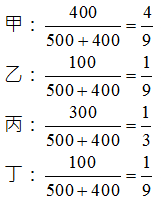

## 516. 發展權
*發布日期: 2021-01-28* 

## 內文
• (一) 發展權國有與發展權私有發展權，指在土地上從事興建發展之權利。發展權歸屬，分為發展權國有與發展權私有二種。

1. 發展權國有：指發展權屬於公共領域，歸屬國家所有。如英國曾實施「發展權國有」，此發展權為國有。

2. 發展權私有：指發展權屬於私人領域，歸屬私人所有。如美國曾實施「發展權移轉」，此發展權為私有。

• (二) 容積移轉、容積獎勵及容積代金國外之發展權相當於我國之容積（容積是由建蔽率、容積率、建物高度等構成）。目前我國實施之容積移轉、容積獎勵及容積代金，其容積性質不同，茲分述如下：

1. 容積移轉：公共設施保留地、古蹟等土地所有人將其土地之容積，買賣移轉至其他可建築土地供建築使用，俾使限制發展之土地獲得合理補償。準此，容積移轉之容積，屬於私人領域，故發展權（即容積）私有。詳如都市計畫容積移轉實施辦法、古蹟土地容積移轉辦法等。

2. 容積獎勵：政府將屬於公共領域之容積，贈與私人，以鼓勵特定土地使用（如都市更新、危老重建等），落實外部利益內部化。準此，容積獎勵之容積，原屬於公共領域，故發展權（即容積）國有。詳如都市更新建築容積獎勵辦法、臺北市建築物增設室內公用停車空間供公眾使用鼓勵要點等。

3. 容積代金：私人向政府購買屬於公共領域之容積，以提高其土地使用強度。政府再將其收入，專款專用，用於取得公共設施保留地。準此，容積代金之容積，原屬於公共領域，故發展權（即容積）國有。詳見都市計畫容積移轉實施辦法第9條之1。

• (三) 分區管制與發展權之關係都市土地使用分區管制是在界定私人財產權範圍，允許私人擁有土地既有發展權（即現行土地使用類別及土地使用強度），至於未來發展權（即超過分區管制部分）置於公共領域，屬於國家所有。發展權界定清楚後，藉著市場力量，達到土地資源最有效率之配置。都市土地使用分區管制是新制度經濟學所稱之「制度」。制度就是遊戲規則，具有可預測性，可以避免不確定性，有效降低交易成本，使得土地資源更有效率之配置。

• (四) 平均地權、發展權國有及分區管制之產權構想平均地權制度以「地價」劃分公私有財產，發展權國有制度以「發展權」劃分公私有財產，分區管制制度以「容積」劃分公私有財產，三者有異曲同工之妙。

1. 平均地權制度：孫中山先生提出之「平均地權」制度，以規定地價（地價永以為定）劃分私有財產與公有財產之界線。規定地價以前之地價歸屬私有財產，規定地價以後之漲價歸屬公有財產。

2. 發展權國有制度：英國實施之「發展權國有」制度，以實施日劃分私有財產與公有財產之界限。實施日以前，已在土地上發展之權利歸屬私有財產；實施日以後，未來在土地上發展之權利歸屬公有財產。

3. 分區管制制度：我國實施之「分區管制」制度，以容制管制劃分私有財產與公有財產之界線。土地既有之容積歸屬私有財產，土地未來增加之容積歸屬公有財產。
---
*注：本文圖片存放於 ./images/ 目錄下*

## 517. 土地徵收完全補償與相當補償之差異
*發布日期: 2021-01-28* 

## 內文
各位同學好

土地徵收補償除了填補特定人因土地徵收所受損害，另有調合公私益衝突之作用。學術理論上有三說，茲比較如下表所示：

• T. ABLE_PLACEHOLDER_1

資料來源：陳立夫；溫豐文；楊松齡；魏均芸
---
*注：本文圖片存放於 ./images/ 目錄下*

## 518. 雙地政士制
*發布日期: 2021-01-21* 

## 內文
各位同學好

今日專欄為各位說明有關雙地政士制度：

以往習慣多僅由買方單獨委託一名地政士代理買賣案件，但時常發生地政士聯合買方詐騙賣方之情形，為避免發生此情形，買賣雙方在交易過程中，能夠各找一位他們能信任的合法專業地政士，即雙地政士，共同來參與契約制訂及買賣流程的溝通，除保障不動產買賣雙方當事人權益，相互監督箝制，同時也能避免過程中的錯誤，以及增進不動產交易效率。

雙地政士指交易案件之當事人為雙方或多方，同時各自委託地政士執行業務，合力完成案件。其中，分為主與從，主辦地政士指不動產交易時，主辦交易相關事宜之地政士。其主辦事項，以買賣為例，如產權調查、撰寫契約、核章用印、證件之保管與交付、申報稅捐、申請登記、控管履約等事項。至於協辦地政士則依其委託人之指示，秉其專業，進行查調產權、追蹤查核案件之地政士。

參考：中華民國地政士公會全國聯合會，107.12.14，雙地政士制度執行業務準則
---
*注：本文圖片存放於 ./images/ 目錄下*

## 519. 共有土地之分割與合併（下）
*發布日期: 2021-01-21* 

## 內文
• (三) 土地法第34條之1多數決：

1. 共有土地分割：茲分標示分割與權利分割分別說明：

1. 標示分割：標示分割屬於土地法第34條之1第1項所稱「變更」，故標示分割得適用土地法第34條之1多數決。

2. 權利分割：權利分割雖屬處分行為，惟多數人代理少數人決定分割後所分配之土地位置，難謂公平合理；況共有土地無法協議分割，尚得聲請法院裁判分割。因此，權利分割不得適用土地法第34條之1多數決。

2. 共有土地合併：土地法第三十四條之一執行要點第5點第1項規定：「共有土地或建物標示之分割、合併、界址調整及調整地形，有本法條之適用。」準此，共有土地之合併得適用土地法第34條之1多數決

二宗以上所有權人不相同之共有土地或建物，依土地法第34條之1規定申請合併，應由各宗土地或建物之共有人分別依土地法第34條之1規定辦理（土地法第三十四條之一執行要點第5點第2項）。又，申請合併之共有土地地價不一者，合併後各共有人之權利範圍，應以合併前各共有人所有土地之地價與各宗土地總地價之和之比計算，並不得影響原設定之他項權利（土地法第三十四條之一執行要點第8點第7款）。如甲、乙、丙三人共有一筆A地，應有部分各三分之一，A地公告土地現值300萬元，丁、戊二人共有一筆B地，丁之應有部分四分之三，戊之應有部分四分之一，B地公告土地現值400萬元。今擬將A地與B地合併為一筆C地，甲、乙、丁三人同意，丙、戊二人反對，則A地之同意共有人數超過二分之一，應有部分超過二分之一，符合土地法第34條之1第1項多數決門檻；B地之同意共有人應有部分超過三分之二，人數不計算，亦符合土地法第34條之1第1項多數決門檻。因此，A地與B地之合併得適用土地法第34條之1多數決。合併後之C地應有部分如下：[圖片1]

上例之合併，依土地稅法施行細則第42條第4項規定，不徵土地增值稅。總之，共有土地合併，不論標示合併或權利合併，皆得適用土地法第34條之1多數決。惟合併後各共有人之權利範圍，應以合併前各共有人所有土地之地價與各宗土地總地價之和之比計算。

## 文章圖片

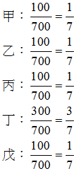

## 520. 視為已依土地法辦理土地總登記
*發布日期: 2021-01-14* 

## 內文
土地總登記，謂於一定期間內就直轄市或縣(市)土地之全部為土地登記(土§38)。土地總登記為所謂第一次登記，必先為總登記後，始得為移轉登記(46判第64號)，故當初台灣光復後，政府即劃設登記區，要求土地權利人於一定期間內，要辦理土地總登記，其目的在於查明並確定土地權利，建立地籍管理基礎，以利國家建設，推行土地政策，以及維護社會交易安全。

然而，土地法施行前，業經辦竣土地登記之地區，在土地法施行後，於期限內換發土地權利書狀，並編造土地登記總簿者，視為已依土地法辦理土地總登記(土施§11)，此又為何意？

主要因台灣於日據時期，日本政府即曾實施地籍測量與土地登記，地籍資料已有基礎，而於民國34年10月12日台灣光復，土地登記自該日起即依照我國民法、土地法等法律開始施行。故日據時期的測量與登記屬於「土地法施行前業經辦竣土地登記者」，這些已辦竣登記的地區且有相關權利憑證，為節省總登記辦理時間，實際上只要確認他權利憑證無誤，就算可證明其土地權利，而不需要跑土地總登記的流程。

因此，於35年11月26日經行政院通過「台灣地籍釐正辦法」，為台灣釐整地籍之依據，其中，第4條規定，在光復前日本政府已辦不動產登記之區域，不動產權利人應將所持登記證書（日本法院所發之不動產登記濟證、各州廳所發關係該土地之謄本、最近三年內任何一年地租收據）向主管地政機關繳驗，經審查公告無異議後，換發土地所有權狀，或他項權利證明書，並編造登記簿。……依照第一項規定，換發土地權利書狀之地區，視為已依土地法辦理土地總登記。」而後於36年5月2日發布「台灣省土地權利憑憑證及換發權利書狀辦法」，規範如何換發權狀。

政府即根據土地法及上開兩種辦法，就日據時期已辦竣不動產登記或未登記而經地籍測量登錄於土地台帳之公私有土地，開始辦理土地權利憑證繳驗申報，由縣市地政機關經過收件、審查、公告等法定程序後，隨即據以登記，編造土地登記總簿，並於36年7月起換發權利書狀，作為權利人之權利憑證。此稱為「視為已依土地法辦理土地總登記」。
---
*注：本文圖片存放於 ./images/ 目錄下*

## 521. 共有土地之分割與合併（中）
*發布日期: 2021-01-14* 

## 內文
• (二) 土地增值稅：一般而言，標示變更登記應先申請土地複丈，所有權移轉登記應先繳納土地增值稅。

1. 共有土地分割：共有土地分割如僅涉及標示變更，不徵土地增值稅。但如涉及權利變更，土地增值稅課徵規定如下：

1. 分別共有土地分割後，各人所取得之土地價值與其分割前應有部分價值相等者，免徵土地增值稅。土地價值之計算，以共有土地分割時之公告土地現值為準（土地稅法施行細則第42條第2項及第5項）。

2. 分別共有土地分割後，各人所取得之土地價值與其分割前應有部分不相等者，其價值減少，就其減少部分課徵土地增值稅（土地稅法施行細則第42條第2項）。其納稅義務人（司法院釋字第173號）如下：

1. 共有土地之分割，共有人因分割所取得之土地價值，與依其應有部分所算得之價值較少而未受補償時，自屬無償移轉之一種，應向取得土地價值增多者，就其增多部分課徵土地增值稅。

2. 共有土地之分割，共有人因分割所取得之土地價值，與依其應有部分所算得之價值較少而受有補償時，自屬有償移轉之一種，應向取得土地價值減少者，就其減少部分課徵土地增值稅。

2. 共有土地合併：共有土地合併，雖僅辦理標示變更登記，其土地增值稅課徵規定如下

1. 土地合併後，各共有人應有部分價值與其合併前之土地價值相等者，免徵土地增值稅。土地價值之計算，以土地合併時之公告土地現值為準（土地稅法施行細則第42條第4項及第5項）。

2. 土地合併後，各共有人應有部分價值與其合併前之土地價值不相等者，其價值減少，就其減少部分課徵土地增值稅（土地稅法施行細則第42條第4項）。其納稅義務人（司法院釋字第173號）如下：

1. 土地合併後，共有人應有部分價值，與依其合併前之土地價值減少而未受補償時，自屬無償移轉之一種，應向取得應有部分價值增多者，就其增多部分課徵土地增值稅。

2. 土地合併後，共有人應有部分價值，與依其合併前之土地價值減少而受有補償時，自屬有償移轉之一種，應向取得應有部分價值減少者，就其減少部分課徵土地增值稅。
---
*注：本文圖片存放於 ./images/ 目錄下*

## 522. 共有土地之分割與合併（上）
*發布日期: 2021-01-07* 

## 內文
茲分土地登記、土地增值稅及土地法第34條之1多數決等三方面說明。

• (一) 土地登記：

1. 共有土地分割：共有土地分割如涉及標示變更（即標示分割）及權利變更（即權利分割），應先辦理標示變更登記，再辦理所有權移轉登記。如甲、乙二人共有一筆A地，應有部分各二分之一，今擬將A地分割為B地及C地，B地歸甲所有，C地歸乙所有。辦理過程如下：

[圖片1]

首先，申請土地複丈，將A地一筆地號分割為B地與C地二筆地號，並辦理標示變更登記。辦竣後，B地及C地之權利範圍分別為甲應有部分二分之一，乙應有部分二分之一。接著，辦理所有權移轉登記，B地之乙的二分之一移轉於甲，C地之甲的二分之一移轉於乙。最後，甲取得B地之所有權全部，乙取得C地之所有權全部。綜上，共有土地分割如涉及標示變更及權利變更，應分兩階段辦理登記。亦即，先辦理標示變更登記，再辦理所有權移轉登記（詳土地登記規則第105條）。須注意者，共有土地分割如僅涉及標示變更而未涉及權利變更，則僅辦理標示變更登記；如僅涉及權利變更，而未涉及標示變更，則僅辦理所有權移轉登記。

2. 共有土地合併：共有土地合併，不問有無涉及權利變更，僅辦理標示變更登記。如甲、乙二人共有一筆A地，應有部分各二分之一，丙、丁、戊三人共有一筆B地，應有部分各三分之一，今擬將A地與B地合併為C地，應有部分各五分之一。辦理過程如下：

[圖片2]

上例，共有土地合併涉及標示變更（即標示合併）及權利變更（即權利合併），因無法分兩階段辦理登記，故僅辦理標示變更登記，無須辦理所有權移轉登記。

## 文章圖片

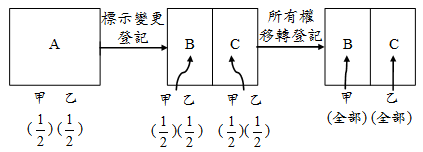

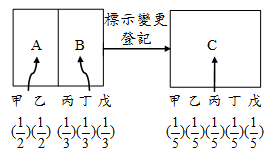

## 523. 預售屋買賣定型化契約應記載及不得記載事項部分規定修正整理
*發布日期: 2021-01-07* 

## 內文
各位同學好

本日專欄為各位說明有關109年12月25日內政部修正「預售屋買賣定型化契約應記載及不得記載事項部分規定」，其中涉及土地持分面積計算之內容：

※原本規定：壹、應記載事項四、房地出售面積及認定標準(一)土地面積：買方購買「＿」＿戶，其土地持分面積＿平方公尺(＿坪)，應有權利範圍為＿，計算方式係以主建物面積＿平方公尺(＿坪)占區分所有全部主建物總面積＿平方公尺(＿坪)比例計算(註：如有停車位應敘明車位權利範圍或以其他明確計算方式列明)，如因土地分割、合併或地籍圖重測，則依新地號、新面積辦理所有權登記。

※修正規定：壹、應記載事項四、房地出售面積及認定標準(一)土地面積：買方購買「＿」＿戶，其土地持分面積＿平方公尺（＿坪），應有權利範圍為＿，計算方式係以專有部分面積＿平方公尺（＿坪）占區分所有全部專有部分總面積＿平方公尺（＿坪）比例計算（註：或以其他明確之計算方式列明），如因土地分割、合併或地籍圖重測，則依新地號、新面積辦理所有權登記。

根據民法第799條第4項規定：「區分所有人就區分所有建築物共有部分及基地之應有部分，依其專有部分面積與專有部分總面積之比例定之。但另有約定者，從其約定。」惟其計算基地應有部分權利之基礎，為「區分所有人之專有部分面積」，並不包含因購買約定專用而取得之「專用權」面積部分，例如購買地下室法定停車位之專用權，由於專用權人並未額外取得區分所有建築物之專有部分，自無從就該約定專用部分，主張依民法第七百九十九條第四項規定分配基地權利範圍，為避免就購買共有部分之停車位誤解得主張再行分配登記土地權利範圍，爰刪除第一款「如有停車位應敘明車位權利範圍」。

簡單來說，區分所有權人某甲之土地持分，應以其「專有部分」（包含主建物與附屬建物）佔全部區分所有建物專有部分的比例計算，而預售物的法定停車位是以共有部分登記，購買後屬於約定專有，僅取得專用權，非取得專有部分而不會有獨立權狀，故不會因為某甲多買幾個車位，其土地持分就跟著變多。
---
*注：本文圖片存放於 ./images/ 目錄下*

## 524. 不動產所有權移轉之預告登記
*發布日期: 2020-12-31* 

## 內文
優先購買權分為意定優先購買權與法定優先購買權二種。前者係由當事人約定成立之優先購買權，後者係由法律明文規定之優先購買權（如土地法第34條之1第4項、第104條、第107條等是）

意定優先購買權僅具有債權效力，而無物權效力。不動產所有權移轉之預告登記，其作用係將意定優先購買權之債權效力提升為物權效力。換言之，未經預告登記之意定優先購買權不得對抗第三人，經預告登記之意定優先購買權得以對抗第三人。

總之，預告登記屬於債權登記，藉由登記達成債權物權化之效果。
---
*注：本文圖片存放於 ./images/ 目錄下*

## 525. 土地徵收補償
*發布日期: 2020-12-31* 

## 內文
本次地特三等考題第四題，本次專欄予以解析之。

甲於民國85年與乙合意，就乙所有之A地設定地上權登記完竣；之後，甲於A地上建築合法房屋一棟，嗣又在A地其餘空地上增建違建房屋一棟及種植果樹多棵。最近，A地經都市計畫個案變更，被劃定為道路預定地，並即將開闢道路。試問：當主管機關不得已而有必要採行徵收方式取得A地所有權以開闢道路時，依土地徵收條例之規定，關於甲之地上權及其於A地上所有之房屋與果樹應如何處理之？

擬答：

• 一、甲之地上權根據土地徵收條例第36條規定，被徵收之土地或建築改良物原設定之他項權利因徵收而消滅。其款額計算，該管直轄市或縣(市)主管機關應通知當事人限期自行協議，再依其協議結果代為清償；協議不成者，其補償費依第26條規定辦理（予以提存）。因此，甲之地上權應先由乙與甲協議並依協議結果由縣市主管機關代為清償，協議不成的話，則予以提存。

• 二、A地合法房屋一棟首先，根據土地徵收條例第5條第1項，徵收土地時，其土地改良物應一併徵收。其次，土地徵收條例第31條第1項則規定，建築改良物之補償費，按徵收當時該建築改良物之重建價格估定之。因此，甲之A地合法房屋一棟，應予一併徵收，並按徵收當時重建價格予以補償。

• 三、A地違章房屋一棟依土地徵收條例第5條第1項第3款規定，建築改良物建造時，依法令規定不得建造者，不予一併徵收。因此，違章房屋依建築法令規定不許存在，應予拆除，故非屬徵收標的範圍，該建築改良物之所有權人就建築改良物之本身，並無正當之繼續存在利益，並非憲法第15條保障之財產權，其因徵收而被拆除，係維持法秩序應然結果，而無所有權特別犧牲之問題。因此，該違章房屋得先由甲先行拆遷，縣市有自動拆遷獎勵金（屬獎勵性質，非屬徵收補償）；如不拆遷者，則逕予拆除，且不核給徵收補償。

• 四、A地之果樹多棵首先，根據土地徵收條例第5條第1項，徵收土地時，其土地改良物應一併徵收。再者，土地徵收條例第31條第2項規定，農作改良物之補償費，於農作改良物被徵收時與其孳息成熟時期相距在一年以內者，按成熟時之孳息估定之；其逾一年者，按其種植及培育費用，並參酌現值估定之。因此，A地果樹以被徵收時與其孳息成熟時期相距一年以內或外予以判斷，一年以內，按成熟時之孳息估定補償；一年以外，則按種植及培育費用，並參酌現值估定補償之。此外，倘若農作改良物之種類或數量與正常種植情形不相當者，其不相當部分將不予一併徵收。
---
*注：本文圖片存放於 ./images/ 目錄下*

## 526. 三類謄本申請資格
*發布日期: 2020-12-24* 

## 內文
此次地特四等有考到三類謄本，今日專欄即說明有關土地登記三類謄本之申請資格：

第一類：登記名義人或其他依法令得申請者例如：因強制執行事件或法院訴訟需要，持憑法院通知文件者

第二類：任何人

第三類：登記名義人、具有法律上通知義務或權利義務得喪變更關係之利害關係人例如：

• (一) 依土地法第三十四條之一規定就共有不動產處分、變更或設定地上權、農育權、不動產役權或典權之共有人：得申請同一地(建)號之他共有人之謄本，並檢附切結書或契約書正本。但區分所有建物之基地為共有者，不適用之。

• (二) 依民法第八百二十三條第一項或第八百二十四條第一項規定請求分割共有不動產之共有人：得申請同一地(建)號之他共有人之謄本，並檢附切結書正本。但區分所有建物之基地為共有者，不適用之。

• (三) 依民法第四百二十六條之二、第九百十九條或土地法第一百零四條規定出賣基地或房屋之所有權人：基地所有權人，得申請建物所有權人、地上權人、典權人之謄本，並檢附買賣契約書正本；房屋所有權人，得申請基地所有權人之謄本，並檢附最近一期之房屋稅繳款書、稅籍證明或設籍之戶籍證明文件等及買賣契約書正本。但房屋已辦理登記者，僅檢附買賣契約書正本。

• (四) 依農地重劃條例第五條規定出售耕地之所有權人：得申請同一地號之他共有人、毗連耕地之所有權人之謄本，並檢附買賣契約書正本。

• (五) 公寓大廈管理委員會主任委員或管理負責人：得申請同一公寓大廈所有權人之謄本，並檢附主管機關同意備查文件(有註明主任委員或管理負責人者)及公寓大廈管理組織報備證明或其他足資證明之文件正本，於申請書並應載明執行之法令依據。

• (六) 都市更新單元內所有權人、都市更新籌備會（小組）代表人或（預定）實施者：得申請同一更新單元範圍內及其毗鄰土地之所有權人之謄本，並依下列規定辦理：

1. 所有權人：檢附擬劃定或已劃定更新單元內土地及建物登記簿所載所有權人數均超過十分之一之所有權人同意書或所持有土地及建物面積均超過總登記面積十分之一之所有權人同意書（載明更新單元範圍、土地及建物登記面積及全體土地及建物所有權人數）。

2. 都市更新籌備會(小組)代表人：檢附直轄市、縣(市)主管機關核准籌組文件正本，並載明更新單元範圍。

3. 都市更新（預定）實施者：檢附受各級主管機關委託之委託書、都市更新會立案證書、都市更新事業概要核准文件（有註明預定實施者）或都市更新事業計畫核定文件正本，並載明更新單元範圍。

• (七) 債權人：得申請債務人之謄本，並檢附法院核發之債權憑證正本。但已設定抵押權者，免附債權憑證正本。

• (八) 訴訟繫屬中之當事人：得申請相對人之謄本，並檢附法院發給已起訴證明等相關證明文件正本。

• (九) 其他經目的事業主管機關或登記機關認定具有法律上通知義務或權利義務得喪變更之關係者：得申請相對人之謄本，並檢附相關證明文件正本。

參考資料：核發土地登記及地價資料謄本注意事項
---
*注：本文圖片存放於 ./images/ 目錄下*

## 527. 未辦竣登記再轉手買賣之處罰及稅負
*發布日期: 2020-12-24* 

## 內文
土地買賣未辦竣權利移轉登記，承買人再行出售該土地，其處罰及稅負如下：

• (一) 處罰：土地未辦竣移轉登記，承買人再轉手出售給第三人，分別由地政機關與稅捐機關予以處罰：

1. 地政機關：土地買賣未辦竣權利移轉登記，承買人再行出售該土地者，處應納登記費二十倍以下之罰鍰（平均地權條例第81條）。地政機關處罰其未辦理登記，以貫徹強制登記之目的。

2. 稅捐機關：土地買賣未辦竣權利移轉登記，再行出售者，處再行出售移轉現值百分之二之罰鍰（土地稅法第54條第2項）。稅捐機關處罰其逃漏土地增值稅，以貫徹人民納稅之義務。

• (二) 稅負：土地買賣未辦竣移轉登記，承買人再轉手出售給第三人。承買人所出售的是「權利」（即土地登記請求權），並非「土地」。承買人所獲取利益為出售「權利」之所得，並非出售「土地」之所得。因此，不徵土地增值稅及房地合一所得稅，但應課徵綜合所得稅。
---
*注：本文圖片存放於 ./images/ 目錄下*

## 528. 說明登記對抗主義的意義及情形
*發布日期: 2020-12-17* 

## 內文
• (一) 債權約定物權化(內部關係公示化)：

1. 分管約定或決定：不動產共有人間關於共有物使用、管理、分割或禁止分割之約定或依第八百二十條第一項規定所為之決定，於登記後，對於應有部分之受讓人或取得物權之人，具有效力。(民§826-1)

2. 流抵約定：約定於債權已屆清償期而未為清償時，抵押物之所有權移屬於抵押權人者，非經登記，不得對抗第三人。(民§873-1)

3. 絕賣條款：典權附有絕賣條款非經登記，不得對抗第三人。(民§913II)

4. 信託登記：以應登記或註冊之財產權為信託者，非經信託登記，不得對抗第三人。(信§4)

• (二) 用益物權設定目的及使用方法登記：

1. 地上權(民§836-2)：地上權人應依設定之目的及約定之使用方法，為土地之使用收益；未約定使用方法者，應依土地之性質為之，並均應保持其得永續利用。前項約定之使用方法，非經登記，不得對抗第三人。

2. 農育權(民§850-3)：農育權準用民§836-2。

3. 不動產役權(民§859-2)：不動產役權準用民§836-2。

• (三) 事實行為登記：

1. 地上權(民§836-1)：土地所有權讓與時，已預付之地租，非經登記，不得對抗第三人。

2. 農育權(民§850-9)：農育權準用民§836-1。

3. 不動產役權(民§859-2)：不動產役權準用民§836-1。
---
*注：本文圖片存放於 ./images/ 目錄下*

## 529. 預售屋轉售之稅負
*發布日期: 2020-12-17* 

## 內文
一般房地出售應繳納土地增值稅、契稅及房地合一所得稅。然，民眾購買預售屋，在尚未辦理產權登記前，轉手再出售於第三人，其所出售的是「權利」（指不動產登記請求權），並非「房地」；所獲取利益為出售「權利」之所得，並非出售「房地」之所得。因此，預售屋轉售不徵土地增值稅、契稅及房地合一所得稅，而是課徵綜合所得稅。

最近，房地產回溫，部分地區炒作「紅單交易」。紅單轉售之稅負同上。
---
*注：本文圖片存放於 ./images/ 目錄下*

## 530. 土地登記損害賠償
*發布日期: 2020-12-10* 

## 內文
土地法第68條第1項規定：「因登記錯誤遺漏或虛偽致受損害者，由該地政機關負損害賠償責任。但該地政機關證明其原因應歸責於受害人時，不在此限。」準此，倘造成損害之原因可歸責於受害人，地政機關不負賠償責任；倘造成損害之原因不可歸責於受害人，地政機關應單獨負起無過失賠償責任。茲舉例說明如下：

• (一) 損害之原因可歸責於受害人：詐騙集團甲謊稱可以高額貸款，乙遂將其土地權狀、印鑑章及身分證等文件交付於甲辦理貸款，甲擅將其土地出售於善意之丙；甲取得價款後，不知去向。此時，丙依土地法第43條取得土地所有權，不受影響。受害人乙不應將土地權狀、印鑑章及身分證等文件交付於甲，故損害之原因可歸責於受害人，地政機關不負損害賠償責任。

• (二) 損害之原因不可歸責於受害人：乙長年旅居國外，詐騙集團偽造乙之相關證件，將乙之土地出售於善意之丙；甲取得價款後，不知去向。此時，丙依土地法第43條取得土地所有權，不受影響。受害人乙之土地權狀、印鑑章及身分證等文件均妥為保管，未交付給任何人，故損害原因不可歸責於受害人，地政機關應負損害賠償責任。
---
*注：本文圖片存放於 ./images/ 目錄下*

## 531. 策略性更新地區
*發布日期: 2020-12-10* 

## 內文
今日專欄為各位整理有關策略性更新地區之相關概念

首先，請各位同學參考下列新聞：新北市中和區保二總隊都更案招商 全國首件策略性都更案【新聞來源：中時新聞網】（由新北市政府同意國家住都中心自行實施或經公開評選委託都市更新事業機構為實施者，實施都市更新事業）

• 一、劃定目的策略性更新地區內之都市更新事業計畫面積達一定規模以上者，得突破現行都市更新容積獎勵限制，對於促進都市更新事業，達成都市土地有計畫之再開發利用、復甦都市機能、改善居住環境、增進公共利益之目標。

• 二、劃定地區根據都市更新條例第8條規定，有下列各款情形之一時，各級主管機關得視實際需要，劃定或變更策略性更新地區，並訂定或變更都市更新計畫(都更§8)：(1)位於鐵路場站、捷運場站或航空站一定範圍內。（中和保二總隊即依此款劃定）(2)位於都會區水岸、港灣周邊適合高度再開發地區者。(3)基於都市防災必要，需整體辦理都市更新者。(4)其他配合重大發展建設需要辦理都市更新者。

• 三、容積獎勵依據都市更新條例第65條第1項後段，各級主管機關依第八條劃定或變更策略性更新地區，屬依第十二條第一項規定方式辦理（公辦都更），且更新單元面積達一萬平方公尺以上者，其獎勵後之建築容積不得超過各該建築基地二倍之基準容積或各該建築基地零點五倍之基準容積再加其原建築容積，不受都市計畫法第八十五條所定施行細則基準容積加計增加建築容積總和上限之限制。
---
*注：本文圖片存放於 ./images/ 目錄下*

## 532. 代理申辦土地登記
*發布日期: 2020-12-03* 

## 內文
今日專欄談有關代理他人申辦土地登記之限制：

• 一、非地政士能否代理他人申辦土地登記？

可以。若非取得開業執照之地政士或律師，亦可代理他人辦理案件，但會有次數的限制。非地政士同1年內於同一登記機關申請超過2件，或曾於同一登記機關申請超過5件，登記機關應不予受理，但其權利人與義務人與前案相同者，不在此限（內政部102年12月27日內授中辦地字第1026652564號令）。非地政士代理送件時，應於登記申請書備註欄簽註切結下列事項：委託人切結：「本人未給付報酬予代理人，如有虛偽不實，願負法律責任。」；代理人切結：「本人並非以代理申請土地登記為業，且未收取報酬，如有虛偽不實，願負法律責任。」並由委託人及代理人分別簽章。

• 二、誰得以代理他人登記為業？

地政士與律師。依據地政士法第16條規定，地政士得執行代理申請土地登記事項。此外，律師法第20條第2項規定：「律師得辦理商標、專利、工商登記、土地登記及其他依法得代理之事務。」；另依內政部86年4月14日台(86)內地字第8675020號函頒「律師辦理土地登記代理業務聯繫要點」第1點規定：「律師依律師法第20條第2項之規定向地政機關申辦土地登記代理業務時，應親自到場，並出示律師公會會員證供地政機關收件人員核對。」。是以，律師自可依上開規定向地政機關代理申辦土地登記案件。
---
*注：本文圖片存放於 ./images/ 目錄下*

## 533. 房地交易所得稅計算實例
*發布日期: 2020-12-03* 

## 內文
甲於民國108年10月3日買入一間房地，買賣價格1,000萬元，甲隨即於民國109年5月15日賣出該房地，買賣價格1,200萬元。甲於買入時繳交契稅24萬元及印花稅0.4萬元，持有期間繳交工程受益費5萬元，賣出時繳交土地增值稅10萬元（土地漲價總數額50萬元，土地增值稅率20%，50x20%=10）。試問甲出售該房地應繳納多少房地交易所得稅？

【解答】

• (一) 房地交易所得：(1,200–1,000)–24–0.4–5–1,200x5%-50=60.6

• (二) 房地交易所得稅：民國108年10月至民國109年5月，持有期間7個月，稅率45%。60.6x45%=27.27答：甲應繳納房地交易所得稅27.27萬元。
---
*注：本文圖片存放於 ./images/ 目錄下*

## 534. 需求曲線後彎（需求法則例外的幻覺）
*發布日期: 2020-11-26* 

## 內文
我的台中土地經濟學課程即將於下週日開課，有興趣同學歡迎來聽看看。今日專欄為各位說明有關需求曲線後彎的情形，而經濟學則認為這是一種需求法則例外的幻覺：

當地價快速上漲，土地投機盛行，買方預期價格會持續上漲，故反而追漲不追跌，使需求線往右移動，而如果右移幅度夠大，則價格提高反而帶來更多需求量，使結果看起來像是需求法則的例外情況，類似季芬財（Giffen goods）現象。

以下圖為例，在D需求線上，當地價由Pa上升至Pb，土地需求量理應由Qa減至Qb，但若消費者預期價格上漲，而使需求線由D右移至D1，則對應於Pb，需求量反而增加為Qc。從事後結果來看(a點移動至c點)，[圖片1]線段似乎為正斜率的需求線。但實際上，[圖片2]並不是需求線，只是不同需求線上的點，移動所形成的價量軌跡。

[圖片3]

## 文章圖片

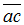

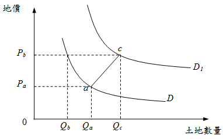

## 535. 不動產合併得否適用土地法第34條之1第1項之多數決
*發布日期: 2020-11-26* 

## 內文
不動產合併為不動產分割之反向行為，故應與不動產分割適用土地法第34條之1第1項類似。

不動產合併有權利合併與標示合併之分。茲分述如下：

• (一) 權利合併：屬於土地法第34條之1第1項之「處分」，然各共有人合併後所得到之應有部分，難以公平合理；況所有權人不同時，應檢附全體所有權人協議書（地籍測量實施規則第224條第2項第1款）。因此，土地法第34條之1第1項之處分，不包括權利合併。換言之，權利合併不得適用土地法第34條之1第1項之多數決。

• (二) 標示合併：非屬於土地法第34條之1第1項之「處分」，但屬於土地法第34條之1第1項之「變更」。因此，標示合併得適用土地法第34條之1第1項之多數決。
---
*注：本文圖片存放於 ./images/ 目錄下*

## 536. 交換不適用土地法第34條之1多數決
*發布日期: 2020-11-19* 

## 內文
以往部分文章提到共有物與他人土地交換得適用多數決辦理，惟根據內政部109年8月6日台內地字第1090129832號函，認為共有人以交換為原因辦理所有權移轉登記無土地法第34條之1第1項規定之適用，其理由如下，同學們記得準備：

1. 交換土地或建物而移轉所有權，性質上屬處分行為（物權行為）。惟倘由多數共有人代理少數共有人約定以土地或建物所有權相互交換，其交換位置及條件等決定難謂合理，且本法條於交換未設有優先購買權之衡平機制，勢必侵害少數共有人權益，未能符合財產權保障之要求。

2. 又於交換所有權移轉登記後，該共有關係仍維持於相互移轉後所取得之共有不動產標的上，亦與本法係為解決共有不動產糾紛之目的未合。

因此，共有人以交換為原因辦理所有權移轉登記自無本法條第1項規定之適用，依民法第819條第2項及第828條第3項規定，應經共有人全體同意。
---
*注：本文圖片存放於 ./images/ 目錄下*

## 537. 紅單交易
*發布日期: 2020-11-19* 

## 內文
何謂「紅單交易」？政府如何遏止紅單交易？

【解答】

• (一) 紅單交易之意義：建設公司擬推出之預售案，在尚未取得建造執照前，由購屋者支付一筆定金，取得購屋優先權。

• (二) 遏止之道

1. 裁罰業者：依公寓大廈管理條例第58條第1項規定：「公寓大廈起造人或建築業者，非經領得建造執照，不得辦理銷售。」準此，建設公司尚未領得建造執照而從事紅單交易，主管機關得處新台幣4萬元以上20萬元以下罰鍰，並得限期改善；屆期不改善者，得連續處罰。

2. 追查漏稅：購屋者之紅單轉手所得，如未確實申報綜合所得，補稅重罰。

3. 專案稽查：聯合地政單位、財稅單位、消保單位等，針對預售個案進行專案稽查，除稽查紅單交易外，尚包括買賣契約書是否違反定型化契約之規定、代銷營業處所是否違反不動產經紀業管理條例之規定、廣告是否有誇大不實等。
---
*注：本文圖片存放於 ./images/ 目錄下*

## 538. 土地法第34條之1實例研習(二)
*發布日期: 2020-11-12* 

## 內文
甲、乙、丙三人共有一筆土地，應有部分各三分之一。之後，丙死亡，由A、B、C、D、E五人公同共有繼承，應繼分各五分之一。今，甲、A、B、C四人同意出售該地於丁，但乙、D、E三人反對，則出售是否可行？

【解答】

土地法第34條之1第1項規定：「共有土地或建築改良物，其處分、變更及設定地上權、農育權、不動產役權或典權，應以共有人過半數及其應有部分合計過半數之同意行之。但其應有部分合計逾三分之二者，其人數不予計算。」又，土地法第三十四條之一執行要點第6點第3項規定：「分別共有與公同共有併存之土地或建物，部分公同共有人已得依本法條規定處分其公同共有之應有部分，且另有分別共有之共有人同意處分全部共有物者，於計算本法條第一項共有人數及其應有部分時，該公同共有部分，以同意處分之人數及其潛在應有部分併入計算。」準此，甲、A、B、C四人同意，但乙、D、E三人反對，同意之共有人數為[圖片1]，已逾半數，且同意之應有部分與潛在應有部分（指應繼分）為[圖片2]，已逾半數，故出售可行。

## 文章圖片

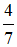

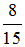

## 539. 開發影響費與國土保育費、影響費之比較
*發布日期: 2020-11-12* 

## 內文
剛好有同學問到區域計畫法下非都市土地使用管制之開發影響費，與國土計畫法之國土保育費、影響費的差異，本週專欄整理如下表，供同學們參考：

• T. ABLE_PLACEHOLDER_1
---
*注：本文圖片存放於 ./images/ 目錄下*

## 540. 出售農地是否需要課徵房地合一所得稅？
*發布日期: 2020-11-05* 

## 內文
根據所得稅法第4條之5規定，房屋、土地有下列情形之一者，免納所得稅：

• (一) 個人與其配偶及未成年子女符合下列各目規定之自住房屋、土地：

1. 個人或其配偶、未成年子女辦竣戶籍登記、持有並居住於該房屋連續滿六年。(繼承或受遺贈取得者，得將被繼承人或遺贈人持有期間合併計算)

2. 交易前六年內，無出租、供營業或執行業務使用。

3. 個人與其配偶及未成年子女於交易前六年內未曾適用本款規定。

其免稅所得額，以按第十四條之四第三項規定計算之餘額不超過四百萬元為限，計算之餘額超過四百萬元部分，稅率為百分之十。

※立法目的：保障自住需求，落實居住正義，規定符合自住條件定額免稅、超額減徵。

• (二) 符合農業發展條例第三十七條及第三十八條之一規定得申請不課徵土地增值稅之土地。

※立法目的：為配合農業政策鼓勵農地作農業使用之減免規定，故移轉土地得申請不課徵土地增值稅須以「作農業使用」為要件。

• (三) 被徵收或被徵收前先行協議價購之土地及其土地改良物。

※立法目的：鼓勵民間配合政府基於政策目的推動之土地開發及徵收政策。

• (四) 尚未被徵收前移轉依都市計畫法指定之公共設施保留地。

※立法目的：衡平公共設施保留地之權益。

依據前列第二款規定，農地無論是否申請適用不課徵土地增值稅，均應先向公所申請「農業用地作農業使用證明書」或「符合農發條例第38條之1土地作農業使用證明書」後，以佐證農地移轉時確係供作農業使用，俾符合得申請不課徵土地增值稅而免徵房地合一稅。

因此，出售農地如符合農用要件，則免納房地合一所得稅；未符合農用要件者，仍應申報房地合一所得稅，如計算後有所得餘額，將予課徵。

參考資訊：財政部北區國稅局，2020-10-08，出售未作農業使用之農地，房地合一稅不能免
---
*注：本文圖片存放於 ./images/ 目錄下*

## 541. 土地法第34條之1實例研習(一)
*發布日期: 2020-11-05* 

## 內文
甲、乙、丙三人共有一筆土地，應有部分各三分之一。甲、乙二人同意出售該地於丁，但丙反對，則出售是否可行？嗣出售因故作罷。不久，丙死亡，由戊、己、庚三人公同共有繼承，應繼分各三分之一。今，甲、乙二人同意出售該地於辛，但戊、己、庚三人反對，則出售是否可行？

【解答】

• (一) 土地法第34條之1第1項規定：「共有土地或建築改良物，其處分、變更及設定地上權、農育權、不動產役權或典權，應以共有人過半數及其應有部分合計過半數之同意行之。但其應有部分合計逾三分之二者，其人數不予計算。」準此，甲、乙二人同意，但丙反對，同意之共有人人數為[圖片1]，已逾半數；且同意之應有部分為[圖片2]，已逾半數。故出售可行。

• (二) 土地法第三十四條之一執行要點第6點第3項規定：「分別共有與公同共有併存之土地或建物，部分公同共有人已得依本法條規定處分其公同共有之應有部分，且另有分別共有之共有人同意處分全部共有物者，於計算本法條第一項共有人數及其應有部分時，該公同共有部分，以同意處分之人數及其潛在應有部分併入計算。」準此，甲、乙二人同意，戊、己、庚反對，雖同意之應有部分為[圖片3]，已逾半數，然同意共有人人數為[圖片4]，未逾半數。又，同意之應有部分剛好為[圖片5]，而未逾[圖片6]，因此人數仍應予計算。故出售不可行。

## 文章圖片

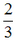

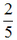

## 542. 地價稅與房屋稅合併課稅
*發布日期: 2020-10-29* 

## 內文
地價稅為土地持有稅，房屋稅為建物持有稅。兩者宜分開課稅，抑或合併課稅？爭議不休。

• (一) 主張分開課稅之理由：

1. 土地與建物之性質不同：土地不會折舊，但會增值；建物不會增值，但會折舊。因此，土地價值隨時間經過而遞增，建物價值隨時間經過而遞減。如圖(一)所示。

[圖片1]

2. 土地與建物之政策不同：土地愈集約利用，每建坪之地價稅愈來愈少。土地愈集約利用，每建坪之房屋稅愈來愈多。如圖(二)所示，因此，地價稅會促進土地利用，房屋稅會阻礙土地利用。故地價稅應從重，房屋稅應從輕。

[圖片2]

3. 土地與建物之稅率不同：現行地價稅採累進稅，現行房屋稅採比例稅，兩者難以合併。

總之，土地法第145條規定：「土地及其改良物之價值，應分別規定。」據此，土地與建物應分別定價，分開課稅。

• (二) 主張合併課稅之理由：

1. 現制恐造成稅基流失或重複課稅：

1. 稅基流失：現行採土地與建物分開定價，可能發生稅基流失。如圖(三)所示，假定整體房地市價為□AEO′O，土地由左而右定價，土地價值原點為O，定價在C；建物由右而左定價，建物價值原點為O′，定價在F，則□ABCO為地價稅之稅基，□DEO′F為房屋稅之稅基，□BDFC為稅基流失部分（即圖上之空白部分）。

[圖片3]

2. 重複課稅：現行採土地與建物分開定價，可能發生重複課稅。如圖(四)所示，假定整體房地市價為□AEO′O，土地由左而右定價，土地價值原點為O，定價在C；建物由右而左定價，建物價值原點為O′，定價在F，則□ABCO為地價稅之稅基，□DEO′F為房屋稅之稅基，□DBCF為重複課稅部分（即圖上之網狀部分）。

[圖片4]

2. 交易習慣為房地一體：目前，我國房地產習慣以建物及其基地一體進行交易，故房地交易市價難以拆分為多少歸屬於土地，多少歸屬於建物。又，土地與建物分開定價後合計，難以與房地交易市價相等。

3. 採行自動估價系統進行評價：所謂自動估價系統（Automated Valuation Model，簡稱AVM），指應用計量模型，藉助電腦運算，查估多數量不動產價格。其方法首先蒐集交易實例（即樣本），再以交易實例建立計量模型，最後以計量模型推估不動產價格。採行AVM，可以更精準反映市價，減少人為控制因素，並達成省時、省力、省費之要求。

• (三) 結論：

1. 地價稅與房屋稅合併課稅，屬於稅制變革。變革後，如房地所有權人較過去稅負增加，等同加稅，必定反彈。因此，茲事體大，宜從長計議。

2. 運用自動估價系統之困難如下：

1. 樣本數太少：雖然現行內政部已實施不動產交易實價登錄制度，但有些地方交易不熱絡，缺乏實例資料。另外，內政部之實價登錄資料，未盡詳細，有的變數資料缺乏，致應用效果受限。

2. 異質性太大：不動產之異質性愈大，AVM愈難應用。公寓大樓應用效果最佳，其次為透天房屋，再次為純土地，特殊產品（如百貨公司、醫院、旅館等）最難應用。

3. 影響因子太多：影響不動產價格之因子很多，建立模型時，將選擇一些影響因子，捨棄另一些影響因子。如果捨棄者為主要影響因子，則計量模型之解釋能力將變差。另外，有的影響因子難以量化造成應用困難。

總之，推動自動估價系統還有一段很長的路要走。

## 文章圖片

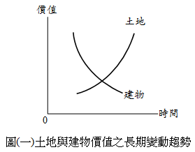

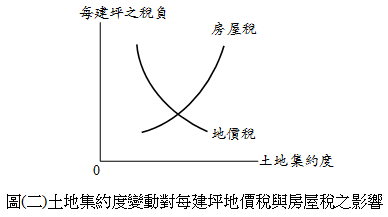

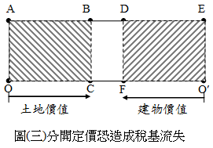

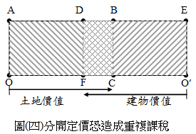

## 543. 土地買賣未辦竣權利移轉登記之處罰
*發布日期: 2020-10-29* 

## 內文
榮耀君於109年1月1日，向文昌君購買A地號土地，未至地政事務所辦竣所有權買賣移轉登記，旋即於同年3月3日再行出售給俊明君，土地移轉現值合計200萬，並由俊明君辦竣所有權移轉登記。榮耀君左手買、右手賣賺了一筆，試問違反何項法規？

• 一、法源依據

分別主要有兩項條文提及：

• (一) 依土地稅法第54條第2項規定：「土地買賣未辦竣權利移轉登記，再行出售者，處再行出售移轉現值百分之二之罰鍰。」

• (二) 依平均地權條例第81條規定：「土地買賣未辦竣權利移轉登記，承買人再行出售該土地者，處應納登記費二十倍以下之罰鍰。」

此外，依平均地權條例第83條，「以經營土地買賣，違背土地法律，從事土地壟斷、投機者，處三年以下有期徒刑，並得併科七千元以下罰金。」此案例亦有投機問題，也有受此處罰之風險。

• 二、適用場合

1. 所稱「買賣」，指當事人約定一方移轉財產權於他方，他方支付價金之契約而言。

2. 所稱「土地買賣未辦竣權利移轉登記」指土地權利尚未經登記機關依土地登記規則第六條登記完畢而言。

3. 所稱「再行出售」，指承買人就所承買土地尚未辦竣權利移轉登記前，即再行出售他人成立「債權契約」而言。

• 三、處罰對象

處以罰款之對象，指買賣土地未辦竣移轉登記之權利人（承買人），亦即未辦竣移轉登記再行出售之義務人（出賣人）而言。

原則上會由國稅局函送買賣合約書、土地增值稅申報書、資金流程說明書等事證，認定榮耀君未辦竣權利移轉登記即再行出售。

• 四、罰緩計算

• (一) 土地稅法目前主要依據土地稅法予以處罰，處再行出售移轉現值2%之罰鍰，即200萬*2%＝4萬。處以罰鍰逾期不繳納時，應由原處分機關依行政執行法執行之。 惟注意，依「稅務違章案件減免處罰標準」第18條第2項規定，依土地稅法第五十四條第二項規定應處罰鍰案件，其移轉現值在新臺幣一百萬元以下者，或辦竣權利移轉登記前經依規定撤回或註銷移轉現值申報者，免予處罰。

• (二) 平均地權條例至於平均地權條例罰緩之計徵如下：

1. 自當事人訂立買賣契約之日起二個月內再行出售者，處應納登記費一倍之罰鍰，逾二個月者，每逾一個月加處一倍，以至二十倍為限。

2. 前款登記費之計算，以當事人訂定買賣契約之日該土地之當期申報地價為準。

參考資料：

1. 台中市政府地方稅務局。

2. 最高行政法院101年度4月份第2次庭長法官聯席會議

3. 平均地權條例第八十一條補充規定
---
*注：本文圖片存放於 ./images/ 目錄下*

## 544. 註記登記-訴訟繫屬事實註記
*發布日期: 2020-10-22* 

## 內文
本次專欄為各位同學說明有關註記登記之一種：「訴訟繫屬事實註記」，屬於較少於參考書提及的實務觀念。

• 一、假設情境某甲(賣方)與乙(買方)發生A地所有權移轉糾紛，刻正進行請求A地所有權移轉訴訟中，而後甲自認不妙，欲將A地先行出售給丙，丙為善意第三人，在乙未申辦限制登記(假處分)情形下，當丙登記完畢後，即使判決確認甲應移轉A地給乙，卻面臨丙主張善意取得之問題。

• 二、法源依據民事訴訟法第254條第5項規定：「訴訟標的基於物權關係，且其權利或標的物之取得、設定、喪失或變更，依法應登記者，於事實審言詞辯論終結前，原告得聲請受訴法院以裁定許可為訴訟繫屬事實之登記。」

• 三、意義訴訟繫屬註記，是指某項「物權」的取得、設定、變更或喪失，必須經政府機關登記才能生效(例如土地或房屋所有權、抵押權、地上權等等)，當這項物權成為民事訴訟審判的對象時，該訴訟的原告可以在事實審言詞辯論終結前，向審理的法院聲請裁定准許在這項權利的登記事項內，註記目前有訴訟繫屬的事實，並且在裁定准許後，以此裁定向登記機關申辦登記的制度。（黃明發，2017）

• 四、目的主要是為使受讓訴訟標的權利之第三人有知悉該訴訟繫屬之機會，避免其遭受不利益，及減少受讓人於知悉有訴訟繫屬之情形而仍為受讓時，因主張善意取得而生之紛爭，以保障訴訟繫屬相對人及受讓人之權益，防止紛爭擴大（內政部內授中辦地字第 1026033268 號函）。換言之，這項制度的目的，一是保護欲取得這項物權的善意第三人(指不知情)，避免因為不知這項權利涉訟，而遭受意外的損失，導致紛爭擴大；另一是保護判決的效力，避免判決效力因為這項權利移轉於善意第三人而中斷，造成原告就算勝訴也不能實現權利（黃明發，2017）。

• 五、登記內容配合上述規定，於土地登記簿（所有權部或他項權利部）登記內容為：「（一般註記事項）依○○法院○○年○○月○○日○字第○○號函證明文件辦理註記，本件不動產現為該院○○年度（訴）字第○○號○○案件訴訟中」

• 六、效力訴訟繫屬事實註記，並無禁止登記名義人處分其不動產權利之效力，而訴訟繫屬事實註記實際上並無「信賴登記善意取得」之適用，只有「使第三人有知悉之機會，避免其遭受不利益」之效力而已（參內政部台內中地字第8979831號函、內授中辦地字第0930724544號函）。換言之，訴訟繫屬事實註記，只具有告知之效力而已，目的在使第三人於受讓訴訟標的不動產時，有知悉該標的處在訴訟繫屬之狀態，提供該第三人決定是否仍願受讓之資訊，或決定另選標的，以免日後遭受損害。（林永汀，2018）第三人買受訟爭不動產，辦理移轉所有權登記時，應將該訴訟繫屬事實註記內容轉載，依內政部民國93年5月13日內授中辦地字第0930006501號函釋，直到訴訟終結後，再由當事人或利害關係人聲請法院發給證明，持向該管登記機關請求塗銷註記。惟倘若訴訟當事人持已起訴證明向登記機關申請訴訟繫屬註記登記時，如該訴訟標的不動產已移轉(含於訴訟繫屬前移轉)登記予第三人者，除該第三人係屬非得主張善意取得之情形(如繼承移轉取得)外，地政機關將不予辦理訴訟繫屬註記登記。另訴訟當事人如認為該第三人非為善意受讓訴訟標的不動產，因屬私權爭執範疇，應由其訴請法院判決，或另循民事訴訟保全程序為之。（參內政部台內地字第1020375043號令）

• 七、影響由於訴訟繫屬註記常會造成被註記的物權利用上的障礙，例如土地所有權被訴訟繫屬註記後，銀行不願受理該筆土地的抵押貸款，或已經向銀行貸款的土地被訴訟繫屬註記後，銀行因此縮銀根要求立即還款等等，都會對這項權利的擁有者造成損失，所以前述的法律也賦予被註記的一方向法院提出異議的權利，以及在訴訟終結後，要求法院發給證明，以向登記機關辦理塗銷註記的權利。（黃明發，2017）

參考文獻：

1. 林永汀，2018，訴訟繫屬事實註記之效力，台中市地政學會會刊，201201(第16期)：第9-15頁。

2. 黃明發，2017，從地政訴訟類型─談確認經界之訴、訴訟繫屬註記、假處分及損害賠償等實務問題，地政講堂。
---
*注：本文圖片存放於 ./images/ 目錄下*

## 545. 土地法第104條實例研習(二)
*發布日期: 2020-10-22* 

## 內文
甲有一筆建地，甲於民國109年10月9日訂立合約將該地右下角部分出租於乙，乙隨即興建透天房屋一間。甲又於民國109年10月12日訂立合約將該地左上角部分出租於丙，丙隨即興建透天房屋一間。今，甲將該地全部出售於丁，乙、丙二人均主張優先購買各自承租土地部分，是否可行？

【解答】

• (一) 土地法第104條第1項規定：「基地出賣時，地上權人、典權人或承租人有依同樣條件優先購買之權。房屋出賣時，基地所有權人有依同樣條件優先購買之權。其順序以登記之先後定之。」準此，乙、丙二人均有優先購買權。

• (二) 土地法第104條第1項明定「同樣條件」。亦即優先購買權之行使須以甲出售之同樣條件。鑑於甲出售該地全部，因此乙、丙主張優先購買均須以該地全部為之，而不得以各自承租土地部分為之。故乙、丙二人均主張優先購買各自承租土地部分，為不可行。

• (三) 乙、丙二人優先購買權競合時，依土地法第104條第1項規定「其順序以登記先後定之」。然，租賃權為債權，無須辦理登記，因此以訂立租約之先後定之。乙於民國109年10月9日訂立租約，丙於民國109年10月12日訂立租約。乙之租賃權成立在先，丙之租賃權成立在後，因此乙之優先購買權先於丙而行使。
---
*注：本文圖片存放於 ./images/ 目錄下*

## 546. 土地法第104條實例研習(一)
*發布日期: 2020-10-15* 

## 內文
甲有一筆建地，乙於民國109年9月10日在該地右上角部分辦竣地上權登記，並興建透天房屋一間。丙於民國109年9月15日在該地左下角部分辦竣地上權登記，並興建透天房屋一間。不久，甲將該地全部出售於丁，則何人有優先購買權？優先購買權競合時，何人優先？優先購買權人主張優先購買該地之全部，抑或僅限於各自設定地上權之範圍？

【解答】

• (一) 土地法第104條第1項規定：「基地出賣時，地上權人、典權人或承租人有依同樣條件優先購買之權。房屋出賣時，基地所有權人有依同樣條件優先購買之權。其順序以登記之先後定之。」準此，甲、乙二人均有優先購買權。

• (二) 土地法第104條第1項明定「其順序以登記之先後定之」。亦即優先購買權競合時，優先購買之順序以登記之先後定之。準此，乙於民國109年9月10日辦竣地上權登記，丙於民國109年9月15日辦竣地上權登記。乙之登記先於丙，因此乙之優先購買權先於丙而行使。換言之，甲應先通知乙是否按同樣條件優先購買；倘乙放棄或視為放棄優先購買權，甲再通知丙是否按同樣條件優先購買；倘丙放棄或視為放棄優先購買權，甲始得將該地出售於丁。

• (三) 土地法第104條第1項明定「同樣條件」。亦即優先購買權之行使須以甲出售之同樣條件。鑑於甲出售該地全部，因此乙、丙主張優先購買均須以該地之全部為之，而非以各自設定地上權之範圍。
---
*注：本文圖片存放於 ./images/ 目錄下*

## 547. 預告登記之塗銷
*發布日期: 2020-10-15* 

## 內文
預告登記係預為保全對於他人土地權利之請求權，而由請求權人檢附登記名義人之同意書及印鑑證明，向該管登記機關所為之限制登記名義人處分其土地權利之登記。其目的在阻止登記名義人對於該土地為有妨害其請求權之處分。

然而，今日專欄提醒預告登記非永久有效、一勞永逸，仍應注意其塗銷情形如下：

1. 保全債權請求權實現。如債務履行、條件成就、期限到來，請求權人請求辦理正式登記。

2. 保全債權請求權無效、撤銷、契約解除或其他事由而塗銷。

1. 無效：如買賣契約無效，債權不發生，預告登記即失其依據，故應予塗銷。

2. 撤銷：依民法第412條規定，贈與附有負擔者，如贈與人已為給付而受贈人不履行其負擔時，贈與人得請求受贈人履行其負擔，或撤銷贈與。因此，當父母贈與房地給子女並辦妥預告登記，惟其增與負擔係要求子女需負擔撫養義務，當其未盡義務時，得撤銷該贈與，並塗銷該預告登記。

3. 契約解除：買賣契約雙方合意解除，而同意塗銷。

4. 其他事由，如請求權罹於時效：依最高法院100年台上608號判決所示，預告登記旨既在保全債權請求權之行使，如該請求權已消滅或確定不發生時，該預告登記亦已失其依據，應予塗銷。故若該所有權移轉登記之請求權，已罹於15年時效而消滅，則該預告登記之目的已無法達成，登記名義人可向法院主張塗銷預告登記。

3. 因徵收、法院判決或強制執行而為新登記致塗銷。根據土地法第79條之1第3項規定，預告登記，對於因徵收、法院判決或強制執行而為新登記，無排除之效力。因此，發生徵收、法院判決或強制執行時，預告登記將被塗銷。

第1、2點預告登記之塗銷，應提出原預告登記請求權人之同意書(土登§146I)，或法院判決書，單獨塗銷之。第3點則無須原預告登記請求權人之同意。
---
*注：本文圖片存放於 ./images/ 目錄下*

## 548. 市地重劃與區段徵收有關土地增值稅負擔之比較
*發布日期: 2020-10-08* 

## 內文
市地重劃與區段徵收乃政府土地開發之兩種重要手段。惟兩種法律性質迥然不同，前者為視為其原有之土地交換，後者為強制徵收。從其法律性質而衍生之土地增值稅負擔因而有別，比較如下：。

• (一) 市地重劃：土地所有人以原有土地換得新的土地。因新的土地視為其原有（平§62），無取得可言，亦無移轉可言，故不徵土地增值稅。又，原地價照舊（指由重劃前原地價換算為重劃後原地價，以下同），不徵土地增值稅之效果，等同不課徵土地增值稅。區段徵收：土地所有人失去原有土地，再取得新的土地（即抵價地）。因區段徵收而失去土地，免徵土地增值稅（土稅§39-1Ⅱ）。

• (二) 市地重劃：土地所有人所領回之土地，乃延續其原有土地，因此原地價照舊。原地價照舊，表示原地價未更動，故屬於不課徵土地增值稅。區段徵收：土地所有人所領回之土地（即抵價地），屬於原始取得，而非延續其原有土地。因此，須對新的土地另訂原地價，原地價以實際領回抵價地之地價為準（土稅§30-1③）。

• (三) 市地重劃：市地重劃後第一次移轉，其土地增值稅減徵40%（土稅§39Ⅳ）。惟市地重劃後，配偶間相互贈與再移轉第三人，雖屬第二次移轉，但稅法有明定其例外（土稅§28-2Ⅱ），故仍得適用減徵40%之優惠。區段徵收：區段徵收後第一次移轉，其土地增值稅減徵40%（土稅§39-1Ⅱ）。惟區段徵收後，配偶間相互贈與再移轉第三人，因屬第二次移轉，且稅法無明定其例外，故不得適用減徵40%之優惠。

綜上，市地重劃不課徵土地增值稅，且所領回新的土地之原地價照舊；因原地價照舊，日後出售於第三人之土地增值稅較多。區段徵收免徵土地增值稅，且所領回新的土地之原地價採實際領回抵價地之地價；因原地價重新認定，而且較高，日後再出售於第三人之土地增值稅較少，甚至為零。由此可知，就土地增值稅負擔而言，土地所有人參加區段徵收較參加市地重劃有利。
---
*注：本文圖片存放於 ./images/ 目錄下*

## 549. 有關「登記錯誤」與「錯誤登記」之差異
*發布日期: 2020-10-08* 

## 內文
• 一、登記錯誤

依土地登記規則第13條，土地法第六十八條第一項及第六十九條所稱登記錯誤，係指登記事項與登記原因證明文件所載之內容不符者。

登記錯誤，係指准予登記之行政處分並無違誤，僅登記機關辦理登記時未依登記原因證明文件所載內容登記而生登記事項與之不符情事，登記機關依職權或經利害關係人申請而辦理更正該不符部分之登記內容。

• 二、錯誤登記

依土地登記規則第144條第1項，有下列情形之一者，於第三人取得該土地權利之新登記前，登記機關得於報經直轄市或縣(市)地政機關查明核准後塗銷之：A.登記證明文件經該主管機關認定係屬偽造。B.純屬登記機關之疏失而錯誤之登記。＝又稱錯誤登記

依本規則不應登記，純屬登記機關之疏失而錯誤登記，屬於違法行政處分，並非私權有所爭執，民事法院亦無從受理審判，於第三人取得該土地登記權利前，自應由登記機關依職權撤銷原處分，辦理塗銷登記，該塗銷係屬使其效力完全消滅之登記。

因此，登記錯誤與錯誤登記二者之法律關係尚屬有別。

參考內政部98年7月24日內授中辦地字第0980047281號函
---
*注：本文圖片存放於 ./images/ 目錄下*

## 550. 租賃住宅市場發展及管理條例之有關租賃關係消滅之點交程序
*發布日期: 2020-10-01* 

## 內文
以下針對租賃住宅市場發展及管理條例之有關租賃關係消滅之點交程序，彙整相關面向之討論，提供同學參考：

• 一、條文規定：依據租賃住宅市場發展及管理條例第12條：「租賃契約消滅時，租賃住宅之返還，應由租賃當事人共同完成屋況及附屬設備之點交。一方未會同點交，經他方定相當期限催告仍不會同者，視為完成點交。前項點交後尚有遺留物，除租賃當事人另有約定外，經出租人定相當期限催告仍不取回時，視為拋棄其所有權，其所需處理費用，得由押金扣除，不足者，出租人得請求承租人給付。」曾老師悄悄話：其中，完成點交概念有所爭議。

• 二、律師投稿：劉琦富：租賃專法裡的魔鬼，悄悄現身【原文轉自：蘋果新聞網】這個條文初一看，讓人覺得無限美好，租約到期房客不搬走，房東可以定相當期限催告房客點交，期限到了房客還是不點交的話，就視為完成點交。什麼是點交？《強制執行法》第99條說，就是解除債務人（房客）的占有，交付給債權人（房東）。過去租約到期、消滅，房客不搬，房東只能告上法院，經過最多三個審級，多則一、兩年的審理拿到確定判決後，才能聲請法院強制執行讓房客搬走；聰明一點的房東把租約拿去公證約定逕行強制執行條款，也只能在「租約到期」後，聲請法院強制執行。在專法第12條沒有施行前，房客事實上居住之平穩安全法益，跟所有權之有無與占有權源係屬兩事，不是說租約到期房客變成無權占有就該死或是要讓房東予取予求，房東還是要循民事訴訟及執行程序主張其權利，但是專法第12點最莫名其妙的地方在於，直接跳過民事訴訟程序和民事執行程序，讓房東直接點交完畢，那麼到底房東有沒有合法終止租約，誰說了算，過去是法院說了算，現在呢？曾老師悄悄話：完成點交，是否代表可以直接按強制執行規定，解除房客之占有，直接強制遷離？

• 三、內政部回應：劃分承租人居住於租賃住宅內或承租人無居住之事實或他遷不明等不同之情形，刻正研擬點交程序內政部強調，租賃住宅條例為民法特別法，依其第12條規定，出租人於租賃關係消滅後，可訂相當期限催告承租人會同點交；承租人屆期未會同者，視為完成點交，完成點交後，如承租人尚有遺留物經出租人催告仍不取回，該遺留物則視為廢棄物處理。但若承租人仍居住於租賃住宅內，因會涉及人身自由安全問題，因此，內政部正在積極研議應以何種程序處理，才能維護房東的財產權，又不影響房客的人身自由及居住權利。

• 四、法務部回函：為何要劃分不同情形之點交程序？？？（根據法務部108.08.01.法律字第10803510750號函）按民法第455條前段規定：「承租人於租賃關係終止後，應返還租賃物；…。」、第767條第1項規定：「所有人對於無權占有或侵奪其所有物者，得請求返還之。對於妨害其所有權者，得請求除去之。有妨害其所有權之虞者，得請求防止之。」是以，租賃契約因屆期終止、符合法律規定或契約規定提前終止，承租人負有返還租賃物之義務，如未返還者，出租人得依上述規定行使其權利，或提起訴訟請求法院判決返還租賃住宅。次按租賃住宅市場發展及管理條例（下稱租賃住宅條例）於106年12月27日公布，107年6月27日施行，且該條例係為維護人民居住權、保障租賃當事人權益而設，此觀該條例第1條即可得知，故該條例在住宅租賃事務範圍內為民法之特別法，應優先於民法適用（臺灣桃園地方法院108年度壢簡字第125號判決參照）。又該條第12條第1項規定「租賃契約消滅時，租賃住宅之返還，應由租賃當事人共同完成屋況及附屬設備之點交。一方未會同點交，經他方定相當期限催告仍不會同者，視為完成點交。」查上開規定，係於立法院審查會議時，由立法委員提出之修正動議，依審查時提案委員之發言表示：「為避免租賃契約屆期或是終止，承租人先搬離租屋處不願意配合交還，因為實務上常常發生房東、房客點交時有問題，這部分會產生爭議，所以我們針對這部分提出修正動議，…保障租賃關係。」（立法院公報，第106卷，第61期，委員會紀錄，第368頁、第428頁參照）。有關貴部來函說明四依實務狀況區分出租人取回租賃住宅之程序乙節，因民法僅就承租人於租賃關係終止後，應返還租賃物為規定（民法第455條），並未規範返還之點交事宜。是以，有關租賃契約消滅時，租賃住宅返還之點交程序或方式，係依租賃住宅條例第12條之規定。惟就該條條文觀之，似未區分租賃契約消滅時，承租人居住於租賃住宅內或承租人無居住之事實或他遷不明等不同之情形，而有不同之規範。是以，貴部擬區分其不同情形而訂定相異之出租人取回租賃住宅程序，其依據為何？宜請貴部審酌上開條例立法意旨，本於權責予以釐清。

• 五、內政部台內地字第1090260647號令核釋：點交與完成點交之定義(一)租賃住宅市場發展及管理條例第12條第1項規定所稱點交，指承租人返還租賃住宅及附屬設備予出租人，且租賃雙方會同確認其數量及狀態之程序。(二)完成點交後，承租人及出租人之關係如下：

1. 承租人就租賃住宅及附屬設備，不負保管責任。

2. 出租人就租賃住宅得自由使用收益及依民法或其他法律規定行使相關權利。

3. 租賃住宅屋況或附屬設備，因可歸責於承租人之事由，致生毀損或滅失者，出租人仍得依契約或法令規定向承租人請求損害賠償。

• 六、結論：目前看起來，前面完成點交之關係，並未直接賦予出租人可跳過民事訴訟程序，直接對承租人強制遷離之情形。換言之，出租人如經向承租人主張終止租約，但其仍居住於屋內不肯搬遷，仍需提起返還房屋之訴訟，待判決確定後，再聲請強制執行。或許待後續內政部對所謂點交程序是否有更明確之相關規定再予確認。
---
*注：本文圖片存放於 ./images/ 目錄下*

## 551. 土地法第107條實例演習
*發布日期: 2020-10-01* 

## 內文
甲有一筆耕地，出租於乙耕種使用。不久，甲將該筆耕地出典於丙，則乙是否有優先承典權？接著，甲再將該筆耕地出售於丁，則乙是否有優先承買權？

【解答】

土地法第107條第1項規定：「出租人出賣或出典耕地時，承租人有依同樣條件優先承買或承典之權。」準此，甲將該筆耕地出典於丙，則乙有優先承典權；接著，甲再將該筆耕地出售於丁，乙有優先承買權。

附帶一提的是，甲將該筆耕地出典於丙，倘乙主張優先承典。日後，甲再將該筆耕地出售於丁，乙得依據土地法第107條主張優先承買，亦得依據民法第919條主張留買。

應注意者，土地法第107條之優先承受權及民法第919條之留買權皆具有物權效力。

上開所稱耕地，指土地法第106條所稱之耕地，而非農業發展條例第3條第11款所稱之耕地。
---
*注：本文圖片存放於 ./images/ 目錄下*

## 552. 預告登記之意義、申辦及繼承之處理
*發布日期: 2020-09-24* 

## 內文
• 一、意義

首先，根據土地法第79條之1規定：聲請保全下列請求權之預告登記，應由請求權人檢附登記名義人之同意書為之： (一)關於土地權利移轉或使其消滅之請求權。 (二)土地權利內容或次序變更之請求權。 (三)附條件或期限之請求權。

預告登記為限制登記的一種，係預為保全對於他人土地權利之請求權，而由請求權人檢附登記名義人之同意書及印鑑證明，向登記機關所為之限制原權利人處分其所有權或他項權利之登記。其目的在阻止土地權利人對於該土地為有妨害其請求權之處分。因此，辦理預告登記後，登記名義人如欲處分土地（包含移轉、設定他項權利等），是必須經過請求權人同意後，方得為之。

一般實務上運用的不少，例如：

1. 預防一屋二賣。主要是有的交易時間拖的比較久，為免登記名義人遇到出更高價者，而先行售出（登記簿所有權部之其他登記事項欄註記：本筆土地在未辦妥所有權移轉登記予請求權人前，不得移轉予他人）

2. 父母登記在子女名下，預防子女偷賣或抵押

3. 合宜住宅避免人口戶轉售投機（內政部營建署明定合宜住宅承購人於簽訂買賣契約時，需簽具「預告登記同意書」，同意自取得所有權登記之日起5年內（龜山A7）或10年內（板橋浮洲），除繼承或依法強制信託外，不得將住宅及其基地出售、出典、贈與、交換或信託移轉予他人。如有違反，願以承購房地原價85％之價格，移轉予請求權人中華民國(管理機關：內政部營建署)，據以向地政機關辦理預告登記）

• 二、申請方式

附同意書者，由請求權人單獨登記。屬得跨直轄市、縣（市）土地登記案件。

• 三、申請文件

• (一) 登記申請書。 (二)登記清冊。(同意書已載明土地、建物標示及權利範圍等資料者，免附登記清冊) (三)登記名義人同意書。 (四)申請人身分證明文件。 (五)登記名義人身分證明文件及印鑑證明。 (六)權利書狀。 (七)其他由中央地政機關規定應提出之證明文件。

其中，同意書中應敘明請求權人之姓名、請求權之類別、同意其預告登記之土地或建物之詳細座落地號及權利範圍，同意人應具名並加蓋印鑑章。（同意書無公定格式，可參如下圖示：）

[圖片1]

[圖片2]

[圖片3]

• 四、申請規費

預告登記免登記費。

• 五、處理期限

一～二天。

• 六、處理流程

收件→審查→登簿(登錄)→發狀還件→異動→歸檔

• 七、登記簿

預告登記並不會於權狀上顯示，故如欲瞭解不動產有無被預告登記，必須申請登記簿謄本確認，其多於所有權部之其他登記事項欄註記：[圖片4]

• 八、效力

• (一) 預告登記在未塗銷前，登記名義人就其土地所為之處分，對於所登記之請求權有妨礙者無效。學說上認為屬相對無效說，亦即如對登記請求權無妨礙者，應為有效。 例如，甲(登記名義人)與乙(請求權人)設定預告登記後，甲今天欲要在土地上另行設定抵押權，只要經過乙同意，即認對請求權無妨礙，是可以設定抵押的(參限制登記作業補充規定第2點)。 (二)預告登記，對於因徵收、法院判決或強制執行而為之新登記，無排除之效力。係因公法上處分具公益性，故大於私法上禁止處分效力。

• 九、一方死亡

• (一) 登記名義人死亡 民法第1148條規定「繼承人自繼承開始時，除本法另有規定外，承受被繼承人財產上之一切權利、義務。」亦即繼承人承受原登記名義人受處分限制之義務。

• (二) 預告登記之請求權人死亡 民法第1148條規定「繼承人自繼承開始時，除本法另有規定外，承受被繼承人財產上之一切權利、義務。」亦即繼承人取得原屬被繼承人之預告登記請求權。又預告登記保全之請求權係為債權非屬物權性質，與查封、假扣押等其他限制登記所保全債權之請求權同，於請求權人死亡時，繼承人亦承繼該債權之請求權，無辦理繼承該請求權登記之必要。惟為免損害繼承人之權益，除民法另有規定或權利義務專屬於被繼承人本身者外，倘繼承人認為有實際需要時，得由繼承人依土地登記規則第119條規定，檢具登記申請書件向該管登記機關提出申請，經審查無誤後於土地登記簿其他登記事項欄以「註記」為登記原因，並於原預告登記請求權人名義後加註繼承人姓名。（內政部91年5月22日台內中地字第0910005955號函）

## 文章圖片

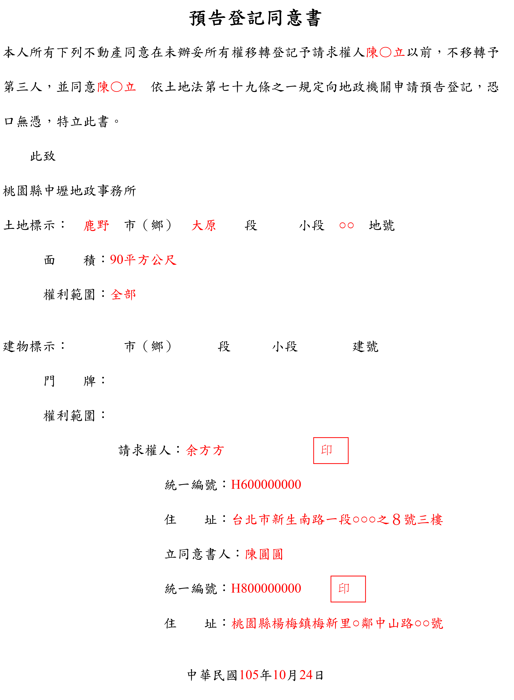

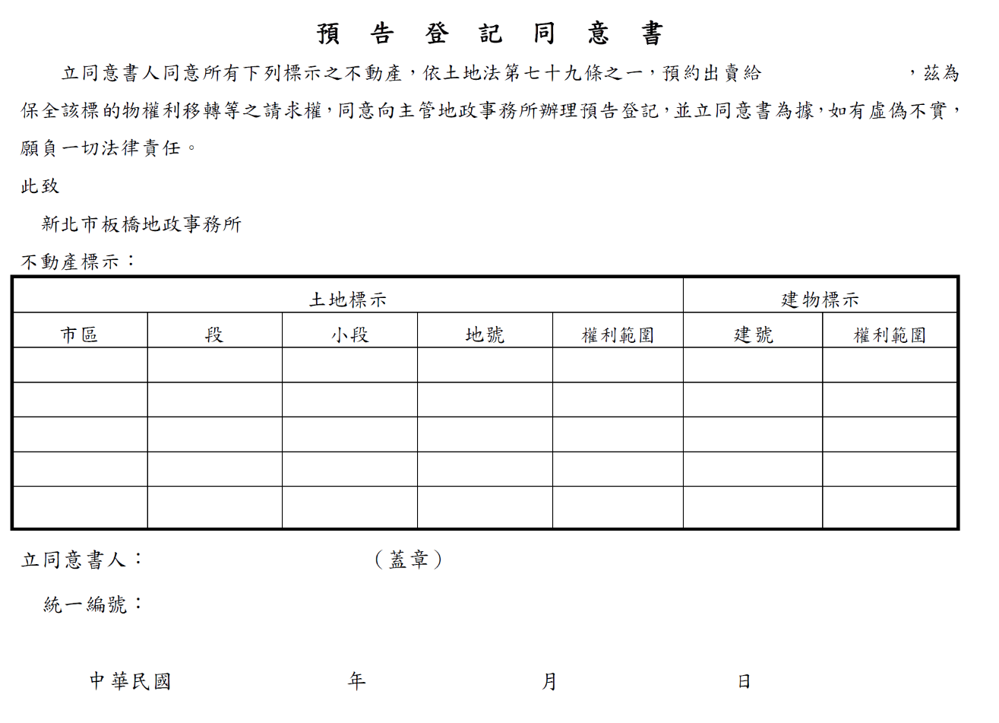

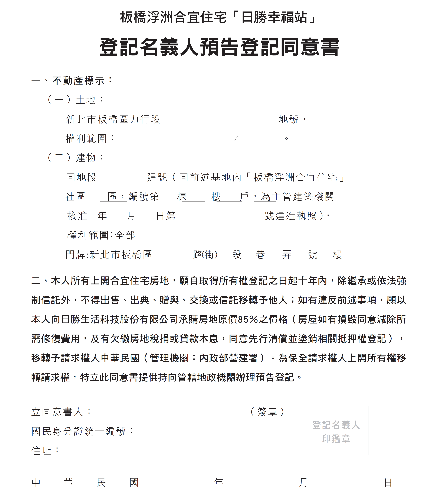

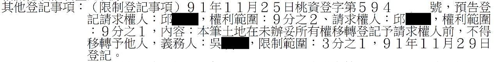

## 553. 不動產之涵義
*發布日期: 2020-09-24* 

## 內文
下列法律就不動產加以定義：

• (一) 民法第66條：「稱不動產者，謂土地及其定著物，不動產之出產物，尚未分離者，為該不動產之部分。」準此，民法所稱不動產，包括土地與定著物二種。茲分述如下：

1. 土地：土地以地籍線界定其範圍，編定地號而為獨立之物。

2. 定著物：指固定附著於土地之物。有的定著物可以獨立為物，有的定著物不能獨立為物。前者如建築物、游泳池、加油亭等，後者如橋樑、隧道、軌道等。得獨立為物者，可以編定建號，單獨為交易之標的物；不得獨立為物者，屬於土地之一部分，不可以編定建號，不可以單獨為交易之標的物。

此外，土地上之農作物及附著於土地之礦，均非定著物。農作物尚未與土地分離者，為土地之一部分，故屬於土地。附著於土地之礦，為土地之一部分，故屬於土地。 不動產之定義以民法第66條為主，其他法律如有擴大或縮小其涵義，始有重新定義之必要。如不動產經紀業管理條例、不動產證券化條例等是。

• (二) 不動產經紀業管理條例第4條第1款至第3款規定：「一、不動產︰指土地、土地定著物或房屋及其可移轉之權利；房屋指成屋、預售屋及其可移轉之權利。二、成屋︰指領有使用執照，或於實施建築管理前建造完成之建築物。三、預售屋︰指領有建造執照尚未建造完成而以將來完成之建築物為交易標的之物。」準此，預售屋因尚未興建，故非屬民法之不動產；但不動產經紀業管理條例擴大不動產之涵義，將其涵括在內。

• (三) 不動產證券化條例第4條第1項第1款規定：「不動產：指土地、建築改良物、道路、橋樑、隧道、軌道、碼頭、停車場與其他具經濟價值之土地定著物及所依附之設施，但以該設施與土地及其定著物分離即無法單獨創造價值，土地及其定著物之價值亦因而減損者為限。」準此，不動產範圍包括土地、定著物及能增加土地及其定著物價值之依附設施。由此可知，土地及定著物之依附設施仍屬不動產之範圍，故不動產證券化條例所定義不動產範圍較民法為廣。

此外，下列二種情形，雖對不動產之定義法無明文規定，但由其相關條文，可以略知其不動產之範圍：

1. 不動產登記：不動產登記，即土地登記。土地法第37條第1項規定：「土地登記，謂土地及建築改良物之所有權與他項權利之登記。」準此，不動產登記所稱不動產包括土地與建築改良物。又，建築改良物，指附著於土地之建築物或工事（土§5Ⅱ）。此工事，限於可登記之標的物，如無牆之鋼架建物、游泳池、加油站(亭)、高架道路下里民活動中心等（建物所有權第一次登記法令補充規定第9點）。由此可知，不動產登記所稱不動產較民法定義之不動產為狹。

2. 不動產估價：不動產估價師法第14條第1項規定：「不動產估價師受委託人之委託，辦理土地、建築改良物、農作改良物及其權利之估價業務。」又，不動產估價技術規則第114條規定：「權利估價，包括地上權、典權、永佃權、農育權、不動產役權、耕作權、抵押權、租賃權、市地重劃、容積移轉及都市更新權利變換之估價。」準此，農作改良物得為單獨之估價標的物。又，所稱權利，範圍廣泛，除他項物權（包括地上權、典權、永佃權、農育權、不動產役權、耕作權及抵押權等七種）與債權（指租賃權）外，尚包括權利價值轉換（包括市地重劃、容積移轉及都市更新權利變換等三種）。由此可知，不動產估價所稱不動產較民法定義之不動產為廣。
---
*注：本文圖片存放於 ./images/ 目錄下*

## 554. 私有土地所有權之絕對消滅
*發布日期: 2020-09-17* 

## 內文
指標的物未滅失，但所有權本身終局的歸於消滅，他人並未因而取得其權利，抑或雖取得但係新生權利之取得（即原始取得）。情形如下：

• (一) 民法

1. 拋棄：物權除法律另有規定外，因拋棄而消滅(民§764I)。

2. 無人繼承：繼承開始時，繼承人之有無不明者，由親屬會議於一個月內選定遺產管理人，並將繼承開始及選定遺產管理人之事由，向法院報明(民§1177)。親屬會議依前條規定為報明後，法院應依公示催告程序，定六個月以上之期限，公告繼承人，命其於期限內承認繼承(民§1178I)。第一千一百七十八條所定之期限屆滿，無繼承人承認繼承時，其遺產於清償債權並交付遺贈物後，如有賸餘，歸屬國庫(民§1185)。於歸屬國庫後，私有所有權消滅。

3. 被時效取得：民法§769規定，以所有之意思，二十年間和平、公然、繼續占有他人未登記之不動產者，得請求登記為所有人；民法§770規定，以所有之意思，十年間和平、公然、繼續占有他人未登記之不動產，而其占有之始為善意並無過失者，得請求登記為所有人。進而原本的私有所有權消滅，由時效取得之權利人取得新權利。

• (二) 土地法

首先，根據土地法第10條規定，私有土地之所有權消滅者，為國有土地。亦即所有權歸復於國家所有。例如下列情形：

1. 逾期未辦總登記：逾登記期限無人聲請登記之土地或經聲請而逾限未補繳證明文件者，其土地視為無主土地，由該管直轄市或縣（市）地政機關公告之，公告期滿，無人提出異議，即為國有土地之登記(土§57)。

2. 逾期未辦繼承登記：土地或建築改良物，自繼承開始之日起逾一年未辦理繼承登記者，經該管直轄市或縣市地政機關查明後，應即公告繼承人於三個月內聲請登記；逾期仍未聲請者，得由地政機關予以列冊管理。列冊管理期間為十五年，逾期仍未聲請登記者，由地政機關將該土地或建築改良物清冊移請國有財產局公開標售。繼承人占有或第三人占有無合法使用權者，於標售後喪失其占有之權利。如經五次標售而未標出者，登記為國有並喪失占有權。(土§73-1)

3. 測量後超額之土地：聲請登記土地權利之確定登記面積，應按原有證明文件所載四至範圍以內，依實際測量所得之面積登記之。前項證明文件所載四至不明或不符者，如測量所得面積未超過證明文件所載面積十分之二時，應按實際測量所得之面積予以登記，如超過十分之二時，其超過部分視為國有土地，但得由原占有人優先繳價承領登記(土§62、63)。

4. 被土地徵收：被徵收土地或土地改良物之所有權人，對於其土地或土地改良物之權利義務，於應受之補償費發給完竣時終止(土徵§21I)。

5. 被照價收買（有爭議）。
---
*注：本文圖片存放於 ./images/ 目錄下*

## 555. 一個地號或建號代表一個物
*發布日期: 2020-09-17* 

## 內文
民法第66條規定：「稱不動產者，謂土地及其定著物。不動產之出產物，尚未分離者，為該不動產之部分。」準此，土地及定著物皆屬於不動產。然，是否為獨立之物，應視土地登記而定。

土地法第37條第1項規定：「土地登記，謂土地及建築改良物之所有權與他項權利之登記。」準此，土地登記之對象為土地及建築改良物。因此，農作改良物非土地登記之對象，其為土地之一部分，不能獨立為物。另，建築改良物為附著於土地之建築物或工事（土§5Ⅱ）。因此，建築物得為登記對象，而為獨立之物。至於工事是否為獨立之物？倘工事可以為登記之對象，經登記並編定建號，則為獨立之物，如游泳池、加油亭、高架道路下里民活動中心等是；倘工事不能為登記之對象，則為土地之一部分，而非獨立之物，如橋樑、軌道、隧道等是。

土地有地號，建物有建號。一個地號，代表一宗土地，為獨立之物，得單獨為交易之標的物。一個建號，代表一棟建築改良物，為獨立之物，得單獨為交易之標的物。

須特別一提的是，區分所有建物所屬共有部分，雖編定為一個建號，然其性質屬於從物，故依「主物之處分及於從物」原理，而為下列規範：

1. 區分所有建物所屬共有部分，除法規另有規定外，依區分所有權人按其設置目的及使用性質之約定情形，分別合併，另編建號，單獨登記為各相關區分所有權人共有。（登§81Ⅰ）

2. 區分所有建物共有部分之登記僅建立標示部及加附區分所有建物共有部分附表，其建號、總面積及權利範圍，應於各專有部分之建物所有權狀中記明之，不另發給所有權狀。（登§81Ⅱ）

3. 區分所有建物之共有部分，除法令另有規定外，應隨同各相關專有部分及其基地權利為移轉、設定或限制登記。（登§94）
---
*注：本文圖片存放於 ./images/ 目錄下*

## 556. 申報移轉現值之審核
*發布日期: 2020-09-10* 

## 內文
直轄市或縣（市）政府對於轄區內之土地，應經常調查其地價動態，繪製地價區段圖並估計區段地價後，提經地價評議委員會評定，據以編製土地現值表於每年一月一日公告，作為土地移轉及設定典權時，申報土地移轉現值之參考（平§46）。

申報人申報之移轉現值，經審核低於公告土地現值者，得由主管機關照其自行申報之移轉現值收買或照公告土地現值徵收土地增值稅。申報移轉現值，經審核超過公告土地現值者，應以其自行申報之移轉現值為準，徵收土地增值稅（土稅§30Ⅱ）。析言之：(一)報之處理：申報之移轉現值低於公告土地現值者，政府得照其申報移轉現值收買；倘政府不願收買，亦得以公告土地現值為準計算土地增值稅。(二)高報之處理：申報之移轉現值超過公告土地現值者，以其自行申報之移轉現值為準，計算土地增值稅。(三)不報之處理：申報人未申報移轉現值者，則不能移轉土地。

此外，土地所有權移轉或設定典權，其申報移轉現值之審核標準，依下列規定：(一)申報人於訂定契約（指公契或物權契約；非指私契或債權契約）之日起三十日內申報者，以訂約日當期之公告土地現值為準。(二)申報人逾訂定契約（指公契或物權契約；非指私契或債權契約）之日起三十日始申報者，以受理申報機關收件日當期之公告土地現值為準。(三)遺贈之土地，以遺贈人死亡日當期之公告土地現值為準。(四)依法院判決移轉登記者，以申報人向法院起訴日當期之公告土地現值為準。(五)經法院拍賣之土地，以拍定日當期之公告土地現值為準。但拍定價額低於公告土地現值者，以拍定價額為準；拍定價額如已先將設定抵押金額及其他債務予以扣除者，應以併同計算之金額為準。(六)經政府核定照價收買或協議購買之土地，以政府收買日或購買日當期之公告土地現值為準。但政府給付之地價低於收買日或購買日當期之公告土地現值者，以政府給付之地價為準。（土稅§30Ⅰ）

上開第(一)項至第(四)項申報人可以報低，第(一)項至第(三)項申報人可以報高。總之，第(一)項至第(三)項申報人可以報低，亦可以報高。第(四)項申報人只可以報低，但不可以報高。第(五)項及第(六)項由主管機關直接認定，不必申報。
---
*注：本文圖片存放於 ./images/ 目錄下*

## 557. 公寓頂樓設置鐵門妨礙其他層住戶使用屋頂平台
*發布日期: 2020-09-10* 

## 內文
各位同學好

今日專欄討論有關公寓大廈之問題：如公寓頂樓住戶A於樓梯間設置鐵門，妨礙其他層住戶至樓頂平台，請問可能違反哪些規定？

• 一、違反公寓大廈管理條例第16條第2項前段規定住戶不得於私設通路、防火間隔、防火巷弄、開放空間、退縮空地、樓梯間、共同走廊、防空避難設備等處所堆置雜物、設置柵欄、門扇或營業使用，或違規設置廣告物或私設路障及停車位侵占巷道妨礙出入。而依據同法第49條第4款規定，由直轄市、縣(市)主管機關處新臺幣四萬元以上二十萬元以下罰鍰，並得令其限期改善或履行義務；屆期不改善或不履行者，得連續處罰。再者，依公寓大廈管理條例第22條第2款規定，主管機關裁處罰鍰後，仍不改善或續犯者，經管理負責人或管理委員會促請其改善，於三個月內仍未改善者，管理負責人或管理委員會得依區分所有權人會議之決議，訴請法院強制其遷離。

• 二、違反中華民國刑法第189條之2第1項後段規定（公共危險罪）阻塞戲院、商場、餐廳、旅店或其他公眾得出入之場所或公共場所之逃生通道，致生危險於他人生命、身體或健康者，處三年以下有期徒刑。阻塞集合住宅或共同使用大廈之逃生通道，致生危險於他人生命、身體或健康者，亦同。因而致人於死者，處七年以下有期徒刑；致重傷者，處五年以下有期徒刑。其中，應注意阻塞須達到難以通行的程度，且致生危險，倘若只是通行不便利，僅能依前述公寓大廈管理條例之規定處理。

• 三、民法第767條所有物妨礙排除請求權因屋頂平台係屬共有部分，故其他層之所有權人得主張民法第767條，對於妨害其所有權者，得請求除去之。亦即得請求頂樓住戶拆除違法加裝之鐵門。

• 四、民法第184條侵權行為因故意或過失，不法侵害他人之權利者，負損害賠償責任。

• 五、民法第179條不當得利無法律上之原因而受利益，致他人受損害者，應返還其利益。倘若頂樓有出租情形，其他層所有權人得以請求返還不當得利。
---
*注：本文圖片存放於 ./images/ 目錄下*

## 558. 申報地價之審核
*發布日期: 2020-09-03* 

## 內文
直轄市或縣（市）主管機關辦理規定地價或重新規定地價之程序如下：

• (一) 分區調查最近一年之土地買賣價格或收益價格。(二)依據調查結果，劃分地價區段並估計區段地價後，提交地價評議委員會評議。(三)計算宗地單位地價。(四)公告及申報地價，其期限為三十日。(五)編造地價冊及總歸戶冊。（平§15）

直轄市或縣（市）政府對於轄區之土地，規定地價後每二年重新規定地價一次，但必要時得延長之，據以編製公告地價表，於一月一日公告，作為土地所有權人申報地價之參考。如民國105年、107年、109年均有重新規定地價。舉辦規定地價或重新規定地價時，土地所有權人未於公告期間申報地價者，以公告地價百分之八十為其申報地價。土地所有權人於公告期間申報地價者，其申報之地價超過公告地價百分之一百二十時，以公告地價百分之一百二十為其申報地價；申報之地價未滿公告地價百分之八十時，得照價收買或以公告地價百分之八十為其申報地價（平§16）。析言之：

• (一) 低報之處理：申報之地價未滿公告地價80%者，政府得照其申報地價收買；倘政府不願收買，亦得以公告地價80%為其申報地價。(二)高報之處理：申報之地價超過公告地價120%者，以公告地價120%為其申報地價。(三)不報之處理：土地所有權人未於公告期間申報地價者，以公告地價80%為其申報地價。

此外，公有土地以各該宗土地之公告地價為申報地價，免予申報（平施§21）。
---
*注：本文圖片存放於 ./images/ 目錄下*

## 559. 分管契約是否為公信力保護對象
*發布日期: 2020-09-03* 

## 內文
各位同學好

今年普考土地登記概要第四題考到一相當不錯之概念：

有關共有土地使用、管理或禁止分割之約定登記，依土地登記規則第155條之1第1項規定，係由登記機關於登記簿標示部其他登記事項欄記明收件年月日字號及共有物使用、管理、分割內容詳共有物使用管理專簿。試問：此項登記，是否為土地法第43條所定登記公信力（絕對效力）保護之對象？

• (一) 不動產共有人間關於共有物使用、管理、分割或禁止分割之約定或依民法第820條第一項規定所為之決定，於登記後，對於應有部分之受讓人或取得物權之人，具有效力。其由法院裁定所定之管理，經登記後，亦同。共有人依該民法第826-1條第一項規定申請登記者，登記機關應於登記簿標示部其他登記事項欄記明收件年月日字號及共有物使用、管理、分割內容詳共有物使用管理專簿。其登記之目的係用以對抗第三人，約束其必須按該約定使用。

• (二) 土地法第43條所定登記公信力（絕對效力）保護對象之說明

1. 依本法所為之登記，有絕對效力(土§43)。因此，為確保交易安全，依民法§759-1，因信賴不動產登記之善意第三人，已依法律行為為物權變動之登記者，其變動之效力，不因原登記物權之不實而受影響。

2. 不動產物權變動以登記為公示方法，對於因信賴登記之第三人，縱使登記所表現的物權與實質權利不符，亦應予以保護，即法律仍承認具有與真實權利存在相同之法律效果，以維護交易安全。

3. 然而，並非指剝奪真正權利。

1. 司法院院字第1919號解釋：土地法所謂登記有絕對效力，係為保護第三人起見，將登記事項賦予絕對真實之公信力，故第三人信賴登記，而取得土地權利時，不因登記原因之無效或撤銷，而被追奪，惟此項規定，並非於保護交易安全之必要限度以外剝奪真正之權利，如在第三人信賴登記，而取得土地權利之前，真正權利人仍得對於登記名義人主張登記原因之無效或撤銷，提起塗銷登記之訴。

2. 司法院院字第1956號解釋：在已有第三人取得權利之新登記後，雖得依土地法請求損害賠償，不得為塗銷登記之請求，而在未有第三人取得權利之新登記時，對於登記名義人，仍有塗銷登記請求權，自無疑義。

4. 土地登記具公信力之要件如下

1. 須原登記有不真實之情事。

2. 需登記名義人與第3人間具有效之法律行為。

3. 第三人取得權利須為善意。

4. 登記事項限於權利相關之登記事項：如所有權、限制物權、擔保物權。而純粹事實相關之登記事項則非公信力保護對象。如土地面積、地價、地目、使用編定等。

5. 效力發生時期，已完成法定登記程序，計入登記簿為準，即土登§6之登記完畢。

• (三) 有關共有土地使用、管理或禁止分割之約定登記是土地法第43條所定登記公信力（絕對效力）保護之對象。雖然登記公信力（絕對效力）保護對象原則係限於權利相關之登記事項，但關於共有不動產使用管理之約定（民法第826條之l)，雖屬債權契約性質，且其約定事項係登載於登記簿之標示部，並以共有物使用管理專簿方式公示之；但因其為附隨於不動產物權，已構成對於不動產行使權利(使用收益或限制)之內容。故是項約定之登記，縱僅生對抗效力，惟基於交易安全之考量，於解釋上亦宜認為屬公信力保護之範圍。（該說明可參底下之參考書目）

因此，分管契約只要符合上述要件，即原登記之分管與真實情況不符，而登記名義人與第三人是有效法律行為，且該第三人為善意，並且登記完畢，此時雖分管契約有誤，但該善意第三人得主張受公信力保護。

【參考書目】：陳立夫，(2011)，《土地法研究（二）》，新學林出版，頁119～120。
---
*注：本文圖片存放於 ./images/ 目錄下*

## 560. 斡旋金與要約書之差異
*發布日期: 2020-08-27* 

## 內文
各位同學好

今日專欄為各位同學說明有關不動產經紀相關法規之概念：斡旋金與要約書之差異

• 一、意義

• (一) 斡旋金（斡旋金契約）（實務又稱要約保證金、議價保證金、協調金、出價金、意願金、附停止條件之定金等）斡旋金制度並無法律明文規定，係習慣上當買方願買和賣方願賣之價格上有差距時，由買方與不動產經紀業者簽立斡旋金契約，並先行支付一筆款項（斡旋金），展現購買不動產之誠意，委託該經紀業者於所定議價期間（一般為3至7天）向賣方進行議價，逾期如未能議價成功，該斡旋金契約即失效。倘若賣方同意買方出價時，該價款即轉為定金，雙方即有簽訂買賣契約之義務。

• (二) 要約書：要約書係買方依民法第154條提出記載願意承購不動產意思表示之書面要約，交由不動產經紀業向賣方就標的物、總價款、付款條件及其他要約條件進行磋商。要約書如經賣方簽章同意並送達買方時，預約即為成立生效，除因買賣契約之內容無法合意外，雙方應履行簽立不動產買賣契約書之一切義務。應注意買方於要約期限內是有撤回權的，除非賣方已承諾買方之要約條件，並經受託人（仲介公司或商號）送達買方，那就代表議價成功。相對而言，要約書約定有承諾期限者，非於期限內為承諾，失其拘束力。

• 二、相同

兩者皆為買方委託經紀業就某不動產交易標的向賣方議價之委託契約，其上載明議價期間及願付價格等。

• 三、相異

1. 操作方式：斡旋金買方須先支付一筆款項，一般為出價的2%，或5～10萬；要約書則尚未經賣方承諾前，無須支付其他任何款項。

2. 議價成功之效力：斡旋金於議價成功後，將轉為定金，接著再簽訂買賣契約書；要約書待賣方同意後，簽訂買賣契約書並支付定金。

3. 議價失敗之效力：斡旋金於議價失敗後，需全額退還；要約書則為契約無效。

4. 議價成功後又反悔之效力：斡旋金於雙方議價成功後，已轉為定金，依據民法第249條規定，如買方反悔，則可沒收該筆定金(第2款)，相對如是賣方反悔不賣，則加倍返還其所受之定金(第3款)；要約書於賣方簽章同意後，任一方反悔將須賠償另一方，賠償金額依該簽定條件賠償，通常為買方出價的3%。

5. 優點：斡旋金展現購買誠意，提升賣方議價意願；要約書不需先行支付款項即得議價，避免資金問題。

6. 缺點：斡旋金易發生經紀業詐騙，捲款潛逃；要約書則是賣方較不易信任買方購買意願，易發生輕率要約卻事後反悔之訴訟問題。

＃民法第249條定金，除當事人另有訂定外，適用下列之規定：一、契約履行時，定金應返還或作為給付之一部。二、契約因可歸責於付定金當事人之事由，致不能履行時，定金不得請求返還。三、契約因可歸責於受定金當事人之事由，致不能履行時，該當事人應加倍返還其所受之定金。四、契約因不可歸責於雙方當事人之事由，致不能履行時，定金應返還之。

• 四、兩者選擇

斡旋金需先支付一筆款項，但易發生經紀人捲款潛逃問題，故為避免斡旋金糾紛，內政部於八十六年起即開始要求不動產經紀業者在法令尚未修訂之前，應主動告知消費者內政部版要約書與交付斡旋金可擇一使用，同時對於這項告知義務，建議以書面為之。

行政院公平交易委員會九十四年一月十三日第六八八次委員會議：「房屋仲介業者倘利用交易資訊不對稱之特性，隱匿斡旋金契約與內政部版「要約書」之區別及其替代關係，在向購屋人收取斡旋金之同時，未同時告知購屋人亦得選擇採用內政部版「要約書」及斡旋金契約與內政部版「要約書」之區別及其替代關係，將有違反公平交易法之虞。即事業不得為其他足以影響交易秩序之欺罔或顯失公平之行為。
---
*注：本文圖片存放於 ./images/ 目錄下*

## 561. 配偶剩餘財產差額分配之稅負
*發布日期: 2020-08-27* 

## 內文
配偶一方死亡或夫妻離婚，造成法定財產制關係消滅。法定財產制關係消滅時，夫或妻現存之婚後財產，扣除婚姻關係存續所負債務後，如有剩餘，其雙方剩餘財產之差額，應平均分配。但因繼承或其他無償取得之財產及慰撫金不列入計算（民§1030-11）。

被繼承人之配偶依民法第1030條之1規定主張配偶剩餘財產差額分配請求權者，納稅義務人得向稽徵機關申報自遺產總額中扣除。納稅義務人未於稽徵機關核發稅款繳清證明書或免稅證明書之日起一年內，給付該請求權金額之財產予被繼承人之配偶者，稽徵機關應於前述期間屆滿之翌日起五年內，就未給付部分追繳應納稅賦（遺§17-1）。由此可知，主張剩餘財產差額分配請求權可以節省遺產稅。

主張剩餘財產差額分配請求權而造成不動產移轉，免徵遺產稅，不徵贈與稅及契稅，但應課徵土地增值稅。因為配偶主張剩餘財產差額分配請求權是拿回自己的財產，非屬繼承，亦非屬贈與，故不應對此財產課徵遺產稅及贈與稅。又，剩餘財產差額分配非屬契稅之課徵時機（契稅之課徵時機僅買賣、贈與、占有、設典、交換、分割等六種），故不徵契稅。然，剩餘財產差額分配而造成土地移轉，仍應課徵土地增值稅。
---
*注：本文圖片存放於 ./images/ 目錄下*

## 562. 共有土地處分之適用情形(二)
*發布日期: 2020-08-20* 

## 內文
各位同學好

根據土地法第34條之1規定，共有土地或建築改良物，其處分、變更及設定地上權、農育權、不動產役權或典權，應以共有人過半數及其應有部分合計過半數之同意行之。但其應有部分合計逾三分之二者，其人數不予計算。

其中，所謂處分為何意？亦即何種處分行為方能適用多數決？

根據土地法第34條之1執行要點規定，本法條第一項所定處分，以有償讓與為限，不包括信託行為及共有物分割。因而本次專欄針對「信託行為」不適用多數決之理由予以整理說明（105地特三等考題）：

1. 依目的而言：依信託法第一條規定，稱信託者，謂委託人將財產權移轉或為其他處分，使受託人依信託本旨，為受益人之利益或為特定之目的，管理或處分信託財產之關係。因此，信託係以委託人與受託人間具有強烈信賴關係為其基礎，而以多數決方式，他不同意共有人並無該信賴基礎，與信託之本旨不符，故不適用之。信託之目的係以為他人管理財產而設，且移轉時既未取得對價或補償，與土地法第34條之1係基於所有權社會化，為促進土地利用而規範，兩者意旨略有不同(林旺根老師)。

2. 依立法而言：土地法第34條之1增訂時間早於信託法公布施行，故當初訂定範圍並不包含信託行為。(高欽明老師)
---
*注：本文圖片存放於 ./images/ 目錄下*

## 563. 遺贈之稅負
*發布日期: 2020-08-20* 

## 內文
所稱遺贈，指遺贈人生前立遺囑，就不動產贈予受遺贈人；俟遺贈人死亡時，發生效力之法律行為。因此，遺贈人死亡後，就遺贈不動產移轉之稅負說明如下：

首先，以繼承人及受遺贈人為遺產稅之納稅義務人（遺§6Ⅰ②），繳稅後辦理繼承登記於繼承人名下。繼承移轉僅課徵遺產稅，免徵土地增值稅及契稅。

接著，以受遺贈人為土地增值稅之納稅義務人（土稅§5Ⅰ②），繳稅後辦理所有權移轉登記於受遺贈人名下。因繼承取得之土地再行移轉之原地價以繼承開始時該土地之公告現值（土稅§31Ⅱ），而遺贈土地申報移轉現值之審核標準以遺贈人死亡日當期之公告現值為準（土稅§30Ⅰ③）。辦理遺贈所有權移轉登記時，倘所申報之移轉現值為遺贈人死亡日當期之公告現值（即繼承開始時該土地之公告現值），則土地增值稅為零；倘所申報之移轉現值高於遺贈人死亡日當期之公告現值（即繼承開始時該土地之公告現值），則就其差額計算土地漲價總數額，課徵土地增值稅。

值得一提的是，遺贈所有權移轉僅課徵土地增值稅，不徵贈與稅及契稅。因為遺贈非屬贈與，故不徵贈與稅。又，遺贈非屬契稅之課徵時機（契稅之課徵時機僅買賣、贈與、占有、設典、交換、分割等六種），故不徵契稅。
---
*注：本文圖片存放於 ./images/ 目錄下*

## 564. 債權物權化
*發布日期: 2020-08-13* 

## 內文
耕地三七五租約屬於租賃權，他項權利屬於物權。物權效力原本大於債權效力，惟三七五租賃因物權化結果，而與物權立於同等地位，此即債權物權化。因此，判斷三七五租賃與他項權利（如抵押權）之優先性，應視三七五租約之訂立日期與他項權利之登記日期而定。

倘三七五租約之訂立日期先於他項權利之登記日期，則三七五租賃之效力優先於他項權利；倘三七五租約之訂立日期後於他項權利之登記日期，則他項權利之效力優先於三七五租賃。再者，倘三七五租賃之效力優先於抵押權，則承租人優先受償（即受償補償地價減除土地增值稅後餘額三分之一）；如有餘額，始由抵押權人受償。倘抵押權之效力優先於三七五租賃，則抵押權人優先受償；如有餘額，始由承租人受償。

此外，三七五租賃與一般租賃同屬於租賃權，雖然兩者皆具有「買賣不破租賃」之效力（詳見民法第425條及耕地三七五減租條例第25條）；然，法律對三七五租賃與一般租賃之承租人保護仍有所區隔。前者（如平均地權條例第63條）保護程度遠大於後者（如平均地權條例第63條之1）。總之，三七五租賃之效力與物權立於同等地位，而一般租賃之效力尚不及物權。
---
*注：本文圖片存放於 ./images/ 目錄下*

## 565. 共有土地處分之適用情形(一)
*發布日期: 2020-08-13* 

## 內文
各位同學好

根據土地法第34條之1規定，共有土地或建築改良物，其處分、變更及設定地上權、農育權、不動產役權或典權，應以共有人過半數及其應有部分合計過半數之同意行之。但其應有部分合計逾三分之二者，其人數不予計算。

其中，所謂處分為何意？亦即何種處分行為方能適用多數決？

根據土地法第34條之1執行要點規定，本法條第一項所定處分，以有償讓與為限，不包括信託行為及共有物分割。因而本次專欄針對「共有物權利分割」不適用多數決之理由予以整理說明（105地特四等考題）：

1. 就目的而言：共有物分割後可能導致土地細分，未必與土地法第34條之1欲達成促進土地利用之目的相符。

2. 就共有物分割方法而言：依民法規定包括全體共有人協議、法院判決確定、訴訟上和解或調解成立或依土地法第34條之2經由直轄市或縣市不動產糾紛調處委員會作成調處結果且無訴請司法機關。因此，從共有物分割方法而言，多數見解認為，除全體協議外，如協議不成，任何人尚得透過調處、裁判等方式達成分割目的，不致嚴重影響共有物之利用。

3. 就他共有人權益而言：共有物分割涉及土地權利變更，又其涉及權利範圍、位置等重要權利內容變更，由於分割後各共有人各自單獨取得其分割後土地，如分割以多數決方式行之，則可能影響部份共有人權利，例如多數共有人分割後使少數共有人土地形成袋地，使價值分配形成不公平情形(高欽明，2019)。換言之，應有部分較多之共有人利用有利於己之方式申請共有物分割，將損害於他共有人之權利(黃暖方，2003)。
---
*注：本文圖片存放於 ./images/ 目錄下*

## 566. 再轉繼承概念與遺產稅問題
*發布日期: 2020-08-06* 

## 內文
各位同學好

今日專欄為各位說明有關再轉繼承之意涵、土地登記與遺產稅等問題：

• 一、再轉繼承之意涵

再轉繼承與代位繼承概念容易混淆，茲分別說明如下：再轉繼承：指繼承人於被繼承人死亡後死亡，該繼承人死亡時已先取得繼承權，其繼承權再由該繼承人之配偶、子女等再轉繼承其應繼分。例如爺爺死亡時，爸爸尚存，但卻也隨即死亡，而有其繼承人繼承其原繼承部分。代位繼承：民法第1140條規定「所定第一順序之繼承人，有於繼承開始前死亡或喪失繼承權者，由其直系血親卑親屬代位繼承其應繼分」，亦即繼承人於被繼承人死亡前死亡。例如爺爺死亡時，爸爸已先死亡，而由其子女代位繼承。

• 二、再轉繼承之遺產稅與土地登記之問題

案例：假設甲死亡後留有一筆不動產，其有三位繼承人乙、丙、丁，三人已超過六個月未去辦繼承登記，而後乙不幸車禍身亡，由乙的繼承人A與B再轉繼承。今丙、丁已協調好要辦理繼承登記，但A與B卻以沒空為由，拒絕繳交遺產稅及辦理繼承登記，試問丙、丁該如何是好？

首先，地政士同學要考的遺產及贈與稅法第41-1條規定，繼承人為二人以上時，經部分繼承人按其法定應繼分繳納部分遺產稅款、罰鍰及加徵之滯納金、利息後，為辦理不動產之公同共有繼承登記，得申請主管稽徵機關核發同意移轉證明書；該登記為公同共有之不動產，在全部應納款項未繳清前，不得辦理遺產分割登記或就公同共有之不動產權利為處分、變更及設定負擔登記。再者，根據內政部88年12月2日台內地字第8814343號函，再轉繼承人不願申報或繳納遺產稅者，得准由其他繼承人（申請人）檢附被繼承人之遺產稅繳清證明書或免稅證明書或同意移轉證明書辦理與再轉繼承人公同共有之繼承登記，惟登記機關應於未會同申請登記之再轉繼承人之登記簿所有權部其他登記事項欄註記「未繳清遺產稅，不得繕發所有權狀」，並將該再轉繼承人所繼承之不動產資料移送國稅局依法核定並追繳其遺產稅。至於延遲辦理土地登記之罰鍰部分，可參內政部100年4月7日內授中辦地字第1000724148號令：「…繼承登記有再轉繼承情形者，已死亡之原繼承人所延遲時間不予計算，故再轉繼承人未逾期申請者，則不列為登記罰鍰之裁處對象；其仍逾期申請者，自原繼承人死亡之時起，按其逾期月數計算罰鍰」

因此，本案例之丙、丁得按其應繼分繳交部分遺產稅款、罰鍰及加徵之滯納金、利息後，取得主管稽徵機關核發同意移轉證明書，再去地政事務所繳納罰緩與規費後，辦理丙、丁、A、B公同共有繼承登記，等到四人談妥後，以及A、B繳納遺產稅款後，方得進行遺產分割。
---
*注：本文圖片存放於 ./images/ 目錄下*

## 567. 兩價並存與兩價分離
*發布日期: 2020-08-06* 

## 內文
土地之課稅地價有二，一為公告地價，另一為公告土地現值，統稱為兩價。兩價應同時存在，且分開訂定。其理由如下：

• (一) 公告地價趨近收益地價：課徵地價稅之稅基為申報地價。申報地價是地主依據公告地價百分之二十範圍內申報。因此，地價稅之稅基源自於公告地價。地價稅為持有稅，課徵地價稅應考量地主負擔租稅之能力。地主負擔租稅之能力來自於土地所產生之收益。能夠反映土地收益大小之地價，稱為收益地價。因此，查估公告地價應趨近收益地價，而非市場地價。

• (二) 公告土地現值趨近市場地價：課徵土地增值稅之稅基為土地漲價總數額。現行土地漲價總數額，並非地主按照買賣契約實價申報，而是地主參考公告土地現值，在不低於公告土地現值下申報。因此，土地增值稅之稅基源自於公告土地現值。土地增值稅為移轉稅，課徵土地增值稅應考量稅去地主手中之不勞而獲（即漲價歸公精神）。稅去地主手中之不勞而獲應採實際成交價格。如無法採實際成交價格，亦應要求申報土地移轉現值趨近市場地價。又，申報土地移轉現值不得低於公告土地現值。因此，查估公告土地現值應趨近市場地價，而非收益地價。

• (三) 結論：公告地價應趨近收益地價，俾考量地主負稅能力，用以課徵地價稅。公告土地現值應趨近市場地價，俾去除不勞利得，用以課徵土地增值稅。因此，兩價並存且兩價分離。

一般而言，市場地價含有期待價格（即泡沫價格），故市場地價大於收益地價，因此公告土地現值往往大於公告地價。
---
*注：本文圖片存放於 ./images/ 目錄下*

## 568. 土地登記涉及私權爭執之駁回
*發布日期: 2020-07-30* 

## 內文
今日專欄為各位同學說明有關土地登記規則第57條第1項第3款規定：「有下列各款情形之一者，登記機關應以書面敘明理由及法令依據，駁回登記之申請：三、登記之權利人、義務人或其與申請登記之法律關係有關之權利關係人間有爭執。……。」此規定所稱「登記之權利人、義務人或其與申請登記之法律關係有關之權利關係人間有爭執」之意涵。

登記之權利人、義務人或其與申請登記之法律關係有關之權利關係人間有爭執，係屬私權爭執，而所謂「涉及私權爭執」範圍甚廣，舉凡與登記事項有關而涉及私法上權利存否之爭議者均包括在內，例如：

1. 申請時效取得地上權登記，於收件後公告前土地權利關係人以書面或檢附有關訴訟文件提出異議，經登記機關審查結果涉及私權爭執者。

2. 權利人及義務人會同申請土地、建物移轉、設定登記，於收件後登記完畢前，當事人之一方以雙方意見不一致發生糾紛，以書面提出異議者。

3. 優先購買權人有爭執者：

1. 部分共有人依土地法第34 條之1 第1 項規定出賣共有土地或建築改良物申請移轉登記時，出賣人依「土地法第34 條之1執行要點」第8 點第1 款規定，附具切結書或於登記申請書適當欄簽註「依土地法第34 條之1 第1 項至第3 項規定辦理，如有不實，義務人願負法律責任。」字樣，他共有人於收件後登記完畢前，對優先購買權有所爭執並以書面提出異議，經審查結果其切結或簽註不實，優先購買權人依法並未視為已放棄優先購買權者。

2. 共有人依土地法第34 條之1 第4 項規定出賣其應有部分申請移轉登記時，出賣人依土地登記規則第97 條第1 項規定，附具切結書或於登記申請書適當欄簽註「優先購買權人已放棄優先購買權，如有不實，出賣人願負法律責任」字樣，他共有人於收件後登記完畢前，對優先購買權有所爭執並以書面提出異議，經審查結果其切結或簽註不實，優先購買權人依法並未視為已放棄優先購買權者。

4. 申請人申請繼承移轉登記，於收件後登記完畢前，被遺漏之合法繼承人以書面提出異議主張繼承權者。

5. 申請人檢具遺囑申請繼承移轉登記，於收件後登記完畢前其他合法繼承人對遺囑之真偽有爭執或主張遺囑之內容違反民法有關特留分規定者。
---
*注：本文圖片存放於 ./images/ 目錄下*

## 569. 實價登錄與申報課稅之勾稽
*發布日期: 2020-07-30* 

## 內文
平均地權條例第47條第5項規定：「已登錄之不動產交易價格資訊，在相關配套措施完全建立並完成立法後，始得為課稅依據。」準此，實價登錄資料，得為課稅依據。現階段以作為申報所得稅之勾稽為主。茲分房地合一所得稅及個人綜合所得稅二方面說明：

• (一) 房地合一所得稅：買賣案件實價登錄之申報責任由買賣雙方負責，並於申請所有權移轉登記時一併辦理申報。買賣雙方對於登錄價格會發生相互牽制之作用。倘買方擬高報價格，以增加貸款金額，則會使賣方之房地合一所得稅增加。倘賣方擬低報價格，以逃漏稅捐，則會使買方未來出售時多繳房地合一所得稅。房地合一所得稅採實價課稅，個人應於房地完成所有權移轉登記日之次日起算三十日內自行填具申報書，檢附契約書影本及其他有關文件，向該管稽徵機關辦理申報（所得稅法§14-5）。個人未依規定申報或申報之成交價額較時價偏低而無正當理由者，稽徵機關得依時價或查得資料，核定其成交價格（所得稅法§14-6）。準此，稽徵機關對於個人所申報之成交價額，得採實價登錄資料加以勾稽，以符合時價。

• (二) 個人綜合所得稅：個人出租房地，應申報租賃所得，併入個人綜合所得，課徵所得稅。惟租賃案件透過不動產經紀業必須實價登錄，而屋主自己出租卻不必實價登錄，造成屋主選擇自己出租，低報租賃所得或甚至未申報，藉此逃漏所得稅。因此，現行租賃案件實價登錄存在漏洞，難以發揮全面勾稽作用。未來應修法改為租賃案件之申報責任回歸到租賃雙方，且不論透過不動產經紀業或由屋主自己出租皆要求實價登錄。

總之，實價登錄由買賣雙方於申請所有權移轉登記時共同向地政機關申報成交價額，房地合一所得稅由賣方於完成所有權移轉登記日之次日起算三十日內向稽徵機關申報成交價額。雖然兩者之申報時機及申報機關不同，惟兩者之申報成交價格應該一致。因此，兩者可以相互勾稽，以求申報價格之確實。
---
*注：本文圖片存放於 ./images/ 目錄下*

## 570. 工程受益費與土地增值稅之比較
*發布日期: 2020-07-23* 

## 內文
工程受益費，亦稱準土地增值稅。由此可知，兩者性質近似。又，為避免重複課稅，課徵土地增值稅計算土地漲價總數額時，應將已繳工程受益費扣除。工程受益費（以新築或拓寛道路工程為例）與土地增值稅之不同如下：

• (一) 歸屬不同：工程受益費屬於規費，土地增值稅屬於租稅。

• (二) 原因不同：工程受益費係因推行工程建設，就直接受益之土地及改良物課徵之。土地增值稅係因人口增加、社會進步、經濟繁榮、公共建設等，就土地所產生之自然增值課徵之。

• (三) 理論不同：工程受益費係基於「受益者負擔」之精神。土地增值稅係基於「漲價歸公（即不勞利得歸公）」之精神。

• (四) 徵收標的不同：工程受益費之徵收標的為土地及定著於該土地之建築改良物。土地增值稅之徵收標的僅限於土地，不包括建築改良物。

• (五) 徵收範圍不同：工程受益費之徵收範圍僅限於實施工程受益範圍內之土地及其改良物。土地增值稅之徵收範圍為一切所有土地。

• (六) 課徵基礎不同：工程受益費之課徵基礎為工程實際所需費用。土地增值稅之課徵基礎為土地漲價總數額。

• (七) 費率稅率不同：工程受益費之徵收數額不得超過該項工程實際所需費用80%（最低為0%）。土地增值稅之稅率結構為20%、30%、40%之累進稅。

• (八) 課徵時機不同：工程受益費之課徵時機為各該工程開工之日起至完工後一年內開徵。土地增值稅之課徵時機為土地移轉或設定典權時徵收。

• (九) 收入用途不同：工程受益費用於實際工程所需費用（包括工程興建費、工程用地之徵購費及公地地價、地上物拆遷補償費、工程管理費、借款之利息負擔）（工程受益費徵收條例§3）。土地增值稅用於供育幼、養老、救災、濟貧、衛生、扶助身心障礙等公共福利事業、興辦社會住宅、徵收公共設施保留地、興辦公共設施、促進農業發展、農村建設、推展國民教育及實施平均地權之用（平均地權條例§51）。
---
*注：本文圖片存放於 ./images/ 目錄下*

## 571. 有關繼承登記之申請文件
*發布日期: 2020-07-23* 

## 內文
各位同學好

此次普考土地登記概要剛好考到上課提到，有關繼承登記有人拋棄繼承時之應檢附文件，茲再次幫同學整理說明如下：

※首先，根據土地登記規則第119條第1項第5款規定，繼承人如有拋棄繼承，應依下列規定辦理：

1. 繼承開始時在中華民國74年6月4日以前者，應檢附拋棄繼承權有關文件；其向其他繼承人表示拋棄者，拋棄人應親自到場在拋棄書內簽名。

2. 繼承開始時在中華民國74年6月5日以後者，應檢附法院准予備查之證明文件。

※配合民法第1174條規定繼承人得拋棄其繼承權。前項拋棄，應於知悉其得繼承之時起三個月內，以書面向法院為之。拋棄繼承後，應以書面通知因其拋棄而應為繼承之人。但不能通知者，不在此限。

※暨根據繼承登記法令補充規定第1點繼承開始（即被繼承人死亡日期或經死亡宣告確定死亡日期）於台灣光復以前者（民國三十四年十月二十四日以前），應依有關台灣光復前繼承習慣辦理。繼承開始於台灣光復後（民國三十四年十月二十五日以後）至七十四年六月四日以前者，依修正前之民法親屬、繼承兩編及其施行法規定辦理。繼承開始於民國七十四年六月五日以後者，應依現行民法親屬、繼承兩編暨其施行法規定辦理。

因此，可分為以下三個時段說明：

1. 繼承開始於臺灣光復前 (34.10.24以前)日據時期台灣省人財產繼承習慣分為家產繼承與私產繼承兩種。家產為家屬（包括家長在內）之共有財產；私產係指家屬個人之特有財產。家產繼承因戶主喪失戶主權而開始；私產繼承則因家屬之死亡而開始。（繼承登記法令補充規定第2點）

2. 繼承開始於臺灣光復後至民國七十四年六月四日以前 (34.10.25-74.6.4)繼承開始於臺灣光復後至民國七十四年六月四日以前，繼承人拋棄其繼承權，應依修正前民法第一千一百七十四條規定於知悉其得繼承之時起二個月內以書面向法院、親屬會議或其他繼承人為之。所謂「知悉」其得繼承之時起二個月內拋棄繼承權，該期間之起算，係指知悉被繼承人死亡且自己已依民法第一千一百三十八條規定成為繼承人之時，始開始起算主張拋棄繼承之期間。申請登記時應檢附拋棄繼承權有關文件。其向其他繼承人表示拋棄者，拋棄人除符合土地登記規則第四十一條第二款、第五款至第八款及第十款規定之情形者外，應親自到場，並依同規則第四十條規定程序辦理。（繼承登記法令補充規定第89點第1項）

3. 繼承開始於民國七十四年六月五日以後 (74.6.5-至今)繼承開始於民國七十四年六月五日以後，而繼承人有拋棄繼承權者，應依照修正後民法第一千一百七十四條規定，應以書面向法院為之。申請繼承登記時，應檢附法院核發繼承權拋棄之證明文件。至於拋棄繼承權者是否以書面通知因其拋棄而應為繼承之人，非屬登記機關審查之範疇。（繼承登記法令補充規定第89點第2項）

繪圖整理如下：

[圖片1]

## 文章圖片

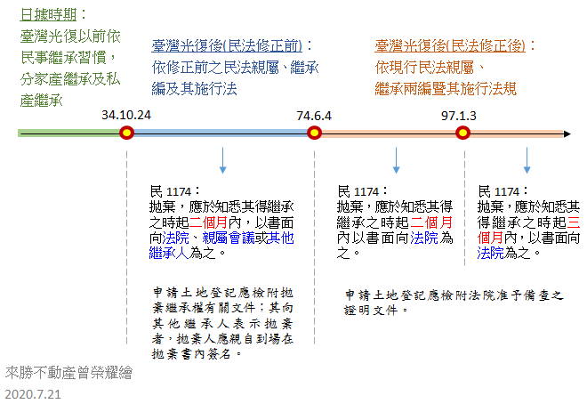

## 572. 都市更新事業計畫同意比率
*發布日期: 2020-07-16* 

## 內文
各位同學好

今年高普考、估價師要多注意都市更新條例之出題，主要是去年修法後卻還未大幅度出題，今年尤其注意…以下為各位整理有關都市更新事業計畫之同意比率規定：

• (一) 都市更新事業計畫之同意比率門檻

1. 原則：實施者擬訂或變更都市更新事業計畫報核時，應經一定比率之私有土地與私有合法建築物所有權人數及所有權面積之同意；其同意比率依下列規定計算(都更§37I前段)：

1. 依第12條規定經公開評選委託都市更新事業機構辦理者：

1. 原則：應經更新單元內私有土地及私有合法建築物所有權人均超過二分之一，且其所有土地總面積及合法建築物總樓地板面積均超過二分之一之同意。

2. 例外：但公有土地面積超過更新單元面積二分之一者，免取得私有土地及私有合法建築物之同意。

3. 保障：實施者應保障私有土地及私有合法建築物所有權人權利變換後之權利價值，不得低於都市更新相關法規之規定。

2. 依第22條規定辦理者（更新地區內）

1. 迅行劃定：依第七條規定劃定或變更之更新地區，應經更新單元內私有土地及私有合法建築物所有權人均超過二分之一，且其所有土地總面積及合法建築物總樓地板面積均超過二分之一之同意。

2. 一般、優先劃定、策略性：其餘更新地區，應經更新單元內私有土地及私有合法建築物所有權人均超過四分之三，且其所有土地總面積及合法建築物總樓地板面積均超過四分之三之同意。

3. 依第二十三條規定辦理者（更新地區外-自行劃定）應經更新單元內私有土地及私有合法建築物所有權人均超過五分之四，且其所有土地總面積及合法建築物總樓地板面積均超過五分之四之同意。

2. 例外：但私有土地及私有合法建築物所有權面積均超過十分之九同意者，其所有權人數不予計算(都更§37I後段)

都市更新事業計畫同意比率彙整表

• T. ABLE_PLACEHOLDER_1

• (二) 不計入計算比率者(都更§24)

申請實施都市更新事業之人數與土地及建築物所有權比率之計算，不包括下列各款：

1. 依文化資產保存法所稱之文化資產。

2. 經協議保留，並經直轄市、縣(市)主管機關核准且登記有案之宗祠、寺廟、教堂。

3. 經政府代管或依土地法第七十三條之一規定由地政機關列冊管理者。

4. 經法院囑託查封、假扣押、假處分或破產登記者。

5. 未完成申報並核發派下全員證明書之祭祀公業土地或建築物。

6. 未完成申報並驗印現會員或信徒名冊、系統表及土地清冊之神明會土地或建築物。
---
*注：本文圖片存放於 ./images/ 目錄下*

## 573. 新冠肺炎對我國不動產市場之影響
*發布日期: 2020-07-16* 

## 內文
【高普考及不動產估價師之時事題】試述新冠肺炎疫情對我國不動產市場之影響？

【解答】

茲分新冠肺炎疫情流行時期與後疫情時期等兩個時期說明：

• (一) 新冠肺炎疫情流行時期：新冠肺炎疫情是今年最大黑天鵝事件，全世界經濟受創嚴重。我國為貿易依存度極高的國家，自不例外。惟我國不動產市場受創程度相對較輕，其原因如下：

1. 我國防疫成功：由於我國超前防疫，加上國人配合政府宣導戴口罩及勤洗手，因而未造成群聚感染與社區感染。

2. 不動產屬於內需市場：不動產位置固定，屬於本土性產業，無法輸出或輸入，因此較不受國外疫情嚴重之影響。

• (二) 後疫情時期：我國對疫情控制得宜，疫情緩和後，人氣、買氣迅速回籠，不動產市場逐漸回溫，甚至價量齊揚。其原因如下：

1. 超低利率環境：各國為了挽救經濟，採取寬鬆貨幣政策，引導利率下降，我國亦然。在超低利率下，建商、壽險業大舉獵地，一般民眾報復性購屋。

2. 海外資金回流：美中貿易戰及香港國安法事件，導致台商資金回流。回流資金，不外投入股市及房市，造成不動產市場榮景。

3. 國際熱錢流入：全球QE，游資充斥，加上台幣升值，熱錢大量流入我國，造成資金氾濫。現階段不動產市場正處於低利率下的資金行情。

總之，後疫情時期，不動產市場恐有泡沫化現象，值得政府密切注意，及早因應。
---
*注：本文圖片存放於 ./images/ 目錄下*

## 574. 都市更新代拆規定
*發布日期: 2020-07-09* 

## 內文
各位同學好

今日專欄為各位同學說明都市更新條例第57條第1項有關都市更新權利變換代拆機制：

1. 權利變換範圍內應行拆除或遷移之土地改良物，由實施者依主管機關公告之權利變換計畫通知其所有權人、管理人或使用人，限期三十日內自行拆除或遷移；屆期不拆除或遷移者，依下列順序辦理：(1)由實施者予以代為之。(2)由實施者請求當地直轄市、縣（市）主管機關代為之。說明：權利變換計畫經主管機關核定發布實施，即對範圍內相對人、關係人及行政機關產生規制效力，應行拆除或遷移之土地改良物應自行拆除。如不拆則依順序由實施者先行協調代拆，如協調不成，則請求直轄市、縣（市）主管機關代拆。

2. 實施者依前項第一款規定代為拆除或遷移前，應就拆除或遷移之期日、方式、安置或其他拆遷相關事項，本於真誠磋商精神予以協調，並訂定期限辦理拆除或遷移；說明：(1)實施者協調，實務又稱為「私調」。(2)所謂「真誠磋商精神」係按「公民與政治權利國際公約」、「經濟社會文化權利國際公約」兩公約提到任何人的居住權皆應受到保護，免受「無理或非法侵擾」，至於受到驅逐者應有之八項保障內容中，有一項即提到「應讓那些受影響的人有一個真正磋商的機會」。

3. 協調不成者，由實施者依前項第二款規定請求直轄市、縣（市）主管機關代為之；直轄市、縣（市）主管機關受理前項第二款之請求後應再行協調，再行協調不成者，直轄市、縣（市）主管機關應訂定期限辦理拆除或遷移。說明：(1)直轄市、縣（市）主管機關再行協調，實務又稱為「公調」。(2)注意私調、公調不是各僅限於一次，例如新北市新店區寶強路都更案，建商自行協調有6次、公部門再行協調2次。(3)透過政府公開、透明的協商制度減少爭議。代拆可視為基於公共利益考量下公權力強行介入，加速都市更新辦理，保障同意戶、實施者之儘速重建權益，但也應於協調過程中確保不同意戶之權益（亦即應同時兼顧同意戶、實施者與不同意戶三方之權益）。

4. 但由直轄市、縣（市）主管機關自行實施者，得於協調不成時逕為訂定期限辦理拆除或遷移，不適用再行協調之規定。說明：由直轄市、縣（市）主管機關自行實施，已本身自屬實施者辦理協調，即不須再行協調。

又同條第四項授權各地方政府自行訂定自治法規，可參考新北市「新北市都市更新權利變換實施者申請拆除或遷移土地改良物辦法」之執行程序，如下圖所示：其程序為：實施者私調→申請代拆→縣市政府公調→內部研商→執行代拆其中：

1. 實施者應召開一次以上協調會議（私調），而經待拆戶累計三次未到場協調者，視為協調不成立。

2. 縣市政府再行協調會議（公調），以召開二次為原則。待拆戶未出席再行協調會議累計達二次者，視為再行協調不成立。

3. 內部研商指召集有關機關、公用事業及實施者研商拆遷之執行方式，並會同實施者現地查核。

[圖片1]

## 文章圖片

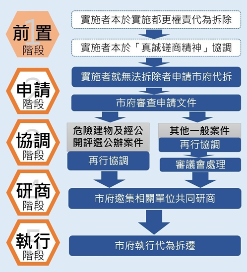

## 575. 實價登錄新制之亮點
*發布日期: 2020-07-09* 

## 內文
實價登錄新制於民國109年7月1日正式實施。

• (一) 新制之亮點：新制有三大亮點。

1. 買賣案件之申報責任回歸到買賣雙方：舊制之申報責任由地政士或不動產經紀業負責，新制之申報責任由買賣雙方負責。買賣雙方對於登錄價格會發生相互牽制之作用。倘買方擬高報價格，以增加貸款金額，則會使賣方之房地合一所得稅增加。倘賣方擬低報價格，以逃漏稅捐，則會使買方未來出售時多繳房地合一所得稅。

2. 買賣案件申請移轉登記時一併辦理：舊制於買賣案件辦竣所有權移轉登記三十日內申報登錄，新制於買賣案件申請移轉登記時申報登錄。新制不僅簡化行政流程，也提高資訊揭露時效。

3. 依申報不實情節予以輕重不同裁罰：

1. 未共同申報登錄資訊：買賣雙方違反規定，未共同申報登錄資訊者，直轄市、縣（市）主管機關應令其限期申報登錄資訊；屆期未申報登錄資訊，買賣案件已辦竣所有權移轉登記者，處新臺幣三萬元以上十五萬元以下罰鍰，並命其限期改正；屆期未改正者，按次處罰。

2. 申報登錄價格資訊不實：買賣雙方違反規定，申報登錄價格資訊不實者，由直轄市、縣（市）主管機關處新臺幣三萬元以上十五萬元以下罰鍰，並命其限期改正；屆期未改正者，按次處罰。所稱價格不實，指申報書之交易總價、車位個數及車位總價等三項價格資訊申報不實而言。

3. 申報登錄價格以外資訊不實：買賣雙方違反規定，申報登錄價格以外資訊不實者，直轄市、縣（市）主管機關應命其限期改正；屆期未改正者，處新臺幣六千元以上三萬元以下罰鍰，並命其限期改正；屆期未改正者，按次處罰。

綜上，第(1)款及第(3)款，勸導後處罰；第(2)款，直接處罰。第(1)款及第(2)款，處3萬元至15萬元；第(3)款，處6千元至3萬元。

• (二) 申報方法：申報方法可分線上申報及紙本申報二種。

1. 線上申報：先申請自然人憑證，再登入身分證統一編號及密碼，待資料輸入完成，即可選擇線上送件。

2. 紙本申報：買賣雙方先上網填寫，列出紙本後簽章，再送交地政事務所。

• (三) 須改進之處：

1. 社區名稱、實際門牌等資訊應完整揭露，使不動產交易資訊揭露更加透明。

2. 預售屋於買賣契約簽訂後三十日內申報登錄，使不動產交易資訊即時揭露。

3. 租賃案件透過不動產經紀業必須實價登錄，而屋主自己出租不必實價登錄，造成屋主選擇自己出租，藉此逃漏租賃所得稅。因此，租賃案件不論透過不動產經紀業或由屋主自己出租，皆要求實價登錄。

4. 政府應建立稽核制度，再搭配違規處罰，以達成遏止不實申報之效。

5. 對故意申報不實者，地政機關應主動移送檢調偵辦，以刑法第214條使公務員登載不實文書罪論處。
---
*注：本文圖片存放於 ./images/ 目錄下*

## 576. 房地合一所得稅自住減免與重購退稅之比較
*發布日期: 2020-07-02* 

## 內文
試比較房地合一所得稅自住減免與重購退稅之條件有何不同？

【解答】

• (一) 戶籍條件不同：

1. 自住減免：個人或其配偶、未成年子女設有戶籍並居住，連續滿六年。

2. 重購退稅：個人或其配偶、直系親屬設有戶籍並居住，無設籍期間之限制。

• (二) 使用條件不同：

1. 自住減免：交易前六年內，無出租、供營業或執行業務使用。

2. 重購退稅：出售前一年內，無出租、供營業或執行業務使用。

• (三) 持有期限不同：

1. 自住減免：持有且實際居住連續滿六年。

2. 重購退稅：不論舊屋或新屋，無持有期間之限制；但出售舊屋與重購新屋移轉登記須在二年內。

• (四) 適用次數不同：

1. 自住減免：交易前六年內未曾適用自住減免。換言之，每六年僅能適用一次。

2. 重購退稅：無處數及次數之限制；但重購後五年內再行移轉或變更用途，追繳原退還稅款。

• (五) 申請期限不同：

1. 自住減免：房地完成移轉登記日之次日起算三十日內申報。

2. 重購退稅：重購房地完成移轉登記日之次日起算五年內申請。

綜上，自住減免之條件較重購退稅嚴格。另，自住減免與重購退稅可以並用。即先適用自住減免（即課稅所得在400萬元以下免税，超過400萬元適用10%稅率），再適用重購退稅（即重購價額大於或等於出售價額，退還全部稅款；重購價額小於出售價額，按比例退還稅款）。
---
*注：本文圖片存放於 ./images/ 目錄下*

## 577. 各種容積之概念
*發布日期: 2020-07-02* 

## 內文
各位同學好

今日專欄為各位同學整理各種「容積」之概念。

1. 容積：指土地可建築之總樓地板面積。

2. 容積(率)管制：係以限制建築物實體建築總量與建築基地面積之比例，藉以達到控制土地使用強度，確保整體居住生活品質的制度。原則規定於各都市計畫之土地使用管制規定中。

3. 容積獎勵：主要是為解決部分公共服務機能不足問題，故以容積作為獎勵誘因，鼓勵民間設置必要性之公共設施或配合相關政策。包含開放空間、停車位、都市計畫、都市更新等情形。

4. 容積移轉：指一宗土地容積移轉至其他可建築土地供建築使用。包含文化資產、公共設施保留地、開放空間、歷史建築、河川區等情形。

5. 增額容積：指都市計畫擬定機關配合公共建設計畫之財務需要，於變更都市計畫之指定範圍內增加之容積。亦即係由地方政府提高公共建設影響範圍內的建築容積，以一次或分批競標方式預收價金，並將得標者預繳之價金挹注重大公共建設經費。得標者預繳價金所取得之增額容積，得於增額容積實施地區內自行建築使用，或由地區內其他土地所有權人建築使用。

6. 基準(法定)容積：指以都市計畫及其相關法規規定之容積率上限乘土地面積所得之積數。

7. 容積上限：於法定容積增加建築容積之最高上限。例如依都市計畫法台灣省施行細則第34條之3規定，各土地使用分區除增額容積及依本法第八十三條之一規定可移入容積外，於法定容積增加建築容積後，不得超過下列規定：一、依都市更新法規實施都市更新事業之地區：建築基地一點五倍之法定容積或各該建築基地零點三倍之法定容積再加其原建築容積。二、前款以外之地區：建築基地一點二倍之法定容積。

8. 容積折繳代金(容積銀行)：所謂的容積銀行制度即儲備買賣容積的概念，由政府建立一個容積交易平台，藉由資訊流通、協助交易、認證制度及蒐集價格等，協助確認容積商品資訊，媒合買賣雙方及容積移轉相關作業，透過穩定的收購與釋出，調節市場供需及維持發展平衡，並將開發商購買容積所繳納的代金收入用來取得私有公共設施保留地及都市建設，以落實公共利益，完善容積交易市場之機制。簡言之，容積移轉折繳代金指申請容積移轉透過付代金（代替直接捐贈公保地）來取得移入容積，而代金計算則透過估價核定。
---
*注：本文圖片存放於 ./images/ 目錄下*

## 578. 都市計畫之問題
*發布日期: 2020-06-25* 

## 內文
各位同學好

為改善居民生活環境，並促進市、鎮、鄉街有計畫之均衡發展，特制訂都市計畫法，在一定地區內有關都市生活之經濟、交通、衛生、保安、國防、文教、康樂等重要設施，作有計畫之發展，並對土地使用作合理之規劃。請問我國都市計畫制度有何問題？

• (一) 效率面

1. 規劃觀念與方法無法肆應當前都市發展需要：傳統二度空間平面式之都市規劃觀念及方法，已無法符合新世紀 發展潮流與需求，且因應臺灣人口高齡少子女化之發展趨勢，現行通盤檢討作業規定及公共設施用地檢討標準依附「計畫人口」之思維，已面嚴峻挑戰。

2. 都市計畫通盤檢討之意義與核心價值未受重視：多數地區都市計畫未能踐行全市性、系統性定期通盤檢討，都市計畫基本調查未受重視，通盤檢討作業程序過於冗長，缺乏都市發展願景及發展課題與對策之提出，無法符合地方發展需要。又，良好都市環境所必須的環境指標，如人口密度、日照、採光、通風等要素，在規則中仍缺乏全盤的考慮與規劃，致使環境品質的管制標準付之闕如。

3. 都市計畫擬定變更之審議層級過於冗長：目前由鄉、鎮、縣轄市公所擬定都市計畫之主要計畫變更案需經鄉（鎮、市）都委會、縣都委會及內政部都委會三級都委會審議通過，審議層級過於冗長。此外，缺乏簡易變更作業之機制，無法落實中央與地方權責分工精神，亦無法因應當前社會環境快速變遷及公共建設計畫時程需要。

• (二) 公平面

1. 欠缺實質民眾參與的機制：目前都市規劃及審議過程中之民眾參與機制，仍有待加強，以建立公信力，杜絕民眾疑慮。尤其，現行不論是公開展覽或說明會，多為消極被動參與方式，缺乏實質的溝通對話及討論。

2. 我國都市計畫非常缺乏公正合理的審議機制：政府故意把都市計畫形塑成非常「專業」的事務，致使都市計畫僅能由極少數的專家學者及行政官僚所組成的都市計畫委員會來進行審議。都委會成員中，政府行政官僚幾乎佔了半數，而其他委員的遴聘也完全是由首長決定，這使得都委會的審議如同是球員兼裁判，結論總是偏向政府這一方，犧牲人民的權益。

3. 以往都市計畫非常欠缺行政救濟保障：現雖剛建立都市計畫通盤檢討畫救濟機制，但尚有待觀察。

4. 公共設施保留地之不公：公共設施保留地無限期保留之不公：公共設施保留地之取得原有期限之規定，因取得經費籌措困難，修法取消取得期限之規定，允許公共設施保留地可以無限期保留。惟公共設施保留地可以無限期之保留嚴重違反憲法「保障人民財產」之規定，期限過久將成為特別犧牲之疑慮，以及違反平等原則。
---
*注：本文圖片存放於 ./images/ 目錄下*

## 579. 超額累進與全額累進之爭
*發布日期: 2020-06-25* 

## 內文
累進稅有超額累進與全額累進之分。前者如地價稅、土地增值稅、遺產稅、贈與稅等是；後者如田賦。

• (一) 特色：

1. 超額累進：累進稅之課稅級距，僅就超過該級距門檻之部分，始課徵該級距之稅率。

2. 全額累進：累進稅之課稅級距，凡超過該級距門檻，稅基全部一律採用該級距之稅率課徵。

例如：土地增值稅之第一級距稅率20%，第二級距稅率30%，第三級距稅率40%。如下圖所示。若土地漲價總數額為250萬元，如採超額累進應課徵70萬元，如採全額累進應課徵100萬元。[圖片下載失敗](1)超額累進：100x20%+(200-100)x30%+(250-200)x40%=70(2)全額累進：250x40%=100

• (二) 超額累進之優點：

1. 循序漸進：超額累進採漸進加重，就課稅基礎分階段提高稅負。

2. 符合公平：同上例之課稅級距，設甲之土地漲價總數額為199萬元，乙之土地漲價總數額為201萬元。如採超額累進，則甲之稅負為49.7萬元，乙之稅負為50.4萬元，兩者相差無幾。如採全額累進，則甲之稅負為59.7萬元，乙之稅負為80.4萬元，兩者相差懸殊。

1. 超額累進：甲：100x20%+(199-100)x30%=49.7乙：100x20%+(200-100)x30%+(201-200)x40%=50.4

2. 全額累進：甲：199x30%=59.7乙：201x40%=80.4

綜上，就租稅公平而言，土地增值稅採超額累進優於全額累進。
---
*注：本文圖片存放於 ./images/ 目錄下*

## 580. 回饋之概念
*發布日期: 2020-06-18* 

## 內文
各位同學好

土地使用變更，由原本低利用價值之土地使用，申請改變為高利用價值之使用，以獲得開發利益（或稱為變更利得），目前許多法規要求應予進行「回饋」。今日專欄為各位同學整理有關「回饋」之意涵（廣義）：

1. 內部性的公共設施負擔對於位在開發區範圍供開發目的使用之公共設施，因該類公共設施係基於開發所衍生之需求，並係以滿足開發區內活動之需求，及為維護開發區內部環境品質而設置，故開發者有負擔之義務。

2. 外部性影響之負擔因土地開發經常導致開發區外部環境之負面衝擊，故其外部性社會成本應由開發者負擔。例如，因土地開發導致鄰近公共設施需求增加之社會成本，或因開發而排擠既有公共設施使用者之擁擠成本；此類外部成本，開發者應有加以吸收之義務。

3. 其他義務之負擔

1. 土地開發造成排擠效果基於土地開發在政府實施相關土地使用計畫下，造成後申請開發者受到先申請開發者之排擠效果，或先申請開發者剝奪其他土地使用機會，例如實施總量管制。因此，宜由開發者捐獻相當金額，以回饋社會。

2. 回饋土地發展受限地區部份土地因政府實施土地使用計畫而致發展受限（例如，農地禁建），故宜由土地使用計畫中屬可開發之土地，於開發時捐部份金額，以回饋該類發展受限地區。

3. 維護社會公平原則土地開發者在土地由低強度使用變更為較高度使用時，獲取超過正常利潤之不勞利得，在目前因無法以課稅方式，完全收歸公有，故宜由開發者捐獻相當金額，以維護社會公平。

4. 維護山水資源之永續發展因土地開發通常山水資源具相當之影響，故由開發者捐獻部份金額，以擔負山水資源之維護及永續發展之責任，例如提供造林基金。

5. 土地開發後管理維護之需要為使土地開發後之管理、維護工作得以落實，宜由開發者提供部份金額，負擔該項責任。

6. 其他因素為對開發區附近達到敦親睦鄰之效果，或配合地方施政方針之需要，以使開發案順利開發；或為照顧經濟弱勢族群對住宅之需求，可由開發者提供相當金額，或興設開發地區所需之相關設施，以回饋地方及社會。例如，在開發地區興建集會所、鄉里休閒中心或低收入住宅。
---
*注：本文圖片存放於 ./images/ 目錄下*

## 581. 倍數累進與金額累進之爭
*發布日期: 2020-06-18* 

## 內文
累進稅有倍數累進與金額累進之分。前者如地價稅、土地增值稅等是；後者如遺產稅、贈與稅等是。茲比較如下：

• (一) 特色：

1. 金額累進就絕對利得予以累進課徵，倍數累進就相對利得予以累進課徵。

2. 金額累進以固定金額劃分課稅級距，倍數累進以投資報酬率劃分課稅級距。茲以投資報酬率觀點敍述土地增值稅之稅率結構：

1. 投資報酬率未達100%，就其獲利金額課徵20%。

2. 投資報酬率在100%以上而未達200%，除按前款課徵外，就其超過之獲利金額部分，課徵30%。

3. 投資報酬率在200%以上，除按前二款課徵外，就其超過之獲利金額部分，課徵40%。

• (二) 倍數累進之優缺點：

1. 優點：

1. 對暴利所得者，加重課稅，符合社會正義。

2. 地價較低之市郊或新發展區，土地漲價金額少，但漲價倍數高，表示投資報酬率高，如採倍數累進可以有效打擊郊區及新發展區之土地投機。

3. 地價較高之市中心區，土地漲價金額多，但漲價倍數低，表示投資報酬率低，如採倍數累進，可以有效確保市中心正常發展及都市更新。

4. 倍數累進可以抑制郊區之蔓延發展，維持市中心區之正常發展，推動都市緊密成長。

2. 缺點：

1. 漲價倍數高，並不一定漲價金額多，卻適用較重稅率；反之，漲價倍數低，並不一定漲價金額少，卻適用較輕稅率。

2. 長期持有土地之土地所有權人，將來一旦出售土地，由於原地價低，造成漲價倍數較高，須負擔較重賦稅。

3. 土地所有權人可以採輾轉買賣之假移轉方式，以逃避適用高累進稅率。

• (三) 金額累進之優缺點：

1. 優點：

1. 不問漲價倍數多寡，只要漲價金額相同，一律適用相同之稅率，符合稅負公平原則。

2. 不問持有土地之長短，一律按漲價金額課徵。對長期持有土地而無投機之自用者而言，不會產生不利影響。

2. 缺點：

1. 土地所有權可以藉化整為零，分批出售，減少每批交易金額，以適用較低稅率。如此將造成土地細分，妨害土地利用。若採倍數累進，則無本項缺點。

2. 土地所有權人可以採輾轉買賣之假移轉方式，以逃避適用高累進稅率。若採倍數累進，仍無法排除本項缺點。

3. 如果遇到物價劇烈上漲，課稅級距金額固定，將造成納稅義務人實質稅負增加。因此必須經常修法或採物價指數連動法加以補救。若採倍數累進，則無本項缺點。

綜上，就政策目的而言，土地增值稅採倍數累進優於金額累進。
---
*注：本文圖片存放於 ./images/ 目錄下*

## 582. 共有處分、變更、設定於民法及土地法之適用差異
*發布日期: 2020-06-11* 

## 內文
各位同學好

今日專欄為各位同學整理有關共有處分、變更、設定於民法及土地法規定之差異。

民法§819II規定：共有物之處分、變更、及設定負擔，應得共有人全體之同意。土地法§34-1I規定：共有土地或建築改良物，其處分、變更、及設定地上權、農育權、不動產役權或典權，應以共有人過半數及其應有部分合計過半數之同意行之。但其應有部分合計逾三分之二者，其人數不予計算。

兩者之差異茲整理如表：

• T. ABLE_PLACEHOLDER_1
---
*注：本文圖片存放於 ./images/ 目錄下*

## 583. 累進稅與比例稅之爭
*發布日期: 2020-06-11* 

## 內文
租稅稅率有累進稅與比例稅之分。前者如地價稅、土地增值稅、遺產稅、贈與稅等是；後者如房屋稅、契稅、房地合一所得稅等是。茲比較如下：

• (一) 特色：

1. 比例稅：亦稱單一稅率；稅率固定不變，稅率不隨稅基增加而遞增。

2. 累進稅：稅率隨稅基增加而遞增。

• (二) 比例稅之功能：

1. 簡化稽徵手續：就計算稅額而言，比例稅較累進稅簡單容易，符合簡政便民。

2. 租稅絕對公平：稅基之每一塊錢，所課徵之稅額相同，符合租稅公平。

• (三) 累進稅之功能：

1. 平均社會財富：漲價多者負擔較重的稅，漲價少者負擔較輕的稅，以縮小貧富差距。

2. 防止投機暴利：地價增漲快速，漲幅大、倍數高，適用較高稅率，以抑制土地投機。

3. 符合量能課稅：隨著漲幅愈大，不勞而獲愈多，適用較高稅率，以去除不勞而獲，並符合量能課稅。

綜上，就政策目的而言，土地增值稅採累進稅優於比例稅。
---
*注：本文圖片存放於 ./images/ 目錄下*

## 584. 信託法實例研習
*發布日期: 2020-06-04* 

## 內文
甲有一間店面，採自益信託且信託登記於乙，信託契約載明由乙出租管理，然乙擅自出售於丙並辦竣移轉登記。嗣甲即訴請法院撤銷該買賣契約，並塗銷移轉登記，是否可行？丙遂主張土地法第43條或民法第759條之1第2項以為保護，是否可行？

【解答】

• (一) 信託法第18條規定，受託人違反信託本旨處分信託財產時，受益人得聲請法院撤銷其處分。前項撤銷權之行使，以信託財產為已辦理信託登記之應登記之財產權為限，始得為之。準此，甲訴請法院撤銷該買賣契約，並塗銷移轉登記，為可行。另，信託法第19條規定，撤銷權自受益人知有撤銷原因時起，一年間不行使而消滅。自處分時起逾十年者，亦同。

• (二) 信託法第4條第1項規定，以應登記之財產權為信託者，非經信託登記，不得對抗第三人。準此，本案已辦竣信託登記，故得以對抗第三人丙。況，丙得由公開之登記簿及信託專簿查知信託資訊，因此丙已非「善意第三人」，故丙主張土地法第43條或民法第759條之1第2項以為保護，為不可行。
---
*注：本文圖片存放於 ./images/ 目錄下*

## 585. 公益信託之稅負
*發布日期: 2020-06-04* 

## 內文
各位同學好

地政士考試即將到來，本週專欄為各位同學整理及說明有關「公益信託」之相關土地稅負減免規定。

依信託法第69條規定，稱公益信託者，謂以慈善、文化、學術、技藝、宗教、祭祀或其他以公共利益為目的之信託。如環境信託、營養午餐公益信託等。因其具有公共利益性質，故許多土地稅負得以減免。茲整理如下：

1. 遺產稅＝不計入遺產總額：遺贈人、受遺贈人或繼承人提供財產，捐贈或加入於被繼承人死亡時已成立之公益信託並符合左列各款規定者，該財產不計入遺產總額（遺贈法第16條-1）：

1. 受託人為信託業法所稱之信託業。

2. 各該公益信託除為其設立目的舉辦事業而必須支付之費用外，不以任何方式對特定或可得特定之人給予特殊利益。

3. 信託行為明定信託關係解除、終止或消滅時，信託財產移轉於各級政府、有類似目的之公益法人或公益信託。

2. 贈與稅＝不計入贈與總額：因委託人提供財產成立、捐贈或加入符合第十六條之一各款規定之公益信託，受益人得享有信託利益之權利，不計入贈與總額。（遺贈法第20條-1）

3. 房屋稅＝免徵：依房屋稅條例第15條，私有房屋有下列情形之一者，免徵房屋稅：十一、經目的事業主管機關許可設立之公益信託，其受託人因該信託關係而取得之房屋，直接供辦理公益活動使用者。

4. 契稅＝不課徵：不動產為信託財產者，於左列各款信託關係人間移轉所有權，不課徵契稅(契稅條例第14條之1)：

1. 因信託行為成立，委託人與受託人間。(交付房屋成立公益信託時)

2. 信託關係存續中受託人變更時，原受託人與新受託人間。

3. 信託契約明定信託財產之受益人為委託人者，信託關係消滅時，受託人與受益人間。

4. 因遺囑成立之信託，於信託關係消滅時，受託人與受益人間。

5. 因信託行為不成立、無效、解除或撤銷，委託人與受託人間。

5. 土地增值稅＝不課徵：土地為信託財產者，於下列各款信託關係人間移轉所有權，不課徵土地增值稅（土地稅法第28條之3）：

1. 因信託行為成立，委託人與受託人間。(交付土地成立公益信託時)

2. 信託關係存續中受託人變更時，原受託人與新受託人間。

3. 信託契約明定信託財產之受益人為委託人者，信託關係消滅時，受託人與受益人間。

4. 因遺囑成立之信託，於信託關係消滅時，受託人與受益人間。

5. 因信託行為不成立、無效、解除或撤銷，委託人與受託人間。

6. 至於地價稅依土地稅法第3條之1規定仍須繳納，即信託土地應與委託人在同一直轄市或縣(市)轄區內所有之土地合併計算地價總額，依第十六條規定稅率課徵地價稅，分別就各該土地地價占地價總額之比例，計算其應納之地價稅。但信託利益之受益人為非委託人且符合左列各款規定者，前項土地應與受益人在同一直轄市或縣(市)轄區內所有之土地合併計算地價總額：

1. 受益人已確定並享有全部信託利益者。

2. 委託人未保留變更受益人之權利者。
---
*注：本文圖片存放於 ./images/ 目錄下*

## 586. 開發許可程序
*發布日期: 2020-05-28* 

## 內文
各位同學好

今日專欄為各位整理說明有關目前區域計畫開發許可的程序：

非都市土地開發需辦理土地使用分區變更者，其申請人應依相關審議作業規範之規定製作開發計畫書圖及檢具有關文件，並依下列程序，向直轄市或縣（市）政府申請辦理(非§13)：

1. 申請開發許可。

2. 相關公共設施用地完成土地使用分區及使用地之異動登記，並移轉登記為該管直轄市、縣（市）有或鄉（鎮、市）有。但其他法律就移轉對象另有規定者，從其規定。

3. 申請公共設施用地以外土地之土地使用分區及使用地之異動登記。

4. 山坡地範圍，依水土保持法相關規定應擬具水土保持計畫者，應取得水土保持完工證明書；非山坡地範圍，應取得整地排水完工證明書。但申請開發範圍包括山坡地及非山坡地範圍，非山坡地範圍經水土保持主管機關同意納入水土保持計畫範圍者，得免取得整地排水完工證明書。

其程序詳細說明如下：

1. 擬定開發計畫申請(區§15-1)：為開發利用，依各該區域計畫之規定，由申請人擬具開發計畫，檢同有關文件，向直轄市、縣(市)政府申請，報經各該區域計畫擬定機關許可後，辦理分區變更。

2. 許可審議：申請開發之案件，直轄市、縣(市)政府應於受理後六十日內，報請各該區域計畫擬定機關辦理許可審議但有特殊情形者，得延長一次，其延長期間並不得超過原規定之期限。(區§15-4)

3. 開發許可之核發：

1. 核准要件：申請開發之案件，經審議符合下列各款條件，得許可開發(區§15-2)︰

1. 於國土利用係屬適當而合理者。

2. 不違反中央、直轄市或縣(市)政府基於中央法規或地方自治法規所為之土地利用或環境保護計畫者。

3. 對環境保護、自然保育及災害防止為妥適規劃者。

4. 與水源供應、鄰近之交通設施、排水系統、電力、電信及垃圾處理等公共設施及公用設備服務能相互配合者。

5. 取得開發地區土地及建築物權利證明文件者。

2. 通知：區域計畫擬定機關應於九十日內將審議結果通知申請人，但有特殊情形者，得延長一次，其延長期間並不得超過原規定之期限（區§15-4），該審議結果包含許可、不予許可、有條件許可之情形。

3. 公告：申請案經區域計畫委員會審議同意後，由區域計畫擬定機關核發開發許可予申請人，並通知土地所在地直轄市或縣（市）政府(非§14)。直轄市或縣（市）政府應將許可內容於各該直轄市、縣（市）政府或鄉（鎮、市、區）公所公告三十日(非§20)。

4. 公設用地分割移轉登記與開發影響費繳交(區§15-3)：申請開發者依法取得區域計畫擬定機關許可後，辦理分區或用地變更前，應將開發區內之公共設施用地完成分割移轉登記為各該直轄市、縣(市)有或鄉、鎮(市)有，並向直轄市、縣(市)政府繳交開發影響費，作為改善或增建相關公共設施之用；該開發影響費得以開發區內可建築土地抵充之。

5. 分區及使用地變更編定異動登記(非§26)：申請人於非都市土地開發依相關規定應興闢公共設施、繳交開發影響費、捐贈土地或繳交土地代金或回饋金時，應先完成捐贈之土地及公共設施用地之分割、移轉登記，並繳交開發影響費、土地代金或回饋金後，由直轄市或縣(市)政府辦理土地使用分區及使用地變更編定異動登記，並函請土地登記機關於土地登記簿標示部加註核定事業計畫使用項目。

6. 水土保持計畫或整地排水計畫審核(非§23)：申請人於獲准開發許可後，應於收受通知之日起一年內擬具水土保持計畫或整地排水計畫送請水土保持主管機關或直轄市、縣(市)政府審核，以從事區內整地排水及公共設施用地整地等工程，並於工程完成，經直轄市或縣(市)政府查驗合格後，除其他法律另有規定外，申請人應辦理相關公共設施用地移轉予該管直轄市、縣(市)政府或鄉(鎮、市)公所，始得申請辦理變更編定為允許之使用分區及使用地。但開發案件因故未能於期限內申請水土保持計畫或整地排水計畫審核者，得敘明理由於期限屆滿前申請展期；展期之期間每次不得超過一年，並以二次為限；逾期未申請者，區域計畫擬定機關原許可失其效力。
---
*注：本文圖片存放於 ./images/ 目錄下*

## 587. 土地分割之綜合整理
*發布日期: 2020-05-28* 

## 內文
不動產分割合併包含土地分割、土地合併、建物分割及建物合併等四種。實務上以土地分割之案件最多。

• (一) 土地分割之方法：共有物分割（指權利分割，不包括標示分割）不得適用土地法第34條之1之多數決，因此土地分割方法有協議分割、調處分割及裁判分割三種。

1. 協議分割：由全體共有人同意而為土地分割（民法§824Ⅰ）。協議分割適用民法第758條，採登記生效要件主義（即設權登記）。

2. 調處分割：共有人不能協議分割，任何共有人得申請該管直轄市、縣（市）地政機關調處而為土地分割（土地法34-1Ⅵ）。調處分割適用民法第758條，採登記生效要件主義（即設權登記）。

3. 裁判分割：共有人不能協議分割，任何共有人得請求法院而為裁判分割（民法§824Ⅱ）。裁判分割適用民法第759條，採登記處分要件主義（即宣示登記）。

• (二) 土地分割之登記：土地分割如涉及標示變更，應辦理標示變更登記；土地分割如涉及權利變更，應辦理所有權移轉登記。土地分割登記之種類有純標示分割型、純權利分割型及混合分割型三種。

1. 純標示分割型：土地分割僅涉及標示變更，未涉及權利變更，故僅辦理標示變更登記，無須辦理所有權移轉登記。例如，甲、乙二人共有一宗土地，地號18，應有部分各二分之一。今分割為二宗土地，地號18及地號18-1。地號18，由甲、乙二人共有，應有部分各二分之一；地號18-1，由甲、乙二人共有，應有部分各二分之一。

2. 純標示分割型得適用土地法第34條之1之多數決。

3. 純權利分割型：土地分割僅涉及權利變更，未涉及標示變更，故僅辦理所有權移轉登記，無須辦理標示變更登記。例如，甲、乙二人共有一宗土地，地號19，應有部分各二分之一；甲、乙二人共有另一宗土地，地號20，應有部分各二分之一。今辦理分割，地號19全歸甲所有，地號20全歸乙所有。

4. 純權利分割型不得適用土地法第34條之1之多數決。

5. 混合分割型：土地分割涉及標示變更，亦涉及權利變更，故應先辦理標示變更登記，再辦理所有權移轉登記。例如，甲、乙二人共有一宗土地，地號21，應有部分各二分之一。今分割為二宗土地，地號21及地號21-1。地號21全歸甲所有，地號21-1全歸乙所有。混合分割型不得適用土地法第34條之1之多數決。

• (三) 土地分割之稅負：標示變更因未涉及所有權移轉，故不徵土地增值稅；權利變更因涉及所有權移轉，故應課徵土地增值稅。

1. 純標示分割型之稅負：不徵土地增值稅。

2. 純權利分割型之稅負：課徵土地增值稅。

3. 混合分割型之稅負：分別共有土地分割後，各人所取得之土地價值與其分割前應有部分價值相等者，免徵土地增值稅（應注意者，在此所稱免徵土地增值稅，其實是不課徵土地增值稅）；其價值減少者，就其減少部分課徵土地增值稅（土地稅法施行細則§42Ⅱ）。
---
*注：本文圖片存放於 ./images/ 目錄下*

## 588. 土地分割之稅負
*發布日期: 2020-05-21* 

## 內文
土地分割之類型有三，即純標示分割型、純權利分割型及混合分割型等三種。其中混合分割型指包含標示分割與權利分割二種混合而成。純標示分割型，因未涉及所有權移轉，故不徵土地增值稅。純權利分割型，因涉及所有權移轉，故應課徵土地增值稅。混合分割型，因其中包含所有權移轉，故應課徵土地增值稅。

• (一) 純標示分割型：例如：甲、乙二人共有A地，應有部分各二分之一。今將A地分割為B地與C地二宗土地，B地由甲、乙二人共有，應有部分各二分之一；C地亦由甲、乙二人共有，應有部分各二分之一。甲、乙二人各應繳納多少土地增值稅？（甲、乙二人均不徵土地增值稅）

• (二) 純權利分割型：例如：甲、乙二人共有A地，土地面積200平方公尺，應有部分各二分之一，分割時公告土地現值每平方公尺1,000元。甲之前次移轉現值每平方公尺500元，前次移轉至本次移轉之物價指數120%；乙之前次移轉現值每平方公尺700元，前次移轉至本次移轉之物價指數110%。又，甲、乙二人共有B地，土地面積300平方公尺，應有部分各二分之一，分割時公告土地現值每平方公尺800元。甲之前次移轉現值每平方公尺600元，本次移轉至前次移轉之物價指數115%；乙之前次移轉現值每平方公尺400元，本次移轉至前次移轉之物價指數105%。今辦理分割，甲取得A地全部，乙取得B地全部。甲、乙二人各應繳納多少土地增值稅？（若受有補償，甲應繳納B地土地增值稅3,300元，乙應繳納A地土地增值稅4,600元；若未受補償，甲應繳納A地土地增值稅4,600元，乙應繳納B地土地增值稅3,300元）計算過程如下：

1. 就A地而言：土地分割後，乙之應有部分二分之一移轉於甲，故就乙之應有部分二分之一課徵土地增值稅。

1. 前次移轉現值：[圖片1]

2. 本次移轉現值：[圖片2]

3. 土地漲價總數額：100,000-77,000=23,000

4. 土地增值稅：23,000x20%=4,600

若有給付差額（即受有補償），屬於有償移轉，應向原所有權人課徵土地增值稅，因此乙應繳納土地增值稅4,600元。若未給付差額（即未受補償），屬於無償移轉，應向取得所有權人課徵土地增值稅，因此甲應繳納土地增值稅4,600元。

2. 就B地而言：土地分割後，甲之應有部分二分之一移轉於乙，故就甲之應有部分二分之一課徵土地增值稅。

1. 前次移轉現值：[圖片3]

2. 本次移轉現值：[圖片4]

3. 土地漲價總數額：120,000-103,500=16,500

4. 土地增值稅：16,500x20%=3,300

若有給付差額（即受有補償），屬於有償移轉，應向原所有權人課徵土地增值稅，因此甲應繳納土地增值稅3,300元。若未給付差額（即未受補償），屬於無償移轉，應向取得所有權人課徵土地增值稅，因此乙應繳納土地增值稅3,300元。

3. 本案之差額計算：甲分割前土地價值：A地：100,000B地：120,000A地+B地=220,000甲分割後土地價值：A地：200,000乙分割前土地價值：A地：100,000B地：120,000A地+B地=220,000乙分割後土地價值：B地：240,000綜上，乙應給付差額20,000元予甲。附帶說明的是，分割屬於財產之移動，如以顯著不相當之代價，讓與財產，其差額部分，以贈與論（遺產及贈與稅法§5②）。準此，倘乙有給付20,000元之差額，則無贈與稅；倘乙未給付20,000元之差額，等同甲贈與20,000元予乙，因此贈與人甲應繳納贈與稅。

• (三) 混合分割型：例如：甲、乙二人共有A地，土地面積500平方公尺，應有部分各二分之一。分割時公告土地現值每平方公尺2,000元。甲之前次移轉現值每平方公尺1,200元，前次移轉至本次移轉之物價指數130%；乙之前次移轉現值每平方公尺1,500元，前次移轉至本次移轉之物價指數110%。今將A地分割為B地與C地二宗土地，B地與C地土地面積各250平方公尺，B地全歸甲所有，C地全歸乙所有。甲、乙二人各應繳納多少土地增值稅？（甲、乙二人均不課徵土地增值稅）例如：甲、乙二人共有A地，土地面積500平方公尺，應有部分各二分之一。分割時公告土地現值每平方公尺2,000元。甲之前次移轉現值每平方公尺1,200元，前次移轉至本次移轉之物價指數130%；乙之前次移轉現值每平方公尺1,500元，前次移轉至本次移轉之物價指數110%。今將A地分割為B地與C地二宗土地，B地之土地面積300平方公尺，C地之土地面積200平方公尺，B地全歸甲所有，C地全歸乙所有。甲、乙二人各應繳納多少土地增值稅？（若受有補償，乙應繳納土地增值稅3,500元；若未受補償，甲應繳納土地增值稅3,500元）計算過程如下：

土地分割後，乙分得之土地價值減少100,000元。

1. 前次移轉現值：1,500x50x110%=82,500

2. 本次移轉現值：2,000x50=100,000

3. 土地漲價總數額：100,000-82,500=17,500

4. 土地增值稅：17,500x20%=3,500元

若有給付差額（即受有補償），屬於有償移轉，應向原所有權人課徵土地增值稅，因此乙應繳納土地增值稅3,500元。若未給付差額（即未受補償），屬於無償移轉，應向取得所有權人課徵土地增值稅，因此甲應繳納土地增值稅3,500元。附帶說明的是，分割屬於財產之移動，如以顯著不相當之代價，讓與財產，其差額部分，以贈與論（遺產及贈與稅法§5②）。準此，倘甲有給付100,000元之差額，則無贈與稅；倘甲未給付100,000元之差額，等同乙贈與100,000元予甲，因此贈與人乙應繳納贈與稅。

## 文章圖片

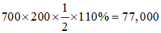

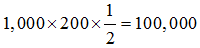

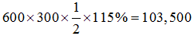

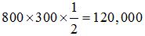

## 589. 住宅市場之問題與建議
*發布日期: 2020-05-21* 

## 內文
各位同學好

今日專欄為各位同學整理有關土地政策中，住宅市場之問題與未來建議：

• 一、當前的主要住宅問題

• (一) 價格問題都會區房價過高。地價巨幅上升，房價隨之高漲，使得一般受薪階級畢其一生積蓄，難購一屋。因無恆產，亦難培養匠心，影響社會安定。

• (二) 數量問題空屋率高，囤房嚴重。台灣空屋率高，但租屋市場並不發達，顯示擁有空屋者係著眼於保值與投資，期待未來增值之利。此外，建商仍持續推案，使得市場形成超額供給。

• (三) 品質問題有土斯有財的迷思。每一個人都想擁有自己的住宅，結果人人被迫購屋，推升房價，一輩子淪為屋奴，生活品質差。再者，為能擁有一處自有住宅，許多購屋者寧願購買小面積甚而環境條件差的住宅，使得居住品質並不理想。

• (四) 市場問題住宅市場失靈。價格機能無法有效指導住宅市場真正供需，尤其住宅市場為不完全競爭市場，住宅價格資訊不完全、不對稱，使民眾無法獲知正確價格，也使得買賣雙方協商交易成本高。

• (五) 政策問題缺乏整體住宅政策。政府為實現「住者有其屋」或追求所謂的居住正義，多年來推動各種健全住宅市場及住宅補貼等措施，缺僅因缺乏完整配套或投鼠忌器，始終無法讓住宅價格合理化，亦未能進一步提升居住環境品質。

• 二、未來建議

朝向抑制投機需求、增加房地供給、健全不動產制度：

• (一) 價格問題之解決

1. 建立土地儲備制度：實施重大建設時，其周邊土地的地價常大幅上漲，容易成為投機炒作的對象，有礙地方建設的正常發展。為了防止上述不正常現象發生，政府可採行區段徵收，或土地預購制度，並將所取得之部分土地供興建社會住宅。

2. 進行房地稅制改革：配合實價登錄建構完整的實價課稅機制，加重囤房者的持有成本，並提高其交易成本，以抑制房市投機炒作，實現租稅、居住及社會的公平正義。

3. 實施空地限建：當地價正在飆漲，或顯有土地投機炒作跡象時，為抑制地價飆漲，增加土地供給，政府可選擇公共設施完備的地區，規定區內空地限期建築使用，逾期不建築使用者依法課徵空地稅，或照價收買，以發揮嚇阻作用，逼使其從速使用，增加住宅供給。

• (二) 數量問題之解決

1. 提高空屋的運用效益：國內住宅空屋率居高不下，為解決空屋率過高問題，政府可透過租稅獎勵或補貼手段，吸引空屋持有人釋出既有空屋，再透過民間非營利組織成立各種租屋服務平台，協助民眾租屋與管理。

• (三) 品質問題之解決

1. 積極推動都市更新：鼓勵大面積整體開發更新，將建商引導到都市更新方向開發土地，一方面可維持建商正常營運，一方面可抑制更新地區以外的房屋供給，提升住宅品質。

2. 改變「有土斯有財」的觀念：透過資訊性工具，行銷「以租代買」理念，改變國人「有土斯有財」的傳統思維，避免年輕族群及弱勢族群成為屋奴，也可解決空屋過多的問題。

• (四) 市場問題之解決

1. 健全房市資訊揭露制度：為引導住宅市場健全發展，政府應定期蒐集、分析住宅市場、交易價格等相關資訊，並定期公布供民眾查詢。而為利推動實價課稅，也必須先建構實價登錄制度的完整性與可信性，才能讓課稅基礎逐步貼近實價。

• (五) 政策問題之解決

1. 整合住宅補貼政策：針對近年來政府為增加住宅持有率所提出的各項政策予以全面檢討，並作適當的規劃與整合，使住宅的補貼政策能兼顧公平與效率。

2. 推動只租不售社會住宅：由政府選擇適當區位之公有土地、民間合作興建或採BOT方式興建社會住宅，再以合理租金出租予符合一定資格條件（弱勢）民眾居住使用，以紓緩高房價引起的居住問題。

3. 社會住宅去標籤化：社會住宅常被認為是貧困、弱勢者集中居住的地方，而背負「鄰避設施」之污名。故政府在規劃時，必須採取參與式的設計與規劃，將民眾意見納入政策規劃過程。
---
*注：本文圖片存放於 ./images/ 目錄下*

## 590. 與登記有關之第三人
*發布日期: 2020-05-14* 

## 內文
各位同學好

今日專欄為「與登記有關之第三人」，試問其意義與相關之情形為何？這分別在96年普考、100年地政士、106普考皆考過，茲整理說明如下：

※與登記有關之第三人：

• (一) 意義：

申請土地登記時，除登記權利人與登記義務人外，其權利義務涉及第三人，且須經第三人同意者，此第三人稱為與登記有關之第三人。亦即登記之效力及於第三人。

依土地登記規則第44條：申請登記須第三人同意者，應檢附第三人之同意書或由第三人在登記申請書內註明同意事由。第三人除符合第41條第二款(公證)、第五款至第八款(法代、印鑑、外僑、陸港澳)及第十款(印鑑證明)規定之情形者外，應親自到場，並依第40條規定程序辦理。

• (二) 相關情形：

1. 優先購買權人(土登§97)：申請土地移轉登記時，依民法物權編施行法第八條之五第三項、第五項、土地法第三十四條之一第四項、農地重劃條例第五條第二款、第三款或文化資產保存法第二十八條規定之優先購買權人已放棄優先購買權者，應附具出賣人之切結書，或於登記申請書適當欄記明優先購買權人確已放棄其優先購買權，如有不實，出賣人願負法律責任字樣。依民法第四百二十六條之二、第九百十九條、土地法第一百零四條、第一百零七條、耕地三七五減租條例第十五條或農地重劃條例第五條第一款規定，優先購買權人放棄或視為放棄其優先購買權者，申請人應檢附優先購買權人放棄優先購買權之證明文件；或出賣人已通知優先購買權人之證件並切結優先購買權人接到出賣通知後逾期不表示優先購買，如有不實，願負法律責任字樣。

2. 債務人(土登§111)：申請為抵押權設定之登記，其抵押人非債務人時，契約書及登記申請書應經債務人簽名或蓋章。

3. 共同抵押人(土登§115)：同一土地權利設定數個抵押權登記後，其中一抵押權因債權讓與為變更登記時，原登記之權利先後，不得變更。抵押權因增加擔保債權金額申請登記時，除經後次序他項權利人及後次序抵押權之共同抵押人同意辦理抵押權內容變更登記外，應就其增加金額部分另行辦理設定登記。

4. 他項權利人及共同抵押人(土登§114-1)：以數宗土地權利為共同擔保，申請設定抵押權登記時，已限定各宗土地權利應負擔之債權金額者，登記機關應於登記簿記明之；於設定登記後，另為約定或變更限定債權金額申請權利內容變更登記者，亦同。前項經變更之土地權利應負擔債權金額增加者，應經後次序他項權利人及後次序抵押權之共同抵押人同意。

5. 抵押權人(土登§107)：分別共有土地，部分共有人就應有部分設定抵押權者，於辦理共有物分割登記時，該抵押權按原應有部分轉載於分割後各宗土地之上。但有下列情形之一者，該抵押權僅轉載於原設定人分割後取得之土地上。

1. 抵押權人同意分割。

2. 抵押權人已參加共有物分割訴訟。

3. 抵押權人經共有人告知訴訟而未參加。
---
*注：本文圖片存放於 ./images/ 目錄下*

## 591. 土地分割及土地合併之土地增值稅
*發布日期: 2020-05-14* 

## 內文
土地分割及土地合併之土地增值稅課徵，規定於平均地權條例施行細則第65條及土地稅法施行細則第42條。

• (一) 土地分割：分別共有土地分割後，各人所取得之土地價值與其分割前應有部分價值相等者，免徵土地增值稅；其價值減少者，就其減少部分課徵土地增值稅（土地稅法施行細則§42Ⅱ）。

例如：甲、乙二人共有一宗土地，公告土地現值1,000萬元，土地持分各二分之一。該土地分割為A、B二宗土地，甲取得A地，公告土地現值500萬元；乙取得B地，公告土地現值500萬元。甲、乙二人各應繳納多少土地增值稅？（甲、乙二人均不課徵土地增值稅）

例如：甲、乙二人共有一宗土地，公告土地現值1,000萬元，土地持分各二分之一，甲之前次移轉現值250萬元，乙之前次移轉現值400萬元；甲之前次移轉至本次移轉之物價指數120%，乙之前次移轉至本次移轉之物價指數110%。該土地分割為A、B二宗土地，甲取得A地，公告土地現值200萬元；乙取得B地，公告土地現值800萬元。甲、乙二人各應繳納多少土地增值稅？（若受有補償，甲繳納A地土地增值稅24萬元；若未受補償，乙繳納A地土地增值稅24萬元）

計算過程如下：土地分割後，甲分得之土地價值減少300萬元。

1. 前次移轉現值：[圖片1]

2. 本次移轉現值：300

3. 土地漲價總數額：300-180=120

4. 土地增值稅：120x20%=24

倘受有補償，屬於有償移轉，應向原所有權人課徵土地增值稅，因此甲應繳納土地增值稅24萬元。倘未受補償，屬於無償移轉，應向取得所有權人課徵土地增值稅，因此乙應繳納土地增值稅24萬元。

附帶說明的是，分割屬於財產之移動，如以顯著不相當之代價，讓與財產，其差額部分，以贈與論（遺產及贈與稅法§5②）。準此，倘乙有給付300萬元之差額，則無贈與稅；倘乙未給付300萬元之差額，等同甲贈與300萬元予乙，因此贈與人甲應繳納贈與稅。

【註】分割後，甲應分得500萬元，但實際分得200萬元。換言之，甲將300萬元售出或贈與。售出或贈與之比例為[圖片2]，即[圖片3]

• (二) 土地合併：土地合併後，各共有人應有部分價值與其合併前之土地價值相等者，免徵土地增值稅。其價值減少者，就其減少部分課徵土地增值稅（土地稅法施行細則§42Ⅳ）。

例如：甲擁有A地，公告土地現值1,000萬元；乙擁有B地，公告土地現值500萬元。A、B二宗土地合併後，甲取得合併後土地之應有部分三分之二，乙取得合併後土地之應有部分三分之一。甲、乙二人各應繳納多少土地增值稅？（甲、乙二人均不課徵土地增值稅）

例如：甲擁有A地，公告土地現值1,000萬元，前次移轉現值600萬元，前次移轉至本次移轉之物價指數130%。乙擁有B地，公告土地現值500萬元，前次移轉現值400萬元，前次移轉至本次移轉之物價指數110%。A、B二宗土地合併後，甲、乙二人取得合併後土地之應有部分各二分之一。甲、乙二人各應繳納多少土地增值稅？（若受有補償，甲繳納A地土地增值稅11萬元；若未受補償，乙繳納A地土地增值稅11萬元）

計算過程如下：土地合併後，甲分得之持分價值減少250萬元。

1. 前次移轉現值：[圖片4]

2. 本次移轉現值：250

3. 土地漲價總數額：250-195=55

4. 土地增值稅：55x20%=11

倘受有補償，應向原所有權人課徵土地增值稅，因此甲應繳納土地增值稅11萬元。倘未受補償，屬於無償移轉，應向取得所有權人課徵土地增值稅，因此乙應繳納土地增值稅11萬元。

附帶說明的是，合併屬於財產之移轉，如以顯著不相當之代價，讓與財產，其差額部分，以贈與論（遺產及贈與稅法§5②）。準此，倘乙有給付250萬元之差額，則無贈與稅；倘乙未給付250萬元之差額，等同甲贈與250萬元予乙，因此贈與人甲應繳納贈與稅。

## 文章圖片

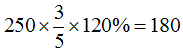

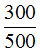

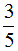

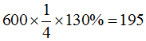

## 592. 信託登記之公示性
*發布日期: 2020-05-07* 

## 內文
各位同學好

今日專欄為各位同學說明有關信託登記特性之一「公示性」，即信託法第4條第1項規定，以應登記或註冊之財產權為信託者，非經信託登記，不得對抗第。應注意此條文分為兩種登記性質：

• (一) 「應登記之財產權」：指依民法第758條第1項及土地法第72條以信託為登記原因之權利變更登記，其主要目的為移轉財產權，並有權利移轉之公示效果，屬設權登記(登記生效主義)。

• (二) 「信託登記」：其目的在於信託成立後，信託財產具獨立性，為確保交易安全，故將信託主要條款，包含信託目的、信託期間、信託財產之管理或處分方法、信託關係消滅事由等予以公示，亦即使登記外觀足以辨識該財產屬於信託財產，避免第三人因不知其內部約定而遭受損害，故屬「對抗登記」（登記對抗主義）。其登記目的在保護交易安全，受益人對於信託財產有追及權，對於與信託財產交易的第三人，即有受到不測損害之虞，故有必要使交易相對人知悉交易標的物上有受益權（即信託財產的負擔），而不致受到不測損害，故有必要予以公示。而所謂對抗，指如信託財產的權利關係發生糾紛時，如信託財產具備公示要件，則信託關係人對第三人得主張信託關係存在。

信託登記之性質

• T. ABLE_PLACEHOLDER_1
---
*注：本文圖片存放於 ./images/ 目錄下*

## 593. 不動產交換之稅負(二)
*發布日期: 2020-05-07* 

## 內文
• (二) 建物分割：分割契稅，應由分割人估價立契，申報契稅（契稅條例§8）。分割契稅為其契價2%（契稅條例§3⑤）。例如：甲、乙二人共有A屋，應有部分各二分之一；甲、乙二人共有B屋，應有部分各二分之一。房屋評定標準價格各1,000萬元。分割後，甲取得A屋全部，乙取得B屋全部。甲、乙二人各應繳納多少契稅？（甲繳納A屋契稅10萬元；乙繳納B屋契稅10萬元）計算過程如下：

1. 就A屋而言：甲分割前房屋現值：[圖片1]甲分割後房屋現值：1,0001,000-500=500500x2%=10

2. 就B屋而言：乙分割前房屋現值：[圖片2]乙分割後房屋現值：1,0001,000-500=500500x2%=10

例如：甲、乙二人共有A屋，應有部分各二分之一；甲、乙二人共有B屋，應有部分各二分之一。A屋評定標準價格1,000萬元，B屋評定標準價格2,000萬元。分割後，甲取得A屋全部，乙取得B屋全部。甲、乙二人各應繳納多少契稅？（若有給付差額，甲繳納A屋契稅10萬元，乙繳納B屋契稅40萬元；若未給付差額，甲繳納A屋契稅10萬元，乙繳納B屋契稅40萬元）

1. 有給付差額：

1. 就A屋而言：甲分割前房屋現值：[圖片3]甲分割後房屋現值：1,0001,000-500=500500x2%=10

2. 就B屋而言：乙分割前房屋現值：[圖片4]乙分割後房屋現值：2,0002,000-1,000=1,000其中500萬元課徵分割契稅，另500萬元課徵買賣契稅。500x2%=10（分割契稅）500x6%=30（買賣契稅）10+30=40

2. 未給付差額：

1. 就A屋而言：甲分割前房屋現值：[圖片5]甲分割後房屋現值：1,0001,000-500=500500x2%=10

2. 就B屋而言：乙分割前房屋現值：[圖片6]乙分割後房屋現值：2,0002,000-1,000=1,000其中500萬元課徵分割契稅，另500萬元課徵贈與契稅。500x2%=10（分割契稅）500x6%=30（贈與契稅）10+30=40

附帶說明的是，分割屬於財產之移動，如以顯著不相當之代價，讓與財產，其差額部分，以贈與論，課徵贈與稅（遺產及贈與稅法§5②）。甲分割前房屋現值共1,500萬元，分割後房屋現值共1,000萬元；乙分割前房屋現值共1,500萬元，分割後房屋現值共2,000萬元。倘乙有給付500萬元之差額，則無贈與稅；倘乙未給付500萬元之差額，等同甲贈與500萬元予乙，因此贈與人甲應繳納贈與稅。

## 文章圖片

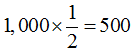

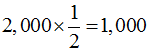

## 594. 不動產分割之稅負(一)
*發布日期: 2020-04-30* 

## 內文
不動產分割分為標示分割與權利分割二種。前者辦理標示變更登記，後者辦理所有權移轉登記；前者不課稅，後者原則上應課稅。不動產分割包括土地分割與建物分割二種。茲分述如下：

• (一) 土地分割：分別共有土地分割後，各人所取得之土地價值與其分割前應有部分價值相等者，免徵土地增值稅；其價值減少者，就其減少部分課徵土地增值稅。土地價值之計算，以共有土地分割時之公告土地現值為準（土地稅法施行細則§42ⅡⅤ）。共有土地之分割，共有人因分割所取得之土地價值，與依其應有部分所算得之價值較少而未受補償時，自屬無償移轉之一種，應向取得土地價值增多者，就其增多部分課徵土地增值稅（司法院釋字第173號）。詳言之，共有土地之分割，共有人因分割所取得之土地價值，與依其應有部分所算得之價值減少，倘受有補償時，屬於有償移轉，應向取得土地價值減少者，就其減少部分課徵土地增值稅。倘未受補償時，屬於無償移轉，應向取得土地價值增多者，就其增多部分課徵土地增值稅。例如：甲、乙二人共有A地，應有部分各二分之一；甲、乙二人共有B地，應有部分各二分之一。A、B二地分割時之公告土地現值各為1,000萬元，A、B二地之甲、乙二人的前次移轉現值各為300萬元，前次移轉至本次移轉之物價指數120%。分割後，甲取得A地全部，乙取得B地全部。甲、乙二人各應繳納多少土地增值稅？（若有給付差額，甲繳納B地土地增值稅28萬元，乙繳納A地土地增值稅28萬元；若未給付差額，甲繳納A地土地增值稅28萬元，乙繳納B地土地增值稅28萬元）計算過程如下：

1. 就A地而言：甲分割前土地價值：[圖片1]甲分割後土地價值：1,000乙分割前土地價值：[圖片2]乙分割後土地價值：0因此，就乙之價值減少部分課徵土地增值稅。

1. 前次移轉現值：300x120%=360

2. 本次移轉現值：[圖片3]

3. 土地漲價總數額：500-360=140

4. 土地增值稅：140x20%=28有給付差額（即受有補償）：屬於有償移轉，相當於買賣，應由原所有權人乙繳納土地增值稅28萬元。未給付差額（即未受補償）：屬於無償移轉，相當於贈與，應由取得所有權人甲繳納土地增值稅28萬元。

2. 就B地而言：甲分割前土地價值：[圖片4]甲分割後土地價值：0乙分割前土地價值：[圖片5]乙分割後土地價值：1,000因此，就甲之價值減少部分課徵土地增值稅。

1. 前次移轉現值：300x120%=360

2. 本次移轉現值：[圖片6]

3. 土地漲價總數額：500-360=140

4. 土地增值稅：140x20%=28有給付差額（即受有補償）：屬於有償移轉，相當於買賣，應由原所有權人甲繳納土地增值稅28萬元。未給付差額（即未受補償）：屬於無償移轉，相當於贈與，應由取得所有權人乙繳納土地增值稅28萬元。

例如：甲、乙二人共有A地，應有部分各二分之一；甲、乙二人共有B地，應有部分各二分之一。A地面積100平方公尺，甲之前次移轉現值每平方公尺6萬元，乙之前次移轉現值每平方公尺8萬元，前次移轉至本次移轉之物價指數110%，本次移轉現值（即分割時之公告土地現值）每平方公尺10萬元。B地面積500平方公尺，甲之前次移轉現值每平方公尺2.5萬元，乙之前次移轉現值每平方公尺2萬元，前次移轉至本次移轉之物價指數108%，本次移轉現值（即分割時之公告土地現值）每平方公尺3萬元。分割後，甲取得A地全部，乙取得B地全部。甲、乙二人各應繳納多少土地增值稅？（若有給付差額，甲繳納B地土地增值稅15萬元，乙繳納A地土地增值稅12萬元；若未給付差額，甲繳納A地土地增值稅12萬元，乙繳納B地土地增值稅15萬元）計算過程如下：

1. 就A地而言：甲分割前土地價值：[圖片7]甲分割後土地價值：10x100=1,000乙分割前土地價值：[圖片8]乙分割後土地價值：0因此，就乙之價值減少部分課徵土地增值稅。

1. 前次移轉現值：[圖片9]

2. 本次移轉現值：[圖片10]

3. 土地漲價總數額：500-440=60

4. 土地增值稅：60x20%=12有給付差額（即受有補償）：屬於有償移轉，相當於買賣，應由原所有權人乙繳納土地增值稅12萬元。未給付差額（即未受補償）：屬於無償移轉，相當於贈與，應由取得所有權人甲繳納土地增值稅12萬元。

2. 就B地而言：甲分割前土地價值：[圖片11]甲分割後土地價值：0乙分割前土地價值：[圖片12]乙分割後土地價值：3x500=1,500因此，就甲之價值減少部分課徵土地增值稅。

1. 前次移轉現值：[圖片13]

2. 本次移轉現值：[圖片14]

3. 土地漲價總數額：750-675=75

4. 土地增值稅：75x20%=15有給付差額（即受有補償）：屬於有償移轉，相當於買賣，應由原所有權人甲繳納土地增值稅15萬元。未給付差額（即未受補償）：屬於無償移轉，相當於贈與，應由取得所有權人乙繳納土地增值稅15萬元。

附帶說明的是，分割屬於財產之移動，如以顯著不相當之代價，讓與財產，其差額部分，以贈與論（遺產及贈與稅法§5②）。甲分割前土地價值共1,250萬元，分割後土地價值共1,000萬元；乙分割前土地價值共1,250萬元，分割後土地價值1,500萬元。倘乙有給付250萬元之差額，則無贈與稅；倘乙未給付250萬元之差額，等同甲贈與250萬元予乙，因此贈與人甲應繳納贈與稅。

## 文章圖片

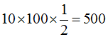

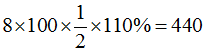

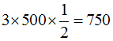

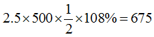

## 595. 國土計畫法修法內容
*發布日期: 2020-04-30* 

## 內文
各位同學好

本週專欄提醒本次國土計畫法主要修正下列五條，其中最主要是第45條國土計畫及功能分區圖之公告實施期限延長，其餘大致多為文字調整。最具爭議的15條國土計畫適時檢討變更情形(增列經行政院核定之國家重大建設計畫)並未修正：

• T. ABLE_PLACEHOLDER_1
---
*注：本文圖片存放於 ./images/ 目錄下*

## 596. 土地登記線上聲明
*發布日期: 2020-04-23* 

## 內文
各位同學好

今日專欄為各同學說明有關土地登記的新措施：「線上聲明」（109年3月實施）＝替代當事人免親自到場的方式之一

原本土地登記規則第40條規定，申請登記時，登記義務人應親自到場，提出國民身分證正本，當場於申請書或登記原因證明文件內簽名，並由登記機關指定人員核符後同時簽證。

但考量現代人繁忙無法親自到場，為簡政便民，而於土地登記規則第41條規定，有相關情形得免親自到場，一般最常使用的方式，是一年有效的印鑑證明，或有的案件採地政士簽證、契約公證等方式。

然而，印鑑證明亦需要先至戶籍所在地之戶政事務所申請，仍有些不便。因此，為簡政便民，從今（109）年3月起，民眾申辦不動產登記可採用「線上聲明」措施，當事人只要透過自然人憑證上網登錄資訊，由地政士或律師核對身分後驗證聲明，確認本次登記之真意，即可不必再親自到地政事務所核對身分或申請印鑑證明，節省民眾時間與金錢。因此，考試時有關「得免親自到場」的「其他」情形，得增加寫此一新措施。

土地登記線上聲明的流程：

1. 當事人以自然人憑證於指定網站－數位櫃臺，登錄不動產標的、辦理事項、取得權利人及委託之代理人姓名、聲明期限等相關聲明登記資訊，以表示義務人處分的真意。

2. 由開業地政士或律師等專業代理人，核對當事人身分後，以其自然人憑證驗證聲明。

3. 登記申請書記明線上聲明序號或檢附驗證後之線上聲明登錄表，併同其他土地登記應附文件由代理人向登記機關送件。網路聲明搭配實體案件，登記機關受理後會據以確認當事人真意，以兼顧便民與權益保障。
---
*注：本文圖片存放於 ./images/ 目錄下*

## 597. 不動產交換之稅負
*發布日期: 2020-04-23* 

## 內文
交換是互易之一種。所稱互易，指當事人雙方約定互相移轉金錢以外之財產權（民法§398）。所謂交換，指當事人雙方約定互相移轉不動產。交換包括土地與土地之交換、土地與建物之交換、建物與建物之交換等三種。至於不動產以外之物（如汽車、古董等）與不動產之交換，則屬於買賣範疇，非屬於本單元之交換範疇。

• (一) 土地與土地之交換：土地交換，應分別向原土地所有權人徵收土地增值稅（土地稅法施行細則§42Ⅰ）。例如：甲之A地與乙之B地交換。A地面積800平方公尺，前次移轉現值每平方公尺6,000元，本次移轉現值（即交換時之公告土地現值）每平方公尺12,500元，前次移轉至本次移轉之物價指數130%。B地面積500平方公尺，前次移轉現值每平方公尺10,000元，本次移轉現值（即交換時之公告土地現值）每平方公尺30,000元，前次移轉至本次移轉之物價指數150%。甲、乙二人各應繳納多少土地增值稅？（甲繳納A地之土地增值稅752,000元，乙繳納B地之土地增值稅1,500,000元）計算過程如下：

1. 甲應繳納A地之土地增值稅：

1. 前次移轉現值：6,000x800x130%=6,240,000

2. 本次移轉現值：12,500x800=10,000,000

3. 土地漲價總數額：10,000,000-6,240,000=3,760,000

4. 土地增值稅：3,760,000x20%=752,000

2. 乙應繳納B地之土地增值稅：

1. 前次移轉現值：10,000x500x150%=7,500,000

2. 本次移轉現值：30,000x500=15,000,000

3. 土地漲價總數額：15,000,000-7,500,000=7,500,000

4. 土地增值稅：7,500,000x20%=1,500,000

附帶說明的是，交換屬於財產之移動，如以顯著不相當之代價，讓與財產，其差額部分，以贈與論，課徵贈與稅（遺產及贈與稅法§5II）。準此，甲以10,000,000元之A地交換乙之15,000,000元之B地。倘甲有給付5,000,000元之差額，則無贈與稅；倘甲未給付5,000,000元之差額，等同乙贈與5,000,000元予甲，因此贈與人乙應繳納贈與稅。

• (二) 土地與建物之交換：土地與建物交換，土地部分向原土地所有權人課徵土地增值稅，建物部分向取得建物所有權人課徵契稅。交換契稅為其契價2%（契稅條例§3V）。交換有給付差額價款者，其差額價款應以買賣契稅稅率（6%）課徵（契稅條例§6Ⅱ）；交換未給付差額價款者，其差額價款應以贈與契稅稅率（6%）課徵。例如：甲之A地與乙之B屋交換。A地面積800平方公尺，前次移轉現值每平方公尺6,000元，本次移轉現值（即交換時之公告土地現值）每平方公尺12,500元，前次移轉至本次移轉之物價指數130%。B屋面積500平方公尺，房屋評定標準價格每平方公尺30,000元。甲、乙二人各應繳納多少土地增值稅及契稅？（甲繳納A地之土地增值稅752,000元及B屋之契稅500,000元）計算過程如下：

1. 甲應繳納A地之土地增值稅

1. 前次移轉現值：6,000x800x130%=6,240,000

2. 本次移轉現值：12,500x800=10,000,000

3. 土地漲價總數額：10,000,000-6,240,000=3,760,000

4. 土地增值稅：3,760,000x20%=752,000

2. 甲應繳納B屋之契稅：甲以10,000,000元之A地交換乙之15,000,000元之B屋，差額5,000,000元，其契稅由付款而取得建物之一方繳納（本例由甲方繳納）。

1. 交換有給付差額：契價：30,000x500=15,000,000交換契稅：10,000,000x2%=200,000買賣契稅：5,000,000x6%=300,000合計：200,000+300,000=500,000

2. 交換未給付差額：契價：30,000x500=15,000,000交換契稅：10,000,000x2%=200,000贈與契稅：5,000,000x6%=300,000合計：200,000+300,000=500,000

附帶說明的是，交換屬於財產之移動，如以顯著不相當之代價，讓與財產，其差額部分，以贈與論，課徵贈與稅（遺產及贈與稅法§5II）。準此，甲以10,000,000元之A地交換乙地之15,000,000元之B屋。倘甲有給付5,000,000元之差額，則無贈與稅；倘甲未給付5,000,000元之差額，等同乙贈與5,000,000元予甲，因此贈與人乙應繳納贈與稅。

• (三) 建物與建物之交換：建物與建物交換，應由交換人估價立契，各就承受部分申報納稅。（契稅條例§6Ⅰ）交換契稅為其契價2%（契稅條例§3V）。交換有給付差額價款者，其差額價款，應依買賣契稅稅率6%課徵（契§6Ⅱ）。交換未給付差額價款者，其差額價款應以贈與契稅稅率6%課徵。例如：甲之A屋與乙之B屋交換。A屋面積800平方公尺，房屋評定標準價格每平方公尺12,500元。B屋面積500平方公尺，房屋評定標準價格每平方公尺30,000元。甲、乙二人各應繳納多少契稅？（甲繳納B屋之契稅500,000元，乙繳納A屋之契稅200,000元）計算過程如下：

1. 甲應繳納B屋之契稅：甲以10,000,000元之A屋交換乙之15,000,000元之B屋，差額5,000,000元，就差額部分之契稅由付款而取得建物之一方繳納（本例由甲方繳納）。

1. 交換有給付差額：契價：30,000x500=15,000,000交換契稅：10,000,000x2%=200,000買賣契稅：5,000,000x6%=300,000合計：200,000+300,000=500,000

2. 交換未給付差額：契價：30,000x500=15,000,000交換契稅：10,000,000x2%=200,000贈與契稅：5,000,000x6%=300,000合計：200,000+300,000=500,000

2. 乙應繳納A屋之契稅：

1. 契價：12,500x800=10,000,000

2. 交換契稅：10,000,000x2%=200,000

附帶說明的是，交換屬於財產之移動，如以顯著不相當之代價，讓與財產，其差額部分，以贈與論，課徵贈與稅（遺產及贈與稅法§5II）。準此，甲以10,000,000元之A屋交換乙之15,000,000元之B屋。倘甲有給付5,000,000元之差額，則無贈與稅；倘甲未給付5,000,000元之差額，等同乙贈與5,000,000元予甲，因此贈與人乙應繳納贈與稅。
---
*注：本文圖片存放於 ./images/ 目錄下*

## 598. 占有契稅
*發布日期: 2020-04-16* 

## 內文
占有契稅，應由占有不動產依法取得所有權之人（即占有人）估價立契，申報契稅（契§9，｢契｣代表契稅條例，以下同）。占有契稅為其契價百分之六（契§3Ⅰ）。所稱契價，以當地不動產評價委員會評定之標準價格為準（契§13Ⅰ）。

茲分下列四種情形說明：

• (一) 占有人無權占有未登記土地而時效取得土地所有權：由於未登記土地尚未規定地價，而未開徵土地增值稅，故應課徵契稅（契§2但書）。

• (二) 占有人無權占有已登記土地而時效取得地上權：已登記土地有開徵土地增值稅，故免徵契稅（契§2但書）。又，土地增值稅之課徵時機為土地所有權移轉及設定典權，因此設定地上權，不徵土地增值稅。

• (三) 占有人無權占有未登記土地及未登記建物而時效取得土地及建物所有權：就土地而言，由於未登記土地尚未規定地價，而未開徵土地增值稅，故應課徵契稅（契§2但書）。就建物而言，占有人因占有建物而取得建物所有權，應課徵契稅。因此，占有人應繳納土地及建物之契稅。

• (四) 占有人無權占有已登記土地上之未登記建物而時效取得建物所有權：占有人因占有建物而取得建物所有權，應課徵契稅。須特別強調此種情形，占有人之時效利益不及於土地，占有人取得建物所有權後，對土地之占有仍屬無權占有，因此土地所有權人得主張民法第767條訴請拆屋還地。
---
*注：本文圖片存放於 ./images/ 目錄下*

## 599. 各種土地價格之差異
*發布日期: 2020-04-16* 

## 內文
各位同學好

今日為專欄主要說明各種土地價值之差異，其功能與目的皆不相同應予注意：

• T. ABLE_PLACEHOLDER_1
---
*注：本文圖片存放於 ./images/ 目錄下*

## 600. 土地法第104條與土地法第73條之1競合之實例研習
*發布日期: 2020-04-09* 

## 內文
甲以其一宗土地之特定部分設定地上權於乙，乙隨即興建房屋一棟。數年後，甲死亡，其繼承人一直未辦理繼承登記。國有財產署遂依土地法第73條之1將其土地公開標售，最後由丙得標。此時，乙主張依土地法第104條主張優先購買該土地之全部，而非該土地之特定部分，是否有理？

【解答】

• (一) 土地法第104條第1項前段規定：「基地出賣時，地上權人、典權人或承租人有依同樣條件優先購買之權。」所稱同樣條件，指出賣之同一條件。準此，地上權人乙得就該土地全部主張優先購買權。

• (二) 土地法第73條之1第3項前段規定：「依第二項規定標售土地或建築改良物前應公告三十日，繼承人、合法使用人或其他共有人就其使用範圍依序有優先購買權。」準此，合法使用人乙就其使用範圍有優先購買權。換言之，乙僅得就該土地之特定部分主張優先購買權。

• (三) 上開兩項規定競合時，由於同屬土地法，經查土地法第104條訂定時間在前，土地法第73條之1訂定時間在後，因此依新法優於舊法或後法優於前法原則，優先適用土地法第73條之1。亦即，乙僅得就其設定地上權範圍之土地主張優先購買權。
---
*注：本文圖片存放於 ./images/ 目錄下*

## 601. 共有優先購買要件之案例解析(四)
*發布日期: 2020-04-09* 

## 內文
各位同學好

土地法第34條之1第4項規定：「共有人出賣其應有部分時，他共有人得以同一價格共同或單獨優先承購。」今日針對共有土地優先購買要件中所謂的「同一價格」優先承購予以說明：

[案例]假設甲乙丙三人分別共有A地，應有部分均等，今甲因缺錢急售其應有部分(1/3)，並與K訂定買賣契約，其契約內容為價金新台幣500萬元，且須於申辦土地登記前一日匯款全額價金，否則解除契約。試問乙與丙接獲甲該出賣契約詢問是否優先購買時，能否主張以同一價格500萬購買，但因無法一次全額支付，而表示須採分期付款？其優先購買權是否有效？

[說明]

1. 所謂同一價格，於學說及實務上，多解釋為「同一條件」，除買賣價格外，有關買賣標的、價金給付方式、期限、瑕疵擔保等其他條件皆須相同(最高法院台上第853號判例、100年台再第46號)。亦即優先購買權人須表示接受出賣應有部分之共有人與第三人所訂契約之一切條件。

2. 倘有部分不接受或擅加予變更買賣條件時，即非合法行使優先承購權，於出售土地共有人所定之期限經過後，其優先承購權即行消滅(86年台上字第3122號民事判決、98年台上字第1285號)。

3. 如其他共有人未遵期以原所訂之同樣條件簽約，並依約一次付清價金，而以不願接受原所訂價金交付期限、方式等條件，擅加予變更，其優先承購權已喪失，於法洵無違誤(最高法院102年台上字第141號民事判決)。
---
*注：本文圖片存放於 ./images/ 目錄下*

## 602. 共有優先購買要件之案例解析(三)
*發布日期: 2020-04-01* 

## 內文
各位同學好

本週專欄持續為各位同學說明有關優先購買權要件之內容：優先購買權是否能預先拋棄？

[案例]甲與乙分別共有A地，應有部分均等，甲於出賣其應有部分時，乙依土地法第34條之1有優先購買權。然而，試問甲在還未確定出售土地前，乙是否能主動表示預先拋棄優先購買權？亦即因乙確定自己將來無意願或無力購買而預先告知甲將來不需通知，逕為出售即可，是否可以？

[討論]

應可預先拋棄，茲說明如下：

1. 查土地法第三十四條之一第四項規定共有人出賣其共有土地或建築改良物之應有部分時，他共有人得以同一價格共同或單獨優先承購，旨在簡化共有關係與公益無關。共有人之優先承買權雖係於他共有人就其應有部分與第三人成立有效之買賣時始發生，但共有人於他共有人即將成立買賣之際，預先拋棄其即可取得之優先承買權，尚非法之所禁。(最高法院80年台上第2529號判決)

2. 權利是法律賦予個人享受特定利益的力量，原則上得為拋棄。(王澤鑑教授)

3. 優先承買權之存在雖有促進財產之利用或減少紛爭之助益，但同時亦可能有不利交易之疑慮，故除有以定型化契約條款約定預先拋棄優先承買權時應受定型化契約理論之規範者外，自應容許當事人間預先約定拋棄或同意不行使優先承買權，至於當事人間有無此類約定者，除有明示約定者外，依民法第98條解釋意思表示之方式，亦應可由締約目的、財產約定之使用方式綜合判斷或探求之。(林誠二教授)

4. 但應注意先買權之預先拋棄應係指買賣契約成立前即終局放棄先買權之行使，如先買權人僅係陳稱其目前無資力購買，並未明確表示其將來如有資力亦不願購買，也無其他事證足以顯示原告當時確有終局放棄先買權之意，則不應解為先買權之預先拋棄(黃健彰教授)。
---
*注：本文圖片存放於 ./images/ 目錄下*

## 603. 土地法第73條之1實例研習
*發布日期: 2020-04-01* 

## 內文
未辦繼承土地一宗，繼承人甲、乙二人。該宗土地等分為三部分，左邊部分由甲占有使用，中間部分由丙無權占有使用，右邊部分由丁合法占有使用。國有財產署依土地法第73條之1公開標售，並由戊標得，則何人有優先購買權？

【解答】

• (一) 土地法第73條之1第3項規定：「依第二項規定標售土地或建築改良物前應公告三十日，繼承人、合法使用人或其他共有人就其使用範圍依序有優先購買權。但優先購買權人未於決標後十日內表示優先購買者，其優先購買權視為放棄。」準此，繼承人、合法使用人或其他共有人就其使用範圍依序有優先購買權。

• (二) 本題，該宗土地之左邊部分由繼承人甲占有使用，故甲對該宗土地之左邊部分有優先購買權。該宗土地之中間部分由無權使用人丙占有使用，故丙對該宗土地之中間部分無優先購買權。該宗土地之右邊部分由合法使用人丁占有使用，故丁對該宗土地之右邊部分有優先購買權。

• (三) 總之，甲、丁二人各自就其使用範圍有優先購買權，而非就該宗土地全部有優先購買權。若甲、丁二人皆主張優先購買，該宗土地應分割為三筆，左邊一筆由甲購買，中間一筆由戊購買，右邊一筆由丁購買。
---
*注：本文圖片存放於 ./images/ 目錄下*

## 604. 共有優先購買要件之案例解析(二)
*發布日期: 2020-03-26* 

## 內文
各位同學好

本次談談土地法第34條之1，有關共有優先購買要件中，出賣人通知優先購買權人於10日內表示是否優先購買之情形，予以說明：

[主要問題點]甲乙丙三人分別共有一A地，三人應有部分均等，甲今欲出賣其應有部分時，是否有主動通知乙及丙之義務？是否需等待兩人回覆後，方得出售？

[討論]

問題1：徵詢他共有人是否優先購買是否屬出賣人之義務？共有人出賣應有部分時，對他共有人有無通知義務，法無明定，惟他共有人既有優先購買權，則在解釋上自應解為出賣人負有通知之義務。且為使他共有人得以同樣條件購買，故應將其與第三人所訂買賣契約條件全部告知，不得僅以買賣土地之事實通知，即謂已盡通知之義務(最高法院85台上第2118號判決)

問題2：該徵詢究竟屬於「要約」或是「意思通知」？兩者性質及效果有何不同？徵詢他共有人是否優先承購，為意思通知，旨在促請他共有人行使優先承購權。他共有人如已行使其優先承購之形成權，則原有之權利義務即已變更。(83年台上字第3025號民事判決)。換言之，徵求他共有人是否優先承購與向他人為出賣之要約，其性質及法律上之效果均不相同。前者為意思通知，旨在促請他共有人行使優先承購權，他共有人如未於限期內行使優先承購權，即生失權之效果；後者為意思表示，旨在與要約之受領人訂立一定之契約，要約之受領人如不為承諾，契約即無由成立。(78年度台上字第1896號判決)
---
*注：本文圖片存放於 ./images/ 目錄下*

## 605. 債權性質優先購買權與物權性質優先購買權之比較
*發布日期: 2020-03-26* 

## 內文
優先購買權分為債權性質優先購買權與物權性質優先購買權二種。債權性質優先購買權，亦稱債權效力優先購買權；物權性質優先購買權，亦稱物權效力優先購買權。兩者不同如下：

• (一) 法律效果不同：債權性質優先購買權具有債權效力，即出賣人未通知優先購買權人而為所有權之移轉登記，其移轉行為仍然有效，此時優先購買權人僅得向出賣人請求損害賠償。物權性質優先購買權具有物權效力，即出賣人未通知優先購買權人而為所有權之移轉登記，優先購買權人得主張移轉行為無效。另，債權性質優先購買權與物權性質優先購買權競合時，後者較前者優先行使。

• (二) 法條用詞不同：法條如有「其契約或移轉不得對抗優先購買權人」之類的用詞，則為物權性質優先購買權，否則為債權性質優先購買權。所稱「其契約或移轉不得對抗優先購買權人」，指優先購買權人得主張買賣契約或移轉登記無效；優先購買權人亦得不主張，則買賣契約或移轉登記仍然有效。

• (三) 適用情況不同：債權性質優先購買權之適用情況包括土地法第34條之1、農地重劃條例第5條第2款及第3款、民法物權編施行法第8條之5第3項及第5項等。物權性質優先購買權之適用情況包括土地法第104條、土地法第107條、耕地三七五減租條例第15條、農地重劃條例第5條第1款、民法第919條等。

• (四) 多人主張優先購買之處理方法不同：債權平等原則，無優先性，故債權性質優先購買權，如有多人主張優先購買則以抽籤決定，或按應有部分或專有部分比例定之。物權有優先性，故物權性質優先購買權，如有多人主張優先購買，除法律另有規定外，應依登記先後定其優先順序。

• (五) 移轉登記應備文件不同：債權性質優先購買權，優先購買權人已放棄優先購買權者，應附具出賣人之切結書，或於登記申請書適當欄記明優先購買權人確已放棄其優先購買權，如有不實，出賣人願負法律責任字樣。物權性質優先購買權，優先購買權人放棄或視為放棄其優先購買權者，申請人應檢附優先購買權人放棄優先購買權之證明文件；或出賣人已通知優先購買權人之證件並切結優先購買權人接到出賣通知後逾期不表示優先購買，如有不實，願負法律責任字樣（土地登記規則§97ⅠⅡ）。
---
*注：本文圖片存放於 ./images/ 目錄下*

## 606. 共有優先購買要件之案例解析(一)
*發布日期: 2020-03-19* 

## 內文
各位同學好

今日專欄來探討土地法第34條之1第4項有關共有優先購買權之相關概念。首先，假設案例如下：甲乙丙三人分別共有A地，各自應有部分為1/3，今甲將其應有部分（1/3）出賣給K，並已訂定契約完畢，而該契約訂價為100萬元。甲隨之通知乙、丙二人該契約價金與相關條件，詢問其是否主張優先購買，乙即表示願意優先承購。然而，甲不願被乙優先購買，爰與第三人合意解除契約，並且擇日又再次訂定更高價契約1000萬元，再次詢問乙、丙，兩人皆表示無力購買。

試問：究竟經優先購買權人主張優先購買後，出賣人隨即與第三人合意解除原契約，該優先購買權是否一併無效？是否得以藉此測試優先購買權人底限，當其無力購買時，再以該價格出售，以避免被其優先購買？

思考：

• (一) 肯定說：原契約無效則優先購買權無效

1. 實務上，有人係以當優先購買權人主張優先購買時，破解招數就是解除與第三人契約，使優先購買權人無法以該無效契約進行主張。而後再將契約價金提高至優先購買權人無力購買時，再予出售。

2. 理論上，以土地法第34條之1的優先購買權要件而言，須以共有人有效出賣其應有部分與第三人為基礎，苟共有人與第三人間之出賣行為根本無效，亦即自始不存在，則所謂優先購買權即無從發生。(65年台上字第2113號判例、104年台上字第1573號判決)

• (二) 否定說：原契約無效並不影響已另行成立的優先購買契約

其主張優先購買權為形成權，即優先購買權人向應有部分之出賣人為優先購買之意思表事實，兩人買賣關係旋即成立，亦即契約關係已重新成立於出賣人與優先購買權人，自無法由出賣人與第三人再予解除之餘地。

相關概念可參考84年台上字第2134號：土地法第三十四條之一第四項所定之他共有人優先承購權，固應以共有人「有效」出賣其應有部分與第三人為基礎。惟如共有人與第三人間之買賣契約已合法存在，於他共有人主張優先購買權後，出賣之共有人與第三人為避免他共有人之行使優先承購，始合意解除買賣契約者，該「合意解除」既在他共有人單獨為「優先承購」之意思表示而行使其優先承購之形成權之後，則共有人與第三人間之原有權利義務關係已有變更，能否再任由渠等合意解除契約，以規避上開法律所定他共有人所得行使之優先承購權之適用﹖非無疑義。
---
*注：本文圖片存放於 ./images/ 目錄下*

## 607. 土地法第104條優先購買權之實例研習(四)
*發布日期: 2020-03-19* 

## 內文
甲有一筆建地，其中一部分土地為未建成地，甲將其設定地上權於乙，乙隨即興建一棟建物。另一部分土地為建成地，地上有一棟透天房屋，甲僅將其建物設定抵押權於丙，但其基地未一併設定抵押權，經拍賣由丁拍定而取得建物所有權。乙設定地上權在先，丙設定抵押權在後。不久，甲擬將該筆土地全部出售於戊，請問何人有優先購買權？如多人主張優先購買時，如何處理？

【解答】

• (一) 未建成地：甲將該筆土地之未建成地部分設定地上權於乙，乙隨即興建一棟建物。依土地法第104條第1項規定，基地出賣時，地上權人有依同樣條件優先購買權。因此，甲擬將該筆土地全部出售於戊，乙有優先購買權。

• (二) 建成地：民法第876條第1項規定：「設定抵押權時，土地及其土地上之建築物，同屬於一人所有，而僅以土地或僅以建築物為抵押者，於抵押物拍賣時，視為已有地上權之設定，其地租、期間及範圍由當事人協議定之。不能協議者，得聲請法院以判決定之。」準此，甲僅將建物設定抵押權於丙，經拍賣由丁取得建物所有權，則視為丁已有地上權之設定，此種地上權稱為法定地上權。又土地法第104條第1項規定，基地出賣時，地上權有依同樣條件優先購買之權。因此，甲擬將該筆土地全部出售於戊，丁有優先購買權。

• (三) 優先順序：乙、丁二人均有優先購買權。如二人皆主張優先購買，則依土地法第104條第1項規定，其順序以登記之先後定之。又，乙之優先購買權係基於意定地上權，意定地上權須登記始生效力。丁之優先購買權係基於法定地上權，法定地上權無須登記，即生效力。法定地上權所衍生之優先購買權未必優先於意定地上權所衍生之優先購買權，應視法定地上權與意定地上權之成立或登記之先後定之。因此，意定地上權以登記日期定其優先順序，法定地上權以成立日期定其優先順序。本題，意定地上權在先，法定地上權在後，因此乙之優先購買權之行使優先於丁之優先購買權。
---
*注：本文圖片存放於 ./images/ 目錄下*

## 608. 土地法第104條優先購買權之實例研習(三)
*發布日期: 2020-03-12* 

## 內文
甲有一筆建地，其中一部分土地為建成地，地上有一棟透天房屋，甲僅將其建物出售於乙，但其基地未出售。另一部分土地為未建成地，甲將其設定地上權於丙，丙隨即興建一棟建物。乙購買建物在先，丙設定地上權在後。不久，甲擬將該筆土地全部出售於丁，請問何人有優先購買權？如多人主張優先購買時，如何處理？

【解答】

• (一) 建成地：民法第425條之1規定：「土地及其土地上之房屋同屬一人所有，而僅將土地或僅將房屋所有權讓與他人，或將土地及房屋同時或先後讓與相異之人時，土地受讓人或房屋受讓人與讓與人間或房屋受讓人與土地受讓人間，推定在房屋得使用期限內，有租賃關係。其期限不受第四百四十九條第一項規定之限制。前項情形，其租金數額當事人不能協議時，得請求法院定之。」準此，甲保留基地而僅將建物出售於乙，則甲與乙之間推定有租賃關係。又土地法第104條第1項規定，基地出賣時，承租人有依同樣條件優先購買之權。因此，甲擬將該筆土地全部出售於丁，乙有優先購買權。

• (二) 未建成地：甲將該筆土地之未建成地部分設定地上權於丙，丙隨即興建一棟建物。依土地法第104條第1項規定，基地出賣時，地上權人有依同樣條件優先購買之權。因此，甲擬將該筆土地全部出售於丁，丙有優先購買權。

• (三) 優先順序：乙、丙二人均有優先購買權。如二人皆主張優先購買，則依土地法第104條第1項規定，其順序以登記之先後定之。因債權無須辦理登記，即生效力，故債權以成立先後定之。本題，乙購買建物在先，丙設定地上權在後，因此乙之優先購買權之行使優先於丙之優先購買權。
---
*注：本文圖片存放於 ./images/ 目錄下*

## 609. 土地法第34條之1第1項多數決之性質
*發布日期: 2020-03-12* 

## 內文
各位同學好

今日專欄為各位說明有關土地法第34條之1第1項多數決之性質

先參考105年不動產經紀人選擇題第14題：

甲、乙、丙等三人公同共有A屋，甲與乙擅自於105年8月8日將A屋出賣於丁。下列敘述何者錯誤？(A)如採處分權說，且甲與乙債務不履行，則丙亦應負損害賠償責任(B)如採代理權說，則丙應負擔法律關係上出賣人的義務與責任答案是(A)錯。

究竟少數共有人(他共有人)對於多數決出賣契約是否應負責任，兩說有所不同：

• A. 代理權說(34-1執行要點、最高法院83台上1761判決)

1. 法定代理權：源於法律所賦予之代理權，代理他共有人處分行為。即取得未同意共有人之法定代理權而為締約。

2. 其法律效果歸屬本人，亦即被迫加入債權契約，應負法律關係上出賣人義務與責任。

3. 交易相對人亦得以未同意之共有人為被告，請求履行買賣契約之內容。

• B. 處分權說(最高法院87台上866判決、88台上1703判決)

1. 處分權乃基於實體法規定而生，並非代理未同意出賣共有人與買受人訂立買賣契約。

2. 買賣契約屬債權契約，不以有處分權為必要，故未得他共有人同意，買賣契約當然有效，但契約對未同意之他共有人無拘束力。

3. 未同意出售之共有人並未與買受人訂立買賣契約，自不能因其應有部分一併出售並移轉與買受人，且得領取買賣價金，而謂與買受人間有買賣關係存在。即不存在買賣關係。
---
*注：本文圖片存放於 ./images/ 目錄下*

## 610. 土地法第104條優先購買權之實例研習(二)
*發布日期: 2020-03-05* 

## 內文
甲有一筆建地，等分為三部分，先將右邊部分設定地上權於乙，乙隨即興建房屋一棟；再將中間部分設定地上權於丙，丙隨即興建房屋一棟；最後將左邊部分設定地上權於丁，丁隨即興建房屋一棟。不久，甲趁房地產高漲，擬將該筆土地全部出售於戊。此時，乙、丙、丁三人協議就各自占有部分同時主張優先購買，是否可行？

【解答】

• (一) 乙、丙、丁三人就各自占有部分同時主張優先購買，雖然可以達成各自之房屋與其基地所有權合一。然，土地登記規則第108條規定：「於一宗土地內就其特定部分申請設定地上權、不動產役權、典權或農育權登記時，應提出位置圖。因主張時效完成，申請地上權、不動產役權或農育權登記時，應提出占有範圍位置圖。前二項位置圖應先向該管登記機關申請土地複丈。」準此，該筆土地經過土地複丈以界定各地上權之使用範圍，惟該筆土地並未經過土地分割，故只有一個地號，而非三個地號。無法就一個地號同時移轉於各優先購買權人單獨所有。

• (二) 土地法第104條規定，優先購買權人有依同樣條件優先購買之權。換言之，優先購買權人應依甲將該筆土地「全部」出售於戊之同樣條件主張優先購買，而非「乙優先購買該筆土地之右邊部分，丙優先購買該筆土地之中間部分，丁優先購買該筆土地之左邊部分」。

• (三) 依土地法第104條之立法意旨，應由各優先購買權人之其中一人優先購買，而非各優先購買權人優先購買各自占有部分。因此，有明定優先購買順序之必要。據此，土地法第104條明文規定以登記先後定其優先順序。本題，甲擬將該土地出售於戊，則乙、丙、丁三人均有優先購買權，其優先購買順序為乙、丙、丁。
---
*注：本文圖片存放於 ./images/ 目錄下*

## 611. 信託與委任之差異
*發布日期: 2020-03-05* 

## 內文
各位同學好

信託與委任有其相似性，今日專欄茲整理比較如下：

信託與委任之差異

• T. ABLE_PLACEHOLDER_1
---
*注：本文圖片存放於 ./images/ 目錄下*

## 612. 跨縣市收辦土地登記
*發布日期: 2020-02-27* 

## 內文
各位同學好

去年已開始試辦跨縣市收辦土地登記，其相關內容，地政士與高普考同學要特別注意，相關重要內容提醒如下：

104年開始全國均已實施同一縣市跨地政事務所收辦土地登記。108年10月開始試辦跨縣市收辦土地登記，也就是台中市的案件可以拿到台北市某地政事務所申請，並且由受理的台北市某地政事務所直接審查辦理完成。但注意目前限於以下幾種登記項目：(一)住址變更登記。(二)更名登記（以戶政機關有更名記事者為限）。(三)書狀換給登記（以一般權利書狀損壞申請書狀換給者為限）。(四)門牌整編登記。(五)更正登記（以姓名、出生日期、身分證統一編號、住址或門牌等錯誤，經戶政機關更正有案者為限）。(六)預告登記。(七)塗銷預告登記。

但倘若有以下情形，則不能跨縣市收辦，只可以由該地政事務所代收，幫忙郵寄至管轄地政事務所辦理完成後再寄回：(一)檢附資料為重測、重劃、逕為分割前之原權利書狀。(二)登記名義人為無統一編號或統一編號為流水編。(三)屬祭祀公業條例或地籍清理條例公告清理之標的。(四)土地或建物所有權部其他登記事項欄註記有欠繳相關費用情形。(五)屬信託財產之標的。
---
*注：本文圖片存放於 ./images/ 目錄下*

## 613. 土地法第104條優先購買權之實例研習(一)
*發布日期: 2020-02-27* 

## 內文
甲有一筆建地，等分為三部分，先將右邊部分出租於乙，乙隨即興建一棟建物；再將中間部分設定地上權於丙，丙隨即興建一棟建物；最後將左邊部分設定典權於丁，丁隨即興建一棟建物。不久，甲因經商失敗，需款孔急，擬將該筆土地全部出售於戊。此時，丙主張其優先購買權優先於乙及丁，其理由如下：

• (一) 優先於乙之理由：

1. 乙成立租賃權，租賃權屬於債權。丙成立地上權，地上權屬於物權。物權效力優於債權，因此，丙之優先購買權優先於乙。

2. 乙成立租賃權，租賃權屬於債權，故乙之優先購買權僅具債權效力。丙成立地上權，地上權屬於物權，故丙之優先購買權具有物權效力。二者競合時，物權效力之優先購買權優先於債權效力之優先購買權。

• (二) 優先於丁之理由：依據土地法第104條第1項所稱「其順序以登記之先後定之」，丙之地上權登記在先，丁之典權登記在後，因此丙之優先購買權優先於丁。

試評論上開理由是否正確？

【解答】

• (一) 優先於乙之理由為錯誤：土地法第104條之優先購買權具有物權效力，不因所成立者為租賃權（屬於債權）或地上權（屬於物權）而有所影響。又，優先購買權之效力，非依其成立之法律關係為債權即為債權效力，為物權即為物權效力，而是依其法條之立法精神，如有「其契約或移轉不得對抗優先購買權人」，則為物權效力，否則為債權效力。

• (二) 優先於丁之理由為正確：土地法第104條規定，以登記先後定其優先順序。因租賃屬於債權，無登記可言，故租賃以成立日期與物權之登記日期定其優先順序。本題，丙之地上權登記在先，丁之典權登記在後，因此丙之優先購買權優先於丁。

• (三) 結論：甲擬將該土地出售於戊，則乙、丙、丁三人均有優先購買權，其優先購買順序為乙、丙、丁。
---
*注：本文圖片存放於 ./images/ 目錄下*

## 614. 公有土地參加重劃，是否須依土地法第25條規定經行政院核准始得處分？
*發布日期: 2020-02-20* 

## 內文
各位同學好

今日專欄說明有關「公有土地參加重劃，是否須依土地法第25條規定經行政院核准始得處分？」

首先，土地法第25條規定：「直轄市或縣(市)非經該管區內民意機關同意，並經行政院核准，不得處分或設定負擔或為超過十年期間之租賃」

公有土地參加重劃，是否須依土地法第25條規定經行政院核准始得處分，此問題主要在於所謂的「處分」意涵為何？

所謂處分係指基於土地所有權人自己之意思，使權利發生變更之行為。公有土地之處分如非屬公有土地管理機關以自己意思使權利發生變更之處分行為，參照司法院第232號解釋，當無土地法第25條之適用。因此，公有土地參加依平均地權條例第五十八條之土地所有權人自行組織重劃會辦理市地重劃，其實質意義與主管機關依同條例第五十六條辦理市地重劃，而將公有土地核定屬重劃區範圍予以重劃同，係為實現憲法平均地權之政策而設，並非土地所有權人以自己之意思使權利發生變更之處分行為，自無土地法第二十五條之適用。
---
*注：本文圖片存放於 ./images/ 目錄下*

## 615. 山坡地保育區、山坡地與原住民保留地
*發布日期: 2020-02-20* 

## 內文
• (一) 山坡地保育區：

非都市土地之分區種類共11種，其中一種分區為山坡地保育區。所稱山坡地保育區，指為保護自然生態資源、景觀、環境，與防治沖蝕、崩塌、地滑、土石流失等地質災害，及涵養水源等水土保育，依有關法規，會同有關機關劃定者（區域計畫法施行細則§11⑥）。

供山坡地保育區內建築使用者，編定為丙種建築用地（區域計畫法施行細則§13Ⅰ③）。丙種建築用地之建蔽率不得超過40%，容積率不得超過120%，但直轄市或縣（市）政府得視實際需要酌予調降（非都市土地使用管制規則§9Ⅰ③）。

• (二) 山坡地：

1. 意義：所稱山坡地，係指國有林事業區、試驗用林地及保安林地以外，經中央或直轄市主管機關參照自然形勢、行政區域或保育、利用之需要，就合於下列情形之一者劃定範圍，報請行政院核定公告之公、私有土地：

1. 標高在一百公尺以上者。

2. 標高未滿一百公尺，而其平均坡度在百分之五以上者。（山坡地保育利用條例§3）

基此，標高在100公尺以上，不問坡度大小，均屬於山坡地。標高未滿100公尺，平均坡度在5%以上，始屬於山坡地。所稱5%，意謂[圖片1]，如圖山坡地剖面所示。[圖片2]

2. 山坡地與山坡地保育區之比較：

1. 山坡地之劃定及管制依據山坡地保育利用條例及其施行細則，山坡地保育區之劃定及管制依據區域計畫法及其施行細則、非都市土地使用管制規則。

2. 山坡地之保育與利用由農業發展委員會主管，山坡地保育區之土地使用由內政部主管。

3. 山坡地存在於都市土地，亦存在於非都市土地。山坡地保育區僅存在於非都市土地。

4. 山坡地保育區內之山坡地，除受到非都市土地使用管制規則之約束外，復受到山坡地保育利用條例之約束。此種管制方式稱為重疊土地使用管制。

總之，山坡地與山坡地保育區之範圍並非一致。因此有的土地屬於山坡地，但非屬於山坡地保育區；有的土地屬於山坡地保育區，但非屬於山坡地；有的土地屬於山坡地保育區，亦屬於山坡地。

3. 山坡地之水土保持：在山坡地為下列經營或使用，其土地之經營人、使用人或所有人，於其經營或使用範圍內，應實施水土保持之處理與維護︰

1. 宜農、牧地之經營或使用。

2. 宜林地之經營、使用或採伐。

3. 水庫或道路之修建或養護。

4. 探礦、採礦、採取土石、堆積土石或設置有關附屬設施。

5. 建築用地之開發。

6. 公園、森林遊樂區、遊憩用地、運動場地或軍事訓練場之開發或經營。

7. 墳墓用地之開發或經營。

8. 廢棄物之處理。

9. 其他山坡地之開發或利用。（山坡地保育利用條例§9）

4. 山坡地之開發建築：建築技術規則第262條第3項規定，山坡地之平均坡度超過55%者，不得計入法定空地面積；其平均坡度超過30%且未逾55%者，得作為法定空地或開放空間使用，不得配置建築物。但因地區之發展特性或特殊建築基地之水土保持處理與維護之需要，經直轄市、縣（市）政府另定適用規定者，不在此限。依據上開但書規定，台北市都市計畫劃定山坡地開發建築管制規定第2點，基地內原自然地形平均坡度超過30%者，除屬排水、截水溝或滯洪、沉砂及擋土安全之水土保持設施外，不得開挖整地及作為建築使用，亦不得計入檢討建蔽率及容積率，但得計入開發面積。綜上，以台北市及新北市山坡地為例，其開發建築比較如下：

1. 台北市山坡地之平均坡度超過30%，不得建築使用，亦不得計入法定空地面積。

2. 新北市山坡地之平均坡度超過30%，未超過55%，不得建築使用，但得計入法定空地面積。平均坡度超過55%，不得建築使用，亦不得計入法定空地面積。

3. 北市山坡地之開發建築管制較新北市嚴格。

• (三) 原住民保留地：

1. 意義：所稱原住民保留地，指為保障原住民生計，推行原住民行政所保留之原有山地保留地及經依規定劃編、增編供原住民使用之保留地。（原住民保留地開發管理辦法§3）。

2. 原住民保留地之處理

1. 山坡地範圍內原住民保留地，除依法不得私有外，應輔導原住民取得承租權或無償取得所有權。

2. 原住民取得原住民保留地所有權，如有移轉，以原住民為限。

3. 有下列情形之一者，得由政府承受私有原住民保留地：

1. 興辦土地徵收條例第3條、第4條第1項規定之各款事業及所有權人依該條例第8條規定申請一併徵收。

2. 經中央原住民族主管機關審認符合災害之預防、災害發生時之應變及災後之復原重建用地需求。

3. 稅捐稽徵機關受理以原住民保留地抵繳遺產稅或贈與稅。

4. 因公法上金錢給付義務之執行事件未能拍定原住民保留地。

4. 政府依前項第三款及第四款規定承受之原住民保留地，除政府機關依法撥用外，其移轉之受讓人以原住民為限。（山坡地保育利用條例§ⅠⅡⅢⅣ）

3. 原住民無償取得土地面積之最高額：原住民申請無償取得原住民保留地所有權，土地面積最高限額如下：

1. 依區域計畫法編定為農牧用地、養殖用地或依都市計畫法劃定為農業區、保護區，並供農作、養殖或畜牧使用之土地，每人1公頃。

2. 依區域計畫法編定為林業用地或依都市計畫法劃定為保護區並供作造林使用之土地，每人1.5公頃。

3. 依法得為建築使用之土地，每戶0.1公頃。

4. 其他用地，其面積由中央主管機關視實際情形定之。（原住民保留地開發管理辦法§10）

## 文章圖片

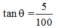

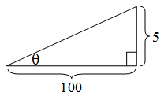

## 616. 結合土地法第34條之1與土地法第104條之實例研習
*發布日期: 2020-02-13* 

## 內文
甲、乙二人共有A地一筆，甲應有部分十分之七，乙應有部分十分之三。甲、乙二人合意將A地出租於丙建築房屋使用。經簽訂土地租賃契約後，丙即於A地上興建別墅一棟。近因甲急需現金周轉，未經乙同意將A地全部出售於丁，是否可行？如甲會同丁向登記機關申請辦理買賣所有權移轉登記，應提出那些文件？

【解答】

• (一) 土地法第34條之1第1項規定：「共有土地或建築改良物，其處分、變更及設定地上權、農育權，不動產役權或典權，應以共有人過半數及其應有部分合計過半數之同意行之。但其應有部分合計逾三分之二者，其人數不予計算。」準此，甲之持分為十分之七，已逾三分之二，甲未經乙同意，將A地出售於丁，為可行。又，土地法第34條之1第4項規定：「共有人出賣其應有部分時，他共有人得以同一價格共同或單獨優先承購。」準此，乙有優先購買權（此優先購買權具有債權效力）。另，土地法第104條規定：「基地出賣時，地上權人、典權人或承租人有依同樣條件優先購買之權。房屋出賣時，基地所有權人有依同樣條件優先購買之權。其順序以登記之先後定之。前項優先購買權人，於接到出賣通知後十日內不表示者，其優先權視為放棄。出賣人未通知優先購買權人而與第三人訂立買賣契約者，其契約不得對抗優先購買權人。」準此，丙有優先購買權（此優先購買權具有物權效力）。

• (二) 乙之優先購買權具有債權效力，丙之優先購買權具有物權效力。二者競合時，丙之優先購買權優先於乙而行使。

• (三) 土地登記規則第97條規定：「申請土地權利移轉登記時，依民法物權編施行法第八條之五第三項、第五項、土地法第三十四條之一第四項、農地重劃條例第五條第二款、第三款或文化資產保存法第三十二條規定之優先購買權人已放棄優先購買權者，應附具出賣人之切結書，或於登記申請書適當欄記明優先購買權人確已放棄其優先購買權，如有不實，出賣人願負法律責任字樣。依民法第四百二十六條之二、第九百十九條、土地法第一百零四條、第一百零七條、耕地三七五減租條例第十五條或農地重劃條例第五條第一款規定，優先購買權人放棄或視為放棄其優先購買權者，申請人應檢附優先購買權人放棄優先購買權之證明文件；或出賣人已通知優先購買權人之證件並切結優先購買權人接到出賣通知後逾期不表示優先購買，如有不實，願負法律責任字樣。依前二項規定申請之登記，於登記完畢前，優先購買權人以書面提出異議並能證明確於期限內表示願以同樣條件優先購買或出賣人未依通知或公告之條件出賣者，登記機關應駁回其登記之申請。」準此，甲會同丁向登記機關申請辦理A地之所有權買賣移轉登記，即表示乙、丙二人放棄優先購買權。

• (四) 買賣所有權移轉登記應提出下列文件：

1. 登記申請書，應列明全體共有人及於登記申請書備註欄記明依土地法第34條之1第1項至第3項規定辦理。登記申請書無須不同意共有人簽名或蓋章。

2. 契約書，指公定契約書。契約書應列明全體共有人，契約書無須不同意共有人簽名或蓋章。

3. 土地所有權狀；但不同意共有人之土地所有權狀得免提出。

4. 身分證明文件，提出申請人之身分證、戶口名簿或戶籍謄本。

5. 已為書面通知或公告之證明文件。

6. 他共有人應得對價或補償已受領或已提存之證明文件。

7. 優先購買權人乙放棄優先購買權者，應附具出賣人之切結書，或於登記申請書適當欄記明優先購買權人確已放棄其優先購買權，如有不實，出賣人願負法律責任字樣。

8. 優先購買權人丙放棄或視為放棄其優先購買權者，申請人應檢附優先購買權人放棄優先購買權之證明文件；或出賣人已通知優先購買權人之證件並切結優先購買權人接到出賣通知後逾期不表示優先購買，如有不實，願負法律責任字樣。
---
*注：本文圖片存放於 ./images/ 目錄下*

## 617. 土地登記(強制登記)之目的
*發布日期: 2020-02-13* 

## 內文
各位同學好

有關我國強制辦理土地登記之目的或意義，茲說明如下：

• (一) 整理地籍：地籍整理之程序，為地籍測量及土地登記(土§36)。辦理土地登記前，應先辦地籍測量(土§38)。因此，土地登記為整理地籍(即建立土地各項基本資料)的必要行政程序。

• (二) 確定產權：不動產物權，依法律行為而取得、設定、喪失及變更者，非經登記，不生效力(民§758)。因繼承、強制執行、徵收、法院之判決或其他非因法律行為，於登記前已取得不動產物權者，應經登記，始得處分其物權(民§759)。不動產物權經登記者，推定登記權利人適法有此權利。因信賴不動產登記之善意第三人，已依法律行為為物權變動之登記者，其變動之效力，不因原登記物權之不實而受影響(民§759-1)。因此，土地登記有強制性，藉此確定產權，並確保對外公信力。

• (三) 便利處分：任何人得申請第二類之土地登記及地價資料；登記名義人、具有法律上通知義務或權利義務得喪變更關係之利害關係人得申請第三類之土地登記及地價資料(土登§24-1)。透過申請閱覽登記簿，即可確知登記事實與內容，加上登記有絕對效力(土§43)，確保交易安全，故使處分得以迅速完成。

• (四) 規定地價：土地所有權人聲請登記而不同時申報地價者，以標準地價為法定地價(土§158)。土地所有權人依本法所申報之地價，為法定地價(土§148)。我國辦理土地登記同時須辦理規定地價，以作為平均地權之照價徵稅、漲價歸公與照價收買之依據。

• (五) 公平稅負：每直轄市或縣（市）辦理地價申報完竣，應即編造地價冊及總歸戶冊，送該管直轄市或縣（市）財政機關(土§159)。亦即土地登記之地籍資料係作為地方課稅的依據。

• (六) 推行土地改革：地籍整理是指查明各宗土地的位置、界址、種類、面積、使用狀況及權屬關係，並記載於書表簿冊圖狀。其目的在於建立地籍制度，明瞭土地狀況，確定土地權利，而為課徵土地稅及實施土地政策之依據。因此，透過土地登記可明瞭土地分配及利用情形，透過相關政策實施，達成地盡其利、地利共享之目標。如過去推行三七五減租、公地放領、耕者有其田等平均地權政策，至現今土地徵收、國土計畫等，皆以地籍資料完備為主要前提。
---
*注：本文圖片存放於 ./images/ 目錄下*

## 618. 代為扣交與代為清償之實例研習
*發布日期: 2020-02-06* 

## 內文
甲有一筆A地，A地上有設定在先之乙的抵押權（債權額700萬元）及成立在後之丙的三七五租約。今政府實施土地徵收，並以市價查估補償900萬元，則政府應如何代為扣交及代為清償？

【解答】

• (一) 平均地權條例施行細則第46條第3項：「照價收買土地設有抵押權者，如其設定登記在耕地租約訂立之前，該抵押權人應優先於耕地承租人受償。」同理，土地徵收亦應適用。故政府應先代為清償（抵押權），再代為扣交（三七五租約）。

• (二) 土地徵收條例第36條規定，被徵收之土地或建築改良物原設定之他項權利因徵收而消滅。其款額計算，該管直轄市或縣（市）主管機關應通知當事人限期自行協議，再依其協議結果代為清償；協議不成者，其補償費存入專戶保管。因此，政府應代為清償700萬元予抵押權人乙。

• (三) 平均地權條例第11條第1項及第2項規定：「依法徵收或照價收買之土地為出租耕地時，除由政府補償承租人為改良土地所支付之費用，及尚未收穫之農作改良物外，並應由土地所有權人，以所得之補償地價，扣除土地增值稅後餘額之三分之一，補償耕地承租人。前項補償承租人之地價，應由主管機關於發放補償或依法提存時，代為扣交。」準此，政府原應補償三七五租約承租人300萬元（即[圖片1]，土地徵收免徵土地增值稅），然代為清償抵押權後之餘額只剩200萬元，故政府應代為扣交200萬元予三七五承租人丙。

## 文章圖片

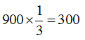

## 619. 登記機關處理程序應進行公告之登記類型
*發布日期: 2020-02-06* 

## 內文
各位同學好

本次專欄為各位同學整理有關辦理土地登記時，其登記機關處理程序應進行公告之登記類型：

※應辦理公告之登記類型：

1. 土地總登記。（15日）

2. 土地所有權第一次登記。（15日）

3. 建物所有權第一次登記。（15日）

4. 時效取得登記：

1. 所有權（15日）

2. 地上權、不動產役權、農育權（30日）

5. 書狀補給登記。（30日）

6. 其他法令規定者。

其相關法源依據如下：

1. 土地總登記：登記機關對審查證明無誤之登記案件，應公告15日(土登§72)。包含時效取得所有權者。

2. 土地所有權第一次登記：土地總登記後，未編號登記之土地，因地籍管理，必須編號登記者，其登記程序準用土地總登記之程序辦理(土登§77)。經審查證明無誤應即公告，公告期間為15日(土登§72)。

3. 建物所有權第一次登記：建物所有權第一次登記，除本節規定者外，準用土地總登記程序(土登§84)。經審查證明無誤應即公告，公告期間為15日(土登§72)。

4. 時效取得地上權（不動產役權、農育權）：

1. 土地總登記後，因主張時效完成申請地上權登記時，應提出以行使地上權意思而占有之證明文件及占有土地四鄰證明或其他足資證明開始占有至申請登記時繼續占有事實之文件。

2. 前項登記之申請，經登記機關審查證明無誤應即公告。公告期間為30日，並同時通知土地所有權人。土地所有權人在前項公告期間內，如有異議，依土地法第59條第2項規定處理。

3. 前四項規定，於因主張時效完成申請不動產役權、農育權登記時準用之。(土登§118)

5. 書狀補給登記：申請土地所有權狀或他項權利證明書補給時，應由登記名義人敘明其滅失之原因，檢附切結書或其他有關證明文件，經登記機關公告30日，並通知登記名義人，公告期滿無人提出異議後，登記補給之。(土登§155I)

6. 其他法令規定者：

1. 土地法：逾（土地總登記）登記期限無人聲請登記之土地或經聲請而逾限未補繳證明文件者，其土地視為無主土地，由該管直轄市或縣(市)地政機關公告之，公告期滿，無人提出異議，即為國有土地之登記(土法§57)。依第57條所為公告，不得少於30日(土法§58)。

2. 地籍清理條例：登記機關受理申請登記，經審查無誤者，除第19條至第26條（神明會土地）及第34條至第39條（寺廟或宗教團體土地）規定之土地應即辦理登記外，其餘土地應即公告3個月。(地清§8)
---
*注：本文圖片存放於 ./images/ 目錄下*

## 620. 民法第759條及土地法第43條之實例研習
*發布日期: 2020-01-30* 

## 內文
甲於乙之房地設定典權，典價100萬元，典權期限10年。嗣典權期限屆至後，經過2年，出典人乙始終不回贖，則甲於辦竣取得典物所有權登記前，是否已取得該房地所有權？今乙趁甲尚未辦竣取得典物所有權登記之際，將登記於其名下之房地出售並移轉登記於不知情的丙，則甲訴請法院判決塗銷丙之所有權登記，是否可行？

【解答】

• (一) 民法第923條規定：「典權定有期限者，於期限屆滿後，出典人得以原典價回贖典物。出典人於典期屆滿後，經過二年，不以原典價回贖者，典權人即取得典物所有權。」又，同法第759條規定：「因繼承、強制執行、徵收、法院之判決或其他非因法律行為，於登記前已取得不動產物權者，應經登記，始得處分其物權。」準此，典權期限屆至後，經過2年，出典人乙不回贖，典權人甲即取得該房地所有權。又，甲之取得係依據法律規定（即依據民法第923條規定），而非因法律行為，故於辦竣取得典物所有權登記前，甲已取得該房地所有權。

• (二) 該房地之登記名義人為乙，但真正權利人為甲。土地法第43條規定：「依本法所為之登記，有絕對效力。」準此，善意第三人丙因信賴登記所取得之權利，具有不可推翻之效力。甲訴請法院判決塗銷丙之所有權登記，為不可行。
---
*注：本文圖片存放於 ./images/ 目錄下*

## 621. 土地法第104條實例研習
*發布日期: 2020-01-22* 

## 內文
甲有一筆A地，先將右半部分設定地上權予乙，乙隨即興建合法建物一棟；再將左半部分設定地上權予丙，丙隨即興建違章建築一棟。今甲擬將A地全部出售於丁，則何人有優先購買權？若A地由乙優先購買，則乙之地上權及丙之地上權是否消滅？

【解答】

• (一) 土地法第104條第1項規定：「基地出賣時，地上權人、典權人或承租人有依同樣條件優先購買之權。房屋出賣時，基地所有權人有依同樣條件優先購買之權。其順序以登記之先後定之。」地上權人、典權人或承租人須於基地上有房屋建築存在，始有土地法第104條之適用；至於該房屋為合法建物或違章建築，則非所問。本題乙、丙二人均於基地上有房屋建築，因此，乙、丙二人均有優先購買權。又，乙之地上權登記在先，丙之地上權登記在後，故乙之優先購買權優先於丙之優先購買權而行使。

• (二) 民法第762條規定；「同一物之所有權及其他物權，歸屬於一人者，其他物權因混同而消滅。但其他物權之存續，於所有人或第三人有法律上之利益者，不在此限。」準此，A地由乙優先購買，則乙之地上權因混同，辦竣塗銷登記而消滅。然，丙之地上權仍存在，不受影響。
---
*注：本文圖片存放於 ./images/ 目錄下*

## 622. 土地登記之實質審查v.s.形式審查
*發布日期: 2020-01-22* 

## 內文
各位同學好

實質審查及形式審查之意涵與審查事項予以分別說明如下：

1. 實質審查

1. 意涵：登記機關於審查登記案件時，除應就法定程序、文件等要件進行形式上審查外，須再就權利義務之真偽進行實質內容審查。

2. 審查事項：包含申請登記事項是否真實，有無違反法律之強制或禁止規定，附具文件有無虛偽，以及是否有管轄權，申請人是否適格、權利能力、行為能力等，皆應予以審查。

2. 形式審查

1. 意涵：指登記機關於審查登記案件時，僅針對依法所規定的形式要件進行審查，而不論各當事人之權利義務發生原因、事實等加以審查。

2. 審查事項：包含登記機關是否有管轄權、是否具有申請登記資格、所提書圖文件是否完備且內容是否符合格式規定。
---
*注：本文圖片存放於 ./images/ 目錄下*

## 623. 程序正義
*發布日期: 2020-01-16* 

## 內文
各位同學好

近年來，司法院釋字及相關行政行為越來越強調「程序正義」。今日專欄即為各位整理說明「程序正義」之意義、內涵：

• (一) 意義

程序正義（又稱看得見的正義），也就是法學上所謂的「正當程序」，又稱為「合理的法律程序」或「正當的行政程序」。指程序公正，即行政決定「過程」（或方法、手段）合理、公正、公開，使得「決定」（或結果）是公正的。

例如黑箱作業，就是沒有程序正義，因為屬於非公正、公開的手段、程序，使得最後作成的結果，難以符合公正、正義，反而多是獨厚某人或團體。有程序正義方才會有實質正義。

• (二) 內涵

1. 受告知權：應送達相關資訊，提供利害關係人「知悉」之機會。包含事前、事後及救濟途徑。

2. 應提供陳述意見之機會。

3. 說明理由的義務：使得利害關係人得於行政救濟時進行權益攻防。

4. 公正行為：避免球員兼裁判，一人獨斷。（委員合議制）

5. 行政資訊公開。
---
*注：本文圖片存放於 ./images/ 目錄下*

## 624. 房地合一所得稅計算實例
*發布日期: 2020-01-16* 

## 內文
甲於民國106年5月以800萬元購入一間房地，設籍且自住連續滿6年，並於民國112年10月以1,500萬元售出，甲又於民國113年3月以1,000萬元購入一間房地，設籍且自住，則甲按自住優惠規定應繳納多少房地合一所得稅？甲申請重購退稅可退還多少稅額？

【解答】

• (一) 房地合一所得稅：1,500-800-1,500x5%=625625-400=225225x10%=22.5

• (二) 重購退稅：[圖片1]

答：甲應繳納22.5萬元之房地合一所得稅，甲可以申請重購退稅15萬元。

## 文章圖片

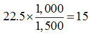

## 625. 司法院釋字第747號解釋之實例研習
*發布日期: 2020-01-09* 

## 內文
甲在台北市郊區擁有一座小山丘，交通部為闢建高速公路，貫穿通過該山丘。然，交通部一直未申請徵收地上權（指區分地上權，以下同），試問甲得否主動請求交通部徵收土地所有權或地上權？

【解答】

• (一) 土地徵收條例第57條第1項及第2項規定：「需用土地人因興辦第三條規定之事業，需穿越私有土地之上空或地下，得就需用之空間範圍協議取得地上權，協議不成時，準用徵收規定取得地上權。但應擇其損害最少之處所及方法為之。前項土地因事業之興辦，致不能為相當之使用時，土地所有權人得自施工之日起至完工後一年內，請求需用土地人徵收土地所有權，需用土地人不得拒絕。」準此，當交通部徵收地上權，致土地不能為相當之使用，甲始得向交通部請求徵收土地所有權。本題，交通部一直未申請徵收地上權，故甲不得主動請求交通部徵收土地所有權。

• (二) 司法院釋字第747號解釋：「人民之財產權應予保障，憲法第15條定有明文。需用土地人因興辦土地徵收條例第3條規定之事業，穿越私有土地之上空或地下，致逾越所有權人社會責任所應忍受範圍，形成個人之特別犧牲，而不依徵收規定向主管機關申請徵收地上權者，土地所有權人得請求需用土地人向主管機關申請徵收地上權。中華民國89年2月2日制定公布之同條例第11條規定：『需用土地人申請徵收土地……前，應先與所有人協議價購或以其他方式取得；所有人拒絕參與協議或經開會未能達成協議者，始得依本條例申請徵收。』（101年1月4日修正公布之同條第1項主要意旨相同）第57條第1項規定：『需用土地人因興辦第3條規定之事業，需穿越私有土地之上空或地下，得就需用之空間範圍協議取得地上權，協議不成時，準用徵收規定取得地上權。……』未就土地所有權人得請求需用土地人向主管機關申請徵收地上權有所規定，與上開意旨不符。有關機關應自本解釋公布之日起一年內，基於本解釋意旨，修正土地徵收條例妥為規定。逾期未完成修法，土地所有權人得依本解釋意旨，請求需用土地人向主管機關申請徵收地上權。」準此，交通部一直未申請徵收地上權，甲得主動請求交通部向主管機關申請徵收地上權。
---
*注：本文圖片存放於 ./images/ 目錄下*

## 626. 比例原則
*發布日期: 2020-01-09* 

## 內文
各位同學好

行政法學概念於近來土地法規考試，越趨重要，今日專欄為各位同學提醒「比例原則」之概念：

比例原則又稱禁止過度原則，其強調國家採取的手段與與達成之目的間，必須合乎比例，即兩者間應均衡。可謂「殺雞焉用牛刀」「禁止大砲打小鳥」。

而其廣義包含三個子原則(行政程序法§7)：

1. 適當性原則(合目的性原則)：採取方法應有助於目的之達成。

2. 必要性原則(最小侵害原則)：有多種同樣能達成目的之方法時，應選擇對人民權益損害最少者。

3. 均衡性原則(狹義比例原則)：採取之方法所造成之損害不得與欲達成目的之利益顯失均衡。

例如土地徵收要件之一即是應符合比例原則，即土地徵收與公共事業之公益目的相互權衡輕重後，確認因興辦公益事業所造成之損害與欲達成目的之利益並無顯失均衡。其相關條文包含：

1. 土施§49：徵收土地於不妨礙徵收目的之範圍內，應就損失最少之地方為之，並應儘量避免耕地。

2. 土徵57：需用土地人因興辦第三條規定之事業，需穿越私有土地之上空或地下，得就需用之空間範圍協議取得地上權，協議不成時，準用徵收規定取得地上權。但應擇其損害最少之處所及方法為之。
---
*注：本文圖片存放於 ./images/ 目錄下*

## 627. 司法院釋字第774號解釋之實例研習
*發布日期: 2020-01-02* 

## 內文
某市政府個案變更都市計畫，將住宅區變更為醫療專用區，供A醫院使用，範圍外毗鄰之B社區管理委員會認為容積率提高會影響該社區之景觀、日照、交通等居住權益，得否提起行政訴訟，以為救濟？

【解答】

• (一) 都市計劃分為都市計畫新訂、都市計畫通盤檢討及都市計畫個案變更三種。都市計畫新訂屬於法規性質，都市計畫通盤檢討原則屬於法規性質，例外屬於個案變更，都市計畫個案變更屬於行政處分（司法院釋字第742號解釋）。若屬法規性質，人民對之不得提起訴願或行政訴訟；若屬行政處分，人民對之得提起訴願或行政處分。

• (二) 司法院釋字第156號解釋：「主管機關變更都市計畫，係公法上之單方行政行為，如直接限制一定區域內人民之權利、利益或增加其負擔，即具有行政處分之性質，其因而致特定人或可得確定之多數人之權益遭受不當或違法之損害者，自應許其提起訴願或行政訴訟以資救濟，本院釋字第一四八號解釋，應予補充釋明。」所稱主管機關變更都市計畫，指個案變更都市計畫而言。都市計畫個案變更屬於行政處分，人民對之得提起訴願或行政訴訟。所稱一定區域內人民，指都市計畫個別變更範圍內之人民而言，不包括都市計畫個案變更範圍外之人民（司法院釋字第774號解釋理由書）。

• (三) 司法院釋字第774號解釋：「都市計畫個別變更範圍外之人民，如因都市計畫個別變更致其權利或法律上利益受侵害，基於有權利即有救濟之憲法原則，應許其提起行政訴訟以資救濟，始符憲法第16條保障人民訴訟權之意旨。本院釋字第156號解釋應予補充。」析言之：

1. 提起訴願或行政訴訟，不以特定人為限，可得確定之多數人亦得提起。

2. 提起訴願或行政訴訟，不以受行政處分之相對人（即受處分人）為限，利害關係人亦得提起。

3. 提起訴願或行政訴訟，不以個案變更範圍內之人民為限，個案變更範圍外之人民亦得提起。

綜上，因都市計畫個案變更致個案變更範圍外之人民，權益受侵害，應許其提起行政訴訟。準此，B社區管理委員會（依公寓大廈管理條例第38條第1項規定，管理委員會有當事人能力）得提起行政訴訟。
---
*注：本文圖片存放於 ./images/ 目錄下*

## 628. 市場失靈的原因
*發布日期: 2020-01-02* 

## 內文
各位同學好

今日為各位同學說明有關市場失靈之原因。

市場價格機能如同一隻看不見的手，於完全競爭市場中，透過供給與需求進行價格與數量之調節，可使資源配置達最適化。而市場失靈指具有價值的財貨或勞務無法由市場決定其價格或數量的現象，也就是市場價格機能無從發揮。其原因如下：

1. 外部性(外部效果)：當某種行為對第三人產生受益或受害效果時，行為當事人卻無需承擔該成本或無法享受該利益。例如工廠造成周邊農地污染，種植花卉有利於鄰近養蜂場生產蜂蜜，皆會因外部性存在以致價格機能無法順利運作。

2. 公共財：公共財指該財貨提供出來被某一人使用時，並不影響其他人對該財貨之使用，具有「非敵對性」與「非排他性」的特性，故易發生搭便車(free rider)情形，亦即隱藏本身對公共財的偏好，以致最後市場均衡數量較市場最適數量為低。而市場缺乏誘因亦難以促使生產者主動提供該物品，資源配置將無法達到經濟效率。例如公園雖大家都需要，但無人願意將自己土地提供為公共公園使用。

3. 獨占性：獨占指財貨或勞務的提供被特定人壟斷，以致於供給者在利潤最大化的考量下，無法有效提供該財貨或勞務的數量且價格亦高出許多。尤其，不動產異質性高具區位獨占性，例如街角地，以致產生獨占利潤，而非由市場機制決定最適價格。

4. 資訊不完全：資訊不完全會導致決策錯誤，進而阻礙市場進行資源有效配置。由於不動產缺乏集中市場，資訊不透明，價格容易被扭曲，因而易導致決策錯誤（買貴），而使市場價格機能未能正常運作。
---
*注：本文圖片存放於 ./images/ 目錄下*

## 629. 土地增值稅之抵繳
*發布日期: 2019-12-26* 

## 內文
土地稅法第31條第3項規定：「土地所有權人辦理土地移轉繳納土地增值稅時，在其持有土地期間內，因重新規定地價增繳之地價稅，就其移轉土地部分，准予抵繳其應納之土地增值稅。但准予抵繳之總額，以不超過土地移轉時應繳增值稅總額百分之五為限。」茲分三點說明：

• (一) 立法理由：孫中山先生提出平均地權之四大辦法（即規定地價、照價徵稅、照價收買、漲價歸公），其中規定地價在劃分私有財產與公有財產之界線。針對私有財產予以照價徵稅（即現行之地價稅），針對公有財產予以漲價歸公（即現行之土地增值稅）。因此規定地價後永以為定，則照價徵稅與漲價歸公之稅基分開，兩者不會發生重複課稅。然現行規定地價並非永以為定，而是每二年重新規定地價一次（重新規定地價原為每三年一次，民國106年5月修法改為每二年一次）。重新規定地價造成地價上漲部分，持有時課徵地價稅，移轉時再課徵土地增值稅，似有重複課徵之嫌。因此重新規定地價所增繳地價稅可以抵繳土地增值稅。

• (二) 評析：

1. 政府推行公共建設，造成地價上漲。土地所有權人基於受益者付費，而增繳地價稅。政府再以增加之地價稅收入，投入公共建設，正所謂「取之地方，用之於地方」。因此，政府公共建設所造成地價上漲，應反映於地價稅之稅基中，故有重新規定地價之必要。

2. 公共建設所造成地價上漲部分，持有時課徵地價稅，以為「土地增值租」（意指使用公有財產之對價）；移轉時課徵「土地增值稅」（意指收回公有財產）。

3. 地價稅為持有稅，對私有財產課稅；土地增值稅為移轉稅，對土地資本利得課稅。兩者性質迥然有別，以地價稅抵繳土地增值稅之理論基礎稍顯牽強。實施多年來，抵繳對納稅義務人而言形同減税，但對國家而言則是稅收之損失。

綜上，重新規定地價增繳地價稅，與日後移轉時所繳納土地增值稅並未重複課徵，抵繳規定實多此一舉。

• (三) 抵繳方法：抵繳方法有下列二種：

1. 按實抵繳：納稅義務人申請按實際增繳地價稅額抵繳其應納土地增值稅者，應檢附地價稅繳納收據，送該管稽徵機關按實抵繳（增繳地價稅抵繳土地增值稅辦法第5條第1項後段）。

2. 簡易抵繳：土地所有權人在持有土地期間，經重新規定地價者，其增繳之地價稅，自重新規定地價起（按新地價核計之稅額），每繳納一年地價稅抵繳該筆土地應繳土地增值稅總額百分之一（繳納半年者，抵繳百分之○‧五）（增繳地價税抵繳土地增值税辦法第5條第1項前段）。

【舉例說明】

• (一) 甲於民國100年2月5日購入一筆土地，於民國101年11月24日售出，其間無重新規定地價，設原核定土地增值稅額50萬元，試計算經過抵繳後，應納多少土地增值稅？因未曾重新規定地價，故不得抵繳。甲應納土地增值稅額仍為50萬元。

• (二) 甲於民國100年2月5日購入一筆土地，於民國102年4月14日售出，其間於民國102年1月1日有重新規定地價，設原核定土地增值稅額50萬元，試計算經過抵繳後，應納多少土地增值稅？自民國102年1月1日至民國102年4月14日，未滿半年，故不得抵繳。甲應納土地增值稅額仍為50萬元。

• (三) 甲於民國100年2月5日購入一筆土地，於民國104年7月3日售出，其間於民國102年1月1日有重新規定地價，設原核定土地增值稅額50萬元，試計算經過抵繳後，應納多少土地增值稅？自國102年1月1日至民國104年7月3日，經過2年6個月，故可以抵繳2.5%。抵繳土地增值稅1.25萬元（即），甲應納土地增值稅額為48.75萬元。

• (四) 甲於民國100年2月5日購入一筆土地，於民國105年3月23日售出，其間於民國102年1月1日及民國105年1月1日皆有重新規定地價，設原核定土地增值稅額50萬元，試計算經過抵繳後，應納多少土地增值稅？自民國102年1月1日至民國105年3月23日，經過3年2個月，故可以抵繳3%。抵繳土地增值稅1.5萬元（即），甲應納土地增值稅額為48.5萬元。

• (五) 甲於民國100年2月5日購入一筆土地，於民國108年12月12日售出，其間於民國102年1月1日、民國105年1月1日及民國107年1月1日皆有重新規定地價，設原核定土地增值稅額50萬元，試計算經過抵繳後，應納多少土地增值稅？自民國102年1月1日至民國108年12月12日，經過5年11個月，抵繳最多5%，故可以抵繳5%。抵繳土地增值稅2.5萬元（即），甲應納土地增值稅額為47.5萬元。
---
*注：本文圖片存放於 ./images/ 目錄下*

## 630. 贈與不動產時增值稅與契稅繳納人不同將影響贈與稅額
*發布日期: 2019-12-26* 

## 內文
各位同學好

本日專欄說明有關贈與不動產時，土地增值稅與契稅繳納人不同（分別為贈與人或受贈人）時，將影響贈與稅額之情形。

首先，可參考此篇新聞：贈與不動產 受贈人應繳土增稅、契稅【原文轉自：好房網】

《例》陳君有台中市西區土地1筆、房屋1棟，103年2月18日贈與其子(贈與當時該地土地公告現值總額420萬元、房屋評定現值為80萬元)，其子已成年，有正當職業並已小有積蓄，若土地增值稅(20萬元)、契稅(15萬元) 由其子支付，可節省贈與稅嗎？ (參考財政部)

【解】(一)由受贈人(陳君之子)繳納土地增值稅、契稅時，應納贈與稅額計算如下:(5,000,000-2,200,000-350,000)×10%=245,000元

• (二) 若土地增值稅、契稅由陳君自己支付，應付多少贈與稅呢？

1. 贈與總額為：5,000,000+350,000=5,350,000元

2. 應納贈與稅額計算如下：（(5,350,000-2,200,000-350,000)×10%=280,000元）

• (三) 由此可知，本案土地增值稅、契稅由其子支付，可節省贈與稅3萬5,000元。陳君需提出該土地增值稅、契稅確由其子支付之證明，供國稅局查核，若經查證屬實，即可扣除。
---
*注：本文圖片存放於 ./images/ 目錄下*

## 631. 工廠輔導管理法之未登記工廠輔導合法化
*發布日期: 2019-12-19* 

## 內文
各位同學好

此次地方特考考了好幾題工廠輔導管理法之未登記工廠輔導合法化措施，其中主要注意該法第28條之4及第28條之10規定：

• (一) 主管機關對低污染之既有未登記工廠及依規定取得特定工廠登記者，得以補助或輔導方式推動下列事項：

1. 環境保護、水利、水土保持相關設施之規劃。

2. 廢（污）水相關處理與排放機制之協助及規劃；必要時，得組成專案小組協調處理之。

3. 群聚地區優先採新訂都市計畫或開發產業園區規劃處理，以銜接國土計畫劃為城鄉發展地區。

• (二) 主管機關對於取得特定工廠登記者，得依下列規定辦理土地變更為適當使用分區或變更編定為適當使用地類別：

1. 群聚地區優先採新訂都市計畫或開發產業園區規劃處理，依都市計畫法、區域計畫法、國土計畫法相關規定辦理土地使用分區變更或使用許可。

2. 非屬前款情形且位於都市計畫以外之土地，由取得特定工廠登記者擬具用地計畫，就其工廠使用之土地，向直轄市、縣（市）主管機關申請核發特定工廠使用地證明書，辦理使用地變更編定。但因前款整體規劃之需要，直轄市、縣（市）主管機關得駁回其申請。

3. 非屬第一款情形且位於都市計畫之土地，依都市計畫法規定辦理。

取得特定工廠登記者，依前項第二款規定辦理使用地變更編定前，應繳交回饋金予直轄市、縣（市）主管機關，撥交依農業發展條例第五十四條第一項規定設置之農業發展基金。

而其中有個關鍵是要屬於「群聚地區」，其意涵是必須達到一定規模，且範圍內有一定比例的工廠。此部分未來將於國土計畫中處理，這部分要特別注意，應透過申請使用許可方式辦理，至於是否核准其合法化，則連結全國國土計畫所說的安全性、公平性與合理性三大原則。
---
*注：本文圖片存放於 ./images/ 目錄下*

## 632. 耕作權
*發布日期: 2019-12-19* 

## 內文
• (一) 意義：耕作權屬於七種不動產他項權利之一種。依物權法定主義，耕作權規定於土地法第133條。即公有荒地之承墾人，自墾竣之日起，無償取得所領墾地耕作之權。析言之：

1. 耕作權僅存在於公有土地，而非存在於私有土地；僅存在於荒地，而非存在於空地。

2. 耕作權之立法意旨，在鼓勵私人開墾公有荒地。

3. 公有荒地之承墾人，自墾竣之日起，先無償取得耕作權。繼續耕作滿十年，再無償取得土地所有權。又，取得耕作權，須辦理耕作權登記，始生效力；然，取得所有權係依法律規定（屬於非法律行為），按民法第759條規定，繼續耕作滿十年，無須辦理所有權移轉登記，耕作權人即取得土地所有權。

• (二) 移轉之限制：耕作權不得轉讓。但繼承或贈與於得為繼承之人，不在此限（土§133Ⅱ）。

• (三) 稅捐：

1. 田賦：承墾土地，應課徵田賦，而非地價稅。又，耕作權人實際上為使用收益，且十年後取得土地所有權，因此依實質課稅原則（意謂租稅課徵不應拘泥於法律之形式或表面，而必須就真實或事實加以課稅；詳見稅捐稽徵法第12條之1），承墾土地之田賦納稅義務人為耕作權人，而非土地所有權人，另，墾竣土地得由直轄市或縣（市）政府酌予免納土地稅二年至八年（土§133Ⅲ）。惟田賦自民國76年停徵迄今，故耕作權人於承墾期間，無須繳納田賦。

2. 土地增值稅：土地為無償移轉者，土地增值稅之納稅義務人為取得所有權之人（土稅§5Ⅰ）。又，依法贈與之公有土地，免徵土地增值稅（土稅§28）。準此，耕作權人繼續耕作滿十年，無償取得土地所有權，相當於政府依法贈與之公有土地，故耕作權人無償取得承墾土地無須繳納土地增值稅。
---
*注：本文圖片存放於 ./images/ 目錄下*

## 633. 浮覆地
*發布日期: 2019-12-12* 

## 內文
何謂浮覆地？甲有一筆A地，作農業使用。某日，颱風導致土石流而造成河流改道，A地成為河流的一部分，則A地之所有權屬誰？數年後，甲死亡，繼承人為乙。嗣政府將該區段河流截彎取直，A地成為浮覆地，則A地所有權屬誰？

【解答】

• (一) 浮覆地之意義：指原為陸地，因河流改道，成為河流的一部分；之後，河流又改道，該地再浮出水面，而形成陸地。

• (二) 土地法第12條第1項規定：｢私有土地，因天然變遷成為湖潭或可通運之水道時，其所有權視為消滅。」準此，因河流改道，A地成為河流的一部分，甲對A地之所有權，無須辦理消滅登記，即歸消滅。又，土地法第10條第2項規定：｢私有土地之所有權消滅者，為國有土地。」準此，A地所有權屬於國有，即A地所有權人為中華民國。

• (三) 土地法第12條第2項規定：｢前項土地，回復原狀時，經原所有權人證明為其原有者，仍回復其所有權。」私有土地所有權視為消滅須因天然變遷所造成；但回復原狀，係自然或人為因素所造成，則非所問。本題，回復原狀係因政府｢截彎取直」（即人為因素）所造成，仍有復權請求權之適用。又，甲於土地流失後死亡，乙繼承其復權請求權。值得一提的是，乙僅有復權請求權而已，須俟登記完畢，始取得A地所有權。因此，登記完畢之前，A地仍屬國有。
---
*注：本文圖片存放於 ./images/ 目錄下*

## 634. 建物所有權第一次登記
*發布日期: 2019-12-12* 

## 內文
各位同學好

有關建物所有權第一次登記，分為建築管理前與後，規範不同申請登記文件，其中，建築管理前興建房屋的相關文件中（如門牌編定、戶籍證明..等），無法證實是否有使用基地之權利，因此，土地登記規則第79條規範，建物與基地非屬同一人所有者，應另附「使用基地之證明文件」。

那何謂「使用基地之證明文件」呢？可參建物所有權第一次登記法令補充規定第13點，整理如下：

1. 如經土地所有權人同意使用其基地，應檢附土地所有權人同意書。

2. 申請人為地上權人或典權人，檢附他項權利證明書可茲證明。

3. 因法院拍賣移轉取得建物者，檢附權利移轉證明書。

4. 日據時期已登記之建物，檢附日據時代各州廳核發之土地謄本。

5. 占用基地經法院判決確定有使用權利者，檢附法院確定判決書。

6. 租用他人土地建築房屋且提出土地使用證明者，檢附基地租賃契約書。
---
*注：本文圖片存放於 ./images/ 目錄下*

## 635. 補正與駁回之區別
*發布日期: 2019-12-05* 

## 內文
各位同學好

本日專欄為各位同學整理「土地登記規則第56條及第57條」有關補正及駁回之區別，茲彙整如表：

• T. ABLE_PLACEHOLDER_1
---
*注：本文圖片存放於 ./images/ 目錄下*

## 636. 土地法第104條優先購買權實例研習
*發布日期: 2019-12-05* 

## 內文
甲將其所有之建地，設定典權於乙，乙再將該建地轉典於丙，丙於該建地上興建房屋一棟。試問：(一)甲將其所有之建地出售時，乙、丙二人是否有優先購買權？(二)丙將其所有之房屋出售時，甲、乙二人是否有優先購買權？

【解答】

• (一) 甲出售建地：

1. 未擴張解釋：乙在該建地上有典權，但無房屋存在，乙雖不得主張土地法第104條之優先購買權，但仍得主張民法第919條之留買權（即優先購買權）。另，丙在該建地上有房屋存在，但甲與丙之間無地上權、典權或租賃權存在，故丙無土地法第104條及民法第919條優先購買權之適用。

2. 擴張解釋：就乙、丙二人整體對外關係而言，乙擁有典權，丙擁有房屋，兩者結合，故乙、丙二人均有土地法第104條優先購買權之適用。就乙、丙二人內部關係而言，依土地法第104條第1項規定，其順序以登記之先後定之，乙之典權登記在先，丙之轉典權登記在後，故乙之優先購買權先於丙而行使。值得一提的是，擴張解釋之結果，仍無法達成土地法第104條房屋與基地所有權合一之立法意旨。

• (二) 丙出售房屋：

1. 未類推適用：甲於基地上有所有權，但甲與丙之間無地上權、典權或租賃權存在，故甲無土地法第104條優先購買權之適用。另，乙與丙之間雖有轉典權存在，但乙於基地上無所有權，故乙無土地法第104條優先購買權之適用。

2. 類推適用：乙於基地上無所有權，但有典權存在，日後有取得所有權之可能，故類推適用土地法第104條規定，乙有優先購買權。值得一提的是，類推適用之結果，仍無法達成土地法第104條房屋與基地所有權合一之立法意旨。

• (三) 綜上，通說採擴張解釋及類推適用。
---
*注：本文圖片存放於 ./images/ 目錄下*

## 637. 當事人免親自到場之情形-台北市免印鑑證明政策
*發布日期: 2019-11-28* 

## 內文
各位同學好

本日專欄為土地登記規則第41條所規定辦理土地登記，當事人(權利人、義務人)免親自到場情形中，最後一款所稱「其他由中央地政機關規定得免由當事人親自到場」，有什麼情形呢？

例如：「台北市以電腦查詢替代印鑑證明，進而確認當事人登記真意，基於簡政便民而當事人無須親自到地政事務所提出國民身分證、簽名及確認身份」，而欲以電腦查詢替代跑去申請紙本印鑑證明，必須完成下列事項：

1. 已在臺北市戶政事務所辦竣印鑑登記

2. 此次辦理土地登記時，於土地登記申請書註明「使用OO戶政事務所登記之印鑑，並同意地政機關利用電腦處理查詢」
---
*注：本文圖片存放於 ./images/ 目錄下*

## 638. 時效取得地上權實例研習
*發布日期: 2019-11-28* 

## 內文
• A. 地登記於甲名下，甲死亡，由其子女乙、丙、丁三人繼承，惟未辦理繼承登記。乙未經丙、丁二人之同意，擅自在A地興建一棟違章建築居住逾20年，試問乙得否主張依時效取得請求登記為地上權人？

【解答】

• (一) 司法院釋字第451號解釋（節錄）：「土地之共有人按其應有部分，本於其所有權之作用，對於共有物之全部雖有使用收益之權，惟共有人對共有物之特定部分使用收益，仍須徵得他共有人全體之同意。共有物亦得因共有人全體之同意而設定負擔，自得為共有人之一人或數人設定地上權。於公同共有之土地上為公同共有人之一人或數人設定地上權者亦同。是共有人或公同共有人之一人或數人以在他人之土地上行使地上權之意思而占有共有或公同共有之土地者，自得依民法第七百七十二條準用同法第七百六十九條及第七百七十條取得時效之規定，請求登記為地上權人。」又，司法院釋字第291號解釋（節錄）：「『以建物為目的使用土地者，應依土地登記規則第七十條提出該建物係合法建物之證明文件』，使長期占有他人私有土地，本得依法因時效取得地上權之人，因無從提出該項合法建物之證明文件，致無法完成其地上權之登記，與憲法保障人民財產權之意旨不符，此部分應停止適用。」準此，A地為乙、丙、丁三人公同共有，乙未經丙、丁二人之同意，以行使地上權之意思擅自在A地上興建一棟違章建築居住逾20年，乙得主張時效取得地上權。

• (二) 時效取得地上權係基於法律規定而取得，故不受民法第759條未經繼承登記不得處分（設定地上權屬於處分行為）之限制。
---
*注：本文圖片存放於 ./images/ 目錄下*

## 639. 土地法第43條之1實例研習
*發布日期: 2019-11-21* 

## 內文
甲、乙二人共有A地一筆，甲之應有部分五分之四，乙之應有部分五分之一。試問：(一)甲將其應有部分設定地上權於丙，是否可行？(二)甲將其應有部分設定抵押權於丁，是否可行？(三)甲將其應有部分出售於戊，是否可行？(四)甲未經乙之同意，將A地設定地上權於己，是否可行？(五)甲未經乙之同意，將A地設定抵押權於庚，是否可行？(六)甲未經乙之同意，將A地出售於辛，是否可行？

【解答】

• (一) 甲將其應有部分設定地上權於丙：地上權屬於用益物權，著重使用價值，故須占有他人之土地，以實現其利益。又，應有部分（即持分）乃對共有土地之抽象劃分，無法具體指明共有土地之某特定部分。因此，甲將其應有部分設定地上權於丙，為不可行。

• (二) 甲將其應有部分設定抵押權於丁：抵押權屬於擔保物權，著重交換價值，故無須占有他人之土地，以實現其價值。因此，甲將其應有部分設定抵押權於丁，為可行。

• (三) 甲將其應有部分出售於戊：民法第819條第1項規定：「各共有人，得自由處分其應有部分。」又，土地法第34條之1第4項規定：「共有人出賣其應有部分時，他共有人得以同一價格共同或單獨優先承購。」準此，甲將其應有部分出售於戊，為可行。惟乙得以同一條件主張優先購買。

• (四) 甲未經乙之同意，將A地設定地上權於己：土地法第34條之1第1項規定：「共有土地或建築改良物，其處分、變更及設定地上權、農育權、不動產役權或典權，應以共有人過半數及其應有部分合計過半數之同意行之。但其應有部分合計逾三分之二者，其人數不予計算。」準此，甲之應有部分五分之四，已超過三分之二，其人數不予計算，故甲未經乙之同意，將A地設定地上權於己，為可行。附帶一提的是，因土地法第34條之1第4項僅適用於出售，故乙不得主張優先承受。

• (五) 甲未經乙之同意，將A地設定抵押權於庚：土地法第34條之1第1項設定他項權利僅限於四種用益物權（即地上權、農育權、不動產役權及典權），不包括擔保物權（即抵押權）。因此，甲未經乙之同意，將A地設定抵押權於庚，為不可行。

• (六) 甲未經乙之同意，將A地出售於辛：土地法第34條之1第1項所稱處分，包括買賣。又，甲之應有部分五分之四，已超過三分之二，其人數不予計算。因此，甲未經乙之同意，將A地出售於辛，為可行。附帶一提的是，乙得依土地法第34條之1第4項主張優先購買。
---
*注：本文圖片存放於 ./images/ 目錄下*

## 640. 土地徵收之要件
*發布日期: 2019-11-21* 

## 內文
各位同學好

不動產經紀人考試剛結束，此次土法第一題考有關土地徵收之要件，如同我常說的現在考試趨勢已經轉變為「重視觀念與理解，而不再只是死背法條」。

此次考的土地徵收要件並未直接出現在某法條當中，如果只是單純拿法條來準備的話，本題可能就比較難應付。而我們在上課時，這些重要觀念都是一提再提，相信同學們應可得心應手。

本次專欄針對土地徵收之要件，茲整理說明如下：

• (一) 公益性土地徵收是國家基於公共利益之目的，而對於人民受憲法保障之財產權，經由法定程序予以剝奪。國家徵收權係立足於公共利益之上。亦即應符合土地徵收條例第3條規定，國家因公益需要，興辦各款事業，方得徵收私有土地

• (二) 必要性需地範圍、面積應為事業所必須，無其他可行之替代區位及方法。因此，土地徵收條例第3條規定，徵收之範圍，應以其事業所必須者為限。

• (三) 比例原則與公共事業之公益目的相互權衡輕重後，確認因興辦公益事業所造成之損害與欲達成目的之利益並無顯失均衡。如同土地法施行法第49條規定，徵收土地於不妨礙徵收目的之範圍內，應就損失最少之地方為之，並應儘量避免耕地。

• (四) 法律保留私有土地之徵收，係屬於對人民基本權利重大之剝奪，故應具有法律基礎，即需符合一定法律程序。如同土地徵收條例第11條規定，土地徵收應先與所有權人協議價購或以其他方式取得，如果未踐行該程序或徒具形式，都屬於不合要件之徵收。

• (五) 合理補償徵收係因公益所受之特別犧牲，故應給予合理之補償。如同土地徵收條例第30條規定，被徵收之土地，應按照徵收當期之市價補償其地價。
---
*注：本文圖片存放於 ./images/ 目錄下*

## 641. 不動產相關定型化契約之不得記載事項
*發布日期: 2019-11-14* 

## 內文
各位同學好

本周末為不動產經紀人考試，希望各位同學能夠百分之二百的發揮，加油！

本周專欄為各位考經紀人的同學整理一下有關幾個不動產相關定型化契約之不得記載事項，其中有關預售屋部分要好好準備，出題機率比較高。

• T. ABLE_PLACEHOLDER_1
---
*注：本文圖片存放於 ./images/ 目錄下*

## 642. 時效取得地上權
*發布日期: 2019-11-14* 

## 內文
甲、乙二人共有A地，甲之應有部分五分之四，乙之應有部分五分之一。(一)甲未經乙之同意，依土地法第34條之1將A地有償設定地上權給自己，是否可行？(二)甲未經乙之同意，擅自在A地上興建一幢違章建築居住逾20年，甲得否主張時效取得地上權？

【解答】

• (一) 土地法第34條之1第1項規定：「共有土地或建築改良物，其處分、變更及設定地上權、農育權、不動產役權或典權，應以共有人過半數及其應有部分合計過半數之同意行之。但其應有部分合計逾三分之二者，其人數不予計算。」準此，甲之應有部分五分之四，已逾三分之二，其人數不予計算，甲得將A地設定地上權於他人。甲之應有部分五分之四，加計甲代理乙之五分之一，因此甲得將A地全部設定地上權於他人。然，代理行為仍受民法第106條禁止自己代理之限制。故甲將A地有償設定地上權給自己，為不可行。

• (二) 司法院釋字第451號解釋（節錄）：「土地之共有人按其應有部分，本於其所有權之作用，對於共有物之全部雖有使用收益之權，惟共有人對共有物之特定部分使用收益，仍須徵得他共有人全體之同意。共有物亦得因共有人全體之同意而設定負擔，自得為共有人之一人或數人設定地上權。於公同共有之土地上為公同共有人之一人或數人設定地上權者亦同。是共有人或公同共有人之一人或數人以在他人之土地上行使地上權之意思而占有共有或公同共有之土地者，自得依民法第七百七十二條準用同法第七百六十九條及第七百七十條取得時效之規定，請求登記為地上權人。」又，司法院釋字第291號解釋（節錄）：「『以建物為目的使用土地者，應依土地登記規則第七十條提出該建物係合法建物之證明文件』，使長期占有他人私有土地，本得依法因時效取得地上權之人，因無從提出該項合法建物之證明文件，致無法完成其地上權之登記，與憲法保障人民財產權之意旨不符，此部分應停止適用。」準此，甲未經乙之同意，以行使地上權之意思擅自在A地上興建一幢違章建築居住逾20年，甲得主張時效取得地上權。
---
*注：本文圖片存放於 ./images/ 目錄下*

## 643. 土地法第43條實例研習
*發布日期: 2019-11-07* 

## 內文
甲長年旅居國外，其名下有一筆建地，好友乙將其侵占並移轉登記為己有。多年後，乙死亡由其子丙繼承，並辦竣繼承登記。甲回國後發現上情，訴請法院塗銷丙之所有權。丙依據土地法第43條主張本人係善意第三人，因信賴登記所繼承取得之權利，具有不可推翻之效力。是否可行？

【解答】

土地法第43條規定：「依本法所為之登記，有絕對效力。」又，民法第759條之1第2項規定：「因信賴不動產登記之善意第三人，已依法律行為為物權變動之登記者，其變動之效力，不因原登記物權之不實而受影響。」據此，土地登記絕對效力之構成要件有三：①須原登記物權有不實情事，②須因法律行為而為物權變動，③須第三人為善意。本案，丙取得之權利係基於自然事實（即繼承），而非法律行為，故丙不得主張土地法第43條之保護。
---
*注：本文圖片存放於 ./images/ 目錄下*

## 644. 土地法第12條
*發布日期: 2019-11-07* 

## 內文
各位同學好

今日專欄談土地法第12條有關河川旁土地之浮覆問題。首先根據該條第一項規定，私有土地，因天然變遷成為湖澤或可通運之水道時，其所有權視為消滅。第二項則規定，前項土地，回復原狀時，經「原所有權人」證明為其原有者，仍回復其所有權。

針對第二項當中，土地浮覆後，得由該「原所有權人」申請回復土地所有權登記，經紀人考試曾經考過一題，倘若該土地原所有權人於浮覆時早已死亡，其繼承人是否得以申請回復？

其答案是原所有權人（甲）之繼承人（A、B、C）享有申報回復所有權登記之權利。且應分成三種情形予以討論，說明如下：

1. 土地流失→原所有權人（甲）死亡（A、B、C繼承）→土地浮覆：根據民法第1148條，繼承人自繼承開始時，除本法另有規定外，承受被繼承人財產上之一切權利、義務。因而原所有權人（甲）於土地流失時，而取得之土地回復原狀登記請求權，亦成為ABC三人繼承之標的，故ABC得以請求回復所有權。

2. 原所有權人（甲）死亡，但A、B、C未辦繼承登記→土地流失→土地浮覆：此時，根據民法第759條規定，繼承人於登記前即已取得不動產物權，僅應經登記，始得處分其物權。是故原所有權人於死亡後，其繼承人即成為該土地之實質所有權人（即使非登記名義人），而後土地變遷為水道，則該繼承人得以該土地之實質所有權人申請回復。

3. 原所有權人（甲）死亡，但A、B、C已辦繼承登記→土地流失→土地浮覆：此時，ABC於土地流失時已是登記簿上之土地所有權人，故直接適用土地法第12條。

因此，不論其土地所有權人死亡係於流失前或流失後，於土地回復原狀時，其繼承人均得檢附土地登記規則第119條規定之證明文件以所有權人之名義申辦回復登記或土地所有權第一次登記。
---
*注：本文圖片存放於 ./images/ 目錄下*

## 645. 土地登記絕對效力實例研習
*發布日期: 2019-10-31* 

## 內文
甲冒用乙之名義，將乙之土地設定抵押權於丙銀行，並向丙銀行冒貸1,000萬元。之後，乙發現上情，訴請法院塗銷丙銀行之抵押權。此時，丙銀行得否主張土地法第43條以為抗辯？又，丙銀行如何保護其權益？

【解答】

• (一) 土地法第43條規定：「依本法所為之登記，有絕對效力。」意指善意第三人因信賴不實登記所取得之權利，具有不可推翻之效力。準此，該土地記載於乙名下，並無登記不實，故乙得訴請法院塗銷丙銀行之抵押權，丙銀行不得主張土地法第43條，以為抗辯。

• (二) 土地法第68條第1項規定：「因登記錯誤遺漏或虛偽致受損害者，由該地政機關負損害賠償責任。但該地政機關證明其原因應歸責於受害人時，不在此限。」準此，因登記虛偽（即虛設抵押權）而造成丙銀行之損害，得向地政機關請求賠償。惟地政機關得主張丙銀行未確實核符身分就撥款，因此損害之發生，丙銀行「與有過失」，以減輕賠償責任，而減少賠償金額。
---
*注：本文圖片存放於 ./images/ 目錄下*

## 646. 釋字第774號
*發布日期: 2019-10-31* 

## 內文
各位同學好

有關司法院解釋第774號，對於都市計畫之訴訟有相當重要之意義，記得高普考、地方特考的考試要準備哦，茲說明重點如下：

• 一、聲請釋憲之個案情形：

1. 臺中市政府變更都市計畫，將住宅區改成醫療專用區，供澄清綜合醫院中港分院使用，範圍外毗鄰之凱撒金邸管理委員會認為容積率提高、停車空間及建築基地退縮距離等，將影響社區住戶與周邊住宅區的緩衝空間、相關交通改善措施及停車供給等。亦即醫院蓋起來後，兩者建築物距離僅有1.5公尺，而且醫院大樓蓋起來後，會影響社區的景觀、日照、交通等居住生活品質。

2. 然而，針對都市計畫變更提起訴訟後，法院認為釋字156並未提及「都市計畫範圍外」人民得以提起訴訟，故予以駁回。

• 二、釋字774在補充釋字156，針對都市計畫變更外人民應許其提起行政救濟：

1. 釋字156號解釋：主管機關變更都市計畫，係公法上之單方行政行為，如直接限制一定區域內人民之權利、利益或增加其負擔，即具有行政處分之性質，其因而致特定人或可得確定之多數人之權益遭受不當或違法之損害者，自應許其提起訴願或行政訴訟以資救濟。☆ 問題點：

1. 何謂一定區域內？並未說明清楚。

2. 尚難導出都市計畫法有關規定，就都市計畫之個別變更，對在變更範圍外之第三人，亦具有保護規範之功能

2. 釋字774號解釋：以往都市計畫個別變更範圍外民眾沒辦法對都市計畫變更提起訴訟，釋字774針對所謂「一定區域內人民」固係指都市計畫個別變更範圍內之人民而言，惟都市計畫個別變更範圍外之人民，如因都市計畫個別變更致其權利或法律上利益受侵害，基於有權利即有救濟之憲法原則，應許其提起行政訴訟以資救濟，始符憲法第16條保障人民訴訟權之意旨。

3. 範圍外人民之性質：人民認為行政處分違法，致損害其權利或法律上利益者，均得提起訴願、行政訴訟以資救濟，不以受行政處分之相對人(即受處分人)為限，利害關係人亦得提起（黃璽君大法官）。因此，都市計畫範圍外人民屬利害關係之第三人，而具有行政爭訟權。（羅昌發大法官）

4. 個別判斷因果關係：但至於是否有因都市計畫變更而導致權利或法律上利益受侵害，應依個案具體判斷（許志雄大法官）。換言之，能不能提起訴訟，需要個案來判斷是否有因果關係，例如究竟所謂「範圍外」，是1公里、5公里，究竟多遠，尚須個案認定與判斷。此外，有大法官（羅昌發大法官）指出有必要就都市計畫個別變更所造成權利或法律上利益受侵害之情形提供認定標準。

其中，根據釋字第469號解釋理由書謂：「法律規範保障目的之探求，應就具體個案而定，如法律明確規定特定人得享有權利，或對符合法定條件而可得特定之人，授予向行政主體或國家機關為一定作為之請求權者，其規範目的在於保障個人權益，固無疑義；如法律雖係為公共利益或一般國民福祉而設之規定，但就法律之整體結構、適用對象、所欲產生之規範效果及社會發展因素等綜合判斷，可得知亦有保障特定人之意旨時，則個人主張其權益……因……而受損害者，即應許其依法請求救濟。」即所謂保護規範理論，以定第三人有無提起撤銷訴訟之訴訟權能。因此，撤銷訴訟之對象，為「損害人民權利或法律上利益」之違法行政處分。（林俊益大法官、許志雄大法官..）

本號解釋既認都市計畫個別變更範圍外之人民亦得提起行政救濟，即肯認都市計畫個別變更所依據之都市計畫法具有保護特定人之功能。此外，都市計畫法具有個別保護之目的，更進一步肯認於變更區域範圍外之居民，如其生活環境利益可能因變更範圍內醫療大樓之興建及營運遭受不利益影響，應肯定其居於保護範圍之內，具有訴訟權能。（黃瑞明大法官）

其他重要觀念：

• 三、都計外民眾參與權

都市計畫之個別變更及定期通盤檢討，因為都因變更現況而可能影響範圍外之鄰近居民權益，故主管機關宜予此等居民程序參與權，以落實利害關係較為密切之鄰近區域居民相互調和、平衡機制。（黃虹霞大法官）

• 四、日照權

日照權、採光、通風、環境衛生與身心健康，應該是受憲法保護的基本人權。（黃虹霞大法官）
---
*注：本文圖片存放於 ./images/ 目錄下*

## 647. 台北市囤房稅之政策
*發布日期: 2019-10-24* 

## 內文
各位同學好

首先請各位同學閱讀下列新聞：柯P打房 囤6屋課4.8％房稅 擁2戶以上1.5％起跳 專家：恐轉嫁給租客【原文轉自：蘋果日報】

這樣的政策，在各位學完土地稅法後，或許可以思考以下幾點稅法之概念：

1. 自住是否應該限定1戶？房屋稅以3戶認定自住，係老爸有錢買房，除自己與老婆住一戶外，以目前常理來看，是有可能再另行購買一戶給念大學的小孩在外居住，抑或買一戶給父母居住。因此，是否要限縮自己住的那1戶是值得再討論，否則也有可能影響到其他稅，如地價稅自用住宅等之定義。

2. 6戶以上稅率調高至4.8%此概念即所謂的囤房稅，非自住房屋越多，課越重的稅率。然而，如建議將稅率調高至4.8%，當然已經超過現行房屋稅條例所規定的住家用最高稅率3.6%，因而勢必要透過中央修法才辦得到。此外，各縣市房屋供需狀況有別，是否要一致性整體調整稅率，實際上也要評估其他縣市之影響。例如調高稅率後，只有台北市6戶上要課4.8%，其他縣市沒有的話，會否導致外溢效果，使得新北市、宜蘭出現更多囤房情形？

3. 要打房，除稅率外，尚有稅基可調整土地稅的基本計算公式是「稅基」乘上「稅率」，因而要調高投機囤房者的稅負，除調高稅率外，當然也可調整稅基。而房屋稅的稅基為縣市稅捐機關所核計的房屋現值，其主要參考縣市的不動產評價委員會所評定的房屋標準價格（＝房屋標準單價、折舊、街路等級調整率）而來。

惟大家可以思考的是，倘若要調整稅基，主要會調整房屋標準單價與街路等級調整率：

1. 如調整房屋標準單價，基本上會影響到整個縣市所有房屋，包含自住用的，因而以往都盡可能將這個單價壓低。鑑此，目前根據「臺北市房屋標準價格及房屋現值評定作業要點」第15點，認定為高級住宅者，其房屋構造標準單價按該棟房屋坐落地點之街路等級調整率加成核計，但適用「房屋構造標準單價表（103年7月起適用）」者，以120％加價核計房屋現值。也就是俗稱的「豪宅稅」，然而，這部分只能針對豪宅加成，無法直接對囤房數量去課重稅。

2. 如調整街路等級調整率，基本上會影響到該街路所有房屋，但部分人可能就只有該處房屋，調整反而影響到他，卻無法達到對囤房者課重稅之目的。

因此，到底該如何處理囤房之問題，似乎還有待中央與地方政府好好思考。
---
*注：本文圖片存放於 ./images/ 目錄下*

## 648. 工業用地與工業區
*發布日期: 2019-10-24* 

## 內文
• (一) 工業用地與工業區之意義：國內工業用地之來源有二，一為工業用地系統，另一為工業區系統。

1. 工業用地：指劃設工業用地範圍，供設廠使用。因此，工業用地係指尚未經開發建設之工業土地。

2. 工業區：指經編定為工業用地，並開發為工業園區。因此，工業區須符合下列要件：

1. 已開闢基本公共設施（如道路、用水、用電、污水處理及廢棄物處理等設施）。

2. 具計畫管理機制（如工廠進駐管制、收取使用維護費等）。

• (二) 工業用地系統：

1. 都市土地：依都市計畫劃設之工業區。以都市計畫法台灣省施行細則為例，工業區分為特種工業區、甲種工業區、乙種工業區及零星工業區等四種。

1. 特種工業區：供特種工業（如劇毒性工業、放射性工業、易燃性工業等）使用為主。

2. 甲種工業區：供輕工業及無公共危險之重工業為主。

3. 乙種工業區：供公害輕微之工廠及工業發展有關設施使用為主。

4. 零星工業區：指為配合原登記有案，無污染性，具有相當規模且遷廠不易之合法性工廠而劃定。

2. 非都市土地：非都市土地有11種分區19種用地。經劃定為11種分區中之工業區，並編定為19種用地中之丁種建築用地。

• (三) 工業區系統：

1. 經濟部工業局依產業創新條例（前身為產業升級條例，再前身為獎勵投資條例）編定並開發之工業區。如五股工業區、樹林工業區等是。

2. 行政院科技部依科學園區設置管理條例設置並開發之科學工業園區。如新竹科學工業園區、中部科學工業園區、南部科學工業園區等是。

3. 經濟部工業局依加工出口區設置管理條例設置並開發之工業區。如台中軟體園區、高雄軟體園區等是。

4. 其他由各主管機關依法設置開發之園區，如內湖科技園區、南港軟體經貿園區、農業生物科技園區、高雄多功能經貿園區等是。
---
*注：本文圖片存放於 ./images/ 目錄下*

## 649. 不動產市場之特性
*發布日期: 2019-10-17* 

## 內文
各位同學好

今年年底台中土地經濟學我要開班啦，今年講義與內容有大翻修，豐富許多，有興趣同學歡迎來聽~

今日專欄為各位同學整理有關不動產市場之特性，算是回答很多題型可以用的「模版」（口訣的話就留待上課再講囉）

不動產市場即是購買者與出售者共同決定一價格，作為某特定不動產之交易。其不動產市場的特性如下：

1. 不完全競爭市場：買賣雙方人數相對較少，進出市場有所限制，且產品具異質性，各種資源皆不易流動，以及資訊不充分、不完全。

2. 非自由競爭市場：自由市場係不受到人為或政府干預和調控，而由價格機能自由調整的市場。然而，土地市場存在預期心理，地價上漲容易，下跌不易（人為影響），影響民眾基本居住權利，故常由政府介入干預（政府干預）。

3. 存在各種次市場(sub-markets)：與一般商品相比，土地具有顯著異質性及不可移動性，以致價格存在很大差異，為能大致區隔市場，而以替代性高低來決定次市場。也就是可從土地的各種屬性，區分出各種次市場，例如：

1. 土地使用：住宅區、商業區、農業區、工業區等。

2. 土地區位：市中心、市郊、郊區等。

3. 土地實質屬性：平地、山坡地等。

4. 土地權利屬性：所有權、租賃權、地上權等。

4. 本質為二手市場：土地基本上都被使用過，但與其他二手市場產品因折舊而往往能以較低價格購得不同，土地具有保值、增值效果。

5. 缺乏集中市場：土地交易資訊不流通，故需不動產經紀人之撮合，缺乏集中市場，成交不易。

6. 巨額投資市場：土地價格昂貴，且具有保值性，故常被視為其他投資的替代。因此，土地不僅是生產要素市場，也是一般的投資市場。

7. 參與者具備多樣化購買動機。

8. 不具真正的市場價格，僅為價格區間。
---
*注：本文圖片存放於 ./images/ 目錄下*

## 650. 平均地權之時代意義
*發布日期: 2019-10-17* 

## 內文
我國憲法中，平均地權之土地政策與策略為何？

【解答】

• (一) 土地政策與策略之意義：土地政策，指解決土地問題之方針。土地策略，指解決土地問題之手段。

• (二) 平均地權之土地政策：

1. 地權平均：土地不為少數人所壟斷與兼併，全體國民均能擁有基本之生活空間。

2. 地盡其利：促進土地合理、有效之使用，避免土地低度利用、過度利用及不當利用。

3. 永續發展：經濟發展與環境保護保持均衡，土地開發與土地保育兼籌並顧。

4. 地利共享：土地所產生之地利，由全體國民享受。換言之，天然利益（指經濟地租）與社會利益（指土地自然增值）收歸公有，歸人民共享。

• (三) 平均地權之土地策略：

1. 規定地價：以規定地價劃分公有財產與私有財產之範圍。

2. 照價徵稅：對私有財產課徵地價稅，以稅去地主手中之天然利益。

3. 漲價歸公：對公有財產課徵土地增值稅，以稅去地主手中之社會利益。

4. 照價收買：對未善盡利用土地之地主（如兼併土地、壟斷土地、投機土地等），予以照價收買，以為制裁。
---
*注：本文圖片存放於 ./images/ 目錄下*

## 651. 自耕農與地主
*發布日期: 2019-10-10* 

## 內文
憲法第143條第4項規定：「國家對於土地之分配與整理，應以扶植自耕農及自行使用土地人為原則，並規定其適當經營之面積。」準此，扶植自耕農為我國之農地政策。另，自耕農與地主二名詞，隨著時代演變而有不同之意涵：

• (一) 第一階段農地改革時期：民國38年實施三七五減租（依據：耕地三七五減租條例，仍繼續施行中，惟僅適用於民國89年1月27日前成立三七五租約之土地），民國40年實施公地放領（依據：台灣省放領公有耕地扶植自耕農實施辦法，已廢止），民國42年實施耕者有其田（依據：實施耕者有其田條例，已廢止），三者統稱為第一階段農地改革。當時處於農業社會，農地為主要生產手段，大量農民爭逐有限農地，造成地主壓迫佃農現象。為扶植佃農，制裁地主，因此推行「耕者有其田」措施。當時，自耕農與地主二名詞之意涵如下：

1. 自耕農：指自任耕作而言，即以自己勞力耕作於自己土地之農民。

2. 地主：依據已廢止之實施耕者有其田條例第6條規定：「本條例所稱地主，指以土地出租與他人耕作之土地所有權人，其不自任耕作，或雖自任耕作而以雇工耕作為主體者，其耕地除自耕部分外以出租論。但菓園、茶園、工業原料、改良機耕與墾荒等雇工耕作，不在此限。土地所有權人，或其家屬，因依法應徵召在營服役期間，將其自耕地託人代耕者，仍以自耕論。」準此，地主為法律專有名詞，存在負面評價，具可責罰性。消滅地主之方法有三：

1. 踢去地主：將地主之土地充公，亦即沒收地主之土地。此為共產國家進行土地改革，所採用之手段。踢去地主恐侵害私人財產權，故不為民主國家所採用。

2. 買去地主：徵收或收買地主之土地，放領給佃農。我國過去推行土地改革，實施耕者有其田措施，即屬買去地主。

3. 稅去地主：以課稅手段去除地主手中之不勞而獲，或以課稅手段迫使地主出售其閒置未利用之土地。我國土地政策乃實施平均地權，平均地權之主要策略就是稅去地主。

• (二) 現代時期：時至今日處於工商業社會，農地已非主要生產手段，農民務農意願低落，農業勞動力不足，並漸趨老化，造成農地荒廢。為鼓勵土地所有權人將其閒置農地出租，因此推行「小地主大佃農」政策（意謂有意願務農而無農地之農民向眾多小地主承租土地，因而形成大佃農，以擴大農場經營規模）。此時，自耕農與地主二名詞之意涵如下：

1. 自耕農：因應農業機械化，農民直接經營農業，雖不自任耕作或雖自任耕作而以雇工耕作為主體，皆屬自耕農。

2. 地主：已非法律之專有名詞，而是普通名詞。地主之意義，顧名思義，即土地所有權人。地主為中立評價，不具可責罰性。

總之，第一階段農地改革將租賃雙方稱為地主與佃農（詳見已廢止之實施耕者有其田條例第6條及已廢止之實施耕者有其田條例臺灣省施行細則第2條）。時至今日，已改稱為出租人與承租人（詳見農業發展條例第21條）。
---
*注：本文圖片存放於 ./images/ 目錄下*

## 652. 房地合一稅之免徵情形
*發布日期: 2019-10-07* 

## 內文
各位同學好

有關房地合一稅免徵情形，係規定於所得稅法第4條之5，房屋、土地有下列情形之一者，免納所得稅，請各位同學瞭解其各款之目的：

• (一) 個人與其配偶及未成年子女符合下列各目規定之自住房屋、土地：

1. 個人或其配偶、未成年子女辦竣戶籍登記、持有並居住於該房屋連續滿六年。(繼承或受遺贈取得者，得將被繼承人或遺贈人持有期間合併計算)

2. 交易前六年內，無出租、供營業或執行業務使用。

3. 個人與其配偶及未成年子女於交易前六年內未曾適用本款規定。

但符合第一款規定者，其免稅所得額，以按第十四條之四第三項規定計算之餘額不超過四百萬元為限，按本項規定計算之餘額超過四百萬元部分，稅率為百分之十。

立法意旨：保障自住需求，落實居住正義，規定符合自住條件定額免稅、超額減徵。

• (二) 符合農業發展條例第三十七條及第三十八條之一規定得申請不課徵土地增值稅之土地。

立法意旨：配合農業政策。

• (三) 被徵收或被徵收前先行協議價購之土地及其土地改良物。

立法意旨：鼓勵民間配合政府基於政策目的推動之土地開發及徵收政策。

• (四) 尚未被徵收前移轉依都市計畫法指定之公共設施保留地。

立法意旨：對於公共設施保留地受限之土地所有權人的權益補償。
---
*注：本文圖片存放於 ./images/ 目錄下*

## 653. 規約之概念
*發布日期: 2019-10-03* 

## 內文
各位同學好

今日為各位同學說明有關「規約」之相關概念。

[案例參考]榮耀社區以規約限制整個社區可以打球、嬉戲、玩滑板車的區塊，只能在某一樓A住戶的門口，使得全社區只有A住戶每天都受到噪音干擾，也影響其出入，甚而常被球打破窗戶，嚴重影響生活品質，請問A住戶是否就只能配合遵守該「至高無上」的公寓大廈規約？

[說明]一、規約之定義規約指公寓大廈區分所有權人為增進共同利益，確保良好生活環境，經區分所有權人會議決議之共同遵守事項(公寓§3)。簡言之，規約就是一種共同協議的私權契約。其中，有關公寓大廈、基地或附屬設施之管理使用及其他住戶間相互關係，除法令另有規定外，得以規約定之(公寓§23)。

• 二、規約之效力依私法自治、契約自由原則，基於社區自治的精神下，協議訂定共同遵守的規約屬於「法律行為」，於訂約後將約束公寓大廈內部所有住戶，除非有違反強制或禁止之規定(民§71)、有背於公共秩序或善良風俗(民§72)，否則住戶就須配合遵守之。

• 三、顯失公平之規約得以請求撤銷之然而，當規約之內容依區分所有建築物之專有部分、共有部分及其基地之位置、面積、使用目的、利用狀況、區分所有人已否支付對價及其他情事，按其情形顯失公平者，不同意之區分所有人得於規約成立後三個月內，請求法院撤銷之(民§799-1)。惟注意條件是「顯失公平」，基本上多需依個案進行判斷。

因此，本參考案例，已然對A住戶生活造成影響，且並非只有A住戶門口方能運動、活動，故確有顯失公平問題，得以依民法第799條之1規定，撤銷該規約之約定。

此外，亦可就民法第148條規定，「權利之行使，不得違反公共利益，或以損害他人為主要目的」，主張該多數決議之規約內容對於少數住戶有權利濫用之問題。至於是否「以損害他人為主要目的」，應就權利人因權利行使所能取得之利益，與他人及國家社會因其權利行使所受之損失，比較衡量以定之。換言之，藉由多數決方式，形成對少數區分所有權人不利之分擔決議或約定，應有充分理由(最高法院97年度台上字第2347號民事判決)
---
*注：本文圖片存放於 ./images/ 目錄下*

## 654. 房地合一所得稅計算題(七)
*發布日期: 2019-10-03* 

## 內文
甲為居住中華民國境內之個人，於民國105年10月買入A房地，辦竣戶籍登記並自己居住，土地持分面積10平方公尺，建物面積50平方公尺，買入之成交價格500萬元，買入時公告土地現值每平方公尺10萬元。嗣甲於民國108年2月買入B房地，辦竣戶籍登記並自己居住，土地持分面積8平方公尺，建物面積30平方公尺，買入之成交價格600萬元，買入時之公告土地現值每平方公尺18萬元。之後，甲於109年5月賣出A房地，賣出之成交價格700萬元，賣出時之公告土地現值每平方公尺15萬元。民國105年10月至民國109年5月之物價指數102。申報土地移轉現值以公告土地現值為準。試問甲申請重購退稅，最多得退還多少土地增值稅及房地合一所得稅？

【解答】

• (一) 重購退還土地增值稅：(15-10x102%)x10=48萬元（土地漲價總數額）48x20%=9.6萬元（土地增值稅）退稅金額=新購土地地價-（原出售土地地價-土地增值稅）=18x8-(15x10-9.6)=3.6萬元

• (二) 重購退還房地合一所得稅：(700-500)-700x5%-48=117萬元（房地交易所得）民國105年10月至民國109年5月，持有期間3年7個月，稅率20%。117x20%=23.4萬元（房地合一所得稅）

[圖片1]

答：重購退還土地增值稅3.6萬元，重購退還房地合一所得稅20.057萬元。

## 文章圖片

## 655. 房地合一所得稅計算題(六)
*發布日期: 2019-09-26* 

## 內文
甲為居住中華民國境內之個人，於民國105年2月買入房地一棟，土地面積30平方公尺，建物面積150平方公尺，買入之成交價格每平方公尺15萬元，買入時公告土地現值每平方公尺5萬元，房屋標準價格每平方公尺2.5萬元。該房地由甲居住，並辦竣戶籍登記。嗣於民國111年3月賣出，賣出之成交價格每平方公尺20萬元，賣出時公告土地現值每平方公尺6萬元，房屋標準價格每平方公尺2.4萬元。民國105年2月至民國111年3月之物價指數110。申報土地移轉現值以公告土地現值為準。試問甲應繳納多少土地增值稅及房地合一所得稅？分別以自住稅率及一般稅率計算。

【解答】

• (一) 土地增值稅：(6-5x100%)x30=15萬元（土地漲價總數額）15x10%=1.5萬元（自用住宅土地增值稅）15x20%=3萬元（一般土地增值稅）

• (二) 房地合一所得稅：(20-15)x150-20x150x5%-15=585萬元（房地交易所得）(585-400)x10%=18.5萬元（自住房地交易所得稅）民國105年2月至民國111年3月，持有期間6年1個月，稅率20%。585x20%=117萬元（一般房地交易所得稅）

答：甲按自住稅率應繳納土地增值稅1.5萬元及房地合一所得稅18.5萬元，甲按一般稅率應繳納土地增值稅3萬元及房地合一所得稅117萬元。
---
*注：本文圖片存放於 ./images/ 目錄下*

## 656. 照價收買屬繼受取得或原始取得？
*發布日期: 2019-09-26* 

## 內文
各位同學好

今日專欄談談照價收買屬繼受取得或原始取得？

首先，照價收買為平均地權四大綱領之一，係政府基於土地政策考量，按私人所報地價，強制收買私人土地之行政行為。至於照價收買屬地權取得分類中的「原始取得」抑或「繼受取得」？

有兩說，有的學者認為是原始取得（如李鴻毅老師），但比較有明確理由的是繼受取得（如陳立夫老師），其理由如下：

1. 土地徵收為需用土地人創設新權利，使其取得供特定公益事業使用土地，故屬原始取得；相對而言，照價收買側重對土地所有權人權利之剝奪，故兩者不同。照價收買不需與土地徵收一樣為原始取得。

2. 依平均地權條例第34條規定，照價收買之土地，地上建築改良物不屬土地所有權人所有者，不需一併收買。又平均地權條例施行細則第48條規定，照價收買之土地建有房屋時，得讓售與地上權人、土地承租人或房屋所有權人，故可解釋為權利繼續存續，而屬繼受取得。
---
*注：本文圖片存放於 ./images/ 目錄下*

## 657. 房地合一所得稅計算題(五)
*發布日期: 2019-09-19* 

## 內文
甲為居住中華民國境內之個人，於民國105年1月買入房地一棟，土地面積50平方公尺，建物面積300平方公尺，房地買入總價6,000,000元，買入時公告土地現值每平方公尺9,000元，房屋標準價格每平方公尺16,000元。嗣於民國107年7月將該房地贈與其子乙，贈與時公告土地現值每平方公尺10,000元，房屋標準價格每平方公尺15,000元。之後，乙於民國109年3月出售該房地於丙，房地出售總價8,000,000元，出售時公告土地現值每平方公尺13,000元，房屋標準價格每平方公尺14,000元，民國105年1月至民國107年7月之物價指數105，民國107年7月至民國109年3月之物價指數110。申報土地移轉現值以公告土地現值為準。試問乙受贈時應繳納多少土地增值稅及契稅？甲贈與時應繳納多少贈與稅？乙出賣時應繳納多少土地增值稅及房地合一所得稅？丙購入時應繳納多少契稅？

【解答】

• (一) 乙受贈之土地增值稅：(10,000-9,000x105%)x50=27,500元（土地漲價總數額）27,500x20%=5,500元（土地增值稅）

• (二) 乙受贈之契稅：15,000x300=4,500,000元（契價）4,500,000x6%=270,000元（契稅）

• (三) 甲贈與之贈與稅：(10,000x50+15,000x300)-(5,500+270,000)-2,200,000=2,524,500元（贈與淨額）2,524,500x10%=252,450元（贈與稅）

• (四) 乙出售之土地增值稅：(13,000-10,000x110%)x50=100,000元（土地漲價總數額）100,000x20%=20,000元（土地增值稅）

• (五) 乙出售之房地合一所得稅：8,000,000-(10,000x50+15,000x300)x110%-8,000,000x5%-100,000=2,000,000元（房地交易所得）民國107年7月至民國109年3月，持有期間1年8個月，稅率35%。2,000,000x35%=700,000元（房地合一所得稅）

• (六) 丙購入之契稅：14,000x300=4,200,000元（契價）4,200,000x6%=252,000元（契稅）

答：乙受贈時應繳納土地增值稅5,500元及契稅270,000元，甲贈與時應繳納贈與稅252,450元，乙出售時應繳納土地增值稅20,000元及房地合一所得稅700,000元，丙購入時應繳納契稅252,000元。
---
*注：本文圖片存放於 ./images/ 目錄下*

## 658. 土地增值稅原地價認定問題
*發布日期: 2019-09-19* 

## 內文
各位同學好

今日專欄為各位同學說明一下有關土地增值稅計算之問題

假設情境：

1. 地主A死亡後，B繼承。適用法條：依土地稅法規定，因繼承而移轉之土地，免徵土地增值稅。

2. B持有兩年後該土地被劃入區段徵收範圍，並辦理區段徵收完成，B選擇領回抵價地。適用法條：依土地稅法規定，區段徵收之土地領回抵價地後第一次移轉時，應以原土地所有權人實際領回抵價地之地價為原地價，計算漲價總數額，課徵土地增值稅。

3. B領回抵價地後再經過2年，出售給C。適用法條：因繼承取得之土地再行移轉者，其原地價係指繼承開始時該土地之公告現值。

問題今B出售時，計算土地增值稅時，其原地價（前次移轉現值）究竟是B繼承時的公告土地現值或是區段徵收時的領回抵價地地價。

如下圖：

[圖片1]

答案繼承前依第三十條之一第三款規定領回區段徵收抵價地之地價，高於繼承開始時該土地之公告現值者，應從高認定。（土地稅法第31條）理由係繼承前領回之區段徵收抵價地，其發回價格係政府所定，且價格通常高於公告現值，然而繼承後再行移轉時，財政部相關函釋均認為已非屬區段徵收領回抵價地後之第一次移轉，除不適用減徵土地增值稅之規定外，其土地增值稅計算仍以繼承時公告現值為準，造成民眾雙重不利益，不符原立法精神。因此，但書規定，繼承前依規定領回區段徵收抵價地之地價高於繼承開始時該土地公告現值者，其計算基準應從高認定。

## 文章圖片

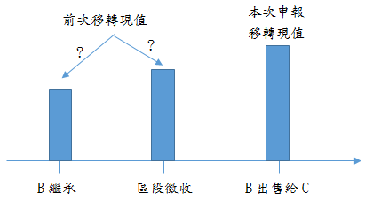

## 659. 釋字第779號
*發布日期: 2019-09-12* 

## 內文
各位同學好

今日專欄為各位同學導讀司法院大法官解釋－釋字第779號，有關非都市土地之交通用地土地增值稅徵免案之相關重點。

首先，先思考一個小案例：某甲有兩筆土地A與B，A地位於某都市計畫區內且被劃為道路用地，但尚未被政府取得（稱為公共設施保留地）；B地則位於非都市土地且被編定為交通用地，僅限作非都管制所容許的相關使用。今某甲同時要移轉此兩筆土地，卻發現依土地稅法規定，A地免徵土地增值稅，但B地卻要課徵土地增值稅，惟某甲百思不得其解的是，A、B兩筆土地都屬公共交通使用，使用上皆受限制，為何因兩者所處地區不同，而有不同稅捐徵免結果。難道買了非都交通用地就只能自認倒楣？因而有了此次第779號解釋~

• 一、解釋文

土地稅法第39條第2項關於免徵土地增值稅之規定，僅就依都市計畫法指定之公共設施保留地，免徵其土地增值稅；至非都市土地經編定為交通用地，且依法核定為公共設施用地者，則不予免徵土地增值稅，於此範圍內，與憲法第7條保障平等權之意旨不符。相關機關應自本解釋公布之日起2年內，依本解釋意旨，檢討修正土地稅法相關規定。

財政部中華民國90年11月13日台財稅字第0900457200號函關於非都市土地地目為道之交通用地，無土地稅法第39條第2項免徵土地增值稅規定之適用部分，應自本解釋公布之日起不再援用。

行政院農業委員會90年2月2日（90）農企字第900102896號函關於公路法之公路非屬農業用地範圍，無農業發展條例第37條第1項不課徵土地增值稅之適用部分，與憲法第19條租稅法律主義及第23條法律保留原則尚無牴觸。

整理：

1. 都市公設保留地可免徵土增稅，但非都交通用地且核定為公設卻不能免徵→有差別待遇，違憲！（違反第7條平等權保障）

2. 公路法之公路，非屬農業用地，不得適用不課徵土地增值稅→未違憲！（符合租稅法定、法律保留原則）

• 二、理由書摘錄重點

• I. 非都交通公設用地應與都計公保地等同處理

• (一) 免徵土地增值稅之客體，以都市計畫地區經依法指定之公共設施保留地為限，而不包括非都市土地經編定為交通用地，且依法核定為公共設施用地者，遂形成二者間之差別待遇。

• (二) 依現行法制，都市土地以都市計畫法為主要管制法令，非都市土地則以區域計畫法、土地法及非都市土地使用管制規則等為主要管制法令，形成兩套土地管制體系，然都市土地與非都市土地所受管制程度亦有類似者。關於非都市土地，依區域計畫法等相關法令規定，其使用受管制，經劃定使用分區並編定使用地類別者，應依其容許使用之項目及許可使用細目使用。非都市土地如經編定為交通用地，且依法核定為公共設施用地者，其使用受限制，流動性、市場交易機會及價值，因政府之政策及法令而受不利影響之情形，與依都市計畫法指定之公共設施保留地受不利影響者相當。尤有甚者，非都市土地若實際已成為公路，亦即供作公共設施使用，其流動性、市場交易機會及價值所受不利影響更加嚴重。此類非都市土地，性質與依都市計畫法指定之公共設施保留地相似，在土地增值稅之徵免上，理應等同處理，俾符合租稅公平原則及憲法第7條保障平等權之意旨。

整理：

這邊解釋的重點指出公保地與非都交通公設用地，同樣使用受限，故其土地增值稅之課徵應等同處理，但並未解釋說，以後非都交通公共設施用地就是免徵土地增值稅。因為，在理由書裡面也提到徵收是否仍應免徵土地增值稅？（見下面內容），換言之，之後稅捐機關修法方向，有關都計公保地與非都交通公設地之土地增值稅課徵，可能有三種情形：

1. 兩者皆免徵

2. 兩者皆課徵

3. 重新修正免徵條件

「按憲法第143條第3項規定：「土地價值非因施以勞力資本而增加者，應由國家徵收土地增值稅，歸人民共享之。」旨在實施土地自然漲價歸公政策（本院釋字第286號解釋參照）。依其意旨，土地凡有自然漲價者，即應ㄧ律課徵土地增值稅。惟83年1月7日修正公布土地稅法第39條第1項規定：「被徵收之土地，免徵其土地增值稅。」其立法理由，係考量土地公告現值遠較土地市價為低，縱依當時規定被徵收之土地可依公告現值加四成補償，並減徵土地增值稅，仍不足以彌補被徵收土地所有人蒙受之損失，故修正為免徵土地增值稅（立法院公報第82卷第4期，第201頁及第202頁立法委員提案說明參照）。然土地徵收條例於101年1月4日修正公布，第30條第1項已規定：「被徵收之土地，應按照徵收當期之市價補償其地價。在都市計畫區內之公共設施保留地，應按毗鄰非公共設施保留地之平均市價補償其地價。」是被徵收土地之補償地價是否已足以彌補土地所有人之損失，以及是否仍有免徵土地增值稅之必要，相關機關於依本解釋意旨檢討修正土地稅法相關規定時，允宜納入考量。併予敘明。」

• I. I.公路仍應課徵土地增值稅

關於公路法之公路非屬農業用地範圍，無農業發展條例第37條第1項不課徵土地增值稅之適用部分，係農委會基於主管機關地位，於其法定職權範圍內，就前開「供與農業經營不可分離之農路」之要件，依一般法律解釋方法，闡釋農業發展條例第37條有關不課徵土地增值稅規定之農業用地範圍，符合農業發展條例第37條第1項（與土地稅法第39條之2第1項規定內容同）之立法意旨，且有助於釐清適用上可能疑義，供稅捐稽徵機關參酌，並無增加法律所未規定之租稅義務，亦未減少法律所規定之租稅優惠，核與憲法第19條租稅法律主義及第23條法律保留原則尚無牴觸。
---
*注：本文圖片存放於 ./images/ 目錄下*

## 660. 房地合一所得稅計算題(四)
*發布日期: 2019-09-12* 

## 內文
甲為中華民國境內居住之個人，民國106年5月買入一間套房，土地面積8平方公尺，建物面積40平方公尺，買入之成交價格500萬元，買入時之公告土地現值每平方公尺10萬元，房屋標準價格每平方尺5萬元。嗣甲於民國108年4月將該套房贈與其妻乙，贈與時公告土地現值每平方尺11萬元，房屋標準價格每平方公尺4.5萬元，申請適用不課徵土地增值稅。之後，乙於民國109年3月出售該套房於丙，出售之成交價格650萬元，出售時之公告土地現值每平方公尺11.5萬元，房屋標準價格每平方公尺4.3萬元。民國106年5月至民國109年3月之物價指數105，民國108年4月至民國109年3月之物價指數102。申報土地移轉現值以公告土地現值為準。試計算乙出售該套房時，應繳納多少土地增值稅及房地合一所得稅？

【解答】

• (一) 土地增值稅：(11.5-10x105%)x8=8萬元（土地漲價總數額）8x20%=1.6萬元（土地增值稅）

• (二) 房地合一所得稅：(650-500)-650x5%-8=109.5萬元（房地交易所得）民國106年5月至民國109年3月，持有期間2年10個月，稅率20%。109.5x20%=21.9萬元（房地合一所得稅）

答：土地增值稅1.6萬元，房地合一所得稅21.9萬元。
---
*注：本文圖片存放於 ./images/ 目錄下*

## 661. 房地合一所得稅計算題(三)
*發布日期: 2019-09-05* 

## 內文
甲為居住中華民國境內之個人，於民國105年10月以總價800萬元買入一棟房地，土地面積30平方公尺，建物面積200平方公尺，買入時公告土地現值每平方公尺5萬元，房屋標準價格每平方公尺2萬元。嗣甲於108年3月死亡，該棟房地由其子乙繼承取得，繼承時公告土地現值每平方公尺6萬元，房屋標準價格每平方公尺1.8萬元。之後，乙於109年5月以總價1,000萬元出售該房地於丙，出售時公告土地現值每平方公尺6.5萬元，房屋標準價格每平方公尺1.7萬元。民國105年10月至民國109年5月之物價指數110，民國108年3月至民國109年5月之物價指數105。申報土地移轉現值以公告土地現值為準。試問乙出售該房地應繳納多少土地增值稅及房地合一所得稅？

【解答】

• (一) 土地增值稅：(6.5-6x105%)x30=6萬元（土地漲價總數額）6x20%=1.2萬元（土地增值稅）

• (二) 房地合一所得稅：1,000-(6x30+1.8x200)x105%-1,000x5%-6=377萬元（房地交易所得）民國105年10月至民國109年5月，持有期間3年7個月，稅率20%。377x20%=75.4萬元（房地合一所得稅）

答：乙應繳納土地增值稅1.2萬元及房地合一所得稅75.4萬元。
---
*注：本文圖片存放於 ./images/ 目錄下*

## 662. 實價登錄修法
*發布日期: 2019-09-05* 

## 內文
各位同學好

今年(2019)7月平均地權條例修法，針對原訂於登記後由權利人辦理實價登錄之規定進行修正。其主要修正內容如下：

平均地權條例第47條：「權利人及義務人應於買賣案件申請所有權移轉登記時，檢附申報書共同向直轄市、縣（市）主管機關申報登錄土地及建物成交案件實際資訊（以下簡稱申報登錄資訊）。地政士法第二十六條之一及不動產經紀業管理條例第二十四條之一有關買賣案件申報登錄資訊之規定，不予適用。」

• (一) 立法目的

1. 原不動產成交案件實際資訊申報登錄（以下簡稱申報登錄）制度執行中，部分地政士因未參與不動產買賣契約訂定過程，且當事人未提供或提供不實資訊，致其無法確知實際資訊而不具依法申報登錄之期待可能。考量申報登錄制度施行以來，已成為我國不動產市場最重要之交易參考資訊來源，且普遍為社會大眾所了解認同；另申報登錄資訊係源自買賣契約，而買賣雙方為訂定契約之當事人，對於各項交易條件情形均為了解，回歸由當事人自行申報登錄應屬合理，且透過買賣雙方相互勾稽確認，可提升資訊正確性，減少申報登錄不實及哄抬情事，是以買賣案件申報登錄責任，調整由權利人及義務人（即買賣雙方）共同申報登錄，爰修正文字，並刪除原第三項免除權利人申報登錄義務及地政士與不動產經紀業申報順位之規定。

2. 為提升買賣案件申報登錄資訊揭露即時性，增進不動產交易資訊透明化之重大公共利益；另考量將買賣案件調整由買賣雙方共同申報登錄後，實務上辦理買賣移轉登記與申報登錄之權利人、義務人及受理機關均相同，為簡化作業流程，減少民眾負擔，並提升行政效率，爰於不影響現行不動產物權登記作業及相關稅費計算之前提下，修正將買賣案件申報登錄提前至申請買賣移轉登記時檢附申報書同時辦理。

3. 現行地政士法第二十六條之一及不動產經紀業管理條例第二十四條之一，分別規定地政士及不動產經紀業買賣案件申報登錄之義務，配合第二項申報登錄義務人修正為權利人及義務人，並為使法律適用更為明確，爰定明上開條文有關地政士及不動產經紀業於買賣案件申報登錄義務之規定，不予適用。

提醒修正重點：

1. 共同申報

2. 同時申報(申請登記時)

• (二) 修法爭議

• T. ABLE_PLACEHOLDER_1
---
*注：本文圖片存放於 ./images/ 目錄下*

## 663. 房地合一所得稅計算題(二)
*發布日期: 2019-08-29* 

## 內文
• 一、甲為居住中華民國境內之個人，於民國106年3月買入房地一棟，土地面積100平方公尺，建物面積500平方公尺，買入總價1,000萬元，買入時公告土地現值2萬元，房屋標準價格1萬元。嗣甲於民國109年5月賣出該房地，賣出總價1,500萬元，賣出時公告土地現值2.5萬元，房屋標準價格0.8萬元。甲提出於買入時支付契稅30萬元及仲介費10萬之憑證，又提出買入房地後持有期間支付地價稅5萬元、房屋稅8萬元及銀行借款利息20萬元之憑證，另提出於賣出時交付土地增值稅8萬元及仲介費60萬元之憑證。民國106年3月至民國109年5月之物價指數105。申報土地移轉現值以公告土地現值為準。試問甲應繳納多少房地合一所得稅？

【解答】

• (一) 土地增值稅：(2.5-2*105%)*100=40萬元（土地漲價總數額）40*20%=8萬元（土地增值稅）

• (二) 房地合一所得稅：(1,500-1,000)-(30+10)-(1,500*5%)-40=345萬元（房地交易所得）民國106年3月至民國109年5月，持有期間3年2個月，稅率20%。345*20%=69萬元（房地合一所得稅）

答：甲應繳納房地合一所得稅69萬元。

• 二、同上題，甲再提出於賣出時交付廣告費20萬元之憑證，試問甲應繳納多少房地合一所得稅？

【解答】

• (一) 土地增值稅：(2.5*2*105%)*100=40萬元（土地漲價總數額）40*20%=8萬元（土地增值稅）

• (二) 房地合一所得稅：(1,500-1,000)-(30+10)-(60+20)-40=340萬元（房地交易所得）民國106年3月至民國109年5月，持有期間3年2個月，稅率20%340*20%=68萬元（房地合一所得稅）

答：甲應繳納房地合一所得稅68萬元。
---
*注：本文圖片存放於 ./images/ 目錄下*

## 664. 土地法104優先購買權之優先順序
*發布日期: 2019-08-29* 

## 內文
各位同學好

今日專欄為各位同學說明有關土地法第104條優先購買權之適用優先順序

首先，土地法第104條第一項規定，基地出賣時，地上權人、典權人或承租人有依同樣條件優先購買之權。房屋出賣時，基地所有權人有依同樣條件優先購買之權。其順序以登記之先後定之。

當某基地所有權人甲就其土地「不同位置」「先後」給予不同人利用：

1. 左半部租給乙建築房屋

2. 中間部分設定地上權給丙建築房屋

3. 右半部設定典權給丁建築房屋

當甲將其基地整塊出賣給戊時，按土地法第104條規定，乙、丙、丁均有同樣的優先購買權，順序則以登記先後定之。

然而，租賃權並非土地登記客體，僅有地上權及典權有登記，因而學者就此條文的解釋，認為應以這三種權利的「成立生效先後」定優先順序。

因此，這邊常有許多同學認為承租人是債權、沒有登記，故應先由有登記又是物權的地上權人及典權人主張，如此一來，等同於認為承租人優先購買權是次一級的，此應非本條文之原意。應記得，他們三種人的優先購買權是相同地位的才是，其順序看誰先成立生效誰優先。

故本擬題，甲既然是先租予乙建築房屋，則應先由乙優先購買該基地。

參考資料：陳立夫，土地法釋義（一），元照出版：第202-203頁。
---
*注：本文圖片存放於 ./images/ 目錄下*

## 665. 土地重測與重劃之登記辦理方式
*發布日期: 2019-08-22* 

## 內文
各位同學好

有關土地重劃確定及地籍圖重測確定，應如何辦理變更登記，分別規定於土地登記規則第91條與92條，兩者辦理方式相似，予以整理如下列對照表，供同學比較與背誦：

• T. ABLE_PLACEHOLDER_1

此外，雖然土地重劃變更登記，主要是重劃後視為原有土地，進行一些地號與面積的變動，而他項權利原則也會逕為轉載，而被放於標示變更章節。但實際上，重劃也同時會辦理有關他項權利之塗銷、抵押權重新設定等（詳土地法講義），所以當然也涉及一些權利變更登記。
---
*注：本文圖片存放於 ./images/ 目錄下*

## 666. 房地合一所得稅計算題(一)
*發布日期: 2019-08-22* 

## 內文
甲於民國105年10月買入一間店面，土地面積100平方公尺，建物面積80平方公尺，買入之成交價格每坪20萬元，買入時公告土地現值每平方公尺2萬元，房屋標準價格每平方公尺1.5萬元。之後，甲於民國109年5月賣出，賣出之成交價格每坪50萬元，賣出時公告土地現值每平方公尺8萬元，房屋標準價格每平方公尺1.3萬元。民國105年10月至民國109年5月之物價指數120。申報土地移轉現值以公告土地現值為準。試問：甲為中華民國境內居住之個人及非中華民國境內居住之個人二種情形，應繳納多少土地增值稅及房地合一所得稅？

【解答】

• (一) 甲為中華民國境內居住之個人：

1. 土地增值稅：(8-2x120%)x100=560萬元（土地漲價總數額）240x20%+(480-240)x30%+(560-480)x40%=152萬元（土地增值稅）

2. 房地合一所得稅：80x0.3025=24.2坪(50-20)x24.2-50x24.2x5%-560=105.5萬元（房地交易所得）民國105年10月至民國109年5月，持有期間3年7個月，稅率20%105.5x20%=21.1萬元（房地合一所得稅）

• (二) 甲為非中華民國境內居住之個人：

1. 土地增值稅：與上述甲為中華民國境內居住之個人相同。即土地漲價總數額為560萬元，土地增值稅為152萬元。

2. 房地合一所得稅：與上述甲為中華民國境內居住之個人的稅基相同，但稅率不同，稅率為35%。因此，房地交易所得為105.5萬元，房地交易所得稅為36.925萬元。105.5x35%=36.925萬元

答：(1)甲為中華民國境內居住之個人，應繳納土地增值稅152萬元及房地合一所得稅21.1萬元。(2)甲為非中華民國境內居住之個人，應繳納土地增值稅152萬元及房地合一所得稅36.925萬元。
---
*注：本文圖片存放於 ./images/ 目錄下*

## 667. 危老條例之適用標的物
*發布日期: 2019-08-15* 

## 內文
各位同學好

今日專欄為各位說明「都市危險及老舊建築物加速重建條例」（以下簡稱危老條例）之適用標的物（客體、對象）：

首先，根據危老條例第三條規定，本條例適用範圍，為都市計畫範圍內非經目的事業主管機關指定具有歷史、文化、藝術及紀念價值，且符合下列各款之一之合法建築物：

• 一、經建築主管機關依建築法規、災害防救法規通知限期拆除、逕予強制拆除，或評估有危險之虞應限期補強或拆除者。

• 二、經結構安全性能評估結果未達最低等級者。

• 三、屋齡三十年以上，經結構安全性能評估結果之建築物耐震能力未達一定標準，且改善不具效益或未設置昇降設備者。

前項合法建築物重建時，得合併鄰接之建築物基地或土地辦理。但鄰接之建築物基地或土地之面積，不得超過該建築物基地面積。

本條例施行前已依建築法第八十一條、第八十二條拆除之危險建築物，其基地未完成重建者，得於本條例施行日起三年內，依本條例規定申請重建。

將其整理後，要適用危老條例重建的建築物有以下幾種態樣與適用條件：

• (一) 危險與老舊之合法建築物

1. 都市計畫範圍內

2. 非經目的事業主管機關指定具有歷史、文化、藝術及紀念價值

3. 危險或老舊建築物

1. 類型1：經建築主管機關依建築法規、災害防救法規通知限期拆除、逕予強制拆除，或評估有危險之虞應限期補強或拆除者

2. 類型2：經結構安全性能評估結果未達最低等級者

3. 類型3：屋齡三十年以上，經結構安全性能評估結果之建築物耐震能力未達一定標準，且改善不具效益

4. 類型4：屋齡三十年以上，經結構安全性能評估結果之建築物耐震能力未達一定標準，且未設置昇降設備者

4. 合法建物

• (二) 鄰接之建築物基地或土地

• (三) 施行前已拆除而尚未完成重建之危險建築物
---
*注：本文圖片存放於 ./images/ 目錄下*

## 668. 借名登記
*發布日期: 2019-08-15* 

## 內文
甲（借名人）為購買土地而與乙（出名人）成立借名登記契約，則該契約是否有效？經成立借名登記關係後，乙未經甲之同意，將該筆土地出售並移轉登記於第三人丙，則處分行為是否有效？

【解答】

• (一) 借名登記契約之意義：當事人約定一方將自己之財產以他人名義登記，而仍由自己管理、使用、處分，他方允就該財產為出名登記之契約（最高法院98年度台上字第76號判決）。

• (二) 借名登記契約之效力：借名登記契約之成立，側重於借名者與出名者間之信任關係，在性質上應與委任契約同視，倘其內容不違反強制、禁止規定或公序良俗者，固應賦予無名契約之法律上效力，並類推適用民法委任之相關規定（最高法院98年度台上字第76號判決）。

• (三) 處分行為之效力：借名登記契約屬於債權契約，僅為借名人與出名人間之內部約定，其效力不及於第三人。出名人既登記為該不動產之所有權人，而將該不動產處分移轉登記於第三人，自屬有權處分（最高法院106年度第三次民事庭會議決議），而非無權處分。因此，其處分行為有效。總之，借名人所為之處分既非無權處分，亦非登記不實，故無適用民法第118條、第759條之1及土地法第43條之餘地。
---
*注：本文圖片存放於 ./images/ 目錄下*

## 669. 公保地與非公保地之徵收補償
*發布日期: 2019-08-08* 

## 內文
新北市政府擬徵收道路用地，部分道路用地位於都市計畫區內，部分道路用地位於非都市計畫地區，則如何評估該道路之補償地價？

【解答】

• (一) 都市土地才有公共設施保留地，非都市土地則無公共設施保留地。換言之，都市計畫範圍內始有公共設施保留地，都市計畫範圍外並無公共設施保留地。

• (二) 土地徵收條例第30條第1項規定：「被徵收之土地，應按照徵收當期之市價補償其地價。在都市計畫區內之公共設施保留地，應按毗鄰非公共設施保留地之平均市價補償其地價。」準此，道路用地位於都市計畫地區，屬於公共設施保留地；道路用地位於非都市計畫地區屬於非公共設施保留地。前者應按照毗鄰非公共設施保留地之平均市價評估其補償地價；後者應按照被徵收土地本身之市價評估其補償地價。所稱市價，指市場正常交易價格。析言之：

1. 非公共設施保留地：預定徵收土地宗地市價應以選取之比準地為基準，參酌宗地條件、道路條件、接近條件、周邊環境條件及行政條件等個別因素調整估計之。

2. 公共設施保留地：都市計畫區內公共設施保留地區段地價以其毗鄰非公共設施保留地之區段地價平均計算。帶狀公共設施保留地穿越數個地價不同之區段時，得分段計算。前項非公共設施保留地地價區段，以其比準地地價為區段地價。所稱平均計算，指按毗鄰各非公共設施保留地地價區段之區段線比例加權平均計算。

上開市價，由直轄市、縣（市）主管機關查估或委由不動產估價師查估，並提交地價評議委員會評定之。
---
*注：本文圖片存放於 ./images/ 目錄下*

## 670. 多數決與優先購買權之比較
*發布日期: 2019-08-08* 

## 內文
各位同學好

今日專欄主要釐清有關土地法第34條之1之概念。

有滿多同學常把34-1就認定為多數決，但在寫立法目的時，卻又寫簡化消滅共有關係，實際上，第1項多數決與第4項優先購買是兩回事，觀念整理比較如下：

• T. ABLE_PLACEHOLDER_1

綜上，應注意多數決處分應無簡化、消滅共有關係之意旨。

按該條係去除「目前多數共有人認為其無法妥適利用共有不動產」的弊端，而共有人依多數決出賣共有不動產全部時，並不論買受人為一人或數人，因此，該條項應無簡化或消滅共有關係的立法意旨。如認為該條項的目的在於簡化或消滅共有關係，反而可能會減少共有不動產出賣的可能性。(參黃健彰、陳立夫老師文章)
---
*注：本文圖片存放於 ./images/ 目錄下*

## 671. 原始取得或繼受取得-市地重劃
*發布日期: 2019-08-01* 

## 內文
各位同學好

本日專欄針對有關原始取得或繼受取得之觀念予以釐清。

首先，土地所有權之取得，按照取得性質可分為原始取得與繼受取得，前者不繼受前手權利瑕疵，亦即土地上所有負擔因原始取得而歸於消滅；後者繼受前手權利瑕疵，亦即承受他人土地之原有負擔。

至於常有同學直接將市地重劃歸類為繼受取得，可能需要再將情形再予細分，方才精準。其實，市地重劃包含了原始取得與繼受取得：

1. 市地重劃後土地所有權人領回土地＝繼受取得市地重劃後，重行分配與原土地所有權人之土地，自分配結果確定之日起，視為其原有之土地(平§62)。重劃前土地已設定他項權利而於重劃後分配土地者，主管機關應於辦理土地權利變更登記前，邀集權利人協調，除協調結果該權利消滅者外，應列冊送由該管登記機關按原登記先後轉載於重劃後分配之土地(平施§91)。其意涵係原土地所有權人對於重劃後所分配之土地，其權利義務乃延續重劃前之土地，亦即重劃前權利負擔仍存續於重劃後分配土地上，故屬於繼受取得。

2. 市地重劃後政府取得抵費地＝原始取得市地重劃之抵費地，政府於重劃後取得，應屬原始取得。某地主雖原為其所有權人，亦喪失其所有權，系爭地上物之占有系爭土地，即成無權占有。(參最高法院85年台上字第2642號民事判決)
---
*注：本文圖片存放於 ./images/ 目錄下*

## 672. 土地登記絕對效力
*發布日期: 2019-08-01* 

## 內文
甲、乙、丙三人共有A地一筆，應有部分各三分之一 。經法院判決分割確定，分割為A、A-1、A-2三筆土地，A地分歸甲所有，A-1地分歸乙所有，A-2地分歸丙所有。甲於判決分割確定後、共有物分割登記前，將其應有部分設定抵押權於丁。試問：(一)經法院判決分割，甲、乙、丙於何時分別取得A、A-1、A-2之土地所有權？(二)共有物分割登記時，丁之抵押權如何處理？(三)乙、丙二人主張丁之抵押權於判決分割確定後始設定，理當不存在於A-1、A-2土地之上，故應塗銷丁之抵押權，是否有理？(四)日後，清償期屆至，甲未清償債務，丁聲請法院拍賣A、A-1、A-2三筆土地。經拍定後，產權如何處理？

【解答】

• (一) 民法第759條規定：「因繼承、強制執行、徵收、法院之判決或其他非因法律行為，於登記前已取得不動產物權者，應經登記，始得處分其物權。」所稱法院之判決，指法院之形成判決。準此，共有物分割判決屬於形成判決，故甲、乙、丙於法院判決確定，不待共有物分割登記，即分別取得A、A-1、A-2之土地所有權。

• (二) 土地登記規則第107條第1項前段規定：「分別共有土地，部分共有人就應有部分設定抵押權者，於辦理共有物分割登記時，該抵押權按原應有部分轉載於分割後各宗土地之上。」準此，丁之抵押權按應有部分三分之一轉載於A、A-1、A-2三筆土地之上。

• (三) 乙、丙二人主張存在於A-1、A-2土地上的丁之抵押權應塗銷之，然丁援引土地法第43條以為抗辯。爰丁信賴登記於甲之應有部分設定抵押權，具有不可推翻之效力，故丁主張有理。換言之，丁之抵押權不得塗銷。

• (四) 司法院釋字第671號解釋：「憲法第十五條關於人民財產權應予保障之規定，旨在確保個人依財產之存續狀態行使其自由使用、收益及處分之權能，不得因他人之法律行為而受侵害。分別共有不動產之應有部分，於設定抵押權後，共有物經分割者，其抵押權不因此而受影響（民法第八百二十五條及第八百六十八條規定參照）。於分割前未先徵得抵押權人同意者，於分割後，自係以原設定抵押權而經分別轉載於各宗土地之應有部分，為抵押權之客體。是強制執行時，係以分割後各宗土地經轉載抵押權之應有部分為其執行標的物。於拍定後，因拍定人取得抵押權客體之應有部分，由拍定人與其他共有人，就該不動產全部回復共有關係，其他共有人回復分割前之應有部分，經轉載之應有部分抵押權因已實行而消滅，從而得以維護其他共有人及抵押權人之權益。準此，中華民國九十年九月十四日修正發布之土地登記規則第一百零七條之規定，符合民法規定之意旨，亦與憲法第十五條保障人民財產權之規定，尚無牴觸。」準此，經拍定後，A、A-1、A-2三筆土地皆回復分割前之共有關係，亦即該三筆土地之產權皆為乙、丙與拍定人三人共有，應有部分各三分之一。
---
*注：本文圖片存放於 ./images/ 目錄下*

## 673. 未辦保存登記之建物買賣
*發布日期: 2019-07-25* 

## 內文
甲有一筆土地，土地上有一棟未辦保存登記之小木屋。甲與乙簽訂買賣契約並辦竣土地所有權移轉登記。經過一年後，甲主張小木屋為其所有。試就下列情況下，甲之主張是否有理？(一)買賣契約記載買賣標的為土地。(二)買賣契約記載買賣標的為土地及小木屋。

【解答】

• (一) 土地與小木屋為二個物，均得為交易之標的。又，小木屋未辦保存登記(即建物所有權第一次登記)，故不得辦理小木屋之建物所有權移轉登記。

• (二) 買賣契約記載買賣標的為土地：買賣契約未記載小木屋，則小木屋不在買賣範圍內。故甲主張小木屋為其所有，為有理。此外，民法第425條之1規定：「土地及其土地上之房屋同屬一人所有，而僅將土地或僅將房屋所有權讓與他人，或將土地及房屋同時或先後讓與相異之人時，土地受讓人或房屋受讓人與讓與人間或房屋受讓人與土地受讓人間，推定在房屋得使用期限內，有租賃關係。其期限不受第四百四十九條第一項規定之限制。前項情形，其租金數額當事人不能協議時，得請求法院定之。」準此，甲（小木屋）與乙（土地）之間推定有租賃關係，故乙不得依民法第767條訴請甲拆屋還地。

• (三) 買賣契約記載買賣標的為土地及小木屋：未辦建物所有權第一次登記之小木屋，雖無法辦理所有權移轉登記，但並非不得為交易之標的。甲將其土地連同小木屋出售於乙，應認為甲已將該小木屋之事實處分權讓與乙，故甲主張小木屋為其所有，為無理。
---
*注：本文圖片存放於 ./images/ 目錄下*

## 674. 房地合一稅之計算
*發布日期: 2019-07-25* 

## 內文
各位同學好

今天專欄為各位說明有關房地合一稅之計算，可分為以下兩個主要算式。

1. 出價取得（原始取得成本）個人房屋、土地交易所得或損失之計算，其為出價取得者，以交易時之成交價額減除原始取得成本，與因取得、改良及移轉而支付之費用後之餘額為所得額(所§14-4I)。亦即當初購入金額。課稅所得＝交易時成交價額－原始取得成本－因取得、改良及移轉而支付之費用－依土地稅法計算之土地漲價總數額

2. 繼承或受贈取得（現值）其為繼承或受贈取得者，以交易時之成交價額減除繼承或受贈時之房屋評定現值及公告土地現值按政府發布之消費者物價指數調整後之價值，與因取得、改良及移轉而支付之費用後之餘額為所得額(所§14-4I)。亦即當初無購入金額，故以房屋評定現值+公告土地現值並經物價調整後為基礎。課稅所得＝交易時成交價額－繼承或受贈時房屋評定現值及公告土地現值按政府發布之消費者物價指數調整後之價值－因取得、改良及移轉而支付之費用－依土地稅法計算之土地漲價總數額

一為當初房地是出價買來的，另一為是無償得來的，後者因無取得成本，故以政府所訂的（公告土地現值+房屋評定現值）*物價調整作為取得成本。

然而，此種方式也造成受贈後如要再移轉，其所得墊高，房地合一稅重，此概念應予注意。
---
*注：本文圖片存放於 ./images/ 目錄下*

## 675. 流抵約定與絕賣條款
*發布日期: 2019-07-18* 

## 內文
甲向乙借錢，並以丙之土地設定抵押權，登記簿並記載流抵約定。清償期屆至，債務未清償，抵押物所有權移屬於抵押權人。抵押物所有權移轉時，若抵押物價值與擔保債權不相當，是否須作找補？另，丁支付典價於戊之土地設定典權，登記簿並記載絕賣條款。典權期限屆滿，出典人未回贖，典權人即取得典物所有權。典物所有權移轉時，若典物價值與典價不相當，是否須作找補？

【解答】

• (一) 民法第873條之1規定：「約定於債權已屆清償期而未為清償時，抵押物之所有權移屬於抵押權人者，非經登記，不得對抗第三人。抵押權人請求抵押人為抵押物所有權之移轉時，抵押物價值超過擔保債權部分，應返還抵押人；不足清償擔保債權者，仍得請求債務人清償。抵押人在抵押物所有權移轉於抵押權人前，得清償抵押權擔保之債權，以消滅該抵押權。」準此，抵押物所有權移轉時，若抵押物價值與擔保債權不相當，當事人須作找補。即抵押物價值超過擔保債權部分，抵押權人乙應返還抵押人丙。抵押物價值不足擔保債權部分，抵押權人乙仍得請求債務人甲清償。應注意者，債權係對人不對物之權利，故乙僅得向甲請求清償，不得向丙請求清償。抵押權為物權，物權係對物不對人之權利，故丙僅以其土地作擔保，如有不足清償，丙不負清償之責；如有超過擔保債權，餘額應返還丙。

• (二) 民法第913條規定：「典權之約定期限不滿十五年者，不得附有到期不贖即作絕賣之條款。典權附有絕賣條款者，出典人於典期屆滿不以原典價回贖時，典權人即取得典物所有權。絕賣條款非經登記，不得對抗第三人。」準此，典物所有權移轉時，若典物價值與典價不相當，當事人無須作找補。
---
*注：本文圖片存放於 ./images/ 目錄下*

## 676. 釋字732之修法
*發布日期: 2019-07-18* 

## 內文
各位同學好

這次高普考釋字就考了兩個，可見大法官釋字仍然是考試重點！今天專欄為各位談談最近配合釋字732修法的新聞。

首先，請大家先參考下列新聞：捷運站開發修法 「毗鄰土地」將刪除【原文轉自：2019-07-11，聯合報】

釋字732：大眾捷運法規定：「大眾捷運系統……其毗鄰地區辦理開發所需之土地……，得由主管機關依法報請徵收。」此等規定，許主管機關為土地開發之目的，依法報請徵收土地徵收條例第三條第二款及土地法第二百零八條第二款所規定交通事業所必須者以外之毗鄰地區土地，於此範圍內，不符憲法第23條之比例原則，與憲法保障人民財產權及居住自由之意旨有違，應自本解釋公布之日起不予適用。

其概念為：

1. 缺乏必要性：土地徵收除應為興辦該土§208所規定之事業外，其徵收土地之範圍，並應確為興辦該事業所必須。而捷運場站以外之毗鄰地區土地卻難謂全為捷運交通事業所必須。

2. 違反比例原則：徵收將使土地資源之利益重新分配或移轉予國家或其他私人享有，造成原土地所有權人遭受土地損失之特別犧牲。因此，徵收非交通事業所必須之土地進行開發，並非達成土地資源有效利用、地區發展並利國家建設經費之取得目的所不得不採之必要手段，且非侵害最小之方式。

3. 影響財產權及居住自由：實務上「毗鄰地區土地」之範圍，不限於捷運場、站之出入口所及之土地，而擴及與捷運設施用地相連接、在同一街廓內且能與捷運設施用地連成同一建築基地、甚至透過天橋或地下道可以相互連通者。如此一來，形成捷運設施蓋在任一個街廓，捷運局就如同取得對該街廓之都市更新權一般，賦予國家可以任意劃定徵收範圍之權限並取得開發權，導致鄰近地區人民之財產權及居住自由權利受有高度不確定之風險。

此外，注意釋字732較著重於徵收「目的」闡釋，而另外的釋字743也是在談捷運周邊土地開發，但其著重於徵收後「用途」之解釋。兩者有所不同！
---
*注：本文圖片存放於 ./images/ 目錄下*

## 677. 共有物管理之登記對抗效力
*發布日期: 2019-07-11* 

## 內文
• (一) 甲、乙、丙三人共有一筆土地，應有部分各三分之一，三人並訂有分管協議。之後，甲將其應有部分三分之一出售於丁，則丁是否須受分管協議之拘束？

【解答】

• (一) 司法院釋字第349號解釋：「最高法院四十八年度臺上字第一○六五號判例，認為『共有人於與其他共有人訂立共有物分割或分管之特約後，縱將其應有部分讓與第三人，其分割或分管契約，對於受讓人仍繼續存在』，就維持法律秩序之安定性而言，固有其必要，惟應有部分之受讓人若不知悉有分管契約，亦無可得而知之情形，受讓人仍受讓與人所訂分管契約之拘束，有使善意第三人受不測損害之虞，與憲法保障人民財產權之意旨有違，首開判例在此範圍內，嗣後應不再援用。至建築物為區分所有，其法定空地應如何使用，是否共有共用或共有專用，以及該部分讓與之效力如何，應儘速立法加以規範，併此說明。」

• (二) 民法第826條之1第1項規定：「不動產共有人間關於共有物使用、管理、分割或禁止分割之約定或依第八百二十條第一項規定所為之決定，於登記後，對於應有部分之受讓人或取得物權之人，具有效力。其由法院裁定所定之管理，經登記後，亦同。」

• (三) 綜上，丁是否受分管協議之拘束，端視下列情形而定：1.分管協議經辦理登記，則丁應受分管協議之拘束。2.分管協議未經辦理登記，且丁不知悉有分管協議，亦無可得而知之情事，則丁不受分管協議之拘束。

• (二) 甲、乙二人共有一筆土地，甲之應有部分四分三，乙之應有部分四分之一，甲未經乙之同意擅自將該筆土地出租於丙，出租行為是否有效？之後，乙將其應有部分四分之一出售於丁，甲是否有優先購買權？最後，該地由丁購得，丁是否須受甲與丙所訂租賃契約之拘束？

【解答】

• (一) 民法第820條第1項規定：「共有物之管理，除契約另有約定外，應以共有人過半數及其應有部分合計過半數之同意行之。但其應有部分合計逾三分之二者，其人數不予計算。」準此，甲未經乙之同意擅自將該筆土地出租於丙（出租屬於管理行為），出租行為有效。

• (二) 土地法第34條之1第4項規定：「共有人出賣其應有部分時，他共有人得以同一價格共同或單獨優先承購。」準此，乙將其應有部分四分之一出售於丁，甲有優先購買權。

• (三) 司法院釋字第349號解釋：「最高法院四十八年度臺上字第一○六五號判例，認為『共有人於與其他共有人訂立共有物分割或分管之特約後，縱將其應有部分讓與第三人，其分割或分管契約，對於受讓人仍繼續存在』，就維持法律秩序之安定性而言，固有其必要，惟應有部分之受讓人若不知悉有分管契約，亦無可得而知之情形，受讓人仍受讓與人所訂分管契約之拘束，有使善意第三人受不測損害之虞，與憲法保障人民財產權之意旨有違，首開判例在此範圍內，嗣後應不再援用。至建築物為區分所有，其法定空地應如何使用，是否共有共用或共有專用，以及該部分讓與之效力如何，應儘速立法加以規範，併此說明。」又，民法第826條之1第1項規定：「不動產共有人間關於共有物使用、管理、分割或禁止分割之約定或依第八百二十條第一項規定所為之決定，於登記後，對於應有部分之受讓人或取得物權之人，具有效力。其由法院裁定所定之管理，經登記後，亦同。」綜上，丁是否受租賃契約之拘束，端視下列情形而定：1.共有人依民法第820條第1項規定所為出租決定，經辦理登記，則丁應受租賃契約之拘束。2.共有人依民法第820條第1項規定所為出租決定，未經辦理登記，且丁不知悉有租賃契約，亦無可得而知之情事，則丁不受租賃契約之拘束。
---
*注：本文圖片存放於 ./images/ 目錄下*

## 678. 人口與土地使用的關係
*發布日期: 2019-07-11* 

## 內文
各位同學好

今日專欄來談談人口與土地使用的關係，主要可從三個面向說明：

1. 人口數量人口數量引發各種活動需求，包含居住、商業、公共設施等，進而決定土地使用類型，如住宅區、商業區、學校用地等等。而現今因為少子化、單身化之影響，人口成長逐漸趨緩，因而需檢討土地使用是否仍有這麼多需求。

2. 人口結構人口結構指年齡、性別比等，不同的人口結構將有不同的土地使用需求。在現今高齡化影響下，土地使用應注意老年人口之需求，例如老年人口使用的活動中心、公園，包含都市規劃與設計應重視通用設計等；另外，少子化則應檢討學校用地之需求與劃設等。

3. 人口流動人口流動則會影響土地使用之效率，當某一地區人口外移，則原土地使用與公共設施形成供過於求之情況，而當某一地區遷入人口眾多，則凸顯當地原土地使用與公共設施供不應求。而當現今鄉村人口外流，導致城鄉失衡問題，應注意人口政策如何吸引人口回流，例如現今地方創生政策，同時應檢討人口移入與移出地區之土地使用調整。
---
*注：本文圖片存放於 ./images/ 目錄下*

## 679. 預告登記與土地法第107條之競合
*發布日期: 2019-07-04* 

## 內文
甲將其所有一筆耕地出售於乙，簽訂買賣契約後，雙方先辦保全土地權利移轉之預告登記，暫不辦買賣所有權移轉登記。不久，甲將該筆耕地出租於丙。日後，甲將該筆耕地辦理所有權移轉登記於乙時，丙是否有優先購買權？

【解答】

• (一) 預告登記屬於限制登記之一種。所稱限制登記，指限制登記名義人處分其土地權利所為之登記。因此，限制登記僅限制登記名義人之處分，並未限制登記名義人之管理、使用及收益。故預告登記後，登記名義人仍得將其土地出租（出租屬於管理行為）。換言之，出租行為有效。

• (二) 土地法第107條第1項規定：「出租人出賣或出典耕地時，承租人有依同樣條件優先承買或承典之權。」此優先購買權具有物權效力。

• (三) 預告登記係將債權物權化，故具有物權效力。土地法第107條之優先購買權亦具有物權效力。兩者競合時，應依登記或成立先後定其優先性。預告登記之登記日期先於租約之成立日期，因此預告登記之效力優先於土地法第107條。總之，甲將該筆耕地辦理所有權移轉登記於乙時，丙無優先購買權。
---
*注：本文圖片存放於 ./images/ 目錄下*

## 680. 外國人取得土地之限制
*發布日期: 2019-07-02* 

## 內文
各位同學好

高普考即將到來，加油！以下就土地法部分提醒有關外國人土地取得限制之回答方式，提供參考：

【題目】

甲為台裔美國人無中華民國國籍，今欲購買國內農地經營農業，向當地地政事務所申請登記，是否應予以核准？倘若其購買後卻於該農地上興建農舍經營民宿，經查獲該如何處理，試申論之。

【擬答】

• (一) 甲為台裔美國人無中華民國國籍，故為外國人，根據土地法之規定，其欲購買國內農地經營農業，向當地地政事務所申請登記，是否應予以核准，依序判斷說明如下：

1. 是否為平等互惠國家：外國人在中華民國取得或設定土地權利，以依條約或其本國法律，中華民國人民得在該國享受同樣權利者為限。換言之，在平等互惠原則下，始准許外國人在我國取得或設定土地權利。因此，甲所屬國籍需與我國為平等互惠國家，方能准許。

2. 取得限制：下列土地不得移轉、設定負擔或租賃於外國人：

1. 林地。

2. 漁地。

3. 狩獵地。

4. 鹽地。

5. 礦地。

6. 水源地。

7. 要塞軍備區域及領域邊境之土地。

由於甲所要購買之土地為農地，非前述禁止外國人取得之土地種類。

3. 租購限制外國人為供自用、投資或公益之目的使用，得取得下列各款用途之土地，其面積及所在地點，應受該管直轄市或縣（市）政府依法所定之限制：

1. 住宅。

2. 營業處所、辦公場所、商店及工廠。

3. 教堂。

4. 醫院。

5. 外僑子弟學校。

6. 使領館及公益團體之會所。

7. 墳場。

8. 有助於國內重大建設、整體經濟或農牧經營之投資，並經中央目的事業主管機關核准者。而所需土地之申請程序、應備文件、審核方式及其他應遵行事項之辦法，由行政院定之。

因此，甲欲購買農地經營農業，需符合上述投資目的、面積與地點之規定，並按上述第8款向行政院農業委員會申請核准有關農牧經營之投資，於核准後應檢附該同意書及相關文件申請，則得予以核准。

• (二) 倘若其購買後卻於該農地上興建農舍經營民宿，經查獲之處理如下：

外國人甲依有助於農牧經營之規定取得土地，應依核定期限及用途使用，因故未能依核定期限使用者，應敘明原因向中央目的事業主管機關申請展期；其未依核定期限及用途使用者，由直轄市或縣（市）政府通知土地所有權人於通知送達後三年內出售。逾期未出售者，得逕為標售，所得價款發還土地所有權人；其土地上有改良物者，得併同標售。因此，於該農地上興建農舍經營民宿將被通知三年內出售，逾期未出售，得逕為標售。
---
*注：本文圖片存放於 ./images/ 目錄下*

## 681. 土地合併可否適用土地法第34條之1
*發布日期: 2019-06-27* 

## 內文
• A. 、B二筆土地位於同一地段，地界相連，均屬都市計畫住宅區。A地由甲、乙、丙三人共有，應有部分各三分之一；B地由丁、戊二人共有，丁之應有部分四分之三，戊之應有部分四分之一。A地與B地擬進行合併，甲、乙、丁三人同意合併，惟丙、戊二人反對合併，試問可否合併？

【解答】

• (一) 土地法第34條之1第1項規定：「共有土地或建築改良物，其處分、變更及設定地上權、農育權、不動產役權或典權，應以共有人過半數及其應有部分合計過半數之同意行之。但其應有部分合計逾三分之二者，其人數不予計算。」準此，土地合併屬於土地法第34條之1第1項所稱之變更，故土地合併得適用土地法第34條之1第1項。

• (二) 土地法第三十四條之一執行要點第5點：「共有土地或建物標示之分割、合併、界址調整及調整地形，有本法條之適用。二宗以上所有權人不相同之共有土地或建物，依本法條規定申請合併，應由各宗土地或建物之共有人分別依本法條規定辦理。」準此，A地之甲、乙二人同意合併，人數超過一半，應有部分超過一半；B地之丁同意合併，應有部分超過三分之二，人數可以不計算。A地與B地均符合土地法第34條之1第1項多數決門檻，故合併為可行。應注意者，所稱合併，指標示合併，而非權利合併。
---
*注：本文圖片存放於 ./images/ 目錄下*

## 682. 土地正義
*發布日期: 2019-06-27* 

## 內文
各位同學好

本期專欄為各位整理說明何謂「土地正義」

• (一) 所謂的土地正義，即是指土地政策的決定必須要納入「主觀的地方認同空間」之土地意涵，並且是要將當地民眾的主觀地方認同放置於最優先的地位，讓他們獲得充分的資訊，並且擁有充分的參與機會，然後在多元及衝突的論述當中，決定土地使用的未來方向。

• (二) 由於土地隱藏了巨大的財富，許多擁有政治權力的不肖人士，欲由土地中獲取暴利，因此，上述的土地多元論點往往是在權力的不當運作之下，使得某種觀點特別受到重視，而另外的觀點則是被壓抑或是排除在外。

尤其是近年來，隨著台灣的政經發展，政治學者明白指出，台灣的政經結構是愈來愈走向一個由行政官僚、地方派系與資本利益集團所形成的「新的保守聯盟」。另有學者將此聯盟稱之為「新政商關係」或是「新重商主義」，中央及地方政府的行政官僚為了追求少數人的經濟利益，不惜成為地方派系與資本利益集團的工具，而土地使用計畫的變更及私有土地的強制徵收就成為彼等獲利的最主要工具之一。

規劃理論的典範其實早已由「現代化」遞移至「後現代化」。以往的主導者以經濟成長為主的理性規劃模式已受到相當多的質疑，因為長久以來侷限於經濟理性的觀點已經變成了一種支配霸權，它將許多其他重要的想法（如地方認同、空間歸屬、道德、公義、美學等）皆排除在外，錯誤的認為彼等不值得人們的眷戀，唯有立基於經濟理性之下的行動才算是人類文明的進步。

如此一來，在這種追求經濟成長的理念之下，資本的重要性往往凌駕於對於人類及環境的關懷，規劃理論的重心反而是以促進經濟成長及競爭力為主要的考量，土地正義的重要性也因此被嚴重忽略了。如今，建基於對於現代化理念追求的規劃理論已被揚棄，人們不再相信經濟成長是唯一的判準。在後現代化的年代，必須是以合作式規劃（collaborative planning）理念為主，讓地方民眾能夠充分參與規劃的過程，並共同來型塑他們生活的空間及公共利益。

土地政策應該要有自己運作及治理的邏輯，它不應再是經濟政策的附庸，它也不應再是權力擁有者用來剝削權力弱勢者的工具。因此，未來皆必須透過資訊的提供及理性的充分溝通，讓民眾及權力弱勢的一方皆能夠擁有公平參與的權力，共同來決定土地的政策，如此一來，才能夠真正體現土地正義的意涵。

資料來源：徐世榮，土地正義：從土地改革到土地徵收，一段被掩蓋、一再上演的歷史。
---
*注：本文圖片存放於 ./images/ 目錄下*

## 683. 耕地收回補償
*發布日期: 2019-06-20* 

## 內文
各位同學好

今日專欄為各位同學說明有關耕地收回補償之觀念。

首先，

• 一、平均地權條例規定

耕地出租人依出租耕地經依法編為建築用地者，出租人為收回自行建築或出售作為建築使用，終止租約收回耕地時，應補償承租人(平§77I)：

1. 改良土地所支付之費用。

2. 尚未收穫之農作改良物。

3. 就申請終止租約當期之公告土地現值，預計土地增值稅，並按該公告土地現值減除預計土地增值稅後餘額三分之一給予補償。

• 二、耕地三七五減租條例規定

經依法編定或變更為非耕地使用，終止租約時，除法律另有規定外，出租人應給予承租人下列補償：

1. 承租人改良土地所支付之費用。但以未失效能部分之價值為限。

2. 尚未收穫農作物之價額。

3. 終止租約當期之公告土地現值，減除土地增值稅後餘額三分之一。

應注意兩者適用情形不同，終止租約收回出租耕地應視情況分別適用耕地三七五減租條例或平均地權條例規定辦理：

1. 出租耕地經依法編為「建築用地」者：出租人終止租約收回耕地時，得依平均地權條例第76條至第78條規定辦理，亦得依耕地三七五減租條例第17條規定辦理。

2. 出租耕地經依法編定或變更為建築用地以外之非耕地使用時：出租人終止租約收回耕地，僅得依耕地三七五減租條例之規定辦理。

因此，注意寫題目時所引用法條應正確哦！

(內政部81年9月4日台內地字第8110649號函)
---
*注：本文圖片存放於 ./images/ 目錄下*

## 684. 民法第759條之法院判決
*發布日期: 2019-06-20* 

## 內文
下列二種情形，何時發生物權變動之效力?一、甲、乙、丙三人共有一筆土地，應有部分各三分之一，經全體共有人協議分割不成，而訴請法院裁判分割。法院裁定移付鄉鎮市調解委員會進行調解。調解成立並經法院核定後，申請登記。二、A地之登記名義人為丁，然戊主張A地為其所有。產權發生糾紛，戊訴請法院判決。法院判決確定為戊所有，據此辦理登記。

【解答】

• (一) 民法第759條規定：「因繼承、強制執行、徵收、法院之判決或其他非因法律行為，於登記前已取得不動產物權者，應經登記，始得處分其物權。」所謂法院之判決，僅指法院之形成判決確定而言，不包括給付判決確定、確認判決確定，亦不包括與法院確定判決有同一效力之訴訟外紛爭解決機制，如依仲裁法之仲裁判斷、依鄉鎮市調解條例之調解成立並經法院核定等。準此，法院判決分割屬於形成判決，於判決確定發生物權變動之效力。然，調解分割及確認判決則否，須俟登記完畢始發生物權變動之效力。

• (二) 共有土地經鄉鎮市調解委員會調解成立分割，並經法院核定，尚未發生物權變動之效力，須俟分割所有權移轉登記完畢，始發生物權變動之效力。

• (三) 法院判決確定為戊所有，此一判決屬於確認判決，而非形成判決，故判決確定尚未發生物權變動之效力，須俟登記完畢，戊始取得所有權。
---
*注：本文圖片存放於 ./images/ 目錄下*

## 685. 輔導合法化原則
*發布日期: 2019-06-13* 

## 內文
各位同學好

今日專欄為各同學提醒最近很夯的違規工廠就地合法化議題，有關全國國土計畫所提違規使用「輔導合法化之原則」，高普考同學之土地政策與利用應予準備：

違反土地使用管制情形輔導合法之政策，應符合安全性、公平性及合理性等原則，避免違規開發業者誤認為先違法使用，再循輔導合法化之模式，較易取得土地合法使用：

• 一、安全性

• (一) 不得妨害公共安全或有礙自然景觀之情事。

• (二) 涉及水土保持、環境影響評估及建築安全者，應依相關規定審查，不得逕以排除。

• 二、公平性

• (一) 輔導合法化不能視為「就地合法化」。輔導合法化過程中，違反相關法令仍依各該法令裁處，以維護整體社會公平正義及經濟發展。

• (二) 為避免違法使用致改變原屬不可開發區或建築之地形地貌，有關審查需參據之地形資料，仍須以原始地形為準。

• (三) 範圍區內依法規劃配置所需之公共設施及衍生區外公共設施需求，由開發者公平、合理負擔。

• 三、合理性

• (一) 因基地先行違規開發，而未依相關法規維持原始地形地貌或留設緩衝空間（或設施）等應予以補足，其補足之區位或配置方式並應發揮其功能與效益。

• (二) 針對經目的事業主管機關列為專案輔導合法化開發案，是否須拆除建築物恢復原狀申請合法使用，係屬相關法令主管機關權責，仍應依相關法令規定辦理。
---
*注：本文圖片存放於 ./images/ 目錄下*

## 686. 土地法第107條之優先購買權
*發布日期: 2019-06-13* 

## 內文
• 一、甲、乙二人共有一筆耕地，應有部分各二分之一，丙承租該筆耕地種植稻米。今甲出售其應有部分於丙，則乙是否有優先購買權？

【解答】

• (一) 土地法第107條規定：「出租人出賣或出典耕地時，承租人有依同樣條件優先承買或承典之權。第一百零四條第二項之規定，於前項承買承典準用之。」其立法意旨在創設自耕農。準此，甲出售其應有部分於丙，足以達成土地法第107條之立法意旨，故乙無優先購買權。

• (二) 況土地法第107條之優先購買權具有物權效力，土地法第34條之1第4項之優先購買權僅具有債權效力。因此，前者優先於後者。

• 二、甲、乙、丙三人共有一筆耕地，應有部分各三分之一，丁承租該筆耕地種植果樹。今甲出售其應有部分於乙，則丙、丁二人是否有優先購買權？

【解答】

• (一) 土地法第34條之1第4項規定：「共有人出賣其應有部分時，他共有人得以同一價格共同或單獨優先承購。」其立法意旨在減少共有人數。準此，甲出售其應有部分於其中之共有人，足以達成土地法第34條之1第4項之立法意旨，其他共有人無優先購買權，故丙無優先購買權。

• (二) 土地法第107條規定：「出租人出賣或出典耕地時，承租人有依同樣條件優先承買或承典之權。第一百零四條第二項之規定，於前項承買承典準用之。」準此，甲出售其應有部分於其中之共有人乙，丁仍有優先購買權。況土地法第107條之物權性質優先購買權優先於土地法第34條之1第4項之債權性質優先購買權。
---
*注：本文圖片存放於 ./images/ 目錄下*

## 687. 民法第513條之抵押權
*發布日期: 2019-06-06* 

## 內文
• 一、甲建設公司將其一筆建地，約定由乙營造公司承攬興建房屋一棟，該建地已有丙銀行之抵押權。今，乙營造公司為確保其承攬債權，就甲之土地辦理抵押權登記，並就尚未完成建物辦理預為抵押權登記。日後，甲發生債務不履行，丙可否聲請法院就建物與土地併附拍賣?土地及建物由法院拍賣，則乙、丙抵押權受償順位如何？

【解答】

• (一) 民法第877條第1項規定：「土地所有人於設定抵押權後，在抵押之土地上營造建築物者，抵押權人於必要時，得於強制執行程序中聲請法院將其建築物與土地併付拍賣。但對於建築物之價金，無優先受清償之權。」準此，丙銀行得聲請法院就建物與土地併附拍賣，但對建物價金無優先受償之權。

• (二) 民法第513條規定：「承攬之工作為建築物或其他土地上之工作物，或為此等工作物之重大修繕者，承攬人得就承攬關係報酬額，對於其工作所附之定作人之不動產，請求定作人為抵押權之登記；或對於將來完成之定作人之不動產，請求預為抵押權之登記。前項請求，承攬人於開始工作前亦得為之。前二項之抵押權登記，如承攬契約已經公證者，承攬人得單獨申請之。第一項及第二項就修繕報酬所登記之抵押權，於工作物因修繕所增加之價值限度內，優先於成立在先之抵押權。」又，土地登記規則第117條規定：「承攬人依民法第五百十三條規定申請為抵押權登記或預為抵押權登記，除應提出第三十四條及第四十條規定之文件外，並應提出建築執照或其他建築許可文件，會同定作人申請之。但承攬契約經公證者，承攬人得單獨申請登記，登記機關於登記完畢後，應將登記結果通知定作人。承攬人就尚未完成之建物，申請預為抵押權登記時，登記機關應即暫編建號，編造建物登記簿，於標示部其他登記事項欄辦理登記。」準此，乙應會同甲辦理抵押權登記及預為抵押權登記。但承攬契約經公證者，乙得單獨申請登記。

• (三) 土地上有登記在先之丙的抵押權及登記在後之乙的抵押權，故土地拍賣價金，丙優先於乙受償。

• (四) 建物上僅有乙的抵押權，故建物拍賣價金由乙優先受償。另，丙對建物價金無優先受償之權。

• 二、甲公司有一棟辦公大樓，約定由乙公司承攬建物外牆更新（即建物拉皮），該房地(即建物及其基地)已有丙銀行之抵押權。今，乙公司為確保其承攬債權，就甲之土地及建物辦理抵押權登記。經調查土地市價2,000萬元，拉皮前建物市價1,000萬元，拉皮後建物市價1,200萬元。日後，甲發生債務不履行，土地及建物由法院拍賣，並以市價拍定，則乙、丙抵押權之受償順位如何？

【解答】

• (一) 民法第513條規定：「承攬之工作為建築物或其他土地上之工作物，或為此等工作物之重大修繕者，承攬人得就承攬關係報酬額，對於其工作所附之定作人之不動產，請求定作人為抵押權之登記；或對於將來完成之定作人之不動產，請求預為抵押權之登記。前項請求，承攬人於開始工作前亦得為之。前二項之抵押權登記，如承攬契約已經公證者，承攬人得單獨申請之。第一項及第二項就修繕報酬所登記之抵押權，於工作物因修繕所增加之價值限度內，優先於成立在先之抵押權。」此抵押權為意定抵押權，而非法定抵押權。應注意者，承攬所設定之抵押權，僅於工作物因修繕所增加之價值，始優先於成立在先之抵押權。

• (二) 土地登記規則第117條規定：「承攬人依民法第五百十三條規定申請為抵押權登記或預為抵押權登記，除應提出第三十四條及第四十條規定之文件外，並應提出建築執照或其他建築許可文件，會同定作人申請之。但承攬契約經公證者，承攬人得單獨申請登記，登記機關於登記完畢後，應將登記結果通知定作人。承攬人就尚未完成之建物，申請預為抵押權登記時，登記機關應即暫編建號，編造建物登記簿，於標示部其他登記事項欄辦理登記。」

• (三) 土地上有登記在先之丙的抵押權及登記在後之乙的抵押權，故土地拍賣價金2,000萬元，丙優先於乙受償。

• (四) 建物上有登記在先之丙的抵押權及登記在後之乙的抵押權。茲分下列二種情形說明：

1. 建物拍賣價金1,000萬元部分，丙優先於乙受償。

2. 建物拍賣價金200萬元部分，乙優先於丙受償。
---
*注：本文圖片存放於 ./images/ 目錄下*

## 688. 形式審查與實質審查之意涵
*發布日期: 2019-06-06* 

## 內文
各位同學好

地政士考試剛考完，其中土地法規考到一題有關「形式審查」與「實質審查」以及在我國實質審查制度下「虛偽登記由登記機關負損害賠償責任」之意涵，本次專欄予以說明整理如下：

1. 實質審查

1. 意涵：登記機關於審查登記案件時，除應就法定程序、文件等要件進行形式上審查外，須再就權利義務之真偽進行實質內容審查。

2. 審查事項：包含申請登記事項是否真實，有無違反法律之強制或禁止規定，附具文件有無虛偽，以及是否有管轄權，申請人是否適格、權利能力、行為能力等，皆應予以審查。

2. 形式審查

1. 意涵：指登記機關於審查登記案件時，僅針對依法所規定的形式要件進行審查，而不論各當事人之權利義務發生原因、事實等加以審查。

2. 審查事項：包含登記機關是否有管轄權、是否具有申請登記資格、所提書圖文件是否完備且內容是否符合格式規定。

• (二) 虛偽登記明定地政機關負擔損害賠償之意涵：

1. 首先虛偽登記之意義，以往學說解釋為「明知或可得而之為不實仍為登記」，但即使不知虛偽或不實亦應屬登記虛偽，例如第三人施以詐術行為。因此，近來多解釋為「登記申請或登記原因證明文件有詐欺、偽造等不實情事未經審查明確者」，例如偽造權狀、契約書。

2. 當有虛偽登記時致受損害者，依據土地法規定，由該地政機關負損害賠償責任。但該地政機關證明其原因應歸責於受害人時，不在此限。前項損害賠償，不得超過受損害時之價值。損害賠償之請求，如經該地政機關拒絕，受損害人得向司法機關起訴。此外，地政機關所收登記費，應提存百分之十作為登記儲金，專備賠償之用。惟地政機關所負之損害賠償，如因登記人員之重大過失所致者，由該人員償還，撥歸登記儲金。

3. 其原因係土地登記係經由登記機關行使公權力，進行實質審查，進而發生公示力、公信力與推定力，故當登記未審查明確而辦理登記致使當事人受有損害時，應予負擔賠償責任，目前學說解釋係屬國家賠償之範疇。
---
*注：本文圖片存放於 ./images/ 目錄下*

## 689. 土地參考資訊檔
*發布日期: 2019-05-30* 

## 內文
過往，行政機關就不動產之管控事項囑託登記機關註記於登記簿，致登記簿變成雜記簿。現行，將與登記效力無涉，但與民眾息息相關之不動產資訊（如海沙屋、受污染土地、容積移出土地等），集中收錄於「土地參考資料檔」，供民眾查閱，期增加不動產資訊透明度，並減少交易糾紛。
---
*注：本文圖片存放於 ./images/ 目錄下*

## 690. 信託關係消滅
*發布日期: 2019-05-30* 

## 內文
各位同學好

地政士考試將於本週上場各位同學加油，今日專欄為各位補充一下信託法概要之重點如下：

委託人甲將其名下土地信託給丙，請問信託關係何時消滅？又誰得以終止信託？倘若丙今日不幸死亡，試問該信託關係如何？

• (一) 信託關係，因信託行為所定事由發生，或因信託目的已完成或不能完成而消滅

1. 信託行為所定事由發生：如委託人甲與受託人丙約定，於受益人丁滿20歲時，即移轉該信託不動產予丁，今丁確實滿20歲時，即屬信託行為所定事由發生，其信託關係消滅。

2. 信託目的已完成或不能完成：

1. 信託目的已完成：如甲丙約定信託目的為管理處分（出售）信託土地及建物所有權，今受託人依該目的完成信託財產之出售，而該信託關係消滅。

2. 信託目的不能完成：如信託財產被徵收、信託房屋被燒毀，或受益人拋棄受益權。

• (二) 終止信託之情形應分述如下：

1. 自益信託：信託利益全部由委託人甲享有者，委託人甲或其繼承人得隨時終止信託。

2. 他益信託：信託利益非由委託人全部享有者，除信託行為另有訂定外，委託人甲及受益人得隨時共同終止信託。

• (三) 丙今日不幸死亡，依據信託法之規定，受託人之任務，因受託人死亡而終了。除信託行為另有訂定外，委託人得指定新受託人，如不能或不為指定者，法院得因利害關係人或檢察官之聲請選任新受託人，並為必要之處分。亦即此時信託關係仍持續存在，係因信託財產具有獨立性，而只生受託人之任務終了，由指定或選任之新受託人接任處理信託事務之關係。
---
*注：本文圖片存放於 ./images/ 目錄下*

## 691. 原地價之認定
*發布日期: 2019-05-23* 

## 內文
各位同學好

地政士考試將近，有關土地稅法規部分，應注意土地增值稅有關「原地價」與「減徵」之認定概念，茲舉例如下：

某甲參與市地重劃後配回之土地贈與其妻乙，嗣後妻乙再將該土地出售於丙。試問乙得否主張重劃後土地移轉增值稅之減徵規定？於計算土地漲價總數額時，其原地價以何為準？試說明之。

• (一) 涉及法規：

1. 配偶相互贈與之土地，不課徵土地增值稅。但於再移轉第三人時，以該土地第一次贈與前之原規定地價或前次移轉現值為原地價，計算漲價總數額，課徵土地增值稅。

2. 經重劃之土地，於重劃後第一次移轉時，其土地增值稅減徵百分之四十。

• (二) 適用說明：

本題甲將土地贈與其妻乙是否被認定為第一次移轉，將影響是否適用土地增值稅減徵，其情形應分述如下：

1. 甲乙贈與時，「有」申請不課徵土地增值稅因有申請不課徵，該次租稅遞延，故非屬重劃後第一次移轉之情形。因此，當乙再將土地出售於丙，仍得適用土地增值稅減徵百分之四十。此時，原地價為甲當初取得之申報移轉現值或原規定地價。

2. 甲乙贈與時，「未」申請不課徵土地增值稅因未申請不課徵，該次贈與移轉即屬重劃後第一次移轉之情形，甲的土地增值稅得予減徵百分之四十。惟當乙再將土地出售於丙，即無土地增值稅之減徵。此時，原地價為乙取得時之申報移轉現值。
---
*注：本文圖片存放於 ./images/ 目錄下*

## 692. 共有土地分割之抵押權處理
*發布日期: 2019-05-23* 

## 內文
甲、乙、丙三人共有一筆耕地，面積0.6公頃，應有部分各三分之一，甲將其應有部分設定抵押權予丁。今，甲、乙、丙三人協議分割，該地分割為A、B二筆，面積各0.3公頃，A地分歸甲取得，B地分歸乙取得，丙則分得甲、乙二人之補償金額一千萬元，補償金額未付清前，丙就其應受補償金額於A、B二地為抵押權之登記。試問丙之抵押權如何登記？丁之抵押權如何轉載？二個抵押權之次序如何決定？

【解答】

• (一) 丙之抵押權：土地登記規則第100條之1第1項規定：「依民法第八百二十四條第三項規定申請共有物分割登記時，共有人中有應受金錢補償者，申請人應就其補償金額，對於補償義務人所分得之土地，同時為應受補償之共有人申請抵押權登記。但申請人提出應受補償之共有人已受領或為其提存之證明文件者，不在此限。」本項規定源自民法第824條之1第4項。值得一提的是，此抵押權為法定抵押權。

• (二) 丁之抵押權：土地登記規則第107條規定：「分別共有土地，部分共有人就應有部分設定抵押權者，於辦理共有物分割登記時，該抵押權按原應有部分轉載於分割後各宗土地之上。但有下列情形之一者，該抵押權僅轉載於原設定人分割後取得之土地上：一、抵押權人同意分割。二、抵押權人已參加共有物分割訴訟。三、抵押權人經共有人告知訴訟而未參加。前項但書情形，原設定人於分割後未取得土地者，申請人於申請共有物分割登記時，應同時申請該抵押權之塗銷登記。登記機關於登記完畢後，應將登記結果通知該抵押權人。」本項規定源自民法第824條之1第2項。

• (三) 丙、丁二個抵押權之次序：民法第824條之1第5項規定：「前項抵押權應於辦理共有物分割登記時，一併登記，其次序優先於第二項但書之抵押權。」又，土地登記規則第100條之1第2項規定：「前項抵押權次序優先於第一百零七條第一項但書之抵押權；登記機關於登記完畢後，應將登記結果通知各次序抵押權人及補償義務人。」準此，丙、丁二個抵押權之次序如下：

1. 丁之抵押權如按應有部分轉載於A、B二筆土地之上，則丁之抵押權次序優先於丙之抵押權。

2. 丁之抵押權如僅轉載於甲之A地上，則丙之抵押權次序優先於丁之抵押權。

土地登記規則第9條前段規定：「同一土地為他項權利登記時，其權利次序，除法律另有規定外，應依登記之先後。」準此，上開第1種情形為原則規定，第2種情形為除外規定。
---
*注：本文圖片存放於 ./images/ 目錄下*

## 693. 未辦繼承土地
*發布日期: 2019-05-16* 

## 內文
甲有一筆土地，甲死亡由其子女乙、丙、丁三人繼承，惟一直未辦理繼承登記。五年後，乙聽說如未辦繼承登記，土地恐變成國有，試問其詳細規定為何？乙非常擔心土地變成國有，在未經丙、丁二人同意下，乙打算單獨申請繼承登記，是否可行？

【解答】

• (一) 土地法第73條之1規定：「土地或建築改良物，自繼承開始之日起逾一年未辦理繼承登記者，經該管直轄市或縣市地政機關查明後，應即公告繼承人於三個月內聲請登記；逾期仍未聲請者，得由地政機關予以列冊管理。但有不可歸責於聲請人之事由，其期間應予扣除。前項列冊管理期間為十五年，逾期仍未聲請登記者，由地政機關將該土地或建築改良物清冊移請國有財產局公開標售。繼承人占有或第三人占有無合法使用權者，於標售後喪失其占有之權利；土地或建築改良物租賃期間超過五年者，於標售後以五年為限。依第二項規定標售土地或建築改良物前應公告三十日，繼承人、合法使用人或其他共有人就其使用範圍依序有優先購買權。但優先購買權人未於決標後十日內表示優先購買者，其優先購買權視為放棄。標售所得之價款應於國庫設立專戶儲存，繼承人得依其法定應繼分領取。逾十年無繼承人申請提領該價款者，歸屬國庫。第二項標售之土地或建築改良物無人應買或應買人所出最高價未達標售之最低價額者，由國有財產局定期再標售，於再行標售時，國有財產局應酌減拍賣最低價額，酌減數額不得逾百分之二十。經五次標售而未標出者，登記為國有並準用第二項後段喪失占有權及租賃期限之規定。自登記完畢之日起十年內，原權利人得檢附證明文件按其法定應繼分，向國有財產局申請就第四項專戶提撥發給價金；經審查無誤，公告九十日期滿無人異議時，按該土地或建築改良物第五次標售底價分算發給之。」準此，私有土地未辦繼承登記收歸國有之程序如下：

1. 甲死亡之日起逾一年未辦繼承登記。

2. 地政機關查明後，公告三個月內申請登記。

3. 逾期仍未申請登記，由地政機關列冊管理十五年。

4. 逾期仍未申請登記，移請國有財產署公開標售。

5. 經五次標售而未標出者，登記為國有。

• (二) 土地法第73條第1項規定：「土地權利變更登記，應由權利人及義務人會同聲請之。其無義務人者，由權利人聲請之，其係繼承登記者，得由任何繼承人為全體繼承人聲請之。但其聲請，不影響他繼承人拋棄繼承或限定繼承之權利。」土地登記規則第120條第1項規定：「繼承人為二人以上，部分繼承人因故不能會同其他繼承人共同申請繼承登記時，得由其中一人或數人為全體繼承人之利益，就被繼承人之土地，申請為公同共有之登記。其經繼承人全體同意者，得申請為分別共有之登記。」又，遺產及贈與稅法第41條之1規定：「繼承人為二人以上時，經部分繼承人按其法定應繼分繳納部分遺產稅款、罰鍰及加徵之滯納金、利息後，為辦理不動產之公同共有繼承登記，得申請主管稽徵機關核發同意移轉證明書；該登記為公同共有之不動產，在全部應納款項未繳清前，不得辦理遺產分割登記或就公同共有之不動產權利為處分、變更及設定負擔登記。」準此，乙按其法定應繼分繳納部分遺產稅、罰鍰及加徵之滯納金、利息後，單獨申請公同共有繼承登記。
---
*注：本文圖片存放於 ./images/ 目錄下*

## 694. 地方創生
*發布日期: 2019-05-16* 

## 內文
各位同學好

因近年行政院的重大施政主軸之一「均衡台灣」中，有一「地方創生」政策，本日專欄為各位整理一些重點方向，提供高普考同學有關土地政策與利用之參考（與人口政策、產業發展有關）：

• (一) 地方創生之背景

面對我國總人口減少、高齡少子化、人口過度集中大都會（尤其人口減少縣市遠大於增加縣市），以及城鄉發展失衡等問題。因此，在未來施政方向有關「均衡臺灣」方面，行政院將根據地方特色，發展地方產業，讓人口回流，青年返鄉，解決人口變化，積極推動「地方創生」政策。

• (二) 地方創生之目標

因過度都市化的結果，已造成鄉村因人口的減少、老化，出現城鄉發展失衡的問題。為解決上述問題，政府參考日本「地方創生」推動經驗，自105年起推動「設計翻轉 地方創生」計畫，期透過盤點地方既有「地、產、人」的資源優勢、確立地方特有的獨特性與核心價值，及導入「創意（設計力）、創新（生產力）、創業（行銷力）」的輔導機制，為地方注入產業發展動能。簡單而言，就是希望地方能結合地理特色及人文風情，讓各地能發展出最適合自身的產業。

地方創生推動目的，主要係依地方特色發展地方經濟，緩和人口過度集中六都之趨勢，因此，本計畫將以未來維持總人口數不低於2,000萬人為願景，逐步促進島內移民，並配合首都圈減壓，期望2022年地方移入人口等於移出人口，2030年地方人口能夠回流，達成「均衡臺灣」的目標。

• (三) 地方創生之策略

地方創生優先推動地區主要集中於中南部、東部等非六都，土地面積占全國66.5%，人口數僅占全國11.6%，倘人口持續減少，未來在地基本生活設施及功能維持困難。其相關策略：

1. 優化地方產業，鞏固就業機會

1. 提升地方生產力

2. 開發特色商品

3. 鼓勵地方人才

4. 鼓勵新創事業

2. 建設鄉鎮都市，點亮城鎮偏鄉

1. 發展街區活化

2. 強化城鄉機能

3. 促進定住移住

3. 推動地方品牌，擴大國際連結

1. 建立地方品牌

2. 行銷在地產品

3. 整建觀光亮點

另配合以下推動戰略及法規調適予以執行：

1. 企業投資故鄉

1. 鼓勵企業基於故鄉情感，善盡企業社會責任(CSR)，認養地方創生事業，協助地方產業興起

2. 透過稅賦優惠及法規調適等誘因，鼓勵企業投資故鄉，認養地方創生事業

2. 科技導入

1. 結合科技導入協助創生事業

2. 健全基礎環境建構

3. 整合部會創生資源

1. 財政支援

2. 資訊支援

3. 人才支援

4. 社會參與創生

5. 品牌建立

6. 法規調適

1. 提供稅賦及租金優惠，鼓勵企業認養創生事業

2. 調適土地使用及觀光法規，促進地方產業發展

1. 地方創生優先推動地區多屬偏遠弱勢地區，位於農地、山坡地及林地等，土地使用法規限制較多，且農地使用多限於與農業相關之一級生產活動，對於相關加值、服務或其他新創產業使用多有限制，缺乏使用彈性，不利於吸引產業及人口回流，因此將從下列面向檢討調適土地使用法規：

1. 檢討調適農業用地容許使用項目規定，以配合地方創生事業對於農業六級化或新創產業等發展需求。

2. 主動協助地方創生優先推動地區專案調適山坡地或保安林劃設合理性，簡化相關程序，以提高行政效率。

2. 研議檢討調適發展觀光條例有關非旅行業者不得經營旅行業業務之規定，以鼓勵地方創生事業結合農業或部落旅遊。

3. 活化既有土地及設施，協助展開創生事業
---
*注：本文圖片存放於 ./images/ 目錄下*

## 695. 公共設施保留地之地價查估問題探討
*發布日期: 2019-05-09* 

## 內文
• (一) 查估規定：

1. 公告地價與公告土地現值之查估：公共設施保留地按毗鄰各非公共設施保留地之區段地價平均計算（平施§63Ⅰ）。所稱平均計算，指按毗鄰各非公共設施保留地之區段線比例加權平均計算（平施§63Ⅱ）。

2. 土地徵收補償市價之查估：都市計畫區內公共設施保留地區段地價以其毗鄰非公共設施保留地之區段地價平均計算。前項非公共設施保留地地價區段，以其比準地地價為區段地價。所稱平均計算，指按毗鄰各非公共設施保留地地價區段之區段線比例加權平均計算（徵查§22ⅠⅡⅢ）。

• (二) 立法意旨：

公共設施保留地之地價查估不以勘估標的本身地價查估，而以毗鄰地價查估。其用意是不因勘估標的被指定為公共設施保留地，致地價跌落，而查估其本身地價，據以徵收補償，影響土地所有權人之權益。因此，現行規定，不論公告地價、公告土地現值或土地徵收補償市價之查估皆按毗鄰地價查估。

• (三) 對土地所有權人之影響：

就土地所有權人而言，稅負（包括地價稅、土地增值稅、房地合一所得稅、遺產稅及贈與稅等）愈低愈好；補償（指土地徵收補償）愈高愈好。

1. 稅負：

1. 土地稅法第22條第1項規定：「非都市土地依法編定之農業用地或未規定地價者，徵收田賦。但都市土地合於左列規定者亦同：一、依都市計畫編為農業區及保護區，限作農業用地使用者。二、公共設施尚未完竣前，仍作農業用地使用者。三、依法限制建築，仍作農業用地使用者。四、依法不能建築，仍作農業用地使用者。五、依都市計畫編為公共設施保留地，仍作農業用地使用者。」

2. 土地稅法第19條規定：「都市計畫公共設施保留地，在保留期間仍為建築使用者，除自用住宅用地依第十七條之規定外，統按千分之六計徵地價稅；其未作任何使用並與使用中之土地隔離者，免徵地價稅。」

3. 土地稅法第39條第1項及第2項規定：「被徵收之土地，免徵其土地增值稅。依都市計畫法指定之公共設施保留地尚未被徵收前之移轉，準用前項規定，免徵土地增值稅。但經變更為非公共設施保留地後再移轉時，以該土地第一次免徵土地增值稅前之原規定地價或前次移轉現值為原地價，計算漲價總數額，課徵土地增值稅。」

4. 都市計畫法第50條之1後段規定：「因繼承或因配偶、直系血親間之贈與而移轉者，免徵遺產稅或贈與稅。」

5. 所得稅法第4條之5第1項規定：「前條交易之房屋、土地有下列情形之一者，免納所得稅。但符合第一款規定者，其免稅所得額，以按第十四條之四第三項規定計算之餘額不超過四百萬元為限：一、個人與其配偶及未成年子女符合下列各目規定之自住房屋、土地：（一）個人或其配偶、未成年子女辦竣戶籍登記、持有並居住於該房屋連續滿六年。（二）交易前六年內，無出租、供營業或執行業務使用。（三）個人與其配偶及未成年子女於交易前六年內未曾適用本款規定。二、符合農業發展條例第三十七條及第三十八條之一規定得申請不課徵土地增值稅之土地。三、被徵收或被徵收前先行協議價購之土地及其土地改良物。四、尚未被徵收前移轉依都市計畫法指定之公共設施保留地。」

綜合整理如下：

1. 公共設施保留地作農業使用，課徵田賦，不課徵地價稅。田賦自民國76年停徵迄今。

2. 公共設施保留地閒置，未作任何使用，免徵地價稅。

3. 公共設施保留地在保留期間為建築使用，如作自用住宅用地按千分之二課徵地價稅，其餘均按千分之六課徵地價稅。

4. 公共設施保留地尚未被徵收前之買賣轉移，免徵土地增值稅及房地合一所得稅。

5. 公共設施保留地之繼承，免徵遺產稅。

6. 公共設施保留地因配偶、直系親屬間之贈與，免徵贈與稅。

7. 公共設施保留地被徵收，免徵土地增值稅及房地合一所得稅。

由上述分析可知，公共設施保留地之買賣、贈與與繼承皆免稅，僅在保留期間作建築使用，須課徵地價稅。又，地價稅採用申報地價計徵，而申報地價源自於公告地價。土地增值稅、遺產稅與贈與稅採用公告土地現值計徵。房地合一所得稅採用實際成交價格計徵。準此，公告土地現值高或低不影響公共設施保留地土地所有權人之稅賦負擔，但公告地價高或低卻會影響公共設施保留地土地所有權人之稅賦負擔。總之，公共設施保留地以毗鄰非公共設施保留地之區段地價平均計算，造成公共設施保留地之公告地價偏高，加重土地所有權人地價稅負擔。

2. 補償：土地徵收條例第30條第1項及第2項規定：「被徵收之土地，應按照徵收當期之市價補償其地價。在都市計畫區內之公共設施保留地，應按毗鄰非公共設施保留地之平均市價補償其地價。前項市價，由直轄市、縣（市）主管機關提交地價評議委員會評定之。」早期，土地徵收採公告土地現值（並得加成）補償，惟現行採市價（但不加成）補償。準此，公告土地現值高或低不影響公共設施保留地土地所有權人之徵收補償標準。

• (四) 結論：

1. 公告地價：公共設施保留地按勘估標的本身查估公告地價，對土地所有權人較有利；按毗鄰地價平均計算，對土地所有權人較不利。

2. 公告土地現值：公共設施保留地不論按勘估標的本身查估或按毗鄰地價平均計算，對土地所有權人皆無影響。

3. 土地徵收補償市價：公共設施保留地按勘估標的本身查估土地徵收補償市價，對土地所有權人較不利；按毗鄰平均市價補償，對土地所有權人較有利。
---
*注：本文圖片存放於 ./images/ 目錄下*

## 696. 容積移轉的問題
*發布日期: 2019-05-09* 

## 內文
各位同學好

最近公共設施保留地的議題又浮上檯面。因此本周專欄，幫各位整理有關容積移轉取得公共設施保留地之問題：

「以容積移轉方式取得公共設施保留地之方式對於既有土地使用管制之影響產生那些影響？」

1. 破壞原都市計畫之整體規劃：都市計畫擬定時，係整體考量人口數、公共設施服務水準，基於都市計畫區於一定期間內之均衡發展與生活環境品質進行合理規劃。然而，捐贈公共設施保留所換取之容積，卻額外增加容積，此非當初規劃所預想，故將破壞都市計畫之整體性。

2. 衝擊生活環境品質：移出容積實為取得用地之對價，移出容積量視個案送出接受基地公告現值之比值而定，由於未能妥善考量個案接受基地條件及環境容受力，以致因樓地板面積增加引進更多活動人口，將直接衝擊到當地居民之居住環境品質，並產生受影響居民之公平性問題。

3. 公共設施容受力超載：容積移轉改變原有的細部計畫公共設施區位配置與服務水準規劃之考量，間接造成公共設施區位失衡情形。此外，原都市計畫於規劃過程中，並未考量這些超額容積，因而公共設施服務品質與生活環境只會更為惡化。

4. 產生循環效果：當容積移轉增加更多人口至該地區，則將再需依法劃定更多公共設施用地，以因應其公共設施需求，但又再次產生公共設施用地徵收補償問題，亦即容積移轉創造公共設施的持續性需求。

5. 發生排擠效果：公共設施保留地所釋出的龐大容積，將使得容積市場供過於求，造成容積市價下降，嚴重排擠文化資產之古蹟保存。

6. 跳脫容積總量控管：因公共設施保留地原無容積，係以無中生有方式，賦予其可建築容積，並容許移轉至其他可建築用地，破壞全市性之容積總量控管。

7. 保留地地主權益受損問題：現行制度係由接受基地土地所有權人取得送出基地同意後提出申請，並由接受基地所有權人取得送出基地所有權人再移轉予政府，相關買賣移轉皆屬私權關係，在市場交易資訊不透明之情形下，私有保留地地主於資訊及專業知識不足情形下，相對處於弱勢，且現行制度開發商或仲介取得道路用地之成本係以公告現值為參據，惟移入容積則以市價售出，致私有保留地地主並未獲得與其容積移出後利益相應之補償。而現行推動的容積代金制度，即是以容積為公共財之理念，希望解決此價格不對等之問題。
---
*注：本文圖片存放於 ./images/ 目錄下*

## 697. 重劃後第一次移轉減徵之適用
*發布日期: 2019-05-02* 

## 內文
各位同學好

最近開始都進行各科的總複習，而今日剛好碰到同學詢問，故專欄針對土地增值稅有關重劃後領回土地減徵之適用予以提醒：

92年估價師考題：某甲參與市地重劃後配回之土地贈與其妻乙，嗣後妻乙再將該土地出售於丙。試問乙得否主張重劃後土地移轉增值稅之減徵規定？

根據土地稅法第39規定，經重劃之土地，於重劃後第一次移轉時，其土地增值稅減徵百分之四十。因此，本題甲將土地贈與其妻乙是否被認定為第一次移轉，將影響是否適用土地增值稅減徵，其情形應分述如下：

1. 甲乙贈與有申請不課徵土地增值稅因有申請不課徵，該次租稅遞延，故非屬重劃後第一次移轉之情形。因此，當乙再將土地出售於丙，仍得適用土地增值稅減徵百分之四十。

2. 甲乙贈與未申請不課徵土地增值稅因未申請不課徵，該次贈與移轉即屬重劃後第一次移轉之情形，甲的土地增值稅得予減徵百分之四十。惟當乙再將土地出售於丙，即無土地增值稅之減徵。
---
*注：本文圖片存放於 ./images/ 目錄下*

## 698. 地號與建號之意涵
*發布日期: 2019-05-02* 

## 內文
（一）有一建物及其基地，基地為0283-0002地號，建物為01121-003建號，請問土地地號之分號及建物建號之分號所代表的意義？

【解答】

• (一) 地籍測量實施規則第233條規定：「土地分割之地號，應依下列規定編定，並將編定情形登載於分號管理簿：一、原地號分割時，除將其中一宗維持原地號外，其他各宗以分號順序編列之。二、分號土地或經分割後之原地號土地，再行分割時，除其中一宗保留原分號或原地號外，其餘各宗，繼續原地號之最後分號之次一分號順序編列之。」準此，土地地號之分號代表該筆土地經分割而形成。

• (二) 地籍測量實施規則第289條規定：「分割後之建物，除將其中一棟維持原建號外，其他各棟以該地段最後建號之次一號順序編列。新編列之建號，應登載於建號管理簿。」另，同法第287條規定：「一般建物以段或小段為單位，依登記先後，逐棟編列建號，以五位數為之。特別建物數棟併編一建號為母號，亦為五位數，其各棟建物之棟次以分號編列，為三位數。」又，同法第286條規定：「下列建物，在同一建築基地範圍內屬於同一所有權人，供同一目的使用者為特別建物：一、公有公用之建物。二、地方自治團體建物。三、學校。四、工廠倉庫。五、祠、廟、寺院或教堂。六、名勝史蹟之建物。」準此，建物建號之分號代表該棟建物為特別建物，而非該棟建物經分割而形成。

總之，土地地號之分號與建物建號之分號所代表的意義不同。前者代表土地分割所形成，後者代表特別建物。

（二）有一建築基地，基地包括五筆土地，地號分別為0111-0005、0111-0006、0118-0001、0119-0000、0123-0000，請問五筆土地合併後之地號為何？

【解答】

• (一) 建築法第11條第1項後段規定：「建築基地原為數宗者，於申請建築前應合併為一宗。」

• (二) 地籍測量實施規則第234條規定：「土地合併之地號，應依下列規定編定，並將刪除地號情形登載於分號管理簿，其因合併而刪除之地號不得再用：一、數宗原地號土地合併為一宗時，應保留在前之原地號。二、原地號土地與其分號土地合併時，應保留原地號。三、原地號之數宗分號土地合併時，應保留在前之分號。四、原地號土地與他原地號之分號土地合併時，應保留原地號。五、原地號之分號土地與他原地號之分號土地合併時，應保留在前原地號之分號。」準此，該五筆土地合併後之地號為0119-0000。
---
*注：本文圖片存放於 ./images/ 目錄下*

## 699. 時效取得地上權登記
*發布日期: 2019-04-25* 

## 內文
甲占有乙之已登記土地達二十年，並興建一間房屋居住。未久，甲向地政事務所申請時效取得地上權登記，惟無法提出以行使地上權意思而占有之證明文件，甲遂主張占有人推定其為以行使地上權之意思而占有，請問甲之主張是否合理？

【解答】

• (一) 民法第769條規定：「以所有之意思，二十年間和平、公然、繼續占有他人未登記之不動產者，得請求登記為所有人。」民法第770條規定：「以所有之意思，十年間和平、公然、繼續占有他人未登記之不動產，而其占有之始為善意並無過失者，得請求登記為所有人。」又，民法第772條規定：「前五條之規定，於所有權以外財產權之取得，準用之。於已登記之不動產，亦同。」準此，占有已登記土地主張時效取得地上權得準用民法第769條及第770條。惟以所有之意思而占有，應改為以行使地上權之意思而占有。

• (二) 民法第944條規定：「占有人推定其為以所有之意思，善意、和平、公然及無過失占有。經證明前後兩時為占有者，推定前後兩時之間，繼續占有。」準此，占有人推定其為以所有之意思而占有，然占有人不可推定其為以行使地上權之意思而占有。故本題，甲主張占有人推定其為以行使地上權之意思而占有，此主張不合理。

• (三) 土地登記規則第118條第1項規定：「土地總登記後，因主張時效完成申請地上權登記時，應提出以行使地上權意思而占有之證明文件及占有土地四鄰證明或其他足資證明開始占有至申請登記時繼續占有事實之文件。」準此，甲申請時效取得地上權登記應提出以行使地上權意思而占有之證明文件占有土地四鄰證明或其他足資證明開始占有至申請登記時繼續占有事實之文件。
---
*注：本文圖片存放於 ./images/ 目錄下*

## 700. 土地增值稅與房地合一稅之重購退稅比較
*發布日期: 2019-04-25* 

## 內文
各位同學好

今天專欄幫各位整理有關土地稅重購退稅之比較：

• T. ABLE_PLACEHOLDER_1
---
*注：本文圖片存放於 ./images/ 目錄下*

## 701. 登記生效、登記處分與登記對抗
*發布日期: 2019-04-18* 

## 內文
甲將A地贈與乙，丙之B地由丁繼承，戊向庚借錢，並以C地為抵押，且約定於債權已屆清償期而未為清償時，抵押物之所有權移屬於抵押權人。試就A地、B地及C地辦理登記之法律效果？

【解答】

• (一) A地：民法第758條第1項規定：「不動產物權，依法律行為而取得、設定、喪失及變更者，非經登記，不生效力。」準此，贈與屬於法律行為，採登記生效要件主義（即設權登記）。甲與乙之贈與契約成立，物權尚未發生變動，亦即A地所有權人仍屬於甲；須俟贈與所有權移轉登記完畢，乙始取得A地所有權。

• (二) B地：民法第759條規定：「因繼承、強制執行、徵收、法院之判決或其他非因法律行為，於登記前已取得不動產物權者，應經登記，始得處分其物權。」準此，繼承採登記處分要件主義（即宣示登記）。丙死亡之時，丁即取得B地所有權；縱未辦理繼承登記，丁仍取得B地所有權。日後，丁須辦竣繼承登記，始得將B地移轉或設定負擔於他人。

• (三) C地：分下列二種情形說明：

1. 設定抵押權屬於法律行為，採登記生效要件主義（即設權登記）。戊與庚之設定抵押權契約成立，庚尚未取得抵押權；須俟抵押權設定登記完畢，庚始取得抵押權。

2. 民法第873條之1第1項規定：「約定於債權已屆清償期而未為清償時，抵押物之所有權移屬於抵押權人者，非經登記，不得對抗第三人。」準此，流抵約定（或稱流押約定）採登記對抗要件主義。縱未辦理登記，流抵約定仍發生效力；唯辦理登記，始得對抗第三人。析言之：

1. 流抵約定未辦理登記：若戊於債權清償期屆至之前，將C地移轉登記於辛，庚無法請求辛返還C地。

2. 流抵約定經辦理登記：若戊於債權清償期屆至之前，將C地移轉登記於辛，庚得請求辛返還C地。
---
*注：本文圖片存放於 ./images/ 目錄下*

## 702. 抵價地與抵費地之差異
*發布日期: 2019-04-18* 

## 內文
各位同學好

今日專欄為各位比較區段徵收抵價地與市地重劃抵費地之差異：

• (一) 抵價地：區段徵收應給予之補償地價，得改以規劃整理後可供建築之土地，按土地所有權人應領補償地價比例折算抵付。

• (二) 抵費地：實施市地重劃時，重劃區內土地所有權人應行負擔之工程費用、重劃費用及貸款利息，由該地區土地所有權人按其土地受益比例共同負擔，並以其未建築土地折價抵付。

• T. ABLE_PLACEHOLDER_1
---
*注：本文圖片存放於 ./images/ 目錄下*

## 703. 民法第759條之法院判決
*發布日期: 2019-04-11* 

## 內文
下列三種情形，物權何時發生變動？(一)甲、乙、丙三人共有一筆土地，共有人不能自行協議分割，甲訴請法院判決分割。依法院判決確定分割，辦理土地登記。(二)丁將其土地出售於戊，然買賣發生糾紛，戊訴請法院請求給付土地。依法院確定判決移轉，辦理土地登記。(三)庚、辛二人共有一筆土地，共有人不能自行協議分割，庚申請直轄市、縣（市）政府機關調處。調處成立，依調處紀錄辦理登記。

【解答】

民法第759條規定：「因繼承、強制執行、徵收、法院之判決或其他非因法律行為，於登記前已取得不動產物權者，應經登記，始得處分其物權。」所稱法院之判決，指形成判決，不包括給付判決及確認判決，亦不包括其他以訴訟外紛爭解決機制（如調解、和解、仲裁、調處等）。換言之，法院之形成判決，不待登記，即發生物權變動之效果。至於給付判決、確認判決，以及調解、和解、仲裁、調處等，須俟登記完畢，始發生物權變動之效果。

• (一) 甲、乙、丙三人共有一筆土地，甲訴請法院判決分割，於法院判決確定(此判決屬於形成判決)，不待登記，即發生物權變動之效果。

• (二) 丁將其土地出售於戊，買賣發生糾紛，戊訴請法院請求對方給付土地。經法院判決確定（此判決屬於給付判決，非屬形成判決）尚未發生物權變動之效果，須俟登記完畢，始發生物權變動之效果。

• (三) 庚、辛二人共有一筆土地，庚申請直轄市、縣（市）政府機關調處分割。調處成立尚未發生物權變動之效果，須俟登記完畢，始發生物權變動之效果。
---
*注：本文圖片存放於 ./images/ 目錄下*

## 704. 區段徵收權利清理
*發布日期: 2019-04-11* 

## 內文
各位同學好

今日專欄為各位說明有關「區段徵收申請發給之抵價地，其既存於該土地上之租賃權、他項權利分別該如何處理？」

• 一、限期自行清理：土地所有權人申請發給抵價地之原有土地上訂有耕地租約或設定他項權利或限制登記者，除土地徵收條例第42條另有規定外，直轄市或縣(市)主管機關應通知申請人限期自行清理，並依規定期限提出證明文件。

• 二、清理方式則因應權利性質不同而有不同規定：

1. 租賃權

1. 耕地租賃權：依土地徵收條例施行細則第45條，由原土地所有權人及該耕地承租人協議終止，並提出補償承租人之證明文件。如協議不成，土地所有權人得請求主管機關邀集該承租人協調。其中，土地徵收條例對耕地承租權消滅補償金額未設規定，故適用其他法律，而依平均地權條例第55-1條規定，原有租賃關係及他項權利準用市地重劃有關規定處理，故承租人得向出租人請求按區段徵收公告當期該土地之公告土地現值1/3之補償。

2. 其他出租土地：土地徵收條例並未規定，其清理方式有以下兩說：

1. 採法條文義解釋：適用平均地權條例第55-1條，承租人得終止租約，並得向出租人請求相當一年租金之補償。

2. 採法規體系解釋：抵價地與市地重劃後重新分配於原土地所有權人之土地「視為其原有之土地」性質不同。即法律並未將之擬制為被徵收土地之原有土地，因而並不當然繼受原有土地上之法律關係，故解釋上該租賃權因徵收而消滅，對出租人而言，係不可歸責於雙方當事人之事由致給付不能，承租人亦免對待給付之義務，雙方之法律關係因而消滅。承租人如已為全部或一部之對待給付租金者，得依民法第266條不當得利之規定請求返還。

2. 他項權利

1. 地上權、農育權、永佃權及不動產役權：根據土地徵收條例施行細則第45條，由原土地所有權人及該他項權利人協議終止，並提出同意塗銷他項權利之證明文件。如協議不成，土地所有權人得請求主管機關邀集該他項權利人協調。依平均地權條例第55-1條規定，原有租賃關係及他項權利準用市地重劃有關規定處理，即得請求相當補償。

2. 抵押權或典權：根據土地徵收條例第42條，土地所有權人申請發給抵價地之原有土地上設定有抵押權或典權者，原土地所有權人及該他項權利人得申請於發給之抵價地設定抵押權或典權，申請時並應提出同意塗銷原有土地抵押權或典權之證明文件。依規定於發給之抵價地設定抵押權或典權，其權利範圍、價值、次序等內容，由原土地所有權人及他項權利人協議定之。設定之抵押權或典權，應於抵價地登記時，同時登記；並應於登記後通知該他項權利人。
---
*注：本文圖片存放於 ./images/ 目錄下*

## 705. 徵收補償
*發布日期: 2019-04-03* 

## 內文
各位同學好

今日專欄為各位同學整理有關「徵收補償的內涵」，即「相當補償」與「完全補償」之差別：

• T. ABLE_PLACEHOLDER_1
---
*注：本文圖片存放於 ./images/ 目錄下*

## 706. 共有土地分割之抵押權轉載及後續拍賣
*發布日期: 2019-04-03* 

## 內文
甲、乙、丙三人共有一筆土地，應有部分各三分之一，甲將其應有部分設定抵押權予丁。不久，甲、乙、丙三人協議分割，該地分割為A、B、C三筆，A地分歸甲取得，B地分歸乙取得，C地分歸丙取得，丁之抵押權分別轉載於A、B、C三筆土地上。今甲未清償債務，丁聲請法院拍賣，拍定人戊，則拍定後之A、B、C三筆土地之產權為何？

【解答】

• (一) 問題提出：按法理而言，拍定後，A地產權為甲之應有部分三分之二，戊之應有部分三分之一；B地產權為乙之應有部分三分之二，戊之應有部分三分之一；C地產權為丙之應有部分三分之二，戊之應有部分三分之一。如此，對乙、丙二人不利，但對甲卻有利，顯然不公平、不合理。

• (二) 司法院釋字第671號解釋：「憲法第十五條關於人民財產權應予保障之規定，旨在確保個人依財產之存續狀態行使其自由使用、收益及處分之權能，不得因他人之法律行為而受侵害。分別共有不動產之應有部分，於設定抵押權後，共有物經分割者，其抵押權不因此而受影響（民法第八百二十五條及第八百六十八條規定參照）。於分割前未先徵得抵押權人同意者，於分割後，自係以原設定抵押權而經分別轉載於各宗土地之應有部分，為抵押權之客體。是強制執行時，係以分割後各宗土地經轉載抵押權之應有部分為其執行標的物。於拍定後，因拍定人取得抵押權客體之應有部分，由拍定人與其他共有人，就該不動產全部回復共有關係，其他共有人回復分割前之應有部分，經轉載之應有部分抵押權因已實行而消滅，從而得以維護其他共有人及抵押權人之權益。準此，中華民國九十年九月十四日修正發布之土地登記規則第一百零七條之規定，符合民法規定之意旨，亦與憲法第十五條保障人民財產權之規定，尚無牴觸。」準此，拍定後，由拍定人與其他共有人，就該土地部分全部回復共有關係，其他共有人回復分割前之應有部分。故拍定後，A、B、C三筆土地之產權皆為乙之應有部分三分之一、丙之應有部分三分之一、戊之應有部分三分之一。
---
*注：本文圖片存放於 ./images/ 目錄下*

## 707. 信託財產獨立性
*發布日期: 2019-03-28* 

## 內文
各位同學好

地政士考試即將到來，今天專欄為各位整理有關信託當中，最重要的核心標的物，即「信託財產」的三大特性之一：「獨立性」，要特別注意哦！

信託財產獨立性，信託法相關條文規定如下：

• (一) 信託財產與委託人、受託人分離

1. 信託關係不因委託人或受託人死亡、破產或喪失行為能力而消滅。但信託行為另有訂定者，不在此限(信§8I)。

2. 委託人或受託人為法人時，因解散或撤銷設立登記而消滅者，適用前項之規定(信§8II)。

• (二) 不屬於受託人遺產

受託人死亡時，信託財產不屬於其遺產(信§10)。

• (三) 不屬於破產財團

受託人破產時，信託財產不屬於其破產財團(信§11)。

• (四) 原則不得強制執行

1. 對信託財產不得強制執行。但基於信託前存在於該財產之權利、因處理信託事務所生之權利或其他法律另有規定者，不在此限(信§12I)。

2. 違反前項規定者，委託人、受益人或受託人得於強制執行程序終結前，向執行法院對債權人提起異議之訴(信§12II)。

• (五) 不得相互抵銷

屬於信託財產之債權與不屬於該信託財產之債務不得互相抵銷(信§13)。

• (六) 不因混同而消滅

信託財產為所有權以外之權利時，受託人雖取得該權利標的之財產權，其權利亦不因混同而消滅(信§14)。
---
*注：本文圖片存放於 ./images/ 目錄下*

## 708. 法定空地之拋棄
*發布日期: 2019-03-28* 

## 內文
某建設公司(以下簡稱甲)有一塊建築基地，包含A、B二筆土地，A地為建築物本身所占之地面，B地為建築基地所留設之法定空地。當初，甲將該區分所有建築物及其坐落之A地過戶登記於購屋者；惟B地另有他用，由甲自己保留，未過戶登記於購屋者。經過數年後，甲認為持有B地，無收益可言，且每年必須繳納可觀之地價稅，遂向區分所有權人協議，由甲將B地贈與區分所有權人，惟因受贈人(即區分所有權人)須負擔土地增值稅，致區分所有權人間意見分歧，最後協議不成。今，甲擬將B地拋棄，是否可行？

【解答】

• (一) 土地登記規則第143條第3項規定：「私有土地所有權之拋棄，登記機關應於辦理塗銷登記後，隨即為國有之登記。」又，民法第764條第1項規定：「物權除法律另有規定外，因拋棄而消滅。」所稱法律另有規定，如建築法第11條第3項規定：「應留設之法定空地，非依規定不得分割、移轉，並不得重複使用。」惟上開條文僅規定分割、移轉及不得重複使用，未規定「拋棄」。另，民法第148條第1項規定：「權利之行使，不得違反公共利益，或以損害他人為主要目的。」準此，甲拋棄法定空地，違反公共利益(即建築基地留設法定空地之公共利益目的)，故不得為之。

• (二) 按建築法第11條第1項前段規定：「本法所稱建築基地，為供建築物本身所占之地面及其所應留設之法定空地。」同條第3項前段復規定：「應留設之法定空地，非依規定不得分割、移轉，並不得重複使用。」準此，法定空地係屬建築基地之一部分，所有權人將其單獨拋棄，乃屬違反建築法應保留空地以維護公同利益之規定及意旨，亦即民法第148條第1項所禁止之行為，牴觸權利濫用禁止原則，且有迂迴為脫法行為之嫌，顯與上開法條之立法精神有悖（法務部91.5.23法律字第0910018530號）。
---
*注：本文圖片存放於 ./images/ 目錄下*

## 709. 聽證
*發布日期: 2019-03-21* 

## 內文
何謂聽證？試述土地徵收、土地重劃及都市更新要求舉辦聽證之規定？

【解答】

• (一) 聽證之意義：舉行聽證應依行政程序法規定辦理。由行政機關首長或其指定人員為主持人；主持人應本中立公正之立場，主持聽證。當事人於聽證時，得陳述意見，提出證據，並與對方作言詞論辯。聽證應作成紀錄，主管機關應就全部陳述與調查事實及證據之結果，並斟酌全部聽證紀錄，說明採納及不採納之理由，作成核定。

• (二) 相關規定：

1. 土地徵收：土地徵收條例第10條第3項規定：「特定農業區經行政院核定為重大建設須辦理徵收者，若有爭議，應依行政程序法舉行聽證。」

2. 土地重劃：

1. 獎勵土地所有權人辦理市地重劃辦法第27條第1項及第2項規定：「直轄市或縣(市)主管機關受理申請核准實施市地重劃後，應檢送重劃計畫書草案，通知土地所有權人及已知之利害關係人舉辦聽證，通知應於聽證期日十五日前為之，並於機關公告欄及網站公告，公告期間自通知之日起，不得少於十五日。直轄市或縣(市)主管機關應以合議制方式審議第二十五條第一項申請案件，並應以公開方式舉行聽證，斟酌全部聽證之結果，說明採納及不採納之理由，作成准駁之決定。經審議符合規定者，應核准實施市地重劃，核准處分書應連同重劃計畫書、聽證會紀錄及合議制審議紀錄，送達重劃範圍全體土地所有權人及已知之利害關係人，並於機關公告欄及網站公告；不予核准實施市地重劃者，應敘明理由駁回。」

2. 農村社區土地重劃條例第6條第1項規定：「直轄市或縣（市）主管機關依前條規定選定重劃區後，先徵詢農村社區更新協進會之意見，辦理規劃，依規劃結果擬訂重劃計畫書、圖，並邀集土地所有權人及有關人士等舉辦聽證會，修正重劃計畫書、圖，經徵得區內私有土地所有權人過半數，而其所有土地面積超過區內私有土地總面積半數之同意，報經中央主管機關核定後，於重劃區所在地鄉（鎮、市、區）公所之適當處所公告三十日；公告期滿實施之。」

3. 都市更新：都市更新條例第33條第1項規定：「各級主管機關依前條規定核定發布實施都市更新事業計畫前，除有下列情形之一者外，應舉行聽證；各級主管機關應斟酌聽證紀錄，並說明採納或不採納之理由作成核定：一、於計畫核定前已無爭議。二、依第四條第一項第二款或第三款以整建或維護方式處理，經更新單元內全體土地及合法建築物所有權人同意。三、符合第三十四條第二款或第三款之情形。四、依第四十三條第一項但書後段以協議合建或其他方式實施，經更新單元內全體土地及合法建築物所有權人同意。」
---
*注：本文圖片存放於 ./images/ 目錄下*

## 710. 更正登記不妨礙原登記同一性
*發布日期: 2019-03-21* 

## 內文
各位同學好

今日專欄談有關「更正登記」之概念

• 一、類型

1. 核准更正：登記人員或利害關係人，於登記完畢後，發見登記錯誤或遺漏時，非以書面聲請該管上級機關查明核准後，不得更正。須不妨害原登記之同一性，亦即更正登記後，登記事項所示法律關係應與原登記者相同，不得變更。

2. 逕行更正：但登記錯誤或遺漏，純屬登記人員記載時之疏忽，並有原始登記原因證明文件可稽者，由登記機關逕行更正之。

• 二、要件

更正登記之要件

1. 形式要件

1. 登記人員、利害關係人申請。

2. 登記完畢。

3. 書面向上級機關申請核准。

4. 須經有利害關係之第三人同意。

2. 實質要件

1. 登記有錯誤、遺漏。

2. 不妨礙原登記之同一性。

其中，所謂「不妨礙原登記之同一性」說明如下：

申請更正登記，如更正登記後之權利主體、種類、範圍或標的與原登記原因證明文件所載不符者，有違登記之同一性，應不予受理(更正登記法令補充規定第6點)。更正登記以不妨害原登記之同一性為限，若登記以外之人對於登記所示之法律關係有所爭執，則應訴由司法機關審判，以資解決。(更正登記法令補充規定第7點)

故不妨礙原登記之同一性，指更正登記後，登記事項所示之法律關係，應原登記相同，不得變更，即更正後不發生原權利人權利、義務之變動。
---
*注：本文圖片存放於 ./images/ 目錄下*

## 711. 區段徵收之農業專用區
*發布日期: 2019-03-14* 

## 內文
區段徵收範圍內規劃配設農業專用區，其規劃與配售原則為何？

【解答】

• (一) 規劃目的：區段徵收範圍內得規劃配設農業專用區，供原土地所有權人以其已領之現金地價補償費數額申請折算配售土地，作為農業耕作使用。所稱農業專用區，指供農業耕作使用之土地使用分區。

• (二) 規劃原則：

1. 需用土地人應於都市計畫規劃時，調查原土地所有權人於區段徵收後繼續從事耕作之意願，作為劃設農業專用區面積及位置之參考。

2. 農業專用區規劃時，應考量都市計畫整體規劃、區段徵收財務計畫及原土地所有權人繼續從事耕作之意願。

3. 配售之土地以耕作單元為規劃原則。

• 三、配售原則：

1. 各級主管機關訂定配售辦法時，應會商需用土地人並邀集原土地所有權人舉行土地配售說明會，且應於徵收公告時，於公告事項內載明欲申請配售農業專用區土地之原土地所有權人，應選擇領取現金補償。

2. 區段徵收範圍內農業專用區土地之配售，以公開抽籤及自行選擇配售街廓為原則。

3. 耕作單元配售之價格得加計劃設農業專用區所需興闢之農水路設施費用。

4. 申請配售之原土地所有權人其已領取之現金地價補償費數額應大於其申請配售之耕作單元總地價。
---
*注：本文圖片存放於 ./images/ 目錄下*

## 712. 都市更新事業計畫同意比例
*發布日期: 2019-03-14* 

## 內文
各位同學好

本週專欄繼續幫各位整理最新修正的都市更新條例考試重點。

首先，都市更新有『四大計畫、兩大地區』，同學應先將相關概念與程序分清楚：

四大計畫

1. 都市更新計畫

2. 都市更新事業概要

3. 都市更新事業計畫

4. 實施計畫－以權利變換計畫為多

二大地區

1. 更新地區

2. 更新單元

其中，四大計畫中須經更新審議會審查者：事業概要、事業計畫、權變計畫須達一定比例同意者：事業概要、事業計畫

今日專欄主要為各位同學整理本次修法改動幅度大的事業計畫同意比例：

• 一、同意比率門檻

1. 原則：實施者擬訂或變更都市更新事業計畫報核時，應經一定比率之私有土地與私有合法建築物所有權人數及所有權面積之同意；其同意比率依下列規定計算(都更§37I前段)：

1. 依第12條規定經公開評選委託都市更新事業機構辦理者：

1. 原則：應經更新單元內私有土地及私有合法建築物所有權人均超過二分之一，且其所有土地總面積及合法建築物總樓地板面積均超過二分之一之同意。

2. 例外：但公有土地面積超過更新單元面積二分之一者，免取得私有土地及私有合法建築物之同意。

3. 保障：實施者應保障私有土地及私有合法建築物所有權人權利變換後之權利價值，不得低於都市更新相關法規之規定。

2. 依第22條規定辦理者（更新地區內）

1. 迅行劃定：依第七條規定劃定或變更之更新地區，應經更新單元內私有土地及私有合法建築物所有權人均超過二分之一，且其所有土地總面積及合法建築物總樓地板面積均超過二分之一之同意。

2. 一般、優先劃定：其餘更新地區，應經更新單元內私有土地及私有合法建築物所有權人均超過四分之三，且其所有土地總面積及合法建築物總樓地板面積均超過四分之三之同意。

3. 依第二十三條規定辦理者（更新地區外-自行劃定）應經更新單元內私有土地及私有合法建築物所有權人均超過五分之四，且其所有土地總面積及合法建築物總樓地板面積均超過五分之四之同意。

2. 例外：但私有土地及私有合法建築物所有權面積均超過十分之九同意者，其所有權人數不予計算(都更§37I後段)

• 二、不計入計算比率者(都更§24)

申請實施都市更新事業之人數與土地及建築物所有權比率之計算，不包括下列各款：

1. 依文化資產保存法所稱之文化資產。

2. 經協議保留，並經直轄市、縣(市)主管機關核准且登記有案之宗祠、寺廟、教堂。

3. 經政府代管或依土地法第七十三條之一規定由地政機關列冊管理者。

4. 經法院囑託查封、假扣押、假處分或破產登記者。

5. 未完成申報並核發派下全員證明書之祭祀公業土地或建築物。

6. 未完成申報並驗印現會員或信徒名冊、系統表及土地清冊之神明會土地或建築物。

• 三、比率計算依據

1. 依第22條第2項或第37條第1項規定計算之同意比率，除有因繼承、強制執行、徵收或法院之判決於登記前取得所有權之情形，於申請或報核時能提出證明文件者，得以該證明文件記載者為準外，應以土地登記簿、建物登記簿、合法建物證明或經直轄市、縣（市）主管機關核發之證明文件記載者為準。(都更§39I)

2. 前項登記簿登記、證明文件記載為公同共有者，或尚未辦理繼承登記，於分割遺產前為繼承人公同共有者，應以同意之公同共有人數為其同意人數，並以其占該公同共有全體人數之比率，乘以該公同共有部分面積所得之面積為其同意面積計算之。(都更§39II)

3. 都市更新事業得以信託方式實施之。其依規定計算所有權人人數比率，以委託人人數計算。(都更§25)
---
*注：本文圖片存放於 ./images/ 目錄下*

## 713. 優先購買權實例研習(三)
*發布日期: 2019-03-07* 

## 內文
甲在乙的土地上有三七五租約，乙擬將其土地出典於丙，甲是否有優先承受權？若丙設定典權登記後，乙擬將其土地出售於丁，何人有優先購買權？

【解答】

• (一) 耕地三七五減租條例第15條規定：「耕地出賣或出典時，承租人有優先承受之權，出租人應將賣典條件以書面通知承租人，承租人在15日內未以書面表示承受者，視為放棄。出租人因無人承買或受典而再行貶價出賣或出典時，仍應照前項規定辦理。出租人違反前二項規定而與第三人訂立契約者，其契約不得對抗承租人。」準此，乙出典時，甲有優先承典權。

• (二) 乙出售土地時，甲依據耕地三七五減租條例第15條有優先購買權，丙依據民法第919條有優先購買權。二者皆具有物權效力。二者競合時，依成立先後，定其優先順序。因此，甲之優先購買權優先於丙。
---
*注：本文圖片存放於 ./images/ 目錄下*

## 714. 更新單元之意義
*發布日期: 2019-03-07* 

## 內文
各位同學好

都市更新條例修法後將會是高普考、估價師考試重點。因此，今天專欄為各位整理與說明實際在進行更新事業的重要範圍－「更新單元」

首先，請先將非常重要的兩條條文背熟：

1. 經劃定或變更應實施更新之地區，其土地及合法建築物所有權人得就主管機關劃定之更新單元，或依所定更新單元劃定基準自行劃定更新單元，舉辦公聽會，擬具事業概要，連同公聽會紀錄，申請當地直轄市、縣（市）主管機關依第29條規定審議核准，自行組織都市更新會實施該地區之都市更新事業，或委託都市更新事業機構為實施者實施之；變更時，亦同。(都更§22I)

2. 未經劃定或變更應實施更新之地區，有第6條第1款至第3款或第6款情形之一者(優先劃定：火、傾路、機、亟須保存維護)，土地及合法建築物所有權人得按主管機關所定更新單元劃定基準，自行劃定更新單元，依前條規定，申請實施都市更新事業。(都更§23I)

*更新單元劃定

• 一、意義

更新單元指可單獨實施都市更新事業之範圍(都更§3)。由於主管機關劃定更新地區通常有基本的目標、策略與再發展計畫，其範圍通常在數公頃或數十公頃，一次開發有困難，再加上雖區內大部分建物老舊，惟仍存在一些新建或無更新必要之建物，或有些整合不易，故就可掌握範圍劃為更新單元，單獨實施都市更新事業。

• 二、類型

1. 更新地區內：

1. 主管機關劃定之更新單元(都更§22I)

2. 依主管機關所定更新單元劃定基準自行劃定更新單元(都更§22I)

2. 更新地區外：按主管機關所定更新單元劃定基準自行劃定更新單元(都更§23I)

• 三、考量因素

更新單元之劃定，應考量原有社會、經濟關係及人文特色之維繫、整體再發展目標之促進、更新處理方式之一致性、公共設施負擔之公平性及土地權利整合之易行性等因素。(都更施§5)

• 四、更新單元劃定基準

主管機關訂定更新單元劃定基準，應依第6條第1款至第3款及第6款之意旨，明訂建築物及地區環境狀況之具體認定方式。
---
*注：本文圖片存放於 ./images/ 目錄下*

## 715. 都市更新實施者
*發布日期: 2019-02-26* 

## 內文
各位同學好

都市更新條例於今年 1 月 30 日公布施行， 2 月 1 日生效於台北、台中都將有講座為各位從頭到尾解說歡迎各位同學報名參加

本日專欄先為各位說明「都市更新之實施方式

首先都市更新條例第 43 條第 1 項規定：都市更新事業計畫範圍內重建區段之土地，以權利變換方式實施之。但由主管機關或其他機關辦理者，得以徵收、區段徵收或市地重劃方式實施之；其他法律另有規定或經全體土地及合法建築物所有權人同意者，得以協議合建或其他方式實施之。

可依據都市更新主導者予以整理劃分如下：

( 一 ) 政府主導都市更新＝公辦都更（主管機關或其他機關辦理）

1. 權利變換

2. 協議合建

3. 徵收

4. 區段徵收

5. 市地重劃

6. 其他方式 ：信託 ( 都更 § 2 5)

( 二 ) 所有權人自行或委託實施＝私辦都更

1. 權利變換

2. 協議合建

3. 其他方式 ：如信託、自辦市地重劃
---
*注：本文圖片存放於 ./images/ 目錄下*

## 716. 信託財產不屬於受託人遺產
*發布日期: 2019-02-21* 

## 內文
各位同學好

之前已常強調現今考試趨勢為案例式，可參去年地政士考試。因而，今日專欄為各位同學說明「信託財產獨立性」中有關「信託財產不屬於受託人遺產」之概念：

案例：

甲將名下A不動產信託給乙，請乙幫忙管理該不動產，並約定將每個月租金交付給其兒子丙。然而，人算不如天算，乙認真負責管理該不動產5年後不幸死亡，其繼承人丁認真負責的繼續幫忙甲管理不動產，試問甲是否得以請求丁返還該不動產？

說明：

首先，根據信託法第10條規定，受託人死亡時，信託財產不屬於其遺產。其概念為信託財產有其獨立性，名義上雖屬受託人所有，惟並非其自有財產，故於受託人死亡時，不能將之列入其遺產，使成繼承之標的。再者，信託是基於委託人對於受託人之強烈信賴關係而成立，故當受託人死亡，其職責亦隨之而終止，無法由其繼承人繼承。換言之，委託人可以向受託人之繼承人請求其返還信託物，此時僅生受託人之任務終了，由指定或選任之新受託人接任處理信託事務。

綜此，本題案例中，委託人甲將名下A不動產信託給受託人乙後，受託人乙死亡後信託任務即結束，得由甲請求丁返還該不動產，並交由指定或選任之新受託人接任處理信託事務。
---
*注：本文圖片存放於 ./images/ 目錄下*

## 717. 登記絕對效力實例研習
*發布日期: 2019-02-21* 

## 內文
甲偽造所有權狀，將乙之土地移轉登記於甲名下。之後，甲再將該土地出售於不知情之丙。不久，乙察覺並向丙請求返還土地，丙可否拒絕？又，乙向地政機關請求損害賠償，地政機關可否拒絕？

【解答】

• (一) 土地法第43條規定：「依本法所為之登記，有絕對效力。」準此，丙信賴土地登記簿記載所取得之權利，具有不可推翻之效力。換言之，丙得拒絕返還土地。

• (二) 土地法第68條第1項規定：「因登記錯誤遺漏或虛偽致受損害者，由該地政機關負損害賠償責任。但該地政機關證明其原因應歸責於受害人時，不在此限。」換言之，因登記錯誤遺漏或虛偽致受損害者，除該地政機關證明其原因應歸責於受害人外，應由該地政機關負起無過失之賠償責任。準此，本題因登記虛偽致乙受到損害，地政機關應負賠償責任。除非：

1. 其原因可歸責於受害人乙，地政機關不負損害賠償責任。

2. 逾請求權時效，地政機關得拒絕損害賠償請求。
---
*注：本文圖片存放於 ./images/ 目錄下*

## 718. 地籍圖重測實例研習
*發布日期: 2019-02-14* 

## 內文
甲有一筆土地，地政機關實施地籍圖重測，通知甲自行設立界標並到場指界，甲置之不理。經重測結果，甲的原有土地面積減少10平方公尺。請問：(一)地政機關是如何施測？(二)甲於公告期間提出異議，並申請複丈，地政機關應如何處理？(三)重測結果於何時確定？確定後辦理何種土地登記？(四)甲認為測量結果有錯誤，如何救濟？

【解答】

• (一) 土地法第46條之2第1項規定：「重新實施地籍測量時，土地所有權人應於地政機關通知之限期內，自行設立界標，並到場指界。逾期不設立界標或到場指界者，得依左列順序逕行施測：一、鄰地界址。二、現使用人之指界。三、參照舊地籍圖。四、地方習慣。」準此，甲未設立界標或到場指界，地政機關依①鄰地界址；②現使用人之指界；③參照舊地籍圖；④地方習慣等順序逕行施測。

• (二) 土地法第46條之3第1項及第2項規定：「重新實施地籍測量之結果，應予公告，其期間為三十日。土地所有權人認為前項測量結果有錯誤，除未依前條之規定設立界標或到場指界者外，得於公告期間內，向該管地政機關繳納複丈費，聲請複丈。經複丈者，不得再聲請複丈。」準此，甲未設立界標或到場指界，地政機關不予複丈。

• (三) 土地法第46條之3第3項規定：「逾公告期間未經聲請複丈，或複丈結果無誤或經更正者，地政機關應即據以辦理土地標示變更登記。」本題，甲未設立界標及到場指界，地政機關不予複丈。因此重測結果於公告期間屆滿即行確定，地政機關據以辦理土地標示變更登記。

• (四) 重測結果經辦竣土地標示變更登記後，甲得向法院提起民事訴訟，以為救濟。
---
*注：本文圖片存放於 ./images/ 目錄下*

## 719. 各種政策地價之說明
*發布日期: 2019-02-14* 

## 內文
各位同學們新年好

這邊先祝各位同學考運亨通，諸事大吉！因有同學問到各種政策地價之差異，本週專欄為各位同學整理與說明如下：

1. 區段地價：評定公告地價與公告土地現值之依據。(平§15、46)

2. 公告地價：申報地價之參考。(平§16)

3. 公告現值：申報移轉現值之參考。

4. 申報地價：課徵地價稅之依據。(平§17)

5. 申報移轉現值：課徵土地增值稅之依據。(平§47、47-1；土稅§30)

6. 徵收補償市價：地價補償依據。(土徵§30)

1. 被徵收之土地，應按照徵收當期之市價補償其地價。在都市計畫區內之公共設施保留地，應按毗鄰非公共設施保留地之平均市價補償其地價。

2. 前項市價，由直轄市、縣（市）主管機關提交地價評議委員會評定之。

3. 各直轄市、縣（市）主管機關應經常調查轄區地價動態，每六個月提交地價評議委員會評定被徵收土地市價變動幅度，作為調整徵收補償地價之依據。

7. 市場正常交易價格：市場實際成交價格，由買賣雙方基於自由意思，合意決定之價格(平§47)。權利人應於買賣案件辦竣所有權移轉登記三十日內，向主管機關申報登錄土地及建物成交案件實際資訊。
---
*注：本文圖片存放於 ./images/ 目錄下*

## 720. 三七五租佃實例研習
*發布日期: 2019-01-31* 

## 內文
甲在乙之耕地上有三七五租約，租期六年，試問：(一)乙收取之地租租額有何限制？(二)租期屆滿時，在何種情況下，乙不得收回自耕？(三)租期屆滿時，乙以擴大家庭農場經營規模為由而收回自耕，應符合何種條件?甲可否要求補償？(四)甲與乙間因終止租約發生爭議，可否直接起訴？(五)該耕地變更為住宅用地，乙可否終止租約收回耕地，若乙終止租約收回耕地，應給予甲何種補償？乙終止租約收回耕地經一年後未建築使用，將受到何種制裁？

【解答】

• (一) 耕地三七五減租條例第2條第1項規定：「耕地地租租額，不得超過主要作物正產品全年收穫總量千分之三百七十五；原約定地租超過千分之三百七十五者，減為千分之三百七十五；不及千分之三百七十五者，不得增加。」準此，乙收取之地租租額不得超過主要作物正產品全年收穫總量千分之三百七十五。

• (二) 耕地三七五減租條例第19條第1項規定：「耕地租約期滿時，有左列情形之一者，出租人不得收回自耕：一、出租人不能自任耕作者。二、出租人所有收益足以維持一家生活者。三、出租人因收回耕地，致承租人失其家庭生活依據者。」準此，租期屆滿時，有前揭三種情形之一，乙不得收回自耕。

• (三) 耕地三七五減租條例第19條第2項及第3項規定：「出租人為擴大家庭農場經營規模，得收回與其自耕地同一或鄰近地段內之耕地自耕，不受前項第二款規定之限制。出租人依前項規定收回耕地時，準用第十七條第二項規定補償承租人。」又，司法院釋字第580號解釋（節錄）：「七十二年十二月二十三日增訂之減租條例第十九條第三項規定，耕地租約期滿時，出租人為擴大家庭農場經營規模、提升土地利用效率而收回耕地時，準用同條例第十七條第二項第三款之規定，應以終止租約當期土地公告現值扣除土地增值稅餘額後之三分之一補償承租人。惟契約期滿後，租賃關係既已消滅，如另行課予出租人補償承租人之義務，自屬增加耕地所有權人不必要之負擔，形同設置出租人收回耕地之障礙，與鼓勵擴大家庭農場經營規模，以促進農業現代化之立法目的顯有牴觸。況耕地租約期滿後，出租人仍須具備自耕能力，且於承租人不致失其家庭生活依據時，方得為擴大家庭農場經營規模而收回耕地。按承租人之家庭生活既非無依，竟復令出租人負擔承租人之生活照顧義務，要難認有正當理由。是上開規定準用同條例第十七條第二項第三款部分，以補償承租人作為收回耕地之附加條件，不當限制耕地出租人之財產權，難謂無悖於憲法第一百四十六條與憲法增修條文第十條第一項發展農業之意旨，且與憲法第二十三條比例原則及第十五條保障人民財產權之規定不符，應自本解釋公布日起，至遲於屆滿二年時，失其效力。」準此，租期屆滿時，乙以擴大家庭農場經營規模為由而收回自耕，須符合出租人乙得以自任耕作，且承租人甲不因被收回而失其家庭生活依據。另，甲不得要求給予收回當期之公告土地現值，減除土地增值稅餘額後之三分之一的補償，但仍得要求改良土地所支付之費用及尚未收穫農作物之價額的補償。

• (四) 耕地三七五減租條例第26條規定：「出租人與承租人間因耕地租佃發生爭議時，應由當地鄉（鎮、市、區）公所耕地租佃委員會調解；調解不成立者，應由直轄市或縣（市）政府耕地租佃委員會調處；不服調處者，由直轄市或縣（市）政府耕地租佃委員會移送該管司法機關，司法機關應即迅予處理，並免收裁判費用。前項爭議案件非經調解、調處，不得起訴；經調解、調處成立者，由直轄市或縣（市）政府耕地租佃委員會給予書面證明。」準此，甲與乙間因終止租約發生爭議，應先經調解及調處之法定必要先行程序，不得直接起訴。

• (五) 平均地權條例第76條規定：「出租耕地經依法編為建築用地者，出租人為收回自行建築或出售作為建築使用時，得終止租約。依前項規定終止租約，實際收回耕地屆滿一年後，不依照使用計畫建築使用者，直轄市或縣（市）政府得照價收買之。」又，平均地權條例第77條第1項規定：「耕地出租人依前條規定終止租約收回耕地時，除應補償承租人為改良土地所支付之費用及尚未收穫之農作改良物外，應就申請終止租約當期之公告土地現值，預計土地增值稅，並按該公告土地現值減除預計土地增值稅後餘額三分之一給予補償。」準此，該耕地變更為住宅用地，乙可以收回耕地。乙收回耕地，應給予甲三種補償，即①改良土地所支付之費用；②尚未收穫之農作改良物之價額；③終止租約當期之公告土地現值減除預計土地增值稅後餘額三分之一。另，乙收回耕地經一年後未建築使用，直轄市或縣（市）政府得採照價收買予以制裁。所稱照價收買之「價」，指公告土地現值。
---
*注：本文圖片存放於 ./images/ 目錄下*

## 721. 更正登記的要件
*發布日期: 2019-01-31* 

## 內文
各位同學好

今日專欄為各位同學說明，有關更正登記之意義與要件：

• 一、意義

• (一) 登記人員或利害關係人於登記完畢後，發現登記錯誤或遺漏，向該管登記機關申辦更正所為之登記。

• (二) 土地法第68條第一項及第69條所稱登記錯誤，係指登記事項與登記原因證明文件所載之內容不符者；所稱遺漏，係指應登記事項而漏未登記者。(登§13)

• 二、要件

• (一) 形式

1. 登記人員、利害關係人申請。

2. 登記完畢。

3. 書面向上級機關申請核准。

4. 須經有利害關係之第三人同意。

• (二) 實質

1. 登記有錯誤、遺漏。

2. 不妨礙原登記之同一性(更正後不發生原權利人權利、義務之變動)。

申請更正登記，如更正登記後之權利主體、種類、範圍或標的與原登記原因證明文件所載不符者，有違登記之同一性，應不予受理。（更正登記法令補充規定第6點）
---
*注：本文圖片存放於 ./images/ 目錄下*

## 722. 信賴保護原則
*發布日期: 2019-01-24* 

## 內文
各位同學好

去年地特考到國土法第32條有關補償的相關學說理論，其中，一部分涉及到我們上課一開始就會先講的重要行政法原則「信賴保護原則」。

實際上，根據國土計畫法第45條規定，區域計畫法將於國土功能分區圖公告之日（同時完成使用地編定）就會停止適用，其也將涉及法規制度變動而造成既有權益之影響，而涉及信賴保護之概念。因此，今日專欄就幫各位同學再稍微提醒相關重要概念：

• 一、意義

人民對公權力行使結果所生之合理信賴，法律自應予以適當保障。信賴利益保護基本上源於憲法保障人民對「法安定性的信賴」及憲法對「財產權保障」之規定。因此，行政程序法第8條規定，行政行為，應以誠實信用之方法為之，並應保護人民正當合理之信賴。

• 二、要件

1. 信賴基礎：國家對外所有行為均得為人民之信賴基礎，包含行政、立法、司法積極表現在外之作為。

2. 信賴表現：基於對公權力之信任而積極為日常生活安排與財產運用。表現行為與信賴基礎兩者間有客觀因果關係。

3. 信賴值得保護：原則上，人民信賴均值得保護，除非有行政程序法§119所列舉之情事，如詐欺、脅迫或賄賂。

• 三、法律效果（針對有關國土法之法規變更的信賴保護而言）

行政法規公布施行後，制定或發布法規之機關依法定程序予以修改或廢止時，應兼顧規範對象信賴利益之保護。除法規預先定有施行期間或因情事變遷而停止適用，不生信賴保護問題外，其因公益之必要廢止法規或修改內容致人民客觀上具體表現其因信賴而生之實體法上利益受損害，應採取合理之補救措施，或訂定過渡期間之條款，俾減輕損害，方符憲法保障人民權利之意旨(釋字§525)。
---
*注：本文圖片存放於 ./images/ 目錄下*

## 723. 土地徵收實例研習
*發布日期: 2019-01-24* 

## 內文
甲有一筆既成道路。試問：(一)何謂既成道路？既成道路之構成要件為何？(二)甲對此一既成道路之權利行使有何限制？(三)政府在甲之既成道路埋設地下設施物，應否給予補償？(四)政府可否僅徵收都市計畫道路用地，而對附近既成道路不予徵收？

【解答】

• (一) 既成道路之意義：指私有土地成為道路，如供公眾通行，已經歷數十年之久，則因時效完成而存在公用地役關係。所謂公用地役關係，係私有土地而具有公共用物性質之法律關係。

• (二) 既成道路之構成要件：依司法院釋字第400號解釋理由書，既成道路之構成要件有三：

1. 須為不特定之公眾通行所必要，而非僅為通行之便利或省時。

2. 於公眾通行之初，土地所有權人並無阻止之情事。

3. 須經歷年代久遠而未曾中斷，所謂年代久遠雖不必限定其期間，但仍應以時日長久，一般人無復記憶其確實之起始，僅能知其梗概（例如始於日據時期、八七水災等）為必要。

• (三) 對既成道路權利行使之限制：私人仍保有該土地之所有權，但其所有權之行使應受相當限制，不得違反供公眾通行之目的。

• (四) 司法院釋字第440號解釋(節錄)：「主管機關對於既成道路或都市計畫道路用地，在依法徵收或價購以前埋設地下設施物妨礙土地權利人對其權利之行使，致生損失，形成其個人特別之犧牲，自應享有受相當補償之權利。」準此，政府在甲之既成道路埋設地下設施物，應給予補償。

• (五) 司法院釋字第400號解釋(節錄)：「既成道路符合一定要件而成立公用地役關係者，其所有權人對土地既已無從自由使用收益，形成因公益而特別犧牲其財產上之利益，國家自應依法律之規定辦理徵收給予補償，各級政府如因經費困難，不能對上述道路全面徵收補償，有關機關亦應訂定期限籌措財源逐年辦理或以他法補償。若在某一道路範圍內之私有土地均辦理徵收，僅因既成道路有公用地役關係而以命令規定繼續使用，毋庸同時徵收補償，顯與平等原則相違。」準此，政府不得僅徵收都市計畫道路用地，而對附近既成道路不予徵收。
---
*注：本文圖片存放於 ./images/ 目錄下*

## 724. 釋字第774號
*發布日期: 2019-01-17* 

## 內文
各位同學好

最近與地政考試相關的修法、司法院釋字不斷阿，各位同學必須更新這些最新的內容，絕對是今年考試重點！

今日專欄為各位同學簡單提點一下，司法院釋字774號有關都市計畫個別變更範圍外人民之救濟案的幾個會考試的重點，至於較詳細之內容，將於後期專欄或上課中說明：

• 一、本解釋意旨為何？

1. 都市計畫個別變更範圍外之人民，如因都市計畫個別變更致其權利或法律上利益受侵害，得提出行政救濟。

2. 本件解釋於釋字156、742號後，更進一步肯定在都市計畫個別變更之情形，所稱人民不以個別變更範圍內之人民為限，並包括變更範圍外其權利或法律上利益受侵害（包括增加其負擔）者在內。亦即個別變更範圍外，主張其權利或法律上之利益受侵害之人民亦得就該都市計畫之個別變更不服，對之提起行政訴訟，即具爭訟適格（資格）。

• 二、憲法第16條保障人民訴訟權為何？

係指人民於其權利或法律上利益遭受侵害時，有請求法院救濟之權利。基於有權利即有救濟之憲法原則，人民權利或法律上利益遭受侵害時，必須給予向法院提起訴訟，請求依正當法律程序公平審判，以獲及時有效救濟之機會。

• 三、何謂保護規範理論

界定利害關係第三人範圍之基準，認定誰能作為行政訴訟的當事人。

• 三、其他相似案件（日照權、環境、景觀、防災）

1. 行政法院體系在建築執照案件、都市更新案件爭訟中，也普遍肯認主張其日照權受侵害之鄰人之爭訟救濟資格。

2. 都市更新所涉及之建築基地容積獎勵與鄰近地區建築物之量體、造型、色彩、座落方位之平衡、調和，認定都市更新條例之保護範圍及於更新範圍外鄰近地區居民之環境、景觀、防災等權益。
---
*注：本文圖片存放於 ./images/ 目錄下*

## 725. 優先購買權實例研習(二)
*發布日期: 2019-01-17* 

## 內文
甲、乙二人共有一筆位於農地重劃區內之特定農業區農牧用地。應有部分相等。該土地上存在丙之三七五租約，目前由乙耕作使用，其毗鄰耕地之現耕所有權人分別為丁、戊、己三人。嗣甲將其應有部分二分之一出售於庚時，請問：(一)何人有優先購買權？優先購買權之順序為何？各優先購買權之效力為何？(二)各優先購買權人於回覆期限內均不表示者，甲與庚會同辦理買賣所有權移轉登記，應檢附何種證明文件？

【解答】

• (一) 本題之土地屬於農地重劃區之耕地。農地重劃條例第5條規定：「重劃區內耕地出售時，其優先購買權之次序如左：一、出租耕地之承租人。二、共有土地現耕之他共有人。三、毗連耕地之現耕所有權人。」準此，出租耕地之承租人丙、共有耕地現耕共有人乙及毗鄰耕地之現耕所有權人丁、戊、己等五人均有優先購買權。

• (二) 優先購買權順序首先為丙；若丙不優先購買，再輪到乙；若乙不優先購買，再輪到丁、戊、己，並由丁、戊、己三人抽籤決定一人優先購買。

• (三) 丙之優先購買權有物權效力，乙之優先購買權有債權效力，丁、戊、己之優先購買權有債權效力。

• (四) 土地登記規則第97條第1項及第2項規定：「 申請土地權利移轉登記時，依民法物權編施行法第八條之五第三項、第五項、土地法第三十四條之一第四項、農地重劃條例第五條第二款、第三款或文化資產保存法第二十八條規定之優先購買權人已放棄優先購買權者，應附具出賣人之切結書，或於登記申請書適當欄記明優先購買權人確已放棄其優先購買權，如有不實，出賣人願負法律責任字樣。依民法第四百二十六條之二、第九百十九條、土地法第一百零四條、第一百零七條、耕地三七五減租條例第十五條或農地重劃條例第五條第一款規定，優先購買權人放棄或視為放棄其優先購買權者，申請人應檢附優先購買權人放棄優先購買權之證明文件；或出賣人已通知優先購買權人之證件並切結優先購買權人接到出賣通知後逾期不表示優先購買，如有不實，願負法律責任字樣。」準此，丙於回覆期限內不表示者，視為放棄優先購買權，故應檢附出賣人甲已通知優先購買權人丙之證件並切結優先購買權人丙接到出賣通知後逾期不表示優先購買，如有不實，願負法律責任字樣。又，乙、丁、戊、己於回覆期限內不表示者，視為放棄優先購買權，故應檢附出賣人甲之切結書，或於登記申請書適當欄記明優先購買權人確已放棄其優先購買權，如有不實，出賣人願負法律責任字樣。
---
*注：本文圖片存放於 ./images/ 目錄下*

## 726. 優先購買權實例研習(一)
*發布日期: 2019-01-10* 

## 內文
甲、乙二人共有一筆土地，應有部分各二分之一。甲擬將其應有部分二分之一出售，就將自己所定價格通知乙，是否符合優先購買權之通知要件？又，甲與丙簽訂買賣契約，買賣價格1,000萬元，並就買賣條件通知乙。乙嫌價格太貴，主張願以900萬元優先購買，則效力如何？最後，乙願以1,000萬元優先購買，惟付款條件與買賣契約不同，其效力又如何？

【解答】

• (一) 土地法第34條之1第4項優先購買權之通知，須以所有權人與第三人有買賣契約之存在於要件，不得僅以自己所定價格通知優先購買權人。是以，甲將自己所定價格通知乙，不符合土地法第34條之1第4項優先購買權之通知要件。

• (二) 乙嫌買賣價格太貴，主張願以900萬元優先購買，等同拒絕優先購買。

• (三) 土地法第34條之1第4項規定：「共有人出賣其應有部分時，他共有人得以同一價格共同或單獨優先承購。」所稱同一價格，指同一條件而言。準此，乙願以同一價格1,000萬元優先購買，惟付款條件與買賣契約不同，等同拒絕優先購買。
---
*注：本文圖片存放於 ./images/ 目錄下*

## 727. 土地法與租賃住宅市場發展及管理條例之異同
*發布日期: 2019-01-10* 

## 內文
各位同學新年好

租賃住宅市場發展及管理條例於去年6月施行，該法如同我上課強調，真的在地特四等中考出，因而同學在準備土地法房屋租用部分，請加強準備該條例！

今日專欄就「土地法第100條」與「租賃住宅市場發展及管理條例第10條」兩者都有規定出租人提前終止租賃契約之情形，以下針對兩者之異同幫各位同學彙整說明如下：

• (一) 適用情形相同處：

1. 契約類型前者（土地法）除第一款僅適用不定期租賃契約外，其餘各款與後者相同皆適用定期或不定期租賃契約。

2. 適用情形

1. 承租人損壞出租人之房屋或附著財物，而不為相當之賠償。

2. 承租人以房屋供違反法令之使用時。

3. 承租人違反租賃契約時。

• (二) 相異處：

1. 重新建築：出租人為重新建築而必要收回時，前者（土地法）僅適用不定期之租賃契約；後者適用定期或不定期之租賃契約。

2. 轉租：前者規定規定承租人違反民法第四百四十三條第一項之規定轉租於他人時，亦即有表示反對之約定卻仍轉租方才得以提前終止；後者則承租人未經出租人書面同意，將租賃住宅轉租於他人。換言之，後者較為嚴格。

3. 欠租：前者規定承租人積欠租金額，先以擔保金抵償外，達二個月以上時方得終止，亦即積欠四個月租金額；後者則基於擔保金目的非在於擔保租賃關係存續中承租人之租金債務，故計算積欠租金額時，並不得以押金抵償。
---
*注：本文圖片存放於 ./images/ 目錄下*

## 728. 違章工廠之處理-全國國土計畫
*發布日期: 2019-01-03* 

## 內文
各位同學2019新年愉快

今日專欄幫各位說明土地政策與土地利用、土地經濟學重要考試內容：「未登記工廠之指導原則」，提供作為各位在考試回答之參考。

全國國土計畫中提到由於非都市土地多為現況編定，並未整體規劃農業產製儲銷空間、都市及產業發展用地，隨著國內社會經濟發展結構轉變，因農業在經濟產值方面相對弱勢，使得農地轉為非農業使用情形普遍。農地變更以國家重大建設為主，特別是新訂或擴大都市計畫、非都市工業區及交通建設等。另外，農地上興建農舍及違規使用（如未登記工廠）普遍增加，亦嚴重影響農地資源及生產環境。

根據工廠管理輔導法之規定，經濟部公告186區特定地區推動合法化過程，須先將土地使用分區從「特定農業區」改為「一般農業區」，接著再變更編定為丁種建築用地，但合法化過程中面臨許多問題，甚至似又使農地交易獲得一線生機，投機行為又再出現。

為解決上述問題，全國國土計畫針對未登記工廠土地使用指導原則如下：

• 一、掌握未登記工廠資訊，擬定直轄市、縣（市）未登記工廠管理（輔導及清理）計畫：

直轄市、縣（市）政府應辦理未登記工廠資訊調查作業，建立未登記工廠數量、區位、面積、產業種類等，並擬定直轄市、縣（市）未登記工廠管理（輔導及清理）計畫，進行未登記工廠分級分類輔導。對於零星、新增之未登記工廠，優先依法令其變更使用、停止使用或拆除恢復原狀等，以保護農業生產環境完整性及遏止未登記工廠新增情形。

• 二、輔導轉型或遷廠原則：

針對非屬低污染產業或無法輔導廠地合法使用者，產業主管機關以按下列措施優先輔導為原則：

1. 輔導轉型：轉導轉型為符合所屬國土功能分區分類下容許使用範疇之產業使用。

2. 輔導遷廠：無法輔導其轉型經營者，配合產業主管機關各項土地優惠措施及廠地供給資訊，遷移至合法產業園區（或產業用地）及其他可供設廠土地。

• 三、輔導土地合理及合法使用

1. 屬聚集達一定規模以上或在地產業鏈結程度高之既存未登記工廠聚落，經產業主管機關認定符合中央或地方產業發展需求、具有優先輔導合法必要者，得輔導土地合理及合法使用。經產業主管機關認定非屬低污染產業者，優先朝輔導遷廠或轉型方式處理。

2. 產業主管機關應先查核未登記工廠聚落是否符合產業政策、鄰近產業園區（或產業用地）供給及產業園區規劃配合情形，以及是否符合所訂未登記工廠分級分類輔導措施。

3. 以不影響整體農業生產環境為前提，且避免位於符合農業發展地區第一類或國土保育地區第一類劃設條件之區位。如屬上述區位者，優先朝輔導轉型成與所屬國土功能分區分類相容之產業或輔導遷廠方式辦理。

4. 土地開發方式：

1. 循都市計畫檢討、變更或新訂擴大都市計畫或依本法使用許可程序辦理為原則，不符所屬國土功能分區分類者，先依法完成國土功能分區分類檢討變更程序後始得為之。

2. 依法需辦理環境影響評估、實施水土保持之處理（維護）及其他法令另有規定者，依環境影響評估法、水土保持法及其他法令規定辦理。

3. 依本法使用許可程序辦理者，應符合前述安全性、公平性、合理性等原則。

5. 公告特定地區內未登記工廠之處理：位於依工廠管理輔導法第33條公告特定地區內未登記工廠，並依區域計畫法及相關法規變更為一般農業區丁種建築用地及其他使用地者，直轄市、縣（市）主管機關得按原使用地性質編定為適當使用地。如未來有擴大使用需求時，依本法相關規定辦理。

簡單來說，就是

1. 先擬定計畫，調查資料，作為執行基礎。

2. 零星、新增，強制變更、停止予拆除，避免繼續新增。

3. 與分區不相容或污染高者：

1. 輔導轉型為相容類型

2. 輔導遷廠

4. 聚集一定規模或產業在地產業鏈結程度高之聚落，經認定有必要，得有條件輔導土地合理及合法使用
---
*注：本文圖片存放於 ./images/ 目錄下*

## 729. 權利清理（抵押權）實例研習
*發布日期: 2019-01-03* 

## 內文
甲、乙、丙、丁四人分別在A、B、C、D四宗土地上存在抵押權。當A地進行一般徵收，B地進行區段徵收，C地進行市地重劃，D地進行都市更新權利變換，則甲、乙、丙、丁四人所擁有之抵押權如何處理或保障？

• (一) A地進行一般徵收：土地徵收條例第36條規定：「被徵收之土地或建築改良物原設定之他項權利因徵收而消滅。其款額計算，該管直轄巿或縣（巿）主管機關應通知當事人限期自行協議，再依其協議結果代為清償；協議不成者，其補償費依第二十六條規定辦理。」準此，甲在A地上存在抵押權，A地進行一般徵收時，抵押權消滅。抵押權價額由A地所有權人與抵押權人甲協議定之。

1. 倘協議成立，抵押權價額由主管機關發給地價補償時代為扣交。換言之，主管機關將抵押權價額發給抵押權人甲，再將地價補償金額扣除抵押權價額之餘額發給A地所有權人。

2. 倘協議不成立，主管機關將地價補償金額存入土地徵收補償保管專戶。俟日後協議成立，再領取之。

• (二) B地進行區段徵收：土地徵收條例第42條規定：「土地所有權人申請發給抵價地之原有土地上設定有抵押權或典權者，原土地所有權人及該他項權利人得申請於發給之抵價地設定抵押權或典權，申請時並應提出同意塗銷原有土地抵押權或典權之證明文件。依前項規定於發給之抵價地設定抵押權或典權，其權利範圍、價值、次序等內容，由原土地所有權人及他項權利人協議定之。依第一項設定之抵押權或典權，應於抵價地登記時，同時登記；並應於登記後通知該他項權利人。」準此，乙在B地上存在抵押權，B地進行區段徵收時，得由B地所有權人與抵押權人乙協議於發給之抵價地上設定新的抵押權。

• (三) C地進行市地重劃：平均地權條例施行細則第91條第1項前段規定：「重劃前土地已設定他項權利而於重劃後分配土地者，主管機關應於辦理土地權利變更登記前，邀集權利人協調，除協調結果該權利消滅者外，應列冊送由該管登記機關按原登記先後轉載於重劃後分配之土地。」又，平均地權條例施行細則第92條規定：「依本條例第六十四條之一規定實施重劃未受分配之土地上原設定抵押權或典權之權利價值，主管機關應於重劃分配確定之日起二個月內，邀集權利人協調，達成協議者，依其協議結果辦理；協議不成者，應將土地所有權人應得補償地價提存之，並列冊送由該管登記機關逕為塗銷登記。」準此，丙在C地上存在抵押權，C地進行市地重劃時，除雙方協調結果抵押權消滅者外，採轉載存續處理。另，倘重劃後未受分配土地時，主管機關邀集權利人協調，協議成立者，則按協議結果辦理；協議不成者，則將補償地價提存。

• (四) D地進行都市更新權利變換：都市更新條例第40條規定：「權利變換範圍內土地及建築物經設定抵押權、典權或限制登記，除自行協議消滅者外，由實施者列冊送請各級主管機關囑託該管登記機關，於權利變換後分配土地及建築物時，按原登記先後，登載於原土地或建築物所有權人應分配之土地及建築物；其為合併分配者，抵押權、典權或限制登記之登載，應以權利變換前各宗土地或各幢（棟）建築物之權利價值，計算其權利價值。土地及建築物依第三十一條第三項及第三十六條第二項規定辦理補償時，其設有抵押權、典權或限制登記者，由實施者在不超過原土地或建築物所有權人應得補償之數額內，代為清償、回贖或提存後，消滅或終止，並由實施者列冊送請各級主管機關囑託該管登記機關辦理塗銷登記。」準此，丁在D地上存在抵押權，D地進行都市更新權利變換時，除自行協調消滅者外，採轉載存續處理。
---
*注：本文圖片存放於 ./images/ 目錄下*

## 730. 土地參考資訊檔
*發布日期: 2018-12-27* 

## 內文
各位同學好

今日專欄為各位說明有關土地參考資訊檔，土地登記考試相關參考。

• 一、意涵

土地參考資訊檔＝非屬土地法規定應登記事項之資訊

所謂「土地參考資訊檔」為「地政事務所將有關機關要求註記於土地登記簿之事項（例如海沙屋、受污染農地、容積移轉等），以電腦轉檔方式附屬記載於土地登記資料庫內，並且提供相關機關及社會大眾參考使用之資料而言」。進一步提供其他與民眾權益息息相關但與登記效力無涉之土地或建物參考資訊該項作業主要係為滿足民眾對於土地資訊知的權利，期能減少交易糾紛並促進土地利用。

• 二、目的

為建立土地參考資訊檔，以利各級政府機關建置與土地或建物有關之資訊，提供相關機關及社會大眾參考使用，並達到土地、建物資訊單一窗口服務之功能。

• 三、時間

自96年7月11日起，地政事務所開始提供土地參考資訊查詢列印服務，獲得更多與申請標的相關之資訊。
---
*注：本文圖片存放於 ./images/ 目錄下*

## 731. 權利清理（三七五租佃）實例研習
*發布日期: 2018-12-27* 

## 內文
甲、乙、丙、丁四人分別在A、B、C、D四宗土地上存在三七五租賃。當A地進行一般徵收，B地進行區段徵收，C地進行市地重劃，D地進行都市更新權利變換，則甲、乙、丙、丁四人所擁有之租賃權如何處理或保障？

• (一) A地進行一般徵收：平均地權條例第11條第1項及第2項規定：「依法徵收或照價收買之土地為出租耕地時，除由政府補償承租人為改良土地所支付之費用，及尚未收穫之農作改良物外，並應由土地所有權人，以所得之補償地價，扣除土地增值稅後餘額之三分之一，補償耕地承租人。前項補償承租人之地價，應由主管機關於發放補償或依法提存時，代為扣交。」準此，甲在A地上存在三七五租賃，A地進行一般徵收時，租約消滅，但應給予承租人甲三項補償，即①改良土地所支付之費用②尚未收穫農作物之價額③所得補償地價扣除土地增值稅（應注意者，土地徵收免徵土地增值稅，故土地增值稅為零）後餘額之三分之一。

• (二) B地進行區段徵收：土地徵收條例第41條規定：「土地所有權人申請發給抵價地之原有土地上訂有耕地租約或設定他項權利或限制登記者，除第四十二條另有規定外，直轄巿或縣（巿）主管機關應通知申請人限期自行清理，並依規定期限提出證明文件。申請人未依前項規定辦理者，直轄巿或縣（巿）主管機關應核定不發給抵價地。直轄巿或縣（巿）主管機關經核定不發給抵價地者，應於核定之次日起十五日內發給現金補償。」準此，乙在B地上存在三七五租賃，B地進行區段徵收時，應由B地所有權人限期自行清理（即由B地所有權人與承租人乙協商）；未自行清理或自行清理無結果，主管機關不發給抵價地，改發給現金補償。如改發給現金補償，對承租人乙之保障，如同上開一般徵收。

• (三) C地進行市地重劃：平均地權條例第63條第1項及第2項規定：「出租之公、私有耕地因實施市地重劃致不能達到原租賃之目的者，由直轄市或縣（市）政府逕為註銷其租約並通知當事人。依前項規定註銷租約者，承租人得依左列規定請求或領取補償：一、重劃後分配土地者，承租人得向出租人請求按重劃計畫書公告當期該土地之公告土地現值三分之一之補償。二、重劃後未受分配土地者，其應領之補償地價，由出租人領取三分之二，承租人領取三分之一。」平均地權條例施行細則第89條規定：「本條例第六十三條所稱因實施市地重劃致不能達到原租賃之目的者，指左列情形而言：一、重劃後未受分配土地者。二、重劃後分配之土地，經直轄市或縣（市）政府認定不能達到原租賃目的者。」又，市地重劃實施辦法第48條規定：「重劃前訂有耕地三七五租約之土地，如無本條例施行細則第八十九條所定不能達到原租賃目的之情形者，主管機關應於重劃分配結果公告確定後二個月內邀集權利人協調。協調成立者，應於權利變更登記後函知有關機關逕為辦理終止租約登記。協調不成者，應於權利變更登記後函知有關機關逕為辦理租約標示變更登記。」準此，丙在C地上存在三七五租賃，C地進行市地重劃時，倘主管機關逕為註銷租約，則承租人丙得向出租人請求公告土地現值三分之一或補償地價三分之一之補償。倘主管機關未逕為註銷租約，則主管機關邀集雙方協調。若協調成立，終止租約；若協調不成立，租約存續。

• (四) D地進行都市更新權利變換：都市更新條例第37條第2項規定：「權利變換範圍內出租之土地訂有耕地三七五租約者，應由承租人選擇依第三十九條或耕地三七五減租條例第十七條規定辦理，不適用前項之規定。」準此，丁在D地上存在三七五租賃，D地進行都市更新權利變換時，承租人丁可以選擇分配房地或現金補償。

1. 若選擇分配房地，則就D地所有權人應分配房地權利範圍內，按耕地三七五租約價值占D地所有權價值之比例，分配房地予承租人丁。

2. 若選擇現金補償，則應給予承租人丁三項補償，即①改良土地所支付之費用②尚未收穫農作物之價額③終止租約當期之公告現值減除土地增值稅後餘額三分之一。
---
*注：本文圖片存放於 ./images/ 目錄下*

## 732. 房屋與基地所有權分離之法律設計
*發布日期: 2018-12-20* 

## 內文
房屋與基地同屬一人所有，因讓與或拍賣造成所有權人各異時，民法有兩種處理方式，使房屋有使用基地之權利，以免房屋被基地所有權人行使民法第767條而遭受拆屋還地。一為推定有租賃關係，另一為視為已有地上權之設定（即法定地上權）。前者屬於債權，後者屬於物權。另，「推定」得以反證加以推翻，「視為」不得以反證加以推翻。茲整理相關規定如下：

• (一) 推定有租賃關係：土地及其土地上之房屋同屬一人所有，而僅將土地或僅將房屋所有權讓與他人，或將土地及房屋同時或先後讓與相異之人時，土地受讓人或房屋受讓人與讓與人間或房屋受讓人與土地受讓人間，推定在房屋得使用期限內，有租賃關係。其期限不受租賃期限不得逾二十年之限制。前項情形，其租金數額當事人不能協議時，得請求法院定之（民§425-1）。

• (二) 視為已有地上權之設定：

1. 土地及其土地上之建築物，同屬於一人所有，因強制執行之拍賣，其土地與建築物之拍定人各異時，視為已有地上權之設定，其地租、期間及範圍由當事人協議定之；不能協議者，得請求法院以判決定之。其僅以土地或建築物為拍賣時，亦同。前項地上權，因建築物之滅失而消滅（民§838-1）。

2. 設定抵押權時，土地及其土地上之建築物，同屬於一人所有，而僅以土地或僅以建築物為抵押者，於抵押物拍賣時，視為已有地上權之設定，其地租、期間及範圍由當事人協議定之。不能協議者，得聲請法院以判決定之。設定抵押權時，土地及其土地上之建築物，同屬於一人所有，而以土地及建築物為抵押者，如經拍賣，其土地與建築物之拍定人各異時，適用前項之規定（民§876）。

綜上，「讓與」屬於私經濟行為，採推定有租賃關係；「拍賣」屬於公權力行為，採視為已有地上權之設定。須注意者，區分所有建物受民法第799條第5項及公寓大廈管理條例第4條第2項之限制，房屋與基地所有權不得分離。因此，非屬區分所有建物（如透天房屋）之房屋與基地所有權始有分離的可能。
---
*注：本文圖片存放於 ./images/ 目錄下*

## 733. 釋字765
*發布日期: 2018-12-20* 

## 內文
各位同學好

這次地特四等考釋字765，此釋字實際較偏向行政法原則即法律保留原則，在我們土法第一堂課就會介紹這樣的概念。本期專欄再為同學們整理一下釋字765之重點如下：

相關解釋文及理由書省略，請同學自行查閱，以下是就各大法官之意見書整理相關重點，以供各位同學更容易瞭解：

☆違憲規定：

土地徵收條例施行細則第第52條第1項第5款規定

91年：「區段徵收範圍內必要之管線工程所需工程費用……，由需用土地人與管線事業機關（構）依下列分擔原則辦理：……八、新設自來水管線之工程費用，由需用土地人與管線事業機關（構）各負擔二分之一。」

95年修法：「五、新設自來水管線之工程費用，由需用土地人全數負擔。」

☆違憲理由：

因區段徵收之需用土地人常為地方自治團體（本案係台中市），自來水管線事業機構可能為具私法人地位之公營事業（本案係經濟部所屬國營事業台灣自來水股份有限公司），而上開規定無法律明確授權，卻逕就新設自來水管線之工程費用明定分擔原則，事涉需用土地人之財政自主權及自來水管線事業機構之憲法財產權限制，本號解釋認與法律保留原則有違。

☆重點釐清：

1. 僅適用地方自治團體：本號解釋僅處理需用土地人為地方自治團體之情形，而不包括需用土地人為中央之情形，由於系爭規定及現行規定為中央（內政部）所制定，故中央以該等規定要求自己負擔此種費用，應無違反法律保留原則之疑義。

2. 私法人同私人受憲法保障：只要具備私法人地位，公營事業縱係百分之百由公家持股，其在之憲法上財產權保障及其聲請解釋憲法之權，原則上與一般私人並無不同。具私法人地位之公營事業，雖受公益目的較大制約，並受國家指揮監督，然其既有獨立之私法人地位，享有憲法財產權之保障，則國家對其財產權所為之限制，亦應由法律或法律明確授權之命令予以規範。

3. 應符合憲法上法律保留原則，分別為以下兩者：

★公營事業受憲法基本權保障之程度及其權利之限制有無法律保留之適用？→(1)對私法人財產權限制應符合「憲法第23條法律保留原則」：憲法第23條要求對人民權利之限制應受法律保留原則之規範。百分之百公家持股之自來水事業既然享有憲法有關財產權之保障，則法令要求其負擔費用，屬於對其財產權之限制，自應符合法律保留原則之意旨。不能因國營事業具公益目的，即得未經法律授權，任意增加或減少國營事業之財務負擔。

★地方自治團體負擔費用之事項是否亦應受法律保留原則之拘束？→(2)要求地方自治團體負擔經費亦必須符合「法治國法律保留原則」：憲法第109條規定必須由中央立法並執行或交由地方執行之事項。要求地方自治團體負擔自來水幹管經費將影響地方自治團體之財政自主權。

4. 自來水供應涉及人民之健康權，國家有相當義務：倘依系爭規定，使需用土地人負擔二分之一，或依現行規定，使需用土地人負擔全部之管線工程費用，則有違反健康權之疑慮。

5. 土地徵收條例施行細則不應有權利義務之實體規定：以法律授權主管機關發布命令為補充規定時，其授權應符合具體明確之原則。若僅屬執行法律之細節性、技術性事項，始得由主管機關發布命令為必要之規範。準此，系爭規定既屬行政命令，其涉及具私法人地位之公營自來水事業之財產權限制，非僅屬執行法律之細節性、技術性事項，自應有法律明確授權，方符合法律保留原則之要求。

6. 未來修法方向：於作區段徵收計畫時即應將開發效益與成本一併納入考量。開發成本包括各種管線之成本，該成本合理分擔之規劃，除應考量各管線事業之屬性外，尚應將區段徵收之效益考量在內，另考量作業延宕將影響土地所有權人權益等因素，可將這些因素綜合考量後，於土地徵收條例明定分擔原則。
---
*注：本文圖片存放於 ./images/ 目錄下*

## 734. 時效取得地上權之證明文件
*發布日期: 2018-12-13* 

## 內文
各位同學好

今日專欄為各位同學說明有關「時效取得地上權之土地登記應備文件」

首先，時效取得地上權登記之申請方式為「單獨申請」。其登記時應檢附文件如下：

• 一、土地登記申請書（及登記清冊）

• 二、登記原因證明文件

根據土地登記規則第108條之規定，土地總登記後，因主張時效完成申請地上權登記時，應提出以行使地上權意思而占有之證明文件及占有土地四鄰證明或其他足資證明開始占有至申請登記時繼續占有事實之文件。茲分別說明如下：

• (一) 主觀占有意思證明：以行使地上權意思而占有之證明文件，例如：

1. 當事人間已有設定地上權之約定，本於該約定先將土地交付占有而未完成登記

2. 已為申請地上權設定登記而未完成登記

3. 已為設定登記但該設定行為具有無效情形

4. 占有人於占有他人土地之始，即將以行使地上權之意思表示於外部並取得第三人之證明等之相關證明文件

• (一) 客觀占有事實證明：

1. 占有土地四鄰證明

2. 或其他足資證明開始占有至申請登記時繼續占有事實之文件，例如土地登記規則第79條之文件：

1. 曾於該建物設籍之戶籍證明文件。

2. 門牌編釘證明。

3. 繳納房屋稅憑證或稅籍證明。

4. 繳納水費憑證。

5. 繳納電費憑證。

6. 未實施建築管理地區建物完工證明書。

7. 地形圖、都市計畫現況圖、都市計畫禁建圖、航照圖或政府機關測繪地圖。

• 三、申請人身分證明文件

• 四、其他文件

1. 占有範圍位置圖：因主張時效完成，申請地上權、不動產役權或農育權登記時，應提出占有範圍位置圖。該位置圖應先向該管登記機關申請土地複丈。因此，實務上常將土地複丈與土地登記案件併送。此外，地政機關於申請人申請時效取得地上權複丈時，對於檢附之相關證明文件不作實質審查，亦不再依土地登記相關法規審查，相關之審查留待申辦登記時一併作業。

2. 委託書。
---
*注：本文圖片存放於 ./images/ 目錄下*

## 735. 預告登記實例研習
*發布日期: 2018-12-13* 

## 內文
甲將其土地出售於乙，暫未辦理所有權移轉登記，惟辦畢保全土地權利移轉請求權之預告登記。試問：(一)甲又將該地出售於丙，並辦畢所有權移轉登記，預告登記可否與之對抗？(二)該地遭法院拍賣，由丁拍得，預告登記可否與之對抗？

【解答】

• (一) 土地法第79條之1第2項規定：「前項預告登記未塗銷前，登記名義人就其土地所為之處分，對於所登記之請求權有妨礙者無效。」準此，甲將該地出售於丙之處分，對預告登記之請求權有妨礙，因而無效。乙得訴請法院塗銷丙之所有權登記。

• (二) 土地法第79條之1第3項規定：「預告登記，對於因徵收、法院判決或強制執行而為新登記，無排除之效力。」準此，甲之土地遭法院拍賣（即強制執行），預告登記無排除之效力。換言之，拍定人丁取得該地所有權不受影響。
---
*注：本文圖片存放於 ./images/ 目錄下*

## 736. 耕地分割實例研習
*發布日期: 2018-12-06* 

## 內文
甲、乙、丙三人共有一筆耕地，面積0.6公頃，每人持分相等，試問本共有耕地可否協議分割或裁判分割？

【解答】

• (一) 農業發展條例第16條第1項：「每宗耕地分割後每人所有面積未達○‧二五公頃者，不得分割。但有下列情形之一者，不在此限：一、因購置毗鄰耕地而與其耕地合併者，得為分割合併；同一所有權人之二宗以上毗鄰耕地，土地宗數未增加者，得為分割合併。二、部分依法變更為非耕地使用者，其依法變更部分及共有分管之未變更部分，得為分割。三、本條例中華民國八十九年一月四日修正施行後所繼承之耕地，得分割為單獨所有。四、本條例中華民國八十九年一月四日修正施行前之共有耕地，得分割為單獨所有。五、耕地三七五租約，租佃雙方協議以分割方式終止租約者，得分割為租佃雙方單獨所有。六、非農地重劃地區，變更為農水路使用者。七、其他因執行土地政策、農業政策或配合國家重大建設之需要，經中央目的事業主管機關專案核准者，得為分割。前項第三款及第四款所定共有耕地，辦理分割為單獨所有者，應先取得共有人之協議或法院確定判決，其分割後之宗數，不得超過共有人人數。」準此，本共有耕地如分割為三筆，每筆0.2公頃，然後分配予甲、乙、丙三人，則每人所有耕地面積未達0.25公頃，故不得為之。

• (二) 協議分割：甲、乙、丙三人協議分割，將耕地分配予部分共有人，如共有人中有未受分配或不能按其應有部分受分配者，得以金錢補償之。例如將本共有耕地協議分割為二筆，每筆0.3公頃，分配予甲、乙二人，丙則以金錢補償。此一協議分割方式未違反農業發展條例第16條規定，故仍得為之。

• (三) 裁判分割：民法第824條第1項、第2項及第3項規定：「共有物之分割，依共有人協議之方法行之。分割之方法不能協議決定，或於協議決定後因消滅時效完成經共有人拒絕履行者，法院得因任何共有人之請求，命為下列之分配：一、以原物分配於各共有人。但各共有人均受原物之分配顯有困難者，得將原物分配於部分共有人。二、原物分配顯有困難時，得變賣共有物，以價金分配於各共有人；或以原物之一部分分配於各共有人，他部分變賣，以價金分配於各共有人。以原物為分配時，如共有人中有未受分配，或不能按其應有部分受分配者，得以金錢補償之。」準此，法院裁判分配予部分共有人，如共有人中有未受分配或不能按其應有部分受分配者，得以金錢補償之。例如將本共有耕地裁判分割為二筆，每筆0.3公頃，分配予甲、乙二人，丙則以金錢補償。此一裁判分割方式未違反農業發展條例第16條規定，故仍得為之。

總之，本共有耕地可以協議分割，亦可以裁判分割。
---
*注：本文圖片存放於 ./images/ 目錄下*

## 737. 財產權保障
*發布日期: 2018-12-06* 

## 內文
各位同學好

今日專欄討論「財產權保障」，與土地政策有關，請地特三等、高考、估價師的同學記得準備。有關土地徵收或國土法過渡時期相關題目皆可將下列概念納入申論當中。

• (一) 財產權保障之意涵

我國憲法第15條明定：「人民之生存權、工作權及財產權應與保障。」其財產權保障之概念含括：

1. 存續保障：旨在確保個人依財產之存續狀態行使其自由使用、收益及處分之權能，並免於遭受公權力或第三人之侵害，俾能實現個人自由、發展人格及維護尊嚴。（亦即財產現有存續狀態之保障）

2. 價值保障：如因公用或其他公益目的之必要，國家機關雖得依法徵收人民之財產，但應給予相當之補償，方符憲法保障財產權之意旨。（亦即財產本身的價值應予保障）

• (二) 財產權保障之法則

基於憲法保障人民財產權之基本權能下，當財產權受到侵害時，而有損害賠償或損失補償的彌補方式，其依循準則，有以下三種財產權保障之法則：

1. 禁制法則(inalienability rules)：財產權不得移轉，即使所有權人自願出售或他人自願購買皆不得移轉，故無討價還價空間。

2. 財產法則(property rule)：非經所有權人之同意價格下，他人不得取得其財產權，故所有權人於任何出價，均可拒絕移轉。

3. 義務法則(liability rule)：在客觀合理的價格下可以取得所有權人之財產權。政府徵收權的行使，基本上是所有權人受到義務法則的規範。而在義務法則的保障下，要求對財產損失，必須支付補償。而此種損失之補償標準，係為公正第三人，以市場價值所查估之價額。因此，此一價額下，土地所有權人不能拒絕轉讓。
---
*注：本文圖片存放於 ./images/ 目錄下*

## 738. 土地法第25條實例研習
*發布日期: 2018-12-03* 

## 內文
台北市與私人甲、乙二人共有一筆土地，持分各三分之一。甲、乙二人未經台北市政府同意將該筆土地出售於丙，則買賣契約是否有效？上開情形，台北市政府是否須經土地法第25條之程序？

【解答】

• (一) 土地法第34條之1執行要點第4點：「共有土地或建物為公私共有者，有本法條之適用。私有部分共有人就公私共有土地或建物全部為處分時，如已符合本法條各項規定，其申請所有權變更登記，應予受理。但公有部分為直轄市或縣（市）有時，其管理機關於接獲共有人之通知後，以其處分係依據法律之規定，應即報請該管區內民意機關備查。」準此，甲、乙二人未經台北市政府同意將該筆土地出售於丙，因符合土地法第34條之1第1項規定之人數超過一半及持分超過一半，故買賣契約有效。

• (二) 土地法第25條規定：「直轄巿或縣（巿）政府對於其所管公有土地，非經該管區內民意機關同意，並經行政院核准，不得處分或設定負擔或為超過十年期間之租賃。」本題，台北市政府處分土地，其處分並非台北市政府以自己之意思使權利發生變更之處分行為，而係依據法律之規定，故無須受土地法第25條之拘束。換言之，台北市土地之處分無須經台北市議會同意及行政院核准，僅須報請台北市議會備查即可。
---
*注：本文圖片存放於 ./images/ 目錄下*

## 739. 土地法第34條之1實例研習(五)
*發布日期: 2018-11-30* 

## 內文
甲、乙、丙三人共有一筆土地，應有部分各三分之一，甲、乙二人未經丙之同意先將該筆土地設定地上權於丁，則丙是否有優先承受權？不久，又將該筆土地出售於戊，則丙、丁是否有優先承受權？

【解答】

• (一) 設定地上權：土地法第34條之1第4項規定：「共有人出賣其應有部分時，他共有人得以同一價格共同或單獨優先承購。」準此，優先承受權僅限於買賣，不包括設定地上權、農育權、不動產役權及典權。故甲、乙二人未經丙之同意將該筆土地設定地上權於丁，丙不得主張優先承受該地上權。

• (二) 出售土地：甲、乙二人未經丙之同意將該筆土地出售於戊，分下列二種情形說明：

1. 丁在土地上興建房屋：丙依據土地法第34條之1有優先購買權，丁依據土地法第104條有優先購買權。惟前者僅具債權效力，後者則具物權效力。故丁之優先購買權優先於丙之優先購買權而行使。

2. 丁未在土地上興建房屋：丙依據土地法第34條之1有優先購買權，但丁因在該土地上無房屋存在，未符合土地法第104條之要件，故無優先購買權。
---
*注：本文圖片存放於 ./images/ 目錄下*

## 740. 土地信託實例研習
*發布日期: 2018-11-29* 

## 內文
甲、乙二人共有一筆鹽地，甲之應有部分四分之三，乙之應有部分四分之一，甲未經乙同意將該地信託於丙，是否可行？甲、乙二人同意將該地信託，倘受託人為本國人丙，受益人為外國人丁，是否可行？倘受託人為外國人丁，受益人為本國人丙，是否可行？

【解答】

• (一) 土地法第34條之1第1項規定：「共有土地或建築改良物，其處分、變更及設定地上權、農育權、不動產役權或典權，應以共有人過半數及其應有部分合計過半數之同意行之。但其應有部分合計逾三分之二者，其人數不予計算。」準此，甲之應有部分四分之三，已逾三分之二，無須經乙之同意，就該地予以處分。惟此處分不包括信託行為，其理由有二：

1. 信託行為以委託人與受託人具有強烈信賴關係為基礎，因此須經全體委託人同意，始得成立信託，故信託行為不得適用土地法第34條之1。

2. 土地法第34條之1係於信託法公布前所訂定。換言之，土地法第34條之1所稱處分，不包括信託行為。

綜上，甲未經乙同意將該地信託於丙，為不可行。

• (二) 土地法第17條第1項規定：「左列土地不得移轉、設定負擔或租賃於外國人：一、林地。二、漁地。三、狩獵地。四、鹽地。五、礦地。六、水源地。七、要塞軍備區域及領域邊境之土地。」又，信託法第5條第4款規定，以依法不得受讓特定財產權之人為該財產權之受益人者，信託行為無效。準此，外國人對鹽地無權利能力，故不得作為信託關係之受益人，但得作為信託關係之受託人。基上，倘受託人為本國人丙，受益人為外國人丁，為不可行。倘受託人為外國人丁，受益人為本國人丙，為可行。
---
*注：本文圖片存放於 ./images/ 目錄下*

## 741. 登記錯誤與錯誤登記之差異
*發布日期: 2018-11-29* 

## 內文
各位同學好

由於一些同學有詢問土登第13條登記錯誤依土法第69條規定辦理更正登記，與土登第144條因錯誤之登記辦理塗銷登記究竟有何不同，今日專欄特別再為各位同學解說如下：

1. 登記錯誤（土登13、土法69）→辦理更正登記（包含核准更正或逕行更正）

1. 條文規定：所謂登記錯誤指登記事項與登記原因證明文件所載之內容不符者。登記人員或利害關係人，於登記完畢後，發見登記錯誤或遺漏時，非以書面聲請該管上級機關查明核准後，不得更正。但登記錯誤或遺漏，純屬登記人員記載時之疏忽，並有原始登記原因證明文件可稽者，由登記機關逕行更正之。

2. 說明：指准予登記之行政處分並無違誤，僅登記機關辦理登記時未依登記原因證明文件所載內容登記而生登記事項與之不符情事（例如登記的權利義務關係並沒問題，只是登記簿上寫錯持分比例），登記機關即依職權或經利害關係人申請而辦理更正該不符部分之登記內容即可。

2. 錯誤登記（土登144）→辦理塗銷登記

1. 條文規定：有下列情形之一者，於第三人取得該土地權利之新登記前，登記機關得於報經直轄市或縣(市)地政機關查明核准後塗銷之(土登§144I)：

1. 登記證明文件經該主管機關認定係屬偽造。

2. 純屬登記機關之疏失而錯誤之登記。→又稱錯誤登記

2. 說明：不應登記，純屬登記機關之疏失而錯誤登記者，代表該登記屬於違法之行政處分（例如要登記給曾榮耀，卻登記給曾榮發，權利人錯誤，致使不應獲得土地權利卻登記為有＝嚴重），故於第三人取得該土地登記權利前，自應由登記機關依職權撤銷原處分，辦理塗銷登記。

（亦即屬於原不應出現的登記，卻登載上去，故屬於違法行政處分，而將其塗銷）
---
*注：本文圖片存放於 ./images/ 目錄下*

## 742. 土地法第34條之1實例研習(四)
*發布日期: 2018-11-26* 

## 內文
甲、乙二人共有一筆土地，甲之應有部分四分之三，乙之應有部分四分之一。嗣乙死亡，乙之應有部分由丙與丁二人繼承，丙之應繼分五分之四，丁之應繼分五分之一。(一)甲未經乙同意將該地全部出售於戊，是否可行？如丙、丁二人均行使優先購買權，應如何處理？(二)丙未經丁同意將應有部分四分之一出售於庚，是否可行？如甲、丁二人均行使優先購買權，應如何處理？

【解答】

• (一) 就共有土地全部而言:甲之應有部分四分之三，已超過三分之二，人數不予計算。故甲未經乙同意將該地全部出售於戊，為可行。此時，其他共有人丙、丁二人有優先購買權。如丙、丁二人均行使優先購買權，則按二人之潛在應有部分（即應繼分）定之。即丙優先購買五分之三，丁優先購買二十分之三。

丙：[圖片1]

丁：[圖片2]

• (二) 就應有部分四分之一而言:將應有部分四分之一視為一物，丙之潛在應有部分（即應繼分）五分之四，已超過三分之二，人數不予計算。故丙未經丁同意將應有部分四分之一出售於庚，為可行。此時，其他共有人甲、丁二人有優先購買權。如甲、丁二人均行使優先購買權，則按甲之應有部分與丁之潛在應有部分（即應繼分）之比率定之。即甲優先購買六十四分之十五，丁優先購買六十四分之一。

甲：[圖片3]

丁：[圖片4]

## 文章圖片

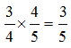

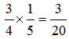

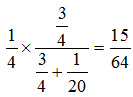

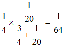

## 743. 土地法第34條之1實例研習(三)
*發布日期: 2018-11-23* 

## 內文
甲死亡後遺留一筆土地，由其子女乙、丙、丁辦竣公同共有繼承，應繼分乙為三分之二，丙為六分之一，丁為六分之一。乙、丙、丁三人訂立分管契約，丁以其分管土地出租於戊，戊於其上興建房屋一棟，試問：(一)乙未經丙、丁二人之同意將該筆土地出售於庚，則買賣契約是否有效？(二)乙、丙二人未經丁之同意將該筆土地出售於辛，則何人有優先購買權？(三)乙、丙二人未通知優先購買權人而將該筆土地出售於辛，並已辦竣所有權移轉登記，則優先購買權人如何主張其權利？

【解答】

• (一) 土地法第三十四條之一執行要點第6點第2款規定：「前項共有人數及應有部分之計算，於公同共有土地或建物者，指共有人數及其潛在應有部分合計均過半數。但潛在應有部分合計逾三分之二者，其共有人數不予計算。各共有人之潛在應有部分，依其成立公同關係之法律規定、習慣或法律行為定之；未有規定者，其比率視為不明，推定為均等。」準此，應繼分視為潛在應有部分，而準用土地法第34條之1第1項規定。另，適用土地法第34條之1之同意門檻有二種情形，第一種情形為人數超過一半，應有部分亦超過一半，第二種情形為應有部分超過三分之二，人數不予計算。據此，如果適用第一種情形，本題同意人數為三分之一，未超過二分之一；如果適用第二種情形，乙之應繼分剛好等於三分之二，未超過三分之二。故乙未經丙、丁二人同意將該筆土地出售於庚，則買賣契約無效。

• (二) 乙、丙二人依土地法第34條之1第1項，未經丁之同意將該筆土地出售於辛，則同意共有人乙、丙二人無優先購買權，不同意共有人丁依土地法第34條之1第4項有優先購買權，承租人戊依土地法第104條有優先購買權。丁之優先購買權僅具債權效力，戊之優先購買權則具物權效力。故戊之優先購買權優先於丁之優先購買權而行使。

• (三) 若乙、丙二人未通知戊，而將該筆土地出售於辛，則戊得主張移轉登記無效，而塗銷辛之所有權登記。若乙、丙二人未通知丁，而將該筆土地出售於辛，則移轉登記仍然有效，丁僅得向乙、丙二人請求損害賠償。
---
*注：本文圖片存放於 ./images/ 目錄下*

## 744. 土地法第104條實例研習
*發布日期: 2018-11-22* 

## 內文
甲將一筆土地的一半，先設定典權於乙，乙闢建為籃球場，接著甲再將同筆土地的另一半設定地上權於丙，丙興建房屋居住。不久，甲將該筆土地出售於丁，請問何人有優先購買權？所依據法條為何？何人優先行使？

【解答】

（一）典權人乙在該筆土地上未有房屋建築，故乙不得主張土地法第104條之優先購買權；但因係典權關係，故乙得主張民法第919條之優先購買權。

（二）地上權人丙在該筆土地上有房屋建築，故丙得主張土地法第104條之優先購買權。

（三）民法第919條之優先購買權有物權效力，土地法第104條之優先購買權亦有物權效力。二者競合時，登記在先之優先購買權優先於登記在後之優先購買權而行使。因此，乙基於民法第919條之優先購買權優先行使。
---
*注：本文圖片存放於 ./images/ 目錄下*

## 745. 市地重劃禁限之例外
*發布日期: 2018-11-22* 

## 內文
各位同學好

經紀人考試剛考完，這次的土法與土稅申論題，考得較複雜，尤其第一題考市地重劃實施辦法較細之規定，因此，今日專欄為各位同學講解今年經紀人考試土法第一題有關「市地重劃禁止與限制」之內容：

首先，重劃地區選定後，直轄市或縣(市)政府，得視實際需要報經上級主管機關核定後，分別或同時公告禁止或限制下列事項：1.土地移轉、分割或設定負擔。2.建築改良物之新建、增建、改建或重建及採取土石或變更地形。該禁止或限制之期間，不得超過一年六個月。其立法目的是為防止重劃地區選定後，土地所有權人復有移轉、分割土地或增建、改建建築物，而阻礙重劃工作之進行，影響重劃成果之分配。

然而，惟根據市地重劃實施辦法規定，下列事項非屬公告禁止或限制事項：

1. 土地繼承登記。

2. 建物及其基地登記。

3. 因抵繳遺產稅土地所有權移轉國有登記。

4. 因強制執行、土地徵收或法院判決確定，申請登記。

5. 共有土地因實施耕者有其田部分徵收放領，辦理持分交換移轉登記。

6. 申請剩餘財產差額分配登記。

7. 抵押權讓與登記。

8. 實施重劃本身所必要之作業。

其概念是因為上述這些登記不妨礙重劃分配與施工（第2、8款）、屬於法律事實依民法759於登記前即以取得權利（第1、4款）、有利於地籍正確性與登記（第3、5、6、7款）。
---
*注：本文圖片存放於 ./images/ 目錄下*

## 746. 繼承登記實例研習
*發布日期: 2018-11-19* 

## 內文
甲死亡後遺留一筆養殖用地，由其子女乙、丙二人共同繼承，乙之應繼分四分之三，丙之應繼分四分之一，乙為本國人，丙為日本人。試問： (一)逾一年未辦理繼承登記，政府應如何處理？ (二)乙可否單獨申請公同共有登記或分別共有登記？ (三)乙可否依土地法第34條之1採多數決辦理分別共有登記？ (四)乙可否依土地法第34條之1採多數決出售該土地全部？ (五)丙可否繼承取得而登記為該筆土地之所有權人？

【解答】

• (一) 政府應依土地法第73條之1規定處理。土地法第73條之1規定：「土地或建築改良物，自繼承開始之日起逾一年未辦理繼承登記者，經該管直轄市或縣市地政機關查明後，應即公告繼承人於三個月內聲請登記；逾期仍未聲請者，得由地政機關予以列冊管理。但有不可歸責於聲請人之事由，其期間應予扣除。

前項列冊管理期間為十五年，逾期仍未聲請登記者，由地政機關將該土地或建築改良物清冊移請國有財產局公開標售。繼承人占有或第三人占有無合法使用權者，於標售後喪失其占有之權利；土地或建築改良物租賃期間超過五年者，於標售後以五年為限。

依第二項規定標售土地或建築改良物前應公告三十日，繼承人、合法使用人或其他共有人就其使用範圍依序有優先購買權。但優先購買權人未於決標後十日內表示優先購買者，其優先購買權視為放棄。

標售所得之價款應於國庫設立專戶儲存，繼承人得依其法定應繼分領取。逾十年無繼承人申請提領該價款者，歸屬國庫。

第二項標售之土地或建築改良物無人應買或應買人所出最高價未達標售之最低價額者，由國有財產局定期再標售，於再行標售時，國有財產局應酌減拍賣最低價額，酌減數額不得逾百分之二十。經五次標售而未標出者，登記為國有並準用第二項後段喪失占有權及租賃期限之規定。自登記完畢之日起十年內，原權利人得檢附證明文件按其法定應繼分，向國有財產局申請就第四項專戶提撥發給價金；經審查無誤，公告九十日期滿無人異議時，按該土地或建築改良物第五次標售底價分算發給之。」

• (二) 土地登記規則第120條第1項規定：「繼承人為二人以上，部分繼承人因故不能會同其他繼承人共同申請繼承登記時，得由其中一人或數人為全體繼承人之利益，就被繼承人之土地，申請為公同共有之登記。其經繼承人全體同意者，得申請為分別共有之登記。」準此，乙得單獨申請公同共有登記，但不可單獨申請分別共有登記。

• (三) 繼承人辦理分別共有登記，屬於公同共有人終止公同共有之內部關係，故不可依土地法第34條之1採多數決處理。

• (四) 應繼分視為潛在應有部分，乙之應繼分四分之三，已超過三分之二，人數不予計算，因此乙得依土地法第34條之1採多數決出售該土地全部。又，民法第759條規定：「因繼承、強制執行、徵收、法院之判決或其他非因法律行為，於登記前已取得不動產物權者，應經登記，使得處分其物權。」準此，未辦竣繼承登記，不得處分其物權（即辦理所有權移轉登記），但仍得處分其債權（即簽訂買賣契約）。本題出售土地屬於處分債權，故買賣契約仍然有效。惟日後乙應先單獨申請公同共有繼承登記，再依土地法第34條之1辦理買賣所有權移轉登記。

• (五) 土地法第17條第1項及第2項規定：「左列土地不得移轉、設定負擔或租賃外國人：一、林地。二、漁地。三、狩獵地。四、鹽地。五、礦地。六、水源地。七、要塞軍備區域及領域邊境之土地。前項移轉，不包括因繼承而取得土地。但應於辦理繼承登記完畢之日起三年內出售與本國人，逾期未出售者，由直轄市、縣（市）地政機關移請國有財產局辦理公開標售，其標售程序準用第七十三條之一相關規定。」準此，本題養殖用地屬於土地法第17條之漁地，故不得移轉於外國人丙。但因繼承而取得不受限制，故丙得繼承取得而登記為該筆土地之所有權人；惟應於辦理繼承登記完畢之日起三年內出售於本國人。
---
*注：本文圖片存放於 ./images/ 目錄下*

## 747. 土地法第34條之1實例研習(二)
*發布日期: 2018-11-16* 

## 內文
甲、乙、丙、丁、戊五人合夥購買土地一筆，投資額分別為3,000萬元、2,000萬元、500萬元、300萬元及200萬元。該土地登記為五人公同共有。試問： (一)甲請求分割該共有土地，是否可行？ (二)甲、乙二人同意將該地全部出售於庚，是否可行？ (三)前款出售時，何人有優先購買權？如優先購買權人全體均主張時，應如何處理？

【解答】

• (一) 民法第668條規定：「各合夥人之出資及其他合夥財產，為合夥人全體之公同共有。」民法第829條規定：「公同關係存續中，各公同共有人，不得請求分割其公同共有物。」準此，甲不得請求分割該共有土地。

• (二) 土地法第34條之1第1項規定，於公同共有準用之。亦即，公同共有土地或建築改良物，其處分、變更及設定地上權、農役權、不動產役權或典權，應以共有人過半數及其潛在應有部分合計過半數之同意行之。但其潛在應有部分合計逾三分之二者，其人數不予計算。準此，甲、乙、丙、丁、戊之潛在應有部分（即 投資額）分別為[圖片1]。甲、乙二人之潛在應有部分六分之五，已超過三分之二，人數不予計算。故甲、乙二人同意將該地全部出售於庚為可行。

• (三) 土地法第三十四條之一執行要點第11點第10款規定：「土地或建物之全部或應有部分為公同共有，部分公同共有人依本法條規定出賣該共有物全部或應有部分時，他公同共有人得就該公同共有物主張優先購買權，如有數人主張時，其優先購買權之範圍應按各主張優先購買權人之潛在應有部分比例計算之。」準此，丙、丁、戊三人有優先購買權。三人均主張優先購買權時，丙之優先購買權範圍為[圖片2]，丁之優先購買權範圍為[圖片3]，戊之優先購買權範圍為[圖片4]。

丙：[圖片5]

丁：[圖片6]

戊：[圖片7]

## 文章圖片

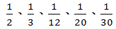

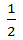

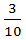

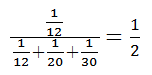

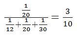

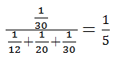

## 748. 土地徵收條例第11條之協議價購，免徵土地增值稅
*發布日期: 2018-11-15* 

## 內文
• (一) 法律依據：

1. 土地稅法第39條第3項規定，依法得徵收之私有土地，土地所有權人自願按公告土地現值之價格售與需地機關者，免徵其土地增值稅。

2. 平均地權條例第42條第3項規定，依法得徵收之私有土地，土地所有權人自願按徵收補償地價售與需地機關者，免徵其土地增值稅。

現行土地徵收採市價補償其地價，故應依據平均地權條例第42條第3項，而非依據土地稅法第39條第3項，土地徵收前之協議價購始免徵其土地增值稅。

• (二) 爭議論點：

依特別法優於普通法之法律適用原則，分下列二種情形說明：

1. 平均地權條例為特別法，土地稅法為普通法，應優先適用平均地權條例，則現行土地徵收前之協議價購免徵土地增值稅，應無疑義。

2. 平均地權條例為普通法，土地稅法為特別法，應優先適用土地稅法，則現行土地徵收前之協議價購免徵土地增值稅，似有疑義。
---
*注：本文圖片存放於 ./images/ 目錄下*

## 749. 市地重劃權利清理
*發布日期: 2018-11-14* 

## 內文
各位同學好

不動產經紀人考試即將於本週末上場，加油再加油！希望大家考運亨通，有看都有考！

由於考題趨勢越來越著重概念理解與案例應用，故今日專欄提供一案例題，除了是經紀人考試的重點外，其他考科同學也應予準備！

[案例題]

甲於某市地重劃預定區內有四塊土地如下：

1. A地於80年租給乙建屋

2. B地於70年租給丙耕作，並有去公所辦理租約登記

3. C地於85年設定抵押權給丁

4. D地於99年設定地上權給戊（存續期間70年、每年租金10萬）

試問該區於107年公告辦理市地重劃時，甲所有土地上之權利該如何清理？

• (一) 重劃後如能達原設定或租賃目的

重劃前土地已設定他項權利而於重劃後分配土地者，主管機關應於辦理土地權利變更登記前，邀集權利人協調，除協調結果該權利消滅者外，應列冊送由該管登記機關按原登記先後轉載於重劃後分配之土地。

• (二) 重劃後如未能達原設定或租賃目的

• A. 地

因重劃而不能達到原租賃之目的者，承租人乙得終止租約，並得向出租人甲請求相當一年租金之補償。

• B. 地

因實施市地重劃致不能達到原租賃之目的者，由直轄市或縣（市）政府逕為註銷其租約並通知當事人。依前項規定註銷租約者，承租人丙得依下列規定請求或領取補償：

1. 重劃後分配土地者，承租人丙得向出租人甲請求按重劃計畫書公告當期該土地之公告土地現值三分之一之補償。

2. 重劃後未受分配土地者，其應領之補償地價，由出租人甲領取三分之二，承租人丙領取三分之一。

• C. 地

地上權因市地重劃致不能達其設定目的者，該權利視為消滅。地上權人戊得向土地所有權人請求相當之補償。原則上，該補償係以該剩餘期間及租金作為請求依據。

• D. 地

土地建築改良物經設定抵押權，因市地重劃致不能達其設定目的者，各該權利視為消滅。並依下列方式處理：

1. 甲有另行分配土地：抵押權人丁得向土地所有權人甲請求以其所分配之土地，設定抵押權或典權。

2. 甲未另行分配土地：實施重劃未受土地分配者，丁原設定抵押權之權利價值，由重劃機關在不超過土地所有權人甲應得補償之數額內予以協調清理。
---
*注：本文圖片存放於 ./images/ 目錄下*

## 750. 不動產經紀人考前必讀
*發布日期: 2018-11-12* 

## 內文
「房屋租賃定型化契約應記載及不得記載事項」與「住宅租賃契約應約定及不得約定事項」之比較

內政部先後公告「房屋租賃定型化契約應記載及不得記載事項」（以下簡稱房屋租賃）與「住宅租賃契約應約定及不得約定事項」（以下簡稱住宅租賃），兩者內容大同小異，主要差異在適用上不同。茲比較如下：

• (一) 法律依據：

1. 房屋租賃：依據消費者保護法第17條。

2. 住宅租賃：依據租賃住宅市場發展及管理條例第5條。

• (二) 適用對象：

1. 房屋租賃：適用於定型化契約（所稱定型化契約，指以企業經營者提出之定型化契約條款作為契約內容之全部或一部而訂定之契約。所稱定型化契約條款，指企業經營者為與多數消費者訂立同類契約之用，所提出預先擬定之契約條款）。詳言之，適用於租賃契約具消費關係者。如建設公司就其興建之房屋出租於一般民眾。建設公司即是企業經營者，一般民眾即是消費者。企業經營者與消費者之間具有消費關係，適用消費者保護法相關規定。

2. 住宅租賃：適用於租賃契約未具消費關係者。如民眾就其所有之房屋出租於一般民眾。出租者與承租者之間未具有消費關係，不適用消費者保護法相關規定。

• (三) 審閱期間：

1. 房屋租賃：契約審閱期間至少三日。

2. 住宅租賃：無契約審閱期間。

• (四) 法律效力：

1. 房屋租賃：

1. 違反中央主管機關（即內政部）公告之定型化契約應記載及不得記載事項，其定型化契約條款無效。

2. 中央主管機關（即內政部）公告應記載之事項，雖未記載於定型化契約，仍構成契約之內容。

2. 住宅租賃：

1. 違反中央主管機關（即內政部）公告之應約定及不得約定事項，其約定無效。

2. 中央主管機關（即內政部）公告應約定事項未記載於契約者，仍構成契約之內容。

• (五) 不得記載或不得約定事項：

1. 房屋租賃定型化契約不得記載事項：

1. 不得約定拋棄審閱期間。

2. 不得約定廣告僅供參考。

3. 不得約定承租人不得申報租賃費用支出。

4. 不得約定承租人不得遷入戶籍。

5. 不得約定應由出租人負擔之稅賦，若較出租前增加時，其增加部分由承租人負擔。

6. 出租人故意不告知承租人房屋有瑕疵者，不得約定排除民法上瑕疵擔保責任。

7. 不得約定承租人須繳回契約書。

8. 不得約定違反法律上強制或禁止規定。

2. 住宅租賃契約不得約定事項：

1. 不得約定廣告僅供參考。

2. 不得約定承租人不得申報租賃費用支出。

3. 不得約定承租人不得遷入戶籍。

4. 不得約定應由出租人負擔之稅賦及費用，若較出租前增加時，其增加部分由承租人負擔。

5. 不得約定免除或限制民法上出租人故意不告知之瑕疵擔保責任。

6. 不得約定承租人須繳回契約書。

7. 不得約定本契約之通知，僅以電話方式為之。

8. 不得約定違反強制或禁止規定。
---
*注：本文圖片存放於 ./images/ 目錄下*

## 751. 土地所有權實例研習
*發布日期: 2018-11-09* 

## 內文
甲在其所有土地上興建房屋，並雇用乙開挖基地。乙於挖掘時，發現金礦及一塊金磚，試問金礦及金磚應歸屬何人所有？

【解答】

• (一) 金礦：金礦為天然形成。土地法第15條第1項規定：「附著於土地之礦，不因土地所有權之取得而成為私有。」準此，金礦歸屬於國有。

(二金磚：金磚為埋藏物。民法第808條規定：「發現埋藏物而占有者，取得其所有權。但埋藏物係在他人所有之動產或不動產中發見者，該動產或不動產之所有人與發見人，各取得埋藏物之半。」準此，金磚於甲的土地上被乙發現，故甲、乙二人各取得金磚之半。
---
*注：本文圖片存放於 ./images/ 目錄下*

## 752. 抵價地、抵費地
*發布日期: 2018-11-08* 

## 內文
各位同學好

今日專欄為各位整理與提醒區段徵收與市地重劃有關抵價地、抵費地之差異：

• 一、定義

• (一) 抵價地：區段徵收應給予之補償地價，得由土地所有權人申請以規劃整理後可供建築之土地，按土地所有權人應領補償地價比例折算抵付。

• (二) 抵費地：實施市地重劃時，重劃區內土地所有權人應行負擔之工程費用、重劃費用及貸款利息，由該地區土地所有權人按其土地受益比例共同負擔，並以其未建築土地折價抵付。

• 二、差異

• T. ABLE_PLACEHOLDER_1
---
*注：本文圖片存放於 ./images/ 目錄下*

## 753. 預告登記實例研習
*發布日期: 2018-11-08* 

## 內文
甲向乙購買一筆林地，於未完成所有權移轉登記前，辦理保全將來移轉請求權之預告登記，試問： (一)若甲為外國人，可否辦理預告登記？ (二)乙之土地被徵收，預告登記能否與之對抗？ (三)預告登記未塗銷前，乙將其土地出租於丙，是否可行？日後，對甲有何影響？

【解答】

• (一) 土地法第17條第1項規定：「左列土地不得移轉、設定負擔或租賃於外國人：一、林地。二、漁地。三、狩獵地。四、鹽地。五、礦地。六、水源地。七、要塞軍備區域及領域邊境之土地。」準此，外國人對林地無權利能力。若甲為外國人不得辦理林地移轉保全之預告登記。

• (二) 土地法第79條之1第3項規定：「預告登記，對於因徵收、法院判決或強制執行而為新登記，無排除之效力。」準此，甲之預告登記不能對抗土地徵收。

• (三) 預告登記屬於限制登記之一種。土地登記規則第136條第1項規定：「所稱限制登記，謂限制登記名義人處分其土地權利所為之登記。」準此，限制登記僅限制處分，未限制管理、使用、收益等。故乙將其土地出租（出租屬於管理行為）於丙，仍為法所許。

• (四) 日後，預告登記塗銷後，土地移轉於甲名下，依民法第425條規定，丙之租賃仍存在於甲之土地上。
---
*注：本文圖片存放於 ./images/ 目錄下*

## 754. 土地法第34條之1實例研習(一)
*發布日期: 2018-11-05* 

## 內文
甲、乙、丙三人共有土地一筆，應有部分各為三分之一。丁於丙之應有部分辦理預告登記，嗣甲、乙二人同意將該筆土地全部出售於戊，則丙是否有優先購買權？如果該筆土地全部出售於戊，丁之預告登記能否與之對抗？

【解答】

• (一) 預告登記是限制登記之一種。限制登記僅限制登記名義人「處分」，並未限制登記名義人「購買」。因此，甲、乙二人依土地法第34條之1第1項將該筆土地全部出售於戊，則丙得依同法條第4項主張優先購買權。

• (二) 土地法第三十四條之一執行要點第8點第6款第3目規定：「他共有人之應有部分經預告登記且涉及對價或補償者，應提出該共有人已受領及經原預告登記請求權人同意之證明文件及印鑑證明；為該共有人提存者，應提出已於提存書對待給付之標的及其他受取提存物所附之要件欄內記明提存物受取人領取提存物時，須檢附預告登記請求權人之同意書及印鑑證明領取之證明文件。登記機關應逕予塗銷該預告登記，於登記完畢後通知預告登記請求權人。」準此，該筆土地全部出售於戊，丙應得之對價依上開規定經受領或予以提存後，登記機關逕為塗銷丁之預告登記。換言之，丁之預告登記不能與之對抗。
---
*注：本文圖片存放於 ./images/ 目錄下*

## 755. 經紀業相關契約不得記載事項
*發布日期: 2018-11-01* 

## 內文
各位同學好

不動產經紀人考試即將到來，各位同學再加把勁！

今日專欄為考經紀人的同學們整理有關經紀業相關契約之不得記載事項此部分亦為考試範圍，包含「房屋租賃」、「成屋買賣」、「預售屋買賣」之定型化契約，以及最近很夯的租賃住宅市場發展及管理條例中所規範「住宅租賃契約」不得約定事項，要記得好好準備一下。

以下四個不得記載事項，看似很像卻略有不同，千萬不要搞混！有來上總複習的同學，「烤雞腳、考豬腳」的口訣應該不錯用吧~！

房屋租賃定型化契約不得記載事項

1. 不得約定拋棄審閱期間。

2. 不得約定廣告僅供參考。

3. 不得約定承租人須繳回契約書。

4. 不得約定承租人不得申報租賃費用支出。

5. 不得約定承租人不得遷入戶籍。

6. 不得約定應由出租人負擔之稅賦，若較出租前增加時，其增加部分由承租人負擔。

7. 出租人故意不告知承租人房屋有瑕疵者，不得約定排除民法上瑕疵擔保責任。

8. 不得約定違反法律上強制或禁止規定。

住宅租賃契約不得約定事項

1. 不得約定廣告僅供參考。

2. 不得約定承租人須繳回契約書。

3. 不得約定承租人不得申報租賃費用支出。

4. 不得約定承租人不得遷入戶籍。

5. 不得約定應由出租人負擔之稅賦及費用，若較出租前增加時，其增加部分由承租人負擔。

6. 不得約定免除或限制民法上出租人故意不告知之瑕疵擔保責任。

7. 不得約定本契約之通知，僅以電話方式為之。

8. 不得約定違反強制或禁止規定。

成屋買賣定型化契約不得記載事項

1. 不得約定拋棄審閱期間。

2. 不得約定廣告僅供參考。

3. 不得約定買方須繳回契約書。

4. 不得約定使用與實際所有權面積以外之「受益面積」、「銷售面積」、「使用面積」等類似名詞。

5. 不得約定請求超過民法第二百零五條所定百分之二十年利率之利息。

6. 不得約定買賣雙方於交屋後，賣方排除民法上瑕疵擔保責任。

7. 不得為其他違反強制或禁止規定之約定。

預售屋買賣定型化契約不得記載事項

1. 不得約定廣告僅供參考。

2. 不得約定買方須繳回原買賣契約書。

3. 不得使用未經明確定義之「使用面積」、「受益面積」、「銷售面積」等名詞。

4. 不得約定請求超過民法第二百零五條所訂百分之二十年利率之利息。

5. 出售標的不得包括未經依法領有建造執照之夾層設計或夾層空間面積。

6. 附屬建物除陽臺外，其餘項目不得計入買賣價格。

7. 不得為其他違反法律強制或禁止規定之約定。
---
*注：本文圖片存放於 ./images/ 目錄下*

## 756. 土地所有權模擬試題(二)
*發布日期: 2018-11-01* 

## 內文
甲有一幢透天房屋，甲將其土地出售於乙，但建物未出售，是否可行？果真如此，乙得否向甲主張拆屋還地？日後，甲將其建物出售於丙，乙是否有優先購買權？

【解答】

• (一) 民法第799條第5項規定：「專有部分與其所屬共有部分及其基地之權利，不得分離而為移轉或設定負擔。」準此，區分所有建物之建物與其基地不得分離出售，但透天房屋不受此項限制。故甲將其透天房屋，僅出售土地而未出售建物，為可行。

• (二) 民法第425條之1規定：「土地及其土地上之房屋同屬一人所有，而僅將土地或僅將房屋所有權讓與他人，或將土地及房屋同時或先後讓與相異之人時，土地受讓人或房屋受讓人與讓與人間或房屋受讓人與土地受讓人間，推定在房屋得使用期限內，有租賃關係。其期限不受第四百四十九條第一項規定之限制。前項情形，其租金數額當事人不能協議時，得請求法院定之。」準此，推定在房屋得使用期限內，甲與乙之間有租賃關係。故甲占有乙之土地並非無權占有，乙不得向甲主張民法第767條之拆屋還地。

• (三) 土地法第104條優先購買權之三項要件：

1. 地上有房屋存在。

2. 房屋與基地之所有權人不同。

3. 房屋與基地之間有地上權、典權或租賃權存在。

準此，甲將其建物出售於丙，乙得依土地法第104條主張優先購買。
---
*注：本文圖片存放於 ./images/ 目錄下*

## 757. 危老條例稅捐減免
*發布日期: 2018-10-25* 

## 內文
各位同學好

今日專欄針對「都市危險及老舊建築物加速重建條例」之稅捐減免優惠予以彙整要件如下：

首先，危老條例第8條規定：本條例施行後五年內申請之重建計畫，重建計畫範圍內之土地及建築物，經直轄市、縣（市）主管機關視地區發展趨勢及財政狀況同意者，得依下列規定減免稅捐(危§8I)：一、重建期間土地無法使用者，免徵地價稅。但未依建築期限完成重建且可歸責於土地所有權人之情形者，依法課徵之。二、重建後地價稅及房屋稅減半徵收二年。三、重建前合法建築物所有權人為自然人者，且持有重建後建築物，於前款房屋稅減半徵收二年期間內未移轉者，得延長其房屋稅減半徵收期間至喪失所有權止，但以十年為限。

依本條例適用租稅減免者，不得同時併用其他法律規定之同稅目租稅減免。但其他法律之規定較本條例更有利者，適用最有利之規定。(危§8II)

第一項規定年限屆期前半年，行政院得視情況延長之，並以一次為限。(危§8III)

茲整理要件如下：

• 一、五年內申請

• T. ABLE_PLACEHOLDER_1

• 二、地方政府同意：房屋稅及地價稅屬地方稅，為地方政府重要財源，目前地方財政拮据，為避免影響地方政府建設，新增或修正擴大租稅減免範圍允宜尊重地方政府意見

• 三、符合以下情形

[圖片1]

其中，應注意減半優惠延長之要件如下：

1. 僅有房屋稅得以延長。

2. 所有權人為重建前、後之自然人。

3. 重建後2年未移轉。

4. 延長期限至喪失所有權為止，最多延長10年，加計重建後2年之減半優惠，共計房屋稅最多可享受12年之減半徵收優惠。

5. 延長期間喪失所有權，包含有償移轉、無償移轉、繼承、信託皆屬之。（亦即租稅延長期間，因子女繼承而移轉，房屋稅減半優惠即結束）

## 文章圖片

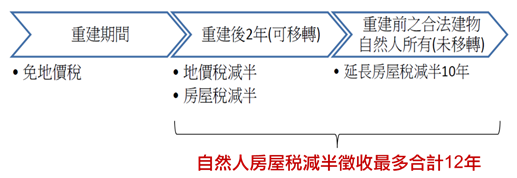

## 758. 土地所有權模擬試題(一)
*發布日期: 2018-10-25* 

## 內文
甲有一筆登記於已故父親名下而未辦繼承登記之土地，被乙占用達20年之久，甲訴請乙返還土地，乙得否主張消滅時效完成而拒絕返還？另，乙得否主張取得時效完成，請求登記為土地所有權人？又，甲將其土地出售於丙，並簽訂買賣契約，是否有效？

【解答】

• (一) 司法院釋字第107號解釋：「已登記不動產所有人之回復請求權，無民法第一百二十五條消滅時效規定之適用。」所稱已登記，指已辦竣總登記而言。本題土地雖未辦竣繼承登記，但已辦竣總登記。故甲訴請乙返還土地，乙不得主張消滅時效完成而拒絕返還。

• (二) 民法第769條規定：「以所有之意思，二十年間和平、公然、繼續占有他人未登記之不動產者，得請求登記為所有人。」又，民法第770條規定：「以所有之意思，十年間和平、公然、繼續占有他人未登記之不動產，而其占有之始為善意並無過失者，得請求登記為所有人。」所稱未登記，指未辦竣總登記而言。本題土地雖未辦竣繼承登記，但已辦竣總登記。故乙不得主張取得時效完成，請求登記為土地所有權人。另，民法第772條規定：「前五條之規定，於所有權以外財產權之取得，準用之。於已登記之不動產，亦同。」所稱已登記，指已辦竣總登記而言。本題雖未辦竣繼承登記，但已辦竣總登記。故乙得主張取得時效完成，請求登記為地上權人。須特別說明的是，時效取得地上權係基於法律規定（即民法第769條、第770條及第772條）而取得，故不受民法第759條應先辦理繼承登記始得處分其物權（包含設定地上權）之限制。

• (三) 民法第759條規定：「因繼承、強制執行、徵收、法院之判決或其他非因法律行為，於登記前已取得不動產物權者，應經登記，使得處分其物權。」準此，未辦竣繼承登記，不得處分其物權，但仍得處分其債權。是以，甲將其土地出售於丙，並簽訂買賣契約；此買賣契約仍為有效。

許老師的土地經濟學開課囉！

108年地政高考及不動產估價師考試一定要贏在起跑點上。所謂起跑點，就是「土地經濟學」這科。許文昌老師親授的土地經濟學，於107年11月3日（星期六）早上9：30開課。一年只上這一次，錯過可惜！＞＞最新課表
---
*注：本文圖片存放於 ./images/ 目錄下*

## 759. 夫妻間贈與之相關稅捐
*發布日期: 2018-10-17* 

## 內文
各位同學好

今日專欄為各位同學整理有關「夫妻間贈與」之相關稅負內容：

甲(妻)贈與名下「土地」及「建物」給乙(夫)，其涉及稅負如下：

1. 土地：土地增值稅（得申請不課徵）

1. 申報：訂立贈與契約，並在契約成立之日起30日內，填具契稅申報書及土地增值稅申報書，檢附公定格式契約書影本(正本核對無誤後退還)及有關證明文件，向稽徵機關申報契稅及土地增值稅。

2. 「得」申請不課徵：土地稅法第28條之2規定，配偶相互贈與之土地，得申請不課徵土地增值稅。但於再移轉第三人時，以該土地第一次贈與前之原規定地價或前次移轉現值為原地價，計算漲價總數額，課徵土地增值稅。

※觀念釐清：

1. 具選擇性配偶相互贈與土地非當然不課徵土地增值稅，而是可由當事人自行選擇。（但無論是否申請不課徵，均須申報移轉現值）

2. 不課徵係租稅遞延不課徵與免徵不同，屬「租稅遞延」之概念，亦即本次暫不課徵，留待下次移轉給第三人時再予計算土地漲價總數額。

3. 可能影響累進效果雖然此次配偶間移轉得暫不課徵，惟也要注意將租稅時機往後遞延，多年後再將土地移轉給第三人時反而可能會適用比原先選擇「課徵」時的稅率還高，因為公告土地現值一般多逐年調高。因此，本次選擇不課徵未必有利。

2. 建物：契稅契稅條例第2條規定，不動產之買賣、承典、交換、贈與、分割或因占有而取得所有權者，均應申報繳納契稅，故夫妻間贈與仍屬課稅範圍，而應依第7條規定該贈與契稅，由受贈人（即乙夫）立契申報。

3. 土地及建物：贈與稅遺產及贈與稅法第20條第1項第6款之規定，配偶相互贈與之財產不計入贈與總額，故無需課徵贈與稅。但贈與房地須辦理產權移轉登記，仍須依第41條第2項規定填具贈與稅申報書向贈與人戶籍所在地的國稅局辦理申報，由該國稅局核發不計入贈與總額證明書，方能依第42條規定辦理房地移轉登記。

4. 地價稅截至最近一期有無欠繳，如有需補繳。

5. 房屋稅截至最近一期有無欠繳，如有需補繳，另按月向甲妻隨課。

6. 其他費用：如印花稅、登記規費（登記費、權狀費）等。
---
*注：本文圖片存放於 ./images/ 目錄下*

## 760. 共有物之所有權模擬試題(二)
*發布日期: 2018-10-17* 

## 內文
甲、乙、丙三人共有一宗土地，每人持分相等，三人共同訂立分管協議。甲就其分管部分出租於丁，丁並興建房屋居住。試問：(一)若乙、丙二人同意將該宗土地出售於第三人，何人有優先購買權？何人優先行使？(二)若丁出售房屋於第三人，何人有優先購買權？

【解答】

• (一) 甲、丁二人均有優先購買權。甲依據土地法第34條之1第4項有優先購買權，丁依據土地法第104條有優先購買權。惟前者為債權效力，後者為物權效力。故丁之優先購買權行使優先於甲。

乙、丙二人與丁之間無租賃關係存在，且建物僅坐落於甲之分管部分，故僅甲有優先購買權。
---
*注：本文圖片存放於 ./images/ 目錄下*

## 761. 騎樓走廊地的地價稅與房屋稅減免規定
*發布日期: 2018-10-11* 

## 內文
各位同學好

今日專欄為各位同學整理一下今年地政士有考到的騎樓走廊地的地價稅與房屋稅減免規定：

首先，根據土地稅減免規則第10條規定：供公共通行之騎樓走廊地，無建築改良物者，應免徵地價稅，有建築改良物者，依左列規定減徵地價稅。一、地上有建築改良物一層者，減徵二分之一。二、地上有建築改良物二層者，減徵三分之一。三、地上有建築改良物三層者，減徵四分之一。四、地上有建築改良物四層以上者，減徵五分之一。

※地價稅減徵條件：

1. 基地上有建築改良物：騎樓走廊地認定應以基地上有建築改良物為前提，如屬空地則無所謂騎樓走廊地。

2. 非屬建造房屋應保留之法定空地：

1. 依建築法規定，建築基地，係指供建築物本身所占之地面及其所應留設之法定空地。依建築技術規則規定，建築基地退縮騎樓地未建築部分計入法定空地。而依土地稅減免規則規定，屬建造房屋應保留之法定空地部分，不予免徵地價稅。因此，符合土地稅減免規則第10條規定之騎樓走廊地，仍以非屬建造房屋應保留之法定空地，始足當之。

2. 判斷原則（可參最高行政法院103年度判字第512號判決）：

1. 位於商業區及住宅區以外之地區，依建築技術規則，應留設「退縮騎樓地」3.5公尺以上，不得建築，並計入法定空地→不予免徵地價稅

2. 位於商業區及住宅區，其可選擇設置騎樓或不設置騎樓

1. 選擇蓋騎樓者（即建造有騎樓式之建築），即屬「法定騎樓地」，所占面積不計入基地面積或建築面積→減徵地價稅（我們此處主要在談的情形）

2. 選擇不蓋騎樓者（即留設無遮簷人行道）可選擇計入法定空地或不計入法定空地：

1. 選擇計入法定空地：因該無遮簷人行道上方並無建築，且其面積又計入法定空地→不予免徵地價稅

2. 選擇不計入法定空地：該無遮簷人行道退縮部分，因其未計入法定空地，並未發生在建築規範上「建蔽率」之效益，且又無償提供公共通行→減徵地價稅

3. 供公眾通行使用：

1. 騎樓走廊地仍屬該土地所有權人之所有權範圍，惟依「建築技術規則」有留設寬度等相關規範，以及部份建築不計入基地面積及建築面積，又依據「道路交通管理處罰條例」，騎樓被視為道路與人行道之一部份，主要供作公眾或行人通行之用，故使用權公有。基此，得予減免地價稅。

2. 相對而言，倘若將騎樓走廊地圍用、封閉或作營業使用，已非供公共通行使用，則不能減徵地價稅。

（曾老師悄悄話：然而，騎樓所有權與使用權的爭議不斷，有學者提出現行對於騎樓的規範，中央法規並不明確，應予明定騎樓使用規則，甚至建議廢除騎樓制度）

4. 依有無建築改良物及層數而有不同程度之減徵：

1. 供公共通行的騎樓走廊用地，可向稅捐主管機關申請減免其地價稅，減免的面積依地上建築改良物之有無及層數不同而異。舉例如下：如果使用執照上之騎樓面積為12平方公尺，地價稅可申請減免的面積如下：

1. 供公共通行之騎樓走廊地，無建築改良物者：指平房屋宇前簷突出於騎樓走廊地，即外觀是一層樓的平房房屋，騎樓走廊地全免，即免徵12平方公尺。

[圖片1]

2. 地上有建築改良物一層者：指在騎樓走廊上有一層建物，亦即外觀是兩層樓房屋，騎樓走廊地減徵1/2，即6平方公尺。

[圖片2]

3. 地上有建築改良物二層者：外觀為三層樓房屋，騎樓走廊地減徵1/3，即4平方公尺。

4. 地上有建築改良物三層者：外觀為四層樓房屋，騎樓走廊地減徵1/4，即3平方公尺。

5. 地上有建築改良物四層者：外觀為五層樓房屋，騎樓走廊地減徵1/5，即2.4平方公尺。

6. 地上有建築改良物四層以上者：外觀為五層樓以上房屋，騎樓走廊地均減徵1/5，即2.4平方公尺。

2. 騎樓走廊地上建築改良物層數之認定，以建築改良物所有權狀之記載為準，其未記載於所有權狀之增建樓層部分，如能提出建物勘測成果表者，可合併計入層數。

5. 以持分土地面積計算：如屬社區大樓，因土地係屬分別共有，故地價稅的減徵面積除依上述方式計算外，尚需再乘以土地持分（應有部分）。

6. 提出申請：應於地價稅開徵40日前（即9月22日前）提出申請，逾期申請者，則自申請的次年期起減免。

此外，供公眾通行使用之騎樓，不計入房屋現值當中，故亦免徵房屋稅。

註：住家房屋現值，係指整戶住家房屋之現值，但不包括左列各項之現值：（一）供公眾通行之騎樓。（二）陽台、屋簷、雨遮依建築技術規則規定免計入建築面積之部分。（三）純屬防空避難設施之地下室，或地下室僅為利用原有空間設置機器房、抽水機、停放車輛等使用，合於本部66/02/26台財稅第31250號函規定免徵房屋稅者。（四）未設有門窗、牆壁供遮陽防雨使用之屋頂棚架，依本部70/07/14台財稅第35738號函規定免徵房屋稅者。（財政部74/07/22台財稅第19180號函）

## 文章圖片

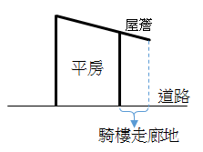

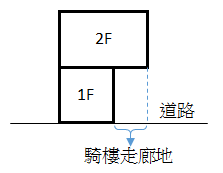

## 762. 共有物之所有權模擬試題(一)
*發布日期: 2018-10-11* 

## 內文
甲、乙、丙、丁、戊五人共有一宗土地，每人持分相等，甲未經其他共有人之同意，擅自在該宗土地的一角興建房屋居住達二十年之久，其佔用範圍適為該宗土地面積之五分之一，請問：(一)乙、丙、丁、戊之其中一人得否訴請甲拆屋還地？(二)甲得否就占有範圍主張時效取得地上權？(三)甲時效取得地上權後，乙、丙、丁三人同意將該宗土地出售於第三人，甲、戊是否有優先購買權？何人優先行使？

【解答】

• (一) 共有人對共有物之特定部分使用收益，仍需徵得他共有人全體之同意。否則，他共有人得行使民法第767條之返還請求權（即拆屋還地）。另，民法第821條規定：「各共有人對於第三人，得就共有物之全部為本於所有權之請求。但回復共有物之請求，僅得為共有人全體之利益為之。」準此，乙、丙、丁、戊之其中一人均得訴請甲拆屋還地，並返還於全體共有人。

• (二) 司法院釋字第451號解釋，共有人一人以行使地上權之意思占有其共有之土地者，得主張時效取得地上權。準此，甲得就其占有範圍主張時效取得地上權。

• (三) 甲、戊二人均有優先購買權。甲依據土地法第104條有優先購買權，戊依據土地法第34條之1第4項有優先購買權。惟前者為物權效力，後者為債權效力。故甲之優先購買權行使優先於戊。
---
*注：本文圖片存放於 ./images/ 目錄下*

## 763. 土地法第104條之優先購買權可否擴大解釋或類推適用？
*發布日期: 2018-10-04* 

## 內文
茲舉三例說明：

• (一) 基地所有權人甲將土地設定地上權於乙，乙再將該土地出租於丙，並由丙興建房屋。當甲出售基地時，何人有優先購買權？

1. 未擴大解釋：乙於該基地上無房屋產權，故乙無土地法第104條之優先購買權；另，丙雖於該基地上有房屋產權，但甲與丙之間無租賃權之關係存在，故丙無土地法第104條之優先購買權。

2. 採擴大解釋：乙為其占有該土地之使用人有房屋產權，故乙有土地法第104條之優先購買權；另，丙雖與甲無直接租賃權關係，惟經過「權利傳導」而與甲有間接租賃權關係，故丙有土地法第104條之優先購買權。因此，乙、丙二人均有優先購買權。依土地法第104條規定，其順序以登記之先後定之。是以，乙之優先購買權之行使優先於丙。此一結果，恐違反土地法第104條房屋與其基地所有權合一之立法意旨。

• (二) 基地所有權人甲將土地設定典權於乙，乙再將典物轉典或出租於丙，並由丙興建房屋。當甲出售基地時，何人有優先購買權？

1. 未擴大解釋：乙於該基地上無房屋產權，故乙無土地法第104條之優先購買權，但仍有民法第919條之優先購買權。另，丙雖於該基地上有房屋產權，但甲與丙之間無典權或租賃權之關係存在，故丙無土地法第104條及民法第919條之優先購買權。

2. 採擴大解釋：乙為其占有該土地之使用人有房屋產權，故乙有土地法第104條之優先購買權；另，丙雖與甲無直接典權或租賃權之關係，惟經過「權利傳導」而與甲有間接典權或租賃權關係，故丙有土地法第104條之優先購買權。因此，乙、丙二人均有優先購買權。依土地法第104條規定，其順序以登記之先後定之。是以，乙之優先購買權之行使優先於丙。此一結果，恐違反土地法第104條房屋與其基地所有權合一之立法意旨。

• (三) 基地所有權人甲將土地設定典權於乙，乙再將典物出租於丙，並由丙興建房屋。當丙出售房屋時，何人有優先購買權？

1. 未類推適用：乙於基地上無所有權，故乙無土地法第104條之優先購買權；另，甲雖於基地上有所有權，但甲與丙之間無租賃權關係存在，故甲無土地法第104條之優先購買權。

2. 採類推適用：乙雖非土地所有權人，但日後有取得所有權之可能，故類推適用土地法第104條規定，乙有優先購買權。此一結果，恐違反土地法第104條房屋與基地所有權合一之立法意旨。

綜上，如果無法使房屋與其基地所有權合一，土地法第104條之擴大解釋或類推適用無存在之必要。況優先購買權雖有其政策功能，然優先購買權具強而有力之效力，除非法律有明文規定，實不宜擴大解釋或類推適用，以免扭曲市場機制及干擾交易秩序。
---
*注：本文圖片存放於 ./images/ 目錄下*

## 764. 所有權視為消滅
*發布日期: 2018-10-04* 

## 內文
各位同學好

今日專欄來談談土地法第12條浮覆地。

首先，土地法第12條規定私有土地，因天然變遷成為湖澤或可通運之水道時，其所有權視為消滅。前項土地，回復原狀時，經原所有權人證明為其原有者，仍回復其所有權。(土§12)

1. 私有所有權暫時停止：並非真正絕對消滅，而係指於私有土地成為湖澤及水道的期間，暫時停止其權利義務之行使及負擔。屬於權利之凍結狀態。

2. 已消滅成為國有，但有回復之可能：視為消滅並非真正絕對消滅，係絕對消滅永無回復之可能，而此所謂視為消滅則日後仍有回復之可能。依土§10II，所有權被視為消滅時，即屬國有，成為國有土地，同時他項權利或租賃關係將無所附麗而隨之歸於消滅，且不待登記，即生效力。
---
*注：本文圖片存放於 ./images/ 目錄下*

## 765. 贈與稅
*發布日期: 2018-09-27* 

## 內文
各位同學好

今日專欄來談贈與稅。

請先看一則新聞：不動產贈與 比現金省稅【原文轉自：聯合新聞網_經濟日報】

其中的眉角，就在於依據遺產及贈與稅法規定，遺產價值之計算，以被繼承人死亡時之時價為準，所稱時價，土地以公告土地現值或評定標準價格為準；房屋以評定標準價格為準。因此，當同樣市場價值5000萬的現金與房地相比，房地係以公告土地現值與房屋評定標準價格計徵，其稅負相對較低，故要節稅的話以贈與房地方式較佳，但當然還要記得同時考慮土地增值稅、契稅、代書費等一些其他費用。

此外，考地政士的同學特別要注意「他項權利」又該如何計價課徵遺贈稅。此部分應會是近幾年有機會再出題之題型：

• 一、地上權

1. 定有期限及年租者地上權之設定有期限及年租者，其賸餘期間依下列標準估定其價額(遺贈細§31)：

1. 賸餘期間在五年以下者，以一年地租額為其價額。

2. 賸餘期間超過五年至十年以下者，以一年地租額之二倍為其價額。

3. 賸餘期間超過十年至三十年以下者，以一年地租額之三倍為其價額。

4. 賸餘期間超過三十年至五十年以下者，以一年地租額之五倍為其價額。

5. 賸餘期間超過五十年至一百年以下者，以一年地租額之七倍為其價額。

6. 賸餘期間超過一百年者，以一年地租額之十倍為其價額。

2. 未定有年限者地上權之設定，未定有年限者，均以一年地租額之七倍為其價額，但當地另有習慣者，得依其習慣決定其賸餘年限。

3. 未定有年租者地上權之設定，未定有年租者，其年租按申報地價年息百分之四估定之。地上權之設定一次付租、按年加租或以一定之利益代租金者，應按其設定之期間規定其平均年租後，依第一項規定估定其價額。

• 二、永佃權：永佃權價值之計算，均依一年應納佃租額之五倍為標準。(遺贈細§32)

• 三、典權：典權以典價為其價額。(遺贈細§33)
---
*注：本文圖片存放於 ./images/ 目錄下*

## 766. 違章建築地上權模擬試題
*發布日期: 2018-09-27* 

## 內文
甲占有乙之一宗土地內特定位置，興建房屋(此房屋為違章建築)居住達二十年之久，甲可否主張時效取得該宗土地全部之地上權？甲時效取得地上權並經登記完畢後，乙擬出售該宗土地全部於第三人，甲可否就該宗土地之特定占有位置主張優先購買權？

【解答】

• (一) 司法院釋字第291號解釋：申請時效取得地上權登記，其占有建物不以合法建物為限。換言之，違章建築亦得主張時效取得地上權。

• (二) 甲僅得就該宗土地之特定占有位置主張時效取得地上權：因主張時效完成，申請地上權登記時，應提出占有範圍位置圖。前項位置圖應先向該管登記機關申請土地複丈（登§108ⅡⅢ）。準此，甲占有乙一宗土地內特定位置，應就該宗土地之特定占有位置申請土地複丈，主張時效取得地上權，不得就該宗土地全部申請時效取得地上權。

• (三) 甲應就該宗土地全部主張優先購買權：優先購買權之行使應以同一條件為前提。今乙擬出售該宗土地全部於第三人，則甲應就該宗土地全部主張優先購買權，不得就該宗土地之特定占有位置主張優先購買權。
---
*注：本文圖片存放於 ./images/ 目錄下*

## 767. 不動產信託
*發布日期: 2018-09-20* 

## 內文
各位同學好

本週專欄為各位說明不動產信託之類型，供地政士、高普考、估價師同學瞭解。

以不動產為信託財產的信託，可分為以下三種：

1. 不動產管理信託：以獲得管理收益為目的，委託人將名下不動產信託給受託人(銀行或機構)，由其經營管理，並依信託契約將所獲得之租金或相關收益交付給受益人。

2. 不動產處分信託：以處分不動產為目的，委託人將名下不動產信託給受託人(銀行或機構)，由其依信託契約以適當價格處分該信託財產，並於信託關係結束時將該處分收益交付給受益人。

3. 不動產開發信託：以不動產開發為目的，如都市更新、危險及老舊建築物重建之合建案，所有權人將不動產信託給受託人(銀行或機構)，建商則將興建資金存入信託專戶，由受託人於興建期間進行專款專用，以專戶資金支付各項工程相關費用，使重建工程順利完成，並於建築完成後，償還銀行融資款項及依約定方式交付信託財產予受益人。
---
*注：本文圖片存放於 ./images/ 目錄下*

## 768. 優先取得所有權模擬試題
*發布日期: 2018-09-20* 

## 內文
當房屋出賣時，基地所有權人優先購買取得房屋所有權後，地上權、典權或租賃權是否消滅？

【解答】

• (一) 地上權因混同而消滅：地上權與其建築物或其他工作物，不得分離而為讓與或設定其他權利（民§838Ⅲ）。準此，當房屋出賣時，其所依附之地上權應併同出賣。故行使優先購買權後，基地所有權人亦為該基地之地上權人，此時地上權因混同而消滅。

• (二) 典權因混同而消滅：典物為土地，典權人在其上有建築物者，其典權與建築物，不得分離而為讓與或其他處分（民§917Ⅱ）。準此，當房屋出賣時，其所依附之典權應併同出賣。故行使優先購買權後，基地所有權人亦為該基地之典權人，此時典權因混同而消滅。

• (三) 租賃權因移轉於基地所有權人而消滅：租用基地建築房屋，承租人房屋所有權移轉時，其基地租賃契約，對於房屋受讓人，仍繼續存在（民§426－1）。準此，當房屋出賣時，並由基地所有權人行使優先購買權，則租賃權歸屬基地所有權人，租賃權因無存在之必要而消滅。
---
*注：本文圖片存放於 ./images/ 目錄下*

## 769. 測量錯誤之損害賠償
*發布日期: 2018-09-13* 

## 內文
各位同學好

今日專欄以實務案例談談因測量錯誤所致登記錯誤而衍生之損害賠償問題

★案件事實

1. 某甲98年1月以總價360萬元向乙購買坐落A地號土地（系爭土地），買賣契約根據土地所有權狀之登記面積為44平方公尺，於98年2月完成所有權移轉登記。

2. 惟地政事務所於100年11月以其發現系爭土地登記面積有誤，將系爭土地面積更正登記為22平方公尺，並於101年1月為通知。

3. 甲因登記面積更正後減少22平方公尺，受有多支付前手乙價金97萬多元之損害等情，爰依土地法第68條第1項、國家賠償法第2條第2項規定，求為命地政事務所給付上開金額之判決。

★案件事實經過

[圖片1]

★地政事務所抗辯

系爭土地面積登記錯誤，係因68年間辦理分割時圖籍坵塊面積測算謬誤造成，而依地籍測量實施規則規定辦理更正，使土地產權切合實際，並無違法或不當。又系爭土地面積減少之損害，於68年間辦理分割時即發生，且甲於98年2月間買受點交系爭土地時，即知悉系爭土地登記面積與實際面積不符，惟遲至101年5月間始提出賠償請求，顯已罹於國家賠償法第8條第1項規定自損害發生時起算5年或自知有損害時起算2年之時效期間而消滅。

★台灣高等法院判決內容（重點，請筆記）

• 一、甲因系爭土地面積登記錯誤而受有損害：

• (一) 按土地法第68條第1項規定：「因登記錯誤、遺漏或虛偽致受損害者，由該地政機關負損害賠償責任，但該地政機關證明其原因應歸責於受害人時，不在此限」，係就職司土地登記事務之公務員因故意或過失不法侵害人民權利，而該公務員所屬地政機關負損害賠償責任之規定（參照國家賠償法第2條第2項、第9條第1項），核係國家賠償法之特別規定（最高法院98年度第6次民事庭會議決議參照）。

• (二) 查系爭A地號土地於68年間分割時，因圖籍坵塊面積測算謬誤，造成圖簿面積不符，則甲於98年1月依登記面積44平方公尺購得系爭土地，並於98年2月完成所有權移轉登記，然所購得之系爭土地實際面積僅為22平方公尺，乃因地政事務所就圖籍面積計算錯誤而致登記面積錯誤，顯見系爭土地之面積短少，係因地政事務所之過失所致無誤。而按土地登記有絕對效力，且不動產之登記具公信力，而一般不動產買賣均以土地登記簿所載面積作為買賣之範圍及計價之依據，本件甲信任地政事務所掌管之土地登記簿所載面積而計價購買，致甲於購買系爭A地號土地時，本可以較低價格購入而不致有溢付價金之情，卻因地政事務所之過失而以較高價格購入系爭A地號土地，致受有溢付價金之損害，該損害與地政事務所所屬地政人員面積計算錯誤間有相當因果關係。再上開溢付之價金既已實際繳付，甲之財產已經減少，自係受有實際之損害，是確因地政事務所該登記錯誤致甲受有損害。

• 二、地政事務所應就甲之損害負賠償責任：

• (一) 「按土地法第68條立法意旨，在保護土地權利人，故因土地分割測量時，面積計算錯誤而生之登記錯誤，亦應在該法條所稱登記錯誤之列。系爭土地於地政事務所辦理分割測量時，誤登記其面積....致增加給付之損害，自屬有據」。

• (二) 按土地法第68條第1項之規定，其構成要件僅須因(1)行政機關所屬之公務員有故意或過失之行為致有登載錯誤；(2)受有損害之人非有可歸責於己之事由；(3)有實際損害之發生；(4)損害之發生原因與行政機關所屬公務員登載錯誤間有因果關係，即足認定有土地法第68條第1項之要件該當，並未限制受有損害之人需向其前手即原出賣人(即乙)請求返還溢付價金而未果後，始得向該錯誤原登記之行政機關請求賠償。查本件因地政事務所於辦理分割登記時，將系爭A地號土地之面積計算錯誤，致登記面積較實際面積為大，甲已依原錯誤登記面積計付價款，致使甲已受有溢付價金之實際損害。…甲並非地政專業人士，依法亦未規定買賣土地時須先鑑界及測量土地實際面積大小，難期甲於購地前應先調閱地籍圖並自行比對地籍圖坵塊之形狀及估算圖籍之面積是否與實際受點交土地之形狀及面積相符。

• 三、甲之損害賠償請求權，並未罹於時效：

• (一) 按土地法第68條係國家賠償法之特別規定，惟土地法就該賠償請求權未規定其消滅時效期間，應依國家賠償法第8條第1項：「賠償請求權，自請求權人知有損害時起，因2年間不行使而消滅；自損害發生時起，逾5年者亦同」之規定，據以判斷損害賠償請求權是否已罹於時效而消滅（最高法院98年度第6次民事庭會議決議參照）。…次按「國家賠償法第8條第1項規定，賠償請求權，自請求權人知有損害時起，因2年間不行使而消滅。所稱知有損害，須知有損害事實及國家賠償責任之原因事實，國家賠償法施行細則第3條之1定有明文。而所謂知有國家賠償責任之原因事實，指知悉所受損害，係由於公務員於執行職務行使公權力時，因故意或過失不法行為，或怠於執行職務，或由於公有公共設施因設置或管理有欠缺所致而言。於人民因違法之行政處分而受損害之情形，賠償請求權之消滅時效，應以請求權人實際知悉損害及其損害係由於違法之行政處分所致時起算。」最高法院96年度台上字第1926號判決意旨採相同見解。

• (二) 查系爭A地號土地固於68年間分割時即因圖籍坵塊面積測算謬誤，造成圖簿面積不符之情形，惟斯時甲尚未取得系爭土地之所有權，無從就系爭土地為任何處分或使用收益之行為，自難認甲於斯時即受有損害。本件甲所受之損害，應為其於98年1月因誤信錯誤之登記面積購買系爭土地，並於98年2月完成所有權移轉登記而溢付土地價金，則甲損害發生之時，當係其為系爭土地買賣之時。最高法院100年度台上字第293號判決意旨同此見解。準此，甲於101年6月提起本件訴訟，尚未罹於前揭規定自甲所受損害發生時起之5年時效期間，洵屬明確。

曾老師提醒重點

1. 測量錯誤導致受有損害，除可容許誤差範圍內，現在通說認為是要賠償的。

2. 登記錯誤與損害發生時點未必相同（本案錯誤發生於68年測量時，損害則發生於98年交易時）

3. 損害發生於國家賠償法施行後，即依國賠法規定計算時效。（施行前則依民法，請參上課講義）

4. 土地法並未限制受有損害人需向原出賣人請求返還溢付價金而未果後，始得向地政事務所請求賠償。

資源來源：臺灣高等法院民事判決102年度上國易字第8號

## 文章圖片

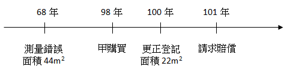

## 770. 繼承登記模擬試題
*發布日期: 2018-09-13* 

## 內文
甲占有乙未辦繼承登記之土地達二十年之久，甲得否主張時效取得土地所有權或地上權？

【解答】

• (一) 甲不得主張時效取得土地所有權：依民法第769條及第770條規定，時效取得所有權必須占有未登記土地。所稱未登記土地，係指未辦總登記之土地，而非指未辦繼承登記之土地。

• (二) 甲得主張時效取得地上權：依民法第772條規定，時效取得地上權不以未登記土地為限；亦即，已辦總登記之土地亦得主張時效取得地上權。又，時效取得地上權係基於法律規定（即民法第769條、第770條及第772條）而取得，故不受民法第759條規定應先辦理繼承登記始得處分其物權之限制。

許老師的「土地稅」開課囉！

我國土地稅規定交錯複雜，自成系統。許老師上課內容加入計算實例及節稅策略，讓學生靈活運用土地稅，精彩可期。本課程於9月16日(星期日)早上9:30開課，歡迎試聽。
---
*注：本文圖片存放於 ./images/ 目錄下*

## 771. 定型化契約不得記載事項
*發布日期: 2018-09-06* 

## 內文
各位同學好

經紀人考試再2個月左右就要到來，今日專欄為各位要考經紀人的同學，整理一下有關以下四個容易搞混且需要準備的「定型化契約不得記載事項」，總複習會教各位口訣~

• 一、房屋租賃定型化契約不得記載事項

1. 不得約定拋棄審閱期間。

2. 不得約定廣告僅供參考。

3. 不得約定承租人須繳回契約書。

4. 不得約定承租人不得申報租賃費用支出。

5. 不得約定承租人不得遷入戶籍。

6. 不得約定應由出租人負擔之稅賦，若較出租前增加時，其增加部分由承租人負擔。

7. 出租人故意不告知承租人房屋有瑕疵者，不得約定排除民法上瑕疵擔保責任。

8. 不得約定違反法律上強制或禁止規定。

• 二、成屋屋買賣定型化契約不得記載事項

1. 不得約定拋棄審閱期間。

2. 不得約定廣告僅供參考。

3. 不得約定買方須繳回契約書。

4. 不得約定買賣雙方於交屋後，賣方排除民法上瑕疵擔保責任。

5. 不得約定使用與實際所有權面積以外之「受益面積」、「銷售面積」、「使用面積」等類似名詞。

6. 不得約定請求超過民法第二百零五條所定百分之二十年利率之利息。

7. 不得為其他違反強制或禁止規定之約定。

• 三、預售屋買賣定型化契約不得記載事項

1. 不得約定廣告僅供參考。

2. 不得約定買方須繳回原買賣契約書。

3. 出售標的不得包括未經依法領有建造執照之夾層設計或夾層空間面積。

4. 不得使用未經明確定義之「使用面積」、「受益面積」、「銷售面積」等名詞。

5. 不得約定請求超過民法第二百零五條所訂百分之二十年利率之利息。

6. 附屬建物除陽臺外，其餘項目不得計入買賣價格。

7. 不得為其他違反法律強制或禁止規定之約定。

• 四、住宅租賃契約不得約定事項(配合租賃住宅市場發展及管理條例)

1. 不得約定廣告僅供參考。

2. 不得約定承租人不得申報租賃費用支出。

3. 不得約定承租人不得遷入戶籍。

4. 不得約定應由出租人負擔之稅賦及費用，若較出租前增加時，其增加部分由承租人負擔。

5. 不得約定免除或限制民法上出租人故意不告知之瑕疵擔保責任。

6. 不得約定承租人須繳回契約書。

7. 不得約定本契約之通知，僅以電話方式為之。

8. 不得約定違反強制或禁止規定。
---
*注：本文圖片存放於 ./images/ 目錄下*

## 772. 土地登記漏誤之救濟
*發布日期: 2018-09-06* 

## 內文
土地登記漏誤之救濟方法有三，一為更正登記，二為塗銷登記，三為登記損害賠償。

• (一) 更正登記：登記人員或利害關係人，於登記完畢後，發現登記錯誤或遺漏時，以書面聲請該管上級機關查明核准後，辦理更正登記。但登記錯誤或遺漏，純屬登記人員記載時之疏忽，並有原始登記原因證明文件可稽者，由登記機關逕行更正之（土§69）。惟更正登記不得變更原登記之法律關係，亦即更正登記不得妨害原登記之同一性。

• (二) 塗銷登記：依土地登記規則登記之土地權利，有登記證明文件經該主管機關認定係屬偽造或純屬登記機關之疏失而錯誤登記之情形，於第三人取得該土地權利之新登記前，登記機關得於報經直轄市或縣 (市) 地政機關查明核准後塗銷之（登§144）。值得一提的是，更正登記所稱登記錯誤與塗銷登記所稱登記錯誤，兩者意涵不同。前者指准予登記之行政處分並未違誤，僅登記機關辦理登記時未依登記原因證明文件所載之內容予以登記，而造成登記事項與登記原因證明文件所載之內容不符（登§13）；後者指准予登記之行政處分純係登記機關疏失而為之違法行政處分。

• (三) 登記損害賠償：無法藉由上述更正登記或塗銷登記，以消除土地登記漏誤，最後只能由地政機關負起損害賠償一途。因此，土地法第68條第1項規定：「因登記錯誤遺漏或虛偽致受損害者，由該地政機關負損害賠償責任。但該地政機關證明其原因應歸責於受害人時，不在此限。」
---
*注：本文圖片存放於 ./images/ 目錄下*

## 773. 危老申請程序及期限
*發布日期: 2018-08-30* 

## 內文
各位同學好

沒想到危老條例再次於估價師考科出現，還好老師都有上，希望同學們都可以獲得好成績！今日另外提醒危老條例的程序，請接下來要考地方特考的同學要注意一下

• (一) 申請程序

依本條例規定申請重建時，新建建築物之起造人應擬具重建計畫，取得重建計畫範圍內全體土地及合法建築物所有權人之同意，向直轄市、縣（市）主管機關申請核准後，依建築法令規定申請建築執照。(危§5I)參考後面的流程圖。

• (二) 申請期限

重建計畫之申請，施行期限至中華民國一百十六年五月三十一日止。(危§5II)（2027.5.31）（本條例施行10年內）。另注意有「容積獎勵」與「賦稅減免」的申請時程限制（參下表），申請人必須在相關期限內提出重建計畫，向都市發展局申請報核，以維權益。

• T. ABLE_PLACEHOLDER_1

[圖片1]

資料來源：參考臺北市危險及老舊建築物加速重建問答集，107.5

## 文章圖片

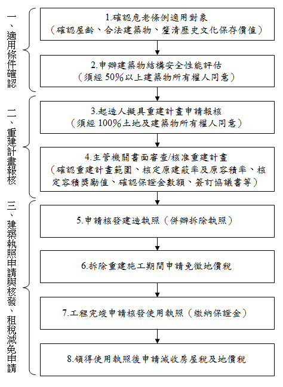

## 774. 更正登記與土地登記損害賠償之原因比較
*發布日期: 2018-08-30* 

## 內文
依土地登記規則第13條規定：「土地法第六十八條第一項及第六十九條所稱登記錯誤，係指登記事項與登記原因證明文件所載之內容不符者；所稱遺漏，係指應登記事項而漏未登記者。」準此，更正登記之原因與土地登記損害賠償之原因的意涵看似相同，其實不同。茲分析如下：

• (一) 更正登記之原因：

1. 登記錯誤：指登記事項與登記原因證明文件所載之內容不符。換言之，僅於登記事項與登記原因證明文件所載之內容不符者為限，始得辦理更正登記。

2. 登記遺漏：指應登記事項漏未登記。

此外，更正登記不得妨害原登記之同一性。因此，登記虛偽不得辦理更正登記。

• (二) 土地登記損害賠償之原因：

1. 登記錯誤：指登記事項與登記原因證明文件所載之內容不符。此乃狹義解釋，僅能以例示視之。換言之，不以登記事項與登記原因證明文件所載之內容不符者為限，始得主張土地登記損害賠償。

2. 登記遺漏：指應登記事項漏未登記。

3. 登記虛偽：指違反原登記同一性之登記錯誤。亦即登記名義人與真正權利人不符而言。由於土地法第68條之土地登記損害賠償包括登記錯誤、登記遺漏及登記虛偽三種情形，但土地法第69條之更正登記僅包括登記錯誤及登記遺漏二種情形，不包括登記虛偽。準此，上開登記虛偽之定義，使其僅能適用於土地法第68條，而不能適用於土地法第69條。

• (三) 兩者比較：

1. 登記原因種類不同：更正登記之原因種類為登記錯誤與登記遺漏二種。土地登記損害賠償之原因種類為登記錯誤、登記遺漏與登記虛偽三種。

2. 登記錯誤範圍不同：更正登記之登記錯誤，以登記事項與登記原因證明文件所載之內容不符者為限。土地登記損害賠償之登記錯誤，不以登記事項與登記原因證明文件所載之內容不符者為限。前者範圍較狹，後者範圍較廣。
---
*注：本文圖片存放於 ./images/ 目錄下*

## 775. 租賃住宅服務業
*發布日期: 2018-08-23* 

## 內文
各位同學好

今日專欄主要為各位說明「租賃住宅市場發展及管理條例」（107.6.27施行）中有關「租賃住宅服務業之相關規定」與經紀人證照考試科目中「不動產經紀相關法規」有關，記得準備！

• (一) 租賃住宅服務業

1. 意義指租賃住宅代管業及租賃住宅包租業。

1. 租賃住宅代管業（代管業）：指受出租人之委託，經營租賃住宅管理業務（代管業務）之公司。*即 房東委託業者管理。

[圖片1]

2. 租賃住宅包租業（包租業）：指承租租賃住宅並轉租，及經營該租賃住宅管理業務（以下簡稱包租業務）之公司。*即 房東出租給業者（業者擔任二房東）

[圖片2]

管理業務內容包含：屋況與設備點交、收租及押金管理、日常修繕維護、糾紛協調處理

2. 積極資格（申請程序）

[圖片3]

3. 負責人消極資格

1. 破產宣告未復權

2. 票據拒絕往來未期滿

3. 開始清算未復權

4. 無行為能力、限制行為能力，或受監護或輔助宣告未撤銷

5. 曾犯詐欺、背信、侵占、搶奪、強盜、恐嚇及擄人勒贖罪等經受有期徒刑一年以上刑之宣告確定，尚未執行、執行未畢、執行完畢或赦免後未滿三年

6. 曾經營租賃住宅服務業，經撤銷或廢止許可，未滿一年。

4. 業務與責任

1. 代管業

1. 營業處所揭示合法經營文件

2. 簽訂委託管理契約書始得執業

3. 重要文件專任人員簽章（委管契約、點交、收據、退租證明）

4. 損害賠償責任

5. 營業保證金代償

6. 報送受託管理租賃住宅資訊

2. 包租業

1. 營業處所揭示合法經營文件

2. 簽訂住宅租賃契約始得刊登廣告及執業

3. 廣告內容真實，註明業者名稱

4. 提供標的現況確認書，出租人同意轉租文件

5. 重要文件專任人員簽章(租賃契約、現況確認書、點交、收據、退租證明)

6. 出租人提前終止租約，協調返還住宅並協助次承租人租屋事宜

7. 損害賠償責任，營業保證金代償

8. 報送承租與轉租租賃住宅資訊

• (二) 租賃住宅管理人員

1. 意義指租賃住宅服務業依本條例規定所置從事代管業務或包租業務之人員。

2. 積極資格

[圖片4]

3. 消極資格

1. 無行為能力、限制行為能力，或受監護或輔助宣告未撤銷。

2. 曾犯詐欺、背信、侵占、搶奪、強盜、恐嚇及擄人勒贖罪等經受有期徒刑一年以上刑之宣告確定，尚未執行、執行未畢、執行完畢或赦免後未滿三年。

## 文章圖片

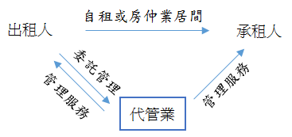

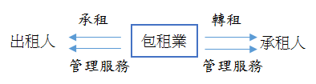

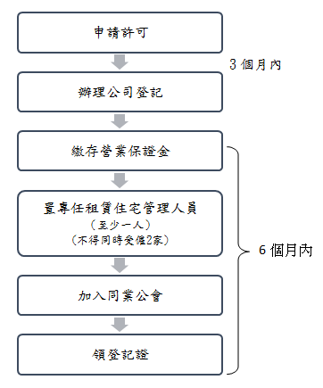

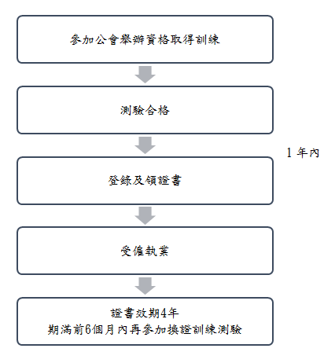

## 776. 更正登記之同一性
*發布日期: 2018-08-23* 

## 內文
更正登記不得妨害原登記之同一性。所稱同一性，指同一權利主體、同一權利種類及同一權利標的而言。如同一人之姓名、住址、出生年月日等之漏誤，得以更正登記為之。如同一權利種類之地租、存續期間、權利範圍等之漏誤，得以更正登記為之。如同一標的之面積、地號、使用地類別等之漏誤，得以更正登記為之。

申請更正登記，如更正登記後之權利主體、種類、範圍或標的與原登記原因證明文件所載不符者，有違登記之同一性，應不予受理(更正登記法令補充要點第6點)。

許文昌老師主編「土地法規」小法典(第8版)千呼萬喚上市了！

土地法規小法典(第8版)於今年8月20日新鮮問世。本次改版，除更新法規及添加新試題外，另增加「房地合一課徵所得稅申報作業要點」、司法院釋字第763號及第765號。該書由元照出版，可至元照網路書店購買。
---
*注：本文圖片存放於 ./images/ 目錄下*

## 777. 十五種非都市土地容許種電
*發布日期: 2018-08-16* 

## 內文
配合2025年非核家園目標，政府積極發展太陽能光電。現行已容許設置「再生能源相關設施」之非都市土地計有甲種建築用地、乙種建築用地、丙種建築用地、丁種建築用地、農牧用地、林業用地、養殖用地、鹽業用地、礦業用地、窯業用地、交通用地、水利用地、遊憩用地、國土保安用地等十四類編定土地。

內政部最近召開部務會議，通過「非都市土地使用管制規則」修正草案，擬開放已遷葬完畢且無需營葬之公墓用地設置太陽能光電，因此預計再將「殯葬用地」開放容許設置再生能源相關設施。
---
*注：本文圖片存放於 ./images/ 目錄下*

## 778. 房屋稅修法爭議
*發布日期: 2018-08-16* 

## 內文
今日專欄談有關於前陣子新聞文化大學大群館而衍生出的房屋稅修法爭議

請先參考下列新聞：大群館爭議 房屋稅修法停看聽【原文轉自：聯合新聞網_經濟日報】大群館免繳房屋稅 財部將研議防堵措施【原文轉自：奇摩新聞_台灣新生報】

爭議一：「拆戶」免徵房屋稅；10萬元門檻過低

1. 規定「房屋稅條例」第15條第1項第9款規定：住家房屋現值在新台幣10萬元以下免徵房屋稅。換句話說，符合「住家」及「房屋現值在10萬元以下」兩要件，就可免徵房屋稅。

2. 爭議

1. 可透過門牌切割(拆戶)方式降低每戶面積及其房屋評定現值，使其低於10萬元門檻，進而依法免徵房屋稅。（目前採單一門牌房屋稅計算方式，即一門牌一稅籍）。

2. 房屋現值10萬元以下免稅門檻已多年未調，有人主張應隨物價指數調整才算合理（但實際上房屋稅條例第15條第1項第9款但書有規定：「但房屋標準價格如依第十一條第二項規定重行評定時，按該重行評定時之標準價格增減程度調整之。」亦即每三年評定房屋現值時，免稅門檻亦同步檢討，例如台北市今年調為10.8萬元，惟確實調整幅度不大）。

3. 房屋現值和市價有落差，都會區10萬元門檻或需可以檢討。

3. 評論房屋稅設定免稅門檻是基於量能課稅，當房屋殘值、評定現值已低於一定門檻就不課稅，如果要檢討，應避免傷及無辜。

爭議二：非供自住，卻仍享免稅

1. 規定住家房屋現值在新台幣10萬元以下免徵房屋稅。

2. 爭議出租別人居住使用，符合現行房屋稅住家用之定義，而免稅要件中僅規定屬於住家用即可，似乎形成非自住卻享免稅的不合理情形。

3. 評論房屋稅的稅率分為住家用和非住家用兩大類，住家用類下又分出自住用和非自住用，讓自住享有較優惠的稅率1.2％，非自住則是1.5％~3.6％，自住和非自住有不同定義，應避免調整免稅要件後，卻影響原本稅制整體的立法精神。
---
*注：本文圖片存放於 ./images/ 目錄下*

## 779. 夫妻間贈與得申請不課徵土地增值稅
*發布日期: 2018-08-09* 

## 內文
各位同學好

今日專欄為各位同學提醒一下有關「配偶相互贈與得申請不課徵土地增值稅」之幾個觀念釐清。

• (一) 法條規定

土地稅法第28條之2：「配偶相互贈與之土地，得申請不課徵土地增值稅。但於再移轉第三人時，以該土地第一次贈與前之原規定地價或前次移轉現值為原地價，計算漲價總數額，課徵土地增值稅。」

• (二) 重要觀念釐清

1. 具選擇性

配偶相互贈與土地非當然不課徵土地增值稅，而是可由當事人自行選擇。

2. 不課徵係租稅遞延

不課徵與免徵不同，屬「租稅遞延」之概念，亦即本次暫不課徵，留待下次移轉給第三人時再予計算土地漲價總數額。

3. 可能影響累進效果

雖然此次配偶間移轉得暫不課徵，惟也要注意將租稅時機往後遞延，多年後再將土地移轉給第三人時反而可能會適用比原先選擇「課徵」時的稅率還高，因為公告土地現值一般多逐年調高。因此，本次選擇不課徵未必有利。

參考來源：臺南市政府財政稅務局，2018.7.31，夫妻間贈與土地得申請不課稅土地增值稅
---
*注：本文圖片存放於 ./images/ 目錄下*

## 780. 新古典經濟學與新制度經濟學
*發布日期: 2018-08-09* 

## 內文
新古典經濟學是假設人乃在資訊充分與完全理性下作決策，故吾人皆為經濟人(economic man)，皆在資訊充分與完全理性下追求最大效用或最大利潤。新古典經濟學以馬歇爾(Marshall)供需理論為代表。

新制度經濟學是假設人乃在資訊不完全與有限理性下作決策。所謂資訊不完全，指吾人手上並不一定擁有完整無誤的資訊，且獲得資訊必須付出時間與精力；因此，人在作決策時，所蒐集的資訊是有限的。所謂有限理性，指吾人腦中並不一定擁有完整無缺的知識，且獲得知識必須經過學習過程；因此，人在作決策時，所具備的知識是有限的。新制度經濟學以寇斯(Coase)交易成本理論為代表。

總之，新古典經濟學是在一個理想狀態下的最佳均衡。新制度經濟學是在一個現實狀態下的次佳均衡。兩者的均衡點有「間隙」(gap)存在。因此，如何運用政府力量或市場力量，以縮小間隙，是吾人努力的目標。
---
*注：本文圖片存放於 ./images/ 目錄下*

## 781. 全國國土計畫之重點研習(八)-土地利用與土地政策之模擬試題
*發布日期: 2018-08-02* 

## 內文
◎未登記工廠林立，全國國土計畫對此之土地使用指導原則為何？

【答】

• (一) 掌握未登記工廠資訊，擬定直轄市、縣（市）未登記工廠管理（輔導及清理）計畫：直轄市、縣（市）政府應辦理未登記工廠資訊調查作業，建立未登記工廠數量、區位、面積、產業種類等，並擬定直轄市、縣（市）未登記工廠管理（輔導及清理）計畫，進行未登記工廠分級分類輔導。對於零星、新增之未登記工廠，優先依法令其變更使用、停止使用或拆除恢復原狀等，以保護農業生產環境完整性及遏止未登記工廠新增情形。

• (二) 輔導轉型或遷廠原則：針對非屬低污染產業或無法輔導廠地合法使用者，產業主管機關以按下列措施優先輔導為原則：

1. 輔導轉型：轉導轉型為符合所屬國土功能分區分類下容許使用範疇之產業使用。

2. 輔導遷廠：無法輔導其轉型經營者，配合產業主管機關各項土地優惠措施及廠地供給資訊，遷移至合法產業園區（或產業用地）及其他可供設廠土地。

• (三) 輔導土地合理及合法使用：

1. 屬聚集達一定規模以上或在地產業鏈結程度高之既存未登記工廠聚落，經產業主管機關認定符合中央或地方產業發展需求、具有優先輔導合法必要者，得輔導土地合理及合法使用。經產業主管機關認定非屬低污染產業者，優先朝輔導遷廠或轉型方式處理。

2. 產業主管機關應先查核未登記工廠聚落是否符合產業政策、鄰近產業園區（或產業用地）供給及產業園區規劃配合情形，以及是否符合所訂未登記工廠分級分類輔導措施。

3. 以不影響整體農業生產環境為前提，且避免位於符合農業發展地區第一類或國土保育地區第一類劃設條件之區位。如屬上述區位者，優先朝輔導轉型成與所屬國土功能分區分類相容之產業或輔導遷廠方式辦理。

4. 土地開發方式：

1. 循都市計畫檢討、變更或新訂擴大都市計畫或依國土計畫法使用許可程序辦理為原則，不符所屬國土功能分區分類者，先依法完成國土功能分區分類檢討變更程序後始得為之。

2. 依法需辦理環境影響評估、實施水土保持之處理（維護）及其他法令另有規定者，依環境影響評估法、水土保持法及其他法令規定辦理。

3. 依國土計畫法使用許可程序辦理者，應符合前述安全性、公平性、合理性等原則。

5. 公告特定地區內未登記工廠之處理：位於依工廠管理輔導法第33條公告特定地區內未登記工廠，並依區域計畫法及相關法規變更為一般農業區丁種建築用地及其他使用地者，直轄市、縣（市）主管機關得按原使用地性質編定為適當使用地。如未來有擴大使用需求時，依國土計畫法相關規定辦理。

【資料來源：全國國土計畫，內政部，民國107年4月30日】
---
*注：本文圖片存放於 ./images/ 目錄下*

## 782. 閒置工業區強制拍賣
*發布日期: 2018-08-02* 

## 內文
很高興地政士放榜已有收到好幾位同學傳訊息報喜，在這邊也恭喜上榜的各位同學，有考上還沒跟老師分享的同學，也歡迎傳訊與我分享榮耀～

今日專欄跟各位同學提醒一下有關「工業區的強制拍賣制度」

請先參考最近的新聞：第一批閒置土地 8月公告【原文轉自：udn聯合新聞網】

再請注意「產業創新條例第46條之1」最新修正內容（106.11.22施行）：

由中央主管機關或直轄市、縣（市）主管機關開發設置之產業園區，土地所有權人無正當理由已持續閒置土地相當期間，除與主管機關另有契約約定或依相關規定處理者外，如符合中央主管機關所定閒置土地認定基準，各該主管機關得公告及通知土地所有權人及利害關係人，於二年期限內依法完成建築使用；各該主管機關並得隨時輔導土地所有權人及利害關係人於期限內依法完成建築使用。

各該主管機關依前項規定限期完成建築使用時，應囑託土地登記機關辦理註記登記。二年期間不因土地所有權移轉而中斷，效力仍及於繼受人。土地所有權人因有不可歸責之事由致遲誤之期間，應予扣除，如有正當理由者，並得請求延展之。

於前二項期限內依法完成建築使用者，各該主管機關應囑託土地登記機關辦理塗銷註記登記；屆期未完成建築使用者，各該主管機關得處以土地所有權人該閒置土地當期公告現值總額百分之十以下之罰鍰，並得通知土地所有權人於一個月內提出改善計畫。各該主管機關於接獲改善計畫後得通知土地所有權人進行協商，土地所有權人應於接獲進行協商之通知日起一個月內完成協商。土地所有權人未遵期提出改善計畫或屆期未與各該主管機關完成協商者，各該主管機關基於促進產業園區用地合於立法目的使用及發展國家經濟防止土地囤積之公共利益，得作成書面處分並載明該閒置土地依查估市價審定之合理價格後，予以公開強制拍賣。

• 一、立法意旨

政府徵收土地開發產業園區，目的係為協助業者取得土地，促進產業升級與發展經濟，因此有其及時與急迫性。為增進公共利益，所徵收之園區土地應符合相關徵收用途，避免土地所有權人利用國家開發產業園區及給予租稅優惠等獎勵措施，購入土地轉售圖利或另為不合目的之使用。

• 二、辦理方式

1. 公告及通知限期二年內依法完成建築使用

2. 囑託登記機關辦理註記登記

3. 處當期公告現值總額百分之十以下罰鍰

4. 得通知一個月內提出改善計畫→進行協商→一個月內完成協商

5. 公開強制拍賣

• 三、爭議

整個立法設計上，沒有顧慮到既得權的尊重以及跟現行行政執行制度、強制執行制度兩者之間的接軌，特別是在設計原始取得的拍定效果及目前整個強制執行競合的體系。
---
*注：本文圖片存放於 ./images/ 目錄下*

## 783. 租賃契約
*發布日期: 2018-07-26* 

## 內文
考不動產經紀人的同學要注意囉~

租賃住宅市場發展及管理條例自6月27日施行，很有可能是會在今年考試入題。今天專欄特別提醒，是有關內政部最新訂定的「住宅租賃契約應約定及不得約定事項」（107年6月27日生效），茲整理架構內容，以及提醒要背的重點如下：

壹、應約定事項

• 一、租賃標的

1. (一)租賃住宅標示

2. (二)租賃範圍

• 二、租賃期間

• 三、租金約定及支付

• 四、押金約定及返還

• 五、租賃期間相關費用之支付

• 六、稅費負擔之約定

• 七、使用租賃住宅之限制（注意！）

1. 出租人是否承租人將本租賃標的之全部或一部分轉租、出借或以其他方式供他人使用，或將租賃權轉讓於他人。應出具同意書載明同意轉租之範圍、期間及得終止本契約之事由，供承租人轉租時向次承租人提示。

• 八、修繕

• 九、室內裝修

1. 租賃住宅有室內裝修之必要，承租人應經出租人同意，始得依相關法令自行裝修，且不得損害原有建築之結構安全。

• 十、出租人之義務及責任（注意！）

1. (一)出示有權出租之證件及身分證明文件

2. (二)合於所約定居住使用之租賃住宅交付；於租賃期間保持其合於居住使用之狀態

3. (三)說明租賃住宅由出租人負責修繕項目及範圍，並提供有修繕必要時之聯絡方式。

• 十一、承租人之義務及責任（注意！）

1. (一)出示身分證明文件

2. (二)善良管理人之注意義務

3. (三)負損害賠償責任

4. (四)同意轉租者，應於簽訂轉租契約後三十日內，以書面將轉租範圍、期間、次承租人之姓名及通訊住址等相關資料通知出租人

• 十二、租賃住宅部分滅失

• 十三、提前終止租約之約定（注意！）

1. 得約定提前終止，但需先行通知。未先通知而逕予終止應賠償他方最高不得超過一個月租金額之違約金。

• 十四、租賃住宅之返還

• 十五、租賃住宅所有權之讓與

1. 買賣不破租賃

• 十六、出租人提前終止租約（背！）

1. (一)出租人為重新建築而必要收回。

2. (二)承租人遲付租金之總額達二個月之金額，並經出租人定相當期限催告，仍不為支付。

3. (三)承租人積欠管理費或其他應負擔之費用達相當二個月之租金額，經出租人定相當期限催告，仍不為支付。

4. (四)承租人違反第七點第二項規定而違法使用、存放有爆炸性或易燃性物品，經出租人阻止，仍繼續使用。

5. (五)承租人違反第七點第三項勾選不同意之約定，擅自轉租、出借或以其他方式供他人使用或將租賃權轉讓予他人。

6. (六)承租人毀損租賃住宅或附屬設備，經出租人限期催告修繕而不為修繕或相當之賠償。

7. (七)承租人違反第九點第一項規定，未經出租人同意，擅自進行室內裝修。

8. (八)承租人違反第九點第一項規定，未依相關法令規定進行室內裝修，經出租人阻止仍繼續為之。

9. (九)承租人違反第九點第一項規定，進行室內裝修，損害原有建築之結構安全。

• 十七、承租人提前終止租約（背！）

1. (一)租賃住宅未合於居住使用，並有修繕之必要，經承租人依第八點第二項規定催告，仍不於期限內修繕。

2. (二)租賃住宅因不可歸責承租人之事由致一部滅失，且其存餘部分不能達租賃之目的。

3. (三)租賃住宅有危及承租人或其同居人之安全或健康之瑕疵；承租人於簽約時已明知該瑕疵或拋棄終止租約權利者，亦同。

4. (四)承租人因疾病、意外產生有長期療養之需要。

5. (五)因第三人就租賃住宅主張其權利，致承租人不能為約定之居住使用。

• 十八、遺留物之處理

• 十九、履行本契約之通知

1. 通知得經租賃雙方約定以□電子郵件□簡訊□通訊軟體（例如Line、Whats App 等文字顯示）□其他__方式為之

• 二十、其他約定

1. 是否同意辦理公證

• 二十一、契約及其相關附件效力

• 二十二、當事人及其基本資料

貳、不得約定事項（背！）

• 一、不得約定廣告僅供參考。

• 二、不得約定承租人不得申報租賃費用支出。

• 三、不得約定承租人不得遷入戶籍。

• 四、不得約定應由出租人負擔之稅賦及費用，若較出租前增加時，其增加部分由承租人負擔。

• 五、不得約定免除或限制民法上出租人故意不告知之瑕疵擔保責任。

• 六、不得約定承租人須繳回契約書。

• 七、不得約定本契約之通知，僅以電話方式為之。

• 八、不得約定違反強制或禁止規定。
---
*注：本文圖片存放於 ./images/ 目錄下*

## 784. 不動產估價實務模擬試題
*發布日期: 2018-07-26* 

## 內文
• 一、勘估標的為臨接30公尺寬道路之方整土地，土地面積500坪，使用分區為都市計畫住宅區，建蔽率50%，容積率150%，價格日期為107年7月1日，勘察日期為107年8月19日。請以下列所給的資料，在勘估標的移入容積20%之條件下，評估勘估標的之特定價格，並以不動產估價報告書呈現。

• 二、買賣實例資料：

1. (一)實例A：土地面積242坪，107年3月28日成交金額2,000萬元，都市計畫住宅區，建蔽率50%，容積率180%，位於勘估標的之近鄰地區，個別因素調整率103%，價格日期調整率102%。

2. (二)實例B：土地面積308坪，106年4月14日成交金額2,100萬元，都市計畫住宅區，建蔽率50%，容積率150%，位於勘估標的之類似地區，區域因素調整率101%，個別因素調整率98%，價格日期調整率105%。

3. (三)實例C：土地面積415坪，107年5月10日成交金額2,900萬元，都市計畫住宅區，建蔽率50%，容積率150%，位於勘估標的之類似地區，區域因素調整率96%，個別因素調整率99%，價格日期調整率101%。

4. (四)實例D：土地面積362坪，107年1月10日成交金額3,000萬元，都市計畫住宅區，建蔽率50%，容積率180%，位於勘估標的之類似地區，區域因素調整率95%，個別因素調整率104%，價格日期調整率103%。

5. (五)實例E：土地面積540坪，106年10月30日成交金額3,800萬元，都市計畫住宅區，建蔽率50%，容積率150%，位於勘估標的之近鄰地區，個別因素調整率95%，價格日期調整率104%。

6. (六)實例F：土地面積350坪，106年2月20日成交金額2,800萬元，都市計畫住宅區，建蔽率50%，容積率180%，位於勘估標的之類似地區，區域因素調整率102%，個別因素調整率98%，價格日期調整率108%。

• 三、土地開發分析法資料：規劃興建地上三層或四層之透天住宅，無地下室，陽台以總樓地板面積之八分之一計，屋頂突出物以建築面積之八分之一計。平均售價每坪12萬元，營造施工費每坪5萬元。規劃設計費以營造施工費之2%計，廣告銷售費以總銷售金額之4%計，管理費以總銷售金額之3%計，稅捐及其他負擔以總銷售金額之1%計，適當利潤率以15%計。一年期定存利率0.8%，放款利率2.8%。土地投資之自有資金比例30%，借貸資金比率70%。建築投資之自有資金比例40%，借貸資金比率60%。土地價值比率55%，建物價值比率45%。土地開發年期2年(含建築開發年期1.5年)。

【建請同學先自行練習，再參考解答】

• 一、不動產估價報告書：

• (一) 委託人：○○○。

• (二) 勘估標的之基本資料：○○市（縣）○○區（鄉、鎮、市）○○段○○小段○○地號，土地面積500坪。

• (三) 價格日期及勘察日期：

1. 價格日期：民國107年7月1日。

2. 勘察日期：民國107年8月19日。

• (三) 價格種類：特定價格。

• (四) 估價條件：勘估標的移入容積20%之條件。

• (五) 估價目的：容積移轉接受基地之價格參考。

• (六) 估價金額：新臺幣肆仟貳佰伍拾伍萬元正。

• (七) 勘估標的之所有權、他項權利及其他負擔。

1. 所有權人：○○○。

2. 他項權利：○○○。

3. 其他負擔：○○○。

• (八) 勘估標的使用現況：○○○。

• (九) 勘估標的法定使用管制及其他管制事項：

1. 法定使用管制：住宅區，建蔽率50%，容積率150%。

2. 其他管制事項：○○○。

• 二、價格形成主要因素分析：

• (一) 區域因素分析：

1. 區域公共設施概況。

2. 區域交通運輸概況。

3. 區域生活機能概況。

4. 區域不動產供需概況。

5. 區域未來發展概況。

• (二) 個別因素分析：

1. 勘估標的臨路情形。

2. 勘估標的形狀。

3. 勘估標的寬度。

4. 勘估標的深度。

5. 勘估標的分區管制。

• 三、估價所運用之方法與其估算過程及價格決定之理由：

• (一) 估價所運用之方法：

1. 勘估標的特定價格：含容積移入之勘估標的價格以土地開發分析法評估為主，參酌比較法評估之。

2. 勘估標的正常價格：未含容積移入之勘估標的價格以土地開發分析法評估為主，參酌比較法評估之。

• (二) 估算過程：

1. 含容積移入之勘估標的特定價格估計：

1. 比較法：

1. 實例A：2,000÷242=8.26萬／坪[圖片1]

2. 實例D：3,000÷362=8.29萬／坪[圖片2]

3. 實例F：2,800÷350=8萬／坪[圖片3]

綜上，考量實例A位於近鄰地區，且成交日期離價格日期最近，故賦予最高權重50%。實例D與實例F皆位於類似地區，但實例D之成交日期離價格日期較近，故賦予實例D之權重30%，賦予實例F之權重20%。最後，加權平均後得到比較價格每坪8.6萬元。8.68×50%+8.44×30%+8.64×20%=8.6萬／坪

2. 土地開發分析法：

1. 銷售面積：容積率原為150%，容積移入20%。150%×(1+20%)=180%建蔽率50%，容積率180%，興建地上四層透天住宅，無地下室。500×180%=900坪（基準樓地板面積）900×1/8=112.5坪（陽台面積）500×50%×1/8=31.25坪（屋頂突出物面積）900+112.5+31.25=1,044坪（銷售面積）

2. 總銷售金額（S）：12×1,044=12,528萬元

3. 直接成本（C）：5×1,044=5,220萬元

4. 間接成本（M）：規劃設計費：5,220×2%=104萬元廣告銷售費：12,528×4%=501萬元管理費：12,528×3%=376萬元稅捐及其他負擔：12,528×1%=125萬元合計：104+501+376+125=1,106萬元

5. 綜合利率（i）：(0.8%×30%+2.8%×70%)×2×55%+(0.8%×40%+2.8%×60%)×1.5×1/2×45%=3.095%

6. 適當利潤率（R）：適當利潤率以15%計。

7. 土地開發分析價格（V）：V=S÷(1+R)÷(1+i)-(C+M)　=12,528÷(1+15%)÷(1+3.095%)-(5,220+1,106)　=4,241萬元（總價）4,241÷500=8.48萬／坪（單價）

含容積移入之勘估標的價格決定：本報告以比較法估得土地比較價格為8.6萬元／坪，以土地開發分析法估得土地開發分析價格為8.48萬元／坪。容積移轉接受基地估價以土地開發分析法為主，以比較法為輔，故賦予土地開發分析價格之權重60%，賦予比較價格之權重40%。最後，加權平均後得出含容積移入之勘估標的土地單價為8.51萬元／坪，總價為4,255萬元。8.6×40%+8.48×60%=8.51萬／坪8.51×500=4,255萬元

2. 未含容積移入之勘估標的正常價格估計：

1. 比較法：

1. 實例B：2,100÷308=6.82萬／坪[圖片4]

2. 實例C：2,900÷415=6.99萬／坪[圖片5]

3. 實例E：3,800÷540=7.04萬／坪[圖片6]

綜上，實例E雖位於近鄰地區，但成交日期離價格日期稍遠；實例C雖位於類似地區，但成交日期離價格日期最近，故實例C及實例E賦予相同權重，皆為40%。實例B位於類似地區，且成交日期離價格日期最遠，故賦予最低權重20%。最後，加權平均後得到比較價格每坪6.89萬元。7.09×20%+6.71×40%+6.96×40%=6.89萬／坪

2. 土地開發分析法：

1. 銷售面積：建蔽率50%，容積率150%，興建地上三層透天住宅，無地下室。500×150%=750坪（基準樓地板面積）750×1/8=93.75坪（陽台面積）500×50%×1/8=31.25坪（屋頂突出物面積）750+93.75+31.25=875坪（銷售面積）

2. 總銷售金額（S）：12×875=10,500萬元

3. 直接成本（C）：5×40%+7.11×60%=7.02萬／坪7.02×500=3,510萬元875=4,375萬元

4. 間接成本（M）：規劃設計費：4,375×2%=88萬元廣告銷售費：10,500×4%=420萬元管理費：10,500×3%=315萬元稅捐及其他負擔：10,500×1%=105萬元合計：88+420+315+105=928萬元

5. 綜合利率（i）：(0.8%×30%+2.8%×70%)×2×55%+(0.8%×40%+2.8%×60%)×1.5×1/2×45%=3.095%

6. 適當利潤率（R）：適當利潤率以15%計。

7. 土地開發分析價格（V）：V=S÷(1+R)÷(1+i)-(C+M)　=10,500÷(1+15%)÷(1+3.095%)-(4,375+928)　=3,553萬元（總價）3,553÷500=7.11萬／坪（單價）

未含容積移入之勘估標的價格決定：本報告以比較法估得土地比較價格為6.89萬元／坪，以土地開發分析法估得土地開發分析價格為7.11萬元／坪。容積移轉接受基地估價以土地開發分析法為主，以比較法為輔，故賦予土地開發分析價格之權重60%，賦予比較價格之權重40%。最後，加權平均後得出，未含容積移入之勘估標的土地單價為7.02萬元／坪，總價為3,510萬元。6.89×40%+7.11×60%=7.02萬／坪7.02×500=3,510萬元

• (三) 依不動產技術規則第6條第2項規定：「不動產估價，應註明其價格種類；其以特定價格估價者，應敘明其估價條件，並同時估計其正常價格。」因此，本報告評估結果如下：

1. 含容積移入之勘估標的特定價格，土地單價為8.51萬元/坪，總價為4,255萬元。

2. 未含容積移入之勘估標的正常價格，土地單價為7.02萬元/坪，總價為3,510萬元。

• (四) 其他與估價相關之必要事項及依規定須敘明事項：○○○。

• (五) 不動產估價師姓名及其證照字號：○○○。

• 四、附件：本報告書有關文件：

• (一) 勘估標的位置圖。

• (二) 勘估標的及其四鄰照片。

• (三) 土地登記簿謄本。

• (四) 地籍圖謄本。

• (五) 土地使用分區證明書。

## 文章圖片

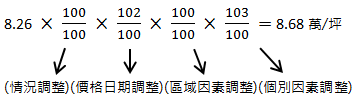

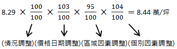

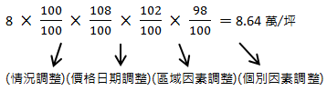

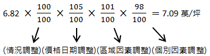

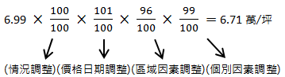

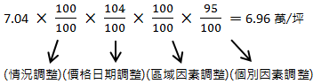

## 785. 公司法人登記證明文件
*發布日期: 2018-07-19* 

## 內文
各位同學好

高普考圓滿結束，三個月後有上榜同學記得跟老師報喜哦，榮耀與你同在！

今日專欄為各位說明有關於法人辦理土地登記時之有關身分證明文件概念：

根據土地登記規則第42條規定：

第一項：申請人為法人者，應提出法人登記證明文件及其代表人之資格證明。其為義務人時，應另提出法人登記機關核發之法人及代表人印鑑證明或其他足資證明之文件，及於登記申請書適當欄記明確依有關法令規定完成處分程序，並蓋章。

第二項：前項應提出之文件，於申請人為公司法人者，為法人登記機關核發之設立、變更登記表或其抄錄本、影本。

針對第二項部分說明如下：

因經濟部已停發公司及其負責人印鑑證明書，並改以公司設立（變更）登記表正本、影本或抄錄本及其影本以為替代，因上開替代之文件除留有公司及負責人印鑑樣章外，尚登記有公司名稱、公司所在地、公司統一編號、公司董事（含董事長）與監察人姓名、身分證統一編號、住所等資料，為避免檢附三種資料重疊之證件，造成申請人困擾，亦增加審查人員重複比對文件資料之處理時間，故有關公司法人申請登記時，如已檢附公司設立（變更）登記表正、影本或抄錄本及其影本者，得免予提出公司執照及其代表人之資格證明。

有關公司設立登記表如圖所示：

[圖片1]

## 文章圖片

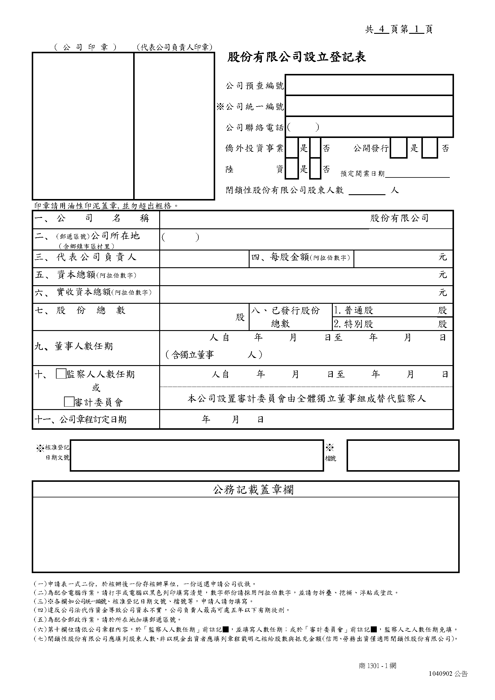

## 786. 全國國土計畫之重點研習(七)-土地利用與土地政策之模擬試題
*發布日期: 2018-07-19* 

## 內文
◎試述極端氣候下，氣候變遷之土地使用議題及調適策略？

【答】

• (一) 土地使用議題：

1. 高山及山坡地：

1. 自然災害頻傳加上高山及山坡地土地使用方式，持續加劇自然災害的衝擊，並造成生態環境保育與水資源供給的困境。

2. 都會地區持續擴張，壓縮平原地區農業發展，並進一步刺激山坡地開發。

3. 原住民族聚落基礎公共服務設施如何因應氣候變遷改變設施供給模式，亟須因地制宜的彈性。

2. 平原地區：

1. 農業發展受到都市及製造業擴張的衝擊，導致農糧安全風險逐漸升高，亟待保護農糧生產環境。

2. 水資源豐枯不均，因應農業及產業發展及生態保護，亟待推動流域及海岸整合治理。

3. 都市及鄉村集居地區：

1. 都市及產業發展排放溫室氣體，持續加重熱島效應及極端氣候的衝擊。

2. 都市及城鄉基盤設施未及因應氣候變遷及具危險性工業的發展，引起都市城鄉及其周邊地區的安全議題，亟待檢討與轉型。

3. 城鄉、產業及農業發展受到極端降雨與乾旱風險的威脅，如何透過土地使用策略以減緩災害衝擊及滿足社會經濟發展需求的變遷，挑戰嚴峻。

4. 部分城鄉居住空間受到氣候變遷的衝擊，可能不再適合居住，這些遷居戶的安置議題應事先思考及妥予因應。

4. 海岸、離島及海域：

1. 極端氣候及自然災害使海岸聚落及工業區安全議題更加嚴峻，亟須調整土地發展策略，降低氣候變遷風險。

2. 端氣候加劇離島連外交通的瓶頸；水電基礎公共服務不足，限制離島產業及社會發展。

3. 氣候變遷使海岸及海洋生態面臨更強的外部衝擊，連帶影響沿岸及離島社區的經濟與生活，亟須加強生態資源保育。

• (二) 土地使用調適策略：

1. 高山及山坡地：

1. 坡地農業利用應加強災害防治，並兼顧水源地維護及基礎設施安全。

2. 檢討山區城鄉及產業發展之潛在風險及研析轉型調適方式；加強坡地住宅及坡地農業之暴雨逕流、崩塌潛勢監測及相關保全措施。

3. 原住民族聚落周邊指認高風險地區，因地制宜發展微型基盤公共服務設施並加強環境監測。

2. 平原地區：

1. 維護農地資源及灌排系統，以確保糧食安全。

2. 持續監測河川系統洪枯流量變化，推動脆弱環境集水區治理。

3. 強化水源調配機制及系統，並降低水資源相關設施環境衝擊。

3. 都市及鄉村集居地區：

1. 加速推廣大眾運輸、需求反應式公共運輸、自行車及人行步道系統，並落實及增修相關法規與補助政策，以減少建成地區溫室氣體排放，並推廣韌性都市規劃。

2. 都市發展及產業配置應考量乾旱潛勢及水源供需，強化保水儲水及緊急備援用水措施規劃。

3. 因應氣候風險類型及社會長期發展趨勢，檢討基盤設施區位及型態。

4. 優先保留都市及鄉村之開放空間，並增加樹木覆蓋面積及滯洪功能，以增加溫室氣體吸收儲存能力，並緩衝氣候變遷及暴雨衝擊。

5. 透過公有土地活化、公共設施多目標使用、多元更新及大眾運輸導向土地使用規劃，並考量高齡化社會的趨勢，提供中繼基地或其他方案，規劃氣候變遷調適遷居戶容納空間，以容納遷居戶。

4. 海岸、離島及海域：

1. 強化海岸都市、鄉村及工業區安全：

1. 考量海平面上升及海嘯潛勢，設置必要安全維護設施。

2. 考量環境容受力，集中發展相關人工設施，儘可能保全自然環境之完整性。

3. 加速推動海岸工業區調適計畫，強化安全維護及生產穩定性。

2. 配合氣候變遷風險及海岸侵淤狀況，調整沿海土地使用強度與類型：

1. 城鄉發展地區應依據土地使用類型、建物密集程度，研擬整體性海岸災害潛勢防治策略。

2. 沿海低地之都市發展、土地使用及資源利用，應考慮海平面上升衝擊，設置緩衝帶並降低開發利用強度。

3. 強化離島地區公共服務與儲備能力：

1. 維持對外交通聯結及建立物資儲備機制，強化島嶼環境之社會應變力。

2. 因應乾旱風險，開發新興水資源、建置雨水貯留供水系統以及污水回收利用系統，健全島嶼水資源自給自足能力。

4. 強化海岸及海洋生態保育：

1. 加強海岸及海洋相關保護區劃設及管理，保全漁業及相關產業生產的生態基礎。

2. 無人離島、礁石應以保育優先，避免人為開發利用。

3. 整合保育相關機關政策及執行計畫，提供海岸及海洋保護與使用之規劃參考。

【資料來源：全國國土計畫，內政部，民國107年4月30日】
---
*注：本文圖片存放於 ./images/ 目錄下*

## 787. 高普考『土地法規』考題-土地增值稅記存
*發布日期: 2018-07-12* 

## 內文
本次高普考各科基本上除幾題考得稍微冷門外，大部分考題雖以案例入題，但都是上課、總複習、考猜有提到的，相信同學們應該都考得不錯！尤其，土地利用概要這次我出的考猜也命中兩題，所以還是再次提醒考猜要看哦！！

本次專欄則針對土地法規有考出都市更新權利變換有關土地增值稅「記存」概念予以說明（這在總複習也有強調哦！）：

考題：都市更新條例對於參加都市更新權利變換之土地所有權人定有准許土地增值稅「記存」相關規定，則記存之定義及其立法理由各為何？試分述之。又，倘若經核准記存土地增值稅之土地再贈與地方政府時，是否應繳納先前所記存之土地增值稅？其納稅義務人為何？試分述之。

擬答：

先寫都市更新條例第三十九條規定作為回答的前言（略）。

• (一) 記存之定義及其立法理由

1. 記存之定義：結算已發生之增值稅並記在帳上，暫時不課徵，於下次移轉時一併繳納，故已結算之增值稅部分不再發生累進稅作用。

2. 記存之立法理由：都市更新權利變換之土地增值稅准予記存，係為有利於都市更新事業之推動，避免納稅義務人因繳稅問題而不願參與都市更新。

• (二) 倘若經核准記存土地增值稅之土地再贈與地方政府時，應繳納先前所記存之土地增值稅。因記存僅暫時記在帳上，暫時不課徵，但記存之土地增值稅，於權利變換後再移轉該土地時，與該次再移轉之土地增值稅分別計算，一併繳納。

• (三) 其納稅義務人為合法建築物所有權人、地上權人、永佃權人或耕地三七五租約承租人。因該記存係視為土地所有權人獲配土地後無償移轉給這些權利變換關係人，而依據土地稅法之規定，土地為無償移轉者，其土地增值稅之納稅義務人為取得所有權之人。
---
*注：本文圖片存放於 ./images/ 目錄下*

## 788. 全國國土計畫之重點研習(六)-土地利用與土地政策之模擬試題
*發布日期: 2018-07-12* 

## 內文
◎內政部公告之全國國土計畫所擬定之土地使用基本方針為何？

【答】

• (一) 依據國土功能分區分類，進行土地使用差異化管理：

基於保育、利用及管理之需要，依土地資源特性，劃分國土保育地區、海洋資源地區、農業發展地區及城鄉發展地區。為落實國土功能分區指導功能，應依各國土功能分區及其分類之劃設原則及土地使用指導事項，分別訂定各國土功能分區及其分類之第一次編定及後續變更編定之使用地類別，並就各國土功能分區及其分類之使用地編定類別，訂定不同建築強度、應經申請同意使用項目、禁止或限制使用規定，以進行差異化土地使用管制。

• (二) 配合地方管制需要，研訂因地制宜土地使用規定：

直轄市、縣（市）主管機關應依據國土計畫法規定，擬定各該國土計畫，以彰顯地方資源特性，且直轄市、縣（市）主管機關並得依國土計畫法第 23 條第 4 項規定，另訂管制規定，報請中央主管機關核定後實施管制，以進行因地制宜之土地使用管制。

• (三) 依國土保育地區劃設原則，實施土地使用重疊管制：

國土保育地區係依據豐富資源、重要生態、珍貴景觀或易致災條件分布情形加以劃設，惟考量部分地區係依據原區域計畫法核發之開發許可、都市計畫或國家公園計畫等土地使用計畫進行管制，並未劃設為國土保育地區。為落實本計 畫精神，依國土計畫法第23條第1項規定，非屬國土保育地區之海洋資源地區、農業發展地區或城鄉發展地區之土地，如符合國土保育地區劃設原則者，其土地使用，除按各該國土功能分區及其分類之使用原則進行管制外，並依國土保育地區之土地使用指導事項規定辦理，進行重疊管制。

• (四) 考量環境敏感特性，實施管制標準：

在區域計畫架構下，環境敏感地區是用來限制申請開發許可及使用地變更編定，並不涉及土地使用項目及強度之管制；本計畫架構下之國土保育地區，是為保護重要環境及生 態資源而進行較嚴格之禁止限制，僅容許與資源保育有關之使用型態為主，故國土保育地區將就必要範圍予以劃設，其 範圍不等同於環境敏感地區。惟考量環境敏感地區為目的事業主管機關依據相關法律規定所公告之調查資料或管制事項，亦為國土規劃及土地開發審議之重要參考，是以，後續土地使用仍應考量環境敏感特性，不論劃歸何種國土功能分 區分類，仍應依其土地環境特性，採取適當的因應作為，實施管制標準。

• (五) 因應原住民族需求，另定特殊化土地使用管制：

原住民族土地及海域之土地使用管制，於其專法制定完成前，依據國土計畫法、都市計畫法或國家公園法進行管制。考量原住民族具有特殊文化風俗，為滿足其居住、耕作及殯葬等土地使用需求，未來得由中央主管機關會同中央原住民族主管機關擬定特定區域計畫，訂定土地利用管理原則，再配合研訂土地使用管制規定，納入國土計畫土地使用管制規則，並依原住民族基本法第21條規定辦理，以將原住民族需求納入規劃考量。

• (六) 配合國土復育計畫，禁止或限制土地使用：

依據國土計畫法第35條規定，土石流高潛勢地區、嚴重山崩、地滑地區、嚴重地層下陷地區、流域有生態環境劣化或安全之虞地區、生態環境已嚴重破壞退化地區等地區，經目的事業主管機關劃定為國土復育促進地區者，以保育和禁止開發行為及設施之設置為原則，並由劃定機關擬訂復育計畫，報 請中央目的事業主管機關核定後實施；且復育計畫之禁止、相容與限制規定，於各該復育計畫核定後，由中央主管機關配合納入國土計畫土地使用管制規則，以促進國土復育。國土復育促進地區如經公告廢止，中央主管機關並應配合檢討土地使用管制規定。

• (七) 維護國土功能分區功能，不得個別變更國土功能分區：

除國防、重大之公共設施或公用事業計畫，得於各國土功能分區申請使用外，土地使用應符合國土計畫法及其授權訂定之管制規則，且使用許可不得變更國土功能分區、分類。在符合國土計畫法第21條規定之國土功能分區使用原則下，有下列情形者，申請人得向土地所在之直轄市、縣(市)主管機關申請使用：

1. 國土保育地區：為提供國土保育及保安使用，或不妨害國土保育之特定使用。

2. 海洋資源地區：為提供不妨害海洋資源永續利用之多元使用。

3. 農業發展地區：為提供農業發展多元使用。

4. 城鄉發展地區：為提供城鄉發展多元利用。

• (八) 保障既有合法權利，允許土地使用：

1. 既有合法可建築用地：原依區域計畫法編定之可建築用地，於不妨礙國土保育保安、海洋資源維護、農業發展需求等情形下，得繼續編定為可建築用地或其他適當使用地，並得為既有合法之使用，但有改建或新建需求時，則依國土計畫土地使用管制規則規定辦理；如經直轄市、縣（市）變更為非可建築用地者，應依法給予適當補償，以保障合法權益。

2. 開發許可之案件：原依區域計畫法第15條之1第1項第2款規定取得開發許可之案件，其使用管制及開發建築，仍依許可之開發計畫書圖及其許可條件辦理。

• (九) 配合目的事業需求，專案輔導合法化：

全國國土計畫公告實施前，經目的事業主管機關依法令所訂專案輔導合法處理方案辦理使用分區變更或使用地變更編定案件，得於各該輔導期限內繼續辦理，並由中央主管機關另 訂國土功能分區分類相關土地使用管制規定。

【資料來源：全國國土計畫，內政部，民國107年4月30日】
---
*注：本文圖片存放於 ./images/ 目錄下*

## 789. 全國國土計畫之重點研習(五)-土地利用與土地政策之模擬試題
*發布日期: 2018-07-06* 

## 內文
◎何謂環境敏感地區？全國國土計畫將環境敏感地區分為那五類？

【答】

• (一) 環境敏感地區之意義：指對於人類具有特殊價值或具有前在天然災害，及容易受到人為的不當開發活動之影響而產生環境負面效應的地區。

• (二) 環境敏感地區之類型及項目：

1. 資源利用敏感類型

1. 飲用水水源水質保護區或飲用水取水口一定距離內之地區：依據飲用水管理條例劃設之飲用水水源水質保護區 或飲用水取水口一定距離內之地區。

2. 自來水水質水量保護區：為自來水水源之保護，依自來水法劃定公布之水質水量保護區。

3. 水庫集水區（供家用或供公共給水、非供家用或非供公共給水）：現有、興建中、規劃完成且定案（核定中），作為供家用或公共給水者、非作為供家用或公共給水者，依大壩上游全流域面積。其範圍由經濟部查認。

4. 水庫蓄水範圍：依據水利法、水庫蓄水範圍使用管理辦 法劃設，水庫滿水位與其迴水所及蓄水域、蓄水相關重要設施之土地與蓄水域周邊必要之保護範圍。

5. 森林：國有林事業區、保安林、大專院校實驗林地及林業試驗林地。

6. 溫泉露頭及其一定範圍：依據溫泉法，溫泉露頭係指溫泉自然湧出之處；依該法規定，溫泉露頭及其一定範圍內，不得為開發行為。

7. 水產動植物繁殖保育區：依據漁業法規定，為保育水產資源，目的事業主管機關得指定設置水產動植物繁殖保育區。

8. 礦區（場）、礦業保留區、地下礦坑分布地區：依據礦業法劃設之礦區（場）、礦業保留區、地下礦坑分布地區。

9. 地質敏感區（地下水補注）：依據地質法規定，中央地質主管機關應將具有特殊地質景觀、地質環境或有發生地質災害之虞之地區，公告為地質敏感區。

10. 人工魚礁區及保護礁區：依據漁業法劃設之人工魚礁區及保護礁區。

2. 生態敏感類型

1. 國家公園區內之特別景觀區、生態保護區：特別景觀區係依據國家公園法劃設，符合無法以人力再造之特殊自然地理景觀，而嚴格限制開發行為之地區；生態保護區係依據國家公園法劃設，符合為保存生物多樣性或供研究生態而應嚴格保護之天然生物社會及其生育環境之地區。

2. 自然保留區：依據文化資產保存法指定，符合具有代表性之生態體系，或具有獨特地形、地質、具有基因保存、永久觀察、教育及科學研究價值及珍稀動、植物之區域。

3. 野生動物保護區：依據野生動物保育法劃定，屬野生動物重要棲息環境有特別保護必要之地區。

4. 野生動物重要棲息環境：依據野生動物保育法劃定，符合下列情形之地區：

1. 保育類野生動物之棲息環境。

2. 野生動物種類及數量豐富之棲息環境。

3. 人為干擾少，遭受破壞極難復原之野生動物棲息環境。

4. 其他有特殊生態代表性之野生動物棲息環境。

5. 自然保護區：依據森林法設置，為維護森林生態環境，保存生物多樣性，森林區域內所設置之地區。

6. 一級、二級海岸保護區：依據海岸管理法劃設之一級、二級海岸保護區範圍。

7. 重要濕地：依據濕地保育法劃設之國際級、國家級、地方級重要濕地。

3. 文化景觀敏感類型

1. 古蹟：依據文化資產保存法規定，指人類為生活需要所營建之具有歷史、文化、藝術價值之建造物及附屬設施。

2. 考古遺址：依據文化資產保存法規定，指蘊藏過去人類生活所遺留具歷史文化意義之遺物、遺跡，而具有歷史、美學、民族學或人類學價值之場域。

3. 聚落建築群：依據文化資產保存法規定，指建築式樣、風格特殊或與景觀協調，而具有歷史、藝術或科學價值之建造物群或街區。

4. 文化景觀：依據文化資產保存法規定，指人類與自然環境經長時間相互影響所形成具有歷史、美學、民族學或人類學價值之場域。

5. 史蹟：依據文化資產保存法規定，指歷史事件所定著而具有歷史、文化、藝術價值應予保存所定著之空間及附屬設施。

6. 歷史建築：依據文化資產保存法規定，指歷史事件所定著或具有歷史性、地方性、特殊性之文化、藝術價值，應予保存之建造物及附屬設施。

7. 紀念建築：依據文化資產保存法規定，指與歷史、文化、藝術等具有重要貢獻之人物相關而應予保存之建造物及─88─附屬設施。

8. 水下文化資產：依據水下文化資產保存法規定，以全部或一部且週期性或連續性位於水下，具有歷史、文化、考古、藝術或科學等價值，並與人類生活有關之資產。

9. 國家公園內之史蹟保存區：依據國家公園法規定，符合為保存重要歷史建築、紀念地、聚落、古蹟、遺址、文化景觀、古物而劃定及原住民族認定為祖墳地、祭祀地、發源地、舊社地、歷史遺跡、古蹟等祖傳地，並依其生活文化慣俗進行管制之地區。

10. 國家公園內之一般管制區及遊憩區：各國家公園管理分區中之一般管制區及遊憩區。

11. 地質敏感區（地質遺跡）：依據地質法規定，中央地質主管機關應將具有特殊地質景觀、地質環境或有發生地質災害之虞之地區，公告為地質敏感區。

4. 災害敏感類型

1. 活動斷層兩側一定範圍：依據實施區域計畫地區建築管理辦法劃定之範圍。

2. 特定水土保持區：依據水土保持法劃定為亟需加強實施水土保持處理與維護，以有效防制水土災害發生或擴大地區。包括：

1. 水庫集水區。

2. 主要河川上游之集水區須特別保護者。

3. 海岸、湖泊沿岸、水道兩岸須特別保護者。

4. 沙丘地、沙灘等風蝕嚴重者。

5. 山坡地坡度陡峭、具危害公共安全之虞者。

6. 其他對水土保育有嚴重影響者。

3. 土石流潛勢溪流：依據災害防救法及土石流災害潛勢資料公開辦法劃設公開之土石流潛勢溪流。

4. 山坡地：依據山坡地保育利用條例及水土保持法劃設之山坡地。

5. 河川區域：依據水利法及河川管理辦法劃設之河川區域。

6. 洪氾區一、二級管制區，及洪水平原一、二級管制區：依據水利法劃設之洪氾區一、二級管制區；及依據水利法及淡水河洪水平原管制辦法劃設之洪水平原一、二級管制區。

7. 區域排水設施範圍：依據水利法及排水管理辦法劃設之區域排水設施範圍。

8. 地下水管制區：依據水利法及地下水管制辦法劃定公告地下水管制區。

9. 地質敏感區（活動斷層、山崩與地滑、土石流）：依據地質法規定，中央地質主管機關應將具有特殊地質景觀、地質環境或有發生地質災害之虞之地區，公告為地質敏感區。

10. 海堤區域：依據水利法及海堤管理辦法劃設之海堤區域。

11. 淹水風險：依據災害防救法及水災潛勢資料公開辦法公開之水災潛勢資料，係基於設計降雨條件、特定地形地貌資料及水理模式模擬演算之結果。

12. 一級、二級海岸防護區：依據海岸管理法劃設之一級、二級海岸防護區範圍。

13. 國土復育促進地區：依據本法規定，經目的事業主管機關劃定公告之國土復育促進地區。

5. 其他

1. 氣象法之禁止或限制建築地區：依據氣象法劃設禁止或限制建築地區。

2. 電信法之禁止或限制建築地區：依據電信法劃設禁止或限制建築地區。

3. 民用航空法之禁止或限制建築地區或高度管制範圍：依據民用航空法、航空站飛行場助航設備四周禁止限制建築物及其他障礙物高度管理辦法、航空站飛行場及助航設備四周禁止或限制燈光照射角度管理辦法劃設之禁止或限制建築地區。

4. 航空噪音防制區：依據噪音管制法及機場周圍地區航空噪音防制辦法劃設之各級航空噪音防制區，應檢討既有土地使用及開發計畫，遵守各項禁止建築規定及防音措施之地區。

5. 核子反應器設施周圍之禁制區及低密度人口區：依據核子反應器設施管制法劃設之核子設施周圍禁建區及低密度人口區。

6. 公路兩側禁建限建地區：依據公路法、公路兩側公私有建築物與廣告物禁建限建辦法劃設之公路兩側禁建限建地區。

7. 大眾捷運系統兩側禁建限建地區：依據大眾捷運法、大眾捷運系統兩側禁建限建辦法劃設之大眾捷運系統兩側禁建限建地區。

8. 鐵路兩側限建地區：依據鐵路兩側禁建限建辦法劃設之鐵路兩側禁建限建地區。

9. 海岸管制區、山地管制區、重要軍事設施管制區之禁建、限建地區：依據國家安全法劃設之海岸管制區、山地管制區、重要軍事設施管制區之禁建、限建地區。

10. 要塞堡壘地帶：依據要塞堡壘地帶法劃設之要塞堡壘地帶。（11）其他依法劃定應予限制開發或建築之地區。

【資料來源：全國國土計畫，內政部，民國107年4月30日】
---
*注：本文圖片存放於 ./images/ 目錄下*

## 790. 租賃住宅市場發展及管理條例
*發布日期: 2018-07-05* 

## 內文
各位同學好高普考將於這週考試，各位同學把握最後機會衝刺，記得要看考猜與總複習！考試時也不要太緊張，好好發揮實力！！祝各位考運亨通，金榜題名~

今日專欄則再次提醒有關土地政策、土地法之重點：租賃住宅市場發展及管理條例，幫各位同學整理一些重點如下（要注意其為土法有關房屋租用之特別法而優先適用）：

• 一、立法目的：為維護人民居住權，健全租賃住宅市場，保障租賃當事人權益，發展租賃住宅服務業，特制定本條例。

• 二、策略：

1. 健全住宅租賃關係，保障租賃當事人權益

1. 非具消費關係租約全面納入契約規範

2. 租金協商回歸契約自由原則

3. 刊登租賃住宅廣告真實透明

4. 輔導成立房東房客協會提供專業諮詢

5. 提供免費糾紛調處管道

2. 委託代管業、包租業專業經營，建立租賃住宅服務制度

1. 個人房東委託專業經營租稅減免措施

2. 發展租賃住宅服務業引導善用專業服務

3. 建立管理人員專業證照制度

4. 營業保證金損害代償機制

• 三、條文重點：

1. 租金：租賃住宅之租金，由出租人與承租人約定，不適用土地法第九十七條規定。(§6)

※立法意旨：按土地法第九十七條規定，城市地方房屋之租金，以不超過土地及其建築物申報總價年息百分之十為限；約定租金超過該規定者，得強制減定之。考量公告地價及房屋評定現值與市場價值仍有差距，無法完全反映房屋收益價值，且上開土地法規定僅規範城市地區之住宅，造成同樣為租賃行為，租金卻因地區不同而有差異。為避免影響出租人提供租賃住宅之意願，並尊重市場機制，爰定明予以排除適用。

2. 押金：押金之金額，不得逾二個月之租金總額。出租人應於租賃契約消滅，承租人返還租賃住宅及清償租賃契約所生之債務時，返還押金或抵充債務後之賸餘押金。(§7)

3. 轉租：轉租人應經出租人書面同意，始得轉租其租用之住宅全部或一部。轉租人簽訂轉租契約時，應向次承租人提供前項同意轉租之書面文件，並於轉租契約載明其與出租人之租賃標的範圍、期間及得終止租賃契約之事由。轉租人應於簽訂轉租契約後三十日內，以書面通知出租人。(§9)

※立法意旨：轉租人應提供有效之出租權力來源，讓次承租人取得租賃必要資訊，以保障租賃權益，規定轉租人應取得出租人同意轉租之書面資料後，並提供有關出租人與承租人簽訂住宅租賃契約之有效租賃範圍及期間資訊，以確保轉租契約之效力，俾利明確規範使用權益

曾老師補充：與民法§443：租賃物為房屋者，除有反對之約定外，承租人得將其一部分轉租於他人的規定不同，現在要書面同意才能轉租。

4. 收回：

1. 出租人提前終止租賃期間發生下列情形之一者，出租人得提前終止租賃契約，且承租人不得要求任何賠償：一、承租人毀損租賃住宅或附屬設備，不為修繕或相當之賠償。（賠償）二、承租人遲付租金或費用，達二個月之租額，經催告仍拒繳。（欠租）三、承租人未經出租人書面同意，將租賃住宅轉租於他人。（轉租）四、出租人為重新建築而必要收回。（收回）五、其他依法律規定得提前終止租賃契約。（其他）出租人依前項規定提前終止租賃契約者，應依下列規定期限，檢附相關事證，以書面通知承租人：一、依前項第一款至第三款及第五款規定終止者，於終止前三十日。二、依前項第四款規定終止者，於終止前三個月。

2. 承租人提前終止租賃期間發生下列情形之一，致難以繼續居住者，承租人得提前終止租賃契約，且出租人不得要求任何賠償：一、因疾病、意外產生有長期療養之需要。（療養）二、租賃住宅未合於居住使用，並有修繕之必要，經承租人定相當期限催告，而不於期限內修繕。（修繕）三、因不可歸責於承租人之事由，致租賃住宅之一部滅失，且其存餘部分難以繼續居住。（滅失）四、因第三人就租賃住宅主張其權利，致承租人不能為約定之居住使用。（第三人）承租人死亡，繼承人得主張終止租賃契約。（死亡）承租人依第一項各款或其繼承人依前項提前終止租賃契約者，應於終止前三十日，檢附相關事證，以書面通知出租人。

曾老師補充：將原本土地法僅就出租人得以收回之條件，增加承租人亦得收回之情形。
---
*注：本文圖片存放於 ./images/ 目錄下*

## 791. 全國國土計畫之重點研習(四)-土地利用與土地政策之模擬試題
*發布日期: 2018-07-05* 

## 內文
◎內政部公告之全國國土計畫所擬訂之策略執行工具建議為何？

【答】

策略執行工具建議如下：

• (一) 回饋機制：

直轄市、縣（市）政府在興建地區公共設施時，應善用都市土地變更負擔、都市更新捐贈公益設施或整體開發捐贈用地等多元方式，取得相關用地。

• (二) 負擔開發義務：

1. 繳交影響費：依國土計畫法第 28 條規定，得以繳交影響費、可建築土地抵充等方式，並設立專門保管及運用基金，運用於改善或增建公共設施。

2. 工程受益費或都市計畫法建議之多元方式。

• (三) 公共設施闢建配合都市發展時程：

於公共設施闢建應配合城鄉發展時程原則下，所有設施開發應按照進度設置，城鄉發展與公共設施發展步調一致，以避免產生設施提供過量或不足之現象。

• (四) 公有土地活化機制：

1. 公有土地、國營事業土地活化：直轄市、縣（市）政府得盤點城鄉發展地區內公有及國公營事業土地、設施資源，評估輔助社會弱勢、促進產業創新發展、落實社會公平正義等需求，協同土地及設施管理機關共同規劃，優先研擬公有土地及設施之活化策略，且相關公辦之整體開發、都市更新、促進民間參與公共建設、聯合開發等均應以創造社會公義為目標，進行公益性設施及公共設施規劃，以促使公共資源有效應用於社會。

2. 國有非公用土地活化：直轄市、縣（市）政府得考量整體發展需求，洽土地管理機關，就閒置之國有非公用土地進行規劃，以有效利用土地，並促進城鄉發展。

【資料來源：全國國土計畫，內政部，民國107年4月30日】
---
*注：本文圖片存放於 ./images/ 目錄下*

## 792. 土地徵收之問題與建議
*發布日期: 2018-06-28* 

## 內文
高普考即將於7月初考試，這最後階段絕對是關鍵，各位同學再多加把勁唸書，並且一定要多練習考古題，予以融會貫通。

今天專欄主要從我的土地政策與利用講義中，把彙整後的土地徵收之問題與建議，再次簡要提醒，其為考試一大重點題型，請同學務必要準備。

模擬考題：現行徵收爭議仍然不斷，目前土地徵收制度究竟有哪些問題？又請提出相關改善建議。

回答方向建議：

• (一) 現行土地徵收制度問題

1. 徵收浮濫：提到土地三大空間意涵、要件被忽略。

2. 公共利益的衡量問題：如何界定、由誰界定。

3. 徵收前之協議價購流於形式：提到程序正義。

4. 土地徵收補償狹隘：提到相當補償與完全補償。

• (二) 土地徵收制度之建議

1. 落實土地正義：提到地方認同。

2. 嚴格遵守要件：提到五大要件、徵收為不得已之最後手段。

3. 嚴謹衡量公私利益：客觀、公平、公開。

4. 落實法定程序：提到程序正義、協議價購為法定先行程序。

5. 合理徵收補償：不應僅重視土地經濟價格。

6. 限縮徵收目的：不要再把土地徵收當成是解決政府財政問題的手段，也不要再藉由土地徵收，讓地方菁英進行土地的開發與炒作。
---
*注：本文圖片存放於 ./images/ 目錄下*

## 793. 全國國土計畫之重點研習(三)-土地利用與土地政策之模擬試題
*發布日期: 2018-06-28* 

## 內文
◎內政部公告之全國國土計畫所擬訂之全國供糧食生產之農地總量及全國農地資源之保護策略為何？

【答】

• (一) 全國供糧食生產之農地總量

1. 全國農地總量之需求評估，係在國外農產品輸入受阻時， 國內應維持供糧食生產之農地資源，面積需求為74萬公頃至81萬公頃。考量農漁牧一級產業皆具有糧食生產功能，本計畫以前開數量作為供糧食生產之農地需求總量低推估之目標值。

2. 直轄市、縣（市）政府應積極維護供糧食生產之農地面積數量及品質，該等農地面積及分布區位應於直轄市、縣（市）國土計畫載明，並由各級政府提供適當資源挹注。

• (二) 全國農地資源之保護策略

1. 農業發展範圍應避免新增非農業使用設施與使用行為，避免生產環境遭受破壞而致使農地持續零碎化；其有設置必要者，應具有相容使用性質，或依本法得申請使用者，並不得影響周邊農業生產環境。

2. 農業發展範圍優先投入農政資源，加強農業生產基礎重要設施(灌溉設施、防護設施等)之建設，並有效整合土地、用水及農產業輔導資源投入，以利規模化、集中化利用，提升農業經營效益。

3. 維護農業生產環境，採取嚴格之環境管制，禁止各種可能污染之行為，並從嚴稽查違規使用。

【資料來源：全國國土計畫，內政部，民國107年4月30日】
---
*注：本文圖片存放於 ./images/ 目錄下*

## 794. 全國國土計畫之重點研習(二)-土地利用與土地政策之模擬試題
*發布日期: 2018-06-21* 

## 內文
◎內政部公告之全國國土計畫所擬訂之城鄉發展空間之發展策略為何？

【答】

• (一) 減緩溫室氣體排放、城鄉集約有序發展：

1. 城鄉應朝向集約都市（compact city）發展，以有效利用土地資源、節省能源、增進公共設施使用效率。透過土地集約發展，減少無秩序之蔓延。若無實質人口或產業成長需求，應減少開發新社區及產業園區。

2. 推動低碳與生態城鄉，建立鼓勵使用綠建材等低碳或低耗能設施之機制，並規範公有建築物應採用一定比例之節能減碳綠建材。

3. 透過以人為本的綠色運輸與智慧運輸模式，建構便捷大眾運輸網，並強化偏遠地區公共運輸系統的可及性，以降低能源消耗。提高大眾運輸場站及其周邊土地使用強度，集約開發重要運輸走廊，避免空間發展無序蔓延；重大公共建設計畫應考量既有區域產業座落區位，並結合交通運輸節點周邊土地進行整體開發。

• (二) 因應氣候變遷極端氣候、營造永續韌性城鄉：

1. 因應全球暖化等氣候變遷趨勢，各級土地使用計畫及部門計畫均應加強防災規劃與風險管理。對於不適合居住或從事產業活動之地區應採取適當對策，以避免氣候變遷所產生災害的一再發生。保育地區應避免新開發行為，如因區位無可替代性時，其開發方式應更為審慎。

2. 為減少暴雨逕流帶來之災害衝擊，城鄉開發應配合流域整體經理，充分評估逕流量平衡及透水率，透過滯留設施、透水性開放空間、整體儲留設施等系統規劃，進行逕流總量管制、加強水資源回收利用，並配合檢討相關土地使用管制。

• (三) 促進都市再生、提升都市競爭力：

1. 整合政府資源由都市更新提升至都市再生，整體改造老舊市區之機能、景觀風貌及增設高齡友善空間與設施（如無障礙空間與友善社區），提振地方經濟，增加都市競爭力。

2. 對於以政府為主之都市更新案，積極辦理選商投資或整合實施，並協助籌措財源，評估委託成立都市更新推動辦公室及專業整合機構，協助招商投資作業及促進社區整合更新意願建立住戶自力更新推動機制，以鼓勵住戶自力更新。

3. 對於直轄市、縣（市）產業用地使用情形進行通盤檢討，閒置未利用之產業土地應考量優先使用。

4. 對於老舊工業區之基盤設施老舊或供給不足，應進行維護改善或新（整）建，藉以改善工業區環境，形塑整體園區意象，以提升服務機能，提高產業進駐率。

• (四) 提升國土生態景觀品質：

1. 尊重自然與人文資產，發揮地區景觀特色，整合不同空間尺度景觀資源，依循生態網絡及都市紋理，創造開放空間。

2. 推動國土美學理念，納入景觀保育、管理及維護相關政策。針對重點景觀地區應加強區內景觀規劃、改善、保育、管理及維護等相關措施，並加強重視城鄉景觀特質，透過跨域合作、環境資源修補、整合及資源串聯，形塑城鄉地景生態，建立城鄉空間自明性，強化城鄉空間獨特性。

• (五) 推動鄉村地區整體規劃、形塑鄉村特色風貌：

1. 鄉村地區應以生活、生產、生態之再生規劃理念出發，充實生活機能設施、維護地方文化特色、營造鄉村生產經營環境、培育鄉村人力資源及建立生態網路，以協助鄉村地區永續發展，各面向發展策略如下：

1. 生活面：建立數位環境、活化閒置空間、促進城鄉交流、保存鄉村文化與社區意識等，並維護及改善在地商業、旅遊、集會場所、文化設施及信仰中心等基本服務設施。

2. 生產面：維護農地環境、促進農業六級化、推廣鄉村旅遊、建構旅遊服務設施等，以支持對鄉村地區商業、社區及遊客有益的旅遊及休閒活動。

3. 生態面：避免破壞重要動植物棲息環境、提高基地透水性、營造生物多樣性生態環境等。

2. 為改善鄉村地區之公共設施缺乏、建築土地不足、農村環境破壞及蔓延無序發展等課題，鄉村地區整體規劃應考量人口結構及發展趨勢，分別就居住、產業、運輸及基本公共設施等需求，研擬發展或轉型策略，其土地使用規劃原則如下：

1. 居住：規劃及提供可負擔住宅，滿足當地居住需求，維持地方特色建築風貌。因農業經營需要衍生之居住需求，得於既有農村聚落周邊提供住宅空間，避免個別、零星申請而影響農業生產環境；就人口成長地區，得預留適當可建築土地，以引導集約發展；就人口減少地區，除應避免增加住商建築用地外，並應針對既有閒置空間進行評估轉型及再利用，以提高環境品質。

2. 產業：配合在地農業、特色產業及商業服務業需求，於不影響鄉村環境品質前提下，於適當地點規劃在地產業發展區位，並訂定彈性土地使用管制規定，以促進鄉村在地產業永續發展。

3. 運輸：以需求反應式公共運輸服務為主，改善接駁轉乘系統及服務品質，提高鄉村可及性，並規劃自行車及電動車輛等綠色運具環境，以民眾基本運輸需求為導向，打造兼具效率及友善運輸環境。

4. 基本公共設施：應依據鄉村地區發展趨勢，規劃與設置老人及幼兒照顧服務設施、污水處理、自來水、電力、電信等基本公共設施，並注重環境保護及社區環境改善。

3. 農業發展型之農村聚落及工商發展型之社區聚落發展原則如下：

1. 農業發展型之農村聚落：農村聚落應以農村再生為基礎，鼓勵透過農村社區土地重劃等方式，建立農特產行銷之產業活化措施、進行整體環境改善、保存祭典文化及傳統建物、提供幼童及老年社區照顧福利設施、改善道路及污水處理等公共設施、注重生態保育與防災設施等，並提升農村社區意識，以培力改善社區環境。積極投入農業資源，改善農業生產環境。

2. 工商發展型之社區聚落：具備都市生活特徵，宜劃設適當發展範圍，以擬定鄉街計畫方式，規劃配置基礎公共設施、污染防治相關設施，塑造城鄉生活風貌。

【資料來源：全國國土計畫，內政部，民國107年4月30日】
---
*注：本文圖片存放於 ./images/ 目錄下*

## 795. 實價登錄2.0
*發布日期: 2018-06-21* 

## 內文
這週專欄提醒各位同學有關土地政策中不動產市場之重要觀念：實價登錄2.0

最近實價登錄修法之主要內容如下：

1. 由買賣雙方於申請買賣移轉登記時共同申報。修法後由買賣雙方於申請登記時併同辦理，簡化作業流程，並將揭露時間縮短30日，提升資訊即時性買賣雙方基於稅賦權益相互勾稽制衡，提升資訊正確性。

2. 自售預售屋者銷售前及代銷業者簽訂代銷契約後30日內，應將預售屋銷售資訊報備查；並於簽訂預售屋買賣契約書之日起30日內申報。

3. 門牌或地號完整揭露，並溯及已揭露案件。

4. 增訂直轄市、縣(市)主管機關查核權及查核範圍。確保資訊真實正確，嚇阻有心人士炒作。

5. 依違法情節修正罰則區分輕重，當事人屢不改正加重處罰，以符合符合比例原則。
---
*注：本文圖片存放於 ./images/ 目錄下*

## 796. 全國國土計畫之重點研習(一)-土地利用與土地政策之模擬試題
*發布日期: 2018-06-14* 

## 內文
◎內政部公告之全國國土計畫所揭櫫之國土永續發展目標為何？

【答】

全國國土空間發展之總目標有三，其一、安全─環境保護、永續國土資源，其二、有序─經濟發展、引導城鄉發展，其三、和諧─社會公義、落實公平正義。

• (一) 安全－環境保護、永續國土資源：

1. 因應極端氣候與天然災害，強化國土調適能力。

2. 配合流域綜合治理計畫，進行土地使用規畫與檢討。

3. 維護農地總量，提升農地生產效益。

4. 建構永續能源、水源使用環境，促進節能減碳。

5. 建構國家生態網路，加強海岸、濕地及海域管理。

• (二) 有序－經濟發展、引導城鄉發展：

1. 落實集約發展，促進城鄉永續。

2. 提升國土機動性、可及性及連結性。

3. 配合國家整體產業發展政策，整合產業發展空間規劃。

4. 整合區域文化生態景觀資源，強化文化觀光動能。

5. 營造優質營農環境，推動農業永續發展。

• (三) 和諧－社會公義、落實公平正義：

1. 建立合理補償機制，確保發展公平性。

2. 擬定都會區域及特定區域計畫，均衡城鄉發展。
---
*注：本文圖片存放於 ./images/ 目錄下*

## 797. 公信力（107地政士考題補充）
*發布日期: 2018-06-14* 

## 內文
各位同學好

本日專欄再針對本次地政士土地法規考題，作一些補充。實際上，該題是從一個68年的民事庭決議而來，如下，請同學參考。

而這邊幫同學整理一下整體概念：

[圖片1]

土地法規第一題：我國土地法地籍編及民法物權編相關規定，不動產物權登記係採登記生效主義，非經依法登記不生效力。試問某甲擅將某乙所有土地移轉登記於甲自己名下所有，並設定抵押權登記給善意之某丙，則某乙能否訴請塗銷某甲之所有權移轉登記及某丙之抵押權登記？

根據最高法院68年度第5次民事庭庭推總會議決議（一）民國68年04月17日甲私擅將乙所有土地移轉登記於己，並已為善意之丙設定抵押權登記，甲之移轉登記如有無效之原因，即非信賴登記而取得新登記之善意第三人，不受土地法第四十三條之保護，縱令丙之抵押權登記應受同條之保護，乙仍可訴請塗銷甲之所有權移轉登記，而丙之抵押權即存在於乙之所有土地。

有甲、乙二說：【討論意見】【甲說】甲私擅將乙所有土地移轉登記於自己，如有無效之原因，即非信賴登記而取得新登記之善意第三人，不受土地法第四十三條之保護，縱令丙之抵押權登記應受同條之保護，乙仍可訴請塗銷甲之所有權移轉登記。結果丙之抵押權即存在於乙之所有土地。【乙說】丙因信賴甲所有權之登記而為抵押權之新登記，既受土地法第四十三條之保護，不得塗銷，則甲之所有權登記縱不受保護，亦不得訴請塗銷，蓋甲之所有權登記如許塗銷，丙之抵押權登記將失所附麗，而不能貫澈保護善意第三人之法意。此際乙可請求甲損害賠償，將土地所有權再移轉登記於乙，以回復原狀，而丙之抵押權當然追及存在於乙之土地。

以上二說，以何說為當？請公決

【決議】

甲私擅將乙所有土地移轉登記於己，並已為善意之丙設定抵押權登記，甲之移轉登記如有無效之原因，即非信賴登記而取得新登記之善意第三人，不受土地法第四十三條之保護，縱令丙之抵押權登記應受同條之保護，乙仍可訴請塗銷甲之所有權移轉登記，而丙之抵押權即存在於乙之所有土地。（同甲說）

## 文章圖片

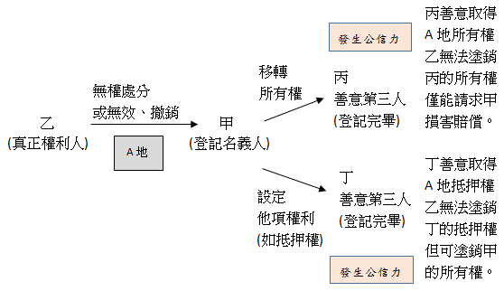

## 798. 遺贈稅
*發布日期: 2018-06-07* 

## 內文
各位同學好

地政士考試剛結束，各位班內同學應該都考得不錯！因為這次考猜、總複習、專欄都有命中，所以還要考試的同學們也真的要持續關注我們的專欄、考猜喔！

這次考試有一些不錯且重要之概念，對於明年或之後才要準備考地政士證照的同學，需要瞭解及準備。因此，本週專欄針對本次地政士土地稅法規的第一題遺贈稅計算題作一些重點提醒。

本題有兩個重要觀念提醒：

1. 遺產及贈與稅法第17條第2項容易被忽略，就是繼承人中拋棄繼承權者，不適用扣除。

2. 考前記得更新且背每年公告的扣除額、免稅額。

本題題目建議回答方式如下：

題目：被繼承人林君於107年1月7日死亡，配偶健在，膝下有2男2女皆已滿20歲，其中次男不幸為重度殘障。林君辛苦多年擁有土地甲、乙、丙、丁4筆，公告土地現值總額各為2,000萬元、900萬元、1,200萬元、300萬元；另有房屋1棟，於林君死亡當年評定現值為80萬元，且銀行裡尚有活期儲蓄存款30萬元、定期存款100萬元，其兒女於107年3月申報遺產稅。其中配偶、次男、長女及次女皆拋棄繼承，由長男1人繼承，應繳多少遺產稅？若皆繼承，其遺產稅負如何？

擬答：I.其他繼承人拋棄繼承，僅由長男1人繼承，則繼承人拋棄繼承權者，將無法適用遺產及贈與稅法第17條第1項第1至5款規定，自遺產總額中扣除：

• (一) 遺產總額：遺產稅按被繼承人死亡時，依本法規定計算之遺產總額，減除第十七條、第十七條之一規定之各項扣除額及第十八條規定之免稅額後之課稅遺產淨額。遺產總額應包括被繼承人死亡時依第一條規定之全部財產，及依第十條規定計算之價值。但第十六條規定不計入遺產總額之財產，不包括在內。其中，遺產價值之計算，以被繼承人死亡時之時價為準；被繼承人如係受死亡之宣告者，以法院宣告死亡判決內所確定死亡日之時價為準。

1. 土地：所稱時價，土地以公告土地現值或評定標準價格為準。

2. 房屋：以評定標準價格為準。

因此，甲遺產總額＝2000+900+1200+300+80+30+100＝4,610(萬元)

• (二) 免稅額與扣除額：

1. 免稅額：1,200(萬元)

2. 長男扣除額：50(萬元)

3. 喪葬費扣除額：123(萬元)

4. 合計：1,200+50+123=1,373(萬元)

• (三) 課稅遺產淨額＝遺產總額－扣除額－免稅額＝（4,610－2,634）＝3,237(萬元)

• (四) 適用稅率：遺產稅按被繼承人死亡時，依本法規定計算之遺產總額，減除第十七條、第十七條之一規定之各項扣除額及第十八條規定之免稅額後之課稅遺產淨額，依下列稅率課徵之：

1. 五千萬元以下者，課徵百分之十。

2. 超過五千萬元至一億元者，課徵五百萬元，加超過五千萬元部分之百分之十五。

3. 超過一億元者，課徵一千二百五十萬元，加超過一億元部分之百分之二十。

由於本題遺產淨額五千萬以下，故稅率為百分之十。

• (五) 遺產稅應納稅額＝3,237×10%＝323.7(萬元)

• I. I.若皆繼承：

• (一) 遺產總額同上。

• (二) 免稅額與扣除額：

1. 免稅額：1,200(萬元)

2. 配偶扣除額：493(萬元)

3. 2男2女歲子女扣除額：50×4=200(萬元)

4. 次男重度殘障：618(萬元)

5. 喪葬費扣除額：123(萬元)

6. 合計：1,200+493+200+618+123=2,634(萬元)

• (三) 課稅遺產淨額＝遺產總額－扣除額－免稅額＝（4,610－2,634）＝1,976(萬元)

• (四) 適用稅率：遺產稅按被繼承人死亡時，依本法規定計算之遺產總額，減除第十七條、第十七條之一規定之各項扣除額及第十八條規定之免稅額後之課稅遺產淨額，依下列稅率課徵之：

1. 五千萬元以下者，課徵百分之十。

2. 超過五千萬元至一億元者，課徵五百萬元，加超過五千萬元部分之百分之十五。

3. 超過一億元者，課徵一千二百五十萬元，加超過一億元部分之百分之二十。

由於本題遺產淨額五千萬以下，故稅率為百分之十。

• (五) 遺產稅應納稅額＝1,976×10%＝197.6(萬元)
---
*注：本文圖片存放於 ./images/ 目錄下*

## 799. 地政士考試土法實例題推介
*發布日期: 2018-06-07* 

## 內文
今年地政士考試「土地法規」乙科，有一題實例，值得推介。

◎試問某甲擅將某乙所有土地移轉登記於甲自己名下所有，並設定抵押權登記給善意之某丙，則某乙能否訴請塗銷某甲之所有權移轉登記及某丙之抵押權登記？

【解答】

• (一) 土地法第四十三條：「依本法所為之登記，有絕對效力。」所謂絕對效力，係指善意第三人因信賴土地登記，而取得之土地權利，具有不可推翻之效力。司法院大法官會議解釋，所謂登記有絕對效力，係為保護第三人起見，將登記事項賦予絕對真實之公信力。

1. 真正權利人在已有第三人取得權利之新登記後，雖得依土地法請求損害賠償，不得為塗銷登記之請求。

2. 真正權利人在未有第三人取得權利之新登記前，對於登記名義人仍有塗銷登記請求權。

• (二) 依題旨，某甲擅將某乙所有土地移轉登記於甲自己名下所有，並設定抵押權登記給善意之某丙。茲分下列兩種情形說明：

1. 甲擅將乙所有土地移轉登記於甲自己名下所有。此時，在未來第三人取得權利之新登記前，乙對於登記名義人甲仍有塗銷登記請求權。

2. 甲擅將登記於其名下土地，設定抵押權登記給善意之丙。此時，善意第三人丙因信賴土地登記，而取得之抵押權，具有不可推翻之效力。換言之，乙對於丙之抵押權不得為塗銷登記之請求。

總之，某乙得訴請塗銷某甲之所有權移轉登記，但不得訴請塗銷某丙之抵押權登記。
---
*注：本文圖片存放於 ./images/ 目錄下*

## 800. 地政士考試重點提醒
*發布日期: 2018-06-01* 

## 內文
地政士同學們這週將要上場考試了，加油！

老師星期日考完後會馬上在台中解題，星期一則在高雄解題，有考試的同學可以來聽聽，沒考試的也可以來聽聽題目怎麼回答，以及相關考試重要概念提醒。【解題講座詳情】

今日專欄就針對歷屆考試趨勢，為各位預測及提醒一下今年地政士考試重點，請大家這週衝刺時再好好準備一下！

土地登記：

1. 登記主體（法人籌備）

2. 申請方式（代位、逕為、囑託(用口訣記)）

3. 得免親自到場

4. 權狀（得免提、得免發、公告註銷）

5. 登記規費（計算+免納

6. 須公告之登記

7. 權利變更之日

8. 申請登記前權利人或義務人死亡處置

9. 共有多數決申請登記(3明+1名分+1通告)

10. 共有優先購買(97條)

11. 地上與農育權設定登記（記明內容）+典權設定登記（記明內容）

12. 共同擔保抵押（後次序同意）

13. 共有分割之抵押權處理

14. 承攬預為抵押

15. 流抵約定登記

16. 權利信託登記種類+土登130~132登記機關對信託登記處理方式

17. 禁止處分與移轉登記之競合+同一性質或不同性質競合

18. 他項權利及限制登記塗銷登記

19. 複丈意義原因與申請人

20. 合併複丈

21. 鑑界複丈

22. 平面圖測繪

23. 免申請建物第一次測量(標示圖)

24. 建物第一次測量與登記應檢附文件

土地法：

1. 地權：地權限制、取得、消滅、外國人、共有34-1 6項

2. 地用：

1. 土地104

2. 房屋基地耕地收回限制

3. 市地重劃辦理主體、共同負擔、土地分配、權利清理

3. 徵收

1. 一併徵收

2. 徵用

3. 區段徵收土地處理、補償

4. 收回

5. 撤銷與廢止

4. 地政士法

1. 不發給開業執照

2. 執業範圍

3. 禁止行為

4. 簽證19-22條

5. 實價登錄

6. 洗錢防治(低風險客戶、主動申報)

土地稅：

1. 地價稅：納稅義務人、納稅義務基準日、累進起點地價、自用住宅定義與要件、事業用優惠稅率、公共設施保留地優惠稅率

2. 土地增值稅：土地漲價總數額計算、申報移轉現值標準、一生一次與一生一屋、減徵

3. 房屋稅：納稅義務人、減半徵收、公有房屋免徵、私有房屋免徵

4. 契稅：納稅義務人、範圍與稅率、申報起算日、怠報金、滯納金

5. 遺贈稅：財產定義與他項權利價值、計算(稅基、稅率)、擬制遺產、擬制贈與、不計入遺產總額、不計入贈與總額、遺產扣除額、贈與扣除額、遺產與贈與免稅額、繼承登記與申報義務

6. 房地合一稅：課稅範圍、計算(稅基、稅率)、免納情形、重購退稅

7. 稅捐稽徵法：核課期間與起算日、徵收期間、稅捐保全、復查、退稅（溢繳、行政終結）
---
*注：本文圖片存放於 ./images/ 目錄下*

## 801. 實價登錄之變革
*發布日期: 2018-05-31* 

## 內文
實價登錄地政三法(即平均地權條例、地政士法及不動產經紀業管理條例)修正草案業經行政院院會通過，送交立法院審查。本次修法重點：

• (一) 申報義務人：過去為地政士、經紀業或權利人。修法後改為買賣雙方。

• (二) 申報時機：過去為辦竣所有權移轉登記30日內申報。修法後改為申請所有權移轉登記同時申報。

• (三) 揭露內容：過去採去識別化，以30戶一單位，只揭露區段。修法後改為門牌或地號完全揭露。

• (四) 預售屋申報：過去代銷結案後30日內申報。修法後改為簽訂預售屋買賣契約書後30日內申報。另，過去建商自售不必申報，修法後不論建商自售或委託代銷均須申報。

• (五) 強化查核提高罰鍰：增訂主管機關查核權，並對不實申報者，提高罰鍰。

總之，實價登錄之目的在提供即時、透明、正確的交易資訊，以健全不動產交易市場。
---
*注：本文圖片存放於 ./images/ 目錄下*

## 802. 防災型都市更新(防災都更)
*發布日期: 2018-05-24* 

## 內文
各位同學好

今日專欄為各位同學彙整防災型都市更新(防災都更)之概念，高普考同學要注意。

• 一、意義

所謂防災型都市更新(防災都更)，係考量未來可能發生重大災害潛勢導致嚴重災損，而提出之都市防災策略，藉由都市更新之方法，以提升都市安全性與防災機能為積極目標，進行土地使用及建築物之調整與補強，從而降低嚴重災損出現之可能性，並同時達到都市窳陋地區環境改善目的之更新計畫。

• 二、特色

• (一) 以防災作為首要考量

• (二) 土地使用強度和容積總量降低，以因應防災需求。

• (三) 居民之遷移與安置：經過調查和勘測後，災害潛勢較高之地區如認已不適合人居或必須降低使用強度者，即應另尋其他基地進行居民安置；如仍適居，則須降低使用強度或改以低密度發展，以因應淹水或其他潛勢災害之發生。

• (四) 公共設施轉型：防災型都市更新區域內之公共設施，須同時具有防災或避難功能。例如：流域綜合治理從上、中、下游之區域排水方向思考：上游做保水（如：造林、綠化）；中游做減洪（如：滯洪池）；下游則為防洪（如：設置抽水站、排水設施興建）。有關維生系統部分，包括輸電線路、輸水管線等，均應考量當遇到災害時，所會受到之影響。例如：地震後土壤易產生液化，而土壤液化後會喪失承載力，建築物會因而沉陷傾斜，而自來水、瓦斯、電信及網路等管線亦會因此阻斷。此外，公益性設施之提供與興建也很重要，例如：警察局、社區活動中心、圖書館、老人照護中心及幼稚園...等。

• (五) 都市整合：在都市更新推動的歷程中都會遇到景觀、歷史、生態、公安及防災等問題，故都市更新在重建或整建時即應要求防災。例如：耐震度，應提高建築物之耐震能力；此外，導入新思維，綠建築、智慧建築…等；並從整體都市發展、都市計畫與區域計畫角度去瞭解，將不適合開發的基地轉變成防災公園等。都市更新不是只片段的解決建物重建問題，也須解決整體都市發展的問題。如何從都市更新發展策略擬訂所謂的優先發展策略並賦予每塊基地「核心任務」，是都市更新發展策略中重點。而從點（基地單元開發）、線（公共維生系統）到面（區域發展）之開發，均應具整體性思考，才能使都市成為完整發展的地區。

• 三、新北市的防災型都市更新作法

首先，新北市的防災型都市更新不等於一般都市更新條例之都更，也不等於危老條例之重建。

• (一) 新北市推動都市計畫內防災建築再生自治條例（107.3.23實施）

1. 適用對象

1. 高危險（震損建築、海砂屋）

2. 高風險（健檢3級＝88.12.31前合法建物）

2. 作法

1. 需拆除重建經限期(2年內)拆除

1. 容積獎勵定額50%（以原容或法容計皆可）

2. 放寬限制（包含原建蔽率、原開挖率、原使用，以及高度放寬）

3. 拆遷安置補助（補貼租金1年）

4. 稅捐補貼（興建期：地價稅補貼3年；重建後2年：地價稅與房屋稅補貼1/2）

2. 需結構修復於限期(2年內)改善

1. 提高費用補助上限至75%

2. 上限1200萬

• (二) 簡易都更

1. 適用對象

1. 老舊建物（30年以上）（含違章建築）達一定比例（投影面積達全區1/2）

2. 基地面積500m2以上

3. 屬於都市計畫住宅區、商業區

2. 排除對象

1. 公辦都更（已整合，不宜切割）

2. 已申請概要或事業計畫（容獎不重複原則）

3. 條件

1. 100%同意

2. 符合重建後環境要求（臨路、退縮）

4. 程序程序簡化：一般建照程序（向工務局申請→核准→施工）

5. 容積獎勵建築配置20%、15%；10%。

參考資料：王珍珍，2018，氣候變遷下之都市更新－以防災型都市更新為例，土地問題研究季刊，17卷1期：26-37。
---
*注：本文圖片存放於 ./images/ 目錄下*

## 803. 存續保障與價值保障
*發布日期: 2018-05-24* 

## 內文
對財產權之保障首重「存續保障」，只在不得已的情況下，始由「價值保障」取代。

• (一) 存續保障：土地所有權乃對土地之永久權利，故對私人土地所有權之保障，在於「存續保障」，以確保私人依財產之存續狀態行使其使用、收益及處分之權能，並免於遭受公權力或第三人之侵害。

• (二) 價值保障：因公用或公益所需，不得已必須徵收私人土地。國家無法踐行存續保障，始由價值保障取代。亦即私人雖失去土地所有權，但獲得金錢完全補償。
---
*注：本文圖片存放於 ./images/ 目錄下*

## 804. 農舍單獨移轉是否有土地法第104條之適用？
*發布日期: 2018-05-17* 

## 內文
依據農業發展條例第18條第4項規定，農舍應與其坐落用地併同移轉或併同設定抵押權。惟該規定修正施行前（即民國89年1月27日前），農舍與農業用地分屬不同所有權人，基於法律不溯既往，仍允許農舍單獨移轉。

若農舍與農業用地已分屬不同所有權人者，農舍於拍賣或移轉時，農舍坐落用地之土地所有權人宜有依同樣條件優先購買之權，以符合土地法第104條及農業發展條例第18條第4項之立法意旨與政策目的（93.10.27農企字第0930150054號函）。由此可知，農舍單獨移轉有土地法第104條之適用，惟仍須以農舍與農業用地之間存在地上權、典權或租賃權為前提。

同理，若農舍與農業用地已分屬不同所有權人者，農業用地於拍賣或移轉時，農舍所有權人有依同樣條件優先購買之權。
---
*注：本文圖片存放於 ./images/ 目錄下*

## 805. 收回權在土地法與土地徵收條例之差異
*發布日期: 2018-05-17* 

## 內文
各位同學好

鑑於大法官釋字763前陣子剛出來，而繼上週專欄針對該釋字進行詳細整理後，今日專欄提醒各位同學有關收回權規定在土地法與土地徵收條例規定之差異：

• T. ABLE_PLACEHOLDER_1
---
*注：本文圖片存放於 ./images/ 目錄下*

## 806. 釋字763之重點
*發布日期: 2018-05-10* 

## 內文
各位同學好大法官真的很勤快，最新的大法官釋字第763號又新出爐了，而且絕對相當重要，請各位考試同學都要注意！

今日專欄為各位說明該釋字之重點。其中，請大家先複習最近剛上完的土地法規之「徵收收回權」，以及土地政策之「程序正義」兩個部分。

• 一、徵收收回權重點複習

• (一) 意義

※土地徵收條例§9：被徵收之土地，除區段徵收及本條例或其他法律另有規定外，有下列情形之一者，原土地所有權人得於徵收公告之日起二十年內，向該管直轄市或縣(市)主管機關申請照原徵收補償價額收回其土地，不適用土地法第219條之規定(土徵§9I)：

1. 徵收補償費發給完竣屆滿三年，未依徵收計畫開始使用者。

2. 未依核准徵收原定興辦事業使用者。

3. 原徵收計畫開始使用後未滿五年，不繼續依原徵收計畫使用者。

※土地法§219：私有土地經徵收後，有下列情形之一者，原土地所有權人得於徵收補償發給完竣屆滿一年之次日起五年內，向該管直轄市或縣（市）地政機關聲請照徵收價額收回其土地(土§219I)︰

1. 徵收補償發給完竣屆滿一年，未依徵收計畫開始使用者。

2. 未依核准徵收原定興辦事業使用者。

依據土地徵收條例第61條規定，本條例施行前公告徵收之土地，其申請收回，仍依施行前之規定辦理(89.2.2公布施行)。因此，截至目前為止，實務上關於收回被徵收土地之事件，幾乎仍為適用土地法規定，從而土地法第219條規定於現今猶具重要意義。而本次解釋即與土219有關。

• (二) 目的

1. 作為需用土地人違反徵收目的之制裁手段。

2. 防止徵收機關為不必要之徵收，或遷延興辦公共事業。

3. 恢復原土地所有權人之原所有權，可減少人民因土地被徵收而後到之損害，有助於私人財產權之保障。

• (三) 行使期間（本次釋字涉及重點！）

1. 土地法：徵收補償發給完竣屆滿一年之次日起五年內。

2. 都市計畫法：計畫使用期限屆滿之次日起五年內。

3. 土地徵收條例：徵收公告之日起二十年內。

• 二、釋字763重點

被徵收土地使用情形應定期通知（有關徵收收回權之行使）

• 三、解釋文內容

土地法第219條第1項規定逕以「徵收補償發給完竣屆滿1年之次日」為收回權之時效起算點，並未規定該管直轄市或縣（市）主管機關就被徵收土地之後續使用情形，應定期通知原土地所有權人或依法公告，致其無從及時獲知充分資訊，俾判斷是否行使收回權，不符憲法要求之正當行政程序，於此範圍內，有違憲法第15條保障人民財產權之意旨，應自本解釋公布之日起2年內檢討修正。

於本解釋公布之日，原土地所有權人之收回權時效尚未完成者，時效停止進行；於該管直轄市或縣（市）主管機關主動依本解釋意旨通知或公告後，未完成之時效繼續進行；修法完成公布後，依新法規定。

• 四、理由書重點整理

1. 國家因公用或其他公益目的之必要，固得經由法定程序徵收人民之土地，惟徵收人民土地，屬對人民財產權最嚴重之侵害手段，基於憲法正當程序之要求，國家自應踐行最嚴謹之程序。此程序保障不僅及於徵收前，並及於徵收時。

2. 至土地徵收完成後，是否亦有正當程序之適用，則須視徵收完成後，原土地所有權人是否仍能主張憲法財產權之保障而定。徵收後，如未依照核准計畫之目的或期限實行使用，徵收即喪失其正當性，人民因公共利益而忍受特別犧牲之原因亦已不存在，基於憲法財產權保障之意旨，原土地所有權人原則上即得申請收回其被徵收之土地，以保障其權益。此項收回權，係憲法財產權保障之延伸，乃原土地所有權人基於土地徵收關係所衍生之公法上請求權，應受憲法財產權之保障。為確保收回權之實現，國家於徵收後仍負有一定之程序保障義務。

3. 增訂通知義務時，為兼顧人民財產權之保障及法律關係安定性之要求，應依通知義務是否履行，分別規定短期或長期之合理時效期間。至於該短期及長期時效期間，應如何相互配合，則屬立法裁量之範圍。

• 五、各大法官意見書重點整理（大法官意見書裡面也很多重點要注意！）

1. 正當法律程序之要求及於徵收完成後：本號解釋不僅確立人民對被徵收土地之收回權在憲法上之地位，使其受憲法第15條財產權之保障，並且確認憲法要求之正當程序，在土地徵收之情形，不僅適用於徵收前及徵收時，並及於徵收完成後。就此而言，本號解釋，具有里程碑之意義。（詹大法官）

2. 收回權為憲法之權利：

1. 在本號解釋之前，並未曾明示收回權為憲法上權利。本次解釋雖使用「財產權保障之延伸」之語，實質上係指收回權本身即是憲法上權利。就財產權與收回權之關係而言，憲法上之財產權為較上位權利，憲法上之收回權，則為財產權之下位權利。（羅大法官）

2. 收回權係由憲法第15條保障人民財產權所直接發生之權利。（蔡大法官）

3. 人民與國家之關係：

1. 國家徵收人民土地之後，定期主動使人民知悉土地使用情形之義務，應為原來土地權利（財產權）之延伸；亦即，在個案上，人民土地遭徵收後，不論其是否有收回權，國家均有主動使其知悉土地使用情形之義務。對人民而言，其獲通知之權利，一方面可行使公益監督，以督促機關確實依照徵收計畫使用，另一方面也有可能因而發現其有行使收回權之條件；但國家主動通知之義務，不純然係人民有收回權之故。另對徵收機關而言，此項主動通知之義務，雖可能造成其行政上之不便，但相較於人民土地因國家徵收而受巨大之特別犧牲，該行政不便，實微不足道。（羅大法官）

2. 在立法不足、行政抵制與司法保守的情況之下，人民行使土地收回權困難重重。…基本上是對於法律所規定人民行使收回權之條件，往有利於政府之方向解釋。…本號解釋為其開啟一扇獲知土地使用資訊之門，有助於其請求收回被徵收的土地。（黃大法官）

4. 解釋範圍（土地徵收條例之適用性）：

1. 本次解釋未將土地徵收條例第9條第1項納為解釋範圍；其結果，使本號解釋所規定之直接適用範圍甚為有限（僅有89年之前依照土地法為徵收而尚有爭議之零星舊案有可能適用）；對於89年之後依照土地徵收條例徵收之案件，則無法直接適用。雖本號解釋並未將土地徵收條例第9條第1項納為解釋客體，然如土地之徵收係依該條例所為，依相同之憲法原理，於本解釋公布之日，原土地所有權人之收回權時效尚未完成者，時效亦應停止進行；而該管直轄市或縣（市）主管機關亦得主動依本解釋意旨通知或公告；如該管直轄市或縣（市）主管機關主動通知或公告，未完成之時效，始繼續進行；直到土地徵收條例修法完成公布後，依新法規定。修法前，土地徵收條例之主管機關（內政部）亦應以積極作為，促使該管直轄市或縣（市）主管機關就依該條例徵收之案件，依本解釋意旨主動通知或公告。（羅大法官）

2. 本號解釋實等同宣告土地徵收條例第9條未定通知義務亦違憲，而應一併檢討修正。（陳大法官）

3. 基於土地法第219條規定之立論，如何作為89年2月4日以後適用之土地徵收條例第9條規定之檢討根據，不甚明確，此易造成相關機關修正檢討時之疑問。因20年為相當長之期間，是否仍以通知作為時效不完成之事由，或通知作為縮短請求收回權之行使期間，抑係仍有其他適當規範模式…。（蔡大法官）

5. 區段徵收之適用：我國區段徵收使用浮濫之問題與法制上許多不合理之處有關 。惟區段徵收本質上仍與一般徵收相同，屬強制剝奪人民財產權之手段。因此，從保障人民財產權之觀點而言，法制上不應自始排除區段徵收亦有收回權之適用。土地徵收條例第9條第1項規定，依其文義，固然明文排除區段徵收時收回權之適用，惟遍查立法資料，卻無從得知其立法理由何在。核心問題為：區段徵收與一般徵收，在實施原因、補償方式，與補償程序之不同，是否必然能導出區段徵收無財產權保障內涵中收回權適用之結論？倘若立法者就此問題未詳盡審酌，即一概排除區段徵收收回權之適用，與憲法保障人民財產權之意旨，仍有不符。（詹大法官）

6. 長短期時效：

1. 修法時自應探究本解釋之本旨，至少應增訂自該管直轄市或縣(市)主管機關為合法告知之次日起算之主觀(短期)時效規定，以符合本解釋意旨。（陳大法官）

2. 不論依土地法第219條第1項規定之長期時效5年內或於都市計畫法所定使用期限屆滿後5年內，政府機關均負有通知義務；在長期時效期間內，自原土地所有權人知悉有行使收回權之情事之後，至少應有一段合理之期間（如2年）以供其決定並行使收回權，因為在長期時效期間內均有可能發生收回權之情事。（詹大法官）

3. 進行修法時，日本立法例可資參考。依其土地收用法（即土地徵收法）第106條及第107條規定，被徵收之土地買回權（收回權）時效期間原則上為20年（我國土地徵收條例第9條規定亦同），若依法履行通知義務者，時效期間縮短為6個月。這種長期及短期時效期間之規定，與通知義務搭配，能兼顧人民財產權之保障及法律關係安定性之要求，頗為可行。（許大法官）

7. 正當行政程序：

1. 本院釋字第709號都市更新案、第731號區段徵收申請抵價地之期間起算日案、第739號自辦市地重劃案等與土地所有權相關之解釋，均一再諭知為保障財產權，主管機關告知義務之踐行，為憲法要求之正當行政程序之一環。（陳大法官）

2. 所謂正當行政程序，應係正當法律程序原則之一環，為正當法律程序原則在行政程序上之適用。…憲法上正當法律程序原則之內涵，應視所涉基本權之種類、限制之強度及範圍、所欲追求之公共利益、決定機關之功能合適性、有無替代程序或各項可能程序之成本等因素綜合考量，由立法者制定相應之法定程序。…（許大法官）

8. 修法內容：有關機關依本件解釋意旨修法尤其一併檢討土地徵收條例相關規定時，就不在本件解釋範圍之土地徵收條例第9條第1項前段之市價，如何確保其實質完足；暨收回權之設不在使收回權人得利，但依現行規定下（收回價額恆等於原徵收補償價額），於地價明顯上漲之情形，卻未設有調整機制等，也宜一併思考是否有修法之必要。（黃大法官）
---
*注：本文圖片存放於 ./images/ 目錄下*

## 807. 釋字763之模擬試題
*發布日期: 2018-05-10* 

## 內文
大法官會議於民國107年5月4日作出釋字第763號解釋；爰設計三題模擬試題，供考生練習。

• 一、司法院釋字第763號解釋，對於土地法第219條有關收回權規定，因未規定何種內容，而造成違憲？

【解答】

• (一) 土地法第219條第1項規定逕以「徵收補償發給完竣屆滿1年之次日」為收回權之時效起算點，並未規定該管直轄市或縣（市）主管機關就被徵收土地之後續使用情形，應定期通知原土地所有權人或依法公告，致其無從及時獲知充分資訊，俾判斷是否行使收回權，不符憲法要求之正當行政程序，於此範圍內，有違憲法第15條保障人民財產權之意旨，應自該解釋公布之日起2年內檢討修正。

• (二) 於該解釋公布之日，原土地所有權人之收回權時效尚未完成者，時效停止進行；於該管直轄市或縣（市）主管機關主動依該解釋意旨通知或公告後，未完成之時效繼續進行；修法完成公布後，依新法規定。

• 二、土地徵收完成後，國家仍負有一定之程序保障義務。試闡述此一程序保障義務之內容及理由？請依司法院釋字第763號解釋意旨說明。

• 二、土地徵收完成後，國家仍負有一定之程序保障義務。試闡述此一程序保障義務之內容及理由？請依司法院釋字第763號解釋意旨說明。

【解答】

• (一) 內容：需用土地人依法取得被徵收土地所有權後，是否有不再需用被徵收土地或逾期不使用而無徵收必要之情事，通常已非原土地所有權人所得立即知悉及掌握。基於憲法要求之正當行政程序，該管直轄市或縣（市）主管機關應自徵收完成時起一定期限內，定期通知原土地所有權人，使其適時知悉被徵收土地之後續使用情形；若有不能個別通知之情事，應依法公告，俾其得及時申請收回土地。

• (二) 理由：土地徵收完成後，是否亦有正當程序之適用，則須視徵收完成後，原土地所有權人是否仍能主張憲法財產權之保障而定。按土地徵收後，國家負有確保徵收土地持續符合公用或其他公益目的之義務，以貫徹徵收必要性之嚴格要求，且需用土地人應於一定期限內，依照核准計畫實行使用，以防止徵收權之濫用，而保障人民私有土地權益。是徵收後，如未依照核准計畫之目的或期限實行使用，徵收即喪失其正當性，人民因公共利益而忍受特別犧牲之原因亦已不存在，基於憲法財產權保障之意旨，原土地所有權人原則上即得申請收回其被徵收之土地，以保障其權益。此項收回權，係憲法財產權保障之延伸，乃原土地所有權人基於土地徵收關係所衍生之公法上請求權，應受憲法財產權之保障。為確保收回權之實現，國家於徵收後仍負有一定之程序保障義務。

• 三、徵收人民土地，屬對人民財產權最嚴重之侵害手段，基於憲法正當程序之要求，國家自應踐行最嚴謹之程序。試問此程序保障於徵收前、徵收時及徵收後各有何要求？

【解答】

憲法對徵收土地要求之正當行政程序如下：

• (一) 徵收前：如於徵收計畫確定前，國家應聽取土地所有權人及利害關係人之意見。

• (二) 徵收時：如辦理徵收時，應嚴格要求國家踐行公告及書面通知之程序，以確保土地或土地改良物所有權人及他項權利人知悉相關資訊，俾適時行使其權利。又，徵收之補償應儘速發給，否則徵收土地核准案即應失其效力。

• (三) 徵收後：需用土地人依法取得被徵收土地所有權後，是否有不再需用被徵收土地或逾期不使用而無徵收必要之情事，通常已非原土地所有權人所得立即知悉及掌握。基於憲法要求之正當行政程序，該管直轄市或縣（市）主管機關應自徵收完成時起一定期限內，定期通知原土地所有權人，使其適時知悉被徵收土地之後續使用情形；若有不能個別通知之情事，應依法公告，俾其得及時申請收回土地。
---
*注：本文圖片存放於 ./images/ 目錄下*

## 808. 土登規則修正
*發布日期: 2018-05-03* 

## 內文
內政部於107年4月19日預告修正「土地登記規則」部分條文計二十條，茲整理以下重點：

1. 實施跨直轄市、縣（市）土地登記，增列受理機關、登記項目、收件簿及案件保存

2. 配合國民住宅條例及其施行細則廢止，修正囑託登記及免提出權利書狀（上課都有提過）

3. 土地登記網路申請作業，增列得免提出權利書狀及發給權利書狀

4. 推廣多元化爭議解決管道，修正因涉及權利爭執而駁回登記申請者，得以訴訟外紛爭解決機制處理之規定（例如仲裁、鄉鎮市調解）

5. 配合土地法第三十四條之一執行要點修正，共有多數決的登記申請方式配合修正（總複習才剛講過＝3明+1名分+1通告）

6. 因非訟事件法已刪除遺產清理人相關規定，配合刪除涉及遺產清理人登記之規定（包含得免提出權力書狀、遺產清理人登記、遺贈登記、遺囑信託）

其他則是部份文字修正。以上提供各位同學參考，如這次考到相關內容，建議可大概提到上述部份已有公告修正。

因土登規則修正尚有60日的陳述意見時間，所以原則上地政士同學不會考到修正內容，但高普考之後的考試同學就需要注意！
---
*注：本文圖片存放於 ./images/ 目錄下*

## 809. 土地法第三十四條之一執行要點之修正重點(三)
*發布日期: 2018-05-03* 

## 內文
土地法第三十四條之一執行要點於民國106年12月1日修正發布，修正前之第10點第2款規定：「徵求他共有人是否優先承購之手續，準用土地法第一百零四條第二項規定，即他共有人於接到出賣通知後十日內不表示者，其優先購買權視為放棄。他共有人以書面為優先購買與否之表示者，以該表示之通知達到同意處分之共有人時發生效力。」修正後之第11點第1款規定：「他共有人於接到出賣通知後十五日內不表示者，其優先購買權視為放棄。他共有人以書面為優先購買與否之表示者，以該表示之通知達到同意處分之共有人時發生效力。」兩者不同在優先購買權人接到出賣通知後之回覆期限，修正前為10日，修正後為15日。其變更理由如下：

• (一) 為加強維護優先購買權人之權益，拉長回覆期限。

• (二) 回覆期限原參照土地法第104條第2項，改參照民法物權編施行法第8條之5第7項。前者法條較舊，後者法條較新。

【補充】

• T. ABLE_PLACEHOLDER_1
---
*注：本文圖片存放於 ./images/ 目錄下*

## 810. 土地法第三十四條之一執行要點之修正重點(二)
*發布日期: 2018-04-26* 

## 內文
土地法第三十四條之一執行要點於民國106年12月1日修正發布，修正前之第10點第1款規定：「部分共有人依本法條規定出賣共有土地或建物，就該共有人而言，仍為出賣其應有部分，對於他共有人之應有部分，僅有權代為處分，並非剝奪他共有人之優先承購權，故應在程序上先就其應有部分通知他共有人是否願意優先購買。」修正後之第10點規定：「部分共有人依本法條第一項規定出賣共有土地或建物時，他共有人得以出賣之同一條件共同或單獨優先購買。」兩者不同在修正前之優先購買權的客體為同意共有人之應有部分，修正後之優先購買權的客體為共有物全部。

部分共有人依土地法第34條之1第1項出賣共有土地全部時，不同意共有人得依該條第4項對共有土地全部主張優先購買權，而非僅對同意共有人之應有部分有優先購買權。其理由如下：

• (一) 土地法第34條之1第4項所稱同一價格，係指同一條件。因此，部分共有人依土地法第34條之1第1項出售共有土地全部時，應就該全部土地之同一條件通知不同意共有人是否主張優先購買權。

• (二) 部分共有人依土地法第34條之1第1項出售共有土地全部時，就該共有人個體而言，仍為出售其應有部分，對於不同意共有人之應有部分，僅有權代為處分，因此有土地法第34條之1第4項優先購買權之適用。又，各共有人應有部份之總和等於共有土地全部，故不同意之共有人對共有土地全部有優先購買權。
---
*注：本文圖片存放於 ./images/ 目錄下*

## 811. 公共設施保留地之減免
*發布日期: 2018-04-26* 

## 內文
今日專欄整理有關公共設施保留地之相關土地稅減免情形，請參考下表：

• T. ABLE_PLACEHOLDER_1
---
*注：本文圖片存放於 ./images/ 目錄下*

## 812. 土地法第三十四條之一執行要點之修正重點(一)
*發布日期: 2018-04-19* 

## 內文
土地法第三十四條之一執行要點於民國106年12月1日修正發布，其中第3點，修正前之條文：「本法條第一項所稱處分，指法律上及事實上之處分。但不包括贈與等無償之處分、信託行為及共有物分割。」修正後之條文：「本法條第一項所定處分，以有償讓與為限，不包括信託行為及共有物分割；所定變更，以有償或不影響不同意共有人之利益為限；所定設定地上權、農育權、不動產役權或典權，以有償為限。」修正前後差異甚大。

土地法第34條之1第1項所定之處分、變更及設定地上權、農育權、不動產役權或典權，為顧及少數不同意共有人之權益，適用範圍應予限縮。茲分析如下：

• (一) 處分：

1. 處分，限於有償讓與；亦即，以有對待利益之法律行為（如買賣、交換、合併等）為限。

2. 處分，不包括無償性之處分（如贈與、拋棄等）及事實上之處分（如共有土地興建房屋、共有建物拆除等）。前者，不同意共有人喪失不動產而未得到補償，影響其利益甚鉅；後者，造成標的物性質之變更、改造或毀損，且常以無償為之，不同意共有人未受合理保障。

3. 處分，不包括信託行為及共有物分割。前者，須具有強烈信賴關係為基礎，故須全體委託人同意，始足當之；況土地法第34條之1所定處分係於信託法公布施行前所作規定，故當時之處分未包括信託行為在內。後者，所稱共有物分割，指權利分割，分割方式恐造成不同意共有人之利益受損；況協議分割不成，尚有裁判分割以滋解決，不致妨礙共有物之利用。

• (二) 變更：所稱變更，如共有土地或建物標示之分割、合併、界址調整、調整地形等；並以有償或不影響不同意共有人之利益為限。

• (三) 設定地上權、農育權、不動產役權或典權：

1. 現行他項權利共七種，其中永佃權、耕作權及抵押權之設定不得適用土地法第34條之1第1項。其理由如下：

1. 永佃權：永佃權以民國99年8月2日前發生者為限，故民國99年8月3日後無新設定之永佃權。

2. 耕作權：耕作權成立於土地法第133條之公有荒地招墾及山坡地保育利用條例第37條之山坡地範圍內山地保留地輔導原住民開發，故無共有土地情形。

3. 抵押權：抵押權為擔保物權，不以占有為要件，故無須以多數決促進共有不動產利用；況共有人得單獨將其持分不動產設定抵押權，權利行使應無問題。

2. 設定地上權、農育權、不動產役權或典權等四種用益物權，以有償為限，以保護不同意共有人之利益。

1. 地上權、農育權及不動產役權皆不以支付地租為要件，故有償行為或無償行為皆可成立地上權、農育權或不動產役權。惟適用土地法第34條之1第1項僅限於有償行為。

2. 典權必須支付典價，始可成立，故典權必定為有償行為。典權適用土地法第34條之1第1項應無疑義。
---
*注：本文圖片存放於 ./images/ 目錄下*

## 813. 自用住宅認定原則
*發布日期: 2018-04-19* 

## 內文
上課時都跟各位提醒過自用住宅的口訣，絕對是考試重點，切記！

惟有些觀念強化瞭解，以因應實例題，例如其中針對不得供出租、營業之要件，如果有以下情形是否符合：

1. 利用自用住宅從事理髮、燙髮、美容、洋裁等家庭手工藝副業？

2. 領有身心障礙手冊或證明之重度視覺功能障礙者，於自用住宅懸掛招牌從事按摩？

3. 屋簷下供擺設攤販？

4. 土地所有權人將其房屋外側壁面供他人繪製廣告或懸掛廣告招牌或屋頂搭建廣告鐵架等收取租金？

根據「適用自用住宅用地稅率課徵地價稅認定原則」

●上述1與2情形，未具備營業牌號，亦未僱用人員，免辦營業登記，免徵營業稅者，視為無供營業用。●上述3情形，如無租賃關係，且屋內未供營業使用，視為無出租或供營業用之情形。●上述4情形亦視為無出租或供營業用。
---
*注：本文圖片存放於 ./images/ 目錄下*

## 814. 那些土地登記，應於辦理登記前先繳納稅捐？
*發布日期: 2018-04-12* 

## 內文
下列土地登記應於登記前，先繳納稅捐：

• (一) 所有權移轉登記：以買賣及贈與為例。

1. 買賣所有權移轉登記：登記前應先繳納土地增值稅(賣方繳納)及契稅(買方繳納)。

2. 贈與所有權移轉登記：登記前應先繳納贈與稅(贈與人繳納)、土地增值稅(受贈人繳納)及契稅(受贈人繳納)。

• (二) 繼承登記：登記前應先繳納遺產稅(繼承人繳納)。

• (三) 他項權利登記：僅於設定典權時須先繳納稅捐，其餘之他項權利登記無須繳納。典權設定登記前應先預繳土地增值稅(出典人預繳)及繳納契稅(典權人繳納)。前者，於出典人回贖時，原繳之土地增值稅，應無息退還；後者，於出典人回贖時，原繳之契稅，不退還。
---
*注：本文圖片存放於 ./images/ 目錄下*

## 815. 建物標示圖
*發布日期: 2018-04-12* 

## 內文
本日專欄為各位說明一下土地登記有關「建物標示圖」之概念標示圖如下：

[圖片1]

首先，根據土地登記規則第78條規定，申請建物所有權第一次登記前，應先向登記機關申請建物第一次測量。但在中華民國一百零二年十月一日以後領有使用執照之建物，檢附依使用執照竣工平面圖繪製及簽證之建物標示圖辦理登記者，不在此限。

因此，原本建物所有權第一次登記都要先經過建物第一次測量，實務上花費時間大概兩者加起來要一個月出頭，但現在持建物標示圖辦理登記就不需要先經過測量，直接辦理建物所有權第一次登記，時間大概20天左右。換言之，為落實簡政便民係以建物標示圖取代建物測量成果圖，其目的係考量建物使用執照及其竣工平面圖業經建築主管機關依法審核許可，且建築師、測量技師等專門職業及技術人員依法得受託辦理建物測繪業務，並對於承辦業務所為之行為應負法律責任，則經該等專業人士依使用執照竣工平面圖繪製建物標示圖並簽證者，應得免再申請建物第一次測量，並據以辦理建物所有權第一次登記。

土地登記規則第79條則規定，前條之建物標示圖，應由開業之建築師、測量技師或其他依法規得為測量相關簽證之專門職業及技術人員辦理繪製及簽證。

前項建物標示圖，應記明本建物平面圖、位置圖及建物面積確依使用執照竣工平面圖繪製，如有遺漏或錯誤致他人受損害者，建物起造人及繪製人願負法律責任等字樣及開業證照字號，並簽名或蓋章。

考試的同學特別要注意：

1. 建物標示圖誰可以繪製及簽證：開業之建築師、測量技師或其他。

2. 建物測量成果圖誰可以轉繪：開業之建築師、測量技師、地政士或其他。

## 文章圖片

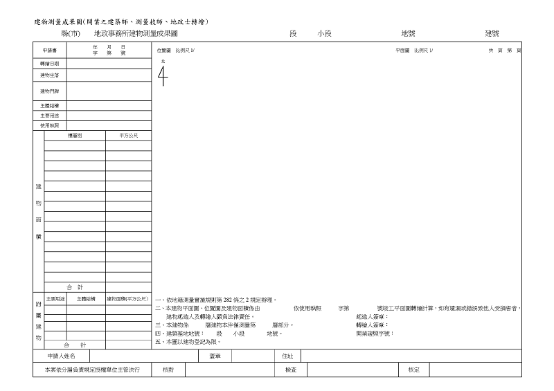

## 816. 信託關係消滅
*發布日期: 2018-04-03* 

## 內文
先祝各位連假愉快，也提醒快考試的同學連假有時間要唸書囉！

今天專欄為考地政士的同學，整理信託法有關「信託關係消滅」之概念：

信託關係之消滅，係指以信託財產為中心之持續性信託法律關係，喪失其存續之根據，而向將來消滅。其包含以下幾種情況：

• (一) 信託行為所定事由發生

信託關係，因信託行為所定事由發生，或因信託目的已完成或不能完成而消滅(信§62)。按信託之成立既由委託人以信託行為訂定，則其所定消滅事由發生或所定目的確定完成或不能完成時，該信託之存續即失其根據而不能不告終結。信託行為所定事由發生，包含：

1. 經一定存續期間：超過信託存續期間，信託關係即為消滅。如委託人甲與受託人乙約定，20年後即移轉該信託不動產予丙，今20年期滿，即屬信託行為所定事由發生，其信託關係消滅。

2. 某種解除條件發生：如甲乙約定受益人丙結婚後，即將該不動產處分予丙，完成權利歸屬，信託關係消滅。

• (二) 信託目的已完成或不能完成

根據信託法第62條，信託關係，因信託行為所定事由發生，或因信託目的已完成或不能完成而消滅。

1. 信託目的已完成：如信託目的為管理處分（出售）信託土地及建物所有權，今受託人依該目的完成信託財產之出售，而該信託關係消滅。

2. 信託目的不能完成：如信託財產被徵收、信託房屋被燒毀，或受益人拋棄受益權等。

• (三) 自益信託由委託人或其繼承人終止信託

信託利益全部由委託人享有者，委託人或其繼承人得隨時終止信託(信§63)。

• (四) 他益信託由委託人及受益人共同終止信託

信託利益非由委託人全部享有者，除信託行為另有訂定外，委託人及受益人得隨時共同終止信託(信§64)。

• (五) 信託行為明訂信託關係因受託人死亡或公司解散而消滅

信託關係不因委託人或受託人死亡、破產或喪失行為能力而消滅。但信託行為另有訂定者，不在此限(信§8I)。委託人或受託人為法人時，因解散或撤銷設立登記而消滅者，適用前項之規定(信§8II)。因此，信託行為如另有訂定受託人死亡、破產或喪失行為能力，抑或法人解散或撤銷設立登記時消滅，即所其約定。
---
*注：本文圖片存放於 ./images/ 目錄下*

## 817. 自辦市地重劃有關發起人申請核定成立籌備會之要件
*發布日期: 2018-04-03* 

## 內文
司法院於民國105年7月29日公布釋字第739號解釋，針對「獎勵土地所有權人辦理市地重劃辦法」部分條文宣告違憲。內政部遂於民國106年7月27日修正該辦法，其中有關發起人申請核定成立籌備會之要件說明如下：

• (一) 修正前之獎勵土地所有權人辦理市地重劃辦法第8條第1項前段規定：自辦市地重劃應由土地所有權人過半數或七人以上發起成立籌備會，並由發起人檢附範圍圖及發起人所有區內土地所有權狀影本，向直轄市或縣(市)主管機關申請核定。

• (二) 司法院釋字第739號部分解釋文：獎勵土地所有權人辦理市地重劃辦法第八條第一項發起人申請核定成立籌備會之要件，未就發起人於擬辦重劃範圍內所有土地面積之總和應占擬辦重劃範圍內土地總面積比率為規定；於以土地所有權人七人以上為發起人時，復未就該人數與所有擬辦重劃範圍內土地所有權人總數之比率為規定，與憲法要求之正當行政程序不符。

• (三) 修正後之獎勵土地所有權人辦理市地重劃辦法第8條第2項規定：發起成立籌備會，應以發起人人數逾擬辦重劃範圍土地所有權人總數十分之三，及其於該範圍所有土地面積合計逾該範圍土地總面積十分之三之同意行之。

附帶一提的是，司法院釋字第739號解釋文提及：「平均地權條例第五十八條第三項規定，尚難遽謂違反比例原則、平等原則。」亦即平均地權條例第58條第3項規定：「重劃會辦理市地重劃時，應由重劃區內私有土地所有權人半數以上，而其所有土地面積超過重劃區私有土地總面積半數以上者之同意，並經主管機關核准後實施之。」未違憲。
---
*注：本文圖片存放於 ./images/ 目錄下*

## 818. 洗錢防制
*發布日期: 2018-03-29* 

## 內文
因地政士考試日期將近，今日專欄特別針對考地政士與不動產經紀人有關的「地政士及不動產經紀業防制洗錢辦法」進行重點提醒。尤其，地政士考生要注意考在地政士法題目中。

為強化我國公、私部門防制洗錢相關作為，洗錢防制法於105年12月28日修正公布，106年6月28日施行，依規定地政士及不動產經紀業從事與不動產買賣交易有關行為時，為該法指定之非金融事業或人員，應依規定確認及留存客戶身分資料、加強客戶審查、留存交易紀錄、向法務部調查局申報疑似犯洗錢行為，或收受、持有或使用之財物或財產上利益之罪之交易。因此，為落實地政士及不動產經紀業防制洗錢相關作為，內政部爰依該法授權規定，訂定「地政士及不動產經紀業防制洗錢辦法」，法條共計10條。茲提醒考試重點如下：

• 一、防制工作

地政士及不動產經紀業從事與不動產買賣交易有關之行為時，應依本辦法規定確認及審查買賣交易當事人（以下簡稱客戶）身分，留存客戶身分資料及必要之交易紀錄，於發現疑似洗錢交易情事應向法務部調查局申報。也就是包含三項重要工作：確認及審查身分→留存身分資料及交易紀錄→申報疑似洗錢交易

• 二、低風險客戶：免加強身分審查

經風險評估屬低度洗錢或資恐風險者，免依規定審查實質受益人及加強重要政治性職務人士之審查：

1. 客戶為自然人，已提供資金來源證明。

2. 申請政府機關提供之首次購屋或相關優惠購屋貸款。

3. 依法向政府機關申請優先承購或讓售公有不動產。

4. 僅購買價格合於市場行情之一戶（棟）房地或一筆土地，且經向我國境內金融機構申請貸款支付各期款項或以價金信託專戶收付款項。但以分別訂立契約或分次購買方式進行買賣交易者，不適用之。

5. 抵押權人承受債務人提供擔保之不動產。

• 三、高風險客戶：主動申報

地政士及不動產經紀業從事與不動產買賣交易有關之行為時，發現下列各款情事之一者，應向法務部調查局申報：

1. 客戶屬法務部依資恐防制法規定公告制裁名單，或其他國家、國際組織認定或追查，與恐怖主義或恐怖活動有關之個人、法人或團體。

2. 交易金額源自於國際防制洗錢組織所公告防制洗錢及打擊資恐有嚴重缺失，或其他未遵循、未充分遵循國際防制洗錢組織建議之國家或地區，或支付予該國家或地區之帳戶或人員，且疑似與恐怖活動、恐怖組織或資恐有關聯。

3. 客戶拒絕或無故拖延提供相關身分資料、使用假名、假冒他人名義或偽變造身分證件。

4. 交易金額與客戶年齡、身分或收入顯不相當，或以現鈔支付定金以外各期價款，且無合理說明資金來源。

5. 客戶要求將不動產權利登記予第三人，未能提出任何關聯或拒絕說明。

6. 不動產成交價格明顯高於市場行情且要求在相關契約文件以較低價記錄。

7. 其他疑似洗錢交易或資恐情事。

• 四、留存交易記錄

地政士及不動產經紀業從事與不動產買賣交易有關之行為時，應留存下列交易紀錄。但交易案件確無該交易紀錄者，不在此限：

地政士：

1. 不動產買賣契約書。

2. 定金及價款收支證明文件。

3. 交易帳戶號碼。

4. 簽證文件。

5. 受託事項往來文件。

不動產經紀業：

1. 不動產委託銷售契約書。

2. 不動產買賣契約書。

3. 要約書。

4. 斡旋金、定金及價款收支證明文件。

5. 交易帳戶號碼。

6. 受託事項往來文件。

前項交易紀錄得以專卷檔案或電子檔案方式留存，其保存期間自交易完成時起，至少五年。但其他法律有規定較長保存期間者，從其規定。
---
*注：本文圖片存放於 ./images/ 目錄下*

## 819. 從新聞事件學習土地法第25條及第26條
*發布日期: 2018-03-29* 

## 內文
台北市政府規劃將立法院市有地與中央的南港瓶蓋工廠用地進行交換，以利南港瓶蓋工廠開闢為文創園區，而立法院則可免繳每年五千一百萬元租金給台北市政府。按換地案屬於處分行為，故依土地法第25條規定，應經台北市議會同意及行政院核准。惟台北市議會以拿蛋黃區土地換蛋白區土地，表決不通過。

台北市政府於換地案闖關失敗後，改採互相撥用，即台北市政府將立法院市有地無償撥用給立法院，中央則將南港瓶蓋工廠用地無償撥用給台北市政府，二塊地互相撥用的結果，雙方各自取得使用權，但所有權未變更。按撥用不適用土地法第25條，而是適用土地法第26條。依土地法第26條規定，台北市政府進行撥用，僅須報請行政院核准，無須經台北市議會之同意。因此，台北市議會無從反對，無法阻擋。

總之，換地案與撥用案所適用之法律不同。前者適用土地法第25條，須經該管民意機關同意及行政院核准；後者適用土地法第26條，僅須行政院核准，無須經該管民意機關同意。另，附帶一提的是，土地法第25條之處分，不包括撥用。
---
*注：本文圖片存放於 ./images/ 目錄下*

## 820. 政府徵收人民之土地不宜將其出售為私人所有
*發布日期: 2018-03-22* 

## 內文
政府以公益之名徵收人民之土地，不宜再以促進土地資源利用或籌措建設經費為由，出售於私人。其理由（參照司法院釋字第743號解釋理由書）如下：

• (一) 政府機關按相關法律徵收人民土地，雖因而取得土地所有權人之地位，然其與一般土地所有權人得自由使用、收益、處分及行使其他土地權利者並不全然相同。

• (二) 政府機關為公用或公益之目的而以徵收方式剝奪人民財產權後，如續將原屬人民之財產移轉為第三人所有，易使徵收權力濫用及使人民產生圖利特定第三人之疑慮。

倘政府機關使用多年後，如因情事變更，依當時相關法律規定，將其出售於第三人，情有可原，另當別論。

以上論點乃司法院釋字第743號解釋之啟示。只可惜該解釋僅規範一般徵收，而未及於區段徵收。土地徵收條例第44條第1項第5款規定，經區段徵收之可供建築土地得予標售。此促使區段徵收漸失公益本質，而蒙上濃厚商業氣息；此亦誘使區段徵收滋生「浮濫徵收」與「圖利私人」之弊端。
---
*注：本文圖片存放於 ./images/ 目錄下*

## 821. 優先購買權之要件整理
*發布日期: 2018-03-22* 

## 內文
各位同學好

今日專欄整理土地法第34條之1與第104條之要件，一定要好好背起來，另外針對各項內容則請參考講義。

• T. ABLE_PLACEHOLDER_1
---
*注：本文圖片存放於 ./images/ 目錄下*

## 822. 房地合一所得稅對繼承或贈與取得者不友善
*發布日期: 2018-03-15* 

## 內文
若採繼承或贈與方式將不動產移轉於子女，遺產稅及贈與稅之核算，土地以公告土地現值為準，房屋以房屋評定現值為準，故具有節稅效果。然子女日後出售該房地時，房地合一所得稅之前次成本不以繼承或贈與前之原始取得成本，而以繼承或贈與時之公告土地現值及房屋評定現值，致房地合一所得稅增加。總之，就節稅觀點，採繼承或贈與方式將不動產移轉於子女，如單看遺產稅或贈與稅是有利的；但如加入房地合一所得稅綜合考量，就不見得有利。

例如：甲於105年2月15日買入一棟房地，買入價格1,000萬元。甲於106年2月15日贈於其子乙，贈與時之公告土地現值及房屋評定現值之合計為500萬元。乙於107年2月15日出售於第三人丙，出售價格1,200萬元（設物價指數為100%，且不考慮因取得、改良與移轉而支付之費用及土地漲價總數額）。就一般人的想法，本棟房地之交易所得為200萬元（即1,200－1,000＝200萬元）；但就房地合一所得稅之課徵規定，本棟房地之交易所得為700萬元（即1,200－500＝700萬元）。

唯獨例外的是，配偶相互贈與取得者，得以配偶第一次相互贈與前之原始取得成本為準。

另，房地合一所得稅之持有期間影響適用稅率高低。繼承或受遺贈者，得將被繼承人或遺贈人持有期間合併計算。唯獨贈與者，不得將贈與人持有期間合併計算。但配偶贈與者，得將配偶持有期間合併計算。
---
*注：本文圖片存放於 ./images/ 目錄下*

## 823. 107年1月地政士法修正
*發布日期: 2018-03-15* 

## 內文
各位同學好

地政士證照考試六月初就要上場了，而考試同學注意，今(107)年1月地政士法針對第11條有修正，故本期專欄特別提醒本次修法重點。

原先地政士法第11條規定，地政士不發給、撤銷或廢止開業執照之情形，共有4種，包含經撤銷或廢止地政士證書、經認定罹患精神疾病或身心狀況違常、受監護或輔助宣告尚未撤銷、受破產宣告尚未復權等。

而考量因精神疾病之範圍廣泛，對於如囤積症（例如捨不得丟棄舊物、過度性地收購或收集物件）或是僅限於表演時的社交焦慮症（例如發表演說之前非常緊張）等病症也視為精神疾病。但有此精神疾病及身心障礙是否影響當事人作為地政士之表現與專業，並無直接關係。因此，並不適宜以罹患精神疾病或身心狀況違常之情事來概括當事人不具備可勝任工作的專業技能。此外，若地政士之身心狀況已達無法執業之情形，受監護或輔助宣告已足以作為限制其執業之依據。

綜上，記得今年修法已刪除經認定罹患精神疾病或身心狀況違常之情形，之前有背過的同學記得改過來！
---
*注：本文圖片存放於 ./images/ 目錄下*

## 824. 土地法第34條之1實例研習
*發布日期: 2018-03-08* 

## 內文
甲、乙、丙三人共有一筆土地，每人持分相等。僅甲、乙二人同意遂將該土地依土地法第34條之1出售於A、B、C、D四人共有，試問此處分是否可行？又，甲、乙、丙三人全體同意將該土地出售於A、B、C、D四人共有，試問此處分是否可行？

【解答】

• (一) 該土地原為三人共有，依土地法第34條之1規定出售於四人共有。共有人數未減少，反而增加，違反土地法第34條之1之立法意旨(即減少共有人數)，故其處分不可行。

• (二) 該土地原為三人共有，經全體共有人同意而非依土地法第34條之1規定，將該土地出售於四人共有，因此不受土地法第34條之1之立法意旨的拘束，故其處分可行。

好書報報～許文昌主編土地法規(小法典)第七版新鮮問世！

土地法規屬於經濟社會立法。由於經濟社會變動快速，土地法規因而變動頻繁，致本書每次改版增刪幅度頗大。

本次改版，除更新原法規及添加新試題外，另增加建物所有權第一次登記法令補充規定、國土計畫法施行細則、都市危險及老舊建築物加速重建條例、租賃住宅市場發展及管理條例等新法規，俾本書更加充實而完整。每經一次改版，本書內容就向前邁進一步。追求完美，止於至善。

值得一提的是，司法院大法官解釋(不動產部分)逐號析論，坊間難得一見。

本書由元照出版公司發行
---
*注：本文圖片存放於 ./images/ 目錄下*

## 825. 土地法34-1事實上處分
*發布日期: 2018-03-08* 

## 內文
各位同學好今日專欄特別再針對106年底所修正之土地法34-1執行要點再作一些補充說明。尤其今年或明年考試的同學一定要特別注意喔！

其中，第三點規定本法條第一項所定處分，以有償讓與為限，不包括信託行為及共有物分割；所定變更，以有償或不影響不同意共有人之利益為限；所定設定地上權、農育權、不動產役權或典權，以有償為限。

亦即當共有人多數決處分、變更、設定(地、育、不、典)整筆土地時，必須以有償為限，為什麼呢？當然是因為多數決會損及少數共有人利益，而必須要保障少數共有人能得到應有之對價。

而當中特別注意，在修正本次要點前，本多解釋認為土34-1所指處分包含事實上處分及法律上處分，惟本次修正之後，已特別排除事實上處分，係因事實上之處分行為，恆使共有不動產歸於消滅，且以無償為常，對不同意之共有人無補償之道。

上述立法理由特別請同學注意，並且背熟！
---
*注：本文圖片存放於 ./images/ 目錄下*

## 826. 房屋自住用判定
*發布日期: 2018-03-01* 

## 內文
各位同學好

台北與台中班土地法規都已經開課，有需要同學趕緊來上課囉！

今日專欄主要從不動產最新新聞來複習一些重要觀念。請各位同學先讀下面這篇新聞：新屋自用 卻被課非自住用稅率？【原文轉自：信義房屋】

根據「房屋稅條例」第5條規定，供自住或公益出租人出租使用者，為其房屋現值百分之一點二。而根據「住家用房屋供自住及公益出租人出租使用認定標準」第2條規定，個人所有之住家用房屋符合下列情形者，屬供自住使用：一、房屋無出租使用。二、供本人、配偶或直系親屬實際居住使用。三、本人、配偶及未成年子女全國合計三戶以內。

主要同學要瞭解一下，為何要規定為3戶以內呢？記得把以下理由記起來後，作為考試時回答的內容，分數將會比只背法條高喔！

自住房屋訂為全國合計3戶以內，係衡平考量個人所有住家用房屋供直系尊(卑)親屬居住使用屬社會常態，或夫妻因工作或子女就學等因素有分住二處之需要等情事，是類房屋應認屬自住使用房屋，又為避免有心人士規避稅負及影響地方財政，爰明定本人、配偶及未成年子女所有屬自住之房屋，全國以3戶為限，以符合量能課稅並落實居住正義。

老師小叮嚀

在2018的新年期間，先祝各位同學考運亨通，有狗旺！

接下來我在4月底將開始上土地政策（含利用）之課程，這門考科一直是許多同學頭痛的科目，大部分同學多認為毫無邊際、漫無頭緒，而我將以架構性的方式分門別類進行講解，也會搭配許多口訣讓同學背誦，讓同學在準備考試時有一個明確的方向！

歡迎要準備考試的同學來聽，相信會對同學有不錯之幫助！
---
*注：本文圖片存放於 ./images/ 目錄下*

## 827. 重複課稅之扣除與扣抵
*發布日期: 2018-03-01* 

## 內文
重複課稅，等同一頭牛剝了兩次皮，對納方而言，非常不公平，故稅制規劃上應儘量避免。如果二種稅目，發生重複課稅情形，可以將先發生之稅目於後發生稅目之「稅基」中減去，稱為扣除；也可以將先發生稅目於後發生稅目之「稅額」中減去，稱為扣抵。

扣除或扣抵之方法有四：

• (一) 稅基扣除稅基：將先發生稅目之稅基於後發生稅目之稅基中扣除。例如：土地增值稅與房地合一所得稅皆對不動產資本利得課稅，恐有重複課稅。先課徵土地增值稅，再課徵房地合一所得稅，故將土地增值稅之土地漲價總數額(即土地增值稅之稅基)，於房地合一所得稅之稅基(即房地交易所得)中扣除。房地交易所得＝交易成交價額－原始取得成本－支付必要費用－土地漲價總數額

• (二) 稅額扣抵稅額：將先發生稅目之稅額於後發生稅目之稅額中扣抵。例如：土地增值稅與因重新規定地價所增繳之地價稅皆對地價增漲部分課稅，恐有重複課稅。先課徵地價稅，再課徵土地增值稅，故將因重新規定地價所增繳之地價稅，於土地增值稅之稅額中扣抵(土地稅法第31條第3項稱此種情形為抵繳)。

• (三) 稅基扣抵稅額：將先發生稅目之稅基於後發生稅目之稅額中扣抵。此種扣抵對納方有利，但對徵方不利。實務上少見。

• (四) 稅額扣除稅基：將先發生稅目之稅額於後發生稅目之稅基中扣除。此種扣除對納方不利，但對徵方有利。例如：工程受益費雖稱為「費」，但其性質為「稅」，類似土地增值稅；惟現行稅法未於土地增值稅之稅額中扣抵，而於土地增值稅之稅基中扣除。土地增值稅之稅基為土地漲價總數額，其公式如下：土地漲價總數額＝申報土地移轉現值－原規定地價或前次移轉時所申報之土地移轉現值×(台灣地區消費者物價總指數÷100)－(改良土地費用＋工程受益費＋土地重劃負擔總費用＋因土地使用變更而無償捐贈作為公共設施用地其捐贈土地之公告現值總額)

稅基扣除與稅額扣抵對納稅義務人之影響不同。茲舉一例說明，設未考慮工程受益費之土地漲價總數額100萬元，工程受益費5萬元，土地增值稅率20%，則採稅基扣除，納稅義務人應繳稅額19萬元；如採稅額扣抵，納稅義務人應繳稅額15萬元。1.稅基扣除：(100－5)×20%＝192.稅額扣抵：100×20%－5＝15

綜上，四種扣除或扣抵方法中，「稅基扣除稅基」與「稅額扣抵稅額」二種符合公平原則；「稅基扣抵稅額」與「稅額扣除稅基」二種不符合公平原則。
---
*注：本文圖片存放於 ./images/ 目錄下*

## 828. 土地增值稅抵繳之檢討
*發布日期: 2018-02-22* 

## 內文
土地稅法第31條第3項規定，土地所有權人辦理土地移轉繳納土地增值稅時，在其持有土地期間內，因重新規定地價增繳之地價稅，就其移轉土地部分，准予抵繳其應納之土地增值稅。但准予抵繳之總額，以不超過土地移轉時應繳增值稅總額百分之五為限。

地價稅屬於持有稅，土地增值稅屬於移轉稅，二者性質迥然不同，何以有「抵繳」規定？孫中山先生之平均地權，主張規定地價後永以為定，規定地價以前之既有地價屬於地主私有財產，政府予以照價徵稅（即現行之地價稅）；規定地價以後之漲價（即土地自然增值）屬於公有財產，政府予以漲價歸公（即現行之土地增值稅）。準此，地價永以為定，地價稅與土地增值稅之課徵標的涇渭分明，不會重複。惟現行採重新規定地價，並非地價永以為定，地價稅與土地增值稅之課徵標的恐重疊，而發生重複課稅，故重新規定地價所增繳之地價稅准予抵繳土地增值稅。

殊不知規定地價後，政府不斷增加公共建設，因而地主享有公共設施效益不斷增加，故採重新規定地價，俾隨公共設施增加，以提高地價稅負擔，始符合受益者負擔原則。因此，現行土地增值稅抵繳規定，實屬多餘。
---
*注：本文圖片存放於 ./images/ 目錄下*

## 829. 消滅時效問題
*發布日期: 2018-02-15* 

## 內文
各位同學好

新年快到了，先祝各位同學新年快樂！準備考試的同學好好過個年，放鬆一下，年後再繼續衝刺！接下來將有一系列的總複習課程喔！

今日專欄主要幫各位同學整理有關消滅時效之比較題型

土地浮覆之所有權回復請求權 v.s. 已登記不動產之回復請求權

• T. ABLE_PLACEHOLDER_1
---
*注：本文圖片存放於 ./images/ 目錄下*

## 830. 行政法-信賴保護原則
*發布日期: 2018-02-08* 

## 內文
各位同學好

由於土地法亦屬公法，而自大法官釋字709號解釋後，正當行政程序越來越受到重視，故民眾權益保障及有關行政法相關概念，認為會是將來考試的趨勢。因此，今日專欄跟各位同學說明一下行政法當中一個重要原則：「信賴保護原則」（此原則可應用於105年地特四等有關國土計畫法第32條之國家責任法理之回答）

所謂「信賴保護原則」，係人民對公權力行使結果所生之合理信賴，法律自應予以適當保障。信賴利益保護基本上源於憲法保障人民對「法安定性的信賴」及憲法對「財產權保障」之規定。因此，依據行政程序法第8條規定，行政行為，應以誠實信用之方法為之，並應保護人民正當合理之信賴。

根據釋字§525、589：受規範對象須已在因法規施行而產生信賴基礎之存續期間，對構成信賴要件之事實，有客觀上具體表現之行為，始受信賴之保護。因此，信賴保護包括三個要件：

1. 信賴基礎：國家對外所有行為均得為人民之信賴基礎，包含行政、立法、司法積極表現在外之作為。

2. 信賴表現：基於對公權力之信任而積極為日常生活安排與財產運用。表現行為與信賴基礎兩者間有客觀因果關係。

3. 信賴值得保護：原則上，人民信賴均值得保護，除非有行政程序法§119所列舉之情事，如詐欺、脅迫或賄賂。

信賴保護的法律效果：

1. 行政處分：包含「存續保障」與「價值保障」。A.存續保障：信賴利益顯然大於所欲維護之公益，行政處分繼續存在(行程§117、§123)。B.價值保障：信賴利益未顯然大於所欲維護之公益，則撤銷或廢止行政處分，對受益人因信賴該處分致遭受財產上之損失，應給予合理之補償(行程§120、§126)。

2. 法規變更：行政法規公布施行後，制定或發布法規之機關依法定程序予以修改或廢止時，應兼顧規範對象信賴利益之保護。除法規預先定有施行期間或因情事變遷而停止適用，不生信賴保護問題外，其因公益之必要廢止法規或修改內容致人民客觀上具體表現其因信賴而生之實體法上利益受損害，應採取合理之補救措施，或訂定過渡期間之條款，俾減輕損害，方符憲法保障人民權利之意旨(釋字§525)。
---
*注：本文圖片存放於 ./images/ 目錄下*

## 831. 不課徵土地增值稅對納稅義務人之影響
*發布日期: 2018-02-08* 

## 內文
• (一) 就政府而言：不課徵土地增值稅之效果，屬於租稅遞延性質。現在移轉暫時不課，日後移轉時再予課徵，故土地增值稅收延緩入帳。

• (二) 就納稅義務人而言：不課徵土地增值稅之效果，有的屬於租稅免除性質，有的屬於租稅遞延性質。

1. 租稅免除性質：不課徵土地增值稅，現在移轉之納稅義務人與日後移轉之納稅義務人非同夥，故對現在移轉之納稅義務人不課徵土地增值稅，等同免徵其土地增值稅。例如：農業用地移轉與自然人，不課徵土地增值稅；公共設施保留地尚未徵收前之移轉，免徵土地增值稅，日後經變更為非公共設施保留地後再移轉，以該土地第一次免徵土地增值稅之原地價，計算漲價總數額，課徵土地增值稅。二例皆屬租稅免除性質。

2. 租稅遞延性質：不課徵土地增值稅，現在移轉之納稅義務人與日後移轉之納稅義務人係同夥，故對現在移轉之納稅義務人不課徵土地增值稅，而由日後移轉之納稅義務人繳納土地增值稅，除租稅延緩繳納外，尚發生下列兩項效果：(1)租稅延後繳納，可以節省納稅義務人之利息支出。(2)租稅遞延，原地價未更動，累進稅效果繼續發揮作用。如果原地價低，漲價倍數高，以後所繳納之土地增值稅恐更多。由此可知，上開第(1)點對納稅義務人有利，第(2)點對納稅義務人不利。例如：配偶相互贈與之土地，不課徵土地增值稅；信託關係人間移轉所有權，不課徵土地增值稅。二例皆屬租稅遞延性質。

• N. EW~高考級的不動產估價於2月4日開課囉！

（一）本課程較有深度，故僅限參加不動產估價師及地政高考同學參加。（二）本課程採財務分析，故學生須先熟練財務數學的六個公式。（三）本課程以不動產估價理論為主，詳細證明或說明所有估價公式來源，並適時加入不動產估價實務應用，俾學以致用。
---
*注：本文圖片存放於 ./images/ 目錄下*

## 832. 都市計畫公共設施保留地檢討變更作業原則
*發布日期: 2018-02-01* 

## 內文
各位同學好

土地利用概要、土地政策、土地利用法規參考！

今日專欄來談「公共設施保留地檢討變更」，也就是俗稱的公共設施用地「解編」，目前實務執行主要依據為「都市計畫公共設施保留地檢討變更作業原則」（內政部102.11.29台內營字第10203489291號函）

各位同學需要瞭解及準備的有以下幾個問題：

• (一) 為何要將公保地檢討變更？(二)公保地如何檢討變更？(三)公保地檢討變更後有何影響？

參考回答方向與方式：

• (一) 為何？

• A. NS：

1. 侵害人民財產權之疑慮（最重要！！）：各級都市計畫權責機關任令部分都市計畫公共設施保留地長達3、40年迄未取得，嚴重傷害憲法保障人民之生存權與財產權。尤其，都市計畫編定公共設施用地，最長應於25年內完成，逾25年仍未取得開發之公共設施用地，理應限期檢討，對不必要的部分應儘速解編，如逾3、40年仍不取得使用，更表示已無公共設施用地保留之必要。

2. 人口成長逐年遞減卻未核實調整計畫人口：近年來臺灣地區人口成長，雖已呈現出遞減之趨勢，惟調降計畫人口數恐將影響部分土地使用分區之劃設，將連帶影響民眾之居住財產、權益等，各都市計畫擬定機關往往囿於上述因素考量，於都市計畫辦理通盤檢討時，仍維持原規劃容納人口方式檢討，而不予調降計畫人口，以致無法據以核實檢討公共設施用地之實際需求。

3. 人口結構改變而須因應調整公共設施類型：面臨人口結構朝向高齡化、少子女化現象，都市計畫公共設施宜因應社會發展轉型調整使用型態，以符合社會發展所需。

4. 促使有限土地資源合理利用：基於台灣土地資源有限，以及前述人口成長及型態的轉變，如有不符需求或低度使用之公共設施保留地，理應予以檢討及變更，以達到地盡其利、地利共享之目標。

• (二) 如何？

• A. NS：

1. 檢討構想依都市計畫公共設施保留地檢討變更作業原則，其檢討構想有以下四點：(1)應維護公共維生、都市防災、環境品質等之公共設施用地服務品質(2)因應高齡少子女化社會發展需要，優先檢討調整高齡化社會發展之社會福利設施需求。(3)核實檢討總人口成長需求。(4)以生活圈模式檢討公共設施用地，取消功能重疊之公共設施。

2. 變更方式： (1)整體開發（檢討變更為可建築土地與仍維持公共設施用地併同辦理跨區市地重劃） (2)變更恢復原分區、同性質分區、農業區或保護區(3)其他（租用、鼓勵民間自行整合開發、指定都市更新地區）

• (三) 影響？

• A. NS：

1. 對周邊居民之影響：公共服務水準、居住環境品質降低之疑慮。參考新聞：居民不滿公園變建地 中市：專案檢討後綠地更多（2017.12）【原文轉自：自由時報】中市公園綠地解編　議員籲綠地保留給市民（2017.12）【原文轉自：今日新聞】公設地解編 市府：地主估分回5成5（2017.11）【原文轉自：自由時報】

2. 對土地所有權人之影響：雖得以保障土地所有權人之財產權，惟整體開發方式卻限制僅能領回50%，似乎有保障不足及不公平之疑慮。經檢討不必要之公共設施用地變更為住宅區、商業區或其他使用分區之土地，併同檢討後仍保留為公共設施用地之土地，以政府公辦整體開發方式取得興闢仍有需要之公共設施用地。根據該要點規定：以政府公辦方式辦理整體開發，並為落實受益者負擔之精神、公平負擔開發後之公共設施用地，跨區整體開發後土地所有權人領回之可建築用地以50%為上限。實際開發後領回之抵價地比例或重劃負擔比例應依中央主管機關核定之比例為準。（此部分為具有爭議的地方！因為所有權人被限制3.40年後，卻只能領回50%土地？）參考新聞：公設保留地大檢討　原受害地主：二度傷害（2017.12）【原文轉自：蘋果地產】

-------------------------------------------------------

土地法規實例研習,許文昌老師

• A. 鄉公所在甲之土地上鋪設柏油路面供民眾通行，甲遂依民法第767條第1項請求A鄉公所刨除柏油路面並返還土地。於訴訟過程中，兩造攻防方法涉及公用地役關係存在與否之公法關係爭議，試問爭訟應由普通法院審判，抑或由行政法院審判？又，既成道路成立公用地役關係之條件為何？既成道路成立公用地役關係是否仍須辦理徵收補償？甲可否依司法院釋字第400號解釋向A鄉公所請求徵收？試依司法院釋字第400號及第758號解釋意旨說明之。

﹝解答﹞

• (一) 依據司法院釋字第758號解釋意旨，A鄉公所在甲之土地上鋪設柏油路面供民眾通行，甲依民法第767條第1項請求A鄉公所刨除柏油路面並返還土地，核屬私權性質，故應由普通法院審判。至於訴訟過程中，縱兩造攻擊防禦方法涉及公用地役關係存在與否之公法關係爭議，亦不受影響。

• (二) 公用地役關係乃私有土地而具有公共用物性質之法律關係。既成道路成立公用地役關係之條件有三：

1. 不特定之公眾通行所必要，而非僅為通行之便利或省時。

2. 於公眾通行之初，土地所有權人並無阻止之情事。

3. 須經歷之年代久遠而未曾中斷，所謂年代久遠雖不必限定其期間，但仍應以時日長久，一般人無復記憶其確實之起始，僅能知其梗概（例如始於日據時期、八七水災等）為必要。

• (三) 依據司法院釋字第400號解釋意旨，既成道路符合一定要件而成立公用地役關係者，其所有權人對土地既已無從自由使用收益，形成因公益而特別犧牲其財產上之利益，國家自應依法律之規定辦理徵收給予補償。各級政府如因經費困難，不能對上述道路全面徵收補償，有關機關亦應訂定期限籌措財源逐年辦理或以他法補償。若在某一道路範圍內之私有土地均辦理徵收，僅因既成道路有公用地役關係而以命令規定繼續使用，毋庸同時徵收補償，顯與平等原則相違。

• (四) 甲不得依司法院釋字第400號解釋向A鄉公所請求徵收。其理由如下：

1. 釋字第400號解釋：「……，國家自應依法律之規定辦理徵收給予補償，……」，亦即國家應制定法律，並依法律規定給予補償，並非謂國家應依本解釋辦理徵收給予補償。

2. 釋字第400號解釋：「……，各級政府如因經費困難，不能對上述道路全面徵收補償，有關機關亦應訂定期限籌措財源逐年辦理或以他法補償。……」，足以說明該解釋係為國家立法及施政之方針，並非可作為向國家請求財產上給付之公法上原因。
-------------------------------------------------------

土地法規實例研習,許文昌老師

• A. 鄉公所在甲之土地上鋪設柏油路面供民眾通行，甲遂依民法第767條第1項請求A鄉公所刨除柏油路面並返還土地。於訴訟過程中，兩造攻防方法涉及公用地役關係存在與否之公法關係爭議，試問爭訟應由普通法院審判，抑或由行政法院審判？又，既成道路成立公用地役關係之條件為何？既成道路成立公用地役關係是否仍須辦理徵收補償？甲可否依司法院釋字第400號解釋向A鄉公所請求徵收？試依司法院釋字第400號及第758號解釋意旨說明之。

﹝解答﹞

• (一) 依據司法院釋字第758號解釋意旨，A鄉公所在甲之土地上鋪設柏油路面供民眾通行，甲依民法第767條第1項請求A鄉公所刨除柏油路面並返還土地，核屬私權性質，故應由普通法院審判。至於訴訟過程中，縱兩造攻擊防禦方法涉及公用地役關係存在與否之公法關係爭議，亦不受影響。

• (二) 公用地役關係乃私有土地而具有公共用物性質之法律關係。既成道路成立公用地役關係之條件有三：

1. 不特定之公眾通行所必要，而非僅為通行之便利或省時。

2. 於公眾通行之初，土地所有權人並無阻止之情事。

3. 須經歷之年代久遠而未曾中斷，所謂年代久遠雖不必限定其期間，但仍應以時日長久，一般人無復記憶其確實之起始，僅能知其梗概（例如始於日據時期、八七水災等）為必要。

• (三) 依據司法院釋字第400號解釋意旨，既成道路符合一定要件而成立公用地役關係者，其所有權人對土地既已無從自由使用收益，形成因公益而特別犧牲其財產上之利益，國家自應依法律之規定辦理徵收給予補償。各級政府如因經費困難，不能對上述道路全面徵收補償，有關機關亦應訂定期限籌措財源逐年辦理或以他法補償。若在某一道路範圍內之私有土地均辦理徵收，僅因既成道路有公用地役關係而以命令規定繼續使用，毋庸同時徵收補償，顯與平等原則相違。

• (四) 甲不得依司法院釋字第400號解釋向A鄉公所請求徵收。其理由如下：

1. 釋字第400號解釋：「……，國家自應依法律之規定辦理徵收給予補償，……」，亦即國家應制定法律，並依法律規定給予補償，並非謂國家應依本解釋辦理徵收給予補償。

2. 釋字第400號解釋：「……，各級政府如因經費困難，不能對上述道路全面徵收補償，有關機關亦應訂定期限籌措財源逐年辦理或以他法補償。……」，足以說明該解釋係為國家立法及施政之方針，並非可作為向國家請求財產上給付之公法上原因。
-------------------------------------------------------

土地法規實例研習,許文昌老師

A鄉公所在甲之土地上鋪設柏油路面供民眾通行，甲遂依民法第767條第1項請求A鄉公所刨除柏油路面並返還土地。於訴訟過程中，兩造攻防方法涉及公用地役關係存在與否之公法關係爭議，試問爭訟應由普通法院審判，抑或由行政法院審判？又，既成道路成立公用地役關係之條件為何？既成道路成立公用地役關係是否仍須辦理徵收補償？甲可否依司法院釋字第400號解釋向A鄉公所請求徵收？試依司法院釋字第400號及第758號解釋意旨說明之。

﹝解答﹞

(一)依據司法院釋字第758號解釋意旨，A鄉公所在甲之土地上鋪設柏油路面供民眾通行，甲依民法第767條第1項請求A鄉公所刨除柏油路面並返還土地，核屬私權性質，故應由普通法院審判。至於訴訟過程中，縱兩造攻擊防禦方法涉及公用地役關係存在與否之公法關係爭議，亦不受影響。

(二)公用地役關係乃私有土地而具有公共用物性質之法律關係。既成道路成立公用地役關係之條件有三：

1. 不特定之公眾通行所必要，而非僅為通行之便利或省時。

2. 於公眾通行之初，土地所有權人並無阻止之情事。

3. 須經歷之年代久遠而未曾中斷，所謂年代久遠雖不必限定其期間，但仍應以時日長久，一般人無復記憶其確實之起始，僅能知其梗概（例如始於日據時期、八七水災等）為必要。

(三)依據司法院釋字第400號解釋意旨，既成道路符合一定要件而成立公用地役關係者，其所有權人對土地既已無從自由使用收益，形成因公益而特別犧牲其財產上之利益，國家自應依法律之規定辦理徵收給予補償。各級政府如因經費困難，不能對上述道路全面徵收補償，有關機關亦應訂定期限籌措財源逐年辦理或以他法補償。若在某一道路範圍內之私有土地均辦理徵收，僅因既成道路有公用地役關係而以命令規定繼續使用，毋庸同時徵收補償，顯與平等原則相違。

(四)甲不得依司法院釋字第400號解釋向A鄉公所請求徵收。其理由如下：

1. 釋字第400號解釋：「……，國家自應依法律之規定辦理徵收給予補償，……」，亦即國家應制定法律，並依法律規定給予補償，並非謂國家應依本解釋辦理徵收給予補償。

2. 釋字第400號解釋：「……，各級政府如因經費困難，不能對上述道路全面徵收補償，有關機關亦應訂定期限籌措財源逐年辦理或以他法補償。……」，足以說明該解釋係為國家立法及施政之方針，並非可作為向國家請求財產上給付之公法上原因。

---
*注：本文圖片存放於 ./images/ 目錄下*

## 833. 土地法規實例研習
*發布日期: 2018-01-25* 

## 內文
• A. 鄉公所在甲之土地上鋪設柏油路面供民眾通行，甲遂依民法第767條第1項請求A鄉公所刨除柏油路面並返還土地。於訴訟過程中，兩造攻防方法涉及公用地役關係存在與否之公法關係爭議，試問爭訟應由普通法院審判，抑或由行政法院審判？又，既成道路成立公用地役關係之條件為何？既成道路成立公用地役關係是否仍須辦理徵收補償？甲可否依司法院釋字第400號解釋向A鄉公所請求徵收？試依司法院釋字第400號及第758號解釋意旨說明之。

﹝解答﹞

• (一) 依據司法院釋字第758號解釋意旨，A鄉公所在甲之土地上鋪設柏油路面供民眾通行，甲依民法第767條第1項請求A鄉公所刨除柏油路面並返還土地，核屬私權性質，故應由普通法院審判。至於訴訟過程中，縱兩造攻擊防禦方法涉及公用地役關係存在與否之公法關係爭議，亦不受影響。

• (二) 公用地役關係乃私有土地而具有公共用物性質之法律關係。既成道路成立公用地役關係之條件有三：

1. 不特定之公眾通行所必要，而非僅為通行之便利或省時。

2. 於公眾通行之初，土地所有權人並無阻止之情事。

3. 須經歷之年代久遠而未曾中斷，所謂年代久遠雖不必限定其期間，但仍應以時日長久，一般人無復記憶其確實之起始，僅能知其梗概（例如始於日據時期、八七水災等）為必要。

• (三) 依據司法院釋字第400號解釋意旨，既成道路符合一定要件而成立公用地役關係者，其所有權人對土地既已無從自由使用收益，形成因公益而特別犧牲其財產上之利益，國家自應依法律之規定辦理徵收給予補償。各級政府如因經費困難，不能對上述道路全面徵收補償，有關機關亦應訂定期限籌措財源逐年辦理或以他法補償。若在某一道路範圍內之私有土地均辦理徵收，僅因既成道路有公用地役關係而以命令規定繼續使用，毋庸同時徵收補償，顯與平等原則相違。

• (四) 甲不得依司法院釋字第400號解釋向A鄉公所請求徵收。其理由如下：

1. 釋字第400號解釋：「……，國家自應依法律之規定辦理徵收給予補償，……」，亦即國家應制定法律，並依法律規定給予補償，並非謂國家應依本解釋辦理徵收給予補償。

2. 釋字第400號解釋：「……，各級政府如因經費困難，不能對上述道路全面徵收補償，有關機關亦應訂定期限籌措財源逐年辦理或以他法補償。……」，足以說明該解釋係為國家立法及施政之方針，並非可作為向國家請求財產上給付之公法上原因。
---
*注：本文圖片存放於 ./images/ 目錄下*

## 834. 地政士法
*發布日期: 2018-01-25* 

## 內文
各位同學好今日專欄來針對地政士法做些補充。

首先，根據地政士法第49條「未依法取得地政士證書或地政士證書經撤銷或廢止，而擅自以地政士為業者，處新臺幣五萬元以上二十五萬元以下罰鍰。」另第50條也是針對該擅自以地政士為業者有相關處罰。

而實務上針對地政士法第49、50條所謂的「擅自以地政士為業」，則按內政部102年12月27日內授中辦地字第1026652564號令解釋如下：

• 一、土地法第37條之1第3項及地政士法第49條、第50條規定所稱「為業」者，指以反覆同種類之行為為目的，獲取報酬並藉以維生之義，尚難僅以固定之件數為認定標準（法務部83年3月19日法律決字第05573號函釋參照），故有關是否以地政士為業，登記機關應以事實認定為準。為兼顧法律規定及便利登記機關執行，除申請人舉證且經登記機關認其顯非以此為業外，如有下列情事之一者，應不予受理：

• (一) 同1年內於同一登記機關申請超過2件，或曾於同一登記機關申請超過5件。但其權利人及義務人與前案相同者，不在此限。

• (二) 經檢舉或相關機關（構）、團體通報並檢具具體事證（如是否設有執業處所、招牌、刊登廣告、印製名片或其他明顯事證等）。

• (三) 曾經直轄市、縣（市）主管機關依地政士法第49條或第50條規定處罰鍰。

• (四) 有其他具體事證足以認定擅自以地政士為業。
---
*注：本文圖片存放於 ./images/ 目錄下*

## 835. 虛坪制與實坪制
*發布日期: 2018-01-18* 

## 內文
房屋產權登記面積有三，即主建物面積、附屬建物面積及共有部分面積。共有部分面積習稱公共設施面積，包括：

1. 共同出入、休憩交誼區域，如走廊、樓梯、門廳、通道、昇降機間等。

2. 空調通風設施區域，如地下室機房、屋頂機房、冷氣機房、電梯機房等。

3. 法定防空避難室。

4. 法定停車空間（含車道及其必要空間）。

5. 給水排水區域，如水箱、蓄水池、水塔等。

6. 配電場所，如變電室、配電室、受電室等。

7. 管理委員會使用空間。

8. 其他經起造人或區分所有權人按其設置目的及使用性質約定為共有部分者。

我國現行採虛坪制，即主建物面積、附屬建物面積及共有部分面積三部分皆可登記，亦可計價。如採實坪制，則有二種方式，其一、共有部分面積可登記，但不可計價；其二、共有部分面積不可登記，亦不可計價。

• (一) 改採實坪制之理由：

1. 世界各國大都採實坪制（如美國、日本即是），為與國際接軌，且與其他國家作房價比較之基準相同。

2. 現在住宅大樓之公設比在30%左右，意即消費者買房約有三分之一的錢花在公共設施上。

3. 公共設施計算與分配不合理，又不透明。建設公司與購屋者之間存在資訊不對稱，消費者權益受損。

• (二) 改採實坪制之影響：

1. 對廣大已有房產的人，等同房屋面積縮小，侵害私人財產權。如採新舊制並行，恐造成市場混亂。

2. 對經濟影響層面非常廣泛，諸如政府課徵房屋稅之稅收受影響、銀行房屋擔保品之價值受影響等等，不一而足。

3. 公共設施不登記或不計價之結果，導致建設公司儘量減少興建公共設施，對法律未強制規定之公共設施予以刪除（如健身房、游泳池、會客室等），對法律強制規定之公共設施以法定最低門檻設置（如梯廳、水箱、機房等），造成公寓大廈之生活機能弱化。

4. 推行實價制，建設公司為反映成本，房屋單價必然向上調漲，再加上人為哄抬，造成經濟不安定。另，新制實施如僅針對新建案，舊建物不受影響，新制與舊制並存，則市場上房屋登記面積有二套，房屋單價亦有二套，房地產交易更加複雜。

由上述分析可知，推行實坪制應從長計議，不宜率爾實施。目前最可行的是，就現制下建立公共設施計算與分配之透明機制，以保護消費者權益。
---
*注：本文圖片存放於 ./images/ 目錄下*

## 836. 信託財產獨立性vs.稅捐保全
*發布日期: 2018-01-17* 

## 內文
各位同學好

本日專欄來談談綜合性的題目，主要與地政士考試範圍有關（信託法、稅捐稽徵法）－稅捐保全 & 信託財產獨立性 & 信託行為之撤銷

假設今天甲欠繳地價稅，經稅捐稽徵機關通知繳納，繳款通知書業經合法送達，逾期未繳，於繳款期限屆至後，將其所有A地信託於受託人，並已辦妥財產權移轉登記（信託登記），試問稅捐機關要主張下列哪個規定較為妥適？

1. 稅捐稽徵法§24第一項前段：「納稅義務人欠繳應納稅捐者，稅捐稽徵機關得就納稅義務人相當於應繳稅捐數額之財產，通知有關機關，不得為移轉或設定他項權利」＝稅捐保全

2. 信託法§6：「信託行為有害於委託人之債權人權利者，債權人得聲請法院撤銷之。」＝信託行為之撤銷

由於甲已辦妥移轉登記，稅捐稽徵機關尚不得依稅捐稽徵法第24條規定，就其已辦妥信託登記之財產為禁止處分。而本案納稅義務人甲之信託行為實際上已害及稅捐債權，稅捐稽徵機關可於信託法第7條規定期限內（知1年、行為10年），依該法第6條規定，聲請法院撤銷該信託行為。

（參財政部91/03/15台財稅字第0910451698號函）
---
*注：本文圖片存放於 ./images/ 目錄下*

## 837. 重新規定地價之週期
*發布日期: 2018-01-11* 

## 內文
重新規定地價之週期，影響公告地價，而非公告土地現值。重新規定地價之週期宜每三年一次、每二年一次或每年一次？茲分析如次。

• (一) 重新規定地價原為每三年一次，現行改為每二年一次。其理由如下：

1. 公告地價每三年調整一次，如適逢房地產景氣，因二年未調整，突於公告當年大幅調高，地價稅負擔大幅增加，民怨四起。

2. 地價稅漸進式增加，一般民眾較能適應，對經濟活動衝擊較小。因此，縮短重新規定地價之週期，以減小公告地價每次之調整幅度。

• (二) 重新規定地價現行每二年一次，如改為每年一次。其影響如下：

1. 公告土地現值每年規定一次，如公告地價亦每年規定一次，一地兩價同時於每年一月一日調整。倘若調整幅度不同，恐遭民眾質疑。

2. 為落實土地增值稅之精神，實現漲價歸公，公告土地現值宜趨近土地市價；一般而言，土地市價變動敏感，為使公告土地現值貼近土地市價，故有必要每年調整，甚至有人建議每半年調整一次。然而，為落實地價稅之精神，考慮地主之負稅能力，公告地價宜趨近收益地價；一般而言，土地之收益穩定，收益地價短期間變動不大，如每年規定一次，徒增加政府作業負擔，浪費人力。
---
*注：本文圖片存放於 ./images/ 目錄下*

## 838. 市地重劃屬於繼受取得或原始取得？
*發布日期: 2018-01-11* 

## 內文
各位同學好

今天專欄來談談市地重劃後分配土地，究竟屬於繼受取得還是原始取得呢？

這個問題精準一點的話，要注意可能兩者都有：

• (一) 繼受取得市地重劃後，重行分配與原土地所有權人之土地，自分配結果確定之日起，視為其原有之土地(平§62)。重劃前土地已設定他項權利而於重劃後分配土地者，主管機關應於辦理土地權利變更登記前，邀集權利人協調，除協調結果該權利消滅者外，應列冊送由該管登記機關按原登記先後轉載於重劃後分配之土地(平施§91)。其意涵係原土地所有權人對於重劃後所分配之土地，其權利義務乃延續重劃前之土地，亦即重劃前權利負擔仍存續於重劃後分配土地上，故屬於繼受取得。

• (二) 原始取得市地重劃政府取得之抵費地，屬於原始取得。參考「最高法院85年台上字第2642號民事判決」系爭土地既為市地重劃之抵費地，花蓮縣政府於重劃後取得，應屬原始取得。上訴人雖原為其所有權人，亦喪失其所有權，系爭地上物之占有系爭土地，即成無權占有。
---
*注：本文圖片存放於 ./images/ 目錄下*

## 839. 107年屋簷雨遮不登記不計價上路
*發布日期: 2018-01-04* 

## 內文
今日專欄提醒大家107年1月1日起，建物平面圖測繪新制上路也就是屋簷、雨遮不登記也不計價

請參考以下新聞，有一些重點值得參考：

1. 雨遮不登記不計價 杜絕建商坪數灌水【原文轉自：中央通訊社】

2. 雨遮不計坪 買房要做足功課回推實坪【原文轉自：中央通訊社】

注意因應法規變動之信賴保護原則，「雨遮及屋簷」之測繪制度分成三種時間點，並一定要準備今年1月1日開始不予測繪登記之理由：

• T. ABLE_PLACEHOLDER_1
---
*注：本文圖片存放於 ./images/ 目錄下*

## 840. 地價永以為定與重新規定地價
*發布日期: 2018-01-04* 

## 內文
平均地權之四大辦法，即規定地價、照價徵稅、照價收買及漲價歸公。孫中山先生所倡平均地權之構想是，規定地價後永以為定，規定地價以前之既有地價屬於私人財產，政府按年照價徵稅；規定地價以後之土地漲價，屬於公有財產，政府於土地移轉時予以歸公。

土地所有人如長期持有土地而不移轉，政府將無法將土地漲價予以歸公。故土地法第176條及第177條有定期土地增值稅(即雖無移轉而屆滿十年或實施工程地區於工程完成後屆滿五年，須課徵土地增值稅，惟實務上未採行)之規定。惟仍有可議之處，其一，土地所有人未出售土地，土地增值利益尚未實現，無錢繳納土地增值稅；其二，土地所有人為繳納土地增值稅，恐須出售房地再重購房地，遷徙頻仍，造成社會不安定；其三，長期持有房地自住，無投機可言，卻受到租稅壓迫。

由上述分析可知，地價永以為定實不可行。因此，現行平均地權條例第14條採重新規定地價(即每二年重新規定地價一次)，其理由如下：

• (一) 規定地價後，政府不斷公共建設，地主享有公共設施效益不斷增加，地價稅亦應不斷提高，始符合受益者負擔與租稅公平原則。因此，採重新規定地價，俾隨公共建設增加，以提高地價稅負擔。

• (二) 重新規定地價後，地方政府之地價稅收入增加，地方政府始有足夠之經費從事公共建設，正所謂「取之於地方，用之於地方」。

• (三) 重新規定地價後所課徵之地價稅，隱含就土地漲價部分課徵「土地增值租」，故無須對長期不移轉之土地，再課徵定期土地增值稅。
---
*注：本文圖片存放於 ./images/ 目錄下*

## 841. 優先購買權之放棄與視為放棄
*發布日期: 2017-12-28* 

## 內文
優先購買權人不願依同樣條件優先承受者，其方式有放棄優先購買權與視為放棄優先購買權二種。

• (一) 放棄優先購買權：指優先購買權人於接到出賣通知後於期限內表示不願意承受，或優先購買權人擅自變更買賣條件後表示願意承受。優先購買權之放棄，如為物權性質之優先購買權，應檢附優先購買權人放棄優先購買權之證明文件。

• (二) 視為放棄優先購買權：指優先購買權人於接到出賣通知後於期限於未表示承受與否。優先購買權之視為放棄，如為物權性質之優先購買權，應檢附出賣人已通知優先購買權人之證件並切結優先購買權人接到出賣通知後逾期不表示優先購買，如有不實，願負法律責任字樣。

順便一提的是，債權性質之優先購買權，不論放棄或視為放棄，檢附之文件皆為出賣人之切結書，或於登記申請書適當欄記明優先購買權人確已放棄其優先購買權，如有不實，出賣人願負法律責任字樣。
---
*注：本文圖片存放於 ./images/ 目錄下*

## 842. 優先購買權是否得預先拋棄？
*發布日期: 2017-12-26* 

## 內文
各位同學好

即將邁入2018年，先祝各位新年快樂，未來一年考運亨通~

今日專欄討論優先購買權是否得預先拋棄？

其分別就土34-1共有，土104基地、土107耕地來作說明：

優先購買權是否得預先拋棄？『106高考題相關』

• T. ABLE_PLACEHOLDER_1

總而言之，其思考原則就是，優先購買權是一種權利，而權利是法律賦予個人享受特定利益的力量，原則上得為拋棄，除非例外情形，為保護權利者個人利益或社會公益，法律設有權利不得事先拋棄的規定，例如民法規定權利能力、自由時效利益等不得預先拋棄。因此，優先購買權原則上都可以拋棄。

而為何耕地之優先購買權特別例外？係某項特定權利得否拋棄，除法律明定者外，法院尚應斟酌立法目的，依解釋方法，予以認定。耕地三七五減租條例規定承租人優先承買權，立法意旨既然本於憲法扶植自耕農的基本國策，而解釋法律原應貫徹憲法價值判斷，故為保護承租人的權利，解釋上此項優先承買權不得事先拋棄，似較妥適。
---
*注：本文圖片存放於 ./images/ 目錄下*

## 843. 優先購買權通知之回復期限
*發布日期: 2017-12-21* 

## 內文
民國106年12月1日修正「土地法第三十四條之一執行要點」，其中一項修正：「他共有人於接到出賣通知後十五日內不表示者，其優先購買權視為放棄。」原修文之回復期限為十日，現修正為十五日。茲將其他優先購買權之回復期限整理如下：

• T. ABLE_PLACEHOLDER_1
---
*注：本文圖片存放於 ./images/ 目錄下*

## 844. 土地法第104條實例解析
*發布日期: 2017-12-21* 

## 內文
各位同學好

因有許多同學詢問104年普考的一題土地法實例如何回答，本週專欄統一予以說明，提供同學參考：

[考題]

甲、乙、丙三人分別共有基地一筆，應有部分均等且三人定有分管契約，茲甲將其應有（特定）部分土地（下稱系爭土地）設定典權予丁，丁未建屋旋即出租予戊，戊依法於其上建有建物一棟（下稱系爭建物）。試依據土地法第104條相關規定，回答下述問題：(一)甲於典權與租賃存續期間擬出售系爭土地予第三人時，乙、丁與戊均欲行使先買權，誰之先買權優先？理由為何？(二)戊於典權與租賃存續期間擬出售系爭建物予第三人時，甲、丙與丁均欲行使先買權，誰之先買權優先？理由為何？

[圖片1]

[曾榮耀老師擬答]

1. 確認各關係人：甲、乙、丙分別為共有人；丁為典權人；戊為典物承租人及建物所有權人。(根據民法§915典權存續中，典權人得將典物轉典或出租於他人)

2. 今甲於典權與租賃存續期間擬出售系爭土地予第三人時，認為應以戊之優先購買權為最優先，乙次之：(1)乙為共有人，其優先購買權權源為土§34-1，根據土§34-1第四項…，效力屬於債權效力。(2)丁為典權人，其優先購買似有所疑義，可從兩個面向討論：

1. 從文義上解釋，其優先購買權權源為土§104，根據土§104…，因具有土地利用之考量，屬於物權效力。而當物權與債權之優先購買權競合時，以物權優先，故丁應優先於乙。

2. 然而，從目的上而言，依70年台上字第4312號、86年台上字第1251號基地承租人或地上權人，如於基地上根本未為房屋之建築者，當無該條規定之適用，係因土§104之意旨在於基地與其上使用之房屋能同屬一所有權人，而丁並非該建物之所有權人，應無適用之餘地。

• (3) 戊應為土§104之優先適用對象，可從兩個面向討論：

1. 以文義解釋，根據土§104所適用之優先購買權人為地上權人、典權人及承租人，而該承租人從文義似限縮為租用基地建築房屋之承租人。此外，基地所有權人甲與基地上建物所有權人戊，兩者間並無直接租賃關係，以此為解釋則戊無優先購買權。

2. 然而，由目的而言，戊應可適用土§104，係該規定旨在確保房地一體化，促進土地利用，而典權人轉租後由戊興建建物並擁有所有權，符合該立法意旨，俾使基地與其地上之房屋合歸一人所有，土地之利用與所有權併於同一主體，充分發揮土地之利用價值，並杜當事人間之紛爭而有保障之必要。因此，優先購買權之順序，不宜單以登記先後定之，似應依基地上之房屋所有權之歸屬為妥，而認為戊方為土§104之優先適用對象。

• (二) 戊於典權與租賃存續期間擬出售系爭建物予第三人時，甲之優先購買權為最優先行使，丙與丁則無法主張，其理由如下：

1. 甲於共有分管之土地上設定典權，並由戊最終興建房屋，成為房屋所有權人，故基於土§104房屋與基地所有權人合一之立法精神，戊出售時，當以分管土地之所有權人甲具有優先購買權，方符合土地與建物利用及其所有權同為一人之要旨。

2. 丙為共有人之一，其優先購買權權源包括土§34-1IV及土§104，前者係共有人出賣其應有部分之優先購買權，於本題情況不符，故無法適用；後者則因甲、乙、丙之共有土地業經分管協議，故各自對特定分管土地具使用收益之權，而戊之典權並非存在於丙之分管土地上，與房地所有權及利用同屬一人以促進地用之要旨不符，故亦無法主張土§104之優先購買權。

3. 丁為甲特定分管土地之典權人，非土§104所適用之基地所有權人，故亦無法主張土§104之優先購買權。

## 文章圖片

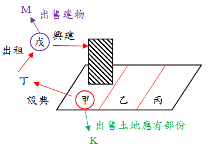

## 845. 106年地方特考「土地經濟學」之評析
*發布日期: 2017-12-14* 

## 內文
今年題目與往年相同，非常靈活。土地經濟學這科拿高分的要訣，就是須理解每一個圖形的內涵、表達意念及劃法。

第一題：因為題目出現財產權配置，故應用寇斯定理之圖形。

第二題：因為題目有地力差額地租及集約度差額地租，故應用李嘉圖差額地租理論之圖形。

第三題：因為題目有農地利用度，故應用生產要素市場之決策圖形。

第四題：因為題目有土地交易稅轉嫁，故應用供需彈性大小對租稅轉嫁的影響之圖形。

詳細解答請參考：高點高上公職106年地方特考解答

順便一提，我的土地經濟學課程於後天（12月16日）早上09:30開課，本課程全部用經濟圖形講解，專門提供給想拿高分的同學，歡迎試聽。
---
*注：本文圖片存放於 ./images/ 目錄下*

## 846. 土地法第34條之1修正
*發布日期: 2017-12-07* 

## 內文
各位同學好

這週地特考試將近，先預祝各位考生考運亨通~另12/1土地法第34條之1執行要點業經內政部修正發布，雖然地特考題應早已出完，不會特別出修正地方，但如有考到相關內容，則仍然可以提到本次修正內容。因此，本次專欄茲幫大家整理重點如下：

第三點（重大修正→注意不包含事實上處分行為；另信託與分割之理由跟講義相同，講義更完整，請參「土地法講義」第一回，曾榮耀，2017）本法條第一項所定處分，以有償讓與為限，不包括信託行為及共有物分割；所定變更，以有償或不影響不同意共有人之利益為限；所定設定地上權、農育權、不動產役權或典權，以有償為限。

修正理由：本法條之規定，係以限制少數共有人所有權之方式，以增進公共利益，故為符合憲法保障財產權之意旨，該法條之適用範圍應限縮於可兼顧不同意少數共有人之利益之情形，並對之應有合理性之補償。準此，無償性之處分與無償性設定上開物權，對於不同意共有人之所有權造成過大侵害，故不在適用之列。基於相同理由，變更亦以有償或不影響不同意共有人之利益為限，例如共有土地或建物標示之分割、合併。至於事實上之處分行為，恆使共有不動產歸於消滅，且以無償為常，對不同意之共有人無補償之道，亦不包含之。無償性之處分行為、事實上處分行為及共有不動產涉及性質之變更，影響不同意共有人之利益，且無補償之道，應作不包括之限制解釋。

第七點（重大修正→原本得以一般通知書為之，修正為以雙掛號通知）(二)書面通知應視實際情形，以雙掛號之通知書或郵局存證信函為之。

第八點（重大修正→多數決除列明、記明、證明與無須簽名外，應檢附已為通知或公告之文件＝土登考題，要注意！）本法條第一項共有人會同權利人申請權利變更登記時，登記申請書及契約書內，應列明全體共有人及其繼承人，並檢附已為通知或公告之文件，於登記申請書適當欄記明依土地法第三十四條之一第一項至第三項規定辦理，如有不實，義務人願負法律責任；登記機關無須審查其通知或公告之內容。未能會同申請之他共有人，無須於契約書及申請書上簽名，亦無須親自到場核對身分。如因而取得不動產物權者，本法條第一項共有人應代他共有人申請登記。

修正理由：對於他共有人之通知或公告，乃係部分共有人得依多數決處分之法定先行程序，部分共有人是否履行其應盡之通知義務，對他共有人之權益影響甚鉅，是登記機關宜確認部分共有人已踐行該義務，爰修正第一款規定，申請人應檢附其通知或公告文件，惟對於該等通知或公告文件之內容，涉及處分方式、價金分配、償付方法及期限等，尚非登記機關可審認，故無須審查。

第九點（重大修正→提存得由其中一人或數人辦理提存）(一)提存人應為本法條第一項之共有人，並得由其中一人或數人辦理提存。

修正理由：因連帶債務人中之一人為清償、提存等而債務消滅者，他債務人亦同免其責任。故共有人辦理提存時，不論以本法條第一項之同意處分之共有人全體或部分為提存人，均已達對價清償之目的。

第十點（重大修正→直接規定多數決處分整筆地時，其他不同意共有人得主張優先購買整筆土地；另於第十一點配合刪除多數決處分應先「通知」是否願意購買之規定）部分共有人依本法條第一項規定出賣共有土地或建物時，他共有人得以出賣之同一條件共同或單獨優先購買。

修正理由：

1. 基於本法條施行以來，部分共有人以極不相當之對價將共有土地全部出賣予第三人，形成他共有人權利遭排擠之弊端，考量倘不允許他共有人以同一價格優先購買，將有悖社會公平原則。

2. 部分共有人依本法條第一項規定出賣全部共有土地或建物時，乃出賣共有物全部之所有權，亦即為各共有人應有部分之總和，故為平衡當事人之利益及保障他共有人之權益，他共有人對共有土地全部應享有優先購買權（其他理由請詳參「土地法講義」第一回，曾榮耀，2017）

3. 本法條第一項規定出賣全部共有土地之情形，「應在程序上先就其應有部分通知他共有人是否願意優先購買」，始得出賣，增加本法條第一項所無之限制，且對於該項關於多數共有人處分全部共有物之權限規定，旨在保護多數共有人之利益及促進共有土地或建築改良物之有效利用之立法目的，與同法條第四項，各共有人處分其應有部分時，應優先保護共有人利益之立法目的，有所混淆，使本法條第一項之立法目的難於實現，故原第一款後段之規定應不予適用。

第十一點（重大修正→優先購買權表示期間由10日延長為15日→要注意！！！）(一)他共有人於接到出賣通知後十五日內不表示者，其優先購買權視為放棄。他共有人以書面為優先購買與否之表示者，以該表示之通知達到同意處分之共有人時發生效力。

修正理由：為維護少數共有人權益，本法條事前程序之保障應有更嚴謹之規定，爰參酌民法物權編施行法第八條之五第七項規定，將現行規定第二款規定他共有人應於接獲出賣通知後表示優先購買之一定期間由十日延長修正為十五日，並刪除「徵求他共有人是否優先承購之手續，準用土地法第一百零四條第二項規定」文字。

請參考：修正土地法34-1執行要點及對照表
---
*注：本文圖片存放於 ./images/ 目錄下*

## 847. 國土計畫之違規處罰
*發布日期: 2017-11-30* 

## 內文
各位同學好

有關都市計畫與區域計畫如違反所訂之土地使用管制，其處罰為6~30萬元罰鍰、限期變更、停止或恢復原狀，甚至斷水斷電、強制拆除，甚而6個月以下刑責。

未來國土計畫法通過後，非常強調各國土功能分區及分類之計畫指導性，因而其罰則也因應是否符合各分區及分類使用原則，以及使用項目的外部影響程度，處罰（罰鍰）程度由重至輕如下：

• 一、最重＝100~500萬（違反國土空間指導）

未符合國土功能分區及其分類使用原則＋從事一定規模以上或性質特殊之土地使用。例如：在農業發展地區第一類不得作工廠使用，故違反國土功能分區及其分類使用原則。此外，該工廠使用之規模達到國土法24所訂的規模認定標準的話，應申請使用許可，以確認其對於周邊環境之相容性與外部影響程度，假設訂為1公頃。因此，榮耀哥今天在農發1購買一宗1.5公頃之土地興建廠房，則將處100~500萬之罰鍰。

• 二、中間＝30~150萬（具一定外部影響）（符合國土功能分區及其分類使用原則）

1. 未許可卻從事一定規模以上或性質特殊之土地使用

2. 未依該許可進行使用（使用地類別、使用配置、項目、強度）

例如：在農業發展地區第一類得作農產品銷售設施，如農產品批發零售站，但假設未來國土法第24條訂定如農業儲銷使用達2公頃，須申請使用許可。因此，榮耀哥今天在農發1購買一宗2.5公頃土地興建農產品批發零售站及相關設施，則將處30~150萬之罰鍰。

• 三、最輕＝6~30萬元（違反使用項目及強度等）（符合國土功能分區及其分類使用原則）（未達一定規模且非性質特殊）

違反國土計畫土地使用管制。例如：在農業發展地區第二類下編定有農業用地、農業設施用地、公用事業用地等，其中假設農業用地未來可作農作使用、水產養殖等（專供農業生產使用），但不能作農業設施使用，如水產食品加工場所及設施，這些設施要作應該要編為農業設施用地才能作（目的是保護農地完整性）。因此，榮耀哥今天在農發2購買一宗0.5公頃之農業用地，做水產食品加工場所及設施（該0.5公頃規模未達須申請使用許可之門檻），即處6~30萬之罰鍰。
---
*注：本文圖片存放於 ./images/ 目錄下*

## 848. 土地增值稅重購退稅額度與房地合一所得稅重購退稅額度之比較
*發布日期: 2017-11-30* 

## 內文
• (一) 土地增值稅之重購退稅額度如下：

1. 新購土地地價＞(原出售土地地價—土地增值稅)：退還不足支付新購土地地價，但以已納土地增值稅為限。

2. 新購土地地價≦(原出售土地地價—土地增值稅)：不得退稅。

• (二) 房地合一所得稅之重購退稅額度如下：

1. 重購價額≧出售價額：退還全部稅額。

2. 重購價額＜出售價額：按下列公式計算，退還部分稅額。[圖片1]

• (三) 比較：

1. 土地增值稅重購退稅之適用對象包括自用住宅用地、自營工廠用地及自耕農業用地等三種。房地合一所得稅重購退稅之適用對象限於自住房地。

2. 土地增值稅之重購退稅以土地價格計算，房地合一所得稅之重購退稅以房地價格計算。

3. 土地增值稅重購退稅之計算，以該次移轉時之土地申報移轉現值為準。房地合一所得稅重購退稅之計算，以交易時之成交價格為準。

4. 土地增值稅之重購價格過低，不得退稅。房地合一所得稅之重購價格不論高或低，皆可退稅。

5. 土地增值稅按重購價格與原出售價格之「差額」予以退稅；但原出售價格須再扣除已繳之土地增值稅。房地合一所得稅按重購價額與原出售價額之「比率」予以退稅；但原出售價格不必再扣除已繳之房地合一所得稅。

## 文章圖片

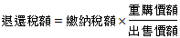

## 849. 參加市地重劃分回土地面積與參加區段徵收分回土地面積之比較
*發布日期: 2017-11-23* 

## 內文
土地所有權人參加市地重劃分回土地面積之計算方法詳如市地重劃實施辦法第29條附件。土地所有權人參加區段徵收分回土地面積之計算方法詳如土地徵收條例施行細則第50條附件。二者之公式頗為複雜，常困擾學生，因此筆者將其公式簡化，以利學習。

• (一) 市地重劃：參加市地重劃，原所有權人應負擔之項目，包括臨街地特別負擔、一般負擔及費用負擔等三項。實施市地重劃時，原所有權人應分配面積之計算方法簡化如下：

1. 重劃前後宗地地價上漲率(A)=[圖片1]

2. 重劃區一般負擔係數(B)=[圖片2]

3. 重劃區費用負擔係數(C)=[圖片3]

4. 各宗土地重劃後應分配之面積(D)=[重劃前原有之宗地面積×[圖片4]－臨街地特別負擔]×[圖片5]

• (二) 區段徵收：土地徵收條例第44條第1項第1款規定，被徵收土地所有權人領回抵價地之面積，由該管直轄市或縣（市）主管機關按其應領地價補償費與區段徵收補償地價總額之比率計算其應領之權利價值，並以實際領回抵價地之單位地價折算之。準此，實施區段徵收時，假定區段徵收範圍內無農地重劃區，原所有權人領回抵價地面積之計算方法簡化如下：

1. 全區預計抵價地面積=全區之徵收土地總面積×抵價地比例（40%~50%）

2. 預計抵價地總地價=Σ規劃供抵價地分配之各分配街廓面積×各該分配街廓評定之單位地價

3. 區內各原土地所有權人領回抵價地之權利價值=[圖片6]

4. 各原土地所有權人領回抵價地之面積=[圖片7]

• (三) 比較：

1. 市地重劃分配土地之概念，係先就重劃全區面積扣除公共設施用地負擔與費用負擔後，再按地價比例分配給各原所有權人；因此，市地重劃屬於政府與地主共同開發土地，地主分擔公共設施用地及重劃費用，並分享開發利益。區段徵收分配土地之概念，係先就徵收全區土地乘以抵價地比例，再按徵收補償地價比例分配給各原所有權人；因此，區段徵收一方面地主失去土地，另一方面地主分享土地開發與地目變更之利益。

2. 市地重劃分回土地之計算公式較合理。區段徵收分回土地之計算公式中，有關抵價地比例(現行規定40%~50%)欠缺理論根據，失之武斷。

3. 市地重劃分回土地最少55%，區段徵收分回土地最少40%，最多50%。故市地重劃分回土地較多，區段徵收分回土地較少。

4. 實施市地重劃，地主分回土地只享有土地開發之漲價利益，未享有地目變更之漲價利益。實施區段徵收，地主分回土地享有土地開發與地目變更之雙重漲價利益。

5. 市地重劃分回土地較多，但開發後土地漲價較少，漲價主要來自於土地改良，故較無暴利存在。區段徵收分回土地較少，但開發後土地漲價較多，常有暴利存在；暴利主要來自於地目變更，因而滋生官商勾結、炒作土地。

## 文章圖片

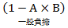

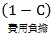

## 850. 全國國土計畫之分類
*發布日期: 2017-11-23* 

## 內文
各位同學好

恰好這週都市計畫技師剛考完，其中一題問到目前全國國土計畫（草案）之各國土功能分區及分類之劃設原則，接下來要考地方特考的同學也應特別注意，今天專欄幫各位簡單彙整一下各分類重點，以利同學記憶：

• T. ABLE_PLACEHOLDER_1
---
*注：本文圖片存放於 ./images/ 目錄下*

## 851. 106不動產經紀人考前必讀
*發布日期: 2017-11-16* 

## 內文
依「房屋租賃定型化契約應記載及不得記載事項」之規定，承租人有何種情形之一者，出租人得終止租約？出租人有何種情形之一者，承租人得終止租約？不得記載事項有哪些？

【解答】

• (一) 承租人有下列情形之一者，出租人得終止租約：

1. 遲付租金之總額達二個月之金額，並經出租人定相當期限催告，承租人仍不為支付。

2. 未經出租人同意，變更用途或將房屋之全部或一部轉租出借或以其他方式供他人使用，或將租賃權轉讓於他人。

3. 未經出租人同意，自行改裝房屋設施。

• (二) 出租人有下列情形之一者，承租人得終止租約：

1. 房屋損害而有修繕之必要時，其應由出租人負責修繕者，經承租人定相當期限催告，仍未修繕完畢。

2. 因不可歸責於承租人之事由，致房屋之一部減失者，承租人得按減失之部分，請求減少租金。減少租金無法議定，或房屋存於部分不能達租賃之目的。

3. 房屋有危及承租人或其同居人之安全或健康之瑕疵時。

• (三) 房屋租賃定型化契約不得記載事項：

1. 不得約定拋棄審閱期間。

2. 不得約定廣告僅供參考。

3. 不得約定承租人不得申報租賃費用支出。

4. 不得約定承租人不得遷入戶籍。

5. 不得約定應由出租人負擔之稅賦，若較出租前增加時，其增加部分由承租人負擔。

6. 出租人故意不告知承租人房屋有瑕疵者，不得約定排除民法上瑕疵擔保責任。

7. 不得約定承租人須繳回契約書。

8. 不得約定違反法律上強制或禁止規定。
---
*注：本文圖片存放於 ./images/ 目錄下*

## 852. 信託之地價稅
*發布日期: 2017-11-16* 

## 內文
各位同學好

剛好有幾位同學都問到103年經紀人其中一題有關信託土地之地價稅課徵方式，今日專欄統一說明：

首先，103年經紀人土法土稅第12題：某甲擁有A、B兩筆住宅區土地，A地當年度課徵地價稅之申報地價為5,000元/m2，面積100m2，B地當年度課徵地價稅之申報地價為2,000元/m2，面積200m2，某甲將B地信託與某乙，某乙名下無任何土地，某甲享有全部信託利益，信託10年，目前尚有3年信託期滿，若A、B兩筆土地均在同一縣市，該縣市當年度累進起點地價為100萬元，若某甲當年度未申請A、B兩地為自用住宅用地，則某甲當年度應繳地價稅為：(A)5,000元 (B)9,000元 (C)4,000元 (D)3,000元

[圖片1]

• 一、信託納稅義務人

土地稅法第3條之1：土地為信託財產者，於信託關係存續中，以受託人為地價稅之納稅義務人。

甲（委託人）將B地信託給乙（受託人），乙即為地價稅之納稅義務人。

• 二、稅基＝申報地價總額之計算方式

土地稅法第3條之1：信託土地應與委託人在同一直轄市或縣(市)轄區內所有之土地合併計算地價總額，依第十六條規定稅率課徵地價稅，分別就各該土地地價占地價總額之比例，計算其應納之地價稅。但信託利益之受益人為非委託人且符合左列各款規定者，前項土地應與受益人在同一直轄市或縣(市)轄區內所有之土地合併計算地價總額：1.受益人已確定並享有全部信託利益者。2.委託人未保留變更受益人之權利者。

立法意旨：避免納稅義務人為逃避適用累進稅率，故意將土地信託出去。因此，如果屬於自益信託，土地最終歸屬委託人自己，即視為該土地之實質所有權人還是委託人自己，該信託出去的土地就要跟委託人土地併計，該累進就累進，算完委託人應徵稅額後，再透過土地申報地價之比分算給受託人繳。然而，如果該信託屬於他益信託，此時實質所有權人為受益人，且委託人沒有變更權利，即受益人是明確的，故就要跟受益人所有土地合併計算申報地價總額。

• 三、應徵稅額

信託土地分成兩種情形：

• (一) 自益信託

本題因某甲享有全部信託利益故屬自益信託，此時甲為實質所有權人，故該信託土地仍要與甲所有土地合併計算申報地價總額：

• A. 地＝0.5萬/m2×100m2＝50萬元

• B. 地＝0.2萬/m2×200m2＝40萬元

甲應徵稅額＝A+B地＝90萬元，因未超過該縣市當年度累進起點地價為100萬元，故以基本稅率10‰計算＝90萬元×10‰＝9,000元

甲為A地納稅義務人，其應繳稅額＝9,000元×50/90＝5,000元

乙為B地納稅義務人，其應繳稅額＝9,000元×40/90＝4,000元

因此，本題答案為(A)。

• (二) 他益信託

假設本案例為他益信託，受益人為丙，且甲未保留變更受益人丙之權利，此時，B地就要跟丙之所有財產合計。茲舉例如下圖所示：

[圖片2]

• A. 地＝0.5萬/m2×100m2＝50萬元

• B. 地＝0.2萬/m2×200m2＝40萬元

• C. 地＝0.3萬/m2×300m2＝90萬元

甲為A地納稅義務人，因未超過該縣市當年度累進起點地價為100萬元，故以基本稅率10‰計算＝50萬元×10‰＝5,000元

丙應徵稅額＝B+C地＝130萬元，因超過該縣市當年度累進起點地價100萬元，未達五倍，故以稅率15‰計算＝100萬元×10‰＋30萬元×15‰＝14,500元（速算＝130萬元×15‰－100萬元×0.005）

乙為B地納稅義務人，其應繳稅額＝14,500元×40/130＝4,462元

丙為C地納稅義務人，其應繳稅額＝14,500元×90/130＝10,038元

## 文章圖片

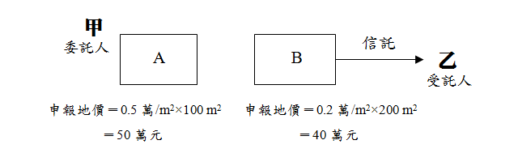

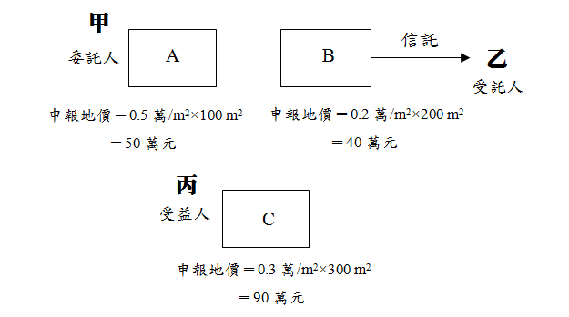

## 853. 合建分配比之估計
*發布日期: 2017-11-09* 

## 內文
• (一) 估計方法：

合建權益分配之當事人為地主方與建設方。地主方提供土地，建設方投入建築。前者以比較法及土地開發分析法評估土地價格（以A表示），後者以成本法評估建築成本（以B表示），則地主方之合建分配比為[圖片1]，建設方之合建分配比為[圖片2]。

1. 土地價格：以比較法估得比較價格，再以土地開發分析法估得土地開發分析價格，再就此二種價格加權平均後得到土地價格。

2. 建築成本：建築成本僅計入營造施工費、規劃設計費及管理費等三項，其餘如廣告費、銷售費、稅捐、資本利息及建築利潤等不計入。不計入之理由在求兩造雙方之公平。

• (二) 估計合建分配比之影響因素：

估計合建分配比之主要影響因素如下：

1. 房價：房價愈高，土地開發分析價格愈高，造成地主方之合建分配比提高。

2. 容積率：容積率愈高，土地開發分析價格愈高，造成地主方之合建分配比提高。

3. 營造施工費：營造施工費愈高，對地主方而言，土地開發分析價格愈低；對建設方而言，建築成本愈高，最後造成地主方之合建分配比降低。由此可知，營造施工費之變動造成雙重影響，影響甚鉅，最為關鍵。

• (三) 多數地主之合建分配比：

設建築基地由四筆土地整合而成，地主方分別為甲、乙、丙、丁，土地價格分別為A1、A2、A3、A4。四筆土地整合後之土地價格為A。另，建設方之建築成本為B。合建分配比有兩種估計方法：

第一種方法：

地主方甲之合建分配比：[圖片3]

地主方乙之合建分配比：[圖片4]

地主方丙之合建分配比：[圖片5]

地主方丁之合建分配比：[圖片6]

建設方之合建分配比：[圖片7]

第二種方法：

地主方甲之合建分配比：[圖片8]

其中：[圖片9]

地主方乙之合建分配比：[圖片10]

其中：[圖片11]

地主方丙之合建分配比：[圖片12]

其中：[圖片13]

地主方丁之合建分配比：[圖片14]

其中：[圖片15]

又，[圖片16]

建設方之合建分配比：[圖片17]

綜上，第一種方法，土地整合利益由建設方享有，故對建設方有利，但對地主方不利；第二種方法，土地整合利益由地主方享有，故對地主方有利，但對建設方不利。

例如：某建設公司擬在一塊建築基地進行合建，這塊建築基地由A、B、C三筆土地構成，地主分別為甲、乙、丙。經評估結果A地總價為2,000萬元，B地總價為3,000萬元，C地總價為4,000萬元，三筆土地合併後評估總價為10,000萬元。另，經評估建設公司投入建築成本為5,000萬元，則其合建分配比如下：

第一種方法：

• T. ABLE_PLACEHOLDER_1

第二種方法：

• T. ABLE_PLACEHOLDER_2

## 文章圖片

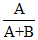

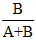

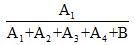

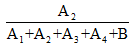

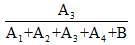

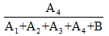

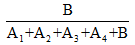

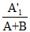

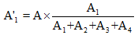

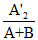

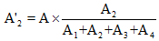

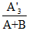

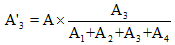

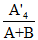

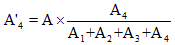

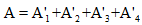

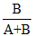

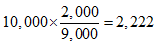

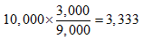

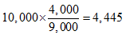

## 854. 土地法第13條 v.s. 優先購買權
*發布日期: 2017-11-09* 

## 內文
各位同學好今日專欄針對同學有詢問研究所考題：土地法第13條河川新生地鄰地所有權優先取得權與優先購買權（如土法第34-1條、第104條等）有何不同？

由於現在考試趨勢偏向應用與綜合比較題型，因而這種考題一定要多注意！茲提供思考方向，彙整如下表所示：

• T. ABLE_PLACEHOLDER_1

參考資料：李鴻毅，1997，土地法論：69；溫豐文，2013，土地法：44。
---
*注：本文圖片存放於 ./images/ 目錄下*

## 855. 農業用地之移轉限制及土地增值稅徵納(二)
*發布日期: 2017-11-02* 

## 內文
• (四) 舉例：

甲有二筆土地，其中一筆為森林區農牧用地(以A地表示)，另一筆為一般農業區林業用地(以B地表示)。今甲將此二筆土地出售移轉於農會，是否可行？應否課徵土地增值稅？

1. A地出售移轉於農會：A地為耕地，農會屬於私法人，私法人不得承受耕地；但農會屬於農民團體，經申請許可者，得承受耕地。準此，農會經取得中央主管機關(即農業委員會)許可者，得承受A地。又，作農業使用之A地移轉於農會時，經直轄市、縣（市）主管機關同意者，得申請不課徵土地增值稅。

2. B地出售移轉於農會：B地為耕地以外之農業用地，耕地以外之農業用地的承受人無資格限制。準此，農會得承受B地。又，耕地以外之農業用地移轉於農會時，應課徵土地增值稅。
---
*注：本文圖片存放於 ./images/ 目錄下*

## 856. 契約解除之退稅請求權
*發布日期: 2017-11-02* 

## 內文
各位同學好

今日專欄來談談買賣契約解除時，土地增值或契約究竟得否申請退還？

就目前稅捐機關之相關函釋予以彙整如下：

首先，解除契約應注意兩個時點之差異，一為登記完畢前，另一為登記完畢後

[圖片1]

1. 尚未登記完畢買賣雙方因故解除土地移轉契約，如尚未至地政事務所辦竣土地產權登記，可向原申報稅務機關申請撤回土地增值稅申報，並退還已繳納的土地增值稅。 該退稅請求權時效，依行政程序法第131條，自該契約解除之日起算，因10年間不行使而消滅。（此處注意網路查到的資料很多說是5年的，自102年行政程序法修正後，102年後的退稅請求權時效應改為10年）

2. 登記完畢後實際上，解除契約亦兩種情形：(1)雙方合意、(2)法院判決，處理有所不同：

1. 雙方合意解除契約由於契約解除僅具債權效力並不生物權效力，買方取得不動產所有權的法律行為仍為有效，並不會因契約的解除而受影響，故其必須將不動產所有權再行辦理移轉登記返還予賣方，其屬另一次物權移轉行為。又因買方取得不動產所有權是為有效的，故原已繳納的土地增值稅及契稅是無法因為主張解除契約而請求退還的。 換言之，合意解除契約返還給付物，仍屬所有權移轉行為，應辦理所有權移轉登記。既然屬於土地所有權之移轉，除符合法定減免或不課徵要件者外，仍應課徵土地增值稅，且不能申請退還先前已繳納之稅款。但實際上前次移轉現值已墊高，此次可能無應納稅額。

2. 法院判決確定或調解成立解除契約若法院判決確定(或法院民事調解成立)其買賣關係不存在，應持相關資料逕向地政機關辦理塗銷登記，這樣就無須再向稅捐稽徵機關申報土地增值稅。辦竣塗銷登記後，再向地方稅務局申請退還原繳納之稅款。

至於建物所有權之移轉，不涉及土地增值稅之徵免問題；惟契稅之課徵，依契稅條例第2條規定：「不動產之買賣、承典、交換、贈與、分割或因占有而取得所有權者，均應申報繳納契稅。但在開徵土地增值稅區域之土地，免徵契稅。」準此，已辦竣所有權買賣移轉登記之建物，因契約解除所為返還給付物之所有權移轉行為，非屬上述條文所訂六項契稅課稅原因之範圍者，尚無課徵契稅問題。

此外，有關已辦竣所有權移轉登記之建物，事後因雙方合意解除契約案件，應以「買賣」為登記原因，並依84年4月7日台內地字第8405408號函釋意旨於其他登記事項欄予以註記「本案為雙方合意解除契約」，使與一般買賣移轉案件有所區別。另查合意解除契約雖以買賣為登記原因，惟其成立之要件係因解除契約而返還給付物，故無須訂定公定買賣契約書，得以雙方合意解除之相關證明文件辦理所有權移轉登記。

參考資料來源：

1. 土地增值稅稽徵實務 105.4.19

2. 台財稅字第861927148號函釋

3. 台財稅字第09504545380號

4. 內授中辦地字第0940044433號函

5. 內授中辦地字第0960045649號函

6. 王彥琳，2014，買賣雙方合意解除契約而為返還不動產之產權登記及稅務解析

7. 財政部稅務新聞：已辦竣移轉登記之土地，因解除契約返還給付物而再移轉，仍應申報移轉現值，且無法退還原繳納之土地增值稅

## 文章圖片

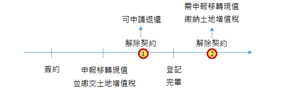

## 857. 106高考土地法規，有關共有之題型解析
*發布日期: 2017-10-26* 

## 內文
各位同學好

今日專欄來說明一下，106年之高考土法，其中一題有關共有之題型：

多數決處分整筆共有地給共有人之一，其他共有人得否優先購買？

甲、乙、丙、丁、戊5人共有A地號土地一筆，其應有部份均各五分之一。現甲、乙、丙、三人擬依土地法第34條之1第1項規定，將A地號土地全部出賣於共有人之一丁；於此情形，戊對於該A地號是否有優先購買權？請析論之。(106高)

[圖片1]

• (一) 肯定說：

1. 共有人權益保障：共有人甲乙丙丁如聯合以顯不相當對價出賣共有物，並指定其中一共有人丁為承買人之情形（聯想因不得多數決處分給同意共有人但卻可給不同意共有人，故衍生原本同意者可能會假裝為不同意者，即可多數決處分給他），如不給戊優先購買，將影響其權益，以貫徹立法共有人權益衡平。

2. 性質：部分共有人依本法條規定出賣共有土地或建物，就該共有人而言，仍為出賣其應有部分，對於他共有人之應有部分，僅有權代為處分，並非剝奪他共有人之優先承購權，故應在程序上先就其應有部分通知他共有人是否願意優先購買。

• (二) 否定說

1. 目的：土地法34-1第一項目的為促進有效利用、增進公共利益、解決共有糾紛及便利不動產交易，與同法條第四項係為簡化消滅共有關係，防止共有土地落入他人之手之立法目的不同。反而使土§34-1第一項之立法目的難於實現，應不予適用。此外，多數決處分給丁，已達成簡化及消滅共有關係，繼由丁優先購買並未有助於第四項立法目的之達成。

2. 性質：根據土地法34-1執行要點第10點：「共有人出賣其應有部分，除買受人同為共有人外，他共有人對共有人出賣應有部分之優先購買權，均有同一優先權」，亦即共有人互為買賣應有部分時，他共有人無優先購買權，故本案例等同於甲、乙、丙，加有權代理戊之應有部分共同移轉給丁，故戊不得優先購買。

綜合上述，肯定說站在共有人之間權益衡平之立場，而否定說則從法條目的、體系而言，兩者皆有理。惟今多數決處分之承受人仍為共有人之一，與出售給第三人不同，為避免實務上可能有以大吃小，反將造成他共有人權益更加受損，基於共有人間權益衡平之價值判斷，仍建議修法明定如他共有人亦表示優先購買，則各按應有部分比例共同購買。

## 文章圖片

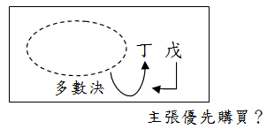

## 858. 農業用地之移轉限制及土地增值稅徵納(一)
*發布日期: 2017-10-26* 

## 內文
• (一) 農業用地之分類：

依農業發展條例第3條第10款及第11款對農業用地與耕地之定義如下：

1. 農業用地：指非都市土地或都市土地農業區、保護區範圍內，依法供下列使用之土地：(1)供農作、森林、養殖、畜牧及保育使用者。(2)供與農業經營不可分離之農舍、畜禽舍、倉儲設備、曬場、集貨場、農路、灌溉、排水及其他農用之土地。(3)農民團體與合作農場所有直接供農業使用之倉庫、冷凍（藏）庫、農機中心、蠶種製造（繁殖）場、集貨場、檢驗場等用地。（農§3Ⅹ，所稱「農」，指農業發展條例，以下同）

2. 耕地：指依區域計畫法劃定為特定農業區、一般農業區、山坡地保育區及森林區之農牧用地。（農§3Ⅺ）

綜上，農業用地涵括耕地，因此農業用地可分為耕地與耕地以外之農業用地二種。茲以示意圖說明如下：

[圖片1]

• (二) 耕地之移轉及土地增值稅：

人分為自然人與法人。法人又分為私法人與公法人。所稱私法人，指依私法而成立之法人。所稱公法人，指依公法而成立之法人。

1. 移轉於自然人：耕地得移轉於自然人，如作農業使用並得申請不課徵土地增值稅（農§37Ⅰ）。

2. 移轉於私法人：耕地不得移轉於私法人。但經中央主管機關許可，耕地得移轉於農民團體（如農會、漁會等）、農業企業機構或農業試驗研究機構（農§33）。又，作農業使用之耕地依規定移轉與農民團體、農業企業機構及農業試驗研究機構時，其符合產業發展需要、一定規模或其他條件，經直轄市、縣（市）主管機關同意者，得申請不課徵土地徵值稅（農§37Ⅱ）。

3. 移轉於公法人：耕地得移轉於公法人，並應繳納土地增值稅。

• (三) 耕地以外之農業用地之移轉及土地增值稅：

1. 移轉於自然人：耕地以外之農業用地得移轉於自然人，如作農業使用並得申請不課徵土地增值稅。

2. 移轉於私法人：耕地以外之農業用地得移轉於私法人，並應課徵土地增值稅。

3. 移轉於公法人：耕地以外之農業用地得移轉於公法人，並應課徵土地增值稅。

• (四) 舉例：下周待續...

## 文章圖片

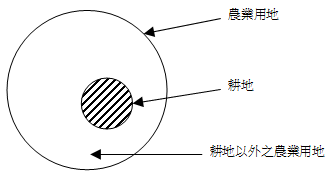

## 859. 容積移轉
*發布日期: 2017-10-19* 

## 內文
各位同學好

最近河川區容積移轉議題又浮出檯面，本週專欄幫大家整理一下目前之容積移轉制度：

• 一、定義

容積率管制係以限制建築物實體建築總量與建築基地面積之比例，藉以達到控制土地使用強度，確保整體居住生活品質的制度。而允許原屬一宗土地之可建築容積一部或全部移轉至另一宗可建築土地建築使用，即為容積移轉。

• 二、類型

依適用法源類型，分為：

• (一) 文化資產法系

1. 文化資產保存法第41條：古蹟除以政府機關為管理機關者外，其所定著之土地、古蹟保存用地、保存區、其他使用用地或分區內土地，因古蹟之指定、古蹟保存用地、保存區、其他使用用地或分區之編定、劃定或變更，致其原依法可建築之基準容積受到限制部分，得等值移轉至其他地方建築使用或享有其他獎勵措施；其辦法，由內政部會商文化部定之。

2. 古蹟土地容積移轉辦法。

• (二) 都市計畫法系

1. 都市計畫法第83條之1：公共設施保留地之取得、具有紀念性或藝術價值之建築與歷史建築之保存維護及公共開放空間之提供，得以容積移轉方式辦理。前項容積移轉之送出基地種類、可移出容積訂定方式、可移入容積地區範圍、接受基地可移入容積上限、換算公式、移轉方式、折繳代金、作業方法、辦理程序及應備書件等事項之辦法，由內政部定之。

2. 都市計畫容積移轉實施辦法。

3. 各都市計畫內容：於都市計畫書內明訂容積移轉相關規定，屬都市計畫書內容之一部分，如大稻埕歷史風貌特定專用區容積移轉、南港R13街廓容積移轉、萬華青山宮容積移轉及青田街容積移轉等規定。

4. 都市更新條例第45條：更新地區範圍內公共設施保留地、依法應予保存及獲准保留之建築所坐落之土地或街區，或其他為促進更有效利用之土地，其建築容積得一部或全部轉移至其他建築基地建築使用，並準用依都市計畫法第83條之1第2項所定辦法有關可移出容積訂定方式、可移入容積地區範圍、接受基地可移入容積上限、換算公式、移轉方式及作業方法等規定辦理。前項建築容積經全部轉移至其他建築基地建築使用者，其原為私有之土地應登記為公有。

• (三) 水利法系

水利法第82條第3、4項：河川區域內因公告之水道治理計畫線或用地範圍線內施設防洪設施所需之用地，或依計畫所為截彎取直或擴大通洪斷面辦理河道治理，致無法使用之私有土地，其位於都市計畫範圍內者，經主管機關核定實施計畫，而尚未辦理徵收前，得準用都市計畫法第八十三條之一第二項所定辦法有關可移出容積訂定方式、可移入容積地區範圍、接受基地可移入容積上限、移轉方式及作業方法等規定辦理容積移轉。

因此，容積移轉類型即包含：

1. 古蹟

2. 公共設施保留地之取得

3. 具有紀念性或藝術價值之建築與歷史建築之保存維護

4. 公共開放空間之提供

5. 河川區域

6. 都市計畫
---
*注：本文圖片存放於 ./images/ 目錄下*

## 860. 農舍及其坐落土地如何課稅？
*發布日期: 2017-10-12* 

## 內文
農舍所坐落之土地為農業用地，因此就農業用地與農舍之課稅規定分別說明之。

• (一) 農業用地：

1. 田賦或地價稅：作農業使用之農業用地課徵田賦，不徵地價稅。又，田賦自民國76年停徵迄今。

2. 土地增值稅：作農業使用之農業用地，移轉給自然人，得申請不課徵土地增值稅。相對地，作農業使用之農業用地，移轉給法人，應課徵土地增值稅。

3. 房地合一所得稅：符合不課徵土地徵值稅之農業用地，免徵房地合一所得稅。

4. 贈與稅：作農業使用之農業用地贈與民法第1138條所定繼承人（即直系血親卑親屬、父母、兄弟姊妹及祖父母），免徵贈與稅。反之，作農業使用之農業用地贈與民法第1138條所定繼承人以外之人，應課徵贈與稅。順便一提的是，配偶互相贈與財產，免徵贈與稅。

5. 遺產稅：作農業使用之農業用地繼承，免徵遺產稅。

• (二) 農舍：

1. 房屋稅：農舍持有，每年應課徵房屋稅。但專供飼養禽畜之房舍、存放農機具倉庫之房屋等，免徵房屋稅。

2. 契稅：農舍移轉，應課徵契稅。

3. 房地合一所得稅：農舍交易，不徵房地合一所得稅。

4. 贈與稅：農舍贈與，應課徵贈與稅。

5. 遺產稅：農舍繼承，應課徵遺產稅。

總之，租稅優惠主要在農業用地，而非農舍。
---
*注：本文圖片存放於 ./images/ 目錄下*

## 861. 遺贈之稅負
*發布日期: 2017-10-12* 

## 內文
遺贈之稅負,曾榮耀老師

各位同學雙十連假愉快

剛好有同學問到遺贈相關稅負問題，本週專欄就幫各位予以釐清觀念：

試擬考題：甲死亡留有A、B、C三筆不動產，其遺囑當中寫明其中C不動產贈與給丁，且該遺贈不影響繼承人乙、丙之特留分。試問如何辦理遺贈登記？以及所涉及之相關稅負為何？

• 一、遺贈之意義（民法考試範圍）

首先，遺贈係遺囑人以遺囑方式，將其財產無償給予受遺贈人之法律行為，其性質為單獨行為、死後行為、要式行為，且最重要是不得侵害特留分。

依民法第1199條規定，遺囑自遺囑人死亡時發生效力，以及民法第759條，遺囑人同時為被繼承人，因繼承人於繼承時登記前已取得不動產物權，應經登記，始得處分其物權。因此，乙、丙繼承時取得A、B、C三筆不動產所有權，但應辦理繼承登記後，方能再作另一處分行為，即遺贈，並完成遺贈登記後，丁才取得所有權（民758登記生效）。

• 二、遺贈登記（土登考試範圍）

遺贈登記係於遺囑人死亡辦理繼承登記後檢附遺囑，以及其他相關文件，向該管登記機關申辦土地權利移轉所為之登記。

根據土地登記規則第123條之規定，受遺贈人申辦遺贈之土地所有權移轉登記，應由繼承人先辦繼承登記後，由繼承人會同受遺贈人申請之；如遺囑另指定有遺囑執行人時，應於辦畢遺囑執行人及繼承登記後，由遺囑執行人會同受遺贈人申請之。前項情形，於繼承人因故不能管理遺產亦無遺囑執行人時，應於辦畢遺產清理人及繼承登記後，由遺產清理人會同受遺贈人申請之。第一項情形，於無繼承人或繼承人有無不明時，仍應於辦畢遺產管理人登記後，由遺產管理人會同受遺贈人申請之。倘若繼承人（乙、丙）遲遲不辦繼承登記，將影響受遺贈人丁之權益，丁得以訴訟方式促使繼承人辦理之。

此外，遺贈登記應備文件：

1. 登記申請書

2. 登記原因證明文件：遺囑

3. 權利書狀

4. 申請人身份證明文件：遺贈人死亡時之戶籍謄本及受遺贈人現在之身分證明

5. 其他：如委託書、土地增值稅繳納或免稅或不課徵證明

• 三、遺贈登記之稅負（土稅考試範圍）

遺贈相關之土地所有權變動情形如下圖所示，至少有四個時機點要注意，其中稅負發生於辦理登記的三個時點。以下特別說明，繼承人乙、丙於辦完繼承登記後，會同丁去辦遺贈登記時之相關稅負。

[圖片1]

• (一) 土地增值稅：零

應以受遺贈人為納稅義務人申報土地增值稅。

1. 本次移轉現值：繼承人乙、丙與丁會同辦遺贈登記時，其所申報之移轉現值。其標準係按遺贈之土地，以遺贈人死亡日當期之公告土地現值為準（土稅§30）。

2. 前次移轉現值：繼承開始時該土地之公告土地現值。（土稅§31II）

由於兩者為同一日，故土地漲價總數額為0，土地增值稅應納稅額為0。

• (二) 契稅：非課稅範圍

依財政部60年財稅第36479號令釋，因遺贈而取得不動產所有權，已依遺產稅法之規定申報繳納遺產稅，為免就同一移轉財產行為重複課徵，故免徵契稅。此外，契稅條例第2條規定，不動產之買賣、承典、交換、贈與、分割或占有而取得所有權者，均應申報繳納契稅。而遺贈取得房屋所有權，並非上述六種之情形，自非屬契稅課稅對象。

• (三) 贈與稅：屬遺產稅課徵範圍，不重複課稅

遺贈之財產仍屬於遺產，故應就遺贈財產課徵遺產稅。根據遺產及贈與稅法第6條第一項第二款規定，遺產稅之納稅義務人，無遺囑執行人者，為繼承人及受遺贈人，顯示該遺贈不動產已為遺產稅課徵對象。因此，贈與稅既為遺產稅的補充稅，而C不動產已課徵過遺產稅，故遺贈登記時不再針對該不動產課徵贈與稅。

## 文章圖片

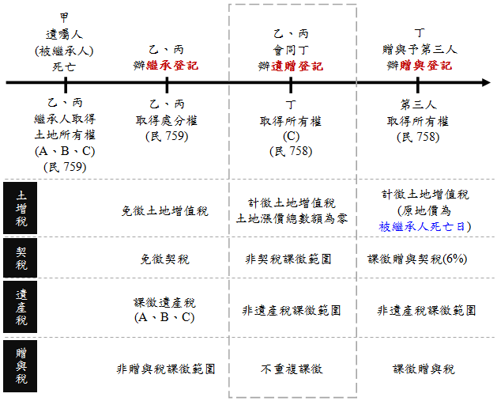

## 862. 公部門對公共設施保留地之地價查估
*發布日期: 2017-10-05* 

## 內文
公共設施保留地（如公園、學校等預定地）經指定後，其本身地價下跌，鄰地地價卻不斷上漲，造成強烈對比。故公部門對公共設施保留地之地價查估，採按毗鄰非公共設施保留地之區段地價平均計算。茲分課稅與徵收二種情形說明：

（一）課稅：不論課徵地價稅之公告地價或課徵土地增值稅之公告土地現值，皆依平均地權條例施行細則第63條規定辦理。亦即，公共設施保留地以毗鄰非公共設施保留地之區段地價平均計算為主。所稱平均計算，指按毗鄰各非公共設施保留地之區段線比例加權平均計算。又，非公共設施保留地地價區段，以實例地正常單價，求其中位數為區段地價。由於公共設施保留地尚未被徵收前之移轉免徵土地增值稅，日後一旦被徵收亦免徵土地增值稅，故公告土地現值之高低對土地所有人而言，毫無影響。然公共設施保留地於保留期間，如作建築使用，仍須課徵地價稅（作自用住宅按千分之二課徵，其餘統按千分之六課徵），故公告地價之高低對土地所有人而言，是有影響。土地所有人期望地價稅越低越好，然以毗鄰非公共設施保留地之區段地價查估，將提高公告地價，造成土地所有人之地價稅負擔加重。由此可知，公共設施保留地以毗鄰非公共設施保留地之區段地價平均計算，原本是為了照顧土地所有人而設，最後反而對土地所有人造成不利。因此，還不如改為就公共設施保留地本身現況查估，較符實際。

（二）徵收：公共設施保留地之補償市價，依土地徵收補償市價查估辦法第22條辦理。

1. 一般徵收：公共設施保留地區段地價以其毗鄰非公共設施保留地之區段地價平均計算。所稱平均計算，指按毗鄰各非公共設施保留地地價區段之區段線比例加權平均計算。又，非公共設施保留地地價區段，以其比準地地價為區段地價。

2. 區段徵收：區段徵收範圍內之公共設施保留地，以同屬區段徵收範圍內非公共設施保留地區段地價平均計算為原則。土地所有人期望徵收補償市價越高越好，因此以毗鄰非公共設施保留地之區段地價平均計算，符合其期望。總之，公部門對公共設施保留地之地價查估，不論課稅或徵收，皆以毗鄰非公共設施保留地之區段地價平均計算。如此，於課稅時將對土地所有人不利，於徵收時將對土地所有人有利。

（三）比較：由上述分析可知，公部門對公共設施保留地之地價查估，不論課稅或徵收，皆採按毗鄰非公共設施保留地之區段地價平均計算。看似相同，其實內涵不同。不同之處主要有二：

1. 課稅時，毗鄰非公共設施保留地地價區段，以實例地正常單價，求其中位數為區段地價。徵收時，毗鄰非公共設施保留地地價區段，以比準地地價為區段地價。

2. 課稅時，公共設施保留地係以毗鄰非公共設施保留地之平均公告地價或公告土地現值估計。徵收時，公共設施保留地係以毗鄰非公共設施保留地之平均市價估計。所稱市價，指市場正常交易價格。因此，同一宗公共設施保留地，課稅時所估計之地價較低，徵收時所估計之地價較高。
---
*注：本文圖片存放於 ./images/ 目錄下*

## 863. 公地權利清理
*發布日期: 2017-10-05* 

## 內文
各位同學好

祝各位中秋快樂記得中秋烤肉賞月前，閒暇之餘多複習上完的課程尤其是考不動產經紀人的同學喔！

今日專欄來談談有關公有土地撥用之議題：

撥用後，其既存之租賃權或他項權利是否因而消滅？

有以下兩說：

• 一、肯定說(司法與行政實務)

乃政府基公法上之權力，使需用土地之機關取得該土地之權利，而該土地原使用人之權利，因與此不能並存，遂歸於消滅…(最高法院52台上4031號判例)

• 二、否定說(部分司法實務與學者)

1. 乃對於政府機關使用公有土地在行政監督權方面所為之規定，經核准撥用之公有土地，因其他法律關係而有私權之存在時，在通常狀態下，該私權尚不因核准撥用而當然歸於消滅。(56台上584號判決、89台北高等行政訴3375號判決)

2. 公有土地撥用之本質，與土地徵收迥異！(陳立夫(2004)、廖義男(1985)、楊松齡(2015))

1. 性質：肯定說係將公有土地之「撥用」視同「徵收」，但事實上公有土地係因核准撥用而使需地機關取得該土地之管理權，而此乃行政機關內部間，使公有土地之管理機關發生變動而已；亦即，撥用之核准僅是行政監督權作用所為之一種認可行為，並非對人民所為之行政處分。縱使於不同權利主體間之有償撥用公有土地，將得移轉所有權，亦僅為核准撥用之附隨效果，尚不影響既存於土地上所有權以外之其他權利。

2. 保障：又私人之租賃權及他項權利，亦屬受憲法保障之財產權，其剝奪自應依循正當之法律程序。（現行法上對於撥用程序未設關於權利關係人參與，甚或使其知悉之機制）

3. 影響：就需地機關而言，若無礙其依撥用計畫使用之虞，實無解除該負擔之必要，故亦無當然消滅之理。
---
*注：本文圖片存放於 ./images/ 目錄下*

## 864. 房屋屬區分所有建物得否適用土地法第104條之優先購買權？
*發布日期: 2017-09-28* 

## 內文
【解答】

土地法第104條之優先購買權須具備下列三項條件：

• (一) 基地上有房屋存在：基地如無房屋，或非為房屋而是工作物，無土地法第104條之適用。至於房屋為透天房屋或區分所有建物，則非所問。

• (二) 房屋與基地之所有權人不同：土地法第104條之立法意旨在使房與地之所有權合一，因此房屋與基地分屬不同所有權人，始有土地法第104條之適用。

• (三) 房屋所有人對基地有地上權、典權或租賃權：占有他人基地分為有權占有與無權占有二種。有權占有又分為地上權、典權、租賃權及使用借貸等四種。因此，房屋所有人對基地如為無權占有或使用借貸，無土地法第104條之適用。

總之，房屋為透天房屋或區分所有建物，均有土地法第104條之適用。土地法第104條所稱之房屋，不限於透天房屋，區分所有建物亦屬之。
---
*注：本文圖片存放於 ./images/ 目錄下*

## 865. 信託行為無效
*發布日期: 2017-09-28* 

## 內文
各位同學好

先恭喜高普考金榜題名的同學，老師倍感榮耀~差一點上榜的同學也再加把勁，堅持終會有收穫，加油！

今日專欄談談信託法第五條：信託行為，有下列各款情形之一者，無效： (1)其目的違反強制或禁止規定者。(2)其目的違反公共秩序或善良風俗者。(3)以進行訴願或訴訟為主要目的者。(4)以依法不得受讓特定財產權之人為該財產權之受益人者。

其立法意旨主要為避免脫法行為，針對法律原規定不得享有特定財產權情形，投機以信託方式，以期達到享有同一財產權為目的者，該行為無效。

1. 其目的違反強制或禁止規定者：如土地徵收條例第37條規定區段徵收範圍勘定後公告禁止建築改良物之新建、增建、改建或重建。又如農業發展條例第33條明定私法人不得承受耕地，故信託業不得受託管理處分耕地。

2. 其目的違反公共秩序或善良風俗者：如信託目的是研究如何進行違規土地使用。

3. 以進行訴願或訴訟為主要目的者：如債權人以律師為受託人，使出面興訟。

4. 以依法不得受讓特定財產權之人為該財產權之受益人者：如以不得取得土地法第17條所定土地之外國人為受益人，或農業發展條例第33條規定不得承受耕地之私法人為受益人。

另，如該信託行為無效時，按土地稅法第28-3條及契稅條例第14-1條，因信託行為不成立、無效、解除或撤銷，委託人與受託人間不課徵土地增值稅與契稅。
---
*注：本文圖片存放於 ./images/ 目錄下*

## 866. 黎明自辦市地重劃案例探討
*發布日期: 2017-09-21* 

## 內文
各位同學好

自辦市地重劃今年才剛修法，今日專欄再次針對爭議不斷的台中單元二黎明重劃區進行討論。

[案例爭議]

本案源於台中市黎明自辦市地重劃區，面積約一八六公頃，為「擬定台中市都市計畫（整體開發地區單元二）細部計畫」指定以市地重劃方式整體開發之地區，其都市計畫細部計畫劃設交通用地，面積約8.2公頃（下稱系爭非共同負擔公共設施用地），非屬平均地權條例第60條規定共同負擔之公共設施用地，經（自辦）重劃會以抵費地指配於該用地，並將原土地所有權人調配於住宅區。

簡單而言，非法定10項公共設施用地（上課提到國、道、綠、廣），如交通轉運站用地，其土地該如何處理？

依現行規定，依序為：

1. 公有土地優先指配（平均地權條例第60條第2項）

2. 抵費地指配（市地重劃實施辦法第34條第1項）

3. 如有不足時再按私有土地面積比例予以分配（市地重劃實施辦法第34條第1項）

此順序主要是考慮保障土地被劃為10項公共設施以外的土地所有權人，可以盡量分到可建築土地，避免分到不能用的公共設施用地。

但內政部後來函釋：「市地重劃區內非共同負擔之公共設施用地，如公有土地不足指配，又原地主自願切結放棄其調配之權利，主張仍分配予原位置時，應以尊重原土地所有權人之意願為優先考量，不得以抵費地強行指配。」也就是內政部認為，應先詢問地主意願，如果不願意被調配到其他地方，而願意原地分配的話，仍以原地分配。也就是不需要按照上面法律規定的1(公有優先指配)→2(抵費地指配)→3(原土地所有權人分配)順序，而是變為1→3→2。

然而，後來監察院認為內政部這個函釋有牴觸與逾越現行法令，更創設現行法令有關市地重劃指配公共設施用地相關規定所無之事項之問題等。

[論述參考]

最後，依陳明燦老師的文章，提出以下建議：

1. 從法條文義解釋：「重劃區內公有土地與抵費地均不足以指配作為非共同負擔公共設施用地」之前提要件下，始得將非共同負擔公共設施用地配予（回）原土地所有權人。

2. 從平等原則考量：主管機關應不得將非共同負擔之「公共設施用地」配予同一重劃區內之一部份土地所有權人；而其他土地所有權人則得配回「可建地」，蓋此舉將使市地重劃之實施失去正當性，亦違反旨揭「平等對符原則」，而無法達成重劃區內公共設施用地「公有化」之目的，而使後續土地開發事務受到不利影響。

3. 從行政效率考量：此一非共同負擔之公共設施用地（例如本案系爭交通用地）遲早須進行開發建設，則因已成為「私有」，主管機關勢須再為一次「取得」，倘無法經由協議價購等方式取得者，則土地徵收一途似無法避免，必生爭議，勢必延宕其開發時程而降低其行政效率。

4. 視公共設施類型應有不同處理：公共設施用地之種類應得分為「鄰趨性」（如公園）與「鄰避性」（如變電所）兩大類。此外，亦得區分為（功能）「單一性」（如學校）與「多目標性」（如本案交六用地）。由於多目標性公共設施深具開發之「誘因」，從而乃為重劃區內原主所努力爭取之目標，但其得依據如促進民間參與公共建設法等特別法（相較於都市計畫法而言）進行土地開發者，倘將之配予重劃區內原土地所有權人，則易滋生旨揭疑義。從而，對於此類具有「多目標（功能）」性質之非共同負擔公共設施用地，建議不應劃入市地重劃範圍內，以符重劃之原理。

參考資料：陳明燦，2013，我國自辦市地重劃非共同負擔公共設施用地指配相關法制問題分析—兼評監察院一○二年四月十二日院台內字第一○二一九三○四一二號函
---
*注：本文圖片存放於 ./images/ 目錄下*

## 867. 容積是私有財，抑或公共財？容積是物權，抑或債權？
*發布日期: 2017-09-21* 

## 內文
容積是私有財，抑或公共財？容積是物權，抑或債權？

【解答】

• (一) 容積是私有財，抑或公共財？

容積移轉源自於國外之發展權移轉。所稱發展權，指在土地上從事興建、發展之權利。英國曾實施「發展權國有」，美國曾實施「發展權移轉」。前者之發展權屬於國有，後者之發展權屬於私有。

我國引進發展權移轉之構想，並將「發展權」改為「容積」，就形成現行之容積移轉。由此可知，容積移轉之容積屬於私有財。

「容積移轉」之容積雖屬於私有財，但「容積獎勵」之容積則屬於公共財。容積獎勵係以屬於全體市民所有之生活空間（即容積）贈與私地主。此舉將使市民之生活空間更擁擠、生活品質更低下。因此，除非私地主之土地使用具有公益性或外部利益，否則政府不宜浮濫給予容積獎勵。

總之，「容積移轉」之容積屬於私有財，「容積獎勵」之容積屬於公共財。因此，容積是私有財，抑或公共財，不能一概而論，應視情況而定。

• (二) 容積是物權，抑或債權？

依物權法定主義，現行法律並無明定發展權為物權，故容積不是物權。又，私地主擁有容積就可以在其土地從事興建、發展之權利，無須向政府請求給付，故容積不是債權。

基上，容積既非物權，亦非債權，故宜以準物權視之。換言之，容積雖非物權，然準用民法物權編規定處理。
---
*注：本文圖片存放於 ./images/ 目錄下*

## 868. 河川浮覆
*發布日期: 2017-09-14* 

## 內文
各位同學好今天專欄談談土地法第12條與第14條相互競合之處理方式 。

首先，條文規定如下：土地法第12條規定私有土地，因天然變遷成為湖澤或可通運之水道時，其所有權視為消滅。前項土地，回復原狀時，經原所有權人證明為其原有者，仍回復其所有權。土地法第14條則規定不得私有土地，包含可通運之水道及其沿岸一定限度內之土地。

今有一原屬私有之土地浮覆後，因屬第14條規定之不得私有土地（可通運水道），其究竟能否回復為私有？茲經彙整後有「否定說」與「肯定說」兩說：

• (一) 否定說（行政實務）：

1. 「關於水道浮覆地及道路溝渠廢置地所有權歸屬處理原則」第3點：水道浮覆地原為私有部分：水道浮覆地原屬私有者，除已由政府徵收補償或給價收購（包括日據時期給價）者外，於土地回復原狀時，不論係天然或人為之原因，均應准由原所有權人依土地法第十二條第二項規定申請回復其所有權。回復請求權時間以水道區域線公告後起算。

2. 「河川管理辦法」第6條：浮覆地指河川區域土地因河川變遷或因施設河防建造物，經公告劃出河川區域以外之土地。第10條：政府投資施工，直接或間接產生之浮覆地，原土地所有權人或其繼承人，得於公告劃出河川區域後，向地政機關申請回復所有權。

因此，自公告劃出水道河川區域範圍外後，原土地所有權人始可申請。

• (二) 肯定說（部分司法實務、陳立夫）：

1. 不得私有(土14)與回復所有權(土12)，本屬兩事。

2. 上述「關於水道浮覆地及道路溝渠廢置地所有權歸屬處理原則」屬於行政規則（命令位階），不得排除土§12（法律位階）。

3. 不得擴張解釋，增加法律所無之限制（即土地法12條並沒有規定回復所有權必須為非不得私有土地）。

4. 不得私有土地，在所有權未經依法消滅前，仍應認為私有(司法院字第1802號解釋)。準此，依法不得私有之土地範圍內，並非不存在私有土地。

因此，基於法律規定體系解釋及憲法所定私有財產保障意旨，自應不問其是否位於不得私有土地範圍內。惟，其利用仍應受相關法規（如水利法）之管制。
---
*注：本文圖片存放於 ./images/ 目錄下*

## 869. 終止三七五租約補償承租人之地價標準
*發布日期: 2017-09-14* 

## 內文
依平均地權條例第77條規定，出租耕地經依法編為建築用地，出租人得終止租約，並按申請終止租約當期之公告土地現值減除預計土地增值稅後餘額三分之一補償承租人。即：承租人之地價補償=（公告土地現值−預計土地增值稅）×[圖片1]

上開公式在下列狀況發生變化：

• (一) 市地重劃：補償規定於平均地權條例第63條，即：

1. 重劃後出租人受分配土地：承租人之地價補償=公告土地現值×[圖片2]

2. 重劃後出租人未受分配土地：承租人之地價補償=補償地價×[圖片3]

土地重劃之法律性質乃視為其原有之土地交換，故不徵土地增值稅，因此公式中未出現預計土地增值稅。

• (二) 土地徵收：補償規定於平均地權條例第11條，即：

承租人之地價補償=（補償地價−土地增值稅）×[圖片4]

土地徵收有實際補償地價，故不採公告土地現值。值得一提的是，現行土地徵收採市價補償，而非採公告土地現值補償。另，土地徵收係課徵土地增值稅之時機，故採實際發生土地增值稅，而非採預計土地增值稅。又，現行土地徵收免徵土地增值稅，因此上開公式之土地增值稅為零。

綜上，終止三七五租約補償承租人之地價標準，端視下列二種情形而定：

1. 有無補償地價：有補償地價，以補償地價為準；無補償地價，以公告土地現值為準。

2. 有無土地增值稅：有土地增值稅並同時發生，以實際發生土地增值稅為準；有土地增值稅但尚未發生，以預計土地增值稅為準；無土地增值稅，則刪除公式中之土地增值稅規定。

## 文章圖片

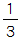

## 870. 時效取得地上權與土地法第104條之實例研習
*發布日期: 2017-09-07* 

## 內文
• A. 地為甲所有，乙以行使地上權之意思在A地的二分之一部分興建一棟違章建築，無權占有長達20年，乙對A地全部得否主張時效取得地上權登記。不久，甲將A地全部出售於丙，則乙對A地全部有否優先購買權？

【解答】

• (一) 乙以行使地上權之意思在A地的二分之一部分，興建一棟違章建築，無權占有長達20年。依司法院釋字第291號解釋，其占有建物不以合法建物為限，違章建築亦得主張時效取得地上權，準此，乙得主張時效取得地上權。但僅得對A地的二分之一部分，而非A地全部。

• (二) 甲將A地全部出售於丙，則乙對A地全部有否優先購買權？茲分下列二種情形說明：

1. 地上權登記尚未完成：乙尚未取得地上權，乙仍是無權占有甲之A地，故乙不得主張土地法第104條之優先購買權。

2. 地上權登記已完成：乙因時效完成取得地上權，乙與甲之間存在地上權關係，緃地上建物屬違章建築，乙仍得主張土地法第104條之優先購買權。又，因優先購買權應以同一條件為之，故乙對A地全部有優先購買權，而非僅對A地的二分之一部分。
---
*注：本文圖片存放於 ./images/ 目錄下*

## 871. 土地利用與政策－開發許可
*發布日期: 2017-09-07* 

## 內文
各位同學好

今天專欄主題：土地利用與政策－開發許可

開發許可經核准後，依區域計畫法第15條之4，區域計畫擬定機關應於九十日內將審議結果通知申請人，以及非都市土地使用管制規則第20條，由區域計畫擬定機關核發開發許可予申請人，並通知土地所在地直轄市或縣（市）政府(非§14)。直轄市或縣（市）政府應將許可內容於各該直轄市、縣（市）政府或鄉（鎮、市、區）公所公告三十日(非§20)。因此，開發許可經區域計畫擬定機關（或面積30公頃以上是直轄市、縣市政府）核准後，須經通知與公告，以發生行政處分之效力。

而今天重點要提醒各位同學的是，開發許可之變更情形，可分為兩大類三種程序，茲彙整如下：

• 一、認定未變更原核准興辦事業計畫性質

1. 應申請變更開發計畫者區域計畫擬定機關核發開發許可或開發同意後，申請人有下列各款情形之一，經目的事業主管機關認定未變更原核准興辦事業計畫之性質者，應依第13條至第20條規定之程序，即前述之申請、審議、核准之程序，申請變更開發計畫(非§22I)：

1. 增、減原經核准之開發計畫土地涵蓋範圍。

2. 增加全區土地使用強度或建築高度。

3. 變更原開發計畫核准之主要公共設施、公用設備或必要性服務設施。

4. 原核准開發計畫土地使用配置變更之面積已達原核准開發面積二分之一或大於二公頃。

5. 增加使用項目與原核准開發計畫之主要使用項目顯有差異，影響開發範圍內其他使用之相容性或品質。

6. 變更原開發許可或開發同意函之附款。

7. 變更開發計畫內容，依相關審議作業規範規定，屬情況特殊或規定之例外情形應由區域計畫委員會審議。

2. 應製作變更內容對照表者前項以外之變更事項，申請人應製作變更內容對照表送請直轄市或縣（市）政府，經目的事業主管機關認定未變更原核准興辦事業計畫之性質，由直轄市或縣（市）政府予以備查後通知申請人，並副知目的事業主管機關及區域計畫擬定機關(非§22II)。其屬於變更內容性質單純之簡化程序。

• 二、認定已變更原核准興辦事業計畫性質＋達一定規模

1. 應重新申請使用分區變更者經區域計畫擬定機關核發開發許可、開發同意或依原獎勵投資條例編定之案件，變更原經目的事業主管機關核准之興辦事業計畫性質且面積達第11條規模者，申請人應依同規則第三章規定程序重新申請使用分區變更（非§22-2），亦即包含前述之申請、審議、核准、完成開發義務及辦理分區與使用地變更編定異動登記。
---
*注：本文圖片存放於 ./images/ 目錄下*

## 872. 界址爭議
*發布日期: 2017-08-31* 

## 內文
各位同學好

今天來談談有關界址爭議之相關概念首先，可先參考最近一篇新聞：鑑界誤差不到2坪 老夫婦18年來無屋可住【原文轉自：自由時報】

最近上課講到的第二章地籍編中，有關土地法第46條之2（考試重點-經紀人選擇題尤為注意）規定：

重新實施地籍測量時，土地所有權人應於地政機關通知之限期內，自行設立界標，並到場指界。逾期不設立界標或到場指界者，得依左列順序逕行施測：一、鄰地界址。二、現使用人之指界。三、參照舊地籍圖。四、地方習慣。土地所有權人因設立界標或到場指界發生界址爭議時，準用第五十九條第二項規定處理之（即調處）。

今按實施地籍測量時，係以當事人到場指界為原則，但當相鄰兩界址之土地所有權人到場指界不一，發生界址爭議時，主要先由地籍調查人員及地政事務所就爭議情形予以協調，如果還不能解決時，再報請縣市政府不動產糾紛調處委員會予以調處。土地所有權人接到縣市政府調處結果通知若有不服時，應在接到通知書15日內向司法機關訴請確認界址。逾15日後如不提起訴訟者，依照調處結果辦理重測。

而上述新聞的案例，其臺灣雲林地方法院民事判決89年度簡上字第10號裁判書，部分有關地籍圖重測之判斷標準內容可供參考：

按相鄰兩土地間，其具體界址何在？如有圖地相符之地籍圖可稽，自以地籍圖為準，惟如地籍圖有所不備或不精確時，則應參酌以下等判斷經界之資料，秉持公平之原則，合理認定之：

1. 鄰接各土地之買賣契約或地圖（實測圖、分割圖、分筆圖）。

2. 經界標識之狀況（經界石、經界木、木樁、基石、埋炭等）。

3. 經界附近占有之沿革（房屋、廚房、廁所、自來水管、水溝之位置及系爭土地之利用狀況）。

4. 登記簿面積與各土地實測面積之差異。

此觀諸土地法第四十六條之二第一項規定自明。足見確定界址非以當事人之指界位置為唯一之認定標準，尚須參照舊地籍圖及鄰地界址等客觀基準以為斷。

另土地重測，旨在以較科學方法，更新進之測量技術和儀器，普收測量整理地籍實效，使地籍資料更趨於正確，以杜糾紛，此觀諸土地法第四十六條之一、第四十六條之二第一項、第四十七條及地籍測量實施規則等之規定自明，是如重測後土地面積較重測前登記面積有所增減自應以較新及較精密測量所得之重測面積為準。

以上內容可作為土地法第46條之2參考。
---
*注：本文圖片存放於 ./images/ 目錄下*

## 873. 耕地375
*發布日期: 2017-08-24* 

## 內文
各位同學好

前陣子有學者在討論耕地375租約存在的必要性，高普考同學土地政策應好好準備，今天先來談談最近一則新聞：中石化爆土地爭議 佃農嗆：維持三七五租約保障【轉自：自由時報】

新聞當中提到：「安順廠周邊的海埔新生地原本是由當地居民圍墾而來，不過日治時期被佔領，爾後接收土地的國民政府為了優惠農民而實施「三七五減租」，保障佃農的承租權和耕作權。不過，當年租約都是由地主和佃農口頭約定，並無白紙黑字的合約，這項缺漏在土地所有權人中石化民營後出現問題。

中石化3年前告知佃農不再予以續租，這項決定惹火當地佃農，認為此舉忽略三七五租約保障的主動續約權；但是中石化則反駁，佃農並無到安南區公所三七五租佃委員會造冊，也沒有到地政事務所做土地謄本註記，難以認定土地有受三七五租約的保障。」

有關耕地375租約之相關規定，包含「耕地三七五減租條例」、「臺灣省耕地租約登記辦法」、「耕地三七五租約清理要點」、司法院大法官釋字第128、422、580號解釋等。其中，根據「耕地375減租條例」第6條規定，本條例施行後，耕地租約應一律以書面為之；租約之訂立、變更、終止或換訂，應由出租人會同承租人申請登記。

繼依「臺灣省耕地租約登記辦法」耕地租約之訂立、變更、終止或換訂登記，應由出租人會同承租人於登記原因發生日起三十日內，向當地鄉(鎮、市、區)公所申請。因此，這邊同學要注意的是，該登記並非至地政事務所所辦理的土地登記，而是租約內容登記。

又按「地政事務所審查三七五租約耕地出賣或出典案件與鄉（鎮、市、區）公所檢查聯繫作業要點」第2點，鄉（鎮、市、區）公所辦畢三七五租約登記之耕地，地政事務所應於土地登記簿予以註記。其屬共有土地出租者，應註記出租人及其應有部分。同法第3點規定，新訂立三七五租約之耕地，鄉（鎮、市、區）公所應於辦畢租約登記2日內填具登記申請書及造具訂立租約土地清冊1式2份，函送土地所在地地政事務所收件，並於土地登記簿標示部其他登記事項欄內註記本筆土地訂有三七五租約

然而，依據幾則判例、判決(51最高法院台上2629號判例、79年台上字第290號、85年台上字第2926號)可知，該登記並非租約生效之要件： 「惟該規定係為保護佃農及謀舉證之便利而設，非謂凡租約之訂定、變更、終止或換訂，須經登記始能生效」。因此，前項案例之租約是否生效，並非以登記為斷。
---
*注：本文圖片存放於 ./images/ 目錄下*

## 874. 106年不動產估價師考題命中
*發布日期: 2017-08-24* 

## 內文
今年不動產估價師考試，大體而言，「土地利用法規」及「不動產經濟學」二科較往年困難，其餘各科較往年容易。今年土地利用法規的第3題及第4題，題目如下：

• 三、請依區域計畫法與非都市土地使用管制規則規定，說明在海域用地申請區位許可之核准條件。而關於海域，請依國土計畫法規定，說明海洋資源地區及其分類之土地使用原則為何？（25分）

• 四、請比較說明都市更新條例與都市危險及老舊建築物加速重建條例兩者立法意旨有何異同？都市危險及老舊建築物加速重建條例之適用範圍為何？依都市危險及老舊建築物加速重建條例規定申請重建，及依都市更新條例申請以協議合建方式實施都市更新事業，其實施條件有何異同？（25分）

上述兩題與許老師考前提示的《106年不動產估價師考前30分鐘重點題神》，土地利用法規的第1題及第2題相仿。題目照抄如下(解答省略)：

• 一、已經有「都市更新條例」，何以需要訂頒「都市危險及老舊建築物加速重建條例」？又「都市更新條例」與「都市危險及老舊建築物加速重建條例」之內容有何不同？

• 二、何謂海域區及海域用地？海域用地容許使用項目為何？海域用地申請區位許可之程序？海域用地申請區位許可，在何種條件下，中央主管機關始得核准？中央主管機關會商有關機關審查，如涉重大政策或認定疑義者，應依何種原則處理？

因為文昌，所以神準。
---
*注：本文圖片存放於 ./images/ 目錄下*

## 875. 大陸人民取得限制
*發布日期: 2017-08-17* 

## 內文
首先，先參考一則新聞，理論與實務相互映證一下

沒見過房東！揭陸籍屋主「偷租房」牟利【轉自：中天新聞】新北市一名呂小姐，在陽明山旁租下一戶豪宅，不過房東從未出面，都靠管家上門收取房租，也不願提供匯款帳號，日前甚至要求他從承租的5樓搬到11樓，理由是說政府官員要來查，屋主要回來住，呂小姐覺得有異到相關單位查詢，赫然發現原來屋主是名大陸人，按照現行法規大陸人在台置產，只能自住不能出租牟利，如今違法被發現，這間房子得要在一年內出售，否則將被法拍。

這時馬上要想到我們剛教過且今年六月方才大幅度修正全文的「大陸地區人民在臺灣地區取得設定或移轉不動產物權許可辦法」第七條規定：大陸地區人民取得之不動產所有權或地上權，限已登記並供住宅用，且每人限單獨取得一戶，並不得出租或供非住宅之用。取得前項供住宅用不動產所有權或地上權，於登記完畢後三年內不得移轉或辦理不動產所有權或地上權移轉之預告登記。但因繼承、強制執行、徵收、法院判決或依第十七條規定而移轉者，不在此限。

而本條的立法意旨：

1. 為避免一再購置不動產導致土地壟斷投機或炒作之虞，不許可大陸地區人民在臺灣地區取得第二戶不動產(內政部99年台內地字第0990215799號函示)。

2. 大陸地區人民不得申請共同取得不動產(內政部99年台內地字第0990175971號函示)。

3. 大陸地區人民基於自住需求取得住宅用不動產後，應確實依原申請用途使用之意旨(內政部103年台內地字第10313013851號函)。→明定大陸地區人民每人限單獨取得一戶（指一個主建號及其基地地號）依法供住宅用之已登記不動產所有權，並禁止其出租或供非住宅使用。→考量目前市場上已有僅設定地上權之住宅不動產商品，防範大陸地區人民透過地上權之住宅不動產，進行不動產投機炒作。
---
*注：本文圖片存放於 ./images/ 目錄下*

## 876. 逆向抵押貸款
*發布日期: 2017-08-17* 

## 內文
＜不動產投資分析考前補充資料＞

• (一) 逆向抵押貸款之意義：

年長老人將其房子抵押給銀行，由銀行每月提供生活費。房子雖抵押給銀行，但還可以繼續居住。俟貸款期滿或未來身故時，可選擇償還貸款或由銀行將房子拍賣，餘額可領回或分配給家屬。

• (二) 逆向抵押貸款之功能：

1. 以房養老：逆向抵押貸款提供有房子但無現金流的退休年長者，將資產活化，每個月有固定生活費，不必靠子女奉養，享受樂活生活。

2. 在宅安養：逆向抵押貸款可以提供老人在家安養，房子雖設定抵押權給銀行，但老人可以繼續居住，直至往生。

3. 減輕子女負擔：近年來，台灣發生少子化及高齡化之嚴重問題。又，年輕人普遍低薪現象，陷入窮忙族。因此，逆向抵押貸款可以解決老人之經濟問題，減輕子女負擔。

• (三) 台灣逆向抵押貸款之內容：

目前國內開辦以房養老業務之銀行有合作金庫、土地銀行、華南銀行、台企銀行、第一銀行、台灣銀行、台新銀行、中信銀行、上海商銀等九家。其內容產品大同小異，列舉大要如下：

1. 借款人年滿65歲以上。

2. 貸款成數最高七成。

3. 借款期間最長30年。

4. 年齡加貸款期間須大於95。

5. 每月撥付金額為貸款金額除以貸款期間所得到之金額，再扣除當期應繳利息。

6. 當月應繳利息若超過每月撥付本金的三分之一，其超過部分可採掛帳方式，直至契約終止時一次清償。

7. 未來還款方式可由繼承人清償，或經由擔保品拍賣所得價金償還。

• (四) 推展困難之原因：

以房養老之逆向抵押貸款雖立意甚佳，惟業務難以拓展，其原因如下：

1. 長輩怕丟臉：年紀這麼大還要借錢，怕被街坊鄰居看笑，覺得不光彩。

2. 子女怕被認為不孝：子女怕被親友指指點點，連父母都養不起，還要父母貸款，認為子女不孝順。

3. 擔心債留子孫：國人普遍認為，有房子就應該留給孩子。以房養老，反而債留子孫。

4. 影響未來繼承利益：有些子女擔心未來少了一筆可繼承的財產，影響繼承利益。

總之，傳統觀念不改變，逆向抵押貸款難以推展。
---
*注：本文圖片存放於 ./images/ 目錄下*

## 877. 優先購買權之通知
*發布日期: 2017-08-10* 

## 內文
各位同學好

有關優先購買權，相關規定頗多，依土地法第104條，租用基地建築房屋為例，其規定優先購買權行使，須於出賣通知到達後十日內表示，逾期不表示者，視為放棄。

上述土地法第104條就文義而言，並未要求須書面，而解釋上多認為書面或非書面皆可。但相對而言，民法第426條之2，同樣規定租用基地建築房屋之優先購買權，但其第2項規定出賣人應將出賣條件以「書面」通知優先承買權人。優先承買權人於通知達到後十日內未以書面表示承買者，視為放棄。

因此，今日專欄要討論者，為優先購買權通知究竟是否須書面為之？

通知方式雖民法規定應以書面通知，但土地法第104條第二項未予明定，並不以書面為要件，且土地法為特別法，從而無論係書面或書面以外方式均無妨，但均應足使優先購買權人知悉買賣條件始可。

茲將相關法條是否須書面彙整如下表，供各位同學參考：

• T. ABLE_PLACEHOLDER_1
---
*注：本文圖片存放於 ./images/ 目錄下*

## 878. 影子銀行(Shadow banking)
*發布日期: 2017-08-10* 

## 內文
<不動產投資分析考前補充資料>

影子銀行，指傳統商業銀行體系以外，從事資產證券化活動，提供資金供需。換言之，影子銀行雖非金融機構，卻扮演金融機構資金中介的角色。影子銀行，包括投資銀行、貨幣市場基金、私募基金、避險基金等是。

影子銀行存在下列四項問題：

（一）監管程度低：影子銀行之功能類似商業銀行，卻不受到金融法規嚴密監控。隨著金融市場的繁榮，影子銀行快速發展，造成金融潛在危機。

（二）資訊不透明：影子銀行的產品結構經過多層次包裝設計，產品內容非常複雜，而且信息很少被披露。這種產品強調報酬，而忽略風險。

（三）高槓桿操作：影子銀行沒有商業銀行豐沛的資金來源，因此利用財務槓桿大幅擴張信用，信貸泡沫日趨擴大，進而失控。

（四）易發生系統風險：由於影子銀行之資訊不透明，且高槓桿擴張信用，在金融市場繁榮時，不斷成長擴大。但當市場有一點風吹草動，投資人恐慌性賣壓，而造成金融風暴。

美國次級房貸風暴，造成全球金融海嘯，就是影子銀行之著例，殷鑑不遠。總之，政府應納入並加強影子銀行之監管，並建立產品信息披露機制，乃避免再發生金融風暴的不二法門。
---
*注：本文圖片存放於 ./images/ 目錄下*

## 879. 登記錯誤之實例研習
*發布日期: 2017-08-03* 

## 內文
甲出資2,000萬元，乙出資1,000萬元，共同購買一筆土地，契約書載明甲持分三分之二，乙持分三分之一。然登記機關錯誤記載為甲持分三分之一，乙持分三分之二。經過不久，乙將其持分三分之二出售於不知情之丙，請就甲採取下列各救濟措施，分析是否可行？(一)甲向登記機關申請更正登記。 (二)甲向丙訴請返還持分三分之一。 (三)甲向登記機關請求損害賠償。

【解答】

• (一) 更正登記不得違反原登記之同一性。換言之，更正登記不得變更原登記之法律關係。準此，本案已出售於不知情之丙，故不得辦理更正登記。總之，本項救濟措施不可行。

• (二) 不知情之丙因信賴登記取得持分三分之二，依土地法第43條規定，具有不可推翻之效力，故丙得拒絕返還持分三分之一。總之，本項救濟措施不可行。

• (三) 登記機關因登記錯誤，造成甲之權益受到損害。甲得依土地法第68條規定，向登記機關請求損害賠償。總之，本項救濟措施可行。

好試報報許老師的土地法規原訂7月30日開課，因欣逢尼莎颱風，延至8月6日(日)開課。【新開課表】
---
*注：本文圖片存放於 ./images/ 目錄下*

## 880. 大陸地區人民之地權限制
*發布日期: 2017-08-03* 

## 內文
各位同學好

內政部於106年6月9日已修正「大陸地區人民在臺灣地區取得設定或移轉不動產物權許可辦法」，各位同學記得注意修正條文。

先參考以下新聞：陸資買房一人一戶 網友：13億人可買下台灣【原文轉自：好房網】。

實際上，修法前就已有函令禁止取得第二棟不動產：（內政部99年10月29日台內地字第0990215799號：為避免一再購置不動產導致土地壟斷投機或炒作之虞，不許可大陸地區人民在臺灣地區取得第二棟不動產），因此，此次修法係將其入法規範，以加強管制。此外，學過土法的同學應該清楚大陸地區人民尚有其他限制。

對於大陸地區人民之地權限制，除了常聽到的543條款，我把他擴充為「54321+總」限制，茲說明如下：

5：貸款最多5成。(臺灣地區與大陸地區金融業務往來及投資許可管理辦法§16、12)

4：每年總停留期間不得逾4個月。(大陸地區人民進入臺灣許可辦法§29、附表一)

3：登記完畢後3年內不得移轉或預告登記。(大陸地區人民在臺灣地區取得設定或移轉不動產物權許可辦法§7)

2：依法繼承財產總額，每人不得逾2百萬元。(臺灣地區與大陸地區人民關係條例§67)

1：每人限單獨取得1戶住宅用所有權或地上權，不得出租或非住宅用。(大陸地區人民在臺灣地區取得設定或移轉不動產物權許可辦法§7)

總：總量管制。根據104年台內地字第1040404695號，修正「大陸地區人民在臺灣地區取得設定或移轉不動產物權許可辦法」第十四條規定有關「大陸地區人民在臺灣地區取得不動產物權採行總量管制之數額及執行方式」如下，自中華民國104年7月1日生效：一、總量管制數額：(一)長期總量管制：土地一千三百公頃，建物二萬戶。(二)每年許可大陸地區人民申請取得不動產數額（以下簡稱年度數額）：土地十三公頃，建物四百戶，年度數額有剩餘者，不再留用。(三)集中度數額管制：大陸地區人民取得同棟或同一社區之建物，以總戶數百分之十為上限；總戶數未達十戶者，得取得一戶。彈性調整：內政部原則每半年檢討總量管制數額；必要時並得視年度數額使用情形，邀集相關機關及各直轄市、縣（市）政府會商後，機動檢討調整。
---
*注：本文圖片存放於 ./images/ 目錄下*

## 881. 撤銷徵收與廢止徵收
*發布日期: 2017-07-27* 

## 內文
各位同學好

有時候同學會問到撤銷徵收與廢止徵收情形，因法條文字較難以理解，今日專欄舉幾個例子提供理解

首先，先複習一下土地徵收條例第49條已公告徵收之土地，需用土地人應切實按核准計畫及所定期限使用。在未依徵收計畫完成使用前，需用土地人應每年檢討其興辦事業計畫，並由其上級事業主管機關列管。有下列情形之一者，應辦理撤銷徵收(土徵§49I)：(1)因作業錯誤，致原徵收之土地不在工程用地範圍內。(2)公告徵收時，都市計畫已規定以聯合開發、市地重劃或其他方式開發。但以聯合開發方式開發之土地，土地所有權人不願參與聯合開發者，不在此限。

已公告徵收之土地，有下列情形之一者，應廢止徵收：(1)因工程變更設計，致原徵收之土地不在工程用地範圍內。(2)依徵收計畫開始使用前，興辦之事業改變、興辦事業計畫經註銷、開發方式改變或取得方式改變。(3)已依徵收計畫開始使用，尚未依徵收計畫完成使用之土地，因情事變更，致原徵收土地之全部或一部已無徵收之必要。

◎所謂「作業錯誤」，依申請土地徵收注意事項§21，如： (一)位置勘選錯誤。 (二)地號摘錄錯誤。 (三)地籍圖地號誤繕。 (四)地籍分割錯誤。 (五)部分徵收之土地未辦理分割，致以全筆土地辦理徵收，分割完成後其錯誤徵收部分。 (六)都市計畫中心樁（線）偏移。

◎所謂「工程變更設計」，如：道路路線變更。

◎所謂「情事變更」，如少子化，可參考下列台中市政府106年的一篇廢止徵收公告文：公告廢止徵收本府(改制前為臺中縣政府)辦理都市計畫文九(26)學校工程用地，原報准徵收梧棲區南簡段904-1地號等18筆土地，合計面積1.749300公頃。四、廢止徵收原因：因全市少子化趨勢，且鄰近國中、小普通教室足敷使用，已無設校需求，致原徵收土地之全部已無徵收之必要，依據土地徵收條例第49條第2項第3款規定，應辦理廢止徵收。五、廢止徵收之土地及應繳回之徵收價額：詳見廢止徵收土地圖、廢止徵收原所有權人應繳回之徵收價額清冊，以上圖冊分別陳列於本府地政局及梧棲區公所公開閱覽。六、公告期間：30天（自民國106年5月16日起至民國106年6月15日止）。七、繳回期限：自公告日起至民國107年1月15日前。
---
*注：本文圖片存放於 ./images/ 目錄下*

## 882. 土地法第43條之實例研習
*發布日期: 2017-07-27* 

## 內文
甲有一筆土地，誤登於乙名下。不久，乙高價出售於丙。經過不久，丙又高價出售於丁。今甲主張該土地為其所有，請求丁返還。試就下列四種情形分別說明該土地之權利歸屬？(一)丙為善意第三人，丁為善意第三人。(二)丙為善意第三人，丁為惡意第三人。(三)丙為惡意第三人，丁為善意第三人。(四)丙為惡意第三人，丁為惡意第三人。

【解答】

• (一) 丙為善意第三人，故丙已依土地法第43條而取得該土地所有權。又，丙為真正所有權人，丁不論善意或惡意，皆取得該土地所有權。換言之，該土地所有權歸屬於丁，丁得拒絕返還該土地。

• (二) 丙為善意第三人，故丙已依土地法第43條而取得該土地所有權。又，丙為真正所有權人，縱丁為惡意第三人，不生無權處分問題，故丁取得該土地所有權。換言之，該土地所有權歸屬於丁，丁得拒絕返還該土地。

• (三) 丙為惡意第三人，無法受土地法第43條之保護，故丙為非真正所有權人。又，丁向丙購買該土地，丁為善意第三人，依土地法第43條而取得該土地所有權。換言之，該土地所有權歸屬於丁，丁得拒絕返還該土地。

• (四) 丙為惡意第三人，無法受土地法第43條之保護，故丙為非真正所有權人。又，丁為惡意第三人，亦無法受土地法第43條之保護，故丁為非真正所有權人。換言之，甲得主張該土地為其所有，請求丁返還。

順便一提的是，許老師的土地法規課程將於今年(106年)7月30日(星期日)開課，一年只上這一次，錯過可惜！
---
*注：本文圖片存放於 ./images/ 目錄下*

## 883. 實價登錄三法即將修正
*發布日期: 2017-07-20* 

## 內文
• (一) 實價登錄三法：

指規範登記權利人(即買方)申報義務之「平均地權條例」，規範地政士申報義務之「地政士法」，規範不動產經紀業申報義務之「不動產經紀業管理條例」。

• (二) 現行實價登錄之問題：

1. 實價登錄之目的就是讓房價交易透明化，避免炒房，然目前最大問題在揭露不實，以低報高，其用意有三：(1)提高申報價格，以增加銀行貸款額度。 (2)哄抬價格，以低報高，以利建設公司餘屋銷售。 (3)適用所得稅舊制的賣方將房屋賣給適用所得稅新制的買方，提高申報價格，可以節省日後之房地合一所得稅。

2. 買方自行申報，縱使被查到也不處罰，改正再真實申報即可。況且再申報不實被處罰，也只罰3萬元以上15萬元以下，不痛不癢。

3. 經營代銷業務者，對於起造人或建築業委託代銷之案件，應於委託代銷契約屆滿或終止三十日內，向主管機關申報登錄成交案件實際資訊。準此，業界故意簽訂委託代銷期間長達二年至三年，則揭露出來的價格已是二、三年前的交易價格，揭露效率太慢。

• (三) 解決之道：

1. 申報義務應回歸落在買賣雙方當事人，而非地政士或不動產經紀業。

2. 實價登錄應於移轉登記時併同辦理，預售屋則於買賣契約簽訂後三十日內申報。

3. 實價登錄應檢附私契，如有不實申報，課以偽造文書之刑事責任。

4. 政府建立稽核制度，再搭配刑事罰則及違規罰鍰，以達成遏止不實申報之效。
---
*注：本文圖片存放於 ./images/ 目錄下*

## 884. 實價登錄
*發布日期: 2017-07-18* 

## 內文
各位同學好

本次高考土地經濟學有考到實價登錄制度，其有助於改善不動產市場資訊不透明之問題，但目前制度尚有一些問題需要改進，根據最近的修法方向，本次專欄予以彙整如下：

1. 時效性：目前規定權利人、地政士或經紀業應於買賣案件辦竣所有權移轉登記三十日內，向主管機關申報登錄土地及建物成交案件實際資訊。造成土地登記與實價登錄有時間落差，資訊揭露缺乏即時性。此外，預售屋買賣則由代銷業者在與起造人或建築業委託代銷契約屆滿或終止三十日內，一次申報，以致申報登錄價格過時，而缺乏即時參考價值。因此，未來建議買賣實價登錄與登記案件併同辦理，以及縮短預售屋申報期限，提升資料揭露即時性。

2. 準確性：目前規定主要申報責任在於權利人，而單獨申報易發生錯誤或故意漏誤，影響實際交易價格資訊的正確性。因此，未來建議由買賣雙方共同申報登錄，透過買賣雙方相互勾稽確認，提升價格資訊正確性。

3. 正確性：依法規定，目前實價登錄之資訊，係以區段化、去識別化方式提供查詢，使得資訊充分揭露大打折扣。因此，未來建議將不動產的門牌或地號資訊完整顯示，並賦予主管機關查核權，加強不動產交易資訊透明化，以確保資訊正確性。

4. 真實性：投機者利用實價登錄，以異於一般市場行情之價格影響市場，並進行投機行為，使得交易資訊之真實性存疑。因此，未來應強化主管機關查核異常案件之權責，如查核資金流向及付款證明，確保交易資訊真實。

5. 完整性：政府為避免投機者刻意哄抬價格，扣除5%異常值，造成最低與最高價等成交案無法顯示。因此，未來建議完整公開，再配合註明為何偏離真實情形。
---
*注：本文圖片存放於 ./images/ 目錄下*

## 885. 106高普考土地法規完美命中之事實
*發布日期: 2017-07-13* 

## 內文
• (一) 我於106年5月21日土地法規總複習時，發給學生的總複習講義第36題(詳見第30頁)之全文照抄如下：

• 三十六、試述司法院釋字第739號對獎勵土地所有權人辦理市地重劃之解釋要旨？

答：獎勵土地所有權人辦理市地重劃辦法之下列規定，違反憲法要求之正當行政程序，亦違反憲法保障人民財產權與居住自由之意旨。申請核定籌備會之要件未就發起人人數比率及面積比率為規定。申請核定擬辦重劃範圍、重劃計畫書之申請核定及公告並通知土地所有權人等，均屬重劃會之職權，卻交由籌備會為之，與平均地權條例第58條第1項及第2項規定不符，違反法律保留原則。主管機關核定擬辦重劃範圍之程序，未要求主管機關應設置適當組織為審議，於核定前予利害關係人陳述意見之機會，以及分別送達核定處分於重劃範圍內申請人以外之其他土地所有權人。主管機關核准實施重劃計畫之程序，未要求主管機關應設置適當組織為審議、將重劃計畫相關資訊分別送達重劃範圍內申請人以外之其他土地所有權人，及以公開方式舉行聽證，斟酌全部聽證紀錄，說明採納及不採納之理由作成核定，連同已核准之市地重劃計畫，分別送達重劃範圍內各土地所有權人及他項權利人。平均地權條例第58條第3項規定（即重劃會辦理市地重劃時，應由重劃區內私有土地所有權人半數以上，而其所有土地面積超過重劃區私有土地總面積半數以上者之同意，並經主管機關核准後實施之），合憲。

今年(106年)7月10日高考土地法規的第二題，題目如下：

• 二、民國105年7月29日司法院大法官作出釋字第739號解釋，指出「獎勵土地所有權人辦理市地重劃辦法」之部分條文規定，或因不符憲法要求之正當行政程序，或因違反法律保留原則，而有違憲法保障人民財產權與居住自由之意旨；相關機關應依本解釋意旨就違憲規定部分，於1年內檢討修正，逾期未完成者，該部分規定失其效力。試問：司法院釋字第739號解釋所宣告「獎勵土地所有權人辦理市地重劃辦法」規定違憲之內容為何？請說明之。（25分）

不僅命中，而且解答已經整理的完美無缺(請看看釋字第739號解釋內容是何等雜亂)。夫復何言！

• (二) 我於106年5月21日土地法規總複習時，發給學生的總複習講義第40題(詳見第33頁)之全文照抄如下：

• 四十、甲、乙、丙、丁、戊等五人共有A地，應有部分均等，甲、乙、丙三人同意出售，丁、戊二人反對出售，試問：將A地全部出售於甲，是否有效？將A地全部出售於丁，是否有效？將A地全部出售於丁，則戊有否優先購買權？

答：將A地全部出售於甲，違反民法第106條自己或雙方代理之規定，故出售行為無效。將A地全部出售於丁，未違反民法第106條自己或雙方代理之規定，故出售行為有效。將A地全部出售於丁，則戊仍有優先購買權。

我擔心學生忽略，又補上一題，即第41題(詳見第34頁)，全文照抄如下：

• 四十一、甲、乙、丙、丁、戊五人共有一地，應有部分均等，甲將其應有部分出售於丁，則戊有否優先購買權？甲、乙、丙三人同意將該地全部出售，且出售於丁，則戊有否優先購買權？

答：甲將其應有部分出售於丁，已足以達成土地法第34條之1第4項減少共有人數之立法意旨，故戊無優先購買權。甲、乙、丙三人依土地法第34條之1第1項多數決將共有土地全部出售於不同意出售之共有人丁，為有效。此時戊得主張優先購買。換言之，戊有優先購買權。

上述二題，皆是我今年新創題目。

今年(106年)7月10日高考土地法規的第四題，題目如下：

• 四、甲、乙、丙、丁、戊5人共有A地號土地1筆，其應有部分均各為五分之一。現甲、乙、丙3人擬依土地法第34條之1第1項規定，將A地號土地全部出賣予共有人之一丁；於此情形，戊對於該A地號土地是否有優先購買權？請析論之。（25分）

考題與我新創的第41題雷同，相似度90%。夫復何言！

今年高考土地法規這科，將決定上榜勝負。只有鑽石，才能琢磨鑽石。只有許老師教導的學生，才有辦法應付如此高難度的土地法規。順便一提的是，許老師的土地法規課程將於今年(106年)7月30日(星期日)開課，一年只上這一次，錯過可惜！
---
*注：本文圖片存放於 ./images/ 目錄下*

## 886. 106高普考考前必讀(二)
*發布日期: 2017-07-05* 

## 內文
◎已經有「都市更新條例」，何以需要訂頒「都市危險及老舊建築物加速重建條例」？又「都市更新條例」與「都市危險及老舊建築物加速重建條例」之內容有何不同？

【解答】

都市更新條例（以下簡稱都更條例）之立法目的，係針對特定窳陋地區之重建、整建或維護，以復甦都市機能。都市危險及老舊建築物加速重建條例（以下簡稱老屋條例）之立法目的，係針對特定老舊建築物之重建，以提升建築安全。二者立法目的仍有不同。

都更條例與老屋條例之比較：

1. 目的功能：都更條例在復甦都市機能，老屋條例在提升建築安全。

2. 土地面積：都更條例之範圍為更新單元，土地面積較大。老屋條例為一幢建築物，合併土地面積未超過1,000平方公尺，始有容積獎勵。

3. 屋齡限制：都更條例無屋齡之限制，老屋條例之屋齡須在30年以上。

4. 同意門檻：都更條例採多數決（應經更新單元範圍內私有土地及私有合法建築物所有權人均超過三分之二，並其所有土地總面積及合法建築物總樓地板面積均超過四分之三之同意），老屋條例須全體土地及建築物所有權人同意。

5. 容積獎勵：都更條例之容積獎勵上限為法定容積×1.5或原建築容積+0.3×法定容積，老屋條例之容積獎勵上限為法定容積×1.3或原建築容積×1.15。前者容積獎勵較多，後者較少。

6. 申請時間：都更條例必須送審都市更新事業計畫及權利變換計畫，費時冗長。老屋條例無須送審事業計畫及權利變換計畫，時間加速。

7. 租稅優惠：都更條例，更新後地價稅及房屋稅減半徵收二年；更新後第一次移轉，減徵土地增值稅及契稅百分之四十。老屋條例，重建後地價稅及房屋稅減半徵收二年；房屋稅減半徵收二年期間內未移轉者，房屋稅減半徵收期間得延長十年；無土地增值稅及契稅優惠。
---
*注：本文圖片存放於 ./images/ 目錄下*

## 887. 徵收補償發給完竣及其效果
*發布日期: 2017-07-04* 

## 內文
各位同學好

高普考即將到來，各位準備許久的考生將要大展拳腳，先預祝各位考運亨通，金榜題名！

首先，老師們已針對歷屆考題趨勢，出一些考猜，請大家要記得去下載來看！次次命中，千萬把握！→【我要下載】

另外，有幾個重要考題之前專欄與考猜都有，這邊考前特別提醒，建議要準備：

1. 國土計畫法（使用許可v.s.開發許可）

2. 大法官釋字747（許老師6月29日專欄）、大法官釋字742（曾老師1月24日專欄）

3. 市地重劃與區段徵收權利清理、土地處理

4. 權利變換共同負擔

5. 都市更新與危老條例比較

6. 徵收權利主體界定

7. 徵收收回權

8. 土地法§12視為消滅與回復取得

本週專欄則針對土地徵收專題：何謂「徵收補償發給完竣及其效果」再做提醒

• 一、徵收補償發給完竣，指：

• (一) 被徵收人對補償無異議，需用土地人於徵收公告期滿15日內發給土地所有權人「領訖」（即於土地地價(土地改良物)補償清冊中簽章）

• (二) 被徵收人對補償有異議，額度經復議或行政救濟結果確定之日起3個月內發給土地所有權人「領訖」（即於土地地價(土地改良物)補償清冊中簽章）

• (三) 未受領（受領遲延、拒絕、不能受領）補償費，直轄市、縣(市)主管機關應於上開補償費期限屆滿次日起3個月內，將補償「存入」專戶保管

• 二、徵收補償發給完竣效果：

• (一) 被徵收人「喪失」其土地權利（土徵§21）

• (二) 需用土地人「取得」徵收土地之所有權這邊連結釋字743概念按相關法律徵收人民土地而取得所有權地位，但其使用並不全然與一般所有權人相同（仍應有其公益性及相關義務）

1. 權利：得進入被徵收土地內工作

2. 義務：(1)負有依徵收計畫書所載之目的、期限使用該土地之義務→收回權 (2)對於妨害徵收土地公用情事，亦必須循法律途徑加以排除，否則失其正當性→收回權
---
*注：本文圖片存放於 ./images/ 目錄下*

## 888. 106高普考考前必讀(一)
*發布日期: 2017-06-27* 

## 內文
◎需用土地人因興辦土地徵收條例第3條規定之事業，穿越私有土地之上空或地下，致逾越所有權人社會責任所應忍受範圍，形成個人之特別犧牲，而不依徵收規定向主管機關申請徵收地上權者，土地所有權人得否請求需用土地人向主管機關申請徵收地上權？

【解答】

土地徵收條例第57條第1項規定，需用土地人因興辦第3條規定之事業，需穿越私有土地之上空或地下，得就需用之空間範圍協議取得地上權，協議不成時，準用徵收規定取得地上權。但應擇其損害最少之處所及方法為之。又，同法條第2項規定，前項土地因事業之興辦，致不能為相當之使用時，土地所有權人得自施工之日起至完工後一年內，請求需用土地人徵收土地所有權，需用土地人不得拒絕。

前揭土地徵收條例第57條第2項雖賦予土地所有權人請求徵收之權，然該條項係就公路等設施穿越土地上空或地下致該土地不能為相當使用所設。倘土地僅有價值減損，但未達於不能為相當使用之程度，則無該條項之適用。且土地所有權人依該條項規定得請求徵收者，係土地所有權，而非地上權。故於土地遭公路等設施穿越但尚未達於不能為相當使用之程度者，其所有權人尚無從依該條項請求徵收地上權。又該條第1項雖規定需用土地人得就需用之空間範圍，以協議方式或準用徵收之規定取得地上權，但並未規定土地所有權人得主動請求需用土地人向主管機關申請徵收地上權（司法院釋字第747號解釋理由書）。

爰此，司法院釋字第747號之解釋重點如下：

憲法上財產權保障之範圍，不限於人民對財產之所有權遭國家剝奪之情形。國家機關依法行使公權力致人民之財產遭受損失（諸如所有權喪失、價值或使用效益減損等），若逾其社會責任所應忍受之範圍，形成個人之特別犧牲者，國家應予以合理補償，方符憲法第15條規定人民財產權應予保障之意旨（司法院釋字第440號解釋參照）。國家如徵收土地所有權，人民自得請求合理補償因喪失所有權所遭受之損失；如徵收地上權，人民亦得請求合理補償所減損之經濟利益。

按徵收原則上固由需用土地人向主管機關申請，然國家因公益必要所興辦事業之設施如已實際穿越私人土地之上空或地下，致逾越所有權人社會責任所應忍受範圍，形成個人之特別犧牲，卻未予補償，屬對人民財產權之既成侵害，自應賦予人民主動請求徵收以獲補償之權利，以實現憲法第15條保障人民財產權之意旨。

需用土地人因興辦土地徵收條例第3條規定之事業，穿越私有土地之上空或地下，致逾越所有權人社會責任所應忍受範圍，形成個人之特別犧牲，而不依徵收規定向主管機關申請徵收地上權者，土地所有權人得請求需用土地人向主管機關申請徵收地上權。

土地徵收條例第11條及第57條第1項，未就土地所有權人得請求需用土地人向主管機關申請徵收地上權有所規定，與上開意旨不符。有關機關應自本解釋公布之日起一年內，基於本解釋意旨，修正土地徵收條例妥為規定。逾期未完成修法，土地所有權人得依本解釋意旨，請求需用土地人向主管機關申請徵收地上權。

註：為因應公務人員高普考試，下週之專文【考前必讀(二)】提前至7月5日刊登。
---
*注：本文圖片存放於 ./images/ 目錄下*

## 889. 登記錯誤、遺漏之更正與塗銷登記差異
*發布日期: 2017-06-27* 

## 內文
各位同學好

剛好有幾位同學問到登記錯誤、遺漏之更正與塗銷登記差異，故本次專欄針對此問題進行觀念釐清：

首先，相關法條如下：

土69：登記人員或利害關係人，於登記完畢後，發見登記錯誤或遺漏時，非以書面聲請該管上級機關查明核准後，不得更正。須不妨害原登記之同一性，亦即更正登記後，登記事項所示法律關係應與原登記者相同，不得變更。但登記錯誤或遺漏，純屬登記人員記載時之疏忽，並有原始登記原因證明文件可稽者，由登記機關逕行更正之。

土登144：有下列情形之一者，於第三人取得該土地權利之新登記前，登記機關得於報經直轄市或縣 (市) 地政機關查明核准後塗銷之：

1. 登記證明文件經該主管機關認定係屬偽造。

2. 純屬登記機關之疏失而錯誤之登記。

其次，請參考內政部98年7月24日內授中辦地字第0980047281號函：塗銷登記係指已登記之土地權利，因法定或約定原因消滅，向登記機關申請將該權利予以塗銷，或由行政機關依職權行使撤銷權辦理之塗銷，該塗銷係屬使其效力完全消滅之登記，如經查明原准予登記之處分純係登記機關疏失而為之違法行政處分，於該登記之土地權利未經第三人取得前，自得本職權依土地登記規則第144條第1項規定辦理塗銷登記。至同規則第13條規定之登記錯誤，係指准予登記之行政處分並無違誤，僅登記機關辦理登記時未依登記原因證明文件所載內容登記而生登記事項與之不符情事，登記機關依職權或經利害關係人申請而辦理更正該不符部分之登記內容者，二者之法律關係尚屬有別。

因此，可從錯誤嚴重程度來分類釐清：

1. 應登記但筆誤而登記完畢者，於第三人取得登記完畢前，逕行更正登記。主要考量登記人員登載難免會有疏忽或筆誤，假設有原始的登記原因證明文件可查並經確認就是筆誤而已，為達到行政簡便便民，提昇行政效率，故例外由登記機關逕行更正。

2. 應登記但內容有誤未發現而登記完畢者，於第三人取得登記完畢前，核准更正登記。原則上，更正登記皆須經過核准。例如：因地籍圖重測面積計算錯誤，致地籍圖重測結果清冊所載重測面積有誤，進而登記面積錯誤。此非筆誤，須經報上級地政機關核准後更正。

3. 不應登記卻登記完畢者，於第三人取得登記完畢前，核准塗銷登記。依土登規則本就不應登記情形，而是因為登記機關疏失而導致錯誤的登載，因該錯誤並非私權有所爭執，民事法院亦無從受理審判，於第三人取得該土地登記權利前，自應由登記機關依職權撤銷原處分，辦理塗銷登記。亦即屬於原不應出現的登記，卻登載上去，故屬於違法行政處分，而將其塗銷。按違法之行政處分除係無效或瑕疵已補正者外，其餘均屬得撤銷，基於依法行政原則，並兼顧信賴保護原則，登記機關或其上級地政機關自得於第三人取得該土地權利之新登記前，依職權撤銷原准予登記之處分例如：登記應備文件應檢附義務人印鑑證明，倘若當時未檢附卻予以登記，此時屬不准予登記案件，但屬登記機關疏失而予以登記，故將其塗銷。

4. 上述情形，於第三人取得登記完畢後，因無法回復原狀，故以請求損害賠償為主。
---
*注：本文圖片存放於 ./images/ 目錄下*

## 890. 非農民不得興建農舍，但可以購買農舍(二)
*發布日期: 2017-06-22* 

## 內文
接續上一篇...

• (二) 農舍移轉之限制：

1. 農業用地應確供農業使用；其在自有農業用地興建農舍滿五年始得移轉。但因繼承或法院拍賣而移轉者，不在此限。

2. 農舍應與其坐落用地併同移轉或併同設定抵押權

由此可知，非農民可以購買農舍，農舍買賣市場仍相當熱絡。

• (三) 違規農舍之處罰：興建農舍之農業用地，僅十分之一可蓋建物，其餘十分之九必須實際務農。準此，違規農舍最常見情形有增建建物、填土造景、鋪設水泥等，而作豪宅或土雞城之用。倘有上開違規農舍，直轄市、縣(市)政府應依區域計畫法第21條及第22條處理。亦即：

1. 違反非都市土地管制使用土地者，由該管直轄市、縣(市)政府處新台幣六萬元以上三十萬元以下罰鍰，並得限期令其變更使用、停止使用或拆除其地上物恢復原狀。

2. 前項情形經限期變更使用、停止使用或拆除地上物恢復原狀而不遵從者，得按次處罰，並停止供水、供電、封閉、強制拆除或採取其他恢復原狀之措施，其費用由土地或地上物所有人、使用人或管理人負擔。

3. 違反規定不依限變更土地使用或拆除建築物恢復土地原狀者，除依行政執行法辦理外，並得處六個月以下有期徒刑或拘役。
---
*注：本文圖片存放於 ./images/ 目錄下*

## 891. 非農民不得興建農舍，但可以購買農舍(一)
*發布日期: 2017-06-15* 

## 內文
最近，宜蘭縣政府拆除礁溪鄉一棟三層樓高的違規農舍。該農舍之土地面積約0.15公頃，未達0.25公頃，依規定不得興建農舍，被宜蘭縣政府列入重大違規，不得補發農舍建照，故予以拆除。

茲依農業發展條例第18條及農業用地興建農舍辦法說明如下：

• (一) 農業用地興建農舍之條件：

1. 具農民身分：農民之認定，由農民於申請興建農舍時，檢附農業生產相關佐證資料，經直轄市、縣（市）主管機關會同專家、學者會勘後認定之。但屬農民健康保險被保險人或全民健康保險第三類被保險人者，不在此限。

2. 申請興建農舍之申請人應為農民，且其資格應符合下列條件，並經直轄市、縣（市）主管機關核定：(1)年滿二十歲或未滿二十歲已結婚者。(2)申請人之戶籍所在地及其農業用地，須在同一直轄市、縣（市）內，且其土地取得及戶籍登記均應滿二年者。但參加興建集村農舍建築物坐落之農業用地，不受土地取得應滿二年之限制。(3)申請興建農舍之該筆農業用地面積不得小於零點二五公頃。但參加興建集村農舍及於離島地區興建農舍者，不在此限。(4)申請人無自用農舍者。申請人已領有個別農舍或集村農舍建造執照者，視為已有自用農舍。但該建造執照屬尚未開工且已撤銷或原申請案件重新申請者，不在此限。(5)申請人為該農業用地之所有權人，且該農業用地應確供農業使用及屬未經申請興建農舍者；該農舍之興建並不得影響農業生產環境及農村發展。(6)興建農舍起造人應為該農舍坐落土地之所有權人。

3. 興建農舍應符合下列規定：(1)農舍興建圍牆，以不超過農舍用地面積範圍為限。(2)地下層每層興建面積，不得超過農舍建築面積，其面積應列入總樓地板面積計算。但依都市計畫法令或建築技術規則規定設置之法定停車空間，得免列入總樓地板面積計算。(3)申請興建農舍之農業用地，其農舍用地面積不得超過該農業用地面積百分之十，扣除農舍用地面積後，供農業生產使用部分之農業經營用地應為完整區塊，且其面積不得低於該農業用地面積百分之九十。

綜上，民國104年9月4日修正農業用地興建農舍辦法，加嚴認定農民身分，申請興建農舍數量因而驟減。

待續...
---
*注：本文圖片存放於 ./images/ 目錄下*

## 892. 今年地政士試題總評
*發布日期: 2017-06-13* 

## 內文
• (一) 土地法規：

1. 本次試題較以往靈活，以簡易實例題為主。所稱簡易實例題，指將一條法律規定，以實例方式命題。以土地法第17條外國人取得土地種類之限制為例：某甲為台裔美國人，不具我國國籍，則某甲為外國人；其父某乙死亡，遺留一筆某縣非都市山坡地保育區林業用地，則該筆土地屬於土地法第17條之林地；因此，某甲應於辦理繼承登記完畢之日起三年內出售與本國人，不可永世持有。

2. 簡易實例題之答題技巧，先寫出法條規定，再將題旨照抄後，套入法條，得出答案。請參考班內解答。

3. 與往例相同，地政士法一定出一題。由於地政士法內容最少，故這題最容易掌握。

• (二) 土地登記實務：

1. 土地登記實務這科主要從「土地登記規則」及「地籍測量實施規則」命題。本次考試亦不例外。

2. 今年2月14日土地登記規則修正第29、85、117、139條條文，今年就考第139條。由此可知，最新時事應特別留意。

3. 區分所有建物之共有部分，測量規定於地籍測量實施規則第283條，登記規定於土地登記規則第81條，二條內容大同小異。由此可知，準備考試時，登記與測量二邊應一起準備，相互對照，這樣可以省下很多時間及精力。

• (三) 土地稅法規：

1. 遺產及贈與稅法於今年5月10日修正，6月11日馬上考出來，還好我考前總複習放在第一題加以強調。

2. 工程受益費在以往只考過一次(即104年地政士考試)，這次只隔一年又跑出來。由此可知，準備考試需按部就班，不可心存僥倖。還好我就是按部就班上課，因此我的學生的實力會較一般考生紮實。

• (四) 信託法概要：

每年信託法一定出一題。由於信託法內容最少，故這題最容易拿分。今年考信託法第6條，我在考前總複習及考猜都抓這一題，果然出現，純屬巧合。
---
*注：本文圖片存放於 ./images/ 目錄下*

## 893. 地政士考前必讀
*發布日期: 2017-06-08* 

## 內文
稅捐稽徵法第26條規定之稅捐延期繳納或分期繳納，與平均地權條例第17條規定之地價稅額延期繳納或分期繳納，有何不同？二者競合時，如何適用？

【解答】

• (一) 稅捐稽徵法第26條第1項(以下簡稱稅捐稽徵)：納稅義務人因天災、事變、不可抗力之事由或為經濟弱勢者，不能於法定期間內繳清稅捐者，得於規定納稅期間內，向稅捐稽徵機關申請延期或分期繳納，其延期或分期繳納之期間，不得逾三年。

• (二) 平均地權條例第17條第2項(以下簡稱平均地權)：應納地價稅額因公告地價調整致納稅義務人繳納困難者，得於規定繳納期間內，向稅捐稽徵機關申請延期或分期繳納，延期繳納期間不得逾六個月，分期繳納期間不得逾一年。

• (三) 兩者比較：

1. 適用對象：(1)稅捐稽徵：適用於一切法定之國及縣(市)之稅捐。但不包括關稅及礦稅。(2)平均地權：僅適用於地價稅。

2. 發生原因：(1)稅捐稽徵：因天災、事變、不可抗力之事由或為經濟弱勢者。(2)平均地權：因公告地價調整致繳納困難者。

3. 延期或分期之繳納期間：(1)稅捐稽徵：延期或分期之繳納期間不得逾三年。(2)平均地權：延期繳納期間不得逾六個月，分期繳納期間不得逾一年。

• (四) 兩者競合：依稅捐稽徵法第1條規定：「稅捐之稽徵，依本法之規定；本法未規定者，依其他有關法律之規定。」準此，二者競合時，優先適用稅捐稽徵法第26條。換言之，稅捐稽徵法第26條未規定者，始適用平均地權條例第17條。
---
*注：本文圖片存放於 ./images/ 目錄下*

## 894. 國土計畫法之實施對不動產市場之影響
*發布日期: 2017-06-01* 

## 內文
國土計畫法將全國土地分為國土保育地區、海洋資源地區、農業發展地區及城鄉發展地區等四種，土地使用管制較以往更為嚴格。又辦理用地變更，申請使用許可，應向中央主管機關繳交「國土保育費」，另向直轄市、縣(市)主管機關繳交「影響費」，土地變更之回饋較以往更多。

茲運用住宅存量流量模型(stock-flow model)分析國土計畫法之實施對不動產市場之影響：

• (一) 住宅存量流量模型：如圖一所示，首先，在第一象限，假設短期住宅供給量固定（ST），由住宅空間需求決定租金水準（R）。其次，在第二象限，將租金水準以資本還原率（I）還原為住宅價格（P）。接著，在第三象限，由住宅價格與新建住宅成本（成本收入）決定新建住宅數量（QNEW）。最後，在第四象限，由新建住宅數量，減去原住宅存量之折舊數量（即d×ST，d代表折舊率），即得新增空間存量（△ST）。如△ST=0，則第一象限之空間存量不變；△ST>0，則第一象限之空間存量增加；△ST<0，則第一象限之空間存量減少。假定△ST=0，則連接ST、R、P與QNEW之虛線，形成均衡狀態。

[圖片1]

• (二) 國土計畫法之影響：實施國土計畫法，土地使用管制較以往更為嚴格，土地變更負擔較以往更為沉重，因此新建住宅成本提高，第三象限的QNEW向左平行移動至Q’NEW，如圖二所示。原有均衡狀態（速接R、P、Q與ST之虛線）改變為新的均衡狀態（連接R’、P’、Q’與ST’之虛線）。因此，市場租金由R上漲為R’，住宅價格由P上漲為P’，住宅新建量由Q減少為Q’，空間存量由ST減少為ST’。

[圖片2]

## 文章圖片

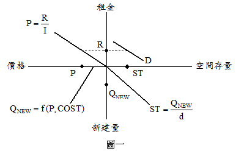

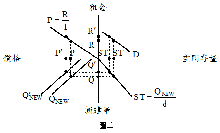

## 895. 所有權住宅、地上權住宅及使用權住宅(二)
*發布日期: 2017-05-25* 

## 內文
接續上篇...

茲以購屋者立場就所有權住宅、地上權住宅及使用權住宅三者比較如下：

• T. ABLE_PLACEHOLDER_1
---
*注：本文圖片存放於 ./images/ 目錄下*

## 896. 所有權住宅、地上權住宅及使用權住宅(一)
*發布日期: 2017-05-18* 

## 內文
現行，建設公司出售之住宅種類大致分為所有權住宅、地上權住宅及使用權住宅等三種。

• (一) 所有權住宅：建設公司購買土地興建房屋出售。購屋者向建設公司購買房地後，對土地擁有所有權，對建物擁有所有權。一般坊間之住宅大都屬於此類。

• (二) 地上權住宅：建設公司向政府標得土地之地上權後，興建房屋出售。購屋者向建設公司購買房地後，對土地僅擁有地上權而無所有權，對建物擁有所有權。

• (三) 使用權住宅：建設公司向政府標得土地之地上權，但政府限制得標者地上權移轉或地上權分割移轉。建設公司興建房屋後，僅能出售房地之使用權，土地之地上權及建物之所有權仍屬建設公司所有。購屋者向建設公司購買房地後，對土地及建物僅擁有使用權。

待續...
---
*注：本文圖片存放於 ./images/ 目錄下*

## 897. 土地登記模擬考題(二)
*發布日期: 2017-05-11* 

## 內文
何謂破產登記？土地經破產登記後之新登記，登記機關如何處理？又，破產管理人就破產財團所屬土地申請權利變更登記時，應提出哪些文件？

【解答】

• (一) 破產登記之意義：債務人不能清償其債務，為兼顧債權人與債務人之利益，就債權人或債務人之聲請，或依職權宣告債務人破產。法院為破產宣告時，就破產人或破產財團之有關登記，應即通知該登記機關，囑託為破產之登記。破產人因破產之宣告，對於應屬破產財團之財產，喪失其管理及處分權。

• (二) 土地經破產登記後之新登記：土地經辦理破產登記後，未為塗銷前，登記機關應停止與其權利有關之新登記。但有下列情形之一為登記者，不在此限：

1. 徵收、區段徵收或照價收買。

2. 公同共有繼承。

3. 其他無礙禁止處分之登記。

• (三) 破產管理人處分破產財團所屬之土地：破產管理人就破產財團所屬土地申請權利變更登記時，除依土地登記規則第三十四條規定辦理外，應提出破產管理人、監查人之資格證明文件與監查人之同意書或法院之證明文件。
---
*注：本文圖片存放於 ./images/ 目錄下*

## 898. 土地登記模擬考題(一)
*發布日期: 2017-05-04* 

## 內文
申請建物所有權第一次登記，若建物與基地非屬同一人所有者，在何種情形免附使用基地之證明文件？

【解答】

• (一) 實施建築管理前建造之建物：有下列情形之一者，免附基地所有權人同意

使用之證明文件：

1. 申請人為地上權人或典權人。

2. 因法院拍賣移轉取得建物者。

3. 日據時期已登記之建物。

4. 占用基地經法院判決確定有使用權利者。

5. 租用他人土地建築房屋且提出土地使用證明者。

• (二) 實施建築管理後建造之建物：實施建築管理後，申請建物所有權第一次登記，應檢附使用執照。爰取得使用執照前，須先取得建造執照。申請建造執照時，如申請人與基地所有權人非同一人，應提出使用基地之證明文件。此一情形，業經建管機關審核通過，登記機關不必重複審查。因此，實施建築管理後，若申請人與基地所有權人非同一人，如已提出使用執照，就免附使用基地之證明文件。
---
*注：本文圖片存放於 ./images/ 目錄下*

## 899. 最新法律修正，先睹為快
*發布日期: 2017-04-27* 

## 內文
• (一) 修正平均地權條例第十四條及第十七條條文 (106年4月21日立法院三讀通過)

第十四條規定地價後，每二年重新規定地價一次。但必要時得延長之。重新規定地價者，亦同。

第十七條已規定地價之土地，應按申報地價，依法徵收地價稅。應納地價稅額因公告地價調整致納稅義務人繳納困難者，得於規定繳納期間內，向稅捐稽徵機關申請延期或分期繳納，延期繳納期間不得逾六個月，分期繳納期間不得逾一年。前項延期或分期繳納辦法，直轄市及縣（市）政府得依社會經濟情況及實際需要定之。

• (二) 增訂遺產及贈與稅法第五十八條之二條文；並修正第十二條之一、第十三條及第十九條條文(106年4月25日立法院三讀通過)

第十二條之一本法規定之下列各項金額，每遇消費者物價指數較上次調整之指數累計上漲達百分之十以上時，自次年起按上漲程度調整之。調整金額以萬元為單位，未達萬元者按千元數四捨五入：一、免稅額。二、課稅級距金額。三、被繼承人日常生活必需之器具及用具、職業上之工具，不計入遺產總額之金額。四、被繼承人之配偶、直系血親卑親屬、父母、兄弟姊妹、祖父母扣除額、喪葬費扣除額及身心障礙特別扣除額。財政部於每年十二月底前，應依據前項規定，計算次年發生之繼承或贈與案件所應適用之各項金額後公告之。所稱消費者物價指數，指行政院主計總處公布，自前一年十一月起至該年十月底為止十二個月平均消費者物價指數。

第十三條遺產稅按被繼承人死亡時，依本法規定計算之遺產總額，減除第十七條、第十七條之一規定之各項扣除額及第十八條規定之免稅額後之課稅遺產淨額，依下列稅率課徵之：一、五千萬元以下者，課徵百分之十。二、超過五千萬元至一億元者，課徵五百萬元，加超過五千萬元部分之百分之十五。三、超過一億元者，課徵一千二百五十萬元，加超過一億元部分之百分之二十。

第十九條贈與稅按贈與人每年贈與總額，減除第二十一條規定之扣除額及第二十二條規定之免稅額後之課稅贈與淨額，依下列稅率課徵之：一、二千五百萬元以下者，課徵百分之十。二、超過二千五百萬元至五千萬元者，課徵二百五十萬元，加超過二千五百萬元部分之百分之十五。三、超過五千萬元者，課徵六百二十五萬元，加超過五千萬元部分之百分之二十。一年內有二次以上贈與者，應合併計算其贈與額，依前項規定計算稅額，減除其已繳之贈與稅額後，為當次之贈與稅額。

第五十八條之二本法中華民國一百零六年四月二十五日修正之條文施行後，依第十三條及第十九條第一項規定稅率課徵之遺產稅及贈與稅，屬稅率超過百分之十至百分之二十以內之稅課收入，撥入依長期照顧服務法設置之特種基金，用於長期照顧服務支出，不適用財政收支劃分法之規定。

• (三) 上述修正內容，將於本班總複習時詳細講解。
---
*注：本文圖片存放於 ./images/ 目錄下*

## 900. 房地市場價格分析(二)
*發布日期: 2017-04-20* 

## 內文
接續上篇...

• (三) 圖形分析：

[圖片1]

• A. B代表房地市場價格。CD代表土地貢獻價值。EF代表素地價格。MN代表建物成本價格。

1. 房地市場價格AB呈遞增現象，但邊際價格呈遞減趨勢。所稱邊際價格，即△P／△t，△t指時間變動量，△P指價格變動量。

2. 房地市場價格AB與土地貢獻價值CD之垂直間距，等於建物貢獻價值。由於土地存在增值，建物存在折舊，因此AB與CD之垂直間距逐漸縮小。

3. 素地價格EF呈遞增現象，且邊際價格(即△P／△t )亦呈遞增趨勢。

4. 建物成本價格MN呈遞減現象，此乃折舊所造成。

5. 在t1之前，產品價格大於原料價格，即原料製造成產品存有利潤。在t1之後，產品價格小於原料價格，即原料製造成產品存有虧損。因此，在t1之後，建物拆除重建可以考慮進行。

6. 在t2之後，素地價格大於房地市場價格，表示建物已無存在價值。因此，在t2之後建物拆除重建必須儘速進行。

## 文章圖片

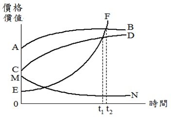

## 901. 房地市場價格分析(一)
*發布日期: 2017-04-13* 

## 內文
所稱房地市場價格，指建物及其基地之市價，亦即房地結合體之市價。本文所稱之價格，皆指總價而言。茲就原料與產品二方面分析說明：

• (一) 就原料而論：

1. 素地價格：指不考慮房地產品對土地價格之影響，而單就土地在最有效使用下之價格。土地有增值，而無折舊。

2. 建物成本價格：指不考慮房地產品對建物價格之影響，而單就建物在時間經歷下之價格。建物有折舊，而無增值。

3. 房地市場價格之構成：素地價格與建物成本之和，未必等於房地市場價格。亦即： 素地價格+建物成本價格≠房地市場價格茲分下列二種情形：(1)素地價格+建物成本價格＜房地市場價格：表示土地與建物二種原料結合而成為產品時，存在「利潤」。換言之，產品價格大於原料價格。通俗的說，麵包價格大於麵粉價格。(2)素地價格+建物成本價格＞房地市場價格：表示土地與建物二種原料結合而成為產品時，存在「虧損」。換言之，產品價格小於原料價格。通俗的說，麵包價格小於麵粉價格。

• (二) 就產品而論：

房地市場價格可以拆分為土地價格與建物價格二部份。前者稱為土地貢獻價值；後者稱為建物貢獻價值。亦即：房地市場價格=土地貢獻價值+建物貢獻價值

拆分之方法有三：

1. 土地貢獻說：將利潤或虧損歸屬於土地之貢獻。

2. 建物貢獻說：將利潤或虧損歸屬於建物之貢獻。

3. 聯合貢獻說：將利潤或虧損歸屬於土地及建物二者共同之貢獻。

[例題]

房地市場價格1,000萬元，素地價格700萬元，建物成本價格200萬元。1,000－700－200=100萬元(利潤)

1. 土地貢獻說：①土地貢獻價值：700+100=800萬元②建物貢獻價值：200萬元

2. 建物貢獻說：①土地貢獻價值：700萬元②建物貢獻價值：200+100=300萬元

3. 聯合貢獻說：①土地貢獻價值：[圖片1]②建物貢獻價值：[圖片2]

房地市場價格1,000萬元，素地價格900萬元，建物成本價格200萬元。1,000－900－200= -100萬元(虧損)

1. 土地貢獻說：①土地貢獻價值：900－100=800萬元②建物貢獻價值：200萬元

2. 建物貢獻說：①土地貢獻價值：900萬元②建物貢獻價值：200－100=100萬元

3. 聯合貢獻說：①土地貢獻價值：[圖片3]②建物貢獻價值：[圖片4]

待續...

## 文章圖片

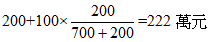

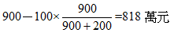

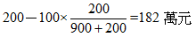

## 902. 不動產市場發生供不應求或供過於求對建物折舊及耐用年數有何影響？
*發布日期: 2017-03-30* 

## 內文
• (一) 對建物折舊之影響：所稱折舊，指建物因時間經過，所造成之價值減損。折舊分為物理性折舊（指實體損壞）、功能性折舊（指功能性退化）及經濟性折舊（指外部性退化）三種。

1. 當不動產市場發生供不應求時，房地價格上漲，故建物未發生折舊。

2. 當不動產市場發生供過於求時，房地價格下跌，故建物發生折舊。又，市場發生供過於求是外部性退化，故所發生之折舊屬於經濟性折舊。

• (二) 對耐用年數之影響：耐用年數有物理耐用年數與經濟耐用年數之分。前者指建物結構損壞而不堪使用之年數，後者指建物效益衰退而不值得使用之年數。

1. 當不動產市場發生供不應求時，現存老舊建物就值得更新重建，故會縮短經濟耐用年數，惟對物理耐用年數無影響。

2. 當不動產市場發生供過於求時，現存老舊建物就不值得更新重建，故會延長經濟耐用年數，惟對物理耐用年數無影響。
---
*注：本文圖片存放於 ./images/ 目錄下*

## 903. 不動產契約書
*發布日期: 2017-03-23* 

## 內文
不動產契約書有公契與私契之分。茲分述如下：

• (一) 公契：即公定契約書，契約書格式及內容由政府製作。依據民法第758條規定：「不動產物權，依法律行為而取得、設定、喪失及變更者，非經登記，不生效力。前項行為，應以書面為之。」此書面，如為雙方合意，即契約書。所稱契約書，指公契。

公契之性質屬於物權契約，作為課徵賦稅及土地登記之用。因此，公契所記載之買賣價格一般為課稅價格。

例如：

1. 土地登記規則第14條規定：「登記機關應備下列登記書表簿冊圖狀：一、登記申請書。二、登記清冊。三、契約書。......」所稱契約書，指公契。

2. 平均地權條例第47條規定：「土地所有權移轉或設定典權時，權利人及義務人應於訂定契約之日起三十日內，檢同契約及有關文件，共同申請土地所有權移轉或設定典權登記，並共同申報其土地移轉現值。......」所稱契約，指公契。

• (二) 私契：雙方合意所簽訂之契約書。此契約書無既定格式及內容。

私契之性質屬於債權契約，作為請求給付之用。因此，私契所記載之買賣價格一定為實際買賣價格。

例如：

1. 民法第166條之1規定：「契約以負擔不動產物權之移轉、設定或變更之義務為標的者，應由公證人作成公證書。......」所稱契約，指私契。

2. 所得稅法第14條之5規定：「個人有前條之交易所得或損失，......，檢附契約書影本及其他有關文件，向該管稽徵機關辦理申報；......」所稱契約書，指私契。

總之，不動產買賣簽訂二本契約書，先簽訂私契，再簽訂公契。二本契約書之用途不同，前者在履約契約之用，後者在辦理登記之用。

範題：甲向乙購買一筆土地，私契記載買賣總價1,000萬元，公契記載買賣總價600萬元。雙方於私契約定，甲於簽約先支付600萬元，尾款400萬元於辦竣登記後支付。日後，俟辦竣登記，乙請求給付尾款，甲主張公契明文記載買賣總價600萬元，故甲拒絕給付餘款400萬元，請問甲主張是否有理？

【解答】甲主張不合理。乙得依據「私契」訴請法院請求給付。
---
*注：本文圖片存放於 ./images/ 目錄下*

## 904. 土地登記規則新修正內容
*發布日期: 2017-03-16* 

## 內文
土地登記規則於106年2月14日修正發布，共修正四個條文。修正內容有二：

• (一) 刪除地目等則登記：106年1月1日正式廢除地目等則制度，爰修正土地登記規則第29條及第85條，將有關地目等則規定予以刪除。

• (二) 暫編建號編造建物登記簿均於標示部其他登記事項欄辦理登記：

1. 土地登記規則第117條之預為抵押權登記，須暫編建號，編造建物登記簿，舊條文於「他項權利部」辦理登記，現修正於「標示部其他登記事項欄」辦理登記。

2. 土地登記規則第139條之未登記建物辦理查封登記，須暫編建號，編造建物登記簿，舊條文於「所有權部」辦理登記，現修正於「標示部其他登記事項欄」辦理登記。

附帶一提，我的土地登記課程於106年3月19日(星期日)早上9:30開課。我的上課方式有別於其他老師，請同學好好「享受上課」。
---
*注：本文圖片存放於 ./images/ 目錄下*

## 905. 享受考試
*發布日期: 2017-03-09* 

## 內文
今年(2017年)澳網是由費德勒(Federer)與納達爾(Nadal)二位前球王爭冠。費德勒已經35歲，納達爾也已經30歲，二人最近都受傷痛所苦，好一陣子未參加比賽。參加今年的澳網，只是為了「享受比賽」。

費德勒的單手反拍，納達爾的上旋回球，頂尖對決，高潮迭起，直到第五盤(最後一盤)才分出勝負。但勝負已經不重要了，因為他們都在「享受比賽」。

參加考試，就如同參加比賽。準備考試過程，有喜悅也有挫折，有高潮也有低潮。但無論如何，都應該樂觀的面對，以「享受考試」的心情準備考試。
---
*注：本文圖片存放於 ./images/ 目錄下*

## 906. 停車位之產權登記《二》
*發布日期: 2017-03-02* 

## 內文
• (三) 停車位產權採分別共有(即持份共有)方式持有，故須另訂分管契約加以特定，糾紛常起。內政部乃於民國85年9月7日以台內地字第8580947號函規定，停車位得於建物登記簿編號登記，停車位產權始走向特定化。

• (四) 有獨立權狀之車位採分別共有(即持份共有)方式持有，因此出售停車位時，依土地法第34條之1第4項規定，其他共有人有優先購買權，造成出售車位之困擾。內政部乃於95年1月17日以內授中辦地字第0950724925號函規定，地下室停車位連同所屬基地應有部分一併移轉時，如該停車位均登記有建物持分、獨立權狀及特定位置可依編號單獨進出，權利人並得自由使用、收益及處分者，他共有人無優先購買權。

• (五) 一般而言，有獨立權狀之車位有土地持分。然無獨立權狀之車位，早期有的有土地持分，有的無土地持分。晚近，無獨立權狀之車位大都有土地持分，且一個車位固定為一萬分之一、一萬分之二或二萬分之一等。

• (六) 停車位分為有獨立權狀車位與無獨立權狀車位二種。前者可以外賣，後者不可以外賣。增設車位及獎勵車位如符合規定條件，可以登記為有獨立權狀車位；法定車位不可以登記為有獨立權狀車位。然部分投機建商為使大樓過剩的停車位可以外賣，規劃有獨立建號之一小間建物(如儲藏室、管理室等)，將眾多車位掛在此一建物上，而成為有獨立權狀車位，而得以外賣。
---
*注：本文圖片存放於 ./images/ 目錄下*

## 907. 停車位之產權登記《一》
*發布日期: 2017-02-23* 

## 內文
停車位分為法定車位、增設車位及獎勵車位三種。所稱法定車位，指依建築相關法規規定，建築物依用途、樓地板面積等指標計算，所必須設置之停車位。增設車位，指建築物除法定車位以外，所增加設置之停車位。獎勵車位，指政府為解決停車位不足，以增加容積率鼓勵建物增設停車位。

法定車位及增設車位，免計入容積率。獎勵車位，除免計入容積率外，另給予增加容積率之鼓勵。

現行停車位之產權登記如下：

• (一) 法定車位不得以主建物登載，而應於共有部分登載。因此，無法單獨取得所有權狀(即無獨立權狀之車位)，故不可以賣給區分所有權人以外的人(即不可外賣)。

• (二) 增設車位或獎勵車位，如與法定車位明顯區隔(不同樓層或同一樓層經隔間)，且經戶政機關編列有所在地址證明，並由全體起造人協議認定非屬共同使用性質，得單獨編列建號，以主建物記載，取得所有權狀(即有獨立權狀之車位)，就可以賣給區分所有權人以外的人(即可以外賣)

(待續…)

好書逗相報

我的「土地法規」小法典(第六版)於今年2月新鮮問市。本次改版，除更新法規及添加新試題外，最值得推薦的是，司法院大法官解釋(不動產部份)逐號析論，坊間難得一見。該書由元照出版，元照電話(02)23756688。
---
*注：本文圖片存放於 ./images/ 目錄下*

## 908. 都市發展過程的三種現象
*發布日期: 2017-02-16* 

## 內文
都市發展過程中，都市形成期有都市化現象，都市成熟期有郊區化現象，都市沒落期有仕紳化現象。茲分析如下：

• (一) 都市化現象：所稱都市化，指鄉村人口往都市集中之過程。因工商活動之興起，鄉村人口逐漸往都市移動，而形成都市。

• (二) 郊區化現象：所稱郊區化，指市中心人口向郊區分散之過程。當市中心人口過度集中，造成地價上漲、公共設施不足及居住環境惡化，因此人口逐漸往郊區移動。

• (三) 仕紳化現象：所稱仕紳化，指舊市區從原本聚集低收入者，俟更新重建後，房租及房價上漲，而吸引高收入者之遷入。老舊市區經過都市更新後，起死回生，重現生機，除資本回流外，並吸引高收入者之進住。

[圖片1]

## 文章圖片

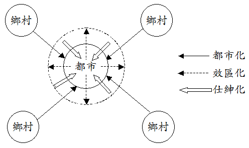

## 909. 老舊建物拆除重建之時機
*發布日期: 2017-02-09* 

## 內文
建物使用一段時間後，通常會發生老舊衰頹而遭到拆除重建，試問拆除重建或土地再開發之時機如何決定？如圖所示，AB代表潛在房地總價(指土地在最有效使用下所規劃興建建物之房地總價)，AC代表實際房地總價(指目前實際建物之房地總價)。

當建物興建完成初期，土地上之建物符合當時之最有效使用，潛在房地總價等於實際房地總價，故無間隙現象。隨著時間之增加，一方面都市逐漸成長與擴張，造成潛在房地總價不斷上升；另一方面，原有建物逐漸老舊，造成實際房地總價不斷下降。因此，潛在房地總價與實際房地總價之間隙產生，並逐漸拉大。

當間隙拉大至足以涵蓋興建新建物之營建成本(假設為[圖片1])，則老舊建物就值得拆除重建。如圖所示，當建物使用至t0時，就值得拆除重建。又，當政府推行容積獎勵或容積移轉時，將使潛在房地總價由AB上移至AD，設(假設為[圖片2]，則老舊建物拆除重建時機提前至t1進行。

[圖片3]

如圖所示，EF代表素地價格(指不考慮建物對土地之影響，單就土地在最有效使用下之地價)。當素地價格等於實際房地總價，如圖中之K點，則老舊建物已無存在價值，應該立即拆除重建。總之，當建物使用至t0時，就「值得」拆除重建；當建物使用至t2時，就「應該」拆除重建。

此外，值得一提的是，從事房地估價時，在K點之前，評估房地價格，即評估實際房地總價AK；在K點之後，評估土地價格，即評估素地價格KF。

## 文章圖片

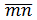

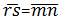

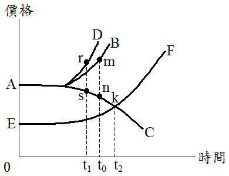

## 910. 實價登錄資料之真實性存疑
*發布日期: 2017-01-26* 

## 內文
實價申報如在不影響賣方權益下，基於下列動機，常會發生以少報多之不實申報：

• (一) 提高申報價格，以增加向銀行貸款額度。

• (二) 提高申報價格，以減少買方日後出售之房地合一所得稅。

• (三) 提高申報價格，以利於周遭餘屋之銷售。

此外，利用平均地權條例第81條之2之規定，不由地政士或不動產經紀人申報，而由買方自行申報，縱使被查到也不處罰，改正再真實申報即可。況且被處罰也只罰3萬元以上15萬元以下，不痛不癢，不實申報之所獲利益與被處罰金額不成比例。

綜上，從事不動產估價蒐集實例，如以實價登錄資料作為比較標的，應謹慎為之。
---
*注：本文圖片存放於 ./images/ 目錄下*

## 911. 一個國家，兩種建物面積測繪規定～106年1月9日地籍測量實施規則修正發布
*發布日期: 2017-01-19* 

## 內文
現制，建管單位之建築執照面積（包括建造執照平面圖及使用執照竣工平面圖）與地政單位之建物登記面積，兩者之測繪規定不同：

• (一) 建管單位：

1. 獨立建物，以其外牆之中心線為界。

2. 兩建物，以其共用牆壁之中心線為界。

3. 陽台，以其中心線為界。

4. 地下層，以其外牆之中心線為界。

• (二) 地政單位：

1. 獨立建物，以其外牆之外緣線為界。

2. 兩建物，以其共用牆壁之中心線為界。

3. 陽台，以其外緣線為界。

4. 地下層，以其外牆之中心線為界。

基上，地政單位之建物登記面積大於建管單位之建築執照面積。又，建物銷售面積以登記面積為準，因此建物銷售面積大於建物執照面積。

106年1月9日地籍測量實施規則第273條修正，除刪除雨遮及屋簷辦理附屬建物測量外，地下層測繪邊界由外牆之外緣改為外牆之中心。須注意者，上開修正自107年1月2日以後申請建造執照始適用。

另外，因應地籍測量實施規則第273條有關地下層測繪之新規定，公寓大廈管理條例第56條第3項第4款應配合修正。
---
*注：本文圖片存放於 ./images/ 目錄下*

## 912. 只有鳥能站的地方，不得測量登記～106年1月9日地籍測量實施規則修正發布
*發布日期: 2017-01-12* 

## 內文
區分所有建物之面積分為專有部分及共有部分(附帶說明的是，民法稱之為共有部分，公寓大廈管理條例稱之為共用部分)。專有部分包括主建物面積及附屬建物面積。基此，區分所有建物面積包括主建物面積、附屬建物面積及共有部分面積三項。茲分述如下：

• (一) 主建物面積：指建物之室內面積，為區分所有權人實際使用之最重要部分。

• (二) 附屬建物面積：附屬建物登記之變革分四階段說明。

1. 第一階段：僅騎樓、陽台、雨遮及屋簷可以登記為附屬建物。早期，附屬建物之登記項目琳瑯滿目，未受限制。內政部於85年6月4日以台內地字第8575210號函文規定，附屬建物除騎樓、陽台、平台、屋簷、雨遮等外，其他如露台、花台、花棚、裝飾牆、栽植槽等不予辦理產權登記。另，依「建物所有權第一次登記法令補充規定」第11點規定，區分所有建物之騎樓，除主管建築機關備查之圖說標示為專有部分外，應以共有部分辦理登記。附帶說明的是，平台即陽台，一樓稱為平台，二樓以上稱為陽台，雨遮設置於窗戶或冷氣孔上方，供遮雨防曬之用。屋簷指斜屋頂或平屋頂突出建物外牆部分，以阻擋雨水注入屋內。

2. 第二階段：雨遮及屋簷可以登記，亦可以計價。雨遮及屋簷無法提供民眾生活滯留使用，故對購屋者而言不具實用性，只是買到只能站鳥、不能站人的虛坪。況且雨遮及屋簷等虛坪增加，將使公共設施比例(即共有部分面積/建物總面積)下降，誤導購屋者。

3. 第三階段：雨遮及屋簷可以登記，但不可以計價。「預售屋買賣定型化契約應記載及不得記載事項」規定，自100年5月1日起，附屬建物除陽台外，其餘項目不得計入買賣價格。換言之，預售屋之雨遮及屋簷可以登記，但不可以計價。雨遮及屋簷雖不得計價，但建商將其價格灌入總價中，因此房屋整體之平均售價未受影響。況且雨遮及屋簷不得計價僅限於預售案，交屋後之成屋買賣仍可以計價。如此，購屋者仍未享有實益，卻造成市場交易之混亂。

4. 第四階段：雨遮及屋簷不可以登記，亦不可以計價。106年1月9日修正發布地籍測量實施規則第273條，自107年1月2日以後申請建造執照之建物，附屬建物僅陽台可以測量登記，雨遮及屋簷不可以測量登記。換言之，107年1月2日以後申請建造執照之新案，雨遮及屋簷不可以登記，且不可以計價。

• (三) 共有部分面積：指區分所有建物專有部分以外之其他部分及不屬於專有部分之附屬建物，而供共 同使用者。坊間俗稱「公共設施」。實務上，公共設施又有「大公」與「小公」之分。前者指區分所有建物之屋頂突出物及地下室法定防空避難室、蓄水池、配電室等全體區分所有權人皆須共同使用的空間。後者指僅各區分所有權人實際使用部份之各層樓梯及電梯等空間。
---
*注：本文圖片存放於 ./images/ 目錄下*

## 913. 區段徵收抵價地補償之問題
*發布日期: 2017-01-05* 

## 內文
區段徵收之補償方式有兩種，其一為現金補償，另一為抵價地補償。抵價地補償為現金補償之替代物。準此，抵價地價值應與現金補償相當，始符合土地徵收補償之原理。換言之，若抵價地價值高於或低於現金補償，均違反土地徵收條例第30條之市價補償精神。

依土地徵收條例第44條第1項第1款規定，土地所有權人應領回抵價地之面積，由該管直轄市或縣（市）主管機關按其應領地價補償費與區段徵收補償地價總額之比率計算其應領之權利價值，並以實際領回抵價地之單位地價折算之。準此，其計算方法如下：

1. 先決定抵價地總面積。即：徵收土地總面積×抵價地比例（抵價地比例為40%～50%）

2. 嗣決定抵價地總地價。即：抵價地分配之各街廓面積×各該分配街廓評定之單位地價

3. 再決定各原土地所有權人應領回抵價地之權利價值。即：抵價地總地價×[圖片1]

4. 最後決定各原土地所有權人領回抵價地之面積。即：各原土地所有權人應領回抵價地之權利價值÷領回土地之評定單位地價

由上述分析可知，原土地所有權人領回抵價地之價值受領回抵價地面積大小及抵價地單價高低之影響。又，原土地所有權人領回抵價地之面積大小又受徵收土地總面積、抵價地比例、該土地所有權人應領地價補償費占區段徵收補償地價總額之比例、抵價地之評定單位地價等因素之影響。

總之，原土地所有權人領回抵價地之價值與市價現金補償脫節。倘領回抵價地之價值大於市價現金補償，則原土地所有權人選擇領回抵價地；倘領回抵價地之價值小於市價現金補償，則原土地所有權人選擇領取現金。如此，原土地所有權人領回抵價地有暴利現象，造成官商勾結。地方政府以推動土地開發建設為名，行炒作投機之實，以充實地方財政收入。

## 文章圖片

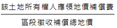

## 914. 都市更新整合不易成功之原因
*發布日期: 2016-12-29* 

## 內文
推動都市更新過程中，有的住戶較積極，有的住戶較消極。前者稱為積極型住戶，後者稱為消極型住戶。

1. 積極型住戶，配合度較高，希望能促成都更案，故其參與都市更新之意願曲線，彈性較大，如圖之[圖片1]。

2. 消極型住戶，配合度較低，甚至會有拿翹行為，故其參與都市更新之意願曲線，彈性較小，如圖之[圖片2]。

另，實施者因住戶要價愈高，推動都更案之意願愈低；因住戶要價愈低，推動都更案之意願愈高。因此，實施者推動都更案之意願曲線，如圖之[圖片3]。

由[圖片4]與[圖片5]之交點，決定積極型住戶之協商要價為P0。[圖片6]與[圖片7]之交點，決定消極型住戶之協商要價為P1。由此可知，積極型住戶之協商要價較低，消極型住戶之協商要價較高。換個角度分析，相同不動產分配標準，要價低之積極型住戶贊成，要價高之消極型住戶反對，造成都市更新整合不易成功。

[圖片8]

## 文章圖片

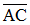

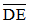

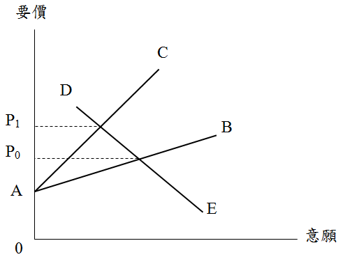

## 915. 從105年12月9日公布之大法官解釋第742號談起
*發布日期: 2016-12-22* 

## 內文
司法院大法官解釋之效力在憲法之下、法律之上，且其解釋常突破傳統框架，引領進步的法學觀念。因此，司法院大法官解釋文常為命題的焦點。

茲以司法院釋字第156號及第742號為例，設計明年可能會出現的考題如下：

◎都市計畫之新訂、通盤檢討及個案變更，影響人民權益甚鉅，人民對之得否提起訴願或行政訴訟？試依司法院釋字第156號及第742號解釋意旨申論之。

【解答】

都市計畫分為新訂與變更。都市計畫變更又分為通盤檢討(即定期變更)與個案變更(即臨時變更)。茲分述如下：

• (一) 都市計畫之新訂：

1. 都市計畫新訂屬於法規性質，非屬行政處分，人民對之不得提起訴願或行政訴訟。

2. 都市計畫之訂定，影響人民權益甚鉅，立法機關應於司法院釋字第742號解釋公布之日(105年12月9日公布)起二年內增訂相關規定(增訂於都市計畫法)，使人民得就違法之都市計畫，認為損害其權利或法律上利益者，提起訴訟以資救濟。如逾期未增訂，自該解釋公布之日起二年後發布之都市計畫，其救濟應準用訴願法及行政訴訟法有關違法行政處分之救濟規定。

• (二) 都市計畫之通盤檢討：

1. 原則：(1)都市計畫通盤檢討屬於法規性質，非屬行政處分，人民對之不得提起訴願或行政訴訟。(2)都市計畫之定期通盤檢討變更，影響人民權益甚鉅。立法機關應於司法院釋字第742號解釋公布之日(105年12月9日公布)起二年內增訂相關規定(增訂於都市計畫法)，使人民得就違法之都市計畫，認為損害其權利或法律上利益者，提起訴訟以資救濟。如逾期未增訂，自該解釋公布之日起二年後都市計畫之定期通盤檢討變更，其救濟應準用訴願法及行政訴訟法有關違法行政處分之救濟規定。

2. 例外：都市計畫通盤檢討，如其中具體項目有直接限制一定區域內特定人或可得確定多數人之權益或增加其負擔者，有行政處分之性質，應許其就該部份提起訴願或行政訴訟以資救濟。申言之，由於定期通盤檢討所可能納入都市計畫內容之範圍並無明確限制，其個別項目之內容有無直接限制一定區域內特定人或可得確定多數人之權益或增加負擔，不能一概而論。訴願機關及行政法院自應就個案審查定期通盤檢討公告內個別項目之具體內容，判斷其有無個案變更之性質，亦即是否直接限制一定區域內特定人或可得確定多數人之權益或增加負擔，以決定是否屬行政處分之性質及得否提起行政爭訟。如經認定為個案變更而有行政處分之性質者，基於有權利即有救濟之憲法原則，應許其就該部分提起訴願或行政訴訟以資救濟。

• (三) 都市計畫之個案變更：主管機關變更都市計畫(指個案變更)，係公法上之單方行政行為，如直接限制一定區域內人民之權利、利益或增加其負擔，即具有行政處分之性質，其因而致特定人或可得確定之多數人之權益遭受不當或違法之損害者，自應許其提起訴願或行政訴訟以資救濟。

以上所舉之題目，是不是非常漂亮！希望參加明年考試同學的留意本題。
---
*注：本文圖片存放於 ./images/ 目錄下*

## 916. 105年地方政府考試的二件奇妙事
*發布日期: 2016-12-15* 

## 內文
• 一、我在今年11月17日臉書發表：「區段徵收制度之存廢問題」，今年12月11日地方政府三等考試土地政策的第四題：

近年來土地徵收的問題爭議不斷，其中重大的爭議之一為徵收過多或過於浮濫。請問土地徵收的要件為何？試從土地徵收的要件分析區段徵收的存廢。(25分)。

• 二、我在今年9月的新版土地法規(第17版)新增一題實例題(在該書P8-178第160題)：

甲、乙二人共有一筆土地，應有部分各二分之一。嗣甲死亡，應有部分由其子A、B、C三人公同共有繼承登記，應繼分各三分之一。不久，A、B二人未經C之同意，將A、B、C三人公同共有之應有部分出售於丙，其效力為何？何人有優先購買權？

答：(一)共有土地之應有部分為公同共有者，該應有部分之處分，得依土地法第三十四條之一第一項規定辦理。準此，A、B二人未經C之同意，則共有人數過半數及其潛在應有部分(即應繼分)合計過半數之同意，將A、B、C三人公同共有之應有部分出售於丙，其買賣為有效。

• (二) 乙及C均有優先購買權。乙係該地共有人，基於土地法第三十四條之一第四項規定，對出售之應有部分有優先購買權。C係出售應有部分之不同意公同共有人，對出售應有部分全部有優先購買權。二人同時主張時，則按應有部分及潛在應有部分(即應繼分)之比率定之。即乙優先購買八分之三，C優先購買八分之一。乙：[圖片1]C：[圖片2]

今年12月10日地方政府三等考試土地法規的第一題，與上開實例題相仿：

甲與乙兩人分別共有一地，甲之應有部分為四分之三，乙之應有部分為四分之一(下稱系爭土地)，嗣後乙死亡，其應有部分由丙與丁兩人繼承，丙之應繼分為五分之四，丁則為五分之一。……。當丙出賣系爭土地時，倘若甲與丁均行使先買權時，如何處理？試分述之。(25分)

答：丙出賣系爭土地，甲與丁均行使先買權，處理方式如下：甲及丁均有優先購買權。甲係該地共有人，基於土地法第34條之1第4項規定，對出售之應有部分有優先購買權。丁係出售應有部分之不同意公同共有人，對出售應有部分全部有優先購買權。二人同時主張時，則按應有部分及潛在應有部分（即應繼分）之比率定之。即甲優先購買六十四分之十五，丁優先購買六十四分之一。甲：[圖片3]丁：[圖片4]

以上所談的二件事，真的很奇妙！

## 文章圖片

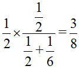

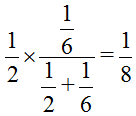

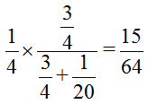

## 917. 自動穩定機制
*發布日期: 2016-12-01* 

## 內文
經濟景氣時，人民之所得提高，所得稅增加，抑制經濟過度繁榮，避免通貨膨脹惡化。相反地，經濟不景氣時，人民之所得降低，所得稅減少，移轉性支付(如失業救濟金等)增加，抑制經濟過度蕭條，避免失業擴大。由此可知，所得稅對經濟活動具有自動穩定機制。現在，以自動穩定機制來探討地價稅及土地增值稅。地價稅為持有稅，土地增值稅為移轉稅。

地價稅之稅基源自公告地價。公告地價每三年規定一次，且規定地價所蒐集之實例為過去一年內買賣實例。當房地產景氣時，公告地價僅微幅調整，百姓之地價稅負擔增加有限。當房地產不景氣時，公告地價始大幅調整，百姓之地價稅負擔大幅加重。因此，造成人民反彈，也造成稅負不公平負擔。

土地增值稅之稅基源自公告土地現值。公告土地現值每年規定一次，且土地現值查估所蒐集之實例為過去一年內買賣實例。當房地產景氣時，為避免調高公告土地現值帶動土地市價上漲，公告土地現值調幅有限。當房地產不景氣時，調高公告土地現值不致於帶動土地市價上漲，此時始大幅調高公告土地現值。因此，造成土地增值稅之政策效果(如打擊投機)無法發揮，也造成享受增值者未負擔土地增值稅，而由接手之未享受增值者負擔，稅負不公平負擔。

綜上，公告地價及公告土地現值之調整存在時間落後，造成人民觀感不佳；更嚴重的是由於公告地價及公告土地現值調整深受人為干擾(如上級政策指示、地價評議委員會之審議等)，造成地價稅及土地增值稅不具有自動穩定機制，反而有反穩定現象。

好課報報

參加106年地政高考、不動產估價師考試的同學請勿錯過了！我的第一堂課於105年12月18日（星期日）早上9：30開課，一連貫密集的正規課程，接著總複習加強課程，直到明年的考前為止。只有實實在在的耕耘，才會有豐碩的上榜成績。讓我們一起加油吧！

另外，提醒同學105年12月14日（星期三）18：30舉辦「不動產時事專題研討」，主題：「評析最近二年之大法官解釋－釋字第731號、第732號及第739號」，歡迎同學踴躍參加。
---
*注：本文圖片存放於 ./images/ 目錄下*

## 918. 105年不動產經紀人試題總評
*發布日期: 2016-11-24* 

## 內文
• 一、不動產估價概要：

今年申論題共二題，一題考折舊路徑，另一題考資本利息綜合利率。前者應繪圖說明，後者附實例計算。今年我個人之總複習方式採「考古題」與「應出但尚未出之重要考題」二軌並行。前者由學生自行閱讀「不動產經紀人申論題歷屆試題精解」，果然第二題就與95年之考古題相仿；後者由我針對本科選出10題，第一題就出自第2題「何謂折舊？造成折舊之因素有那些？折舊路徑之種類？」，果然神準！今年測驗題共40題，大都出自不動產估價技術規則，簡單容易，應可拿高分。

• 二、土地法與土地相關稅法概要：

今年申論題共二題，一題考不得私有之十種土地，另一題考累進起點地價及地價稅之稅率。同樣地，第一題為考古題，與88年之考古題相仿，第二題就出自我針對本科選出「應出但尚未出之重要考題」共12題的7題「試述地價稅之稅率結構？」，真是巧合！今年申論題共40題，有22題實例題，對參加普考級同學的實力而言，有夠殺！有夠澀！還好，選擇題如果不會可以猜，猜中機率25％。

• 三、不動產經紀相關法規概要：

今年申論題共二題，一題考應經紀人簽章之文件，另一題考不動產說明書有關土地（素地）「使用管制內容」之應記載事項。同樣地，第一題為考古題，與90年第1次特考相仿，第二題為從未出過之冷僻考題。平心而論，以上所述三科六題申論，只有這一題未抓到。須提醒同學的是，仍要用所學的相關知識填滿，試想「土地使用管制」，不外是都市土地之分區及非都市土地之11種分區19種用地及有關建蔽率與容積率等，從這個角度去發揮就是了。今年測驗題共40題，大都從四大法律之法條直接命題，較無艱澀冷僻題目。

總之，今年之不動產估價概要、不動產經紀相關法規概要二科較容易，土地法與土地相關稅法概要，民法概要二科較困難，截長補短，現在只剩下國文一科決勝負。

最後，預祝各位考生金榜題名。
---
*注：本文圖片存放於 ./images/ 目錄下*

## 919. 區段徵收制度之存廢問題
*發布日期: 2016-11-17* 

## 內文
最近，鑑於區段徵收之爭議不斷，有立法委員主張廢除區段徵收制度，一律回歸適用土地徵收（即一般徵收）之規定。

我個人認為區段徵收之最大問題在於下列五點：

1. 違反土地徵收之必要性原則：土地徵收條例第3條規定，徵收之範圍，應以其事業所必須者為限。準此，需地機關舉辦之事業需地10公頃，徵收之面積應為10公頃。然，現行區段徵收舉辦之事業需地10公頃，為使原土地所有權人領回抵價地，故擴大徵收面積，可能高達20公頃。

2. 抵價地補償偏離市價徵收補償標準：區段徵收之補償方式有兩種，一為現金補償，另一為抵價地補償。抵價地為現金補償之替代物。換言之，領回抵價地之價值應與土地徵收條例第30條之市價補償標準相符。然，區段徵收之領回抵價地面積，係先決定抵價地總面積，即抵價地總面積為區段徵收總面積之40%～50%；然後再由各所有權人按應領補償地價與區段徵收補償地價之比率分享抵價地總面積。因此，領回抵價地之多寡與市價現金補償無關。換言之，土地所有權人領回抵價地之價值有可能大於被徵收土地之地價，亦有可能小於被徵收土地之地價。

3. 實施區段徵收之原因未嚴格界定：依土地徵收條例第4條第1項規定，得為區段徵收之情形非常籠統，諸如非都市土地實施開發建設等是，造成區段徵收之浮濫。

4. 各方爭食變更利益：一般而言，區段徵收涉及土地用途變更，如都市土地農業區或保護區變更為建築用地、工業區變更為住宅區或商業區、非都市土地開發為建築用地等是。龐大之土地變更利益，政商勾結，分食大餅。

5. 地方政府處分土地未受監督：區段徵收之實施主體一般為直轄市、縣（市）政府，而直轄市、縣（市）政府處分開發完成後之可建築用地，不受土地法第25條之限制（參見平均地權條例第7條）。換言之，直轄市、縣（市）政府處分區段徵收而取得之土地，不須受該管民意機關之同意及行政院之核准。此舉造成直轄市、縣（市）政府樂於採用區段徵收開發土地，以便上下其手。

以上種種問題如未獲改善，廢除區段徵收制度，一律回歸適用土地徵收規定，有何不可！
---
*注：本文圖片存放於 ./images/ 目錄下*

## 920. 精準地價與自動估價系統
*發布日期: 2016-11-10* 

## 內文
據2016年11月3日自由時報刊載，內政部研擬以實價大量查估運算而得之「精準地價」，取代現行公告地價、公告土地現值，以回歸市場機制。換言之，採行自動估價系統(Automated Valuation Model，簡稱AVM)進行不動產估價作業，更精準反應市價，減少人為控制因素。

所稱自動估價系統，指應用計量模型，藉助電腦運算，查估多數量不動產價格。其方法首先蒐集交易實例(即樣本)，再以交易實例建立計量模型，最後以計量模型推估不動產價格。

採行運用自動估價系統之困難如下：

• (一) 樣本數太少：雖然現行內政部已實施不動產交易實價登錄制度，但有些地方交易不熱絡，缺乏實例資料。另外，內政部之實價登錄資料，未盡詳細，有的變數資料缺乏，致應用效果受限。

• (二) 異質性太大：不動產之異質性愈大，AVM愈難應用。公寓大樓應用效果最佳，其次為透天房屋，再次為純土地，特殊產品(如百貨公司、醫院、旅館等)最難應用。

• (三) 影響因子太多：影響不動產價格之因子很多，建立模型時，將選擇一些影響因子，捨棄另一些影響因子。如果捨棄者為主要影響因子，則計量模型之解釋能力將變差。另外，有的影響因子難以量化造成應用困難。

綜上，實施精準地價及推動自動估價系統，還有一段很長的路要走。
---
*注：本文圖片存放於 ./images/ 目錄下*

## 921. 地價稅之變革
*發布日期: 2016-11-03* 

## 內文
地價稅於本月（即11月）開徵，由於今年有重新規定地價（規定地價每三年一次），故今年地價稅負擔與去年不同。據報載今年地價稅較去年平均增加三成，再加上今年房屋稅較往年加重，造成民眾稅負突然增加。因此，有改革地價稅之議，主要有二：

• 一、重新規定地價之期間，由三年縮短為二年。此舉只要修正平均地權條例第14條即可，簡單容易，故爭議較少。

• 二、地價稅與房屋稅合併課稅，合併後之名稱暫定為不動產稅。此舉茲事體大，現行地價稅與房屋稅分開課稅之理由如下：

1. 土地與建物之性質不同：土地隨時間而增值，建物隨時間而折舊，故宜分開定價，分別課稅。

2. 土地與建物之課稅目的不同：土地政策在鼓勵土地投資，打擊土地投機，故地價稅之輕重有其政策功能。學理上認為地價稅應從重，房屋稅應從輕。如果土地與建物合併課徵不動產稅，對土地課稅之政策功能將因而喪失。

3. 土地與建物之評估方法不同：如果土地與建物分開課稅，評估土地可採比較法及土地開發分析法，評估建物可採成本法，此時估價兼顧地坪與建坪。如果土地與建物合併課稅，評估房地可採比較法，此時估價只著重建坪，而忽略地坪。

4. 地價稅與房屋稅之理論基礎不同：地價稅屬於收益稅性質，對素地價格課稅，不及於土地改良物，以鼓勵土地投資；相對地，土地閒置，其地價稅不因而減輕，反而應課徵空地稅或荒地稅（現未開徵），故地價稅有持有成本及固定成本之課徵效果。至於房屋稅屬於財產稅性質，興建愈高，房屋稅愈重，反而不利於土地利用。

綜上，土地法第145條規定：「土地及其改良物之價值，應分別規定。」道理在此。
---
*注：本文圖片存放於 ./images/ 目錄下*

## 922. 海洋之子-海域區及海域用地之使用與管制
*發布日期: 2016-10-27* 

## 內文
非都市土地原為10種分區、18種用地，現變更為11種分區、19種用地。亦即新增海域區及海域用地。我國四周環海，以海洋立國，過去只重視陸域部分之使用及管制，未來除陸域部分外，應加強海域部分之使用及管制。因此，有關海域之考題，會在今年地方政府、明年高普考之「土地法規」、「土地利用概要」及明年不動產估價師之「土地利用法規」出現。
---
*注：本文圖片存放於 ./images/ 目錄下*

## 923. 讀書方法之建議
*發布日期: 2016-10-13* 

## 內文
善讀書者，著重於體系之建立；不善讀書者，著重於枝節之背誦。前者先建立體系(如土地使用計畫體系、政策地價體系等)，由樹幹再延伸至枝葉。後者直接進入枝葉，鑽牛角尖，最後迷失於森林。

何以有的學生在學習時著重體系，有的學生在學習時著重枝節，這與老師授課有關。如果老師授課強調體系，自然而然學生就會從體系切入。如果老師授課強調枝節，自然而然學生就會從枝節切入。基上，我個人上課方法就是採取系統教學法。

好書逗陣相報

最近，我寫出一本很棒的估價用書，書名為「不動產估價體系」，元照出版。這本書是我從事估價實務多年的經驗結晶，見解獨到。值得推薦的是，書中第二編將「不動產估價技術規則」逐條釋義，對參加考試同學幫助很大。
---
*注：本文圖片存放於 ./images/ 目錄下*

## 924. 哪一種考試會考「國土計畫法」？
*發布日期: 2016-10-06* 

## 內文
我國土地使用計畫的最上位計畫為國土計畫，而國土計畫所依據之法律為國土計畫法。

國土計畫法於今年（即民國105年）1月6日總統公布，於今年5月1日施行。惟須俟其配套措施完成（即國土功能分區圖公告），始取代現行之土地使用計畫與管制（即現行之區域計畫法）。

不動產經紀人考試之土地法考試範圍為土地法、平均地權條例及其施行細則、土地徵收條例、非都市土地使用管制規則、區域計畫法、都市計畫法，地政士考試之土地法規考試範圍為土地法及其施行法、平均地權條例及其施行細則、土地徵收條例及其施行細則、地政士法及其施行細則。綜上，不動產經紀人及地政士之考試範圍均不包括國土計畫法，故出題老師為避免命題引起爭議，會儘量不出國土計畫法。由此可知，不動產經紀人考試與地政士考試考出國土計畫法之機率不大。

然而，公務人員之高普考、地方政府特考，考試範圍未明列法規名稱，故考出國土計畫法之機率頗大。

從國土計畫法公布至今之相關試題共二題：

105年鐵路人員高員三級「土地政策」：

◎國土計畫法第1條規定：「為因應氣候變遷，確保國土安全，保育自然環境與人文資產，促進資源與產業合理配置，強化國土整合管理機制，並復育環境敏感與國土破壞地區，追求國家永續發展，特制定本法。」請問為因應氣候變遷，國土計畫內容宜考量那些土地政策？（參考解答：國土計畫法第6條）

105年高考三級「土地政策」：

◎國土計畫法歷經多年研議於105年1月6日總統公布，並於105年5月1日實施，推動制定本法之政策目的為何？又四大國土功能分區及其分類之劃設原則為何？請說明之。 （參考解答：國土計畫法第1條、第20條及第21條）

國土計畫法甫公布施行，所以如果考國土計畫法會出大塊題目，諸如：

1. 試述國土計畫之意義、種類及其功能分區？

2. 試依國土計畫法說明各國土功能分區及其分類之劃設原則及土地使用原則？

3. 何謂成長管理？國土計畫之規劃基本原則為何？

4. 試比較依據區域計畫法之國土計畫與依據國土計畫法之國土計畫，有何差異？

5. 依國土計畫法規定，主管機關審議申請使用許可案件，經審議符合何種條件，得許可使用？

上面解答請參閱：許文昌編著，土地法規（第17版），P4-236至P4-243。
---
*注：本文圖片存放於 ./images/ 目錄下*

## 925. 不動產經紀人考試被考生忽略的一題
*發布日期: 2016-09-29* 

## 內文
內政部於民國105年6月23日公告「房屋租賃定型化契約應記載及不得記載事項」，並自民國106年1月1日生效。準此，「房屋租賃定型化契約應記載及不得記載事項」雖未生效施行，但已經政府公布，故得列入今年不動產經紀人考試的內容，考生應予留意。

今年「不動產經紀相關法規概要」一科，如果出現「何謂定型化契約、定型化契約條款、個別磋商條款？依據民國105年6月23日內政部公告之『房屋租賃定型化契約應記載及不得記載事項』，說明其不得記載事項之內容」？

【解答】

• (一) 定型化契約：指以企業經營者提出之定型化契約條款作為契約內容之全部或一部而訂立之契約。

• (二) 定型化契約條款：指企業經營者為與多數消費者訂立同類契約之用，所提出預先擬定之契約條款。定型化契約條款不限於書面，其以放映字幕、張貼、牌示、網際網路、或其他方法表示者，亦屬之。

• (三) 個別磋商條款：指契約當事人個別磋商而合意之契約條款。

• (四) 房屋租賃定型化契約不得記載事項：

1. 不得約定拋棄審閱期間。

2. 不得約定廣告僅供參考。

3. 不得約定承租人不得申報租賃費用支出。

4. 不得約定承租人不得遷入戶籍。

5. 不得約定應由出租人負擔之稅賦，若較出租前增加時，其增加部分由承租人負擔。

6. 出租人故意不告知承租人房屋有瑕疵者，不得約定排除民法上瑕疵擔保責任。

7. 不得約定承租人須繳回契約書。

8. 不得約定違反法律上強制或禁止規定。

想一想，上開試題是不是被考生忽略但非常重要的一題。基此，我計畫於不動產經紀人總複習時，臚列土地法及土地相關稅法概要、不動產經紀相關法規概要、不動產估價概要這三科「應出但尚未出的重要考題」，敬請考生期待，並歡迎加入來勝不動產經紀人總複習班。
---
*注：本文圖片存放於 ./images/ 目錄下*

## 926. 不動產經紀人考試命題大綱今年增加房地合一稅
*發布日期: 2016-09-22* 

## 內文
考選部於今年7月27日公告修正不動產經紀人考試「土地法與土地相關稅法概要」科目之命題大綱，增加「所得稅法及其施行細則(不動產交易部分)」，亦即增加房地合一稅。如同地政士考試今年增加房地合一稅，今年立馬考出「所得稅法對於個人之房屋、土地交易所得稅之稅率規定為何？」同理，今年不動產經紀人考試一定會出房地合一稅相關試題！例如：一、房屋、土地交易，在何種情形下，免納所得稅？二、自住房地出售，所得稅有何優惠？三、試述個人出售自住房屋、土地，有關所得稅重購退稅之規定？

甚至有可能考計算題，例如：

甲個人於民國104年10月買入一間店面，買入價格800萬元，買入時之移轉現值20萬元。嗣於民國105年11月賣出，賣出價格1,500萬元，賣出時之移轉現值30萬元。104年10月至105年11月之物價指數105。試問甲應繳納多少土地增值稅及所得稅？

答： 土地增值稅：前次移轉現值：20*105%=21本次移轉現值：30土地漲價總數額：30-21=9土地增值稅：9*20%=1.8所得稅：支付必要費用按成交價5%計。房地交易所得餘額：1500-800-1500*5%-9=616所得稅：616*35%=215.6甲應繳納土地增值稅1.8萬元，應繳納所得稅215.6萬元。
---
*注：本文圖片存放於 ./images/ 目錄下*

## 927. 105年不動產估價師試題總評(二)
*發布日期: 2016-09-15* 

## 內文
• 三、不動產投資分析

不動產投資分析是讓考生最頭痛的一科，主要是考二題至三題的計算題。算對就滿分，算錯就零分。還好今年的計算題蠻簡單的，一題在計算淨現值（NPV）及獲利能力指數（PI），另一題在計算購屋貸款。其他的申論題如次級房屋貸款、二胎房貸、負攤還等皆是考古題。總之，今年考生可以在本科拿到高分。說實在的，準備這科不宜在家閉門造車，因為本科涉及很多數學公式及統計原理。我在上課時會告訴同學這些數學公式及統計原理的背後意義。

• 四、不動產估價理論

今年的不動產估價理論三題容易，一題較難。

• (一) 第一題考：路線價估價法，我上課講得非常詳細，尤其是深度指數表編製的注意事項及台灣深度指數表的評論。詳見我的書：《不動產估價（財務分析）》（第6版），P6-10~P6-11。

• (二) 第二題考：低度利用住宅，以不動產估價原則加以評論。本題不難，把不動產估價的相關原則套進去，就對了。亦即本題違反不動產估價之均衡原則、適合原則、收益遞增遞減原則及最有效使用原則等。

• (三) 第三題考：計量模型分析法。本題直接以不動產估價技術規則第19條第7款及第20條作答。本題要拿高分，須加以申論。因涉及統計原理，我上課有特別加以解釋，就把我上課講解的內容寫進去，就對了。

• (四) 第四題考：歷史建築的估價方法。這題 最難，實務上很少碰觸。此題讓我想起，歷史建築的價值，屬於非市場價值，故用非市場價值估價方法來作答，詳見我的書：《不動產估價理論》（第14版），P7-103。
---
*注：本文圖片存放於 ./images/ 目錄下*

## 928. 105年不動產估價師試題總評(一)
*發布日期: 2016-09-08* 

## 內文
• 一、不動產經濟學

• (一) 第一題考：經濟核理論(the core of economy)，我上課時有特別提及，詳見我的書：《土地經濟學(圖形分析)》(第8版)，P6-73，書上題目為「試以經濟核(The Core of the economy)分析不動產交易之互利效果？」

• (二) 第二題考：地租究竟是一種剩餘或機會成本。我在上課時有深入分析，詳見前揭書，P2-38，書上題目為「試以機會成本觀念解釋經濟地租，地租是一種生產剩餘，亦或是一種生產成本？」

• (三) 第三題考：土地所有權人的管理策略，對土地市場之影響。我在上課時有劃圖分析，詳見前揭書，P1-86，書上題目為「規劃管制下土地所有權人行為選擇結果，使得土地市場中計畫供給量與市場供給量不一，致對土地市場地價產生之影響為何？請輔以經濟圖形闡述之。」

• (四) 第四題考：稅資本化效果、持有成本效果、固定成本效果、無負擔效果。我在上課時有詳細解說，詳見前揭書，P4-25，書上題目為「對財產(土地與房屋)課稅的提高或降低會影響到土地不動產的投資、開發、使用與價值。請從資本化(capitalization)、持有成本(holding-cost)、固定成本(fixed-cost)與無負擔(unburdening effect)等方面來加以說明到底會產生什麼樣的影響？」

總之，今年這四題在我的書都找得到，而且我上課就是以該書為教材。我的土地經濟學課程在今年12月開課，一年只上一次，請學生把握，我有自信：「如果要學好土地經濟學，非上我的課不可。」因為國內能把土地經濟學教得如此精彩，如此深入，非我莫屬。我不是驕傲，而是我的用心教，讓我無法謙虛。

• 二、不動產估價實務

說到不動產估價實務，不得不佩服我抓題精準。今年我給同學二題的模擬試題，其中一題就是估計合建分配比例。說實在的以前從沒考過此種題型題目，今年第一次出現。如果考生未事前練習，現場無法解出。因為我有從事估價實務，知道哪幾種類型題目尚未出題，我的學生真是得天獨厚。不動產估價實務只考一題，一題就一百分，就是因為這一題決定今年上榜與否，重要性由此可見。
---
*注：本文圖片存放於 ./images/ 目錄下*

## 929. 國土計畫土地使用管制架構
*發布日期: 2014-12-14* 

## 內文
各位同學好

地方特考剛考完，各位考生們辛苦了，也先預祝各位金榜題名！

今日專欄則針對國土計畫未來將於111年5月1日公告施行，正式取代區域計畫。因而國土計畫將是未來考試的趨勢，雖然許多子法仍在研訂當中，但基本上國土計畫的整體架構是必須先搞清楚的（例如今年經紀人考的是區域計畫的非都市土地使用管制架構）。國土計畫的土地使用管制架構主要分為四層管制，茲幫各位繪製架構圖如下，供各位理解：

[圖片1]

## 文章圖片

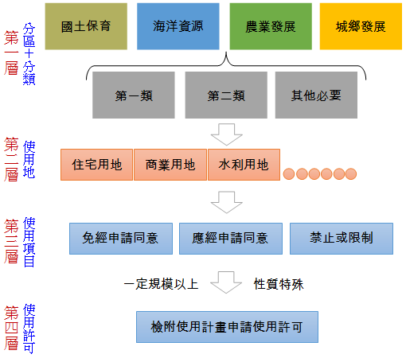

