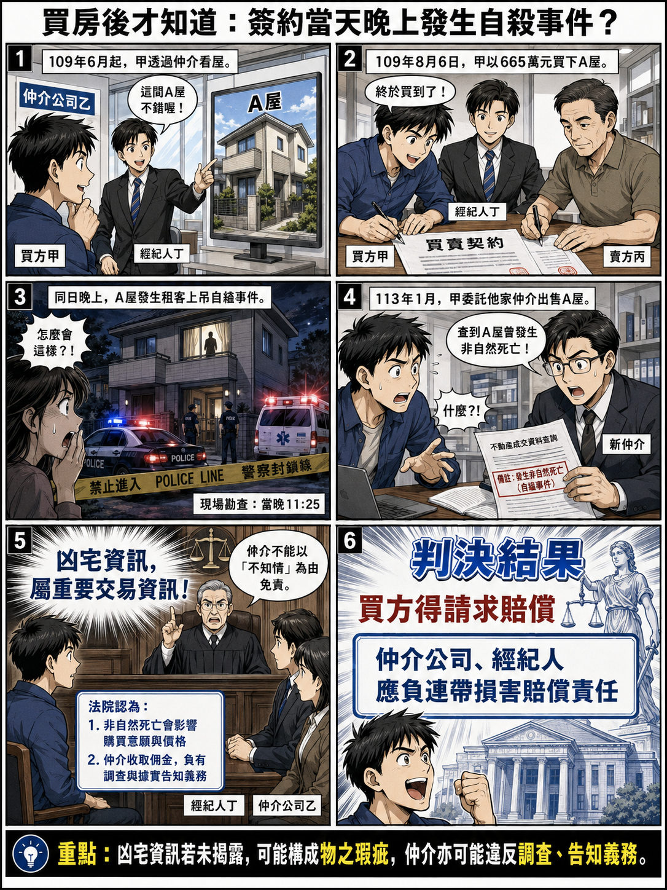

# 主題精選：凶宅

共收錄 1 篇文章。

## 1. 買房後才知道簽約當天發生自殺事件，有關仲介之凶宅資訊揭露義務
*發布日期: 2026-08-18* 

## 內文
[圖片1] 圖片來源：本專欄依據判決整理重點內容，並去識別化後，請ChatGPT生成圖片。

• 一、案例事實 甲於民國109年6月間，經由乙仲介公司居間，得知丙欲出售其所有之A屋及其基地持分，並於民國109年8月6日簽訂不動產買賣契約，買賣價格為665萬元。

嗣後，甲於民國113年1月19日委託其他仲介公司銷售A屋，經該仲介公司進行屋況調查後，發現A屋於民國109年8月6日晚上10時38分，有租客於屋內上吊自縊之情事，現場勘查時間為同日晚上11時25分。

甲主張，A屋買賣契約所附之房地產標的現況說明書，對於持有期間是否曾發生非自然死亡情形，或本標的是否曾發生非自然死亡情形，均未記載。於簽約後至繳清尾款、完稅，甚至辦妥移轉登記交屋前，丙、乙仲介公司及其經紀人員丁，亦均未就此一情形如實說明。甲若知悉此重大瑕疵，絕無意願購買A屋。

丙則抗辯，其出售A屋時完全不知有租客上吊自縊之事；縱有甲所述之事，甲於交屋後正常使用A屋經營安親班、補習班已近四年之久，期間一切如常，並無物之瑕疵，亦未影響通常效用。

乙仲介公司及丁則抗辯，甲於6月至7月間看屋多次，至8月6日與前屋主見面議價敲定成交價格；其等至收受法院通知時才知道此事，並無知情未告知之情形。

試問：A屋於簽約當日發生租客上吊自縊事件，買受人於數年後出售時才查知，得否向出賣人請求減少價金？仲介公司及經紀人員是否應負違反調查、據實告知義務之損害賠償責任？

• 二、相關法條 (一)民法第567條：「居間人關於訂約事項，應就其所知，據實報告於各當事人。對於顯無履行能力之人，或知其無訂立該約能力之人，不得為其媒介。以居間為營業者，關於訂約事項及當事人之履行能力或訂立該約之能力，有調查之義務。」 (二)不動產經紀業管理條例第4條第5款：「仲介業務，係指從事不動產買賣、互易、租賃之居間或代理業務。」 (三)不動產經紀業管理條例第24條之2第3款、第4款：「經營仲介業務者經買賣或租賃雙方當事人之書面同意，得同時接受雙方之委託，並依下列規定辦理：一、公平提供雙方當事人類似不動產之交易價格。二、公平提供雙方當事人有關契約內容規範之說明。三、提供買受人或承租人關於不動產必要之資訊。四、告知買受人或承租人依仲介專業應查知之不動產之瑕疵。五、協助買受人或承租人對不動產進行必要之檢查。六、其他經中央主管機關為保護買賣或租賃當事人所為之規定。」 (四)不動產經紀業管理條例第26條第2項：「經紀業因經紀人員執行仲介或代銷業務之故意或過失致交易當事人受損害者，該經紀業應與經紀人員負連帶賠償責任。」

• 三、重要判決觀念 (一)凶宅雖無法律上定義，但依交易慣例係指曾發生凶殺或自殺致死之房屋 非自然身故情事之房屋即一般所稱之凶宅，雖無法律上之定義，然依一般不動產買賣之交易慣例，係指曾發生凶殺或自殺致死之情事之房屋。

• (二) 非自然身故情事雖未造成物理性損傷，仍會影響購買意願及購買價格，造成經濟性價值減損，應認屬物之瑕疵 此一因素，雖或未對此類房屋造成直接物理性之損傷，惟就一般社會大眾言，仍屬於心理層面嫌惡狀況，對居住於其內之住戶而言，除對居住品質會發生疑慮外，在心理層面止亦會造成相當大之負面影響。…因此，在房地產交易市場及實務經驗中，具有非自然身故情事之房屋，會嚴重影響購買意願及購買價格，亦造成該等房屋之市場接受程度及價格之低落情事。…非自然身故之情事，將對不動產之個別條件產生負面影響，造成經濟性之價值減損，進而影響其市場價格，應認屬物之瑕疵。

• (三) 仲介業者收取佣金，應負善盡預見危險及調查之義務 仲介業之業務，涉及房地買賣之專業知識，一般之消費者委由仲介業者處理買賣事宜。而仲介業者針對其所為之仲介行為，既向消費者收取高額之佣金，應就其所從事之業務負善盡預見危險及調查之義務。…因此，丁、乙仲介公司對於買賣A屋之必要資訊負有調查及誠實告知買受人即甲之義務。經查，A屋於109年8月6日發生租客上吊自縊之情形，已如前述，A屋於109年9月25日始交屋，丁、乙仲介公司自應有據實查證之義務，丁收受報酬，自應有詳實查證之義務，卻疏於查證，自難以不知情為由。

• (四) 仲介人員違反據實告知及調查義務，仲介公司應連帶負損害賠償責任 經紀人丁自有違反據實告知之義務，違反民法第567條居間人應據實告知及調查義務，並違反不動產經紀業管理條例第24之2條第3款提供買受人必要之資訊，自係違反保護他人之法律，甲依據民法第184條第2項規定，請求丁應負損害賠償責任；依不動產經紀業管理條例第26條第2項規定，請求丁、乙仲介公司應負連帶損害賠償責任，應屬有據。

• (五) 出賣人與仲介業者對買受凶宅之損害，性質上屬不真正連帶債務 丙、丁、乙仲介公司分別基於請求減少價金、違反居間義務之原因，就甲買受凶宅之損害各負全部給付義務，性質上屬不真正連帶債務，則丙及丁、乙仲介公司，如任一人為給付者，另一人於該給付範圍內免給付之責。

• 四、結論 本件甲向丙購買A屋後，於數年後委託其他仲介銷售時，才發現A屋於簽約當日晚上發生租客上吊自縊事件。法院認為，具有非自然身故情事之房屋，雖未造成直接物理性損傷，但就一般社會大眾而言，仍屬心理層面嫌惡狀況，會嚴重影響購買意願、購買價格及市場接受程度，並造成經濟性價值減損，應認屬物之瑕疵。

就仲介責任部分，法院認為，仲介業者涉及房地買賣專業知識，且向消費者收取高額佣金，應就其所從事之業務負善盡預見危險及調查之義務。A屋於民國109年8月6日發生租客上吊自縊，並於民國109年9月25日始交屋，丁及乙仲介公司自應有據實查證之義務。丁收受報酬，卻疏於查證，自難以不知情為由免責。

因此，法院認為，丁違反民法第567條居間人據實告知及調查義務，並違反不動產經紀業管理條例第24條之2第3款提供買受人必要資訊之義務，甲得依民法第184條第2項請求丁負損害賠償責任，並依不動產經紀業管理條例第26條第2項，請求丁及乙仲介公司負連帶損害賠償責任。

資料來源：臺灣新北地方法院113年度訴字第520號民事判決。

## 文章圖片

---
*注：本文圖片存放於 ./images/ 目錄下*

