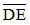
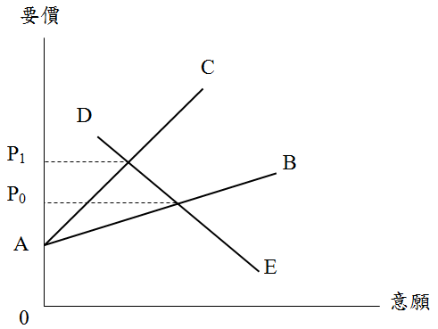

# 都市更新整合不易成功之原因,許文昌老師

## 文章資訊
- 文章編號：409208
- 作者：許文昌
- 發布日期：2016/12/29
- 爬取時間：2025-02-02 20:23:55
- 原文連結：[閱讀原文](https://real-estate.get.com.tw/Columns/detail.aspx?no=409208)

## 內文
推動都市更新過程中，有的住戶較積極，有的住戶較消極。前者稱為積極型住戶，後者稱為消極型住戶。

1. 積極型住戶，配合度較高，希望能促成都更案，故其參與都市更新之意願曲線，彈性較大，如圖之[圖片1]。

2. 消極型住戶，配合度較低，甚至會有拿翹行為，故其參與都市更新之意願曲線，彈性較小，如圖之[圖片2]。

另，實施者因住戶要價愈高，推動都更案之意願愈低；因住戶要價愈低，推動都更案之意願愈高。因此，實施者推動都更案之意願曲線，如圖之[圖片3]。

由[圖片4]與[圖片5]之交點，決定積極型住戶之協商要價為P0。[圖片6]與[圖片7]之交點，決定消極型住戶之協商要價為P1。由此可知，積極型住戶之協商要價較低，消極型住戶之協商要價較高。換個角度分析，相同不動產分配標準，要價低之積極型住戶贊成，要價高之消極型住戶反對，造成都市更新整合不易成功。

[圖片8]

## 文章圖片

---
*注：本文圖片存放於 ./images/ 目錄下*
