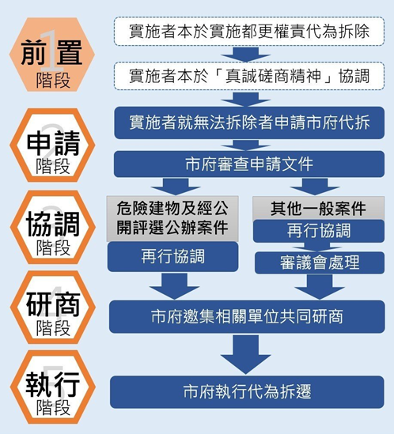

# 都市更新代拆規定,曾榮耀老師

## 文章資訊
- 文章編號：419124
- 作者：蘇偉強
- 發布日期：2020/07/09
- 爬取時間：2025-02-02 20:57:34
- 原文連結：[閱讀原文](https://real-estate.get.com.tw/Columns/detail.aspx?no=419124)

## 內文
各位同學好

今日專欄為各位同學說明都市更新條例第57條第1項有關都市更新權利變換代拆機制：

1. 權利變換範圍內應行拆除或遷移之土地改良物，由實施者依主管機關公告之權利變換計畫通知其所有權人、管理人或使用人，限期三十日內自行拆除或遷移；屆期不拆除或遷移者，依下列順序辦理：(1)由實施者予以代為之。(2)由實施者請求當地直轄市、縣（市）主管機關代為之。說明：權利變換計畫經主管機關核定發布實施，即對範圍內相對人、關係人及行政機關產生規制效力，應行拆除或遷移之土地改良物應自行拆除。如不拆則依順序由實施者先行協調代拆，如協調不成，則請求直轄市、縣（市）主管機關代拆。

2. 實施者依前項第一款規定代為拆除或遷移前，應就拆除或遷移之期日、方式、安置或其他拆遷相關事項，本於真誠磋商精神予以協調，並訂定期限辦理拆除或遷移；說明：(1)實施者協調，實務又稱為「私調」。(2)所謂「真誠磋商精神」係按「公民與政治權利國際公約」、「經濟社會文化權利國際公約」兩公約提到任何人的居住權皆應受到保護，免受「無理或非法侵擾」，至於受到驅逐者應有之八項保障內容中，有一項即提到「應讓那些受影響的人有一個真正磋商的機會」。

3. 協調不成者，由實施者依前項第二款規定請求直轄市、縣（市）主管機關代為之；直轄市、縣（市）主管機關受理前項第二款之請求後應再行協調，再行協調不成者，直轄市、縣（市）主管機關應訂定期限辦理拆除或遷移。說明：(1)直轄市、縣（市）主管機關再行協調，實務又稱為「公調」。(2)注意私調、公調不是各僅限於一次，例如新北市新店區寶強路都更案，建商自行協調有6次、公部門再行協調2次。(3)透過政府公開、透明的協商制度減少爭議。代拆可視為基於公共利益考量下公權力強行介入，加速都市更新辦理，保障同意戶、實施者之儘速重建權益，但也應於協調過程中確保不同意戶之權益（亦即應同時兼顧同意戶、實施者與不同意戶三方之權益）。

4. 但由直轄市、縣（市）主管機關自行實施者，得於協調不成時逕為訂定期限辦理拆除或遷移，不適用再行協調之規定。說明：由直轄市、縣（市）主管機關自行實施，已本身自屬實施者辦理協調，即不須再行協調。

又同條第四項授權各地方政府自行訂定自治法規，可參考新北市「新北市都市更新權利變換實施者申請拆除或遷移土地改良物辦法」之執行程序，如下圖所示：其程序為：實施者私調→申請代拆→縣市政府公調→內部研商→執行代拆其中：

1. 實施者應召開一次以上協調會議（私調），而經待拆戶累計三次未到場協調者，視為協調不成立。

2. 縣市政府再行協調會議（公調），以召開二次為原則。待拆戶未出席再行協調會議累計達二次者，視為再行協調不成立。

3. 內部研商指召集有關機關、公用事業及實施者研商拆遷之執行方式，並會同實施者現地查核。

[圖片1]

## 文章圖片

---
*注：本文圖片存放於 ./images/ 目錄下*
