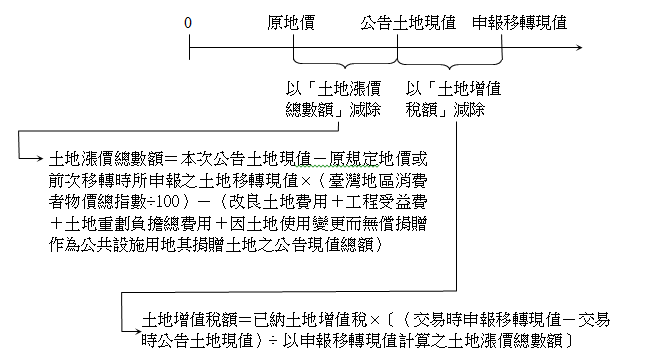

# 重複課稅之處理,許文昌老師

## 文章資訊
- 文章編號：904456
- 作者：許文昌
- 發布日期：2022/06/02
- 爬取時間：2025-02-02 19:45:42
- 原文連結：[閱讀原文](https://real-estate.get.com.tw/Columns/detail.aspx?no=904456)

## 內文
公共工程建設造成地價增漲，地價增漲造成所得提高。因此，工程受益費、土地增值稅、房地合一所得稅三者之課稅基礎密切相關。

工程受益費於工程開工後徵收，土地增值稅於辦理土地移轉登記前徵收，房地合一所得稅於辦竣房地移轉登記後徵收。換言之，先課徵工程受益費，再課徵土地增值稅，最後課徵房地合一所得稅。

現行採取下列處理方法，以避免重複課稅：

(一)工程受益費於土地漲價總數額減除。亦即：

土地漲價總數額＝申報土地移轉現值－原規定地價或前次移轉時所申報之土地移轉現值×（臺灣地區消費者物價總指數÷100）－（改良土地費用＋工程受益費＋土地重劃負擔總費用＋因土地使用變更而無償捐贈作為公共設施用地其捐贈土地之公告現值總額）

值得探討的是，工程受益費相當於準土地增值稅，卻在土地增值稅之稅基減除。換言之，工程受益費宜改為在土地增值稅之稅額減除才是。

(二)土地漲價總數額於房地交易所得減除。詳言之：

1. 依公告土地現值計算之土地漲價總數額於房地交易所得減除。

2. 超過公告土地現值部分所計算之土地增值稅於房地交易所得減除。

總之，土地增值稅之稅基（即土地漲價總數額）於房地合一所得稅之稅基（即房地交易所得）減除。惟為避免納稅義務人高報移轉現值，以適用較低土地增值稅率，逃避適用較高所得稅率。因此，就超過公告土地現值之申報移轉現值部分，不採土地增值稅之稅基，而採土地增值稅之稅額，於房地合一所得稅之稅基減除。如下圖所示。

[圖片1]

## 文章圖片

---
*注：本文圖片存放於 ./images/ 目錄下*
