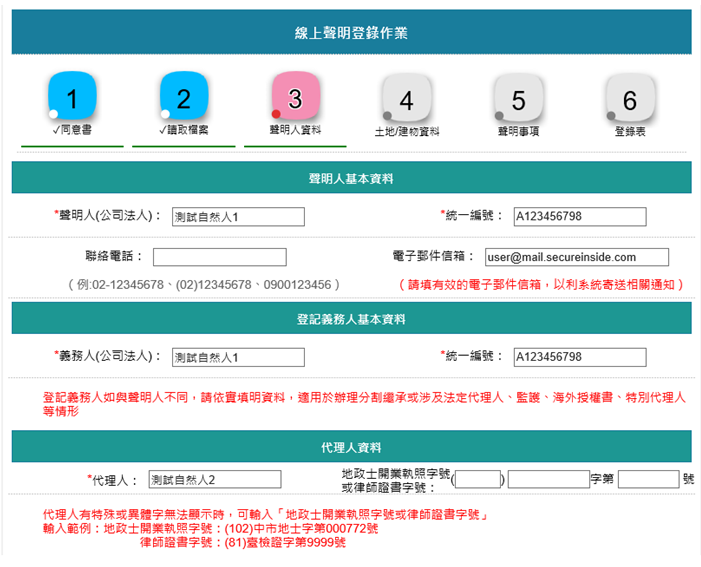
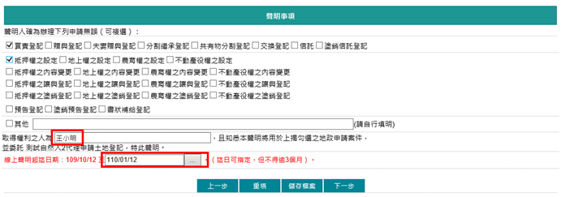
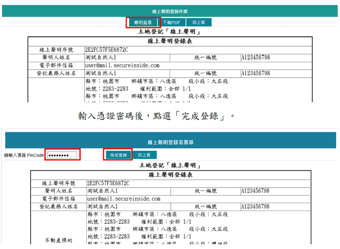
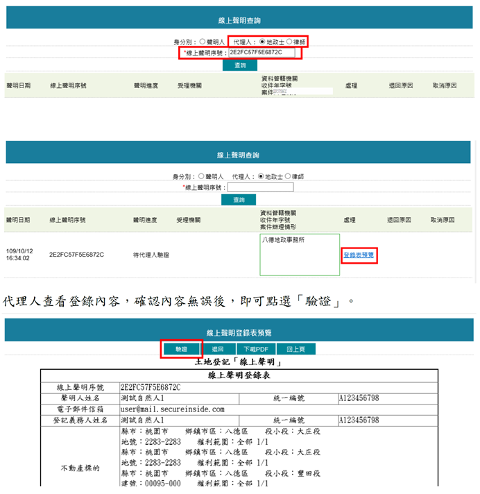

# 土地登記線上聲明之作業,曾榮耀老師

## 文章資訊
- 文章編號：904745
- 作者：蘇偉強
- 發布日期：2022/06/28
- 爬取時間：2025-02-02 19:46:40
- 原文連結：[閱讀原文](https://real-estate.get.com.tw/Columns/detail.aspx?no=904745)

## 內文
一、意義

聲明人藉由線上聲明登錄以表明不動產處分真意，可作為免當事人親自到場措施。因此，採用線上聲明措施，當事人只要透過自然人憑證上網登錄資訊，由地政士或律師核對身分後驗證聲明，即可不必再親自到地政事務所核對身分或至戶政事務所申請印鑑證明，節省民眾時間與金錢。

二、作業步驟

(一)聲明登錄

所有權人若為自然人，可使用「自然人憑證」登入系統辦理；若為公司法人，可使用「工商憑證」登入系統辦理。

聲明事項：

1. 不動產標的

2. 辦理事項（登記原因）

3. 取得權利人

4. 委託代理人

5. 聲明期限

(二)聲明驗證

提供專業代理人(地政士或律師)輸入聲明人提供的聲明序號，以電子簽章方式完成聲明驗證，系統並可產製經代理人驗證完成之線上聲明登錄表，以利登記案件附案或留存。

(三)申請登記

完成線上聲明登錄及驗證後，登記案件送件請於申請書載明聲明序號或將登錄表附案，併同其他應附文件由代理人向登記機關送件申請登記。

搭配全程網路申請方式，甚至可不用至地政事務所送件。

[圖片1]

圖1：聲明人與登記義務人資料參考圖示（自然人）

[圖片2]

圖2：聲明事項參考圖示

[圖片3]

## 文章圖片

---
*注：本文圖片存放於 ./images/ 目錄下*
