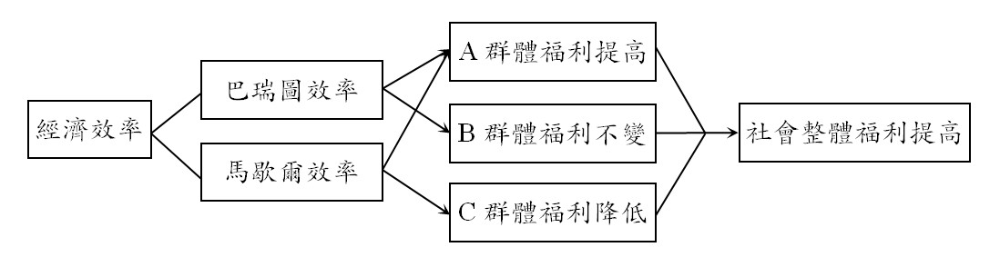

# 巴瑞圖經濟效率與馬歇爾經濟效率,許文昌老師

## 文章資訊
- 文章編號：907523
- 作者：許文昌
- 發布日期：2023/03/30
- 爬取時間：2025-02-02 19:57:26
- 原文連結：[閱讀原文](https://real-estate.get.com.tw/Columns/detail.aspx?no=907523)

## 內文
(一)巴瑞圖經濟效率

一項政策之實施，某些人福利增加，另一些人福利不變，稱為巴瑞圖經濟效率（Pareto Efficiency）。

(二)馬歇爾經濟效率

一項政策之實施，某些人福利增加，另一些人福利減少，但總受益大於總受損，淨效益大於零，稱為馬歇爾經濟效率（Marshall Efficiency）。

(三)兩者關係

1. 一項政策之實施，如果符合巴瑞圖經濟效率之要求，必定符合馬歇爾經濟效率之要求。相反地，一項政策之實施，如果符合馬歇爾經濟效率之要求，不一定符合巴瑞圖經濟效率之要求。換言之，巴瑞圖經濟效率涵蓋馬歇爾經濟效率。

2. 政府推行一項政策，當以符合巴瑞圖經濟效率為最佳。無法符合巴瑞圖經濟效率，始退而求其次，至少須符合馬歇爾經濟效率。如果連馬歇爾經濟效率都無法符合，則該項政策不值得採行。

(四)舉例

1. 市地重劃與土地徵收之比較：政府取得公共設施用地（如道路、公園、學校等）可採用市地重劃或土地徵收。市地重劃基於使用者付費及受益者負擔精神，符合馬歇爾經濟效率，亦符合巴瑞圖經濟效率。土地徵收以市價補償，雖造成社會大多數人福利增加，但造成被徵收地主福利減少，不符合巴瑞圖經濟效率，但符合馬歇爾經濟效率。

2. 協議價購與土地徵收之比較：政府取得建設用地可採協議價購或土地徵收。協議價購採雙方合意，符合馬歇爾經濟效率，亦符合巴瑞圖經濟效率。土地徵收以市價補償，雖造成社會大多數人福利增加，但造成被徵收地主福利減少，不符合巴瑞圖經濟效率，但符合馬歇爾經濟效率。

3. 土地徵收市價補償與高於市價補償之比較：政府取得公共事業用地可採市價補償或高於市價補償。如採市價補償，基於土地徵收稟賦效果（endowment effect）（指損失土地的痛苦遠大於獲得土地的快樂），造成被徵收地主福利減少，不符合巴瑞圖經濟效率，但符合馬歇爾經濟效率。但如採高於市價補償，使原地主於徵收前與徵收後之福利水準不變，則符合馬歇爾經濟效率，亦符合巴瑞圖經濟效率。

(五)結論

1. 巴瑞圖經濟效率優於馬歇爾經濟效率。因此，政府施政應追求巴瑞圖經濟效率；無法達成巴瑞圖經濟效率時，始追求馬歇爾經濟效率。

2. 政府採市地重劃取得公共設施用地，可以符合巴瑞圖經濟效率。但如採市價徵收取得公共設施用地，僅能符合馬歇爾經濟效率，無法符合巴瑞圖經濟效率。

3. 政府如採協議價購取得建設土地，可以符合巴瑞圖經濟效率。但如採市價徵收取得建設土地，僅能符合馬歇爾經濟效率，無法符合巴瑞圖經濟效率。

4. 政府採市價補償取得公共事業用地，僅能符合馬歇爾經濟效率，無法符合巴瑞圖經濟效率。但如採高於市價取得公共設施用地（設原地主於徵收前與徵收後之福利水準無差異），可以符合巴瑞圖經濟效率。

[圖片1]

## 文章圖片

---
*注：本文圖片存放於 ./images/ 目錄下*
