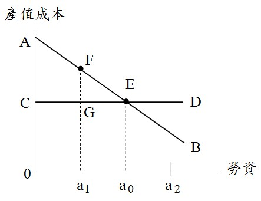

# 地價與土地集約度之關係,許文昌老師

## 文章資訊
- 文章編號：910031
- 作者：許文昌
- 發布日期：2023/12/21
- 爬取時間：2025-02-02 20:07:02
- 原文連結：[閱讀原文](https://real-estate.get.com.tw/Columns/detail.aspx?no=910031)

## 內文
土地集約度分為經濟集約度與法定集約度二種。前者指土地在無容積管制下，獲致最大利潤之集約度；後者指土地在容積管制下之集約度。

(一)地價影響經濟集約度：地價愈高，吾人將以勞資代替土地，因而土地集約度（指經濟集約度）提高。如圖(一)所示，有一塊土地，M代表等產量曲線（即使用土地及勞資二種生產要素可以興建一定樓地板面積）。

1. 當地價為P0時，等成本線為[圖片1] 。M與[圖片2]之切點R，決定土地投入量a0，勞資投入量b0，土地集約度為（b0/a0） ，此時興建透天厝產品。

2. 當地價上漲為P1時，等成本線由[圖片3]移至[圖片4] 。將[圖片5]平行外移至[圖片6]，且切在等產量曲線上，切點S，決定土地投入量a1，勞資投入量b1，土地集約度提高為（b1/a1），此時興建公寓產品。

[圖片7]

圖(一) 地價影響經濟集約度

3. 當地價再上漲為P2時，等成本線由[圖片8]移至[圖片9]。將[圖片10]平行外移至[圖片11]，且切在等產量曲線上，切點T，決定土地投入量a2，勞資投入量b2，土地集約度再提高為 ，此時興建高樓大廈產品。

綜上，地價不斷上漲，土地集約度（指經濟集約度）隨之提高。因此，地價會影響經濟集約度，但經濟集約度不會影響地價。此外，從一個都市發展歷程而言，起先興建透天厝，接著興建公寓，最後興建高樓大廈。

(二)法定集約度影響地價：政府以建蔽率、容積率等手段，限制土地集約度，以確保良好生活環境。如圖(二)所示，[圖片12]代表建築投資之邊際產值曲線，[圖片13]代表建築投資之邊際要素成本曲線（不包含土地成本）。由[圖片14]與[圖片15]之交點E，決定勞資投入量a0，此即經濟集約度，此時地價為△AEC（地價之決定同不動產估價技術規則第70條規定）。

1. 當法定集約度為a1（即勞資投入量限制在a1以下）時，經濟集約度a0大於法定集約度a1，土地利用以法定集約度a1為準。此時地價下跌至□AFGC。

2. 當法定集約度為a2（即勞資投入量限制在a2以下）時，經濟集約度a0小於法定集約度a2，土地利用以經濟集約度a0為準。此時地價仍為△AEC，不受影響。

[圖片16]

圖(二) 法定集約度影響地價

綜上，當經濟集約度大於法定集約度時，法定集約度會影響地價，但地價不會影響法定集約度。當經濟集約度小於法定集約度時，法定集約度不會影響地價。

一般而言，都市繁榮地區經濟集約度大於法定集約度，土地利用以法定集約度為準，此時容積率用完；鄉村偏遠地區，經濟集約度小於法定集約度，土地利用以經濟集約度為準，此時容積率未用完。

## 文章圖片

---
*注：本文圖片存放於 ./images/ 目錄下*
